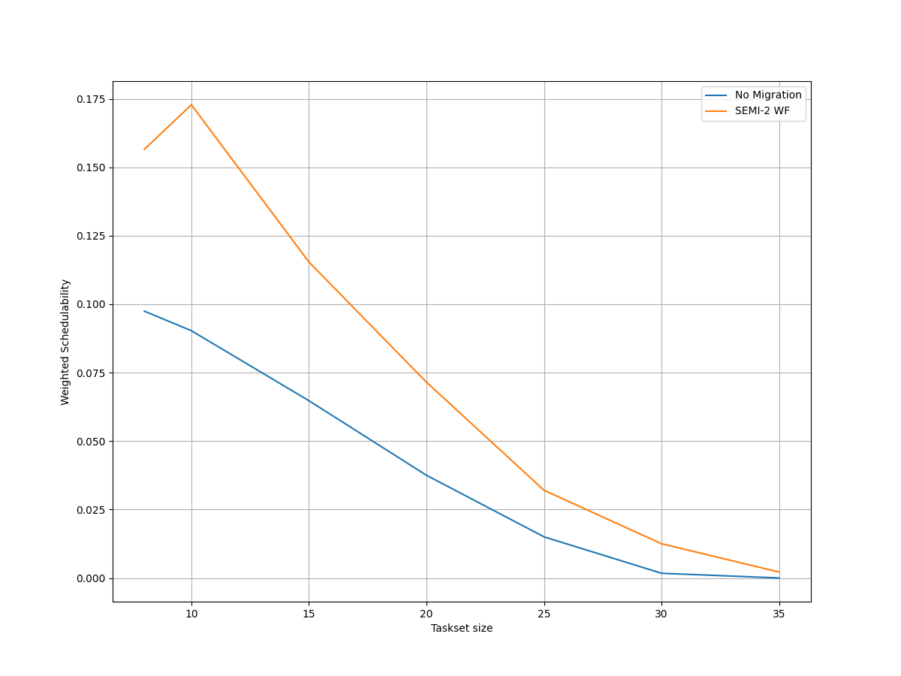
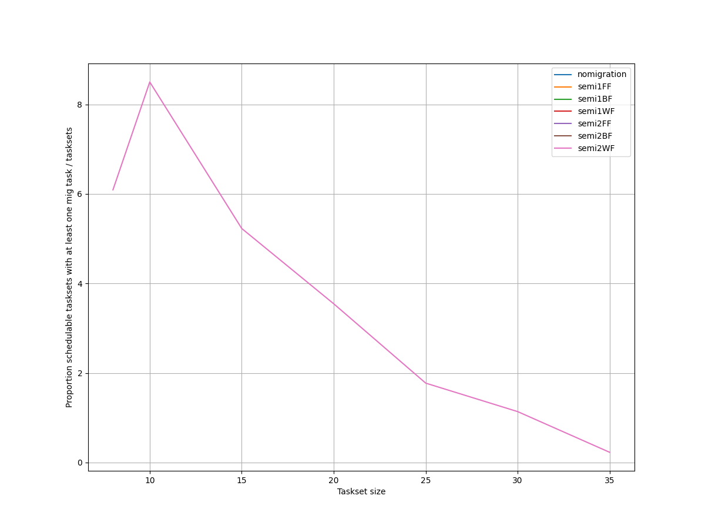
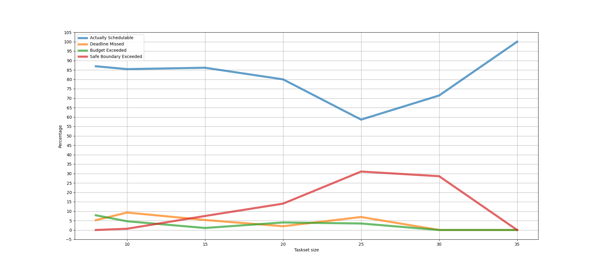
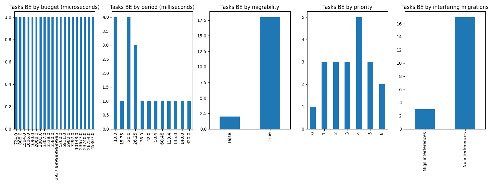
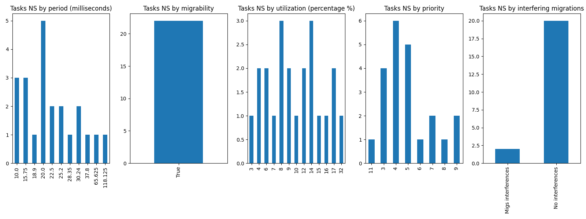
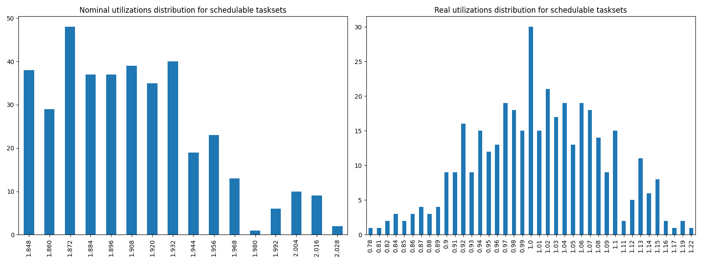

# Report on Experiment 4

## Overall data

   Utilization range = [1.848, 2.1] with step = 0.012

 Taskset sizes = [8, 10, 15, 20, 25, 30, 35]

| Schedulable | Not schedulable | Budget Exceeded | Safe Boundary Exceeded |
| ------ | ------ | ------ | ------ |
| 83.19% | 6.03% | 4.31% | 6.47% |

Number of executions: 464

Schedulable executions: 386/464 = 83.1896551724138 %

_Not_ schedulable executions: 28/464 = 6.0344827586206895 %

Budget Exceeded executions: 20/464 = 4.310344827586207 %

Safe Boundary Exceeded executions: 30/464 = 6.4655172413793105 %

NS + BE executions: 48/464 = 10.344827586206897 %

### **Simulations**

#### **Weighted schedulability experiment 4 according to simulations.**

#### **Percentage of (schedulable tasksets with at least one migrating tasks / number of schedulable tasksets) of experiment 4 according to simulations.** 

 

### **Real Executions**

#### **Schedulability for each level**

#### **Tasksets, grouped by differents parameters, with a Budget_Exceeded task.**

#### **Tasksets, grouped by differents parameters, with at least one task missing one (or more) of its deadlines.**

### **Nominal utilizations VS Real utilizations about schedulable tasksets**

| Average real utilizations | Variance real utilizations | Min | Max |
| ------ | ------ | ------ | ------ |
| 1.010 | 0.006 | 0.780 | 1.220 |
## Bad tasksets

Click here to expand this section.

### **Not schedulable tasksets**

Click here to expand this section.

Ovvero quando almeno un task non completa entra almeno una sua deadline.

  1. Taskset **e4_semi2wf_t1340**

    Taskset execution params:
	 
    "id": "e4_semi2wf_t1340",
    "size": "8",
    "utilization": "2.004",
    "realutilization": 0.88,
    "criticality_factor": "2",
    "hicrit_proportion": "0.5"

   
 
Click here to see the deadlines missed tasks list.

   Time values are expressed as **micro-seconds**.

Task:  1

    
    "id": " 1",
    "basecpu": " 1",
    "priority": " 3",
    "period": 22500.0,
    "C(LO)": 2182.0,
    "C(HI)": 2182.0,
    "criticality": "LOW",
    "migrable": "True",
    "completedruns": " 892",
    "preemptions": " 0",
    "minresponsejitter": " 0.000000000",
    "maxresponsejitter": " 0.000990742",
    "minreleasejitter": " 0.000000000",
    "maxreleasejitter": " 21.025006787",
    "avgresponsejitter": " 0.000893937",
    "deadlinesmissed": " 1",
    "deadlinemissedtargetcore": " 0",
    "deadlinemissedaftermigration": " 0",
    "budgetexceeded": " 0",
    "budgetexceededtargetcore": " 0",
    "budgetexceededaftermigration": " 0",
    "timesmigrated": " 3",
    "timesrestored": " 2",
    "timesonc1": " 886",
    "timesonc2": " 4",
    "lockedtime": " 0.000008739"

Task:  2

    
    "id": " 2",
    "basecpu": " 2",
    "priority": " 3",
    "period": 56250.0,
    "C(LO)": 8529.0,
    "C(HI)": 8529.0,
    "criticality": "LOW",
    "migrable": "True",
    "completedruns": " 166",
    "preemptions": " 1",
    "minresponsejitter": " 0.000000000",
    "maxresponsejitter": " 0.004091832",
    "minreleasejitter": " 0.000000000",
    "maxreleasejitter": " 10.225006799",
    "avgresponsejitter": " 0.003470760",
    "deadlinesmissed": " 1",
    "deadlinemissedtargetcore": " 0",
    "deadlinemissedaftermigration": " 0",
    "budgetexceeded": " 0",
    "budgetexceededtargetcore": " 0",
    "budgetexceededaftermigration": " 0",
    "timesmigrated": " 2",
    "timesrestored": " 1",
    "timesonc1": " 3",
    "timesonc2": " 162",
    "lockedtime": " 0.000006012"

   

   
 
Click here to see the CPUs log.

   Idle time is expressed as **seconds**.

   Util values are expressed as **percentage** %.

   CPU: 1

    
    "id": 1,
    "hyperperiod": 18900000,
    "lowtohigh": " 30",
    "hightolow": " 30",
    "idletime": 64719453,
    "util": 42.92817195767196

   CPU: 2

    
    "id": 2,
    "hyperperiod": 113400000,
    "lowtohigh": " 26",
    "hightolow": " 26",
    "idletime": 62844562,
    "util": 44.581514991181656

   Real Utilization: 0.88
   

   
 
Click here to see the whole tasksets.

   Time values are expressed as **micro-seconds**.

   Task:  4

    
    "id": " 4",
    "basecpu": " 1",
    "priority": " 1",
    "period": 70000.0,
    "C(LO)": 15295.0,
    "C(HI)": 30590.0,
    "criticality": "HIGH",
    "migrable": "False",
    "completedruns": " 1621",
    "preemptions": " 361",
    "minresponsejitter": " 0.000000000",
    "maxresponsejitter": " 0.029259336",
    "minreleasejitter": " 0.000000000",
    "maxreleasejitter": " 114.330006517",
    "avgresponsejitter": " 0.013021643",
    "deadlinesmissed": " 0",
    "deadlinemissedtargetcore": " 0",
    "deadlinemissedaftermigration": " 0",
    "budgetexceeded": " 16",
    "budgetexceededtargetcore": " 0",
    "budgetexceededaftermigration": " 0",
    "timesmigrated": " 0",
    "timesrestored": " 0",
    "timesonc1": " 1997",
    "timesonc2": " 0",
    "lockedtime": " 0.000013168"

   Task:  3

    
    "id": " 3",
    "basecpu": " 1",
    "priority": " 2",
    "period": 65625.0,
    "C(LO)": 10051.0,
    "C(HI)": 20102.0,
    "criticality": "HIGH",
    "migrable": "False",
    "completedruns": " 1729",
    "preemptions": " 97",
    "minresponsejitter": " 0.000000000",
    "maxresponsejitter": " 0.014460138",
    "minreleasejitter": " 0.000000000",
    "maxreleasejitter": " 114.334381676",
    "avgresponsejitter": " 0.007835150",
    "deadlinesmissed": " 0",
    "deadlinemissedtargetcore": " 0",
    "deadlinemissedaftermigration": " 0",
    "budgetexceeded": " 14",
    "budgetexceededtargetcore": " 0",
    "budgetexceededaftermigration": " 0",
    "timesmigrated": " 0",
    "timesrestored": " 0",
    "timesonc1": " 1839",
    "timesonc2": " 0",
    "lockedtime": " 0.000004024"

   Task:  8

    
    "id": " 8",
    "basecpu": " 1",
    "priority": " 0",
    "period": 540000.0,
    "C(LO)": 93699.0,
    "C(HI)": 93699.0,
    "criticality": "LOW",
    "migrable": "False",
    "completedruns": " 211",
    "preemptions": " 622",
    "minresponsejitter": " 0.000000000",
    "maxresponsejitter": " 0.119892760",
    "minreleasejitter": " 0.000000000",
    "maxreleasejitter": " 113.860006213",
    "avgresponsejitter": " 0.099998640",
    "deadlinesmissed": " 0",
    "deadlinemissedtargetcore": " 0",
    "deadlinemissedaftermigration": " 0",
    "budgetexceeded": " 0",
    "budgetexceededtargetcore": " 0",
    "budgetexceededaftermigration": " 0",
    "timesmigrated": " 0",
    "timesrestored": " 0",
    "timesonc1": " 832",
    "timesonc2": " 0",
    "lockedtime": " 0.000009886"

   Task:  1

    
    "id": " 1",
    "basecpu": " 1",
    "priority": " 3",
    "period": 22500.0,
    "C(LO)": 2182.0,
    "C(HI)": 2182.0,
    "criticality": "LOW",
    "migrable": "True",
    "completedruns": " 892",
    "preemptions": " 0",
    "minresponsejitter": " 0.000000000",
    "maxresponsejitter": " 0.000990742",
    "minreleasejitter": " 0.000000000",
    "maxreleasejitter": " 21.025006787",
    "avgresponsejitter": " 0.000893937",
    "deadlinesmissed": " 1",
    "deadlinemissedtargetcore": " 0",
    "deadlinemissedaftermigration": " 0",
    "budgetexceeded": " 0",
    "budgetexceededtargetcore": " 0",
    "budgetexceededaftermigration": " 0",
    "timesmigrated": " 3",
    "timesrestored": " 2",
    "timesonc1": " 886",
    "timesonc2": " 4",
    "lockedtime": " 0.000008739"

   Task:  6

    
    "id": " 6",
    "basecpu": " 2",
    "priority": " 1",
    "period": 120000.0,
    "C(LO)": 27586.0,
    "C(HI)": 55173.0,
    "criticality": "HIGH",
    "migrable": "False",
    "completedruns": " 946",
    "preemptions": " 287",
    "minresponsejitter": " 0.000000000",
    "maxresponsejitter": " 0.041047523",
    "minreleasejitter": " 0.000000000",
    "maxreleasejitter": " 114.280006078",
    "avgresponsejitter": " 0.022112595",
    "deadlinesmissed": " 0",
    "deadlinemissedtargetcore": " 0",
    "deadlinemissedaftermigration": " 0",
    "budgetexceeded": " 7",
    "budgetexceededtargetcore": " 0",
    "budgetexceededaftermigration": " 0",
    "timesmigrated": " 0",
    "timesrestored": " 0",
    "timesonc1": " 0",
    "timesonc2": " 1239",
    "lockedtime": " 0.000016862"

   Task:  5

    
    "id": " 5",
    "basecpu": " 2",
    "priority": " 2",
    "period": 75600.0,
    "C(LO)": 3002.0,
    "C(HI)": 6005.0,
    "criticality": "HIGH",
    "migrable": "False",
    "completedruns": " 1501",
    "preemptions": " 4",
    "minresponsejitter": " 0.000000000",
    "maxresponsejitter": " 0.006224532",
    "minreleasejitter": " 0.000000000",
    "maxreleasejitter": " 114.324405991",
    "avgresponsejitter": " 0.002339357",
    "deadlinesmissed": " 0",
    "deadlinemissedtargetcore": " 0",
    "deadlinemissedaftermigration": " 0",
    "budgetexceeded": " 19",
    "budgetexceededtargetcore": " 0",
    "budgetexceededaftermigration": " 0",
    "timesmigrated": " 0",
    "timesrestored": " 0",
    "timesonc1": " 0",
    "timesonc2": " 1523",
    "lockedtime": " 0.000003444"

   Task:  7

    
    "id": " 7",
    "basecpu": " 2",
    "priority": " 0",
    "period": 506250.0,
    "C(LO)": 151522.0,
    "C(HI)": 151522.0,
    "criticality": "LOW",
    "migrable": "False",
    "completedruns": " 225",
    "preemptions": " 640",
    "minresponsejitter": " 0.000000000",
    "maxresponsejitter": " 0.192647553",
    "minreleasejitter": " 0.000000000",
    "maxreleasejitter": " 113.893756081",
    "avgresponsejitter": " 0.147140760",
    "deadlinesmissed": " 0",
    "deadlinemissedtargetcore": " 0",
    "deadlinemissedaftermigration": " 0",
    "budgetexceeded": " 0",
    "budgetexceededtargetcore": " 0",
    "budgetexceededaftermigration": " 0",
    "timesmigrated": " 0",
    "timesrestored": " 0",
    "timesonc1": " 0",
    "timesonc2": " 864",
    "lockedtime": " 0.000022628"

   Task:  2

    
    "id": " 2",
    "basecpu": " 2",
    "priority": " 3",
    "period": 56250.0,
    "C(LO)": 8529.0,
    "C(HI)": 8529.0,
    "criticality": "LOW",
    "migrable": "True",
    "completedruns": " 166",
    "preemptions": " 1",
    "minresponsejitter": " 0.000000000",
    "maxresponsejitter": " 0.004091832",
    "minreleasejitter": " 0.000000000",
    "maxreleasejitter": " 10.225006799",
    "avgresponsejitter": " 0.003470760",
    "deadlinesmissed": " 1",
    "deadlinemissedtargetcore": " 0",
    "deadlinemissedaftermigration": " 0",
    "budgetexceeded": " 0",
    "budgetexceededtargetcore": " 0",
    "budgetexceededaftermigration": " 0",
    "timesmigrated": " 2",
    "timesrestored": " 1",
    "timesonc1": " 3",
    "timesonc2": " 162",
    "lockedtime": " 0.000006012"

   

  2. Taskset **e4_semi2wf_t1358**

    Taskset execution params:
	 
    "id": "e4_semi2wf_t1358",
    "size": "8",
    "utilization": "2.004",
    "realutilization": 0.94,
    "criticality_factor": "2",
    "hicrit_proportion": "0.5"

   
 
Click here to see the deadlines missed tasks list.

   Time values are expressed as **micro-seconds**.

Task:  1

    
    "id": " 1",
    "basecpu": " 1",
    "priority": " 4",
    "period": 15750.0,
    "C(LO)": 1165.0,
    "C(HI)": 1165.0,
    "criticality": "LOW",
    "migrable": "True",
    "completedruns": " 2744",
    "preemptions": " 0",
    "minresponsejitter": " 0.000000000",
    "maxresponsejitter": " 0.000539748",
    "minreleasejitter": " 0.000000000",
    "maxreleasejitter": " 44.186506856",
    "avgresponsejitter": " 0.000476985",
    "deadlinesmissed": " 3",
    "deadlinemissedtargetcore": " 2",
    "deadlinemissedaftermigration": " 0",
    "budgetexceeded": " 0",
    "budgetexceededtargetcore": " 0",
    "budgetexceededaftermigration": " 0",
    "timesmigrated": " 6",
    "timesrestored": " 6",
    "timesonc1": " 2719",
    "timesonc2": " 21",
    "lockedtime": " 0.000016255"

   

   
 
Click here to see the CPUs log.

   Idle time is expressed as **seconds**.

   Util values are expressed as **percentage** %.

   CPU: 1

    
    "id": 1,
    "hyperperiod": 113400000,
    "lowtohigh": " 31",
    "hightolow": " 31",
    "idletime": 64974610,
    "util": 42.70316578483245

   CPU: 2

    
    "id": 2,
    "hyperperiod": 2835000,
    "lowtohigh": " 0",
    "hightolow": " 0",
    "idletime": 55956860,
    "util": 50.655326278659615

   Real Utilization: 0.94
   

   
 
Click here to see the whole tasksets.

   Time values are expressed as **micro-seconds**.

   Task:  8

    
    "id": " 8",
    "basecpu": " 1",
    "priority": " 0",
    "period": 840000.0,
    "C(LO)": 184237.0,
    "C(HI)": 368474.0,
    "criticality": "HIGH",
    "migrable": "False",
    "completedruns": " 136",
    "preemptions": " 1429",
    "minresponsejitter": " 0.000000000",
    "maxresponsejitter": " 0.350979886",
    "minreleasejitter": " 0.000000000",
    "maxreleasejitter": " 113.561122955",
    "avgresponsejitter": " 0.189934351",
    "deadlinesmissed": " 0",
    "deadlinemissedtargetcore": " 0",
    "deadlinemissedaftermigration": " 0",
    "budgetexceeded": " 1",
    "budgetexceededtargetcore": " 0",
    "budgetexceededaftermigration": " 0",
    "timesmigrated": " 0",
    "timesrestored": " 0",
    "timesonc1": " 1565",
    "timesonc2": " 0",
    "lockedtime": " 0.000043604"

   Task:  2

    
    "id": " 2",
    "basecpu": " 1",
    "priority": " 1",
    "period": 33750.0,
    "C(LO)": 6334.0,
    "C(HI)": 12669.0,
    "criticality": "HIGH",
    "migrable": "False",
    "completedruns": " 3361",
    "preemptions": " 517",
    "minresponsejitter": " 0.000000000",
    "maxresponsejitter": " 0.017667637",
    "minreleasejitter": " 0.000000000",
    "maxreleasejitter": " 114.366256423",
    "avgresponsejitter": " 0.005234057",
    "deadlinesmissed": " 0",
    "deadlinemissedtargetcore": " 0",
    "deadlinemissedaftermigration": " 0",
    "budgetexceeded": " 30",
    "budgetexceededtargetcore": " 0",
    "budgetexceededaftermigration": " 0",
    "timesmigrated": " 0",
    "timesrestored": " 0",
    "timesonc1": " 3907",
    "timesonc2": " 0",
    "lockedtime": " 0.000014468"

   Task:  5

    
    "id": " 5",
    "basecpu": " 1",
    "priority": " 3",
    "period": 100000.0,
    "C(LO)": 8005.0,
    "C(HI)": 8005.0,
    "criticality": "LOW",
    "migrable": "False",
    "completedruns": " 1135",
    "preemptions": " 165",
    "minresponsejitter": " 0.000000000",
    "maxresponsejitter": " 0.007016369",
    "minreleasejitter": " 0.000000000",
    "maxreleasejitter": " 114.300006787",
    "avgresponsejitter": " 0.006218468",
    "deadlinesmissed": " 0",
    "deadlinemissedtargetcore": " 0",
    "deadlinemissedaftermigration": " 0",
    "budgetexceeded": " 0",
    "budgetexceededtargetcore": " 0",
    "budgetexceededaftermigration": " 0",
    "timesmigrated": " 0",
    "timesrestored": " 0",
    "timesonc1": " 1299",
    "timesonc2": " 0",
    "lockedtime": " 0.000007523"

   Task:  1

    
    "id": " 1",
    "basecpu": " 1",
    "priority": " 4",
    "period": 15750.0,
    "C(LO)": 1165.0,
    "C(HI)": 1165.0,
    "criticality": "LOW",
    "migrable": "True",
    "completedruns": " 2744",
    "preemptions": " 0",
    "minresponsejitter": " 0.000000000",
    "maxresponsejitter": " 0.000539748",
    "minreleasejitter": " 0.000000000",
    "maxreleasejitter": " 44.186506856",
    "avgresponsejitter": " 0.000476985",
    "deadlinesmissed": " 3",
    "deadlinemissedtargetcore": " 2",
    "deadlinemissedaftermigration": " 0",
    "budgetexceeded": " 0",
    "budgetexceededtargetcore": " 0",
    "budgetexceededaftermigration": " 0",
    "timesmigrated": " 6",
    "timesrestored": " 6",
    "timesonc1": " 2719",
    "timesonc2": " 21",
    "lockedtime": " 0.000016255"

   Task:  6

    
    "id": " 6",
    "basecpu": " 1",
    "priority": " 2",
    "period": 141750.0,
    "C(LO)": 7114.0,
    "C(HI)": 7114.0,
    "criticality": "LOW",
    "migrable": "False",
    "completedruns": " 801",
    "preemptions": " 45",
    "minresponsejitter": " 0.000000000",
    "maxresponsejitter": " 0.012102967",
    "minreleasejitter": " 0.000000000",
    "maxreleasejitter": " 114.258256580",
    "avgresponsejitter": " 0.005803967",
    "deadlinesmissed": " 0",
    "deadlinemissedtargetcore": " 0",
    "deadlinemissedaftermigration": " 0",
    "budgetexceeded": " 0",
    "budgetexceededtargetcore": " 0",
    "budgetexceededaftermigration": " 0",
    "timesmigrated": " 0",
    "timesrestored": " 0",
    "timesonc1": " 845",
    "timesonc2": " 0",
    "lockedtime": " 0.000010144"

   Task:  3

    
    "id": " 3",
    "basecpu": " 2",
    "priority": " 2",
    "period": 37800.0,
    "C(LO)": 10994.0,
    "C(HI)": 21989.0,
    "criticality": "HIGH",
    "migrable": "False",
    "completedruns": " 3001",
    "preemptions": " 4",
    "minresponsejitter": " 0.000000000",
    "maxresponsejitter": " 0.009202529",
    "minreleasejitter": " 0.000000000",
    "maxreleasejitter": " 114.362206018",
    "avgresponsejitter": " 0.008456369",
    "deadlinesmissed": " 0",
    "deadlinemissedtargetcore": " 0",
    "deadlinemissedaftermigration": " 0",
    "budgetexceeded": " 0",
    "budgetexceededtargetcore": " 0",
    "budgetexceededaftermigration": " 0",
    "timesmigrated": " 0",
    "timesrestored": " 0",
    "timesonc1": " 0",
    "timesonc2": " 3004",
    "lockedtime": " 0.000034381"

   Task:  7

    
    "id": " 7",
    "basecpu": " 2",
    "priority": " 0",
    "period": 405000.0,
    "C(LO)": 15291.0,
    "C(HI)": 30582.0,
    "criticality": "HIGH",
    "migrable": "False",
    "completedruns": " 281",
    "preemptions": " 121",
    "minresponsejitter": " 0.000000000",
    "maxresponsejitter": " 0.045987655",
    "minreleasejitter": " 0.000000000",
    "maxreleasejitter": " 113.995005985",
    "avgresponsejitter": " 0.018831868",
    "deadlinesmissed": " 0",
    "deadlinemissedtargetcore": " 0",
    "deadlinemissedaftermigration": " 0",
    "budgetexceeded": " 0",
    "budgetexceededtargetcore": " 0",
    "budgetexceededaftermigration": " 0",
    "timesmigrated": " 0",
    "timesrestored": " 0",
    "timesonc1": " 0",
    "timesonc2": " 401",
    "lockedtime": " 0.000018222"

   Task:  4

    
    "id": " 4",
    "basecpu": " 2",
    "priority": " 1",
    "period": 94500.0,
    "C(LO)": 31038.0,
    "C(HI)": 31038.0,
    "criticality": "LOW",
    "migrable": "False",
    "completedruns": " 1201",
    "preemptions": " 604",
    "minresponsejitter": " 0.000000000",
    "maxresponsejitter": " 0.034235511",
    "minreleasejitter": " 0.000000000",
    "maxreleasejitter": " 114.305506084",
    "avgresponsejitter": " 0.028144529",
    "deadlinesmissed": " 0",
    "deadlinemissedtargetcore": " 0",
    "deadlinemissedaftermigration": " 0",
    "budgetexceeded": " 0",
    "budgetexceededtargetcore": " 0",
    "budgetexceededaftermigration": " 0",
    "timesmigrated": " 0",
    "timesrestored": " 0",
    "timesonc1": " 0",
    "timesonc2": " 1804",
    "lockedtime": " 0.000049649"

   

  3. Taskset **e4_semi2wf_t2341**

    Taskset execution params:
	 
    "id": "e4_semi2wf_t2341",
    "size": "10",
    "utilization": "1.860",
    "realutilization": 1.01,
    "criticality_factor": "2",
    "hicrit_proportion": "0.5"

   
 
Click here to see the deadlines missed tasks list.

   Time values are expressed as **micro-seconds**.

Task:  1

    
    "id": " 1",
    "basecpu": " 1",
    "priority": " 5",
    "period": 26250.0,
    "C(LO)": 3357.0,
    "C(HI)": 3357.0,
    "criticality": "LOW",
    "migrable": "True",
    "completedruns": " 4321",
    "preemptions": " 1",
    "minresponsejitter": " 0.000000000",
    "maxresponsejitter": " 0.001534459",
    "minreleasejitter": " 0.000000000",
    "maxreleasejitter": " 114.373756045",
    "avgresponsejitter": " 0.001369423",
    "deadlinesmissed": " 6",
    "deadlinemissedtargetcore": " 2",
    "deadlinemissedaftermigration": " 0",
    "budgetexceeded": " 0",
    "budgetexceededtargetcore": " 0",
    "budgetexceededaftermigration": " 0",
    "timesmigrated": " 20",
    "timesrestored": " 20",
    "timesonc1": " 4234",
    "timesonc2": " 81",
    "lockedtime": " 0.000103354"

   

   
 
Click here to see the CPUs log.

   Idle time is expressed as **seconds**.

   Util values are expressed as **percentage** %.

   CPU: 1

    
    "id": 1,
    "hyperperiod": 56700000,
    "lowtohigh": " 50",
    "hightolow": " 50",
    "idletime": 53552772,
    "util": 52.775333333333336

   CPU: 2

    
    "id": 2,
    "hyperperiod": 113400000,
    "lowtohigh": " 0",
    "hightolow": " 0",
    "idletime": 59184500,
    "util": 47.80908289241622

   Real Utilization: 1.01
   

   
 
Click here to see the whole tasksets.

   Time values are expressed as **micro-seconds**.

   Task:  2

    
    "id": " 2",
    "basecpu": " 1",
    "priority": " 3",
    "period": 35000.0,
    "C(LO)": 4397.0,
    "C(HI)": 8795.0,
    "criticality": "HIGH",
    "migrable": "False",
    "completedruns": " 3241",
    "preemptions": " 4",
    "minresponsejitter": " 0.000000000",
    "maxresponsejitter": " 0.036873384",
    "minreleasejitter": " 0.000000000",
    "maxreleasejitter": " 114.365006045",
    "avgresponsejitter": " 0.003410835",
    "deadlinesmissed": " 0",
    "deadlinemissedtargetcore": " 0",
    "deadlinemissedaftermigration": " 0",
    "budgetexceeded": " 28",
    "budgetexceededtargetcore": " 0",
    "budgetexceededaftermigration": " 0",
    "timesmigrated": " 0",
    "timesrestored": " 0",
    "timesonc1": " 3272",
    "timesonc2": " 0",
    "lockedtime": " 0.000000694"

   Task:  6

    
    "id": " 6",
    "basecpu": " 1",
    "priority": " 2",
    "period": 70875.0,
    "C(LO)": 5834.0,
    "C(HI)": 11669.0,
    "criticality": "HIGH",
    "migrable": "False",
    "completedruns": " 1601",
    "preemptions": " 380",
    "minresponsejitter": " 0.000000000",
    "maxresponsejitter": " 0.015115988",
    "minreleasejitter": " 0.000000000",
    "maxreleasejitter": " 114.329131069",
    "avgresponsejitter": " 0.005209093",
    "deadlinesmissed": " 0",
    "deadlinemissedtargetcore": " 0",
    "deadlinemissedaftermigration": " 0",
    "budgetexceeded": " 12",
    "budgetexceededtargetcore": " 0",
    "budgetexceededaftermigration": " 0",
    "timesmigrated": " 0",
    "timesrestored": " 0",
    "timesonc1": " 1992",
    "timesonc2": " 0",
    "lockedtime": " 0.000004601"

   Task:  8

    
    "id": " 8",
    "basecpu": " 1",
    "priority": " 1",
    "period": 175000.0,
    "C(LO)": 6547.0,
    "C(HI)": 13095.0,
    "criticality": "HIGH",
    "migrable": "False",
    "completedruns": " 649",
    "preemptions": " 163",
    "minresponsejitter": " 0.000000000",
    "maxresponsejitter": " 0.019165330",
    "minreleasejitter": " 0.000000000",
    "maxreleasejitter": " 114.228252063",
    "avgresponsejitter": " 0.006119658",
    "deadlinesmissed": " 0",
    "deadlinemissedtargetcore": " 0",
    "deadlinemissedaftermigration": " 0",
    "budgetexceeded": " 10",
    "budgetexceededtargetcore": " 0",
    "budgetexceededaftermigration": " 0",
    "timesmigrated": " 0",
    "timesrestored": " 0",
    "timesonc1": " 821",
    "timesonc2": " 0",
    "lockedtime": " 0.000000000"

   Task:  10

    
    "id": " 10",
    "basecpu": " 1",
    "priority": " 0",
    "period": 900000.0,
    "C(LO)": 209959.0,
    "C(HI)": 209959.0,
    "criticality": "LOW",
    "migrable": "False",
    "completedruns": " 127",
    "preemptions": " 2246",
    "minresponsejitter": " 0.000000000",
    "maxresponsejitter": " 0.270082883",
    "minreleasejitter": " 0.000000000",
    "maxreleasejitter": " 113.500006207",
    "avgresponsejitter": " 0.244447018",
    "deadlinesmissed": " 0",
    "deadlinemissedtargetcore": " 0",
    "deadlinemissedaftermigration": " 0",
    "budgetexceeded": " 0",
    "budgetexceededtargetcore": " 0",
    "budgetexceededaftermigration": " 0",
    "timesmigrated": " 0",
    "timesrestored": " 0",
    "timesonc1": " 2372",
    "timesonc2": " 0",
    "lockedtime": " 0.000101931"

   Task:  3

    
    "id": " 3",
    "basecpu": " 1",
    "priority": " 4",
    "period": 39375.0,
    "C(LO)": 5469.0,
    "C(HI)": 5469.0,
    "criticality": "LOW",
    "migrable": "False",
    "completedruns": " 2881",
    "preemptions": " 0",
    "minresponsejitter": " 0.000000000",
    "maxresponsejitter": " 0.004450375",
    "minreleasejitter": " 0.000000000",
    "maxreleasejitter": " 114.360631234",
    "avgresponsejitter": " 0.004199613",
    "deadlinesmissed": " 0",
    "deadlinemissedtargetcore": " 0",
    "deadlinemissedaftermigration": " 0",
    "budgetexceeded": " 0",
    "budgetexceededtargetcore": " 0",
    "budgetexceededaftermigration": " 0",
    "timesmigrated": " 0",
    "timesrestored": " 0",
    "timesonc1": " 2880",
    "timesonc2": " 0",
    "lockedtime": " 0.000012006"

   Task:  1

    
    "id": " 1",
    "basecpu": " 1",
    "priority": " 5",
    "period": 26250.0,
    "C(LO)": 3357.0,
    "C(HI)": 3357.0,
    "criticality": "LOW",
    "migrable": "True",
    "completedruns": " 4321",
    "preemptions": " 1",
    "minresponsejitter": " 0.000000000",
    "maxresponsejitter": " 0.001534459",
    "minreleasejitter": " 0.000000000",
    "maxreleasejitter": " 114.373756045",
    "avgresponsejitter": " 0.001369423",
    "deadlinesmissed": " 6",
    "deadlinemissedtargetcore": " 2",
    "deadlinemissedaftermigration": " 0",
    "budgetexceeded": " 0",
    "budgetexceededtargetcore": " 0",
    "budgetexceededaftermigration": " 0",
    "timesmigrated": " 20",
    "timesrestored": " 20",
    "timesonc1": " 4234",
    "timesonc2": " 81",
    "lockedtime": " 0.000103354"

   Task:  9

    
    "id": " 9",
    "basecpu": " 2",
    "priority": " 0",
    "period": 840000.0,
    "C(LO)": 142144.0,
    "C(HI)": 284289.0,
    "criticality": "HIGH",
    "migrable": "False",
    "completedruns": " 136",
    "preemptions": " 741",
    "minresponsejitter": " 0.000000000",
    "maxresponsejitter": " 0.181570928",
    "minreleasejitter": " 0.000000000",
    "maxreleasejitter": " 113.566972459",
    "avgresponsejitter": " 0.162153144",
    "deadlinesmissed": " 0",
    "deadlinemissedtargetcore": " 0",
    "deadlinemissedaftermigration": " 0",
    "budgetexceeded": " 0",
    "budgetexceededtargetcore": " 0",
    "budgetexceededaftermigration": " 0",
    "timesmigrated": " 0",
    "timesrestored": " 0",
    "timesonc1": " 0",
    "timesonc2": " 876",
    "lockedtime": " 0.000115646"

   Task:  7

    
    "id": " 7",
    "basecpu": " 2",
    "priority": " 1",
    "period": 101250.0,
    "C(LO)": 8151.0,
    "C(HI)": 16303.000000000002,
    "criticality": "HIGH",
    "migrable": "False",
    "completedruns": " 1121",
    "preemptions": " 231",
    "minresponsejitter": " 0.000000000",
    "maxresponsejitter": " 0.024395255",
    "minreleasejitter": " 0.000000000",
    "maxreleasejitter": " 114.302170327",
    "avgresponsejitter": " 0.008095027",
    "deadlinesmissed": " 0",
    "deadlinemissedtargetcore": " 0",
    "deadlinemissedaftermigration": " 0",
    "budgetexceeded": " 0",
    "budgetexceededtargetcore": " 0",
    "budgetexceededaftermigration": " 0",
    "timesmigrated": " 0",
    "timesrestored": " 0",
    "timesonc1": " 0",
    "timesonc2": " 1351",
    "lockedtime": " 0.000006691"

   Task:  5

    
    "id": " 5",
    "basecpu": " 2",
    "priority": " 2",
    "period": 65625.0,
    "C(LO)": 12784.0,
    "C(HI)": 12784.0,
    "criticality": "LOW",
    "migrable": "False",
    "completedruns": " 1729",
    "preemptions": " 0",
    "minresponsejitter": " 0.000000000",
    "maxresponsejitter": " 0.010418781",
    "minreleasejitter": " 0.000000000",
    "maxreleasejitter": " 114.334380928",
    "avgresponsejitter": " 0.009840396",
    "deadlinesmissed": " 0",
    "deadlinemissedtargetcore": " 0",
    "deadlinemissedaftermigration": " 0",
    "budgetexceeded": " 0",
    "budgetexceededtargetcore": " 0",
    "budgetexceededaftermigration": " 0",
    "timesmigrated": " 0",
    "timesrestored": " 0",
    "timesonc1": " 0",
    "timesonc2": " 1728",
    "lockedtime": " 0.000049102"

   Task:  4

    
    "id": " 4",
    "basecpu": " 2",
    "priority": " 3",
    "period": 52500.0,
    "C(LO)": 9179.0,
    "C(HI)": 9179.0,
    "criticality": "LOW",
    "migrable": "False",
    "completedruns": " 2161",
    "preemptions": " 0",
    "minresponsejitter": " 0.000000000",
    "maxresponsejitter": " 0.007463871",
    "minreleasejitter": " 0.000000000",
    "maxreleasejitter": " 114.347506030",
    "avgresponsejitter": " 0.007038006",
    "deadlinesmissed": " 0",
    "deadlinemissedtargetcore": " 0",
    "deadlinemissedaftermigration": " 0",
    "budgetexceeded": " 0",
    "budgetexceededtargetcore": " 0",
    "budgetexceededaftermigration": " 0",
    "timesmigrated": " 0",
    "timesrestored": " 0",
    "timesonc1": " 0",
    "timesonc2": " 2160",
    "lockedtime": " 0.000108670"

   

  4. Taskset **e4_semi2wf_t2392**

    Taskset execution params:
	 
    "id": "e4_semi2wf_t2392",
    "size": "10",
    "utilization": "1.860",
    "realutilization": 1.0,
    "criticality_factor": "2",
    "hicrit_proportion": "0.5"

   
 
Click here to see the deadlines missed tasks list.

   Time values are expressed as **micro-seconds**.

Task:  1

    
    "id": " 1",
    "basecpu": " 1",
    "priority": " 5",
    "period": 26250.0,
    "C(LO)": 1825.0,
    "C(HI)": 1825.0,
    "criticality": "LOW",
    "migrable": "True",
    "completedruns": " 865",
    "preemptions": " 1",
    "minresponsejitter": " 0.000000000",
    "maxresponsejitter": " 0.000826544",
    "minreleasejitter": " 0.000000000",
    "maxreleasejitter": " 23.653756282",
    "avgresponsejitter": " 0.000745739",
    "deadlinesmissed": " 1",
    "deadlinemissedtargetcore": " 0",
    "deadlinemissedaftermigration": " 0",
    "budgetexceeded": " 0",
    "budgetexceededtargetcore": " 0",
    "budgetexceededaftermigration": " 0",
    "timesmigrated": " 1",
    "timesrestored": " 1",
    "timesonc1": " 863",
    "timesonc2": " 1",
    "lockedtime": " 0.000004036"

   

   
 
Click here to see the CPUs log.

   Idle time is expressed as **seconds**.

   Util values are expressed as **percentage** %.

   CPU: 1

    
    "id": 1,
    "hyperperiod": 18900000,
    "lowtohigh": " 2",
    "hightolow": " 2",
    "idletime": 11390410,
    "util": 49.777733686067016

   CPU: 2

    
    "id": 2,
    "hyperperiod": 22680000,
    "lowtohigh": " 0",
    "hightolow": " 0",
    "idletime": 11241475,
    "util": 50.43441358024691

   Real Utilization: 1.0
   

   
 
Click here to see the whole tasksets.

   Time values are expressed as **micro-seconds**.

   Task:  5

    
    "id": " 5",
    "basecpu": " 1",
    "priority": " 2",
    "period": 108000.0,
    "C(LO)": 12504.0,
    "C(HI)": 25008.0,
    "criticality": "HIGH",
    "migrable": "False",
    "completedruns": " 211",
    "preemptions": " 144",
    "minresponsejitter": " 0.000000000",
    "maxresponsejitter": " 0.030682426",
    "minreleasejitter": " 0.000000000",
    "maxreleasejitter": " 23.572006171",
    "avgresponsejitter": " 0.012112742",
    "deadlinesmissed": " 0",
    "deadlinemissedtargetcore": " 0",
    "deadlinemissedaftermigration": " 0",
    "budgetexceeded": " 0",
    "budgetexceededtargetcore": " 0",
    "budgetexceededaftermigration": " 0",
    "timesmigrated": " 0",
    "timesrestored": " 0",
    "timesonc1": " 354",
    "timesonc2": " 0",
    "lockedtime": " 0.000000925"

   Task:  7

    
    "id": " 7",
    "basecpu": " 1",
    "priority": " 1",
    "period": 126000.0,
    "C(LO)": 12979.0,
    "C(HI)": 25958.0,
    "criticality": "HIGH",
    "migrable": "False",
    "completedruns": " 181",
    "preemptions": " 130",
    "minresponsejitter": " 0.000000000",
    "maxresponsejitter": " 0.043508366",
    "minreleasejitter": " 0.000000000",
    "maxreleasejitter": " 23.554006414",
    "avgresponsejitter": " 0.013853405",
    "deadlinesmissed": " 0",
    "deadlinemissedtargetcore": " 0",
    "deadlinemissedaftermigration": " 0",
    "budgetexceeded": " 1",
    "budgetexceededtargetcore": " 0",
    "budgetexceededaftermigration": " 0",
    "timesmigrated": " 0",
    "timesrestored": " 0",
    "timesonc1": " 311",
    "timesonc2": " 0",
    "lockedtime": " 0.000003787"

   Task:  9

    
    "id": " 9",
    "basecpu": " 1",
    "priority": " 0",
    "period": 472500.0,
    "C(LO)": 26820.0,
    "C(HI)": 53640.0,
    "criticality": "HIGH",
    "migrable": "False",
    "completedruns": " 49",
    "preemptions": " 68",
    "minresponsejitter": " 0.000000000",
    "maxresponsejitter": " 0.080045523",
    "minreleasejitter": " 0.000000000",
    "maxreleasejitter": " 23.219302583",
    "avgresponsejitter": " 0.030803895",
    "deadlinesmissed": " 0",
    "deadlinemissedtargetcore": " 0",
    "deadlinemissedaftermigration": " 0",
    "budgetexceeded": " 1",
    "budgetexceededtargetcore": " 0",
    "budgetexceededaftermigration": " 0",
    "timesmigrated": " 0",
    "timesrestored": " 0",
    "timesonc1": " 117",
    "timesonc2": " 0",
    "lockedtime": " 0.000000252"

   Task:  4

    
    "id": " 4",
    "basecpu": " 1",
    "priority": " 3",
    "period": 100000.0,
    "C(LO)": 19681.0,
    "C(HI)": 19681.0,
    "criticality": "LOW",
    "migrable": "False",
    "completedruns": " 228",
    "preemptions": " 233",
    "minresponsejitter": " 0.000000000",
    "maxresponsejitter": " 0.020343312",
    "minreleasejitter": " 0.000000000",
    "maxreleasejitter": " 23.600006105",
    "avgresponsejitter": " 0.017238916",
    "deadlinesmissed": " 0",
    "deadlinemissedtargetcore": " 0",
    "deadlinemissedaftermigration": " 0",
    "budgetexceeded": " 0",
    "budgetexceededtargetcore": " 0",
    "budgetexceededaftermigration": " 0",
    "timesmigrated": " 0",
    "timesrestored": " 0",
    "timesonc1": " 460",
    "timesonc2": " 0",
    "lockedtime": " 0.000005495"

   Task:  2

    
    "id": " 2",
    "basecpu": " 1",
    "priority": " 4",
    "period": 33750.0,
    "C(LO)": 4537.0,
    "C(HI)": 4537.0,
    "criticality": "LOW",
    "migrable": "False",
    "completedruns": " 673",
    "preemptions": " 0",
    "minresponsejitter": " 0.000000000",
    "maxresponsejitter": " 0.003685354",
    "minreleasejitter": " 0.000000000",
    "maxreleasejitter": " 23.646256375",
    "avgresponsejitter": " 0.003482243",
    "deadlinesmissed": " 0",
    "deadlinemissedtargetcore": " 0",
    "deadlinemissedaftermigration": " 0",
    "budgetexceeded": " 0",
    "budgetexceededtargetcore": " 0",
    "budgetexceededaftermigration": " 0",
    "timesmigrated": " 0",
    "timesrestored": " 0",
    "timesonc1": " 672",
    "timesonc2": " 0",
    "lockedtime": " 0.000015243"

   Task:  1

    
    "id": " 1",
    "basecpu": " 1",
    "priority": " 5",
    "period": 26250.0,
    "C(LO)": 1825.0,
    "C(HI)": 1825.0,
    "criticality": "LOW",
    "migrable": "True",
    "completedruns": " 865",
    "preemptions": " 1",
    "minresponsejitter": " 0.000000000",
    "maxresponsejitter": " 0.000826544",
    "minreleasejitter": " 0.000000000",
    "maxreleasejitter": " 23.653756282",
    "avgresponsejitter": " 0.000745739",
    "deadlinesmissed": " 1",
    "deadlinemissedtargetcore": " 0",
    "deadlinemissedaftermigration": " 0",
    "budgetexceeded": " 0",
    "budgetexceededtargetcore": " 0",
    "budgetexceededaftermigration": " 0",
    "timesmigrated": " 1",
    "timesrestored": " 1",
    "timesonc1": " 863",
    "timesonc2": " 1",
    "lockedtime": " 0.000004036"

   Task:  10

    
    "id": " 10",
    "basecpu": " 2",
    "priority": " 0",
    "period": 504000.0,
    "C(LO)": 114712.0,
    "C(HI)": 229425.0,
    "criticality": "HIGH",
    "migrable": "False",
    "completedruns": " 46",
    "preemptions": " 120",
    "minresponsejitter": " 0.000000000",
    "maxresponsejitter": " 0.135956207",
    "minreleasejitter": " 0.000000000",
    "maxreleasejitter": " 23.176007159",
    "avgresponsejitter": " 0.126582099",
    "deadlinesmissed": " 0",
    "deadlinemissedtargetcore": " 0",
    "deadlinemissedaftermigration": " 0",
    "budgetexceeded": " 0",
    "budgetexceededtargetcore": " 0",
    "budgetexceededaftermigration": " 0",
    "timesmigrated": " 0",
    "timesrestored": " 0",
    "timesonc1": " 0",
    "timesonc2": " 165",
    "lockedtime": " 0.000021075"

   Task:  8

    
    "id": " 8",
    "basecpu": " 2",
    "priority": " 1",
    "period": 181440.0,
    "C(LO)": 5114.0,
    "C(HI)": 10229.0,
    "criticality": "HIGH",
    "migrable": "False",
    "completedruns": " 126",
    "preemptions": " 9",
    "minresponsejitter": " 0.000000000",
    "maxresponsejitter": " 0.034646574",
    "minreleasejitter": " 0.000000000",
    "maxreleasejitter": " 23.498566057",
    "avgresponsejitter": " 0.005062168",
    "deadlinesmissed": " 0",
    "deadlinemissedtargetcore": " 0",
    "deadlinemissedaftermigration": " 0",
    "budgetexceeded": " 0",
    "budgetexceededtargetcore": " 0",
    "budgetexceededaftermigration": " 0",
    "timesmigrated": " 0",
    "timesrestored": " 0",
    "timesonc1": " 0",
    "timesonc2": " 134",
    "lockedtime": " 0.000000823"

   Task:  6

    
    "id": " 6",
    "basecpu": " 2",
    "priority": " 2",
    "period": 118125.0,
    "C(LO)": 31191.0,
    "C(HI)": 31191.0,
    "criticality": "LOW",
    "migrable": "False",
    "completedruns": " 193",
    "preemptions": " 48",
    "minresponsejitter": " 0.000000000",
    "maxresponsejitter": " 0.032312150",
    "minreleasejitter": " 0.000000000",
    "maxreleasejitter": " 23.561881072",
    "avgresponsejitter": " 0.025714922",
    "deadlinesmissed": " 0",
    "deadlinemissedtargetcore": " 0",
    "deadlinemissedaftermigration": " 0",
    "budgetexceeded": " 0",
    "budgetexceededtargetcore": " 0",
    "budgetexceededaftermigration": " 0",
    "timesmigrated": " 0",
    "timesrestored": " 0",
    "timesonc1": " 0",
    "timesonc2": " 240",
    "lockedtime": " 0.000015763"

   Task:  3

    
    "id": " 3",
    "basecpu": " 2",
    "priority": " 3",
    "period": 67500.0,
    "C(LO)": 8942.0,
    "C(HI)": 8942.0,
    "criticality": "LOW",
    "migrable": "False",
    "completedruns": " 337",
    "preemptions": " 0",
    "minresponsejitter": " 0.000000000",
    "maxresponsejitter": " 0.007261246",
    "minreleasejitter": " 0.000000000",
    "maxreleasejitter": " 23.612506264",
    "avgresponsejitter": " 0.006853060",
    "deadlinesmissed": " 0",
    "deadlinemissedtargetcore": " 0",
    "deadlinemissedaftermigration": " 0",
    "budgetexceeded": " 0",
    "budgetexceededtargetcore": " 0",
    "budgetexceededaftermigration": " 0",
    "timesmigrated": " 0",
    "timesrestored": " 0",
    "timesonc1": " 0",
    "timesonc2": " 336",
    "lockedtime": " 0.000024255"

   

  5. Taskset **e4_semi2wf_t2641**

    Taskset execution params:
	 
    "id": "e4_semi2wf_t2641",
    "size": "10",
    "utilization": "1.896",
    "realutilization": 0.83,
    "criticality_factor": "2",
    "hicrit_proportion": "0.5"

   
 
Click here to see the deadlines missed tasks list.

   Time values are expressed as **micro-seconds**.

Task:  1

    
    "id": " 1",
    "basecpu": " 1",
    "priority": " 5",
    "period": 25200.0,
    "C(LO)": 1893.0,
    "C(HI)": 1893.0,
    "criticality": "LOW",
    "migrable": "True",
    "completedruns": " 3912",
    "preemptions": " 0",
    "minresponsejitter": " 0.000000000",
    "maxresponsejitter": " 0.000860255",
    "minreleasejitter": " 0.000000000",
    "maxreleasejitter": " 99.532008652",
    "avgresponsejitter": " 0.000772435",
    "deadlinesmissed": " 1",
    "deadlinemissedtargetcore": " 0",
    "deadlinemissedaftermigration": " 0",
    "budgetexceeded": " 0",
    "budgetexceededtargetcore": " 0",
    "budgetexceededaftermigration": " 0",
    "timesmigrated": " 14",
    "timesrestored": " 13",
    "timesonc1": " 3905",
    "timesonc2": " 5",
    "lockedtime": " 0.000013787"

   

   
 
Click here to see the CPUs log.

   Idle time is expressed as **seconds**.

   Util values are expressed as **percentage** %.

   CPU: 1

    
    "id": 1,
    "hyperperiod": 113400000,
    "lowtohigh": " 39",
    "hightolow": " 39",
    "idletime": 65320351,
    "util": 42.39827954144621

   CPU: 2

    
    "id": 2,
    "hyperperiod": 22680000,
    "lowtohigh": " 0",
    "hightolow": " 0",
    "idletime": 66700445,
    "util": 41.18126543209877

   Real Utilization: 0.83
   

   
 
Click here to see the whole tasksets.

   Time values are expressed as **micro-seconds**.

   Task:  3

    
    "id": " 3",
    "basecpu": " 1",
    "priority": " 2",
    "period": 42000.0,
    "C(LO)": 6861.0,
    "C(HI)": 13723.0,
    "criticality": "HIGH",
    "migrable": "False",
    "completedruns": " 2701",
    "preemptions": " 3",
    "minresponsejitter": " 0.000000000",
    "maxresponsejitter": " 0.012975378",
    "minreleasejitter": " 0.000000000",
    "maxreleasejitter": " 114.358006183",
    "avgresponsejitter": " 0.005291991",
    "deadlinesmissed": " 0",
    "deadlinemissedtargetcore": " 0",
    "deadlinemissedaftermigration": " 0",
    "budgetexceeded": " 24",
    "budgetexceededtargetcore": " 0",
    "budgetexceededaftermigration": " 0",
    "timesmigrated": " 0",
    "timesrestored": " 0",
    "timesonc1": " 2727",
    "timesonc2": " 0",
    "lockedtime": " 0.000018069"

   Task:  8

    
    "id": " 8",
    "basecpu": " 1",
    "priority": " 1",
    "period": 175000.0,
    "C(LO)": 28129.0,
    "C(HI)": 56258.0,
    "criticality": "HIGH",
    "migrable": "False",
    "completedruns": " 649",
    "preemptions": " 1170",
    "minresponsejitter": " 0.000000000",
    "maxresponsejitter": " 0.055920622",
    "minreleasejitter": " 0.000000000",
    "maxreleasejitter": " 114.225006183",
    "avgresponsejitter": " 0.028444474",
    "deadlinesmissed": " 0",
    "deadlinemissedtargetcore": " 0",
    "deadlinemissedaftermigration": " 0",
    "budgetexceeded": " 7",
    "budgetexceededtargetcore": " 0",
    "budgetexceededaftermigration": " 0",
    "timesmigrated": " 0",
    "timesrestored": " 0",
    "timesonc1": " 1825",
    "timesonc2": " 0",
    "lockedtime": " 0.000011913"

   Task:  9

    
    "id": " 9",
    "basecpu": " 1",
    "priority": " 0",
    "period": 181440.0,
    "C(LO)": 6704.0,
    "C(HI)": 13409.0,
    "criticality": "HIGH",
    "migrable": "False",
    "completedruns": " 626",
    "preemptions": " 244",
    "minresponsejitter": " 0.000000000",
    "maxresponsejitter": " 0.042123733",
    "minreleasejitter": " 0.000000000",
    "maxreleasejitter": " 114.218566315",
    "avgresponsejitter": " 0.007462691",
    "deadlinesmissed": " 0",
    "deadlinemissedtargetcore": " 0",
    "deadlinemissedaftermigration": " 0",
    "budgetexceeded": " 8",
    "budgetexceededtargetcore": " 0",
    "budgetexceededaftermigration": " 0",
    "timesmigrated": " 0",
    "timesrestored": " 0",
    "timesonc1": " 877",
    "timesonc2": " 0",
    "lockedtime": " 0.000000000"

   Task:  5

    
    "id": " 5",
    "basecpu": " 1",
    "priority": " 3",
    "period": 54000.0,
    "C(LO)": 6242.0,
    "C(HI)": 6242.0,
    "criticality": "LOW",
    "migrable": "False",
    "completedruns": " 2101",
    "preemptions": " 279",
    "minresponsejitter": " 0.000000000",
    "maxresponsejitter": " 0.007482943",
    "minreleasejitter": " 0.000000000",
    "maxreleasejitter": " 114.346006556",
    "avgresponsejitter": " 0.004981012",
    "deadlinesmissed": " 0",
    "deadlinemissedtargetcore": " 0",
    "deadlinemissedaftermigration": " 0",
    "budgetexceeded": " 0",
    "budgetexceededtargetcore": " 0",
    "budgetexceededaftermigration": " 0",
    "timesmigrated": " 0",
    "timesrestored": " 0",
    "timesonc1": " 2379",
    "timesonc2": " 0",
    "lockedtime": " 0.000005225"

   Task:  1

    
    "id": " 1",
    "basecpu": " 1",
    "priority": " 5",
    "period": 25200.0,
    "C(LO)": 1893.0,
    "C(HI)": 1893.0,
    "criticality": "LOW",
    "migrable": "True",
    "completedruns": " 3912",
    "preemptions": " 0",
    "minresponsejitter": " 0.000000000",
    "maxresponsejitter": " 0.000860255",
    "minreleasejitter": " 0.000000000",
    "maxreleasejitter": " 99.532008652",
    "avgresponsejitter": " 0.000772435",
    "deadlinesmissed": " 1",
    "deadlinemissedtargetcore": " 0",
    "deadlinemissedaftermigration": " 0",
    "budgetexceeded": " 0",
    "budgetexceededtargetcore": " 0",
    "budgetexceededaftermigration": " 0",
    "timesmigrated": " 14",
    "timesrestored": " 13",
    "timesonc1": " 3905",
    "timesonc2": " 5",
    "lockedtime": " 0.000013787"

   Task:  4

    
    "id": " 4",
    "basecpu": " 1",
    "priority": " 4",
    "period": 50400.0,
    "C(LO)": 3399.0,
    "C(HI)": 3399.0,
    "criticality": "LOW",
    "migrable": "True",
    "completedruns": " 2251",
    "preemptions": " 1",
    "minresponsejitter": " 0.000000000",
    "maxresponsejitter": " 0.001536526",
    "minreleasejitter": " 0.000000000",
    "maxreleasejitter": " 114.349606646",
    "avgresponsejitter": " 0.001382474",
    "deadlinesmissed": " 0",
    "deadlinemissedtargetcore": " 0",
    "deadlinemissedaftermigration": " 0",
    "budgetexceeded": " 0",
    "budgetexceededtargetcore": " 0",
    "budgetexceededaftermigration": " 0",
    "timesmigrated": " 8",
    "timesrestored": " 8",
    "timesonc1": " 2249",
    "timesonc2": " 2",
    "lockedtime": " 0.000000664"

   Task:  10

    
    "id": " 10",
    "basecpu": " 2",
    "priority": " 0",
    "period": 840000.0,
    "C(LO)": 208353.0,
    "C(HI)": 416706.0,
    "criticality": "HIGH",
    "migrable": "False",
    "completedruns": " 136",
    "preemptions": " 900",
    "minresponsejitter": " 0.000000000",
    "maxresponsejitter": " 0.222443414",
    "minreleasejitter": " 0.000000000",
    "maxreleasejitter": " 113.565288946",
    "avgresponsejitter": " 0.200981033",
    "deadlinesmissed": " 0",
    "deadlinemissedtargetcore": " 0",
    "deadlinemissedaftermigration": " 0",
    "budgetexceeded": " 0",
    "budgetexceededtargetcore": " 0",
    "budgetexceededaftermigration": " 0",
    "timesmigrated": " 0",
    "timesrestored": " 0",
    "timesonc1": " 0",
    "timesonc2": " 1035",
    "lockedtime": " 0.000032502"

   Task:  7

    
    "id": " 7",
    "basecpu": " 2",
    "priority": " 1",
    "period": 129600.0,
    "C(LO)": 17475.0,
    "C(HI)": 34951.0,
    "criticality": "HIGH",
    "migrable": "False",
    "completedruns": " 876",
    "preemptions": " 393",
    "minresponsejitter": " 0.000000000",
    "maxresponsejitter": " 0.022469378",
    "minreleasejitter": " 0.000000000",
    "maxreleasejitter": " 114.270405988",
    "avgresponsejitter": " 0.015069715",
    "deadlinesmissed": " 0",
    "deadlinemissedtargetcore": " 0",
    "deadlinemissedaftermigration": " 0",
    "budgetexceeded": " 0",
    "budgetexceededtargetcore": " 0",
    "budgetexceededaftermigration": " 0",
    "timesmigrated": " 0",
    "timesrestored": " 0",
    "timesonc1": " 0",
    "timesonc2": " 1268",
    "lockedtime": " 0.000022153"

   Task:  2

    
    "id": " 2",
    "basecpu": " 2",
    "priority": " 3",
    "period": 39375.0,
    "C(LO)": 3207.0,
    "C(HI)": 3207.0,
    "criticality": "LOW",
    "migrable": "False",
    "completedruns": " 2881",
    "preemptions": " 0",
    "minresponsejitter": " 0.000000000",
    "maxresponsejitter": " 0.002616414",
    "minreleasejitter": " 0.000000000",
    "maxreleasejitter": " 114.360630928",
    "avgresponsejitter": " 0.002461574",
    "deadlinesmissed": " 0",
    "deadlinemissedtargetcore": " 0",
    "deadlinemissedaftermigration": " 0",
    "budgetexceeded": " 0",
    "budgetexceededtargetcore": " 0",
    "budgetexceededaftermigration": " 0",
    "timesmigrated": " 0",
    "timesrestored": " 0",
    "timesonc1": " 0",
    "timesonc2": " 2880",
    "lockedtime": " 0.000010763"

   Task:  6

    
    "id": " 6",
    "basecpu": " 2",
    "priority": " 2",
    "period": 105000.0,
    "C(LO)": 7186.0,
    "C(HI)": 7186.0,
    "criticality": "LOW",
    "migrable": "False",
    "completedruns": " 1081",
    "preemptions": " 0",
    "minresponsejitter": " 0.000000000",
    "maxresponsejitter": " 0.005839009",
    "minreleasejitter": " 0.000000000",
    "maxreleasejitter": " 114.295005913",
    "avgresponsejitter": " 0.005518706",
    "deadlinesmissed": " 0",
    "deadlinemissedtargetcore": " 0",
    "deadlinemissedaftermigration": " 0",
    "budgetexceeded": " 0",
    "budgetexceededtargetcore": " 0",
    "budgetexceededaftermigration": " 0",
    "timesmigrated": " 0",
    "timesrestored": " 0",
    "timesonc1": " 0",
    "timesonc2": " 1080",
    "lockedtime": " 0.000035441"

   

  6. Taskset **e4_semi2wf_t2720**

    Taskset execution params:
	 
    "id": "e4_semi2wf_t2720",
    "size": "10",
    "utilization": "1.908",
    "realutilization": 0.88,
    "criticality_factor": "2",
    "hicrit_proportion": "0.5"

   
 
Click here to see the deadlines missed tasks list.

   Time values are expressed as **micro-seconds**.

Task:  2

    
    "id": " 2",
    "basecpu": " 2",
    "priority": " 4",
    "period": 25200.0,
    "C(LO)": 2346.0,
    "C(HI)": 2346.0,
    "criticality": "LOW",
    "migrable": "True",
    "completedruns": " 1879",
    "preemptions": " 0",
    "minresponsejitter": " 0.000000000",
    "maxresponsejitter": " 0.001072495",
    "minreleasejitter": " 0.000000000",
    "maxreleasejitter": " 48.300406721",
    "avgresponsejitter": " 0.000954958",
    "deadlinesmissed": " 1",
    "deadlinemissedtargetcore": " 0",
    "deadlinemissedaftermigration": " 0",
    "budgetexceeded": " 0",
    "budgetexceededtargetcore": " 0",
    "budgetexceededaftermigration": " 0",
    "timesmigrated": " 4",
    "timesrestored": " 3",
    "timesonc1": " 4",
    "timesonc2": " 1873",
    "lockedtime": " 0.000016934"

   

   
 
Click here to see the CPUs log.

   Idle time is expressed as **seconds**.

   Util values are expressed as **percentage** %.

   CPU: 1

    
    "id": 1,
    "hyperperiod": 22680000,
    "lowtohigh": " 0",
    "hightolow": " 0",
    "idletime": 58156031,
    "util": 48.716022045855375

   CPU: 2

    
    "id": 2,
    "hyperperiod": 113400000,
    "lowtohigh": " 16",
    "hightolow": " 16",
    "idletime": 69011658,
    "util": 39.14315873015873

   Real Utilization: 0.88
   

   
 
Click here to see the whole tasksets.

   Time values are expressed as **micro-seconds**.

   Task:  10

    
    "id": " 10",
    "basecpu": " 1",
    "priority": " 0",
    "period": 945000.0,
    "C(LO)": 173239.0,
    "C(HI)": 346478.0,
    "criticality": "HIGH",
    "migrable": "False",
    "completedruns": " 121",
    "preemptions": " 1692",
    "minresponsejitter": " 0.000000000",
    "maxresponsejitter": " 0.219828426",
    "minreleasejitter": " 0.000000000",
    "maxreleasejitter": " 113.456940366",
    "avgresponsejitter": " 0.201244237",
    "deadlinesmissed": " 0",
    "deadlinemissedtargetcore": " 0",
    "deadlinemissedaftermigration": " 0",
    "budgetexceeded": " 0",
    "budgetexceededtargetcore": " 0",
    "budgetexceededaftermigration": " 0",
    "timesmigrated": " 0",
    "timesrestored": " 0",
    "timesonc1": " 1812",
    "timesonc2": " 0",
    "lockedtime": " 0.000060628"

   Task:  1

    
    "id": " 1",
    "basecpu": " 1",
    "priority": " 2",
    "period": 22500.0,
    "C(LO)": 2516.0,
    "C(HI)": 5033.0,
    "criticality": "HIGH",
    "migrable": "False",
    "completedruns": " 5041",
    "preemptions": " 177",
    "minresponsejitter": " 0.000000000",
    "maxresponsejitter": " 0.012430084",
    "minreleasejitter": " 0.000000000",
    "maxreleasejitter": " 114.377506042",
    "avgresponsejitter": " 0.002049616",
    "deadlinesmissed": " 0",
    "deadlinemissedtargetcore": " 0",
    "deadlinemissedaftermigration": " 0",
    "budgetexceeded": " 0",
    "budgetexceededtargetcore": " 0",
    "budgetexceededaftermigration": " 0",
    "timesmigrated": " 0",
    "timesrestored": " 0",
    "timesonc1": " 5217",
    "timesonc2": " 0",
    "lockedtime": " 0.000035931"

   Task:  8

    
    "id": " 8",
    "basecpu": " 1",
    "priority": " 1",
    "period": 140000.0,
    "C(LO)": 4417.0,
    "C(HI)": 8835.0,
    "criticality": "HIGH",
    "migrable": "False",
    "completedruns": " 811",
    "preemptions": " 148",
    "minresponsejitter": " 0.000000000",
    "maxresponsejitter": " 0.008163850",
    "minreleasejitter": " 0.000000000",
    "maxreleasejitter": " 114.260006207",
    "avgresponsejitter": " 0.003796703",
    "deadlinesmissed": " 0",
    "deadlinemissedtargetcore": " 0",
    "deadlinemissedaftermigration": " 0",
    "budgetexceeded": " 0",
    "budgetexceededtargetcore": " 0",
    "budgetexceededaftermigration": " 0",
    "timesmigrated": " 0",
    "timesrestored": " 0",
    "timesonc1": " 958",
    "timesonc2": " 0",
    "lockedtime": " 0.000001024"

   Task:  3

    
    "id": " 3",
    "basecpu": " 1",
    "priority": " 4",
    "period": 40000.0,
    "C(LO)": 9964.0,
    "C(HI)": 9964.0,
    "criticality": "LOW",
    "migrable": "False",
    "completedruns": " 2836",
    "preemptions": " 1",
    "minresponsejitter": " 0.000000000",
    "maxresponsejitter": " 0.008109126",
    "minreleasejitter": " 0.000000000",
    "maxreleasejitter": " 114.360006228",
    "avgresponsejitter": " 0.007645580",
    "deadlinesmissed": " 0",
    "deadlinemissedtargetcore": " 0",
    "deadlinemissedaftermigration": " 0",
    "budgetexceeded": " 0",
    "budgetexceededtargetcore": " 0",
    "budgetexceededaftermigration": " 0",
    "timesmigrated": " 0",
    "timesrestored": " 0",
    "timesonc1": " 2836",
    "timesonc2": " 0",
    "lockedtime": " 0.000059742"

   Task:  4

    
    "id": " 4",
    "basecpu": " 1",
    "priority": " 3",
    "period": 56700.0,
    "C(LO)": 3225.0,
    "C(HI)": 3225.0,
    "criticality": "LOW",
    "migrable": "False",
    "completedruns": " 2001",
    "preemptions": " 120",
    "minresponsejitter": " 0.000000000",
    "maxresponsejitter": " 0.010654057",
    "minreleasejitter": " 0.000000000",
    "maxreleasejitter": " 114.343306255",
    "avgresponsejitter": " 0.002934568",
    "deadlinesmissed": " 0",
    "deadlinemissedtargetcore": " 0",
    "deadlinemissedaftermigration": " 0",
    "budgetexceeded": " 0",
    "budgetexceededtargetcore": " 0",
    "budgetexceededaftermigration": " 0",
    "timesmigrated": " 0",
    "timesrestored": " 0",
    "timesonc1": " 2120",
    "timesonc2": " 0",
    "lockedtime": " 0.000011300"

   Task:  9

    
    "id": " 9",
    "basecpu": " 2",
    "priority": " 0",
    "period": 196875.0,
    "C(LO)": 53736.0,
    "C(HI)": 107473.0,
    "criticality": "HIGH",
    "migrable": "False",
    "completedruns": " 577",
    "preemptions": " 1072",
    "minresponsejitter": " 0.000000000",
    "maxresponsejitter": " 0.087750303",
    "minreleasejitter": " 0.000000000",
    "maxreleasejitter": " 114.203130859",
    "avgresponsejitter": " 0.049711348",
    "deadlinesmissed": " 0",
    "deadlinemissedtargetcore": " 0",
    "deadlinemissedaftermigration": " 0",
    "budgetexceeded": " 6",
    "budgetexceededtargetcore": " 0",
    "budgetexceededaftermigration": " 0",
    "timesmigrated": " 0",
    "timesrestored": " 0",
    "timesonc1": " 0",
    "timesonc2": " 1654",
    "lockedtime": " 0.000105381"

   Task:  7

    
    "id": " 7",
    "basecpu": " 2",
    "priority": " 1",
    "period": 120000.0,
    "C(LO)": 11791.0,
    "C(HI)": 23582.0,
    "criticality": "HIGH",
    "migrable": "False",
    "completedruns": " 946",
    "preemptions": " 298",
    "minresponsejitter": " 0.000000000",
    "maxresponsejitter": " 0.023611381",
    "minreleasejitter": " 0.000000000",
    "maxreleasejitter": " 114.280006664",
    "avgresponsejitter": " 0.009985117",
    "deadlinesmissed": " 0",
    "deadlinemissedtargetcore": " 0",
    "deadlinemissedaftermigration": " 0",
    "budgetexceeded": " 10",
    "budgetexceededtargetcore": " 0",
    "budgetexceededaftermigration": " 0",
    "timesmigrated": " 0",
    "timesrestored": " 0",
    "timesonc1": " 0",
    "timesonc2": " 1253",
    "lockedtime": " 0.000071748"

   Task:  2

    
    "id": " 2",
    "basecpu": " 2",
    "priority": " 4",
    "period": 25200.0,
    "C(LO)": 2346.0,
    "C(HI)": 2346.0,
    "criticality": "LOW",
    "migrable": "True",
    "completedruns": " 1879",
    "preemptions": " 0",
    "minresponsejitter": " 0.000000000",
    "maxresponsejitter": " 0.001072495",
    "minreleasejitter": " 0.000000000",
    "maxreleasejitter": " 48.300406721",
    "avgresponsejitter": " 0.000954958",
    "deadlinesmissed": " 1",
    "deadlinemissedtargetcore": " 0",
    "deadlinemissedaftermigration": " 0",
    "budgetexceeded": " 0",
    "budgetexceededtargetcore": " 0",
    "budgetexceededaftermigration": " 0",
    "timesmigrated": " 4",
    "timesrestored": " 3",
    "timesonc1": " 4",
    "timesonc2": " 1873",
    "lockedtime": " 0.000016934"

   Task:  5

    
    "id": " 5",
    "basecpu": " 2",
    "priority": " 3",
    "period": 78750.0,
    "C(LO)": 4815.0,
    "C(HI)": 4815.0,
    "criticality": "LOW",
    "migrable": "False",
    "completedruns": " 1441",
    "preemptions": " 75",
    "minresponsejitter": " 0.000000000",
    "maxresponsejitter": " 0.004896285",
    "minreleasejitter": " 0.000000000",
    "maxreleasejitter": " 114.321256057",
    "avgresponsejitter": " 0.003740090",
    "deadlinesmissed": " 0",
    "deadlinemissedtargetcore": " 0",
    "deadlinemissedaftermigration": " 0",
    "budgetexceeded": " 0",
    "budgetexceededtargetcore": " 0",
    "budgetexceededaftermigration": " 0",
    "timesmigrated": " 0",
    "timesrestored": " 0",
    "timesonc1": " 0",
    "timesonc2": " 1515",
    "lockedtime": " 0.000040871"

   Task:  6

    
    "id": " 6",
    "basecpu": " 2",
    "priority": " 2",
    "period": 101250.0,
    "C(LO)": 5249.0,
    "C(HI)": 5249.0,
    "criticality": "LOW",
    "migrable": "False",
    "completedruns": " 1121",
    "preemptions": " 66",
    "minresponsejitter": " 0.000000000",
    "maxresponsejitter": " 0.005305985",
    "minreleasejitter": " 0.000000000",
    "maxreleasejitter": " 114.298756108",
    "avgresponsejitter": " 0.004086538",
    "deadlinesmissed": " 0",
    "deadlinemissedtargetcore": " 0",
    "deadlinemissedaftermigration": " 0",
    "budgetexceeded": " 0",
    "budgetexceededtargetcore": " 0",
    "budgetexceededaftermigration": " 0",
    "timesmigrated": " 0",
    "timesrestored": " 0",
    "timesonc1": " 0",
    "timesonc2": " 1186",
    "lockedtime": " 0.000037042"

   

  7. Taskset **e4_semi2wf_t2755**

    Taskset execution params:
	 
    "id": "e4_semi2wf_t2755",
    "size": "10",
    "utilization": "1.908",
    "realutilization": 1.02,
    "criticality_factor": "2",
    "hicrit_proportion": "0.5"

   
 
Click here to see the deadlines missed tasks list.

   Time values are expressed as **micro-seconds**.

Task:  1

    
    "id": " 1",
    "basecpu": " 2",
    "priority": " 5",
    "period": 10000.0,
    "C(LO)": 720.0,
    "C(HI)": 720.0,
    "criticality": "LOW",
    "migrable": "True",
    "completedruns": " 4854",
    "preemptions": " 0",
    "minresponsejitter": " 0.000000000",
    "maxresponsejitter": " 0.000335402",
    "minreleasejitter": " 0.000000000",
    "maxreleasejitter": " 49.520006477",
    "avgresponsejitter": " 0.000291429",
    "deadlinesmissed": " 7",
    "deadlinemissedtargetcore": " 1",
    "deadlinemissedaftermigration": " 5",
    "budgetexceeded": " 0",
    "budgetexceededtargetcore": " 0",
    "budgetexceededaftermigration": " 0",
    "timesmigrated": " 17",
    "timesrestored": " 16",
    "timesonc1": " 7",
    "timesonc2": " 4839",
    "lockedtime": " 0.000032928"

   

   
 
Click here to see the CPUs log.

   Idle time is expressed as **seconds**.

   Util values are expressed as **percentage** %.

   CPU: 1

    
    "id": 1,
    "hyperperiod": 113400000,
    "lowtohigh": " 0",
    "hightolow": " 0",
    "idletime": 54725466,
    "util": 51.741211640211645

   CPU: 2

    
    "id": 2,
    "hyperperiod": 11340000,
    "lowtohigh": " 68",
    "hightolow": " 68",
    "idletime": 56815912,
    "util": 49.8977848324515

   Real Utilization: 1.02
   

   
 
Click here to see the whole tasksets.

   Time values are expressed as **micro-seconds**.

   Task:  10

    
    "id": " 10",
    "basecpu": " 1",
    "priority": " 0",
    "period": 648000.0,
    "C(LO)": 96931.0,
    "C(HI)": 193862.0,
    "criticality": "HIGH",
    "migrable": "False",
    "completedruns": " 176",
    "preemptions": " 573",
    "minresponsejitter": " 0.000000000",
    "maxresponsejitter": " 0.146355141",
    "minreleasejitter": " 0.000000000",
    "maxreleasejitter": " 113.763812796",
    "avgresponsejitter": " 0.107720270",
    "deadlinesmissed": " 0",
    "deadlinemissedtargetcore": " 0",
    "deadlinemissedaftermigration": " 0",
    "budgetexceeded": " 0",
    "budgetexceededtargetcore": " 0",
    "budgetexceededaftermigration": " 0",
    "timesmigrated": " 0",
    "timesrestored": " 0",
    "timesonc1": " 748",
    "timesonc2": " 0",
    "lockedtime": " 0.000068982"

   Task:  6

    
    "id": " 6",
    "basecpu": " 1",
    "priority": " 2",
    "period": 54000.0,
    "C(LO)": 4462.0,
    "C(HI)": 8924.0,
    "criticality": "HIGH",
    "migrable": "False",
    "completedruns": " 2101",
    "preemptions": " 0",
    "minresponsejitter": " 0.000000000",
    "maxresponsejitter": " 0.003628934",
    "minreleasejitter": " 0.000000000",
    "maxreleasejitter": " 114.346006255",
    "avgresponsejitter": " 0.003424336",
    "deadlinesmissed": " 0",
    "deadlinemissedtargetcore": " 0",
    "deadlinemissedaftermigration": " 0",
    "budgetexceeded": " 0",
    "budgetexceededtargetcore": " 0",
    "budgetexceededaftermigration": " 0",
    "timesmigrated": " 0",
    "timesrestored": " 0",
    "timesonc1": " 2100",
    "timesonc2": " 0",
    "lockedtime": " 0.000065192"

   Task:  5

    
    "id": " 5",
    "basecpu": " 1",
    "priority": " 3",
    "period": 42000.0,
    "C(LO)": 1144.0,
    "C(HI)": 2288.0,
    "criticality": "HIGH",
    "migrable": "False",
    "completedruns": " 2701",
    "preemptions": " 1",
    "minresponsejitter": " 0.000000000",
    "maxresponsejitter": " 0.000935769",
    "minreleasejitter": " 0.000000000",
    "maxreleasejitter": " 114.358006366",
    "avgresponsejitter": " 0.000883685",
    "deadlinesmissed": " 0",
    "deadlinemissedtargetcore": " 0",
    "deadlinemissedaftermigration": " 0",
    "budgetexceeded": " 0",
    "budgetexceededtargetcore": " 0",
    "budgetexceededaftermigration": " 0",
    "timesmigrated": " 0",
    "timesrestored": " 0",
    "timesonc1": " 2701",
    "timesonc2": " 0",
    "lockedtime": " 0.000073757"

   Task:  9

    
    "id": " 9",
    "basecpu": " 1",
    "priority": " 1",
    "period": 175000.0,
    "C(LO)": 72222.0,
    "C(HI)": 72222.0,
    "criticality": "LOW",
    "migrable": "False",
    "completedruns": " 649",
    "preemptions": " 1496",
    "minresponsejitter": " 0.000000000",
    "maxresponsejitter": " 0.067544535",
    "minreleasejitter": " 0.000000000",
    "maxreleasejitter": " 114.225006324",
    "avgresponsejitter": " 0.060502291",
    "deadlinesmissed": " 0",
    "deadlinemissedtargetcore": " 0",
    "deadlinemissedaftermigration": " 0",
    "budgetexceeded": " 0",
    "budgetexceededtargetcore": " 0",
    "budgetexceededaftermigration": " 0",
    "timesmigrated": " 0",
    "timesrestored": " 0",
    "timesonc1": " 2144",
    "timesonc2": " 0",
    "lockedtime": " 0.000196327"

   Task:  8

    
    "id": " 8",
    "basecpu": " 2",
    "priority": " 0",
    "period": 108000.0,
    "C(LO)": 24995.0,
    "C(HI)": 49990.0,
    "criticality": "HIGH",
    "migrable": "False",
    "completedruns": " 1051",
    "preemptions": " 3237",
    "minresponsejitter": " 0.000000000",
    "maxresponsejitter": " 0.054915399",
    "minreleasejitter": " 0.000000000",
    "maxreleasejitter": " 114.293852673",
    "avgresponsejitter": " 0.026737060",
    "deadlinesmissed": " 0",
    "deadlinemissedtargetcore": " 0",
    "deadlinemissedaftermigration": " 0",
    "budgetexceeded": " 21",
    "budgetexceededtargetcore": " 0",
    "budgetexceededaftermigration": " 0",
    "timesmigrated": " 0",
    "timesrestored": " 0",
    "timesonc1": " 0",
    "timesonc2": " 4308",
    "lockedtime": " 0.000072018"

   Task:  2

    
    "id": " 2",
    "basecpu": " 2",
    "priority": " 1",
    "period": 22500.0,
    "C(LO)": 1037.0,
    "C(HI)": 2074.0,
    "criticality": "HIGH",
    "migrable": "False",
    "completedruns": " 5041",
    "preemptions": " 208",
    "minresponsejitter": " 0.000000000",
    "maxresponsejitter": " 0.005228252",
    "minreleasejitter": " 0.000000000",
    "maxreleasejitter": " 114.377505931",
    "avgresponsejitter": " 0.000875468",
    "deadlinesmissed": " 0",
    "deadlinemissedtargetcore": " 0",
    "deadlinemissedaftermigration": " 0",
    "budgetexceeded": " 47",
    "budgetexceededtargetcore": " 0",
    "budgetexceededaftermigration": " 0",
    "timesmigrated": " 0",
    "timesrestored": " 0",
    "timesonc1": " 0",
    "timesonc2": " 5295",
    "lockedtime": " 0.000015964"

   Task:  4

    
    "id": " 4",
    "basecpu": " 2",
    "priority": " 3",
    "period": 37800.0,
    "C(LO)": 4971.0,
    "C(HI)": 4971.0,
    "criticality": "LOW",
    "migrable": "False",
    "completedruns": " 3001",
    "preemptions": " 484",
    "minresponsejitter": " 0.000000000",
    "maxresponsejitter": " 0.004377420",
    "minreleasejitter": " 0.000000000",
    "maxreleasejitter": " 114.362206216",
    "avgresponsejitter": " 0.003868117",
    "deadlinesmissed": " 0",
    "deadlinemissedtargetcore": " 0",
    "deadlinemissedaftermigration": " 0",
    "budgetexceeded": " 0",
    "budgetexceededtargetcore": " 0",
    "budgetexceededaftermigration": " 0",
    "timesmigrated": " 0",
    "timesrestored": " 0",
    "timesonc1": " 0",
    "timesonc2": " 3484",
    "lockedtime": " 0.000024889"

   Task:  3

    
    "id": " 3",
    "basecpu": " 2",
    "priority": " 4",
    "period": 28350.0,
    "C(LO)": 3369.0,
    "C(HI)": 3369.0,
    "criticality": "LOW",
    "migrable": "False",
    "completedruns": " 4001",
    "preemptions": " 436",
    "minresponsejitter": " 0.000000000",
    "maxresponsejitter": " 0.003071030",
    "minreleasejitter": " 0.000000000",
    "maxreleasejitter": " 114.371655961",
    "avgresponsejitter": " 0.002619330",
    "deadlinesmissed": " 0",
    "deadlinemissedtargetcore": " 0",
    "deadlinemissedaftermigration": " 0",
    "budgetexceeded": " 0",
    "budgetexceededtargetcore": " 0",
    "budgetexceededaftermigration": " 0",
    "timesmigrated": " 0",
    "timesrestored": " 0",
    "timesonc1": " 0",
    "timesonc2": " 4436",
    "lockedtime": " 0.000015805"

   Task:  7

    
    "id": " 7",
    "basecpu": " 2",
    "priority": " 2",
    "period": 63000.0,
    "C(LO)": 6224.0,
    "C(HI)": 6224.0,
    "criticality": "LOW",
    "migrable": "False",
    "completedruns": " 1801",
    "preemptions": " 534",
    "minresponsejitter": " 0.000000000",
    "maxresponsejitter": " 0.008071039",
    "minreleasejitter": " 0.000000000",
    "maxreleasejitter": " 114.337005859",
    "avgresponsejitter": " 0.005128057",
    "deadlinesmissed": " 0",
    "deadlinemissedtargetcore": " 0",
    "deadlinemissedaftermigration": " 0",
    "budgetexceeded": " 0",
    "budgetexceededtargetcore": " 0",
    "budgetexceededaftermigration": " 0",
    "timesmigrated": " 0",
    "timesrestored": " 0",
    "timesonc1": " 0",
    "timesonc2": " 2334",
    "lockedtime": " 0.000046895"

   Task:  1

    
    "id": " 1",
    "basecpu": " 2",
    "priority": " 5",
    "period": 10000.0,
    "C(LO)": 720.0,
    "C(HI)": 720.0,
    "criticality": "LOW",
    "migrable": "True",
    "completedruns": " 4854",
    "preemptions": " 0",
    "minresponsejitter": " 0.000000000",
    "maxresponsejitter": " 0.000335402",
    "minreleasejitter": " 0.000000000",
    "maxreleasejitter": " 49.520006477",
    "avgresponsejitter": " 0.000291429",
    "deadlinesmissed": " 7",
    "deadlinemissedtargetcore": " 1",
    "deadlinemissedaftermigration": " 5",
    "budgetexceeded": " 0",
    "budgetexceededtargetcore": " 0",
    "budgetexceededaftermigration": " 0",
    "timesmigrated": " 17",
    "timesrestored": " 16",
    "timesonc1": " 7",
    "timesonc2": " 4839",
    "lockedtime": " 0.000032928"

   

  8. Taskset **e4_semi2wf_t2770**

    Taskset execution params:
	 
    "id": "e4_semi2wf_t2770",
    "size": "10",
    "utilization": "1.908",
    "realutilization": 0.85,
    "criticality_factor": "2",
    "hicrit_proportion": "0.5"

   
 
Click here to see the deadlines missed tasks list.

   Time values are expressed as **micro-seconds**.

Task:  1

    
    "id": " 1",
    "basecpu": " 2",
    "priority": " 5",
    "period": 15750.0,
    "C(LO)": 1606.0,
    "C(HI)": 1606.0,
    "criticality": "LOW",
    "migrable": "True",
    "completedruns": " 1441",
    "preemptions": " 0",
    "minresponsejitter": " 0.000000000",
    "maxresponsejitter": " 0.000737919",
    "minreleasejitter": " 0.000000000",
    "maxreleasejitter": " 23.664256604",
    "avgresponsejitter": " 0.000656898",
    "deadlinesmissed": " 3",
    "deadlinemissedtargetcore": " 0",
    "deadlinemissedaftermigration": " 0",
    "budgetexceeded": " 0",
    "budgetexceededtargetcore": " 0",
    "budgetexceededaftermigration": " 0",
    "timesmigrated": " 5",
    "timesrestored": " 5",
    "timesonc1": " 4",
    "timesonc2": " 1433",
    "lockedtime": " 0.000022288"

   

   
 
Click here to see the CPUs log.

   Idle time is expressed as **seconds**.

   Util values are expressed as **percentage** %.

   CPU: 1

    
    "id": 1,
    "hyperperiod": 22680000,
    "lowtohigh": " 0",
    "hightolow": " 0",
    "idletime": 13147187,
    "util": 42.03180335097002

   CPU: 2

    
    "id": 2,
    "hyperperiod": 12600000,
    "lowtohigh": " 10",
    "hightolow": " 10",
    "idletime": 12935832,
    "util": 42.9637037037037

   Real Utilization: 0.85
   

   
 
Click here to see the whole tasksets.

   Time values are expressed as **micro-seconds**.

   Task:  9

    
    "id": " 9",
    "basecpu": " 1",
    "priority": " 1",
    "period": 181440.0,
    "C(LO)": 35958.0,
    "C(HI)": 71917.0,
    "criticality": "HIGH",
    "migrable": "False",
    "completedruns": " 126",
    "preemptions": " 188",
    "minresponsejitter": " 0.000000000",
    "maxresponsejitter": " 0.033421799",
    "minreleasejitter": " 0.000000000",
    "maxreleasejitter": " 23.498566366",
    "avgresponsejitter": " 0.030986685",
    "deadlinesmissed": " 0",
    "deadlinemissedtargetcore": " 0",
    "deadlinemissedaftermigration": " 0",
    "budgetexceeded": " 0",
    "budgetexceededtargetcore": " 0",
    "budgetexceededaftermigration": " 0",
    "timesmigrated": " 0",
    "timesrestored": " 0",
    "timesonc1": " 313",
    "timesonc2": " 0",
    "lockedtime": " 0.000014733"

   Task:  10

    
    "id": " 10",
    "basecpu": " 1",
    "priority": " 0",
    "period": 567000.0,
    "C(LO)": 112228.0,
    "C(HI)": 224456.0,
    "criticality": "HIGH",
    "migrable": "False",
    "completedruns": " 41",
    "preemptions": " 217",
    "minresponsejitter": " 0.000000000",
    "maxresponsejitter": " 0.133882429",
    "minreleasejitter": " 0.000000000",
    "maxreleasejitter": " 23.113007009",
    "avgresponsejitter": " 0.113183646",
    "deadlinesmissed": " 0",
    "deadlinemissedtargetcore": " 0",
    "deadlinemissedaftermigration": " 0",
    "budgetexceeded": " 0",
    "budgetexceededtargetcore": " 0",
    "budgetexceededaftermigration": " 0",
    "timesmigrated": " 0",
    "timesrestored": " 0",
    "timesonc1": " 257",
    "timesonc2": " 0",
    "lockedtime": " 0.000015471"

   Task:  2

    
    "id": " 2",
    "basecpu": " 1",
    "priority": " 3",
    "period": 33750.0,
    "C(LO)": 2687.0,
    "C(HI)": 2687.0,
    "criticality": "LOW",
    "migrable": "False",
    "completedruns": " 673",
    "preemptions": " 1",
    "minresponsejitter": " 0.000000000",
    "maxresponsejitter": " 0.002186165",
    "minreleasejitter": " 0.000000000",
    "maxreleasejitter": " 23.646256387",
    "avgresponsejitter": " 0.002060495",
    "deadlinesmissed": " 0",
    "deadlinemissedtargetcore": " 0",
    "deadlinemissedaftermigration": " 0",
    "budgetexceeded": " 0",
    "budgetexceededtargetcore": " 0",
    "budgetexceededaftermigration": " 0",
    "timesmigrated": " 0",
    "timesrestored": " 0",
    "timesonc1": " 673",
    "timesonc2": " 0",
    "lockedtime": " 0.000007225"

   Task:  3

    
    "id": " 3",
    "basecpu": " 1",
    "priority": " 2",
    "period": 39375.0,
    "C(LO)": 2622.0,
    "C(HI)": 2622.0,
    "criticality": "LOW",
    "migrable": "False",
    "completedruns": " 577",
    "preemptions": " 0",
    "minresponsejitter": " 0.000000000",
    "maxresponsejitter": " 0.002146204",
    "minreleasejitter": " 0.000000000",
    "maxreleasejitter": " 23.640631375",
    "avgresponsejitter": " 0.002015811",
    "deadlinesmissed": " 0",
    "deadlinemissedtargetcore": " 0",
    "deadlinemissedaftermigration": " 0",
    "budgetexceeded": " 0",
    "budgetexceededtargetcore": " 0",
    "budgetexceededaftermigration": " 0",
    "timesmigrated": " 0",
    "timesrestored": " 0",
    "timesonc1": " 576",
    "timesonc2": " 0",
    "lockedtime": " 0.000009592"

   Task:  8

    
    "id": " 8",
    "basecpu": " 2",
    "priority": " 0",
    "period": 157500.0,
    "C(LO)": 32825.0,
    "C(HI)": 65651.0,
    "criticality": "HIGH",
    "migrable": "False",
    "completedruns": " 145",
    "preemptions": " 424",
    "minresponsejitter": " 0.000000000",
    "maxresponsejitter": " 0.049790904",
    "minreleasejitter": " 0.000000000",
    "maxreleasejitter": " 23.523612841",
    "avgresponsejitter": " 0.033402165",
    "deadlinesmissed": " 0",
    "deadlinemissedtargetcore": " 0",
    "deadlinemissedaftermigration": " 0",
    "budgetexceeded": " 1",
    "budgetexceededtargetcore": " 0",
    "budgetexceededaftermigration": " 0",
    "timesmigrated": " 0",
    "timesrestored": " 0",
    "timesonc1": " 0",
    "timesonc2": " 569",
    "lockedtime": " 0.000002787"

   Task:  4

    
    "id": " 4",
    "basecpu": " 2",
    "priority": " 2",
    "period": 40000.0,
    "C(LO)": 3983.0000000000005,
    "C(HI)": 7966.000000000001,
    "criticality": "HIGH",
    "migrable": "False",
    "completedruns": " 568",
    "preemptions": " 119",
    "minresponsejitter": " 0.000000000",
    "maxresponsejitter": " 0.009455937",
    "minreleasejitter": " 0.000000000",
    "maxreleasejitter": " 23.640006069",
    "avgresponsejitter": " 0.003334745",
    "deadlinesmissed": " 0",
    "deadlinemissedtargetcore": " 0",
    "deadlinemissedaftermigration": " 0",
    "budgetexceeded": " 8",
    "budgetexceededtargetcore": " 0",
    "budgetexceededaftermigration": " 0",
    "timesmigrated": " 0",
    "timesrestored": " 0",
    "timesonc1": " 0",
    "timesonc2": " 694",
    "lockedtime": " 0.000002072"

   Task:  7

    
    "id": " 7",
    "basecpu": " 2",
    "priority": " 1",
    "period": 100800.0,
    "C(LO)": 6200.0,
    "C(HI)": 12401.0,
    "criticality": "HIGH",
    "migrable": "False",
    "completedruns": " 226",
    "preemptions": " 103",
    "minresponsejitter": " 0.000000000",
    "maxresponsejitter": " 0.013241958",
    "minreleasejitter": " 0.000000000",
    "maxreleasejitter": " 23.583003144",
    "avgresponsejitter": " 0.005832814",
    "deadlinesmissed": " 0",
    "deadlinemissedtargetcore": " 0",
    "deadlinemissedaftermigration": " 0",
    "budgetexceeded": " 1",
    "budgetexceededtargetcore": " 0",
    "budgetexceededaftermigration": " 0",
    "timesmigrated": " 0",
    "timesrestored": " 0",
    "timesonc1": " 0",
    "timesonc2": " 329",
    "lockedtime": " 0.000002658"

   Task:  1

    
    "id": " 1",
    "basecpu": " 2",
    "priority": " 5",
    "period": 15750.0,
    "C(LO)": 1606.0,
    "C(HI)": 1606.0,
    "criticality": "LOW",
    "migrable": "True",
    "completedruns": " 1441",
    "preemptions": " 0",
    "minresponsejitter": " 0.000000000",
    "maxresponsejitter": " 0.000737919",
    "minreleasejitter": " 0.000000000",
    "maxreleasejitter": " 23.664256604",
    "avgresponsejitter": " 0.000656898",
    "deadlinesmissed": " 3",
    "deadlinemissedtargetcore": " 0",
    "deadlinemissedaftermigration": " 0",
    "budgetexceeded": " 0",
    "budgetexceededtargetcore": " 0",
    "budgetexceededaftermigration": " 0",
    "timesmigrated": " 5",
    "timesrestored": " 5",
    "timesonc1": " 4",
    "timesonc2": " 1433",
    "lockedtime": " 0.000022288"

   Task:  5

    
    "id": " 5",
    "basecpu": " 2",
    "priority": " 4",
    "period": 75000.0,
    "C(LO)": 5208.0,
    "C(HI)": 5208.0,
    "criticality": "LOW",
    "migrable": "False",
    "completedruns": " 304",
    "preemptions": " 71",
    "minresponsejitter": " 0.000000000",
    "maxresponsejitter": " 0.004943081",
    "minreleasejitter": " 0.000000000",
    "maxreleasejitter": " 23.650005958",
    "avgresponsejitter": " 0.004168862",
    "deadlinesmissed": " 0",
    "deadlinemissedtargetcore": " 0",
    "deadlinemissedaftermigration": " 0",
    "budgetexceeded": " 0",
    "budgetexceededtargetcore": " 0",
    "budgetexceededaftermigration": " 0",
    "timesmigrated": " 0",
    "timesrestored": " 0",
    "timesonc1": " 0",
    "timesonc2": " 374",
    "lockedtime": " 0.000003150"

   Task:  6

    
    "id": " 6",
    "basecpu": " 2",
    "priority": " 3",
    "period": 87500.0,
    "C(LO)": 5169.0,
    "C(HI)": 5169.0,
    "criticality": "LOW",
    "migrable": "False",
    "completedruns": " 261",
    "preemptions": " 72",
    "minresponsejitter": " 0.000000000",
    "maxresponsejitter": " 0.004928940",
    "minreleasejitter": " 0.000000000",
    "maxreleasejitter": " 23.662505973",
    "avgresponsejitter": " 0.004168342",
    "deadlinesmissed": " 0",
    "deadlinemissedtargetcore": " 0",
    "deadlinemissedaftermigration": " 0",
    "budgetexceeded": " 0",
    "budgetexceededtargetcore": " 0",
    "budgetexceededaftermigration": " 0",
    "timesmigrated": " 0",
    "timesrestored": " 0",
    "timesonc1": " 0",
    "timesonc2": " 332",
    "lockedtime": " 0.000000511"

   

  9. Taskset **e4_semi2wf_t2806**

    Taskset execution params:
	 
    "id": "e4_semi2wf_t2806",
    "size": "10",
    "utilization": "1.920",
    "realutilization": 0.91,
    "criticality_factor": "2",
    "hicrit_proportion": "0.5"

   
 
Click here to see the deadlines missed tasks list.

   Time values are expressed as **micro-seconds**.

Task:  2

    
    "id": " 2",
    "basecpu": " 2",
    "priority": " 4",
    "period": 26250.0,
    "C(LO)": 3735.0,
    "C(HI)": 3735.0,
    "criticality": "LOW",
    "migrable": "True",
    "completedruns": " 3314",
    "preemptions": " 0",
    "minresponsejitter": " 0.000000000",
    "maxresponsejitter": " 0.001694339",
    "minreleasejitter": " 0.000000000",
    "maxreleasejitter": " 87.940007715",
    "avgresponsejitter": " 0.001522835",
    "deadlinesmissed": " 1",
    "deadlinemissedtargetcore": " 0",
    "deadlinemissedaftermigration": " 0",
    "budgetexceeded": " 0",
    "budgetexceededtargetcore": " 0",
    "budgetexceededaftermigration": " 0",
    "timesmigrated": " 9",
    "timesrestored": " 8",
    "timesonc1": " 8",
    "timesonc2": " 3304",
    "lockedtime": " 0.000098616"

   

   
 
Click here to see the CPUs log.

   Idle time is expressed as **seconds**.

   Util values are expressed as **percentage** %.

   CPU: 1

    
    "id": 1,
    "hyperperiod": 28350000,
    "lowtohigh": " 0",
    "hightolow": " 0",
    "idletime": 58218638,
    "util": 48.66081305114639

   CPU: 2

    
    "id": 2,
    "hyperperiod": 113400000,
    "lowtohigh": " 22",
    "hightolow": " 22",
    "idletime": 65220600,
    "util": 42.48624338624338

   Real Utilization: 0.9099999999999999
   

   
 
Click here to see the whole tasksets.

   Time values are expressed as **micro-seconds**.

   Task:  1

    
    "id": " 1",
    "basecpu": " 1",
    "priority": " 4",
    "period": 15750.0,
    "C(LO)": 2670.0,
    "C(HI)": 5341.0,
    "criticality": "HIGH",
    "migrable": "False",
    "completedruns": " 7201",
    "preemptions": " 1",
    "minresponsejitter": " 0.000000000",
    "maxresponsejitter": " 0.002181508",
    "minreleasejitter": " 0.000000000",
    "maxreleasejitter": " 114.384256177",
    "avgresponsejitter": " 0.002047826",
    "deadlinesmissed": " 0",
    "deadlinemissedtargetcore": " 0",
    "deadlinemissedaftermigration": " 0",
    "budgetexceeded": " 0",
    "budgetexceededtargetcore": " 0",
    "budgetexceededaftermigration": " 0",
    "timesmigrated": " 0",
    "timesrestored": " 0",
    "timesonc1": " 7201",
    "timesonc2": " 0",
    "lockedtime": " 0.000074144"

   Task:  3

    
    "id": " 3",
    "basecpu": " 1",
    "priority": " 2",
    "period": 67500.0,
    "C(LO)": 3850.0,
    "C(HI)": 7701.0,
    "criticality": "HIGH",
    "migrable": "False",
    "completedruns": " 1681",
    "preemptions": " 254",
    "minresponsejitter": " 0.000000000",
    "maxresponsejitter": " 0.005301468",
    "minreleasejitter": " 0.000000000",
    "maxreleasejitter": " 114.332506991",
    "avgresponsejitter": " 0.003270312",
    "deadlinesmissed": " 0",
    "deadlinemissedtargetcore": " 0",
    "deadlinemissedaftermigration": " 0",
    "budgetexceeded": " 0",
    "budgetexceededtargetcore": " 0",
    "budgetexceededaftermigration": " 0",
    "timesmigrated": " 0",
    "timesrestored": " 0",
    "timesonc1": " 1934",
    "timesonc2": " 0",
    "lockedtime": " 0.000012508"

   Task:  4

    
    "id": " 4",
    "basecpu": " 1",
    "priority": " 1",
    "period": 70000.0,
    "C(LO)": 2848.0,
    "C(HI)": 5697.0,
    "criticality": "HIGH",
    "migrable": "False",
    "completedruns": " 1621",
    "preemptions": " 346",
    "minresponsejitter": " 0.000000000",
    "maxresponsejitter": " 0.007544279",
    "minreleasejitter": " 0.000000000",
    "maxreleasejitter": " 114.331363646",
    "avgresponsejitter": " 0.002670159",
    "deadlinesmissed": " 0",
    "deadlinemissedtargetcore": " 0",
    "deadlinemissedaftermigration": " 0",
    "budgetexceeded": " 0",
    "budgetexceededtargetcore": " 0",
    "budgetexceededaftermigration": " 0",
    "timesmigrated": " 0",
    "timesrestored": " 0",
    "timesonc1": " 1966",
    "timesonc2": " 0",
    "lockedtime": " 0.000024396"

   Task:  7

    
    "id": " 7",
    "basecpu": " 1",
    "priority": " 3",
    "period": 90000.0,
    "C(LO)": 26137.0,
    "C(HI)": 26137.0,
    "criticality": "LOW",
    "migrable": "False",
    "completedruns": " 1261",
    "preemptions": " 1693",
    "minresponsejitter": " 0.000000000",
    "maxresponsejitter": " 0.029849586",
    "minreleasejitter": " 0.000000000",
    "maxreleasejitter": " 114.310006177",
    "avgresponsejitter": " 0.022928345",
    "deadlinesmissed": " 0",
    "deadlinemissedtargetcore": " 0",
    "deadlinemissedaftermigration": " 0",
    "budgetexceeded": " 0",
    "budgetexceededtargetcore": " 0",
    "budgetexceededaftermigration": " 0",
    "timesmigrated": " 0",
    "timesrestored": " 0",
    "timesonc1": " 2953",
    "timesonc2": " 0",
    "lockedtime": " 0.000093712"

   Task:  9

    
    "id": " 9",
    "basecpu": " 1",
    "priority": " 0",
    "period": 175000.0,
    "C(LO)": 12806.0,
    "C(HI)": 12806.0,
    "criticality": "LOW",
    "migrable": "False",
    "completedruns": " 649",
    "preemptions": " 517",
    "minresponsejitter": " 0.000000000",
    "maxresponsejitter": " 0.040525423",
    "minreleasejitter": " 0.000000000",
    "maxreleasejitter": " 114.242265219",
    "avgresponsejitter": " 0.014193150",
    "deadlinesmissed": " 0",
    "deadlinemissedtargetcore": " 0",
    "deadlinemissedaftermigration": " 0",
    "budgetexceeded": " 0",
    "budgetexceededtargetcore": " 0",
    "budgetexceededaftermigration": " 0",
    "timesmigrated": " 0",
    "timesrestored": " 0",
    "timesonc1": " 1165",
    "timesonc2": " 0",
    "lockedtime": " 0.000022093"

   Task:  6

    
    "id": " 6",
    "basecpu": " 2",
    "priority": " 2",
    "period": 84000.0,
    "C(LO)": 20609.0,
    "C(HI)": 41219.0,
    "criticality": "HIGH",
    "migrable": "False",
    "completedruns": " 1351",
    "preemptions": " 627",
    "minresponsejitter": " 0.000000000",
    "maxresponsejitter": " 0.033123024",
    "minreleasejitter": " 0.000000000",
    "maxreleasejitter": " 114.316006096",
    "avgresponsejitter": " 0.016920267",
    "deadlinesmissed": " 0",
    "deadlinemissedtargetcore": " 0",
    "deadlinemissedaftermigration": " 0",
    "budgetexceeded": " 14",
    "budgetexceededtargetcore": " 0",
    "budgetexceededaftermigration": " 0",
    "timesmigrated": " 0",
    "timesrestored": " 0",
    "timesonc1": " 0",
    "timesonc2": " 1991",
    "lockedtime": " 0.000081372"

   Task:  8

    
    "id": " 8",
    "basecpu": " 2",
    "priority": " 1",
    "period": 112500.0,
    "C(LO)": 4438.0,
    "C(HI)": 8877.0,
    "criticality": "HIGH",
    "migrable": "False",
    "completedruns": " 1009",
    "preemptions": " 65",
    "minresponsejitter": " 0.000000000",
    "maxresponsejitter": " 0.030054051",
    "minreleasejitter": " 0.000000000",
    "maxreleasejitter": " 114.287506204",
    "avgresponsejitter": " 0.004102015",
    "deadlinesmissed": " 0",
    "deadlinemissedtargetcore": " 0",
    "deadlinemissedaftermigration": " 0",
    "budgetexceeded": " 8",
    "budgetexceededtargetcore": " 0",
    "budgetexceededaftermigration": " 0",
    "timesmigrated": " 0",
    "timesrestored": " 0",
    "timesonc1": " 0",
    "timesonc2": " 1081",
    "lockedtime": " 0.000026069"

   Task:  10

    
    "id": " 10",
    "basecpu": " 2",
    "priority": " 0",
    "period": 504000.0,
    "C(LO)": 88742.0,
    "C(HI)": 88742.0,
    "criticality": "LOW",
    "migrable": "False",
    "completedruns": " 226",
    "preemptions": " 890",
    "minresponsejitter": " 0.000000000",
    "maxresponsejitter": " 0.107433781",
    "minreleasejitter": " 0.000000000",
    "maxreleasejitter": " 113.912655928",
    "avgresponsejitter": " 0.093216300",
    "deadlinesmissed": " 0",
    "deadlinemissedtargetcore": " 0",
    "deadlinemissedaftermigration": " 0",
    "budgetexceeded": " 0",
    "budgetexceededtargetcore": " 0",
    "budgetexceededaftermigration": " 0",
    "timesmigrated": " 0",
    "timesrestored": " 0",
    "timesonc1": " 0",
    "timesonc2": " 1115",
    "lockedtime": " 0.000072174"

   Task:  2

    
    "id": " 2",
    "basecpu": " 2",
    "priority": " 4",
    "period": 26250.0,
    "C(LO)": 3735.0,
    "C(HI)": 3735.0,
    "criticality": "LOW",
    "migrable": "True",
    "completedruns": " 3314",
    "preemptions": " 0",
    "minresponsejitter": " 0.000000000",
    "maxresponsejitter": " 0.001694339",
    "minreleasejitter": " 0.000000000",
    "maxreleasejitter": " 87.940007715",
    "avgresponsejitter": " 0.001522835",
    "deadlinesmissed": " 1",
    "deadlinemissedtargetcore": " 0",
    "deadlinemissedaftermigration": " 0",
    "budgetexceeded": " 0",
    "budgetexceededtargetcore": " 0",
    "budgetexceededaftermigration": " 0",
    "timesmigrated": " 9",
    "timesrestored": " 8",
    "timesonc1": " 8",
    "timesonc2": " 3304",
    "lockedtime": " 0.000098616"

   Task:  5

    
    "id": " 5",
    "basecpu": " 2",
    "priority": " 3",
    "period": 81000.0,
    "C(LO)": 10837.0,
    "C(HI)": 10837.0,
    "criticality": "LOW",
    "migrable": "True",
    "completedruns": " 574",
    "preemptions": " 90",
    "minresponsejitter": " 0.000000000",
    "maxresponsejitter": " 0.006538727",
    "minreleasejitter": " 0.000000000",
    "maxreleasejitter": " 47.332800087",
    "avgresponsejitter": " 0.004649613",
    "deadlinesmissed": " 0",
    "deadlinemissedtargetcore": " 0",
    "deadlinemissedaftermigration": " 0",
    "budgetexceeded": " 0",
    "budgetexceededtargetcore": " 0",
    "budgetexceededaftermigration": " 0",
    "timesmigrated": " 1",
    "timesrestored": " 0",
    "timesonc1": " 0",
    "timesonc2": " 663",
    "lockedtime": " 0.000015607"

   

  10. Taskset **e4_semi2wf_t2856**

    Taskset execution params:
	 
    "id": "e4_semi2wf_t2856",
    "size": "10",
    "utilization": "1.920",
    "realutilization": 1.09,
    "criticality_factor": "2",
    "hicrit_proportion": "0.5"

   
 
Click here to see the deadlines missed tasks list.

   Time values are expressed as **micro-seconds**.

Task:  1

    
    "id": " 1",
    "basecpu": " 1",
    "priority": " 5",
    "period": 10000.0,
    "C(LO)": 958.0,
    "C(HI)": 958.0,
    "criticality": "LOW",
    "migrable": "True",
    "completedruns": " 8830",
    "preemptions": " 0",
    "minresponsejitter": " 0.000000000",
    "maxresponsejitter": " 0.000437985",
    "minreleasejitter": " 0.000000000",
    "maxreleasejitter": " 89.280006808",
    "avgresponsejitter": " 0.000383979",
    "deadlinesmissed": " 6",
    "deadlinemissedtargetcore": " 3",
    "deadlinemissedaftermigration": " 0",
    "budgetexceeded": " 0",
    "budgetexceededtargetcore": " 0",
    "budgetexceededaftermigration": " 0",
    "timesmigrated": " 7",
    "timesrestored": " 6",
    "timesonc1": " 8807",
    "timesonc2": " 16",
    "lockedtime": " 0.000080438"

   

   
 
Click here to see the CPUs log.

   Idle time is expressed as **seconds**.

   Util values are expressed as **percentage** %.

   CPU: 1

    
    "id": 1,
    "hyperperiod": 113400000,
    "lowtohigh": " 16",
    "hightolow": " 16",
    "idletime": 52515635,
    "util": 53.689916225749556

   CPU: 2

    
    "id": 2,
    "hyperperiod": 12600000,
    "lowtohigh": " 0",
    "hightolow": " 0",
    "idletime": 50661171,
    "util": 55.32524603174603

   Real Utilization: 1.09
   

   
 
Click here to see the whole tasksets.

   Time values are expressed as **micro-seconds**.

   Task:  7

    
    "id": " 7",
    "basecpu": " 1",
    "priority": " 2",
    "period": 112500.0,
    "C(LO)": 13053.0,
    "C(HI)": 26106.0,
    "criticality": "HIGH",
    "migrable": "False",
    "completedruns": " 1009",
    "preemptions": " 1502",
    "minresponsejitter": " 0.000000000",
    "maxresponsejitter": " 0.036847820",
    "minreleasejitter": " 0.000000000",
    "maxreleasejitter": " 114.287506186",
    "avgresponsejitter": " 0.014359408",
    "deadlinesmissed": " 0",
    "deadlinemissedtargetcore": " 0",
    "deadlinemissedaftermigration": " 0",
    "budgetexceeded": " 9",
    "budgetexceededtargetcore": " 0",
    "budgetexceededaftermigration": " 0",
    "timesmigrated": " 0",
    "timesrestored": " 0",
    "timesonc1": " 2519",
    "timesonc2": " 0",
    "lockedtime": " 0.000019429"

   Task:  10

    
    "id": " 10",
    "basecpu": " 1",
    "priority": " 0",
    "period": 504000.0,
    "C(LO)": 40345.0,
    "C(HI)": 80690.0,
    "criticality": "HIGH",
    "migrable": "False",
    "completedruns": " 226",
    "preemptions": " 1288",
    "minresponsejitter": " 0.000000000",
    "maxresponsejitter": " 0.087074495",
    "minreleasejitter": " 0.000000000",
    "maxreleasejitter": " 113.897844201",
    "avgresponsejitter": " 0.054222517",
    "deadlinesmissed": " 0",
    "deadlinemissedtargetcore": " 0",
    "deadlinemissedaftermigration": " 0",
    "budgetexceeded": " 2",
    "budgetexceededtargetcore": " 0",
    "budgetexceededaftermigration": " 0",
    "timesmigrated": " 0",
    "timesrestored": " 0",
    "timesonc1": " 1515",
    "timesonc2": " 0",
    "lockedtime": " 0.000015766"

   Task:  8

    
    "id": " 8",
    "basecpu": " 1",
    "priority": " 1",
    "period": 175000.0,
    "C(LO)": 6020.0,
    "C(HI)": 12041.0,
    "criticality": "HIGH",
    "migrable": "False",
    "completedruns": " 649",
    "preemptions": " 390",
    "minresponsejitter": " 0.000000000",
    "maxresponsejitter": " 0.034678952",
    "minreleasejitter": " 0.000000000",
    "maxreleasejitter": " 114.225006153",
    "avgresponsejitter": " 0.006967739",
    "deadlinesmissed": " 0",
    "deadlinemissedtargetcore": " 0",
    "deadlinemissedaftermigration": " 0",
    "budgetexceeded": " 5",
    "budgetexceededtargetcore": " 0",
    "budgetexceededaftermigration": " 0",
    "timesmigrated": " 0",
    "timesrestored": " 0",
    "timesonc1": " 1043",
    "timesonc2": " 0",
    "lockedtime": " 0.000003315"

   Task:  5

    
    "id": " 5",
    "basecpu": " 1",
    "priority": " 3",
    "period": 64800.0,
    "C(LO)": 18134.0,
    "C(HI)": 18134.0,
    "criticality": "LOW",
    "migrable": "False",
    "completedruns": " 1751",
    "preemptions": " 3623",
    "minresponsejitter": " 0.000000000",
    "maxresponsejitter": " 0.019219153",
    "minreleasejitter": " 0.000000000",
    "maxreleasejitter": " 114.335206267",
    "avgresponsejitter": " 0.016209730",
    "deadlinesmissed": " 0",
    "deadlinemissedtargetcore": " 0",
    "deadlinemissedaftermigration": " 0",
    "budgetexceeded": " 0",
    "budgetexceededtargetcore": " 0",
    "budgetexceededaftermigration": " 0",
    "timesmigrated": " 0",
    "timesrestored": " 0",
    "timesonc1": " 5373",
    "timesonc2": " 0",
    "lockedtime": " 0.000070760"

   Task:  2

    
    "id": " 2",
    "basecpu": " 1",
    "priority": " 4",
    "period": 15750.0,
    "C(LO)": 2277.0,
    "C(HI)": 2277.0,
    "criticality": "LOW",
    "migrable": "False",
    "completedruns": " 7201",
    "preemptions": " 918",
    "minresponsejitter": " 0.000000000",
    "maxresponsejitter": " 0.002294171",
    "minreleasejitter": " 0.000000000",
    "maxreleasejitter": " 114.384256141",
    "avgresponsejitter": " 0.001798943",
    "deadlinesmissed": " 0",
    "deadlinemissedtargetcore": " 0",
    "deadlinemissedaftermigration": " 0",
    "budgetexceeded": " 0",
    "budgetexceededtargetcore": " 0",
    "budgetexceededaftermigration": " 0",
    "timesmigrated": " 0",
    "timesrestored": " 0",
    "timesonc1": " 8118",
    "timesonc2": " 0",
    "lockedtime": " 0.000048237"

   Task:  1

    
    "id": " 1",
    "basecpu": " 1",
    "priority": " 5",
    "period": 10000.0,
    "C(LO)": 958.0,
    "C(HI)": 958.0,
    "criticality": "LOW",
    "migrable": "True",
    "completedruns": " 8830",
    "preemptions": " 0",
    "minresponsejitter": " 0.000000000",
    "maxresponsejitter": " 0.000437985",
    "minreleasejitter": " 0.000000000",
    "maxreleasejitter": " 89.280006808",
    "avgresponsejitter": " 0.000383979",
    "deadlinesmissed": " 6",
    "deadlinemissedtargetcore": " 3",
    "deadlinemissedaftermigration": " 0",
    "budgetexceeded": " 0",
    "budgetexceededtargetcore": " 0",
    "budgetexceededaftermigration": " 0",
    "timesmigrated": " 7",
    "timesrestored": " 6",
    "timesonc1": " 8807",
    "timesonc2": " 16",
    "lockedtime": " 0.000080438"

   Task:  9

    
    "id": " 9",
    "basecpu": " 2",
    "priority": " 0",
    "period": 420000.0,
    "C(LO)": 71705.0,
    "C(HI)": 143410.0,
    "criticality": "HIGH",
    "migrable": "False",
    "completedruns": " 271",
    "preemptions": " 926",
    "minresponsejitter": " 0.000000000",
    "maxresponsejitter": " 0.098706643",
    "minreleasejitter": " 0.000000000",
    "maxreleasejitter": " 113.980005979",
    "avgresponsejitter": " 0.089596787",
    "deadlinesmissed": " 0",
    "deadlinemissedtargetcore": " 0",
    "deadlinemissedaftermigration": " 0",
    "budgetexceeded": " 0",
    "budgetexceededtargetcore": " 0",
    "budgetexceededaftermigration": " 0",
    "timesmigrated": " 0",
    "timesrestored": " 0",
    "timesonc1": " 0",
    "timesonc2": " 1196",
    "lockedtime": " 0.000202577"

   Task:  6

    
    "id": " 6",
    "basecpu": " 2",
    "priority": " 1",
    "period": 65625.0,
    "C(LO)": 3294.0,
    "C(HI)": 6589.0,
    "criticality": "HIGH",
    "migrable": "False",
    "completedruns": " 1729",
    "preemptions": " 144",
    "minresponsejitter": " 0.000000000",
    "maxresponsejitter": " 0.020660985",
    "minreleasejitter": " 0.000000000",
    "maxreleasejitter": " 114.334380988",
    "avgresponsejitter": " 0.003516772",
    "deadlinesmissed": " 0",
    "deadlinemissedtargetcore": " 0",
    "deadlinemissedaftermigration": " 0",
    "budgetexceeded": " 0",
    "budgetexceededtargetcore": " 0",
    "budgetexceededaftermigration": " 0",
    "timesmigrated": " 0",
    "timesrestored": " 0",
    "timesonc1": " 0",
    "timesonc2": " 1872",
    "lockedtime": " 0.000023063"

   Task:  3

    
    "id": " 3",
    "basecpu": " 2",
    "priority": " 3",
    "period": 40000.0,
    "C(LO)": 15156.0,
    "C(HI)": 15156.0,
    "criticality": "LOW",
    "migrable": "False",
    "completedruns": " 2836",
    "preemptions": " 3",
    "minresponsejitter": " 0.000000000",
    "maxresponsejitter": " 0.012618054",
    "minreleasejitter": " 0.000000000",
    "maxreleasejitter": " 114.360006009",
    "avgresponsejitter": " 0.011673294",
    "deadlinesmissed": " 0",
    "deadlinemissedtargetcore": " 0",
    "deadlinemissedaftermigration": " 0",
    "budgetexceeded": " 0",
    "budgetexceededtargetcore": " 0",
    "budgetexceededaftermigration": " 0",
    "timesmigrated": " 0",
    "timesrestored": " 0",
    "timesonc1": " 0",
    "timesonc2": " 2838",
    "lockedtime": " 0.000278775"

   Task:  4

    
    "id": " 4",
    "basecpu": " 2",
    "priority": " 2",
    "period": 63000.0,
    "C(LO)": 7430.0,
    "C(HI)": 7430.0,
    "criticality": "LOW",
    "migrable": "False",
    "completedruns": " 1801",
    "preemptions": " 226",
    "minresponsejitter": " 0.000000000",
    "maxresponsejitter": " 0.018311306",
    "minreleasejitter": " 0.000000000",
    "maxreleasejitter": " 114.337007351",
    "avgresponsejitter": " 0.007166144",
    "deadlinesmissed": " 0",
    "deadlinemissedtargetcore": " 0",
    "deadlinemissedaftermigration": " 0",
    "budgetexceeded": " 0",
    "budgetexceededtargetcore": " 0",
    "budgetexceededaftermigration": " 0",
    "timesmigrated": " 0",
    "timesrestored": " 0",
    "timesonc1": " 0",
    "timesonc2": " 2026",
    "lockedtime": " 0.000129429"

   

  11. Taskset **e4_semi2wf_t2961**

    Taskset execution params:
	 
    "id": "e4_semi2wf_t2961",
    "size": "10",
    "utilization": "1.932",
    "realutilization": 1.02,
    "criticality_factor": "2",
    "hicrit_proportion": "0.5"

   
 
Click here to see the deadlines missed tasks list.

   Time values are expressed as **micro-seconds**.

Task:  1

    
    "id": " 1",
    "basecpu": " 2",
    "priority": " 4",
    "period": 10000.0,
    "C(LO)": 2116.0,
    "C(HI)": 2116.0,
    "criticality": "LOW",
    "migrable": "True",
    "completedruns": " 2269",
    "preemptions": " 0",
    "minresponsejitter": " 0.000000000",
    "maxresponsejitter": " 0.000962610",
    "minreleasejitter": " 0.000000000",
    "maxreleasejitter": " 23.670006048",
    "avgresponsejitter": " 0.000863471",
    "deadlinesmissed": " 1",
    "deadlinemissedtargetcore": " 1",
    "deadlinemissedaftermigration": " 0",
    "budgetexceeded": " 0",
    "budgetexceededtargetcore": " 0",
    "budgetexceededaftermigration": " 0",
    "timesmigrated": " 4",
    "timesrestored": " 4",
    "timesonc1": " 2",
    "timesonc2": " 2265",
    "lockedtime": " 0.000011087"

   

   
 
Click here to see the CPUs log.

   Idle time is expressed as **seconds**.

   Util values are expressed as **percentage** %.

   CPU: 1

    
    "id": 1,
    "hyperperiod": 22680000,
    "lowtohigh": " 0",
    "hightolow": " 0",
    "idletime": 10467083,
    "util": 53.848840388007055

   CPU: 2

    
    "id": 2,
    "hyperperiod": 9450000,
    "lowtohigh": " 11",
    "hightolow": " 11",
    "idletime": 11774535,
    "util": 48.08406084656085

   Real Utilization: 1.02
   

   
 
Click here to see the whole tasksets.

   Time values are expressed as **micro-seconds**.

   Task:  7

    
    "id": " 7",
    "basecpu": " 1",
    "priority": " 2",
    "period": 129600.0,
    "C(LO)": 21711.0,
    "C(HI)": 43422.0,
    "criticality": "HIGH",
    "migrable": "False",
    "completedruns": " 176",
    "preemptions": " 259",
    "minresponsejitter": " 0.000000000",
    "maxresponsejitter": " 0.022353685",
    "minreleasejitter": " 0.000000000",
    "maxreleasejitter": " 23.550406363",
    "avgresponsejitter": " 0.018966766",
    "deadlinesmissed": " 0",
    "deadlinemissedtargetcore": " 0",
    "deadlinemissedaftermigration": " 0",
    "budgetexceeded": " 0",
    "budgetexceededtargetcore": " 0",
    "budgetexceededaftermigration": " 0",
    "timesmigrated": " 0",
    "timesrestored": " 0",
    "timesonc1": " 434",
    "timesonc2": " 0",
    "lockedtime": " 0.000018730"

   Task:  8

    
    "id": " 8",
    "basecpu": " 1",
    "priority": " 1",
    "period": 157500.0,
    "C(LO)": 13223.0,
    "C(HI)": 26447.0,
    "criticality": "HIGH",
    "migrable": "False",
    "completedruns": " 145",
    "preemptions": " 63",
    "minresponsejitter": " 0.000000000",
    "maxresponsejitter": " 0.032340652",
    "minreleasejitter": " 0.000000000",
    "maxreleasejitter": " 23.523599937",
    "avgresponsejitter": " 0.012444535",
    "deadlinesmissed": " 0",
    "deadlinemissedtargetcore": " 0",
    "deadlinemissedaftermigration": " 0",
    "budgetexceeded": " 0",
    "budgetexceededtargetcore": " 0",
    "budgetexceededaftermigration": " 0",
    "timesmigrated": " 0",
    "timesrestored": " 0",
    "timesonc1": " 207",
    "timesonc2": " 0",
    "lockedtime": " 0.000000471"

   Task:  10

    
    "id": " 10",
    "basecpu": " 1",
    "priority": " 0",
    "period": 648000.0,
    "C(LO)": 182306.0,
    "C(HI)": 182306.0,
    "criticality": "LOW",
    "migrable": "False",
    "completedruns": " 36",
    "preemptions": " 505",
    "minresponsejitter": " 0.000000000",
    "maxresponsejitter": " 0.211462889",
    "minreleasejitter": " 0.000000000",
    "maxreleasejitter": " 23.064708057",
    "avgresponsejitter": " 0.195095135",
    "deadlinesmissed": " 0",
    "deadlinemissedtargetcore": " 0",
    "deadlinemissedaftermigration": " 0",
    "budgetexceeded": " 0",
    "budgetexceededtargetcore": " 0",
    "budgetexceededaftermigration": " 0",
    "timesmigrated": " 0",
    "timesrestored": " 0",
    "timesonc1": " 540",
    "timesonc2": " 0",
    "lockedtime": " 0.000047327"

   Task:  2

    
    "id": " 2",
    "basecpu": " 1",
    "priority": " 4",
    "period": 15750.0,
    "C(LO)": 1416.0,
    "C(HI)": 1416.0,
    "criticality": "LOW",
    "migrable": "False",
    "completedruns": " 1441",
    "preemptions": " 1",
    "minresponsejitter": " 0.000000000",
    "maxresponsejitter": " 0.001162276",
    "minreleasejitter": " 0.000000000",
    "maxreleasejitter": " 23.664256405",
    "avgresponsejitter": " 0.001089459",
    "deadlinesmissed": " 0",
    "deadlinemissedtargetcore": " 0",
    "deadlinemissedaftermigration": " 0",
    "budgetexceeded": " 0",
    "budgetexceededtargetcore": " 0",
    "budgetexceededaftermigration": " 0",
    "timesmigrated": " 0",
    "timesrestored": " 0",
    "timesonc1": " 1441",
    "timesonc2": " 0",
    "lockedtime": " 0.000020183"

   Task:  4

    
    "id": " 4",
    "basecpu": " 1",
    "priority": " 3",
    "period": 42000.0,
    "C(LO)": 3083.0,
    "C(HI)": 3083.0,
    "criticality": "LOW",
    "migrable": "False",
    "completedruns": " 541",
    "preemptions": " 0",
    "minresponsejitter": " 0.000000000",
    "maxresponsejitter": " 0.002506453",
    "minreleasejitter": " 0.000000000",
    "maxreleasejitter": " 23.638006102",
    "avgresponsejitter": " 0.002368682",
    "deadlinesmissed": " 0",
    "deadlinemissedtargetcore": " 0",
    "deadlinemissedaftermigration": " 0",
    "budgetexceeded": " 0",
    "budgetexceededtargetcore": " 0",
    "budgetexceededaftermigration": " 0",
    "timesmigrated": " 0",
    "timesrestored": " 0",
    "timesonc1": " 540",
    "timesonc2": " 0",
    "lockedtime": " 0.000004150"

   Task:  5

    
    "id": " 5",
    "basecpu": " 2",
    "priority": " 2",
    "period": 63000.0,
    "C(LO)": 12807.0,
    "C(HI)": 25615.0,
    "criticality": "HIGH",
    "migrable": "False",
    "completedruns": " 361",
    "preemptions": " 434",
    "minresponsejitter": " 0.000000000",
    "maxresponsejitter": " 0.024705577",
    "minreleasejitter": " 0.000000000",
    "maxreleasejitter": " 23.617079865",
    "avgresponsejitter": " 0.012311030",
    "deadlinesmissed": " 0",
    "deadlinemissedtargetcore": " 0",
    "deadlinemissedaftermigration": " 0",
    "budgetexceeded": " 5",
    "budgetexceededtargetcore": " 0",
    "budgetexceededaftermigration": " 0",
    "timesmigrated": " 0",
    "timesrestored": " 0",
    "timesonc1": " 0",
    "timesonc2": " 799",
    "lockedtime": " 0.000024351"

   Task:  6

    
    "id": " 6",
    "basecpu": " 2",
    "priority": " 1",
    "period": 78750.0,
    "C(LO)": 2754.0,
    "C(HI)": 5508.0,
    "criticality": "HIGH",
    "migrable": "False",
    "completedruns": " 289",
    "preemptions": " 33",
    "minresponsejitter": " 0.000000000",
    "maxresponsejitter": " 0.003968634",
    "minreleasejitter": " 0.000000000",
    "maxreleasejitter": " 23.601256673",
    "avgresponsejitter": " 0.002253658",
    "deadlinesmissed": " 0",
    "deadlinemissedtargetcore": " 0",
    "deadlinemissedaftermigration": " 0",
    "budgetexceeded": " 6",
    "budgetexceededtargetcore": " 0",
    "budgetexceededaftermigration": " 0",
    "timesmigrated": " 0",
    "timesrestored": " 0",
    "timesonc1": " 0",
    "timesonc2": " 327",
    "lockedtime": " 0.000008333"

   Task:  9

    
    "id": " 9",
    "basecpu": " 2",
    "priority": " 0",
    "period": 590625.0,
    "C(LO)": 16155.0,
    "C(HI)": 32311.0,
    "criticality": "HIGH",
    "migrable": "False",
    "completedruns": " 40",
    "preemptions": " 75",
    "minresponsejitter": " 0.000000000",
    "maxresponsejitter": " 0.033622099",
    "minreleasejitter": " 0.000000000",
    "maxreleasejitter": " 23.448347351",
    "avgresponsejitter": " 0.020046823",
    "deadlinesmissed": " 0",
    "deadlinemissedtargetcore": " 0",
    "deadlinemissedaftermigration": " 0",
    "budgetexceeded": " 0",
    "budgetexceededtargetcore": " 0",
    "budgetexceededaftermigration": " 0",
    "timesmigrated": " 0",
    "timesrestored": " 0",
    "timesonc1": " 0",
    "timesonc2": " 114",
    "lockedtime": " 0.000000961"

   Task:  3

    
    "id": " 3",
    "basecpu": " 2",
    "priority": " 3",
    "period": 35000.0,
    "C(LO)": 8450.0,
    "C(HI)": 8450.0,
    "criticality": "LOW",
    "migrable": "False",
    "completedruns": " 649",
    "preemptions": " 324",
    "minresponsejitter": " 0.000000000",
    "maxresponsejitter": " 0.007829646",
    "minreleasejitter": " 0.000000000",
    "maxreleasejitter": " 23.645005886",
    "avgresponsejitter": " 0.006929898",
    "deadlinesmissed": " 0",
    "deadlinemissedtargetcore": " 0",
    "deadlinemissedaftermigration": " 0",
    "budgetexceeded": " 0",
    "budgetexceededtargetcore": " 0",
    "budgetexceededaftermigration": " 0",
    "timesmigrated": " 0",
    "timesrestored": " 0",
    "timesonc1": " 0",
    "timesonc2": " 972",
    "lockedtime": " 0.000015718"

   Task:  1

    
    "id": " 1",
    "basecpu": " 2",
    "priority": " 4",
    "period": 10000.0,
    "C(LO)": 2116.0,
    "C(HI)": 2116.0,
    "criticality": "LOW",
    "migrable": "True",
    "completedruns": " 2269",
    "preemptions": " 0",
    "minresponsejitter": " 0.000000000",
    "maxresponsejitter": " 0.000962610",
    "minreleasejitter": " 0.000000000",
    "maxreleasejitter": " 23.670006048",
    "avgresponsejitter": " 0.000863471",
    "deadlinesmissed": " 1",
    "deadlinemissedtargetcore": " 1",
    "deadlinemissedaftermigration": " 0",
    "budgetexceeded": " 0",
    "budgetexceededtargetcore": " 0",
    "budgetexceededaftermigration": " 0",
    "timesmigrated": " 4",
    "timesrestored": " 4",
    "timesonc1": " 2",
    "timesonc2": " 2265",
    "lockedtime": " 0.000011087"

   

  12. Taskset **e4_semi2wf_t3083**

    Taskset execution params:
	 
    "id": "e4_semi2wf_t3083",
    "size": "10",
    "utilization": "1.944",
    "realutilization": 1.09,
    "criticality_factor": "2",
    "hicrit_proportion": "0.5"

   
 
Click here to see the deadlines missed tasks list.

   Time values are expressed as **micro-seconds**.

Task:  1

    
    "id": " 1",
    "basecpu": " 1",
    "priority": " 5",
    "period": 42000.0,
    "C(LO)": 7099.0,
    "C(HI)": 7099.0,
    "criticality": "LOW",
    "migrable": "True",
    "completedruns": " 1197",
    "preemptions": " 0",
    "minresponsejitter": " 0.000000000",
    "maxresponsejitter": " 0.003212279",
    "minreleasejitter": " 0.000000000",
    "maxreleasejitter": " 51.190006823",
    "avgresponsejitter": " 0.002877240",
    "deadlinesmissed": " 1",
    "deadlinemissedtargetcore": " 0",
    "deadlinemissedaftermigration": " 0",
    "budgetexceeded": " 0",
    "budgetexceededtargetcore": " 0",
    "budgetexceededaftermigration": " 0",
    "timesmigrated": " 3",
    "timesrestored": " 2",
    "timesonc1": " 1191",
    "timesonc2": " 4",
    "lockedtime": " 0.000001583"

   

   
 
Click here to see the CPUs log.

   Idle time is expressed as **seconds**.

   Util values are expressed as **percentage** %.

   CPU: 1

    
    "id": 1,
    "hyperperiod": 28350000,
    "lowtohigh": " 22",
    "hightolow": " 22",
    "idletime": 53009196,
    "util": 53.254677248677254

   CPU: 2

    
    "id": 2,
    "hyperperiod": 113400000,
    "lowtohigh": " 0",
    "hightolow": " 0",
    "idletime": 50090195,
    "util": 55.828752204585534

   Real Utilization: 1.09
   

   
 
Click here to see the whole tasksets.

   Time values are expressed as **micro-seconds**.

   Task:  6

    
    "id": " 6",
    "basecpu": " 1",
    "priority": " 2",
    "period": 168750.0,
    "C(LO)": 18156.0,
    "C(HI)": 36312.0,
    "criticality": "HIGH",
    "migrable": "False",
    "completedruns": " 673",
    "preemptions": " 189",
    "minresponsejitter": " 0.000000000",
    "maxresponsejitter": " 0.038606069",
    "minreleasejitter": " 0.000000000",
    "maxreleasejitter": " 114.244868712",
    "avgresponsejitter": " 0.016070210",
    "deadlinesmissed": " 0",
    "deadlinemissedtargetcore": " 0",
    "deadlinemissedaftermigration": " 0",
    "budgetexceeded": " 6",
    "budgetexceededtargetcore": " 0",
    "budgetexceededaftermigration": " 0",
    "timesmigrated": " 0",
    "timesrestored": " 0",
    "timesonc1": " 867",
    "timesonc2": " 0",
    "lockedtime": " 0.000013664"

   Task:  8

    
    "id": " 8",
    "basecpu": " 1",
    "priority": " 1",
    "period": 196875.0,
    "C(LO)": 13894.0,
    "C(HI)": 27789.0,
    "criticality": "HIGH",
    "migrable": "False",
    "completedruns": " 577",
    "preemptions": " 77",
    "minresponsejitter": " 0.000000000",
    "maxresponsejitter": " 0.020117135",
    "minreleasejitter": " 0.000000000",
    "maxreleasejitter": " 114.203131189",
    "avgresponsejitter": " 0.011209267",
    "deadlinesmissed": " 0",
    "deadlinemissedtargetcore": " 0",
    "deadlinemissedaftermigration": " 0",
    "budgetexceeded": " 8",
    "budgetexceededtargetcore": " 0",
    "budgetexceededaftermigration": " 0",
    "timesmigrated": " 0",
    "timesrestored": " 0",
    "timesonc1": " 661",
    "timesonc2": " 0",
    "lockedtime": " 0.000000000"

   Task:  2

    
    "id": " 2",
    "basecpu": " 1",
    "priority": " 3",
    "period": 87500.0,
    "C(LO)": 2314.0,
    "C(HI)": 4628.0,
    "criticality": "HIGH",
    "migrable": "False",
    "completedruns": " 1297",
    "preemptions": " 10",
    "minresponsejitter": " 0.000000000",
    "maxresponsejitter": " 0.005002453",
    "minreleasejitter": " 0.000000000",
    "maxreleasejitter": " 114.312506276",
    "avgresponsejitter": " 0.001808072",
    "deadlinesmissed": " 0",
    "deadlinemissedtargetcore": " 0",
    "deadlinemissedaftermigration": " 0",
    "budgetexceeded": " 8",
    "budgetexceededtargetcore": " 0",
    "budgetexceededaftermigration": " 0",
    "timesmigrated": " 0",
    "timesrestored": " 0",
    "timesonc1": " 1314",
    "timesonc2": " 0",
    "lockedtime": " 0.000001231"

   Task:  9

    
    "id": " 9",
    "basecpu": " 1",
    "priority": " 0",
    "period": 506250.0,
    "C(LO)": 156104.0,
    "C(HI)": 156104.0,
    "criticality": "LOW",
    "migrable": "False",
    "completedruns": " 225",
    "preemptions": " 902",
    "minresponsejitter": " 0.000000000",
    "maxresponsejitter": " 0.203551970",
    "minreleasejitter": " 0.000000000",
    "maxreleasejitter": " 113.908924309",
    "avgresponsejitter": " 0.160528823",
    "deadlinesmissed": " 0",
    "deadlinemissedtargetcore": " 0",
    "deadlinemissedaftermigration": " 0",
    "budgetexceeded": " 0",
    "budgetexceededtargetcore": " 0",
    "budgetexceededaftermigration": " 0",
    "timesmigrated": " 0",
    "timesrestored": " 0",
    "timesonc1": " 1126",
    "timesonc2": " 0",
    "lockedtime": " 0.000015360"

   Task:  1

    
    "id": " 1",
    "basecpu": " 1",
    "priority": " 5",
    "period": 42000.0,
    "C(LO)": 7099.0,
    "C(HI)": 7099.0,
    "criticality": "LOW",
    "migrable": "True",
    "completedruns": " 1197",
    "preemptions": " 0",
    "minresponsejitter": " 0.000000000",
    "maxresponsejitter": " 0.003212279",
    "minreleasejitter": " 0.000000000",
    "maxreleasejitter": " 51.190006823",
    "avgresponsejitter": " 0.002877240",
    "deadlinesmissed": " 1",
    "deadlinemissedtargetcore": " 0",
    "deadlinemissedaftermigration": " 0",
    "budgetexceeded": " 0",
    "budgetexceededtargetcore": " 0",
    "budgetexceededaftermigration": " 0",
    "timesmigrated": " 3",
    "timesrestored": " 2",
    "timesonc1": " 1191",
    "timesonc2": " 4",
    "lockedtime": " 0.000001583"

   Task:  7

    
    "id": " 7",
    "basecpu": " 1",
    "priority": " 4",
    "period": 175000.0,
    "C(LO)": 23994.0,
    "C(HI)": 23994.0,
    "criticality": "LOW",
    "migrable": "False",
    "completedruns": " 649",
    "preemptions": " 97",
    "minresponsejitter": " 0.000000000",
    "maxresponsejitter": " 0.022632285",
    "minreleasejitter": " 0.000000000",
    "maxreleasejitter": " 114.225007126",
    "avgresponsejitter": " 0.018878402",
    "deadlinesmissed": " 0",
    "deadlinemissedtargetcore": " 0",
    "deadlinemissedaftermigration": " 0",
    "budgetexceeded": " 0",
    "budgetexceededtargetcore": " 0",
    "budgetexceededaftermigration": " 0",
    "timesmigrated": " 0",
    "timesrestored": " 0",
    "timesonc1": " 745",
    "timesonc2": " 0",
    "lockedtime": " 0.000005453"

   Task:  4

    
    "id": " 4",
    "basecpu": " 2",
    "priority": " 2",
    "period": 112500.0,
    "C(LO)": 17015.0,
    "C(HI)": 34030.0,
    "criticality": "HIGH",
    "migrable": "False",
    "completedruns": " 1009",
    "preemptions": " 113",
    "minresponsejitter": " 0.000000000",
    "maxresponsejitter": " 0.026726874",
    "minreleasejitter": " 0.000000000",
    "maxreleasejitter": " 114.287505934",
    "avgresponsejitter": " 0.014476072",
    "deadlinesmissed": " 0",
    "deadlinemissedtargetcore": " 0",
    "deadlinemissedaftermigration": " 0",
    "budgetexceeded": " 0",
    "budgetexceededtargetcore": " 0",
    "budgetexceededaftermigration": " 0",
    "timesmigrated": " 0",
    "timesrestored": " 0",
    "timesonc1": " 0",
    "timesonc2": " 1121",
    "lockedtime": " 0.000023366"

   Task:  5

    
    "id": " 5",
    "basecpu": " 2",
    "priority": " 1",
    "period": 129600.0,
    "C(LO)": 6131.0,
    "C(HI)": 12263.0,
    "criticality": "HIGH",
    "migrable": "False",
    "completedruns": " 876",
    "preemptions": " 62",
    "minresponsejitter": " 0.000000000",
    "maxresponsejitter": " 0.031309351",
    "minreleasejitter": " 0.000000000",
    "maxreleasejitter": " 114.270406030",
    "avgresponsejitter": " 0.005811781",
    "deadlinesmissed": " 0",
    "deadlinemissedtargetcore": " 0",
    "deadlinemissedaftermigration": " 0",
    "budgetexceeded": " 0",
    "budgetexceededtargetcore": " 0",
    "budgetexceededaftermigration": " 0",
    "timesmigrated": " 0",
    "timesrestored": " 0",
    "timesonc1": " 0",
    "timesonc2": " 937",
    "lockedtime": " 0.000000613"

   Task:  10

    
    "id": " 10",
    "basecpu": " 2",
    "priority": " 0",
    "period": 787500.0,
    "C(LO)": 288403.0,
    "C(HI)": 288403.0,
    "criticality": "LOW",
    "migrable": "False",
    "completedruns": " 145",
    "preemptions": " 836",
    "minresponsejitter": " 0.000000000",
    "maxresponsejitter": " 0.312241408",
    "minreleasejitter": " 0.000000000",
    "maxreleasejitter": " 113.631270480",
    "avgresponsejitter": " 0.295492450",
    "deadlinesmissed": " 0",
    "deadlinemissedtargetcore": " 0",
    "deadlinemissedaftermigration": " 0",
    "budgetexceeded": " 0",
    "budgetexceededtargetcore": " 0",
    "budgetexceededaftermigration": " 0",
    "timesmigrated": " 0",
    "timesrestored": " 0",
    "timesonc1": " 0",
    "timesonc2": " 980",
    "lockedtime": " 0.000031670"

   Task:  3

    
    "id": " 3",
    "basecpu": " 2",
    "priority": " 3",
    "period": 101250.0,
    "C(LO)": 15888.0,
    "C(HI)": 15888.0,
    "criticality": "LOW",
    "migrable": "False",
    "completedruns": " 1121",
    "preemptions": " 0",
    "minresponsejitter": " 0.000000000",
    "maxresponsejitter": " 0.012965285",
    "minreleasejitter": " 0.000000000",
    "maxreleasejitter": " 114.298756378",
    "avgresponsejitter": " 0.012258955",
    "deadlinesmissed": " 0",
    "deadlinemissedtargetcore": " 0",
    "deadlinemissedaftermigration": " 0",
    "budgetexceeded": " 0",
    "budgetexceededtargetcore": " 0",
    "budgetexceededaftermigration": " 0",
    "timesmigrated": " 0",
    "timesrestored": " 0",
    "timesonc1": " 0",
    "timesonc2": " 1120",
    "lockedtime": " 0.000013796"

   

  13. Taskset **e4_semi2wf_t3126**

    Taskset execution params:
	 
    "id": "e4_semi2wf_t3126",
    "size": "10",
    "utilization": "1.956",
    "realutilization": 0.85,
    "criticality_factor": "2",
    "hicrit_proportion": "0.5"

   
 
Click here to see the deadlines missed tasks list.

   Time values are expressed as **micro-seconds**.

Task:  1

    
    "id": " 1",
    "basecpu": " 2",
    "priority": " 5",
    "period": 60480.0,
    "C(LO)": 3474.0,
    "C(HI)": 3474.0,
    "criticality": "LOW",
    "migrable": "True",
    "completedruns": " 1070",
    "preemptions": " 0",
    "minresponsejitter": " 0.000000000",
    "maxresponsejitter": " 0.001578664",
    "minreleasejitter": " 0.000000000",
    "maxreleasejitter": " 65.592648060",
    "avgresponsejitter": " 0.001416087",
    "deadlinesmissed": " 1",
    "deadlinemissedtargetcore": " 1",
    "deadlinemissedaftermigration": " 0",
    "budgetexceeded": " 0",
    "budgetexceededtargetcore": " 0",
    "budgetexceededaftermigration": " 0",
    "timesmigrated": " 3",
    "timesrestored": " 3",
    "timesonc1": " 7",
    "timesonc2": " 1061",
    "lockedtime": " 0.000025195"

   

   
 
Click here to see the CPUs log.

   Idle time is expressed as **seconds**.

   Util values are expressed as **percentage** %.

   CPU: 1

    
    "id": 1,
    "hyperperiod": 113400000,
    "lowtohigh": " 0",
    "hightolow": " 0",
    "idletime": 60799204,
    "util": 46.38518165784833

   CPU: 2

    
    "id": 2,
    "hyperperiod": 113400000,
    "lowtohigh": " 21",
    "hightolow": " 21",
    "idletime": 69195326,
    "util": 38.98119400352734

   Real Utilization: 0.8500000000000001
   

   
 
Click here to see the whole tasksets.

   Time values are expressed as **micro-seconds**.

   Task:  8

    
    "id": " 8",
    "basecpu": " 1",
    "priority": " 1",
    "period": 196875.0,
    "C(LO)": 35331.0,
    "C(HI)": 70663.0,
    "criticality": "HIGH",
    "migrable": "False",
    "completedruns": " 577",
    "preemptions": " 313",
    "minresponsejitter": " 0.000000000",
    "maxresponsejitter": " 0.048458922",
    "minreleasejitter": " 0.000000000",
    "maxreleasejitter": " 114.203131336",
    "avgresponsejitter": " 0.032687916",
    "deadlinesmissed": " 0",
    "deadlinemissedtargetcore": " 0",
    "deadlinemissedaftermigration": " 0",
    "budgetexceeded": " 0",
    "budgetexceededtargetcore": " 0",
    "budgetexceededaftermigration": " 0",
    "timesmigrated": " 0",
    "timesrestored": " 0",
    "timesonc1": " 889",
    "timesonc2": " 0",
    "lockedtime": " 0.000015171"

   Task:  10

    
    "id": " 10",
    "basecpu": " 1",
    "priority": " 0",
    "period": 756000.0,
    "C(LO)": 131039.99999999999,
    "C(HI)": 262081.0,
    "criticality": "HIGH",
    "migrable": "False",
    "completedruns": " 151",
    "preemptions": " 384",
    "minresponsejitter": " 0.000000000",
    "maxresponsejitter": " 0.166914541",
    "minreleasejitter": " 0.000000000",
    "maxreleasejitter": " 113.648973162",
    "avgresponsejitter": " 0.140927829",
    "deadlinesmissed": " 0",
    "deadlinemissedtargetcore": " 0",
    "deadlinemissedaftermigration": " 0",
    "budgetexceeded": " 0",
    "budgetexceededtargetcore": " 0",
    "budgetexceededaftermigration": " 0",
    "timesmigrated": " 0",
    "timesrestored": " 0",
    "timesonc1": " 534",
    "timesonc2": " 0",
    "lockedtime": " 0.000017039"

   Task:  3

    
    "id": " 3",
    "basecpu": " 1",
    "priority": " 3",
    "period": 90720.0,
    "C(LO)": 17339.0,
    "C(HI)": 17339.0,
    "criticality": "LOW",
    "migrable": "False",
    "completedruns": " 1251",
    "preemptions": " 1",
    "minresponsejitter": " 0.000000000",
    "maxresponsejitter": " 0.014140679",
    "minreleasejitter": " 0.000000000",
    "maxreleasejitter": " 114.309286153",
    "avgresponsejitter": " 0.013375093",
    "deadlinesmissed": " 0",
    "deadlinemissedtargetcore": " 0",
    "deadlinemissedaftermigration": " 0",
    "budgetexceeded": " 0",
    "budgetexceededtargetcore": " 0",
    "budgetexceededaftermigration": " 0",
    "timesmigrated": " 0",
    "timesrestored": " 0",
    "timesonc1": " 1251",
    "timesonc2": " 0",
    "lockedtime": " 0.000040168"

   Task:  4

    
    "id": " 4",
    "basecpu": " 1",
    "priority": " 2",
    "period": 108000.0,
    "C(LO)": 6273.0,
    "C(HI)": 6273.0,
    "criticality": "LOW",
    "migrable": "False",
    "completedruns": " 1051",
    "preemptions": " 50",
    "minresponsejitter": " 0.000000000",
    "maxresponsejitter": " 0.019167183",
    "minreleasejitter": " 0.000000000",
    "maxreleasejitter": " 114.292006324",
    "avgresponsejitter": " 0.005467189",
    "deadlinesmissed": " 0",
    "deadlinemissedtargetcore": " 0",
    "deadlinemissedaftermigration": " 0",
    "budgetexceeded": " 0",
    "budgetexceededtargetcore": " 0",
    "budgetexceededaftermigration": " 0",
    "timesmigrated": " 0",
    "timesrestored": " 0",
    "timesonc1": " 1100",
    "timesonc2": " 0",
    "lockedtime": " 0.000002973"

   Task:  9

    
    "id": " 9",
    "basecpu": " 2",
    "priority": " 0",
    "period": 700000.0,
    "C(LO)": 207271.0,
    "C(HI)": 414542.0,
    "criticality": "HIGH",
    "migrable": "False",
    "completedruns": " 163",
    "preemptions": " 714",
    "minresponsejitter": " 0.000000000",
    "maxresponsejitter": " 0.294803288",
    "minreleasejitter": " 0.000000000",
    "maxreleasejitter": " 113.700005967",
    "avgresponsejitter": " 0.190111216",
    "deadlinesmissed": " 0",
    "deadlinemissedtargetcore": " 0",
    "deadlinemissedaftermigration": " 0",
    "budgetexceeded": " 2",
    "budgetexceededtargetcore": " 0",
    "budgetexceededaftermigration": " 0",
    "timesmigrated": " 0",
    "timesrestored": " 0",
    "timesonc1": " 0",
    "timesonc2": " 878",
    "lockedtime": " 0.000033760"

   Task:  5

    
    "id": " 5",
    "basecpu": " 2",
    "priority": " 2",
    "period": 150000.0,
    "C(LO)": 5793.0,
    "C(HI)": 11586.0,
    "criticality": "HIGH",
    "migrable": "False",
    "completedruns": " 757",
    "preemptions": " 39",
    "minresponsejitter": " 0.000000000",
    "maxresponsejitter": " 0.023511541",
    "minreleasejitter": " 0.000000000",
    "maxreleasejitter": " 114.250006066",
    "avgresponsejitter": " 0.004881168",
    "deadlinesmissed": " 0",
    "deadlinemissedtargetcore": " 0",
    "deadlinemissedaftermigration": " 0",
    "budgetexceeded": " 11",
    "budgetexceededtargetcore": " 0",
    "budgetexceededaftermigration": " 0",
    "timesmigrated": " 0",
    "timesrestored": " 0",
    "timesonc1": " 0",
    "timesonc2": " 806",
    "lockedtime": " 0.000005090"

   Task:  6

    
    "id": " 6",
    "basecpu": " 2",
    "priority": " 1",
    "period": 168750.0,
    "C(LO)": 4803.0,
    "C(HI)": 9607.0,
    "criticality": "HIGH",
    "migrable": "False",
    "completedruns": " 673",
    "preemptions": " 29",
    "minresponsejitter": " 0.000000000",
    "maxresponsejitter": " 0.022281811",
    "minreleasejitter": " 0.000000000",
    "maxreleasejitter": " 114.232328715",
    "avgresponsejitter": " 0.003992811",
    "deadlinesmissed": " 0",
    "deadlinemissedtargetcore": " 0",
    "deadlinemissedaftermigration": " 0",
    "budgetexceeded": " 8",
    "budgetexceededtargetcore": " 0",
    "budgetexceededaftermigration": " 0",
    "timesmigrated": " 0",
    "timesrestored": " 0",
    "timesonc1": " 0",
    "timesonc2": " 709",
    "lockedtime": " 0.000005787"

   Task:  2

    
    "id": " 2",
    "basecpu": " 2",
    "priority": " 4",
    "period": 84375.0,
    "C(LO)": 10459.0,
    "C(HI)": 10459.0,
    "criticality": "LOW",
    "migrable": "True",
    "completedruns": " 549",
    "preemptions": " 37",
    "minresponsejitter": " 0.000000000",
    "maxresponsejitter": " 0.006207901",
    "minreleasejitter": " 0.000000000",
    "maxreleasejitter": " 47.153131036",
    "avgresponsejitter": " 0.004357159",
    "deadlinesmissed": " 0",
    "deadlinemissedtargetcore": " 0",
    "deadlinemissedaftermigration": " 0",
    "budgetexceeded": " 0",
    "budgetexceededtargetcore": " 0",
    "budgetexceededaftermigration": " 0",
    "timesmigrated": " 1",
    "timesrestored": " 0",
    "timesonc1": " 0",
    "timesonc2": " 585",
    "lockedtime": " 0.000009441"

   Task:  7

    
    "id": " 7",
    "basecpu": " 2",
    "priority": " 3",
    "period": 181440.0,
    "C(LO)": 16943.0,
    "C(HI)": 16943.0,
    "criticality": "LOW",
    "migrable": "False",
    "completedruns": " 626",
    "preemptions": " 40",
    "minresponsejitter": " 0.000000000",
    "maxresponsejitter": " 0.018327622",
    "minreleasejitter": " 0.000000000",
    "maxreleasejitter": " 114.218567165",
    "avgresponsejitter": " 0.013325718",
    "deadlinesmissed": " 0",
    "deadlinemissedtargetcore": " 0",
    "deadlinemissedaftermigration": " 0",
    "budgetexceeded": " 0",
    "budgetexceededtargetcore": " 0",
    "budgetexceededaftermigration": " 0",
    "timesmigrated": " 0",
    "timesrestored": " 0",
    "timesonc1": " 0",
    "timesonc2": " 665",
    "lockedtime": " 0.000030408"

   Task:  1

    
    "id": " 1",
    "basecpu": " 2",
    "priority": " 5",
    "period": 60480.0,
    "C(LO)": 3474.0,
    "C(HI)": 3474.0,
    "criticality": "LOW",
    "migrable": "True",
    "completedruns": " 1070",
    "preemptions": " 0",
    "minresponsejitter": " 0.000000000",
    "maxresponsejitter": " 0.001578664",
    "minreleasejitter": " 0.000000000",
    "maxreleasejitter": " 65.592648060",
    "avgresponsejitter": " 0.001416087",
    "deadlinesmissed": " 1",
    "deadlinemissedtargetcore": " 1",
    "deadlinemissedaftermigration": " 0",
    "budgetexceeded": " 0",
    "budgetexceededtargetcore": " 0",
    "budgetexceededaftermigration": " 0",
    "timesmigrated": " 3",
    "timesrestored": " 3",
    "timesonc1": " 7",
    "timesonc2": " 1061",
    "lockedtime": " 0.000025195"

   

  14. Taskset **e4_semi2wf_t3192**

    Taskset execution params:
	 
    "id": "e4_semi2wf_t3192",
    "size": "10",
    "utilization": "1.956",
    "realutilization": 1.06,
    "criticality_factor": "2",
    "hicrit_proportion": "0.5"

   
 
Click here to see the deadlines missed tasks list.

   Time values are expressed as **micro-seconds**.

Task:  4

    
    "id": " 4",
    "basecpu": " 2",
    "priority": " 3",
    "period": 70000.0,
    "C(LO)": 11519.0,
    "C(HI)": 11519.0,
    "criticality": "LOW",
    "migrable": "True",
    "completedruns": " 541",
    "preemptions": " 3",
    "minresponsejitter": " 0.000000000",
    "maxresponsejitter": " 0.008187943",
    "minreleasejitter": " 0.000000000",
    "maxreleasejitter": " 38.730005964",
    "avgresponsejitter": " 0.004709213",
    "deadlinesmissed": " 1",
    "deadlinemissedtargetcore": " 0",
    "deadlinemissedaftermigration": " 0",
    "budgetexceeded": " 0",
    "budgetexceededtargetcore": " 0",
    "budgetexceededaftermigration": " 0",
    "timesmigrated": " 5",
    "timesrestored": " 5",
    "timesonc1": " 13",
    "timesonc2": " 529",
    "lockedtime": " 0.000016553"

   

   
 
Click here to see the CPUs log.

   Idle time is expressed as **seconds**.

   Util values are expressed as **percentage** %.

   CPU: 1

    
    "id": 1,
    "hyperperiod": 37800000,
    "lowtohigh": " 0",
    "hightolow": " 0",
    "idletime": 17041782,
    "util": 54.91592063492063

   CPU: 2

    
    "id": 2,
    "hyperperiod": 6300000,
    "lowtohigh": " 13",
    "hightolow": " 13",
    "idletime": 18454355,
    "util": 51.17895502645503

   Real Utilization: 1.06
   

   
 
Click here to see the whole tasksets.

   Time values are expressed as **micro-seconds**.

   Task:  8

    
    "id": " 8",
    "basecpu": " 1",
    "priority": " 1",
    "period": 131250.0,
    "C(LO)": 16844.0,
    "C(HI)": 33688.0,
    "criticality": "HIGH",
    "migrable": "False",
    "completedruns": " 289",
    "preemptions": " 363",
    "minresponsejitter": " 0.000000000",
    "maxresponsejitter": " 0.032535138",
    "minreleasejitter": " 0.000000000",
    "maxreleasejitter": " 38.668756282",
    "avgresponsejitter": " 0.017858018",
    "deadlinesmissed": " 0",
    "deadlinemissedtargetcore": " 0",
    "deadlinemissedaftermigration": " 0",
    "budgetexceeded": " 0",
    "budgetexceededtargetcore": " 0",
    "budgetexceededaftermigration": " 0",
    "timesmigrated": " 0",
    "timesrestored": " 0",
    "timesonc1": " 651",
    "timesonc2": " 0",
    "lockedtime": " 0.000003742"

   Task:  3

    
    "id": " 3",
    "basecpu": " 1",
    "priority": " 3",
    "period": 60480.0,
    "C(LO)": 6069.0,
    "C(HI)": 12139.0,
    "criticality": "HIGH",
    "migrable": "False",
    "completedruns": " 626",
    "preemptions": " 247",
    "minresponsejitter": " 0.000000000",
    "maxresponsejitter": " 0.011465898",
    "minreleasejitter": " 0.000000000",
    "maxreleasejitter": " 38.739526201",
    "avgresponsejitter": " 0.005921390",
    "deadlinesmissed": " 0",
    "deadlinemissedtargetcore": " 0",
    "deadlinemissedaftermigration": " 0",
    "budgetexceeded": " 0",
    "budgetexceededtargetcore": " 0",
    "budgetexceededaftermigration": " 0",
    "timesmigrated": " 0",
    "timesrestored": " 0",
    "timesonc1": " 872",
    "timesonc2": " 0",
    "lockedtime": " 0.000001745"

   Task:  6

    
    "id": " 6",
    "basecpu": " 1",
    "priority": " 2",
    "period": 90000.0,
    "C(LO)": 2260.0,
    "C(HI)": 4521.0,
    "criticality": "HIGH",
    "migrable": "False",
    "completedruns": " 421",
    "preemptions": " 27",
    "minresponsejitter": " 0.000000000",
    "maxresponsejitter": " 0.009079745",
    "minreleasejitter": " 0.000000000",
    "maxreleasejitter": " 38.710006183",
    "avgresponsejitter": " 0.002004565",
    "deadlinesmissed": " 0",
    "deadlinemissedtargetcore": " 0",
    "deadlinemissedaftermigration": " 0",
    "budgetexceeded": " 0",
    "budgetexceededtargetcore": " 0",
    "budgetexceededaftermigration": " 0",
    "timesmigrated": " 0",
    "timesrestored": " 0",
    "timesonc1": " 447",
    "timesonc2": " 0",
    "lockedtime": " 0.000001772"

   Task:  10

    
    "id": " 10",
    "basecpu": " 1",
    "priority": " 0",
    "period": 840000.0,
    "C(LO)": 141138.0,
    "C(HI)": 141138.0,
    "criticality": "LOW",
    "migrable": "False",
    "completedruns": " 46",
    "preemptions": " 575",
    "minresponsejitter": " 0.000000000",
    "maxresponsejitter": " 0.206686895",
    "minreleasejitter": " 0.000000000",
    "maxreleasejitter": " 37.962685090",
    "avgresponsejitter": " 0.183963264",
    "deadlinesmissed": " 0",
    "deadlinemissedtargetcore": " 0",
    "deadlinemissedaftermigration": " 0",
    "budgetexceeded": " 0",
    "budgetexceededtargetcore": " 0",
    "budgetexceededaftermigration": " 0",
    "timesmigrated": " 0",
    "timesrestored": " 0",
    "timesonc1": " 620",
    "timesonc2": " 0",
    "lockedtime": " 0.000008604"

   Task:  1

    
    "id": " 1",
    "basecpu": " 1",
    "priority": " 5",
    "period": 20000.0,
    "C(LO)": 3315.0,
    "C(HI)": 3315.0,
    "criticality": "LOW",
    "migrable": "False",
    "completedruns": " 1891",
    "preemptions": " 1",
    "minresponsejitter": " 0.000000000",
    "maxresponsejitter": " 0.002706703",
    "minreleasejitter": " 0.000000000",
    "maxreleasejitter": " 38.780006042",
    "avgresponsejitter": " 0.002546991",
    "deadlinesmissed": " 0",
    "deadlinemissedtargetcore": " 0",
    "deadlinemissedaftermigration": " 0",
    "budgetexceeded": " 0",
    "budgetexceededtargetcore": " 0",
    "budgetexceededaftermigration": " 0",
    "timesmigrated": " 0",
    "timesrestored": " 0",
    "timesonc1": " 1891",
    "timesonc2": " 0",
    "lockedtime": " 0.000018390"

   Task:  2

    
    "id": " 2",
    "basecpu": " 1",
    "priority": " 4",
    "period": 39375.0,
    "C(LO)": 4867.0,
    "C(HI)": 4867.0,
    "criticality": "LOW",
    "migrable": "False",
    "completedruns": " 961",
    "preemptions": " 165",
    "minresponsejitter": " 0.000000000",
    "maxresponsejitter": " 0.006619198",
    "minreleasejitter": " 0.000000000",
    "maxreleasejitter": " 38.762650724",
    "avgresponsejitter": " 0.004173447",
    "deadlinesmissed": " 0",
    "deadlinemissedtargetcore": " 0",
    "deadlinemissedaftermigration": " 0",
    "budgetexceeded": " 0",
    "budgetexceededtargetcore": " 0",
    "budgetexceededaftermigration": " 0",
    "timesmigrated": " 0",
    "timesrestored": " 0",
    "timesonc1": " 1125",
    "timesonc2": " 0",
    "lockedtime": " 0.000001655"

   Task:  7

    
    "id": " 7",
    "basecpu": " 2",
    "priority": " 1",
    "period": 126000.0,
    "C(LO)": 24964.0,
    "C(HI)": 49928.0,
    "criticality": "HIGH",
    "migrable": "False",
    "completedruns": " 301",
    "preemptions": " 138",
    "minresponsejitter": " 0.000000000",
    "maxresponsejitter": " 0.040672258",
    "minreleasejitter": " 0.000000000",
    "maxreleasejitter": " 38.674006153",
    "avgresponsejitter": " 0.021223207",
    "deadlinesmissed": " 0",
    "deadlinemissedtargetcore": " 0",
    "deadlinemissedaftermigration": " 0",
    "budgetexceeded": " 4",
    "budgetexceededtargetcore": " 0",
    "budgetexceededaftermigration": " 0",
    "timesmigrated": " 0",
    "timesrestored": " 0",
    "timesonc1": " 0",
    "timesonc2": " 442",
    "lockedtime": " 0.000010114"

   Task:  5

    
    "id": " 5",
    "basecpu": " 2",
    "priority": " 2",
    "period": 75000.0,
    "C(LO)": 3969.9999999999995,
    "C(HI)": 7939.999999999999,
    "criticality": "HIGH",
    "migrable": "False",
    "completedruns": " 505",
    "preemptions": " 0",
    "minresponsejitter": " 0.000000000",
    "maxresponsejitter": " 0.005661991",
    "minreleasejitter": " 0.000000000",
    "maxreleasejitter": " 38.725006036",
    "avgresponsejitter": " 0.003079910",
    "deadlinesmissed": " 0",
    "deadlinemissedtargetcore": " 0",
    "deadlinemissedaftermigration": " 0",
    "budgetexceeded": " 9",
    "budgetexceededtargetcore": " 0",
    "budgetexceededaftermigration": " 0",
    "timesmigrated": " 0",
    "timesrestored": " 0",
    "timesonc1": " 0",
    "timesonc2": " 513",
    "lockedtime": " 0.000010982"

   Task:  9

    
    "id": " 9",
    "basecpu": " 2",
    "priority": " 0",
    "period": 700000.0,
    "C(LO)": 226974.0,
    "C(HI)": 226974.0,
    "criticality": "LOW",
    "migrable": "False",
    "completedruns": " 55",
    "preemptions": " 347",
    "minresponsejitter": " 0.000000000",
    "maxresponsejitter": " 0.256950574",
    "minreleasejitter": " 0.000000000",
    "maxreleasejitter": " 38.105162616",
    "avgresponsejitter": " 0.228351042",
    "deadlinesmissed": " 0",
    "deadlinemissedtargetcore": " 0",
    "deadlinemissedaftermigration": " 0",
    "budgetexceeded": " 0",
    "budgetexceededtargetcore": " 0",
    "budgetexceededaftermigration": " 0",
    "timesmigrated": " 0",
    "timesrestored": " 0",
    "timesonc1": " 0",
    "timesonc2": " 401",
    "lockedtime": " 0.000038333"

   Task:  4

    
    "id": " 4",
    "basecpu": " 2",
    "priority": " 3",
    "period": 70000.0,
    "C(LO)": 11519.0,
    "C(HI)": 11519.0,
    "criticality": "LOW",
    "migrable": "True",
    "completedruns": " 541",
    "preemptions": " 3",
    "minresponsejitter": " 0.000000000",
    "maxresponsejitter": " 0.008187943",
    "minreleasejitter": " 0.000000000",
    "maxreleasejitter": " 38.730005964",
    "avgresponsejitter": " 0.004709213",
    "deadlinesmissed": " 1",
    "deadlinemissedtargetcore": " 0",
    "deadlinemissedaftermigration": " 0",
    "budgetexceeded": " 0",
    "budgetexceededtargetcore": " 0",
    "budgetexceededaftermigration": " 0",
    "timesmigrated": " 5",
    "timesrestored": " 5",
    "timesonc1": " 13",
    "timesonc2": " 529",
    "lockedtime": " 0.000016553"

   

  15. Taskset **e4_semi2wf_t3273**

    Taskset execution params:
	 
    "id": "e4_semi2wf_t3273",
    "size": "10",
    "utilization": "1.968",
    "realutilization": 1.01,
    "criticality_factor": "2",
    "hicrit_proportion": "0.5"

   
 
Click here to see the deadlines missed tasks list.

   Time values are expressed as **micro-seconds**.

Task:  1

    
    "id": " 1",
    "basecpu": " 1",
    "priority": " 5",
    "period": 18900.0,
    "C(LO)": 2899.0,
    "C(HI)": 2899.0,
    "criticality": "LOW",
    "migrable": "True",
    "completedruns": " 1001",
    "preemptions": " 1",
    "minresponsejitter": " 0.000000000",
    "maxresponsejitter": " 0.001312420",
    "minreleasejitter": " 0.000000000",
    "maxreleasejitter": " 19.881107126",
    "avgresponsejitter": " 0.001184598",
    "deadlinesmissed": " 1",
    "deadlinemissedtargetcore": " 1",
    "deadlinemissedaftermigration": " 0",
    "budgetexceeded": " 0",
    "budgetexceededtargetcore": " 0",
    "budgetexceededaftermigration": " 0",
    "timesmigrated": " 4",
    "timesrestored": " 4",
    "timesonc1": " 991",
    "timesonc2": " 9",
    "lockedtime": " 0.000006886"

   

   
 
Click here to see the CPUs log.

   Idle time is expressed as **seconds**.

   Util values are expressed as **percentage** %.

   CPU: 1

    
    "id": 1,
    "hyperperiod": 11340000,
    "lowtohigh": " 14",
    "hightolow": " 14",
    "idletime": 9386660,
    "util": 50.335132275132274

   CPU: 2

    
    "id": 2,
    "hyperperiod": 18900000,
    "lowtohigh": " 0",
    "hightolow": " 0",
    "idletime": 9292238,
    "util": 50.83471957671958

   Real Utilization: 1.01
   

   
 
Click here to see the whole tasksets.

   Time values are expressed as **micro-seconds**.

   Task:  3

    
    "id": " 3",
    "basecpu": " 1",
    "priority": " 2",
    "period": 35000.0,
    "C(LO)": 4683.0,
    "C(HI)": 9367.0,
    "criticality": "HIGH",
    "migrable": "False",
    "completedruns": " 541",
    "preemptions": " 137",
    "minresponsejitter": " 0.000000000",
    "maxresponsejitter": " 0.015678000",
    "minreleasejitter": " 0.000000000",
    "maxreleasejitter": " 19.865006045",
    "avgresponsejitter": " 0.004254541",
    "deadlinesmissed": " 0",
    "deadlinemissedtargetcore": " 0",
    "deadlinemissedaftermigration": " 0",
    "budgetexceeded": " 5",
    "budgetexceededtargetcore": " 0",
    "budgetexceededaftermigration": " 0",
    "timesmigrated": " 0",
    "timesrestored": " 0",
    "timesonc1": " 682",
    "timesonc2": " 0",
    "lockedtime": " 0.000001664"

   Task:  7

    
    "id": " 7",
    "basecpu": " 1",
    "priority": " 1",
    "period": 140000.0,
    "C(LO)": 15726.0,
    "C(HI)": 31453.0,
    "criticality": "HIGH",
    "migrable": "False",
    "completedruns": " 136",
    "preemptions": " 145",
    "minresponsejitter": " 0.000000000",
    "maxresponsejitter": " 0.024839444",
    "minreleasejitter": " 0.000000000",
    "maxreleasejitter": " 19.763641952",
    "avgresponsejitter": " 0.015043637",
    "deadlinesmissed": " 0",
    "deadlinemissedtargetcore": " 0",
    "deadlinemissedaftermigration": " 0",
    "budgetexceeded": " 2",
    "budgetexceededtargetcore": " 0",
    "budgetexceededaftermigration": " 0",
    "timesmigrated": " 0",
    "timesrestored": " 0",
    "timesonc1": " 282",
    "timesonc2": " 0",
    "lockedtime": " 0.000002435"

   Task:  2

    
    "id": " 2",
    "basecpu": " 1",
    "priority": " 3",
    "period": 28350.0,
    "C(LO)": 1406.0,
    "C(HI)": 2812.0,
    "criticality": "HIGH",
    "migrable": "False",
    "completedruns": " 668",
    "preemptions": " 3",
    "minresponsejitter": " 0.000000000",
    "maxresponsejitter": " 0.002323889",
    "minreleasejitter": " 0.000000000",
    "maxreleasejitter": " 19.882184958",
    "avgresponsejitter": " 0.001092568",
    "deadlinesmissed": " 0",
    "deadlinemissedtargetcore": " 0",
    "deadlinemissedaftermigration": " 0",
    "budgetexceeded": " 7",
    "budgetexceededtargetcore": " 0",
    "budgetexceededaftermigration": " 0",
    "timesmigrated": " 0",
    "timesrestored": " 0",
    "timesonc1": " 677",
    "timesonc2": " 0",
    "lockedtime": " 0.000001255"

   Task:  10

    
    "id": " 10",
    "basecpu": " 1",
    "priority": " 0",
    "period": 756000.0,
    "C(LO)": 119565.0,
    "C(HI)": 119565.0,
    "criticality": "LOW",
    "migrable": "False",
    "completedruns": " 26",
    "preemptions": " 286",
    "minresponsejitter": " 0.000000000",
    "maxresponsejitter": " 0.153266778",
    "minreleasejitter": " 0.000000000",
    "maxreleasejitter": " 19.155759012",
    "avgresponsejitter": " 0.142611081",
    "deadlinesmissed": " 0",
    "deadlinemissedtargetcore": " 0",
    "deadlinemissedaftermigration": " 0",
    "budgetexceeded": " 0",
    "budgetexceededtargetcore": " 0",
    "budgetexceededaftermigration": " 0",
    "timesmigrated": " 0",
    "timesrestored": " 0",
    "timesonc1": " 311",
    "timesonc2": " 0",
    "lockedtime": " 0.000003441"

   Task:  1

    
    "id": " 1",
    "basecpu": " 1",
    "priority": " 5",
    "period": 18900.0,
    "C(LO)": 2899.0,
    "C(HI)": 2899.0,
    "criticality": "LOW",
    "migrable": "True",
    "completedruns": " 1001",
    "preemptions": " 1",
    "minresponsejitter": " 0.000000000",
    "maxresponsejitter": " 0.001312420",
    "minreleasejitter": " 0.000000000",
    "maxreleasejitter": " 19.881107126",
    "avgresponsejitter": " 0.001184598",
    "deadlinesmissed": " 1",
    "deadlinemissedtargetcore": " 1",
    "deadlinemissedaftermigration": " 0",
    "budgetexceeded": " 0",
    "budgetexceededtargetcore": " 0",
    "budgetexceededaftermigration": " 0",
    "timesmigrated": " 4",
    "timesrestored": " 4",
    "timesonc1": " 991",
    "timesonc2": " 9",
    "lockedtime": " 0.000006886"

   Task:  5

    
    "id": " 5",
    "basecpu": " 1",
    "priority": " 4",
    "period": 108000.0,
    "C(LO)": 12374.0,
    "C(HI)": 12374.0,
    "criticality": "LOW",
    "migrable": "False",
    "completedruns": " 176",
    "preemptions": " 73",
    "minresponsejitter": " 0.000000000",
    "maxresponsejitter": " 0.011392285",
    "minreleasejitter": " 0.000000000",
    "maxreleasejitter": " 19.792006174",
    "avgresponsejitter": " 0.010046601",
    "deadlinesmissed": " 0",
    "deadlinemissedtargetcore": " 0",
    "deadlinemissedaftermigration": " 0",
    "budgetexceeded": " 0",
    "budgetexceededtargetcore": " 0",
    "budgetexceededaftermigration": " 0",
    "timesmigrated": " 0",
    "timesrestored": " 0",
    "timesonc1": " 248",
    "timesonc2": " 0",
    "lockedtime": " 0.000002255"

   Task:  6

    
    "id": " 6",
    "basecpu": " 2",
    "priority": " 1",
    "period": 118125.0,
    "C(LO)": 27837.0,
    "C(HI)": 55675.0,
    "criticality": "HIGH",
    "migrable": "False",
    "completedruns": " 161",
    "preemptions": " 92",
    "minresponsejitter": " 0.000000000",
    "maxresponsejitter": " 0.046560520",
    "minreleasejitter": " 0.000000000",
    "maxreleasejitter": " 19.781881081",
    "avgresponsejitter": " 0.028092622",
    "deadlinesmissed": " 0",
    "deadlinemissedtargetcore": " 0",
    "deadlinemissedaftermigration": " 0",
    "budgetexceeded": " 0",
    "budgetexceededtargetcore": " 0",
    "budgetexceededaftermigration": " 0",
    "timesmigrated": " 0",
    "timesrestored": " 0",
    "timesonc1": " 0",
    "timesonc2": " 252",
    "lockedtime": " 0.000007946"

   Task:  9

    
    "id": " 9",
    "basecpu": " 2",
    "priority": " 0",
    "period": 675000.0,
    "C(LO)": 39351.0,
    "C(HI)": 78702.0,
    "criticality": "HIGH",
    "migrable": "False",
    "completedruns": " 29",
    "preemptions": " 32",
    "minresponsejitter": " 0.000000000",
    "maxresponsejitter": " 0.086093793",
    "minreleasejitter": " 0.000000000",
    "maxreleasejitter": " 19.225005979",
    "avgresponsejitter": " 0.049767156",
    "deadlinesmissed": " 0",
    "deadlinemissedtargetcore": " 0",
    "deadlinemissedaftermigration": " 0",
    "budgetexceeded": " 0",
    "budgetexceededtargetcore": " 0",
    "budgetexceededaftermigration": " 0",
    "timesmigrated": " 0",
    "timesrestored": " 0",
    "timesonc1": " 0",
    "timesonc2": " 60",
    "lockedtime": " 0.000002724"

   Task:  4

    
    "id": " 4",
    "basecpu": " 2",
    "priority": " 3",
    "period": 50000.0,
    "C(LO)": 11405.0,
    "C(HI)": 11405.0,
    "criticality": "LOW",
    "migrable": "False",
    "completedruns": " 379",
    "preemptions": " 3",
    "minresponsejitter": " 0.000000000",
    "maxresponsejitter": " 0.009970928",
    "minreleasejitter": " 0.000000000",
    "maxreleasejitter": " 19.850006090",
    "avgresponsejitter": " 0.008795541",
    "deadlinesmissed": " 0",
    "deadlinemissedtargetcore": " 0",
    "deadlinemissedaftermigration": " 0",
    "budgetexceeded": " 0",
    "budgetexceededtargetcore": " 0",
    "budgetexceededaftermigration": " 0",
    "timesmigrated": " 0",
    "timesrestored": " 0",
    "timesonc1": " 0",
    "timesonc2": " 381",
    "lockedtime": " 0.000005706"

   Task:  8

    
    "id": " 8",
    "basecpu": " 2",
    "priority": " 2",
    "period": 151200.0,
    "C(LO)": 20303.0,
    "C(HI)": 20303.0,
    "criticality": "LOW",
    "migrable": "False",
    "completedruns": " 126",
    "preemptions": " 40",
    "minresponsejitter": " 0.000000000",
    "maxresponsejitter": " 0.025744438",
    "minreleasejitter": " 0.000000000",
    "maxreleasejitter": " 19.748806685",
    "avgresponsejitter": " 0.018396517",
    "deadlinesmissed": " 0",
    "deadlinemissedtargetcore": " 0",
    "deadlinemissedaftermigration": " 0",
    "budgetexceeded": " 0",
    "budgetexceededtargetcore": " 0",
    "budgetexceededaftermigration": " 0",
    "timesmigrated": " 0",
    "timesrestored": " 0",
    "timesonc1": " 0",
    "timesonc2": " 165",
    "lockedtime": " 0.000009156"

   

  16. Taskset **e4_semi2wf_t3950**

    Taskset execution params:
	 
    "id": "e4_semi2wf_t3950",
    "size": "10",
    "utilization": "2.052",
    "realutilization": 0.88,
    "criticality_factor": "2",
    "hicrit_proportion": "0.5"

   
 
Click here to see the deadlines missed tasks list.

   Time values are expressed as **micro-seconds**.

Task:  2

    
    "id": " 2",
    "basecpu": " 1",
    "priority": " 4",
    "period": 39375.0,
    "C(LO)": 2100.0,
    "C(HI)": 2100.0,
    "criticality": "LOW",
    "migrable": "True",
    "completedruns": " 322",
    "preemptions": " 0",
    "minresponsejitter": " 0.000000000",
    "maxresponsejitter": " 0.000956075",
    "minreleasejitter": " 0.000000000",
    "maxreleasejitter": " 13.600010198",
    "avgresponsejitter": " 0.000859342",
    "deadlinesmissed": " 1",
    "deadlinemissedtargetcore": " 0",
    "deadlinemissedaftermigration": " 0",
    "budgetexceeded": " 0",
    "budgetexceededtargetcore": " 0",
    "budgetexceededaftermigration": " 0",
    "timesmigrated": " 2",
    "timesrestored": " 1",
    "timesonc1": " 315",
    "timesonc2": " 5",
    "lockedtime": " 0.000001976"

Task:  3

    
    "id": " 3",
    "basecpu": " 2",
    "priority": " 4",
    "period": 45360.0,
    "C(LO)": 4622.0,
    "C(HI)": 4622.0,
    "criticality": "LOW",
    "migrable": "True",
    "completedruns": " 319",
    "preemptions": " 0",
    "minresponsejitter": " 0.000000000",
    "maxresponsejitter": " 0.002094829",
    "minreleasejitter": " 0.000000000",
    "maxreleasejitter": " 15.389651381",
    "avgresponsejitter": " 0.001891477",
    "deadlinesmissed": " 1",
    "deadlinemissedtargetcore": " 1",
    "deadlinemissedaftermigration": " 0",
    "budgetexceeded": " 0",
    "budgetexceededtargetcore": " 0",
    "budgetexceededaftermigration": " 0",
    "timesmigrated": " 6",
    "timesrestored": " 6",
    "timesonc1": " 7",
    "timesonc2": " 310",
    "lockedtime": " 0.000002985"

   

   
 
Click here to see the CPUs log.

   Idle time is expressed as **seconds**.

   Util values are expressed as **percentage** %.

   CPU: 1

    
    "id": 1,
    "hyperperiod": 113400000,
    "lowtohigh": " 21",
    "hightolow": " 21",
    "idletime": 66890168,
    "util": 41.013961199294535

   CPU: 2

    
    "id": 2,
    "hyperperiod": 56700000,
    "lowtohigh": " 53",
    "hightolow": " 53",
    "idletime": 59699047,
    "util": 47.35533774250441

   Real Utilization: 0.8799999999999999
   

   
 
Click here to see the whole tasksets.

   Time values are expressed as **micro-seconds**.

   Task:  8

    
    "id": " 8",
    "basecpu": " 1",
    "priority": " 1",
    "period": 150000.0,
    "C(LO)": 29119.0,
    "C(HI)": 58238.0,
    "criticality": "HIGH",
    "migrable": "False",
    "completedruns": " 757",
    "preemptions": " 285",
    "minresponsejitter": " 0.000000000",
    "maxresponsejitter": " 0.046767363",
    "minreleasejitter": " 0.000000000",
    "maxreleasejitter": " 114.250006246",
    "avgresponsejitter": " 0.024788607",
    "deadlinesmissed": " 0",
    "deadlinemissedtargetcore": " 0",
    "deadlinemissedaftermigration": " 0",
    "budgetexceeded": " 6",
    "budgetexceededtargetcore": " 0",
    "budgetexceededaftermigration": " 0",
    "timesmigrated": " 0",
    "timesrestored": " 0",
    "timesonc1": " 1047",
    "timesonc2": " 0",
    "lockedtime": " 0.000016814"

   Task:  7

    
    "id": " 7",
    "basecpu": " 1",
    "priority": " 2",
    "period": 70875.0,
    "C(LO)": 8798.0,
    "C(HI)": 17596.0,
    "criticality": "HIGH",
    "migrable": "False",
    "completedruns": " 1601",
    "preemptions": " 14",
    "minresponsejitter": " 0.000000000",
    "maxresponsejitter": " 0.012686775",
    "minreleasejitter": " 0.000000000",
    "maxreleasejitter": " 114.329131399",
    "avgresponsejitter": " 0.006809799",
    "deadlinesmissed": " 0",
    "deadlinemissedtargetcore": " 0",
    "deadlinemissedaftermigration": " 0",
    "budgetexceeded": " 15",
    "budgetexceededtargetcore": " 0",
    "budgetexceededaftermigration": " 0",
    "timesmigrated": " 0",
    "timesrestored": " 0",
    "timesonc1": " 1629",
    "timesonc2": " 0",
    "lockedtime": " 0.000007042"

   Task:  10

    
    "id": " 10",
    "basecpu": " 1",
    "priority": " 0",
    "period": 840000.0,
    "C(LO)": 171831.0,
    "C(HI)": 171831.0,
    "criticality": "LOW",
    "migrable": "False",
    "completedruns": " 136",
    "preemptions": " 463",
    "minresponsejitter": " 0.000000000",
    "maxresponsejitter": " 0.217194225",
    "minreleasejitter": " 0.000000000",
    "maxreleasejitter": " 113.560006129",
    "avgresponsejitter": " 0.172717676",
    "deadlinesmissed": " 0",
    "deadlinemissedtargetcore": " 0",
    "deadlinemissedaftermigration": " 0",
    "budgetexceeded": " 0",
    "budgetexceededtargetcore": " 0",
    "budgetexceededaftermigration": " 0",
    "timesmigrated": " 0",
    "timesrestored": " 0",
    "timesonc1": " 598",
    "timesonc2": " 0",
    "lockedtime": " 0.000015102"

   Task:  4

    
    "id": " 4",
    "basecpu": " 1",
    "priority": " 3",
    "period": 50000.0,
    "C(LO)": 7422.0,
    "C(HI)": 7422.0,
    "criticality": "LOW",
    "migrable": "True",
    "completedruns": " 123",
    "preemptions": " 8",
    "minresponsejitter": " 0.000000000",
    "maxresponsejitter": " 0.004138300",
    "minreleasejitter": " 0.000000000",
    "maxreleasejitter": " 7.050006045",
    "avgresponsejitter": " 0.003092447",
    "deadlinesmissed": " 0",
    "deadlinemissedtargetcore": " 0",
    "deadlinemissedaftermigration": " 0",
    "budgetexceeded": " 0",
    "budgetexceededtargetcore": " 0",
    "budgetexceededaftermigration": " 0",
    "timesmigrated": " 1",
    "timesrestored": " 1",
    "timesonc1": " 126",
    "timesonc2": " 4",
    "lockedtime": " 0.000001904"

   Task:  2

    
    "id": " 2",
    "basecpu": " 1",
    "priority": " 4",
    "period": 39375.0,
    "C(LO)": 2100.0,
    "C(HI)": 2100.0,
    "criticality": "LOW",
    "migrable": "True",
    "completedruns": " 322",
    "preemptions": " 0",
    "minresponsejitter": " 0.000000000",
    "maxresponsejitter": " 0.000956075",
    "minreleasejitter": " 0.000000000",
    "maxreleasejitter": " 13.600010198",
    "avgresponsejitter": " 0.000859342",
    "deadlinesmissed": " 1",
    "deadlinemissedtargetcore": " 0",
    "deadlinemissedaftermigration": " 0",
    "budgetexceeded": " 0",
    "budgetexceededtargetcore": " 0",
    "budgetexceededaftermigration": " 0",
    "timesmigrated": " 2",
    "timesrestored": " 1",
    "timesonc1": " 315",
    "timesonc2": " 5",
    "lockedtime": " 0.000001976"

   Task:  1

    
    "id": " 1",
    "basecpu": " 2",
    "priority": " 3",
    "period": 35000.0,
    "C(LO)": 7525.0,
    "C(HI)": 15051.0,
    "criticality": "HIGH",
    "migrable": "False",
    "completedruns": " 3241",
    "preemptions": " 47",
    "minresponsejitter": " 0.000000000",
    "maxresponsejitter": " 0.012038502",
    "minreleasejitter": " 0.000000000",
    "maxreleasejitter": " 114.365005862",
    "avgresponsejitter": " 0.005825042",
    "deadlinesmissed": " 0",
    "deadlinemissedtargetcore": " 0",
    "deadlinemissedaftermigration": " 0",
    "budgetexceeded": " 23",
    "budgetexceededtargetcore": " 0",
    "budgetexceededaftermigration": " 0",
    "timesmigrated": " 0",
    "timesrestored": " 0",
    "timesonc1": " 0",
    "timesonc2": " 3310",
    "lockedtime": " 0.000014592"

   Task:  6

    
    "id": " 6",
    "basecpu": " 2",
    "priority": " 1",
    "period": 70000.0,
    "C(LO)": 3593.0,
    "C(HI)": 7186.0,
    "criticality": "HIGH",
    "migrable": "False",
    "completedruns": " 1621",
    "preemptions": " 24",
    "minresponsejitter": " 0.000000000",
    "maxresponsejitter": " 0.006577796",
    "minreleasejitter": " 0.000000000",
    "maxreleasejitter": " 114.335495913",
    "avgresponsejitter": " 0.002802739",
    "deadlinesmissed": " 0",
    "deadlinemissedtargetcore": " 0",
    "deadlinemissedaftermigration": " 0",
    "budgetexceeded": " 17",
    "budgetexceededtargetcore": " 0",
    "budgetexceededaftermigration": " 0",
    "timesmigrated": " 0",
    "timesrestored": " 0",
    "timesonc1": " 0",
    "timesonc2": " 1661",
    "lockedtime": " 0.000000000"

   Task:  5

    
    "id": " 5",
    "basecpu": " 2",
    "priority": " 2",
    "period": 60000.0,
    "C(LO)": 2064.0,
    "C(HI)": 4129.0,
    "criticality": "HIGH",
    "migrable": "False",
    "completedruns": " 1891",
    "preemptions": " 9",
    "minresponsejitter": " 0.000000000",
    "maxresponsejitter": " 0.003686601",
    "minreleasejitter": " 0.000000000",
    "maxreleasejitter": " 114.340005889",
    "avgresponsejitter": " 0.001603360",
    "deadlinesmissed": " 0",
    "deadlinemissedtargetcore": " 0",
    "deadlinemissedaftermigration": " 0",
    "budgetexceeded": " 13",
    "budgetexceededtargetcore": " 0",
    "budgetexceededaftermigration": " 0",
    "timesmigrated": " 0",
    "timesrestored": " 0",
    "timesonc1": " 0",
    "timesonc2": " 1912",
    "lockedtime": " 0.000021177"

   Task:  9

    
    "id": " 9",
    "basecpu": " 2",
    "priority": " 0",
    "period": 420000.0,
    "C(LO)": 128381.0,
    "C(HI)": 128381.0,
    "criticality": "LOW",
    "migrable": "False",
    "completedruns": " 271",
    "preemptions": " 1439",
    "minresponsejitter": " 0.000000000",
    "maxresponsejitter": " 0.155278826",
    "minreleasejitter": " 0.000000000",
    "maxreleasejitter": " 113.989756336",
    "avgresponsejitter": " 0.123504883",
    "deadlinesmissed": " 0",
    "deadlinemissedtargetcore": " 0",
    "deadlinemissedaftermigration": " 0",
    "budgetexceeded": " 0",
    "budgetexceededtargetcore": " 0",
    "budgetexceededaftermigration": " 0",
    "timesmigrated": " 0",
    "timesrestored": " 0",
    "timesonc1": " 0",
    "timesonc2": " 1709",
    "lockedtime": " 0.000020438"

   Task:  3

    
    "id": " 3",
    "basecpu": " 2",
    "priority": " 4",
    "period": 45360.0,
    "C(LO)": 4622.0,
    "C(HI)": 4622.0,
    "criticality": "LOW",
    "migrable": "True",
    "completedruns": " 319",
    "preemptions": " 0",
    "minresponsejitter": " 0.000000000",
    "maxresponsejitter": " 0.002094829",
    "minreleasejitter": " 0.000000000",
    "maxreleasejitter": " 15.389651381",
    "avgresponsejitter": " 0.001891477",
    "deadlinesmissed": " 1",
    "deadlinemissedtargetcore": " 1",
    "deadlinemissedaftermigration": " 0",
    "budgetexceeded": " 0",
    "budgetexceededtargetcore": " 0",
    "budgetexceededaftermigration": " 0",
    "timesmigrated": " 6",
    "timesrestored": " 6",
    "timesonc1": " 7",
    "timesonc2": " 310",
    "lockedtime": " 0.000002985"

   

  17. Taskset **e4_semi2wf_t4740**

    Taskset execution params:
	 
    "id": "e4_semi2wf_t4740",
    "size": "15",
    "utilization": "1.884",
    "realutilization": 1.02,
    "criticality_factor": "2",
    "hicrit_proportion": "0.5"

   
 
Click here to see the deadlines missed tasks list.

   Time values are expressed as **micro-seconds**.

Task:  1

    
    "id": " 1",
    "basecpu": " 2",
    "priority": " 6",
    "period": 10000.0,
    "C(LO)": 563.0,
    "C(HI)": 563.0,
    "criticality": "LOW",
    "migrable": "True",
    "completedruns": " 1261",
    "preemptions": " 0",
    "minresponsejitter": " 0.000000000",
    "maxresponsejitter": " 0.000259312",
    "minreleasejitter": " 0.000000000",
    "maxreleasejitter": " 13.590006544",
    "avgresponsejitter": " 0.000232471",
    "deadlinesmissed": " 1",
    "deadlinemissedtargetcore": " 0",
    "deadlinemissedaftermigration": " 0",
    "budgetexceeded": " 0",
    "budgetexceededtargetcore": " 0",
    "budgetexceededaftermigration": " 0",
    "timesmigrated": " 2",
    "timesrestored": " 2",
    "timesonc1": " 1",
    "timesonc2": " 1258",
    "lockedtime": " 0.000031315"

   

   
 
Click here to see the CPUs log.

   Idle time is expressed as **seconds**.

   Util values are expressed as **percentage** %.

   CPU: 1

    
    "id": 1,
    "hyperperiod": 12600000,
    "lowtohigh": " 0",
    "hightolow": " 0",
    "idletime": 6221752,
    "util": 50.62101587301587

   CPU: 2

    
    "id": 2,
    "hyperperiod": 5670000,
    "lowtohigh": " 9",
    "hightolow": " 9",
    "idletime": 6202234,
    "util": 50.77592063492064

   Real Utilization: 1.02
   

   
 
Click here to see the whole tasksets.

   Time values are expressed as **micro-seconds**.

   Task:  9

    
    "id": " 9",
    "basecpu": " 1",
    "priority": " 4",
    "period": 105000.0,
    "C(LO)": 8782.0,
    "C(HI)": 17565.0,
    "criticality": "HIGH",
    "migrable": "False",
    "completedruns": " 121",
    "preemptions": " 20",
    "minresponsejitter": " 0.000000000",
    "maxresponsejitter": " 0.011860264",
    "minreleasejitter": " 0.000000000",
    "maxreleasejitter": " 13.495007426",
    "avgresponsejitter": " 0.007375273",
    "deadlinesmissed": " 0",
    "deadlinemissedtargetcore": " 0",
    "deadlinemissedaftermigration": " 0",
    "budgetexceeded": " 0",
    "budgetexceededtargetcore": " 0",
    "budgetexceededaftermigration": " 0",
    "timesmigrated": " 0",
    "timesrestored": " 0",
    "timesonc1": " 140",
    "timesonc2": " 0",
    "lockedtime": " 0.000009333"

   Task:  12

    
    "id": " 12",
    "basecpu": " 1",
    "priority": " 2",
    "period": 120000.0,
    "C(LO)": 7953.0,
    "C(HI)": 15906.0,
    "criticality": "HIGH",
    "migrable": "False",
    "completedruns": " 106",
    "preemptions": " 29",
    "minresponsejitter": " 0.000000000",
    "maxresponsejitter": " 0.017441733",
    "minreleasejitter": " 0.000000000",
    "maxreleasejitter": " 13.493724147",
    "avgresponsejitter": " 0.007658216",
    "deadlinesmissed": " 0",
    "deadlinemissedtargetcore": " 0",
    "deadlinemissedaftermigration": " 0",
    "budgetexceeded": " 0",
    "budgetexceededtargetcore": " 0",
    "budgetexceededaftermigration": " 0",
    "timesmigrated": " 0",
    "timesrestored": " 0",
    "timesonc1": " 134",
    "timesonc2": " 0",
    "lockedtime": " 0.000005375"

   Task:  10

    
    "id": " 10",
    "basecpu": " 1",
    "priority": " 3",
    "period": 112500.0,
    "C(LO)": 6037.0,
    "C(HI)": 12075.0,
    "criticality": "HIGH",
    "migrable": "False",
    "completedruns": " 113",
    "preemptions": " 16",
    "minresponsejitter": " 0.000000000",
    "maxresponsejitter": " 0.015605174",
    "minreleasejitter": " 0.000000000",
    "maxreleasejitter": " 13.488978514",
    "avgresponsejitter": " 0.005290619",
    "deadlinesmissed": " 0",
    "deadlinemissedtargetcore": " 0",
    "deadlinemissedaftermigration": " 0",
    "budgetexceeded": " 0",
    "budgetexceededtargetcore": " 0",
    "budgetexceededaftermigration": " 0",
    "timesmigrated": " 0",
    "timesrestored": " 0",
    "timesonc1": " 128",
    "timesonc2": " 0",
    "lockedtime": " 0.000004237"

   Task:  8

    
    "id": " 8",
    "basecpu": " 1",
    "priority": " 5",
    "period": 100800.0,
    "C(LO)": 3754.0,
    "C(HI)": 7509.0,
    "criticality": "HIGH",
    "migrable": "False",
    "completedruns": " 126",
    "preemptions": " 10",
    "minresponsejitter": " 0.000000000",
    "maxresponsejitter": " 0.007571489",
    "minreleasejitter": " 0.000000000",
    "maxreleasejitter": " 13.499206904",
    "avgresponsejitter": " 0.003223039",
    "deadlinesmissed": " 0",
    "deadlinemissedtargetcore": " 0",
    "deadlinemissedaftermigration": " 0",
    "budgetexceeded": " 0",
    "budgetexceededtargetcore": " 0",
    "budgetexceededaftermigration": " 0",
    "timesmigrated": " 0",
    "timesrestored": " 0",
    "timesonc1": " 135",
    "timesonc2": " 0",
    "lockedtime": " 0.000002763"

   Task:  13

    
    "id": " 13",
    "basecpu": " 1",
    "priority": " 1",
    "period": 126000.0,
    "C(LO)": 4460.0,
    "C(HI)": 8921.0,
    "criticality": "HIGH",
    "migrable": "False",
    "completedruns": " 101",
    "preemptions": " 8",
    "minresponsejitter": " 0.000000000",
    "maxresponsejitter": " 0.012806646",
    "minreleasejitter": " 0.000000000",
    "maxreleasejitter": " 13.474007144",
    "avgresponsejitter": " 0.003861102",
    "deadlinesmissed": " 0",
    "deadlinemissedtargetcore": " 0",
    "deadlinemissedaftermigration": " 0",
    "budgetexceeded": " 0",
    "budgetexceededtargetcore": " 0",
    "budgetexceededaftermigration": " 0",
    "timesmigrated": " 0",
    "timesrestored": " 0",
    "timesonc1": " 108",
    "timesonc2": " 0",
    "lockedtime": " 0.000005096"

   Task:  4

    
    "id": " 4",
    "basecpu": " 1",
    "priority": " 7",
    "period": 40000.0,
    "C(LO)": 5954.0,
    "C(HI)": 5954.0,
    "criticality": "LOW",
    "migrable": "False",
    "completedruns": " 317",
    "preemptions": " 0",
    "minresponsejitter": " 0.000000000",
    "maxresponsejitter": " 0.004847838",
    "minreleasejitter": " 0.000000000",
    "maxreleasejitter": " 13.600014742",
    "avgresponsejitter": " 0.004562060",
    "deadlinesmissed": " 0",
    "deadlinemissedtargetcore": " 0",
    "deadlinemissedaftermigration": " 0",
    "budgetexceeded": " 0",
    "budgetexceededtargetcore": " 0",
    "budgetexceededaftermigration": " 0",
    "timesmigrated": " 0",
    "timesrestored": " 0",
    "timesonc1": " 316",
    "timesonc2": " 0",
    "lockedtime": " 0.000020928"

   Task:  15

    
    "id": " 15",
    "basecpu": " 1",
    "priority": " 0",
    "period": 600000.0,
    "C(LO)": 82422.0,
    "C(HI)": 82422.0,
    "criticality": "LOW",
    "migrable": "False",
    "completedruns": " 22",
    "preemptions": " 101",
    "minresponsejitter": " 0.000000000",
    "maxresponsejitter": " 0.113045066",
    "minreleasejitter": " 0.000000000",
    "maxreleasejitter": " 13.015102538",
    "avgresponsejitter": " 0.093535129",
    "deadlinesmissed": " 0",
    "deadlinemissedtargetcore": " 0",
    "deadlinemissedaftermigration": " 0",
    "budgetexceeded": " 0",
    "budgetexceededtargetcore": " 0",
    "budgetexceededaftermigration": " 0",
    "timesmigrated": " 0",
    "timesrestored": " 0",
    "timesonc1": " 122",
    "timesonc2": " 0",
    "lockedtime": " 0.000020715"

   Task:  7

    
    "id": " 7",
    "basecpu": " 1",
    "priority": " 6",
    "period": 60000.0,
    "C(LO)": 5754.0,
    "C(HI)": 5754.0,
    "criticality": "LOW",
    "migrable": "False",
    "completedruns": " 211",
    "preemptions": " 0",
    "minresponsejitter": " 0.000000000",
    "maxresponsejitter": " 0.004669889",
    "minreleasejitter": " 0.000000000",
    "maxreleasejitter": " 13.540007000",
    "avgresponsejitter": " 0.004422637",
    "deadlinesmissed": " 0",
    "deadlinemissedtargetcore": " 0",
    "deadlinemissedaftermigration": " 0",
    "budgetexceeded": " 0",
    "budgetexceededtargetcore": " 0",
    "budgetexceededaftermigration": " 0",
    "timesmigrated": " 0",
    "timesrestored": " 0",
    "timesonc1": " 210",
    "timesonc2": " 0",
    "lockedtime": " 0.000009180"

   Task:  3

    
    "id": " 3",
    "basecpu": " 2",
    "priority": " 2",
    "period": 33750.0,
    "C(LO)": 6780.0,
    "C(HI)": 13560.0,
    "criticality": "HIGH",
    "migrable": "False",
    "completedruns": " 374",
    "preemptions": " 318",
    "minresponsejitter": " 0.000000000",
    "maxresponsejitter": " 0.020075171",
    "minreleasejitter": " 0.000000000",
    "maxreleasejitter": " 13.555005856",
    "avgresponsejitter": " 0.006728862",
    "deadlinesmissed": " 0",
    "deadlinemissedtargetcore": " 0",
    "deadlinemissedaftermigration": " 0",
    "budgetexceeded": " 6",
    "budgetexceededtargetcore": " 0",
    "budgetexceededaftermigration": " 0",
    "timesmigrated": " 0",
    "timesrestored": " 0",
    "timesonc1": " 0",
    "timesonc2": " 697",
    "lockedtime": " 0.000007381"

   Task:  2

    
    "id": " 2",
    "basecpu": " 2",
    "priority": " 3",
    "period": 26250.0,
    "C(LO)": 1112.0,
    "C(HI)": 2225.0,
    "criticality": "HIGH",
    "migrable": "False",
    "completedruns": " 481",
    "preemptions": " 8",
    "minresponsejitter": " 0.000000000",
    "maxresponsejitter": " 0.008814201",
    "minreleasejitter": " 0.000000000",
    "maxreleasejitter": " 13.573755934",
    "avgresponsejitter": " 0.000907351",
    "deadlinesmissed": " 0",
    "deadlinemissedtargetcore": " 0",
    "deadlinemissedaftermigration": " 0",
    "budgetexceeded": " 2",
    "budgetexceededtargetcore": " 0",
    "budgetexceededaftermigration": " 0",
    "timesmigrated": " 0",
    "timesrestored": " 0",
    "timesonc1": " 0",
    "timesonc2": " 490",
    "lockedtime": " 0.000004174"

   Task:  14

    
    "id": " 14",
    "basecpu": " 2",
    "priority": " 0",
    "period": 189000.0,
    "C(LO)": 4737.0,
    "C(HI)": 9475.0,
    "criticality": "HIGH",
    "migrable": "False",
    "completedruns": " 68",
    "preemptions": " 57",
    "minresponsejitter": " 0.000000000",
    "maxresponsejitter": " 0.012309697",
    "minreleasejitter": " 0.000000000",
    "maxreleasejitter": " 13.485180769",
    "avgresponsejitter": " 0.004806222",
    "deadlinesmissed": " 0",
    "deadlinemissedtargetcore": " 0",
    "deadlinemissedaftermigration": " 0",
    "budgetexceeded": " 1",
    "budgetexceededtargetcore": " 0",
    "budgetexceededaftermigration": " 0",
    "timesmigrated": " 0",
    "timesrestored": " 0",
    "timesonc1": " 0",
    "timesonc2": " 125",
    "lockedtime": " 0.000001477"

   Task:  6

    
    "id": " 6",
    "basecpu": " 2",
    "priority": " 4",
    "period": 56700.0,
    "C(LO)": 9635.0,
    "C(HI)": 9635.0,
    "criticality": "LOW",
    "migrable": "False",
    "completedruns": " 224",
    "preemptions": " 195",
    "minresponsejitter": " 0.000000000",
    "maxresponsejitter": " 0.011519207",
    "minreleasejitter": " 0.000000000",
    "maxreleasejitter": " 13.587405862",
    "avgresponsejitter": " 0.008087198",
    "deadlinesmissed": " 0",
    "deadlinemissedtargetcore": " 0",
    "deadlinemissedaftermigration": " 0",
    "budgetexceeded": " 0",
    "budgetexceededtargetcore": " 0",
    "budgetexceededaftermigration": " 0",
    "timesmigrated": " 0",
    "timesrestored": " 0",
    "timesonc1": " 0",
    "timesonc2": " 418",
    "lockedtime": " 0.000006523"

   Task:  5

    
    "id": " 5",
    "basecpu": " 2",
    "priority": " 5",
    "period": 42000.0,
    "C(LO)": 4409.0,
    "C(HI)": 4409.0,
    "criticality": "LOW",
    "migrable": "False",
    "completedruns": " 301",
    "preemptions": " 59",
    "minresponsejitter": " 0.000000000",
    "maxresponsejitter": " 0.003838060",
    "minreleasejitter": " 0.000000000",
    "maxreleasejitter": " 13.558006673",
    "avgresponsejitter": " 0.003441880",
    "deadlinesmissed": " 0",
    "deadlinemissedtargetcore": " 0",
    "deadlinemissedaftermigration": " 0",
    "budgetexceeded": " 0",
    "budgetexceededtargetcore": " 0",
    "budgetexceededaftermigration": " 0",
    "timesmigrated": " 0",
    "timesrestored": " 0",
    "timesonc1": " 0",
    "timesonc2": " 359",
    "lockedtime": " 0.000005589"

   Task:  11

    
    "id": " 11",
    "basecpu": " 2",
    "priority": " 1",
    "period": 118125.0,
    "C(LO)": 9617.0,
    "C(HI)": 9617.0,
    "criticality": "LOW",
    "migrable": "False",
    "completedruns": " 108",
    "preemptions": " 133",
    "minresponsejitter": " 0.000000000",
    "maxresponsejitter": " 0.025323760",
    "minreleasejitter": " 0.000000000",
    "maxreleasejitter": " 13.527092763",
    "avgresponsejitter": " 0.009557105",
    "deadlinesmissed": " 0",
    "deadlinemissedtargetcore": " 0",
    "deadlinemissedaftermigration": " 0",
    "budgetexceeded": " 0",
    "budgetexceededtargetcore": " 0",
    "budgetexceededaftermigration": " 0",
    "timesmigrated": " 0",
    "timesrestored": " 0",
    "timesonc1": " 0",
    "timesonc2": " 240",
    "lockedtime": " 0.000003649"

   Task:  1

    
    "id": " 1",
    "basecpu": " 2",
    "priority": " 6",
    "period": 10000.0,
    "C(LO)": 563.0,
    "C(HI)": 563.0,
    "criticality": "LOW",
    "migrable": "True",
    "completedruns": " 1261",
    "preemptions": " 0",
    "minresponsejitter": " 0.000000000",
    "maxresponsejitter": " 0.000259312",
    "minreleasejitter": " 0.000000000",
    "maxreleasejitter": " 13.590006544",
    "avgresponsejitter": " 0.000232471",
    "deadlinesmissed": " 1",
    "deadlinemissedtargetcore": " 0",
    "deadlinemissedaftermigration": " 0",
    "budgetexceeded": " 0",
    "budgetexceededtargetcore": " 0",
    "budgetexceededaftermigration": " 0",
    "timesmigrated": " 2",
    "timesrestored": " 2",
    "timesonc1": " 1",
    "timesonc2": " 1258",
    "lockedtime": " 0.000031315"

   

  18. Taskset **e4_semi2wf_t5159**

    Taskset execution params:
	 
    "id": "e4_semi2wf_t5159",
    "size": "15",
    "utilization": "1.932",
    "realutilization": 1.13,
    "criticality_factor": "2",
    "hicrit_proportion": "0.5"

   
 
Click here to see the deadlines missed tasks list.

   Time values are expressed as **micro-seconds**.

Task:  1

    
    "id": " 1",
    "basecpu": " 1",
    "priority": " 8",
    "period": 10000.0,
    "C(LO)": 543.0,
    "C(HI)": 543.0,
    "criticality": "LOW",
    "migrable": "True",
    "completedruns": " 4175",
    "preemptions": " 0",
    "minresponsejitter": " 0.000000000",
    "maxresponsejitter": " 0.000253159",
    "minreleasejitter": " 0.000000000",
    "maxreleasejitter": " 42.730006123",
    "avgresponsejitter": " 0.000220628",
    "deadlinesmissed": " 3",
    "deadlinemissedtargetcore": " 0",
    "deadlinemissedaftermigration": " 0",
    "budgetexceeded": " 0",
    "budgetexceededtargetcore": " 0",
    "budgetexceededaftermigration": " 0",
    "timesmigrated": " 11",
    "timesrestored": " 10",
    "timesonc1": " 4154",
    "timesonc2": " 17",
    "lockedtime": " 0.000026571"

   

   
 
Click here to see the CPUs log.

   Idle time is expressed as **seconds**.

   Util values are expressed as **percentage** %.

   CPU: 1

    
    "id": 1,
    "hyperperiod": 56700000,
    "lowtohigh": " 27",
    "hightolow": " 27",
    "idletime": 24353602,
    "util": 57.04832098765432

   CPU: 2

    
    "id": 2,
    "hyperperiod": 22680000,
    "lowtohigh": " 0",
    "hightolow": " 0",
    "idletime": 25162923,
    "util": 55.620947089947094

   Real Utilization: 1.13
   

   
 
Click here to see the whole tasksets.

   Time values are expressed as **micro-seconds**.

   Task:  5

    
    "id": " 5",
    "basecpu": " 1",
    "priority": " 4",
    "period": 37800.0,
    "C(LO)": 2688.0,
    "C(HI)": 5376.0,
    "criticality": "HIGH",
    "migrable": "False",
    "completedruns": " 1501",
    "preemptions": " 293",
    "minresponsejitter": " 0.000000000",
    "maxresponsejitter": " 0.020599138",
    "minreleasejitter": " 0.000000000",
    "maxreleasejitter": " 57.662206333",
    "avgresponsejitter": " 0.002526213",
    "deadlinesmissed": " 0",
    "deadlinemissedtargetcore": " 0",
    "deadlinemissedaftermigration": " 0",
    "budgetexceeded": " 17",
    "budgetexceededtargetcore": " 0",
    "budgetexceededaftermigration": " 0",
    "timesmigrated": " 0",
    "timesrestored": " 0",
    "timesonc1": " 1810",
    "timesonc2": " 0",
    "lockedtime": " 0.000021751"

   Task:  15

    
    "id": " 15",
    "basecpu": " 1",
    "priority": " 0",
    "period": 675000.0,
    "C(LO)": 46463.0,
    "C(HI)": 92926.0,
    "criticality": "HIGH",
    "migrable": "False",
    "completedruns": " 85",
    "preemptions": " 598",
    "minresponsejitter": " 0.000000000",
    "maxresponsejitter": " 0.114041357",
    "minreleasejitter": " 0.000000000",
    "maxreleasejitter": " 57.026542754",
    "avgresponsejitter": " 0.069313237",
    "deadlinesmissed": " 0",
    "deadlinemissedtargetcore": " 0",
    "deadlinemissedaftermigration": " 0",
    "budgetexceeded": " 1",
    "budgetexceededtargetcore": " 0",
    "budgetexceededaftermigration": " 0",
    "timesmigrated": " 0",
    "timesrestored": " 0",
    "timesonc1": " 683",
    "timesonc2": " 0",
    "lockedtime": " 0.000038222"

   Task:  12

    
    "id": " 12",
    "basecpu": " 1",
    "priority": " 2",
    "period": 101250.0,
    "C(LO)": 5393.0,
    "C(HI)": 10786.0,
    "criticality": "HIGH",
    "migrable": "False",
    "completedruns": " 561",
    "preemptions": " 386",
    "minresponsejitter": " 0.000000000",
    "maxresponsejitter": " 0.033767102",
    "minreleasejitter": " 0.000000000",
    "maxreleasejitter": " 57.601503679",
    "avgresponsejitter": " 0.006856511",
    "deadlinesmissed": " 0",
    "deadlinemissedtargetcore": " 0",
    "deadlinemissedaftermigration": " 0",
    "budgetexceeded": " 5",
    "budgetexceededtargetcore": " 0",
    "budgetexceededaftermigration": " 0",
    "timesmigrated": " 0",
    "timesrestored": " 0",
    "timesonc1": " 951",
    "timesonc2": " 0",
    "lockedtime": " 0.000016934"

   Task:  13

    
    "id": " 13",
    "basecpu": " 1",
    "priority": " 1",
    "period": 150000.0,
    "C(LO)": 4427.0,
    "C(HI)": 8854.0,
    "criticality": "HIGH",
    "migrable": "False",
    "completedruns": " 379",
    "preemptions": " 124",
    "minresponsejitter": " 0.000000000",
    "maxresponsejitter": " 0.031636402",
    "minreleasejitter": " 0.000000000",
    "maxreleasejitter": " 57.551056967",
    "avgresponsejitter": " 0.004744928",
    "deadlinesmissed": " 0",
    "deadlinemissedtargetcore": " 0",
    "deadlinemissedaftermigration": " 0",
    "budgetexceeded": " 4",
    "budgetexceededtargetcore": " 0",
    "budgetexceededaftermigration": " 0",
    "timesmigrated": " 0",
    "timesrestored": " 0",
    "timesonc1": " 506",
    "timesonc2": " 0",
    "lockedtime": " 0.000003604"

   Task:  6

    
    "id": " 6",
    "basecpu": " 1",
    "priority": " 7",
    "period": 52500.0,
    "C(LO)": 8723.0,
    "C(HI)": 8723.0,
    "criticality": "LOW",
    "migrable": "False",
    "completedruns": " 1081",
    "preemptions": " 397",
    "minresponsejitter": " 0.000000000",
    "maxresponsejitter": " 0.007335640",
    "minreleasejitter": " 0.000000000",
    "maxreleasejitter": " 57.647507015",
    "avgresponsejitter": " 0.006774066",
    "deadlinesmissed": " 0",
    "deadlinemissedtargetcore": " 0",
    "deadlinemissedaftermigration": " 0",
    "budgetexceeded": " 0",
    "budgetexceededtargetcore": " 0",
    "budgetexceededaftermigration": " 0",
    "timesmigrated": " 0",
    "timesrestored": " 0",
    "timesonc1": " 1477",
    "timesonc2": " 0",
    "lockedtime": " 0.000062544"

   Task:  8

    
    "id": " 8",
    "basecpu": " 1",
    "priority": " 5",
    "period": 65625.0,
    "C(LO)": 9812.0,
    "C(HI)": 9812.0,
    "criticality": "LOW",
    "migrable": "False",
    "completedruns": " 865",
    "preemptions": " 587",
    "minresponsejitter": " 0.000000000",
    "maxresponsejitter": " 0.011917213",
    "minreleasejitter": " 0.000000000",
    "maxreleasejitter": " 57.634381255",
    "avgresponsejitter": " 0.008086165",
    "deadlinesmissed": " 0",
    "deadlinemissedtargetcore": " 0",
    "deadlinemissedaftermigration": " 0",
    "budgetexceeded": " 0",
    "budgetexceededtargetcore": " 0",
    "budgetexceededaftermigration": " 0",
    "timesmigrated": " 0",
    "timesrestored": " 0",
    "timesonc1": " 1451",
    "timesonc2": " 0",
    "lockedtime": " 0.000030826"

   Task:  11

    
    "id": " 11",
    "basecpu": " 1",
    "priority": " 3",
    "period": 90720.0,
    "C(LO)": 9971.0,
    "C(HI)": 9971.0,
    "criticality": "LOW",
    "migrable": "False",
    "completedruns": " 626",
    "preemptions": " 636",
    "minresponsejitter": " 0.000000000",
    "maxresponsejitter": " 0.028759489",
    "minreleasejitter": " 0.000000000",
    "maxreleasejitter": " 57.609286186",
    "avgresponsejitter": " 0.010978072",
    "deadlinesmissed": " 0",
    "deadlinemissedtargetcore": " 0",
    "deadlinemissedaftermigration": " 0",
    "budgetexceeded": " 0",
    "budgetexceededtargetcore": " 0",
    "budgetexceededaftermigration": " 0",
    "timesmigrated": " 0",
    "timesrestored": " 0",
    "timesonc1": " 1261",
    "timesonc2": " 0",
    "lockedtime": " 0.000026270"

   Task:  7

    
    "id": " 7",
    "basecpu": " 1",
    "priority": " 6",
    "period": 64800.0,
    "C(LO)": 4468.0,
    "C(HI)": 4468.0,
    "criticality": "LOW",
    "migrable": "False",
    "completedruns": " 876",
    "preemptions": " 277",
    "minresponsejitter": " 0.000000000",
    "maxresponsejitter": " 0.010869568",
    "minreleasejitter": " 0.000000000",
    "maxreleasejitter": " 57.635206733",
    "avgresponsejitter": " 0.003917204",
    "deadlinesmissed": " 0",
    "deadlinemissedtargetcore": " 0",
    "deadlinemissedaftermigration": " 0",
    "budgetexceeded": " 0",
    "budgetexceededtargetcore": " 0",
    "budgetexceededaftermigration": " 0",
    "timesmigrated": " 0",
    "timesrestored": " 0",
    "timesonc1": " 1152",
    "timesonc2": " 0",
    "lockedtime": " 0.000021018"

   Task:  1

    
    "id": " 1",
    "basecpu": " 1",
    "priority": " 8",
    "period": 10000.0,
    "C(LO)": 543.0,
    "C(HI)": 543.0,
    "criticality": "LOW",
    "migrable": "True",
    "completedruns": " 4175",
    "preemptions": " 0",
    "minresponsejitter": " 0.000000000",
    "maxresponsejitter": " 0.000253159",
    "minreleasejitter": " 0.000000000",
    "maxreleasejitter": " 42.730006123",
    "avgresponsejitter": " 0.000220628",
    "deadlinesmissed": " 3",
    "deadlinemissedtargetcore": " 0",
    "deadlinemissedaftermigration": " 0",
    "budgetexceeded": " 0",
    "budgetexceededtargetcore": " 0",
    "budgetexceededaftermigration": " 0",
    "timesmigrated": " 11",
    "timesrestored": " 10",
    "timesonc1": " 4154",
    "timesonc2": " 17",
    "lockedtime": " 0.000026571"

   Task:  10

    
    "id": " 10",
    "basecpu": " 2",
    "priority": " 1",
    "period": 84000.0,
    "C(LO)": 9169.0,
    "C(HI)": 18339.0,
    "criticality": "HIGH",
    "migrable": "False",
    "completedruns": " 676",
    "preemptions": " 564",
    "minresponsejitter": " 0.000000000",
    "maxresponsejitter": " 0.017771976",
    "minreleasejitter": " 0.000000000",
    "maxreleasejitter": " 57.627243943",
    "avgresponsejitter": " 0.010134688",
    "deadlinesmissed": " 0",
    "deadlinemissedtargetcore": " 0",
    "deadlinemissedaftermigration": " 0",
    "budgetexceeded": " 0",
    "budgetexceededtargetcore": " 0",
    "budgetexceededaftermigration": " 0",
    "timesmigrated": " 0",
    "timesrestored": " 0",
    "timesonc1": " 0",
    "timesonc2": " 1239",
    "lockedtime": " 0.000031736"

   Task:  14

    
    "id": " 14",
    "basecpu": " 2",
    "priority": " 0",
    "period": 168000.0,
    "C(LO)": 9722.0,
    "C(HI)": 19444.0,
    "criticality": "HIGH",
    "migrable": "False",
    "completedruns": " 339",
    "preemptions": " 407",
    "minresponsejitter": " 0.000000000",
    "maxresponsejitter": " 0.022357922",
    "minreleasejitter": " 0.000000000",
    "maxreleasejitter": " 57.636455213",
    "avgresponsejitter": " 0.013213408",
    "deadlinesmissed": " 0",
    "deadlinemissedtargetcore": " 0",
    "deadlinemissedaftermigration": " 0",
    "budgetexceeded": " 0",
    "budgetexceededtargetcore": " 0",
    "budgetexceededaftermigration": " 0",
    "timesmigrated": " 0",
    "timesrestored": " 0",
    "timesonc1": " 0",
    "timesonc2": " 745",
    "lockedtime": " 0.000036288"

   Task:  3

    
    "id": " 3",
    "basecpu": " 2",
    "priority": " 2",
    "period": 26250.0,
    "C(LO)": 1259.0,
    "C(HI)": 2518.0,
    "criticality": "HIGH",
    "migrable": "False",
    "completedruns": " 2161",
    "preemptions": " 26",
    "minresponsejitter": " 0.000000000",
    "maxresponsejitter": " 0.008140108",
    "minreleasejitter": " 0.000000000",
    "maxreleasejitter": " 57.680550571",
    "avgresponsejitter": " 0.001013312",
    "deadlinesmissed": " 0",
    "deadlinemissedtargetcore": " 0",
    "deadlinemissedaftermigration": " 0",
    "budgetexceeded": " 0",
    "budgetexceededtargetcore": " 0",
    "budgetexceededaftermigration": " 0",
    "timesmigrated": " 0",
    "timesrestored": " 0",
    "timesonc1": " 0",
    "timesonc2": " 2186",
    "lockedtime": " 0.000046676"

   Task:  4

    
    "id": " 4",
    "basecpu": " 2",
    "priority": " 4",
    "period": 28350.0,
    "C(LO)": 8914.0,
    "C(HI)": 8914.0,
    "criticality": "LOW",
    "migrable": "False",
    "completedruns": " 2001",
    "preemptions": " 584",
    "minresponsejitter": " 0.000000000",
    "maxresponsejitter": " 0.009488706",
    "minreleasejitter": " 0.000000000",
    "maxreleasejitter": " 57.671656090",
    "avgresponsejitter": " 0.007449844",
    "deadlinesmissed": " 0",
    "deadlinemissedtargetcore": " 0",
    "deadlinemissedaftermigration": " 0",
    "budgetexceeded": " 0",
    "budgetexceededtargetcore": " 0",
    "budgetexceededaftermigration": " 0",
    "timesmigrated": " 0",
    "timesrestored": " 0",
    "timesonc1": " 0",
    "timesonc2": " 2584",
    "lockedtime": " 0.000114865"

   Task:  2

    
    "id": " 2",
    "basecpu": " 2",
    "priority": " 5",
    "period": 22500.0,
    "C(LO)": 2773.0,
    "C(HI)": 2773.0,
    "criticality": "LOW",
    "migrable": "False",
    "completedruns": " 2521",
    "preemptions": " 0",
    "minresponsejitter": " 0.000000000",
    "maxresponsejitter": " 0.002269063",
    "minreleasejitter": " 0.000000000",
    "maxreleasejitter": " 57.677506489",
    "avgresponsejitter": " 0.002131808",
    "deadlinesmissed": " 0",
    "deadlinemissedtargetcore": " 0",
    "deadlinemissedaftermigration": " 0",
    "budgetexceeded": " 0",
    "budgetexceededtargetcore": " 0",
    "budgetexceededaftermigration": " 0",
    "timesmigrated": " 0",
    "timesrestored": " 0",
    "timesonc1": " 0",
    "timesonc2": " 2520",
    "lockedtime": " 0.000055835"

   Task:  9

    
    "id": " 9",
    "basecpu": " 2",
    "priority": " 3",
    "period": 81000.0,
    "C(LO)": 5667.0,
    "C(HI)": 5667.0,
    "criticality": "LOW",
    "migrable": "False",
    "completedruns": " 701",
    "preemptions": " 162",
    "minresponsejitter": " 0.000000000",
    "maxresponsejitter": " 0.013930892",
    "minreleasejitter": " 0.000000000",
    "maxreleasejitter": " 57.622033021",
    "avgresponsejitter": " 0.005644234",
    "deadlinesmissed": " 0",
    "deadlinemissedtargetcore": " 0",
    "deadlinemissedaftermigration": " 0",
    "budgetexceeded": " 0",
    "budgetexceededtargetcore": " 0",
    "budgetexceededaftermigration": " 0",
    "timesmigrated": " 0",
    "timesrestored": " 0",
    "timesonc1": " 0",
    "timesonc2": " 862",
    "lockedtime": " 0.000024186"

   

  19. Taskset **e4_semi2wf_t5274**

    Taskset execution params:
	 
    "id": "e4_semi2wf_t5274",
    "size": "15",
    "utilization": "1.944",
    "realutilization": 1.0,
    "criticality_factor": "2",
    "hicrit_proportion": "0.5"

   
 
Click here to see the deadlines missed tasks list.

   Time values are expressed as **micro-seconds**.

Task:  1

    
    "id": " 1",
    "basecpu": " 1",
    "priority": " 8",
    "period": 10000.0,
    "C(LO)": 1596.0,
    "C(HI)": 1596.0,
    "criticality": "LOW",
    "migrable": "True",
    "completedruns": " 1003",
    "preemptions": " 0",
    "minresponsejitter": " 0.000000000",
    "maxresponsejitter": " 0.000731252",
    "minreleasejitter": " 0.000000000",
    "maxreleasejitter": " 11.010006691",
    "avgresponsejitter": " 0.000653904",
    "deadlinesmissed": " 1",
    "deadlinemissedtargetcore": " 0",
    "deadlinemissedaftermigration": " 0",
    "budgetexceeded": " 0",
    "budgetexceededtargetcore": " 0",
    "budgetexceededaftermigration": " 0",
    "timesmigrated": " 3",
    "timesrestored": " 2",
    "timesonc1": " 998",
    "timesonc2": " 3",
    "lockedtime": " 0.000012339"

   

   
 
Click here to see the CPUs log.

   Idle time is expressed as **seconds**.

   Util values are expressed as **percentage** %.

   CPU: 1

    
    "id": 1,
    "hyperperiod": 113400000,
    "lowtohigh": " 44",
    "hightolow": " 44",
    "idletime": 62051214,
    "util": 45.2811164021164

   CPU: 2

    
    "id": 2,
    "hyperperiod": 56700000,
    "lowtohigh": " 0",
    "hightolow": " 0",
    "idletime": 50997445,
    "util": 55.02870811287478

   Real Utilization: 1.0
   

   
 
Click here to see the whole tasksets.

   Time values are expressed as **micro-seconds**.

   Task:  13

    
    "id": " 13",
    "basecpu": " 1",
    "priority": " 1",
    "period": 175000.0,
    "C(LO)": 17655.0,
    "C(HI)": 35310.0,
    "criticality": "HIGH",
    "migrable": "False",
    "completedruns": " 649",
    "preemptions": " 751",
    "minresponsejitter": " 0.000000000",
    "maxresponsejitter": " 0.042932751",
    "minreleasejitter": " 0.000000000",
    "maxreleasejitter": " 114.225006204",
    "avgresponsejitter": " 0.018314652",
    "deadlinesmissed": " 0",
    "deadlinemissedtargetcore": " 0",
    "deadlinemissedaftermigration": " 0",
    "budgetexceeded": " 11",
    "budgetexceededtargetcore": " 0",
    "budgetexceededaftermigration": " 0",
    "timesmigrated": " 0",
    "timesrestored": " 0",
    "timesonc1": " 1410",
    "timesonc2": " 0",
    "lockedtime": " 0.000094360"

   Task:  15

    
    "id": " 15",
    "basecpu": " 1",
    "priority": " 0",
    "period": 840000.0,
    "C(LO)": 71337.0,
    "C(HI)": 142674.0,
    "criticality": "HIGH",
    "migrable": "False",
    "completedruns": " 136",
    "preemptions": " 806",
    "minresponsejitter": " 0.000000000",
    "maxresponsejitter": " 0.121439715",
    "minreleasejitter": " 0.000000000",
    "maxreleasejitter": " 113.560007000",
    "avgresponsejitter": " 0.086673715",
    "deadlinesmissed": " 0",
    "deadlinemissedtargetcore": " 0",
    "deadlinemissedaftermigration": " 0",
    "budgetexceeded": " 1",
    "budgetexceededtargetcore": " 0",
    "budgetexceededaftermigration": " 0",
    "timesmigrated": " 0",
    "timesrestored": " 0",
    "timesonc1": " 942",
    "timesonc2": " 0",
    "lockedtime": " 0.000083498"

   Task:  8

    
    "id": " 8",
    "basecpu": " 1",
    "priority": " 3",
    "period": 72000.0,
    "C(LO)": 2667.0,
    "C(HI)": 5334.0,
    "criticality": "HIGH",
    "migrable": "False",
    "completedruns": " 1576",
    "preemptions": " 141",
    "minresponsejitter": " 0.000000000",
    "maxresponsejitter": " 0.020269553",
    "minreleasejitter": " 0.000000000",
    "maxreleasejitter": " 114.328006240",
    "avgresponsejitter": " 0.002431610",
    "deadlinesmissed": " 0",
    "deadlinemissedtargetcore": " 0",
    "deadlinemissedaftermigration": " 0",
    "budgetexceeded": " 20",
    "budgetexceededtargetcore": " 0",
    "budgetexceededaftermigration": " 0",
    "timesmigrated": " 0",
    "timesrestored": " 0",
    "timesonc1": " 1736",
    "timesonc2": " 0",
    "lockedtime": " 0.000014523"

   Task:  10

    
    "id": " 10",
    "basecpu": " 1",
    "priority": " 2",
    "period": 100800.0,
    "C(LO)": 3289.0,
    "C(HI)": 6579.0,
    "criticality": "HIGH",
    "migrable": "False",
    "completedruns": " 1126",
    "preemptions": " 145",
    "minresponsejitter": " 0.000000000",
    "maxresponsejitter": " 0.018410315",
    "minreleasejitter": " 0.000000000",
    "maxreleasejitter": " 114.299206099",
    "avgresponsejitter": " 0.003115114",
    "deadlinesmissed": " 0",
    "deadlinemissedtargetcore": " 0",
    "deadlinemissedaftermigration": " 0",
    "budgetexceeded": " 12",
    "budgetexceededtargetcore": " 0",
    "budgetexceededaftermigration": " 0",
    "timesmigrated": " 0",
    "timesrestored": " 0",
    "timesonc1": " 1282",
    "timesonc2": " 0",
    "lockedtime": " 0.000004408"

   Task:  1

    
    "id": " 1",
    "basecpu": " 1",
    "priority": " 8",
    "period": 10000.0,
    "C(LO)": 1596.0,
    "C(HI)": 1596.0,
    "criticality": "LOW",
    "migrable": "True",
    "completedruns": " 1003",
    "preemptions": " 0",
    "minresponsejitter": " 0.000000000",
    "maxresponsejitter": " 0.000731252",
    "minreleasejitter": " 0.000000000",
    "maxreleasejitter": " 11.010006691",
    "avgresponsejitter": " 0.000653904",
    "deadlinesmissed": " 1",
    "deadlinemissedtargetcore": " 0",
    "deadlinemissedaftermigration": " 0",
    "budgetexceeded": " 0",
    "budgetexceededtargetcore": " 0",
    "budgetexceededaftermigration": " 0",
    "timesmigrated": " 3",
    "timesrestored": " 2",
    "timesonc1": " 998",
    "timesonc2": " 3",
    "lockedtime": " 0.000012339"

   Task:  7

    
    "id": " 7",
    "basecpu": " 1",
    "priority": " 5",
    "period": 67500.0,
    "C(LO)": 8023.000000000001,
    "C(HI)": 8023.000000000001,
    "criticality": "LOW",
    "migrable": "False",
    "completedruns": " 1681",
    "preemptions": " 260",
    "minresponsejitter": " 0.000000000",
    "maxresponsejitter": " 0.013596691",
    "minreleasejitter": " 0.000000000",
    "maxreleasejitter": " 114.332506234",
    "avgresponsejitter": " 0.006622850",
    "deadlinesmissed": " 0",
    "deadlinemissedtargetcore": " 0",
    "deadlinemissedaftermigration": " 0",
    "budgetexceeded": " 0",
    "budgetexceededtargetcore": " 0",
    "budgetexceededaftermigration": " 0",
    "timesmigrated": " 0",
    "timesrestored": " 0",
    "timesonc1": " 1940",
    "timesonc2": " 0",
    "lockedtime": " 0.000098495"

   Task:  6

    
    "id": " 6",
    "basecpu": " 1",
    "priority": " 6",
    "period": 65625.0,
    "C(LO)": 5584.0,
    "C(HI)": 5584.0,
    "criticality": "LOW",
    "migrable": "False",
    "completedruns": " 1729",
    "preemptions": " 159",
    "minresponsejitter": " 0.000000000",
    "maxresponsejitter": " 0.007697886",
    "minreleasejitter": " 0.000000000",
    "maxreleasejitter": " 114.334381850",
    "avgresponsejitter": " 0.004447003",
    "deadlinesmissed": " 0",
    "deadlinemissedtargetcore": " 0",
    "deadlinemissedaftermigration": " 0",
    "budgetexceeded": " 0",
    "budgetexceededtargetcore": " 0",
    "budgetexceededaftermigration": " 0",
    "timesmigrated": " 0",
    "timesrestored": " 0",
    "timesonc1": " 1887",
    "timesonc2": " 0",
    "lockedtime": " 0.000021844"

   Task:  4

    
    "id": " 4",
    "basecpu": " 1",
    "priority": " 7",
    "period": 47250.0,
    "C(LO)": 3033.0,
    "C(HI)": 3033.0,
    "criticality": "LOW",
    "migrable": "False",
    "completedruns": " 2401",
    "preemptions": " 48",
    "minresponsejitter": " 0.000000000",
    "maxresponsejitter": " 0.003175087",
    "minreleasejitter": " 0.000000000",
    "maxreleasejitter": " 114.352756883",
    "avgresponsejitter": " 0.002343907",
    "deadlinesmissed": " 0",
    "deadlinemissedtargetcore": " 0",
    "deadlinemissedaftermigration": " 0",
    "budgetexceeded": " 0",
    "budgetexceededtargetcore": " 0",
    "budgetexceededaftermigration": " 0",
    "timesmigrated": " 0",
    "timesrestored": " 0",
    "timesonc1": " 2448",
    "timesonc2": " 0",
    "lockedtime": " 0.000141072"

   Task:  11

    
    "id": " 11",
    "basecpu": " 1",
    "priority": " 4",
    "period": 113400.0,
    "C(LO)": 6254.0,
    "C(HI)": 6254.0,
    "criticality": "LOW",
    "migrable": "False",
    "completedruns": " 1001",
    "preemptions": " 192",
    "minresponsejitter": " 0.000000000",
    "maxresponsejitter": " 0.018066955",
    "minreleasejitter": " 0.000000000",
    "maxreleasejitter": " 114.286606279",
    "avgresponsejitter": " 0.005513306",
    "deadlinesmissed": " 0",
    "deadlinemissedtargetcore": " 0",
    "deadlinemissedaftermigration": " 0",
    "budgetexceeded": " 0",
    "budgetexceededtargetcore": " 0",
    "budgetexceededaftermigration": " 0",
    "timesmigrated": " 0",
    "timesrestored": " 0",
    "timesonc1": " 1192",
    "timesonc2": " 0",
    "lockedtime": " 0.000014492"

   Task:  14

    
    "id": " 14",
    "basecpu": " 2",
    "priority": " 0",
    "period": 810000.0,
    "C(LO)": 113052.0,
    "C(HI)": 226104.0,
    "criticality": "HIGH",
    "migrable": "False",
    "completedruns": " 141",
    "preemptions": " 1885",
    "minresponsejitter": " 0.000000000",
    "maxresponsejitter": " 0.166569862",
    "minreleasejitter": " 0.000000000",
    "maxreleasejitter": " 113.591501378",
    "avgresponsejitter": " 0.146696252",
    "deadlinesmissed": " 0",
    "deadlinemissedtargetcore": " 0",
    "deadlinemissedaftermigration": " 0",
    "budgetexceeded": " 0",
    "budgetexceededtargetcore": " 0",
    "budgetexceededaftermigration": " 0",
    "timesmigrated": " 0",
    "timesrestored": " 0",
    "timesonc1": " 0",
    "timesonc2": " 2025",
    "lockedtime": " 0.000110135"

   Task:  12

    
    "id": " 12",
    "basecpu": " 2",
    "priority": " 1",
    "period": 168750.0,
    "C(LO)": 10211.0,
    "C(HI)": 20423.0,
    "criticality": "HIGH",
    "migrable": "False",
    "completedruns": " 673",
    "preemptions": " 579",
    "minresponsejitter": " 0.000000000",
    "maxresponsejitter": " 0.037199760",
    "minreleasejitter": " 0.000000000",
    "maxreleasejitter": " 114.231255841",
    "avgresponsejitter": " 0.011316619",
    "deadlinesmissed": " 0",
    "deadlinemissedtargetcore": " 0",
    "deadlinemissedaftermigration": " 0",
    "budgetexceeded": " 0",
    "budgetexceededtargetcore": " 0",
    "budgetexceededaftermigration": " 0",
    "timesmigrated": " 0",
    "timesrestored": " 0",
    "timesonc1": " 0",
    "timesonc2": " 1251",
    "lockedtime": " 0.000015775"

   Task:  5

    
    "id": " 5",
    "basecpu": " 2",
    "priority": " 2",
    "period": 50000.0,
    "C(LO)": 1811.0,
    "C(HI)": 3622.0,
    "criticality": "HIGH",
    "migrable": "False",
    "completedruns": " 2269",
    "preemptions": " 236",
    "minresponsejitter": " 0.000000000",
    "maxresponsejitter": " 0.003619805",
    "minreleasejitter": " 0.000000000",
    "maxreleasejitter": " 114.350006039",
    "avgresponsejitter": " 0.001483952",
    "deadlinesmissed": " 0",
    "deadlinemissedtargetcore": " 0",
    "deadlinemissedaftermigration": " 0",
    "budgetexceeded": " 0",
    "budgetexceededtargetcore": " 0",
    "budgetexceededaftermigration": " 0",
    "timesmigrated": " 0",
    "timesrestored": " 0",
    "timesonc1": " 0",
    "timesonc2": " 2504",
    "lockedtime": " 0.000027399"

   Task:  9

    
    "id": " 9",
    "basecpu": " 2",
    "priority": " 3",
    "period": 84000.0,
    "C(LO)": 28000.0,
    "C(HI)": 28000.0,
    "criticality": "LOW",
    "migrable": "False",
    "completedruns": " 1351",
    "preemptions": " 3022",
    "minresponsejitter": " 0.000000000",
    "maxresponsejitter": " 0.027328853",
    "minreleasejitter": " 0.000000000",
    "maxreleasejitter": " 114.316005964",
    "avgresponsejitter": " 0.024043607",
    "deadlinesmissed": " 0",
    "deadlinemissedtargetcore": " 0",
    "deadlinemissedaftermigration": " 0",
    "budgetexceeded": " 0",
    "budgetexceededtargetcore": " 0",
    "budgetexceededaftermigration": " 0",
    "timesmigrated": " 0",
    "timesrestored": " 0",
    "timesonc1": " 0",
    "timesonc2": " 4372",
    "lockedtime": " 0.000189817"

   Task:  3

    
    "id": " 3",
    "basecpu": " 2",
    "priority": " 4",
    "period": 22500.0,
    "C(LO)": 1907.0,
    "C(HI)": 1907.0,
    "criticality": "LOW",
    "migrable": "False",
    "completedruns": " 5041",
    "preemptions": " 0",
    "minresponsejitter": " 0.000000000",
    "maxresponsejitter": " 0.001557694",
    "minreleasejitter": " 0.000000000",
    "maxreleasejitter": " 114.377505826",
    "avgresponsejitter": " 0.001461517",
    "deadlinesmissed": " 0",
    "deadlinemissedtargetcore": " 0",
    "deadlinemissedaftermigration": " 0",
    "budgetexceeded": " 0",
    "budgetexceededtargetcore": " 0",
    "budgetexceededaftermigration": " 0",
    "timesmigrated": " 0",
    "timesrestored": " 0",
    "timesonc1": " 0",
    "timesonc2": " 5040",
    "lockedtime": " 0.000106922"

   Task:  2

    
    "id": " 2",
    "basecpu": " 2",
    "priority": " 5",
    "period": 15750.0,
    "C(LO)": 933.0,
    "C(HI)": 933.0,
    "criticality": "LOW",
    "migrable": "False",
    "completedruns": " 7201",
    "preemptions": " 1",
    "minresponsejitter": " 0.000000000",
    "maxresponsejitter": " 0.001370682",
    "minreleasejitter": " 0.000000000",
    "maxreleasejitter": " 114.384255940",
    "avgresponsejitter": " 0.000706733",
    "deadlinesmissed": " 0",
    "deadlinemissedtargetcore": " 0",
    "deadlinemissedaftermigration": " 0",
    "budgetexceeded": " 0",
    "budgetexceededtargetcore": " 0",
    "budgetexceededaftermigration": " 0",
    "timesmigrated": " 0",
    "timesrestored": " 0",
    "timesonc1": " 0",
    "timesonc2": " 7201",
    "lockedtime": " 0.000178574"

   

  20. Taskset **e4_semi2wf_t5275**

    Taskset execution params:
	 
    "id": "e4_semi2wf_t5275",
    "size": "15",
    "utilization": "1.944",
    "realutilization": 1.05,
    "criticality_factor": "2",
    "hicrit_proportion": "0.5"

   
 
Click here to see the deadlines missed tasks list.

   Time values are expressed as **micro-seconds**.

Task:  1

    
    "id": " 1",
    "basecpu": " 2",
    "priority": " 7",
    "period": 15750.0,
    "C(LO)": 1694.0,
    "C(HI)": 1694.0,
    "criticality": "LOW",
    "migrable": "True",
    "completedruns": " 1441",
    "preemptions": " 0",
    "minresponsejitter": " 0.000000000",
    "maxresponsejitter": " 0.000771090",
    "minreleasejitter": " 0.000000000",
    "maxreleasejitter": " 23.664256027",
    "avgresponsejitter": " 0.000693189",
    "deadlinesmissed": " 1",
    "deadlinemissedtargetcore": " 0",
    "deadlinemissedaftermigration": " 0",
    "budgetexceeded": " 0",
    "budgetexceededtargetcore": " 0",
    "budgetexceededaftermigration": " 0",
    "timesmigrated": " 3",
    "timesrestored": " 3",
    "timesonc1": " 4",
    "timesonc2": " 1435",
    "lockedtime": " 0.000009892"

   

   
 
Click here to see the CPUs log.

   Idle time is expressed as **seconds**.

   Util values are expressed as **percentage** %.

   CPU: 1

    
    "id": 1,
    "hyperperiod": 22680000,
    "lowtohigh": " 0",
    "hightolow": " 0",
    "idletime": 10616832,
    "util": 53.18857142857143

   CPU: 2

    
    "id": 2,
    "hyperperiod": 4725000,
    "lowtohigh": " 6",
    "hightolow": " 6",
    "idletime": 10895187,
    "util": 51.96125661375661

   Real Utilization: 1.05
   

   
 
Click here to see the whole tasksets.

   Time values are expressed as **micro-seconds**.

   Task:  2

    
    "id": " 2",
    "basecpu": " 1",
    "priority": " 4",
    "period": 18900.0,
    "C(LO)": 1883.0,
    "C(HI)": 3766.0,
    "criticality": "HIGH",
    "migrable": "False",
    "completedruns": " 1201",
    "preemptions": " 91",
    "minresponsejitter": " 0.000000000",
    "maxresponsejitter": " 0.004800988",
    "minreleasejitter": " 0.000000000",
    "maxreleasejitter": " 23.663224892",
    "avgresponsejitter": " 0.001682847",
    "deadlinesmissed": " 0",
    "deadlinemissedtargetcore": " 0",
    "deadlinemissedaftermigration": " 0",
    "budgetexceeded": " 0",
    "budgetexceededtargetcore": " 0",
    "budgetexceededaftermigration": " 0",
    "timesmigrated": " 0",
    "timesrestored": " 0",
    "timesonc1": " 1291",
    "timesonc2": " 0",
    "lockedtime": " 0.000013285"

   Task:  9

    
    "id": " 9",
    "basecpu": " 1",
    "priority": " 2",
    "period": 90000.0,
    "C(LO)": 5353.0,
    "C(HI)": 10707.0,
    "criticality": "HIGH",
    "migrable": "False",
    "completedruns": " 253",
    "preemptions": " 92",
    "minresponsejitter": " 0.000000000",
    "maxresponsejitter": " 0.009799997",
    "minreleasejitter": " 0.000000000",
    "maxreleasejitter": " 23.590007159",
    "avgresponsejitter": " 0.005188583",
    "deadlinesmissed": " 0",
    "deadlinemissedtargetcore": " 0",
    "deadlinemissedaftermigration": " 0",
    "budgetexceeded": " 0",
    "budgetexceededtargetcore": " 0",
    "budgetexceededaftermigration": " 0",
    "timesmigrated": " 0",
    "timesrestored": " 0",
    "timesonc1": " 344",
    "timesonc2": " 0",
    "lockedtime": " 0.000007607"

   Task:  15

    
    "id": " 15",
    "basecpu": " 1",
    "priority": " 0",
    "period": 708750.0,
    "C(LO)": 35017.0,
    "C(HI)": 70035.0,
    "criticality": "HIGH",
    "migrable": "False",
    "completedruns": " 33",
    "preemptions": " 154",
    "minresponsejitter": " 0.000000000",
    "maxresponsejitter": " 0.065941444",
    "minreleasejitter": " 0.000000000",
    "maxreleasejitter": " 22.971256841",
    "avgresponsejitter": " 0.049271060",
    "deadlinesmissed": " 0",
    "deadlinemissedtargetcore": " 0",
    "deadlinemissedaftermigration": " 0",
    "budgetexceeded": " 0",
    "budgetexceededtargetcore": " 0",
    "budgetexceededaftermigration": " 0",
    "timesmigrated": " 0",
    "timesrestored": " 0",
    "timesonc1": " 186",
    "timesonc2": " 0",
    "lockedtime": " 0.000006399"

   Task:  12

    
    "id": " 12",
    "basecpu": " 1",
    "priority": " 1",
    "period": 129600.0,
    "C(LO)": 6088.0,
    "C(HI)": 12177.0,
    "criticality": "HIGH",
    "migrable": "False",
    "completedruns": " 176",
    "preemptions": " 111",
    "minresponsejitter": " 0.000000000",
    "maxresponsejitter": " 0.030601387",
    "minreleasejitter": " 0.000000000",
    "maxreleasejitter": " 23.550406189",
    "avgresponsejitter": " 0.007521916",
    "deadlinesmissed": " 0",
    "deadlinemissedtargetcore": " 0",
    "deadlinemissedaftermigration": " 0",
    "budgetexceeded": " 0",
    "budgetexceededtargetcore": " 0",
    "budgetexceededaftermigration": " 0",
    "timesmigrated": " 0",
    "timesrestored": " 0",
    "timesonc1": " 286",
    "timesonc2": " 0",
    "lockedtime": " 0.000004240"

   Task:  3

    
    "id": " 3",
    "basecpu": " 1",
    "priority": " 6",
    "period": 20000.0,
    "C(LO)": 4052.0,
    "C(HI)": 4052.0,
    "criticality": "LOW",
    "migrable": "False",
    "completedruns": " 1135",
    "preemptions": " 2",
    "minresponsejitter": " 0.000000000",
    "maxresponsejitter": " 0.003946649",
    "minreleasejitter": " 0.000000000",
    "maxreleasejitter": " 23.660006204",
    "avgresponsejitter": " 0.003114586",
    "deadlinesmissed": " 0",
    "deadlinemissedtargetcore": " 0",
    "deadlinemissedaftermigration": " 0",
    "budgetexceeded": " 0",
    "budgetexceededtargetcore": " 0",
    "budgetexceededaftermigration": " 0",
    "timesmigrated": " 0",
    "timesrestored": " 0",
    "timesonc1": " 1136",
    "timesonc2": " 0",
    "lockedtime": " 0.000019580"

   Task:  8

    
    "id": " 8",
    "basecpu": " 1",
    "priority": " 3",
    "period": 84000.0,
    "C(LO)": 10782.0,
    "C(HI)": 10782.0,
    "criticality": "LOW",
    "migrable": "False",
    "completedruns": " 271",
    "preemptions": " 217",
    "minresponsejitter": " 0.000000000",
    "maxresponsejitter": " 0.013426598",
    "minreleasejitter": " 0.000000000",
    "maxreleasejitter": " 23.596006282",
    "avgresponsejitter": " 0.010202715",
    "deadlinesmissed": " 0",
    "deadlinemissedtargetcore": " 0",
    "deadlinemissedaftermigration": " 0",
    "budgetexceeded": " 0",
    "budgetexceededtargetcore": " 0",
    "budgetexceededaftermigration": " 0",
    "timesmigrated": " 0",
    "timesrestored": " 0",
    "timesonc1": " 487",
    "timesonc2": " 0",
    "lockedtime": " 0.000007030"

   Task:  7

    
    "id": " 7",
    "basecpu": " 1",
    "priority": " 5",
    "period": 50400.0,
    "C(LO)": 5226.0,
    "C(HI)": 5226.0,
    "criticality": "LOW",
    "migrable": "False",
    "completedruns": " 451",
    "preemptions": " 82",
    "minresponsejitter": " 0.000000000",
    "maxresponsejitter": " 0.007453177",
    "minreleasejitter": " 0.000000000",
    "maxreleasejitter": " 23.629606312",
    "avgresponsejitter": " 0.004579688",
    "deadlinesmissed": " 0",
    "deadlinemissedtargetcore": " 0",
    "deadlinemissedaftermigration": " 0",
    "budgetexceeded": " 0",
    "budgetexceededtargetcore": " 0",
    "budgetexceededaftermigration": " 0",
    "timesmigrated": " 0",
    "timesrestored": " 0",
    "timesonc1": " 532",
    "timesonc2": " 0",
    "lockedtime": " 0.000009514"

   Task:  11

    
    "id": " 11",
    "basecpu": " 2",
    "priority": " 2",
    "period": 112500.0,
    "C(LO)": 15128.0,
    "C(HI)": 30256.0,
    "criticality": "HIGH",
    "migrable": "False",
    "completedruns": " 203",
    "preemptions": " 289",
    "minresponsejitter": " 0.000000000",
    "maxresponsejitter": " 0.033602180",
    "minreleasejitter": " 0.000000000",
    "maxreleasejitter": " 23.617763724",
    "avgresponsejitter": " 0.015571544",
    "deadlinesmissed": " 0",
    "deadlinemissedtargetcore": " 0",
    "deadlinemissedaftermigration": " 0",
    "budgetexceeded": " 2",
    "budgetexceededtargetcore": " 0",
    "budgetexceededaftermigration": " 0",
    "timesmigrated": " 0",
    "timesrestored": " 0",
    "timesonc1": " 0",
    "timesonc2": " 493",
    "lockedtime": " 0.000010799"

   Task:  13

    
    "id": " 13",
    "basecpu": " 2",
    "priority": " 1",
    "period": 189000.0,
    "C(LO)": 9343.0,
    "C(HI)": 18687.0,
    "criticality": "HIGH",
    "migrable": "False",
    "completedruns": " 121",
    "preemptions": " 123",
    "minresponsejitter": " 0.000000000",
    "maxresponsejitter": " 0.030549544",
    "minreleasejitter": " 0.000000000",
    "maxreleasejitter": " 23.495256925",
    "avgresponsejitter": " 0.011583216",
    "deadlinesmissed": " 0",
    "deadlinemissedtargetcore": " 0",
    "deadlinemissedaftermigration": " 0",
    "budgetexceeded": " 0",
    "budgetexceededtargetcore": " 0",
    "budgetexceededaftermigration": " 0",
    "timesmigrated": " 0",
    "timesrestored": " 0",
    "timesonc1": " 0",
    "timesonc2": " 243",
    "lockedtime": " 0.000002883"

   Task:  10

    
    "id": " 10",
    "basecpu": " 2",
    "priority": " 3",
    "period": 94500.0,
    "C(LO)": 4572.0,
    "C(HI)": 9144.0,
    "criticality": "HIGH",
    "migrable": "False",
    "completedruns": " 241",
    "preemptions": " 24",
    "minresponsejitter": " 0.000000000",
    "maxresponsejitter": " 0.007392408",
    "minreleasejitter": " 0.000000000",
    "maxreleasejitter": " 23.586229976",
    "avgresponsejitter": " 0.003902216",
    "deadlinesmissed": " 0",
    "deadlinemissedtargetcore": " 0",
    "deadlinemissedaftermigration": " 0",
    "budgetexceeded": " 4",
    "budgetexceededtargetcore": " 0",
    "budgetexceededaftermigration": " 0",
    "timesmigrated": " 0",
    "timesrestored": " 0",
    "timesonc1": " 0",
    "timesonc2": " 268",
    "lockedtime": " 0.000001192"

   Task:  14

    
    "id": " 14",
    "basecpu": " 2",
    "priority": " 0",
    "period": 525000.0,
    "C(LO)": 23290.0,
    "C(HI)": 46581.0,
    "criticality": "HIGH",
    "migrable": "False",
    "completedruns": " 45",
    "preemptions": " 125",
    "minresponsejitter": " 0.000000000",
    "maxresponsejitter": " 0.043959303",
    "minreleasejitter": " 0.000000000",
    "maxreleasejitter": " 23.578394408",
    "avgresponsejitter": " 0.027154330",
    "deadlinesmissed": " 0",
    "deadlinemissedtargetcore": " 0",
    "deadlinemissedaftermigration": " 0",
    "budgetexceeded": " 0",
    "budgetexceededtargetcore": " 0",
    "budgetexceededaftermigration": " 0",
    "timesmigrated": " 0",
    "timesrestored": " 0",
    "timesonc1": " 0",
    "timesonc2": " 169",
    "lockedtime": " 0.000007901"

   Task:  4

    
    "id": " 4",
    "basecpu": " 2",
    "priority": " 6",
    "period": 33750.0,
    "C(LO)": 4666.0,
    "C(HI)": 4666.0,
    "criticality": "LOW",
    "migrable": "False",
    "completedruns": " 673",
    "preemptions": " 95",
    "minresponsejitter": " 0.000000000",
    "maxresponsejitter": " 0.004541132",
    "minreleasejitter": " 0.000000000",
    "maxreleasejitter": " 23.646256523",
    "avgresponsejitter": " 0.003682799",
    "deadlinesmissed": " 0",
    "deadlinemissedtargetcore": " 0",
    "deadlinemissedaftermigration": " 0",
    "budgetexceeded": " 0",
    "budgetexceededtargetcore": " 0",
    "budgetexceededaftermigration": " 0",
    "timesmigrated": " 0",
    "timesrestored": " 0",
    "timesonc1": " 0",
    "timesonc2": " 767",
    "lockedtime": " 0.000004096"

   Task:  5

    
    "id": " 5",
    "basecpu": " 2",
    "priority": " 5",
    "period": 35000.0,
    "C(LO)": 4627.0,
    "C(HI)": 4627.0,
    "criticality": "LOW",
    "migrable": "False",
    "completedruns": " 649",
    "preemptions": " 168",
    "minresponsejitter": " 0.000000000",
    "maxresponsejitter": " 0.008188459",
    "minreleasejitter": " 0.000000000",
    "maxreleasejitter": " 23.645006066",
    "avgresponsejitter": " 0.003986769",
    "deadlinesmissed": " 0",
    "deadlinemissedtargetcore": " 0",
    "deadlinemissedaftermigration": " 0",
    "budgetexceeded": " 0",
    "budgetexceededtargetcore": " 0",
    "budgetexceededaftermigration": " 0",
    "timesmigrated": " 0",
    "timesrestored": " 0",
    "timesonc1": " 0",
    "timesonc2": " 816",
    "lockedtime": " 0.000008985"

   Task:  1

    
    "id": " 1",
    "basecpu": " 2",
    "priority": " 7",
    "period": 15750.0,
    "C(LO)": 1694.0,
    "C(HI)": 1694.0,
    "criticality": "LOW",
    "migrable": "True",
    "completedruns": " 1441",
    "preemptions": " 0",
    "minresponsejitter": " 0.000000000",
    "maxresponsejitter": " 0.000771090",
    "minreleasejitter": " 0.000000000",
    "maxreleasejitter": " 23.664256027",
    "avgresponsejitter": " 0.000693189",
    "deadlinesmissed": " 1",
    "deadlinemissedtargetcore": " 0",
    "deadlinemissedaftermigration": " 0",
    "budgetexceeded": " 0",
    "budgetexceededtargetcore": " 0",
    "budgetexceededaftermigration": " 0",
    "timesmigrated": " 3",
    "timesrestored": " 3",
    "timesonc1": " 4",
    "timesonc2": " 1435",
    "lockedtime": " 0.000009892"

   Task:  6

    
    "id": " 6",
    "basecpu": " 2",
    "priority": " 4",
    "period": 45000.0,
    "C(LO)": 3010.0,
    "C(HI)": 3010.0,
    "criticality": "LOW",
    "migrable": "False",
    "completedruns": " 505",
    "preemptions": " 85",
    "minresponsejitter": " 0.000000000",
    "maxresponsejitter": " 0.006872967",
    "minreleasejitter": " 0.000000000",
    "maxreleasejitter": " 23.635005955",
    "avgresponsejitter": " 0.002596294",
    "deadlinesmissed": " 0",
    "deadlinemissedtargetcore": " 0",
    "deadlinemissedaftermigration": " 0",
    "budgetexceeded": " 0",
    "budgetexceededtargetcore": " 0",
    "budgetexceededaftermigration": " 0",
    "timesmigrated": " 0",
    "timesrestored": " 0",
    "timesonc1": " 0",
    "timesonc2": " 589",
    "lockedtime": " 0.000007348"

   

  21. Taskset **e4_semi2wf_t5436**

    Taskset execution params:
	 
    "id": "e4_semi2wf_t5436",
    "size": "15",
    "utilization": "1.968",
    "realutilization": 0.95,
    "criticality_factor": "2",
    "hicrit_proportion": "0.5"

   
 
Click here to see the deadlines missed tasks list.

   Time values are expressed as **micro-seconds**.

Task:  1

    
    "id": " 1",
    "basecpu": " 1",
    "priority": " 9",
    "period": 22500.0,
    "C(LO)": 1655.0,
    "C(HI)": 1655.0,
    "criticality": "LOW",
    "migrable": "True",
    "completedruns": " 293",
    "preemptions": " 0",
    "minresponsejitter": " 0.000000000",
    "maxresponsejitter": " 0.000751078",
    "minreleasejitter": " 0.000000000",
    "maxreleasejitter": " 7.547506676",
    "avgresponsejitter": " 0.000677760",
    "deadlinesmissed": " 1",
    "deadlinemissedtargetcore": " 1",
    "deadlinemissedaftermigration": " 0",
    "budgetexceeded": " 0",
    "budgetexceededtargetcore": " 0",
    "budgetexceededaftermigration": " 0",
    "timesmigrated": " 4",
    "timesrestored": " 3",
    "timesonc1": " 286",
    "timesonc2": " 5",
    "lockedtime": " 0.000000619"

   

   
 
Click here to see the CPUs log.

   Idle time is expressed as **seconds**.

   Util values are expressed as **percentage** %.

   CPU: 1

    
    "id": 1,
    "hyperperiod": 113400000,
    "lowtohigh": " 89",
    "hightolow": " 89",
    "idletime": 62098164,
    "util": 45.239714285714285

   CPU: 2

    
    "id": 2,
    "hyperperiod": 113400000,
    "lowtohigh": " 18",
    "hightolow": " 18",
    "idletime": 56155869,
    "util": 50.47983333333333

   Real Utilization: 0.95
   

   
 
Click here to see the whole tasksets.

   Time values are expressed as **micro-seconds**.

   Task:  9

    
    "id": " 9",
    "basecpu": " 1",
    "priority": " 2",
    "period": 113400.0,
    "C(LO)": 10009.0,
    "C(HI)": 20019.0,
    "criticality": "HIGH",
    "migrable": "False",
    "completedruns": " 1001",
    "preemptions": " 450",
    "minresponsejitter": " 0.000000000",
    "maxresponsejitter": " 0.034135126",
    "minreleasejitter": " 0.000000000",
    "maxreleasejitter": " 114.286606153",
    "avgresponsejitter": " 0.009133405",
    "deadlinesmissed": " 0",
    "deadlinemissedtargetcore": " 0",
    "deadlinemissedaftermigration": " 0",
    "budgetexceeded": " 14",
    "budgetexceededtargetcore": " 0",
    "budgetexceededaftermigration": " 0",
    "timesmigrated": " 0",
    "timesrestored": " 0",
    "timesonc1": " 1464",
    "timesonc2": " 0",
    "lockedtime": " 0.000011895"

   Task:  6

    
    "id": " 6",
    "basecpu": " 1",
    "priority": " 4",
    "period": 72000.0,
    "C(LO)": 5704.0,
    "C(HI)": 11409.0,
    "criticality": "HIGH",
    "migrable": "False",
    "completedruns": " 1576",
    "preemptions": " 53",
    "minresponsejitter": " 0.000000000",
    "maxresponsejitter": " 0.008363958",
    "minreleasejitter": " 0.000000000",
    "maxreleasejitter": " 114.328006156",
    "avgresponsejitter": " 0.004476159",
    "deadlinesmissed": " 0",
    "deadlinemissedtargetcore": " 0",
    "deadlinemissedaftermigration": " 0",
    "budgetexceeded": " 18",
    "budgetexceededtargetcore": " 0",
    "budgetexceededaftermigration": " 0",
    "timesmigrated": " 0",
    "timesrestored": " 0",
    "timesonc1": " 1646",
    "timesonc2": " 0",
    "lockedtime": " 0.000009613"

   Task:  12

    
    "id": " 12",
    "basecpu": " 1",
    "priority": " 1",
    "period": 135000.0,
    "C(LO)": 6425.0,
    "C(HI)": 12851.0,
    "criticality": "HIGH",
    "migrable": "False",
    "completedruns": " 841",
    "preemptions": " 176",
    "minresponsejitter": " 0.000000000",
    "maxresponsejitter": " 0.028325517",
    "minreleasejitter": " 0.000000000",
    "maxreleasejitter": " 114.266262844",
    "avgresponsejitter": " 0.006332438",
    "deadlinesmissed": " 0",
    "deadlinemissedtargetcore": " 0",
    "deadlinemissedaftermigration": " 0",
    "budgetexceeded": " 12",
    "budgetexceededtargetcore": " 0",
    "budgetexceededaftermigration": " 0",
    "timesmigrated": " 0",
    "timesrestored": " 0",
    "timesonc1": " 1028",
    "timesonc2": " 0",
    "lockedtime": " 0.000002505"

   Task:  3

    
    "id": " 3",
    "basecpu": " 1",
    "priority": " 5",
    "period": 45000.0,
    "C(LO)": 1575.0,
    "C(HI)": 3150.0,
    "criticality": "HIGH",
    "migrable": "False",
    "completedruns": " 2521",
    "preemptions": " 6",
    "minresponsejitter": " 0.000000000",
    "maxresponsejitter": " 0.012991547",
    "minreleasejitter": " 0.000000000",
    "maxreleasejitter": " 114.355006042",
    "avgresponsejitter": " 0.001231102",
    "deadlinesmissed": " 0",
    "deadlinemissedtargetcore": " 0",
    "deadlinemissedaftermigration": " 0",
    "budgetexceeded": " 34",
    "budgetexceededtargetcore": " 0",
    "budgetexceededaftermigration": " 0",
    "timesmigrated": " 0",
    "timesrestored": " 0",
    "timesonc1": " 2560",
    "timesonc2": " 0",
    "lockedtime": " 0.000004802"

   Task:  8

    
    "id": " 8",
    "basecpu": " 1",
    "priority": " 3",
    "period": 100000.0,
    "C(LO)": 2904.0,
    "C(HI)": 5809.0,
    "criticality": "HIGH",
    "migrable": "False",
    "completedruns": " 1135",
    "preemptions": " 40",
    "minresponsejitter": " 0.000000000",
    "maxresponsejitter": " 0.014996273",
    "minreleasejitter": " 0.000000000",
    "maxreleasejitter": " 114.300006183",
    "avgresponsejitter": " 0.002441345",
    "deadlinesmissed": " 0",
    "deadlinemissedtargetcore": " 0",
    "deadlinemissedaftermigration": " 0",
    "budgetexceeded": " 11",
    "budgetexceededtargetcore": " 0",
    "budgetexceededaftermigration": " 0",
    "timesmigrated": " 0",
    "timesrestored": " 0",
    "timesonc1": " 1185",
    "timesonc2": " 0",
    "lockedtime": " 0.000009195"

   Task:  14

    
    "id": " 14",
    "basecpu": " 1",
    "priority": " 0",
    "period": 590625.0,
    "C(LO)": 86542.0,
    "C(HI)": 86542.0,
    "criticality": "LOW",
    "migrable": "False",
    "completedruns": " 193",
    "preemptions": " 1055",
    "minresponsejitter": " 0.000000000",
    "maxresponsejitter": " 0.118214958",
    "minreleasejitter": " 0.000000000",
    "maxreleasejitter": " 113.809381072",
    "avgresponsejitter": " 0.097398841",
    "deadlinesmissed": " 0",
    "deadlinemissedtargetcore": " 0",
    "deadlinemissedaftermigration": " 0",
    "budgetexceeded": " 0",
    "budgetexceededtargetcore": " 0",
    "budgetexceededaftermigration": " 0",
    "timesmigrated": " 0",
    "timesrestored": " 0",
    "timesonc1": " 1247",
    "timesonc2": " 0",
    "lockedtime": " 0.000020799"

   Task:  11

    
    "id": " 11",
    "basecpu": " 1",
    "priority": " 6",
    "period": 129600.0,
    "C(LO)": 12636.0,
    "C(HI)": 12636.0,
    "criticality": "LOW",
    "migrable": "False",
    "completedruns": " 876",
    "preemptions": " 167",
    "minresponsejitter": " 0.000000000",
    "maxresponsejitter": " 0.013665030",
    "minreleasejitter": " 0.000000000",
    "maxreleasejitter": " 114.270406700",
    "avgresponsejitter": " 0.010136471",
    "deadlinesmissed": " 0",
    "deadlinemissedtargetcore": " 0",
    "deadlinemissedaftermigration": " 0",
    "budgetexceeded": " 0",
    "budgetexceededtargetcore": " 0",
    "budgetexceededaftermigration": " 0",
    "timesmigrated": " 0",
    "timesrestored": " 0",
    "timesonc1": " 1042",
    "timesonc2": " 0",
    "lockedtime": " 0.000003784"

   Task:  1

    
    "id": " 1",
    "basecpu": " 1",
    "priority": " 9",
    "period": 22500.0,
    "C(LO)": 1655.0,
    "C(HI)": 1655.0,
    "criticality": "LOW",
    "migrable": "True",
    "completedruns": " 293",
    "preemptions": " 0",
    "minresponsejitter": " 0.000000000",
    "maxresponsejitter": " 0.000751078",
    "minreleasejitter": " 0.000000000",
    "maxreleasejitter": " 7.547506676",
    "avgresponsejitter": " 0.000677760",
    "deadlinesmissed": " 1",
    "deadlinemissedtargetcore": " 1",
    "deadlinemissedaftermigration": " 0",
    "budgetexceeded": " 0",
    "budgetexceededtargetcore": " 0",
    "budgetexceededaftermigration": " 0",
    "timesmigrated": " 4",
    "timesrestored": " 3",
    "timesonc1": " 286",
    "timesonc2": " 5",
    "lockedtime": " 0.000000619"

   Task:  4

    
    "id": " 4",
    "basecpu": " 1",
    "priority": " 8",
    "period": 50400.0,
    "C(LO)": 3439.0,
    "C(HI)": 3439.0,
    "criticality": "LOW",
    "migrable": "True",
    "completedruns": " 412",
    "preemptions": " 6",
    "minresponsejitter": " 0.000000000",
    "maxresponsejitter": " 0.002258495",
    "minreleasejitter": " 0.000000000",
    "maxreleasejitter": " 21.664007276",
    "avgresponsejitter": " 0.001416880",
    "deadlinesmissed": " 0",
    "deadlinemissedtargetcore": " 0",
    "deadlinemissedaftermigration": " 0",
    "budgetexceeded": " 0",
    "budgetexceededtargetcore": " 0",
    "budgetexceededaftermigration": " 0",
    "timesmigrated": " 7",
    "timesrestored": " 6",
    "timesonc1": " 413",
    "timesonc2": " 4",
    "lockedtime": " 0.000003784"

   Task:  5

    
    "id": " 5",
    "basecpu": " 1",
    "priority": " 7",
    "period": 60000.0,
    "C(LO)": 3156.0,
    "C(HI)": 3156.0,
    "criticality": "LOW",
    "migrable": "False",
    "completedruns": " 1891",
    "preemptions": " 10",
    "minresponsejitter": " 0.000000000",
    "maxresponsejitter": " 0.004037718",
    "minreleasejitter": " 0.000000000",
    "maxreleasejitter": " 114.340006243",
    "avgresponsejitter": " 0.002432505",
    "deadlinesmissed": " 0",
    "deadlinemissedtargetcore": " 0",
    "deadlinemissedaftermigration": " 0",
    "budgetexceeded": " 0",
    "budgetexceededtargetcore": " 0",
    "budgetexceededaftermigration": " 0",
    "timesmigrated": " 0",
    "timesrestored": " 0",
    "timesonc1": " 1900",
    "timesonc2": " 0",
    "lockedtime": " 0.000003405"

   Task:  10

    
    "id": " 10",
    "basecpu": " 2",
    "priority": " 2",
    "period": 126000.0,
    "C(LO)": 23587.0,
    "C(HI)": 47174.0,
    "criticality": "HIGH",
    "migrable": "False",
    "completedruns": " 901",
    "preemptions": " 6",
    "minresponsejitter": " 0.000000000",
    "maxresponsejitter": " 0.058305015",
    "minreleasejitter": " 0.000000000",
    "maxreleasejitter": " 114.274006042",
    "avgresponsejitter": " 0.018263357",
    "deadlinesmissed": " 0",
    "deadlinemissedtargetcore": " 0",
    "deadlinemissedaftermigration": " 0",
    "budgetexceeded": " 6",
    "budgetexceededtargetcore": " 0",
    "budgetexceededaftermigration": " 0",
    "timesmigrated": " 0",
    "timesrestored": " 0",
    "timesonc1": " 0",
    "timesonc2": " 912",
    "lockedtime": " 0.000041565"

   Task:  15

    
    "id": " 15",
    "basecpu": " 2",
    "priority": " 0",
    "period": 840000.0,
    "C(LO)": 39521.0,
    "C(HI)": 79042.0,
    "criticality": "HIGH",
    "migrable": "False",
    "completedruns": " 136",
    "preemptions": " 72",
    "minresponsejitter": " 0.000000000",
    "maxresponsejitter": " 0.105012441",
    "minreleasejitter": " 0.000000000",
    "maxreleasejitter": " 113.576771216",
    "avgresponsejitter": " 0.043746312",
    "deadlinesmissed": " 0",
    "deadlinemissedtargetcore": " 0",
    "deadlinemissedaftermigration": " 0",
    "budgetexceeded": " 4",
    "budgetexceededtargetcore": " 0",
    "budgetexceededaftermigration": " 0",
    "timesmigrated": " 0",
    "timesrestored": " 0",
    "timesonc1": " 0",
    "timesonc2": " 211",
    "lockedtime": " 0.000007291"

   Task:  13

    
    "id": " 13",
    "basecpu": " 2",
    "priority": " 1",
    "period": 200000.0,
    "C(LO)": 6234.0,
    "C(HI)": 12469.0,
    "criticality": "HIGH",
    "migrable": "False",
    "completedruns": " 568",
    "preemptions": " 81",
    "minresponsejitter": " 0.000000000",
    "maxresponsejitter": " 0.053583634",
    "minreleasejitter": " 0.000000000",
    "maxreleasejitter": " 114.200006853",
    "avgresponsejitter": " 0.008076910",
    "deadlinesmissed": " 0",
    "deadlinemissedtargetcore": " 0",
    "deadlinemissedaftermigration": " 0",
    "budgetexceeded": " 8",
    "budgetexceededtargetcore": " 0",
    "budgetexceededaftermigration": " 0",
    "timesmigrated": " 0",
    "timesrestored": " 0",
    "timesonc1": " 0",
    "timesonc2": " 656",
    "lockedtime": " 0.000025679"

   Task:  7

    
    "id": " 7",
    "basecpu": " 2",
    "priority": " 3",
    "period": 94500.0,
    "C(LO)": 36571.0,
    "C(HI)": 36571.0,
    "criticality": "LOW",
    "migrable": "False",
    "completedruns": " 1201",
    "preemptions": " 12",
    "minresponsejitter": " 0.000000000",
    "maxresponsejitter": " 0.030189180",
    "minreleasejitter": " 0.000000000",
    "maxreleasejitter": " 114.305506363",
    "avgresponsejitter": " 0.028143667",
    "deadlinesmissed": " 0",
    "deadlinemissedtargetcore": " 0",
    "deadlinemissedaftermigration": " 0",
    "budgetexceeded": " 0",
    "budgetexceededtargetcore": " 0",
    "budgetexceededaftermigration": " 0",
    "timesmigrated": " 0",
    "timesrestored": " 0",
    "timesonc1": " 0",
    "timesonc2": " 1212",
    "lockedtime": " 0.000056964"

   Task:  2

    
    "id": " 2",
    "basecpu": " 2",
    "priority": " 4",
    "period": 28350.0,
    "C(LO)": 1514.0,
    "C(HI)": 1514.0,
    "criticality": "LOW",
    "migrable": "True",
    "completedruns": " 35",
    "preemptions": " 0",
    "minresponsejitter": " 0.000000000",
    "maxresponsejitter": " 0.000688736",
    "minreleasejitter": " 0.000000000",
    "maxreleasejitter": " 1.936006586",
    "avgresponsejitter": " 0.000629024",
    "deadlinesmissed": " 0",
    "deadlinemissedtargetcore": " 0",
    "deadlinemissedaftermigration": " 0",
    "budgetexceeded": " 0",
    "budgetexceededtargetcore": " 0",
    "budgetexceededaftermigration": " 0",
    "timesmigrated": " 1",
    "timesrestored": " 1",
    "timesonc1": " 1",
    "timesonc2": " 33",
    "lockedtime": " 0.000000808"

   

  22. Taskset **e4_semi2wf_t635**

    Taskset execution params:
	 
    "id": "e4_semi2wf_t635",
    "size": "8",
    "utilization": "1.920",
    "realutilization": 0.95,
    "criticality_factor": "2",
    "hicrit_proportion": "0.5"

   
 
Click here to see the deadlines missed tasks list.

   Time values are expressed as **micro-seconds**.

Task:  1

    
    "id": " 1",
    "basecpu": " 1",
    "priority": " 3",
    "period": 33750.0,
    "C(LO)": 3840.0,
    "C(HI)": 3840.0,
    "criticality": "LOW",
    "migrable": "True",
    "completedruns": " 629",
    "preemptions": " 0",
    "minresponsejitter": " 0.000000000",
    "maxresponsejitter": " 0.001735706",
    "minreleasejitter": " 0.000000000",
    "maxreleasejitter": " 22.161257682",
    "avgresponsejitter": " 0.001565246",
    "deadlinesmissed": " 2",
    "deadlinemissedtargetcore": " 0",
    "deadlinemissedaftermigration": " 0",
    "budgetexceeded": " 0",
    "budgetexceededtargetcore": " 0",
    "budgetexceededaftermigration": " 0",
    "timesmigrated": " 3",
    "timesrestored": " 3",
    "timesonc1": " 622",
    "timesonc2": " 4",
    "lockedtime": " 0.000016096"

   

   
 
Click here to see the CPUs log.

   Idle time is expressed as **seconds**.

   Util values are expressed as **percentage** %.

   CPU: 1

    
    "id": 1,
    "hyperperiod": 14175000,
    "lowtohigh": " 7",
    "hightolow": " 7",
    "idletime": 15233888,
    "util": 46.264945326278664

   CPU: 2

    
    "id": 2,
    "hyperperiod": 28350000,
    "lowtohigh": " 0",
    "hightolow": " 0",
    "idletime": 14543596,
    "util": 48.69983774250441

   Real Utilization: 0.95
   

   
 
Click here to see the whole tasksets.

   Time values are expressed as **micro-seconds**.

   Task:  5

    
    "id": " 5",
    "basecpu": " 1",
    "priority": " 1",
    "period": 131250.0,
    "C(LO)": 21423.0,
    "C(HI)": 42846.0,
    "criticality": "HIGH",
    "migrable": "False",
    "completedruns": " 217",
    "preemptions": " 121",
    "minresponsejitter": " 0.000000000",
    "maxresponsejitter": " 0.030651483",
    "minreleasejitter": " 0.000000000",
    "maxreleasejitter": " 29.218756171",
    "avgresponsejitter": " 0.019051015",
    "deadlinesmissed": " 0",
    "deadlinemissedtargetcore": " 0",
    "deadlinemissedaftermigration": " 0",
    "budgetexceeded": " 5",
    "budgetexceededtargetcore": " 0",
    "budgetexceededaftermigration": " 0",
    "timesmigrated": " 0",
    "timesrestored": " 0",
    "timesonc1": " 342",
    "timesonc2": " 0",
    "lockedtime": " 0.000016489"

   Task:  3

    
    "id": " 3",
    "basecpu": " 1",
    "priority": " 2",
    "period": 70875.0,
    "C(LO)": 9911.0,
    "C(HI)": 19822.0,
    "criticality": "HIGH",
    "migrable": "False",
    "completedruns": " 401",
    "preemptions": " 60",
    "minresponsejitter": " 0.000000000",
    "maxresponsejitter": " 0.015802018",
    "minreleasejitter": " 0.000000000",
    "maxreleasejitter": " 29.279131450",
    "avgresponsejitter": " 0.007864243",
    "deadlinesmissed": " 0",
    "deadlinemissedtargetcore": " 0",
    "deadlinemissedaftermigration": " 0",
    "budgetexceeded": " 2",
    "budgetexceededtargetcore": " 0",
    "budgetexceededaftermigration": " 0",
    "timesmigrated": " 0",
    "timesrestored": " 0",
    "timesonc1": " 462",
    "timesonc2": " 0",
    "lockedtime": " 0.000005012"

   Task:  7

    
    "id": " 7",
    "basecpu": " 1",
    "priority": " 0",
    "period": 567000.0,
    "C(LO)": 141748.0,
    "C(HI)": 141748.0,
    "criticality": "LOW",
    "migrable": "False",
    "completedruns": " 51",
    "preemptions": " 250",
    "minresponsejitter": " 0.000000000",
    "maxresponsejitter": " 0.176935213",
    "minreleasejitter": " 0.000000000",
    "maxreleasejitter": " 28.790462045",
    "avgresponsejitter": " 0.147675240",
    "deadlinesmissed": " 0",
    "deadlinemissedtargetcore": " 0",
    "deadlinemissedaftermigration": " 0",
    "budgetexceeded": " 0",
    "budgetexceededtargetcore": " 0",
    "budgetexceededaftermigration": " 0",
    "timesmigrated": " 0",
    "timesrestored": " 0",
    "timesonc1": " 300",
    "timesonc2": " 0",
    "lockedtime": " 0.000022105"

   Task:  1

    
    "id": " 1",
    "basecpu": " 1",
    "priority": " 3",
    "period": 33750.0,
    "C(LO)": 3840.0,
    "C(HI)": 3840.0,
    "criticality": "LOW",
    "migrable": "True",
    "completedruns": " 629",
    "preemptions": " 0",
    "minresponsejitter": " 0.000000000",
    "maxresponsejitter": " 0.001735706",
    "minreleasejitter": " 0.000000000",
    "maxreleasejitter": " 22.161257682",
    "avgresponsejitter": " 0.001565246",
    "deadlinesmissed": " 2",
    "deadlinemissedtargetcore": " 0",
    "deadlinemissedaftermigration": " 0",
    "budgetexceeded": " 0",
    "budgetexceededtargetcore": " 0",
    "budgetexceededaftermigration": " 0",
    "timesmigrated": " 3",
    "timesrestored": " 3",
    "timesonc1": " 622",
    "timesonc2": " 4",
    "lockedtime": " 0.000016096"

   Task:  2

    
    "id": " 2",
    "basecpu": " 2",
    "priority": " 2",
    "period": 65625.0,
    "C(LO)": 16661.0,
    "C(HI)": 33323.0,
    "criticality": "HIGH",
    "migrable": "False",
    "completedruns": " 433",
    "preemptions": " 49",
    "minresponsejitter": " 0.000000000",
    "maxresponsejitter": " 0.031607565",
    "minreleasejitter": " 0.000000000",
    "maxreleasejitter": " 29.284380955",
    "avgresponsejitter": " 0.014815438",
    "deadlinesmissed": " 0",
    "deadlinemissedtargetcore": " 0",
    "deadlinemissedaftermigration": " 0",
    "budgetexceeded": " 0",
    "budgetexceededtargetcore": " 0",
    "budgetexceededaftermigration": " 0",
    "timesmigrated": " 0",
    "timesrestored": " 0",
    "timesonc1": " 0",
    "timesonc2": " 481",
    "lockedtime": " 0.000018207"

   Task:  6

    
    "id": " 6",
    "basecpu": " 2",
    "priority": " 1",
    "period": 135000.0,
    "C(LO)": 9006.0,
    "C(HI)": 18013.0,
    "criticality": "HIGH",
    "migrable": "False",
    "completedruns": " 211",
    "preemptions": " 19",
    "minresponsejitter": " 0.000000000",
    "maxresponsejitter": " 0.020383123",
    "minreleasejitter": " 0.000000000",
    "maxreleasejitter": " 29.215006036",
    "avgresponsejitter": " 0.008075679",
    "deadlinesmissed": " 0",
    "deadlinemissedtargetcore": " 0",
    "deadlinemissedaftermigration": " 0",
    "budgetexceeded": " 0",
    "budgetexceededtargetcore": " 0",
    "budgetexceededaftermigration": " 0",
    "timesmigrated": " 0",
    "timesrestored": " 0",
    "timesonc1": " 0",
    "timesonc2": " 229",
    "lockedtime": " 0.000009769"

   Task:  4

    
    "id": " 4",
    "basecpu": " 2",
    "priority": " 3",
    "period": 101250.0,
    "C(LO)": 22709.0,
    "C(HI)": 22709.0,
    "criticality": "LOW",
    "migrable": "False",
    "completedruns": " 281",
    "preemptions": " 0",
    "minresponsejitter": " 0.000000000",
    "maxresponsejitter": " 0.018508192",
    "minreleasejitter": " 0.000000000",
    "maxreleasejitter": " 29.248756060",
    "avgresponsejitter": " 0.017455405",
    "deadlinesmissed": " 0",
    "deadlinemissedtargetcore": " 0",
    "deadlinemissedaftermigration": " 0",
    "budgetexceeded": " 0",
    "budgetexceededtargetcore": " 0",
    "budgetexceededaftermigration": " 0",
    "timesmigrated": " 0",
    "timesrestored": " 0",
    "timesonc1": " 0",
    "timesonc2": " 280",
    "lockedtime": " 0.000020378"

   Task:  8

    
    "id": " 8",
    "basecpu": " 2",
    "priority": " 0",
    "period": 810000.0,
    "C(LO)": 68511.0,
    "C(HI)": 68511.0,
    "criticality": "LOW",
    "migrable": "False",
    "completedruns": " 36",
    "preemptions": " 42",
    "minresponsejitter": " 0.000000000",
    "maxresponsejitter": " 0.085398946",
    "minreleasejitter": " 0.000000000",
    "maxreleasejitter": " 28.578078150",
    "avgresponsejitter": " 0.069534486",
    "deadlinesmissed": " 0",
    "deadlinemissedtargetcore": " 0",
    "deadlinemissedaftermigration": " 0",
    "budgetexceeded": " 0",
    "budgetexceededtargetcore": " 0",
    "budgetexceededaftermigration": " 0",
    "timesmigrated": " 0",
    "timesrestored": " 0",
    "timesonc1": " 0",
    "timesonc2": " 77",
    "lockedtime": " 0.000004805"

   

  23. Taskset **e4_semi2wf_t7214**

    Taskset execution params:
	 
    "id": "e4_semi2wf_t7214",
    "size": "20",
    "utilization": "1.920",
    "realutilization": 0.87,
    "criticality_factor": "2",
    "hicrit_proportion": "0.5"

   
 
Click here to see the deadlines missed tasks list.

   Time values are expressed as **micro-seconds**.

Task:  2

    
    "id": " 2",
    "basecpu": " 2",
    "priority": " 9",
    "period": 22500.0,
    "C(LO)": 1334.0,
    "C(HI)": 1334.0,
    "criticality": "LOW",
    "migrable": "True",
    "completedruns": " 3078",
    "preemptions": " 0",
    "minresponsejitter": " 0.000000000",
    "maxresponsejitter": " 0.000607583",
    "minreleasejitter": " 0.000000000",
    "maxreleasejitter": " 70.210006285",
    "avgresponsejitter": " 0.000546703",
    "deadlinesmissed": " 1",
    "deadlinemissedtargetcore": " 0",
    "deadlinemissedaftermigration": " 0",
    "budgetexceeded": " 0",
    "budgetexceededtargetcore": " 0",
    "budgetexceededaftermigration": " 0",
    "timesmigrated": " 8",
    "timesrestored": " 8",
    "timesonc1": " 11",
    "timesonc2": " 3065",
    "lockedtime": " 0.000075057"

   

   
 
Click here to see the CPUs log.

   Idle time is expressed as **seconds**.

   Util values are expressed as **percentage** %.

   CPU: 1

    
    "id": 1,
    "hyperperiod": 113400000,
    "lowtohigh": " 81",
    "hightolow": " 81",
    "idletime": 68735211,
    "util": 39.38693915343915

   CPU: 2

    
    "id": 2,
    "hyperperiod": 113400000,
    "lowtohigh": " 54",
    "hightolow": " 54",
    "idletime": 58680134,
    "util": 48.25385008818343

   Real Utilization: 0.87
   

   
 
Click here to see the whole tasksets.

   Time values are expressed as **micro-seconds**.

   Task:  3

    
    "id": " 3",
    "basecpu": " 1",
    "priority": " 4",
    "period": 37800.0,
    "C(LO)": 3157.0,
    "C(HI)": 6315.0,
    "criticality": "HIGH",
    "migrable": "False",
    "completedruns": " 3001",
    "preemptions": " 204",
    "minresponsejitter": " 0.000000000",
    "maxresponsejitter": " 0.016956351",
    "minreleasejitter": " 0.000000000",
    "maxreleasejitter": " 114.362206240",
    "avgresponsejitter": " 0.002689835",
    "deadlinesmissed": " 0",
    "deadlinemissedtargetcore": " 0",
    "deadlinemissedaftermigration": " 0",
    "budgetexceeded": " 36",
    "budgetexceededtargetcore": " 0",
    "budgetexceededaftermigration": " 0",
    "timesmigrated": " 0",
    "timesrestored": " 0",
    "timesonc1": " 3240",
    "timesonc2": " 0",
    "lockedtime": " 0.000047721"

   Task:  19

    
    "id": " 19",
    "basecpu": " 1",
    "priority": " 0",
    "period": 181440.0,
    "C(LO)": 12246.0,
    "C(HI)": 24493.0,
    "criticality": "HIGH",
    "migrable": "False",
    "completedruns": " 626",
    "preemptions": " 575",
    "minresponsejitter": " 0.000000000",
    "maxresponsejitter": " 0.037229441",
    "minreleasejitter": " 0.000000000",
    "maxreleasejitter": " 114.218566282",
    "avgresponsejitter": " 0.013508859",
    "deadlinesmissed": " 0",
    "deadlinemissedtargetcore": " 0",
    "deadlinemissedaftermigration": " 0",
    "budgetexceeded": " 9",
    "budgetexceededtargetcore": " 0",
    "budgetexceededaftermigration": " 0",
    "timesmigrated": " 0",
    "timesrestored": " 0",
    "timesonc1": " 1209",
    "timesonc2": " 0",
    "lockedtime": " 0.000036925"

   Task:  18

    
    "id": " 18",
    "basecpu": " 1",
    "priority": " 1",
    "period": 162000.0,
    "C(LO)": 9574.0,
    "C(HI)": 19149.0,
    "criticality": "HIGH",
    "migrable": "False",
    "completedruns": " 701",
    "preemptions": " 408",
    "minresponsejitter": " 0.000000000",
    "maxresponsejitter": " 0.025418634",
    "minreleasejitter": " 0.000000000",
    "maxreleasejitter": " 114.238006240",
    "avgresponsejitter": " 0.009150643",
    "deadlinesmissed": " 0",
    "deadlinemissedtargetcore": " 0",
    "deadlinemissedaftermigration": " 0",
    "budgetexceeded": " 7",
    "budgetexceededtargetcore": " 0",
    "budgetexceededaftermigration": " 0",
    "timesmigrated": " 0",
    "timesrestored": " 0",
    "timesonc1": " 1115",
    "timesonc2": " 0",
    "lockedtime": " 0.000018423"

   Task:  7

    
    "id": " 7",
    "basecpu": " 1",
    "priority": " 3",
    "period": 65625.0,
    "C(LO)": 2295.0,
    "C(HI)": 4591.0,
    "criticality": "HIGH",
    "migrable": "False",
    "completedruns": " 1729",
    "preemptions": " 166",
    "minresponsejitter": " 0.000000000",
    "maxresponsejitter": " 0.017912468",
    "minreleasejitter": " 0.000000000",
    "maxreleasejitter": " 114.339463571",
    "avgresponsejitter": " 0.002088820",
    "deadlinesmissed": " 0",
    "deadlinemissedtargetcore": " 0",
    "deadlinemissedaftermigration": " 0",
    "budgetexceeded": " 17",
    "budgetexceededtargetcore": " 0",
    "budgetexceededaftermigration": " 0",
    "timesmigrated": " 0",
    "timesrestored": " 0",
    "timesonc1": " 1911",
    "timesonc2": " 0",
    "lockedtime": " 0.000029471"

   Task:  15

    
    "id": " 15",
    "basecpu": " 1",
    "priority": " 2",
    "period": 108000.0,
    "C(LO)": 3373.0,
    "C(HI)": 6746.0,
    "criticality": "HIGH",
    "migrable": "False",
    "completedruns": " 1051",
    "preemptions": " 72",
    "minresponsejitter": " 0.000000000",
    "maxresponsejitter": " 0.009319192",
    "minreleasejitter": " 0.000000000",
    "maxreleasejitter": " 114.292006378",
    "avgresponsejitter": " 0.002751354",
    "deadlinesmissed": " 0",
    "deadlinemissedtargetcore": " 0",
    "deadlinemissedaftermigration": " 0",
    "budgetexceeded": " 12",
    "budgetexceededtargetcore": " 0",
    "budgetexceededaftermigration": " 0",
    "timesmigrated": " 0",
    "timesrestored": " 0",
    "timesonc1": " 1134",
    "timesonc2": " 0",
    "lockedtime": " 0.000015739"

   Task:  8

    
    "id": " 8",
    "basecpu": " 1",
    "priority": " 6",
    "period": 67500.0,
    "C(LO)": 8905.0,
    "C(HI)": 8905.0,
    "criticality": "LOW",
    "migrable": "False",
    "completedruns": " 1681",
    "preemptions": " 248",
    "minresponsejitter": " 0.000000000",
    "maxresponsejitter": " 0.010519066",
    "minreleasejitter": " 0.000000000",
    "maxreleasejitter": " 114.332506165",
    "avgresponsejitter": " 0.007009757",
    "deadlinesmissed": " 0",
    "deadlinemissedtargetcore": " 0",
    "deadlinemissedaftermigration": " 0",
    "budgetexceeded": " 0",
    "budgetexceededtargetcore": " 0",
    "budgetexceededaftermigration": " 0",
    "timesmigrated": " 0",
    "timesrestored": " 0",
    "timesonc1": " 1928",
    "timesonc2": " 0",
    "lockedtime": " 0.000086919"

   Task:  4

    
    "id": " 4",
    "basecpu": " 1",
    "priority": " 8",
    "period": 40000.0,
    "C(LO)": 3976.0000000000005,
    "C(HI)": 3976.0000000000005,
    "criticality": "LOW",
    "migrable": "True",
    "completedruns": " 1004",
    "preemptions": " 0",
    "minresponsejitter": " 0.000000000",
    "maxresponsejitter": " 0.001803694",
    "minreleasejitter": " 0.000000000",
    "maxreleasejitter": " 41.080497631",
    "avgresponsejitter": " 0.001619595",
    "deadlinesmissed": " 0",
    "deadlinemissedtargetcore": " 0",
    "deadlinemissedaftermigration": " 0",
    "budgetexceeded": " 0",
    "budgetexceededtargetcore": " 0",
    "budgetexceededaftermigration": " 0",
    "timesmigrated": " 2",
    "timesrestored": " 1",
    "timesonc1": " 1003",
    "timesonc2": " 0",
    "lockedtime": " 0.000006715"

   Task:  13

    
    "id": " 13",
    "basecpu": " 1",
    "priority": " 5",
    "period": 100000.0,
    "C(LO)": 6166.0,
    "C(HI)": 6166.0,
    "criticality": "LOW",
    "migrable": "False",
    "completedruns": " 1135",
    "preemptions": " 97",
    "minresponsejitter": " 0.000000000",
    "maxresponsejitter": " 0.013313267",
    "minreleasejitter": " 0.000000000",
    "maxreleasejitter": " 114.300006315",
    "avgresponsejitter": " 0.005116474",
    "deadlinesmissed": " 0",
    "deadlinemissedtargetcore": " 0",
    "deadlinemissedaftermigration": " 0",
    "budgetexceeded": " 0",
    "budgetexceededtargetcore": " 0",
    "budgetexceededaftermigration": " 0",
    "timesmigrated": " 0",
    "timesrestored": " 0",
    "timesonc1": " 1231",
    "timesonc2": " 0",
    "lockedtime": " 0.000036498"

   Task:  1

    
    "id": " 1",
    "basecpu": " 1",
    "priority": " 9",
    "period": 20000.0,
    "C(LO)": 1113.0,
    "C(HI)": 1113.0,
    "criticality": "LOW",
    "migrable": "True",
    "completedruns": " 2007",
    "preemptions": " 0",
    "minresponsejitter": " 0.000000000",
    "maxresponsejitter": " 0.000514685",
    "minreleasejitter": " 0.000000000",
    "maxreleasejitter": " 41.100007787",
    "avgresponsejitter": " 0.000456502",
    "deadlinesmissed": " 0",
    "deadlinemissedtargetcore": " 0",
    "deadlinemissedaftermigration": " 0",
    "budgetexceeded": " 0",
    "budgetexceededtargetcore": " 0",
    "budgetexceededaftermigration": " 0",
    "timesmigrated": " 2",
    "timesrestored": " 1",
    "timesonc1": " 2006",
    "timesonc2": " 0",
    "lockedtime": " 0.000024886"

   Task:  6

    
    "id": " 6",
    "basecpu": " 1",
    "priority": " 7",
    "period": 50400.0,
    "C(LO)": 2677.0,
    "C(HI)": 2677.0,
    "criticality": "LOW",
    "migrable": "True",
    "completedruns": " 798",
    "preemptions": " 31",
    "minresponsejitter": " 0.000000000",
    "maxresponsejitter": " 0.003403000",
    "minreleasejitter": " 0.000000000",
    "maxreleasejitter": " 41.119433826",
    "avgresponsejitter": " 0.001141910",
    "deadlinesmissed": " 0",
    "deadlinemissedtargetcore": " 0",
    "deadlinemissedaftermigration": " 0",
    "budgetexceeded": " 0",
    "budgetexceededtargetcore": " 0",
    "budgetexceededaftermigration": " 0",
    "timesmigrated": " 2",
    "timesrestored": " 2",
    "timesonc1": " 826",
    "timesonc2": " 2",
    "lockedtime": " 0.000019423"

   Task:  20

    
    "id": " 20",
    "basecpu": " 2",
    "priority": " 0",
    "period": 540000.0,
    "C(LO)": 73982.0,
    "C(HI)": 147965.0,
    "criticality": "HIGH",
    "migrable": "False",
    "completedruns": " 211",
    "preemptions": " 1483",
    "minresponsejitter": " 0.000000000",
    "maxresponsejitter": " 0.103469036",
    "minreleasejitter": " 0.000000000",
    "maxreleasejitter": " 113.861803246",
    "avgresponsejitter": " 0.088421826",
    "deadlinesmissed": " 0",
    "deadlinemissedtargetcore": " 0",
    "deadlinemissedaftermigration": " 0",
    "budgetexceeded": " 0",
    "budgetexceededtargetcore": " 0",
    "budgetexceededaftermigration": " 0",
    "timesmigrated": " 0",
    "timesrestored": " 0",
    "timesonc1": " 0",
    "timesonc2": " 1693",
    "lockedtime": " 0.000084508"

   Task:  9

    
    "id": " 9",
    "basecpu": " 2",
    "priority": " 4",
    "period": 70000.0,
    "C(LO)": 4422.0,
    "C(HI)": 8844.0,
    "criticality": "HIGH",
    "migrable": "False",
    "completedruns": " 1621",
    "preemptions": " 325",
    "minresponsejitter": " 0.000000000",
    "maxresponsejitter": " 0.016069502",
    "minreleasejitter": " 0.000000000",
    "maxreleasejitter": " 114.330716685",
    "avgresponsejitter": " 0.003978709",
    "deadlinesmissed": " 0",
    "deadlinemissedtargetcore": " 0",
    "deadlinemissedaftermigration": " 0",
    "budgetexceeded": " 25",
    "budgetexceededtargetcore": " 0",
    "budgetexceededaftermigration": " 0",
    "timesmigrated": " 0",
    "timesrestored": " 0",
    "timesonc1": " 0",
    "timesonc2": " 1970",
    "lockedtime": " 0.000035009"

   Task:  17

    
    "id": " 17",
    "basecpu": " 2",
    "priority": " 1",
    "period": 118125.0,
    "C(LO)": 4754.0,
    "C(HI)": 9509.0,
    "criticality": "HIGH",
    "migrable": "False",
    "completedruns": " 961",
    "preemptions": " 183",
    "minresponsejitter": " 0.000000000",
    "maxresponsejitter": " 0.021423799",
    "minreleasejitter": " 0.000000000",
    "maxreleasejitter": " 114.281881012",
    "avgresponsejitter": " 0.004448495",
    "deadlinesmissed": " 0",
    "deadlinemissedtargetcore": " 0",
    "deadlinemissedaftermigration": " 0",
    "budgetexceeded": " 11",
    "budgetexceededtargetcore": " 0",
    "budgetexceededaftermigration": " 0",
    "timesmigrated": " 0",
    "timesrestored": " 0",
    "timesonc1": " 0",
    "timesonc2": " 1154",
    "lockedtime": " 0.000012168"

   Task:  14

    
    "id": " 14",
    "basecpu": " 2",
    "priority": " 2",
    "period": 100800.0,
    "C(LO)": 3388.0,
    "C(HI)": 6776.0,
    "criticality": "HIGH",
    "migrable": "False",
    "completedruns": " 1126",
    "preemptions": " 158",
    "minresponsejitter": " 0.000000000",
    "maxresponsejitter": " 0.014348456",
    "minreleasejitter": " 0.000000000",
    "maxreleasejitter": " 114.299206153",
    "avgresponsejitter": " 0.002968832",
    "deadlinesmissed": " 0",
    "deadlinemissedtargetcore": " 0",
    "deadlinemissedaftermigration": " 0",
    "budgetexceeded": " 7",
    "budgetexceededtargetcore": " 0",
    "budgetexceededaftermigration": " 0",
    "timesmigrated": " 0",
    "timesrestored": " 0",
    "timesonc1": " 0",
    "timesonc2": " 1290",
    "lockedtime": " 0.000030471"

   Task:  12

    
    "id": " 12",
    "basecpu": " 2",
    "priority": " 3",
    "period": 90000.0,
    "C(LO)": 2462.0,
    "C(HI)": 4925.0,
    "criticality": "HIGH",
    "migrable": "False",
    "completedruns": " 1261",
    "preemptions": " 83",
    "minresponsejitter": " 0.000000000",
    "maxresponsejitter": " 0.017469279",
    "minreleasejitter": " 0.000000000",
    "maxreleasejitter": " 114.310006090",
    "avgresponsejitter": " 0.002235192",
    "deadlinesmissed": " 0",
    "deadlinemissedtargetcore": " 0",
    "deadlinemissedaftermigration": " 0",
    "budgetexceeded": " 11",
    "budgetexceededtargetcore": " 0",
    "budgetexceededaftermigration": " 0",
    "timesmigrated": " 0",
    "timesrestored": " 0",
    "timesonc1": " 0",
    "timesonc2": " 1354",
    "lockedtime": " 0.000012508"

   Task:  5

    
    "id": " 5",
    "basecpu": " 2",
    "priority": " 8",
    "period": 47250.0,
    "C(LO)": 4981.0,
    "C(HI)": 4981.0,
    "criticality": "LOW",
    "migrable": "False",
    "completedruns": " 2401",
    "preemptions": " 145",
    "minresponsejitter": " 0.000000000",
    "maxresponsejitter": " 0.004650637",
    "minreleasejitter": " 0.000000000",
    "maxreleasejitter": " 114.352756117",
    "avgresponsejitter": " 0.003859832",
    "deadlinesmissed": " 0",
    "deadlinemissedtargetcore": " 0",
    "deadlinemissedaftermigration": " 0",
    "budgetexceeded": " 0",
    "budgetexceededtargetcore": " 0",
    "budgetexceededaftermigration": " 0",
    "timesmigrated": " 0",
    "timesrestored": " 0",
    "timesonc1": " 0",
    "timesonc2": " 2545",
    "lockedtime": " 0.000048426"

   Task:  11

    
    "id": " 11",
    "basecpu": " 2",
    "priority": " 6",
    "period": 87500.0,
    "C(LO)": 7115.0,
    "C(HI)": 7115.0,
    "criticality": "LOW",
    "migrable": "False",
    "completedruns": " 1297",
    "preemptions": " 401",
    "minresponsejitter": " 0.000000000",
    "maxresponsejitter": " 0.013096673",
    "minreleasejitter": " 0.000000000",
    "maxreleasejitter": " 114.312505970",
    "avgresponsejitter": " 0.006206006",
    "deadlinesmissed": " 0",
    "deadlinemissedtargetcore": " 0",
    "deadlinemissedaftermigration": " 0",
    "budgetexceeded": " 0",
    "budgetexceededtargetcore": " 0",
    "budgetexceededaftermigration": " 0",
    "timesmigrated": " 0",
    "timesrestored": " 0",
    "timesonc1": " 0",
    "timesonc2": " 1697",
    "lockedtime": " 0.000060450"

   Task:  16

    
    "id": " 16",
    "basecpu": " 2",
    "priority": " 5",
    "period": 113400.0,
    "C(LO)": 7504.0,
    "C(HI)": 7504.0,
    "criticality": "LOW",
    "migrable": "False",
    "completedruns": " 1001",
    "preemptions": " 326",
    "minresponsejitter": " 0.000000000",
    "maxresponsejitter": " 0.018071477",
    "minreleasejitter": " 0.000000000",
    "maxreleasejitter": " 114.286605925",
    "avgresponsejitter": " 0.006556489",
    "deadlinesmissed": " 0",
    "deadlinemissedtargetcore": " 0",
    "deadlinemissedaftermigration": " 0",
    "budgetexceeded": " 0",
    "budgetexceededtargetcore": " 0",
    "budgetexceededaftermigration": " 0",
    "timesmigrated": " 0",
    "timesrestored": " 0",
    "timesonc1": " 0",
    "timesonc2": " 1326",
    "lockedtime": " 0.000081105"

   Task:  2

    
    "id": " 2",
    "basecpu": " 2",
    "priority": " 9",
    "period": 22500.0,
    "C(LO)": 1334.0,
    "C(HI)": 1334.0,
    "criticality": "LOW",
    "migrable": "True",
    "completedruns": " 3078",
    "preemptions": " 0",
    "minresponsejitter": " 0.000000000",
    "maxresponsejitter": " 0.000607583",
    "minreleasejitter": " 0.000000000",
    "maxreleasejitter": " 70.210006285",
    "avgresponsejitter": " 0.000546703",
    "deadlinesmissed": " 1",
    "deadlinemissedtargetcore": " 0",
    "deadlinemissedaftermigration": " 0",
    "budgetexceeded": " 0",
    "budgetexceededtargetcore": " 0",
    "budgetexceededaftermigration": " 0",
    "timesmigrated": " 8",
    "timesrestored": " 8",
    "timesonc1": " 11",
    "timesonc2": " 3065",
    "lockedtime": " 0.000075057"

   Task:  10

    
    "id": " 10",
    "basecpu": " 2",
    "priority": " 7",
    "period": 72000.0,
    "C(LO)": 3633.0,
    "C(HI)": 3633.0,
    "criticality": "LOW",
    "migrable": "False",
    "completedruns": " 1576",
    "preemptions": " 86",
    "minresponsejitter": " 0.000000000",
    "maxresponsejitter": " 0.007439486",
    "minreleasejitter": " 0.000000000",
    "maxreleasejitter": " 114.328006021",
    "avgresponsejitter": " 0.002977691",
    "deadlinesmissed": " 0",
    "deadlinemissedtargetcore": " 0",
    "deadlinemissedaftermigration": " 0",
    "budgetexceeded": " 0",
    "budgetexceededtargetcore": " 0",
    "budgetexceededaftermigration": " 0",
    "timesmigrated": " 0",
    "timesrestored": " 0",
    "timesonc1": " 0",
    "timesonc2": " 1661",
    "lockedtime": " 0.000035498"

   

  24. Taskset **e4_semi2wf_t740**

    Taskset execution params:
	 
    "id": "e4_semi2wf_t740",
    "size": "8",
    "utilization": "1.932",
    "realutilization": 0.99,
    "criticality_factor": "2",
    "hicrit_proportion": "0.5"

   
 
Click here to see the deadlines missed tasks list.

   Time values are expressed as **micro-seconds**.

Task:  1

    
    "id": " 1",
    "basecpu": " 1",
    "priority": " 3",
    "period": 10000.0,
    "C(LO)": 960.0,
    "C(HI)": 960.0,
    "criticality": "LOW",
    "migrable": "True",
    "completedruns": " 3781",
    "preemptions": " 1",
    "minresponsejitter": " 0.000000000",
    "maxresponsejitter": " 0.000438129",
    "minreleasejitter": " 0.000000000",
    "maxreleasejitter": " 38.790006264",
    "avgresponsejitter": " 0.000387649",
    "deadlinesmissed": " 1",
    "deadlinemissedtargetcore": " 1",
    "deadlinemissedaftermigration": " 0",
    "budgetexceeded": " 0",
    "budgetexceededtargetcore": " 0",
    "budgetexceededaftermigration": " 0",
    "timesmigrated": " 1",
    "timesrestored": " 1",
    "timesonc1": " 3779",
    "timesonc2": " 1",
    "lockedtime": " 0.000083949"

   

   
 
Click here to see the CPUs log.

   Idle time is expressed as **seconds**.

   Util values are expressed as **percentage** %.

   CPU: 1

    
    "id": 1,
    "hyperperiod": 37800000,
    "lowtohigh": " 6",
    "hightolow": " 6",
    "idletime": 18239569,
    "util": 51.74717195767195

   CPU: 2

    
    "id": 2,
    "hyperperiod": 22680000,
    "lowtohigh": " 0",
    "hightolow": " 0",
    "idletime": 20119581,
    "util": 46.77359523809523

   Real Utilization: 0.99
   

   
 
Click here to see the whole tasksets.

   Time values are expressed as **micro-seconds**.

   Task:  3

    
    "id": " 3",
    "basecpu": " 1",
    "priority": " 1",
    "period": 47250.0,
    "C(LO)": 9539.0,
    "C(HI)": 19078.0,
    "criticality": "HIGH",
    "migrable": "False",
    "completedruns": " 801",
    "preemptions": " 662",
    "minresponsejitter": " 0.000000000",
    "maxresponsejitter": " 0.023892477",
    "minreleasejitter": " 0.000000000",
    "maxreleasejitter": " 38.762890703",
    "avgresponsejitter": " 0.009530192",
    "deadlinesmissed": " 0",
    "deadlinemissedtargetcore": " 0",
    "deadlinemissedaftermigration": " 0",
    "budgetexceeded": " 5",
    "budgetexceededtargetcore": " 0",
    "budgetexceededaftermigration": " 0",
    "timesmigrated": " 0",
    "timesrestored": " 0",
    "timesonc1": " 1467",
    "timesonc2": " 0",
    "lockedtime": " 0.000050772"

   Task:  7

    
    "id": " 7",
    "basecpu": " 1",
    "priority": " 0",
    "period": 200000.0,
    "C(LO)": 18120.0,
    "C(HI)": 36241.0,
    "criticality": "HIGH",
    "migrable": "False",
    "completedruns": " 190",
    "preemptions": " 282",
    "minresponsejitter": " 0.000000000",
    "maxresponsejitter": " 0.030704339",
    "minreleasejitter": " 0.000000000",
    "maxreleasejitter": " 38.621411604",
    "avgresponsejitter": " 0.016969961",
    "deadlinesmissed": " 0",
    "deadlinemissedtargetcore": " 0",
    "deadlinemissedaftermigration": " 0",
    "budgetexceeded": " 1",
    "budgetexceededtargetcore": " 0",
    "budgetexceededaftermigration": " 0",
    "timesmigrated": " 0",
    "timesrestored": " 0",
    "timesonc1": " 472",
    "timesonc2": " 0",
    "lockedtime": " 0.000014781"

   Task:  4

    
    "id": " 4",
    "basecpu": " 1",
    "priority": " 2",
    "period": 50000.0,
    "C(LO)": 16351.999999999998,
    "C(HI)": 16351.999999999998,
    "criticality": "LOW",
    "migrable": "False",
    "completedruns": " 757",
    "preemptions": " 756",
    "minresponsejitter": " 0.000000000",
    "maxresponsejitter": " 0.013755970",
    "minreleasejitter": " 0.000000000",
    "maxreleasejitter": " 38.750387592",
    "avgresponsejitter": " 0.012982733",
    "deadlinesmissed": " 0",
    "deadlinemissedtargetcore": " 0",
    "deadlinemissedaftermigration": " 0",
    "budgetexceeded": " 0",
    "budgetexceededtargetcore": " 0",
    "budgetexceededaftermigration": " 0",
    "timesmigrated": " 0",
    "timesrestored": " 0",
    "timesonc1": " 1512",
    "timesonc2": " 0",
    "lockedtime": " 0.000056598"

   Task:  1

    
    "id": " 1",
    "basecpu": " 1",
    "priority": " 3",
    "period": 10000.0,
    "C(LO)": 960.0,
    "C(HI)": 960.0,
    "criticality": "LOW",
    "migrable": "True",
    "completedruns": " 3781",
    "preemptions": " 1",
    "minresponsejitter": " 0.000000000",
    "maxresponsejitter": " 0.000438129",
    "minreleasejitter": " 0.000000000",
    "maxreleasejitter": " 38.790006264",
    "avgresponsejitter": " 0.000387649",
    "deadlinesmissed": " 1",
    "deadlinemissedtargetcore": " 1",
    "deadlinemissedaftermigration": " 0",
    "budgetexceeded": " 0",
    "budgetexceededtargetcore": " 0",
    "budgetexceededaftermigration": " 0",
    "timesmigrated": " 1",
    "timesrestored": " 1",
    "timesonc1": " 3779",
    "timesonc2": " 1",
    "lockedtime": " 0.000083949"

   Task:  8

    
    "id": " 8",
    "basecpu": " 2",
    "priority": " 0",
    "period": 907200.0,
    "C(LO)": 217970.0,
    "C(HI)": 435941.0,
    "criticality": "HIGH",
    "migrable": "False",
    "completedruns": " 43",
    "preemptions": " 550",
    "minresponsejitter": " 0.000000000",
    "maxresponsejitter": " 0.256262177",
    "minreleasejitter": " 0.000000000",
    "maxreleasejitter": " 38.195206384",
    "avgresponsejitter": " 0.230664033",
    "deadlinesmissed": " 0",
    "deadlinemissedtargetcore": " 0",
    "deadlinemissedaftermigration": " 0",
    "budgetexceeded": " 0",
    "budgetexceededtargetcore": " 0",
    "budgetexceededaftermigration": " 0",
    "timesmigrated": " 0",
    "timesrestored": " 0",
    "timesonc1": " 0",
    "timesonc2": " 592",
    "lockedtime": " 0.000096988"

   Task:  6

    
    "id": " 6",
    "basecpu": " 2",
    "priority": " 1",
    "period": 180000.0,
    "C(LO)": 14273.0,
    "C(HI)": 28547.0,
    "criticality": "HIGH",
    "migrable": "False",
    "completedruns": " 211",
    "preemptions": " 30",
    "minresponsejitter": " 0.000000000",
    "maxresponsejitter": " 0.017009279",
    "minreleasejitter": " 0.000000000",
    "maxreleasejitter": " 38.622801099",
    "avgresponsejitter": " 0.011714285",
    "deadlinesmissed": " 0",
    "deadlinemissedtargetcore": " 0",
    "deadlinemissedaftermigration": " 0",
    "budgetexceeded": " 0",
    "budgetexceededtargetcore": " 0",
    "budgetexceededaftermigration": " 0",
    "timesmigrated": " 0",
    "timesrestored": " 0",
    "timesonc1": " 0",
    "timesonc2": " 240",
    "lockedtime": " 0.000001252"

   Task:  2

    
    "id": " 2",
    "basecpu": " 2",
    "priority": " 3",
    "period": 20000.0,
    "C(LO)": 3752.0,
    "C(HI)": 3752.0,
    "criticality": "LOW",
    "migrable": "False",
    "completedruns": " 1891",
    "preemptions": " 0",
    "minresponsejitter": " 0.000000000",
    "maxresponsejitter": " 0.003062688",
    "minreleasejitter": " 0.000000000",
    "maxreleasejitter": " 38.780006616",
    "avgresponsejitter": " 0.002884514",
    "deadlinesmissed": " 0",
    "deadlinemissedtargetcore": " 0",
    "deadlinemissedaftermigration": " 0",
    "budgetexceeded": " 0",
    "budgetexceededtargetcore": " 0",
    "budgetexceededaftermigration": " 0",
    "timesmigrated": " 0",
    "timesrestored": " 0",
    "timesonc1": " 0",
    "timesonc2": " 1890",
    "lockedtime": " 0.000141814"

   Task:  5

    
    "id": " 5",
    "basecpu": " 2",
    "priority": " 2",
    "period": 70875.0,
    "C(LO)": 6884.0,
    "C(HI)": 6884.0,
    "criticality": "LOW",
    "migrable": "False",
    "completedruns": " 535",
    "preemptions": " 141",
    "minresponsejitter": " 0.000000000",
    "maxresponsejitter": " 0.008579559",
    "minreleasejitter": " 0.000000000",
    "maxreleasejitter": " 38.776381141",
    "avgresponsejitter": " 0.006036589",
    "deadlinesmissed": " 0",
    "deadlinemissedtargetcore": " 0",
    "deadlinemissedaftermigration": " 0",
    "budgetexceeded": " 0",
    "budgetexceededtargetcore": " 0",
    "budgetexceededaftermigration": " 0",
    "timesmigrated": " 0",
    "timesrestored": " 0",
    "timesonc1": " 0",
    "timesonc2": " 675",
    "lockedtime": " 0.000027634"

   

  25. Taskset **e4_semi2wf_t888**

    Taskset execution params:
	 
    "id": "e4_semi2wf_t888",
    "size": "8",
    "utilization": "1.944",
    "realutilization": 0.98,
    "criticality_factor": "2",
    "hicrit_proportion": "0.5"

   
 
Click here to see the deadlines missed tasks list.

   Time values are expressed as **micro-seconds**.

Task:  1

    
    "id": " 1",
    "basecpu": " 1",
    "priority": " 4",
    "period": 25200.0,
    "C(LO)": 5819.0,
    "C(HI)": 5819.0,
    "criticality": "LOW",
    "migrable": "True",
    "completedruns": " 4501",
    "preemptions": " 1",
    "minresponsejitter": " 0.000000000",
    "maxresponsejitter": " 0.002638730",
    "minreleasejitter": " 0.000000000",
    "maxreleasejitter": " 114.374806081",
    "avgresponsejitter": " 0.002370375",
    "deadlinesmissed": " 1",
    "deadlinemissedtargetcore": " 0",
    "deadlinemissedaftermigration": " 1",
    "budgetexceeded": " 0",
    "budgetexceededtargetcore": " 0",
    "budgetexceededaftermigration": " 0",
    "timesmigrated": " 3",
    "timesrestored": " 3",
    "timesonc1": " 4500",
    "timesonc2": " 0",
    "lockedtime": " 0.000014721"

   

   
 
Click here to see the CPUs log.

   Idle time is expressed as **seconds**.

   Util values are expressed as **percentage** %.

   CPU: 1

    
    "id": 1,
    "hyperperiod": 37800000,
    "lowtohigh": " 10",
    "hightolow": " 10",
    "idletime": 55105885,
    "util": 51.405745149911816

   CPU: 2

    
    "id": 2,
    "hyperperiod": 113400000,
    "lowtohigh": " 0",
    "hightolow": " 0",
    "idletime": 60301830,
    "util": 46.823783068783065

   Real Utilization: 0.98
   

   
 
Click here to see the whole tasksets.

   Time values are expressed as **micro-seconds**.

   Task:  7

    
    "id": " 7",
    "basecpu": " 1",
    "priority": " 0",
    "period": 420000.0,
    "C(LO)": 45716.0,
    "C(HI)": 91432.0,
    "criticality": "HIGH",
    "migrable": "False",
    "completedruns": " 271",
    "preemptions": " 811",
    "minresponsejitter": " 0.000000000",
    "maxresponsejitter": " 0.108213742",
    "minreleasejitter": " 0.000000000",
    "maxreleasejitter": " 113.980006375",
    "avgresponsejitter": " 0.056676009",
    "deadlinesmissed": " 0",
    "deadlinemissedtargetcore": " 0",
    "deadlinemissedaftermigration": " 0",
    "budgetexceeded": " 4",
    "budgetexceededtargetcore": " 0",
    "budgetexceededaftermigration": " 0",
    "timesmigrated": " 0",
    "timesrestored": " 0",
    "timesonc1": " 1085",
    "timesonc2": " 0",
    "lockedtime": " 0.000018498"

   Task:  5

    
    "id": " 5",
    "basecpu": " 1",
    "priority": " 2",
    "period": 150000.0,
    "C(LO)": 16176.0,
    "C(HI)": 32352.0,
    "criticality": "HIGH",
    "migrable": "False",
    "completedruns": " 757",
    "preemptions": " 534",
    "minresponsejitter": " 0.000000000",
    "maxresponsejitter": " 0.031214324",
    "minreleasejitter": " 0.000000000",
    "maxreleasejitter": " 114.251443679",
    "avgresponsejitter": " 0.015831997",
    "deadlinesmissed": " 0",
    "deadlinemissedtargetcore": " 0",
    "deadlinemissedaftermigration": " 0",
    "budgetexceeded": " 2",
    "budgetexceededtargetcore": " 0",
    "budgetexceededaftermigration": " 0",
    "timesmigrated": " 0",
    "timesrestored": " 0",
    "timesonc1": " 1292",
    "timesonc2": " 0",
    "lockedtime": " 0.000011456"

   Task:  6

    
    "id": " 6",
    "basecpu": " 1",
    "priority": " 1",
    "period": 168750.0,
    "C(LO)": 10713.0,
    "C(HI)": 21426.0,
    "criticality": "HIGH",
    "migrable": "False",
    "completedruns": " 673",
    "preemptions": " 370",
    "minresponsejitter": " 0.000000000",
    "maxresponsejitter": " 0.033716643",
    "minreleasejitter": " 0.000000000",
    "maxreleasejitter": " 114.231256168",
    "avgresponsejitter": " 0.011226009",
    "deadlinesmissed": " 0",
    "deadlinemissedtargetcore": " 0",
    "deadlinemissedaftermigration": " 0",
    "budgetexceeded": " 4",
    "budgetexceededtargetcore": " 0",
    "budgetexceededaftermigration": " 0",
    "timesmigrated": " 0",
    "timesrestored": " 0",
    "timesonc1": " 1046",
    "timesonc2": " 0",
    "lockedtime": " 0.000027835"

   Task:  2

    
    "id": " 2",
    "basecpu": " 1",
    "priority": " 3",
    "period": 40000.0,
    "C(LO)": 10477.0,
    "C(HI)": 10477.0,
    "criticality": "LOW",
    "migrable": "False",
    "completedruns": " 2836",
    "preemptions": " 885",
    "minresponsejitter": " 0.000000000",
    "maxresponsejitter": " 0.011157907",
    "minreleasejitter": " 0.000000000",
    "maxreleasejitter": " 114.360006183",
    "avgresponsejitter": " 0.008812300",
    "deadlinesmissed": " 0",
    "deadlinemissedtargetcore": " 0",
    "deadlinemissedaftermigration": " 0",
    "budgetexceeded": " 0",
    "budgetexceededtargetcore": " 0",
    "budgetexceededaftermigration": " 0",
    "timesmigrated": " 0",
    "timesrestored": " 0",
    "timesonc1": " 3720",
    "timesonc2": " 0",
    "lockedtime": " 0.000041934"

   Task:  1

    
    "id": " 1",
    "basecpu": " 1",
    "priority": " 4",
    "period": 25200.0,
    "C(LO)": 5819.0,
    "C(HI)": 5819.0,
    "criticality": "LOW",
    "migrable": "True",
    "completedruns": " 4501",
    "preemptions": " 1",
    "minresponsejitter": " 0.000000000",
    "maxresponsejitter": " 0.002638730",
    "minreleasejitter": " 0.000000000",
    "maxreleasejitter": " 114.374806081",
    "avgresponsejitter": " 0.002370375",
    "deadlinesmissed": " 1",
    "deadlinemissedtargetcore": " 0",
    "deadlinemissedaftermigration": " 1",
    "budgetexceeded": " 0",
    "budgetexceededtargetcore": " 0",
    "budgetexceededaftermigration": " 0",
    "timesmigrated": " 3",
    "timesrestored": " 3",
    "timesonc1": " 4500",
    "timesonc2": " 0",
    "lockedtime": " 0.000014721"

   Task:  8

    
    "id": " 8",
    "basecpu": " 2",
    "priority": " 0",
    "period": 907200.0,
    "C(LO)": 257780.0,
    "C(HI)": 515561.00000000006,
    "criticality": "HIGH",
    "migrable": "False",
    "completedruns": " 126",
    "preemptions": " 608",
    "minresponsejitter": " 0.000000000",
    "maxresponsejitter": " 0.287927309",
    "minreleasejitter": " 0.000000000",
    "maxreleasejitter": " 113.492806724",
    "avgresponsejitter": " 0.261394700",
    "deadlinesmissed": " 0",
    "deadlinemissedtargetcore": " 0",
    "deadlinemissedaftermigration": " 0",
    "budgetexceeded": " 0",
    "budgetexceededtargetcore": " 0",
    "budgetexceededaftermigration": " 0",
    "timesmigrated": " 0",
    "timesrestored": " 0",
    "timesonc1": " 0",
    "timesonc2": " 733",
    "lockedtime": " 0.000088730"

   Task:  4

    
    "id": " 4",
    "basecpu": " 2",
    "priority": " 1",
    "period": 100000.0,
    "C(LO)": 25800.0,
    "C(HI)": 25800.0,
    "criticality": "LOW",
    "migrable": "False",
    "completedruns": " 1135",
    "preemptions": " 251",
    "minresponsejitter": " 0.000000000",
    "maxresponsejitter": " 0.025394402",
    "minreleasejitter": " 0.000000000",
    "maxreleasejitter": " 114.300006216",
    "avgresponsejitter": " 0.020824982",
    "deadlinesmissed": " 0",
    "deadlinemissedtargetcore": " 0",
    "deadlinemissedaftermigration": " 0",
    "budgetexceeded": " 0",
    "budgetexceededtargetcore": " 0",
    "budgetexceededaftermigration": " 0",
    "timesmigrated": " 0",
    "timesrestored": " 0",
    "timesonc1": " 0",
    "timesonc2": " 1385",
    "lockedtime": " 0.000071060"

   Task:  3

    
    "id": " 3",
    "basecpu": " 2",
    "priority": " 2",
    "period": 84375.0,
    "C(LO)": 5441.0,
    "C(HI)": 5441.0,
    "criticality": "LOW",
    "migrable": "False",
    "completedruns": " 1345",
    "preemptions": " 0",
    "minresponsejitter": " 0.000000000",
    "maxresponsejitter": " 0.004428189",
    "minreleasejitter": " 0.000000000",
    "maxreleasejitter": " 114.315631538",
    "avgresponsejitter": " 0.004180117",
    "deadlinesmissed": " 0",
    "deadlinemissedtargetcore": " 0",
    "deadlinemissedaftermigration": " 0",
    "budgetexceeded": " 0",
    "budgetexceededtargetcore": " 0",
    "budgetexceededaftermigration": " 0",
    "timesmigrated": " 0",
    "timesrestored": " 0",
    "timesonc1": " 0",
    "timesonc2": " 1344",
    "lockedtime": " 0.000039799"

   

  26. Taskset **e4_semi2wf_t895**

    Taskset execution params:
	 
    "id": "e4_semi2wf_t895",
    "size": "8",
    "utilization": "1.944",
    "realutilization": 1.1,
    "criticality_factor": "2",
    "hicrit_proportion": "0.5"

   
 
Click here to see the deadlines missed tasks list.

   Time values are expressed as **micro-seconds**.

Task:  1

    
    "id": " 1",
    "basecpu": " 1",
    "priority": " 4",
    "period": 60000.0,
    "C(LO)": 4897.0,
    "C(HI)": 4897.0,
    "criticality": "LOW",
    "migrable": "True",
    "completedruns": " 289",
    "preemptions": " 0",
    "minresponsejitter": " 0.000000000",
    "maxresponsejitter": " 0.002213333",
    "minreleasejitter": " 0.000000000",
    "maxreleasejitter": " 18.220006553",
    "avgresponsejitter": " 0.001995201",
    "deadlinesmissed": " 1",
    "deadlinemissedtargetcore": " 1",
    "deadlinemissedaftermigration": " 0",
    "budgetexceeded": " 0",
    "budgetexceededtargetcore": " 0",
    "budgetexceededaftermigration": " 0",
    "timesmigrated": " 4",
    "timesrestored": " 4",
    "timesonc1": " 281",
    "timesonc2": " 6",
    "lockedtime": " 0.000003090"

   

   
 
Click here to see the CPUs log.

   Idle time is expressed as **seconds**.

   Util values are expressed as **percentage** %.

   CPU: 1

    
    "id": 1,
    "hyperperiod": 113400000,
    "lowtohigh": " 32",
    "hightolow": " 32",
    "idletime": 52178823,
    "util": 53.98692857142857

   CPU: 2

    
    "id": 2,
    "hyperperiod": 11340000,
    "lowtohigh": " 0",
    "hightolow": " 0",
    "idletime": 49800492,
    "util": 56.08422222222222

   Real Utilization: 1.1
   

   
 
Click here to see the whole tasksets.

   Time values are expressed as **micro-seconds**.

   Task:  8

    
    "id": " 8",
    "basecpu": " 1",
    "priority": " 0",
    "period": 907200.0,
    "C(LO)": 98194.0,
    "C(HI)": 196388.0,
    "criticality": "HIGH",
    "migrable": "False",
    "completedruns": " 126",
    "preemptions": " 329",
    "minresponsejitter": " 0.000000000",
    "maxresponsejitter": " 0.185763315",
    "minreleasejitter": " 0.000000000",
    "maxreleasejitter": " 113.492807015",
    "avgresponsejitter": " 0.114872144",
    "deadlinesmissed": " 0",
    "deadlinemissedtargetcore": " 0",
    "deadlinemissedaftermigration": " 0",
    "budgetexceeded": " 1",
    "budgetexceededtargetcore": " 0",
    "budgetexceededaftermigration": " 0",
    "timesmigrated": " 0",
    "timesrestored": " 0",
    "timesonc1": " 455",
    "timesonc2": " 0",
    "lockedtime": " 0.000006033"

   Task:  3

    
    "id": " 3",
    "basecpu": " 1",
    "priority": " 2",
    "period": 87500.0,
    "C(LO)": 4805.0,
    "C(HI)": 9611.0,
    "criticality": "HIGH",
    "migrable": "False",
    "completedruns": " 1297",
    "preemptions": " 75",
    "minresponsejitter": " 0.000000000",
    "maxresponsejitter": " 0.009238042",
    "minreleasejitter": " 0.000000000",
    "maxreleasejitter": " 114.312506345",
    "avgresponsejitter": " 0.003855258",
    "deadlinesmissed": " 0",
    "deadlinemissedtargetcore": " 0",
    "deadlinemissedaftermigration": " 0",
    "budgetexceeded": " 13",
    "budgetexceededtargetcore": " 0",
    "budgetexceededaftermigration": " 0",
    "timesmigrated": " 0",
    "timesrestored": " 0",
    "timesonc1": " 1384",
    "timesonc2": " 0",
    "lockedtime": " 0.000005444"

   Task:  2

    
    "id": " 2",
    "basecpu": " 1",
    "priority": " 3",
    "period": 63000.0,
    "C(LO)": 3161.0,
    "C(HI)": 6323.0,
    "criticality": "HIGH",
    "migrable": "False",
    "completedruns": " 1801",
    "preemptions": " 1",
    "minresponsejitter": " 0.000000000",
    "maxresponsejitter": " 0.004527853",
    "minreleasejitter": " 0.000000000",
    "maxreleasejitter": " 114.337006075",
    "avgresponsejitter": " 0.002446502",
    "deadlinesmissed": " 0",
    "deadlinemissedtargetcore": " 0",
    "deadlinemissedaftermigration": " 0",
    "budgetexceeded": " 18",
    "budgetexceededtargetcore": " 0",
    "budgetexceededaftermigration": " 0",
    "timesmigrated": " 0",
    "timesrestored": " 0",
    "timesonc1": " 1819",
    "timesonc2": " 0",
    "lockedtime": " 0.000012420"

   Task:  6

    
    "id": " 6",
    "basecpu": " 1",
    "priority": " 1",
    "period": 175000.0,
    "C(LO)": 84179.0,
    "C(HI)": 84179.0,
    "criticality": "LOW",
    "migrable": "False",
    "completedruns": " 649",
    "preemptions": " 803",
    "minresponsejitter": " 0.000000000",
    "maxresponsejitter": " 0.076845441",
    "minreleasejitter": " 0.000000000",
    "maxreleasejitter": " 114.228707195",
    "avgresponsejitter": " 0.067712874",
    "deadlinesmissed": " 0",
    "deadlinemissedtargetcore": " 0",
    "deadlinemissedaftermigration": " 0",
    "budgetexceeded": " 0",
    "budgetexceededtargetcore": " 0",
    "budgetexceededaftermigration": " 0",
    "timesmigrated": " 0",
    "timesrestored": " 0",
    "timesonc1": " 1451",
    "timesonc2": " 0",
    "lockedtime": " 0.000022357"

   Task:  1

    
    "id": " 1",
    "basecpu": " 1",
    "priority": " 4",
    "period": 60000.0,
    "C(LO)": 4897.0,
    "C(HI)": 4897.0,
    "criticality": "LOW",
    "migrable": "True",
    "completedruns": " 289",
    "preemptions": " 0",
    "minresponsejitter": " 0.000000000",
    "maxresponsejitter": " 0.002213333",
    "minreleasejitter": " 0.000000000",
    "maxreleasejitter": " 18.220006553",
    "avgresponsejitter": " 0.001995201",
    "deadlinesmissed": " 1",
    "deadlinemissedtargetcore": " 1",
    "deadlinemissedaftermigration": " 0",
    "budgetexceeded": " 0",
    "budgetexceededtargetcore": " 0",
    "budgetexceededaftermigration": " 0",
    "timesmigrated": " 4",
    "timesrestored": " 4",
    "timesonc1": " 281",
    "timesonc2": " 6",
    "lockedtime": " 0.000003090"

   Task:  7

    
    "id": " 7",
    "basecpu": " 2",
    "priority": " 0",
    "period": 810000.0,
    "C(LO)": 184095.0,
    "C(HI)": 368190.0,
    "criticality": "HIGH",
    "migrable": "False",
    "completedruns": " 141",
    "preemptions": " 314",
    "minresponsejitter": " 0.000000000",
    "maxresponsejitter": " 0.262474616",
    "minreleasejitter": " 0.000000000",
    "maxreleasejitter": " 113.593571159",
    "avgresponsejitter": " 0.217876814",
    "deadlinesmissed": " 0",
    "deadlinemissedtargetcore": " 0",
    "deadlinemissedaftermigration": " 0",
    "budgetexceeded": " 0",
    "budgetexceededtargetcore": " 0",
    "budgetexceededaftermigration": " 0",
    "timesmigrated": " 0",
    "timesrestored": " 0",
    "timesonc1": " 0",
    "timesonc2": " 454",
    "lockedtime": " 0.000019444"

   Task:  4

    
    "id": " 4",
    "basecpu": " 2",
    "priority": " 2",
    "period": 140000.0,
    "C(LO)": 43392.0,
    "C(HI)": 43392.0,
    "criticality": "LOW",
    "migrable": "False",
    "completedruns": " 811",
    "preemptions": " 0",
    "minresponsejitter": " 0.000000000",
    "maxresponsejitter": " 0.035361093",
    "minreleasejitter": " 0.000000000",
    "maxreleasejitter": " 114.260006670",
    "avgresponsejitter": " 0.033354279",
    "deadlinesmissed": " 0",
    "deadlinemissedtargetcore": " 0",
    "deadlinemissedaftermigration": " 0",
    "budgetexceeded": " 0",
    "budgetexceededtargetcore": " 0",
    "budgetexceededaftermigration": " 0",
    "timesmigrated": " 0",
    "timesrestored": " 0",
    "timesonc1": " 0",
    "timesonc2": " 810",
    "lockedtime": " 0.000023862"

   Task:  5

    
    "id": " 5",
    "basecpu": " 2",
    "priority": " 1",
    "period": 151200.0,
    "C(LO)": 28750.0,
    "C(HI)": 28750.0,
    "criticality": "LOW",
    "migrable": "False",
    "completedruns": " 751",
    "preemptions": " 102",
    "minresponsejitter": " 0.000000000",
    "maxresponsejitter": " 0.058796730",
    "minreleasejitter": " 0.000000000",
    "maxreleasejitter": " 114.248806015",
    "avgresponsejitter": " 0.026583351",
    "deadlinesmissed": " 0",
    "deadlinemissedtargetcore": " 0",
    "deadlinemissedaftermigration": " 0",
    "budgetexceeded": " 0",
    "budgetexceededtargetcore": " 0",
    "budgetexceededaftermigration": " 0",
    "timesmigrated": " 0",
    "timesrestored": " 0",
    "timesonc1": " 0",
    "timesonc2": " 852",
    "lockedtime": " 0.000016279"

   

  27. Taskset **e4_semi2wf_t9088**

    Taskset execution params:
	 
    "id": "e4_semi2wf_t9088",
    "size": "25",
    "utilization": "1.872",
    "realutilization": 1.03,
    "criticality_factor": "2",
    "hicrit_proportion": "0.5"

   
 
Click here to see the deadlines missed tasks list.

   Time values are expressed as **micro-seconds**.

Task:  1

    
    "id": " 1",
    "basecpu": " 1",
    "priority": " 12",
    "period": 10000.0,
    "C(LO)": 842.0,
    "C(HI)": 842.0,
    "criticality": "LOW",
    "migrable": "True",
    "completedruns": " 1970",
    "preemptions": " 0",
    "minresponsejitter": " 0.000000000",
    "maxresponsejitter": " 0.000383219",
    "minreleasejitter": " 0.000000000",
    "maxreleasejitter": " 20.680006799",
    "avgresponsejitter": " 0.000342862",
    "deadlinesmissed": " 1",
    "deadlinemissedtargetcore": " 1",
    "deadlinemissedaftermigration": " 0",
    "budgetexceeded": " 0",
    "budgetexceededtargetcore": " 0",
    "budgetexceededaftermigration": " 0",
    "timesmigrated": " 3",
    "timesrestored": " 3",
    "timesonc1": " 1964",
    "timesonc2": " 4",
    "lockedtime": " 0.000027495"

   

   
 
Click here to see the CPUs log.

   Idle time is expressed as **seconds**.

   Util values are expressed as **percentage** %.

   CPU: 1

    
    "id": 1,
    "hyperperiod": 113400000,
    "lowtohigh": " 62",
    "hightolow": " 62",
    "idletime": 56407574,
    "util": 50.25787125220458

   CPU: 2

    
    "id": 2,
    "hyperperiod": 113400000,
    "lowtohigh": " 0",
    "hightolow": " 0",
    "idletime": 53680776,
    "util": 52.66245502645502

   Real Utilization: 1.03
   

   
 
Click here to see the whole tasksets.

   Time values are expressed as **micro-seconds**.

   Task:  24

    
    "id": " 24",
    "basecpu": " 1",
    "priority": " 0",
    "period": 700000.0,
    "C(LO)": 43474.0,
    "C(HI)": 86949.0,
    "criticality": "HIGH",
    "migrable": "False",
    "completedruns": " 163",
    "preemptions": " 772",
    "minresponsejitter": " 0.000000000",
    "maxresponsejitter": " 0.106701523",
    "minreleasejitter": " 0.000000000",
    "maxreleasejitter": " 113.700781087",
    "avgresponsejitter": " 0.056485649",
    "deadlinesmissed": " 0",
    "deadlinemissedtargetcore": " 0",
    "deadlinemissedaftermigration": " 0",
    "budgetexceeded": " 2",
    "budgetexceededtargetcore": " 0",
    "budgetexceededaftermigration": " 0",
    "timesmigrated": " 0",
    "timesrestored": " 0",
    "timesonc1": " 936",
    "timesonc2": " 0",
    "lockedtime": " 0.000060066"

   Task:  21

    
    "id": " 21",
    "basecpu": " 1",
    "priority": " 2",
    "period": 168000.0,
    "C(LO)": 8014.0,
    "C(HI)": 16028.0,
    "criticality": "HIGH",
    "migrable": "False",
    "completedruns": " 676",
    "preemptions": " 441",
    "minresponsejitter": " 0.000000000",
    "maxresponsejitter": " 0.033664273",
    "minreleasejitter": " 0.000000000",
    "maxreleasejitter": " 114.240997943",
    "avgresponsejitter": " 0.008470381",
    "deadlinesmissed": " 0",
    "deadlinemissedtargetcore": " 0",
    "deadlinemissedaftermigration": " 0",
    "budgetexceeded": " 5",
    "budgetexceededtargetcore": " 0",
    "budgetexceededaftermigration": " 0",
    "timesmigrated": " 0",
    "timesrestored": " 0",
    "timesonc1": " 1121",
    "timesonc2": " 0",
    "lockedtime": " 0.000019970"

   Task:  18

    
    "id": " 18",
    "basecpu": " 1",
    "priority": " 3",
    "period": 151200.0,
    "C(LO)": 5389.0,
    "C(HI)": 10779.0,
    "criticality": "HIGH",
    "migrable": "False",
    "completedruns": " 751",
    "preemptions": " 217",
    "minresponsejitter": " 0.000000000",
    "maxresponsejitter": " 0.028743754",
    "minreleasejitter": " 0.000000000",
    "maxreleasejitter": " 114.248806673",
    "avgresponsejitter": " 0.005506327",
    "deadlinesmissed": " 0",
    "deadlinemissedtargetcore": " 0",
    "deadlinemissedaftermigration": " 0",
    "budgetexceeded": " 5",
    "budgetexceededtargetcore": " 0",
    "budgetexceededaftermigration": " 0",
    "timesmigrated": " 0",
    "timesrestored": " 0",
    "timesonc1": " 972",
    "timesonc2": " 0",
    "lockedtime": " 0.000022748"

   Task:  3

    
    "id": " 3",
    "basecpu": " 1",
    "priority": " 5",
    "period": 45360.0,
    "C(LO)": 1386.0,
    "C(HI)": 2772.0,
    "criticality": "HIGH",
    "migrable": "False",
    "completedruns": " 2501",
    "preemptions": " 199",
    "minresponsejitter": " 0.000000000",
    "maxresponsejitter": " 0.016291135",
    "minreleasejitter": " 0.000000000",
    "maxreleasejitter": " 114.354646234",
    "avgresponsejitter": " 0.001404985",
    "deadlinesmissed": " 0",
    "deadlinemissedtargetcore": " 0",
    "deadlinemissedaftermigration": " 0",
    "budgetexceeded": " 24",
    "budgetexceededtargetcore": " 0",
    "budgetexceededaftermigration": " 0",
    "timesmigrated": " 0",
    "timesrestored": " 0",
    "timesonc1": " 2723",
    "timesonc2": " 0",
    "lockedtime": " 0.000017396"

   Task:  23

    
    "id": " 23",
    "basecpu": " 1",
    "priority": " 1",
    "period": 189000.0,
    "C(LO)": 5416.0,
    "C(HI)": 10832.0,
    "criticality": "HIGH",
    "migrable": "False",
    "completedruns": " 601",
    "preemptions": " 189",
    "minresponsejitter": " 0.000000000",
    "maxresponsejitter": " 0.031527982",
    "minreleasejitter": " 0.000000000",
    "maxreleasejitter": " 114.211006862",
    "avgresponsejitter": " 0.005381778",
    "deadlinesmissed": " 0",
    "deadlinemissedtargetcore": " 0",
    "deadlinemissedaftermigration": " 0",
    "budgetexceeded": " 5",
    "budgetexceededtargetcore": " 0",
    "budgetexceededaftermigration": " 0",
    "timesmigrated": " 0",
    "timesrestored": " 0",
    "timesonc1": " 794",
    "timesonc2": " 0",
    "lockedtime": " 0.000026174"

   Task:  8

    
    "id": " 8",
    "basecpu": " 1",
    "priority": " 4",
    "period": 60480.0,
    "C(LO)": 1553.0,
    "C(HI)": 3106.0,
    "criticality": "HIGH",
    "migrable": "False",
    "completedruns": " 1876",
    "preemptions": " 183",
    "minresponsejitter": " 0.000000000",
    "maxresponsejitter": " 0.016733351",
    "minreleasejitter": " 0.000000000",
    "maxreleasejitter": " 114.339526168",
    "avgresponsejitter": " 0.001621360",
    "deadlinesmissed": " 0",
    "deadlinemissedtargetcore": " 0",
    "deadlinemissedaftermigration": " 0",
    "budgetexceeded": " 21",
    "budgetexceededtargetcore": " 0",
    "budgetexceededaftermigration": " 0",
    "timesmigrated": " 0",
    "timesrestored": " 0",
    "timesonc1": " 2079",
    "timesonc2": " 0",
    "lockedtime": " 0.000010835"

   Task:  15

    
    "id": " 15",
    "basecpu": " 1",
    "priority": " 7",
    "period": 105000.0,
    "C(LO)": 9085.0,
    "C(HI)": 9085.0,
    "criticality": "LOW",
    "migrable": "False",
    "completedruns": " 1081",
    "preemptions": " 373",
    "minresponsejitter": " 0.000000000",
    "maxresponsejitter": " 0.020484787",
    "minreleasejitter": " 0.000000000",
    "maxreleasejitter": " 114.295006042",
    "avgresponsejitter": " 0.007965574",
    "deadlinesmissed": " 0",
    "deadlinemissedtargetcore": " 0",
    "deadlinemissedaftermigration": " 0",
    "budgetexceeded": " 0",
    "budgetexceededtargetcore": " 0",
    "budgetexceededaftermigration": " 0",
    "timesmigrated": " 0",
    "timesrestored": " 0",
    "timesonc1": " 1453",
    "timesonc2": " 0",
    "lockedtime": " 0.000041444"

   Task:  1

    
    "id": " 1",
    "basecpu": " 1",
    "priority": " 12",
    "period": 10000.0,
    "C(LO)": 842.0,
    "C(HI)": 842.0,
    "criticality": "LOW",
    "migrable": "True",
    "completedruns": " 1970",
    "preemptions": " 0",
    "minresponsejitter": " 0.000000000",
    "maxresponsejitter": " 0.000383219",
    "minreleasejitter": " 0.000000000",
    "maxreleasejitter": " 20.680006799",
    "avgresponsejitter": " 0.000342862",
    "deadlinesmissed": " 1",
    "deadlinemissedtargetcore": " 1",
    "deadlinemissedaftermigration": " 0",
    "budgetexceeded": " 0",
    "budgetexceededtargetcore": " 0",
    "budgetexceededaftermigration": " 0",
    "timesmigrated": " 3",
    "timesrestored": " 3",
    "timesonc1": " 1964",
    "timesonc2": " 4",
    "lockedtime": " 0.000027495"

   Task:  12

    
    "id": " 12",
    "basecpu": " 1",
    "priority": " 9",
    "period": 75000.0,
    "C(LO)": 6025.0,
    "C(HI)": 6025.0,
    "criticality": "LOW",
    "migrable": "False",
    "completedruns": " 1513",
    "preemptions": " 138",
    "minresponsejitter": " 0.000000000",
    "maxresponsejitter": " 0.008188712",
    "minreleasejitter": " 0.000000000",
    "maxreleasejitter": " 114.325006168",
    "avgresponsejitter": " 0.004799072",
    "deadlinesmissed": " 0",
    "deadlinemissedtargetcore": " 0",
    "deadlinemissedaftermigration": " 0",
    "budgetexceeded": " 0",
    "budgetexceededtargetcore": " 0",
    "budgetexceededaftermigration": " 0",
    "timesmigrated": " 0",
    "timesrestored": " 0",
    "timesonc1": " 1650",
    "timesonc2": " 0",
    "lockedtime": " 0.000038495"

   Task:  14

    
    "id": " 14",
    "basecpu": " 1",
    "priority": " 8",
    "period": 84375.0,
    "C(LO)": 5974.0,
    "C(HI)": 5974.0,
    "criticality": "LOW",
    "migrable": "False",
    "completedruns": " 1345",
    "preemptions": " 262",
    "minresponsejitter": " 0.000000000",
    "maxresponsejitter": " 0.008154006",
    "minreleasejitter": " 0.000000000",
    "maxreleasejitter": " 114.315631069",
    "avgresponsejitter": " 0.004961498",
    "deadlinesmissed": " 0",
    "deadlinemissedtargetcore": " 0",
    "deadlinemissedaftermigration": " 0",
    "budgetexceeded": " 0",
    "budgetexceededtargetcore": " 0",
    "budgetexceededaftermigration": " 0",
    "timesmigrated": " 0",
    "timesrestored": " 0",
    "timesonc1": " 1606",
    "timesonc2": " 0",
    "lockedtime": " 0.000028291"

   Task:  5

    
    "id": " 5",
    "basecpu": " 1",
    "priority": " 11",
    "period": 54000.0,
    "C(LO)": 3652.0,
    "C(HI)": 3652.0,
    "criticality": "LOW",
    "migrable": "False",
    "completedruns": " 2101",
    "preemptions": " 74",
    "minresponsejitter": " 0.000000000",
    "maxresponsejitter": " 0.003331039",
    "minreleasejitter": " 0.000000000",
    "maxreleasejitter": " 114.346006700",
    "avgresponsejitter": " 0.002818294",
    "deadlinesmissed": " 0",
    "deadlinemissedtargetcore": " 0",
    "deadlinemissedaftermigration": " 0",
    "budgetexceeded": " 0",
    "budgetexceededtargetcore": " 0",
    "budgetexceededaftermigration": " 0",
    "timesmigrated": " 0",
    "timesrestored": " 0",
    "timesonc1": " 2174",
    "timesonc2": " 0",
    "lockedtime": " 0.000054661"

   Task:  6

    
    "id": " 6",
    "basecpu": " 1",
    "priority": " 10",
    "period": 56250.0,
    "C(LO)": 3195.0,
    "C(HI)": 3195.0,
    "criticality": "LOW",
    "migrable": "False",
    "completedruns": " 2017",
    "preemptions": " 153",
    "minresponsejitter": " 0.000000000",
    "maxresponsejitter": " 0.005572249",
    "minreleasejitter": " 0.000000000",
    "maxreleasejitter": " 114.343756060",
    "avgresponsejitter": " 0.002580865",
    "deadlinesmissed": " 0",
    "deadlinemissedtargetcore": " 0",
    "deadlinemissedaftermigration": " 0",
    "budgetexceeded": " 0",
    "budgetexceededtargetcore": " 0",
    "budgetexceededaftermigration": " 0",
    "timesmigrated": " 0",
    "timesrestored": " 0",
    "timesonc1": " 2169",
    "timesonc2": " 0",
    "lockedtime": " 0.000015646"

   Task:  19

    
    "id": " 19",
    "basecpu": " 1",
    "priority": " 6",
    "period": 157500.0,
    "C(LO)": 8055.0,
    "C(HI)": 8055.0,
    "criticality": "LOW",
    "migrable": "False",
    "completedruns": " 721",
    "preemptions": " 316",
    "minresponsejitter": " 0.000000000",
    "maxresponsejitter": " 0.016797784",
    "minreleasejitter": " 0.000000000",
    "maxreleasejitter": " 114.242506697",
    "avgresponsejitter": " 0.007559261",
    "deadlinesmissed": " 0",
    "deadlinemissedtargetcore": " 0",
    "deadlinemissedaftermigration": " 0",
    "budgetexceeded": " 0",
    "budgetexceededtargetcore": " 0",
    "budgetexceededaftermigration": " 0",
    "timesmigrated": " 0",
    "timesrestored": " 0",
    "timesonc1": " 1036",
    "timesonc2": " 0",
    "lockedtime": " 0.000016153"

   Task:  16

    
    "id": " 16",
    "basecpu": " 2",
    "priority": " 3",
    "period": 129600.0,
    "C(LO)": 9050.0,
    "C(HI)": 18101.0,
    "criticality": "HIGH",
    "migrable": "False",
    "completedruns": " 876",
    "preemptions": " 602",
    "minresponsejitter": " 0.000000000",
    "maxresponsejitter": " 0.028995982",
    "minreleasejitter": " 0.000000000",
    "maxreleasejitter": " 114.270405877",
    "avgresponsejitter": " 0.009432637",
    "deadlinesmissed": " 0",
    "deadlinemissedtargetcore": " 0",
    "deadlinemissedaftermigration": " 0",
    "budgetexceeded": " 0",
    "budgetexceededtargetcore": " 0",
    "budgetexceededaftermigration": " 0",
    "timesmigrated": " 0",
    "timesrestored": " 0",
    "timesonc1": " 0",
    "timesonc2": " 1477",
    "lockedtime": " 0.000019471"

   Task:  4

    
    "id": " 4",
    "basecpu": " 2",
    "priority": " 5",
    "period": 50000.0,
    "C(LO)": 1814.0,
    "C(HI)": 3629.0,
    "criticality": "HIGH",
    "migrable": "False",
    "completedruns": " 2269",
    "preemptions": " 200",
    "minresponsejitter": " 0.000000000",
    "maxresponsejitter": " 0.012822453",
    "minreleasejitter": " 0.000000000",
    "maxreleasejitter": " 114.351114718",
    "avgresponsejitter": " 0.001687141",
    "deadlinesmissed": " 0",
    "deadlinemissedtargetcore": " 0",
    "deadlinemissedaftermigration": " 0",
    "budgetexceeded": " 0",
    "budgetexceededtargetcore": " 0",
    "budgetexceededaftermigration": " 0",
    "timesmigrated": " 0",
    "timesrestored": " 0",
    "timesonc1": " 0",
    "timesonc2": " 2468",
    "lockedtime": " 0.000040339"

   Task:  17

    
    "id": " 17",
    "basecpu": " 2",
    "priority": " 2",
    "period": 141750.0,
    "C(LO)": 5056.0,
    "C(HI)": 10112.0,
    "criticality": "HIGH",
    "migrable": "False",
    "completedruns": " 801",
    "preemptions": " 306",
    "minresponsejitter": " 0.000000000",
    "maxresponsejitter": " 0.030329877",
    "minreleasejitter": " 0.000000000",
    "maxreleasejitter": " 114.264312174",
    "avgresponsejitter": " 0.005310216",
    "deadlinesmissed": " 0",
    "deadlinemissedtargetcore": " 0",
    "deadlinemissedaftermigration": " 0",
    "budgetexceeded": " 0",
    "budgetexceededtargetcore": " 0",
    "budgetexceededaftermigration": " 0",
    "timesmigrated": " 0",
    "timesrestored": " 0",
    "timesonc1": " 0",
    "timesonc2": " 1106",
    "lockedtime": " 0.000012093"

   Task:  10

    
    "id": " 10",
    "basecpu": " 2",
    "priority": " 4",
    "period": 70000.0,
    "C(LO)": 2238.0,
    "C(HI)": 4477.0,
    "criticality": "HIGH",
    "migrable": "False",
    "completedruns": " 1621",
    "preemptions": " 86",
    "minresponsejitter": " 0.000000000",
    "maxresponsejitter": " 0.013099324",
    "minreleasejitter": " 0.000000000",
    "maxreleasejitter": " 114.335961532",
    "avgresponsejitter": " 0.001932342",
    "deadlinesmissed": " 0",
    "deadlinemissedtargetcore": " 0",
    "deadlinemissedaftermigration": " 0",
    "budgetexceeded": " 0",
    "budgetexceededtargetcore": " 0",
    "budgetexceededaftermigration": " 0",
    "timesmigrated": " 0",
    "timesrestored": " 0",
    "timesonc1": " 0",
    "timesonc2": " 1706",
    "lockedtime": " 0.000020276"

   Task:  20

    
    "id": " 20",
    "basecpu": " 2",
    "priority": " 1",
    "period": 162000.0,
    "C(LO)": 4788.0,
    "C(HI)": 9577.0,
    "criticality": "HIGH",
    "migrable": "False",
    "completedruns": " 701",
    "preemptions": " 190",
    "minresponsejitter": " 0.000000000",
    "maxresponsejitter": " 0.013049658",
    "minreleasejitter": " 0.000000000",
    "maxreleasejitter": " 114.238007138",
    "avgresponsejitter": " 0.004395616",
    "deadlinesmissed": " 0",
    "deadlinemissedtargetcore": " 0",
    "deadlinemissedaftermigration": " 0",
    "budgetexceeded": " 0",
    "budgetexceededtargetcore": " 0",
    "budgetexceededaftermigration": " 0",
    "timesmigrated": " 0",
    "timesrestored": " 0",
    "timesonc1": " 0",
    "timesonc2": " 890",
    "lockedtime": " 0.000044342"

   Task:  25

    
    "id": " 25",
    "basecpu": " 2",
    "priority": " 0",
    "period": 840000.0,
    "C(LO)": 22035.0,
    "C(HI)": 44071.0,
    "criticality": "HIGH",
    "migrable": "False",
    "completedruns": " 136",
    "preemptions": " 298",
    "minresponsejitter": " 0.000000000",
    "maxresponsejitter": " 0.049508324",
    "minreleasejitter": " 0.000000000",
    "maxreleasejitter": " 113.565535138",
    "avgresponsejitter": " 0.026546502",
    "deadlinesmissed": " 0",
    "deadlinemissedtargetcore": " 0",
    "deadlinemissedaftermigration": " 0",
    "budgetexceeded": " 0",
    "budgetexceededtargetcore": " 0",
    "budgetexceededaftermigration": " 0",
    "timesmigrated": " 0",
    "timesrestored": " 0",
    "timesonc1": " 0",
    "timesonc2": " 433",
    "lockedtime": " 0.000022039"

   Task:  11

    
    "id": " 11",
    "basecpu": " 2",
    "priority": " 8",
    "period": 72000.0,
    "C(LO)": 8342.0,
    "C(HI)": 8342.0,
    "criticality": "LOW",
    "migrable": "False",
    "completedruns": " 1576",
    "preemptions": " 270",
    "minresponsejitter": " 0.000000000",
    "maxresponsejitter": " 0.010171628",
    "minreleasejitter": " 0.000000000",
    "maxreleasejitter": " 114.328006390",
    "avgresponsejitter": " 0.006703291",
    "deadlinesmissed": " 0",
    "deadlinemissedtargetcore": " 0",
    "deadlinemissedaftermigration": " 0",
    "budgetexceeded": " 0",
    "budgetexceededtargetcore": " 0",
    "budgetexceededaftermigration": " 0",
    "timesmigrated": " 0",
    "timesrestored": " 0",
    "timesonc1": " 0",
    "timesonc2": " 1845",
    "lockedtime": " 0.000065420"

   Task:  7

    
    "id": " 7",
    "basecpu": " 2",
    "priority": " 10",
    "period": 60000.0,
    "C(LO)": 5009.0,
    "C(HI)": 5009.0,
    "criticality": "LOW",
    "migrable": "False",
    "completedruns": " 1891",
    "preemptions": " 270",
    "minresponsejitter": " 0.000000000",
    "maxresponsejitter": " 0.005579547",
    "minreleasejitter": " 0.000000000",
    "maxreleasejitter": " 114.340006471",
    "avgresponsejitter": " 0.004049604",
    "deadlinesmissed": " 0",
    "deadlinemissedtargetcore": " 0",
    "deadlinemissedaftermigration": " 0",
    "budgetexceeded": " 0",
    "budgetexceededtargetcore": " 0",
    "budgetexceededaftermigration": " 0",
    "timesmigrated": " 0",
    "timesrestored": " 0",
    "timesonc1": " 0",
    "timesonc2": " 2160",
    "lockedtime": " 0.000061790"

   Task:  2

    
    "id": " 2",
    "basecpu": " 2",
    "priority": " 11",
    "period": 25200.0,
    "C(LO)": 1856.0,
    "C(HI)": 1856.0,
    "criticality": "LOW",
    "migrable": "False",
    "completedruns": " 4501",
    "preemptions": " 0",
    "minresponsejitter": " 0.000000000",
    "maxresponsejitter": " 0.001516357",
    "minreleasejitter": " 0.000000000",
    "maxreleasejitter": " 114.374805985",
    "avgresponsejitter": " 0.001422733",
    "deadlinesmissed": " 0",
    "deadlinemissedtargetcore": " 0",
    "deadlinemissedaftermigration": " 0",
    "budgetexceeded": " 0",
    "budgetexceededtargetcore": " 0",
    "budgetexceededaftermigration": " 0",
    "timesmigrated": " 0",
    "timesrestored": " 0",
    "timesonc1": " 0",
    "timesonc2": " 4500",
    "lockedtime": " 0.000059249"

   Task:  9

    
    "id": " 9",
    "basecpu": " 2",
    "priority": " 9",
    "period": 63000.0,
    "C(LO)": 4285.0,
    "C(HI)": 4285.0,
    "criticality": "LOW",
    "migrable": "False",
    "completedruns": " 1801",
    "preemptions": " 90",
    "minresponsejitter": " 0.000000000",
    "maxresponsejitter": " 0.007534015",
    "minreleasejitter": " 0.000000000",
    "maxreleasejitter": " 114.337006471",
    "avgresponsejitter": " 0.003478387",
    "deadlinesmissed": " 0",
    "deadlinemissedtargetcore": " 0",
    "deadlinemissedaftermigration": " 0",
    "budgetexceeded": " 0",
    "budgetexceededtargetcore": " 0",
    "budgetexceededaftermigration": " 0",
    "timesmigrated": " 0",
    "timesrestored": " 0",
    "timesonc1": " 0",
    "timesonc2": " 1890",
    "lockedtime": " 0.000024432"

   Task:  13

    
    "id": " 13",
    "basecpu": " 2",
    "priority": " 7",
    "period": 75600.0,
    "C(LO)": 4600.0,
    "C(HI)": 4600.0,
    "criticality": "LOW",
    "migrable": "False",
    "completedruns": " 1501",
    "preemptions": " 193",
    "minresponsejitter": " 0.000000000",
    "maxresponsejitter": " 0.017346670",
    "minreleasejitter": " 0.000000000",
    "maxreleasejitter": " 114.325880426",
    "avgresponsejitter": " 0.004221312",
    "deadlinesmissed": " 0",
    "deadlinemissedtargetcore": " 0",
    "deadlinemissedaftermigration": " 0",
    "budgetexceeded": " 0",
    "budgetexceededtargetcore": " 0",
    "budgetexceededaftermigration": " 0",
    "timesmigrated": " 0",
    "timesrestored": " 0",
    "timesonc1": " 0",
    "timesonc2": " 1693",
    "lockedtime": " 0.000012018"

   Task:  22

    
    "id": " 22",
    "basecpu": " 2",
    "priority": " 6",
    "period": 180000.0,
    "C(LO)": 9485.0,
    "C(HI)": 9485.0,
    "criticality": "LOW",
    "migrable": "False",
    "completedruns": " 631",
    "preemptions": " 256",
    "minresponsejitter": " 0.000000000",
    "maxresponsejitter": " 0.015899096",
    "minreleasejitter": " 0.000000000",
    "maxreleasejitter": " 114.225386925",
    "avgresponsejitter": " 0.008372832",
    "deadlinesmissed": " 0",
    "deadlinemissedtargetcore": " 0",
    "deadlinemissedaftermigration": " 0",
    "budgetexceeded": " 0",
    "budgetexceededtargetcore": " 0",
    "budgetexceededaftermigration": " 0",
    "timesmigrated": " 0",
    "timesrestored": " 0",
    "timesonc1": " 0",
    "timesonc2": " 886",
    "lockedtime": " 0.000020991"

   

  28. Taskset **e4_semi2wf_t9452**

    Taskset execution params:
	 
    "id": "e4_semi2wf_t9452",
    "size": "25",
    "utilization": "1.920",
    "realutilization": 0.98,
    "criticality_factor": "2",
    "hicrit_proportion": "0.5"

   
 
Click here to see the deadlines missed tasks list.

   Time values are expressed as **micro-seconds**.

Task:  1

    
    "id": " 1",
    "basecpu": " 2",
    "priority": " 12",
    "period": 10000.0,
    "C(LO)": 829.0,
    "C(HI)": 829.0,
    "criticality": "LOW",
    "migrable": "True",
    "completedruns": " 1355",
    "preemptions": " 0",
    "minresponsejitter": " 0.000000000",
    "maxresponsejitter": " 0.000381811",
    "minreleasejitter": " 0.000000000",
    "maxreleasejitter": " 14.530006381",
    "avgresponsejitter": " 0.000337763",
    "deadlinesmissed": " 1",
    "deadlinemissedtargetcore": " 0",
    "deadlinemissedaftermigration": " 0",
    "budgetexceeded": " 0",
    "budgetexceededtargetcore": " 0",
    "budgetexceededaftermigration": " 0",
    "timesmigrated": " 5",
    "timesrestored": " 5",
    "timesonc1": " 12",
    "timesonc2": " 1341",
    "lockedtime": " 0.000033967"

   

   
 
Click here to see the CPUs log.

   Idle time is expressed as **seconds**.

   Util values are expressed as **percentage** %.

   CPU: 1

    
    "id": 1,
    "hyperperiod": 113400000,
    "lowtohigh": " 71",
    "hightolow": " 71",
    "idletime": 59587092,
    "util": 47.45406349206349

   CPU: 2

    
    "id": 2,
    "hyperperiod": 113400000,
    "lowtohigh": " 99",
    "hightolow": " 99",
    "idletime": 55785740,
    "util": 50.80622574955908

   Real Utilization: 0.98
   

   
 
Click here to see the whole tasksets.

   Time values are expressed as **micro-seconds**.

   Task:  24

    
    "id": " 24",
    "basecpu": " 1",
    "priority": " 0",
    "period": 180000.0,
    "C(LO)": 9047.0,
    "C(HI)": 18095.0,
    "criticality": "HIGH",
    "migrable": "False",
    "completedruns": " 631",
    "preemptions": " 508",
    "minresponsejitter": " 0.000000000",
    "maxresponsejitter": " 0.025069823",
    "minreleasejitter": " 0.000000000",
    "maxreleasejitter": " 114.222392402",
    "avgresponsejitter": " 0.010026616",
    "deadlinesmissed": " 0",
    "deadlinemissedtargetcore": " 0",
    "deadlinemissedaftermigration": " 0",
    "budgetexceeded": " 9",
    "budgetexceededtargetcore": " 0",
    "budgetexceededaftermigration": " 0",
    "timesmigrated": " 0",
    "timesrestored": " 0",
    "timesonc1": " 1147",
    "timesonc2": " 0",
    "lockedtime": " 0.000036883"

   Task:  22

    
    "id": " 22",
    "basecpu": " 1",
    "priority": " 2",
    "period": 168000.0,
    "C(LO)": 8412.0,
    "C(HI)": 16825.0,
    "criticality": "HIGH",
    "migrable": "False",
    "completedruns": " 676",
    "preemptions": " 575",
    "minresponsejitter": " 0.000000000",
    "maxresponsejitter": " 0.020775505",
    "minreleasejitter": " 0.000000000",
    "maxreleasejitter": " 114.234590643",
    "avgresponsejitter": " 0.008736904",
    "deadlinesmissed": " 0",
    "deadlinemissedtargetcore": " 0",
    "deadlinemissedaftermigration": " 0",
    "budgetexceeded": " 6",
    "budgetexceededtargetcore": " 0",
    "budgetexceededaftermigration": " 0",
    "timesmigrated": " 0",
    "timesrestored": " 0",
    "timesonc1": " 1256",
    "timesonc2": " 0",
    "lockedtime": " 0.000059459"

   Task:  23

    
    "id": " 23",
    "basecpu": " 1",
    "priority": " 1",
    "period": 168750.0,
    "C(LO)": 7660.0,
    "C(HI)": 15321.0,
    "criticality": "HIGH",
    "migrable": "False",
    "completedruns": " 673",
    "preemptions": " 525",
    "minresponsejitter": " 0.000000000",
    "maxresponsejitter": " 0.028779880",
    "minreleasejitter": " 0.000000000",
    "maxreleasejitter": " 114.243052264",
    "avgresponsejitter": " 0.008746222",
    "deadlinesmissed": " 0",
    "deadlinemissedtargetcore": " 0",
    "deadlinemissedaftermigration": " 0",
    "budgetexceeded": " 4",
    "budgetexceededtargetcore": " 0",
    "budgetexceededaftermigration": " 0",
    "timesmigrated": " 0",
    "timesrestored": " 0",
    "timesonc1": " 1201",
    "timesonc2": " 0",
    "lockedtime": " 0.000030556"

   Task:  10

    
    "id": " 10",
    "basecpu": " 1",
    "priority": " 5",
    "period": 60000.0,
    "C(LO)": 2444.0,
    "C(HI)": 4889.0,
    "criticality": "HIGH",
    "migrable": "False",
    "completedruns": " 1891",
    "preemptions": " 258",
    "minresponsejitter": " 0.000000000",
    "maxresponsejitter": " 0.011843895",
    "minreleasejitter": " 0.000000000",
    "maxreleasejitter": " 114.340006060",
    "avgresponsejitter": " 0.002322081",
    "deadlinesmissed": " 0",
    "deadlinemissedtargetcore": " 0",
    "deadlinemissedaftermigration": " 0",
    "budgetexceeded": " 19",
    "budgetexceededtargetcore": " 0",
    "budgetexceededaftermigration": " 0",
    "timesmigrated": " 0",
    "timesrestored": " 0",
    "timesonc1": " 2167",
    "timesonc2": " 0",
    "lockedtime": " 0.000025937"

   Task:  20

    
    "id": " 20",
    "basecpu": " 1",
    "priority": " 3",
    "period": 126000.0,
    "C(LO)": 4123.0,
    "C(HI)": 8246.0,
    "criticality": "HIGH",
    "migrable": "False",
    "completedruns": " 901",
    "preemptions": " 193",
    "minresponsejitter": " 0.000000000",
    "maxresponsejitter": " 0.011763931",
    "minreleasejitter": " 0.000000000",
    "maxreleasejitter": " 114.276713402",
    "avgresponsejitter": " 0.003755658",
    "deadlinesmissed": " 0",
    "deadlinemissedtargetcore": " 0",
    "deadlinemissedaftermigration": " 0",
    "budgetexceeded": " 18",
    "budgetexceededtargetcore": " 0",
    "budgetexceededaftermigration": " 0",
    "timesmigrated": " 0",
    "timesrestored": " 0",
    "timesonc1": " 1111",
    "timesonc2": " 0",
    "lockedtime": " 0.000017474"

   Task:  18

    
    "id": " 18",
    "basecpu": " 1",
    "priority": " 4",
    "period": 90720.0,
    "C(LO)": 2557.0,
    "C(HI)": 5114.0,
    "criticality": "HIGH",
    "migrable": "False",
    "completedruns": " 1251",
    "preemptions": " 136",
    "minresponsejitter": " 0.000000000",
    "maxresponsejitter": " 0.007727132",
    "minreleasejitter": " 0.000000000",
    "maxreleasejitter": " 114.309675574",
    "avgresponsejitter": " 0.002239775",
    "deadlinesmissed": " 0",
    "deadlinemissedtargetcore": " 0",
    "deadlinemissedaftermigration": " 0",
    "budgetexceeded": " 15",
    "budgetexceededtargetcore": " 0",
    "budgetexceededaftermigration": " 0",
    "timesmigrated": " 0",
    "timesrestored": " 0",
    "timesonc1": " 1401",
    "timesonc2": " 0",
    "lockedtime": " 0.000082159"

   Task:  3

    
    "id": " 3",
    "basecpu": " 1",
    "priority": " 10",
    "period": 18900.0,
    "C(LO)": 2490.0,
    "C(HI)": 2490.0,
    "criticality": "LOW",
    "migrable": "False",
    "completedruns": " 6001",
    "preemptions": " 1",
    "minresponsejitter": " 0.000000000",
    "maxresponsejitter": " 0.002032330",
    "minreleasejitter": " 0.000000000",
    "maxreleasejitter": " 114.381106207",
    "avgresponsejitter": " 0.001910871",
    "deadlinesmissed": " 0",
    "deadlinemissedtargetcore": " 0",
    "deadlinemissedaftermigration": " 0",
    "budgetexceeded": " 0",
    "budgetexceededtargetcore": " 0",
    "budgetexceededaftermigration": " 0",
    "timesmigrated": " 0",
    "timesrestored": " 0",
    "timesonc1": " 6001",
    "timesonc2": " 0",
    "lockedtime": " 0.000054465"

   Task:  2

    
    "id": " 2",
    "basecpu": " 1",
    "priority": " 11",
    "period": 15750.0,
    "C(LO)": 1148.0,
    "C(HI)": 1148.0,
    "criticality": "LOW",
    "migrable": "True",
    "completedruns": " 25",
    "preemptions": " 0",
    "minresponsejitter": " 0.000000000",
    "maxresponsejitter": " 0.000528907",
    "minreleasejitter": " 0.000000000",
    "maxreleasejitter": " 1.362256622",
    "avgresponsejitter": " 0.000488571",
    "deadlinesmissed": " 0",
    "deadlinemissedtargetcore": " 0",
    "deadlinemissedaftermigration": " 0",
    "budgetexceeded": " 0",
    "budgetexceededtargetcore": " 0",
    "budgetexceededaftermigration": " 0",
    "timesmigrated": " 1",
    "timesrestored": " 0",
    "timesonc1": " 24",
    "timesonc2": " 0",
    "lockedtime": " 0.000000000"

   Task:  9

    
    "id": " 9",
    "basecpu": " 1",
    "priority": " 7",
    "period": 56700.0,
    "C(LO)": 3645.0,
    "C(HI)": 3645.0,
    "criticality": "LOW",
    "migrable": "False",
    "completedruns": " 2001",
    "preemptions": " 139",
    "minresponsejitter": " 0.000000000",
    "maxresponsejitter": " 0.004721943",
    "minreleasejitter": " 0.000000000",
    "maxreleasejitter": " 114.345280141",
    "avgresponsejitter": " 0.002914483",
    "deadlinesmissed": " 0",
    "deadlinemissedtargetcore": " 0",
    "deadlinemissedaftermigration": " 0",
    "budgetexceeded": " 0",
    "budgetexceededtargetcore": " 0",
    "budgetexceededaftermigration": " 0",
    "timesmigrated": " 0",
    "timesrestored": " 0",
    "timesonc1": " 2139",
    "timesonc2": " 0",
    "lockedtime": " 0.000024318"

   Task:  8

    
    "id": " 8",
    "basecpu": " 1",
    "priority": " 8",
    "period": 47250.0,
    "C(LO)": 2779.0,
    "C(HI)": 2779.0,
    "criticality": "LOW",
    "migrable": "False",
    "completedruns": " 2401",
    "preemptions": " 133",
    "minresponsejitter": " 0.000000000",
    "maxresponsejitter": " 0.004029607",
    "minreleasejitter": " 0.000000000",
    "maxreleasejitter": " 114.352756069",
    "avgresponsejitter": " 0.002222366",
    "deadlinesmissed": " 0",
    "deadlinemissedtargetcore": " 0",
    "deadlinemissedaftermigration": " 0",
    "budgetexceeded": " 0",
    "budgetexceededtargetcore": " 0",
    "budgetexceededaftermigration": " 0",
    "timesmigrated": " 0",
    "timesrestored": " 0",
    "timesonc1": " 2533",
    "timesonc2": " 0",
    "lockedtime": " 0.000027517"

   Task:  11

    
    "id": " 11",
    "basecpu": " 1",
    "priority": " 6",
    "period": 63000.0,
    "C(LO)": 3618.0,
    "C(HI)": 3618.0,
    "criticality": "LOW",
    "migrable": "False",
    "completedruns": " 1801",
    "preemptions": " 101",
    "minresponsejitter": " 0.000000000",
    "maxresponsejitter": " 0.004692679",
    "minreleasejitter": " 0.000000000",
    "maxreleasejitter": " 114.337006150",
    "avgresponsejitter": " 0.002869393",
    "deadlinesmissed": " 0",
    "deadlinemissedtargetcore": " 0",
    "deadlinemissedaftermigration": " 0",
    "budgetexceeded": " 0",
    "budgetexceededtargetcore": " 0",
    "budgetexceededaftermigration": " 0",
    "timesmigrated": " 0",
    "timesrestored": " 0",
    "timesonc1": " 1901",
    "timesonc2": " 0",
    "lockedtime": " 0.000036210"

   Task:  5

    
    "id": " 5",
    "basecpu": " 1",
    "priority": " 9",
    "period": 40000.0,
    "C(LO)": 2168.0,
    "C(HI)": 2168.0,
    "criticality": "LOW",
    "migrable": "False",
    "completedruns": " 2836",
    "preemptions": " 244",
    "minresponsejitter": " 0.000000000",
    "maxresponsejitter": " 0.003806766",
    "minreleasejitter": " 0.000000000",
    "maxreleasejitter": " 114.360006294",
    "avgresponsejitter": " 0.001831958",
    "deadlinesmissed": " 0",
    "deadlinemissedtargetcore": " 0",
    "deadlinemissedaftermigration": " 0",
    "budgetexceeded": " 0",
    "budgetexceededtargetcore": " 0",
    "budgetexceededaftermigration": " 0",
    "timesmigrated": " 0",
    "timesrestored": " 0",
    "timesonc1": " 3079",
    "timesonc2": " 0",
    "lockedtime": " 0.000039321"

   Task:  4

    
    "id": " 4",
    "basecpu": " 2",
    "priority": " 6",
    "period": 30240.0,
    "C(LO)": 1871.0,
    "C(HI)": 3742.0,
    "criticality": "HIGH",
    "migrable": "False",
    "completedruns": " 3751",
    "preemptions": " 289",
    "minresponsejitter": " 0.000000000",
    "maxresponsejitter": " 0.012875342",
    "minreleasejitter": " 0.000000000",
    "maxreleasejitter": " 114.369765988",
    "avgresponsejitter": " 0.001656450",
    "deadlinesmissed": " 0",
    "deadlinemissedtargetcore": " 0",
    "deadlinemissedaftermigration": " 0",
    "budgetexceeded": " 42",
    "budgetexceededtargetcore": " 0",
    "budgetexceededaftermigration": " 0",
    "timesmigrated": " 0",
    "timesrestored": " 0",
    "timesonc1": " 0",
    "timesonc2": " 4081",
    "lockedtime": " 0.000074985"

   Task:  21

    
    "id": " 21",
    "basecpu": " 2",
    "priority": " 1",
    "period": 131250.0,
    "C(LO)": 6535.0,
    "C(HI)": 13070.0,
    "criticality": "HIGH",
    "migrable": "False",
    "completedruns": " 865",
    "preemptions": " 568",
    "minresponsejitter": " 0.000000000",
    "maxresponsejitter": " 0.031305751",
    "minreleasejitter": " 0.000000000",
    "maxreleasejitter": " 114.268755928",
    "avgresponsejitter": " 0.007482306",
    "deadlinesmissed": " 0",
    "deadlinemissedtargetcore": " 0",
    "deadlinemissedaftermigration": " 0",
    "budgetexceeded": " 3",
    "budgetexceededtargetcore": " 0",
    "budgetexceededaftermigration": " 0",
    "timesmigrated": " 0",
    "timesrestored": " 0",
    "timesonc1": " 0",
    "timesonc2": " 1435",
    "lockedtime": " 0.000025006"

   Task:  25

    
    "id": " 25",
    "basecpu": " 2",
    "priority": " 0",
    "period": 756000.0,
    "C(LO)": 31121.0,
    "C(HI)": 62242.0,
    "criticality": "HIGH",
    "migrable": "False",
    "completedruns": " 151",
    "preemptions": " 624",
    "minresponsejitter": " 0.000000000",
    "maxresponsejitter": " 0.057318414",
    "minreleasejitter": " 0.000000000",
    "maxreleasejitter": " 113.654554712",
    "avgresponsejitter": " 0.040219177",
    "deadlinesmissed": " 0",
    "deadlinemissedtargetcore": " 0",
    "deadlinemissedaftermigration": " 0",
    "budgetexceeded": " 0",
    "budgetexceededtargetcore": " 0",
    "budgetexceededaftermigration": " 0",
    "timesmigrated": " 0",
    "timesrestored": " 0",
    "timesonc1": " 0",
    "timesonc2": " 774",
    "lockedtime": " 0.000034135"

   Task:  7

    
    "id": " 7",
    "basecpu": " 2",
    "priority": " 4",
    "period": 45360.0,
    "C(LO)": 1517.0,
    "C(HI)": 3034.0,
    "criticality": "HIGH",
    "migrable": "False",
    "completedruns": " 2501",
    "preemptions": " 184",
    "minresponsejitter": " 0.000000000",
    "maxresponsejitter": " 0.009655468",
    "minreleasejitter": " 0.000000000",
    "maxreleasejitter": " 114.354645928",
    "avgresponsejitter": " 0.001368123",
    "deadlinesmissed": " 0",
    "deadlinemissedtargetcore": " 0",
    "deadlinemissedaftermigration": " 0",
    "budgetexceeded": " 29",
    "budgetexceededtargetcore": " 0",
    "budgetexceededaftermigration": " 0",
    "timesmigrated": " 0",
    "timesrestored": " 0",
    "timesonc1": " 0",
    "timesonc2": " 2713",
    "lockedtime": " 0.000011916"

   Task:  17

    
    "id": " 17",
    "basecpu": " 2",
    "priority": " 3",
    "period": 90000.0,
    "C(LO)": 2955.0,
    "C(HI)": 5911.0,
    "criticality": "HIGH",
    "migrable": "False",
    "completedruns": " 1261",
    "preemptions": " 241",
    "minresponsejitter": " 0.000000000",
    "maxresponsejitter": " 0.015197922",
    "minreleasejitter": " 0.000000000",
    "maxreleasejitter": " 114.312028144",
    "avgresponsejitter": " 0.002860655",
    "deadlinesmissed": " 0",
    "deadlinemissedtargetcore": " 0",
    "deadlinemissedaftermigration": " 0",
    "budgetexceeded": " 12",
    "budgetexceededtargetcore": " 0",
    "budgetexceededaftermigration": " 0",
    "timesmigrated": " 0",
    "timesrestored": " 0",
    "timesonc1": " 0",
    "timesonc2": " 1513",
    "lockedtime": " 0.000013868"

   Task:  19

    
    "id": " 19",
    "basecpu": " 2",
    "priority": " 2",
    "period": 120000.0,
    "C(LO)": 3774.0,
    "C(HI)": 7548.0,
    "criticality": "HIGH",
    "migrable": "False",
    "completedruns": " 946",
    "preemptions": " 309",
    "minresponsejitter": " 0.000000000",
    "maxresponsejitter": " 0.018815532",
    "minreleasejitter": " 0.000000000",
    "maxreleasejitter": " 114.280419315",
    "avgresponsejitter": " 0.003942649",
    "deadlinesmissed": " 0",
    "deadlinemissedtargetcore": " 0",
    "deadlinemissedaftermigration": " 0",
    "budgetexceeded": " 13",
    "budgetexceededtargetcore": " 0",
    "budgetexceededaftermigration": " 0",
    "timesmigrated": " 0",
    "timesrestored": " 0",
    "timesonc1": " 0",
    "timesonc2": " 1267",
    "lockedtime": " 0.000027814"

   Task:  12

    
    "id": " 12",
    "basecpu": " 2",
    "priority": " 10",
    "period": 64800.0,
    "C(LO)": 6687.0,
    "C(HI)": 6687.0,
    "criticality": "LOW",
    "migrable": "False",
    "completedruns": " 1751",
    "preemptions": " 305",
    "minresponsejitter": " 0.000000000",
    "maxresponsejitter": " 0.007697108",
    "minreleasejitter": " 0.000000000",
    "maxreleasejitter": " 114.335205826",
    "avgresponsejitter": " 0.005373345",
    "deadlinesmissed": " 0",
    "deadlinemissedtargetcore": " 0",
    "deadlinemissedaftermigration": " 0",
    "budgetexceeded": " 0",
    "budgetexceededtargetcore": " 0",
    "budgetexceededaftermigration": " 0",
    "timesmigrated": " 0",
    "timesrestored": " 0",
    "timesonc1": " 0",
    "timesonc2": " 2055",
    "lockedtime": " 0.000053402"

   Task:  1

    
    "id": " 1",
    "basecpu": " 2",
    "priority": " 12",
    "period": 10000.0,
    "C(LO)": 829.0,
    "C(HI)": 829.0,
    "criticality": "LOW",
    "migrable": "True",
    "completedruns": " 1355",
    "preemptions": " 0",
    "minresponsejitter": " 0.000000000",
    "maxresponsejitter": " 0.000381811",
    "minreleasejitter": " 0.000000000",
    "maxreleasejitter": " 14.530006381",
    "avgresponsejitter": " 0.000337763",
    "deadlinesmissed": " 1",
    "deadlinemissedtargetcore": " 0",
    "deadlinemissedaftermigration": " 0",
    "budgetexceeded": " 0",
    "budgetexceededtargetcore": " 0",
    "budgetexceededaftermigration": " 0",
    "timesmigrated": " 5",
    "timesrestored": " 5",
    "timesonc1": " 12",
    "timesonc2": " 1341",
    "lockedtime": " 0.000033967"

   Task:  16

    
    "id": " 16",
    "basecpu": " 2",
    "priority": " 5",
    "period": 84000.0,
    "C(LO)": 5701.0,
    "C(HI)": 5701.0,
    "criticality": "LOW",
    "migrable": "False",
    "completedruns": " 1351",
    "preemptions": " 640",
    "minresponsejitter": " 0.000000000",
    "maxresponsejitter": " 0.018218258",
    "minreleasejitter": " 0.000000000",
    "maxreleasejitter": " 114.317979306",
    "avgresponsejitter": " 0.005838970",
    "deadlinesmissed": " 0",
    "deadlinemissedtargetcore": " 0",
    "deadlinemissedaftermigration": " 0",
    "budgetexceeded": " 0",
    "budgetexceededtargetcore": " 0",
    "budgetexceededaftermigration": " 0",
    "timesmigrated": " 0",
    "timesrestored": " 0",
    "timesonc1": " 0",
    "timesonc2": " 1990",
    "lockedtime": " 0.000023520"

   Task:  14

    
    "id": " 14",
    "basecpu": " 2",
    "priority": " 8",
    "period": 72000.0,
    "C(LO)": 4239.0,
    "C(HI)": 4239.0,
    "criticality": "LOW",
    "migrable": "False",
    "completedruns": " 1576",
    "preemptions": " 127",
    "minresponsejitter": " 0.000000000",
    "maxresponsejitter": " 0.009018162",
    "minreleasejitter": " 0.000000000",
    "maxreleasejitter": " 114.328006447",
    "avgresponsejitter": " 0.003420799",
    "deadlinesmissed": " 0",
    "deadlinemissedtargetcore": " 0",
    "deadlinemissedaftermigration": " 0",
    "budgetexceeded": " 0",
    "budgetexceededtargetcore": " 0",
    "budgetexceededaftermigration": " 0",
    "timesmigrated": " 0",
    "timesrestored": " 0",
    "timesonc1": " 0",
    "timesonc2": " 1702",
    "lockedtime": " 0.000027589"

   Task:  6

    
    "id": " 6",
    "basecpu": " 2",
    "priority": " 11",
    "period": 42000.0,
    "C(LO)": 2462.0,
    "C(HI)": 2462.0,
    "criticality": "LOW",
    "migrable": "False",
    "completedruns": " 2701",
    "preemptions": " 2",
    "minresponsejitter": " 0.000000000",
    "maxresponsejitter": " 0.002332462",
    "minreleasejitter": " 0.000000000",
    "maxreleasejitter": " 114.358005937",
    "avgresponsejitter": " 0.001890348",
    "deadlinesmissed": " 0",
    "deadlinemissedtargetcore": " 0",
    "deadlinemissedaftermigration": " 0",
    "budgetexceeded": " 0",
    "budgetexceededtargetcore": " 0",
    "budgetexceededaftermigration": " 0",
    "timesmigrated": " 0",
    "timesrestored": " 0",
    "timesonc1": " 0",
    "timesonc2": " 2702",
    "lockedtime": " 0.000094258"

   Task:  13

    
    "id": " 13",
    "basecpu": " 2",
    "priority": " 9",
    "period": 70875.0,
    "C(LO)": 4033.0,
    "C(HI)": 4033.0,
    "criticality": "LOW",
    "migrable": "False",
    "completedruns": " 1601",
    "preemptions": " 205",
    "minresponsejitter": " 0.000000000",
    "maxresponsejitter": " 0.009041399",
    "minreleasejitter": " 0.000000000",
    "maxreleasejitter": " 114.329131348",
    "avgresponsejitter": " 0.003391360",
    "deadlinesmissed": " 0",
    "deadlinemissedtargetcore": " 0",
    "deadlinemissedaftermigration": " 0",
    "budgetexceeded": " 0",
    "budgetexceededtargetcore": " 0",
    "budgetexceededaftermigration": " 0",
    "timesmigrated": " 0",
    "timesrestored": " 0",
    "timesonc1": " 0",
    "timesonc2": " 1805",
    "lockedtime": " 0.000076318"

   Task:  15

    
    "id": " 15",
    "basecpu": " 2",
    "priority": " 7",
    "period": 75000.0,
    "C(LO)": 4210.0,
    "C(HI)": 4210.0,
    "criticality": "LOW",
    "migrable": "False",
    "completedruns": " 1513",
    "preemptions": " 327",
    "minresponsejitter": " 0.000000000",
    "maxresponsejitter": " 0.017106691",
    "minreleasejitter": " 0.000000000",
    "maxreleasejitter": " 114.325005913",
    "avgresponsejitter": " 0.004018751",
    "deadlinesmissed": " 0",
    "deadlinemissedtargetcore": " 0",
    "deadlinemissedaftermigration": " 0",
    "budgetexceeded": " 0",
    "budgetexceededtargetcore": " 0",
    "budgetexceededaftermigration": " 0",
    "timesmigrated": " 0",
    "timesrestored": " 0",
    "timesonc1": " 0",
    "timesonc2": " 1839",
    "lockedtime": " 0.000050156"

   

### **Criticality Level Budget Exceeded**

Click here to expand this section.

Ovvero quando un task di un taskset ha ecceduto il suo criticality-level budget, cioè un LO-crit task che eccede il suo LO-crit budget, oppure un HI-crit task che eccede il suo HI-crit budget.

  2. Taskset **e4_semi2wf_t1209**

    Taskset execution params:
	 
    "id": "e4_semi2wf_t1209",
    "size": "8",
    "utilization": "1.992",
    "realutilization": 1.4,
    "criticality_factor": "2",
    "hicrit_proportion": "0.5"

   
 
Click here to see the guilty task.

   Time values are expressed as **micro-seconds**.

Task:  4

    
    "id": " 4",
    "basecpu": " 2",
    "priority": " 1",
    "period": 113400.0,
    "C(LO)": 26754.0,
    "C(HI)": 26754.0,
    "criticality": "LOW",
    "migrable": "True",
    "completedruns": " 123",
    "preemptions": " 38",
    "minresponsejitter": " 0.000000000",
    "maxresponsejitter": " 0.020021042",
    "minreleasejitter": " 0.000000000",
    "maxreleasejitter": " 14.721406477",
    "avgresponsejitter": " 0.013126309",
    "deadlinesmissed": " 0",
    "deadlinemissedtargetcore": " 0",
    "deadlinemissedaftermigration": " 0",
    "budgetexceeded": " 1",
    "budgetexceededtargetcore": " 1",
    "budgetexceededaftermigration": " 1",
    "timesmigrated": " 1",
    "timesrestored": " 0",
    "timesonc1": " 1",
    "timesonc2": " 159",
    "lockedtime": " 0.000002039"

   

   
 
Click here to see the CPUs log.

   Idle time is expressed as **seconds**.

   Util values are expressed as **percentage** %.

   CPU: 1

    
    "id": 1,
    "hyperperiod": 22680000,
    "lowtohigh": " 0",
    "hightolow": " 0",
    "idletime": 6321027,
    "util": 72.12951058201058

   CPU: 2

    
    "id": 2,
    "hyperperiod": 11340000,
    "lowtohigh": " 4",
    "hightolow": " 3",
    "idletime": 7295853,
    "util": 67.83133597883598

   Real Utilization: 1.4
   

   
 
Click here to see the whole tasksets.

   Time values are expressed as **micro-seconds**.

   Task:  2

    
    "id": " 2",
    "basecpu": " 1",
    "priority": " 4",
    "period": 42000.0,
    "C(LO)": 4700.0,
    "C(HI)": 9401.0,
    "criticality": "HIGH",
    "migrable": "False",
    "completedruns": " 331",
    "preemptions": " 0",
    "minresponsejitter": " 0.000000000",
    "maxresponsejitter": " 0.003826667",
    "minreleasejitter": " 0.000000000",
    "maxreleasejitter": " 14.818006336",
    "avgresponsejitter": " 0.003604237",
    "deadlinesmissed": " 0",
    "deadlinemissedtargetcore": " 0",
    "deadlinemissedaftermigration": " 0",
    "budgetexceeded": " 0",
    "budgetexceededtargetcore": " 0",
    "budgetexceededaftermigration": " 0",
    "timesmigrated": " 0",
    "timesrestored": " 0",
    "timesonc1": " 330",
    "timesonc2": " 0",
    "lockedtime": " 0.000001027"

   Task:  5

    
    "id": " 5",
    "basecpu": " 1",
    "priority": " 2",
    "period": 129600.0,
    "C(LO)": 13539.0,
    "C(HI)": 27078.0,
    "criticality": "HIGH",
    "migrable": "False",
    "completedruns": " 108",
    "preemptions": " 28",
    "minresponsejitter": " 0.000000000",
    "maxresponsejitter": " 0.017784285",
    "minreleasejitter": " 0.000000000",
    "maxreleasejitter": " 14.737797799",
    "avgresponsejitter": " 0.011408330",
    "deadlinesmissed": " 0",
    "deadlinemissedtargetcore": " 0",
    "deadlinemissedaftermigration": " 0",
    "budgetexceeded": " 0",
    "budgetexceededtargetcore": " 0",
    "budgetexceededaftermigration": " 0",
    "timesmigrated": " 0",
    "timesrestored": " 0",
    "timesonc1": " 135",
    "timesonc2": " 0",
    "lockedtime": " 0.000000000"

   Task:  3

    
    "id": " 3",
    "basecpu": " 1",
    "priority": " 3",
    "period": 72000.0,
    "C(LO)": 4296.0,
    "C(HI)": 8593.0,
    "criticality": "HIGH",
    "migrable": "False",
    "completedruns": " 194",
    "preemptions": " 0",
    "minresponsejitter": " 0.000000000",
    "maxresponsejitter": " 0.003496712",
    "minreleasejitter": " 0.000000000",
    "maxreleasejitter": " 14.824006156",
    "avgresponsejitter": " 0.003305883",
    "deadlinesmissed": " 0",
    "deadlinemissedtargetcore": " 0",
    "deadlinemissedaftermigration": " 0",
    "budgetexceeded": " 0",
    "budgetexceededtargetcore": " 0",
    "budgetexceededaftermigration": " 0",
    "timesmigrated": " 0",
    "timesrestored": " 0",
    "timesonc1": " 193",
    "timesonc2": " 0",
    "lockedtime": " 0.000001465"

   Task:  7

    
    "id": " 7",
    "basecpu": " 1",
    "priority": " 1",
    "period": 453600.0,
    "C(LO)": 130305.0,
    "C(HI)": 130305.0,
    "criticality": "LOW",
    "migrable": "False",
    "completedruns": " 32",
    "preemptions": " 143",
    "minresponsejitter": " 0.000000000",
    "maxresponsejitter": " 0.133986489",
    "minreleasejitter": " 0.000000000",
    "maxreleasejitter": " 14.625109468",
    "avgresponsejitter": " 0.121388823",
    "deadlinesmissed": " 0",
    "deadlinemissedtargetcore": " 0",
    "deadlinemissedaftermigration": " 0",
    "budgetexceeded": " 0",
    "budgetexceededtargetcore": " 0",
    "budgetexceededaftermigration": " 0",
    "timesmigrated": " 0",
    "timesrestored": " 0",
    "timesonc1": " 174",
    "timesonc2": " 0",
    "lockedtime": " 0.000003946"

   Task:  8

    
    "id": " 8",
    "basecpu": " 1",
    "priority": " 0",
    "period": 945000.0,
    "C(LO)": 128351.0,
    "C(HI)": 128351.0,
    "criticality": "LOW",
    "migrable": "False",
    "completedruns": " 16",
    "preemptions": " 75",
    "minresponsejitter": " 0.000000000",
    "maxresponsejitter": " 0.257715219",
    "minreleasejitter": " 0.000000000",
    "maxreleasejitter": " 14.282444718",
    "avgresponsejitter": " 0.150119060",
    "deadlinesmissed": " 0",
    "deadlinemissedtargetcore": " 0",
    "deadlinemissedaftermigration": " 0",
    "budgetexceeded": " 0",
    "budgetexceededtargetcore": " 0",
    "budgetexceededaftermigration": " 0",
    "timesmigrated": " 0",
    "timesrestored": " 0",
    "timesonc1": " 90",
    "timesonc2": " 0",
    "lockedtime": " 0.000002492"

   Task:  1

    
    "id": " 1",
    "basecpu": " 2",
    "priority": " 2",
    "period": 33750.0,
    "C(LO)": 9867.0,
    "C(HI)": 19734.0,
    "criticality": "HIGH",
    "migrable": "False",
    "completedruns": " 412",
    "preemptions": " 0",
    "minresponsejitter": " 0.000000000",
    "maxresponsejitter": " 0.013483465",
    "minreleasejitter": " 0.000000000",
    "maxreleasejitter": " 14.837506559",
    "avgresponsejitter": " 0.007614880",
    "deadlinesmissed": " 0",
    "deadlinemissedtargetcore": " 0",
    "deadlinemissedaftermigration": " 0",
    "budgetexceeded": " 4",
    "budgetexceededtargetcore": " 0",
    "budgetexceededaftermigration": " 0",
    "timesmigrated": " 0",
    "timesrestored": " 0",
    "timesonc1": " 0",
    "timesonc2": " 415",
    "lockedtime": " 0.000002679"

   Task:  4

    
    "id": " 4",
    "basecpu": " 2",
    "priority": " 1",
    "period": 113400.0,
    "C(LO)": 26754.0,
    "C(HI)": 26754.0,
    "criticality": "LOW",
    "migrable": "True",
    "completedruns": " 123",
    "preemptions": " 38",
    "minresponsejitter": " 0.000000000",
    "maxresponsejitter": " 0.020021042",
    "minreleasejitter": " 0.000000000",
    "maxreleasejitter": " 14.721406477",
    "avgresponsejitter": " 0.013126309",
    "deadlinesmissed": " 0",
    "deadlinemissedtargetcore": " 0",
    "deadlinemissedaftermigration": " 0",
    "budgetexceeded": " 1",
    "budgetexceededtargetcore": " 1",
    "budgetexceededaftermigration": " 1",
    "timesmigrated": " 1",
    "timesrestored": " 0",
    "timesonc1": " 1",
    "timesonc2": " 159",
    "lockedtime": " 0.000002039"

   Task:  6

    
    "id": " 6",
    "basecpu": " 2",
    "priority": " 0",
    "period": 140000.0,
    "C(LO)": 27455.0,
    "C(HI)": 27455.0,
    "criticality": "LOW",
    "migrable": "False",
    "completedruns": " 100",
    "preemptions": " 86",
    "minresponsejitter": " 0.000000000",
    "maxresponsejitter": " 0.047809934",
    "minreleasejitter": " 0.000000000",
    "maxreleasejitter": " 14.720005874",
    "avgresponsejitter": " 0.028893141",
    "deadlinesmissed": " 0",
    "deadlinemissedtargetcore": " 0",
    "deadlinemissedaftermigration": " 0",
    "budgetexceeded": " 0",
    "budgetexceededtargetcore": " 0",
    "budgetexceededaftermigration": " 0",
    "timesmigrated": " 0",
    "timesrestored": " 0",
    "timesonc1": " 0",
    "timesonc2": " 185",
    "lockedtime": " 0.000003129"

   

  3. Taskset **e4_semi2wf_t154**

    Taskset execution params:
	 
    "id": "e4_semi2wf_t154",
    "size": "8",
    "utilization": "1.860",
    "realutilization": 1.03,
    "criticality_factor": "2",
    "hicrit_proportion": "0.5"

   
 
Click here to see the guilty task.

   Time values are expressed as **micro-seconds**.

Task:  5

    
    "id": " 5",
    "basecpu": " 2",
    "priority": " 1",
    "period": 135000.0,
    "C(LO)": 23736.0,
    "C(HI)": 23736.0,
    "criticality": "LOW",
    "migrable": "True",
    "completedruns": " 84",
    "preemptions": " 50",
    "minresponsejitter": " 0.000000000",
    "maxresponsejitter": " 0.015780757",
    "minreleasejitter": " 0.000000000",
    "maxreleasejitter": " 12.070005877",
    "avgresponsejitter": " 0.011571009",
    "deadlinesmissed": " 0",
    "deadlinemissedtargetcore": " 0",
    "deadlinemissedaftermigration": " 0",
    "budgetexceeded": " 1",
    "budgetexceededtargetcore": " 1",
    "budgetexceededaftermigration": " 1",
    "timesmigrated": " 2",
    "timesrestored": " 1",
    "timesonc1": " 1",
    "timesonc2": " 132",
    "lockedtime": " 0.000000456"

   

   
 
Click here to see the CPUs log.

   Idle time is expressed as **seconds**.

   Util values are expressed as **percentage** %.

   CPU: 1

    
    "id": 1,
    "hyperperiod": 9450000,
    "lowtohigh": " 0",
    "hightolow": " 0",
    "idletime": 5425950,
    "util": 52.1521164021164

   CPU: 2

    
    "id": 2,
    "hyperperiod": 11340000,
    "lowtohigh": " 7",
    "hightolow": " 6",
    "idletime": 5522068,
    "util": 51.30451499118166

   Real Utilization: 1.03
   

   
 
Click here to see the whole tasksets.

   Time values are expressed as **micro-seconds**.

   Task:  6

    
    "id": " 6",
    "basecpu": " 1",
    "priority": " 1",
    "period": 150000.0,
    "C(LO)": 22692.0,
    "C(HI)": 45384.0,
    "criticality": "HIGH",
    "migrable": "False",
    "completedruns": " 76",
    "preemptions": " 27",
    "minresponsejitter": " 0.000000000",
    "maxresponsejitter": " 0.049860405",
    "minreleasejitter": " 0.000000000",
    "maxreleasejitter": " 12.100006408",
    "avgresponsejitter": " 0.023589805",
    "deadlinesmissed": " 0",
    "deadlinemissedtargetcore": " 0",
    "deadlinemissedaftermigration": " 0",
    "budgetexceeded": " 0",
    "budgetexceededtargetcore": " 0",
    "budgetexceededaftermigration": " 0",
    "timesmigrated": " 0",
    "timesrestored": " 0",
    "timesonc1": " 102",
    "timesonc2": " 0",
    "lockedtime": " 0.000002607"

   Task:  3

    
    "id": " 3",
    "basecpu": " 1",
    "priority": " 2",
    "period": 87500.0,
    "C(LO)": 5382.0,
    "C(HI)": 10764.0,
    "criticality": "HIGH",
    "migrable": "False",
    "completedruns": " 130",
    "preemptions": " 5",
    "minresponsejitter": " 0.000000000",
    "maxresponsejitter": " 0.032291438",
    "minreleasejitter": " 0.000000000",
    "maxreleasejitter": " 12.200006318",
    "avgresponsejitter": " 0.005210520",
    "deadlinesmissed": " 0",
    "deadlinemissedtargetcore": " 0",
    "deadlinemissedaftermigration": " 0",
    "budgetexceeded": " 0",
    "budgetexceededtargetcore": " 0",
    "budgetexceededaftermigration": " 0",
    "timesmigrated": " 0",
    "timesrestored": " 0",
    "timesonc1": " 134",
    "timesonc2": " 0",
    "lockedtime": " 0.000001057"

   Task:  4

    
    "id": " 4",
    "basecpu": " 1",
    "priority": " 3",
    "period": 94500.0,
    "C(LO)": 36034.0,
    "C(HI)": 36034.0,
    "criticality": "LOW",
    "migrable": "False",
    "completedruns": " 120",
    "preemptions": " 0",
    "minresponsejitter": " 0.000000000",
    "maxresponsejitter": " 0.029351300",
    "minreleasejitter": " 0.000000000",
    "maxreleasejitter": " 12.151006381",
    "avgresponsejitter": " 0.027681808",
    "deadlinesmissed": " 0",
    "deadlinemissedtargetcore": " 0",
    "deadlinemissedaftermigration": " 0",
    "budgetexceeded": " 0",
    "budgetexceededtargetcore": " 0",
    "budgetexceededaftermigration": " 0",
    "timesmigrated": " 0",
    "timesrestored": " 0",
    "timesonc1": " 119",
    "timesonc2": " 0",
    "lockedtime": " 0.000006544"

   Task:  8

    
    "id": " 8",
    "basecpu": " 1",
    "priority": " 0",
    "period": 590625.0,
    "C(LO)": 44684.0,
    "C(HI)": 44684.0,
    "criticality": "LOW",
    "migrable": "False",
    "completedruns": " 20",
    "preemptions": " 15",
    "minresponsejitter": " 0.000000000",
    "maxresponsejitter": " 0.084710517",
    "minreleasejitter": " 0.000000000",
    "maxreleasejitter": " 11.631257162",
    "avgresponsejitter": " 0.049827159",
    "deadlinesmissed": " 0",
    "deadlinemissedtargetcore": " 0",
    "deadlinemissedaftermigration": " 0",
    "budgetexceeded": " 0",
    "budgetexceededtargetcore": " 0",
    "budgetexceededaftermigration": " 0",
    "timesmigrated": " 0",
    "timesrestored": " 0",
    "timesonc1": " 34",
    "timesonc2": " 0",
    "lockedtime": " 0.000000859"

   Task:  2

    
    "id": " 2",
    "basecpu": " 2",
    "priority": " 2",
    "period": 28350.0,
    "C(LO)": 5525.0,
    "C(HI)": 11051.0,
    "criticality": "HIGH",
    "migrable": "False",
    "completedruns": " 397",
    "preemptions": " 57",
    "minresponsejitter": " 0.000000000",
    "maxresponsejitter": " 0.008397718",
    "minreleasejitter": " 0.000000000",
    "maxreleasejitter": " 12.198255826",
    "avgresponsejitter": " 0.004405643",
    "deadlinesmissed": " 0",
    "deadlinemissedtargetcore": " 0",
    "deadlinemissedaftermigration": " 0",
    "budgetexceeded": " 4",
    "budgetexceededtargetcore": " 0",
    "budgetexceededaftermigration": " 0",
    "timesmigrated": " 0",
    "timesrestored": " 0",
    "timesonc1": " 0",
    "timesonc2": " 457",
    "lockedtime": " 0.000002580"

   Task:  1

    
    "id": " 1",
    "basecpu": " 2",
    "priority": " 3",
    "period": 26250.0,
    "C(LO)": 1330.0,
    "C(HI)": 2660.0,
    "criticality": "HIGH",
    "migrable": "False",
    "completedruns": " 429",
    "preemptions": " 0",
    "minresponsejitter": " 0.000000000",
    "maxresponsejitter": " 0.001780535",
    "minreleasejitter": " 0.000000000",
    "maxreleasejitter": " 12.208756712",
    "avgresponsejitter": " 0.001029240",
    "deadlinesmissed": " 0",
    "deadlinemissedtargetcore": " 0",
    "deadlinemissedaftermigration": " 0",
    "budgetexceeded": " 3",
    "budgetexceededtargetcore": " 0",
    "budgetexceededaftermigration": " 0",
    "timesmigrated": " 0",
    "timesrestored": " 0",
    "timesonc1": " 0",
    "timesonc2": " 431",
    "lockedtime": " 0.000005835"

   Task:  7

    
    "id": " 7",
    "basecpu": " 2",
    "priority": " 0",
    "period": 453600.0,
    "C(LO)": 140807.0,
    "C(HI)": 140807.0,
    "criticality": "LOW",
    "migrable": "False",
    "completedruns": " 26",
    "preemptions": " 239",
    "minresponsejitter": " 0.000000000",
    "maxresponsejitter": " 0.161579261",
    "minreleasejitter": " 0.000000000",
    "maxreleasejitter": " 11.890640210",
    "avgresponsejitter": " 0.145860168",
    "deadlinesmissed": " 0",
    "deadlinemissedtargetcore": " 0",
    "deadlinemissedaftermigration": " 0",
    "budgetexceeded": " 0",
    "budgetexceededtargetcore": " 0",
    "budgetexceededaftermigration": " 0",
    "timesmigrated": " 0",
    "timesrestored": " 0",
    "timesonc1": " 0",
    "timesonc2": " 264",
    "lockedtime": " 0.000003084"

   Task:  5

    
    "id": " 5",
    "basecpu": " 2",
    "priority": " 1",
    "period": 135000.0,
    "C(LO)": 23736.0,
    "C(HI)": 23736.0,
    "criticality": "LOW",
    "migrable": "True",
    "completedruns": " 84",
    "preemptions": " 50",
    "minresponsejitter": " 0.000000000",
    "maxresponsejitter": " 0.015780757",
    "minreleasejitter": " 0.000000000",
    "maxreleasejitter": " 12.070005877",
    "avgresponsejitter": " 0.011571009",
    "deadlinesmissed": " 0",
    "deadlinemissedtargetcore": " 0",
    "deadlinemissedaftermigration": " 0",
    "budgetexceeded": " 1",
    "budgetexceededtargetcore": " 1",
    "budgetexceededaftermigration": " 1",
    "timesmigrated": " 2",
    "timesrestored": " 1",
    "timesonc1": " 1",
    "timesonc2": " 132",
    "lockedtime": " 0.000000456"

   

  4. Taskset **e4_semi2wf_t163**

    Taskset execution params:
	 
    "id": "e4_semi2wf_t163",
    "size": "8",
    "utilization": "1.860",
    "realutilization": 1.85,
    "criticality_factor": "2",
    "hicrit_proportion": "0.5"

   
 
Click here to see the guilty task.

   Time values are expressed as **micro-seconds**.

Task:  1

    
    "id": " 1",
    "basecpu": " 2",
    "priority": " 2",
    "period": 26250.0,
    "C(LO)": 1597.0,
    "C(HI)": 1597.0,
    "criticality": "LOW",
    "migrable": "True",
    "completedruns": " 109",
    "preemptions": " 1",
    "minresponsejitter": " 0.000000000",
    "maxresponsejitter": " 0.000734562",
    "minreleasejitter": " 0.000000000",
    "maxreleasejitter": " 3.835696282",
    "avgresponsejitter": " 0.000650456",
    "deadlinesmissed": " 2",
    "deadlinemissedtargetcore": " 0",
    "deadlinemissedaftermigration": " 0",
    "budgetexceeded": " 1",
    "budgetexceededtargetcore": " 0",
    "budgetexceededaftermigration": " 0",
    "timesmigrated": " 1",
    "timesrestored": " 1",
    "timesonc1": " 2",
    "timesonc2": " 105",
    "lockedtime": " 0.000000303"

   

   
 
Click here to see the CPUs log.

   Idle time is expressed as **seconds**.

   Util values are expressed as **percentage** %.

   CPU: 1

    
    "id": 1,
    "hyperperiod": 18900000,
    "lowtohigh": " 0",
    "hightolow": " 0",
    "idletime": 1271145,
    "util": 93.27436507936508

   CPU: 2

    
    "id": 2,
    "hyperperiod": 315000,
    "lowtohigh": " 1",
    "hightolow": " 1",
    "idletime": 1486170,
    "util": 92.13666666666667

   Real Utilization: 1.85
   

   
 
Click here to see the whole tasksets.

   Time values are expressed as **micro-seconds**.

   Task:  8

    
    "id": " 8",
    "basecpu": " 1",
    "priority": " 0",
    "period": 900000.0,
    "C(LO)": 99412.0,
    "C(HI)": 198824.0,
    "criticality": "HIGH",
    "migrable": "False",
    "completedruns": " 4",
    "preemptions": " 22",
    "minresponsejitter": " 0.000000000",
    "maxresponsejitter": " 0.134202375",
    "minreleasejitter": " 0.000000000",
    "maxreleasejitter": " 2.808334739",
    "avgresponsejitter": " 0.132589384",
    "deadlinesmissed": " 0",
    "deadlinemissedtargetcore": " 0",
    "deadlinemissedaftermigration": " 0",
    "budgetexceeded": " 0",
    "budgetexceededtargetcore": " 0",
    "budgetexceededaftermigration": " 0",
    "timesmigrated": " 0",
    "timesrestored": " 0",
    "timesonc1": " 25",
    "timesonc2": " 0",
    "lockedtime": " 0.000000000"

   Task:  3

    
    "id": " 3",
    "basecpu": " 1",
    "priority": " 2",
    "period": 84375.0,
    "C(LO)": 8878.0,
    "C(HI)": 17756.0,
    "criticality": "HIGH",
    "migrable": "False",
    "completedruns": " 35",
    "preemptions": " 2",
    "minresponsejitter": " 0.000000000",
    "maxresponsejitter": " 0.015436973",
    "minreleasejitter": " 0.000000000",
    "maxreleasejitter": " 3.784381676",
    "avgresponsejitter": " 0.007308414",
    "deadlinesmissed": " 0",
    "deadlinemissedtargetcore": " 0",
    "deadlinemissedaftermigration": " 0",
    "budgetexceeded": " 0",
    "budgetexceededtargetcore": " 0",
    "budgetexceededaftermigration": " 0",
    "timesmigrated": " 0",
    "timesrestored": " 0",
    "timesonc1": " 36",
    "timesonc2": " 0",
    "lockedtime": " 0.000000000"

   Task:  6

    
    "id": " 6",
    "basecpu": " 1",
    "priority": " 1",
    "period": 118125.0,
    "C(LO)": 5396.0,
    "C(HI)": 10793.0,
    "criticality": "HIGH",
    "migrable": "False",
    "completedruns": " 25",
    "preemptions": " 5",
    "minresponsejitter": " 0.000000000",
    "maxresponsejitter": " 0.020651961",
    "minreleasejitter": " 0.000000000",
    "maxreleasejitter": " 3.722787111",
    "avgresponsejitter": " 0.006052559",
    "deadlinesmissed": " 0",
    "deadlinemissedtargetcore": " 0",
    "deadlinemissedaftermigration": " 0",
    "budgetexceeded": " 0",
    "budgetexceededtargetcore": " 0",
    "budgetexceededaftermigration": " 0",
    "timesmigrated": " 0",
    "timesrestored": " 0",
    "timesonc1": " 29",
    "timesonc2": " 0",
    "lockedtime": " 0.000000000"

   Task:  2

    
    "id": " 2",
    "basecpu": " 1",
    "priority": " 4",
    "period": 33750.0,
    "C(LO)": 10751.0,
    "C(HI)": 10751.0,
    "criticality": "LOW",
    "migrable": "False",
    "completedruns": " 85",
    "preemptions": " 1",
    "minresponsejitter": " 0.000000000",
    "maxresponsejitter": " 0.008755249",
    "minreleasejitter": " 0.000000000",
    "maxreleasejitter": " 3.801256706",
    "avgresponsejitter": " 0.008305736",
    "deadlinesmissed": " 0",
    "deadlinemissedtargetcore": " 0",
    "deadlinemissedaftermigration": " 0",
    "budgetexceeded": " 0",
    "budgetexceededtargetcore": " 0",
    "budgetexceededaftermigration": " 0",
    "timesmigrated": " 0",
    "timesrestored": " 0",
    "timesonc1": " 85",
    "timesonc2": " 0",
    "lockedtime": " 0.000000000"

   Task:  4

    
    "id": " 4",
    "basecpu": " 1",
    "priority": " 3",
    "period": 100000.0,
    "C(LO)": 10255.0,
    "C(HI)": 10255.0,
    "criticality": "LOW",
    "migrable": "False",
    "completedruns": " 30",
    "preemptions": " 7",
    "minresponsejitter": " 0.000000000",
    "maxresponsejitter": " 0.016768117",
    "minreleasejitter": " 0.000000000",
    "maxreleasejitter": " 3.800006667",
    "avgresponsejitter": " 0.009908312",
    "deadlinesmissed": " 0",
    "deadlinemissedtargetcore": " 0",
    "deadlinemissedaftermigration": " 0",
    "budgetexceeded": " 0",
    "budgetexceededtargetcore": " 0",
    "budgetexceededaftermigration": " 0",
    "timesmigrated": " 0",
    "timesrestored": " 0",
    "timesonc1": " 36",
    "timesonc2": " 0",
    "lockedtime": " 0.000000000"

   Task:  7

    
    "id": " 7",
    "basecpu": " 2",
    "priority": " 0",
    "period": 157500.0,
    "C(LO)": 43858.0,
    "C(HI)": 87716.0,
    "criticality": "HIGH",
    "migrable": "False",
    "completedruns": " 19",
    "preemptions": " 28",
    "minresponsejitter": " 0.000000000",
    "maxresponsejitter": " 0.079133276",
    "minreleasejitter": " 0.000000000",
    "maxreleasejitter": " 3.678126258",
    "avgresponsejitter": " 0.037110243",
    "deadlinesmissed": " 0",
    "deadlinemissedtargetcore": " 0",
    "deadlinemissedaftermigration": " 0",
    "budgetexceeded": " 1",
    "budgetexceededtargetcore": " 0",
    "budgetexceededaftermigration": " 0",
    "timesmigrated": " 0",
    "timesrestored": " 0",
    "timesonc1": " 0",
    "timesonc2": " 47",
    "lockedtime": " 0.000000000"

   Task:  5

    
    "id": " 5",
    "basecpu": " 2",
    "priority": " 1",
    "period": 105000.0,
    "C(LO)": 31329.000000000004,
    "C(HI)": 31329.000000000004,
    "criticality": "LOW",
    "migrable": "False",
    "completedruns": " 28",
    "preemptions": " 0",
    "minresponsejitter": " 0.000000000",
    "maxresponsejitter": " 0.025461429",
    "minreleasejitter": " 0.000000000",
    "maxreleasejitter": " 3.730007471",
    "avgresponsejitter": " 0.024115033",
    "deadlinesmissed": " 0",
    "deadlinemissedtargetcore": " 0",
    "deadlinemissedaftermigration": " 0",
    "budgetexceeded": " 0",
    "budgetexceededtargetcore": " 0",
    "budgetexceededaftermigration": " 0",
    "timesmigrated": " 0",
    "timesrestored": " 0",
    "timesonc1": " 0",
    "timesonc2": " 27",
    "lockedtime": " 0.000000000"

   Task:  1

    
    "id": " 1",
    "basecpu": " 2",
    "priority": " 2",
    "period": 26250.0,
    "C(LO)": 1597.0,
    "C(HI)": 1597.0,
    "criticality": "LOW",
    "migrable": "True",
    "completedruns": " 109",
    "preemptions": " 1",
    "minresponsejitter": " 0.000000000",
    "maxresponsejitter": " 0.000734562",
    "minreleasejitter": " 0.000000000",
    "maxreleasejitter": " 3.835696282",
    "avgresponsejitter": " 0.000650456",
    "deadlinesmissed": " 2",
    "deadlinemissedtargetcore": " 0",
    "deadlinemissedaftermigration": " 0",
    "budgetexceeded": " 1",
    "budgetexceededtargetcore": " 0",
    "budgetexceededaftermigration": " 0",
    "timesmigrated": " 1",
    "timesrestored": " 1",
    "timesonc1": " 2",
    "timesonc2": " 105",
    "lockedtime": " 0.000000303"

   

  5. Taskset **e4_semi2wf_t191**

    Taskset execution params:
	 
    "id": "e4_semi2wf_t191",
    "size": "8",
    "utilization": "1.860",
    "realutilization": 1.82,
    "criticality_factor": "2",
    "hicrit_proportion": "0.5"

   
 
Click here to see the guilty task.

   Time values are expressed as **micro-seconds**.

Task:  6

    
    "id": " 6",
    "basecpu": " 1",
    "priority": " 1",
    "period": 140000.0,
    "C(LO)": 45302.0,
    "C(HI)": 45302.0,
    "criticality": "LOW",
    "migrable": "True",
    "completedruns": " 70",
    "preemptions": " 81",
    "minresponsejitter": " 0.000000000",
    "maxresponsejitter": " 0.025894198",
    "minreleasejitter": " 0.000000000",
    "maxreleasejitter": " 10.521235420",
    "avgresponsejitter": " 0.021006048",
    "deadlinesmissed": " 0",
    "deadlinemissedtargetcore": " 0",
    "deadlinemissedaftermigration": " 0",
    "budgetexceeded": " 1",
    "budgetexceededtargetcore": " 1",
    "budgetexceededaftermigration": " 1",
    "timesmigrated": " 1",
    "timesrestored": " 0",
    "timesonc1": " 147",
    "timesonc2": " 3",
    "lockedtime": " 0.000005084"

   

   
 
Click here to see the CPUs log.

   Idle time is expressed as **seconds**.

   Util values are expressed as **percentage** %.

   CPU: 1

    
    "id": 1,
    "hyperperiod": 3780000,
    "lowtohigh": " 6",
    "hightolow": " 5",
    "idletime": 4940621,
    "util": 91.28638271604939

   CPU: 2

    
    "id": 2,
    "hyperperiod": 56700000,
    "lowtohigh": " 0",
    "hightolow": " 0",
    "idletime": 4975784,
    "util": 91.22436684303351

   Real Utilization: 1.82
   

   
 
Click here to see the whole tasksets.

   Time values are expressed as **micro-seconds**.

   Task:  3

    
    "id": " 3",
    "basecpu": " 1",
    "priority": " 2",
    "period": 37800.0,
    "C(LO)": 5251.0,
    "C(HI)": 10502.0,
    "criticality": "HIGH",
    "migrable": "False",
    "completedruns": " 259",
    "preemptions": " 52",
    "minresponsejitter": " 0.000000000",
    "maxresponsejitter": " 0.008429985",
    "minreleasejitter": " 0.000000000",
    "maxreleasejitter": " 10.714607108",
    "avgresponsejitter": " 0.004309649",
    "deadlinesmissed": " 0",
    "deadlinemissedtargetcore": " 0",
    "deadlinemissedaftermigration": " 0",
    "budgetexceeded": " 3",
    "budgetexceededtargetcore": " 0",
    "budgetexceededaftermigration": " 0",
    "timesmigrated": " 0",
    "timesrestored": " 0",
    "timesonc1": " 313",
    "timesonc2": " 0",
    "lockedtime": " 0.000007514"

   Task:  1

    
    "id": " 1",
    "basecpu": " 1",
    "priority": " 3",
    "period": 20000.0,
    "C(LO)": 1558.0,
    "C(HI)": 3117.0,
    "criticality": "HIGH",
    "migrable": "False",
    "completedruns": " 488",
    "preemptions": " 0",
    "minresponsejitter": " 0.000000000",
    "maxresponsejitter": " 0.002252835",
    "minreleasejitter": " 0.000000000",
    "maxreleasejitter": " 10.720007637",
    "avgresponsejitter": " 0.001208054",
    "deadlinesmissed": " 0",
    "deadlinemissedtargetcore": " 0",
    "deadlinemissedaftermigration": " 0",
    "budgetexceeded": " 3",
    "budgetexceededtargetcore": " 0",
    "budgetexceededaftermigration": " 0",
    "timesmigrated": " 0",
    "timesrestored": " 0",
    "timesonc1": " 490",
    "timesonc2": " 0",
    "lockedtime": " 0.000001844"

   Task:  6

    
    "id": " 6",
    "basecpu": " 1",
    "priority": " 1",
    "period": 140000.0,
    "C(LO)": 45302.0,
    "C(HI)": 45302.0,
    "criticality": "LOW",
    "migrable": "True",
    "completedruns": " 70",
    "preemptions": " 81",
    "minresponsejitter": " 0.000000000",
    "maxresponsejitter": " 0.025894198",
    "minreleasejitter": " 0.000000000",
    "maxreleasejitter": " 10.521235420",
    "avgresponsejitter": " 0.021006048",
    "deadlinesmissed": " 0",
    "deadlinemissedtargetcore": " 0",
    "deadlinemissedaftermigration": " 0",
    "budgetexceeded": " 1",
    "budgetexceededtargetcore": " 1",
    "budgetexceededaftermigration": " 1",
    "timesmigrated": " 1",
    "timesrestored": " 0",
    "timesonc1": " 147",
    "timesonc2": " 3",
    "lockedtime": " 0.000005084"

   Task:  7

    
    "id": " 7",
    "basecpu": " 1",
    "priority": " 0",
    "period": 420000.0,
    "C(LO)": 102740.0,
    "C(HI)": 102740.0,
    "criticality": "LOW",
    "migrable": "False",
    "completedruns": " 24",
    "preemptions": " 158",
    "minresponsejitter": " 0.000000000",
    "maxresponsejitter": " 0.103872123",
    "minreleasejitter": " 0.000000000",
    "maxreleasejitter": " 10.257785988",
    "avgresponsejitter": " 0.096698345",
    "deadlinesmissed": " 0",
    "deadlinemissedtargetcore": " 0",
    "deadlinemissedaftermigration": " 0",
    "budgetexceeded": " 0",
    "budgetexceededtargetcore": " 0",
    "budgetexceededaftermigration": " 0",
    "timesmigrated": " 0",
    "timesrestored": " 0",
    "timesonc1": " 181",
    "timesonc2": " 0",
    "lockedtime": " 0.000006991"

   Task:  4

    
    "id": " 4",
    "basecpu": " 2",
    "priority": " 2",
    "period": 64800.0,
    "C(LO)": 10443.0,
    "C(HI)": 20886.0,
    "criticality": "HIGH",
    "migrable": "False",
    "completedruns": " 152",
    "preemptions": " 43",
    "minresponsejitter": " 0.000000000",
    "maxresponsejitter": " 0.014887871",
    "minreleasejitter": " 0.000000000",
    "maxreleasejitter": " 10.720008351",
    "avgresponsejitter": " 0.009820907",
    "deadlinesmissed": " 0",
    "deadlinemissedtargetcore": " 0",
    "deadlinemissedaftermigration": " 0",
    "budgetexceeded": " 0",
    "budgetexceededtargetcore": " 0",
    "budgetexceededaftermigration": " 0",
    "timesmigrated": " 0",
    "timesrestored": " 0",
    "timesonc1": " 0",
    "timesonc2": " 194",
    "lockedtime": " 0.000000000"

   Task:  5

    
    "id": " 5",
    "basecpu": " 2",
    "priority": " 1",
    "period": 112500.0,
    "C(LO)": 7297.0,
    "C(HI)": 14595.0,
    "criticality": "HIGH",
    "migrable": "False",
    "completedruns": " 88",
    "preemptions": " 24",
    "minresponsejitter": " 0.000000000",
    "maxresponsejitter": " 0.020421853",
    "minreleasejitter": " 0.000000000",
    "maxreleasejitter": " 10.675006093",
    "avgresponsejitter": " 0.007771997",
    "deadlinesmissed": " 0",
    "deadlinemissedtargetcore": " 0",
    "deadlinemissedaftermigration": " 0",
    "budgetexceeded": " 0",
    "budgetexceededtargetcore": " 0",
    "budgetexceededaftermigration": " 0",
    "timesmigrated": " 0",
    "timesrestored": " 0",
    "timesonc1": " 0",
    "timesonc2": " 111",
    "lockedtime": " 0.000001273"

   Task:  2

    
    "id": " 2",
    "basecpu": " 2",
    "priority": " 3",
    "period": 25200.0,
    "C(LO)": 8050.0,
    "C(HI)": 8050.0,
    "criticality": "LOW",
    "migrable": "False",
    "completedruns": " 388",
    "preemptions": " 0",
    "minresponsejitter": " 0.000000000",
    "maxresponsejitter": " 0.006540156",
    "minreleasejitter": " 0.000000000",
    "maxreleasejitter": " 10.727206703",
    "avgresponsejitter": " 0.006185916",
    "deadlinesmissed": " 0",
    "deadlinemissedtargetcore": " 0",
    "deadlinemissedaftermigration": " 0",
    "budgetexceeded": " 0",
    "budgetexceededtargetcore": " 0",
    "budgetexceededaftermigration": " 0",
    "timesmigrated": " 0",
    "timesrestored": " 0",
    "timesonc1": " 0",
    "timesonc2": " 387",
    "lockedtime": " 0.000012441"

   Task:  8

    
    "id": " 8",
    "basecpu": " 2",
    "priority": " 0",
    "period": 810000.0,
    "C(LO)": 70076.0,
    "C(HI)": 70076.0,
    "criticality": "LOW",
    "migrable": "False",
    "completedruns": " 13",
    "preemptions": " 49",
    "minresponsejitter": " 0.000000000",
    "maxresponsejitter": " 0.094018640",
    "minreleasejitter": " 0.000000000",
    "maxreleasejitter": " 9.910006099",
    "avgresponsejitter": " 0.087260538",
    "deadlinesmissed": " 0",
    "deadlinemissedtargetcore": " 0",
    "deadlinemissedaftermigration": " 0",
    "budgetexceeded": " 0",
    "budgetexceededtargetcore": " 0",
    "budgetexceededaftermigration": " 0",
    "timesmigrated": " 0",
    "timesrestored": " 0",
    "timesonc1": " 0",
    "timesonc2": " 61",
    "lockedtime": " 0.000002201"

   

  6. Taskset **e4_semi2wf_t2374**

    Taskset execution params:
	 
    "id": "e4_semi2wf_t2374",
    "size": "10",
    "utilization": "1.860",
    "realutilization": 1.06,
    "criticality_factor": "2",
    "hicrit_proportion": "0.5"

   
 
Click here to see the guilty task.

   Time values are expressed as **micro-seconds**.

Task:  2

    
    "id": " 2",
    "basecpu": " 2",
    "priority": " 3",
    "period": 20000.0,
    "C(LO)": 5918.0,
    "C(HI)": 5918.0,
    "criticality": "LOW",
    "migrable": "True",
    "completedruns": " 1106",
    "preemptions": " 2",
    "minresponsejitter": " 0.000000000",
    "maxresponsejitter": " 0.005056925",
    "minreleasejitter": " 0.000000000",
    "maxreleasejitter": " 23.108774955",
    "avgresponsejitter": " 0.002409372",
    "deadlinesmissed": " 2",
    "deadlinemissedtargetcore": " 0",
    "deadlinemissedaftermigration": " 0",
    "budgetexceeded": " 1",
    "budgetexceededtargetcore": " 0",
    "budgetexceededaftermigration": " 0",
    "timesmigrated": " 4",
    "timesrestored": " 4",
    "timesonc1": " 23",
    "timesonc2": " 1082",
    "lockedtime": " 0.000068378"

   

   
 
Click here to see the CPUs log.

   Idle time is expressed as **seconds**.

   Util values are expressed as **percentage** %.

   CPU: 1

    
    "id": 1,
    "hyperperiod": 22680000,
    "lowtohigh": " 0",
    "hightolow": " 0",
    "idletime": 10811870,
    "util": 52.328615520282185

   CPU: 2

    
    "id": 2,
    "hyperperiod": 18900000,
    "lowtohigh": " 8",
    "hightolow": " 8",
    "idletime": 10516162,
    "util": 53.632442680776016

   Real Utilization: 1.06
   

   
 
Click here to see the whole tasksets.

   Time values are expressed as **micro-seconds**.

   Task:  7

    
    "id": " 7",
    "basecpu": " 1",
    "priority": " 1",
    "period": 70875.0,
    "C(LO)": 6583.0,
    "C(HI)": 13166.0,
    "criticality": "HIGH",
    "migrable": "False",
    "completedruns": " 313",
    "preemptions": " 183",
    "minresponsejitter": " 0.000000000",
    "maxresponsejitter": " 0.013231321",
    "minreleasejitter": " 0.000000000",
    "maxreleasejitter": " 23.042974883",
    "avgresponsejitter": " 0.005734871",
    "deadlinesmissed": " 0",
    "deadlinemissedtargetcore": " 0",
    "deadlinemissedaftermigration": " 0",
    "budgetexceeded": " 0",
    "budgetexceededtargetcore": " 0",
    "budgetexceededaftermigration": " 0",
    "timesmigrated": " 0",
    "timesrestored": " 0",
    "timesonc1": " 495",
    "timesonc2": " 0",
    "lockedtime": " 0.000004877"

   Task:  1

    
    "id": " 1",
    "basecpu": " 1",
    "priority": " 4",
    "period": 10000.0,
    "C(LO)": 589.0,
    "C(HI)": 1179.0,
    "criticality": "HIGH",
    "migrable": "False",
    "completedruns": " 2213",
    "preemptions": " 12",
    "minresponsejitter": " 0.000000000",
    "maxresponsejitter": " 0.003468282",
    "minreleasejitter": " 0.000000000",
    "maxreleasejitter": " 23.110006952",
    "avgresponsejitter": " 0.000464928",
    "deadlinesmissed": " 0",
    "deadlinemissedtargetcore": " 0",
    "deadlinemissedaftermigration": " 0",
    "budgetexceeded": " 0",
    "budgetexceededtargetcore": " 0",
    "budgetexceededaftermigration": " 0",
    "timesmigrated": " 0",
    "timesrestored": " 0",
    "timesonc1": " 2224",
    "timesonc2": " 0",
    "lockedtime": " 0.000073628"

   Task:  4

    
    "id": " 4",
    "basecpu": " 1",
    "priority": " 2",
    "period": 56700.0,
    "C(LO)": 2306.0,
    "C(HI)": 4612.0,
    "criticality": "HIGH",
    "migrable": "False",
    "completedruns": " 391",
    "preemptions": " 67",
    "minresponsejitter": " 0.000000000",
    "maxresponsejitter": " 0.004858327",
    "minreleasejitter": " 0.000000000",
    "maxreleasejitter": " 23.056306883",
    "avgresponsejitter": " 0.001871108",
    "deadlinesmissed": " 0",
    "deadlinemissedtargetcore": " 0",
    "deadlinemissedaftermigration": " 0",
    "budgetexceeded": " 0",
    "budgetexceededtargetcore": " 0",
    "budgetexceededaftermigration": " 0",
    "timesmigrated": " 0",
    "timesrestored": " 0",
    "timesonc1": " 457",
    "timesonc2": " 0",
    "lockedtime": " 0.000003270"

   Task:  10

    
    "id": " 10",
    "basecpu": " 1",
    "priority": " 0",
    "period": 840000.0,
    "C(LO)": 285970.0,
    "C(HI)": 285970.0,
    "criticality": "LOW",
    "migrable": "False",
    "completedruns": " 27",
    "preemptions": " 941",
    "minresponsejitter": " 0.000000000",
    "maxresponsejitter": " 0.321055691",
    "minreleasejitter": " 0.000000000",
    "maxreleasejitter": " 22.000483483",
    "avgresponsejitter": " 0.290148219",
    "deadlinesmissed": " 0",
    "deadlinemissedtargetcore": " 0",
    "deadlinemissedaftermigration": " 0",
    "budgetexceeded": " 0",
    "budgetexceededtargetcore": " 0",
    "budgetexceededaftermigration": " 0",
    "timesmigrated": " 0",
    "timesrestored": " 0",
    "timesonc1": " 967",
    "timesonc2": " 0",
    "lockedtime": " 0.000047495"

   Task:  8

    
    "id": " 8",
    "basecpu": " 1",
    "priority": " 3",
    "period": 151200.0,
    "C(LO)": 9172.0,
    "C(HI)": 9172.0,
    "criticality": "LOW",
    "migrable": "False",
    "completedruns": " 148",
    "preemptions": " 102",
    "minresponsejitter": " 0.000000000",
    "maxresponsejitter": " 0.007916138",
    "minreleasejitter": " 0.000000000",
    "maxreleasejitter": " 23.075206772",
    "avgresponsejitter": " 0.007398459",
    "deadlinesmissed": " 0",
    "deadlinemissedtargetcore": " 0",
    "deadlinemissedaftermigration": " 0",
    "budgetexceeded": " 0",
    "budgetexceededtargetcore": " 0",
    "budgetexceededaftermigration": " 0",
    "timesmigrated": " 0",
    "timesrestored": " 0",
    "timesonc1": " 249",
    "timesonc2": " 0",
    "lockedtime": " 0.000006351"

   Task:  6

    
    "id": " 6",
    "basecpu": " 1",
    "priority": " 5",
    "period": 64800.0,
    "C(LO)": 3748.0,
    "C(HI)": 3748.0,
    "criticality": "LOW",
    "migrable": "False",
    "completedruns": " 343",
    "preemptions": " 1",
    "minresponsejitter": " 0.000000000",
    "maxresponsejitter": " 0.003345081",
    "minreleasejitter": " 0.000000000",
    "maxreleasejitter": " 23.096806811",
    "avgresponsejitter": " 0.002881042",
    "deadlinesmissed": " 0",
    "deadlinemissedtargetcore": " 0",
    "deadlinemissedaftermigration": " 0",
    "budgetexceeded": " 0",
    "budgetexceededtargetcore": " 0",
    "budgetexceededaftermigration": " 0",
    "timesmigrated": " 0",
    "timesrestored": " 0",
    "timesonc1": " 343",
    "timesonc2": " 0",
    "lockedtime": " 0.000004084"

   Task:  5

    
    "id": " 5",
    "basecpu": " 2",
    "priority": " 1",
    "period": 63000.0,
    "C(LO)": 10614.0,
    "C(HI)": 21229.0,
    "criticality": "HIGH",
    "migrable": "False",
    "completedruns": " 352",
    "preemptions": " 183",
    "minresponsejitter": " 0.000000000",
    "maxresponsejitter": " 0.018299456",
    "minreleasejitter": " 0.000000000",
    "maxreleasejitter": " 23.051488886",
    "avgresponsejitter": " 0.009465574",
    "deadlinesmissed": " 0",
    "deadlinemissedtargetcore": " 0",
    "deadlinemissedaftermigration": " 0",
    "budgetexceeded": " 7",
    "budgetexceededtargetcore": " 0",
    "budgetexceededaftermigration": " 0",
    "timesmigrated": " 0",
    "timesrestored": " 0",
    "timesonc1": " 0",
    "timesonc2": " 541",
    "lockedtime": " 0.000014859"

   Task:  3

    
    "id": " 3",
    "basecpu": " 2",
    "priority": " 2",
    "period": 56250.0,
    "C(LO)": 1883.0,
    "C(HI)": 3766.0,
    "criticality": "HIGH",
    "migrable": "False",
    "completedruns": " 394",
    "preemptions": " 23",
    "minresponsejitter": " 0.000000000",
    "maxresponsejitter": " 0.004138700",
    "minreleasejitter": " 0.000000000",
    "maxreleasejitter": " 23.050008252",
    "avgresponsejitter": " 0.001590529",
    "deadlinesmissed": " 0",
    "deadlinemissedtargetcore": " 0",
    "deadlinemissedaftermigration": " 0",
    "budgetexceeded": " 1",
    "budgetexceededtargetcore": " 0",
    "budgetexceededaftermigration": " 0",
    "timesmigrated": " 0",
    "timesrestored": " 0",
    "timesonc1": " 0",
    "timesonc2": " 417",
    "lockedtime": " 0.000004823"

   Task:  9

    
    "id": " 9",
    "basecpu": " 2",
    "priority": " 0",
    "period": 590625.0,
    "C(LO)": 186677.0,
    "C(HI)": 186677.0,
    "criticality": "LOW",
    "migrable": "False",
    "completedruns": " 39",
    "preemptions": " 485",
    "minresponsejitter": " 0.000000000",
    "maxresponsejitter": " 0.214115420",
    "minreleasejitter": " 0.000000000",
    "maxreleasejitter": " 22.853131117",
    "avgresponsejitter": " 0.196493351",
    "deadlinesmissed": " 0",
    "deadlinemissedtargetcore": " 0",
    "deadlinemissedaftermigration": " 0",
    "budgetexceeded": " 0",
    "budgetexceededtargetcore": " 0",
    "budgetexceededaftermigration": " 0",
    "timesmigrated": " 0",
    "timesrestored": " 0",
    "timesonc1": " 0",
    "timesonc2": " 523",
    "lockedtime": " 0.000079628"

   Task:  2

    
    "id": " 2",
    "basecpu": " 2",
    "priority": " 3",
    "period": 20000.0,
    "C(LO)": 5918.0,
    "C(HI)": 5918.0,
    "criticality": "LOW",
    "migrable": "True",
    "completedruns": " 1106",
    "preemptions": " 2",
    "minresponsejitter": " 0.000000000",
    "maxresponsejitter": " 0.005056925",
    "minreleasejitter": " 0.000000000",
    "maxreleasejitter": " 23.108774955",
    "avgresponsejitter": " 0.002409372",
    "deadlinesmissed": " 2",
    "deadlinemissedtargetcore": " 0",
    "deadlinemissedaftermigration": " 0",
    "budgetexceeded": " 1",
    "budgetexceededtargetcore": " 0",
    "budgetexceededaftermigration": " 0",
    "timesmigrated": " 4",
    "timesrestored": " 4",
    "timesonc1": " 23",
    "timesonc2": " 1082",
    "lockedtime": " 0.000068378"

   

  7. Taskset **e4_semi2wf_t2522**

    Taskset execution params:
	 
    "id": "e4_semi2wf_t2522",
    "size": "10",
    "utilization": "1.884",
    "realutilization": 1.53,
    "criticality_factor": "2",
    "hicrit_proportion": "0.5"

   
 
Click here to see the guilty task.

   Time values are expressed as **micro-seconds**.

Task:  1

    
    "id": " 1",
    "basecpu": " 1",
    "priority": " 5",
    "period": 10000.0,
    "C(LO)": 804.0,
    "C(HI)": 804.0,
    "criticality": "LOW",
    "migrable": "True",
    "completedruns": " 5277",
    "preemptions": " 1",
    "minresponsejitter": " 0.000000000",
    "maxresponsejitter": " 0.000369366",
    "minreleasejitter": " 0.000000000",
    "maxreleasejitter": " 53.762865084",
    "avgresponsejitter": " 0.000324610",
    "deadlinesmissed": " 2",
    "deadlinemissedtargetcore": " 0",
    "deadlinemissedaftermigration": " 0",
    "budgetexceeded": " 1",
    "budgetexceededtargetcore": " 0",
    "budgetexceededaftermigration": " 0",
    "timesmigrated": " 1",
    "timesrestored": " 1",
    "timesonc1": " 5274",
    "timesonc2": " 1",
    "lockedtime": " 0.000002856"

   

   
 
Click here to see the CPUs log.

   Idle time is expressed as **seconds**.

   Util values are expressed as **percentage** %.

   CPU: 1

    
    "id": 1,
    "hyperperiod": 113400000,
    "lowtohigh": " 4",
    "hightolow": " 4",
    "idletime": 27240734,
    "util": 75.97818871252204

   CPU: 2

    
    "id": 2,
    "hyperperiod": 7560000,
    "lowtohigh": " 0",
    "hightolow": " 0",
    "idletime": 25694836,
    "util": 77.34141446208113

   Real Utilization: 1.53
   

   
 
Click here to see the whole tasksets.

   Time values are expressed as **micro-seconds**.

   Task:  8

    
    "id": " 8",
    "basecpu": " 1",
    "priority": " 1",
    "period": 118125.0,
    "C(LO)": 14927.0,
    "C(HI)": 29855.0,
    "criticality": "HIGH",
    "migrable": "False",
    "completedruns": " 448",
    "preemptions": " 712",
    "minresponsejitter": " 0.000000000",
    "maxresponsejitter": " 0.038447108",
    "minreleasejitter": " 0.000000000",
    "maxreleasejitter": " 53.683756075",
    "avgresponsejitter": " 0.016278796",
    "deadlinesmissed": " 0",
    "deadlinemissedtargetcore": " 0",
    "deadlinemissedaftermigration": " 0",
    "budgetexceeded": " 1",
    "budgetexceededtargetcore": " 0",
    "budgetexceededaftermigration": " 0",
    "timesmigrated": " 0",
    "timesrestored": " 0",
    "timesonc1": " 1160",
    "timesonc2": " 0",
    "lockedtime": " 0.000002664"

   Task:  4

    
    "id": " 4",
    "basecpu": " 1",
    "priority": " 2",
    "period": 90720.0,
    "C(LO)": 11045.0,
    "C(HI)": 22090.0,
    "criticality": "HIGH",
    "migrable": "False",
    "completedruns": " 583",
    "preemptions": " 578",
    "minresponsejitter": " 0.000000000",
    "maxresponsejitter": " 0.021783297",
    "minreleasejitter": " 0.000000000",
    "maxreleasejitter": " 53.716121351",
    "avgresponsejitter": " 0.010378306",
    "deadlinesmissed": " 0",
    "deadlinemissedtargetcore": " 0",
    "deadlinemissedaftermigration": " 0",
    "budgetexceeded": " 3",
    "budgetexceededtargetcore": " 0",
    "budgetexceededaftermigration": " 0",
    "timesmigrated": " 0",
    "timesrestored": " 0",
    "timesonc1": " 1163",
    "timesonc2": " 0",
    "lockedtime": " 0.000004102"

   Task:  9

    
    "id": " 9",
    "basecpu": " 1",
    "priority": " 0",
    "period": 504000.0,
    "C(LO)": 20228.0,
    "C(HI)": 40456.0,
    "criticality": "HIGH",
    "migrable": "False",
    "completedruns": " 106",
    "preemptions": " 243",
    "minresponsejitter": " 0.000000000",
    "maxresponsejitter": " 0.048315580",
    "minreleasejitter": " 0.000000000",
    "maxreleasejitter": " 53.416006267",
    "avgresponsejitter": " 0.025145246",
    "deadlinesmissed": " 0",
    "deadlinemissedtargetcore": " 0",
    "deadlinemissedaftermigration": " 0",
    "budgetexceeded": " 0",
    "budgetexceededtargetcore": " 0",
    "budgetexceededaftermigration": " 0",
    "timesmigrated": " 0",
    "timesrestored": " 0",
    "timesonc1": " 348",
    "timesonc2": " 0",
    "lockedtime": " 0.000006790"

   Task:  2

    
    "id": " 2",
    "basecpu": " 1",
    "priority": " 4",
    "period": 56250.0,
    "C(LO)": 12543.0,
    "C(HI)": 12543.0,
    "criticality": "LOW",
    "migrable": "False",
    "completedruns": " 939",
    "preemptions": " 879",
    "minresponsejitter": " 0.000000000",
    "maxresponsejitter": " 0.010597604",
    "minreleasejitter": " 0.000000000",
    "maxreleasejitter": " 53.706256258",
    "avgresponsejitter": " 0.009979000",
    "deadlinesmissed": " 0",
    "deadlinemissedtargetcore": " 0",
    "deadlinemissedaftermigration": " 0",
    "budgetexceeded": " 0",
    "budgetexceededtargetcore": " 0",
    "budgetexceededaftermigration": " 0",
    "timesmigrated": " 0",
    "timesrestored": " 0",
    "timesonc1": " 1817",
    "timesonc2": " 0",
    "lockedtime": " 0.000006396"

   Task:  1

    
    "id": " 1",
    "basecpu": " 1",
    "priority": " 5",
    "period": 10000.0,
    "C(LO)": 804.0,
    "C(HI)": 804.0,
    "criticality": "LOW",
    "migrable": "True",
    "completedruns": " 5277",
    "preemptions": " 1",
    "minresponsejitter": " 0.000000000",
    "maxresponsejitter": " 0.000369366",
    "minreleasejitter": " 0.000000000",
    "maxreleasejitter": " 53.762865084",
    "avgresponsejitter": " 0.000324610",
    "deadlinesmissed": " 2",
    "deadlinemissedtargetcore": " 0",
    "deadlinemissedaftermigration": " 0",
    "budgetexceeded": " 1",
    "budgetexceededtargetcore": " 0",
    "budgetexceededaftermigration": " 0",
    "timesmigrated": " 1",
    "timesrestored": " 1",
    "timesonc1": " 5274",
    "timesonc2": " 1",
    "lockedtime": " 0.000002856"

   Task:  7

    
    "id": " 7",
    "basecpu": " 1",
    "priority": " 3",
    "period": 113400.0,
    "C(LO)": 8111.999999999999,
    "C(HI)": 8111.999999999999,
    "criticality": "LOW",
    "migrable": "False",
    "completedruns": " 467",
    "preemptions": " 335",
    "minresponsejitter": " 0.000000000",
    "maxresponsejitter": " 0.017232324",
    "minreleasejitter": " 0.000000000",
    "maxreleasejitter": " 53.731007081",
    "avgresponsejitter": " 0.007474159",
    "deadlinesmissed": " 0",
    "deadlinemissedtargetcore": " 0",
    "deadlinemissedaftermigration": " 0",
    "budgetexceeded": " 0",
    "budgetexceededtargetcore": " 0",
    "budgetexceededaftermigration": " 0",
    "timesmigrated": " 0",
    "timesrestored": " 0",
    "timesonc1": " 801",
    "timesonc2": " 0",
    "lockedtime": " 0.000008276"

   Task:  10

    
    "id": " 10",
    "basecpu": " 2",
    "priority": " 0",
    "period": 945000.0,
    "C(LO)": 169556.0,
    "C(HI)": 339113.0,
    "criticality": "HIGH",
    "migrable": "False",
    "completedruns": " 57",
    "preemptions": " 292",
    "minresponsejitter": " 0.000000000",
    "maxresponsejitter": " 0.213168709",
    "minreleasejitter": " 0.000000000",
    "maxreleasejitter": " 53.001198081",
    "avgresponsejitter": " 0.201733474",
    "deadlinesmissed": " 0",
    "deadlinemissedtargetcore": " 0",
    "deadlinemissedaftermigration": " 0",
    "budgetexceeded": " 0",
    "budgetexceededtargetcore": " 0",
    "budgetexceededaftermigration": " 0",
    "timesmigrated": " 0",
    "timesrestored": " 0",
    "timesonc1": " 0",
    "timesonc2": " 348",
    "lockedtime": " 0.000012595"

   Task:  6

    
    "id": " 6",
    "basecpu": " 2",
    "priority": " 1",
    "period": 100800.0,
    "C(LO)": 8905.0,
    "C(HI)": 17811.0,
    "criticality": "HIGH",
    "migrable": "False",
    "completedruns": " 525",
    "preemptions": " 34",
    "minresponsejitter": " 0.000000000",
    "maxresponsejitter": " 0.025887069",
    "minreleasejitter": " 0.000000000",
    "maxreleasejitter": " 53.718406234",
    "avgresponsejitter": " 0.007993601",
    "deadlinesmissed": " 0",
    "deadlinemissedtargetcore": " 0",
    "deadlinemissedaftermigration": " 0",
    "budgetexceeded": " 0",
    "budgetexceededtargetcore": " 0",
    "budgetexceededaftermigration": " 0",
    "timesmigrated": " 0",
    "timesrestored": " 0",
    "timesonc1": " 0",
    "timesonc2": " 558",
    "lockedtime": " 0.000001976"

   Task:  5

    
    "id": " 5",
    "basecpu": " 2",
    "priority": " 2",
    "period": 94500.0,
    "C(LO)": 23461.0,
    "C(HI)": 23461.0,
    "criticality": "LOW",
    "migrable": "False",
    "completedruns": " 560",
    "preemptions": " 0",
    "minresponsejitter": " 0.000000000",
    "maxresponsejitter": " 0.019122069",
    "minreleasejitter": " 0.000000000",
    "maxreleasejitter": " 53.738278474",
    "avgresponsejitter": " 0.018101574",
    "deadlinesmissed": " 0",
    "deadlinemissedtargetcore": " 0",
    "deadlinemissedaftermigration": " 0",
    "budgetexceeded": " 0",
    "budgetexceededtargetcore": " 0",
    "budgetexceededaftermigration": " 0",
    "timesmigrated": " 0",
    "timesrestored": " 0",
    "timesonc1": " 0",
    "timesonc2": " 559",
    "lockedtime": " 0.000004345"

   Task:  3

    
    "id": " 3",
    "basecpu": " 2",
    "priority": " 3",
    "period": 63000.0,
    "C(LO)": 9364.0,
    "C(HI)": 9364.0,
    "criticality": "LOW",
    "migrable": "False",
    "completedruns": " 839",
    "preemptions": " 0",
    "minresponsejitter": " 0.000000000",
    "maxresponsejitter": " 0.007611333",
    "minreleasejitter": " 0.000000000",
    "maxreleasejitter": " 53.731313474",
    "avgresponsejitter": " 0.007186784",
    "deadlinesmissed": " 0",
    "deadlinemissedtargetcore": " 0",
    "deadlinemissedaftermigration": " 0",
    "budgetexceeded": " 0",
    "budgetexceededtargetcore": " 0",
    "budgetexceededaftermigration": " 0",
    "timesmigrated": " 0",
    "timesrestored": " 0",
    "timesonc1": " 0",
    "timesonc2": " 838",
    "lockedtime": " 0.000013655"

   

  8. Taskset **e4_semi2wf_t2543**

    Taskset execution params:
	 
    "id": "e4_semi2wf_t2543",
    "size": "10",
    "utilization": "1.884",
    "realutilization": 1.9,
    "criticality_factor": "2",
    "hicrit_proportion": "0.5"

   
 
Click here to see the guilty task.

   Time values are expressed as **micro-seconds**.

Task:  2

    
    "id": " 2",
    "basecpu": " 1",
    "priority": " 5",
    "period": 20000.0,
    "C(LO)": 3937.9999999999995,
    "C(HI)": 3937.9999999999995,
    "criticality": "LOW",
    "migrable": "True",
    "completedruns": " 217",
    "preemptions": " 1",
    "minresponsejitter": " 0.000000000",
    "maxresponsejitter": " 0.001775261",
    "minreleasejitter": " 0.000000000",
    "maxreleasejitter": " 5.321568754",
    "avgresponsejitter": " 0.001588508",
    "deadlinesmissed": " 2",
    "deadlinemissedtargetcore": " 2",
    "deadlinemissedaftermigration": " 0",
    "budgetexceeded": " 1",
    "budgetexceededtargetcore": " 1",
    "budgetexceededaftermigration": " 0",
    "timesmigrated": " 1",
    "timesrestored": " 0",
    "timesonc1": " 214",
    "timesonc2": " 1",
    "lockedtime": " 0.000001613"

   

   
 
Click here to see the CPUs log.

   Idle time is expressed as **seconds**.

   Util values are expressed as **percentage** %.

   CPU: 1

    
    "id": 1,
    "hyperperiod": 37800000,
    "lowtohigh": " 3",
    "hightolow": " 2",
    "idletime": 1829544,
    "util": 95.15993650793651

   CPU: 2

    
    "id": 2,
    "hyperperiod": 18900000,
    "lowtohigh": " 0",
    "hightolow": " 0",
    "idletime": 2054176,
    "util": 94.56567195767195

   Real Utilization: 1.9
   

   
 
Click here to see the whole tasksets.

   Time values are expressed as **micro-seconds**.

   Task:  8

    
    "id": " 8",
    "basecpu": " 1",
    "priority": " 1",
    "period": 200000.0,
    "C(LO)": 20025.0,
    "C(HI)": 40050.0,
    "criticality": "HIGH",
    "migrable": "False",
    "completedruns": " 23",
    "preemptions": " 41",
    "minresponsejitter": " 0.000000000",
    "maxresponsejitter": " 0.032039541",
    "minreleasejitter": " 0.000000000",
    "maxreleasejitter": " 5.208294006",
    "avgresponsejitter": " 0.021972153",
    "deadlinesmissed": " 0",
    "deadlinemissedtargetcore": " 0",
    "deadlinemissedaftermigration": " 0",
    "budgetexceeded": " 0",
    "budgetexceededtargetcore": " 0",
    "budgetexceededaftermigration": " 0",
    "timesmigrated": " 0",
    "timesrestored": " 0",
    "timesonc1": " 63",
    "timesonc2": " 0",
    "lockedtime": " 0.000000000"

   Task:  7

    
    "id": " 7",
    "basecpu": " 1",
    "priority": " 2",
    "period": 151200.0,
    "C(LO)": 9063.0,
    "C(HI)": 18126.0,
    "criticality": "HIGH",
    "migrable": "False",
    "completedruns": " 30",
    "preemptions": " 24",
    "minresponsejitter": " 0.000000000",
    "maxresponsejitter": " 0.016087114",
    "minreleasejitter": " 0.000000000",
    "maxreleasejitter": " 5.233606727",
    "avgresponsejitter": " 0.009312015",
    "deadlinesmissed": " 0",
    "deadlinemissedtargetcore": " 0",
    "deadlinemissedaftermigration": " 0",
    "budgetexceeded": " 1",
    "budgetexceededtargetcore": " 0",
    "budgetexceededaftermigration": " 0",
    "timesmigrated": " 0",
    "timesrestored": " 0",
    "timesonc1": " 54",
    "timesonc2": " 0",
    "lockedtime": " 0.000000000"

   Task:  1

    
    "id": " 1",
    "basecpu": " 1",
    "priority": " 4",
    "period": 10000.0,
    "C(LO)": 509.0,
    "C(HI)": 1018.0,
    "criticality": "HIGH",
    "migrable": "False",
    "completedruns": " 434",
    "preemptions": " 0",
    "minresponsejitter": " 0.000000000",
    "maxresponsejitter": " 0.000690562",
    "minreleasejitter": " 0.000000000",
    "maxreleasejitter": " 5.320006724",
    "avgresponsejitter": " 0.000391694",
    "deadlinesmissed": " 0",
    "deadlinemissedtargetcore": " 0",
    "deadlinemissedaftermigration": " 0",
    "budgetexceeded": " 2",
    "budgetexceededtargetcore": " 0",
    "budgetexceededaftermigration": " 0",
    "timesmigrated": " 0",
    "timesrestored": " 0",
    "timesonc1": " 435",
    "timesonc2": " 0",
    "lockedtime": " 0.000001039"

   Task:  3

    
    "id": " 3",
    "basecpu": " 1",
    "priority": " 3",
    "period": 35000.0,
    "C(LO)": 8416.0,
    "C(HI)": 8416.0,
    "criticality": "LOW",
    "migrable": "False",
    "completedruns": " 125",
    "preemptions": " 62",
    "minresponsejitter": " 0.000000000",
    "maxresponsejitter": " 0.008890162",
    "minreleasejitter": " 0.000000000",
    "maxreleasejitter": " 5.305006538",
    "avgresponsejitter": " 0.007039637",
    "deadlinesmissed": " 0",
    "deadlinemissedtargetcore": " 0",
    "deadlinemissedaftermigration": " 0",
    "budgetexceeded": " 0",
    "budgetexceededtargetcore": " 0",
    "budgetexceededaftermigration": " 0",
    "timesmigrated": " 0",
    "timesrestored": " 0",
    "timesonc1": " 186",
    "timesonc2": " 0",
    "lockedtime": " 0.000000982"

   Task:  2

    
    "id": " 2",
    "basecpu": " 1",
    "priority": " 5",
    "period": 20000.0,
    "C(LO)": 3937.9999999999995,
    "C(HI)": 3937.9999999999995,
    "criticality": "LOW",
    "migrable": "True",
    "completedruns": " 217",
    "preemptions": " 1",
    "minresponsejitter": " 0.000000000",
    "maxresponsejitter": " 0.001775261",
    "minreleasejitter": " 0.000000000",
    "maxreleasejitter": " 5.321568754",
    "avgresponsejitter": " 0.001588508",
    "deadlinesmissed": " 2",
    "deadlinemissedtargetcore": " 2",
    "deadlinemissedaftermigration": " 0",
    "budgetexceeded": " 1",
    "budgetexceededtargetcore": " 1",
    "budgetexceededaftermigration": " 0",
    "timesmigrated": " 1",
    "timesrestored": " 0",
    "timesonc1": " 214",
    "timesonc2": " 1",
    "lockedtime": " 0.000001613"

   Task:  9

    
    "id": " 9",
    "basecpu": " 1",
    "priority": " 0",
    "period": 525000.0,
    "C(LO)": 91987.0,
    "C(HI)": 91987.0,
    "criticality": "LOW",
    "migrable": "False",
    "completedruns": " 9",
    "preemptions": " 97",
    "minresponsejitter": " 0.000000000",
    "maxresponsejitter": " 0.141373309",
    "minreleasejitter": " 0.000000000",
    "maxreleasejitter": " 4.683296300",
    "avgresponsejitter": " 0.116467958",
    "deadlinesmissed": " 0",
    "deadlinemissedtargetcore": " 0",
    "deadlinemissedaftermigration": " 0",
    "budgetexceeded": " 0",
    "budgetexceededtargetcore": " 0",
    "budgetexceededaftermigration": " 0",
    "timesmigrated": " 0",
    "timesrestored": " 0",
    "timesonc1": " 105",
    "timesonc2": " 0",
    "lockedtime": " 0.000001021"

   Task:  6

    
    "id": " 6",
    "basecpu": " 2",
    "priority": " 1",
    "period": 131250.0,
    "C(LO)": 18573.0,
    "C(HI)": 37147.0,
    "criticality": "HIGH",
    "migrable": "False",
    "completedruns": " 34",
    "preemptions": " 18",
    "minresponsejitter": " 0.000000000",
    "maxresponsejitter": " 0.020071826",
    "minreleasejitter": " 0.000000000",
    "maxreleasejitter": " 5.200007186",
    "avgresponsejitter": " 0.015763613",
    "deadlinesmissed": " 0",
    "deadlinemissedtargetcore": " 0",
    "deadlinemissedaftermigration": " 0",
    "budgetexceeded": " 0",
    "budgetexceededtargetcore": " 0",
    "budgetexceededaftermigration": " 0",
    "timesmigrated": " 0",
    "timesrestored": " 0",
    "timesonc1": " 0",
    "timesonc2": " 51",
    "lockedtime": " 0.000001330"

   Task:  4

    
    "id": " 4",
    "basecpu": " 2",
    "priority": " 2",
    "period": 45000.0,
    "C(LO)": 2633.0,
    "C(HI)": 5267.0,
    "criticality": "HIGH",
    "migrable": "False",
    "completedruns": " 97",
    "preemptions": " 0",
    "minresponsejitter": " 0.000000000",
    "maxresponsejitter": " 0.002142979",
    "minreleasejitter": " 0.000000000",
    "maxreleasejitter": " 5.275006123",
    "avgresponsejitter": " 0.002015294",
    "deadlinesmissed": " 0",
    "deadlinemissedtargetcore": " 0",
    "deadlinemissedaftermigration": " 0",
    "budgetexceeded": " 0",
    "budgetexceededtargetcore": " 0",
    "budgetexceededaftermigration": " 0",
    "timesmigrated": " 0",
    "timesrestored": " 0",
    "timesonc1": " 0",
    "timesonc2": " 96",
    "lockedtime": " 0.000001787"

   Task:  10

    
    "id": " 10",
    "basecpu": " 2",
    "priority": " 0",
    "period": 787500.0,
    "C(LO)": 287736.0,
    "C(HI)": 287736.0,
    "criticality": "LOW",
    "migrable": "False",
    "completedruns": " 7",
    "preemptions": " 64",
    "minresponsejitter": " 0.000000000",
    "maxresponsejitter": " 0.282912706",
    "minreleasejitter": " 0.000000000",
    "maxreleasejitter": " 4.955619474",
    "avgresponsejitter": " 0.279810613",
    "deadlinesmissed": " 0",
    "deadlinemissedtargetcore": " 0",
    "deadlinemissedaftermigration": " 0",
    "budgetexceeded": " 0",
    "budgetexceededtargetcore": " 0",
    "budgetexceededaftermigration": " 0",
    "timesmigrated": " 0",
    "timesrestored": " 0",
    "timesonc1": " 0",
    "timesonc2": " 70",
    "lockedtime": " 0.000007625"

   Task:  5

    
    "id": " 5",
    "basecpu": " 2",
    "priority": " 3",
    "period": 54000.0,
    "C(LO)": 4531.0,
    "C(HI)": 4531.0,
    "criticality": "LOW",
    "migrable": "False",
    "completedruns": " 81",
    "preemptions": " 0",
    "minresponsejitter": " 0.000000000",
    "maxresponsejitter": " 0.003675517",
    "minreleasejitter": " 0.000000000",
    "maxreleasejitter": " 5.266006030",
    "avgresponsejitter": " 0.003482889",
    "deadlinesmissed": " 0",
    "deadlinemissedtargetcore": " 0",
    "deadlinemissedaftermigration": " 0",
    "budgetexceeded": " 0",
    "budgetexceededtargetcore": " 0",
    "budgetexceededaftermigration": " 0",
    "timesmigrated": " 0",
    "timesrestored": " 0",
    "timesonc1": " 0",
    "timesonc2": " 80",
    "lockedtime": " 0.000001577"

   

  9. Taskset **e4_semi2wf_t2864**

    Taskset execution params:
	 
    "id": "e4_semi2wf_t2864",
    "size": "10",
    "utilization": "1.920",
    "realutilization": 1.83,
    "criticality_factor": "2",
    "hicrit_proportion": "0.5"

   
 
Click here to see the guilty task.

   Time values are expressed as **micro-seconds**.

Task:  1

    
    "id": " 1",
    "basecpu": " 2",
    "priority": " 4",
    "period": 10000.0,
    "C(LO)": 1697.0,
    "C(HI)": 1697.0,
    "criticality": "LOW",
    "migrable": "True",
    "completedruns": " 2095",
    "preemptions": " 1",
    "minresponsejitter": " 0.000000000",
    "maxresponsejitter": " 0.000782559",
    "minreleasejitter": " 0.000000000",
    "maxreleasejitter": " 21.941476685",
    "avgresponsejitter": " 0.000694381",
    "deadlinesmissed": " 3",
    "deadlinemissedtargetcore": " 3",
    "deadlinemissedaftermigration": " 0",
    "budgetexceeded": " 1",
    "budgetexceededtargetcore": " 1",
    "budgetexceededaftermigration": " 0",
    "timesmigrated": " 1",
    "timesrestored": " 0",
    "timesonc1": " 4",
    "timesonc2": " 2088",
    "lockedtime": " 0.000010255"

   

   
 
Click here to see the CPUs log.

   Idle time is expressed as **seconds**.

   Util values are expressed as **percentage** %.

   CPU: 1

    
    "id": 1,
    "hyperperiod": 113400000,
    "lowtohigh": " 0",
    "hightolow": " 0",
    "idletime": 9884665,
    "util": 91.28336419753086

   CPU: 2

    
    "id": 2,
    "hyperperiod": 113400000,
    "lowtohigh": " 1",
    "hightolow": " 0",
    "idletime": 9144278,
    "util": 91.93626278659612

   Real Utilization: 1.83
   

   
 
Click here to see the whole tasksets.

   Time values are expressed as **micro-seconds**.

   Task:  5

    
    "id": " 5",
    "basecpu": " 1",
    "priority": " 2",
    "period": 105000.0,
    "C(LO)": 9727.0,
    "C(HI)": 19455.0,
    "criticality": "HIGH",
    "migrable": "False",
    "completedruns": " 201",
    "preemptions": " 14",
    "minresponsejitter": " 0.000000000",
    "maxresponsejitter": " 0.014207486",
    "minreleasejitter": " 0.000000000",
    "maxreleasejitter": " 21.896486111",
    "avgresponsejitter": " 0.007879655",
    "deadlinesmissed": " 0",
    "deadlinemissedtargetcore": " 0",
    "deadlinemissedaftermigration": " 0",
    "budgetexceeded": " 0",
    "budgetexceededtargetcore": " 0",
    "budgetexceededaftermigration": " 0",
    "timesmigrated": " 0",
    "timesrestored": " 0",
    "timesonc1": " 214",
    "timesonc2": " 0",
    "lockedtime": " 0.000003739"

   Task:  4

    
    "id": " 4",
    "basecpu": " 1",
    "priority": " 3",
    "period": 100800.0,
    "C(LO)": 7941.0,
    "C(HI)": 15883.000000000002,
    "criticality": "HIGH",
    "migrable": "False",
    "completedruns": " 209",
    "preemptions": " 13",
    "minresponsejitter": " 0.000000000",
    "maxresponsejitter": " 0.034580105",
    "minreleasejitter": " 0.000000000",
    "maxreleasejitter": " 21.865607898",
    "avgresponsejitter": " 0.007780961",
    "deadlinesmissed": " 0",
    "deadlinemissedtargetcore": " 0",
    "deadlinemissedaftermigration": " 0",
    "budgetexceeded": " 0",
    "budgetexceededtargetcore": " 0",
    "budgetexceededaftermigration": " 0",
    "timesmigrated": " 0",
    "timesrestored": " 0",
    "timesonc1": " 221",
    "timesonc2": " 0",
    "lockedtime": " 0.000001468"

   Task:  7

    
    "id": " 7",
    "basecpu": " 1",
    "priority": " 1",
    "period": 162000.0,
    "C(LO)": 5622.0,
    "C(HI)": 11245.0,
    "criticality": "HIGH",
    "migrable": "False",
    "completedruns": " 131",
    "preemptions": " 17",
    "minresponsejitter": " 0.000000000",
    "maxresponsejitter": " 0.040517297",
    "minreleasejitter": " 0.000000000",
    "maxreleasejitter": " 21.904735511",
    "avgresponsejitter": " 0.006632354",
    "deadlinesmissed": " 0",
    "deadlinemissedtargetcore": " 0",
    "deadlinemissedaftermigration": " 0",
    "budgetexceeded": " 0",
    "budgetexceededtargetcore": " 0",
    "budgetexceededaftermigration": " 0",
    "timesmigrated": " 0",
    "timesrestored": " 0",
    "timesonc1": " 147",
    "timesonc2": " 0",
    "lockedtime": " 0.000000141"

   Task:  3

    
    "id": " 3",
    "basecpu": " 1",
    "priority": " 4",
    "period": 87500.0,
    "C(LO)": 35043.0,
    "C(HI)": 35043.0,
    "criticality": "LOW",
    "migrable": "False",
    "completedruns": " 241",
    "preemptions": " 0",
    "minresponsejitter": " 0.000000000",
    "maxresponsejitter": " 0.028527099",
    "minreleasejitter": " 0.000000000",
    "maxreleasejitter": " 21.912506168",
    "avgresponsejitter": " 0.027063072",
    "deadlinesmissed": " 0",
    "deadlinemissedtargetcore": " 0",
    "deadlinemissedaftermigration": " 0",
    "budgetexceeded": " 0",
    "budgetexceededtargetcore": " 0",
    "budgetexceededaftermigration": " 0",
    "timesmigrated": " 0",
    "timesrestored": " 0",
    "timesonc1": " 240",
    "timesonc2": " 0",
    "lockedtime": " 0.000025931"

   Task:  9

    
    "id": " 9",
    "basecpu": " 1",
    "priority": " 0",
    "period": 453600.0,
    "C(LO)": 33724.0,
    "C(HI)": 33724.0,
    "criticality": "LOW",
    "migrable": "False",
    "completedruns": " 48",
    "preemptions": " 38",
    "minresponsejitter": " 0.000000000",
    "maxresponsejitter": " 0.072906733",
    "minreleasejitter": " 0.000000000",
    "maxreleasejitter": " 21.871544084",
    "avgresponsejitter": " 0.039792925",
    "deadlinesmissed": " 0",
    "deadlinemissedtargetcore": " 0",
    "deadlinemissedaftermigration": " 0",
    "budgetexceeded": " 0",
    "budgetexceededtargetcore": " 0",
    "budgetexceededaftermigration": " 0",
    "timesmigrated": " 0",
    "timesrestored": " 0",
    "timesonc1": " 85",
    "timesonc2": " 0",
    "lockedtime": " 0.000004285"

   Task:  10

    
    "id": " 10",
    "basecpu": " 2",
    "priority": " 0",
    "period": 907200.0,
    "C(LO)": 154989.0,
    "C(HI)": 309979.0,
    "criticality": "HIGH",
    "migrable": "False",
    "completedruns": " 24",
    "preemptions": " 368",
    "minresponsejitter": " 0.000000000",
    "maxresponsejitter": " 0.240124450",
    "minreleasejitter": " 0.000000000",
    "maxreleasejitter": " 20.982034252",
    "avgresponsejitter": " 0.201013351",
    "deadlinesmissed": " 0",
    "deadlinemissedtargetcore": " 0",
    "deadlinemissedaftermigration": " 0",
    "budgetexceeded": " 0",
    "budgetexceededtargetcore": " 0",
    "budgetexceededaftermigration": " 0",
    "timesmigrated": " 0",
    "timesrestored": " 0",
    "timesonc1": " 0",
    "timesonc2": " 391",
    "lockedtime": " 0.000002556"

   Task:  6

    
    "id": " 6",
    "basecpu": " 2",
    "priority": " 1",
    "period": 151200.0,
    "C(LO)": 8690.0,
    "C(HI)": 17381.0,
    "criticality": "HIGH",
    "migrable": "False",
    "completedruns": " 140",
    "preemptions": " 109",
    "minresponsejitter": " 0.000000000",
    "maxresponsejitter": " 0.048107733",
    "minreleasejitter": " 0.000000000",
    "maxreleasejitter": " 21.866125246",
    "avgresponsejitter": " 0.009560126",
    "deadlinesmissed": " 0",
    "deadlinemissedtargetcore": " 0",
    "deadlinemissedaftermigration": " 0",
    "budgetexceeded": " 1",
    "budgetexceededtargetcore": " 0",
    "budgetexceededaftermigration": " 0",
    "timesmigrated": " 0",
    "timesrestored": " 0",
    "timesonc1": " 0",
    "timesonc2": " 249",
    "lockedtime": " 0.000003985"

   Task:  2

    
    "id": " 2",
    "basecpu": " 2",
    "priority": " 3",
    "period": 84375.0,
    "C(LO)": 20867.0,
    "C(HI)": 20867.0,
    "criticality": "LOW",
    "migrable": "False",
    "completedruns": " 250",
    "preemptions": " 411",
    "minresponsejitter": " 0.000000000",
    "maxresponsejitter": " 0.018422396",
    "minreleasejitter": " 0.000000000",
    "maxreleasejitter": " 21.925006571",
    "avgresponsejitter": " 0.017223294",
    "deadlinesmissed": " 0",
    "deadlinemissedtargetcore": " 0",
    "deadlinemissedaftermigration": " 0",
    "budgetexceeded": " 0",
    "budgetexceededtargetcore": " 0",
    "budgetexceededaftermigration": " 0",
    "timesmigrated": " 0",
    "timesrestored": " 0",
    "timesonc1": " 0",
    "timesonc2": " 660",
    "lockedtime": " 0.000006925"

   Task:  1

    
    "id": " 1",
    "basecpu": " 2",
    "priority": " 4",
    "period": 10000.0,
    "C(LO)": 1697.0,
    "C(HI)": 1697.0,
    "criticality": "LOW",
    "migrable": "True",
    "completedruns": " 2095",
    "preemptions": " 1",
    "minresponsejitter": " 0.000000000",
    "maxresponsejitter": " 0.000782559",
    "minreleasejitter": " 0.000000000",
    "maxreleasejitter": " 21.941476685",
    "avgresponsejitter": " 0.000694381",
    "deadlinesmissed": " 3",
    "deadlinemissedtargetcore": " 3",
    "deadlinemissedaftermigration": " 0",
    "budgetexceeded": " 1",
    "budgetexceededtargetcore": " 1",
    "budgetexceededaftermigration": " 0",
    "timesmigrated": " 1",
    "timesrestored": " 0",
    "timesonc1": " 4",
    "timesonc2": " 2088",
    "lockedtime": " 0.000010255"

   Task:  8

    
    "id": " 8",
    "basecpu": " 2",
    "priority": " 2",
    "period": 175000.0,
    "C(LO)": 27855.0,
    "C(HI)": 27855.0,
    "criticality": "LOW",
    "migrable": "False",
    "completedruns": " 121",
    "preemptions": " 277",
    "minresponsejitter": " 0.000000000",
    "maxresponsejitter": " 0.041716709",
    "minreleasejitter": " 0.000000000",
    "maxreleasejitter": " 21.825005931",
    "avgresponsejitter": " 0.027337186",
    "deadlinesmissed": " 0",
    "deadlinemissedtargetcore": " 0",
    "deadlinemissedaftermigration": " 0",
    "budgetexceeded": " 0",
    "budgetexceededtargetcore": " 0",
    "budgetexceededaftermigration": " 0",
    "timesmigrated": " 0",
    "timesrestored": " 0",
    "timesonc1": " 0",
    "timesonc2": " 397",
    "lockedtime": " 0.000005607"

   

  10. Taskset **e4_semi2wf_t2905**

    Taskset execution params:
	 
    "id": "e4_semi2wf_t2905",
    "size": "10",
    "utilization": "1.932",
    "realutilization": 1.94,
    "criticality_factor": "2",
    "hicrit_proportion": "0.5"

   
 
Click here to see the guilty task.

   Time values are expressed as **micro-seconds**.

Task:  1

    
    "id": " 1",
    "basecpu": " 2",
    "priority": " 5",
    "period": 26250.0,
    "C(LO)": 3539.0,
    "C(HI)": 3539.0,
    "criticality": "LOW",
    "migrable": "True",
    "completedruns": " 140",
    "preemptions": " 1",
    "minresponsejitter": " 0.000000000",
    "maxresponsejitter": " 0.001604724",
    "minreleasejitter": " 0.000000000",
    "maxreleasejitter": " 4.622506916",
    "avgresponsejitter": " 0.001448733",
    "deadlinesmissed": " 0",
    "deadlinemissedtargetcore": " 0",
    "deadlinemissedaftermigration": " 0",
    "budgetexceeded": " 1",
    "budgetexceededtargetcore": " 0",
    "budgetexceededaftermigration": " 0",
    "timesmigrated": " 1",
    "timesrestored": " 1",
    "timesonc1": " 1",
    "timesonc2": " 139",
    "lockedtime": " 0.000004649"

   

   
 
Click here to see the CPUs log.

   Idle time is expressed as **seconds**.

   Util values are expressed as **percentage** %.

   CPU: 1

    
    "id": 1,
    "hyperperiod": 22680000,
    "lowtohigh": " 0",
    "hightolow": " 0",
    "idletime": 1511688,
    "util": 97.3338835978836

   CPU: 2

    
    "id": 2,
    "hyperperiod": 56700000,
    "lowtohigh": " 2",
    "hightolow": " 2",
    "idletime": 1617501,
    "util": 97.14726455026455

   Real Utilization: 1.94
   

   
 
Click here to see the whole tasksets.

   Time values are expressed as **micro-seconds**.

   Task:  9

    
    "id": " 9",
    "basecpu": " 1",
    "priority": " 0",
    "period": 420000.0,
    "C(LO)": 43894.0,
    "C(HI)": 87789.0,
    "criticality": "HIGH",
    "migrable": "False",
    "completedruns": " 10",
    "preemptions": " 26",
    "minresponsejitter": " 0.000000000",
    "maxresponsejitter": " 0.077927426",
    "minreleasejitter": " 0.000000000",
    "maxreleasejitter": " 4.362417162",
    "avgresponsejitter": " 0.063854102",
    "deadlinesmissed": " 0",
    "deadlinemissedtargetcore": " 0",
    "deadlinemissedaftermigration": " 0",
    "budgetexceeded": " 0",
    "budgetexceededtargetcore": " 0",
    "budgetexceededaftermigration": " 0",
    "timesmigrated": " 0",
    "timesrestored": " 0",
    "timesonc1": " 35",
    "timesonc2": " 0",
    "lockedtime": " 0.000002595"

   Task:  3

    
    "id": " 3",
    "basecpu": " 1",
    "priority": " 1",
    "period": 45360.0,
    "C(LO)": 4290.0,
    "C(HI)": 8581.0,
    "criticality": "HIGH",
    "migrable": "False",
    "completedruns": " 82",
    "preemptions": " 6",
    "minresponsejitter": " 0.000000000",
    "maxresponsejitter": " 0.015426832",
    "minreleasejitter": " 0.000000000",
    "maxreleasejitter": " 4.643644829",
    "avgresponsejitter": " 0.004158901",
    "deadlinesmissed": " 0",
    "deadlinemissedtargetcore": " 0",
    "deadlinemissedaftermigration": " 0",
    "budgetexceeded": " 0",
    "budgetexceededtargetcore": " 0",
    "budgetexceededaftermigration": " 0",
    "timesmigrated": " 0",
    "timesrestored": " 0",
    "timesonc1": " 87",
    "timesonc2": " 0",
    "lockedtime": " 0.000001339"

   Task:  2

    
    "id": " 2",
    "basecpu": " 1",
    "priority": " 3",
    "period": 39375.0,
    "C(LO)": 15049.0,
    "C(HI)": 15049.0,
    "criticality": "LOW",
    "migrable": "False",
    "completedruns": " 94",
    "preemptions": " 0",
    "minresponsejitter": " 0.000000000",
    "maxresponsejitter": " 0.012238832",
    "minreleasejitter": " 0.000000000",
    "maxreleasejitter": " 4.624070679",
    "avgresponsejitter": " 0.011646423",
    "deadlinesmissed": " 0",
    "deadlinemissedtargetcore": " 0",
    "deadlinemissedaftermigration": " 0",
    "budgetexceeded": " 0",
    "budgetexceededtargetcore": " 0",
    "budgetexceededaftermigration": " 0",
    "timesmigrated": " 0",
    "timesrestored": " 0",
    "timesonc1": " 93",
    "timesonc2": " 0",
    "lockedtime": " 0.000004015"

   Task:  4

    
    "id": " 4",
    "basecpu": " 1",
    "priority": " 2",
    "period": 60480.0,
    "C(LO)": 10129.0,
    "C(HI)": 10129.0,
    "criticality": "LOW",
    "migrable": "False",
    "completedruns": " 62",
    "preemptions": " 11",
    "minresponsejitter": " 0.000000000",
    "maxresponsejitter": " 0.020268538",
    "minreleasejitter": " 0.000000000",
    "maxreleasejitter": " 4.636022327",
    "avgresponsejitter": " 0.009856336",
    "deadlinesmissed": " 0",
    "deadlinemissedtargetcore": " 0",
    "deadlinemissedaftermigration": " 0",
    "budgetexceeded": " 0",
    "budgetexceededtargetcore": " 0",
    "budgetexceededaftermigration": " 0",
    "timesmigrated": " 0",
    "timesrestored": " 0",
    "timesonc1": " 72",
    "timesonc2": " 0",
    "lockedtime": " 0.000000652"

   Task:  8

    
    "id": " 8",
    "basecpu": " 2",
    "priority": " 1",
    "period": 151200.0,
    "C(LO)": 17520.0,
    "C(HI)": 35040.0,
    "criticality": "HIGH",
    "migrable": "False",
    "completedruns": " 25",
    "preemptions": " 21",
    "minresponsejitter": " 0.000000000",
    "maxresponsejitter": " 0.049678351",
    "minreleasejitter": " 0.000000000",
    "maxreleasejitter": " 4.477606318",
    "avgresponsejitter": " 0.018785976",
    "deadlinesmissed": " 0",
    "deadlinemissedtargetcore": " 0",
    "deadlinemissedaftermigration": " 0",
    "budgetexceeded": " 0",
    "budgetexceededtargetcore": " 0",
    "budgetexceededaftermigration": " 0",
    "timesmigrated": " 0",
    "timesrestored": " 0",
    "timesonc1": " 0",
    "timesonc2": " 45",
    "lockedtime": " 0.000001718"

   Task:  10

    
    "id": " 10",
    "basecpu": " 2",
    "priority": " 0",
    "period": 450000.0,
    "C(LO)": 25378.0,
    "C(HI)": 50757.0,
    "criticality": "HIGH",
    "migrable": "False",
    "completedruns": " 10",
    "preemptions": " 15",
    "minresponsejitter": " 0.000000000",
    "maxresponsejitter": " 0.084719850",
    "minreleasejitter": " 0.000000000",
    "maxreleasejitter": " 4.600005958",
    "avgresponsejitter": " 0.039910829",
    "deadlinesmissed": " 0",
    "deadlinemissedtargetcore": " 0",
    "deadlinemissedaftermigration": " 0",
    "budgetexceeded": " 0",
    "budgetexceededtargetcore": " 0",
    "budgetexceededaftermigration": " 0",
    "timesmigrated": " 0",
    "timesrestored": " 0",
    "timesonc1": " 0",
    "timesonc2": " 24",
    "lockedtime": " 0.000001144"

   Task:  6

    
    "id": " 6",
    "basecpu": " 2",
    "priority": " 2",
    "period": 84000.0,
    "C(LO)": 3176.0,
    "C(HI)": 6352.0,
    "criticality": "HIGH",
    "migrable": "False",
    "completedruns": " 45",
    "preemptions": " 2",
    "minresponsejitter": " 0.000000000",
    "maxresponsejitter": " 0.012472240",
    "minreleasejitter": " 0.000000000",
    "maxreleasejitter": " 4.612006625",
    "avgresponsejitter": " 0.002787904",
    "deadlinesmissed": " 0",
    "deadlinemissedtargetcore": " 0",
    "deadlinemissedaftermigration": " 0",
    "budgetexceeded": " 2",
    "budgetexceededtargetcore": " 0",
    "budgetexceededaftermigration": " 0",
    "timesmigrated": " 0",
    "timesrestored": " 0",
    "timesonc1": " 0",
    "timesonc2": " 48",
    "lockedtime": " 0.000000000"

   Task:  7

    
    "id": " 7",
    "basecpu": " 2",
    "priority": " 3",
    "period": 135000.0,
    "C(LO)": 30619.0,
    "C(HI)": 30619.0,
    "criticality": "LOW",
    "migrable": "False",
    "completedruns": " 28",
    "preemptions": " 29",
    "minresponsejitter": " 0.000000000",
    "maxresponsejitter": " 0.036525138",
    "minreleasejitter": " 0.000000000",
    "maxreleasejitter": " 4.510005994",
    "avgresponsejitter": " 0.027678952",
    "deadlinesmissed": " 0",
    "deadlinemissedtargetcore": " 0",
    "deadlinemissedaftermigration": " 0",
    "budgetexceeded": " 0",
    "budgetexceededtargetcore": " 0",
    "budgetexceededaftermigration": " 0",
    "timesmigrated": " 0",
    "timesrestored": " 0",
    "timesonc1": " 0",
    "timesonc2": " 56",
    "lockedtime": " 0.000001769"

   Task:  5

    
    "id": " 5",
    "basecpu": " 2",
    "priority": " 4",
    "period": 64800.0,
    "C(LO)": 13107.0,
    "C(HI)": 13107.0,
    "criticality": "LOW",
    "migrable": "False",
    "completedruns": " 58",
    "preemptions": " 23",
    "minresponsejitter": " 0.000000000",
    "maxresponsejitter": " 0.012175799",
    "minreleasejitter": " 0.000000000",
    "maxreleasejitter": " 4.631174486",
    "avgresponsejitter": " 0.010724703",
    "deadlinesmissed": " 0",
    "deadlinemissedtargetcore": " 0",
    "deadlinemissedaftermigration": " 0",
    "budgetexceeded": " 0",
    "budgetexceededtargetcore": " 0",
    "budgetexceededaftermigration": " 0",
    "timesmigrated": " 0",
    "timesrestored": " 0",
    "timesonc1": " 0",
    "timesonc2": " 80",
    "lockedtime": " 0.000000688"

   Task:  1

    
    "id": " 1",
    "basecpu": " 2",
    "priority": " 5",
    "period": 26250.0,
    "C(LO)": 3539.0,
    "C(HI)": 3539.0,
    "criticality": "LOW",
    "migrable": "True",
    "completedruns": " 140",
    "preemptions": " 1",
    "minresponsejitter": " 0.000000000",
    "maxresponsejitter": " 0.001604724",
    "minreleasejitter": " 0.000000000",
    "maxreleasejitter": " 4.622506916",
    "avgresponsejitter": " 0.001448733",
    "deadlinesmissed": " 0",
    "deadlinemissedtargetcore": " 0",
    "deadlinemissedaftermigration": " 0",
    "budgetexceeded": " 1",
    "budgetexceededtargetcore": " 0",
    "budgetexceededaftermigration": " 0",
    "timesmigrated": " 1",
    "timesrestored": " 1",
    "timesonc1": " 1",
    "timesonc2": " 139",
    "lockedtime": " 0.000004649"

   

  11. Taskset **e4_semi2wf_t3235**

    Taskset execution params:
	 
    "id": "e4_semi2wf_t3235",
    "size": "10",
    "utilization": "1.968",
    "realutilization": 1.69,
    "criticality_factor": "2",
    "hicrit_proportion": "0.5"

   
 
Click here to see the guilty task.

   Time values are expressed as **micro-seconds**.

Task:  5

    
    "id": " 5",
    "basecpu": " 2",
    "priority": " 3",
    "period": 60480.0,
    "C(LO)": 7300.0,
    "C(HI)": 7300.0,
    "criticality": "LOW",
    "migrable": "True",
    "completedruns": " 188",
    "preemptions": " 1",
    "minresponsejitter": " 0.000000000",
    "maxresponsejitter": " 0.003308051",
    "minreleasejitter": " 0.000000000",
    "maxreleasejitter": " 12.250722502",
    "avgresponsejitter": " 0.002972721",
    "deadlinesmissed": " 0",
    "deadlinemissedtargetcore": " 0",
    "deadlinemissedaftermigration": " 0",
    "budgetexceeded": " 1",
    "budgetexceededtargetcore": " 0",
    "budgetexceededaftermigration": " 0",
    "timesmigrated": " 1",
    "timesrestored": " 1",
    "timesonc1": " 1",
    "timesonc2": " 187",
    "lockedtime": " 0.000002625"

   

   
 
Click here to see the CPUs log.

   Idle time is expressed as **seconds**.

   Util values are expressed as **percentage** %.

   CPU: 1

    
    "id": 1,
    "hyperperiod": 37800000,
    "lowtohigh": " 4",
    "hightolow": " 4",
    "idletime": 5971427,
    "util": 84.20257407407408

   CPU: 2

    
    "id": 2,
    "hyperperiod": 7560000,
    "lowtohigh": " 7",
    "hightolow": " 7",
    "idletime": 5730432,
    "util": 84.84012698412698

   Real Utilization: 1.69
   

   
 
Click here to see the whole tasksets.

   Time values are expressed as **micro-seconds**.

   Task:  10

    
    "id": " 10",
    "basecpu": " 1",
    "priority": " 0",
    "period": 700000.0,
    "C(LO)": 95073.0,
    "C(HI)": 190147.0,
    "criticality": "HIGH",
    "migrable": "False",
    "completedruns": " 17",
    "preemptions": " 167",
    "minresponsejitter": " 0.000000000",
    "maxresponsejitter": " 0.122104429",
    "minreleasejitter": " 0.000000000",
    "maxreleasejitter": " 11.513682159",
    "avgresponsejitter": " 0.107819787",
    "deadlinesmissed": " 0",
    "deadlinemissedtargetcore": " 0",
    "deadlinemissedaftermigration": " 0",
    "budgetexceeded": " 0",
    "budgetexceededtargetcore": " 0",
    "budgetexceededaftermigration": " 0",
    "timesmigrated": " 0",
    "timesrestored": " 0",
    "timesonc1": " 183",
    "timesonc2": " 0",
    "lockedtime": " 0.000007925"

   Task:  7

    
    "id": " 7",
    "basecpu": " 1",
    "priority": " 1",
    "period": 87500.0,
    "C(LO)": 10347.0,
    "C(HI)": 20694.0,
    "criticality": "HIGH",
    "migrable": "False",
    "completedruns": " 131",
    "preemptions": " 116",
    "minresponsejitter": " 0.000000000",
    "maxresponsejitter": " 0.032092619",
    "minreleasejitter": " 0.000000000",
    "maxreleasejitter": " 12.287507502",
    "avgresponsejitter": " 0.010054679",
    "deadlinesmissed": " 0",
    "deadlinemissedtargetcore": " 0",
    "deadlinemissedaftermigration": " 0",
    "budgetexceeded": " 1",
    "budgetexceededtargetcore": " 0",
    "budgetexceededaftermigration": " 0",
    "timesmigrated": " 0",
    "timesrestored": " 0",
    "timesonc1": " 247",
    "timesonc2": " 0",
    "lockedtime": " 0.000003811"

   Task:  4

    
    "id": " 4",
    "basecpu": " 1",
    "priority": " 2",
    "period": 60000.0,
    "C(LO)": 3260.0,
    "C(HI)": 6521.0,
    "criticality": "HIGH",
    "migrable": "False",
    "completedruns": " 190",
    "preemptions": " 14",
    "minresponsejitter": " 0.000000000",
    "maxresponsejitter": " 0.004682739",
    "minreleasejitter": " 0.000000000",
    "maxreleasejitter": " 12.282043997",
    "avgresponsejitter": " 0.002670904",
    "deadlinesmissed": " 0",
    "deadlinemissedtargetcore": " 0",
    "deadlinemissedaftermigration": " 0",
    "budgetexceeded": " 3",
    "budgetexceededtargetcore": " 0",
    "budgetexceededaftermigration": " 0",
    "timesmigrated": " 0",
    "timesrestored": " 0",
    "timesonc1": " 206",
    "timesonc2": " 0",
    "lockedtime": " 0.000000000"

   Task:  1

    
    "id": " 1",
    "basecpu": " 1",
    "priority": " 5",
    "period": 10000.0,
    "C(LO)": 1683.0,
    "C(HI)": 1683.0,
    "criticality": "LOW",
    "migrable": "True",
    "completedruns": " 1133",
    "preemptions": " 0",
    "minresponsejitter": " 0.000000000",
    "maxresponsejitter": " 0.000764766",
    "minreleasejitter": " 0.000000000",
    "maxreleasejitter": " 12.310006937",
    "avgresponsejitter": " 0.000689246",
    "deadlinesmissed": " 1",
    "deadlinemissedtargetcore": " 0",
    "deadlinemissedaftermigration": " 0",
    "budgetexceeded": " 0",
    "budgetexceededtargetcore": " 0",
    "budgetexceededaftermigration": " 0",
    "timesmigrated": " 1",
    "timesrestored": " 1",
    "timesonc1": " 1120",
    "timesonc2": " 11",
    "lockedtime": " 0.000013441"

   Task:  8

    
    "id": " 8",
    "basecpu": " 1",
    "priority": " 3",
    "period": 168000.0,
    "C(LO)": 20872.0,
    "C(HI)": 20872.0,
    "criticality": "LOW",
    "migrable": "False",
    "completedruns": " 69",
    "preemptions": " 112",
    "minresponsejitter": " 0.000000000",
    "maxresponsejitter": " 0.019724607",
    "minreleasejitter": " 0.000000000",
    "maxreleasejitter": " 12.256006898",
    "avgresponsejitter": " 0.018172486",
    "deadlinesmissed": " 0",
    "deadlinemissedtargetcore": " 0",
    "deadlinemissedaftermigration": " 0",
    "budgetexceeded": " 0",
    "budgetexceededtargetcore": " 0",
    "budgetexceededaftermigration": " 0",
    "timesmigrated": " 0",
    "timesrestored": " 0",
    "timesonc1": " 180",
    "timesonc2": " 0",
    "lockedtime": " 0.000006273"

   Task:  2

    
    "id": " 2",
    "basecpu": " 1",
    "priority": " 4",
    "period": 20000.0,
    "C(LO)": 1617.0,
    "C(HI)": 1617.0,
    "criticality": "LOW",
    "migrable": "False",
    "completedruns": " 567",
    "preemptions": " 0",
    "minresponsejitter": " 0.000000000",
    "maxresponsejitter": " 0.001313751",
    "minreleasejitter": " 0.000000000",
    "maxreleasejitter": " 12.300634105",
    "avgresponsejitter": " 0.001244745",
    "deadlinesmissed": " 0",
    "deadlinemissedtargetcore": " 0",
    "deadlinemissedaftermigration": " 0",
    "budgetexceeded": " 0",
    "budgetexceededtargetcore": " 0",
    "budgetexceededaftermigration": " 0",
    "timesmigrated": " 0",
    "timesrestored": " 0",
    "timesonc1": " 566",
    "timesonc2": " 0",
    "lockedtime": " 0.000000246"

   Task:  3

    
    "id": " 3",
    "basecpu": " 2",
    "priority": " 2",
    "period": 40000.0,
    "C(LO)": 8291.0,
    "C(HI)": 16583.0,
    "criticality": "HIGH",
    "migrable": "False",
    "completedruns": " 284",
    "preemptions": " 32",
    "minresponsejitter": " 0.000000000",
    "maxresponsejitter": " 0.012483111",
    "minreleasejitter": " 0.000000000",
    "maxreleasejitter": " 12.280010781",
    "avgresponsejitter": " 0.006803526",
    "deadlinesmissed": " 0",
    "deadlinemissedtargetcore": " 0",
    "deadlinemissedaftermigration": " 0",
    "budgetexceeded": " 6",
    "budgetexceededtargetcore": " 0",
    "budgetexceededaftermigration": " 0",
    "timesmigrated": " 0",
    "timesrestored": " 0",
    "timesonc1": " 0",
    "timesonc2": " 321",
    "lockedtime": " 0.000012174"

   Task:  6

    
    "id": " 6",
    "basecpu": " 2",
    "priority": " 1",
    "period": 72000.0,
    "C(LO)": 5622.0,
    "C(HI)": 11245.0,
    "criticality": "HIGH",
    "migrable": "False",
    "completedruns": " 159",
    "preemptions": " 9",
    "minresponsejitter": " 0.000000000",
    "maxresponsejitter": " 0.007775471",
    "minreleasejitter": " 0.000000000",
    "maxreleasejitter": " 12.304007366",
    "avgresponsejitter": " 0.004495991",
    "deadlinesmissed": " 0",
    "deadlinemissedtargetcore": " 0",
    "deadlinemissedaftermigration": " 0",
    "budgetexceeded": " 1",
    "budgetexceededtargetcore": " 0",
    "budgetexceededaftermigration": " 0",
    "timesmigrated": " 0",
    "timesrestored": " 0",
    "timesonc1": " 0",
    "timesonc2": " 168",
    "lockedtime": " 0.000001514"

   Task:  9

    
    "id": " 9",
    "basecpu": " 2",
    "priority": " 0",
    "period": 189000.0,
    "C(LO)": 54093.0,
    "C(HI)": 54093.0,
    "criticality": "LOW",
    "migrable": "False",
    "completedruns": " 61",
    "preemptions": " 149",
    "minresponsejitter": " 0.000000000",
    "maxresponsejitter": " 0.064274556",
    "minreleasejitter": " 0.000000000",
    "maxreleasejitter": " 12.151006078",
    "avgresponsejitter": " 0.055326237",
    "deadlinesmissed": " 0",
    "deadlinemissedtargetcore": " 0",
    "deadlinemissedaftermigration": " 0",
    "budgetexceeded": " 0",
    "budgetexceededtargetcore": " 0",
    "budgetexceededaftermigration": " 0",
    "timesmigrated": " 0",
    "timesrestored": " 0",
    "timesonc1": " 0",
    "timesonc2": " 209",
    "lockedtime": " 0.000014793"

   Task:  5

    
    "id": " 5",
    "basecpu": " 2",
    "priority": " 3",
    "period": 60480.0,
    "C(LO)": 7300.0,
    "C(HI)": 7300.0,
    "criticality": "LOW",
    "migrable": "True",
    "completedruns": " 188",
    "preemptions": " 1",
    "minresponsejitter": " 0.000000000",
    "maxresponsejitter": " 0.003308051",
    "minreleasejitter": " 0.000000000",
    "maxreleasejitter": " 12.250722502",
    "avgresponsejitter": " 0.002972721",
    "deadlinesmissed": " 0",
    "deadlinemissedtargetcore": " 0",
    "deadlinemissedaftermigration": " 0",
    "budgetexceeded": " 1",
    "budgetexceededtargetcore": " 0",
    "budgetexceededaftermigration": " 0",
    "timesmigrated": " 1",
    "timesrestored": " 1",
    "timesonc1": " 1",
    "timesonc2": " 187",
    "lockedtime": " 0.000002625"

   

  12. Taskset **e4_semi2wf_t3442**

    Taskset execution params:
	 
    "id": "e4_semi2wf_t3442",
    "size": "10",
    "utilization": "1.992",
    "realutilization": 1.54,
    "criticality_factor": "2",
    "hicrit_proportion": "0.5"

   
 
Click here to see the guilty task.

   Time values are expressed as **micro-seconds**.

Task:  2

    
    "id": " 2",
    "basecpu": " 1",
    "priority": " 4",
    "period": 26250.0,
    "C(LO)": 5259.0,
    "C(HI)": 5259.0,
    "criticality": "LOW",
    "migrable": "True",
    "completedruns": " 2346",
    "preemptions": " 1",
    "minresponsejitter": " 0.000000000",
    "maxresponsejitter": " 0.002377219",
    "minreleasejitter": " 0.000000000",
    "maxreleasejitter": " 62.562246138",
    "avgresponsejitter": " 0.002140264",
    "deadlinesmissed": " 2",
    "deadlinemissedtargetcore": " 0",
    "deadlinemissedaftermigration": " 0",
    "budgetexceeded": " 1",
    "budgetexceededtargetcore": " 0",
    "budgetexceededaftermigration": " 0",
    "timesmigrated": " 3",
    "timesrestored": " 3",
    "timesonc1": " 2342",
    "timesonc2": " 2",
    "lockedtime": " 0.000006408"

   

   
 
Click here to see the CPUs log.

   Idle time is expressed as **seconds**.

   Util values are expressed as **percentage** %.

   CPU: 1

    
    "id": 1,
    "hyperperiod": 113400000,
    "lowtohigh": " 6",
    "hightolow": " 6",
    "idletime": 24569821,
    "util": 78.33349118165785

   CPU: 2

    
    "id": 2,
    "hyperperiod": 22680000,
    "lowtohigh": " 0",
    "hightolow": " 0",
    "idletime": 26668807,
    "util": 76.48253350970018

   Real Utilization: 1.54
   

   
 
Click here to see the whole tasksets.

   Time values are expressed as **micro-seconds**.

   Task:  7

    
    "id": " 7",
    "basecpu": " 1",
    "priority": " 2",
    "period": 129600.0,
    "C(LO)": 12494.0,
    "C(HI)": 24988.0,
    "criticality": "HIGH",
    "migrable": "False",
    "completedruns": " 476",
    "preemptions": " 232",
    "minresponsejitter": " 0.000000000",
    "maxresponsejitter": " 0.024092796",
    "minreleasejitter": " 0.000000000",
    "maxreleasejitter": " 62.432655291",
    "avgresponsejitter": " 0.011271907",
    "deadlinesmissed": " 0",
    "deadlinemissedtargetcore": " 0",
    "deadlinemissedaftermigration": " 0",
    "budgetexceeded": " 6",
    "budgetexceededtargetcore": " 0",
    "budgetexceededaftermigration": " 0",
    "timesmigrated": " 0",
    "timesrestored": " 0",
    "timesonc1": " 713",
    "timesonc2": " 0",
    "lockedtime": " 0.000006339"

   Task:  10

    
    "id": " 10",
    "basecpu": " 1",
    "priority": " 0",
    "period": 810000.0,
    "C(LO)": 61896.0,
    "C(HI)": 123792.0,
    "criticality": "HIGH",
    "migrable": "False",
    "completedruns": " 77",
    "preemptions": " 236",
    "minresponsejitter": " 0.000000000",
    "maxresponsejitter": " 0.147213772",
    "minreleasejitter": " 0.000000000",
    "maxreleasejitter": " 61.755657580",
    "avgresponsejitter": " 0.078067559",
    "deadlinesmissed": " 0",
    "deadlinemissedtargetcore": " 0",
    "deadlinemissedaftermigration": " 0",
    "budgetexceeded": " 0",
    "budgetexceededtargetcore": " 0",
    "budgetexceededaftermigration": " 0",
    "timesmigrated": " 0",
    "timesrestored": " 0",
    "timesonc1": " 312",
    "timesonc2": " 0",
    "lockedtime": " 0.000002102"

   Task:  8

    
    "id": " 8",
    "basecpu": " 1",
    "priority": " 1",
    "period": 200000.0,
    "C(LO)": 78984.0,
    "C(HI)": 78984.0,
    "criticality": "LOW",
    "migrable": "False",
    "completedruns": " 309",
    "preemptions": " 1211",
    "minresponsejitter": " 0.000000000",
    "maxresponsejitter": " 0.093294354",
    "minreleasejitter": " 0.000000000",
    "maxreleasejitter": " 62.401002477",
    "avgresponsejitter": " 0.078627450",
    "deadlinesmissed": " 0",
    "deadlinemissedtargetcore": " 0",
    "deadlinemissedaftermigration": " 0",
    "budgetexceeded": " 0",
    "budgetexceededtargetcore": " 0",
    "budgetexceededaftermigration": " 0",
    "timesmigrated": " 0",
    "timesrestored": " 0",
    "timesonc1": " 1519",
    "timesonc2": " 0",
    "lockedtime": " 0.000020072"

   Task:  2

    
    "id": " 2",
    "basecpu": " 1",
    "priority": " 4",
    "period": 26250.0,
    "C(LO)": 5259.0,
    "C(HI)": 5259.0,
    "criticality": "LOW",
    "migrable": "True",
    "completedruns": " 2346",
    "preemptions": " 1",
    "minresponsejitter": " 0.000000000",
    "maxresponsejitter": " 0.002377219",
    "minreleasejitter": " 0.000000000",
    "maxreleasejitter": " 62.562246138",
    "avgresponsejitter": " 0.002140264",
    "deadlinesmissed": " 2",
    "deadlinemissedtargetcore": " 0",
    "deadlinemissedaftermigration": " 0",
    "budgetexceeded": " 1",
    "budgetexceededtargetcore": " 0",
    "budgetexceededaftermigration": " 0",
    "timesmigrated": " 3",
    "timesrestored": " 3",
    "timesonc1": " 2342",
    "timesonc2": " 2",
    "lockedtime": " 0.000006408"

   Task:  4

    
    "id": " 4",
    "basecpu": " 1",
    "priority": " 3",
    "period": 67500.0,
    "C(LO)": 6984.0,
    "C(HI)": 6984.0,
    "criticality": "LOW",
    "migrable": "False",
    "completedruns": " 913",
    "preemptions": " 130",
    "minresponsejitter": " 0.000000000",
    "maxresponsejitter": " 0.007950733",
    "minreleasejitter": " 0.000000000",
    "maxreleasejitter": " 62.492506399",
    "avgresponsejitter": " 0.005672529",
    "deadlinesmissed": " 0",
    "deadlinemissedtargetcore": " 0",
    "deadlinemissedaftermigration": " 0",
    "budgetexceeded": " 0",
    "budgetexceededtargetcore": " 0",
    "budgetexceededaftermigration": " 0",
    "timesmigrated": " 0",
    "timesrestored": " 0",
    "timesonc1": " 1042",
    "timesonc2": " 0",
    "lockedtime": " 0.000002339"

   Task:  9

    
    "id": " 9",
    "basecpu": " 2",
    "priority": " 0",
    "period": 453600.0,
    "C(LO)": 48947.0,
    "C(HI)": 97894.0,
    "criticality": "HIGH",
    "migrable": "False",
    "completedruns": " 137",
    "preemptions": " 456",
    "minresponsejitter": " 0.000000000",
    "maxresponsejitter": " 0.077459123",
    "minreleasejitter": " 0.000000000",
    "maxreleasejitter": " 62.247269829",
    "avgresponsejitter": " 0.064265562",
    "deadlinesmissed": " 0",
    "deadlinemissedtargetcore": " 0",
    "deadlinemissedaftermigration": " 0",
    "budgetexceeded": " 0",
    "budgetexceededtargetcore": " 0",
    "budgetexceededaftermigration": " 0",
    "timesmigrated": " 0",
    "timesrestored": " 0",
    "timesonc1": " 0",
    "timesonc2": " 592",
    "lockedtime": " 0.000005790"

   Task:  6

    
    "id": " 6",
    "basecpu": " 2",
    "priority": " 1",
    "period": 100800.0,
    "C(LO)": 6010.0,
    "C(HI)": 12020.0,
    "criticality": "HIGH",
    "migrable": "False",
    "completedruns": " 612",
    "preemptions": " 131",
    "minresponsejitter": " 0.000000000",
    "maxresponsejitter": " 0.016618324",
    "minreleasejitter": " 0.000000000",
    "maxreleasejitter": " 62.498614973",
    "avgresponsejitter": " 0.005978414",
    "deadlinesmissed": " 0",
    "deadlinemissedtargetcore": " 0",
    "deadlinemissedaftermigration": " 0",
    "budgetexceeded": " 0",
    "budgetexceededtargetcore": " 0",
    "budgetexceededaftermigration": " 0",
    "timesmigrated": " 0",
    "timesrestored": " 0",
    "timesonc1": " 0",
    "timesonc2": " 742",
    "lockedtime": " 0.000000000"

   Task:  1

    
    "id": " 1",
    "basecpu": " 2",
    "priority": " 3",
    "period": 25200.0,
    "C(LO)": 1131.0,
    "C(HI)": 2263.0,
    "criticality": "HIGH",
    "migrable": "False",
    "completedruns": " 2445",
    "preemptions": " 0",
    "minresponsejitter": " 0.000000000",
    "maxresponsejitter": " 0.000927381",
    "minreleasejitter": " 0.000000000",
    "maxreleasejitter": " 62.563606553",
    "avgresponsejitter": " 0.000871207",
    "deadlinesmissed": " 0",
    "deadlinemissedtargetcore": " 0",
    "deadlinemissedaftermigration": " 0",
    "budgetexceeded": " 0",
    "budgetexceededtargetcore": " 0",
    "budgetexceededaftermigration": " 0",
    "timesmigrated": " 0",
    "timesrestored": " 0",
    "timesonc1": " 0",
    "timesonc2": " 2444",
    "lockedtime": " 0.000006892"

   Task:  3

    
    "id": " 3",
    "basecpu": " 2",
    "priority": " 4",
    "period": 37800.0,
    "C(LO)": 13481.0,
    "C(HI)": 13481.0,
    "criticality": "LOW",
    "migrable": "False",
    "completedruns": " 1630",
    "preemptions": " 0",
    "minresponsejitter": " 0.000000000",
    "maxresponsejitter": " 0.010989757",
    "minreleasejitter": " 0.000000000",
    "maxreleasejitter": " 62.538406838",
    "avgresponsejitter": " 0.010380517",
    "deadlinesmissed": " 0",
    "deadlinemissedtargetcore": " 0",
    "deadlinemissedaftermigration": " 0",
    "budgetexceeded": " 0",
    "budgetexceededtargetcore": " 0",
    "budgetexceededaftermigration": " 0",
    "timesmigrated": " 0",
    "timesrestored": " 0",
    "timesonc1": " 0",
    "timesonc2": " 1629",
    "lockedtime": " 0.000006787"

   Task:  5

    
    "id": " 5",
    "basecpu": " 2",
    "priority": " 2",
    "period": 72000.0,
    "C(LO)": 11956.0,
    "C(HI)": 11956.0,
    "criticality": "LOW",
    "migrable": "False",
    "completedruns": " 856",
    "preemptions": " 486",
    "minresponsejitter": " 0.000000000",
    "maxresponsejitter": " 0.021579736",
    "minreleasejitter": " 0.000000000",
    "maxreleasejitter": " 62.488873441",
    "avgresponsejitter": " 0.012012640",
    "deadlinesmissed": " 0",
    "deadlinemissedtargetcore": " 0",
    "deadlinemissedaftermigration": " 0",
    "budgetexceeded": " 0",
    "budgetexceededtargetcore": " 0",
    "budgetexceededaftermigration": " 0",
    "timesmigrated": " 0",
    "timesrestored": " 0",
    "timesonc1": " 0",
    "timesonc2": " 1341",
    "lockedtime": " 0.000006670"

   

  13. Taskset **e4_semi2wf_t347**

    Taskset execution params:
	 
    "id": "e4_semi2wf_t347",
    "size": "8",
    "utilization": "1.884",
    "realutilization": 1.98,
    "criticality_factor": "2",
    "hicrit_proportion": "0.5"

   
 
Click here to see the guilty task.

   Time values are expressed as **micro-seconds**.

Task:  1

    
    "id": " 1",
    "basecpu": " 2",
    "priority": " 4",
    "period": 20000.0,
    "C(LO)": 2076.0,
    "C(HI)": 2076.0,
    "criticality": "LOW",
    "migrable": "True",
    "completedruns": " 109",
    "preemptions": " 1",
    "minresponsejitter": " 0.000000000",
    "maxresponsejitter": " 0.000941532",
    "minreleasejitter": " 0.000000000",
    "maxreleasejitter": " 3.175870495",
    "avgresponsejitter": " 0.000855414",
    "deadlinesmissed": " 2",
    "deadlinemissedtargetcore": " 2",
    "deadlinemissedaftermigration": " 0",
    "budgetexceeded": " 1",
    "budgetexceededtargetcore": " 1",
    "budgetexceededaftermigration": " 0",
    "timesmigrated": " 2",
    "timesrestored": " 1",
    "timesonc1": " 1",
    "timesonc2": " 106",
    "lockedtime": " 0.000001060"

   

   
 
Click here to see the CPUs log.

   Idle time is expressed as **seconds**.

   Util values are expressed as **percentage** %.

   CPU: 1

    
    "id": 1,
    "hyperperiod": 113400000,
    "lowtohigh": " 0",
    "hightolow": " 0",
    "idletime": 1132755,
    "util": 99.00109788359788

   CPU: 2

    
    "id": 2,
    "hyperperiod": 37800000,
    "lowtohigh": " 2",
    "hightolow": " 1",
    "idletime": 1063160,
    "util": 99.06246913580247

   Real Utilization: 1.98
   

   
 
Click here to see the whole tasksets.

   Time values are expressed as **micro-seconds**.

   Task:  5

    
    "id": " 5",
    "basecpu": " 1",
    "priority": " 1",
    "period": 84000.0,
    "C(LO)": 11213.0,
    "C(HI)": 22426.0,
    "criticality": "HIGH",
    "migrable": "False",
    "completedruns": " 27",
    "preemptions": " 2",
    "minresponsejitter": " 0.000000000",
    "maxresponsejitter": " 0.014225054",
    "minreleasejitter": " 0.000000000",
    "maxreleasejitter": " 3.105062595",
    "avgresponsejitter": " 0.009070565",
    "deadlinesmissed": " 0",
    "deadlinemissedtargetcore": " 0",
    "deadlinemissedaftermigration": " 0",
    "budgetexceeded": " 0",
    "budgetexceededtargetcore": " 0",
    "budgetexceededaftermigration": " 0",
    "timesmigrated": " 0",
    "timesrestored": " 0",
    "timesonc1": " 28",
    "timesonc2": " 0",
    "lockedtime": " 0.000000565"

   Task:  4

    
    "id": " 4",
    "basecpu": " 1",
    "priority": " 2",
    "period": 75000.0,
    "C(LO)": 6811.0,
    "C(HI)": 13622.0,
    "criticality": "HIGH",
    "migrable": "False",
    "completedruns": " 30",
    "preemptions": " 0",
    "minresponsejitter": " 0.000000000",
    "maxresponsejitter": " 0.005533520",
    "minreleasejitter": " 0.000000000",
    "maxreleasejitter": " 3.100008051",
    "avgresponsejitter": " 0.005286072",
    "deadlinesmissed": " 0",
    "deadlinemissedtargetcore": " 0",
    "deadlinemissedaftermigration": " 0",
    "budgetexceeded": " 0",
    "budgetexceededtargetcore": " 0",
    "budgetexceededaftermigration": " 0",
    "timesmigrated": " 0",
    "timesrestored": " 0",
    "timesonc1": " 29",
    "timesonc2": " 0",
    "lockedtime": " 0.000000553"

   Task:  7

    
    "id": " 7",
    "basecpu": " 1",
    "priority": " 0",
    "period": 181440.0,
    "C(LO)": 72366.0,
    "C(HI)": 72366.0,
    "criticality": "LOW",
    "migrable": "False",
    "completedruns": " 13",
    "preemptions": " 18",
    "minresponsejitter": " 0.000000000",
    "maxresponsejitter": " 0.071939033",
    "minreleasejitter": " 0.000000000",
    "maxreleasejitter": " 2.995847012",
    "avgresponsejitter": " 0.064578177",
    "deadlinesmissed": " 0",
    "deadlinemissedtargetcore": " 0",
    "deadlinemissedaftermigration": " 0",
    "budgetexceeded": " 0",
    "budgetexceededtargetcore": " 0",
    "budgetexceededaftermigration": " 0",
    "timesmigrated": " 0",
    "timesrestored": " 0",
    "timesonc1": " 30",
    "timesonc2": " 0",
    "lockedtime": " 0.000001637"

   Task:  3

    
    "id": " 3",
    "basecpu": " 2",
    "priority": " 1",
    "period": 72000.0,
    "C(LO)": 15424.0,
    "C(HI)": 30849.0,
    "criticality": "HIGH",
    "migrable": "False",
    "completedruns": " 32",
    "preemptions": " 29",
    "minresponsejitter": " 0.000000000",
    "maxresponsejitter": " 0.027807450",
    "minreleasejitter": " 0.000000000",
    "maxreleasejitter": " 3.160006348",
    "avgresponsejitter": " 0.014386607",
    "deadlinesmissed": " 0",
    "deadlinemissedtargetcore": " 0",
    "deadlinemissedaftermigration": " 0",
    "budgetexceeded": " 2",
    "budgetexceededtargetcore": " 0",
    "budgetexceededaftermigration": " 0",
    "timesmigrated": " 0",
    "timesrestored": " 0",
    "timesonc1": " 0",
    "timesonc2": " 62",
    "lockedtime": " 0.000000408"

   Task:  2

    
    "id": " 2",
    "basecpu": " 2",
    "priority": " 2",
    "period": 30240.0,
    "C(LO)": 2136.0,
    "C(HI)": 4273.0,
    "criticality": "HIGH",
    "migrable": "False",
    "completedruns": " 73",
    "preemptions": " 5",
    "minresponsejitter": " 0.000000000",
    "maxresponsejitter": " 0.008130544",
    "minreleasejitter": " 0.000000000",
    "maxreleasejitter": " 3.147046447",
    "avgresponsejitter": " 0.001778303",
    "deadlinesmissed": " 0",
    "deadlinemissedtargetcore": " 0",
    "deadlinemissedaftermigration": " 0",
    "budgetexceeded": " 0",
    "budgetexceededtargetcore": " 0",
    "budgetexceededaftermigration": " 0",
    "timesmigrated": " 0",
    "timesrestored": " 0",
    "timesonc1": " 0",
    "timesonc2": " 77",
    "lockedtime": " 0.000000408"

   Task:  8

    
    "id": " 8",
    "basecpu": " 2",
    "priority": " 0",
    "period": 525000.0,
    "C(LO)": 104764.0,
    "C(HI)": 104764.0,
    "criticality": "LOW",
    "migrable": "False",
    "completedruns": " 5",
    "preemptions": " 39",
    "minresponsejitter": " 0.000000000",
    "maxresponsejitter": " 0.125572393",
    "minreleasejitter": " 0.000000000",
    "maxreleasejitter": " 2.581817883",
    "avgresponsejitter": " 0.114630051",
    "deadlinesmissed": " 0",
    "deadlinemissedtargetcore": " 0",
    "deadlinemissedaftermigration": " 0",
    "budgetexceeded": " 0",
    "budgetexceededtargetcore": " 0",
    "budgetexceededaftermigration": " 0",
    "timesmigrated": " 0",
    "timesrestored": " 0",
    "timesonc1": " 0",
    "timesonc2": " 43",
    "lockedtime": " 0.000000408"

   Task:  6

    
    "id": " 6",
    "basecpu": " 2",
    "priority": " 3",
    "period": 87500.0,
    "C(LO)": 14295.0,
    "C(HI)": 14295.0,
    "criticality": "LOW",
    "migrable": "True",
    "completedruns": " 26",
    "preemptions": " 6",
    "minresponsejitter": " 0.000000000",
    "maxresponsejitter": " 0.007077577",
    "minreleasejitter": " 0.000000000",
    "maxreleasejitter": " 3.100881435",
    "avgresponsejitter": " 0.006094898",
    "deadlinesmissed": " 0",
    "deadlinemissedtargetcore": " 0",
    "deadlinemissedaftermigration": " 0",
    "budgetexceeded": " 0",
    "budgetexceededtargetcore": " 0",
    "budgetexceededaftermigration": " 0",
    "timesmigrated": " 1",
    "timesrestored": " 0",
    "timesonc1": " 0",
    "timesonc2": " 31",
    "lockedtime": " 0.000000135"

   Task:  1

    
    "id": " 1",
    "basecpu": " 2",
    "priority": " 4",
    "period": 20000.0,
    "C(LO)": 2076.0,
    "C(HI)": 2076.0,
    "criticality": "LOW",
    "migrable": "True",
    "completedruns": " 109",
    "preemptions": " 1",
    "minresponsejitter": " 0.000000000",
    "maxresponsejitter": " 0.000941532",
    "minreleasejitter": " 0.000000000",
    "maxreleasejitter": " 3.175870495",
    "avgresponsejitter": " 0.000855414",
    "deadlinesmissed": " 2",
    "deadlinemissedtargetcore": " 2",
    "deadlinemissedaftermigration": " 0",
    "budgetexceeded": " 1",
    "budgetexceededtargetcore": " 1",
    "budgetexceededaftermigration": " 0",
    "timesmigrated": " 2",
    "timesrestored": " 1",
    "timesonc1": " 1",
    "timesonc2": " 106",
    "lockedtime": " 0.000001060"

   

  14. Taskset **e4_semi2wf_t482**

    Taskset execution params:
	 
    "id": "e4_semi2wf_t482",
    "size": "8",
    "utilization": "1.896",
    "realutilization": 1.95,
    "criticality_factor": "2",
    "hicrit_proportion": "0.5"

   
 
Click here to see the guilty task.

   Time values are expressed as **micro-seconds**.

Task:  1

    
    "id": " 1",
    "basecpu": " 2",
    "priority": " 2",
    "period": 10000.0,
    "C(LO)": 1559.0,
    "C(HI)": 1559.0,
    "criticality": "LOW",
    "migrable": "True",
    "completedruns": " 667",
    "preemptions": " 1",
    "minresponsejitter": " 0.000000000",
    "maxresponsejitter": " 0.000709817",
    "minreleasejitter": " 0.000000000",
    "maxreleasejitter": " 7.668519342",
    "avgresponsejitter": " 0.000637219",
    "deadlinesmissed": " 2",
    "deadlinemissedtargetcore": " 0",
    "deadlinemissedaftermigration": " 0",
    "budgetexceeded": " 1",
    "budgetexceededtargetcore": " 0",
    "budgetexceededaftermigration": " 0",
    "timesmigrated": " 1",
    "timesrestored": " 1",
    "timesonc1": " 2",
    "timesonc2": " 663",
    "lockedtime": " 0.000029760"

   

   
 
Click here to see the CPUs log.

   Idle time is expressed as **seconds**.

   Util values are expressed as **percentage** %.

   CPU: 1

    
    "id": 1,
    "hyperperiod": 113400000,
    "lowtohigh": " 0",
    "hightolow": " 0",
    "idletime": 2695208,
    "util": 97.6232733686067

   CPU: 2

    
    "id": 2,
    "hyperperiod": 11340000,
    "lowtohigh": " 1",
    "hightolow": " 1",
    "idletime": 3599860,
    "util": 96.82552028218694

   Real Utilization: 1.95
   

   
 
Click here to see the whole tasksets.

   Time values are expressed as **micro-seconds**.

   Task:  2

    
    "id": " 2",
    "basecpu": " 1",
    "priority": " 3",
    "period": 20000.0,
    "C(LO)": 2122.0,
    "C(HI)": 4245.0,
    "criticality": "HIGH",
    "migrable": "False",
    "completedruns": " 335",
    "preemptions": " 8",
    "minresponsejitter": " 0.000000000",
    "maxresponsejitter": " 0.008561898",
    "minreleasejitter": " 0.000000000",
    "maxreleasejitter": " 7.660007105",
    "avgresponsejitter": " 0.001796592",
    "deadlinesmissed": " 0",
    "deadlinemissedtargetcore": " 0",
    "deadlinemissedaftermigration": " 0",
    "budgetexceeded": " 0",
    "budgetexceededtargetcore": " 0",
    "budgetexceededaftermigration": " 0",
    "timesmigrated": " 0",
    "timesrestored": " 0",
    "timesonc1": " 342",
    "timesonc2": " 0",
    "lockedtime": " 0.000017592"

   Task:  8

    
    "id": " 8",
    "basecpu": " 1",
    "priority": " 0",
    "period": 567000.0,
    "C(LO)": 28483.0,
    "C(HI)": 56966.0,
    "criticality": "HIGH",
    "migrable": "False",
    "completedruns": " 13",
    "preemptions": " 20",
    "minresponsejitter": " 0.000000000",
    "maxresponsejitter": " 0.072388607",
    "minreleasejitter": " 0.000000000",
    "maxreleasejitter": " 7.237006435",
    "avgresponsejitter": " 0.034518670",
    "deadlinesmissed": " 0",
    "deadlinemissedtargetcore": " 0",
    "deadlinemissedaftermigration": " 0",
    "budgetexceeded": " 0",
    "budgetexceededtargetcore": " 0",
    "budgetexceededaftermigration": " 0",
    "timesmigrated": " 0",
    "timesrestored": " 0",
    "timesonc1": " 32",
    "timesonc2": " 0",
    "lockedtime": " 0.000003342"

   Task:  7

    
    "id": " 7",
    "basecpu": " 1",
    "priority": " 1",
    "period": 112500.0,
    "C(LO)": 2880.0,
    "C(HI)": 5760.0,
    "criticality": "HIGH",
    "migrable": "False",
    "completedruns": " 61",
    "preemptions": " 4",
    "minresponsejitter": " 0.000000000",
    "maxresponsejitter": " 0.047595820",
    "minreleasejitter": " 0.000000000",
    "maxreleasejitter": " 7.637506517",
    "avgresponsejitter": " 0.003745574",
    "deadlinesmissed": " 0",
    "deadlinemissedtargetcore": " 0",
    "deadlinemissedaftermigration": " 0",
    "budgetexceeded": " 0",
    "budgetexceededtargetcore": " 0",
    "budgetexceededaftermigration": " 0",
    "timesmigrated": " 0",
    "timesrestored": " 0",
    "timesonc1": " 64",
    "timesonc2": " 0",
    "lockedtime": " 0.000000162"

   Task:  5

    
    "id": " 5",
    "basecpu": " 1",
    "priority": " 2",
    "period": 100800.0,
    "C(LO)": 46260.0,
    "C(HI)": 46260.0,
    "criticality": "LOW",
    "migrable": "False",
    "completedruns": " 67",
    "preemptions": " 159",
    "minresponsejitter": " 0.000000000",
    "maxresponsejitter": " 0.048378426",
    "minreleasejitter": " 0.000000000",
    "maxreleasejitter": " 7.552006105",
    "avgresponsejitter": " 0.042299423",
    "deadlinesmissed": " 0",
    "deadlinemissedtargetcore": " 0",
    "deadlinemissedaftermigration": " 0",
    "budgetexceeded": " 0",
    "budgetexceededtargetcore": " 0",
    "budgetexceededaftermigration": " 0",
    "timesmigrated": " 0",
    "timesrestored": " 0",
    "timesonc1": " 225",
    "timesonc2": " 0",
    "lockedtime": " 0.000027772"

   Task:  4

    
    "id": " 4",
    "basecpu": " 1",
    "priority": " 4",
    "period": 64800.0,
    "C(LO)": 8610.0,
    "C(HI)": 8610.0,
    "criticality": "LOW",
    "migrable": "False",
    "completedruns": " 104",
    "preemptions": " 0",
    "minresponsejitter": " 0.000000000",
    "maxresponsejitter": " 0.007007186",
    "minreleasejitter": " 0.000000000",
    "maxreleasejitter": " 7.609606225",
    "avgresponsejitter": " 0.006599390",
    "deadlinesmissed": " 0",
    "deadlinemissedtargetcore": " 0",
    "deadlinemissedaftermigration": " 0",
    "budgetexceeded": " 0",
    "budgetexceededtargetcore": " 0",
    "budgetexceededaftermigration": " 0",
    "timesmigrated": " 0",
    "timesrestored": " 0",
    "timesonc1": " 103",
    "timesonc2": " 0",
    "lockedtime": " 0.000006526"

   Task:  6

    
    "id": " 6",
    "basecpu": " 2",
    "priority": " 0",
    "period": 108000.0,
    "C(LO)": 29405.0,
    "C(HI)": 58810.0,
    "criticality": "HIGH",
    "migrable": "False",
    "completedruns": " 63",
    "preemptions": " 177",
    "minresponsejitter": " 0.000000000",
    "maxresponsejitter": " 0.044532823",
    "minreleasejitter": " 0.000000000",
    "maxreleasejitter": " 7.588006006",
    "avgresponsejitter": " 0.028764414",
    "deadlinesmissed": " 0",
    "deadlinemissedtargetcore": " 0",
    "deadlinemissedaftermigration": " 0",
    "budgetexceeded": " 1",
    "budgetexceededtargetcore": " 0",
    "budgetexceededaftermigration": " 0",
    "timesmigrated": " 0",
    "timesrestored": " 0",
    "timesonc1": " 0",
    "timesonc2": " 240",
    "lockedtime": " 0.000014342"

   Task:  3

    
    "id": " 3",
    "basecpu": " 2",
    "priority": " 1",
    "period": 45360.0,
    "C(LO)": 10871.0,
    "C(HI)": 10871.0,
    "criticality": "LOW",
    "migrable": "False",
    "completedruns": " 148",
    "preemptions": " 119",
    "minresponsejitter": " 0.000000000",
    "maxresponsejitter": " 0.009579234",
    "minreleasejitter": " 0.000000000",
    "maxreleasejitter": " 7.622567141",
    "avgresponsejitter": " 0.008896207",
    "deadlinesmissed": " 0",
    "deadlinemissedtargetcore": " 0",
    "deadlinemissedaftermigration": " 0",
    "budgetexceeded": " 0",
    "budgetexceededtargetcore": " 0",
    "budgetexceededaftermigration": " 0",
    "timesmigrated": " 0",
    "timesrestored": " 0",
    "timesonc1": " 0",
    "timesonc2": " 266",
    "lockedtime": " 0.000005607"

   Task:  1

    
    "id": " 1",
    "basecpu": " 2",
    "priority": " 2",
    "period": 10000.0,
    "C(LO)": 1559.0,
    "C(HI)": 1559.0,
    "criticality": "LOW",
    "migrable": "True",
    "completedruns": " 667",
    "preemptions": " 1",
    "minresponsejitter": " 0.000000000",
    "maxresponsejitter": " 0.000709817",
    "minreleasejitter": " 0.000000000",
    "maxreleasejitter": " 7.668519342",
    "avgresponsejitter": " 0.000637219",
    "deadlinesmissed": " 2",
    "deadlinemissedtargetcore": " 0",
    "deadlinemissedaftermigration": " 0",
    "budgetexceeded": " 1",
    "budgetexceededtargetcore": " 0",
    "budgetexceededaftermigration": " 0",
    "timesmigrated": " 1",
    "timesrestored": " 1",
    "timesonc1": " 2",
    "timesonc2": " 663",
    "lockedtime": " 0.000029760"

   

  15. Taskset **e4_semi2wf_t5323**

    Taskset execution params:
	 
    "id": "e4_semi2wf_t5323",
    "size": "15",
    "utilization": "1.956",
    "realutilization": 1.83,
    "criticality_factor": "2",
    "hicrit_proportion": "0.5"

   
 
Click here to see the guilty task.

   Time values are expressed as **micro-seconds**.

Task:  5

    
    "id": " 5",
    "basecpu": " 1",
    "priority": " 4",
    "period": 50400.0,
    "C(LO)": 3489.0,
    "C(HI)": 6979.0,
    "criticality": "HIGH",
    "migrable": "False",
    "completedruns": " 386",
    "preemptions": " 11",
    "minresponsejitter": " 0.000000000",
    "maxresponsejitter": " 0.006106937",
    "minreleasejitter": " 0.000000000",
    "maxreleasejitter": " 20.353606727",
    "avgresponsejitter": " 0.002754051",
    "deadlinesmissed": " 0",
    "deadlinemissedtargetcore": " 0",
    "deadlinemissedaftermigration": " 0",
    "budgetexceeded": " 2",
    "budgetexceededtargetcore": " 0",
    "budgetexceededaftermigration": " 0",
    "timesmigrated": " 0",
    "timesrestored": " 0",
    "timesonc1": " 397",
    "timesonc2": " 0",
    "lockedtime": " 0.000013982"

   

   
 
Click here to see the CPUs log.

   Idle time is expressed as **seconds**.

   Util values are expressed as **percentage** %.

   CPU: 1

    
    "id": 1,
    "hyperperiod": 56700000,
    "lowtohigh": " 1",
    "hightolow": " 0",
    "idletime": 8583838,
    "util": 92.43047795414462

   CPU: 2

    
    "id": 2,
    "hyperperiod": 113400000,
    "lowtohigh": " 27",
    "hightolow": " 27",
    "idletime": 9680981,
    "util": 91.46297971781306

   Real Utilization: 1.83
   

   
 
Click here to see the whole tasksets.

   Time values are expressed as **micro-seconds**.

   Task:  12

    
    "id": " 12",
    "basecpu": " 1",
    "priority": " 2",
    "period": 168750.0,
    "C(LO)": 13521.0,
    "C(HI)": 27043.0,
    "criticality": "HIGH",
    "migrable": "False",
    "completedruns": " 116",
    "preemptions": " 42",
    "minresponsejitter": " 0.000000000",
    "maxresponsejitter": " 0.045753877",
    "minreleasejitter": " 0.000000000",
    "maxreleasejitter": " 20.237506931",
    "avgresponsejitter": " 0.013590159",
    "deadlinesmissed": " 0",
    "deadlinemissedtargetcore": " 0",
    "deadlinemissedaftermigration": " 0",
    "budgetexceeded": " 0",
    "budgetexceededtargetcore": " 0",
    "budgetexceededaftermigration": " 0",
    "timesmigrated": " 0",
    "timesrestored": " 0",
    "timesonc1": " 157",
    "timesonc2": " 0",
    "lockedtime": " 0.000007709"

   Task:  5

    
    "id": " 5",
    "basecpu": " 1",
    "priority": " 4",
    "period": 50400.0,
    "C(LO)": 3489.0,
    "C(HI)": 6979.0,
    "criticality": "HIGH",
    "migrable": "False",
    "completedruns": " 386",
    "preemptions": " 11",
    "minresponsejitter": " 0.000000000",
    "maxresponsejitter": " 0.006106937",
    "minreleasejitter": " 0.000000000",
    "maxreleasejitter": " 20.353606727",
    "avgresponsejitter": " 0.002754051",
    "deadlinesmissed": " 0",
    "deadlinemissedtargetcore": " 0",
    "deadlinemissedaftermigration": " 0",
    "budgetexceeded": " 2",
    "budgetexceededtargetcore": " 0",
    "budgetexceededaftermigration": " 0",
    "timesmigrated": " 0",
    "timesrestored": " 0",
    "timesonc1": " 397",
    "timesonc2": " 0",
    "lockedtime": " 0.000013982"

   Task:  13

    
    "id": " 13",
    "basecpu": " 1",
    "priority": " 1",
    "period": 175000.0,
    "C(LO)": 8804.0,
    "C(HI)": 17609.0,
    "criticality": "HIGH",
    "migrable": "False",
    "completedruns": " 112",
    "preemptions": " 34",
    "minresponsejitter": " 0.000000000",
    "maxresponsejitter": " 0.020736024",
    "minreleasejitter": " 0.000000000",
    "maxreleasejitter": " 20.250006868",
    "avgresponsejitter": " 0.007887847",
    "deadlinesmissed": " 0",
    "deadlinemissedtargetcore": " 0",
    "deadlinemissedaftermigration": " 0",
    "budgetexceeded": " 0",
    "budgetexceededtargetcore": " 0",
    "budgetexceededaftermigration": " 0",
    "timesmigrated": " 0",
    "timesrestored": " 0",
    "timesonc1": " 145",
    "timesonc2": " 0",
    "lockedtime": " 0.000005946"

   Task:  11

    
    "id": " 11",
    "basecpu": " 1",
    "priority": " 3",
    "period": 150000.0,
    "C(LO)": 5566.0,
    "C(HI)": 11132.0,
    "criticality": "HIGH",
    "migrable": "False",
    "completedruns": " 131",
    "preemptions": " 19",
    "minresponsejitter": " 0.000000000",
    "maxresponsejitter": " 0.007681456",
    "minreleasejitter": " 0.000000000",
    "maxreleasejitter": " 20.351977979",
    "avgresponsejitter": " 0.004696847",
    "deadlinesmissed": " 0",
    "deadlinemissedtargetcore": " 0",
    "deadlinemissedaftermigration": " 0",
    "budgetexceeded": " 0",
    "budgetexceededtargetcore": " 0",
    "budgetexceededaftermigration": " 0",
    "timesmigrated": " 0",
    "timesrestored": " 0",
    "timesonc1": " 149",
    "timesonc2": " 0",
    "lockedtime": " 0.000004931"

   Task:  10

    
    "id": " 10",
    "basecpu": " 1",
    "priority": " 5",
    "period": 126000.0,
    "C(LO)": 33768.0,
    "C(HI)": 33768.0,
    "criticality": "LOW",
    "migrable": "False",
    "completedruns": " 155",
    "preemptions": " 54",
    "minresponsejitter": " 0.000000000",
    "maxresponsejitter": " 0.030770871",
    "minreleasejitter": " 0.000000000",
    "maxreleasejitter": " 20.281000171",
    "avgresponsejitter": " 0.027024231",
    "deadlinesmissed": " 0",
    "deadlinemissedtargetcore": " 0",
    "deadlinemissedaftermigration": " 0",
    "budgetexceeded": " 0",
    "budgetexceededtargetcore": " 0",
    "budgetexceededaftermigration": " 0",
    "timesmigrated": " 0",
    "timesrestored": " 0",
    "timesonc1": " 208",
    "timesonc2": " 0",
    "lockedtime": " 0.000040967"

   Task:  14

    
    "id": " 14",
    "basecpu": " 1",
    "priority": " 0",
    "period": 506250.0,
    "C(LO)": 78316.0,
    "C(HI)": 78316.0,
    "criticality": "LOW",
    "migrable": "False",
    "completedruns": " 40",
    "preemptions": " 130",
    "minresponsejitter": " 0.000000000",
    "maxresponsejitter": " 0.111632207",
    "minreleasejitter": " 0.000000000",
    "maxreleasejitter": " 20.248523123",
    "avgresponsejitter": " 0.090764360",
    "deadlinesmissed": " 0",
    "deadlinemissedtargetcore": " 0",
    "deadlinemissedaftermigration": " 0",
    "budgetexceeded": " 0",
    "budgetexceededtargetcore": " 0",
    "budgetexceededaftermigration": " 0",
    "timesmigrated": " 0",
    "timesrestored": " 0",
    "timesonc1": " 169",
    "timesonc2": " 0",
    "lockedtime": " 0.000025790"

   Task:  7

    
    "id": " 7",
    "basecpu": " 1",
    "priority": " 6",
    "period": 70875.0,
    "C(LO)": 4097.0,
    "C(HI)": 4097.0,
    "criticality": "LOW",
    "migrable": "False",
    "completedruns": " 276",
    "preemptions": " 0",
    "minresponsejitter": " 0.000000000",
    "maxresponsejitter": " 0.003329640",
    "minreleasejitter": " 0.000000000",
    "maxreleasejitter": " 20.419756835",
    "avgresponsejitter": " 0.003149237",
    "deadlinesmissed": " 0",
    "deadlinemissedtargetcore": " 0",
    "deadlinemissedaftermigration": " 0",
    "budgetexceeded": " 0",
    "budgetexceededtargetcore": " 0",
    "budgetexceededaftermigration": " 0",
    "timesmigrated": " 0",
    "timesrestored": " 0",
    "timesonc1": " 275",
    "timesonc2": " 0",
    "lockedtime": " 0.000004315"

   Task:  8

    
    "id": " 8",
    "basecpu": " 2",
    "priority": " 2",
    "period": 100000.0,
    "C(LO)": 12044.0,
    "C(HI)": 24089.0,
    "criticality": "HIGH",
    "migrable": "False",
    "completedruns": " 196",
    "preemptions": " 286",
    "minresponsejitter": " 0.000000000",
    "maxresponsejitter": " 0.023333183",
    "minreleasejitter": " 0.000000000",
    "maxreleasejitter": " 20.406508276",
    "avgresponsejitter": " 0.010833817",
    "deadlinesmissed": " 0",
    "deadlinemissedtargetcore": " 0",
    "deadlinemissedaftermigration": " 0",
    "budgetexceeded": " 4",
    "budgetexceededtargetcore": " 0",
    "budgetexceededaftermigration": " 0",
    "timesmigrated": " 0",
    "timesrestored": " 0",
    "timesonc1": " 0",
    "timesonc2": " 485",
    "lockedtime": " 0.000004769"

   Task:  1

    
    "id": " 1",
    "basecpu": " 2",
    "priority": " 6",
    "period": 10000.0,
    "C(LO)": 506.99999999999994,
    "C(HI)": 1015.0000000000001,
    "criticality": "HIGH",
    "migrable": "False",
    "completedruns": " 1945",
    "preemptions": " 0",
    "minresponsejitter": " 0.000000000",
    "maxresponsejitter": " 0.000720760",
    "minreleasejitter": " 0.000000000",
    "maxreleasejitter": " 20.430005949",
    "avgresponsejitter": " 0.000387237",
    "deadlinesmissed": " 0",
    "deadlinemissedtargetcore": " 0",
    "deadlinemissedaftermigration": " 0",
    "budgetexceeded": " 14",
    "budgetexceededtargetcore": " 0",
    "budgetexceededaftermigration": " 0",
    "timesmigrated": " 0",
    "timesrestored": " 0",
    "timesonc1": " 0",
    "timesonc2": " 1958",
    "lockedtime": " 0.000010997"

   Task:  2

    
    "id": " 2",
    "basecpu": " 2",
    "priority": " 3",
    "period": 25200.0,
    "C(LO)": 979.0,
    "C(HI)": 1958.9999999999998,
    "criticality": "HIGH",
    "migrable": "False",
    "completedruns": " 773",
    "preemptions": " 42",
    "minresponsejitter": " 0.000000000",
    "maxresponsejitter": " 0.008506613",
    "minreleasejitter": " 0.000000000",
    "maxreleasejitter": " 20.429205925",
    "avgresponsejitter": " 0.000858327",
    "deadlinesmissed": " 0",
    "deadlinemissedtargetcore": " 0",
    "deadlinemissedaftermigration": " 0",
    "budgetexceeded": " 6",
    "budgetexceededtargetcore": " 0",
    "budgetexceededaftermigration": " 0",
    "timesmigrated": " 0",
    "timesrestored": " 0",
    "timesonc1": " 0",
    "timesonc2": " 820",
    "lockedtime": " 0.000017420"

   Task:  9

    
    "id": " 9",
    "basecpu": " 2",
    "priority": " 1",
    "period": 113400.0,
    "C(LO)": 3756.0,
    "C(HI)": 7512.0,
    "criticality": "HIGH",
    "migrable": "False",
    "completedruns": " 173",
    "preemptions": " 88",
    "minresponsejitter": " 0.000000000",
    "maxresponsejitter": " 0.020717168",
    "minreleasejitter": " 0.000000000",
    "maxreleasejitter": " 20.391406048",
    "avgresponsejitter": " 0.004094916",
    "deadlinesmissed": " 0",
    "deadlinemissedtargetcore": " 0",
    "deadlinemissedaftermigration": " 0",
    "budgetexceeded": " 3",
    "budgetexceededtargetcore": " 0",
    "budgetexceededaftermigration": " 0",
    "timesmigrated": " 0",
    "timesrestored": " 0",
    "timesonc1": " 0",
    "timesonc2": " 263",
    "lockedtime": " 0.000001583"

   Task:  4

    
    "id": " 4",
    "basecpu": " 2",
    "priority": " 5",
    "period": 40000.0,
    "C(LO)": 6908.0,
    "C(HI)": 6908.0,
    "criticality": "LOW",
    "migrable": "False",
    "completedruns": " 487",
    "preemptions": " 37",
    "minresponsejitter": " 0.000000000",
    "maxresponsejitter": " 0.007848649",
    "minreleasejitter": " 0.000000000",
    "maxreleasejitter": " 20.400409399",
    "avgresponsejitter": " 0.005463084",
    "deadlinesmissed": " 0",
    "deadlinemissedtargetcore": " 0",
    "deadlinemissedaftermigration": " 0",
    "budgetexceeded": " 0",
    "budgetexceededtargetcore": " 0",
    "budgetexceededaftermigration": " 0",
    "timesmigrated": " 0",
    "timesrestored": " 0",
    "timesonc1": " 0",
    "timesonc2": " 523",
    "lockedtime": " 0.000009339"

   Task:  3

    
    "id": " 3",
    "basecpu": " 2",
    "priority": " 7",
    "period": 33750.0,
    "C(LO)": 5301.0,
    "C(HI)": 5301.0,
    "criticality": "LOW",
    "migrable": "True",
    "completedruns": " 307",
    "preemptions": " 0",
    "minresponsejitter": " 0.000000000",
    "maxresponsejitter": " 0.002398601",
    "minreleasejitter": " 0.000000000",
    "maxreleasejitter": " 11.293757324",
    "avgresponsejitter": " 0.002160751",
    "deadlinesmissed": " 0",
    "deadlinemissedtargetcore": " 0",
    "deadlinemissedaftermigration": " 0",
    "budgetexceeded": " 0",
    "budgetexceededtargetcore": " 0",
    "budgetexceededaftermigration": " 0",
    "timesmigrated": " 4",
    "timesrestored": " 4",
    "timesonc1": " 9",
    "timesonc2": " 297",
    "lockedtime": " 0.000005339"

   Task:  15

    
    "id": " 15",
    "basecpu": " 2",
    "priority": " 0",
    "period": 600000.0,
    "C(LO)": 77118.0,
    "C(HI)": 77118.0,
    "criticality": "LOW",
    "migrable": "False",
    "completedruns": " 34",
    "preemptions": " 420",
    "minresponsejitter": " 0.000000000",
    "maxresponsejitter": " 0.108655045",
    "minreleasejitter": " 0.000000000",
    "maxreleasejitter": " 20.218016973",
    "avgresponsejitter": " 0.093631312",
    "deadlinesmissed": " 0",
    "deadlinemissedtargetcore": " 0",
    "deadlinemissedaftermigration": " 0",
    "budgetexceeded": " 0",
    "budgetexceededtargetcore": " 0",
    "budgetexceededaftermigration": " 0",
    "timesmigrated": " 0",
    "timesrestored": " 0",
    "timesonc1": " 0",
    "timesonc2": " 453",
    "lockedtime": " 0.000007796"

   Task:  6

    
    "id": " 6",
    "basecpu": " 2",
    "priority": " 4",
    "period": 52500.0,
    "C(LO)": 3000.0,
    "C(HI)": 3000.0,
    "criticality": "LOW",
    "migrable": "False",
    "completedruns": " 372",
    "preemptions": " 19",
    "minresponsejitter": " 0.000000000",
    "maxresponsejitter": " 0.007916288",
    "minreleasejitter": " 0.000000000",
    "maxreleasejitter": " 20.425007225",
    "avgresponsejitter": " 0.002360285",
    "deadlinesmissed": " 0",
    "deadlinemissedtargetcore": " 0",
    "deadlinemissedaftermigration": " 0",
    "budgetexceeded": " 0",
    "budgetexceededtargetcore": " 0",
    "budgetexceededaftermigration": " 0",
    "timesmigrated": " 0",
    "timesrestored": " 0",
    "timesonc1": " 0",
    "timesonc2": " 390",
    "lockedtime": " 0.000001315"

   

  16. Taskset **e4_semi2wf_t546**

    Taskset execution params:
	 
    "id": "e4_semi2wf_t546",
    "size": "8",
    "utilization": "1.908",
    "realutilization": 1.75,
    "criticality_factor": "2",
    "hicrit_proportion": "0.5"

   
 
Click here to see the guilty task.

   Time values are expressed as **micro-seconds**.

Task:  2

    
    "id": " 2",
    "basecpu": " 2",
    "priority": " 3",
    "period": 42000.0,
    "C(LO)": 10143.0,
    "C(HI)": 10143.0,
    "criticality": "LOW",
    "migrable": "True",
    "completedruns": " 676",
    "preemptions": " 1",
    "minresponsejitter": " 0.000000000",
    "maxresponsejitter": " 0.004598622",
    "minreleasejitter": " 0.000000000",
    "maxreleasejitter": " 29.396609802",
    "avgresponsejitter": " 0.004133706",
    "deadlinesmissed": " 2",
    "deadlinemissedtargetcore": " 0",
    "deadlinemissedaftermigration": " 0",
    "budgetexceeded": " 1",
    "budgetexceededtargetcore": " 0",
    "budgetexceededaftermigration": " 0",
    "timesmigrated": " 2",
    "timesrestored": " 2",
    "timesonc1": " 4",
    "timesonc2": " 670",
    "lockedtime": " 0.000017231"

   

   
 
Click here to see the CPUs log.

   Idle time is expressed as **seconds**.

   Util values are expressed as **percentage** %.

   CPU: 1

    
    "id": 1,
    "hyperperiod": 18900000,
    "lowtohigh": " 0",
    "hightolow": " 0",
    "idletime": 13580462,
    "util": 88.02428395061729

   CPU: 2

    
    "id": 2,
    "hyperperiod": 113400000,
    "lowtohigh": " 2",
    "hightolow": " 2",
    "idletime": 14596920,
    "util": 87.12793650793651

   Real Utilization: 1.75
   

   
 
Click here to see the whole tasksets.

   Time values are expressed as **micro-seconds**.

   Task:  5

    
    "id": " 5",
    "basecpu": " 1",
    "priority": " 1",
    "period": 189000.0,
    "C(LO)": 24463.0,
    "C(HI)": 48926.0,
    "criticality": "HIGH",
    "migrable": "False",
    "completedruns": " 152",
    "preemptions": " 155",
    "minresponsejitter": " 0.000000000",
    "maxresponsejitter": " 0.030711775",
    "minreleasejitter": " 0.000000000",
    "maxreleasejitter": " 29.355631366",
    "avgresponsejitter": " 0.025312688",
    "deadlinesmissed": " 0",
    "deadlinemissedtargetcore": " 0",
    "deadlinemissedaftermigration": " 0",
    "budgetexceeded": " 0",
    "budgetexceededtargetcore": " 0",
    "budgetexceededaftermigration": " 0",
    "timesmigrated": " 0",
    "timesrestored": " 0",
    "timesonc1": " 306",
    "timesonc2": " 0",
    "lockedtime": " 0.000000000"

   Task:  3

    
    "id": " 3",
    "basecpu": " 1",
    "priority": " 2",
    "period": 60000.0,
    "C(LO)": 6334.0,
    "C(HI)": 12668.0,
    "criticality": "HIGH",
    "migrable": "False",
    "completedruns": " 475",
    "preemptions": " 80",
    "minresponsejitter": " 0.000000000",
    "maxresponsejitter": " 0.011137387",
    "minreleasejitter": " 0.000000000",
    "maxreleasejitter": " 29.381097655",
    "avgresponsejitter": " 0.005830366",
    "deadlinesmissed": " 0",
    "deadlinemissedtargetcore": " 0",
    "deadlinemissedaftermigration": " 0",
    "budgetexceeded": " 0",
    "budgetexceededtargetcore": " 0",
    "budgetexceededaftermigration": " 0",
    "timesmigrated": " 0",
    "timesrestored": " 0",
    "timesonc1": " 554",
    "timesonc2": " 0",
    "lockedtime": " 0.000002592"

   Task:  1

    
    "id": " 1",
    "basecpu": " 1",
    "priority": " 3",
    "period": 25200.0,
    "C(LO)": 7545.0,
    "C(HI)": 7545.0,
    "criticality": "LOW",
    "migrable": "False",
    "completedruns": " 1128",
    "preemptions": " 1",
    "minresponsejitter": " 0.000000000",
    "maxresponsejitter": " 0.006130751",
    "minreleasejitter": " 0.000000000",
    "maxreleasejitter": " 29.375206670",
    "avgresponsejitter": " 0.005782318",
    "deadlinesmissed": " 0",
    "deadlinemissedtargetcore": " 0",
    "deadlinemissedaftermigration": " 0",
    "budgetexceeded": " 0",
    "budgetexceededtargetcore": " 0",
    "budgetexceededaftermigration": " 0",
    "timesmigrated": " 0",
    "timesrestored": " 0",
    "timesonc1": " 1128",
    "timesonc2": " 0",
    "lockedtime": " 0.000010565"

   Task:  7

    
    "id": " 7",
    "basecpu": " 1",
    "priority": " 0",
    "period": 450000.0,
    "C(LO)": 63772.99999999999,
    "C(HI)": 63772.99999999999,
    "criticality": "LOW",
    "migrable": "False",
    "completedruns": " 64",
    "preemptions": " 228",
    "minresponsejitter": " 0.000000000",
    "maxresponsejitter": " 0.102675817",
    "minreleasejitter": " 0.000000000",
    "maxreleasejitter": " 28.906810637",
    "avgresponsejitter": " 0.078754369",
    "deadlinesmissed": " 0",
    "deadlinemissedtargetcore": " 0",
    "deadlinemissedaftermigration": " 0",
    "budgetexceeded": " 0",
    "budgetexceededtargetcore": " 0",
    "budgetexceededaftermigration": " 0",
    "timesmigrated": " 0",
    "timesrestored": " 0",
    "timesonc1": " 291",
    "timesonc2": " 0",
    "lockedtime": " 0.000005462"

   Task:  4

    
    "id": " 4",
    "basecpu": " 2",
    "priority": " 2",
    "period": 168000.0,
    "C(LO)": 33234.0,
    "C(HI)": 66468.0,
    "criticality": "HIGH",
    "migrable": "False",
    "completedruns": " 170",
    "preemptions": " 0",
    "minresponsejitter": " 0.000000000",
    "maxresponsejitter": " 0.039135015",
    "minreleasejitter": " 0.000000000",
    "maxreleasejitter": " 29.224007892",
    "avgresponsejitter": " 0.025615264",
    "deadlinesmissed": " 0",
    "deadlinemissedtargetcore": " 0",
    "deadlinemissedaftermigration": " 0",
    "budgetexceeded": " 1",
    "budgetexceededtargetcore": " 0",
    "budgetexceededaftermigration": " 0",
    "timesmigrated": " 0",
    "timesrestored": " 0",
    "timesonc1": " 0",
    "timesonc2": " 170",
    "lockedtime": " 0.000004063"

   Task:  6

    
    "id": " 6",
    "basecpu": " 2",
    "priority": " 1",
    "period": 200000.0,
    "C(LO)": 11013.0,
    "C(HI)": 22027.0,
    "criticality": "HIGH",
    "migrable": "False",
    "completedruns": " 143",
    "preemptions": " 27",
    "minresponsejitter": " 0.000000000",
    "maxresponsejitter": " 0.039226201",
    "minreleasejitter": " 0.000000000",
    "maxreleasejitter": " 29.200007156",
    "avgresponsejitter": " 0.010514511",
    "deadlinesmissed": " 0",
    "deadlinemissedtargetcore": " 0",
    "deadlinemissedaftermigration": " 0",
    "budgetexceeded": " 1",
    "budgetexceededtargetcore": " 0",
    "budgetexceededaftermigration": " 0",
    "timesmigrated": " 0",
    "timesrestored": " 0",
    "timesonc1": " 0",
    "timesonc2": " 170",
    "lockedtime": " 0.000004483"

   Task:  8

    
    "id": " 8",
    "basecpu": " 2",
    "priority": " 0",
    "period": 453600.0,
    "C(LO)": 113188.0,
    "C(HI)": 113188.0,
    "criticality": "LOW",
    "migrable": "False",
    "completedruns": " 64",
    "preemptions": " 193",
    "minresponsejitter": " 0.000000000",
    "maxresponsejitter": " 0.142975084",
    "minreleasejitter": " 0.000000000",
    "maxreleasejitter": " 29.123207063",
    "avgresponsejitter": " 0.117190273",
    "deadlinesmissed": " 0",
    "deadlinemissedtargetcore": " 0",
    "deadlinemissedaftermigration": " 0",
    "budgetexceeded": " 0",
    "budgetexceededtargetcore": " 0",
    "budgetexceededaftermigration": " 0",
    "timesmigrated": " 0",
    "timesrestored": " 0",
    "timesonc1": " 0",
    "timesonc2": " 256",
    "lockedtime": " 0.000022970"

   Task:  2

    
    "id": " 2",
    "basecpu": " 2",
    "priority": " 3",
    "period": 42000.0,
    "C(LO)": 10143.0,
    "C(HI)": 10143.0,
    "criticality": "LOW",
    "migrable": "True",
    "completedruns": " 676",
    "preemptions": " 1",
    "minresponsejitter": " 0.000000000",
    "maxresponsejitter": " 0.004598622",
    "minreleasejitter": " 0.000000000",
    "maxreleasejitter": " 29.396609802",
    "avgresponsejitter": " 0.004133706",
    "deadlinesmissed": " 2",
    "deadlinemissedtargetcore": " 0",
    "deadlinemissedaftermigration": " 0",
    "budgetexceeded": " 1",
    "budgetexceededtargetcore": " 0",
    "budgetexceededaftermigration": " 0",
    "timesmigrated": " 2",
    "timesrestored": " 2",
    "timesonc1": " 4",
    "timesonc2": " 670",
    "lockedtime": " 0.000017231"

   

  17. Taskset **e4_semi2wf_t594**

    Taskset execution params:
	 
    "id": "e4_semi2wf_t594",
    "size": "8",
    "utilization": "1.908",
    "realutilization": 1.56,
    "criticality_factor": "2",
    "hicrit_proportion": "0.5"

   
 
Click here to see the guilty task.

   Time values are expressed as **micro-seconds**.

Task:  1

    
    "id": " 1",
    "basecpu": " 1",
    "priority": " 4",
    "period": 15750.0,
    "C(LO)": 3303.0,
    "C(HI)": 3303.0,
    "criticality": "LOW",
    "migrable": "True",
    "completedruns": " 519",
    "preemptions": " 1",
    "minresponsejitter": " 0.000000000",
    "maxresponsejitter": " 0.001495420",
    "minreleasejitter": " 0.000000000",
    "maxreleasejitter": " 9.168932069",
    "avgresponsejitter": " 0.001345859",
    "deadlinesmissed": " 2",
    "deadlinemissedtargetcore": " 2",
    "deadlinemissedaftermigration": " 0",
    "budgetexceeded": " 1",
    "budgetexceededtargetcore": " 1",
    "budgetexceededaftermigration": " 0",
    "timesmigrated": " 4",
    "timesrestored": " 3",
    "timesonc1": " 516",
    "timesonc2": " 1",
    "lockedtime": " 0.000003288"

   

   
 
Click here to see the CPUs log.

   Idle time is expressed as **seconds**.

   Util values are expressed as **percentage** %.

   CPU: 1

    
    "id": 1,
    "hyperperiod": 11340000,
    "lowtohigh": " 7",
    "hightolow": " 6",
    "idletime": 4109710,
    "util": 78.25550264550265

   CPU: 2

    
    "id": 2,
    "hyperperiod": 18900000,
    "lowtohigh": " 0",
    "hightolow": " 0",
    "idletime": 4092017,
    "util": 78.34911640211641

   Real Utilization: 1.56
   

   
 
Click here to see the whole tasksets.

   Time values are expressed as **micro-seconds**.

   Task:  2

    
    "id": " 2",
    "basecpu": " 1",
    "priority": " 3",
    "period": 22500.0,
    "C(LO)": 4024.0,
    "C(HI)": 8048.0,
    "criticality": "HIGH",
    "migrable": "False",
    "completedruns": " 365",
    "preemptions": " 52",
    "minresponsejitter": " 0.000000000",
    "maxresponsejitter": " 0.005667273",
    "minreleasejitter": " 0.000000000",
    "maxreleasejitter": " 9.167506754",
    "avgresponsejitter": " 0.003311787",
    "deadlinesmissed": " 0",
    "deadlinemissedtargetcore": " 0",
    "deadlinemissedaftermigration": " 0",
    "budgetexceeded": " 5",
    "budgetexceededtargetcore": " 0",
    "budgetexceededaftermigration": " 0",
    "timesmigrated": " 0",
    "timesrestored": " 0",
    "timesonc1": " 421",
    "timesonc2": " 0",
    "lockedtime": " 0.000007165"

   Task:  3

    
    "id": " 3",
    "basecpu": " 1",
    "priority": " 1",
    "period": 63000.0,
    "C(LO)": 6120.0,
    "C(HI)": 12241.0,
    "criticality": "HIGH",
    "migrable": "False",
    "completedruns": " 131",
    "preemptions": " 37",
    "minresponsejitter": " 0.000000000",
    "maxresponsejitter": " 0.022127099",
    "minreleasejitter": " 0.000000000",
    "maxreleasejitter": " 9.127007312",
    "avgresponsejitter": " 0.006039598",
    "deadlinesmissed": " 0",
    "deadlinemissedtargetcore": " 0",
    "deadlinemissedaftermigration": " 0",
    "budgetexceeded": " 2",
    "budgetexceededtargetcore": " 0",
    "budgetexceededaftermigration": " 0",
    "timesmigrated": " 0",
    "timesrestored": " 0",
    "timesonc1": " 169",
    "timesonc2": " 0",
    "lockedtime": " 0.000000000"

   Task:  1

    
    "id": " 1",
    "basecpu": " 1",
    "priority": " 4",
    "period": 15750.0,
    "C(LO)": 3303.0,
    "C(HI)": 3303.0,
    "criticality": "LOW",
    "migrable": "True",
    "completedruns": " 519",
    "preemptions": " 1",
    "minresponsejitter": " 0.000000000",
    "maxresponsejitter": " 0.001495420",
    "minreleasejitter": " 0.000000000",
    "maxreleasejitter": " 9.168932069",
    "avgresponsejitter": " 0.001345859",
    "deadlinesmissed": " 2",
    "deadlinemissedtargetcore": " 2",
    "deadlinemissedaftermigration": " 0",
    "budgetexceeded": " 1",
    "budgetexceededtargetcore": " 1",
    "budgetexceededaftermigration": " 0",
    "timesmigrated": " 4",
    "timesrestored": " 3",
    "timesonc1": " 516",
    "timesonc2": " 1",
    "lockedtime": " 0.000003288"

   Task:  5

    
    "id": " 5",
    "basecpu": " 1",
    "priority": " 2",
    "period": 108000.0,
    "C(LO)": 16284.0,
    "C(HI)": 16284.0,
    "criticality": "LOW",
    "migrable": "False",
    "completedruns": " 77",
    "preemptions": " 96",
    "minresponsejitter": " 0.000000000",
    "maxresponsejitter": " 0.018680384",
    "minreleasejitter": " 0.000000000",
    "maxreleasejitter": " 9.103265303",
    "avgresponsejitter": " 0.015340808",
    "deadlinesmissed": " 0",
    "deadlinemissedtargetcore": " 0",
    "deadlinemissedaftermigration": " 0",
    "budgetexceeded": " 0",
    "budgetexceededtargetcore": " 0",
    "budgetexceededaftermigration": " 0",
    "timesmigrated": " 0",
    "timesrestored": " 0",
    "timesonc1": " 172",
    "timesonc2": " 0",
    "lockedtime": " 0.000000387"

   Task:  8

    
    "id": " 8",
    "basecpu": " 1",
    "priority": " 0",
    "period": 810000.0,
    "C(LO)": 79204.0,
    "C(HI)": 79204.0,
    "criticality": "LOW",
    "migrable": "False",
    "completedruns": " 11",
    "preemptions": " 87",
    "minresponsejitter": " 0.000000000",
    "maxresponsejitter": " 0.111438565",
    "minreleasejitter": " 0.000000000",
    "maxreleasejitter": " 8.294458541",
    "avgresponsejitter": " 0.098776958",
    "deadlinesmissed": " 0",
    "deadlinemissedtargetcore": " 0",
    "deadlinemissedaftermigration": " 0",
    "budgetexceeded": " 0",
    "budgetexceededtargetcore": " 0",
    "budgetexceededaftermigration": " 0",
    "timesmigrated": " 0",
    "timesrestored": " 0",
    "timesonc1": " 97",
    "timesonc2": " 0",
    "lockedtime": " 0.000000393"

   Task:  6

    
    "id": " 6",
    "basecpu": " 2",
    "priority": " 1",
    "period": 112500.0,
    "C(LO)": 23954.0,
    "C(HI)": 47908.0,
    "criticality": "HIGH",
    "migrable": "False",
    "completedruns": " 74",
    "preemptions": " 0",
    "minresponsejitter": " 0.000000000",
    "maxresponsejitter": " 0.019494634",
    "minreleasejitter": " 0.000000000",
    "maxreleasejitter": " 9.102589015",
    "avgresponsejitter": " 0.018442201",
    "deadlinesmissed": " 0",
    "deadlinemissedtargetcore": " 0",
    "deadlinemissedaftermigration": " 0",
    "budgetexceeded": " 0",
    "budgetexceededtargetcore": " 0",
    "budgetexceededaftermigration": " 0",
    "timesmigrated": " 0",
    "timesrestored": " 0",
    "timesonc1": " 0",
    "timesonc2": " 73",
    "lockedtime": " 0.000002459"

   Task:  4

    
    "id": " 4",
    "basecpu": " 2",
    "priority": " 2",
    "period": 67500.0,
    "C(LO)": 3189.0,
    "C(HI)": 6378.0,
    "criticality": "HIGH",
    "migrable": "False",
    "completedruns": " 122",
    "preemptions": " 0",
    "minresponsejitter": " 0.000000000",
    "maxresponsejitter": " 0.002590009",
    "minreleasejitter": " 0.000000000",
    "maxreleasejitter": " 9.100007544",
    "avgresponsejitter": " 0.002448532",
    "deadlinesmissed": " 0",
    "deadlinemissedtargetcore": " 0",
    "deadlinemissedaftermigration": " 0",
    "budgetexceeded": " 0",
    "budgetexceededtargetcore": " 0",
    "budgetexceededaftermigration": " 0",
    "timesmigrated": " 0",
    "timesrestored": " 0",
    "timesonc1": " 0",
    "timesonc2": " 121",
    "lockedtime": " 0.000007294"

   Task:  7

    
    "id": " 7",
    "basecpu": " 2",
    "priority": " 0",
    "period": 756000.0,
    "C(LO)": 285256.0,
    "C(HI)": 285256.0,
    "criticality": "LOW",
    "migrable": "False",
    "completedruns": " 12",
    "preemptions": " 62",
    "minresponsejitter": " 0.000000000",
    "maxresponsejitter": " 0.297727288",
    "minreleasejitter": " 0.000000000",
    "maxreleasejitter": " 8.562378048",
    "avgresponsejitter": " 0.273752252",
    "deadlinesmissed": " 0",
    "deadlinemissedtargetcore": " 0",
    "deadlinemissedaftermigration": " 0",
    "budgetexceeded": " 0",
    "budgetexceededtargetcore": " 0",
    "budgetexceededaftermigration": " 0",
    "timesmigrated": " 0",
    "timesrestored": " 0",
    "timesonc1": " 0",
    "timesonc2": " 73",
    "lockedtime": " 0.000019763"

   

  18. Taskset **e4_semi2wf_t6616**

    Taskset execution params:
	 
    "id": "e4_semi2wf_t6616",
    "size": "20",
    "utilization": "1.848",
    "realutilization": 1.59,
    "criticality_factor": "2",
    "hicrit_proportion": "0.5"

   
 
Click here to see the guilty task.

   Time values are expressed as **micro-seconds**.

Task:  4

    
    "id": " 4",
    "basecpu": " 2",
    "priority": " 8",
    "period": 35000.0,
    "C(LO)": 2801.0,
    "C(HI)": 2801.0,
    "criticality": "LOW",
    "migrable": "True",
    "completedruns": " 630",
    "preemptions": " 1",
    "minresponsejitter": " 0.000000000",
    "maxresponsejitter": " 0.001277748",
    "minreleasejitter": " 0.000000000",
    "maxreleasejitter": " 22.980008039",
    "avgresponsejitter": " 0.001143628",
    "deadlinesmissed": " 0",
    "deadlinemissedtargetcore": " 0",
    "deadlinemissedaftermigration": " 0",
    "budgetexceeded": " 1",
    "budgetexceededtargetcore": " 0",
    "budgetexceededaftermigration": " 0",
    "timesmigrated": " 1",
    "timesrestored": " 1",
    "timesonc1": " 1",
    "timesonc2": " 629",
    "lockedtime": " 0.000012468"

   

   
 
Click here to see the CPUs log.

   Idle time is expressed as **seconds**.

   Util values are expressed as **percentage** %.

   CPU: 1

    
    "id": 1,
    "hyperperiod": 56700000,
    "lowtohigh": " 16",
    "hightolow": " 16",
    "idletime": 11649334,
    "util": 79.45443738977073

   CPU: 2

    
    "id": 2,
    "hyperperiod": 37800000,
    "lowtohigh": " 12",
    "hightolow": " 12",
    "idletime": 11482036,
    "util": 79.74949559082893

   Real Utilization: 1.59
   

   
 
Click here to see the whole tasksets.

   Time values are expressed as **micro-seconds**.

   Task:  9

    
    "id": " 9",
    "basecpu": " 1",
    "priority": " 3",
    "period": 54000.0,
    "C(LO)": 3616.0,
    "C(HI)": 7233.0,
    "criticality": "HIGH",
    "migrable": "False",
    "completedruns": " 409",
    "preemptions": " 104",
    "minresponsejitter": " 0.000000000",
    "maxresponsejitter": " 0.020182339",
    "minreleasejitter": " 0.000000000",
    "maxreleasejitter": " 22.982352811",
    "avgresponsejitter": " 0.003350673",
    "deadlinesmissed": " 0",
    "deadlinemissedtargetcore": " 0",
    "deadlinemissedaftermigration": " 0",
    "budgetexceeded": " 3",
    "budgetexceededtargetcore": " 0",
    "budgetexceededaftermigration": " 0",
    "timesmigrated": " 0",
    "timesrestored": " 0",
    "timesonc1": " 515",
    "timesonc2": " 0",
    "lockedtime": " 0.000009177"

   Task:  15

    
    "id": " 15",
    "basecpu": " 1",
    "priority": " 2",
    "period": 100000.0,
    "C(LO)": 6058.0,
    "C(HI)": 12116.0,
    "criticality": "HIGH",
    "migrable": "False",
    "completedruns": " 222",
    "preemptions": " 147",
    "minresponsejitter": " 0.000000000",
    "maxresponsejitter": " 0.017624075",
    "minreleasejitter": " 0.000000000",
    "maxreleasejitter": " 23.003588468",
    "avgresponsejitter": " 0.006283078",
    "deadlinesmissed": " 0",
    "deadlinemissedtargetcore": " 0",
    "deadlinemissedaftermigration": " 0",
    "budgetexceeded": " 3",
    "budgetexceededtargetcore": " 0",
    "budgetexceededaftermigration": " 0",
    "timesmigrated": " 0",
    "timesrestored": " 0",
    "timesonc1": " 371",
    "timesonc2": " 0",
    "lockedtime": " 0.000006279"

   Task:  18

    
    "id": " 18",
    "basecpu": " 1",
    "priority": " 1",
    "period": 140000.0,
    "C(LO)": 6445.0,
    "C(HI)": 12890.0,
    "criticality": "HIGH",
    "migrable": "False",
    "completedruns": " 159",
    "preemptions": " 90",
    "minresponsejitter": " 0.000000000",
    "maxresponsejitter": " 0.026055556",
    "minreleasejitter": " 0.000000000",
    "maxreleasejitter": " 22.985102126",
    "avgresponsejitter": " 0.006811841",
    "deadlinesmissed": " 0",
    "deadlinemissedtargetcore": " 0",
    "deadlinemissedaftermigration": " 0",
    "budgetexceeded": " 5",
    "budgetexceededtargetcore": " 0",
    "budgetexceededaftermigration": " 0",
    "timesmigrated": " 0",
    "timesrestored": " 0",
    "timesonc1": " 253",
    "timesonc2": " 0",
    "lockedtime": " 0.000006964"

   Task:  8

    
    "id": " 8",
    "basecpu": " 1",
    "priority": " 4",
    "period": 50400.0,
    "C(LO)": 2056.0,
    "C(HI)": 4112.0,
    "criticality": "HIGH",
    "migrable": "False",
    "completedruns": " 438",
    "preemptions": " 25",
    "minresponsejitter": " 0.000000000",
    "maxresponsejitter": " 0.008574778",
    "minreleasejitter": " 0.000000000",
    "maxreleasejitter": " 22.974406060",
    "avgresponsejitter": " 0.001834066",
    "deadlinesmissed": " 0",
    "deadlinemissedtargetcore": " 0",
    "deadlinemissedaftermigration": " 0",
    "budgetexceeded": " 4",
    "budgetexceededtargetcore": " 0",
    "budgetexceededaftermigration": " 0",
    "timesmigrated": " 0",
    "timesrestored": " 0",
    "timesonc1": " 466",
    "timesonc2": " 0",
    "lockedtime": " 0.000000796"

   Task:  19

    
    "id": " 19",
    "basecpu": " 1",
    "priority": " 0",
    "period": 150000.0,
    "C(LO)": 4544.0,
    "C(HI)": 9088.0,
    "criticality": "HIGH",
    "migrable": "False",
    "completedruns": " 148",
    "preemptions": " 78",
    "minresponsejitter": " 0.000000000",
    "maxresponsejitter": " 0.020249808",
    "minreleasejitter": " 0.000000000",
    "maxreleasejitter": " 22.913796904",
    "avgresponsejitter": " 0.005218652",
    "deadlinesmissed": " 0",
    "deadlinemissedtargetcore": " 0",
    "deadlinemissedaftermigration": " 0",
    "budgetexceeded": " 1",
    "budgetexceededtargetcore": " 0",
    "budgetexceededaftermigration": " 0",
    "timesmigrated": " 0",
    "timesrestored": " 0",
    "timesonc1": " 226",
    "timesonc2": " 0",
    "lockedtime": " 0.000002511"

   Task:  1

    
    "id": " 1",
    "basecpu": " 1",
    "priority": " 9",
    "period": 15750.0,
    "C(LO)": 1510.0,
    "C(HI)": 1510.0,
    "criticality": "LOW",
    "migrable": "True",
    "completedruns": " 1399",
    "preemptions": " 0",
    "minresponsejitter": " 0.000000000",
    "maxresponsejitter": " 0.000689508",
    "minreleasejitter": " 0.000000000",
    "maxreleasejitter": " 23.002756598",
    "avgresponsejitter": " 0.000620994",
    "deadlinesmissed": " 1",
    "deadlinemissedtargetcore": " 0",
    "deadlinemissedaftermigration": " 0",
    "budgetexceeded": " 0",
    "budgetexceededtargetcore": " 0",
    "budgetexceededaftermigration": " 0",
    "timesmigrated": " 2",
    "timesrestored": " 2",
    "timesonc1": " 1395",
    "timesonc2": " 2",
    "lockedtime": " 0.000018495"

   Task:  6

    
    "id": " 6",
    "basecpu": " 1",
    "priority": " 8",
    "period": 45360.0,
    "C(LO)": 4252.0,
    "C(HI)": 4252.0,
    "criticality": "LOW",
    "migrable": "False",
    "completedruns": " 487",
    "preemptions": " 94",
    "minresponsejitter": " 0.000000000",
    "maxresponsejitter": " 0.004140838",
    "minreleasejitter": " 0.000000000",
    "maxreleasejitter": " 22.999606180",
    "avgresponsejitter": " 0.003386141",
    "deadlinesmissed": " 0",
    "deadlinemissedtargetcore": " 0",
    "deadlinemissedaftermigration": " 0",
    "budgetexceeded": " 0",
    "budgetexceededtargetcore": " 0",
    "budgetexceededaftermigration": " 0",
    "timesmigrated": " 0",
    "timesrestored": " 0",
    "timesonc1": " 580",
    "timesonc2": " 0",
    "lockedtime": " 0.000006225"

   Task:  10

    
    "id": " 10",
    "basecpu": " 1",
    "priority": " 6",
    "period": 75000.0,
    "C(LO)": 6898.0,
    "C(HI)": 6898.0,
    "criticality": "LOW",
    "migrable": "False",
    "completedruns": " 295",
    "preemptions": " 129",
    "minresponsejitter": " 0.000000000",
    "maxresponsejitter": " 0.012096171",
    "minreleasejitter": " 0.000000000",
    "maxreleasejitter": " 22.975006649",
    "avgresponsejitter": " 0.006253565",
    "deadlinesmissed": " 0",
    "deadlinemissedtargetcore": " 0",
    "deadlinemissedaftermigration": " 0",
    "budgetexceeded": " 0",
    "budgetexceededtargetcore": " 0",
    "budgetexceededaftermigration": " 0",
    "timesmigrated": " 0",
    "timesrestored": " 0",
    "timesonc1": " 423",
    "timesonc2": " 0",
    "lockedtime": " 0.000011297"

   Task:  7

    
    "id": " 7",
    "basecpu": " 1",
    "priority": " 7",
    "period": 47250.0,
    "C(LO)": 3259.0,
    "C(HI)": 3259.0,
    "criticality": "LOW",
    "migrable": "False",
    "completedruns": " 467",
    "preemptions": " 19",
    "minresponsejitter": " 0.000000000",
    "maxresponsejitter": " 0.005994420",
    "minreleasejitter": " 0.000000000",
    "maxreleasejitter": " 22.971864640",
    "avgresponsejitter": " 0.002635805",
    "deadlinesmissed": " 0",
    "deadlinemissedtargetcore": " 0",
    "deadlinemissedaftermigration": " 0",
    "budgetexceeded": " 0",
    "budgetexceededtargetcore": " 0",
    "budgetexceededaftermigration": " 0",
    "timesmigrated": " 0",
    "timesrestored": " 0",
    "timesonc1": " 485",
    "timesonc2": " 0",
    "lockedtime": " 0.000001937"

   Task:  13

    
    "id": " 13",
    "basecpu": " 1",
    "priority": " 5",
    "period": 87500.0,
    "C(LO)": 4969.0,
    "C(HI)": 4969.0,
    "criticality": "LOW",
    "migrable": "False",
    "completedruns": " 253",
    "preemptions": " 83",
    "minresponsejitter": " 0.000000000",
    "maxresponsejitter": " 0.010448225",
    "minreleasejitter": " 0.000000000",
    "maxreleasejitter": " 22.962506444",
    "avgresponsejitter": " 0.004471760",
    "deadlinesmissed": " 0",
    "deadlinemissedtargetcore": " 0",
    "deadlinemissedaftermigration": " 0",
    "budgetexceeded": " 0",
    "budgetexceededtargetcore": " 0",
    "budgetexceededaftermigration": " 0",
    "timesmigrated": " 0",
    "timesrestored": " 0",
    "timesonc1": " 335",
    "timesonc2": " 0",
    "lockedtime": " 0.000004955"

   Task:  11

    
    "id": " 11",
    "basecpu": " 2",
    "priority": " 3",
    "period": 78750.0,
    "C(LO)": 7121.0,
    "C(HI)": 14242.0,
    "criticality": "HIGH",
    "migrable": "False",
    "completedruns": " 281",
    "preemptions": " 60",
    "minresponsejitter": " 0.000000000",
    "maxresponsejitter": " 0.009424246",
    "minreleasejitter": " 0.000000000",
    "maxreleasejitter": " 22.972526354",
    "avgresponsejitter": " 0.005740961",
    "deadlinesmissed": " 0",
    "deadlinemissedtargetcore": " 0",
    "deadlinemissedaftermigration": " 0",
    "budgetexceeded": " 3",
    "budgetexceededtargetcore": " 0",
    "budgetexceededaftermigration": " 0",
    "timesmigrated": " 0",
    "timesrestored": " 0",
    "timesonc1": " 0",
    "timesonc2": " 343",
    "lockedtime": " 0.000013453"

   Task:  3

    
    "id": " 3",
    "basecpu": " 2",
    "priority": " 5",
    "period": 33750.0,
    "C(LO)": 1718.0,
    "C(HI)": 3436.0,
    "criticality": "HIGH",
    "migrable": "False",
    "completedruns": " 654",
    "preemptions": " 29",
    "minresponsejitter": " 0.000000000",
    "maxresponsejitter": " 0.002903676",
    "minreleasejitter": " 0.000000000",
    "maxreleasejitter": " 23.006702688",
    "avgresponsejitter": " 0.001370919",
    "deadlinesmissed": " 0",
    "deadlinemissedtargetcore": " 0",
    "deadlinemissedaftermigration": " 0",
    "budgetexceeded": " 4",
    "budgetexceededtargetcore": " 0",
    "budgetexceededaftermigration": " 0",
    "timesmigrated": " 0",
    "timesrestored": " 0",
    "timesonc1": " 0",
    "timesonc2": " 686",
    "lockedtime": " 0.000004261"

   Task:  20

    
    "id": " 20",
    "basecpu": " 2",
    "priority": " 0",
    "period": 504000.0,
    "C(LO)": 21025.0,
    "C(HI)": 42051.0,
    "criticality": "HIGH",
    "migrable": "False",
    "completedruns": " 45",
    "preemptions": " 75",
    "minresponsejitter": " 0.000000000",
    "maxresponsejitter": " 0.038838177",
    "minreleasejitter": " 0.000000000",
    "maxreleasejitter": " 22.672006057",
    "avgresponsejitter": " 0.023004565",
    "deadlinesmissed": " 0",
    "deadlinemissedtargetcore": " 0",
    "deadlinemissedaftermigration": " 0",
    "budgetexceeded": " 0",
    "budgetexceededtargetcore": " 0",
    "budgetexceededaftermigration": " 0",
    "timesmigrated": " 0",
    "timesrestored": " 0",
    "timesonc1": " 0",
    "timesonc2": " 119",
    "lockedtime": " 0.000003216"

   Task:  12

    
    "id": " 12",
    "basecpu": " 2",
    "priority": " 2",
    "period": 84375.0,
    "C(LO)": 2686.0,
    "C(HI)": 5373.0,
    "criticality": "HIGH",
    "migrable": "False",
    "completedruns": " 262",
    "preemptions": " 53",
    "minresponsejitter": " 0.000000000",
    "maxresponsejitter": " 0.023973838",
    "minreleasejitter": " 0.000000000",
    "maxreleasejitter": " 22.938803309",
    "avgresponsejitter": " 0.003021246",
    "deadlinesmissed": " 0",
    "deadlinemissedtargetcore": " 0",
    "deadlinemissedaftermigration": " 0",
    "budgetexceeded": " 4",
    "budgetexceededtargetcore": " 0",
    "budgetexceededaftermigration": " 0",
    "timesmigrated": " 0",
    "timesrestored": " 0",
    "timesonc1": " 0",
    "timesonc2": " 318",
    "lockedtime": " 0.000001222"

   Task:  17

    
    "id": " 17",
    "basecpu": " 2",
    "priority": " 1",
    "period": 135000.0,
    "C(LO)": 3438.0,
    "C(HI)": 6877.0,
    "criticality": "HIGH",
    "migrable": "False",
    "completedruns": " 165",
    "preemptions": " 36",
    "minresponsejitter": " 0.000000000",
    "maxresponsejitter": " 0.007229474",
    "minreleasejitter": " 0.000000000",
    "maxreleasejitter": " 23.008005763",
    "avgresponsejitter": " 0.003049967",
    "deadlinesmissed": " 0",
    "deadlinemissedtargetcore": " 0",
    "deadlinemissedaftermigration": " 0",
    "budgetexceeded": " 1",
    "budgetexceededtargetcore": " 0",
    "budgetexceededaftermigration": " 0",
    "timesmigrated": " 0",
    "timesrestored": " 0",
    "timesonc1": " 0",
    "timesonc2": " 201",
    "lockedtime": " 0.000001045"

   Task:  14

    
    "id": " 14",
    "basecpu": " 2",
    "priority": " 6",
    "period": 94500.0,
    "C(LO)": 17690.0,
    "C(HI)": 17690.0,
    "criticality": "LOW",
    "migrable": "False",
    "completedruns": " 234",
    "preemptions": " 186",
    "minresponsejitter": " 0.000000000",
    "maxresponsejitter": " 0.017658126",
    "minreleasejitter": " 0.000000000",
    "maxreleasejitter": " 22.924006174",
    "avgresponsejitter": " 0.014619054",
    "deadlinesmissed": " 0",
    "deadlinemissedtargetcore": " 0",
    "deadlinemissedaftermigration": " 0",
    "budgetexceeded": " 0",
    "budgetexceededtargetcore": " 0",
    "budgetexceededaftermigration": " 0",
    "timesmigrated": " 0",
    "timesrestored": " 0",
    "timesonc1": " 0",
    "timesonc2": " 419",
    "lockedtime": " 0.000022213"

   Task:  16

    
    "id": " 16",
    "basecpu": " 2",
    "priority": " 4",
    "period": 105000.0,
    "C(LO)": 9768.0,
    "C(HI)": 9768.0,
    "criticality": "LOW",
    "migrable": "False",
    "completedruns": " 211",
    "preemptions": " 61",
    "minresponsejitter": " 0.000000000",
    "maxresponsejitter": " 0.025913282",
    "minreleasejitter": " 0.000000000",
    "maxreleasejitter": " 22.946227655",
    "avgresponsejitter": " 0.007908559",
    "deadlinesmissed": " 0",
    "deadlinemissedtargetcore": " 0",
    "deadlinemissedaftermigration": " 0",
    "budgetexceeded": " 0",
    "budgetexceededtargetcore": " 0",
    "budgetexceededaftermigration": " 0",
    "timesmigrated": " 0",
    "timesrestored": " 0",
    "timesonc1": " 0",
    "timesonc2": " 271",
    "lockedtime": " 0.000000387"

   Task:  4

    
    "id": " 4",
    "basecpu": " 2",
    "priority": " 8",
    "period": 35000.0,
    "C(LO)": 2801.0,
    "C(HI)": 2801.0,
    "criticality": "LOW",
    "migrable": "True",
    "completedruns": " 630",
    "preemptions": " 1",
    "minresponsejitter": " 0.000000000",
    "maxresponsejitter": " 0.001277748",
    "minreleasejitter": " 0.000000000",
    "maxreleasejitter": " 22.980008039",
    "avgresponsejitter": " 0.001143628",
    "deadlinesmissed": " 0",
    "deadlinemissedtargetcore": " 0",
    "deadlinemissedaftermigration": " 0",
    "budgetexceeded": " 1",
    "budgetexceededtargetcore": " 0",
    "budgetexceededaftermigration": " 0",
    "timesmigrated": " 1",
    "timesrestored": " 1",
    "timesonc1": " 1",
    "timesonc2": " 629",
    "lockedtime": " 0.000012468"

   Task:  2

    
    "id": " 2",
    "basecpu": " 2",
    "priority": " 9",
    "period": 20000.0,
    "C(LO)": 1190.0,
    "C(HI)": 1190.0,
    "criticality": "LOW",
    "migrable": "True",
    "completedruns": " 200",
    "preemptions": " 0",
    "minresponsejitter": " 0.000000000",
    "maxresponsejitter": " 0.000557640",
    "minreleasejitter": " 0.000000000",
    "maxreleasejitter": " 4.960006844",
    "avgresponsejitter": " 0.000490727",
    "deadlinesmissed": " 0",
    "deadlinemissedtargetcore": " 0",
    "deadlinemissedaftermigration": " 0",
    "budgetexceeded": " 0",
    "budgetexceededtargetcore": " 0",
    "budgetexceededaftermigration": " 0",
    "timesmigrated": " 1",
    "timesrestored": " 0",
    "timesonc1": " 0",
    "timesonc2": " 199",
    "lockedtime": " 0.000003105"

   Task:  5

    
    "id": " 5",
    "basecpu": " 2",
    "priority": " 7",
    "period": 45000.0,
    "C(LO)": 2280.0,
    "C(HI)": 2280.0,
    "criticality": "LOW",
    "migrable": "False",
    "completedruns": " 491",
    "preemptions": " 0",
    "minresponsejitter": " 0.000000000",
    "maxresponsejitter": " 0.001850267",
    "minreleasejitter": " 0.000000000",
    "maxreleasejitter": " 23.005011718",
    "avgresponsejitter": " 0.001743033",
    "deadlinesmissed": " 0",
    "deadlinemissedtargetcore": " 0",
    "deadlinemissedaftermigration": " 0",
    "budgetexceeded": " 0",
    "budgetexceededtargetcore": " 0",
    "budgetexceededaftermigration": " 0",
    "timesmigrated": " 0",
    "timesrestored": " 0",
    "timesonc1": " 0",
    "timesonc2": " 490",
    "lockedtime": " 0.000004901"

   

  19. Taskset **e4_semi2wf_t7596**

    Taskset execution params:
	 
    "id": "e4_semi2wf_t7596",
    "size": "20",
    "utilization": "1.956",
    "realutilization": 1.8,
    "criticality_factor": "2",
    "hicrit_proportion": "0.5"

   
 
Click here to see the guilty task.

   Time values are expressed as **micro-seconds**.

Task:  1

    
    "id": " 1",
    "basecpu": " 2",
    "priority": " 8",
    "period": 10000.0,
    "C(LO)": 723.0,
    "C(HI)": 723.0,
    "criticality": "LOW",
    "migrable": "True",
    "completedruns": " 1215",
    "preemptions": " 1",
    "minresponsejitter": " 0.000000000",
    "maxresponsejitter": " 0.000334375",
    "minreleasejitter": " 0.000000000",
    "maxreleasejitter": " 13.140928396",
    "avgresponsejitter": " 0.000293712",
    "deadlinesmissed": " 2",
    "deadlinemissedtargetcore": " 2",
    "deadlinemissedaftermigration": " 0",
    "budgetexceeded": " 1",
    "budgetexceededtargetcore": " 1",
    "budgetexceededaftermigration": " 0",
    "timesmigrated": " 2",
    "timesrestored": " 1",
    "timesonc1": " 1",
    "timesonc2": " 1212",
    "lockedtime": " 0.000018943"

   

   
 
Click here to see the CPUs log.

   Idle time is expressed as **seconds**.

   Util values are expressed as **percentage** %.

   CPU: 1

    
    "id": 1,
    "hyperperiod": 56700000,
    "lowtohigh": " 3",
    "hightolow": " 3",
    "idletime": 5617110,
    "util": 90.09328042328042

   CPU: 2

    
    "id": 2,
    "hyperperiod": 22680000,
    "lowtohigh": " 6",
    "hightolow": " 5",
    "idletime": 5640159,
    "util": 90.05262962962964

   Real Utilization: 1.8
   

   
 
Click here to see the whole tasksets.

   Time values are expressed as **micro-seconds**.

   Task:  16

    
    "id": " 16",
    "basecpu": " 1",
    "priority": " 3",
    "period": 162000.0,
    "C(LO)": 13990.0,
    "C(HI)": 27981.0,
    "criticality": "HIGH",
    "migrable": "False",
    "completedruns": " 76",
    "preemptions": " 83",
    "minresponsejitter": " 0.000000000",
    "maxresponsejitter": " 0.031555471",
    "minreleasejitter": " 0.000000000",
    "maxreleasejitter": " 12.990225730",
    "avgresponsejitter": " 0.014856234",
    "deadlinesmissed": " 0",
    "deadlinemissedtargetcore": " 0",
    "deadlinemissedaftermigration": " 0",
    "budgetexceeded": " 1",
    "budgetexceededtargetcore": " 0",
    "budgetexceededaftermigration": " 0",
    "timesmigrated": " 0",
    "timesrestored": " 0",
    "timesonc1": " 159",
    "timesonc2": " 0",
    "lockedtime": " 0.000006048"

   Task:  20

    
    "id": " 20",
    "basecpu": " 1",
    "priority": " 0",
    "period": 540000.0,
    "C(LO)": 35355.0,
    "C(HI)": 70711.0,
    "criticality": "HIGH",
    "migrable": "False",
    "completedruns": " 24",
    "preemptions": " 75",
    "minresponsejitter": " 0.000000000",
    "maxresponsejitter": " 0.084203285",
    "minreleasejitter": " 0.000000000",
    "maxreleasejitter": " 12.881186640",
    "avgresponsejitter": " 0.045676057",
    "deadlinesmissed": " 0",
    "deadlinemissedtargetcore": " 0",
    "deadlinemissedaftermigration": " 0",
    "budgetexceeded": " 0",
    "budgetexceededtargetcore": " 0",
    "budgetexceededaftermigration": " 0",
    "timesmigrated": " 0",
    "timesrestored": " 0",
    "timesonc1": " 98",
    "timesonc2": " 0",
    "lockedtime": " 0.000005096"

   Task:  17

    
    "id": " 17",
    "basecpu": " 1",
    "priority": " 2",
    "period": 175000.0,
    "C(LO)": 6826.0,
    "C(HI)": 13652.0,
    "criticality": "HIGH",
    "migrable": "False",
    "completedruns": " 71",
    "preemptions": " 20",
    "minresponsejitter": " 0.000000000",
    "maxresponsejitter": " 0.035037751",
    "minreleasejitter": " 0.000000000",
    "maxreleasejitter": " 13.082301363",
    "avgresponsejitter": " 0.007861817",
    "deadlinesmissed": " 0",
    "deadlinemissedtargetcore": " 0",
    "deadlinemissedaftermigration": " 0",
    "budgetexceeded": " 0",
    "budgetexceededtargetcore": " 0",
    "budgetexceededaftermigration": " 0",
    "timesmigrated": " 0",
    "timesrestored": " 0",
    "timesonc1": " 90",
    "timesonc2": " 0",
    "lockedtime": " 0.000003036"

   Task:  18

    
    "id": " 18",
    "basecpu": " 1",
    "priority": " 1",
    "period": 196875.0,
    "C(LO)": 7463.0,
    "C(HI)": 14926.0,
    "criticality": "HIGH",
    "migrable": "False",
    "completedruns": " 63",
    "preemptions": " 37",
    "minresponsejitter": " 0.000000000",
    "maxresponsejitter": " 0.032078249",
    "minreleasejitter": " 0.000000000",
    "maxreleasejitter": " 13.014325321",
    "avgresponsejitter": " 0.008869234",
    "deadlinesmissed": " 0",
    "deadlinemissedtargetcore": " 0",
    "deadlinemissedaftermigration": " 0",
    "budgetexceeded": " 0",
    "budgetexceededtargetcore": " 0",
    "budgetexceededaftermigration": " 0",
    "timesmigrated": " 0",
    "timesrestored": " 0",
    "timesonc1": " 99",
    "timesonc2": " 0",
    "lockedtime": " 0.000003784"

   Task:  10

    
    "id": " 10",
    "basecpu": " 1",
    "priority": " 4",
    "period": 84000.0,
    "C(LO)": 2143.0,
    "C(HI)": 4286.0,
    "criticality": "HIGH",
    "migrable": "False",
    "completedruns": " 146",
    "preemptions": " 11",
    "minresponsejitter": " 0.000000000",
    "maxresponsejitter": " 0.012164045",
    "minreleasejitter": " 0.000000000",
    "maxreleasejitter": " 13.097904604",
    "avgresponsejitter": " 0.002102754",
    "deadlinesmissed": " 0",
    "deadlinemissedtargetcore": " 0",
    "deadlinemissedaftermigration": " 0",
    "budgetexceeded": " 2",
    "budgetexceededtargetcore": " 0",
    "budgetexceededaftermigration": " 0",
    "timesmigrated": " 0",
    "timesrestored": " 0",
    "timesonc1": " 158",
    "timesonc2": " 0",
    "lockedtime": " 0.000001096"

   Task:  12

    
    "id": " 12",
    "basecpu": " 1",
    "priority": " 5",
    "period": 101250.0,
    "C(LO)": 11917.0,
    "C(HI)": 11917.0,
    "criticality": "LOW",
    "migrable": "False",
    "completedruns": " 121",
    "preemptions": " 62",
    "minresponsejitter": " 0.000000000",
    "maxresponsejitter": " 0.019830066",
    "minreleasejitter": " 0.000000000",
    "maxreleasejitter": " 13.048756255",
    "avgresponsejitter": " 0.010425363",
    "deadlinesmissed": " 0",
    "deadlinemissedtargetcore": " 0",
    "deadlinemissedaftermigration": " 0",
    "budgetexceeded": " 0",
    "budgetexceededtargetcore": " 0",
    "budgetexceededaftermigration": " 0",
    "timesmigrated": " 0",
    "timesrestored": " 0",
    "timesonc1": " 182",
    "timesonc2": " 0",
    "lockedtime": " 0.000006279"

   Task:  6

    
    "id": " 6",
    "basecpu": " 1",
    "priority": " 9",
    "period": 56250.0,
    "C(LO)": 5172.0,
    "C(HI)": 5172.0,
    "criticality": "LOW",
    "migrable": "False",
    "completedruns": " 217",
    "preemptions": " 23",
    "minresponsejitter": " 0.000000000",
    "maxresponsejitter": " 0.005210048",
    "minreleasejitter": " 0.000000000",
    "maxreleasejitter": " 13.093756562",
    "avgresponsejitter": " 0.004086637",
    "deadlinesmissed": " 0",
    "deadlinemissedtargetcore": " 0",
    "deadlinemissedaftermigration": " 0",
    "budgetexceeded": " 0",
    "budgetexceededtargetcore": " 0",
    "budgetexceededaftermigration": " 0",
    "timesmigrated": " 0",
    "timesrestored": " 0",
    "timesonc1": " 239",
    "timesonc2": " 0",
    "lockedtime": " 0.000002967"

   Task:  11

    
    "id": " 11",
    "basecpu": " 1",
    "priority": " 6",
    "period": 84375.0,
    "C(LO)": 6675.0,
    "C(HI)": 6675.0,
    "criticality": "LOW",
    "migrable": "False",
    "completedruns": " 145",
    "preemptions": " 26",
    "minresponsejitter": " 0.000000000",
    "maxresponsejitter": " 0.008556165",
    "minreleasejitter": " 0.000000000",
    "maxreleasejitter": " 13.065631276",
    "avgresponsejitter": " 0.005367201",
    "deadlinesmissed": " 0",
    "deadlinemissedtargetcore": " 0",
    "deadlinemissedaftermigration": " 0",
    "budgetexceeded": " 0",
    "budgetexceededtargetcore": " 0",
    "budgetexceededaftermigration": " 0",
    "timesmigrated": " 0",
    "timesrestored": " 0",
    "timesonc1": " 170",
    "timesonc2": " 0",
    "lockedtime": " 0.000002021"

   Task:  3

    
    "id": " 3",
    "basecpu": " 1",
    "priority": " 10",
    "period": 35000.0,
    "C(LO)": 2303.0,
    "C(HI)": 2303.0,
    "criticality": "LOW",
    "migrable": "True",
    "completedruns": " 348",
    "preemptions": " 0",
    "minresponsejitter": " 0.000000000",
    "maxresponsejitter": " 0.001044021",
    "minreleasejitter": " 0.000000000",
    "maxreleasejitter": " 13.110006306",
    "avgresponsejitter": " 0.000941961",
    "deadlinesmissed": " 0",
    "deadlinemissedtargetcore": " 0",
    "deadlinemissedaftermigration": " 0",
    "budgetexceeded": " 0",
    "budgetexceededtargetcore": " 0",
    "budgetexceededaftermigration": " 0",
    "timesmigrated": " 0",
    "timesrestored": " 0",
    "timesonc1": " 347",
    "timesonc2": " 0",
    "lockedtime": " 0.000005396"

   Task:  7

    
    "id": " 7",
    "basecpu": " 1",
    "priority": " 8",
    "period": 65625.0,
    "C(LO)": 4202.0,
    "C(HI)": 4202.0,
    "criticality": "LOW",
    "migrable": "False",
    "completedruns": " 186",
    "preemptions": " 0",
    "minresponsejitter": " 0.000000000",
    "maxresponsejitter": " 0.003415901",
    "minreleasejitter": " 0.000000000",
    "maxreleasejitter": " 13.075990718",
    "avgresponsejitter": " 0.003212808",
    "deadlinesmissed": " 0",
    "deadlinemissedtargetcore": " 0",
    "deadlinemissedaftermigration": " 0",
    "budgetexceeded": " 0",
    "budgetexceededtargetcore": " 0",
    "budgetexceededaftermigration": " 0",
    "timesmigrated": " 0",
    "timesrestored": " 0",
    "timesonc1": " 185",
    "timesonc2": " 0",
    "lockedtime": " 0.000001159"

   Task:  9

    
    "id": " 9",
    "basecpu": " 1",
    "priority": " 7",
    "period": 75000.0,
    "C(LO)": 3996.0000000000005,
    "C(HI)": 3996.0000000000005,
    "criticality": "LOW",
    "migrable": "False",
    "completedruns": " 163",
    "preemptions": " 8",
    "minresponsejitter": " 0.000000000",
    "maxresponsejitter": " 0.004106805",
    "minreleasejitter": " 0.000000000",
    "maxreleasejitter": " 13.079368324",
    "avgresponsejitter": " 0.003114694",
    "deadlinesmissed": " 0",
    "deadlinemissedtargetcore": " 0",
    "deadlinemissedaftermigration": " 0",
    "budgetexceeded": " 0",
    "budgetexceededtargetcore": " 0",
    "budgetexceededaftermigration": " 0",
    "timesmigrated": " 0",
    "timesrestored": " 0",
    "timesonc1": " 170",
    "timesonc2": " 0",
    "lockedtime": " 0.000003553"

   Task:  19

    
    "id": " 19",
    "basecpu": " 2",
    "priority": " 0",
    "period": 504000.0,
    "C(LO)": 44234.0,
    "C(HI)": 88468.0,
    "criticality": "HIGH",
    "migrable": "False",
    "completedruns": " 25",
    "preemptions": " 182",
    "minresponsejitter": " 0.000000000",
    "maxresponsejitter": " 0.071033700",
    "minreleasejitter": " 0.000000000",
    "maxreleasejitter": " 12.592006066",
    "avgresponsejitter": " 0.059703961",
    "deadlinesmissed": " 0",
    "deadlinemissedtargetcore": " 0",
    "deadlinemissedaftermigration": " 0",
    "budgetexceeded": " 0",
    "budgetexceededtargetcore": " 0",
    "budgetexceededaftermigration": " 0",
    "timesmigrated": " 0",
    "timesrestored": " 0",
    "timesonc1": " 0",
    "timesonc2": " 206",
    "lockedtime": " 0.000006378"

   Task:  14

    
    "id": " 14",
    "basecpu": " 2",
    "priority": " 2",
    "period": 141750.0,
    "C(LO)": 7724.0,
    "C(HI)": 15449.0,
    "criticality": "HIGH",
    "migrable": "False",
    "completedruns": " 87",
    "preemptions": " 67",
    "minresponsejitter": " 0.000000000",
    "maxresponsejitter": " 0.018477036",
    "minreleasejitter": " 0.000000000",
    "maxreleasejitter": " 13.054903192",
    "avgresponsejitter": " 0.006754772",
    "deadlinesmissed": " 0",
    "deadlinemissedtargetcore": " 0",
    "deadlinemissedaftermigration": " 0",
    "budgetexceeded": " 0",
    "budgetexceededtargetcore": " 0",
    "budgetexceededaftermigration": " 0",
    "timesmigrated": " 0",
    "timesrestored": " 0",
    "timesonc1": " 0",
    "timesonc2": " 153",
    "lockedtime": " 0.000001829"

   Task:  15

    
    "id": " 15",
    "basecpu": " 2",
    "priority": " 1",
    "period": 151200.0,
    "C(LO)": 6341.0,
    "C(HI)": 12682.0,
    "criticality": "HIGH",
    "migrable": "False",
    "completedruns": " 82",
    "preemptions": " 57",
    "minresponsejitter": " 0.000000000",
    "maxresponsejitter": " 0.017948261",
    "minreleasejitter": " 0.000000000",
    "maxreleasejitter": " 13.109264997",
    "avgresponsejitter": " 0.005760252",
    "deadlinesmissed": " 0",
    "deadlinemissedtargetcore": " 0",
    "deadlinemissedaftermigration": " 0",
    "budgetexceeded": " 2",
    "budgetexceededtargetcore": " 0",
    "budgetexceededaftermigration": " 0",
    "timesmigrated": " 0",
    "timesrestored": " 0",
    "timesonc1": " 0",
    "timesonc2": " 140",
    "lockedtime": " 0.000001492"

   Task:  2

    
    "id": " 2",
    "basecpu": " 2",
    "priority": " 4",
    "period": 33750.0,
    "C(LO)": 1303.0,
    "C(HI)": 2606.0,
    "criticality": "HIGH",
    "migrable": "False",
    "completedruns": " 361",
    "preemptions": " 6",
    "minresponsejitter": " 0.000000000",
    "maxresponsejitter": " 0.003263610",
    "minreleasejitter": " 0.000000000",
    "maxreleasejitter": " 13.116256580",
    "avgresponsejitter": " 0.001032306",
    "deadlinesmissed": " 0",
    "deadlinemissedtargetcore": " 0",
    "deadlinemissedaftermigration": " 0",
    "budgetexceeded": " 4",
    "budgetexceededtargetcore": " 0",
    "budgetexceededaftermigration": " 0",
    "timesmigrated": " 0",
    "timesrestored": " 0",
    "timesonc1": " 0",
    "timesonc2": " 370",
    "lockedtime": " 0.000004910"

   Task:  13

    
    "id": " 13",
    "basecpu": " 2",
    "priority": " 3",
    "period": 135000.0,
    "C(LO)": 4021.0000000000005,
    "C(HI)": 8042.000000000001,
    "criticality": "HIGH",
    "migrable": "False",
    "completedruns": " 91",
    "preemptions": " 73",
    "minresponsejitter": " 0.000000000",
    "maxresponsejitter": " 0.005259565",
    "minreleasejitter": " 0.000000000",
    "maxreleasejitter": " 13.019277856",
    "avgresponsejitter": " 0.003456075",
    "deadlinesmissed": " 0",
    "deadlinemissedtargetcore": " 0",
    "deadlinemissedaftermigration": " 0",
    "budgetexceeded": " 0",
    "budgetexceededtargetcore": " 0",
    "budgetexceededaftermigration": " 0",
    "timesmigrated": " 0",
    "timesrestored": " 0",
    "timesonc1": " 0",
    "timesonc2": " 163",
    "lockedtime": " 0.000001399"

   Task:  5

    
    "id": " 5",
    "basecpu": " 2",
    "priority": " 6",
    "period": 54000.0,
    "C(LO)": 14779.0,
    "C(HI)": 14779.0,
    "criticality": "LOW",
    "migrable": "False",
    "completedruns": " 226",
    "preemptions": " 308",
    "minresponsejitter": " 0.000000000",
    "maxresponsejitter": " 0.014406847",
    "minreleasejitter": " 0.000000000",
    "maxreleasejitter": " 13.097688069",
    "avgresponsejitter": " 0.012219096",
    "deadlinesmissed": " 0",
    "deadlinemissedtargetcore": " 0",
    "deadlinemissedaftermigration": " 0",
    "budgetexceeded": " 0",
    "budgetexceededtargetcore": " 0",
    "budgetexceededaftermigration": " 0",
    "timesmigrated": " 0",
    "timesrestored": " 0",
    "timesonc1": " 0",
    "timesonc2": " 533",
    "lockedtime": " 0.000017210"

   Task:  1

    
    "id": " 1",
    "basecpu": " 2",
    "priority": " 8",
    "period": 10000.0,
    "C(LO)": 723.0,
    "C(HI)": 723.0,
    "criticality": "LOW",
    "migrable": "True",
    "completedruns": " 1215",
    "preemptions": " 1",
    "minresponsejitter": " 0.000000000",
    "maxresponsejitter": " 0.000334375",
    "minreleasejitter": " 0.000000000",
    "maxreleasejitter": " 13.140928396",
    "avgresponsejitter": " 0.000293712",
    "deadlinesmissed": " 2",
    "deadlinemissedtargetcore": " 2",
    "deadlinemissedaftermigration": " 0",
    "budgetexceeded": " 1",
    "budgetexceededtargetcore": " 1",
    "budgetexceededaftermigration": " 0",
    "timesmigrated": " 2",
    "timesrestored": " 1",
    "timesonc1": " 1",
    "timesonc2": " 1212",
    "lockedtime": " 0.000018943"

   Task:  8

    
    "id": " 8",
    "basecpu": " 2",
    "priority": " 5",
    "period": 67500.0,
    "C(LO)": 4390.0,
    "C(HI)": 4390.0,
    "criticality": "LOW",
    "migrable": "False",
    "completedruns": " 181",
    "preemptions": " 56",
    "minresponsejitter": " 0.000000000",
    "maxresponsejitter": " 0.005608081",
    "minreleasejitter": " 0.000000000",
    "maxreleasejitter": " 13.082507192",
    "avgresponsejitter": " 0.003601489",
    "deadlinesmissed": " 0",
    "deadlinemissedtargetcore": " 0",
    "deadlinemissedaftermigration": " 0",
    "budgetexceeded": " 0",
    "budgetexceededtargetcore": " 0",
    "budgetexceededaftermigration": " 0",
    "timesmigrated": " 0",
    "timesrestored": " 0",
    "timesonc1": " 0",
    "timesonc2": " 236",
    "lockedtime": " 0.000004715"

   Task:  4

    
    "id": " 4",
    "basecpu": " 2",
    "priority": " 7",
    "period": 37800.0,
    "C(LO)": 2241.0,
    "C(HI)": 2241.0,
    "criticality": "LOW",
    "migrable": "False",
    "completedruns": " 323",
    "preemptions": " 50",
    "minresponsejitter": " 0.000000000",
    "maxresponsejitter": " 0.002155030",
    "minreleasejitter": " 0.000000000",
    "maxreleasejitter": " 13.133806529",
    "avgresponsejitter": " 0.001771351",
    "deadlinesmissed": " 0",
    "deadlinemissedtargetcore": " 0",
    "deadlinemissedaftermigration": " 0",
    "budgetexceeded": " 0",
    "budgetexceededtargetcore": " 0",
    "budgetexceededaftermigration": " 0",
    "timesmigrated": " 0",
    "timesrestored": " 0",
    "timesonc1": " 0",
    "timesonc2": " 372",
    "lockedtime": " 0.000002201"

   

  20. Taskset **e4_semi2wf_t788**

    Taskset execution params:
	 
    "id": "e4_semi2wf_t788",
    "size": "8",
    "utilization": "1.932",
    "realutilization": 1.56,
    "criticality_factor": "2",
    "hicrit_proportion": "0.5"

   
 
Click here to see the guilty task.

   Time values are expressed as **micro-seconds**.

Task:  2

    
    "id": " 2",
    "basecpu": " 2",
    "priority": " 2",
    "period": 20000.0,
    "C(LO)": 3573.0,
    "C(HI)": 3573.0,
    "criticality": "LOW",
    "migrable": "True",
    "completedruns": " 442",
    "preemptions": " 2",
    "minresponsejitter": " 0.000000000",
    "maxresponsejitter": " 0.002656715",
    "minreleasejitter": " 0.000000000",
    "maxreleasejitter": " 9.821520619",
    "avgresponsejitter": " 0.001455841",
    "deadlinesmissed": " 2",
    "deadlinemissedtargetcore": " 0",
    "deadlinemissedaftermigration": " 0",
    "budgetexceeded": " 1",
    "budgetexceededtargetcore": " 0",
    "budgetexceededaftermigration": " 0",
    "timesmigrated": " 1",
    "timesrestored": " 1",
    "timesonc1": " 6",
    "timesonc2": " 435",
    "lockedtime": " 0.000002399"

   

   
 
Click here to see the CPUs log.

   Idle time is expressed as **seconds**.

   Util values are expressed as **percentage** %.

   CPU: 1

    
    "id": 1,
    "hyperperiod": 18900000,
    "lowtohigh": " 0",
    "hightolow": " 0",
    "idletime": 4144770,
    "util": 78.07

   CPU: 2

    
    "id": 2,
    "hyperperiod": 2520000,
    "lowtohigh": " 2",
    "hightolow": " 2",
    "idletime": 4105095,
    "util": 78.27992063492064

   Real Utilization: 1.56
   

   
 
Click here to see the whole tasksets.

   Time values are expressed as **micro-seconds**.

   Task:  1

    
    "id": " 1",
    "basecpu": " 1",
    "priority": " 3",
    "period": 15750.0,
    "C(LO)": 1416.0,
    "C(HI)": 2832.0,
    "criticality": "HIGH",
    "migrable": "False",
    "completedruns": " 562",
    "preemptions": " 0",
    "minresponsejitter": " 0.000000000",
    "maxresponsejitter": " 0.001154120",
    "minreleasejitter": " 0.000000000",
    "maxreleasejitter": " 9.820006282",
    "avgresponsejitter": " 0.001088604",
    "deadlinesmissed": " 0",
    "deadlinemissedtargetcore": " 0",
    "deadlinemissedaftermigration": " 0",
    "budgetexceeded": " 0",
    "budgetexceededtargetcore": " 0",
    "budgetexceededaftermigration": " 0",
    "timesmigrated": " 0",
    "timesrestored": " 0",
    "timesonc1": " 561",
    "timesonc2": " 0",
    "lockedtime": " 0.000000453"

   Task:  3

    
    "id": " 3",
    "basecpu": " 1",
    "priority": " 2",
    "period": 33750.0,
    "C(LO)": 2987.0,
    "C(HI)": 5975.0,
    "criticality": "HIGH",
    "migrable": "False",
    "completedruns": " 263",
    "preemptions": " 36",
    "minresponsejitter": " 0.000000000",
    "maxresponsejitter": " 0.006697231",
    "minreleasejitter": " 0.000000000",
    "maxreleasejitter": " 9.810521471",
    "avgresponsejitter": " 0.002545153",
    "deadlinesmissed": " 0",
    "deadlinemissedtargetcore": " 0",
    "deadlinemissedaftermigration": " 0",
    "budgetexceeded": " 0",
    "budgetexceededtargetcore": " 0",
    "budgetexceededaftermigration": " 0",
    "timesmigrated": " 0",
    "timesrestored": " 0",
    "timesonc1": " 298",
    "timesonc2": " 0",
    "lockedtime": " 0.000002387"

   Task:  8

    
    "id": " 8",
    "basecpu": " 1",
    "priority": " 0",
    "period": 525000.0,
    "C(LO)": 44311.0,
    "C(HI)": 88622.0,
    "criticality": "HIGH",
    "migrable": "False",
    "completedruns": " 18",
    "preemptions": " 83",
    "minresponsejitter": " 0.000000000",
    "maxresponsejitter": " 0.078492610",
    "minreleasejitter": " 0.000000000",
    "maxreleasejitter": " 9.400006255",
    "avgresponsejitter": " 0.055114712",
    "deadlinesmissed": " 0",
    "deadlinemissedtargetcore": " 0",
    "deadlinemissedaftermigration": " 0",
    "budgetexceeded": " 0",
    "budgetexceededtargetcore": " 0",
    "budgetexceededaftermigration": " 0",
    "timesmigrated": " 0",
    "timesrestored": " 0",
    "timesonc1": " 100",
    "timesonc2": " 0",
    "lockedtime": " 0.000000886"

   Task:  6

    
    "id": " 6",
    "basecpu": " 1",
    "priority": " 1",
    "period": 112500.0,
    "C(LO)": 34754.0,
    "C(HI)": 34754.0,
    "criticality": "LOW",
    "migrable": "False",
    "completedruns": " 80",
    "preemptions": " 254",
    "minresponsejitter": " 0.000000000",
    "maxresponsejitter": " 0.036665468",
    "minreleasejitter": " 0.000000000",
    "maxreleasejitter": " 9.777411778",
    "avgresponsejitter": " 0.033947997",
    "deadlinesmissed": " 0",
    "deadlinemissedtargetcore": " 0",
    "deadlinemissedaftermigration": " 0",
    "budgetexceeded": " 0",
    "budgetexceededtargetcore": " 0",
    "budgetexceededaftermigration": " 0",
    "timesmigrated": " 0",
    "timesrestored": " 0",
    "timesonc1": " 333",
    "timesonc2": " 0",
    "lockedtime": " 0.000001760"

   Task:  4

    
    "id": " 4",
    "basecpu": " 1",
    "priority": " 4",
    "period": 37800.0,
    "C(LO)": 4191.0,
    "C(HI)": 4191.0,
    "criticality": "LOW",
    "migrable": "False",
    "completedruns": " 235",
    "preemptions": " 0",
    "minresponsejitter": " 0.000000000",
    "maxresponsejitter": " 0.003407958",
    "minreleasejitter": " 0.000000000",
    "maxreleasejitter": " 9.807406637",
    "avgresponsejitter": " 0.003223865",
    "deadlinesmissed": " 0",
    "deadlinemissedtargetcore": " 0",
    "deadlinemissedaftermigration": " 0",
    "budgetexceeded": " 0",
    "budgetexceededtargetcore": " 0",
    "budgetexceededaftermigration": " 0",
    "timesmigrated": " 0",
    "timesrestored": " 0",
    "timesonc1": " 234",
    "timesonc2": " 0",
    "lockedtime": " 0.000000000"

   Task:  5

    
    "id": " 5",
    "basecpu": " 2",
    "priority": " 1",
    "period": 90000.0,
    "C(LO)": 20240.0,
    "C(HI)": 40480.0,
    "criticality": "HIGH",
    "migrable": "False",
    "completedruns": " 99",
    "preemptions": " 49",
    "minresponsejitter": " 0.000000000",
    "maxresponsejitter": " 0.030132826",
    "minreleasejitter": " 0.000000000",
    "maxreleasejitter": " 9.730006673",
    "avgresponsejitter": " 0.016527706",
    "deadlinesmissed": " 0",
    "deadlinemissedtargetcore": " 0",
    "deadlinemissedaftermigration": " 0",
    "budgetexceeded": " 2",
    "budgetexceededtargetcore": " 0",
    "budgetexceededaftermigration": " 0",
    "timesmigrated": " 0",
    "timesrestored": " 0",
    "timesonc1": " 0",
    "timesonc2": " 149",
    "lockedtime": " 0.000001685"

   Task:  7

    
    "id": " 7",
    "basecpu": " 2",
    "priority": " 0",
    "period": 504000.0,
    "C(LO)": 180468.0,
    "C(HI)": 180468.0,
    "criticality": "LOW",
    "migrable": "False",
    "completedruns": " 19",
    "preemptions": " 162",
    "minresponsejitter": " 0.000000000",
    "maxresponsejitter": " 0.197398949",
    "minreleasejitter": " 0.000000000",
    "maxreleasejitter": " 9.568006165",
    "avgresponsejitter": " 0.184838748",
    "deadlinesmissed": " 0",
    "deadlinemissedtargetcore": " 0",
    "deadlinemissedaftermigration": " 0",
    "budgetexceeded": " 0",
    "budgetexceededtargetcore": " 0",
    "budgetexceededaftermigration": " 0",
    "timesmigrated": " 0",
    "timesrestored": " 0",
    "timesonc1": " 0",
    "timesonc2": " 180",
    "lockedtime": " 0.000004312"

   Task:  2

    
    "id": " 2",
    "basecpu": " 2",
    "priority": " 2",
    "period": 20000.0,
    "C(LO)": 3573.0,
    "C(HI)": 3573.0,
    "criticality": "LOW",
    "migrable": "True",
    "completedruns": " 442",
    "preemptions": " 2",
    "minresponsejitter": " 0.000000000",
    "maxresponsejitter": " 0.002656715",
    "minreleasejitter": " 0.000000000",
    "maxreleasejitter": " 9.821520619",
    "avgresponsejitter": " 0.001455841",
    "deadlinesmissed": " 2",
    "deadlinemissedtargetcore": " 0",
    "deadlinemissedaftermigration": " 0",
    "budgetexceeded": " 1",
    "budgetexceededtargetcore": " 0",
    "budgetexceededaftermigration": " 0",
    "timesmigrated": " 1",
    "timesrestored": " 1",
    "timesonc1": " 6",
    "timesonc2": " 435",
    "lockedtime": " 0.000002399"

   

  21. Taskset **e4_semi2wf_t9092**

    Taskset execution params:
	 
    "id": "e4_semi2wf_t9092",
    "size": "25",
    "utilization": "1.872",
    "realutilization": 1.45,
    "criticality_factor": "2",
    "hicrit_proportion": "0.5"

   
 
Click here to see the guilty task.

   Time values are expressed as **micro-seconds**.

Task:  24

    
    "id": " 24",
    "basecpu": " 2",
    "priority": " 0",
    "period": 420000.0,
    "C(LO)": 11837.0,
    "C(HI)": 23675.0,
    "criticality": "HIGH",
    "migrable": "False",
    "completedruns": " 136",
    "preemptions": " 146",
    "minresponsejitter": " 0.000000000",
    "maxresponsejitter": " 0.038083766",
    "minreleasejitter": " 0.000000000",
    "maxreleasejitter": " 57.289075604",
    "avgresponsejitter": " 0.013873396",
    "deadlinesmissed": " 0",
    "deadlinemissedtargetcore": " 0",
    "deadlinemissedaftermigration": " 0",
    "budgetexceeded": " 3",
    "budgetexceededtargetcore": " 0",
    "budgetexceededaftermigration": " 0",
    "timesmigrated": " 0",
    "timesrestored": " 0",
    "timesonc1": " 0",
    "timesonc2": " 283",
    "lockedtime": " 0.000008760"

   

   
 
Click here to see the CPUs log.

   Idle time is expressed as **seconds**.

   Util values are expressed as **percentage** %.

   CPU: 1

    
    "id": 1,
    "hyperperiod": 113400000,
    "lowtohigh": " 42",
    "hightolow": " 42",
    "idletime": 32718212,
    "util": 71.14796119929454

   CPU: 2

    
    "id": 2,
    "hyperperiod": 22680000,
    "lowtohigh": " 51",
    "hightolow": " 50",
    "idletime": 29177286,
    "util": 74.2704708994709

   Real Utilization: 1.45
   

   
 
Click here to see the whole tasksets.

   Time values are expressed as **micro-seconds**.

   Task:  19

    
    "id": " 19",
    "basecpu": " 1",
    "priority": " 2",
    "period": 141750.0,
    "C(LO)": 7446.0,
    "C(HI)": 14893.0,
    "criticality": "HIGH",
    "migrable": "False",
    "completedruns": " 402",
    "preemptions": " 321",
    "minresponsejitter": " 0.000000000",
    "maxresponsejitter": " 0.025369880",
    "minreleasejitter": " 0.000000000",
    "maxreleasejitter": " 57.722629120",
    "avgresponsejitter": " 0.007785018",
    "deadlinesmissed": " 0",
    "deadlinemissedtargetcore": " 0",
    "deadlinemissedaftermigration": " 0",
    "budgetexceeded": " 3",
    "budgetexceededtargetcore": " 0",
    "budgetexceededaftermigration": " 0",
    "timesmigrated": " 0",
    "timesrestored": " 0",
    "timesonc1": " 725",
    "timesonc2": " 0",
    "lockedtime": " 0.000006982"

   Task:  14

    
    "id": " 14",
    "basecpu": " 1",
    "priority": " 4",
    "period": 78750.0,
    "C(LO)": 3015.0,
    "C(HI)": 6030.0,
    "criticality": "HIGH",
    "migrable": "False",
    "completedruns": " 723",
    "preemptions": " 56",
    "minresponsejitter": " 0.000000000",
    "maxresponsejitter": " 0.004825414",
    "minreleasejitter": " 0.000000000",
    "maxreleasejitter": " 57.780245036",
    "avgresponsejitter": " 0.002409685",
    "deadlinesmissed": " 0",
    "deadlinemissedtargetcore": " 0",
    "deadlinemissedaftermigration": " 0",
    "budgetexceeded": " 6",
    "budgetexceededtargetcore": " 0",
    "budgetexceededaftermigration": " 0",
    "timesmigrated": " 0",
    "timesrestored": " 0",
    "timesonc1": " 784",
    "timesonc2": " 0",
    "lockedtime": " 0.000000387"

   Task:  22

    
    "id": " 22",
    "basecpu": " 1",
    "priority": " 1",
    "period": 189000.0,
    "C(LO)": 6901.0,
    "C(HI)": 13802.0,
    "criticality": "HIGH",
    "migrable": "False",
    "completedruns": " 302",
    "preemptions": " 204",
    "minresponsejitter": " 0.000000000",
    "maxresponsejitter": " 0.020685240",
    "minreleasejitter": " 0.000000000",
    "maxreleasejitter": " 57.729640940",
    "avgresponsejitter": " 0.006734730",
    "deadlinesmissed": " 0",
    "deadlinemissedtargetcore": " 0",
    "deadlinemissedaftermigration": " 0",
    "budgetexceeded": " 4",
    "budgetexceededtargetcore": " 0",
    "budgetexceededaftermigration": " 0",
    "timesmigrated": " 0",
    "timesrestored": " 0",
    "timesonc1": " 509",
    "timesonc2": " 0",
    "lockedtime": " 0.000006333"

   Task:  17

    
    "id": " 17",
    "basecpu": " 1",
    "priority": " 3",
    "period": 113400.0,
    "C(LO)": 3247.0,
    "C(HI)": 6494.0,
    "criticality": "HIGH",
    "migrable": "False",
    "completedruns": " 502",
    "preemptions": " 126",
    "minresponsejitter": " 0.000000000",
    "maxresponsejitter": " 0.012359189",
    "minreleasejitter": " 0.000000000",
    "maxreleasejitter": " 57.718691099",
    "avgresponsejitter": " 0.003025973",
    "deadlinesmissed": " 0",
    "deadlinemissedtargetcore": " 0",
    "deadlinemissedaftermigration": " 0",
    "budgetexceeded": " 7",
    "budgetexceededtargetcore": " 0",
    "budgetexceededaftermigration": " 0",
    "timesmigrated": " 0",
    "timesrestored": " 0",
    "timesonc1": " 634",
    "timesonc2": " 0",
    "lockedtime": " 0.000007492"

   Task:  8

    
    "id": " 8",
    "basecpu": " 1",
    "priority": " 6",
    "period": 47250.0,
    "C(LO)": 1290.0,
    "C(HI)": 2581.0,
    "criticality": "HIGH",
    "migrable": "False",
    "completedruns": " 1204",
    "preemptions": " 15",
    "minresponsejitter": " 0.000000000",
    "maxresponsejitter": " 0.002502165",
    "minreleasejitter": " 0.000000000",
    "maxreleasejitter": " 57.794506892",
    "avgresponsejitter": " 0.001008820",
    "deadlinesmissed": " 0",
    "deadlinemissedtargetcore": " 0",
    "deadlinemissedaftermigration": " 0",
    "budgetexceeded": " 10",
    "budgetexceededtargetcore": " 0",
    "budgetexceededaftermigration": " 0",
    "timesmigrated": " 0",
    "timesrestored": " 0",
    "timesonc1": " 1228",
    "timesonc2": " 0",
    "lockedtime": " 0.000001339"

   Task:  23

    
    "id": " 23",
    "basecpu": " 1",
    "priority": " 0",
    "period": 196875.0,
    "C(LO)": 4956.0,
    "C(HI)": 9913.0,
    "criticality": "HIGH",
    "migrable": "False",
    "completedruns": " 290",
    "preemptions": " 165",
    "minresponsejitter": " 0.000000000",
    "maxresponsejitter": " 0.031863856",
    "minreleasejitter": " 0.000000000",
    "maxreleasejitter": " 57.738152646",
    "avgresponsejitter": " 0.004753889",
    "deadlinesmissed": " 0",
    "deadlinemissedtargetcore": " 0",
    "deadlinemissedaftermigration": " 0",
    "budgetexceeded": " 2",
    "budgetexceededtargetcore": " 0",
    "budgetexceededaftermigration": " 0",
    "timesmigrated": " 0",
    "timesrestored": " 0",
    "timesonc1": " 456",
    "timesonc2": " 0",
    "lockedtime": " 0.000004619"

   Task:  9

    
    "id": " 9",
    "basecpu": " 1",
    "priority": " 5",
    "period": 60480.0,
    "C(LO)": 1521.0,
    "C(HI)": 3042.0,
    "criticality": "HIGH",
    "migrable": "False",
    "completedruns": " 941",
    "preemptions": " 128",
    "minresponsejitter": " 0.000000000",
    "maxresponsejitter": " 0.019023051",
    "minreleasejitter": " 0.000000000",
    "maxreleasejitter": " 57.790726165",
    "avgresponsejitter": " 0.001499285",
    "deadlinesmissed": " 0",
    "deadlinemissedtargetcore": " 0",
    "deadlinemissedaftermigration": " 0",
    "budgetexceeded": " 10",
    "budgetexceededtargetcore": " 0",
    "budgetexceededaftermigration": " 0",
    "timesmigrated": " 0",
    "timesrestored": " 0",
    "timesonc1": " 1078",
    "timesonc2": " 0",
    "lockedtime": " 0.000001093"

   Task:  3

    
    "id": " 3",
    "basecpu": " 1",
    "priority": " 11",
    "period": 20000.0,
    "C(LO)": 2179.0,
    "C(HI)": 2179.0,
    "criticality": "LOW",
    "migrable": "True",
    "completedruns": " 740",
    "preemptions": " 35",
    "minresponsejitter": " 0.000000000",
    "maxresponsejitter": " 0.001314498",
    "minreleasejitter": " 0.000000000",
    "maxreleasejitter": " 15.760007766",
    "avgresponsejitter": " 0.000909378",
    "deadlinesmissed": " 0",
    "deadlinemissedtargetcore": " 0",
    "deadlinemissedaftermigration": " 0",
    "budgetexceeded": " 0",
    "budgetexceededtargetcore": " 0",
    "budgetexceededaftermigration": " 0",
    "timesmigrated": " 1",
    "timesrestored": " 1",
    "timesonc1": " 773",
    "timesonc2": " 1",
    "lockedtime": " 0.000007613"

   Task:  6

    
    "id": " 6",
    "basecpu": " 1",
    "priority": " 9",
    "period": 33750.0,
    "C(LO)": 2660.0,
    "C(HI)": 2660.0,
    "criticality": "LOW",
    "migrable": "False",
    "completedruns": " 1684",
    "preemptions": " 39",
    "minresponsejitter": " 0.000000000",
    "maxresponsejitter": " 0.003477721",
    "minreleasejitter": " 0.000000000",
    "maxreleasejitter": " 57.767506733",
    "avgresponsejitter": " 0.002062039",
    "deadlinesmissed": " 0",
    "deadlinemissedtargetcore": " 0",
    "deadlinemissedaftermigration": " 0",
    "budgetexceeded": " 0",
    "budgetexceededtargetcore": " 0",
    "budgetexceededaftermigration": " 0",
    "timesmigrated": " 0",
    "timesrestored": " 0",
    "timesonc1": " 1722",
    "timesonc2": " 0",
    "lockedtime": " 0.000044225"

   Task:  5

    
    "id": " 5",
    "basecpu": " 1",
    "priority": " 10",
    "period": 26250.0,
    "C(LO)": 1994.9999999999998,
    "C(HI)": 1994.9999999999998,
    "criticality": "LOW",
    "migrable": "False",
    "completedruns": " 2165",
    "preemptions": " 35",
    "minresponsejitter": " 0.000000000",
    "maxresponsejitter": " 0.002606895",
    "minreleasejitter": " 0.000000000",
    "maxreleasejitter": " 57.778757030",
    "avgresponsejitter": " 0.001549111",
    "deadlinesmissed": " 0",
    "deadlinemissedtargetcore": " 0",
    "deadlinemissedaftermigration": " 0",
    "budgetexceeded": " 0",
    "budgetexceededtargetcore": " 0",
    "budgetexceededaftermigration": " 0",
    "timesmigrated": " 0",
    "timesrestored": " 0",
    "timesonc1": " 2199",
    "timesonc2": " 0",
    "lockedtime": " 0.000005354"

   Task:  21

    
    "id": " 21",
    "basecpu": " 1",
    "priority": " 7",
    "period": 175000.0,
    "C(LO)": 12208.0,
    "C(HI)": 12208.0,
    "criticality": "LOW",
    "migrable": "False",
    "completedruns": " 326",
    "preemptions": " 350",
    "minresponsejitter": " 0.000000000",
    "maxresponsejitter": " 0.014561267",
    "minreleasejitter": " 0.000000000",
    "maxreleasejitter": " 57.706412541",
    "avgresponsejitter": " 0.010749982",
    "deadlinesmissed": " 0",
    "deadlinemissedtargetcore": " 0",
    "deadlinemissedaftermigration": " 0",
    "budgetexceeded": " 0",
    "budgetexceededtargetcore": " 0",
    "budgetexceededaftermigration": " 0",
    "timesmigrated": " 0",
    "timesrestored": " 0",
    "timesonc1": " 675",
    "timesonc2": " 0",
    "lockedtime": " 0.000017808"

   Task:  11

    
    "id": " 11",
    "basecpu": " 1",
    "priority": " 8",
    "period": 65625.0,
    "C(LO)": 3633.0,
    "C(HI)": 3633.0,
    "criticality": "LOW",
    "migrable": "False",
    "completedruns": " 867",
    "preemptions": " 230",
    "minresponsejitter": " 0.000000000",
    "maxresponsejitter": " 0.006017739",
    "minreleasejitter": " 0.000000000",
    "maxreleasejitter": " 57.765631213",
    "avgresponsejitter": " 0.003100571",
    "deadlinesmissed": " 0",
    "deadlinemissedtargetcore": " 0",
    "deadlinemissedaftermigration": " 0",
    "budgetexceeded": " 0",
    "budgetexceededtargetcore": " 0",
    "budgetexceededaftermigration": " 0",
    "timesmigrated": " 0",
    "timesrestored": " 0",
    "timesonc1": " 1096",
    "timesonc2": " 0",
    "lockedtime": " 0.000006610"

   Task:  1

    
    "id": " 1",
    "basecpu": " 1",
    "priority": " 12",
    "period": 15750.0,
    "C(LO)": 788.0,
    "C(HI)": 788.0,
    "criticality": "LOW",
    "migrable": "True",
    "completedruns": " 2522",
    "preemptions": " 0",
    "minresponsejitter": " 0.000000000",
    "maxresponsejitter": " 0.000354826",
    "minreleasejitter": " 0.000000000",
    "maxreleasejitter": " 40.690014120",
    "avgresponsejitter": " 0.000320508",
    "deadlinesmissed": " 0",
    "deadlinemissedtargetcore": " 0",
    "deadlinemissedaftermigration": " 0",
    "budgetexceeded": " 0",
    "budgetexceededtargetcore": " 0",
    "budgetexceededaftermigration": " 0",
    "timesmigrated": " 3",
    "timesrestored": " 2",
    "timesonc1": " 2521",
    "timesonc2": " 0",
    "lockedtime": " 0.000025505"

   Task:  20

    
    "id": " 20",
    "basecpu": " 2",
    "priority": " 2",
    "period": 168000.0,
    "C(LO)": 11111.0,
    "C(HI)": 22223.0,
    "criticality": "HIGH",
    "migrable": "False",
    "completedruns": " 340",
    "preemptions": " 311",
    "minresponsejitter": " 0.000000000",
    "maxresponsejitter": " 0.035261252",
    "minreleasejitter": " 0.000000000",
    "maxreleasejitter": " 57.784006790",
    "avgresponsejitter": " 0.012330757",
    "deadlinesmissed": " 0",
    "deadlinemissedtargetcore": " 0",
    "deadlinemissedaftermigration": " 0",
    "budgetexceeded": " 1",
    "budgetexceededtargetcore": " 0",
    "budgetexceededaftermigration": " 0",
    "timesmigrated": " 0",
    "timesrestored": " 0",
    "timesonc1": " 0",
    "timesonc2": " 651",
    "lockedtime": " 0.000022529"

   Task:  10

    
    "id": " 10",
    "basecpu": " 2",
    "priority": " 5",
    "period": 64800.0,
    "C(LO)": 2416.0,
    "C(HI)": 4832.0,
    "criticality": "HIGH",
    "migrable": "False",
    "completedruns": " 878",
    "preemptions": " 113",
    "minresponsejitter": " 0.000000000",
    "maxresponsejitter": " 0.014845006",
    "minreleasejitter": " 0.000000000",
    "maxreleasejitter": " 57.764807745",
    "avgresponsejitter": " 0.001945096",
    "deadlinesmissed": " 0",
    "deadlinemissedtargetcore": " 0",
    "deadlinemissedaftermigration": " 0",
    "budgetexceeded": " 10",
    "budgetexceededtargetcore": " 0",
    "budgetexceededaftermigration": " 0",
    "timesmigrated": " 0",
    "timesrestored": " 0",
    "timesonc1": " 0",
    "timesonc2": " 1000",
    "lockedtime": " 0.000005781"

   Task:  15

    
    "id": " 15",
    "basecpu": " 2",
    "priority": " 4",
    "period": 94500.0,
    "C(LO)": 2972.0,
    "C(HI)": 5945.0,
    "criticality": "HIGH",
    "migrable": "False",
    "completedruns": " 603",
    "preemptions": " 42",
    "minresponsejitter": " 0.000000000",
    "maxresponsejitter": " 0.007675084",
    "minreleasejitter": " 0.000000000",
    "maxreleasejitter": " 57.794506838",
    "avgresponsejitter": " 0.002385201",
    "deadlinesmissed": " 0",
    "deadlinemissedtargetcore": " 0",
    "deadlinemissedaftermigration": " 0",
    "budgetexceeded": " 6",
    "budgetexceededtargetcore": " 0",
    "budgetexceededaftermigration": " 0",
    "timesmigrated": " 0",
    "timesrestored": " 0",
    "timesonc1": " 0",
    "timesonc2": " 650",
    "lockedtime": " 0.000017135"

   Task:  24

    
    "id": " 24",
    "basecpu": " 2",
    "priority": " 0",
    "period": 420000.0,
    "C(LO)": 11837.0,
    "C(HI)": 23675.0,
    "criticality": "HIGH",
    "migrable": "False",
    "completedruns": " 136",
    "preemptions": " 146",
    "minresponsejitter": " 0.000000000",
    "maxresponsejitter": " 0.038083766",
    "minreleasejitter": " 0.000000000",
    "maxreleasejitter": " 57.289075604",
    "avgresponsejitter": " 0.013873396",
    "deadlinesmissed": " 0",
    "deadlinemissedtargetcore": " 0",
    "deadlinemissedaftermigration": " 0",
    "budgetexceeded": " 3",
    "budgetexceededtargetcore": " 0",
    "budgetexceededaftermigration": " 0",
    "timesmigrated": " 0",
    "timesrestored": " 0",
    "timesonc1": " 0",
    "timesonc2": " 283",
    "lockedtime": " 0.000008760"

   Task:  18

    
    "id": " 18",
    "basecpu": " 2",
    "priority": " 3",
    "period": 135000.0,
    "C(LO)": 3646.0,
    "C(HI)": 7292.0,
    "criticality": "HIGH",
    "migrable": "False",
    "completedruns": " 422",
    "preemptions": " 103",
    "minresponsejitter": " 0.000000000",
    "maxresponsejitter": " 0.008979051",
    "minreleasejitter": " 0.000000000",
    "maxreleasejitter": " 57.721718577",
    "avgresponsejitter": " 0.003148036",
    "deadlinesmissed": " 0",
    "deadlinemissedtargetcore": " 0",
    "deadlinemissedaftermigration": " 0",
    "budgetexceeded": " 4",
    "budgetexceededtargetcore": " 0",
    "budgetexceededaftermigration": " 0",
    "timesmigrated": " 0",
    "timesrestored": " 0",
    "timesonc1": " 0",
    "timesonc2": " 528",
    "lockedtime": " 0.000003486"

   Task:  4

    
    "id": " 4",
    "basecpu": " 2",
    "priority": " 8",
    "period": 22500.0,
    "C(LO)": 566.0,
    "C(HI)": 1132.0,
    "criticality": "HIGH",
    "migrable": "False",
    "completedruns": " 2526",
    "preemptions": " 14",
    "minresponsejitter": " 0.000000000",
    "maxresponsejitter": " 0.001489195",
    "minreleasejitter": " 0.000000000",
    "maxreleasejitter": " 57.790006369",
    "avgresponsejitter": " 0.000436249",
    "deadlinesmissed": " 0",
    "deadlinemissedtargetcore": " 0",
    "deadlinemissedaftermigration": " 0",
    "budgetexceeded": " 28",
    "budgetexceededtargetcore": " 0",
    "budgetexceededaftermigration": " 0",
    "timesmigrated": " 0",
    "timesrestored": " 0",
    "timesonc1": " 0",
    "timesonc2": " 2567",
    "lockedtime": " 0.000009799"

   Task:  12

    
    "id": " 12",
    "basecpu": " 2",
    "priority": " 9",
    "period": 67500.0,
    "C(LO)": 14323.0,
    "C(HI)": 14323.0,
    "criticality": "LOW",
    "migrable": "False",
    "completedruns": " 843",
    "preemptions": " 110",
    "minresponsejitter": " 0.000000000",
    "maxresponsejitter": " 0.013290535",
    "minreleasejitter": " 0.000000000",
    "maxreleasejitter": " 57.767508201",
    "avgresponsejitter": " 0.011119712",
    "deadlinesmissed": " 0",
    "deadlinemissedtargetcore": " 0",
    "deadlinemissedaftermigration": " 0",
    "budgetexceeded": " 0",
    "budgetexceededtargetcore": " 0",
    "budgetexceededaftermigration": " 0",
    "timesmigrated": " 0",
    "timesrestored": " 0",
    "timesonc1": " 0",
    "timesonc2": " 952",
    "lockedtime": " 0.000043601"

   Task:  16

    
    "id": " 16",
    "basecpu": " 2",
    "priority": " 6",
    "period": 101250.0,
    "C(LO)": 7863.0,
    "C(HI)": 7863.0,
    "criticality": "LOW",
    "migrable": "False",
    "completedruns": " 562",
    "preemptions": " 95",
    "minresponsejitter": " 0.000000000",
    "maxresponsejitter": " 0.010397030",
    "minreleasejitter": " 0.000000000",
    "maxreleasejitter": " 57.711422589",
    "avgresponsejitter": " 0.006368153",
    "deadlinesmissed": " 0",
    "deadlinemissedtargetcore": " 0",
    "deadlinemissedaftermigration": " 0",
    "budgetexceeded": " 0",
    "budgetexceededtargetcore": " 0",
    "budgetexceededaftermigration": " 0",
    "timesmigrated": " 0",
    "timesrestored": " 0",
    "timesonc1": " 0",
    "timesonc2": " 656",
    "lockedtime": " 0.000033901"

   Task:  2

    
    "id": " 2",
    "basecpu": " 2",
    "priority": " 11",
    "period": 18900.0,
    "C(LO)": 1409.0,
    "C(HI)": 1409.0,
    "criticality": "LOW",
    "migrable": "True",
    "completedruns": " 537",
    "preemptions": " 0",
    "minresponsejitter": " 0.000000000",
    "maxresponsejitter": " 0.000641036",
    "minreleasejitter": " 0.000000000",
    "maxreleasejitter": " 11.111833775",
    "avgresponsejitter": " 0.000578748",
    "deadlinesmissed": " 0",
    "deadlinemissedtargetcore": " 0",
    "deadlinemissedaftermigration": " 0",
    "budgetexceeded": " 0",
    "budgetexceededtargetcore": " 0",
    "budgetexceededaftermigration": " 0",
    "timesmigrated": " 2",
    "timesrestored": " 2",
    "timesonc1": " 3",
    "timesonc2": " 533",
    "lockedtime": " 0.000008628"

   Task:  13

    
    "id": " 13",
    "basecpu": " 2",
    "priority": " 7",
    "period": 72000.0,
    "C(LO)": 4373.0,
    "C(HI)": 4373.0,
    "criticality": "LOW",
    "migrable": "False",
    "completedruns": " 790",
    "preemptions": " 29",
    "minresponsejitter": " 0.000000000",
    "maxresponsejitter": " 0.005075760",
    "minreleasejitter": " 0.000000000",
    "maxreleasejitter": " 57.736006520",
    "avgresponsejitter": " 0.003379520",
    "deadlinesmissed": " 0",
    "deadlinemissedtargetcore": " 0",
    "deadlinemissedaftermigration": " 0",
    "budgetexceeded": " 0",
    "budgetexceededtargetcore": " 0",
    "budgetexceededaftermigration": " 0",
    "timesmigrated": " 0",
    "timesrestored": " 0",
    "timesonc1": " 0",
    "timesonc2": " 818",
    "lockedtime": " 0.000006441"

   Task:  7

    
    "id": " 7",
    "basecpu": " 2",
    "priority": " 10",
    "period": 39375.0,
    "C(LO)": 2363.0,
    "C(HI)": 2363.0,
    "criticality": "LOW",
    "migrable": "True",
    "completedruns": " 228",
    "preemptions": " 0",
    "minresponsejitter": " 0.000000000",
    "maxresponsejitter": " 0.001071426",
    "minreleasejitter": " 0.000000000",
    "maxreleasejitter": " 9.898756661",
    "avgresponsejitter": " 0.000965465",
    "deadlinesmissed": " 0",
    "deadlinemissedtargetcore": " 0",
    "deadlinemissedaftermigration": " 0",
    "budgetexceeded": " 0",
    "budgetexceededtargetcore": " 0",
    "budgetexceededaftermigration": " 0",
    "timesmigrated": " 1",
    "timesrestored": " 0",
    "timesonc1": " 0",
    "timesonc2": " 227",
    "lockedtime": " 0.000005201"

   Task:  25

    
    "id": " 25",
    "basecpu": " 2",
    "priority": " 1",
    "period": 810000.0,
    "C(LO)": 40558.0,
    "C(HI)": 40558.0,
    "criticality": "LOW",
    "migrable": "False",
    "completedruns": " 71",
    "preemptions": " 247",
    "minresponsejitter": " 0.000000000",
    "maxresponsejitter": " 0.064831748",
    "minreleasejitter": " 0.000000000",
    "maxreleasejitter": " 56.910210946",
    "avgresponsejitter": " 0.042735111",
    "deadlinesmissed": " 0",
    "deadlinemissedtargetcore": " 0",
    "deadlinemissedaftermigration": " 0",
    "budgetexceeded": " 0",
    "budgetexceededtargetcore": " 0",
    "budgetexceededaftermigration": " 0",
    "timesmigrated": " 0",
    "timesrestored": " 0",
    "timesonc1": " 0",
    "timesonc2": " 317",
    "lockedtime": " 0.000020919"

   

### **Safe Boundary Exceeded**

Click here to expand this section.

Ovvero quando un taskset ha troppi core (2 nel contesto dual-core) eseguenti in HI-crit mode.

  1. Taskset **e4_semi2wf_t10272**

    Taskset execution params:
	 
    "id": "e4_semi2wf_t10272",
    "size": "25",
    "utilization": "2.016",
    "realutilization": 1.92,
    "criticality_factor": "2",
    "hicrit_proportion": "0.5"

   
 
Click here to see the CPUs log.

   Idle time is expressed as **seconds**.

   Util values are expressed as **percentage** %.

   CPU: 1

    
    "id": 1,
    "hyperperiod": 113400000,
    "lowtohigh": " 4",
    "hightolow": " 3",
    "idletime": 4511765,
    "util": 96.02137125220459

   CPU: 2

    
    "id": 2,
    "hyperperiod": 22680000,
    "lowtohigh": " 17",
    "hightolow": " 16",
    "idletime": 4191510,
    "util": 96.30378306878306

   Real Utilization: 1.92
   

   
 
Click here to see the whole tasksets.

   Time values are expressed as **micro-seconds**.

   Task:  15

    
    "id": " 15",
    "basecpu": " 1",
    "priority": " 4",
    "period": 100000.0,
    "C(LO)": 7209.0,
    "C(HI)": 14419.0,
    "criticality": "HIGH",
    "migrable": "False",
    "completedruns": " 95",
    "preemptions": " 88",
    "minresponsejitter": " 0.000000000",
    "maxresponsejitter": " 0.012168420",
    "minreleasejitter": " 0.000000000",
    "maxreleasejitter": " 10.300006838",
    "avgresponsejitter": " 0.006864369",
    "deadlinesmissed": " 0",
    "deadlinemissedtargetcore": " 0",
    "deadlinemissedaftermigration": " 0",
    "budgetexceeded": " 0",
    "budgetexceededtargetcore": " 0",
    "budgetexceededaftermigration": " 0",
    "timesmigrated": " 0",
    "timesrestored": " 0",
    "timesonc1": " 182",
    "timesonc2": " 0",
    "lockedtime": " 0.000004529"

   Task:  18

    
    "id": " 18",
    "basecpu": " 1",
    "priority": " 3",
    "period": 118125.0,
    "C(LO)": 5967.0,
    "C(HI)": 11935.0,
    "criticality": "HIGH",
    "migrable": "False",
    "completedruns": " 80",
    "preemptions": " 43",
    "minresponsejitter": " 0.000000000",
    "maxresponsejitter": " 0.030195682",
    "minreleasejitter": " 0.000000000",
    "maxreleasejitter": " 10.219080237",
    "avgresponsejitter": " 0.006539078",
    "deadlinesmissed": " 0",
    "deadlinemissedtargetcore": " 0",
    "deadlinemissedaftermigration": " 0",
    "budgetexceeded": " 0",
    "budgetexceededtargetcore": " 0",
    "budgetexceededaftermigration": " 0",
    "timesmigrated": " 0",
    "timesrestored": " 0",
    "timesonc1": " 122",
    "timesonc2": " 0",
    "lockedtime": " 0.000002565"

   Task:  9

    
    "id": " 9",
    "basecpu": " 1",
    "priority": " 6",
    "period": 52500.0,
    "C(LO)": 2089.0,
    "C(HI)": 4179.0,
    "criticality": "HIGH",
    "migrable": "False",
    "completedruns": " 179",
    "preemptions": " 3",
    "minresponsejitter": " 0.000000000",
    "maxresponsejitter": " 0.004016006",
    "minreleasejitter": " 0.000000000",
    "maxreleasejitter": " 10.292901111",
    "avgresponsejitter": " 0.001620273",
    "deadlinesmissed": " 0",
    "deadlinemissedtargetcore": " 0",
    "deadlinemissedaftermigration": " 0",
    "budgetexceeded": " 0",
    "budgetexceededtargetcore": " 0",
    "budgetexceededaftermigration": " 0",
    "timesmigrated": " 0",
    "timesrestored": " 0",
    "timesonc1": " 181",
    "timesonc2": " 0",
    "lockedtime": " 0.000000000"

   Task:  22

    
    "id": " 22",
    "basecpu": " 1",
    "priority": " 1",
    "period": 168750.0,
    "C(LO)": 6686.0,
    "C(HI)": 13373.0,
    "criticality": "HIGH",
    "migrable": "False",
    "completedruns": " 57",
    "preemptions": " 50",
    "minresponsejitter": " 0.000000000",
    "maxresponsejitter": " 0.031615417",
    "minreleasejitter": " 0.000000000",
    "maxreleasejitter": " 10.284150150",
    "avgresponsejitter": " 0.007127051",
    "deadlinesmissed": " 0",
    "deadlinemissedtargetcore": " 0",
    "deadlinemissedaftermigration": " 0",
    "budgetexceeded": " 2",
    "budgetexceededtargetcore": " 0",
    "budgetexceededaftermigration": " 0",
    "timesmigrated": " 0",
    "timesrestored": " 0",
    "timesonc1": " 108",
    "timesonc2": " 0",
    "lockedtime": " 0.000002447"

   Task:  5

    
    "id": " 5",
    "basecpu": " 1",
    "priority": " 7",
    "period": 35000.0,
    "C(LO)": 1212.0,
    "C(HI)": 2424.0,
    "criticality": "HIGH",
    "migrable": "False",
    "completedruns": " 267",
    "preemptions": " 8",
    "minresponsejitter": " 0.000000000",
    "maxresponsejitter": " 0.001596333",
    "minreleasejitter": " 0.000000000",
    "maxreleasejitter": " 10.277115201",
    "avgresponsejitter": " 0.000944279",
    "deadlinesmissed": " 0",
    "deadlinemissedtargetcore": " 0",
    "deadlinemissedaftermigration": " 0",
    "budgetexceeded": " 2",
    "budgetexceededtargetcore": " 0",
    "budgetexceededaftermigration": " 0",
    "timesmigrated": " 0",
    "timesrestored": " 0",
    "timesonc1": " 276",
    "timesonc2": " 0",
    "lockedtime": " 0.000006727"

   Task:  20

    
    "id": " 20",
    "basecpu": " 1",
    "priority": " 2",
    "period": 126000.0,
    "C(LO)": 3715.0,
    "C(HI)": 7431.0,
    "criticality": "HIGH",
    "migrable": "False",
    "completedruns": " 75",
    "preemptions": " 19",
    "minresponsejitter": " 0.000000000",
    "maxresponsejitter": " 0.009016420",
    "minreleasejitter": " 0.000000000",
    "maxreleasejitter": " 10.227332874",
    "avgresponsejitter": " 0.003151817",
    "deadlinesmissed": " 0",
    "deadlinemissedtargetcore": " 0",
    "deadlinemissedaftermigration": " 0",
    "budgetexceeded": " 0",
    "budgetexceededtargetcore": " 0",
    "budgetexceededaftermigration": " 0",
    "timesmigrated": " 0",
    "timesrestored": " 0",
    "timesonc1": " 93",
    "timesonc2": " 0",
    "lockedtime": " 0.000000387"

   Task:  10

    
    "id": " 10",
    "basecpu": " 1",
    "priority": " 5",
    "period": 56250.0,
    "C(LO)": 1443.0,
    "C(HI)": 2887.0,
    "criticality": "HIGH",
    "migrable": "False",
    "completedruns": " 167",
    "preemptions": " 11",
    "minresponsejitter": " 0.000000000",
    "maxresponsejitter": " 0.004076357",
    "minreleasejitter": " 0.000000000",
    "maxreleasejitter": " 10.281257096",
    "avgresponsejitter": " 0.001210712",
    "deadlinesmissed": " 0",
    "deadlinemissedtargetcore": " 0",
    "deadlinemissedaftermigration": " 0",
    "budgetexceeded": " 0",
    "budgetexceededtargetcore": " 0",
    "budgetexceededaftermigration": " 0",
    "timesmigrated": " 0",
    "timesrestored": " 0",
    "timesonc1": " 177",
    "timesonc2": " 0",
    "lockedtime": " 0.000000664"

   Task:  25

    
    "id": " 25",
    "basecpu": " 1",
    "priority": " 0",
    "period": 756000.0,
    "C(LO)": 95561.0,
    "C(HI)": 95561.0,
    "criticality": "LOW",
    "migrable": "False",
    "completedruns": " 14",
    "preemptions": " 193",
    "minresponsejitter": " 0.000000000",
    "maxresponsejitter": " 0.141021483",
    "minreleasejitter": " 0.000000000",
    "maxreleasejitter": " 10.079307511",
    "avgresponsejitter": " 0.122244979",
    "deadlinesmissed": " 0",
    "deadlinemissedtargetcore": " 0",
    "deadlinemissedaftermigration": " 0",
    "budgetexceeded": " 0",
    "budgetexceededtargetcore": " 0",
    "budgetexceededaftermigration": " 0",
    "timesmigrated": " 0",
    "timesrestored": " 0",
    "timesonc1": " 206",
    "timesonc2": " 0",
    "lockedtime": " 0.000011514"

   Task:  23

    
    "id": " 23",
    "basecpu": " 1",
    "priority": " 8",
    "period": 200000.0,
    "C(LO)": 16126.000000000002,
    "C(HI)": 16126.000000000002,
    "criticality": "LOW",
    "migrable": "False",
    "completedruns": " 48",
    "preemptions": " 65",
    "minresponsejitter": " 0.000000000",
    "maxresponsejitter": " 0.017881907",
    "minreleasejitter": " 0.000000000",
    "maxreleasejitter": " 10.200052330",
    "avgresponsejitter": " 0.014184553",
    "deadlinesmissed": " 0",
    "deadlinemissedtargetcore": " 0",
    "deadlinemissedaftermigration": " 0",
    "budgetexceeded": " 0",
    "budgetexceededtargetcore": " 0",
    "budgetexceededaftermigration": " 0",
    "timesmigrated": " 0",
    "timesrestored": " 0",
    "timesonc1": " 112",
    "timesonc2": " 0",
    "lockedtime": " 0.000007682"

   Task:  8

    
    "id": " 8",
    "basecpu": " 1",
    "priority": " 9",
    "period": 50400.0,
    "C(LO)": 3221.0,
    "C(HI)": 3221.0,
    "criticality": "LOW",
    "migrable": "False",
    "completedruns": " 186",
    "preemptions": " 2",
    "minresponsejitter": " 0.000000000",
    "maxresponsejitter": " 0.002997913",
    "minreleasejitter": " 0.000000000",
    "maxreleasejitter": " 10.274260039",
    "avgresponsejitter": " 0.002485655",
    "deadlinesmissed": " 0",
    "deadlinemissedtargetcore": " 0",
    "deadlinemissedaftermigration": " 0",
    "budgetexceeded": " 0",
    "budgetexceededtargetcore": " 0",
    "budgetexceededaftermigration": " 0",
    "timesmigrated": " 0",
    "timesrestored": " 0",
    "timesonc1": " 187",
    "timesonc2": " 0",
    "lockedtime": " 0.000002021"

   Task:  2

    
    "id": " 2",
    "basecpu": " 1",
    "priority": " 12",
    "period": 15750.0,
    "C(LO)": 923.0,
    "C(HI)": 923.0,
    "criticality": "LOW",
    "migrable": "True",
    "completedruns": " 593",
    "preemptions": " 0",
    "minresponsejitter": " 0.000000000",
    "maxresponsejitter": " 0.000415336",
    "minreleasejitter": " 0.000000000",
    "maxreleasejitter": " 10.308256060",
    "avgresponsejitter": " 0.000374324",
    "deadlinesmissed": " 0",
    "deadlinemissedtargetcore": " 0",
    "deadlinemissedaftermigration": " 0",
    "budgetexceeded": " 0",
    "budgetexceededtargetcore": " 0",
    "budgetexceededaftermigration": " 0",
    "timesmigrated": " 1",
    "timesrestored": " 1",
    "timesonc1": " 586",
    "timesonc2": " 6",
    "lockedtime": " 0.000003817"

   Task:  7

    
    "id": " 7",
    "basecpu": " 1",
    "priority": " 10",
    "period": 42000.0,
    "C(LO)": 2256.0,
    "C(HI)": 2256.0,
    "criticality": "LOW",
    "migrable": "False",
    "completedruns": " 223",
    "preemptions": " 0",
    "minresponsejitter": " 0.000000000",
    "maxresponsejitter": " 0.001832841",
    "minreleasejitter": " 0.000000000",
    "maxreleasejitter": " 10.282006571",
    "avgresponsejitter": " 0.001735276",
    "deadlinesmissed": " 0",
    "deadlinemissedtargetcore": " 0",
    "deadlinemissedaftermigration": " 0",
    "budgetexceeded": " 0",
    "budgetexceededtargetcore": " 0",
    "budgetexceededaftermigration": " 0",
    "timesmigrated": " 0",
    "timesrestored": " 0",
    "timesonc1": " 222",
    "timesonc2": " 0",
    "lockedtime": " 0.000000973"

   Task:  3

    
    "id": " 3",
    "basecpu": " 1",
    "priority": " 11",
    "period": 25200.0,
    "C(LO)": 1272.0,
    "C(HI)": 1272.0,
    "criticality": "LOW",
    "migrable": "True",
    "completedruns": " 122",
    "preemptions": " 0",
    "minresponsejitter": " 0.000000000",
    "maxresponsejitter": " 0.000578967",
    "minreleasejitter": " 0.000000000",
    "maxreleasejitter": " 4.024385970",
    "avgresponsejitter": " 0.000516246",
    "deadlinesmissed": " 0",
    "deadlinemissedtargetcore": " 0",
    "deadlinemissedaftermigration": " 0",
    "budgetexceeded": " 0",
    "budgetexceededtargetcore": " 0",
    "budgetexceededaftermigration": " 0",
    "timesmigrated": " 1",
    "timesrestored": " 0",
    "timesonc1": " 121",
    "timesonc2": " 0",
    "lockedtime": " 0.000001468"

   Task:  6

    
    "id": " 6",
    "basecpu": " 2",
    "priority": " 5",
    "period": 40000.0,
    "C(LO)": 3237.0,
    "C(HI)": 6475.0,
    "criticality": "HIGH",
    "migrable": "False",
    "completedruns": " 234",
    "preemptions": " 38",
    "minresponsejitter": " 0.000000000",
    "maxresponsejitter": " 0.018464363",
    "minreleasejitter": " 0.000000000",
    "maxreleasejitter": " 10.280271186",
    "avgresponsejitter": " 0.002914730",
    "deadlinesmissed": " 0",
    "deadlinemissedtargetcore": " 0",
    "deadlinemissedaftermigration": " 0",
    "budgetexceeded": " 2",
    "budgetexceededtargetcore": " 0",
    "budgetexceededaftermigration": " 0",
    "timesmigrated": " 0",
    "timesrestored": " 0",
    "timesonc1": " 0",
    "timesonc2": " 273",
    "lockedtime": " 0.000000553"

   Task:  21

    
    "id": " 21",
    "basecpu": " 2",
    "priority": " 1",
    "period": 140000.0,
    "C(LO)": 5940.0,
    "C(HI)": 11881.0,
    "criticality": "HIGH",
    "migrable": "False",
    "completedruns": " 68",
    "preemptions": " 56",
    "minresponsejitter": " 0.000000000",
    "maxresponsejitter": " 0.015458838",
    "minreleasejitter": " 0.000000000",
    "maxreleasejitter": " 10.264541949",
    "avgresponsejitter": " 0.005989324",
    "deadlinesmissed": " 0",
    "deadlinemissedtargetcore": " 0",
    "deadlinemissedaftermigration": " 0",
    "budgetexceeded": " 1",
    "budgetexceededtargetcore": " 0",
    "budgetexceededaftermigration": " 0",
    "timesmigrated": " 0",
    "timesrestored": " 0",
    "timesonc1": " 0",
    "timesonc2": " 124",
    "lockedtime": " 0.000000907"

   Task:  16

    
    "id": " 16",
    "basecpu": " 2",
    "priority": " 3",
    "period": 101250.0,
    "C(LO)": 4021.0000000000005,
    "C(HI)": 8043.0,
    "criticality": "HIGH",
    "migrable": "False",
    "completedruns": " 93",
    "preemptions": " 30",
    "minresponsejitter": " 0.000000000",
    "maxresponsejitter": " 0.016582835",
    "minreleasejitter": " 0.000000000",
    "maxreleasejitter": " 10.216408486",
    "avgresponsejitter": " 0.003935697",
    "deadlinesmissed": " 0",
    "deadlinemissedtargetcore": " 0",
    "deadlinemissedaftermigration": " 0",
    "budgetexceeded": " 1",
    "budgetexceededtargetcore": " 0",
    "budgetexceededaftermigration": " 0",
    "timesmigrated": " 0",
    "timesrestored": " 0",
    "timesonc1": " 0",
    "timesonc2": " 123",
    "lockedtime": " 0.000001664"

   Task:  14

    
    "id": " 14",
    "basecpu": " 2",
    "priority": " 4",
    "period": 70875.0,
    "C(LO)": 2602.0,
    "C(HI)": 5205.0,
    "criticality": "HIGH",
    "migrable": "False",
    "completedruns": " 133",
    "preemptions": " 38",
    "minresponsejitter": " 0.000000000",
    "maxresponsejitter": " 0.008206273",
    "minreleasejitter": " 0.000000000",
    "maxreleasejitter": " 10.284631423",
    "avgresponsejitter": " 0.002576012",
    "deadlinesmissed": " 0",
    "deadlinemissedtargetcore": " 0",
    "deadlinemissedaftermigration": " 0",
    "budgetexceeded": " 2",
    "budgetexceededtargetcore": " 0",
    "budgetexceededaftermigration": " 0",
    "timesmigrated": " 0",
    "timesrestored": " 0",
    "timesonc1": " 0",
    "timesonc2": " 172",
    "lockedtime": " 0.000002045"

   Task:  19

    
    "id": " 19",
    "basecpu": " 2",
    "priority": " 2",
    "period": 120000.0,
    "C(LO)": 4405.0,
    "C(HI)": 8811.0,
    "criticality": "HIGH",
    "migrable": "False",
    "completedruns": " 79",
    "preemptions": " 40",
    "minresponsejitter": " 0.000000000",
    "maxresponsejitter": " 0.015189222",
    "minreleasejitter": " 0.000000000",
    "maxreleasejitter": " 10.258778288",
    "avgresponsejitter": " 0.004857105",
    "deadlinesmissed": " 0",
    "deadlinemissedtargetcore": " 0",
    "deadlinemissedaftermigration": " 0",
    "budgetexceeded": " 3",
    "budgetexceededtargetcore": " 0",
    "budgetexceededaftermigration": " 0",
    "timesmigrated": " 0",
    "timesrestored": " 0",
    "timesonc1": " 0",
    "timesonc2": " 121",
    "lockedtime": " 0.000001066"

   Task:  1

    
    "id": " 1",
    "basecpu": " 2",
    "priority": " 9",
    "period": 10000.0,
    "C(LO)": 337.0,
    "C(HI)": 674.0,
    "criticality": "HIGH",
    "migrable": "False",
    "completedruns": " 933",
    "preemptions": " 10",
    "minresponsejitter": " 0.000000000",
    "maxresponsejitter": " 0.003645483",
    "minreleasejitter": " 0.000000000",
    "maxreleasejitter": " 10.310008120",
    "avgresponsejitter": " 0.000277012",
    "deadlinesmissed": " 0",
    "deadlinemissedtargetcore": " 0",
    "deadlinemissedaftermigration": " 0",
    "budgetexceeded": " 8",
    "budgetexceededtargetcore": " 0",
    "budgetexceededaftermigration": " 0",
    "timesmigrated": " 0",
    "timesrestored": " 0",
    "timesonc1": " 0",
    "timesonc2": " 950",
    "lockedtime": " 0.000012066"

   Task:  24

    
    "id": " 24",
    "basecpu": " 2",
    "priority": " 0",
    "period": 708750.0,
    "C(LO)": 91864.0,
    "C(HI)": 91864.0,
    "criticality": "LOW",
    "migrable": "False",
    "completedruns": " 14",
    "preemptions": " 200",
    "minresponsejitter": " 0.000000000",
    "maxresponsejitter": " 0.139886111",
    "minreleasejitter": " 0.000000000",
    "maxreleasejitter": " 9.517678856",
    "avgresponsejitter": " 0.122742351",
    "deadlinesmissed": " 0",
    "deadlinemissedtargetcore": " 0",
    "deadlinemissedaftermigration": " 0",
    "budgetexceeded": " 0",
    "budgetexceededtargetcore": " 0",
    "budgetexceededaftermigration": " 0",
    "timesmigrated": " 0",
    "timesrestored": " 0",
    "timesonc1": " 0",
    "timesonc2": " 213",
    "lockedtime": " 0.000012375"

   Task:  12

    
    "id": " 12",
    "basecpu": " 2",
    "priority": " 8",
    "period": 60480.0,
    "C(LO)": 5621.0,
    "C(HI)": 5621.0,
    "criticality": "LOW",
    "migrable": "False",
    "completedruns": " 155",
    "preemptions": " 82",
    "minresponsejitter": " 0.000000000",
    "maxresponsejitter": " 0.007999417",
    "minreleasejitter": " 0.000000000",
    "maxreleasejitter": " 10.253446369",
    "avgresponsejitter": " 0.004693841",
    "deadlinesmissed": " 0",
    "deadlinemissedtargetcore": " 0",
    "deadlinemissedaftermigration": " 0",
    "budgetexceeded": " 0",
    "budgetexceededtargetcore": " 0",
    "budgetexceededaftermigration": " 0",
    "timesmigrated": " 0",
    "timesrestored": " 0",
    "timesonc1": " 0",
    "timesonc2": " 236",
    "lockedtime": " 0.000005285"

   Task:  13

    
    "id": " 13",
    "basecpu": " 2",
    "priority": " 7",
    "period": 70000.0,
    "C(LO)": 4646.0,
    "C(HI)": 4646.0,
    "criticality": "LOW",
    "migrable": "False",
    "completedruns": " 134",
    "preemptions": " 32",
    "minresponsejitter": " 0.000000000",
    "maxresponsejitter": " 0.011495099",
    "minreleasejitter": " 0.000000000",
    "maxreleasejitter": " 10.240269030",
    "avgresponsejitter": " 0.004235889",
    "deadlinesmissed": " 0",
    "deadlinemissedtargetcore": " 0",
    "deadlinemissedaftermigration": " 0",
    "budgetexceeded": " 0",
    "budgetexceededtargetcore": " 0",
    "budgetexceededaftermigration": " 0",
    "timesmigrated": " 0",
    "timesrestored": " 0",
    "timesonc1": " 0",
    "timesonc2": " 165",
    "lockedtime": " 0.000002288"

   Task:  11

    
    "id": " 11",
    "basecpu": " 2",
    "priority": " 10",
    "period": 56700.0,
    "C(LO)": 3468.0,
    "C(HI)": 3468.0,
    "criticality": "LOW",
    "migrable": "False",
    "completedruns": " 166",
    "preemptions": " 0",
    "minresponsejitter": " 0.000000000",
    "maxresponsejitter": " 0.002810033",
    "minreleasejitter": " 0.000000000",
    "maxreleasejitter": " 10.298807688",
    "avgresponsejitter": " 0.002666634",
    "deadlinesmissed": " 0",
    "deadlinemissedtargetcore": " 0",
    "deadlinemissedaftermigration": " 0",
    "budgetexceeded": " 0",
    "budgetexceededtargetcore": " 0",
    "budgetexceededaftermigration": " 0",
    "timesmigrated": " 0",
    "timesrestored": " 0",
    "timesonc1": " 0",
    "timesonc2": " 165",
    "lockedtime": " 0.000001736"

   Task:  4

    
    "id": " 4",
    "basecpu": " 2",
    "priority": " 11",
    "period": 28350.0,
    "C(LO)": 1573.0,
    "C(HI)": 1573.0,
    "criticality": "LOW",
    "migrable": "True",
    "completedruns": " 330",
    "preemptions": " 0",
    "minresponsejitter": " 0.000000000",
    "maxresponsejitter": " 0.000715309",
    "minreleasejitter": " 0.000000000",
    "maxreleasejitter": " 10.298806108",
    "avgresponsejitter": " 0.000639847",
    "deadlinesmissed": " 0",
    "deadlinemissedtargetcore": " 0",
    "deadlinemissedaftermigration": " 0",
    "budgetexceeded": " 0",
    "budgetexceededtargetcore": " 0",
    "budgetexceededaftermigration": " 0",
    "timesmigrated": " 3",
    "timesrestored": " 2",
    "timesonc1": " 6",
    "timesonc2": " 323",
    "lockedtime": " 0.000005345"

   Task:  17

    
    "id": " 17",
    "basecpu": " 2",
    "priority": " 6",
    "period": 105000.0,
    "C(LO)": 5505.0,
    "C(HI)": 5505.0,
    "criticality": "LOW",
    "migrable": "False",
    "completedruns": " 90",
    "preemptions": " 36",
    "minresponsejitter": " 0.000000000",
    "maxresponsejitter": " 0.012501643",
    "minreleasejitter": " 0.000000000",
    "maxreleasejitter": " 10.247245826",
    "avgresponsejitter": " 0.004991895",
    "deadlinesmissed": " 0",
    "deadlinemissedtargetcore": " 0",
    "deadlinemissedaftermigration": " 0",
    "budgetexceeded": " 0",
    "budgetexceededtargetcore": " 0",
    "budgetexceededaftermigration": " 0",
    "timesmigrated": " 0",
    "timesrestored": " 0",
    "timesonc1": " 0",
    "timesonc2": " 125",
    "lockedtime": " 0.000001949"

   

  2. Taskset **e4_semi2wf_t11099**

    Taskset execution params:
	 
    "id": "e4_semi2wf_t11099",
    "size": "30",
    "utilization": "1.848",
    "realutilization": 1.88,
    "criticality_factor": "2",
    "hicrit_proportion": "0.5"

   
 
Click here to see the CPUs log.

   Idle time is expressed as **seconds**.

   Util values are expressed as **percentage** %.

   CPU: 1

    
    "id": 1,
    "hyperperiod": 113400000,
    "lowtohigh": " 18",
    "hightolow": " 17",
    "idletime": 7252541,
    "util": 93.60446119929453

   CPU: 2

    
    "id": 2,
    "hyperperiod": 37800000,
    "lowtohigh": " 9",
    "hightolow": " 8",
    "idletime": 7195359,
    "util": 93.65488624338624

   Real Utilization: 1.88
   

   
 
Click here to see the whole tasksets.

   Time values are expressed as **micro-seconds**.

   Task:  8

    
    "id": " 8",
    "basecpu": " 1",
    "priority": " 6",
    "period": 52500.0,
    "C(LO)": 1883.0,
    "C(HI)": 3766.0,
    "criticality": "HIGH",
    "migrable": "False",
    "completedruns": " 279",
    "preemptions": " 23",
    "minresponsejitter": " 0.000000000",
    "maxresponsejitter": " 0.005716910",
    "minreleasejitter": " 0.000000000",
    "maxreleasejitter": " 15.542506922",
    "avgresponsejitter": " 0.001632604",
    "deadlinesmissed": " 0",
    "deadlinemissedtargetcore": " 0",
    "deadlinemissedaftermigration": " 0",
    "budgetexceeded": " 5",
    "budgetexceededtargetcore": " 0",
    "budgetexceededaftermigration": " 0",
    "timesmigrated": " 0",
    "timesrestored": " 0",
    "timesonc1": " 306",
    "timesonc2": " 0",
    "lockedtime": " 0.000007165"

   Task:  30

    
    "id": " 30",
    "basecpu": " 1",
    "priority": " 0",
    "period": 907200.0,
    "C(LO)": 31989.999999999996,
    "C(HI)": 63979.99999999999,
    "criticality": "HIGH",
    "migrable": "False",
    "completedruns": " 17",
    "preemptions": " 74",
    "minresponsejitter": " 0.000000000",
    "maxresponsejitter": " 0.057174580",
    "minreleasejitter": " 0.000000000",
    "maxreleasejitter": " 14.632218411",
    "avgresponsejitter": " 0.038178514",
    "deadlinesmissed": " 0",
    "deadlinemissedtargetcore": " 0",
    "deadlinemissedaftermigration": " 0",
    "budgetexceeded": " 0",
    "budgetexceededtargetcore": " 0",
    "budgetexceededaftermigration": " 0",
    "timesmigrated": " 0",
    "timesrestored": " 0",
    "timesonc1": " 90",
    "timesonc2": " 0",
    "lockedtime": " 0.000009282"

   Task:  20

    
    "id": " 20",
    "basecpu": " 1",
    "priority": " 5",
    "period": 112500.0,
    "C(LO)": 3748.0,
    "C(HI)": 7496.0,
    "criticality": "HIGH",
    "migrable": "False",
    "completedruns": " 131",
    "preemptions": " 42",
    "minresponsejitter": " 0.000000000",
    "maxresponsejitter": " 0.014249847",
    "minreleasejitter": " 0.000000000",
    "maxreleasejitter": " 15.512506943",
    "avgresponsejitter": " 0.003680171",
    "deadlinesmissed": " 0",
    "deadlinemissedtargetcore": " 0",
    "deadlinemissedaftermigration": " 0",
    "budgetexceeded": " 0",
    "budgetexceededtargetcore": " 0",
    "budgetexceededaftermigration": " 0",
    "timesmigrated": " 0",
    "timesrestored": " 0",
    "timesonc1": " 172",
    "timesonc2": " 0",
    "lockedtime": " 0.000003772"

   Task:  26

    
    "id": " 26",
    "basecpu": " 1",
    "priority": " 3",
    "period": 150000.0,
    "C(LO)": 4442.0,
    "C(HI)": 8885.0,
    "criticality": "HIGH",
    "migrable": "False",
    "completedruns": " 99",
    "preemptions": " 43",
    "minresponsejitter": " 0.000000000",
    "maxresponsejitter": " 0.018531703",
    "minreleasejitter": " 0.000000000",
    "maxreleasejitter": " 15.550007495",
    "avgresponsejitter": " 0.004585141",
    "deadlinesmissed": " 0",
    "deadlinemissedtargetcore": " 0",
    "deadlinemissedaftermigration": " 0",
    "budgetexceeded": " 2",
    "budgetexceededtargetcore": " 0",
    "budgetexceededaftermigration": " 0",
    "timesmigrated": " 0",
    "timesrestored": " 0",
    "timesonc1": " 143",
    "timesonc2": " 0",
    "lockedtime": " 0.000009568"

   Task:  28

    
    "id": " 28",
    "basecpu": " 1",
    "priority": " 1",
    "period": 181440.0,
    "C(LO)": 5210.0,
    "C(HI)": 10420.0,
    "criticality": "HIGH",
    "migrable": "False",
    "completedruns": " 82",
    "preemptions": " 50",
    "minresponsejitter": " 0.000000000",
    "maxresponsejitter": " 0.029947159",
    "minreleasejitter": " 0.000000000",
    "maxreleasejitter": " 15.523066192",
    "avgresponsejitter": " 0.006112616",
    "deadlinesmissed": " 0",
    "deadlinemissedtargetcore": " 0",
    "deadlinemissedaftermigration": " 0",
    "budgetexceeded": " 0",
    "budgetexceededtargetcore": " 0",
    "budgetexceededaftermigration": " 0",
    "timesmigrated": " 0",
    "timesrestored": " 0",
    "timesonc1": " 131",
    "timesonc2": " 0",
    "lockedtime": " 0.000004784"

   Task:  21

    
    "id": " 21",
    "basecpu": " 1",
    "priority": " 4",
    "period": 113400.0,
    "C(LO)": 3118.0,
    "C(HI)": 6236.0,
    "criticality": "HIGH",
    "migrable": "False",
    "completedruns": " 130",
    "preemptions": " 39",
    "minresponsejitter": " 0.000000000",
    "maxresponsejitter": " 0.013562886",
    "minreleasejitter": " 0.000000000",
    "maxreleasejitter": " 15.520693426",
    "avgresponsejitter": " 0.003598811",
    "deadlinesmissed": " 0",
    "deadlinemissedtargetcore": " 0",
    "deadlinemissedaftermigration": " 0",
    "budgetexceeded": " 2",
    "budgetexceededtargetcore": " 0",
    "budgetexceededaftermigration": " 0",
    "timesmigrated": " 0",
    "timesrestored": " 0",
    "timesonc1": " 170",
    "timesonc2": " 0",
    "lockedtime": " 0.000002126"

   Task:  1

    
    "id": " 1",
    "basecpu": " 1",
    "priority": " 10",
    "period": 18900.0,
    "C(LO)": 486.0,
    "C(HI)": 973.0,
    "criticality": "HIGH",
    "migrable": "False",
    "completedruns": " 772",
    "preemptions": " 3",
    "minresponsejitter": " 0.000000000",
    "maxresponsejitter": " 0.001688273",
    "minreleasejitter": " 0.000000000",
    "maxreleasejitter": " 15.553006649",
    "avgresponsejitter": " 0.000378787",
    "deadlinesmissed": " 0",
    "deadlinemissedtargetcore": " 0",
    "deadlinemissedaftermigration": " 0",
    "budgetexceeded": " 8",
    "budgetexceededtargetcore": " 0",
    "budgetexceededaftermigration": " 0",
    "timesmigrated": " 0",
    "timesrestored": " 0",
    "timesonc1": " 782",
    "timesonc2": " 0",
    "lockedtime": " 0.000006375"

   Task:  27

    
    "id": " 27",
    "basecpu": " 1",
    "priority": " 2",
    "period": 157500.0,
    "C(LO)": 3976.0000000000005,
    "C(HI)": 7952.000000000001,
    "criticality": "HIGH",
    "migrable": "False",
    "completedruns": " 94",
    "preemptions": " 32",
    "minresponsejitter": " 0.000000000",
    "maxresponsejitter": " 0.015277706",
    "minreleasejitter": " 0.000000000",
    "maxreleasejitter": " 15.495464033",
    "avgresponsejitter": " 0.004145288",
    "deadlinesmissed": " 0",
    "deadlinemissedtargetcore": " 0",
    "deadlinemissedaftermigration": " 0",
    "budgetexceeded": " 1",
    "budgetexceededtargetcore": " 0",
    "budgetexceededaftermigration": " 0",
    "timesmigrated": " 0",
    "timesrestored": " 0",
    "timesonc1": " 126",
    "timesonc2": " 0",
    "lockedtime": " 0.000002772"

   Task:  10

    
    "id": " 10",
    "basecpu": " 1",
    "priority": " 12",
    "period": 56700.0,
    "C(LO)": 4880.0,
    "C(HI)": 4880.0,
    "criticality": "LOW",
    "migrable": "False",
    "completedruns": " 258",
    "preemptions": " 18",
    "minresponsejitter": " 0.000000000",
    "maxresponsejitter": " 0.008078228",
    "minreleasejitter": " 0.000000000",
    "maxreleasejitter": " 15.516283997",
    "avgresponsejitter": " 0.003913946",
    "deadlinesmissed": " 0",
    "deadlinemissedtargetcore": " 0",
    "deadlinemissedaftermigration": " 0",
    "budgetexceeded": " 0",
    "budgetexceededtargetcore": " 0",
    "budgetexceededaftermigration": " 0",
    "timesmigrated": " 0",
    "timesrestored": " 0",
    "timesonc1": " 275",
    "timesonc2": " 0",
    "lockedtime": " 0.000006751"

   Task:  9

    
    "id": " 9",
    "basecpu": " 1",
    "priority": " 13",
    "period": 54000.0,
    "C(LO)": 3673.0,
    "C(HI)": 3673.0,
    "criticality": "LOW",
    "migrable": "False",
    "completedruns": " 271",
    "preemptions": " 0",
    "minresponsejitter": " 0.000000000",
    "maxresponsejitter": " 0.002986189",
    "minreleasejitter": " 0.000000000",
    "maxreleasejitter": " 15.526006712",
    "avgresponsejitter": " 0.002816670",
    "deadlinesmissed": " 0",
    "deadlinemissedtargetcore": " 0",
    "deadlinemissedaftermigration": " 0",
    "budgetexceeded": " 0",
    "budgetexceededtargetcore": " 0",
    "budgetexceededaftermigration": " 0",
    "timesmigrated": " 0",
    "timesrestored": " 0",
    "timesonc1": " 270",
    "timesonc2": " 0",
    "lockedtime": " 0.000004492"

   Task:  18

    
    "id": " 18",
    "basecpu": " 1",
    "priority": " 8",
    "period": 90000.0,
    "C(LO)": 5201.0,
    "C(HI)": 5201.0,
    "criticality": "LOW",
    "migrable": "False",
    "completedruns": " 163",
    "preemptions": " 45",
    "minresponsejitter": " 0.000000000",
    "maxresponsejitter": " 0.011462447",
    "minreleasejitter": " 0.000000000",
    "maxreleasejitter": " 15.490009036",
    "avgresponsejitter": " 0.004547625",
    "deadlinesmissed": " 0",
    "deadlinemissedtargetcore": " 0",
    "deadlinemissedaftermigration": " 0",
    "budgetexceeded": " 0",
    "budgetexceededtargetcore": " 0",
    "budgetexceededaftermigration": " 0",
    "timesmigrated": " 0",
    "timesrestored": " 0",
    "timesonc1": " 207",
    "timesonc2": " 0",
    "lockedtime": " 0.000004913"

   Task:  7

    
    "id": " 7",
    "basecpu": " 1",
    "priority": " 14",
    "period": 50400.0,
    "C(LO)": 2869.0,
    "C(HI)": 2869.0,
    "criticality": "LOW",
    "migrable": "True",
    "completedruns": " 290",
    "preemptions": " 0",
    "minresponsejitter": " 0.000000000",
    "maxresponsejitter": " 0.001296991",
    "minreleasejitter": " 0.000000000",
    "maxreleasejitter": " 15.515213189",
    "avgresponsejitter": " 0.001167069",
    "deadlinesmissed": " 0",
    "deadlinemissedtargetcore": " 0",
    "deadlinemissedaftermigration": " 0",
    "budgetexceeded": " 0",
    "budgetexceededtargetcore": " 0",
    "budgetexceededaftermigration": " 0",
    "timesmigrated": " 3",
    "timesrestored": " 2",
    "timesonc1": " 288",
    "timesonc2": " 1",
    "lockedtime": " 0.000007952"

   Task:  13

    
    "id": " 13",
    "basecpu": " 1",
    "priority": " 11",
    "period": 72000.0,
    "C(LO)": 4025.0,
    "C(HI)": 4025.0,
    "criticality": "LOW",
    "migrable": "False",
    "completedruns": " 204",
    "preemptions": " 11",
    "minresponsejitter": " 0.000000000",
    "maxresponsejitter": " 0.007146655",
    "minreleasejitter": " 0.000000000",
    "maxreleasejitter": " 15.544006583",
    "avgresponsejitter": " 0.003296958",
    "deadlinesmissed": " 0",
    "deadlinemissedtargetcore": " 0",
    "deadlinemissedaftermigration": " 0",
    "budgetexceeded": " 0",
    "budgetexceededtargetcore": " 0",
    "budgetexceededaftermigration": " 0",
    "timesmigrated": " 0",
    "timesrestored": " 0",
    "timesonc1": " 214",
    "timesonc2": " 0",
    "lockedtime": " 0.000005483"

   Task:  22

    
    "id": " 22",
    "basecpu": " 1",
    "priority": " 7",
    "period": 118125.0,
    "C(LO)": 6294.0,
    "C(HI)": 6294.0,
    "criticality": "LOW",
    "migrable": "False",
    "completedruns": " 125",
    "preemptions": " 49",
    "minresponsejitter": " 0.000000000",
    "maxresponsejitter": " 0.013151393",
    "minreleasejitter": " 0.000000000",
    "maxreleasejitter": " 15.529382511",
    "avgresponsejitter": " 0.005767682",
    "deadlinesmissed": " 0",
    "deadlinemissedtargetcore": " 0",
    "deadlinemissedaftermigration": " 0",
    "budgetexceeded": " 0",
    "budgetexceededtargetcore": " 0",
    "budgetexceededaftermigration": " 0",
    "timesmigrated": " 0",
    "timesrestored": " 0",
    "timesonc1": " 173",
    "timesonc2": " 0",
    "lockedtime": " 0.000008258"

   Task:  16

    
    "id": " 16",
    "basecpu": " 1",
    "priority": " 9",
    "period": 84000.0,
    "C(LO)": 4406.0,
    "C(HI)": 4406.0,
    "criticality": "LOW",
    "migrable": "False",
    "completedruns": " 175",
    "preemptions": " 30",
    "minresponsejitter": " 0.000000000",
    "maxresponsejitter": " 0.007821970",
    "minreleasejitter": " 0.000000000",
    "maxreleasejitter": " 15.532006658",
    "avgresponsejitter": " 0.003689318",
    "deadlinesmissed": " 0",
    "deadlinemissedtargetcore": " 0",
    "deadlinemissedaftermigration": " 0",
    "budgetexceeded": " 0",
    "budgetexceededtargetcore": " 0",
    "budgetexceededaftermigration": " 0",
    "timesmigrated": " 0",
    "timesrestored": " 0",
    "timesonc1": " 204",
    "timesonc2": " 0",
    "lockedtime": " 0.000001225"

   Task:  11

    
    "id": " 11",
    "basecpu": " 2",
    "priority": " 5",
    "period": 63000.0,
    "C(LO)": 2361.0,
    "C(HI)": 4722.0,
    "criticality": "HIGH",
    "migrable": "False",
    "completedruns": " 233",
    "preemptions": " 27",
    "minresponsejitter": " 0.000000000",
    "maxresponsejitter": " 0.011780234",
    "minreleasejitter": " 0.000000000",
    "maxreleasejitter": " 15.554636201",
    "avgresponsejitter": " 0.002163802",
    "deadlinesmissed": " 0",
    "deadlinemissedtargetcore": " 0",
    "deadlinemissedaftermigration": " 0",
    "budgetexceeded": " 2",
    "budgetexceededtargetcore": " 0",
    "budgetexceededaftermigration": " 0",
    "timesmigrated": " 0",
    "timesrestored": " 0",
    "timesonc1": " 0",
    "timesonc2": " 261",
    "lockedtime": " 0.000000000"

   Task:  25

    
    "id": " 25",
    "basecpu": " 2",
    "priority": " 1",
    "period": 140000.0,
    "C(LO)": 4895.0,
    "C(HI)": 9791.0,
    "criticality": "HIGH",
    "migrable": "False",
    "completedruns": " 105",
    "preemptions": " 57",
    "minresponsejitter": " 0.000000000",
    "maxresponsejitter": " 0.012614520",
    "minreleasejitter": " 0.000000000",
    "maxreleasejitter": " 15.420006078",
    "avgresponsejitter": " 0.004809165",
    "deadlinesmissed": " 0",
    "deadlinemissedtargetcore": " 0",
    "deadlinemissedaftermigration": " 0",
    "budgetexceeded": " 2",
    "budgetexceededtargetcore": " 0",
    "budgetexceededaftermigration": " 0",
    "timesmigrated": " 0",
    "timesrestored": " 0",
    "timesonc1": " 0",
    "timesonc2": " 163",
    "lockedtime": " 0.000002553"

   Task:  15

    
    "id": " 15",
    "basecpu": " 2",
    "priority": " 4",
    "period": 75600.0,
    "C(LO)": 2417.0,
    "C(HI)": 4834.0,
    "criticality": "HIGH",
    "migrable": "False",
    "completedruns": " 194",
    "preemptions": " 34",
    "minresponsejitter": " 0.000000000",
    "maxresponsejitter": " 0.016024547",
    "minreleasejitter": " 0.000000000",
    "maxreleasejitter": " 15.517874667",
    "avgresponsejitter": " 0.002425012",
    "deadlinesmissed": " 0",
    "deadlinemissedtargetcore": " 0",
    "deadlinemissedaftermigration": " 0",
    "budgetexceeded": " 0",
    "budgetexceededtargetcore": " 0",
    "budgetexceededaftermigration": " 0",
    "timesmigrated": " 0",
    "timesrestored": " 0",
    "timesonc1": " 0",
    "timesonc2": " 227",
    "lockedtime": " 0.000000414"

   Task:  19

    
    "id": " 19",
    "basecpu": " 2",
    "priority": " 3",
    "period": 100000.0,
    "C(LO)": 3113.0,
    "C(HI)": 6226.0,
    "criticality": "HIGH",
    "migrable": "False",
    "completedruns": " 147",
    "preemptions": " 65",
    "minresponsejitter": " 0.000000000",
    "maxresponsejitter": " 0.014068066",
    "minreleasejitter": " 0.000000000",
    "maxreleasejitter": " 15.500006258",
    "avgresponsejitter": " 0.003389922",
    "deadlinesmissed": " 0",
    "deadlinemissedtargetcore": " 0",
    "deadlinemissedaftermigration": " 0",
    "budgetexceeded": " 1",
    "budgetexceededtargetcore": " 0",
    "budgetexceededaftermigration": " 0",
    "timesmigrated": " 0",
    "timesrestored": " 0",
    "timesonc1": " 0",
    "timesonc2": " 212",
    "lockedtime": " 0.000002868"

   Task:  29

    
    "id": " 29",
    "basecpu": " 2",
    "priority": " 0",
    "period": 200000.0,
    "C(LO)": 5615.0,
    "C(HI)": 11231.0,
    "criticality": "HIGH",
    "migrable": "False",
    "completedruns": " 74",
    "preemptions": " 58",
    "minresponsejitter": " 0.000000000",
    "maxresponsejitter": " 0.019781631",
    "minreleasejitter": " 0.000000000",
    "maxreleasejitter": " 15.415383165",
    "avgresponsejitter": " 0.006427468",
    "deadlinesmissed": " 0",
    "deadlinemissedtargetcore": " 0",
    "deadlinemissedaftermigration": " 0",
    "budgetexceeded": " 1",
    "budgetexceededtargetcore": " 0",
    "budgetexceededaftermigration": " 0",
    "timesmigrated": " 0",
    "timesrestored": " 0",
    "timesonc1": " 0",
    "timesonc2": " 132",
    "lockedtime": " 0.000001973"

   Task:  24

    
    "id": " 24",
    "basecpu": " 2",
    "priority": " 2",
    "period": 131250.0,
    "C(LO)": 3496.0,
    "C(HI)": 6993.0,
    "criticality": "HIGH",
    "migrable": "False",
    "completedruns": " 112",
    "preemptions": " 57",
    "minresponsejitter": " 0.000000000",
    "maxresponsejitter": " 0.015315438",
    "minreleasejitter": " 0.000000000",
    "maxreleasejitter": " 15.453111375",
    "avgresponsejitter": " 0.003940778",
    "deadlinesmissed": " 0",
    "deadlinemissedtargetcore": " 0",
    "deadlinemissedaftermigration": " 0",
    "budgetexceeded": " 1",
    "budgetexceededtargetcore": " 0",
    "budgetexceededaftermigration": " 0",
    "timesmigrated": " 0",
    "timesrestored": " 0",
    "timesonc1": " 0",
    "timesonc2": " 169",
    "lockedtime": " 0.000002189"

   Task:  3

    
    "id": " 3",
    "basecpu": " 2",
    "priority": " 7",
    "period": 30240.0,
    "C(LO)": 791.0,
    "C(HI)": 1582.0,
    "criticality": "HIGH",
    "migrable": "False",
    "completedruns": " 483",
    "preemptions": " 28",
    "minresponsejitter": " 0.000000000",
    "maxresponsejitter": " 0.009537805",
    "minreleasejitter": " 0.000000000",
    "maxreleasejitter": " 15.545445949",
    "avgresponsejitter": " 0.000764129",
    "deadlinesmissed": " 0",
    "deadlinemissedtargetcore": " 0",
    "deadlinemissedaftermigration": " 0",
    "budgetexceeded": " 2",
    "budgetexceededtargetcore": " 0",
    "budgetexceededaftermigration": " 0",
    "timesmigrated": " 0",
    "timesrestored": " 0",
    "timesonc1": " 0",
    "timesonc2": " 512",
    "lockedtime": " 0.000002847"

   Task:  17

    
    "id": " 17",
    "basecpu": " 2",
    "priority": " 8",
    "period": 87500.0,
    "C(LO)": 7806.0,
    "C(HI)": 7806.0,
    "criticality": "LOW",
    "migrable": "False",
    "completedruns": " 168",
    "preemptions": " 108",
    "minresponsejitter": " 0.000000000",
    "maxresponsejitter": " 0.010147961",
    "minreleasejitter": " 0.000000000",
    "maxreleasejitter": " 15.525005856",
    "avgresponsejitter": " 0.006880240",
    "deadlinesmissed": " 0",
    "deadlinemissedtargetcore": " 0",
    "deadlinemissedaftermigration": " 0",
    "budgetexceeded": " 0",
    "budgetexceededtargetcore": " 0",
    "budgetexceededaftermigration": " 0",
    "timesmigrated": " 0",
    "timesrestored": " 0",
    "timesonc1": " 0",
    "timesonc2": " 275",
    "lockedtime": " 0.000005279"

   Task:  4

    
    "id": " 4",
    "basecpu": " 2",
    "priority": " 13",
    "period": 33750.0,
    "C(LO)": 2800.0,
    "C(HI)": 2800.0,
    "criticality": "LOW",
    "migrable": "True",
    "completedruns": " 433",
    "preemptions": " 14",
    "minresponsejitter": " 0.000000000",
    "maxresponsejitter": " 0.001943583",
    "minreleasejitter": " 0.000000000",
    "maxreleasejitter": " 15.546255895",
    "avgresponsejitter": " 0.001171102",
    "deadlinesmissed": " 0",
    "deadlinemissedtargetcore": " 0",
    "deadlinemissedaftermigration": " 0",
    "budgetexceeded": " 0",
    "budgetexceededtargetcore": " 0",
    "budgetexceededaftermigration": " 0",
    "timesmigrated": " 3",
    "timesrestored": " 3",
    "timesonc1": " 2",
    "timesonc2": " 444",
    "lockedtime": " 0.000005823"

   Task:  2

    
    "id": " 2",
    "basecpu": " 2",
    "priority": " 14",
    "period": 25200.0,
    "C(LO)": 1498.0,
    "C(HI)": 1498.0,
    "criticality": "LOW",
    "migrable": "True",
    "completedruns": " 579",
    "preemptions": " 0",
    "minresponsejitter": " 0.000000000",
    "maxresponsejitter": " 0.000690033",
    "minreleasejitter": " 0.000000000",
    "maxreleasejitter": " 15.540405964",
    "avgresponsejitter": " 0.000614856",
    "deadlinesmissed": " 0",
    "deadlinemissedtargetcore": " 0",
    "deadlinemissedaftermigration": " 0",
    "budgetexceeded": " 0",
    "budgetexceededtargetcore": " 0",
    "budgetexceededaftermigration": " 0",
    "timesmigrated": " 2",
    "timesrestored": " 2",
    "timesonc1": " 1",
    "timesonc2": " 577",
    "lockedtime": " 0.000031162"

   Task:  12

    
    "id": " 12",
    "basecpu": " 2",
    "priority": " 10",
    "period": 65625.0,
    "C(LO)": 3777.0,
    "C(HI)": 3777.0,
    "criticality": "LOW",
    "migrable": "False",
    "completedruns": " 223",
    "preemptions": " 53",
    "minresponsejitter": " 0.000000000",
    "maxresponsejitter": " 0.006206865",
    "minreleasejitter": " 0.000000000",
    "maxreleasejitter": " 15.503130967",
    "avgresponsejitter": " 0.003214042",
    "deadlinesmissed": " 0",
    "deadlinemissedtargetcore": " 0",
    "deadlinemissedaftermigration": " 0",
    "budgetexceeded": " 0",
    "budgetexceededtargetcore": " 0",
    "budgetexceededaftermigration": " 0",
    "timesmigrated": " 0",
    "timesrestored": " 0",
    "timesonc1": " 0",
    "timesonc2": " 275",
    "lockedtime": " 0.000001159"

   Task:  14

    
    "id": " 14",
    "basecpu": " 2",
    "priority": " 9",
    "period": 75000.0,
    "C(LO)": 4202.0,
    "C(HI)": 4202.0,
    "criticality": "LOW",
    "migrable": "False",
    "completedruns": " 196",
    "preemptions": " 58",
    "minresponsejitter": " 0.000000000",
    "maxresponsejitter": " 0.007137946",
    "minreleasejitter": " 0.000000000",
    "maxreleasejitter": " 15.550006048",
    "avgresponsejitter": " 0.003682300",
    "deadlinesmissed": " 0",
    "deadlinemissedtargetcore": " 0",
    "deadlinemissedaftermigration": " 0",
    "budgetexceeded": " 0",
    "budgetexceededtargetcore": " 0",
    "budgetexceededaftermigration": " 0",
    "timesmigrated": " 0",
    "timesrestored": " 0",
    "timesonc1": " 0",
    "timesonc2": " 253",
    "lockedtime": " 0.000008826"

   Task:  5

    
    "id": " 5",
    "basecpu": " 2",
    "priority": " 12",
    "period": 37800.0,
    "C(LO)": 2023.0,
    "C(HI)": 2023.0,
    "criticality": "LOW",
    "migrable": "False",
    "completedruns": " 387",
    "preemptions": " 16",
    "minresponsejitter": " 0.000000000",
    "maxresponsejitter": " 0.002890544",
    "minreleasejitter": " 0.000000000",
    "maxreleasejitter": " 15.553008114",
    "avgresponsejitter": " 0.001600874",
    "deadlinesmissed": " 0",
    "deadlinemissedtargetcore": " 0",
    "deadlinemissedaftermigration": " 0",
    "budgetexceeded": " 0",
    "budgetexceededtargetcore": " 0",
    "budgetexceededaftermigration": " 0",
    "timesmigrated": " 0",
    "timesrestored": " 0",
    "timesonc1": " 0",
    "timesonc2": " 402",
    "lockedtime": " 0.000010580"

   Task:  23

    
    "id": " 23",
    "basecpu": " 2",
    "priority": " 6",
    "period": 120000.0,
    "C(LO)": 6294.0,
    "C(HI)": 6294.0,
    "criticality": "LOW",
    "migrable": "False",
    "completedruns": " 123",
    "preemptions": " 85",
    "minresponsejitter": " 0.000000000",
    "maxresponsejitter": " 0.015313889",
    "minreleasejitter": " 0.000000000",
    "maxreleasejitter": " 15.520005880",
    "avgresponsejitter": " 0.006199607",
    "deadlinesmissed": " 0",
    "deadlinemissedtargetcore": " 0",
    "deadlinemissedaftermigration": " 0",
    "budgetexceeded": " 0",
    "budgetexceededtargetcore": " 0",
    "budgetexceededaftermigration": " 0",
    "timesmigrated": " 0",
    "timesrestored": " 0",
    "timesonc1": " 0",
    "timesonc2": " 207",
    "lockedtime": " 0.000006318"

   Task:  6

    
    "id": " 6",
    "basecpu": " 2",
    "priority": " 11",
    "period": 39375.0,
    "C(LO)": 2001.0000000000002,
    "C(HI)": 2001.0000000000002,
    "criticality": "LOW",
    "migrable": "False",
    "completedruns": " 371",
    "preemptions": " 8",
    "minresponsejitter": " 0.000000000",
    "maxresponsejitter": " 0.003841721",
    "minreleasejitter": " 0.000000000",
    "maxreleasejitter": " 15.529381625",
    "avgresponsejitter": " 0.001573300",
    "deadlinesmissed": " 0",
    "deadlinemissedtargetcore": " 0",
    "deadlinemissedaftermigration": " 0",
    "budgetexceeded": " 0",
    "budgetexceededtargetcore": " 0",
    "budgetexceededaftermigration": " 0",
    "timesmigrated": " 0",
    "timesrestored": " 0",
    "timesonc1": " 0",
    "timesonc2": " 378",
    "lockedtime": " 0.000007877"

   

  3. Taskset **e4_semi2wf_t11130**

    Taskset execution params:
	 
    "id": "e4_semi2wf_t11130",
    "size": "30",
    "utilization": "1.860",
    "realutilization": 1.01,
    "criticality_factor": "2",
    "hicrit_proportion": "0.5"

   
 
Click here to see the CPUs log.

   Idle time is expressed as **seconds**.

   Util values are expressed as **percentage** %.

   CPU: 1

    
    "id": 1,
    "hyperperiod": 113400000,
    "lowtohigh": " 122",
    "hightolow": " 121",
    "idletime": 56297545,
    "util": 50.35489858906526

   CPU: 2

    
    "id": 2,
    "hyperperiod": 113400000,
    "lowtohigh": " 58",
    "hightolow": " 57",
    "idletime": 55964571,
    "util": 50.648526455026456

   Real Utilization: 1.01
   

   
 
Click here to see the whole tasksets.

   Time values are expressed as **micro-seconds**.

   Task:  13

    
    "id": " 13",
    "basecpu": " 1",
    "priority": " 5",
    "period": 60480.0,
    "C(LO)": 2316.0,
    "C(HI)": 4633.0,
    "criticality": "HIGH",
    "migrable": "False",
    "completedruns": " 1784",
    "preemptions": " 233",
    "minresponsejitter": " 0.000000000",
    "maxresponsejitter": " 0.018260051",
    "minreleasejitter": " 0.000000000",
    "maxreleasejitter": " 108.778377973",
    "avgresponsejitter": " 0.002163775",
    "deadlinesmissed": " 0",
    "deadlinemissedtargetcore": " 0",
    "deadlinemissedaftermigration": " 0",
    "budgetexceeded": " 12",
    "budgetexceededtargetcore": " 0",
    "budgetexceededaftermigration": " 0",
    "timesmigrated": " 0",
    "timesrestored": " 0",
    "timesonc1": " 2028",
    "timesonc2": " 0",
    "lockedtime": " 0.000018123"

   Task:  30

    
    "id": " 30",
    "basecpu": " 1",
    "priority": " 0",
    "period": 708750.0,
    "C(LO)": 24017.0,
    "C(HI)": 48035.0,
    "criticality": "HIGH",
    "migrable": "False",
    "completedruns": " 154",
    "preemptions": " 428",
    "minresponsejitter": " 0.000000000",
    "maxresponsejitter": " 0.054308210",
    "minreleasejitter": " 0.000000000",
    "maxreleasejitter": " 108.742698808",
    "avgresponsejitter": " 0.028302916",
    "deadlinesmissed": " 0",
    "deadlinemissedtargetcore": " 0",
    "deadlinemissedaftermigration": " 0",
    "budgetexceeded": " 1",
    "budgetexceededtargetcore": " 0",
    "budgetexceededaftermigration": " 0",
    "timesmigrated": " 0",
    "timesrestored": " 0",
    "timesonc1": " 582",
    "timesonc2": " 0",
    "lockedtime": " 0.000037742"

   Task:  25

    
    "id": " 25",
    "basecpu": " 1",
    "priority": " 1",
    "period": 140000.0,
    "C(LO)": 4360.0,
    "C(HI)": 8721.0,
    "criticality": "HIGH",
    "migrable": "False",
    "completedruns": " 772",
    "preemptions": " 367",
    "minresponsejitter": " 0.000000000",
    "maxresponsejitter": " 0.020788360",
    "minreleasejitter": " 0.000000000",
    "maxreleasejitter": " 108.800999333",
    "avgresponsejitter": " 0.004909366",
    "deadlinesmissed": " 0",
    "deadlinemissedtargetcore": " 0",
    "deadlinemissedaftermigration": " 0",
    "budgetexceeded": " 7",
    "budgetexceededtargetcore": " 0",
    "budgetexceededaftermigration": " 0",
    "timesmigrated": " 0",
    "timesrestored": " 0",
    "timesonc1": " 1145",
    "timesonc2": " 0",
    "lockedtime": " 0.000045159"

   Task:  6

    
    "id": " 6",
    "basecpu": " 1",
    "priority": " 7",
    "period": 30240.0,
    "C(LO)": 899.0,
    "C(HI)": 1798.0,
    "criticality": "HIGH",
    "migrable": "False",
    "completedruns": " 3567",
    "preemptions": " 97",
    "minresponsejitter": " 0.000000000",
    "maxresponsejitter": " 0.010990264",
    "minreleasejitter": " 0.000000000",
    "maxreleasejitter": " 108.811207571",
    "avgresponsejitter": " 0.000792042",
    "deadlinesmissed": " 0",
    "deadlinemissedtargetcore": " 0",
    "deadlinemissedaftermigration": " 0",
    "budgetexceeded": " 30",
    "budgetexceededtargetcore": " 0",
    "budgetexceededaftermigration": " 0",
    "timesmigrated": " 0",
    "timesrestored": " 0",
    "timesonc1": " 3693",
    "timesonc2": " 0",
    "lockedtime": " 0.000007054"

   Task:  18

    
    "id": " 18",
    "basecpu": " 1",
    "priority": " 4",
    "period": 81000.0,
    "C(LO)": 2338.0,
    "C(HI)": 4676.0,
    "criticality": "HIGH",
    "migrable": "False",
    "completedruns": " 1333",
    "preemptions": " 185",
    "minresponsejitter": " 0.000000000",
    "maxresponsejitter": " 0.012018874",
    "minreleasejitter": " 0.000000000",
    "maxreleasejitter": " 108.812699201",
    "avgresponsejitter": " 0.002080766",
    "deadlinesmissed": " 0",
    "deadlinemissedtargetcore": " 0",
    "deadlinemissedaftermigration": " 0",
    "budgetexceeded": " 13",
    "budgetexceededtargetcore": " 0",
    "budgetexceededaftermigration": " 0",
    "timesmigrated": " 0",
    "timesrestored": " 0",
    "timesonc1": " 1530",
    "timesonc2": " 0",
    "lockedtime": " 0.000008907"

   Task:  22

    
    "id": " 22",
    "basecpu": " 1",
    "priority": " 2",
    "period": 108000.0,
    "C(LO)": 2890.0,
    "C(HI)": 5781.0,
    "criticality": "HIGH",
    "migrable": "False",
    "completedruns": " 1000",
    "preemptions": " 201",
    "minresponsejitter": " 0.000000000",
    "maxresponsejitter": " 0.012273090",
    "minreleasejitter": " 0.000000000",
    "maxreleasejitter": " 108.784006294",
    "avgresponsejitter": " 0.002684664",
    "deadlinesmissed": " 0",
    "deadlinemissedtargetcore": " 0",
    "deadlinemissedaftermigration": " 0",
    "budgetexceeded": " 9",
    "budgetexceededtargetcore": " 0",
    "budgetexceededaftermigration": " 0",
    "timesmigrated": " 0",
    "timesrestored": " 0",
    "timesonc1": " 1209",
    "timesonc2": " 0",
    "lockedtime": " 0.000016030"

   Task:  9

    
    "id": " 9",
    "basecpu": " 1",
    "priority": " 6",
    "period": 39375.0,
    "C(LO)": 1018.9999999999999,
    "C(HI)": 2039.0,
    "criticality": "HIGH",
    "migrable": "False",
    "completedruns": " 2740",
    "preemptions": " 117",
    "minresponsejitter": " 0.000000000",
    "maxresponsejitter": " 0.014138919",
    "minreleasejitter": " 0.000000000",
    "maxreleasejitter": " 108.811898526",
    "avgresponsejitter": " 0.000878018",
    "deadlinesmissed": " 0",
    "deadlinemissedtargetcore": " 0",
    "deadlinemissedaftermigration": " 0",
    "budgetexceeded": " 36",
    "budgetexceededtargetcore": " 0",
    "budgetexceededaftermigration": " 0",
    "timesmigrated": " 0",
    "timesrestored": " 0",
    "timesonc1": " 2892",
    "timesonc2": " 0",
    "lockedtime": " 0.000012895"

   Task:  19

    
    "id": " 19",
    "basecpu": " 1",
    "priority": " 3",
    "period": 84000.0,
    "C(LO)": 2103.0,
    "C(HI)": 4207.0,
    "criticality": "HIGH",
    "migrable": "False",
    "completedruns": " 1285",
    "preemptions": " 178",
    "minresponsejitter": " 0.000000000",
    "maxresponsejitter": " 0.015333682",
    "minreleasejitter": " 0.000000000",
    "maxreleasejitter": " 108.772006042",
    "avgresponsejitter": " 0.002087096",
    "deadlinesmissed": " 0",
    "deadlinemissedtargetcore": " 0",
    "deadlinemissedaftermigration": " 0",
    "budgetexceeded": " 14",
    "budgetexceededtargetcore": " 0",
    "budgetexceededaftermigration": " 0",
    "timesmigrated": " 0",
    "timesrestored": " 0",
    "timesonc1": " 1476",
    "timesonc2": " 0",
    "lockedtime": " 0.000019471"

   Task:  12

    
    "id": " 12",
    "basecpu": " 1",
    "priority": " 11",
    "period": 56700.0,
    "C(LO)": 4188.0,
    "C(HI)": 4188.0,
    "criticality": "LOW",
    "migrable": "False",
    "completedruns": " 1903",
    "preemptions": " 101",
    "minresponsejitter": " 0.000000000",
    "maxresponsejitter": " 0.006186898",
    "minreleasejitter": " 0.000000000",
    "maxreleasejitter": " 108.786706123",
    "avgresponsejitter": " 0.003353745",
    "deadlinesmissed": " 0",
    "deadlinemissedtargetcore": " 0",
    "deadlinemissedaftermigration": " 0",
    "budgetexceeded": " 0",
    "budgetexceededtargetcore": " 0",
    "budgetexceededaftermigration": " 0",
    "timesmigrated": " 0",
    "timesrestored": " 0",
    "timesonc1": " 2003",
    "timesonc2": " 0",
    "lockedtime": " 0.000188255"

   Task:  16

    
    "id": " 16",
    "basecpu": " 1",
    "priority": " 10",
    "period": 67500.0,
    "C(LO)": 4596.0,
    "C(HI)": 4596.0,
    "criticality": "LOW",
    "migrable": "False",
    "completedruns": " 1599",
    "preemptions": " 193",
    "minresponsejitter": " 0.000000000",
    "maxresponsejitter": " 0.009165495",
    "minreleasejitter": " 0.000000000",
    "maxreleasejitter": " 108.797507114",
    "avgresponsejitter": " 0.003863216",
    "deadlinesmissed": " 0",
    "deadlinemissedtargetcore": " 0",
    "deadlinemissedaftermigration": " 0",
    "budgetexceeded": " 0",
    "budgetexceededtargetcore": " 0",
    "budgetexceededaftermigration": " 0",
    "timesmigrated": " 0",
    "timesrestored": " 0",
    "timesonc1": " 1791",
    "timesonc2": " 0",
    "lockedtime": " 0.000100285"

   Task:  11

    
    "id": " 11",
    "basecpu": " 1",
    "priority": " 12",
    "period": 56250.0,
    "C(LO)": 3448.0,
    "C(HI)": 3448.0,
    "criticality": "LOW",
    "migrable": "False",
    "completedruns": " 1919",
    "preemptions": " 90",
    "minresponsejitter": " 0.000000000",
    "maxresponsejitter": " 0.005019069",
    "minreleasejitter": " 0.000000000",
    "maxreleasejitter": " 108.831257970",
    "avgresponsejitter": " 0.002751372",
    "deadlinesmissed": " 0",
    "deadlinemissedtargetcore": " 0",
    "deadlinemissedaftermigration": " 0",
    "budgetexceeded": " 0",
    "budgetexceededtargetcore": " 0",
    "budgetexceededaftermigration": " 0",
    "timesmigrated": " 0",
    "timesrestored": " 0",
    "timesonc1": " 2008",
    "timesonc2": " 0",
    "lockedtime": " 0.000074895"

   Task:  20

    
    "id": " 20",
    "basecpu": " 1",
    "priority": " 8",
    "period": 84375.0,
    "C(LO)": 5135.0,
    "C(HI)": 5135.0,
    "criticality": "LOW",
    "migrable": "False",
    "completedruns": " 1280",
    "preemptions": " 199",
    "minresponsejitter": " 0.000000000",
    "maxresponsejitter": " 0.013026526",
    "minreleasejitter": " 0.000000000",
    "maxreleasejitter": " 108.833997228",
    "avgresponsejitter": " 0.004486486",
    "deadlinesmissed": " 0",
    "deadlinemissedtargetcore": " 0",
    "deadlinemissedaftermigration": " 0",
    "budgetexceeded": " 0",
    "budgetexceededtargetcore": " 0",
    "budgetexceededaftermigration": " 0",
    "timesmigrated": " 0",
    "timesrestored": " 0",
    "timesonc1": " 1478",
    "timesonc2": " 0",
    "lockedtime": " 0.000048240"

   Task:  17

    
    "id": " 17",
    "basecpu": " 1",
    "priority": " 9",
    "period": 75600.0,
    "C(LO)": 4521.0,
    "C(HI)": 4521.0,
    "criticality": "LOW",
    "migrable": "False",
    "completedruns": " 1428",
    "preemptions": " 154",
    "minresponsejitter": " 0.000000000",
    "maxresponsejitter": " 0.010030874",
    "minreleasejitter": " 0.000000000",
    "maxreleasejitter": " 108.807820345",
    "avgresponsejitter": " 0.003830823",
    "deadlinesmissed": " 0",
    "deadlinemissedtargetcore": " 0",
    "deadlinemissedaftermigration": " 0",
    "budgetexceeded": " 0",
    "budgetexceededtargetcore": " 0",
    "budgetexceededaftermigration": " 0",
    "timesmigrated": " 0",
    "timesrestored": " 0",
    "timesonc1": " 1581",
    "timesonc2": " 0",
    "lockedtime": " 0.000042607"

   Task:  10

    
    "id": " 10",
    "basecpu": " 1",
    "priority": " 13",
    "period": 50400.0,
    "C(LO)": 2763.0,
    "C(HI)": 2763.0,
    "criticality": "LOW",
    "migrable": "False",
    "completedruns": " 2141",
    "preemptions": " 0",
    "minresponsejitter": " 0.000000000",
    "maxresponsejitter": " 0.002248303",
    "minreleasejitter": " 0.000000000",
    "maxreleasejitter": " 108.805608943",
    "avgresponsejitter": " 0.002120399",
    "deadlinesmissed": " 0",
    "deadlinemissedtargetcore": " 0",
    "deadlinemissedaftermigration": " 0",
    "budgetexceeded": " 0",
    "budgetexceededtargetcore": " 0",
    "budgetexceededaftermigration": " 0",
    "timesmigrated": " 0",
    "timesrestored": " 0",
    "timesonc1": " 2140",
    "timesonc2": " 0",
    "lockedtime": " 0.000025024"

   Task:  8

    
    "id": " 8",
    "basecpu": " 1",
    "priority": " 14",
    "period": 35000.0,
    "C(LO)": 1899.0,
    "C(HI)": 1899.0,
    "criticality": "LOW",
    "migrable": "True",
    "completedruns": " 3",
    "preemptions": " 0",
    "minresponsejitter": " 0.000000000",
    "maxresponsejitter": " 0.000849354",
    "minreleasejitter": " 0.000000000",
    "maxreleasejitter": " 1.035490697",
    "avgresponsejitter": " 0.000754652",
    "deadlinesmissed": " 0",
    "deadlinemissedtargetcore": " 0",
    "deadlinemissedaftermigration": " 0",
    "budgetexceeded": " 0",
    "budgetexceededtargetcore": " 0",
    "budgetexceededaftermigration": " 0",
    "timesmigrated": " 1",
    "timesrestored": " 1",
    "timesonc1": " 1",
    "timesonc2": " 1",
    "lockedtime": " 0.000000000"

   Task:  2

    
    "id": " 2",
    "basecpu": " 1",
    "priority": " 15",
    "period": 15750.0,
    "C(LO)": 848.0,
    "C(HI)": 848.0,
    "criticality": "LOW",
    "migrable": "True",
    "completedruns": " 3",
    "preemptions": " 0",
    "minresponsejitter": " 0.000000000",
    "maxresponsejitter": " 0.000347465",
    "minreleasejitter": " 0.000000000",
    "maxreleasejitter": " 1.015757592",
    "avgresponsejitter": " 0.000335655",
    "deadlinesmissed": " 0",
    "deadlinemissedtargetcore": " 0",
    "deadlinemissedaftermigration": " 0",
    "budgetexceeded": " 0",
    "budgetexceededtargetcore": " 0",
    "budgetexceededaftermigration": " 0",
    "timesmigrated": " 1",
    "timesrestored": " 0",
    "timesonc1": " 2",
    "timesonc2": " 0",
    "lockedtime": " 0.000000000"

   Task:  24

    
    "id": " 24",
    "basecpu": " 2",
    "priority": " 4",
    "period": 135000.0,
    "C(LO)": 6281.0,
    "C(HI)": 12563.0,
    "criticality": "HIGH",
    "migrable": "False",
    "completedruns": " 800",
    "preemptions": " 774",
    "minresponsejitter": " 0.000000000",
    "maxresponsejitter": " 0.015118189",
    "minreleasejitter": " 0.000000000",
    "maxreleasejitter": " 108.736785123",
    "avgresponsejitter": " 0.006723538",
    "deadlinesmissed": " 0",
    "deadlinemissedtargetcore": " 0",
    "deadlinemissedaftermigration": " 0",
    "budgetexceeded": " 8",
    "budgetexceededtargetcore": " 0",
    "budgetexceededaftermigration": " 0",
    "timesmigrated": " 0",
    "timesrestored": " 0",
    "timesonc1": " 0",
    "timesonc2": " 1581",
    "lockedtime": " 0.000035387"

   Task:  27

    
    "id": " 27",
    "basecpu": " 2",
    "priority": " 2",
    "period": 168750.0,
    "C(LO)": 5505.0,
    "C(HI)": 11010.0,
    "criticality": "HIGH",
    "migrable": "False",
    "completedruns": " 640",
    "preemptions": " 482",
    "minresponsejitter": " 0.000000000",
    "maxresponsejitter": " 0.015263273",
    "minreleasejitter": " 0.000000000",
    "maxreleasejitter": " 108.666553120",
    "avgresponsejitter": " 0.005716042",
    "deadlinesmissed": " 0",
    "deadlinemissedtargetcore": " 0",
    "deadlinemissedaftermigration": " 0",
    "budgetexceeded": " 11",
    "budgetexceededtargetcore": " 0",
    "budgetexceededaftermigration": " 0",
    "timesmigrated": " 0",
    "timesrestored": " 0",
    "timesonc1": " 0",
    "timesonc2": " 1132",
    "lockedtime": " 0.000029595"

   Task:  28

    
    "id": " 28",
    "basecpu": " 2",
    "priority": " 1",
    "period": 181440.0,
    "C(LO)": 5516.0,
    "C(HI)": 11033.0,
    "criticality": "HIGH",
    "migrable": "False",
    "completedruns": " 596",
    "preemptions": " 460",
    "minresponsejitter": " 0.000000000",
    "maxresponsejitter": " 0.030759306",
    "minreleasejitter": " 0.000000000",
    "maxreleasejitter": " 108.777283039",
    "avgresponsejitter": " 0.006163556",
    "deadlinesmissed": " 0",
    "deadlinemissedtargetcore": " 0",
    "deadlinemissedaftermigration": " 0",
    "budgetexceeded": " 6",
    "budgetexceededtargetcore": " 0",
    "budgetexceededaftermigration": " 0",
    "timesmigrated": " 0",
    "timesrestored": " 0",
    "timesonc1": " 0",
    "timesonc2": " 1061",
    "lockedtime": " 0.000031285"

   Task:  29

    
    "id": " 29",
    "basecpu": " 2",
    "priority": " 0",
    "period": 200000.0,
    "C(LO)": 5936.0,
    "C(HI)": 11873.0,
    "criticality": "HIGH",
    "migrable": "False",
    "completedruns": " 541",
    "preemptions": " 416",
    "minresponsejitter": " 0.000000000",
    "maxresponsejitter": " 0.024993201",
    "minreleasejitter": " 0.000000000",
    "maxreleasejitter": " 108.800899526",
    "avgresponsejitter": " 0.006929673",
    "deadlinesmissed": " 0",
    "deadlinemissedtargetcore": " 0",
    "deadlinemissedaftermigration": " 0",
    "budgetexceeded": " 7",
    "budgetexceededtargetcore": " 0",
    "budgetexceededaftermigration": " 0",
    "timesmigrated": " 0",
    "timesrestored": " 0",
    "timesonc1": " 0",
    "timesonc2": " 963",
    "lockedtime": " 0.000020249"

   Task:  23

    
    "id": " 23",
    "basecpu": " 2",
    "priority": " 5",
    "period": 112500.0,
    "C(LO)": 3024.0,
    "C(HI)": 6049.0,
    "criticality": "HIGH",
    "migrable": "False",
    "completedruns": " 960",
    "preemptions": " 321",
    "minresponsejitter": " 0.000000000",
    "maxresponsejitter": " 0.012472550",
    "minreleasejitter": " 0.000000000",
    "maxreleasejitter": " 108.775006814",
    "avgresponsejitter": " 0.003009330",
    "deadlinesmissed": " 0",
    "deadlinemissedtargetcore": " 0",
    "deadlinemissedaftermigration": " 0",
    "budgetexceeded": " 5",
    "budgetexceededtargetcore": " 0",
    "budgetexceededaftermigration": " 0",
    "timesmigrated": " 0",
    "timesrestored": " 0",
    "timesonc1": " 0",
    "timesonc2": " 1285",
    "lockedtime": " 0.000058072"

   Task:  26

    
    "id": " 26",
    "basecpu": " 2",
    "priority": " 3",
    "period": 168000.0,
    "C(LO)": 4408.0,
    "C(HI)": 8817.0,
    "criticality": "HIGH",
    "migrable": "False",
    "completedruns": " 643",
    "preemptions": " 352",
    "minresponsejitter": " 0.000000000",
    "maxresponsejitter": " 0.017694174",
    "minreleasejitter": " 0.000000000",
    "maxreleasejitter": " 108.688006697",
    "avgresponsejitter": " 0.004879267",
    "deadlinesmissed": " 0",
    "deadlinemissedtargetcore": " 0",
    "deadlinemissedaftermigration": " 0",
    "budgetexceeded": " 11",
    "budgetexceededtargetcore": " 0",
    "budgetexceededaftermigration": " 0",
    "timesmigrated": " 0",
    "timesrestored": " 0",
    "timesonc1": " 0",
    "timesonc2": " 1005",
    "lockedtime": " 0.000044372"

   Task:  21

    
    "id": " 21",
    "basecpu": " 2",
    "priority": " 6",
    "period": 90000.0,
    "C(LO)": 2281.0,
    "C(HI)": 4562.0,
    "criticality": "HIGH",
    "migrable": "False",
    "completedruns": " 1200",
    "preemptions": " 185",
    "minresponsejitter": " 0.000000000",
    "maxresponsejitter": " 0.009446369",
    "minreleasejitter": " 0.000000000",
    "maxreleasejitter": " 108.820851592",
    "avgresponsejitter": " 0.002078766",
    "deadlinesmissed": " 0",
    "deadlinemissedtargetcore": " 0",
    "deadlinemissedaftermigration": " 0",
    "budgetexceeded": " 10",
    "budgetexceededtargetcore": " 0",
    "budgetexceededaftermigration": " 0",
    "timesmigrated": " 0",
    "timesrestored": " 0",
    "timesonc1": " 0",
    "timesonc2": " 1394",
    "lockedtime": " 0.000020676"

   Task:  5

    
    "id": " 5",
    "basecpu": " 2",
    "priority": " 10",
    "period": 28350.0,
    "C(LO)": 2671.0,
    "C(HI)": 2671.0,
    "criticality": "LOW",
    "migrable": "False",
    "completedruns": " 3805",
    "preemptions": " 472",
    "minresponsejitter": " 0.000000000",
    "maxresponsejitter": " 0.003325426",
    "minreleasejitter": " 0.000000000",
    "maxreleasejitter": " 108.815056054",
    "avgresponsejitter": " 0.002149889",
    "deadlinesmissed": " 0",
    "deadlinemissedtargetcore": " 0",
    "deadlinemissedaftermigration": " 0",
    "budgetexceeded": " 0",
    "budgetexceededtargetcore": " 0",
    "budgetexceededaftermigration": " 0",
    "timesmigrated": " 0",
    "timesrestored": " 0",
    "timesonc1": " 0",
    "timesonc2": " 4276",
    "lockedtime": " 0.000043486"

   Task:  7

    
    "id": " 7",
    "basecpu": " 2",
    "priority": " 9",
    "period": 33750.0,
    "C(LO)": 2337.0,
    "C(HI)": 2337.0,
    "criticality": "LOW",
    "migrable": "False",
    "completedruns": " 3197",
    "preemptions": " 541",
    "minresponsejitter": " 0.000000000",
    "maxresponsejitter": " 0.005965033",
    "minreleasejitter": " 0.000000000",
    "maxreleasejitter": " 108.831256997",
    "avgresponsejitter": " 0.002034423",
    "deadlinesmissed": " 0",
    "deadlinemissedtargetcore": " 0",
    "deadlinemissedaftermigration": " 0",
    "budgetexceeded": " 0",
    "budgetexceededtargetcore": " 0",
    "budgetexceededaftermigration": " 0",
    "timesmigrated": " 0",
    "timesrestored": " 0",
    "timesonc1": " 0",
    "timesonc2": " 3737",
    "lockedtime": " 0.000156045"

   Task:  14

    
    "id": " 14",
    "basecpu": " 2",
    "priority": " 8",
    "period": 64800.0,
    "C(LO)": 4133.0,
    "C(HI)": 4133.0,
    "criticality": "LOW",
    "migrable": "False",
    "completedruns": " 1666",
    "preemptions": " 688",
    "minresponsejitter": " 0.000000000",
    "maxresponsejitter": " 0.007428429",
    "minreleasejitter": " 0.000000000",
    "maxreleasejitter": " 108.827205826",
    "avgresponsejitter": " 0.003669958",
    "deadlinesmissed": " 0",
    "deadlinemissedtargetcore": " 0",
    "deadlinemissedaftermigration": " 0",
    "budgetexceeded": " 0",
    "budgetexceededtargetcore": " 0",
    "budgetexceededaftermigration": " 0",
    "timesmigrated": " 0",
    "timesrestored": " 0",
    "timesonc1": " 0",
    "timesonc2": " 2353",
    "lockedtime": " 0.000020847"

   Task:  1

    
    "id": " 1",
    "basecpu": " 2",
    "priority": " 13",
    "period": 10000.0,
    "C(LO)": 608.0,
    "C(HI)": 608.0,
    "criticality": "LOW",
    "migrable": "True",
    "completedruns": " 1962",
    "preemptions": " 0",
    "minresponsejitter": " 0.000000000",
    "maxresponsejitter": " 0.000286030",
    "minreleasejitter": " 0.000000000",
    "maxreleasejitter": " 20.600006474",
    "avgresponsejitter": " 0.000249703",
    "deadlinesmissed": " 0",
    "deadlinemissedtargetcore": " 0",
    "deadlinemissedaftermigration": " 0",
    "budgetexceeded": " 0",
    "budgetexceededtargetcore": " 0",
    "budgetexceededaftermigration": " 0",
    "timesmigrated": " 4",
    "timesrestored": " 4",
    "timesonc1": " 1",
    "timesonc2": " 1960",
    "lockedtime": " 0.000008529"

   Task:  3

    
    "id": " 3",
    "basecpu": " 2",
    "priority": " 12",
    "period": 18900.0,
    "C(LO)": 1137.0,
    "C(HI)": 1137.0,
    "criticality": "LOW",
    "migrable": "False",
    "completedruns": " 5707",
    "preemptions": " 87",
    "minresponsejitter": " 0.000000000",
    "maxresponsejitter": " 0.001211751",
    "minreleasejitter": " 0.000000000",
    "maxreleasejitter": " 108.824506339",
    "avgresponsejitter": " 0.000880171",
    "deadlinesmissed": " 0",
    "deadlinemissedtargetcore": " 0",
    "deadlinemissedaftermigration": " 0",
    "budgetexceeded": " 0",
    "budgetexceededtargetcore": " 0",
    "budgetexceededaftermigration": " 0",
    "timesmigrated": " 0",
    "timesrestored": " 0",
    "timesonc1": " 0",
    "timesonc2": " 5793",
    "lockedtime": " 0.000181471"

   Task:  4

    
    "id": " 4",
    "basecpu": " 2",
    "priority": " 11",
    "period": 20000.0,
    "C(LO)": 1104.0,
    "C(HI)": 1104.0,
    "criticality": "LOW",
    "migrable": "False",
    "completedruns": " 5393",
    "preemptions": " 230",
    "minresponsejitter": " 0.000000000",
    "maxresponsejitter": " 0.001826730",
    "minreleasejitter": " 0.000000000",
    "maxreleasejitter": " 108.820006724",
    "avgresponsejitter": " 0.000884264",
    "deadlinesmissed": " 0",
    "deadlinemissedtargetcore": " 0",
    "deadlinemissedaftermigration": " 0",
    "budgetexceeded": " 0",
    "budgetexceededtargetcore": " 0",
    "budgetexceededaftermigration": " 0",
    "timesmigrated": " 0",
    "timesrestored": " 0",
    "timesonc1": " 0",
    "timesonc2": " 5622",
    "lockedtime": " 0.000050988"

   Task:  15

    
    "id": " 15",
    "basecpu": " 2",
    "priority": " 7",
    "period": 65625.0,
    "C(LO)": 3595.0,
    "C(HI)": 3595.0,
    "criticality": "LOW",
    "migrable": "False",
    "completedruns": " 1645",
    "preemptions": " 710",
    "minresponsejitter": " 0.000000000",
    "maxresponsejitter": " 0.011843054",
    "minreleasejitter": " 0.000000000",
    "maxreleasejitter": " 108.821881375",
    "avgresponsejitter": " 0.003595174",
    "deadlinesmissed": " 0",
    "deadlinemissedtargetcore": " 0",
    "deadlinemissedaftermigration": " 0",
    "budgetexceeded": " 0",
    "budgetexceededtargetcore": " 0",
    "budgetexceededaftermigration": " 0",
    "timesmigrated": " 0",
    "timesrestored": " 0",
    "timesonc1": " 0",
    "timesonc2": " 2354",
    "lockedtime": " 0.000055790"

   

  4. Taskset **e4_semi2wf_t11203**

    Taskset execution params:
	 
    "id": "e4_semi2wf_t11203",
    "size": "30",
    "utilization": "1.872",
    "realutilization": 1.72,
    "criticality_factor": "2",
    "hicrit_proportion": "0.5"

   
 
Click here to see the CPUs log.

   Idle time is expressed as **seconds**.

   Util values are expressed as **percentage** %.

   CPU: 1

    
    "id": 1,
    "hyperperiod": 113400000,
    "lowtohigh": " 30",
    "hightolow": " 29",
    "idletime": 16554826,
    "util": 85.40138800705468

   CPU: 2

    
    "id": 2,
    "hyperperiod": 113400000,
    "lowtohigh": " 17",
    "hightolow": " 16",
    "idletime": 14387675,
    "util": 87.31245590828924

   Real Utilization: 1.72
   

   
 
Click here to see the whole tasksets.

   Time values are expressed as **micro-seconds**.

   Task:  24

    
    "id": " 24",
    "basecpu": " 1",
    "priority": " 3",
    "period": 162000.0,
    "C(LO)": 5649.0,
    "C(HI)": 11299.0,
    "criticality": "HIGH",
    "migrable": "False",
    "completedruns": " 191",
    "preemptions": " 100",
    "minresponsejitter": " 0.000000000",
    "maxresponsejitter": " 0.012478505",
    "minreleasejitter": " 0.000000000",
    "maxreleasejitter": " 31.626966814",
    "avgresponsejitter": " 0.005227706",
    "deadlinesmissed": " 0",
    "deadlinemissedtargetcore": " 0",
    "deadlinemissedaftermigration": " 0",
    "budgetexceeded": " 3",
    "budgetexceededtargetcore": " 0",
    "budgetexceededaftermigration": " 0",
    "timesmigrated": " 0",
    "timesrestored": " 0",
    "timesonc1": " 293",
    "timesonc2": " 0",
    "lockedtime": " 0.000009553"

   Task:  18

    
    "id": " 18",
    "basecpu": " 1",
    "priority": " 5",
    "period": 100800.0,
    "C(LO)": 3441.0,
    "C(HI)": 6883.0,
    "criticality": "HIGH",
    "migrable": "False",
    "completedruns": " 307",
    "preemptions": " 101",
    "minresponsejitter": " 0.000000000",
    "maxresponsejitter": " 0.014579604",
    "minreleasejitter": " 0.000000000",
    "maxreleasejitter": " 31.747903291",
    "avgresponsejitter": " 0.003433036",
    "deadlinesmissed": " 0",
    "deadlinemissedtargetcore": " 0",
    "deadlinemissedaftermigration": " 0",
    "budgetexceeded": " 4",
    "budgetexceededtargetcore": " 0",
    "budgetexceededaftermigration": " 0",
    "timesmigrated": " 0",
    "timesrestored": " 0",
    "timesonc1": " 411",
    "timesonc2": " 0",
    "lockedtime": " 0.000004330"

   Task:  3

    
    "id": " 3",
    "basecpu": " 1",
    "priority": " 7",
    "period": 35000.0,
    "C(LO)": 1053.0,
    "C(HI)": 2106.0,
    "criticality": "HIGH",
    "migrable": "False",
    "completedruns": " 881",
    "preemptions": " 47",
    "minresponsejitter": " 0.000000000",
    "maxresponsejitter": " 0.009658598",
    "minreleasejitter": " 0.000000000",
    "maxreleasejitter": " 31.765007036",
    "avgresponsejitter": " 0.000904544",
    "deadlinesmissed": " 0",
    "deadlinemissedtargetcore": " 0",
    "deadlinemissedaftermigration": " 0",
    "budgetexceeded": " 7",
    "budgetexceededtargetcore": " 0",
    "budgetexceededaftermigration": " 0",
    "timesmigrated": " 0",
    "timesrestored": " 0",
    "timesonc1": " 934",
    "timesonc2": " 0",
    "lockedtime": " 0.000020495"

   Task:  25

    
    "id": " 25",
    "basecpu": " 1",
    "priority": " 2",
    "period": 168000.0,
    "C(LO)": 4958.0,
    "C(HI)": 9916.0,
    "criticality": "HIGH",
    "migrable": "False",
    "completedruns": " 185",
    "preemptions": " 121",
    "minresponsejitter": " 0.000000000",
    "maxresponsejitter": " 0.017891174",
    "minreleasejitter": " 0.000000000",
    "maxreleasejitter": " 31.750652411",
    "avgresponsejitter": " 0.005687760",
    "deadlinesmissed": " 0",
    "deadlinemissedtargetcore": " 0",
    "deadlinemissedaftermigration": " 0",
    "budgetexceeded": " 3",
    "budgetexceededtargetcore": " 0",
    "budgetexceededaftermigration": " 0",
    "timesmigrated": " 0",
    "timesrestored": " 0",
    "timesonc1": " 308",
    "timesonc2": " 0",
    "lockedtime": " 0.000004544"

   Task:  10

    
    "id": " 10",
    "basecpu": " 1",
    "priority": " 6",
    "period": 65625.0,
    "C(LO)": 1917.0,
    "C(HI)": 3835.0,
    "criticality": "HIGH",
    "migrable": "False",
    "completedruns": " 471",
    "preemptions": " 54",
    "minresponsejitter": " 0.000000000",
    "maxresponsejitter": " 0.009109240",
    "minreleasejitter": " 0.000000000",
    "maxreleasejitter": " 31.778131447",
    "avgresponsejitter": " 0.001672114",
    "deadlinesmissed": " 0",
    "deadlinemissedtargetcore": " 0",
    "deadlinemissedaftermigration": " 0",
    "budgetexceeded": " 6",
    "budgetexceededtargetcore": " 0",
    "budgetexceededaftermigration": " 0",
    "timesmigrated": " 0",
    "timesrestored": " 0",
    "timesonc1": " 530",
    "timesonc2": " 0",
    "lockedtime": " 0.000002613"

   Task:  21

    
    "id": " 21",
    "basecpu": " 1",
    "priority": " 4",
    "period": 113400.0,
    "C(LO)": 3195.0,
    "C(HI)": 6391.0,
    "criticality": "HIGH",
    "migrable": "False",
    "completedruns": " 273",
    "preemptions": " 63",
    "minresponsejitter": " 0.000000000",
    "maxresponsejitter": " 0.011602574",
    "minreleasejitter": " 0.000000000",
    "maxreleasejitter": " 31.731406925",
    "avgresponsejitter": " 0.002932823",
    "deadlinesmissed": " 0",
    "deadlinemissedtargetcore": " 0",
    "deadlinemissedaftermigration": " 0",
    "budgetexceeded": " 3",
    "budgetexceededtargetcore": " 0",
    "budgetexceededaftermigration": " 0",
    "timesmigrated": " 0",
    "timesrestored": " 0",
    "timesonc1": " 338",
    "timesonc2": " 0",
    "lockedtime": " 0.000008207"

   Task:  28

    
    "id": " 28",
    "basecpu": " 1",
    "priority": " 0",
    "period": 200000.0,
    "C(LO)": 5302.0,
    "C(HI)": 10605.0,
    "criticality": "HIGH",
    "migrable": "False",
    "completedruns": " 155",
    "preemptions": " 95",
    "minresponsejitter": " 0.000000000",
    "maxresponsejitter": " 0.028409210",
    "minreleasejitter": " 0.000000000",
    "maxreleasejitter": " 31.607804763",
    "avgresponsejitter": " 0.006021904",
    "deadlinesmissed": " 0",
    "deadlinemissedtargetcore": " 0",
    "deadlinemissedaftermigration": " 0",
    "budgetexceeded": " 1",
    "budgetexceededtargetcore": " 0",
    "budgetexceededaftermigration": " 0",
    "timesmigrated": " 0",
    "timesrestored": " 0",
    "timesonc1": " 250",
    "timesonc2": " 0",
    "lockedtime": " 0.000006610"

   Task:  27

    
    "id": " 27",
    "basecpu": " 1",
    "priority": " 1",
    "period": 180000.0,
    "C(LO)": 4622.0,
    "C(HI)": 9244.0,
    "criticality": "HIGH",
    "migrable": "False",
    "completedruns": " 172",
    "preemptions": " 100",
    "minresponsejitter": " 0.000000000",
    "maxresponsejitter": " 0.019656273",
    "minreleasejitter": " 0.000000000",
    "maxreleasejitter": " 31.604393018",
    "avgresponsejitter": " 0.004933625",
    "deadlinesmissed": " 0",
    "deadlinemissedtargetcore": " 0",
    "deadlinemissedaftermigration": " 0",
    "budgetexceeded": " 3",
    "budgetexceededtargetcore": " 0",
    "budgetexceededaftermigration": " 0",
    "timesmigrated": " 0",
    "timesrestored": " 0",
    "timesonc1": " 274",
    "timesonc2": " 0",
    "lockedtime": " 0.000007246"

   Task:  11

    
    "id": " 11",
    "basecpu": " 1",
    "priority": " 11",
    "period": 67500.0,
    "C(LO)": 5579.0,
    "C(HI)": 5579.0,
    "criticality": "LOW",
    "migrable": "False",
    "completedruns": " 458",
    "preemptions": " 80",
    "minresponsejitter": " 0.000000000",
    "maxresponsejitter": " 0.007461730",
    "minreleasejitter": " 0.000000000",
    "maxreleasejitter": " 31.780008850",
    "avgresponsejitter": " 0.004556628",
    "deadlinesmissed": " 0",
    "deadlinemissedtargetcore": " 0",
    "deadlinemissedaftermigration": " 0",
    "budgetexceeded": " 0",
    "budgetexceededtargetcore": " 0",
    "budgetexceededaftermigration": " 0",
    "timesmigrated": " 0",
    "timesrestored": " 0",
    "timesonc1": " 537",
    "timesonc2": " 0",
    "lockedtime": " 0.000007988"

   Task:  4

    
    "id": " 4",
    "basecpu": " 1",
    "priority": " 12",
    "period": 45360.0,
    "C(LO)": 3242.0,
    "C(HI)": 3242.0,
    "criticality": "LOW",
    "migrable": "False",
    "completedruns": " 680",
    "preemptions": " 42",
    "minresponsejitter": " 0.000000000",
    "maxresponsejitter": " 0.003268640",
    "minreleasejitter": " 0.000000000",
    "maxreleasejitter": " 31.754087450",
    "avgresponsejitter": " 0.002518447",
    "deadlinesmissed": " 0",
    "deadlinemissedtargetcore": " 0",
    "deadlinemissedaftermigration": " 0",
    "budgetexceeded": " 0",
    "budgetexceededtargetcore": " 0",
    "budgetexceededaftermigration": " 0",
    "timesmigrated": " 0",
    "timesrestored": " 0",
    "timesonc1": " 721",
    "timesonc2": " 0",
    "lockedtime": " 0.000020886"

   Task:  2

    
    "id": " 2",
    "basecpu": " 1",
    "priority": " 13",
    "period": 22500.0,
    "C(LO)": 1489.0,
    "C(HI)": 1489.0,
    "criticality": "LOW",
    "migrable": "True",
    "completedruns": " 786",
    "preemptions": " 0",
    "minresponsejitter": " 0.000000000",
    "maxresponsejitter": " 0.000683186",
    "minreleasejitter": " 0.000000000",
    "maxreleasejitter": " 18.640012595",
    "avgresponsejitter": " 0.000610156",
    "deadlinesmissed": " 0",
    "deadlinemissedtargetcore": " 0",
    "deadlinemissedaftermigration": " 0",
    "budgetexceeded": " 0",
    "budgetexceededtargetcore": " 0",
    "budgetexceededaftermigration": " 0",
    "timesmigrated": " 1",
    "timesrestored": " 0",
    "timesonc1": " 785",
    "timesonc2": " 0",
    "lockedtime": " 0.000007432"

   Task:  16

    
    "id": " 16",
    "basecpu": " 1",
    "priority": " 9",
    "period": 84000.0,
    "C(LO)": 5085.0,
    "C(HI)": 5085.0,
    "criticality": "LOW",
    "migrable": "False",
    "completedruns": " 368",
    "preemptions": " 113",
    "minresponsejitter": " 0.000000000",
    "maxresponsejitter": " 0.012196063",
    "minreleasejitter": " 0.000000000",
    "maxreleasejitter": " 31.744009081",
    "avgresponsejitter": " 0.004603000",
    "deadlinesmissed": " 0",
    "deadlinemissedtargetcore": " 0",
    "deadlinemissedaftermigration": " 0",
    "budgetexceeded": " 0",
    "budgetexceededtargetcore": " 0",
    "budgetexceededaftermigration": " 0",
    "timesmigrated": " 0",
    "timesrestored": " 0",
    "timesonc1": " 480",
    "timesonc2": " 0",
    "lockedtime": " 0.000009486"

   Task:  13

    
    "id": " 13",
    "basecpu": " 1",
    "priority": " 10",
    "period": 70875.0,
    "C(LO)": 4067.9999999999995,
    "C(HI)": 4067.9999999999995,
    "criticality": "LOW",
    "migrable": "False",
    "completedruns": " 436",
    "preemptions": " 62",
    "minresponsejitter": " 0.000000000",
    "maxresponsejitter": " 0.010578252",
    "minreleasejitter": " 0.000000000",
    "maxreleasejitter": " 31.759756060",
    "avgresponsejitter": " 0.003377099",
    "deadlinesmissed": " 0",
    "deadlinemissedtargetcore": " 0",
    "deadlinemissedaftermigration": " 0",
    "budgetexceeded": " 0",
    "budgetexceededtargetcore": " 0",
    "budgetexceededaftermigration": " 0",
    "timesmigrated": " 0",
    "timesrestored": " 0",
    "timesonc1": " 497",
    "timesonc2": " 0",
    "lockedtime": " 0.000005796"

   Task:  20

    
    "id": " 20",
    "basecpu": " 1",
    "priority": " 8",
    "period": 112500.0,
    "C(LO)": 5798.0,
    "C(HI)": 5798.0,
    "criticality": "LOW",
    "migrable": "False",
    "completedruns": " 275",
    "preemptions": " 104",
    "minresponsejitter": " 0.000000000",
    "maxresponsejitter": " 0.014057108",
    "minreleasejitter": " 0.000000000",
    "maxreleasejitter": " 31.717004784",
    "avgresponsejitter": " 0.005222153",
    "deadlinesmissed": " 0",
    "deadlinemissedtargetcore": " 0",
    "deadlinemissedaftermigration": " 0",
    "budgetexceeded": " 0",
    "budgetexceededtargetcore": " 0",
    "budgetexceededaftermigration": " 0",
    "timesmigrated": " 0",
    "timesrestored": " 0",
    "timesonc1": " 378",
    "timesonc2": " 0",
    "lockedtime": " 0.000008649"

   Task:  1

    
    "id": " 1",
    "basecpu": " 1",
    "priority": " 14",
    "period": 18900.0,
    "C(LO)": 951.0,
    "C(HI)": 951.0,
    "criticality": "LOW",
    "migrable": "True",
    "completedruns": " 935",
    "preemptions": " 0",
    "minresponsejitter": " 0.000000000",
    "maxresponsejitter": " 0.000429508",
    "minreleasejitter": " 0.000000000",
    "maxreleasejitter": " 18.633707069",
    "avgresponsejitter": " 0.000386195",
    "deadlinesmissed": " 0",
    "deadlinemissedtargetcore": " 0",
    "deadlinemissedaftermigration": " 0",
    "budgetexceeded": " 0",
    "budgetexceededtargetcore": " 0",
    "budgetexceededaftermigration": " 0",
    "timesmigrated": " 1",
    "timesrestored": " 0",
    "timesonc1": " 934",
    "timesonc2": " 0",
    "lockedtime": " 0.000013730"

   Task:  19

    
    "id": " 19",
    "basecpu": " 2",
    "priority": " 5",
    "period": 108000.0,
    "C(LO)": 4514.0,
    "C(HI)": 9028.0,
    "criticality": "HIGH",
    "migrable": "False",
    "completedruns": " 287",
    "preemptions": " 78",
    "minresponsejitter": " 0.000000000",
    "maxresponsejitter": " 0.017654105",
    "minreleasejitter": " 0.000000000",
    "maxreleasejitter": " 31.781303970",
    "avgresponsejitter": " 0.004808321",
    "deadlinesmissed": " 0",
    "deadlinemissedtargetcore": " 0",
    "deadlinemissedaftermigration": " 0",
    "budgetexceeded": " 8",
    "budgetexceededtargetcore": " 0",
    "budgetexceededaftermigration": " 0",
    "timesmigrated": " 0",
    "timesrestored": " 0",
    "timesonc1": " 0",
    "timesonc2": " 372",
    "lockedtime": " 0.000008850"

   Task:  29

    
    "id": " 29",
    "basecpu": " 2",
    "priority": " 1",
    "period": 472500.0,
    "C(LO)": 15584.0,
    "C(HI)": 31168.0,
    "criticality": "HIGH",
    "migrable": "False",
    "completedruns": " 67",
    "preemptions": " 101",
    "minresponsejitter": " 0.000000000",
    "maxresponsejitter": " 0.035593565",
    "minreleasejitter": " 0.000000000",
    "maxreleasejitter": " 31.737224841",
    "avgresponsejitter": " 0.018834237",
    "deadlinesmissed": " 0",
    "deadlinemissedtargetcore": " 0",
    "deadlinemissedaftermigration": " 0",
    "budgetexceeded": " 1",
    "budgetexceededtargetcore": " 0",
    "budgetexceededaftermigration": " 0",
    "timesmigrated": " 0",
    "timesrestored": " 0",
    "timesonc1": " 0",
    "timesonc2": " 168",
    "lockedtime": " 0.000010778"

   Task:  30

    
    "id": " 30",
    "basecpu": " 2",
    "priority": " 0",
    "period": 787500.0,
    "C(LO)": 23660.0,
    "C(HI)": 47321.0,
    "criticality": "HIGH",
    "migrable": "False",
    "completedruns": " 40",
    "preemptions": " 102",
    "minresponsejitter": " 0.000000000",
    "maxresponsejitter": " 0.044465438",
    "minreleasejitter": " 0.000000000",
    "maxreleasejitter": " 30.931336679",
    "avgresponsejitter": " 0.031004123",
    "deadlinesmissed": " 0",
    "deadlinemissedtargetcore": " 0",
    "deadlinemissedaftermigration": " 0",
    "budgetexceeded": " 0",
    "budgetexceededtargetcore": " 0",
    "budgetexceededaftermigration": " 0",
    "timesmigrated": " 0",
    "timesrestored": " 0",
    "timesonc1": " 0",
    "timesonc2": " 141",
    "lockedtime": " 0.000011769"

   Task:  26

    
    "id": " 26",
    "basecpu": " 2",
    "priority": " 2",
    "period": 168750.0,
    "C(LO)": 4931.0,
    "C(HI)": 9863.0,
    "criticality": "HIGH",
    "migrable": "False",
    "completedruns": " 184",
    "preemptions": " 78",
    "minresponsejitter": " 0.000000000",
    "maxresponsejitter": " 0.023117165",
    "minreleasejitter": " 0.000000000",
    "maxreleasejitter": " 31.727151766",
    "avgresponsejitter": " 0.005763267",
    "deadlinesmissed": " 0",
    "deadlinemissedtargetcore": " 0",
    "deadlinemissedaftermigration": " 0",
    "budgetexceeded": " 1",
    "budgetexceededtargetcore": " 0",
    "budgetexceededaftermigration": " 0",
    "timesmigrated": " 0",
    "timesrestored": " 0",
    "timesonc1": " 0",
    "timesonc2": " 262",
    "lockedtime": " 0.000007958"

   Task:  8

    
    "id": " 8",
    "basecpu": " 2",
    "priority": " 6",
    "period": 60000.0,
    "C(LO)": 1699.0,
    "C(HI)": 3399.0,
    "criticality": "HIGH",
    "migrable": "False",
    "completedruns": " 515",
    "preemptions": " 46",
    "minresponsejitter": " 0.000000000",
    "maxresponsejitter": " 0.016936520",
    "minreleasejitter": " 0.000000000",
    "maxreleasejitter": " 31.780008168",
    "avgresponsejitter": " 0.001736465",
    "deadlinesmissed": " 0",
    "deadlinemissedtargetcore": " 0",
    "deadlinemissedaftermigration": " 0",
    "budgetexceeded": " 2",
    "budgetexceededtargetcore": " 0",
    "budgetexceededaftermigration": " 0",
    "timesmigrated": " 0",
    "timesrestored": " 0",
    "timesonc1": " 0",
    "timesonc2": " 562",
    "lockedtime": " 0.000007360"

   Task:  23

    
    "id": " 23",
    "basecpu": " 2",
    "priority": " 3",
    "period": 150000.0,
    "C(LO)": 4087.0000000000005,
    "C(HI)": 8175.0,
    "criticality": "HIGH",
    "migrable": "False",
    "completedruns": " 207",
    "preemptions": " 46",
    "minresponsejitter": " 0.000000000",
    "maxresponsejitter": " 0.022908658",
    "minreleasejitter": " 0.000000000",
    "maxreleasejitter": " 31.750006477",
    "avgresponsejitter": " 0.004269078",
    "deadlinesmissed": " 0",
    "deadlinemissedtargetcore": " 0",
    "deadlinemissedaftermigration": " 0",
    "budgetexceeded": " 1",
    "budgetexceededtargetcore": " 0",
    "budgetexceededaftermigration": " 0",
    "timesmigrated": " 0",
    "timesrestored": " 0",
    "timesonc1": " 0",
    "timesonc2": " 253",
    "lockedtime": " 0.000003174"

   Task:  22

    
    "id": " 22",
    "basecpu": " 2",
    "priority": " 4",
    "period": 118125.0,
    "C(LO)": 3033.0,
    "C(HI)": 6067.0,
    "criticality": "HIGH",
    "migrable": "False",
    "completedruns": " 262",
    "preemptions": " 62",
    "minresponsejitter": " 0.000000000",
    "maxresponsejitter": " 0.015715856",
    "minreleasejitter": " 0.000000000",
    "maxreleasejitter": " 31.719277784",
    "avgresponsejitter": " 0.003407312",
    "deadlinesmissed": " 0",
    "deadlinemissedtargetcore": " 0",
    "deadlinemissedaftermigration": " 0",
    "budgetexceeded": " 4",
    "budgetexceededtargetcore": " 0",
    "budgetexceededaftermigration": " 0",
    "timesmigrated": " 0",
    "timesrestored": " 0",
    "timesonc1": " 0",
    "timesonc2": " 327",
    "lockedtime": " 0.000007192"

   Task:  17

    
    "id": " 17",
    "basecpu": " 2",
    "priority": " 7",
    "period": 90720.0,
    "C(LO)": 8969.0,
    "C(HI)": 8969.0,
    "criticality": "LOW",
    "migrable": "False",
    "completedruns": " 341",
    "preemptions": " 132",
    "minresponsejitter": " 0.000000000",
    "maxresponsejitter": " 0.019457823",
    "minreleasejitter": " 0.000000000",
    "maxreleasejitter": " 31.754086532",
    "avgresponsejitter": " 0.008568228",
    "deadlinesmissed": " 0",
    "deadlinemissedtargetcore": " 0",
    "deadlinemissedaftermigration": " 0",
    "budgetexceeded": " 0",
    "budgetexceededtargetcore": " 0",
    "budgetexceededaftermigration": " 0",
    "timesmigrated": " 0",
    "timesrestored": " 0",
    "timesonc1": " 0",
    "timesonc2": " 472",
    "lockedtime": " 0.000029961"

   Task:  7

    
    "id": " 7",
    "basecpu": " 2",
    "priority": " 12",
    "period": 56700.0,
    "C(LO)": 4442.0,
    "C(HI)": 4442.0,
    "criticality": "LOW",
    "migrable": "False",
    "completedruns": " 544",
    "preemptions": " 24",
    "minresponsejitter": " 0.000000000",
    "maxresponsejitter": " 0.006366492",
    "minreleasejitter": " 0.000000000",
    "maxreleasejitter": " 31.731406640",
    "avgresponsejitter": " 0.003538859",
    "deadlinesmissed": " 0",
    "deadlinemissedtargetcore": " 0",
    "deadlinemissedaftermigration": " 0",
    "budgetexceeded": " 0",
    "budgetexceededtargetcore": " 0",
    "budgetexceededaftermigration": " 0",
    "timesmigrated": " 0",
    "timesrestored": " 0",
    "timesonc1": " 0",
    "timesonc2": " 567",
    "lockedtime": " 0.000036949"

   Task:  6

    
    "id": " 6",
    "basecpu": " 2",
    "priority": " 13",
    "period": 52500.0,
    "C(LO)": 3567.0,
    "C(HI)": 3567.0,
    "criticality": "LOW",
    "migrable": "False",
    "completedruns": " 588",
    "preemptions": " 2",
    "minresponsejitter": " 0.000000000",
    "maxresponsejitter": " 0.003952814",
    "minreleasejitter": " 0.000000000",
    "maxreleasejitter": " 31.765006661",
    "avgresponsejitter": " 0.002747898",
    "deadlinesmissed": " 0",
    "deadlinemissedtargetcore": " 0",
    "deadlinemissedaftermigration": " 0",
    "budgetexceeded": " 0",
    "budgetexceededtargetcore": " 0",
    "budgetexceededaftermigration": " 0",
    "timesmigrated": " 0",
    "timesrestored": " 0",
    "timesonc1": " 0",
    "timesonc2": " 589",
    "lockedtime": " 0.000033438"

   Task:  15

    
    "id": " 15",
    "basecpu": " 2",
    "priority": " 8",
    "period": 78750.0,
    "C(LO)": 4956.0,
    "C(HI)": 4956.0,
    "criticality": "LOW",
    "migrable": "False",
    "completedruns": " 392",
    "preemptions": " 85",
    "minresponsejitter": " 0.000000000",
    "maxresponsejitter": " 0.013544898",
    "minreleasejitter": " 0.000000000",
    "maxreleasejitter": " 31.715367060",
    "avgresponsejitter": " 0.004572616",
    "deadlinesmissed": " 0",
    "deadlinemissedtargetcore": " 0",
    "deadlinemissedaftermigration": " 0",
    "budgetexceeded": " 0",
    "budgetexceededtargetcore": " 0",
    "budgetexceededaftermigration": " 0",
    "timesmigrated": " 0",
    "timesrestored": " 0",
    "timesonc1": " 0",
    "timesonc2": " 476",
    "lockedtime": " 0.000007829"

   Task:  14

    
    "id": " 14",
    "basecpu": " 2",
    "priority": " 9",
    "period": 72000.0,
    "C(LO)": 4204.0,
    "C(HI)": 4204.0,
    "criticality": "LOW",
    "migrable": "False",
    "completedruns": " 429",
    "preemptions": " 80",
    "minresponsejitter": " 0.000000000",
    "maxresponsejitter": " 0.012386913",
    "minreleasejitter": " 0.000000000",
    "maxreleasejitter": " 31.744006505",
    "avgresponsejitter": " 0.003811973",
    "deadlinesmissed": " 0",
    "deadlinemissedtargetcore": " 0",
    "deadlinemissedaftermigration": " 0",
    "budgetexceeded": " 0",
    "budgetexceededtargetcore": " 0",
    "budgetexceededaftermigration": " 0",
    "timesmigrated": " 0",
    "timesrestored": " 0",
    "timesonc1": " 0",
    "timesonc2": " 508",
    "lockedtime": " 0.000012363"

   Task:  5

    
    "id": " 5",
    "basecpu": " 2",
    "priority": " 14",
    "period": 50400.0,
    "C(LO)": 2787.0,
    "C(HI)": 2787.0,
    "criticality": "LOW",
    "migrable": "True",
    "completedruns": " 87",
    "preemptions": " 0",
    "minresponsejitter": " 0.000000000",
    "maxresponsejitter": " 0.001263303",
    "minreleasejitter": " 0.000000000",
    "maxreleasejitter": " 5.284007099",
    "avgresponsejitter": " 0.001152916",
    "deadlinesmissed": " 0",
    "deadlinemissedtargetcore": " 0",
    "deadlinemissedaftermigration": " 0",
    "budgetexceeded": " 0",
    "budgetexceededtargetcore": " 0",
    "budgetexceededaftermigration": " 0",
    "timesmigrated": " 2",
    "timesrestored": " 2",
    "timesonc1": " 2",
    "timesonc2": " 84",
    "lockedtime": " 0.000003997"

   Task:  9

    
    "id": " 9",
    "basecpu": " 2",
    "priority": " 11",
    "period": 60480.0,
    "C(LO)": 3188.0,
    "C(HI)": 3188.0,
    "criticality": "LOW",
    "migrable": "False",
    "completedruns": " 511",
    "preemptions": " 20",
    "minresponsejitter": " 0.000000000",
    "maxresponsejitter": " 0.008715997",
    "minreleasejitter": " 0.000000000",
    "maxreleasejitter": " 31.784326556",
    "avgresponsejitter": " 0.002573979",
    "deadlinesmissed": " 0",
    "deadlinemissedtargetcore": " 0",
    "deadlinemissedaftermigration": " 0",
    "budgetexceeded": " 0",
    "budgetexceededtargetcore": " 0",
    "budgetexceededaftermigration": " 0",
    "timesmigrated": " 0",
    "timesrestored": " 0",
    "timesonc1": " 0",
    "timesonc2": " 530",
    "lockedtime": " 0.000016414"

   Task:  12

    
    "id": " 12",
    "basecpu": " 2",
    "priority": " 10",
    "period": 70000.0,
    "C(LO)": 3516.0,
    "C(HI)": 3516.0,
    "criticality": "LOW",
    "migrable": "False",
    "completedruns": " 441",
    "preemptions": " 43",
    "minresponsejitter": " 0.000000000",
    "maxresponsejitter": " 0.008703468",
    "minreleasejitter": " 0.000000000",
    "maxreleasejitter": " 31.730007300",
    "avgresponsejitter": " 0.002978553",
    "deadlinesmissed": " 0",
    "deadlinemissedtargetcore": " 0",
    "deadlinemissedaftermigration": " 0",
    "budgetexceeded": " 0",
    "budgetexceededtargetcore": " 0",
    "budgetexceededaftermigration": " 0",
    "timesmigrated": " 0",
    "timesrestored": " 0",
    "timesonc1": " 0",
    "timesonc2": " 483",
    "lockedtime": " 0.000027910"

   

  5. Taskset **e4_semi2wf_t11304**

    Taskset execution params:
	 
    "id": "e4_semi2wf_t11304",
    "size": "30",
    "utilization": "1.884",
    "realutilization": 1.74,
    "criticality_factor": "2",
    "hicrit_proportion": "0.5"

   
 
Click here to see the CPUs log.

   Idle time is expressed as **seconds**.

   Util values are expressed as **percentage** %.

   CPU: 1

    
    "id": 1,
    "hyperperiod": 113400000,
    "lowtohigh": " 40",
    "hightolow": " 39",
    "idletime": 15809949,
    "util": 86.05824603174604

   CPU: 2

    
    "id": 2,
    "hyperperiod": 113400000,
    "lowtohigh": " 14",
    "hightolow": " 13",
    "idletime": 13787188,
    "util": 87.84198589065255

   Real Utilization: 1.74
   

   
 
Click here to see the whole tasksets.

   Time values are expressed as **micro-seconds**.

   Task:  8

    
    "id": " 8",
    "basecpu": " 1",
    "priority": " 5",
    "period": 45000.0,
    "C(LO)": 1931.0,
    "C(HI)": 3863.0,
    "criticality": "HIGH",
    "migrable": "False",
    "completedruns": " 658",
    "preemptions": " 109",
    "minresponsejitter": " 0.000000000",
    "maxresponsejitter": " 0.009964631",
    "minreleasejitter": " 0.000000000",
    "maxreleasejitter": " 30.525003679",
    "avgresponsejitter": " 0.001722817",
    "deadlinesmissed": " 0",
    "deadlinemissedtargetcore": " 0",
    "deadlinemissedaftermigration": " 0",
    "budgetexceeded": " 7",
    "budgetexceededtargetcore": " 0",
    "budgetexceededaftermigration": " 0",
    "timesmigrated": " 0",
    "timesrestored": " 0",
    "timesonc1": " 773",
    "timesonc2": " 0",
    "lockedtime": " 0.000015432"

   Task:  4

    
    "id": " 4",
    "basecpu": " 1",
    "priority": " 7",
    "period": 28350.0,
    "C(LO)": 1061.0,
    "C(HI)": 2123.0,
    "criticality": "HIGH",
    "migrable": "False",
    "completedruns": " 1044",
    "preemptions": " 14",
    "minresponsejitter": " 0.000000000",
    "maxresponsejitter": " 0.005627168",
    "minreleasejitter": " 0.000000000",
    "maxreleasejitter": " 30.540706592",
    "avgresponsejitter": " 0.000853847",
    "deadlinesmissed": " 0",
    "deadlinemissedtargetcore": " 0",
    "deadlinemissedaftermigration": " 0",
    "budgetexceeded": " 8",
    "budgetexceededtargetcore": " 0",
    "budgetexceededaftermigration": " 0",
    "timesmigrated": " 0",
    "timesrestored": " 0",
    "timesonc1": " 1065",
    "timesonc2": " 0",
    "lockedtime": " 0.000006814"

   Task:  11

    
    "id": " 11",
    "basecpu": " 1",
    "priority": " 4",
    "period": 54000.0,
    "C(LO)": 1947.0,
    "C(HI)": 3895.0,
    "criticality": "HIGH",
    "migrable": "False",
    "completedruns": " 549",
    "preemptions": " 119",
    "minresponsejitter": " 0.000000000",
    "maxresponsejitter": " 0.009904237",
    "minreleasejitter": " 0.000000000",
    "maxreleasejitter": " 30.538306991",
    "avgresponsejitter": " 0.001820033",
    "deadlinesmissed": " 0",
    "deadlinemissedtargetcore": " 0",
    "deadlinemissedaftermigration": " 0",
    "budgetexceeded": " 11",
    "budgetexceededtargetcore": " 0",
    "budgetexceededaftermigration": " 0",
    "timesmigrated": " 0",
    "timesrestored": " 0",
    "timesonc1": " 678",
    "timesonc2": " 0",
    "lockedtime": " 0.000003685"

   Task:  6

    
    "id": " 6",
    "basecpu": " 1",
    "priority": " 6",
    "period": 40000.0,
    "C(LO)": 1401.0,
    "C(HI)": 2803.0,
    "criticality": "HIGH",
    "migrable": "False",
    "completedruns": " 741",
    "preemptions": " 89",
    "minresponsejitter": " 0.000000000",
    "maxresponsejitter": " 0.008034718",
    "minreleasejitter": " 0.000000000",
    "maxreleasejitter": " 30.563501898",
    "avgresponsejitter": " 0.001277120",
    "deadlinesmissed": " 0",
    "deadlinemissedtargetcore": " 0",
    "deadlinemissedaftermigration": " 0",
    "budgetexceeded": " 5",
    "budgetexceededtargetcore": " 0",
    "budgetexceededaftermigration": " 0",
    "timesmigrated": " 0",
    "timesrestored": " 0",
    "timesonc1": " 834",
    "timesonc2": " 0",
    "lockedtime": " 0.000001168"

   Task:  28

    
    "id": " 28",
    "basecpu": " 1",
    "priority": " 0",
    "period": 196875.0,
    "C(LO)": 6179.0,
    "C(HI)": 12359.0,
    "criticality": "HIGH",
    "migrable": "False",
    "completedruns": " 152",
    "preemptions": " 164",
    "minresponsejitter": " 0.000000000",
    "maxresponsejitter": " 0.026172859",
    "minreleasejitter": " 0.000000000",
    "maxreleasejitter": " 30.539816288",
    "avgresponsejitter": " 0.007622462",
    "deadlinesmissed": " 0",
    "deadlinemissedtargetcore": " 0",
    "deadlinemissedaftermigration": " 0",
    "budgetexceeded": " 1",
    "budgetexceededtargetcore": " 0",
    "budgetexceededaftermigration": " 0",
    "timesmigrated": " 0",
    "timesrestored": " 0",
    "timesonc1": " 316",
    "timesonc2": " 0",
    "lockedtime": " 0.000005781"

   Task:  24

    
    "id": " 24",
    "basecpu": " 1",
    "priority": " 2",
    "period": 157500.0,
    "C(LO)": 4634.0,
    "C(HI)": 9268.0,
    "criticality": "HIGH",
    "migrable": "False",
    "completedruns": " 189",
    "preemptions": " 101",
    "minresponsejitter": " 0.000000000",
    "maxresponsejitter": " 0.013423928",
    "minreleasejitter": " 0.000000000",
    "maxreleasejitter": " 30.452506270",
    "avgresponsejitter": " 0.004224423",
    "deadlinesmissed": " 0",
    "deadlinemissedtargetcore": " 0",
    "deadlinemissedaftermigration": " 0",
    "budgetexceeded": " 5",
    "budgetexceededtargetcore": " 0",
    "budgetexceededaftermigration": " 0",
    "timesmigrated": " 0",
    "timesrestored": " 0",
    "timesonc1": " 294",
    "timesonc2": " 0",
    "lockedtime": " 0.000007423"

   Task:  20

    
    "id": " 20",
    "basecpu": " 1",
    "priority": " 3",
    "period": 105000.0,
    "C(LO)": 2745.0,
    "C(HI)": 5490.0,
    "criticality": "HIGH",
    "migrable": "False",
    "completedruns": " 283",
    "preemptions": " 72",
    "minresponsejitter": " 0.000000000",
    "maxresponsejitter": " 0.012203453",
    "minreleasejitter": " 0.000000000",
    "maxreleasejitter": " 30.505006955",
    "avgresponsejitter": " 0.002478465",
    "deadlinesmissed": " 0",
    "deadlinemissedtargetcore": " 0",
    "deadlinemissedaftermigration": " 0",
    "budgetexceeded": " 1",
    "budgetexceededtargetcore": " 0",
    "budgetexceededaftermigration": " 0",
    "timesmigrated": " 0",
    "timesrestored": " 0",
    "timesonc1": " 355",
    "timesonc2": " 0",
    "lockedtime": " 0.000003474"

   Task:  26

    
    "id": " 26",
    "basecpu": " 1",
    "priority": " 1",
    "period": 168750.0,
    "C(LO)": 4228.0,
    "C(HI)": 8456.0,
    "criticality": "HIGH",
    "migrable": "False",
    "completedruns": " 177",
    "preemptions": " 88",
    "minresponsejitter": " 0.000000000",
    "maxresponsejitter": " 0.016076315",
    "minreleasejitter": " 0.000000000",
    "maxreleasejitter": " 30.531257231",
    "avgresponsejitter": " 0.004270066",
    "deadlinesmissed": " 0",
    "deadlinemissedtargetcore": " 0",
    "deadlinemissedaftermigration": " 0",
    "budgetexceeded": " 2",
    "budgetexceededtargetcore": " 0",
    "budgetexceededaftermigration": " 0",
    "timesmigrated": " 0",
    "timesrestored": " 0",
    "timesonc1": " 266",
    "timesonc2": " 0",
    "lockedtime": " 0.000003486"

   Task:  15

    
    "id": " 15",
    "basecpu": " 1",
    "priority": " 10",
    "period": 81000.0,
    "C(LO)": 5500.0,
    "C(HI)": 5500.0,
    "criticality": "LOW",
    "migrable": "False",
    "completedruns": " 367",
    "preemptions": " 93",
    "minresponsejitter": " 0.000000000",
    "maxresponsejitter": " 0.006290072",
    "minreleasejitter": " 0.000000000",
    "maxreleasejitter": " 30.565497637",
    "avgresponsejitter": " 0.004461784",
    "deadlinesmissed": " 0",
    "deadlinemissedtargetcore": " 0",
    "deadlinemissedaftermigration": " 0",
    "budgetexceeded": " 0",
    "budgetexceededtargetcore": " 0",
    "budgetexceededaftermigration": " 0",
    "timesmigrated": " 0",
    "timesrestored": " 0",
    "timesonc1": " 459",
    "timesonc2": " 0",
    "lockedtime": " 0.000012450"

   Task:  14

    
    "id": " 14",
    "basecpu": " 1",
    "priority": " 11",
    "period": 75600.0,
    "C(LO)": 4857.0,
    "C(HI)": 4857.0,
    "criticality": "LOW",
    "migrable": "False",
    "completedruns": " 393",
    "preemptions": " 29",
    "minresponsejitter": " 0.000000000",
    "maxresponsejitter": " 0.004276940",
    "minreleasejitter": " 0.000000000",
    "maxreleasejitter": " 30.559606898",
    "avgresponsejitter": " 0.003760138",
    "deadlinesmissed": " 0",
    "deadlinemissedtargetcore": " 0",
    "deadlinemissedaftermigration": " 0",
    "budgetexceeded": " 0",
    "budgetexceededtargetcore": " 0",
    "budgetexceededaftermigration": " 0",
    "timesmigrated": " 0",
    "timesrestored": " 0",
    "timesonc1": " 421",
    "timesonc2": " 0",
    "lockedtime": " 0.000014072"

   Task:  7

    
    "id": " 7",
    "basecpu": " 1",
    "priority": " 12",
    "period": 42000.0,
    "C(LO)": 2475.0,
    "C(HI)": 2475.0,
    "criticality": "LOW",
    "migrable": "False",
    "completedruns": " 706",
    "preemptions": " 38",
    "minresponsejitter": " 0.000000000",
    "maxresponsejitter": " 0.002743282",
    "minreleasejitter": " 0.000000000",
    "maxreleasejitter": " 30.568006655",
    "avgresponsejitter": " 0.001937309",
    "deadlinesmissed": " 0",
    "deadlinemissedtargetcore": " 0",
    "deadlinemissedaftermigration": " 0",
    "budgetexceeded": " 0",
    "budgetexceededtargetcore": " 0",
    "budgetexceededaftermigration": " 0",
    "timesmigrated": " 0",
    "timesrestored": " 0",
    "timesonc1": " 743",
    "timesonc2": " 0",
    "lockedtime": " 0.000019748"

   Task:  16

    
    "id": " 16",
    "basecpu": " 1",
    "priority": " 9",
    "period": 90000.0,
    "C(LO)": 5061.0,
    "C(HI)": 5061.0,
    "criticality": "LOW",
    "migrable": "False",
    "completedruns": " 330",
    "preemptions": " 84",
    "minresponsejitter": " 0.000000000",
    "maxresponsejitter": " 0.008977279",
    "minreleasejitter": " 0.000000000",
    "maxreleasejitter": " 30.520008321",
    "avgresponsejitter": " 0.004209538",
    "deadlinesmissed": " 0",
    "deadlinemissedtargetcore": " 0",
    "deadlinemissedaftermigration": " 0",
    "budgetexceeded": " 0",
    "budgetexceededtargetcore": " 0",
    "budgetexceededaftermigration": " 0",
    "timesmigrated": " 0",
    "timesrestored": " 0",
    "timesonc1": " 413",
    "timesonc2": " 0",
    "lockedtime": " 0.000016165"

   Task:  5

    
    "id": " 5",
    "basecpu": " 1",
    "priority": " 13",
    "period": 30240.0,
    "C(LO)": 1631.0,
    "C(HI)": 1631.0,
    "criticality": "LOW",
    "migrable": "True",
    "completedruns": " 979",
    "preemptions": " 10",
    "minresponsejitter": " 0.000000000",
    "maxresponsejitter": " 0.001075375",
    "minreleasejitter": " 0.000000000",
    "maxreleasejitter": " 30.544486673",
    "avgresponsejitter": " 0.000671643",
    "deadlinesmissed": " 0",
    "deadlinemissedtargetcore": " 0",
    "deadlinemissedaftermigration": " 0",
    "budgetexceeded": " 0",
    "budgetexceededtargetcore": " 0",
    "budgetexceededaftermigration": " 0",
    "timesmigrated": " 4",
    "timesrestored": " 4",
    "timesonc1": " 987",
    "timesonc2": " 1",
    "lockedtime": " 0.000031514"

   Task:  1

    
    "id": " 1",
    "basecpu": " 1",
    "priority": " 14",
    "period": 15750.0,
    "C(LO)": 808.0,
    "C(HI)": 808.0,
    "criticality": "LOW",
    "migrable": "True",
    "completedruns": " 702",
    "preemptions": " 0",
    "minresponsejitter": " 0.000000000",
    "maxresponsejitter": " 0.000367811",
    "minreleasejitter": " 0.000000000",
    "maxreleasejitter": " 12.025010378",
    "avgresponsejitter": " 0.000330850",
    "deadlinesmissed": " 0",
    "deadlinemissedtargetcore": " 0",
    "deadlinemissedaftermigration": " 0",
    "budgetexceeded": " 0",
    "budgetexceededtargetcore": " 0",
    "budgetexceededaftermigration": " 0",
    "timesmigrated": " 1",
    "timesrestored": " 0",
    "timesonc1": " 701",
    "timesonc2": " 0",
    "lockedtime": " 0.000015751"

   Task:  19

    
    "id": " 19",
    "basecpu": " 1",
    "priority": " 8",
    "period": 100800.0,
    "C(LO)": 5059.0,
    "C(HI)": 5059.0,
    "criticality": "LOW",
    "migrable": "False",
    "completedruns": " 295",
    "preemptions": " 69",
    "minresponsejitter": " 0.000000000",
    "maxresponsejitter": " 0.013629568",
    "minreleasejitter": " 0.000000000",
    "maxreleasejitter": " 30.534407480",
    "avgresponsejitter": " 0.004520486",
    "deadlinesmissed": " 0",
    "deadlinemissedtargetcore": " 0",
    "deadlinemissedaftermigration": " 0",
    "budgetexceeded": " 0",
    "budgetexceededtargetcore": " 0",
    "budgetexceededaftermigration": " 0",
    "timesmigrated": " 0",
    "timesrestored": " 0",
    "timesonc1": " 363",
    "timesonc2": " 0",
    "lockedtime": " 0.000017318"

   Task:  22

    
    "id": " 22",
    "basecpu": " 2",
    "priority": " 5",
    "period": 150000.0,
    "C(LO)": 8137.999999999999,
    "C(HI)": 16275.999999999998,
    "criticality": "HIGH",
    "migrable": "False",
    "completedruns": " 199",
    "preemptions": " 189",
    "minresponsejitter": " 0.000000000",
    "maxresponsejitter": " 0.025574640",
    "minreleasejitter": " 0.000000000",
    "maxreleasejitter": " 30.551573111",
    "avgresponsejitter": " 0.008887736",
    "deadlinesmissed": " 0",
    "deadlinemissedtargetcore": " 0",
    "deadlinemissedaftermigration": " 0",
    "budgetexceeded": " 2",
    "budgetexceededtargetcore": " 0",
    "budgetexceededaftermigration": " 0",
    "timesmigrated": " 0",
    "timesrestored": " 0",
    "timesonc1": " 0",
    "timesonc2": " 389",
    "lockedtime": " 0.000017105"

   Task:  23

    
    "id": " 23",
    "basecpu": " 2",
    "priority": " 4",
    "period": 151200.0,
    "C(LO)": 5478.0,
    "C(HI)": 10956.0,
    "criticality": "HIGH",
    "migrable": "False",
    "completedruns": " 197",
    "preemptions": " 79",
    "minresponsejitter": " 0.000000000",
    "maxresponsejitter": " 0.024874114",
    "minreleasejitter": " 0.000000000",
    "maxreleasejitter": " 30.499818739",
    "avgresponsejitter": " 0.005302844",
    "deadlinesmissed": " 0",
    "deadlinemissedtargetcore": " 0",
    "deadlinemissedaftermigration": " 0",
    "budgetexceeded": " 2",
    "budgetexceededtargetcore": " 0",
    "budgetexceededaftermigration": " 0",
    "timesmigrated": " 0",
    "timesrestored": " 0",
    "timesonc1": " 0",
    "timesonc2": " 277",
    "lockedtime": " 0.000006571"

   Task:  25

    
    "id": " 25",
    "basecpu": " 2",
    "priority": " 3",
    "period": 168000.0,
    "C(LO)": 5891.0,
    "C(HI)": 11782.0,
    "criticality": "HIGH",
    "migrable": "False",
    "completedruns": " 178",
    "preemptions": " 96",
    "minresponsejitter": " 0.000000000",
    "maxresponsejitter": " 0.021053802",
    "minreleasejitter": " 0.000000000",
    "maxreleasejitter": " 30.568007456",
    "avgresponsejitter": " 0.006113324",
    "deadlinesmissed": " 0",
    "deadlinemissedtargetcore": " 0",
    "deadlinemissedaftermigration": " 0",
    "budgetexceeded": " 1",
    "budgetexceededtargetcore": " 0",
    "budgetexceededaftermigration": " 0",
    "timesmigrated": " 0",
    "timesrestored": " 0",
    "timesonc1": " 0",
    "timesonc2": " 274",
    "lockedtime": " 0.000013003"

   Task:  13

    
    "id": " 13",
    "basecpu": " 2",
    "priority": " 6",
    "period": 64800.0,
    "C(LO)": 2082.0,
    "C(HI)": 4165.0,
    "criticality": "HIGH",
    "migrable": "False",
    "completedruns": " 458",
    "preemptions": " 76",
    "minresponsejitter": " 0.000000000",
    "maxresponsejitter": " 0.012352646",
    "minreleasejitter": " 0.000000000",
    "maxreleasejitter": " 30.549923724",
    "avgresponsejitter": " 0.002000243",
    "deadlinesmissed": " 0",
    "deadlinemissedtargetcore": " 0",
    "deadlinemissedaftermigration": " 0",
    "budgetexceeded": " 6",
    "budgetexceededtargetcore": " 0",
    "budgetexceededaftermigration": " 0",
    "timesmigrated": " 0",
    "timesrestored": " 0",
    "timesonc1": " 0",
    "timesonc2": " 539",
    "lockedtime": " 0.000004685"

   Task:  29

    
    "id": " 29",
    "basecpu": " 2",
    "priority": " 1",
    "period": 590625.0,
    "C(LO)": 18080.0,
    "C(HI)": 36161.0,
    "criticality": "HIGH",
    "migrable": "False",
    "completedruns": " 51",
    "preemptions": " 136",
    "minresponsejitter": " 0.000000000",
    "maxresponsejitter": " 0.047252919",
    "minreleasejitter": " 0.000000000",
    "maxreleasejitter": " 29.958354363",
    "avgresponsejitter": " 0.024917456",
    "deadlinesmissed": " 0",
    "deadlinemissedtargetcore": " 0",
    "deadlinemissedaftermigration": " 0",
    "budgetexceeded": " 0",
    "budgetexceededtargetcore": " 0",
    "budgetexceededaftermigration": " 0",
    "timesmigrated": " 0",
    "timesrestored": " 0",
    "timesonc1": " 0",
    "timesonc2": " 186",
    "lockedtime": " 0.000019919"

   Task:  30

    
    "id": " 30",
    "basecpu": " 2",
    "priority": " 0",
    "period": 648000.0,
    "C(LO)": 17037.0,
    "C(HI)": 34075.0,
    "criticality": "HIGH",
    "migrable": "False",
    "completedruns": " 47",
    "preemptions": " 106",
    "minresponsejitter": " 0.000000000",
    "maxresponsejitter": " 0.059877243",
    "minreleasejitter": " 0.000000000",
    "maxreleasejitter": " 30.162173015",
    "avgresponsejitter": " 0.022864646",
    "deadlinesmissed": " 0",
    "deadlinemissedtargetcore": " 0",
    "deadlinemissedaftermigration": " 0",
    "budgetexceeded": " 0",
    "budgetexceededtargetcore": " 0",
    "budgetexceededaftermigration": " 0",
    "timesmigrated": " 0",
    "timesrestored": " 0",
    "timesonc1": " 0",
    "timesonc2": " 152",
    "lockedtime": " 0.000013859"

   Task:  27

    
    "id": " 27",
    "basecpu": " 2",
    "priority": " 2",
    "period": 181440.0,
    "C(LO)": 4723.0,
    "C(HI)": 9446.0,
    "criticality": "HIGH",
    "migrable": "False",
    "completedruns": " 164",
    "preemptions": " 103",
    "minresponsejitter": " 0.000000000",
    "maxresponsejitter": " 0.031277676",
    "minreleasejitter": " 0.000000000",
    "maxreleasejitter": " 30.399534745",
    "avgresponsejitter": " 0.005707240",
    "deadlinesmissed": " 0",
    "deadlinemissedtargetcore": " 0",
    "deadlinemissedaftermigration": " 0",
    "budgetexceeded": " 3",
    "budgetexceededtargetcore": " 0",
    "budgetexceededaftermigration": " 0",
    "timesmigrated": " 0",
    "timesrestored": " 0",
    "timesonc1": " 0",
    "timesonc2": " 269",
    "lockedtime": " 0.000009030"

   Task:  21

    
    "id": " 21",
    "basecpu": " 2",
    "priority": " 7",
    "period": 118125.0,
    "C(LO)": 9325.0,
    "C(HI)": 9325.0,
    "criticality": "LOW",
    "migrable": "False",
    "completedruns": " 252",
    "preemptions": " 151",
    "minresponsejitter": " 0.000000000",
    "maxresponsejitter": " 0.014580276",
    "minreleasejitter": " 0.000000000",
    "maxreleasejitter": " 30.533750634",
    "avgresponsejitter": " 0.007927162",
    "deadlinesmissed": " 0",
    "deadlinemissedtargetcore": " 0",
    "deadlinemissedaftermigration": " 0",
    "budgetexceeded": " 0",
    "budgetexceededtargetcore": " 0",
    "budgetexceededaftermigration": " 0",
    "timesmigrated": " 0",
    "timesrestored": " 0",
    "timesonc1": " 0",
    "timesonc2": " 402",
    "lockedtime": " 0.000023405"

   Task:  9

    
    "id": " 9",
    "basecpu": " 2",
    "priority": " 12",
    "period": 47250.0,
    "C(LO)": 3078.0,
    "C(HI)": 3078.0,
    "criticality": "LOW",
    "migrable": "False",
    "completedruns": " 627",
    "preemptions": " 61",
    "minresponsejitter": " 0.000000000",
    "maxresponsejitter": " 0.003049129",
    "minreleasejitter": " 0.000000000",
    "maxreleasejitter": " 30.531259096",
    "avgresponsejitter": " 0.002412135",
    "deadlinesmissed": " 0",
    "deadlinemissedtargetcore": " 0",
    "deadlinemissedaftermigration": " 0",
    "budgetexceeded": " 0",
    "budgetexceededtargetcore": " 0",
    "budgetexceededaftermigration": " 0",
    "timesmigrated": " 0",
    "timesrestored": " 0",
    "timesonc1": " 0",
    "timesonc2": " 687",
    "lockedtime": " 0.000030856"

   Task:  12

    
    "id": " 12",
    "basecpu": " 2",
    "priority": " 10",
    "period": 63000.0,
    "C(LO)": 3935.0,
    "C(HI)": 3935.0,
    "criticality": "LOW",
    "migrable": "False",
    "completedruns": " 471",
    "preemptions": " 31",
    "minresponsejitter": " 0.000000000",
    "maxresponsejitter": " 0.003729886",
    "minreleasejitter": " 0.000000000",
    "maxreleasejitter": " 30.547006586",
    "avgresponsejitter": " 0.003062459",
    "deadlinesmissed": " 0",
    "deadlinemissedtargetcore": " 0",
    "deadlinemissedaftermigration": " 0",
    "budgetexceeded": " 0",
    "budgetexceededtargetcore": " 0",
    "budgetexceededaftermigration": " 0",
    "timesmigrated": " 0",
    "timesrestored": " 0",
    "timesonc1": " 0",
    "timesonc2": " 501",
    "lockedtime": " 0.000008547"

   Task:  10

    
    "id": " 10",
    "basecpu": " 2",
    "priority": " 11",
    "period": 52500.0,
    "C(LO)": 3074.0,
    "C(HI)": 3074.0,
    "criticality": "LOW",
    "migrable": "False",
    "completedruns": " 565",
    "preemptions": " 47",
    "minresponsejitter": " 0.000000000",
    "maxresponsejitter": " 0.003536255",
    "minreleasejitter": " 0.000000000",
    "maxreleasejitter": " 30.557506336",
    "avgresponsejitter": " 0.002446150",
    "deadlinesmissed": " 0",
    "deadlinemissedtargetcore": " 0",
    "deadlinemissedaftermigration": " 0",
    "budgetexceeded": " 0",
    "budgetexceededtargetcore": " 0",
    "budgetexceededaftermigration": " 0",
    "timesmigrated": " 0",
    "timesrestored": " 0",
    "timesonc1": " 0",
    "timesonc2": " 611",
    "lockedtime": " 0.000017399"

   Task:  18

    
    "id": " 18",
    "basecpu": " 2",
    "priority": " 8",
    "period": 94500.0,
    "C(LO)": 5167.0,
    "C(HI)": 5167.0,
    "criticality": "LOW",
    "migrable": "False",
    "completedruns": " 314",
    "preemptions": " 157",
    "minresponsejitter": " 0.000000000",
    "maxresponsejitter": " 0.011071628",
    "minreleasejitter": " 0.000000000",
    "maxreleasejitter": " 30.493669309",
    "avgresponsejitter": " 0.004622808",
    "deadlinesmissed": " 0",
    "deadlinemissedtargetcore": " 0",
    "deadlinemissedaftermigration": " 0",
    "budgetexceeded": " 0",
    "budgetexceededtargetcore": " 0",
    "budgetexceededaftermigration": " 0",
    "timesmigrated": " 0",
    "timesrestored": " 0",
    "timesonc1": " 0",
    "timesonc2": " 470",
    "lockedtime": " 0.000012877"

   Task:  2

    
    "id": " 2",
    "basecpu": " 2",
    "priority": " 14",
    "period": 22500.0,
    "C(LO)": 1183.0,
    "C(HI)": 1183.0,
    "criticality": "LOW",
    "migrable": "True",
    "completedruns": " 1316",
    "preemptions": " 0",
    "minresponsejitter": " 0.000000000",
    "maxresponsejitter": " 0.000547838",
    "minreleasejitter": " 0.000000000",
    "maxreleasejitter": " 30.565007730",
    "avgresponsejitter": " 0.000487015",
    "deadlinesmissed": " 0",
    "deadlinemissedtargetcore": " 0",
    "deadlinemissedaftermigration": " 0",
    "budgetexceeded": " 0",
    "budgetexceededtargetcore": " 0",
    "budgetexceededaftermigration": " 0",
    "timesmigrated": " 2",
    "timesrestored": " 1",
    "timesonc1": " 1",
    "timesonc2": " 1314",
    "lockedtime": " 0.000047679"

   Task:  3

    
    "id": " 3",
    "basecpu": " 2",
    "priority": " 13",
    "period": 25200.0,
    "C(LO)": 1272.0,
    "C(HI)": 1272.0,
    "criticality": "LOW",
    "migrable": "False",
    "completedruns": " 1175",
    "preemptions": " 47",
    "minresponsejitter": " 0.000000000",
    "maxresponsejitter": " 0.001566817",
    "minreleasejitter": " 0.000000000",
    "maxreleasejitter": " 30.559606529",
    "avgresponsejitter": " 0.001000075",
    "deadlinesmissed": " 0",
    "deadlinemissedtargetcore": " 0",
    "deadlinemissedaftermigration": " 0",
    "budgetexceeded": " 0",
    "budgetexceededtargetcore": " 0",
    "budgetexceededaftermigration": " 0",
    "timesmigrated": " 0",
    "timesrestored": " 0",
    "timesonc1": " 0",
    "timesonc2": " 1221",
    "lockedtime": " 0.000045432"

   Task:  17

    
    "id": " 17",
    "basecpu": " 2",
    "priority": " 9",
    "period": 90720.0,
    "C(LO)": 4537.0,
    "C(HI)": 4537.0,
    "criticality": "LOW",
    "migrable": "False",
    "completedruns": " 327",
    "preemptions": " 107",
    "minresponsejitter": " 0.000000000",
    "maxresponsejitter": " 0.009443661",
    "minreleasejitter": " 0.000000000",
    "maxreleasejitter": " 30.490320048",
    "avgresponsejitter": " 0.004013604",
    "deadlinesmissed": " 0",
    "deadlinemissedtargetcore": " 0",
    "deadlinemissedaftermigration": " 0",
    "budgetexceeded": " 0",
    "budgetexceededtargetcore": " 0",
    "budgetexceededaftermigration": " 0",
    "timesmigrated": " 0",
    "timesrestored": " 0",
    "timesonc1": " 0",
    "timesonc2": " 433",
    "lockedtime": " 0.000021901"

   

  6. Taskset **e4_semi2wf_t11459**

    Taskset execution params:
	 
    "id": "e4_semi2wf_t11459",
    "size": "30",
    "utilization": "1.896",
    "realutilization": 1.98,
    "criticality_factor": "2",
    "hicrit_proportion": "0.5"

   
 
Click here to see the CPUs log.

   Idle time is expressed as **seconds**.

   Util values are expressed as **percentage** %.

   CPU: 1

    
    "id": 1,
    "hyperperiod": 113400000,
    "lowtohigh": " 2",
    "hightolow": " 1",
    "idletime": 1346520,
    "util": 98.8125925925926

   CPU: 2

    
    "id": 2,
    "hyperperiod": 113400000,
    "lowtohigh": " 3",
    "hightolow": " 2",
    "idletime": 1316783,
    "util": 98.83881569664904

   Real Utilization: 1.98
   

   
 
Click here to see the whole tasksets.

   Time values are expressed as **micro-seconds**.

   Task:  16

    
    "id": " 16",
    "basecpu": " 1",
    "priority": " 4",
    "period": 84375.0,
    "C(LO)": 3226.0,
    "C(HI)": 6452.0,
    "criticality": "HIGH",
    "migrable": "False",
    "completedruns": " 35",
    "preemptions": " 9",
    "minresponsejitter": " 0.000000000",
    "maxresponsejitter": " 0.010608234",
    "minreleasejitter": " 0.000000000",
    "maxreleasejitter": " 3.784381330",
    "avgresponsejitter": " 0.003073309",
    "deadlinesmissed": " 0",
    "deadlinemissedtargetcore": " 0",
    "deadlinemissedaftermigration": " 0",
    "budgetexceeded": " 0",
    "budgetexceededtargetcore": " 0",
    "budgetexceededaftermigration": " 0",
    "timesmigrated": " 0",
    "timesrestored": " 0",
    "timesonc1": " 43",
    "timesonc2": " 0",
    "lockedtime": " 0.000000000"

   Task:  21

    
    "id": " 21",
    "basecpu": " 1",
    "priority": " 2",
    "period": 141750.0,
    "C(LO)": 5302.0,
    "C(HI)": 10604.0,
    "criticality": "HIGH",
    "migrable": "False",
    "completedruns": " 22",
    "preemptions": " 10",
    "minresponsejitter": " 0.000000000",
    "maxresponsejitter": " 0.015164111",
    "minreleasejitter": " 0.000000000",
    "maxreleasejitter": " 3.842594279",
    "avgresponsejitter": " 0.005271898",
    "deadlinesmissed": " 0",
    "deadlinemissedtargetcore": " 0",
    "deadlinemissedaftermigration": " 0",
    "budgetexceeded": " 0",
    "budgetexceededtargetcore": " 0",
    "budgetexceededaftermigration": " 0",
    "timesmigrated": " 0",
    "timesrestored": " 0",
    "timesonc1": " 31",
    "timesonc2": " 0",
    "lockedtime": " 0.000000000"

   Task:  29

    
    "id": " 29",
    "basecpu": " 1",
    "priority": " 0",
    "period": 590625.0,
    "C(LO)": 19676.0,
    "C(HI)": 39353.0,
    "criticality": "HIGH",
    "migrable": "False",
    "completedruns": " 6",
    "preemptions": " 14",
    "minresponsejitter": " 0.000000000",
    "maxresponsejitter": " 0.039272438",
    "minreleasejitter": " 0.000000000",
    "maxreleasejitter": " 3.375454943",
    "avgresponsejitter": " 0.027228099",
    "deadlinesmissed": " 0",
    "deadlinemissedtargetcore": " 0",
    "deadlinemissedaftermigration": " 0",
    "budgetexceeded": " 0",
    "budgetexceededtargetcore": " 0",
    "budgetexceededaftermigration": " 0",
    "timesmigrated": " 0",
    "timesrestored": " 0",
    "timesonc1": " 19",
    "timesonc2": " 0",
    "lockedtime": " 0.000001727"

   Task:  27

    
    "id": " 27",
    "basecpu": " 1",
    "priority": " 1",
    "period": 196875.0,
    "C(LO)": 5878.0,
    "C(HI)": 11757.0,
    "criticality": "HIGH",
    "migrable": "False",
    "completedruns": " 16",
    "preemptions": " 18",
    "minresponsejitter": " 0.000000000",
    "maxresponsejitter": " 0.016845769",
    "minreleasejitter": " 0.000000000",
    "maxreleasejitter": " 3.759236258",
    "avgresponsejitter": " 0.007270297",
    "deadlinesmissed": " 0",
    "deadlinemissedtargetcore": " 0",
    "deadlinemissedaftermigration": " 0",
    "budgetexceeded": " 0",
    "budgetexceededtargetcore": " 0",
    "budgetexceededaftermigration": " 0",
    "timesmigrated": " 0",
    "timesrestored": " 0",
    "timesonc1": " 33",
    "timesonc2": " 0",
    "lockedtime": " 0.000000634"

   Task:  13

    
    "id": " 13",
    "basecpu": " 1",
    "priority": " 5",
    "period": 72000.0,
    "C(LO)": 2020.9999999999998,
    "C(HI)": 4041.9999999999995,
    "criticality": "HIGH",
    "migrable": "False",
    "completedruns": " 41",
    "preemptions": " 6",
    "minresponsejitter": " 0.000000000",
    "maxresponsejitter": " 0.007735511",
    "minreleasejitter": " 0.000000000",
    "maxreleasejitter": " 3.808006141",
    "avgresponsejitter": " 0.001853526",
    "deadlinesmissed": " 0",
    "deadlinemissedtargetcore": " 0",
    "deadlinemissedaftermigration": " 0",
    "budgetexceeded": " 0",
    "budgetexceededtargetcore": " 0",
    "budgetexceededaftermigration": " 0",
    "timesmigrated": " 0",
    "timesrestored": " 0",
    "timesonc1": " 46",
    "timesonc2": " 0",
    "lockedtime": " 0.000000387"

   Task:  1

    
    "id": " 1",
    "basecpu": " 1",
    "priority": " 10",
    "period": 18900.0,
    "C(LO)": 527.0,
    "C(HI)": 1054.0,
    "criticality": "HIGH",
    "migrable": "False",
    "completedruns": " 153",
    "preemptions": " 2",
    "minresponsejitter": " 0.000000000",
    "maxresponsejitter": " 0.002941405",
    "minreleasejitter": " 0.000000000",
    "maxreleasejitter": " 3.853906141",
    "avgresponsejitter": " 0.000421096",
    "deadlinesmissed": " 0",
    "deadlinemissedtargetcore": " 0",
    "deadlinemissedaftermigration": " 0",
    "budgetexceeded": " 2",
    "budgetexceededtargetcore": " 0",
    "budgetexceededaftermigration": " 0",
    "timesmigrated": " 0",
    "timesrestored": " 0",
    "timesonc1": " 156",
    "timesonc2": " 0",
    "lockedtime": " 0.000000399"

   Task:  12

    
    "id": " 12",
    "basecpu": " 1",
    "priority": " 6",
    "period": 70000.0,
    "C(LO)": 1811.0,
    "C(HI)": 3622.0,
    "criticality": "HIGH",
    "migrable": "False",
    "completedruns": " 43",
    "preemptions": " 6",
    "minresponsejitter": " 0.000000000",
    "maxresponsejitter": " 0.003908718",
    "minreleasejitter": " 0.000000000",
    "maxreleasejitter": " 3.870006712",
    "avgresponsejitter": " 0.001593375",
    "deadlinesmissed": " 0",
    "deadlinemissedtargetcore": " 0",
    "deadlinemissedaftermigration": " 0",
    "budgetexceeded": " 0",
    "budgetexceededtargetcore": " 0",
    "budgetexceededaftermigration": " 0",
    "timesmigrated": " 0",
    "timesrestored": " 0",
    "timesonc1": " 48",
    "timesonc2": " 0",
    "lockedtime": " 0.000000000"

   Task:  17

    
    "id": " 17",
    "basecpu": " 1",
    "priority": " 3",
    "period": 90000.0,
    "C(LO)": 2250.0,
    "C(HI)": 4501.0,
    "criticality": "HIGH",
    "migrable": "False",
    "completedruns": " 33",
    "preemptions": " 10",
    "minresponsejitter": " 0.000000000",
    "maxresponsejitter": " 0.009959465",
    "minreleasejitter": " 0.000000000",
    "maxreleasejitter": " 3.790006042",
    "avgresponsejitter": " 0.002514931",
    "deadlinesmissed": " 0",
    "deadlinemissedtargetcore": " 0",
    "deadlinemissedaftermigration": " 0",
    "budgetexceeded": " 0",
    "budgetexceededtargetcore": " 0",
    "budgetexceededaftermigration": " 0",
    "timesmigrated": " 0",
    "timesrestored": " 0",
    "timesonc1": " 42",
    "timesonc2": " 0",
    "lockedtime": " 0.000000979"

   Task:  7

    
    "id": " 7",
    "basecpu": " 1",
    "priority": " 13",
    "period": 50000.0,
    "C(LO)": 3304.0,
    "C(HI)": 3304.0,
    "criticality": "LOW",
    "migrable": "False",
    "completedruns": " 59",
    "preemptions": " 6",
    "minresponsejitter": " 0.000000000",
    "maxresponsejitter": " 0.004880958",
    "minreleasejitter": " 0.000000000",
    "maxreleasejitter": " 3.850006267",
    "avgresponsejitter": " 0.002707105",
    "deadlinesmissed": " 0",
    "deadlinemissedtargetcore": " 0",
    "deadlinemissedaftermigration": " 0",
    "budgetexceeded": " 0",
    "budgetexceededtargetcore": " 0",
    "budgetexceededaftermigration": " 0",
    "timesmigrated": " 0",
    "timesrestored": " 0",
    "timesonc1": " 64",
    "timesonc2": " 0",
    "lockedtime": " 0.000001988"

   Task:  6

    
    "id": " 6",
    "basecpu": " 1",
    "priority": " 14",
    "period": 45360.0,
    "C(LO)": 2955.0,
    "C(HI)": 2955.0,
    "criticality": "LOW",
    "migrable": "False",
    "completedruns": " 65",
    "preemptions": " 3",
    "minresponsejitter": " 0.000000000",
    "maxresponsejitter": " 0.003507255",
    "minreleasejitter": " 0.000000000",
    "maxreleasejitter": " 3.857686060",
    "avgresponsejitter": " 0.002332559",
    "deadlinesmissed": " 0",
    "deadlinemissedtargetcore": " 0",
    "deadlinemissedaftermigration": " 0",
    "budgetexceeded": " 0",
    "budgetexceededtargetcore": " 0",
    "budgetexceededaftermigration": " 0",
    "timesmigrated": " 0",
    "timesrestored": " 0",
    "timesonc1": " 67",
    "timesonc2": " 0",
    "lockedtime": " 0.000002426"

   Task:  8

    
    "id": " 8",
    "basecpu": " 1",
    "priority": " 12",
    "period": 50400.0,
    "C(LO)": 3068.0,
    "C(HI)": 3068.0,
    "criticality": "LOW",
    "migrable": "False",
    "completedruns": " 59",
    "preemptions": " 0",
    "minresponsejitter": " 0.000000000",
    "maxresponsejitter": " 0.002490793",
    "minreleasejitter": " 0.000000000",
    "maxreleasejitter": " 3.872807547",
    "avgresponsejitter": " 0.002348249",
    "deadlinesmissed": " 0",
    "deadlinemissedtargetcore": " 0",
    "deadlinemissedaftermigration": " 0",
    "budgetexceeded": " 0",
    "budgetexceededtargetcore": " 0",
    "budgetexceededaftermigration": " 0",
    "timesmigrated": " 0",
    "timesrestored": " 0",
    "timesonc1": " 58",
    "timesonc2": " 0",
    "lockedtime": " 0.000000162"

   Task:  5

    
    "id": " 5",
    "basecpu": " 1",
    "priority": " 15",
    "period": 42000.0,
    "C(LO)": 2437.0,
    "C(HI)": 2437.0,
    "criticality": "LOW",
    "migrable": "True",
    "completedruns": " 70",
    "preemptions": " 0",
    "minresponsejitter": " 0.000000000",
    "maxresponsejitter": " 0.001105991",
    "minreleasejitter": " 0.000000000",
    "maxreleasejitter": " 3.856006144",
    "avgresponsejitter": " 0.000996595",
    "deadlinesmissed": " 0",
    "deadlinemissedtargetcore": " 0",
    "deadlinemissedaftermigration": " 0",
    "budgetexceeded": " 0",
    "budgetexceededtargetcore": " 0",
    "budgetexceededaftermigration": " 0",
    "timesmigrated": " 0",
    "timesrestored": " 0",
    "timesonc1": " 69",
    "timesonc2": " 0",
    "lockedtime": " 0.000001300"

   Task:  20

    
    "id": " 20",
    "basecpu": " 1",
    "priority": " 7",
    "period": 126000.0,
    "C(LO)": 7124.0,
    "C(HI)": 7124.0,
    "criticality": "LOW",
    "migrable": "False",
    "completedruns": " 24",
    "preemptions": " 17",
    "minresponsejitter": " 0.000000000",
    "maxresponsejitter": " 0.015419682",
    "minreleasejitter": " 0.000000000",
    "maxreleasejitter": " 3.775171616",
    "avgresponsejitter": " 0.007185201",
    "deadlinesmissed": " 0",
    "deadlinemissedtargetcore": " 0",
    "deadlinemissedaftermigration": " 0",
    "budgetexceeded": " 0",
    "budgetexceededtargetcore": " 0",
    "budgetexceededaftermigration": " 0",
    "timesmigrated": " 0",
    "timesrestored": " 0",
    "timesonc1": " 40",
    "timesonc2": " 0",
    "lockedtime": " 0.000000973"

   Task:  18

    
    "id": " 18",
    "basecpu": " 1",
    "priority": " 9",
    "period": 101250.0,
    "C(LO)": 5370.0,
    "C(HI)": 5370.0,
    "criticality": "LOW",
    "migrable": "False",
    "completedruns": " 30",
    "preemptions": " 13",
    "minresponsejitter": " 0.000000000",
    "maxresponsejitter": " 0.007345285",
    "minreleasejitter": " 0.000000000",
    "maxreleasejitter": " 3.838651844",
    "avgresponsejitter": " 0.004537631",
    "deadlinesmissed": " 0",
    "deadlinemissedtargetcore": " 0",
    "deadlinemissedaftermigration": " 0",
    "budgetexceeded": " 0",
    "budgetexceededtargetcore": " 0",
    "budgetexceededaftermigration": " 0",
    "timesmigrated": " 0",
    "timesrestored": " 0",
    "timesonc1": " 42",
    "timesonc2": " 0",
    "lockedtime": " 0.000000000"

   Task:  14

    
    "id": " 14",
    "basecpu": " 1",
    "priority": " 11",
    "period": 78750.0,
    "C(LO)": 4054.0000000000005,
    "C(HI)": 4054.0000000000005,
    "criticality": "LOW",
    "migrable": "False",
    "completedruns": " 38",
    "preemptions": " 7",
    "minresponsejitter": " 0.000000000",
    "maxresponsejitter": " 0.007797739",
    "minreleasejitter": " 0.000000000",
    "maxreleasejitter": " 3.835010111",
    "avgresponsejitter": " 0.003512399",
    "deadlinesmissed": " 0",
    "deadlinemissedtargetcore": " 0",
    "deadlinemissedaftermigration": " 0",
    "budgetexceeded": " 0",
    "budgetexceededtargetcore": " 0",
    "budgetexceededaftermigration": " 0",
    "timesmigrated": " 0",
    "timesrestored": " 0",
    "timesonc1": " 44",
    "timesonc2": " 0",
    "lockedtime": " 0.000003348"

   Task:  19

    
    "id": " 19",
    "basecpu": " 1",
    "priority": " 8",
    "period": 120000.0,
    "C(LO)": 6111.0,
    "C(HI)": 6111.0,
    "criticality": "LOW",
    "migrable": "False",
    "completedruns": " 25",
    "preemptions": " 12",
    "minresponsejitter": " 0.000000000",
    "maxresponsejitter": " 0.011326637",
    "minreleasejitter": " 0.000000000",
    "maxreleasejitter": " 3.760006670",
    "avgresponsejitter": " 0.005740910",
    "deadlinesmissed": " 0",
    "deadlinemissedtargetcore": " 0",
    "deadlinemissedaftermigration": " 0",
    "budgetexceeded": " 0",
    "budgetexceededtargetcore": " 0",
    "budgetexceededaftermigration": " 0",
    "timesmigrated": " 0",
    "timesrestored": " 0",
    "timesonc1": " 36",
    "timesonc2": " 0",
    "lockedtime": " 0.000002114"

   Task:  30

    
    "id": " 30",
    "basecpu": " 2",
    "priority": " 0",
    "period": 700000.0,
    "C(LO)": 46348.0,
    "C(HI)": 92696.0,
    "criticality": "HIGH",
    "migrable": "False",
    "completedruns": " 5",
    "preemptions": " 27",
    "minresponsejitter": " 0.000000000",
    "maxresponsejitter": " 0.069294643",
    "minreleasejitter": " 0.000000000",
    "maxreleasejitter": " 3.113946159",
    "avgresponsejitter": " 0.059166405",
    "deadlinesmissed": " 0",
    "deadlinemissedtargetcore": " 0",
    "deadlinemissedaftermigration": " 0",
    "budgetexceeded": " 0",
    "budgetexceededtargetcore": " 0",
    "budgetexceededaftermigration": " 0",
    "timesmigrated": " 0",
    "timesrestored": " 0",
    "timesonc1": " 0",
    "timesonc2": " 31",
    "lockedtime": " 0.000003904"

   Task:  28

    
    "id": " 28",
    "basecpu": " 2",
    "priority": " 1",
    "period": 200000.0,
    "C(LO)": 7085.0,
    "C(HI)": 14171.0,
    "criticality": "HIGH",
    "migrable": "False",
    "completedruns": " 16",
    "preemptions": " 7",
    "minresponsejitter": " 0.000000000",
    "maxresponsejitter": " 0.014191447",
    "minreleasejitter": " 0.000000000",
    "maxreleasejitter": " 3.801795790",
    "avgresponsejitter": " 0.007411000",
    "deadlinesmissed": " 0",
    "deadlinemissedtargetcore": " 0",
    "deadlinemissedaftermigration": " 0",
    "budgetexceeded": " 1",
    "budgetexceededtargetcore": " 0",
    "budgetexceededaftermigration": " 0",
    "timesmigrated": " 0",
    "timesrestored": " 0",
    "timesonc1": " 0",
    "timesonc2": " 23",
    "lockedtime": " 0.000000246"

   Task:  25

    
    "id": " 25",
    "basecpu": " 2",
    "priority": " 3",
    "period": 180000.0,
    "C(LO)": 5766.0,
    "C(HI)": 11533.0,
    "criticality": "HIGH",
    "migrable": "False",
    "completedruns": " 17",
    "preemptions": " 14",
    "minresponsejitter": " 0.000000000",
    "maxresponsejitter": " 0.012453393",
    "minreleasejitter": " 0.000000000",
    "maxreleasejitter": " 3.714422033",
    "avgresponsejitter": " 0.006409613",
    "deadlinesmissed": " 0",
    "deadlinemissedtargetcore": " 0",
    "deadlinemissedaftermigration": " 0",
    "budgetexceeded": " 0",
    "budgetexceededtargetcore": " 0",
    "budgetexceededaftermigration": " 0",
    "timesmigrated": " 0",
    "timesrestored": " 0",
    "timesonc1": " 0",
    "timesonc2": " 30",
    "lockedtime": " 0.000001532"

   Task:  22

    
    "id": " 22",
    "basecpu": " 2",
    "priority": " 5",
    "period": 150000.0,
    "C(LO)": 4271.0,
    "C(HI)": 8543.0,
    "criticality": "HIGH",
    "migrable": "False",
    "completedruns": " 21",
    "preemptions": " 8",
    "minresponsejitter": " 0.000000000",
    "maxresponsejitter": " 0.006255721",
    "minreleasejitter": " 0.000000000",
    "maxreleasejitter": " 3.850007237",
    "avgresponsejitter": " 0.003854282",
    "deadlinesmissed": " 0",
    "deadlinemissedtargetcore": " 0",
    "deadlinemissedaftermigration": " 0",
    "budgetexceeded": " 0",
    "budgetexceededtargetcore": " 0",
    "budgetexceededaftermigration": " 0",
    "timesmigrated": " 0",
    "timesrestored": " 0",
    "timesonc1": " 0",
    "timesonc2": " 28",
    "lockedtime": " 0.000001198"

   Task:  23

    
    "id": " 23",
    "basecpu": " 2",
    "priority": " 4",
    "period": 157500.0,
    "C(LO)": 4420.0,
    "C(HI)": 8840.0,
    "criticality": "HIGH",
    "migrable": "False",
    "completedruns": " 20",
    "preemptions": " 4",
    "minresponsejitter": " 0.000000000",
    "maxresponsejitter": " 0.005798402",
    "minreleasejitter": " 0.000000000",
    "maxreleasejitter": " 3.842166877",
    "avgresponsejitter": " 0.003810159",
    "deadlinesmissed": " 0",
    "deadlinemissedtargetcore": " 0",
    "deadlinemissedaftermigration": " 0",
    "budgetexceeded": " 1",
    "budgetexceededtargetcore": " 0",
    "budgetexceededaftermigration": " 0",
    "timesmigrated": " 0",
    "timesrestored": " 0",
    "timesonc1": " 0",
    "timesonc2": " 24",
    "lockedtime": " 0.000000000"

   Task:  26

    
    "id": " 26",
    "basecpu": " 2",
    "priority": " 2",
    "period": 181440.0,
    "C(LO)": 4974.0,
    "C(HI)": 9948.0,
    "criticality": "HIGH",
    "migrable": "False",
    "completedruns": " 17",
    "preemptions": " 8",
    "minresponsejitter": " 0.000000000",
    "maxresponsejitter": " 0.019184261",
    "minreleasejitter": " 0.000000000",
    "maxreleasejitter": " 3.723256607",
    "avgresponsejitter": " 0.005834366",
    "deadlinesmissed": " 0",
    "deadlinemissedtargetcore": " 0",
    "deadlinemissedaftermigration": " 0",
    "budgetexceeded": " 0",
    "budgetexceededtargetcore": " 0",
    "budgetexceededaftermigration": " 0",
    "timesmigrated": " 0",
    "timesrestored": " 0",
    "timesonc1": " 0",
    "timesonc2": " 24",
    "lockedtime": " 0.000000168"

   Task:  9

    
    "id": " 9",
    "basecpu": " 2",
    "priority": " 6",
    "period": 60480.0,
    "C(LO)": 1513.0,
    "C(HI)": 3027.0,
    "criticality": "HIGH",
    "migrable": "False",
    "completedruns": " 49",
    "preemptions": " 5",
    "minresponsejitter": " 0.000000000",
    "maxresponsejitter": " 0.004583556",
    "minreleasejitter": " 0.000000000",
    "maxreleasejitter": " 3.842566342",
    "avgresponsejitter": " 0.001312471",
    "deadlinesmissed": " 0",
    "deadlinemissedtargetcore": " 0",
    "deadlinemissedaftermigration": " 0",
    "budgetexceeded": " 1",
    "budgetexceededtargetcore": " 0",
    "budgetexceededaftermigration": " 0",
    "timesmigrated": " 0",
    "timesrestored": " 0",
    "timesonc1": " 0",
    "timesonc2": " 54",
    "lockedtime": " 0.000000931"

   Task:  15

    
    "id": " 15",
    "basecpu": " 2",
    "priority": " 8",
    "period": 84000.0,
    "C(LO)": 9859.0,
    "C(HI)": 9859.0,
    "criticality": "LOW",
    "migrable": "False",
    "completedruns": " 36",
    "preemptions": " 15",
    "minresponsejitter": " 0.000000000",
    "maxresponsejitter": " 0.013857772",
    "minreleasejitter": " 0.000000000",
    "maxreleasejitter": " 3.856007216",
    "avgresponsejitter": " 0.008638724",
    "deadlinesmissed": " 0",
    "deadlinemissedtargetcore": " 0",
    "deadlinemissedaftermigration": " 0",
    "budgetexceeded": " 0",
    "budgetexceededtargetcore": " 0",
    "budgetexceededaftermigration": " 0",
    "timesmigrated": " 0",
    "timesrestored": " 0",
    "timesonc1": " 0",
    "timesonc2": " 50",
    "lockedtime": " 0.000007712"

   Task:  10

    
    "id": " 10",
    "basecpu": " 2",
    "priority": " 10",
    "period": 63000.0,
    "C(LO)": 4085.0,
    "C(HI)": 4085.0,
    "criticality": "LOW",
    "migrable": "False",
    "completedruns": " 47",
    "preemptions": " 5",
    "minresponsejitter": " 0.000000000",
    "maxresponsejitter": " 0.004999943",
    "minreleasejitter": " 0.000000000",
    "maxreleasejitter": " 3.837160544",
    "avgresponsejitter": " 0.003303255",
    "deadlinesmissed": " 0",
    "deadlinemissedtargetcore": " 0",
    "deadlinemissedaftermigration": " 0",
    "budgetexceeded": " 0",
    "budgetexceededtargetcore": " 0",
    "budgetexceededaftermigration": " 0",
    "timesmigrated": " 0",
    "timesrestored": " 0",
    "timesonc1": " 0",
    "timesonc2": " 51",
    "lockedtime": " 0.000001408"

   Task:  11

    
    "id": " 11",
    "basecpu": " 2",
    "priority": " 9",
    "period": 65625.0,
    "C(LO)": 3870.0,
    "C(HI)": 3870.0,
    "criticality": "LOW",
    "migrable": "False",
    "completedruns": " 45",
    "preemptions": " 5",
    "minresponsejitter": " 0.000000000",
    "maxresponsejitter": " 0.006271057",
    "minreleasejitter": " 0.000000000",
    "maxreleasejitter": " 3.821881556",
    "avgresponsejitter": " 0.003179562",
    "deadlinesmissed": " 0",
    "deadlinemissedtargetcore": " 0",
    "deadlinemissedaftermigration": " 0",
    "budgetexceeded": " 0",
    "budgetexceededtargetcore": " 0",
    "budgetexceededaftermigration": " 0",
    "timesmigrated": " 0",
    "timesrestored": " 0",
    "timesonc1": " 0",
    "timesonc2": " 49",
    "lockedtime": " 0.000000634"

   Task:  4

    
    "id": " 4",
    "basecpu": " 2",
    "priority": " 11",
    "period": 40000.0,
    "C(LO)": 2288.0,
    "C(HI)": 2288.0,
    "criticality": "LOW",
    "migrable": "False",
    "completedruns": " 73",
    "preemptions": " 4",
    "minresponsejitter": " 0.000000000",
    "maxresponsejitter": " 0.003864312",
    "minreleasejitter": " 0.000000000",
    "maxreleasejitter": " 3.840006477",
    "avgresponsejitter": " 0.001839192",
    "deadlinesmissed": " 0",
    "deadlinemissedtargetcore": " 0",
    "deadlinemissedaftermigration": " 0",
    "budgetexceeded": " 0",
    "budgetexceededtargetcore": " 0",
    "budgetexceededaftermigration": " 0",
    "timesmigrated": " 0",
    "timesrestored": " 0",
    "timesonc1": " 0",
    "timesonc2": " 76",
    "lockedtime": " 0.000003153"

   Task:  24

    
    "id": " 24",
    "basecpu": " 2",
    "priority": " 7",
    "period": 168750.0,
    "C(LO)": 9436.0,
    "C(HI)": 9436.0,
    "criticality": "LOW",
    "migrable": "False",
    "completedruns": " 18",
    "preemptions": " 12",
    "minresponsejitter": " 0.000000000",
    "maxresponsejitter": " 0.012572009",
    "minreleasejitter": " 0.000000000",
    "maxreleasejitter": " 3.700008093",
    "avgresponsejitter": " 0.008470730",
    "deadlinesmissed": " 0",
    "deadlinemissedtargetcore": " 0",
    "deadlinemissedaftermigration": " 0",
    "budgetexceeded": " 0",
    "budgetexceededtargetcore": " 0",
    "budgetexceededaftermigration": " 0",
    "timesmigrated": " 0",
    "timesrestored": " 0",
    "timesonc1": " 0",
    "timesonc2": " 29",
    "lockedtime": " 0.000001468"

   Task:  2

    
    "id": " 2",
    "basecpu": " 2",
    "priority": " 13",
    "period": 26250.0,
    "C(LO)": 1356.0,
    "C(HI)": 1356.0,
    "criticality": "LOW",
    "migrable": "True",
    "completedruns": " 111",
    "preemptions": " 0",
    "minresponsejitter": " 0.000000000",
    "maxresponsejitter": " 0.000613216",
    "minreleasejitter": " 0.000000000",
    "maxreleasejitter": " 3.868757099",
    "avgresponsejitter": " 0.000551763",
    "deadlinesmissed": " 0",
    "deadlinemissedtargetcore": " 0",
    "deadlinemissedaftermigration": " 0",
    "budgetexceeded": " 0",
    "budgetexceededtargetcore": " 0",
    "budgetexceededaftermigration": " 0",
    "timesmigrated": " 1",
    "timesrestored": " 0",
    "timesonc1": " 1",
    "timesonc2": " 109",
    "lockedtime": " 0.000001637"

   Task:  3

    
    "id": " 3",
    "basecpu": " 2",
    "priority": " 12",
    "period": 39375.0,
    "C(LO)": 2014.0000000000002,
    "C(HI)": 2014.0000000000002,
    "criticality": "LOW",
    "migrable": "False",
    "completedruns": " 74",
    "preemptions": " 1",
    "minresponsejitter": " 0.000000000",
    "maxresponsejitter": " 0.001638420",
    "minreleasejitter": " 0.000000000",
    "maxreleasejitter": " 3.835540228",
    "avgresponsejitter": " 0.001542745",
    "deadlinesmissed": " 0",
    "deadlinemissedtargetcore": " 0",
    "deadlinemissedaftermigration": " 0",
    "budgetexceeded": " 0",
    "budgetexceededtargetcore": " 0",
    "budgetexceededaftermigration": " 0",
    "timesmigrated": " 0",
    "timesrestored": " 0",
    "timesonc1": " 0",
    "timesonc2": " 74",
    "lockedtime": " 0.000000649"

   

  7. Taskset **e4_semi2wf_t11507**

    Taskset execution params:
	 
    "id": "e4_semi2wf_t11507",
    "size": "30",
    "utilization": "1.908",
    "realutilization": 1.04,
    "criticality_factor": "2",
    "hicrit_proportion": "0.5"

   
 
Click here to see the CPUs log.

   Idle time is expressed as **seconds**.

   Util values are expressed as **percentage** %.

   CPU: 1

    
    "id": 1,
    "hyperperiod": 113400000,
    "lowtohigh": " 72",
    "hightolow": " 71",
    "idletime": 57228867,
    "util": 49.53362698412699

   CPU: 2

    
    "id": 2,
    "hyperperiod": 113400000,
    "lowtohigh": " 105",
    "hightolow": " 104",
    "idletime": 52498850,
    "util": 53.70471781305115

   Real Utilization: 1.04
   

   
 
Click here to see the whole tasksets.

   Time values are expressed as **micro-seconds**.

   Task:  22

    
    "id": " 22",
    "basecpu": " 1",
    "priority": " 4",
    "period": 150000.0,
    "C(LO)": 6392.0,
    "C(HI)": 12784.0,
    "criticality": "HIGH",
    "migrable": "False",
    "completedruns": " 707",
    "preemptions": " 226",
    "minresponsejitter": " 0.000000000",
    "maxresponsejitter": " 0.024129456",
    "minreleasejitter": " 0.000000000",
    "maxreleasejitter": " 106.757201483",
    "avgresponsejitter": " 0.006409357",
    "deadlinesmissed": " 0",
    "deadlinemissedtargetcore": " 0",
    "deadlinemissedaftermigration": " 0",
    "budgetexceeded": " 5",
    "budgetexceededtargetcore": " 0",
    "budgetexceededaftermigration": " 0",
    "timesmigrated": " 0",
    "timesrestored": " 0",
    "timesonc1": " 937",
    "timesonc2": " 0",
    "lockedtime": " 0.000041036"

   Task:  29

    
    "id": " 29",
    "basecpu": " 1",
    "priority": " 0",
    "period": 405000.0,
    "C(LO)": 16546.0,
    "C(HI)": 33092.0,
    "criticality": "HIGH",
    "migrable": "False",
    "completedruns": " 263",
    "preemptions": " 344",
    "minresponsejitter": " 0.000000000",
    "maxresponsejitter": " 0.053968324",
    "minreleasejitter": " 0.000000000",
    "maxreleasejitter": " 106.710375763",
    "avgresponsejitter": " 0.018829832",
    "deadlinesmissed": " 0",
    "deadlinemissedtargetcore": " 0",
    "deadlinemissedaftermigration": " 0",
    "budgetexceeded": " 2",
    "budgetexceededtargetcore": " 0",
    "budgetexceededaftermigration": " 0",
    "timesmigrated": " 0",
    "timesrestored": " 0",
    "timesonc1": " 608",
    "timesonc2": " 0",
    "lockedtime": " 0.000033345"

   Task:  17

    
    "id": " 17",
    "basecpu": " 1",
    "priority": " 5",
    "period": 87500.0,
    "C(LO)": 2656.0,
    "C(HI)": 5313.0,
    "criticality": "HIGH",
    "migrable": "False",
    "completedruns": " 1211",
    "preemptions": " 151",
    "minresponsejitter": " 0.000000000",
    "maxresponsejitter": " 0.023160171",
    "minreleasejitter": " 0.000000000",
    "maxreleasejitter": " 106.787506369",
    "avgresponsejitter": " 0.002594847",
    "deadlinesmissed": " 0",
    "deadlinemissedtargetcore": " 0",
    "deadlinemissedaftermigration": " 0",
    "budgetexceeded": " 14",
    "budgetexceededtargetcore": " 0",
    "budgetexceededaftermigration": " 0",
    "timesmigrated": " 0",
    "timesrestored": " 0",
    "timesonc1": " 1375",
    "timesonc2": " 0",
    "lockedtime": " 0.000007811"

   Task:  25

    
    "id": " 25",
    "basecpu": " 1",
    "priority": " 2",
    "period": 168750.0,
    "C(LO)": 4644.0,
    "C(HI)": 9289.0,
    "criticality": "HIGH",
    "migrable": "False",
    "completedruns": " 629",
    "preemptions": " 161",
    "minresponsejitter": " 0.000000000",
    "maxresponsejitter": " 0.018480928",
    "minreleasejitter": " 0.000000000",
    "maxreleasejitter": " 106.807963553",
    "avgresponsejitter": " 0.004649252",
    "deadlinesmissed": " 0",
    "deadlinemissedtargetcore": " 0",
    "deadlinemissedaftermigration": " 0",
    "budgetexceeded": " 4",
    "budgetexceededtargetcore": " 0",
    "budgetexceededaftermigration": " 0",
    "timesmigrated": " 0",
    "timesrestored": " 0",
    "timesonc1": " 793",
    "timesonc2": " 0",
    "lockedtime": " 0.000019997"

   Task:  7

    
    "id": " 7",
    "basecpu": " 1",
    "priority": " 7",
    "period": 45000.0,
    "C(LO)": 1222.0,
    "C(HI)": 2444.0,
    "criticality": "HIGH",
    "migrable": "False",
    "completedruns": " 2354",
    "preemptions": " 79",
    "minresponsejitter": " 0.000000000",
    "maxresponsejitter": " 0.011768042",
    "minreleasejitter": " 0.000000000",
    "maxreleasejitter": " 106.844258495",
    "avgresponsejitter": " 0.001083841",
    "deadlinesmissed": " 0",
    "deadlinemissedtargetcore": " 0",
    "deadlinemissedaftermigration": " 0",
    "budgetexceeded": " 24",
    "budgetexceededtargetcore": " 0",
    "budgetexceededaftermigration": " 0",
    "timesmigrated": " 0",
    "timesrestored": " 0",
    "timesonc1": " 2456",
    "timesonc2": " 0",
    "lockedtime": " 0.000039850"

   Task:  27

    
    "id": " 27",
    "basecpu": " 1",
    "priority": " 1",
    "period": 180000.0,
    "C(LO)": 4793.0,
    "C(HI)": 9587.0,
    "criticality": "HIGH",
    "migrable": "False",
    "completedruns": " 589",
    "preemptions": " 148",
    "minresponsejitter": " 0.000000000",
    "maxresponsejitter": " 0.033297240",
    "minreleasejitter": " 0.000000000",
    "maxreleasejitter": " 106.660934634",
    "avgresponsejitter": " 0.004994739",
    "deadlinesmissed": " 0",
    "deadlinemissedtargetcore": " 0",
    "deadlinemissedaftermigration": " 0",
    "budgetexceeded": " 7",
    "budgetexceededtargetcore": " 0",
    "budgetexceededaftermigration": " 0",
    "timesmigrated": " 0",
    "timesrestored": " 0",
    "timesonc1": " 743",
    "timesonc2": " 0",
    "lockedtime": " 0.000006517"

   Task:  24

    
    "id": " 24",
    "basecpu": " 1",
    "priority": " 3",
    "period": 168000.0,
    "C(LO)": 4347.0,
    "C(HI)": 8694.0,
    "criticality": "HIGH",
    "migrable": "False",
    "completedruns": " 631",
    "preemptions": " 170",
    "minresponsejitter": " 0.000000000",
    "maxresponsejitter": " 0.021626598",
    "minreleasejitter": " 0.000000000",
    "maxreleasejitter": " 106.672006384",
    "avgresponsejitter": " 0.004109877",
    "deadlinesmissed": " 0",
    "deadlinemissedtargetcore": " 0",
    "deadlinemissedaftermigration": " 0",
    "budgetexceeded": " 6",
    "budgetexceededtargetcore": " 0",
    "budgetexceededaftermigration": " 0",
    "timesmigrated": " 0",
    "timesrestored": " 0",
    "timesonc1": " 806",
    "timesonc2": " 0",
    "lockedtime": " 0.000014387"

   Task:  16

    
    "id": " 16",
    "basecpu": " 1",
    "priority": " 6",
    "period": 84375.0,
    "C(LO)": 2169.0,
    "C(HI)": 4339.0,
    "criticality": "HIGH",
    "migrable": "False",
    "completedruns": " 1256",
    "preemptions": " 93",
    "minresponsejitter": " 0.000000000",
    "maxresponsejitter": " 0.009529378",
    "minreleasejitter": " 0.000000000",
    "maxreleasejitter": " 106.806257150",
    "avgresponsejitter": " 0.001925180",
    "deadlinesmissed": " 0",
    "deadlinemissedtargetcore": " 0",
    "deadlinemissedaftermigration": " 0",
    "budgetexceeded": " 10",
    "budgetexceededtargetcore": " 0",
    "budgetexceededaftermigration": " 0",
    "timesmigrated": " 0",
    "timesrestored": " 0",
    "timesonc1": " 1358",
    "timesonc2": " 0",
    "lockedtime": " 0.000007601"

   Task:  8

    
    "id": " 8",
    "basecpu": " 1",
    "priority": " 12",
    "period": 45360.0,
    "C(LO)": 4219.0,
    "C(HI)": 4219.0,
    "criticality": "LOW",
    "migrable": "False",
    "completedruns": " 2335",
    "preemptions": " 27",
    "minresponsejitter": " 0.000000000",
    "maxresponsejitter": " 0.004606282",
    "minreleasejitter": " 0.000000000",
    "maxreleasejitter": " 106.824886231",
    "avgresponsejitter": " 0.003248243",
    "deadlinesmissed": " 0",
    "deadlinemissedtargetcore": " 0",
    "deadlinemissedaftermigration": " 0",
    "budgetexceeded": " 0",
    "budgetexceededtargetcore": " 0",
    "budgetexceededaftermigration": " 0",
    "timesmigrated": " 0",
    "timesrestored": " 0",
    "timesonc1": " 2361",
    "timesonc2": " 0",
    "lockedtime": " 0.000060378"

   Task:  14

    
    "id": " 14",
    "basecpu": " 1",
    "priority": " 10",
    "period": 78750.0,
    "C(LO)": 5562.0,
    "C(HI)": 5562.0,
    "criticality": "LOW",
    "migrable": "False",
    "completedruns": " 1346",
    "preemptions": " 144",
    "minresponsejitter": " 0.000000000",
    "maxresponsejitter": " 0.010918129",
    "minreleasejitter": " 0.000000000",
    "maxreleasejitter": " 106.840009360",
    "avgresponsejitter": " 0.004618405",
    "deadlinesmissed": " 0",
    "deadlinemissedtargetcore": " 0",
    "deadlinemissedaftermigration": " 0",
    "budgetexceeded": " 0",
    "budgetexceededtargetcore": " 0",
    "budgetexceededaftermigration": " 0",
    "timesmigrated": " 0",
    "timesrestored": " 0",
    "timesonc1": " 1489",
    "timesonc2": " 0",
    "lockedtime": " 0.000076108"

   Task:  21

    
    "id": " 21",
    "basecpu": " 1",
    "priority": " 9",
    "period": 141750.0,
    "C(LO)": 9669.0,
    "C(HI)": 9669.0,
    "criticality": "LOW",
    "migrable": "False",
    "completedruns": " 748",
    "preemptions": " 130",
    "minresponsejitter": " 0.000000000",
    "maxresponsejitter": " 0.011282823",
    "minreleasejitter": " 0.000000000",
    "maxreleasejitter": " 106.748697826",
    "avgresponsejitter": " 0.007851958",
    "deadlinesmissed": " 0",
    "deadlinemissedtargetcore": " 0",
    "deadlinemissedaftermigration": " 0",
    "budgetexceeded": " 0",
    "budgetexceededtargetcore": " 0",
    "budgetexceededaftermigration": " 0",
    "timesmigrated": " 0",
    "timesrestored": " 0",
    "timesonc1": " 877",
    "timesonc2": " 0",
    "lockedtime": " 0.000033985"

   Task:  12

    
    "id": " 12",
    "basecpu": " 1",
    "priority": " 11",
    "period": 70875.0,
    "C(LO)": 4167.0,
    "C(HI)": 4167.0,
    "criticality": "LOW",
    "migrable": "False",
    "completedruns": " 1495",
    "preemptions": " 114",
    "minresponsejitter": " 0.000000000",
    "maxresponsejitter": " 0.006922757",
    "minreleasejitter": " 0.000000000",
    "maxreleasejitter": " 106.816381096",
    "avgresponsejitter": " 0.003420444",
    "deadlinesmissed": " 0",
    "deadlinemissedtargetcore": " 0",
    "deadlinemissedaftermigration": " 0",
    "budgetexceeded": " 0",
    "budgetexceededtargetcore": " 0",
    "budgetexceededaftermigration": " 0",
    "timesmigrated": " 0",
    "timesrestored": " 0",
    "timesonc1": " 1608",
    "timesonc2": " 0",
    "lockedtime": " 0.000026489"

   Task:  2

    
    "id": " 2",
    "basecpu": " 1",
    "priority": " 14",
    "period": 26250.0,
    "C(LO)": 1442.0,
    "C(HI)": 1442.0,
    "criticality": "LOW",
    "migrable": "True",
    "completedruns": " 194",
    "preemptions": " 0",
    "minresponsejitter": " 0.000000000",
    "maxresponsejitter": " 0.000655405",
    "minreleasejitter": " 0.000000000",
    "maxreleasejitter": " 6.040011694",
    "avgresponsejitter": " 0.000588775",
    "deadlinesmissed": " 0",
    "deadlinemissedtargetcore": " 0",
    "deadlinemissedaftermigration": " 0",
    "budgetexceeded": " 0",
    "budgetexceededtargetcore": " 0",
    "budgetexceededaftermigration": " 0",
    "timesmigrated": " 2",
    "timesrestored": " 1",
    "timesonc1": " 193",
    "timesonc2": " 0",
    "lockedtime": " 0.000002402"

   Task:  6

    
    "id": " 6",
    "basecpu": " 1",
    "priority": " 13",
    "period": 42000.0,
    "C(LO)": 2268.0,
    "C(HI)": 2268.0,
    "criticality": "LOW",
    "migrable": "True",
    "completedruns": " 387",
    "preemptions": " 0",
    "minresponsejitter": " 0.000000000",
    "maxresponsejitter": " 0.001030324",
    "minreleasejitter": " 0.000000000",
    "maxreleasejitter": " 17.170006697",
    "avgresponsejitter": " 0.000932483",
    "deadlinesmissed": " 0",
    "deadlinemissedtargetcore": " 0",
    "deadlinemissedaftermigration": " 0",
    "budgetexceeded": " 0",
    "budgetexceededtargetcore": " 0",
    "budgetexceededaftermigration": " 0",
    "timesmigrated": " 1",
    "timesrestored": " 0",
    "timesonc1": " 386",
    "timesonc2": " 0",
    "lockedtime": " 0.000003517"

   Task:  26

    
    "id": " 26",
    "basecpu": " 1",
    "priority": " 8",
    "period": 175000.0,
    "C(LO)": 9058.0,
    "C(HI)": 9058.0,
    "criticality": "LOW",
    "migrable": "False",
    "completedruns": " 606",
    "preemptions": " 197",
    "minresponsejitter": " 0.000000000",
    "maxresponsejitter": " 0.027043228",
    "minreleasejitter": " 0.000000000",
    "maxreleasejitter": " 106.700008150",
    "avgresponsejitter": " 0.008532420",
    "deadlinesmissed": " 0",
    "deadlinemissedtargetcore": " 0",
    "deadlinemissedaftermigration": " 0",
    "budgetexceeded": " 0",
    "budgetexceededtargetcore": " 0",
    "budgetexceededaftermigration": " 0",
    "timesmigrated": " 0",
    "timesrestored": " 0",
    "timesonc1": " 802",
    "timesonc2": " 0",
    "lockedtime": " 0.000031372"

   Task:  28

    
    "id": " 28",
    "basecpu": " 2",
    "priority": " 1",
    "period": 196875.0,
    "C(LO)": 8880.0,
    "C(HI)": 17761.0,
    "criticality": "HIGH",
    "migrable": "False",
    "completedruns": " 539",
    "preemptions": " 718",
    "minresponsejitter": " 0.000000000",
    "maxresponsejitter": " 0.031614766",
    "minreleasejitter": " 0.000000000",
    "maxreleasejitter": " 106.723493009",
    "avgresponsejitter": " 0.010785514",
    "deadlinesmissed": " 0",
    "deadlinemissedtargetcore": " 0",
    "deadlinemissedaftermigration": " 0",
    "budgetexceeded": " 4",
    "budgetexceededtargetcore": " 0",
    "budgetexceededaftermigration": " 0",
    "timesmigrated": " 0",
    "timesrestored": " 0",
    "timesonc1": " 0",
    "timesonc2": " 1260",
    "lockedtime": " 0.000020045"

   Task:  20

    
    "id": " 20",
    "basecpu": " 2",
    "priority": " 3",
    "period": 113400.0,
    "C(LO)": 4248.0,
    "C(HI)": 8496.0,
    "criticality": "HIGH",
    "migrable": "False",
    "completedruns": " 935",
    "preemptions": " 602",
    "minresponsejitter": " 0.000000000",
    "maxresponsejitter": " 0.018674649",
    "minreleasejitter": " 0.000000000",
    "maxreleasejitter": " 106.805895727",
    "avgresponsejitter": " 0.004607294",
    "deadlinesmissed": " 0",
    "deadlinemissedtargetcore": " 0",
    "deadlinemissedaftermigration": " 0",
    "budgetexceeded": " 6",
    "budgetexceededtargetcore": " 0",
    "budgetexceededaftermigration": " 0",
    "timesmigrated": " 0",
    "timesrestored": " 0",
    "timesonc1": " 0",
    "timesonc2": " 1542",
    "lockedtime": " 0.000018183"

   Task:  23

    
    "id": " 23",
    "basecpu": " 2",
    "priority": " 2",
    "period": 151200.0,
    "C(LO)": 5258.0,
    "C(HI)": 10516.0,
    "criticality": "HIGH",
    "migrable": "False",
    "completedruns": " 701",
    "preemptions": " 504",
    "minresponsejitter": " 0.000000000",
    "maxresponsejitter": " 0.016406925",
    "minreleasejitter": " 0.000000000",
    "maxreleasejitter": " 106.699075018",
    "avgresponsejitter": " 0.005641102",
    "deadlinesmissed": " 0",
    "deadlinemissedtargetcore": " 0",
    "deadlinemissedaftermigration": " 0",
    "budgetexceeded": " 6",
    "budgetexceededtargetcore": " 0",
    "budgetexceededaftermigration": " 0",
    "timesmigrated": " 0",
    "timesrestored": " 0",
    "timesonc1": " 0",
    "timesonc2": " 1210",
    "lockedtime": " 0.000011910"

   Task:  1

    
    "id": " 1",
    "basecpu": " 2",
    "priority": " 9",
    "period": 15750.0,
    "C(LO)": 432.0,
    "C(HI)": 864.0,
    "criticality": "HIGH",
    "migrable": "False",
    "completedruns": " 6722",
    "preemptions": " 49",
    "minresponsejitter": " 0.000000000",
    "maxresponsejitter": " 0.005735126",
    "minreleasejitter": " 0.000000000",
    "maxreleasejitter": " 106.846366877",
    "avgresponsejitter": " 0.000345886",
    "deadlinesmissed": " 0",
    "deadlinemissedtargetcore": " 0",
    "deadlinemissedaftermigration": " 0",
    "budgetexceeded": " 59",
    "budgetexceededtargetcore": " 0",
    "budgetexceededaftermigration": " 0",
    "timesmigrated": " 0",
    "timesrestored": " 0",
    "timesonc1": " 0",
    "timesonc2": " 6829",
    "lockedtime": " 0.000037736"

   Task:  13

    
    "id": " 13",
    "basecpu": " 2",
    "priority": " 5",
    "period": 72000.0,
    "C(LO)": 1953.0,
    "C(HI)": 3907.0,
    "criticality": "HIGH",
    "migrable": "False",
    "completedruns": " 1471",
    "preemptions": " 185",
    "minresponsejitter": " 0.000000000",
    "maxresponsejitter": " 0.008778565",
    "minreleasejitter": " 0.000000000",
    "maxreleasejitter": " 106.768006135",
    "avgresponsejitter": " 0.001711456",
    "deadlinesmissed": " 0",
    "deadlinemissedtargetcore": " 0",
    "deadlinemissedaftermigration": " 0",
    "budgetexceeded": " 15",
    "budgetexceededtargetcore": " 0",
    "budgetexceededaftermigration": " 0",
    "timesmigrated": " 0",
    "timesrestored": " 0",
    "timesonc1": " 0",
    "timesonc2": " 1670",
    "lockedtime": " 0.000004643"

   Task:  19

    
    "id": " 19",
    "basecpu": " 2",
    "priority": " 4",
    "period": 112500.0,
    "C(LO)": 2933.0,
    "C(HI)": 5867.0,
    "criticality": "HIGH",
    "migrable": "False",
    "completedruns": " 942",
    "preemptions": " 243",
    "minresponsejitter": " 0.000000000",
    "maxresponsejitter": " 0.012633387",
    "minreleasejitter": " 0.000000000",
    "maxreleasejitter": " 106.758610063",
    "avgresponsejitter": " 0.002748676",
    "deadlinesmissed": " 0",
    "deadlinemissedtargetcore": " 0",
    "deadlinemissedaftermigration": " 0",
    "budgetexceeded": " 15",
    "budgetexceededtargetcore": " 0",
    "budgetexceededaftermigration": " 0",
    "timesmigrated": " 0",
    "timesrestored": " 0",
    "timesonc1": " 0",
    "timesonc2": " 1199",
    "lockedtime": " 0.000018772"

   Task:  30

    
    "id": " 30",
    "basecpu": " 2",
    "priority": " 0",
    "period": 810000.0,
    "C(LO)": 20952.0,
    "C(HI)": 41905.0,
    "criticality": "HIGH",
    "migrable": "False",
    "completedruns": " 132",
    "preemptions": " 439",
    "minresponsejitter": " 0.000000000",
    "maxresponsejitter": " 0.037557048",
    "minreleasejitter": " 0.000000000",
    "maxreleasejitter": " 106.319886721",
    "avgresponsejitter": " 0.025588363",
    "deadlinesmissed": " 0",
    "deadlinemissedtargetcore": " 0",
    "deadlinemissedaftermigration": " 0",
    "budgetexceeded": " 0",
    "budgetexceededtargetcore": " 0",
    "budgetexceededaftermigration": " 0",
    "timesmigrated": " 0",
    "timesrestored": " 0",
    "timesonc1": " 0",
    "timesonc2": " 570",
    "lockedtime": " 0.000018189"

   Task:  3

    
    "id": " 3",
    "basecpu": " 2",
    "priority": " 14",
    "period": 30240.0,
    "C(LO)": 2893.0,
    "C(HI)": 2893.0,
    "criticality": "LOW",
    "migrable": "True",
    "completedruns": " 594",
    "preemptions": " 0",
    "minresponsejitter": " 0.000000000",
    "maxresponsejitter": " 0.001319832",
    "minreleasejitter": " 0.000000000",
    "maxreleasejitter": " 18.902086471",
    "avgresponsejitter": " 0.001181072",
    "deadlinesmissed": " 0",
    "deadlinemissedtargetcore": " 0",
    "deadlinemissedaftermigration": " 0",
    "budgetexceeded": " 0",
    "budgetexceededtargetcore": " 0",
    "budgetexceededaftermigration": " 0",
    "timesmigrated": " 1",
    "timesrestored": " 0",
    "timesonc1": " 0",
    "timesonc2": " 593",
    "lockedtime": " 0.000020096"

   Task:  4

    
    "id": " 4",
    "basecpu": " 2",
    "priority": " 13",
    "period": 37800.0,
    "C(LO)": 2944.0,
    "C(HI)": 2944.0,
    "criticality": "LOW",
    "migrable": "False",
    "completedruns": " 2802",
    "preemptions": " 0",
    "minresponsejitter": " 0.000000000",
    "maxresponsejitter": " 0.002405096",
    "minreleasejitter": " 0.000000000",
    "maxreleasejitter": " 106.840012898",
    "avgresponsejitter": " 0.002260372",
    "deadlinesmissed": " 0",
    "deadlinemissedtargetcore": " 0",
    "deadlinemissedaftermigration": " 0",
    "budgetexceeded": " 0",
    "budgetexceededtargetcore": " 0",
    "budgetexceededaftermigration": " 0",
    "timesmigrated": " 0",
    "timesrestored": " 0",
    "timesonc1": " 0",
    "timesonc2": " 2801",
    "lockedtime": " 0.000030715"

   Task:  15

    
    "id": " 15",
    "basecpu": " 2",
    "priority": " 7",
    "period": 81000.0,
    "C(LO)": 5646.0,
    "C(HI)": 5646.0,
    "criticality": "LOW",
    "migrable": "False",
    "completedruns": " 1308",
    "preemptions": " 633",
    "minresponsejitter": " 0.000000000",
    "maxresponsejitter": " 0.010784859",
    "minreleasejitter": " 0.000000000",
    "maxreleasejitter": " 106.788307165",
    "avgresponsejitter": " 0.004991285",
    "deadlinesmissed": " 0",
    "deadlinemissedtargetcore": " 0",
    "deadlinemissedaftermigration": " 0",
    "budgetexceeded": " 0",
    "budgetexceededtargetcore": " 0",
    "budgetexceededaftermigration": " 0",
    "timesmigrated": " 0",
    "timesrestored": " 0",
    "timesonc1": " 0",
    "timesonc2": " 1940",
    "lockedtime": " 0.000024018"

   Task:  11

    
    "id": " 11",
    "basecpu": " 2",
    "priority": " 8",
    "period": 64800.0,
    "C(LO)": 3833.0,
    "C(HI)": 3833.0,
    "criticality": "LOW",
    "migrable": "False",
    "completedruns": " 1635",
    "preemptions": " 554",
    "minresponsejitter": " 0.000000000",
    "maxresponsejitter": " 0.009185147",
    "minreleasejitter": " 0.000000000",
    "maxreleasejitter": " 106.818405946",
    "avgresponsejitter": " 0.003354691",
    "deadlinesmissed": " 0",
    "deadlinemissedtargetcore": " 0",
    "deadlinemissedaftermigration": " 0",
    "budgetexceeded": " 0",
    "budgetexceededtargetcore": " 0",
    "budgetexceededaftermigration": " 0",
    "timesmigrated": " 0",
    "timesrestored": " 0",
    "timesonc1": " 0",
    "timesonc2": " 2188",
    "lockedtime": " 0.000013006"

   Task:  5

    
    "id": " 5",
    "basecpu": " 2",
    "priority": " 12",
    "period": 39375.0,
    "C(LO)": 2209.0,
    "C(HI)": 2209.0,
    "criticality": "LOW",
    "migrable": "False",
    "completedruns": " 2690",
    "preemptions": " 130",
    "minresponsejitter": " 0.000000000",
    "maxresponsejitter": " 0.005368853",
    "minreleasejitter": " 0.000000000",
    "maxreleasejitter": " 106.842285321",
    "avgresponsejitter": " 0.001800538",
    "deadlinesmissed": " 0",
    "deadlinemissedtargetcore": " 0",
    "deadlinemissedaftermigration": " 0",
    "budgetexceeded": " 0",
    "budgetexceededtargetcore": " 0",
    "budgetexceededaftermigration": " 0",
    "timesmigrated": " 0",
    "timesrestored": " 0",
    "timesonc1": " 0",
    "timesonc2": " 2819",
    "lockedtime": " 0.000077838"

   Task:  10

    
    "id": " 10",
    "basecpu": " 2",
    "priority": " 10",
    "period": 54000.0,
    "C(LO)": 2945.0,
    "C(HI)": 2945.0,
    "criticality": "LOW",
    "migrable": "False",
    "completedruns": " 1962",
    "preemptions": " 189",
    "minresponsejitter": " 0.000000000",
    "maxresponsejitter": " 0.005500703",
    "minreleasejitter": " 0.000000000",
    "maxreleasejitter": " 106.844029324",
    "avgresponsejitter": " 0.002429432",
    "deadlinesmissed": " 0",
    "deadlinemissedtargetcore": " 0",
    "deadlinemissedaftermigration": " 0",
    "budgetexceeded": " 0",
    "budgetexceededtargetcore": " 0",
    "budgetexceededaftermigration": " 0",
    "timesmigrated": " 0",
    "timesrestored": " 0",
    "timesonc1": " 0",
    "timesonc2": " 2150",
    "lockedtime": " 0.000012096"

   Task:  18

    
    "id": " 18",
    "basecpu": " 2",
    "priority": " 6",
    "period": 90000.0,
    "C(LO)": 4670.0,
    "C(HI)": 4670.0,
    "criticality": "LOW",
    "migrable": "False",
    "completedruns": " 1177",
    "preemptions": " 516",
    "minresponsejitter": " 0.000000000",
    "maxresponsejitter": " 0.012161153",
    "minreleasejitter": " 0.000000000",
    "maxreleasejitter": " 106.751899174",
    "avgresponsejitter": " 0.004214781",
    "deadlinesmissed": " 0",
    "deadlinemissedtargetcore": " 0",
    "deadlinemissedaftermigration": " 0",
    "budgetexceeded": " 0",
    "budgetexceededtargetcore": " 0",
    "budgetexceededaftermigration": " 0",
    "timesmigrated": " 0",
    "timesrestored": " 0",
    "timesonc1": " 0",
    "timesonc2": " 1692",
    "lockedtime": " 0.000044922"

   Task:  9

    
    "id": " 9",
    "basecpu": " 2",
    "priority": " 11",
    "period": 50000.0,
    "C(LO)": 2519.0,
    "C(HI)": 2519.0,
    "criticality": "LOW",
    "migrable": "False",
    "completedruns": " 2118",
    "preemptions": " 233",
    "minresponsejitter": " 0.000000000",
    "maxresponsejitter": " 0.006177117",
    "minreleasejitter": " 0.000000000",
    "maxreleasejitter": " 106.800006030",
    "avgresponsejitter": " 0.002164817",
    "deadlinesmissed": " 0",
    "deadlinemissedtargetcore": " 0",
    "deadlinemissedaftermigration": " 0",
    "budgetexceeded": " 0",
    "budgetexceededtargetcore": " 0",
    "budgetexceededaftermigration": " 0",
    "timesmigrated": " 0",
    "timesrestored": " 0",
    "timesonc1": " 0",
    "timesonc2": " 2350",
    "lockedtime": " 0.000059237"

   

  8. Taskset **e4_semi2wf_t3973**

    Taskset execution params:
	 
    "id": "e4_semi2wf_t3973",
    "size": "10",
    "utilization": "2.052",
    "realutilization": 1.49,
    "criticality_factor": "2",
    "hicrit_proportion": "0.5"

   
 
Click here to see the CPUs log.

   Idle time is expressed as **seconds**.

   Util values are expressed as **percentage** %.

   CPU: 1

    
    "id": 1,
    "hyperperiod": 14175000,
    "lowtohigh": " 3",
    "hightolow": " 2",
    "idletime": 4716320,
    "util": 75.04592592592593

   CPU: 2

    
    "id": 2,
    "hyperperiod": 18900000,
    "lowtohigh": " 5",
    "hightolow": " 4",
    "idletime": 4873425,
    "util": 74.21468253968254

   Real Utilization: 1.49
   

   
 
Click here to see the whole tasksets.

   Time values are expressed as **micro-seconds**.

   Task:  8

    
    "id": " 8",
    "basecpu": " 1",
    "priority": " 1",
    "period": 113400.0,
    "C(LO)": 13006.0,
    "C(HI)": 26012.0,
    "criticality": "HIGH",
    "migrable": "False",
    "completedruns": " 89",
    "preemptions": " 91",
    "minresponsejitter": " 0.000000000",
    "maxresponsejitter": " 0.013554529",
    "minreleasejitter": " 0.000000000",
    "maxreleasejitter": " 10.868537228",
    "avgresponsejitter": " 0.011342372",
    "deadlinesmissed": " 0",
    "deadlinemissedtargetcore": " 0",
    "deadlinemissedaftermigration": " 0",
    "budgetexceeded": " 0",
    "budgetexceededtargetcore": " 0",
    "budgetexceededaftermigration": " 0",
    "timesmigrated": " 0",
    "timesrestored": " 0",
    "timesonc1": " 179",
    "timesonc2": " 0",
    "lockedtime": " 0.000000658"

   Task:  4

    
    "id": " 4",
    "basecpu": " 1",
    "priority": " 3",
    "period": 37800.0,
    "C(LO)": 3720.0,
    "C(HI)": 7440.0,
    "criticality": "HIGH",
    "migrable": "False",
    "completedruns": " 264",
    "preemptions": " 31",
    "minresponsejitter": " 0.000000000",
    "maxresponsejitter": " 0.006720796",
    "minreleasejitter": " 0.000000000",
    "maxreleasejitter": " 10.903606934",
    "avgresponsejitter": " 0.003043541",
    "deadlinesmissed": " 0",
    "deadlinemissedtargetcore": " 0",
    "deadlinemissedaftermigration": " 0",
    "budgetexceeded": " 2",
    "budgetexceededtargetcore": " 0",
    "budgetexceededaftermigration": " 0",
    "timesmigrated": " 0",
    "timesrestored": " 0",
    "timesonc1": " 296",
    "timesonc2": " 0",
    "lockedtime": " 0.000006453"

   Task:  7

    
    "id": " 7",
    "basecpu": " 1",
    "priority": " 2",
    "period": 112500.0,
    "C(LO)": 8703.0,
    "C(HI)": 17406.0,
    "criticality": "HIGH",
    "migrable": "False",
    "completedruns": " 89",
    "preemptions": " 60",
    "minresponsejitter": " 0.000000000",
    "maxresponsejitter": " 0.010929985",
    "minreleasejitter": " 0.000000000",
    "maxreleasejitter": " 10.789220246",
    "avgresponsejitter": " 0.007754826",
    "deadlinesmissed": " 0",
    "deadlinemissedtargetcore": " 0",
    "deadlinemissedaftermigration": " 0",
    "budgetexceeded": " 1",
    "budgetexceededtargetcore": " 0",
    "budgetexceededaftermigration": " 0",
    "timesmigrated": " 0",
    "timesrestored": " 0",
    "timesonc1": " 149",
    "timesonc2": " 0",
    "lockedtime": " 0.000002610"

   Task:  10

    
    "id": " 10",
    "basecpu": " 1",
    "priority": " 0",
    "period": 567000.0,
    "C(LO)": 126985.99999999999,
    "C(HI)": 126985.99999999999,
    "criticality": "LOW",
    "migrable": "False",
    "completedruns": " 19",
    "preemptions": " 262",
    "minresponsejitter": " 0.000000000",
    "maxresponsejitter": " 0.155882535",
    "minreleasejitter": " 0.000000000",
    "maxreleasejitter": " 10.654449207",
    "avgresponsejitter": " 0.143962625",
    "deadlinesmissed": " 0",
    "deadlinemissedtargetcore": " 0",
    "deadlinemissedaftermigration": " 0",
    "budgetexceeded": " 0",
    "budgetexceededtargetcore": " 0",
    "budgetexceededaftermigration": " 0",
    "timesmigrated": " 0",
    "timesrestored": " 0",
    "timesonc1": " 280",
    "timesonc2": " 0",
    "lockedtime": " 0.000007309"

   Task:  1

    
    "id": " 1",
    "basecpu": " 1",
    "priority": " 5",
    "period": 15750.0,
    "C(LO)": 2637.0,
    "C(HI)": 2637.0,
    "criticality": "LOW",
    "migrable": "True",
    "completedruns": " 631",
    "preemptions": " 0",
    "minresponsejitter": " 0.000000000",
    "maxresponsejitter": " 0.001194730",
    "minreleasejitter": " 0.000000000",
    "maxreleasejitter": " 10.906756754",
    "avgresponsejitter": " 0.001076168",
    "deadlinesmissed": " 0",
    "deadlinemissedtargetcore": " 0",
    "deadlinemissedaftermigration": " 0",
    "budgetexceeded": " 0",
    "budgetexceededtargetcore": " 0",
    "budgetexceededaftermigration": " 0",
    "timesmigrated": " 1",
    "timesrestored": " 1",
    "timesonc1": " 630",
    "timesonc2": " 0",
    "lockedtime": " 0.000002559"

   Task:  3

    
    "id": " 3",
    "basecpu": " 1",
    "priority": " 4",
    "period": 33750.0,
    "C(LO)": 2253.0,
    "C(HI)": 2253.0,
    "criticality": "LOW",
    "migrable": "False",
    "completedruns": " 295",
    "preemptions": " 0",
    "minresponsejitter": " 0.000000000",
    "maxresponsejitter": " 0.001836237",
    "minreleasejitter": " 0.000000000",
    "maxreleasejitter": " 10.888756144",
    "avgresponsejitter": " 0.001736700",
    "deadlinesmissed": " 0",
    "deadlinemissedtargetcore": " 0",
    "deadlinemissedaftermigration": " 0",
    "budgetexceeded": " 0",
    "budgetexceededtargetcore": " 0",
    "budgetexceededaftermigration": " 0",
    "timesmigrated": " 0",
    "timesrestored": " 0",
    "timesonc1": " 294",
    "timesonc2": " 0",
    "lockedtime": " 0.000002718"

   Task:  6

    
    "id": " 6",
    "basecpu": " 2",
    "priority": " 1",
    "period": 90000.0,
    "C(LO)": 20255.0,
    "C(HI)": 40511.0,
    "criticality": "HIGH",
    "migrable": "False",
    "completedruns": " 111",
    "preemptions": " 66",
    "minresponsejitter": " 0.000000000",
    "maxresponsejitter": " 0.031907643",
    "minreleasejitter": " 0.000000000",
    "maxreleasejitter": " 10.810006144",
    "avgresponsejitter": " 0.016737532",
    "deadlinesmissed": " 0",
    "deadlinemissedtargetcore": " 0",
    "deadlinemissedaftermigration": " 0",
    "budgetexceeded": " 3",
    "budgetexceededtargetcore": " 0",
    "budgetexceededaftermigration": " 0",
    "timesmigrated": " 0",
    "timesrestored": " 0",
    "timesonc1": " 0",
    "timesonc2": " 179",
    "lockedtime": " 0.000004913"

   Task:  5

    
    "id": " 5",
    "basecpu": " 2",
    "priority": " 2",
    "period": 75000.0,
    "C(LO)": 2922.0,
    "C(HI)": 5845.0,
    "criticality": "HIGH",
    "migrable": "False",
    "completedruns": " 134",
    "preemptions": " 9",
    "minresponsejitter": " 0.000000000",
    "maxresponsejitter": " 0.004199477",
    "minreleasejitter": " 0.000000000",
    "maxreleasejitter": " 10.900008622",
    "avgresponsejitter": " 0.002340123",
    "deadlinesmissed": " 0",
    "deadlinemissedtargetcore": " 0",
    "deadlinemissedaftermigration": " 0",
    "budgetexceeded": " 2",
    "budgetexceededtargetcore": " 0",
    "budgetexceededaftermigration": " 0",
    "timesmigrated": " 0",
    "timesrestored": " 0",
    "timesonc1": " 0",
    "timesonc2": " 144",
    "lockedtime": " 0.000002246"

   Task:  9

    
    "id": " 9",
    "basecpu": " 2",
    "priority": " 0",
    "period": 180000.0,
    "C(LO)": 64816.0,
    "C(HI)": 64816.0,
    "criticality": "LOW",
    "migrable": "False",
    "completedruns": " 56",
    "preemptions": " 106",
    "minresponsejitter": " 0.000000000",
    "maxresponsejitter": " 0.058301204",
    "minreleasejitter": " 0.000000000",
    "maxreleasejitter": " 10.736310976",
    "avgresponsejitter": " 0.052233246",
    "deadlinesmissed": " 0",
    "deadlinemissedtargetcore": " 0",
    "deadlinemissedaftermigration": " 0",
    "budgetexceeded": " 0",
    "budgetexceededtargetcore": " 0",
    "budgetexceededaftermigration": " 0",
    "timesmigrated": " 0",
    "timesrestored": " 0",
    "timesonc1": " 0",
    "timesonc2": " 161",
    "lockedtime": " 0.000009724"

   Task:  2

    
    "id": " 2",
    "basecpu": " 2",
    "priority": " 3",
    "period": 18900.0,
    "C(LO)": 2356.0,
    "C(HI)": 2356.0,
    "criticality": "LOW",
    "migrable": "True",
    "completedruns": " 260",
    "preemptions": " 0",
    "minresponsejitter": " 0.000000000",
    "maxresponsejitter": " 0.001064751",
    "minreleasejitter": " 0.000000000",
    "maxreleasejitter": " 5.876206649",
    "avgresponsejitter": " 0.000964192",
    "deadlinesmissed": " 0",
    "deadlinemissedtargetcore": " 0",
    "deadlinemissedaftermigration": " 0",
    "budgetexceeded": " 0",
    "budgetexceededtargetcore": " 0",
    "budgetexceededaftermigration": " 0",
    "timesmigrated": " 1",
    "timesrestored": " 0",
    "timesonc1": " 0",
    "timesonc2": " 259",
    "lockedtime": " 0.000010745"

   

  9. Taskset **e4_semi2wf_t4706**

    Taskset execution params:
	 
    "id": "e4_semi2wf_t4706",
    "size": "15",
    "utilization": "1.884",
    "realutilization": 1.12,
    "criticality_factor": "2",
    "hicrit_proportion": "0.5"

   
 
Click here to see the CPUs log.

   Idle time is expressed as **seconds**.

   Util values are expressed as **percentage** %.

   CPU: 1

    
    "id": 1,
    "hyperperiod": 113400000,
    "lowtohigh": " 27",
    "hightolow": " 26",
    "idletime": 53680308,
    "util": 52.66286772486772

   CPU: 2

    
    "id": 2,
    "hyperperiod": 113400000,
    "lowtohigh": " 23",
    "hightolow": " 22",
    "idletime": 45951992,
    "util": 59.47796119929453

   Real Utilization: 1.12
   

   
 
Click here to see the whole tasksets.

   Time values are expressed as **micro-seconds**.

   Task:  11

    
    "id": " 11",
    "basecpu": " 1",
    "priority": " 1",
    "period": 181440.0,
    "C(LO)": 23248.0,
    "C(HI)": 46496.0,
    "criticality": "HIGH",
    "migrable": "False",
    "completedruns": " 499",
    "preemptions": " 894",
    "minresponsejitter": " 0.000000000",
    "maxresponsejitter": " 0.049142354",
    "minreleasejitter": " 0.000000000",
    "maxreleasejitter": " 91.175686165",
    "avgresponsejitter": " 0.023411246",
    "deadlinesmissed": " 0",
    "deadlinemissedtargetcore": " 0",
    "deadlinemissedaftermigration": " 0",
    "budgetexceeded": " 2",
    "budgetexceededtargetcore": " 0",
    "budgetexceededaftermigration": " 0",
    "timesmigrated": " 0",
    "timesrestored": " 0",
    "timesonc1": " 1394",
    "timesonc2": " 0",
    "lockedtime": " 0.000024943"

   Task:  10

    
    "id": " 10",
    "basecpu": " 1",
    "priority": " 2",
    "period": 168750.0,
    "C(LO)": 16756.0,
    "C(HI)": 33513.0,
    "criticality": "HIGH",
    "migrable": "False",
    "completedruns": " 537",
    "preemptions": " 571",
    "minresponsejitter": " 0.000000000",
    "maxresponsejitter": " 0.028751922",
    "minreleasejitter": " 0.000000000",
    "maxreleasejitter": " 91.281256105",
    "avgresponsejitter": " 0.015026432",
    "deadlinesmissed": " 0",
    "deadlinemissedtargetcore": " 0",
    "deadlinemissedaftermigration": " 0",
    "budgetexceeded": " 5",
    "budgetexceededtargetcore": " 0",
    "budgetexceededaftermigration": " 0",
    "timesmigrated": " 0",
    "timesrestored": " 0",
    "timesonc1": " 1112",
    "timesonc2": " 0",
    "lockedtime": " 0.000009420"

   Task:  13

    
    "id": " 13",
    "basecpu": " 1",
    "priority": " 0",
    "period": 200000.0,
    "C(LO)": 11399.0,
    "C(HI)": 22798.0,
    "criticality": "HIGH",
    "migrable": "False",
    "completedruns": " 453",
    "preemptions": " 406",
    "minresponsejitter": " 0.000000000",
    "maxresponsejitter": " 0.055755676",
    "minreleasejitter": " 0.000000000",
    "maxreleasejitter": " 91.200006222",
    "avgresponsejitter": " 0.011696526",
    "deadlinesmissed": " 0",
    "deadlinemissedtargetcore": " 0",
    "deadlinemissedaftermigration": " 0",
    "budgetexceeded": " 6",
    "budgetexceededtargetcore": " 0",
    "budgetexceededaftermigration": " 0",
    "timesmigrated": " 0",
    "timesrestored": " 0",
    "timesonc1": " 864",
    "timesonc2": " 0",
    "lockedtime": " 0.000008171"

   Task:  3

    
    "id": " 3",
    "basecpu": " 1",
    "priority": " 3",
    "period": 81000.0,
    "C(LO)": 2860.0,
    "C(HI)": 5721.0,
    "criticality": "HIGH",
    "migrable": "False",
    "completedruns": " 1116",
    "preemptions": " 90",
    "minresponsejitter": " 0.000000000",
    "maxresponsejitter": " 0.004278796",
    "minreleasejitter": " 0.000000000",
    "maxreleasejitter": " 91.234006156",
    "avgresponsejitter": " 0.002260429",
    "deadlinesmissed": " 0",
    "deadlinemissedtargetcore": " 0",
    "deadlinemissedaftermigration": " 0",
    "budgetexceeded": " 14",
    "budgetexceededtargetcore": " 0",
    "budgetexceededaftermigration": " 0",
    "timesmigrated": " 0",
    "timesrestored": " 0",
    "timesonc1": " 1219",
    "timesonc2": " 0",
    "lockedtime": " 0.000000321"

   Task:  8

    
    "id": " 8",
    "basecpu": " 1",
    "priority": " 4",
    "period": 120000.0,
    "C(LO)": 11735.0,
    "C(HI)": 11735.0,
    "criticality": "LOW",
    "migrable": "False",
    "completedruns": " 754",
    "preemptions": " 494",
    "minresponsejitter": " 0.000000000",
    "maxresponsejitter": " 0.013284805",
    "minreleasejitter": " 0.000000000",
    "maxreleasejitter": " 91.240006204",
    "avgresponsejitter": " 0.009685390",
    "deadlinesmissed": " 0",
    "deadlinemissedtargetcore": " 0",
    "deadlinemissedaftermigration": " 0",
    "budgetexceeded": " 0",
    "budgetexceededtargetcore": " 0",
    "budgetexceededaftermigration": " 0",
    "timesmigrated": " 0",
    "timesrestored": " 0",
    "timesonc1": " 1247",
    "timesonc2": " 0",
    "lockedtime": " 0.000009300"

   Task:  1

    
    "id": " 1",
    "basecpu": " 1",
    "priority": " 6",
    "period": 15750.0,
    "C(LO)": 1409.0,
    "C(HI)": 1409.0,
    "criticality": "LOW",
    "migrable": "True",
    "completedruns": " 5736",
    "preemptions": " 0",
    "minresponsejitter": " 0.000000000",
    "maxresponsejitter": " 0.000650168",
    "minreleasejitter": " 0.000000000",
    "maxreleasejitter": " 91.310506414",
    "avgresponsejitter": " 0.000573381",
    "deadlinesmissed": " 3",
    "deadlinemissedtargetcore": " 1",
    "deadlinemissedaftermigration": " 0",
    "budgetexceeded": " 0",
    "budgetexceededtargetcore": " 0",
    "budgetexceededaftermigration": " 0",
    "timesmigrated": " 6",
    "timesrestored": " 6",
    "timesonc1": " 5729",
    "timesonc2": " 3",
    "lockedtime": " 0.000068117"

   Task:  2

    
    "id": " 2",
    "basecpu": " 1",
    "priority": " 5",
    "period": 67500.0,
    "C(LO)": 3921.0,
    "C(HI)": 3921.0,
    "criticality": "LOW",
    "migrable": "False",
    "completedruns": " 1340",
    "preemptions": " 191",
    "minresponsejitter": " 0.000000000",
    "maxresponsejitter": " 0.003824505",
    "minreleasejitter": " 0.000000000",
    "maxreleasejitter": " 91.315007120",
    "avgresponsejitter": " 0.003099574",
    "deadlinesmissed": " 0",
    "deadlinemissedtargetcore": " 0",
    "deadlinemissedaftermigration": " 0",
    "budgetexceeded": " 0",
    "budgetexceededtargetcore": " 0",
    "budgetexceededaftermigration": " 0",
    "timesmigrated": " 0",
    "timesrestored": " 0",
    "timesonc1": " 1530",
    "timesonc2": " 0",
    "lockedtime": " 0.000010489"

   Task:  5

    
    "id": " 5",
    "basecpu": " 2",
    "priority": " 4",
    "period": 105000.0,
    "C(LO)": 20680.0,
    "C(HI)": 41361.0,
    "criticality": "HIGH",
    "migrable": "False",
    "completedruns": " 861",
    "preemptions": " 156",
    "minresponsejitter": " 0.000000000",
    "maxresponsejitter": " 0.044733000",
    "minreleasejitter": " 0.000000000",
    "maxreleasejitter": " 91.195006736",
    "avgresponsejitter": " 0.017032456",
    "deadlinesmissed": " 0",
    "deadlinemissedtargetcore": " 0",
    "deadlinemissedaftermigration": " 0",
    "budgetexceeded": " 8",
    "budgetexceededtargetcore": " 0",
    "budgetexceededaftermigration": " 0",
    "timesmigrated": " 0",
    "timesrestored": " 0",
    "timesonc1": " 0",
    "timesonc2": " 1024",
    "lockedtime": " 0.000046405"

   Task:  6

    
    "id": " 6",
    "basecpu": " 2",
    "priority": " 3",
    "period": 112500.0,
    "C(LO)": 10713.0,
    "C(HI)": 21427.0,
    "criticality": "HIGH",
    "migrable": "False",
    "completedruns": " 804",
    "preemptions": " 157",
    "minresponsejitter": " 0.000000000",
    "maxresponsejitter": " 0.033385796",
    "minreleasejitter": " 0.000000000",
    "maxreleasejitter": " 91.225006637",
    "avgresponsejitter": " 0.010620817",
    "deadlinesmissed": " 0",
    "deadlinemissedtargetcore": " 0",
    "deadlinemissedaftermigration": " 0",
    "budgetexceeded": " 6",
    "budgetexceededtargetcore": " 0",
    "budgetexceededaftermigration": " 0",
    "timesmigrated": " 0",
    "timesrestored": " 0",
    "timesonc1": " 0",
    "timesonc2": " 966",
    "lockedtime": " 0.000020862"

   Task:  9

    
    "id": " 9",
    "basecpu": " 2",
    "priority": " 2",
    "period": 131250.0,
    "C(LO)": 3877.0,
    "C(HI)": 7755.0,
    "criticality": "HIGH",
    "migrable": "False",
    "completedruns": " 689",
    "preemptions": " 30",
    "minresponsejitter": " 0.000000000",
    "maxresponsejitter": " 0.011104946",
    "minreleasejitter": " 0.000000000",
    "maxreleasejitter": " 91.168756330",
    "avgresponsejitter": " 0.003315733",
    "deadlinesmissed": " 0",
    "deadlinemissedtargetcore": " 0",
    "deadlinemissedaftermigration": " 0",
    "budgetexceeded": " 9",
    "budgetexceededtargetcore": " 0",
    "budgetexceededaftermigration": " 0",
    "timesmigrated": " 0",
    "timesrestored": " 0",
    "timesonc1": " 0",
    "timesonc2": " 727",
    "lockedtime": " 0.000007613"

   Task:  14

    
    "id": " 14",
    "basecpu": " 2",
    "priority": " 1",
    "period": 540000.0,
    "C(LO)": 51339.0,
    "C(HI)": 51339.0,
    "criticality": "LOW",
    "migrable": "False",
    "completedruns": " 169",
    "preemptions": " 246",
    "minresponsejitter": " 0.000000000",
    "maxresponsejitter": " 0.079606123",
    "minreleasejitter": " 0.000000000",
    "maxreleasejitter": " 91.180006129",
    "avgresponsejitter": " 0.055175147",
    "deadlinesmissed": " 0",
    "deadlinemissedtargetcore": " 0",
    "deadlinemissedaftermigration": " 0",
    "budgetexceeded": " 0",
    "budgetexceededtargetcore": " 0",
    "budgetexceededaftermigration": " 0",
    "timesmigrated": " 0",
    "timesrestored": " 0",
    "timesonc1": " 0",
    "timesonc2": " 414",
    "lockedtime": " 0.000024147"

   Task:  7

    
    "id": " 7",
    "basecpu": " 2",
    "priority": " 6",
    "period": 113400.0,
    "C(LO)": 9817.0,
    "C(HI)": 9817.0,
    "criticality": "LOW",
    "migrable": "False",
    "completedruns": " 798",
    "preemptions": " 0",
    "minresponsejitter": " 0.000000000",
    "maxresponsejitter": " 0.007974240",
    "minreleasejitter": " 0.000000000",
    "maxreleasejitter": " 91.266406243",
    "avgresponsejitter": " 0.007527099",
    "deadlinesmissed": " 0",
    "deadlinemissedtargetcore": " 0",
    "deadlinemissedaftermigration": " 0",
    "budgetexceeded": " 0",
    "budgetexceededtargetcore": " 0",
    "budgetexceededaftermigration": " 0",
    "timesmigrated": " 0",
    "timesrestored": " 0",
    "timesonc1": " 0",
    "timesonc2": " 797",
    "lockedtime": " 0.000015604"

   Task:  4

    
    "id": " 4",
    "basecpu": " 2",
    "priority": " 7",
    "period": 94500.0,
    "C(LO)": 5868.0,
    "C(HI)": 5868.0,
    "criticality": "LOW",
    "migrable": "True",
    "completedruns": " 568",
    "preemptions": " 0",
    "minresponsejitter": " 0.000000000",
    "maxresponsejitter": " 0.002650589",
    "minreleasejitter": " 0.000000000",
    "maxreleasejitter": " 54.487585571",
    "avgresponsejitter": " 0.002384832",
    "deadlinesmissed": " 0",
    "deadlinemissedtargetcore": " 0",
    "deadlinemissedaftermigration": " 0",
    "budgetexceeded": " 0",
    "budgetexceededtargetcore": " 0",
    "budgetexceededaftermigration": " 0",
    "timesmigrated": " 2",
    "timesrestored": " 2",
    "timesonc1": " 2",
    "timesonc2": " 565",
    "lockedtime": " 0.000027781"

   Task:  12

    
    "id": " 12",
    "basecpu": " 2",
    "priority": " 5",
    "period": 189000.0,
    "C(LO)": 11180.0,
    "C(HI)": 11180.0,
    "criticality": "LOW",
    "migrable": "False",
    "completedruns": " 479",
    "preemptions": " 0",
    "minresponsejitter": " 0.000000000",
    "maxresponsejitter": " 0.009111718",
    "minreleasejitter": " 0.000000000",
    "maxreleasejitter": " 91.160196126",
    "avgresponsejitter": " 0.008614147",
    "deadlinesmissed": " 0",
    "deadlinemissedtargetcore": " 0",
    "deadlinemissedaftermigration": " 0",
    "budgetexceeded": " 0",
    "budgetexceededtargetcore": " 0",
    "budgetexceededaftermigration": " 0",
    "timesmigrated": " 0",
    "timesrestored": " 0",
    "timesonc1": " 0",
    "timesonc2": " 478",
    "lockedtime": " 0.000011553"

   Task:  15

    
    "id": " 15",
    "basecpu": " 2",
    "priority": " 0",
    "period": 907200.0,
    "C(LO)": 47824.0,
    "C(HI)": 47824.0,
    "criticality": "LOW",
    "migrable": "False",
    "completedruns": " 101",
    "preemptions": " 148",
    "minresponsejitter": " 0.000000000",
    "maxresponsejitter": " 0.123626694",
    "minreleasejitter": " 0.000000000",
    "maxreleasejitter": " 90.820418441",
    "avgresponsejitter": " 0.056830051",
    "deadlinesmissed": " 0",
    "deadlinemissedtargetcore": " 0",
    "deadlinemissedaftermigration": " 0",
    "budgetexceeded": " 0",
    "budgetexceededtargetcore": " 0",
    "budgetexceededaftermigration": " 0",
    "timesmigrated": " 0",
    "timesrestored": " 0",
    "timesonc1": " 0",
    "timesonc2": " 248",
    "lockedtime": " 0.000018622"

   

  10. Taskset **e4_semi2wf_t4786**

    Taskset execution params:
	 
    "id": "e4_semi2wf_t4786",
    "size": "15",
    "utilization": "1.884",
    "realutilization": 1.56,
    "criticality_factor": "2",
    "hicrit_proportion": "0.5"

   
 
Click here to see the CPUs log.

   Idle time is expressed as **seconds**.

   Util values are expressed as **percentage** %.

   CPU: 1

    
    "id": 1,
    "hyperperiod": 113400000,
    "lowtohigh": " 42",
    "hightolow": " 41",
    "idletime": 23409424,
    "util": 79.35676895943563

   CPU: 2

    
    "id": 2,
    "hyperperiod": 113400000,
    "lowtohigh": " 27",
    "hightolow": " 26",
    "idletime": 25953963,
    "util": 77.1129074074074

   Real Utilization: 1.56
   

   
 
Click here to see the whole tasksets.

   Time values are expressed as **micro-seconds**.

   Task:  15

    
    "id": " 15",
    "basecpu": " 1",
    "priority": " 0",
    "period": 708750.0,
    "C(LO)": 66275.0,
    "C(HI)": 132550.0,
    "criticality": "HIGH",
    "migrable": "False",
    "completedruns": " 69",
    "preemptions": " 479",
    "minresponsejitter": " 0.000000000",
    "maxresponsejitter": " 0.091723267",
    "minreleasejitter": " 0.000000000",
    "maxreleasejitter": " 48.495742024",
    "avgresponsejitter": " 0.082981429",
    "deadlinesmissed": " 0",
    "deadlinemissedtargetcore": " 0",
    "deadlinemissedaftermigration": " 0",
    "budgetexceeded": " 0",
    "budgetexceededtargetcore": " 0",
    "budgetexceededaftermigration": " 0",
    "timesmigrated": " 0",
    "timesrestored": " 0",
    "timesonc1": " 547",
    "timesonc2": " 0",
    "lockedtime": " 0.000014330"

   Task:  2

    
    "id": " 2",
    "basecpu": " 1",
    "priority": " 6",
    "period": 15750.0,
    "C(LO)": 1228.0,
    "C(HI)": 2457.0,
    "criticality": "HIGH",
    "migrable": "False",
    "completedruns": " 3039",
    "preemptions": " 70",
    "minresponsejitter": " 0.000000000",
    "maxresponsejitter": " 0.004564456",
    "minreleasejitter": " 0.000000000",
    "maxreleasejitter": " 48.832757066",
    "avgresponsejitter": " 0.001015237",
    "deadlinesmissed": " 0",
    "deadlinemissedtargetcore": " 0",
    "deadlinemissedaftermigration": " 0",
    "budgetexceeded": " 36",
    "budgetexceededtargetcore": " 0",
    "budgetexceededaftermigration": " 0",
    "timesmigrated": " 0",
    "timesrestored": " 0",
    "timesonc1": " 3144",
    "timesonc2": " 0",
    "lockedtime": " 0.000009240"

   Task:  14

    
    "id": " 14",
    "basecpu": " 1",
    "priority": " 1",
    "period": 405000.0,
    "C(LO)": 20894.0,
    "C(HI)": 41789.0,
    "criticality": "HIGH",
    "migrable": "False",
    "completedruns": " 119",
    "preemptions": " 242",
    "minresponsejitter": " 0.000000000",
    "maxresponsejitter": " 0.046337571",
    "minreleasejitter": " 0.000000000",
    "maxreleasejitter": " 48.392753742",
    "avgresponsejitter": " 0.023107757",
    "deadlinesmissed": " 0",
    "deadlinemissedtargetcore": " 0",
    "deadlinemissedaftermigration": " 0",
    "budgetexceeded": " 2",
    "budgetexceededtargetcore": " 0",
    "budgetexceededaftermigration": " 0",
    "timesmigrated": " 0",
    "timesrestored": " 0",
    "timesonc1": " 362",
    "timesonc2": " 0",
    "lockedtime": " 0.000005865"

   Task:  11

    
    "id": " 11",
    "basecpu": " 1",
    "priority": " 2",
    "period": 100800.0,
    "C(LO)": 2824.0,
    "C(HI)": 5649.0,
    "criticality": "HIGH",
    "migrable": "False",
    "completedruns": " 476",
    "preemptions": " 61",
    "minresponsejitter": " 0.000000000",
    "maxresponsejitter": " 0.023787544",
    "minreleasejitter": " 0.000000000",
    "maxreleasejitter": " 48.779206330",
    "avgresponsejitter": " 0.002698877",
    "deadlinesmissed": " 0",
    "deadlinemissedtargetcore": " 0",
    "deadlinemissedaftermigration": " 0",
    "budgetexceeded": " 4",
    "budgetexceededtargetcore": " 0",
    "budgetexceededaftermigration": " 0",
    "timesmigrated": " 0",
    "timesrestored": " 0",
    "timesonc1": " 540",
    "timesonc2": " 0",
    "lockedtime": " 0.000002300"

   Task:  7

    
    "id": " 7",
    "basecpu": " 1",
    "priority": " 5",
    "period": 78750.0,
    "C(LO)": 10818.0,
    "C(HI)": 10818.0,
    "criticality": "LOW",
    "migrable": "False",
    "completedruns": " 609",
    "preemptions": " 160",
    "minresponsejitter": " 0.000000000",
    "maxresponsejitter": " 0.012629781",
    "minreleasejitter": " 0.000000000",
    "maxreleasejitter": " 48.803946550",
    "avgresponsejitter": " 0.009016021",
    "deadlinesmissed": " 0",
    "deadlinemissedtargetcore": " 0",
    "deadlinemissedaftermigration": " 0",
    "budgetexceeded": " 0",
    "budgetexceededtargetcore": " 0",
    "budgetexceededaftermigration": " 0",
    "timesmigrated": " 0",
    "timesrestored": " 0",
    "timesonc1": " 768",
    "timesonc2": " 0",
    "lockedtime": " 0.000007054"

   Task:  8

    
    "id": " 8",
    "basecpu": " 1",
    "priority": " 4",
    "period": 81000.0,
    "C(LO)": 9376.0,
    "C(HI)": 9376.0,
    "criticality": "LOW",
    "migrable": "False",
    "completedruns": " 592",
    "preemptions": " 433",
    "minresponsejitter": " 0.000000000",
    "maxresponsejitter": " 0.022050186",
    "minreleasejitter": " 0.000000000",
    "maxreleasejitter": " 48.790007048",
    "avgresponsejitter": " 0.009080769",
    "deadlinesmissed": " 0",
    "deadlinemissedtargetcore": " 0",
    "deadlinemissedaftermigration": " 0",
    "budgetexceeded": " 0",
    "budgetexceededtargetcore": " 0",
    "budgetexceededaftermigration": " 0",
    "timesmigrated": " 0",
    "timesrestored": " 0",
    "timesonc1": " 1024",
    "timesonc2": " 0",
    "lockedtime": " 0.000005667"

   Task:  1

    
    "id": " 1",
    "basecpu": " 1",
    "priority": " 8",
    "period": 10000.0,
    "C(LO)": 1046.0,
    "C(HI)": 1046.0,
    "criticality": "LOW",
    "migrable": "True",
    "completedruns": " 291",
    "preemptions": " 0",
    "minresponsejitter": " 0.000000000",
    "maxresponsejitter": " 0.000477408",
    "minreleasejitter": " 0.000000000",
    "maxreleasejitter": " 3.890006922",
    "avgresponsejitter": " 0.000435141",
    "deadlinesmissed": " 0",
    "deadlinemissedtargetcore": " 0",
    "deadlinemissedaftermigration": " 0",
    "budgetexceeded": " 0",
    "budgetexceededtargetcore": " 0",
    "budgetexceededaftermigration": " 0",
    "timesmigrated": " 1",
    "timesrestored": " 0",
    "timesonc1": " 290",
    "timesonc2": " 0",
    "lockedtime": " 0.000004399"

   Task:  4

    
    "id": " 4",
    "basecpu": " 1",
    "priority": " 7",
    "period": 40000.0,
    "C(LO)": 3942.0,
    "C(HI)": 3942.0,
    "criticality": "LOW",
    "migrable": "False",
    "completedruns": " 1197",
    "preemptions": " 0",
    "minresponsejitter": " 0.000000000",
    "maxresponsejitter": " 0.003212913",
    "minreleasejitter": " 0.000000000",
    "maxreleasejitter": " 48.800007859",
    "avgresponsejitter": " 0.003028069",
    "deadlinesmissed": " 0",
    "deadlinemissedtargetcore": " 0",
    "deadlinemissedaftermigration": " 0",
    "budgetexceeded": " 0",
    "budgetexceededtargetcore": " 0",
    "budgetexceededaftermigration": " 0",
    "timesmigrated": " 0",
    "timesrestored": " 0",
    "timesonc1": " 1196",
    "timesonc2": " 0",
    "lockedtime": " 0.000010435"

   Task:  10

    
    "id": " 10",
    "basecpu": " 1",
    "priority": " 3",
    "period": 100000.0,
    "C(LO)": 5338.0,
    "C(HI)": 5338.0,
    "criticality": "LOW",
    "migrable": "False",
    "completedruns": " 480",
    "preemptions": " 168",
    "minresponsejitter": " 0.000000000",
    "maxresponsejitter": " 0.024240249",
    "minreleasejitter": " 0.000000000",
    "maxreleasejitter": " 48.812066505",
    "avgresponsejitter": " 0.005270676",
    "deadlinesmissed": " 0",
    "deadlinemissedtargetcore": " 0",
    "deadlinemissedaftermigration": " 0",
    "budgetexceeded": " 0",
    "budgetexceededtargetcore": " 0",
    "budgetexceededaftermigration": " 0",
    "timesmigrated": " 0",
    "timesrestored": " 0",
    "timesonc1": " 647",
    "timesonc2": " 0",
    "lockedtime": " 0.000004766"

   Task:  12

    
    "id": " 12",
    "basecpu": " 2",
    "priority": " 1",
    "period": 129600.0,
    "C(LO)": 14695.0,
    "C(HI)": 29391.0,
    "criticality": "HIGH",
    "migrable": "False",
    "completedruns": " 370",
    "preemptions": " 269",
    "minresponsejitter": " 0.000000000",
    "maxresponsejitter": " 0.034289997",
    "minreleasejitter": " 0.000000000",
    "maxreleasejitter": " 48.702392126",
    "avgresponsejitter": " 0.015252604",
    "deadlinesmissed": " 0",
    "deadlinemissedtargetcore": " 0",
    "deadlinemissedaftermigration": " 0",
    "budgetexceeded": " 5",
    "budgetexceededtargetcore": " 0",
    "budgetexceededaftermigration": " 0",
    "timesmigrated": " 0",
    "timesrestored": " 0",
    "timesonc1": " 0",
    "timesonc2": " 643",
    "lockedtime": " 0.000010003"

   Task:  6

    
    "id": " 6",
    "basecpu": " 2",
    "priority": " 2",
    "period": 60480.0,
    "C(LO)": 3516.0,
    "C(HI)": 7032.0,
    "criticality": "HIGH",
    "migrable": "False",
    "completedruns": " 792",
    "preemptions": " 116",
    "minresponsejitter": " 0.000000000",
    "maxresponsejitter": " 0.023206273",
    "minreleasejitter": " 0.000000000",
    "maxreleasejitter": " 48.792007889",
    "avgresponsejitter": " 0.003477021",
    "deadlinesmissed": " 0",
    "deadlinemissedtargetcore": " 0",
    "deadlinemissedaftermigration": " 0",
    "budgetexceeded": " 15",
    "budgetexceededtargetcore": " 0",
    "budgetexceededaftermigration": " 0",
    "timesmigrated": " 0",
    "timesrestored": " 0",
    "timesonc1": " 0",
    "timesonc2": " 922",
    "lockedtime": " 0.000006787"

   Task:  13

    
    "id": " 13",
    "basecpu": " 2",
    "priority": " 0",
    "period": 131250.0,
    "C(LO)": 7549.0,
    "C(HI)": 15099.0,
    "criticality": "HIGH",
    "migrable": "False",
    "completedruns": " 366",
    "preemptions": " 142",
    "minresponsejitter": " 0.000000000",
    "maxresponsejitter": " 0.024765805",
    "minreleasejitter": " 0.000000000",
    "maxreleasejitter": " 48.794749135",
    "avgresponsejitter": " 0.007456339",
    "deadlinesmissed": " 0",
    "deadlinemissedtargetcore": " 0",
    "deadlinemissedaftermigration": " 0",
    "budgetexceeded": " 7",
    "budgetexceededtargetcore": " 0",
    "budgetexceededaftermigration": " 0",
    "timesmigrated": " 0",
    "timesrestored": " 0",
    "timesonc1": " 0",
    "timesonc2": " 514",
    "lockedtime": " 0.000005042"

   Task:  9

    
    "id": " 9",
    "basecpu": " 2",
    "priority": " 3",
    "period": 87500.0,
    "C(LO)": 19821.0,
    "C(HI)": 19821.0,
    "criticality": "LOW",
    "migrable": "False",
    "completedruns": " 548",
    "preemptions": " 255",
    "minresponsejitter": " 0.000000000",
    "maxresponsejitter": " 0.020606438",
    "minreleasejitter": " 0.000000000",
    "maxreleasejitter": " 48.776597895",
    "avgresponsejitter": " 0.016364309",
    "deadlinesmissed": " 0",
    "deadlinemissedtargetcore": " 0",
    "deadlinemissedaftermigration": " 0",
    "budgetexceeded": " 0",
    "budgetexceededtargetcore": " 0",
    "budgetexceededaftermigration": " 0",
    "timesmigrated": " 0",
    "timesrestored": " 0",
    "timesonc1": " 0",
    "timesonc2": " 802",
    "lockedtime": " 0.000016147"

   Task:  3

    
    "id": " 3",
    "basecpu": " 2",
    "priority": " 5",
    "period": 35000.0,
    "C(LO)": 3832.0,
    "C(HI)": 3832.0,
    "criticality": "LOW",
    "migrable": "True",
    "completedruns": " 1368",
    "preemptions": " 0",
    "minresponsejitter": " 0.000000000",
    "maxresponsejitter": " 0.001742450",
    "minreleasejitter": " 0.000000000",
    "maxreleasejitter": " 48.810006625",
    "avgresponsejitter": " 0.001562174",
    "deadlinesmissed": " 0",
    "deadlinemissedtargetcore": " 0",
    "deadlinemissedaftermigration": " 0",
    "budgetexceeded": " 0",
    "budgetexceededtargetcore": " 0",
    "budgetexceededaftermigration": " 0",
    "timesmigrated": " 0",
    "timesrestored": " 0",
    "timesonc1": " 0",
    "timesonc2": " 1367",
    "lockedtime": " 0.000022538"

   Task:  5

    
    "id": " 5",
    "basecpu": " 2",
    "priority": " 4",
    "period": 45360.0,
    "C(LO)": 3529.0,
    "C(HI)": 3529.0,
    "criticality": "LOW",
    "migrable": "False",
    "completedruns": " 1056",
    "preemptions": " 76",
    "minresponsejitter": " 0.000000000",
    "maxresponsejitter": " 0.004595315",
    "minreleasejitter": " 0.000000000",
    "maxreleasejitter": " 48.809446114",
    "avgresponsejitter": " 0.002818108",
    "deadlinesmissed": " 0",
    "deadlinemissedtargetcore": " 0",
    "deadlinemissedaftermigration": " 0",
    "budgetexceeded": " 0",
    "budgetexceededtargetcore": " 0",
    "budgetexceededaftermigration": " 0",
    "timesmigrated": " 0",
    "timesrestored": " 0",
    "timesonc1": " 0",
    "timesonc2": " 1131",
    "lockedtime": " 0.000006489"

   

  11. Taskset **e4_semi2wf_t5152**

    Taskset execution params:
	 
    "id": "e4_semi2wf_t5152",
    "size": "15",
    "utilization": "1.932",
    "realutilization": 1.23,
    "criticality_factor": "2",
    "hicrit_proportion": "0.5"

   
 
Click here to see the CPUs log.

   Idle time is expressed as **seconds**.

   Util values are expressed as **percentage** %.

   CPU: 1

    
    "id": 1,
    "hyperperiod": 18900000,
    "lowtohigh": " 6",
    "hightolow": " 5",
    "idletime": 9035323,
    "util": 60.1617151675485

   CPU: 2

    
    "id": 2,
    "hyperperiod": 22680000,
    "lowtohigh": " 8",
    "hightolow": " 7",
    "idletime": 8320059,
    "util": 63.315436507936504

   Real Utilization: 1.23
   

   
 
Click here to see the whole tasksets.

   Time values are expressed as **micro-seconds**.

   Task:  3

    
    "id": " 3",
    "basecpu": " 1",
    "priority": " 5",
    "period": 52500.0,
    "C(LO)": 5555.0,
    "C(HI)": 11110.0,
    "criticality": "HIGH",
    "migrable": "False",
    "completedruns": " 344",
    "preemptions": " 0",
    "minresponsejitter": " 0.000000000",
    "maxresponsejitter": " 0.007399862",
    "minreleasejitter": " 0.000000000",
    "maxreleasejitter": " 18.955007949",
    "avgresponsejitter": " 0.004285351",
    "deadlinesmissed": " 0",
    "deadlinemissedtargetcore": " 0",
    "deadlinemissedaftermigration": " 0",
    "budgetexceeded": " 3",
    "budgetexceededtargetcore": " 0",
    "budgetexceededaftermigration": " 0",
    "timesmigrated": " 0",
    "timesrestored": " 0",
    "timesonc1": " 346",
    "timesonc2": " 0",
    "lockedtime": " 0.000001886"

   Task:  10

    
    "id": " 10",
    "basecpu": " 1",
    "priority": " 3",
    "period": 168750.0,
    "C(LO)": 13820.0,
    "C(HI)": 27640.0,
    "criticality": "HIGH",
    "migrable": "False",
    "completedruns": " 108",
    "preemptions": " 39",
    "minresponsejitter": " 0.000000000",
    "maxresponsejitter": " 0.037201447",
    "minreleasejitter": " 0.000000000",
    "maxreleasejitter": " 18.887506360",
    "avgresponsejitter": " 0.012514799",
    "deadlinesmissed": " 0",
    "deadlinemissedtargetcore": " 0",
    "deadlinemissedaftermigration": " 0",
    "budgetexceeded": " 1",
    "budgetexceededtargetcore": " 0",
    "budgetexceededaftermigration": " 0",
    "timesmigrated": " 0",
    "timesrestored": " 0",
    "timesonc1": " 147",
    "timesonc2": " 0",
    "lockedtime": " 0.000004748"

   Task:  13

    
    "id": " 13",
    "basecpu": " 1",
    "priority": " 1",
    "period": 189000.0,
    "C(LO)": 5335.0,
    "C(HI)": 10671.0,
    "criticality": "HIGH",
    "migrable": "False",
    "completedruns": " 96",
    "preemptions": " 6",
    "minresponsejitter": " 0.000000000",
    "maxresponsejitter": " 0.018981435",
    "minreleasejitter": " 0.000000000",
    "maxreleasejitter": " 18.766006601",
    "avgresponsejitter": " 0.004419796",
    "deadlinesmissed": " 0",
    "deadlinemissedtargetcore": " 0",
    "deadlinemissedaftermigration": " 0",
    "budgetexceeded": " 2",
    "budgetexceededtargetcore": " 0",
    "budgetexceededaftermigration": " 0",
    "timesmigrated": " 0",
    "timesrestored": " 0",
    "timesonc1": " 103",
    "timesonc2": " 0",
    "lockedtime": " 0.000001901"

   Task:  11

    
    "id": " 11",
    "basecpu": " 1",
    "priority": " 2",
    "period": 175000.0,
    "C(LO)": 4572.0,
    "C(HI)": 9144.0,
    "criticality": "HIGH",
    "migrable": "False",
    "completedruns": " 104",
    "preemptions": " 7",
    "minresponsejitter": " 0.000000000",
    "maxresponsejitter": " 0.019030399",
    "minreleasejitter": " 0.000000000",
    "maxreleasejitter": " 18.857223426",
    "avgresponsejitter": " 0.003891225",
    "deadlinesmissed": " 0",
    "deadlinemissedtargetcore": " 0",
    "deadlinemissedaftermigration": " 0",
    "budgetexceeded": " 0",
    "budgetexceededtargetcore": " 0",
    "budgetexceededaftermigration": " 0",
    "timesmigrated": " 0",
    "timesrestored": " 0",
    "timesonc1": " 110",
    "timesonc2": " 0",
    "lockedtime": " 0.000000997"

   Task:  9

    
    "id": " 9",
    "basecpu": " 1",
    "priority": " 4",
    "period": 151200.0,
    "C(LO)": 3798.0,
    "C(HI)": 7596.0,
    "criticality": "HIGH",
    "migrable": "False",
    "completedruns": " 120",
    "preemptions": " 5",
    "minresponsejitter": " 0.000000000",
    "maxresponsejitter": " 0.007365943",
    "minreleasejitter": " 0.000000000",
    "maxreleasejitter": " 18.841606306",
    "avgresponsejitter": " 0.003097994",
    "deadlinesmissed": " 0",
    "deadlinemissedtargetcore": " 0",
    "deadlinemissedaftermigration": " 0",
    "budgetexceeded": " 0",
    "budgetexceededtargetcore": " 0",
    "budgetexceededaftermigration": " 0",
    "timesmigrated": " 0",
    "timesrestored": " 0",
    "timesonc1": " 124",
    "timesonc2": " 0",
    "lockedtime": " 0.000004544"

   Task:  15

    
    "id": " 15",
    "basecpu": " 1",
    "priority": " 0",
    "period": 450000.0,
    "C(LO)": 91968.0,
    "C(HI)": 91968.0,
    "criticality": "LOW",
    "migrable": "False",
    "completedruns": " 41",
    "preemptions": " 158",
    "minresponsejitter": " 0.000000000",
    "maxresponsejitter": " 0.123486342",
    "minreleasejitter": " 0.000000000",
    "maxreleasejitter": " 18.560240267",
    "avgresponsejitter": " 0.097438459",
    "deadlinesmissed": " 0",
    "deadlinemissedtargetcore": " 0",
    "deadlinemissedaftermigration": " 0",
    "budgetexceeded": " 0",
    "budgetexceededtargetcore": " 0",
    "budgetexceededaftermigration": " 0",
    "timesmigrated": " 0",
    "timesrestored": " 0",
    "timesonc1": " 198",
    "timesonc2": " 0",
    "lockedtime": " 0.000014841"

   Task:  12

    
    "id": " 12",
    "basecpu": " 1",
    "priority": " 6",
    "period": 180000.0,
    "C(LO)": 21034.0,
    "C(HI)": 21034.0,
    "criticality": "LOW",
    "migrable": "False",
    "completedruns": " 101",
    "preemptions": " 14",
    "minresponsejitter": " 0.000000000",
    "maxresponsejitter": " 0.020578511",
    "minreleasejitter": " 0.000000000",
    "maxreleasejitter": " 18.820006324",
    "avgresponsejitter": " 0.016573231",
    "deadlinesmissed": " 0",
    "deadlinemissedtargetcore": " 0",
    "deadlinemissedaftermigration": " 0",
    "budgetexceeded": " 0",
    "budgetexceededtargetcore": " 0",
    "budgetexceededaftermigration": " 0",
    "timesmigrated": " 0",
    "timesrestored": " 0",
    "timesonc1": " 114",
    "timesonc2": " 0",
    "lockedtime": " 0.000010360"

   Task:  4

    
    "id": " 4",
    "basecpu": " 1",
    "priority": " 7",
    "period": 70000.0,
    "C(LO)": 7130.0,
    "C(HI)": 7130.0,
    "criticality": "LOW",
    "migrable": "True",
    "completedruns": " 258",
    "preemptions": " 0",
    "minresponsejitter": " 0.000000000",
    "maxresponsejitter": " 0.003223009",
    "minreleasejitter": " 0.000000000",
    "maxreleasejitter": " 18.920006369",
    "avgresponsejitter": " 0.002916796",
    "deadlinesmissed": " 0",
    "deadlinemissedtargetcore": " 0",
    "deadlinemissedaftermigration": " 0",
    "budgetexceeded": " 0",
    "budgetexceededtargetcore": " 0",
    "budgetexceededaftermigration": " 0",
    "timesmigrated": " 1",
    "timesrestored": " 1",
    "timesonc1": " 256",
    "timesonc2": " 1",
    "lockedtime": " 0.000002577"

   Task:  5

    
    "id": " 5",
    "basecpu": " 2",
    "priority": " 2",
    "period": 90000.0,
    "C(LO)": 10111.0,
    "C(HI)": 20223.0,
    "criticality": "HIGH",
    "migrable": "False",
    "completedruns": " 201",
    "preemptions": " 104",
    "minresponsejitter": " 0.000000000",
    "maxresponsejitter": " 0.031496730",
    "minreleasejitter": " 0.000000000",
    "maxreleasejitter": " 18.912561910",
    "avgresponsejitter": " 0.009739901",
    "deadlinesmissed": " 0",
    "deadlinemissedtargetcore": " 0",
    "deadlinemissedaftermigration": " 0",
    "budgetexceeded": " 2",
    "budgetexceededtargetcore": " 0",
    "budgetexceededaftermigration": " 0",
    "timesmigrated": " 0",
    "timesrestored": " 0",
    "timesonc1": " 0",
    "timesonc2": " 306",
    "lockedtime": " 0.000002847"

   Task:  2

    
    "id": " 2",
    "basecpu": " 2",
    "priority": " 3",
    "period": 45000.0,
    "C(LO)": 3313.0,
    "C(HI)": 6626.0,
    "criticality": "HIGH",
    "migrable": "False",
    "completedruns": " 401",
    "preemptions": " 39",
    "minresponsejitter": " 0.000000000",
    "maxresponsejitter": " 0.025368306",
    "minreleasejitter": " 0.000000000",
    "maxreleasejitter": " 18.959153246",
    "avgresponsejitter": " 0.003026402",
    "deadlinesmissed": " 0",
    "deadlinemissedtargetcore": " 0",
    "deadlinemissedaftermigration": " 0",
    "budgetexceeded": " 4",
    "budgetexceededtargetcore": " 0",
    "budgetexceededaftermigration": " 0",
    "timesmigrated": " 0",
    "timesrestored": " 0",
    "timesonc1": " 0",
    "timesonc2": " 443",
    "lockedtime": " 0.000006736"

   Task:  6

    
    "id": " 6",
    "basecpu": " 2",
    "priority": " 1",
    "period": 90720.0,
    "C(LO)": 6181.0,
    "C(HI)": 12363.0,
    "criticality": "HIGH",
    "migrable": "False",
    "completedruns": " 199",
    "preemptions": " 47",
    "minresponsejitter": " 0.000000000",
    "maxresponsejitter": " 0.030272273",
    "minreleasejitter": " 0.000000000",
    "maxreleasejitter": " 18.871846042",
    "avgresponsejitter": " 0.005870438",
    "deadlinesmissed": " 0",
    "deadlinemissedtargetcore": " 0",
    "deadlinemissedaftermigration": " 0",
    "budgetexceeded": " 2",
    "budgetexceededtargetcore": " 0",
    "budgetexceededaftermigration": " 0",
    "timesmigrated": " 0",
    "timesrestored": " 0",
    "timesonc1": " 0",
    "timesonc2": " 247",
    "lockedtime": " 0.000001456"

   Task:  7

    
    "id": " 7",
    "basecpu": " 2",
    "priority": " 5",
    "period": 100800.0,
    "C(LO)": 20853.0,
    "C(HI)": 20853.0,
    "criticality": "LOW",
    "migrable": "False",
    "completedruns": " 180",
    "preemptions": " 0",
    "minresponsejitter": " 0.000000000",
    "maxresponsejitter": " 0.016989976",
    "minreleasejitter": " 0.000000000",
    "maxreleasejitter": " 18.943074769",
    "avgresponsejitter": " 0.016109598",
    "deadlinesmissed": " 0",
    "deadlinemissedtargetcore": " 0",
    "deadlinemissedaftermigration": " 0",
    "budgetexceeded": " 0",
    "budgetexceededtargetcore": " 0",
    "budgetexceededaftermigration": " 0",
    "timesmigrated": " 0",
    "timesrestored": " 0",
    "timesonc1": " 0",
    "timesonc2": " 179",
    "lockedtime": " 0.000007760"

   Task:  14

    
    "id": " 14",
    "basecpu": " 2",
    "priority": " 0",
    "period": 420000.0,
    "C(LO)": 62347.0,
    "C(HI)": 62347.0,
    "criticality": "LOW",
    "migrable": "False",
    "completedruns": " 44",
    "preemptions": " 171",
    "minresponsejitter": " 0.000000000",
    "maxresponsejitter": " 0.092102934",
    "minreleasejitter": " 0.000000000",
    "maxreleasejitter": " 18.669039195",
    "avgresponsejitter": " 0.074504030",
    "deadlinesmissed": " 0",
    "deadlinemissedtargetcore": " 0",
    "deadlinemissedaftermigration": " 0",
    "budgetexceeded": " 0",
    "budgetexceededtargetcore": " 0",
    "budgetexceededaftermigration": " 0",
    "timesmigrated": " 0",
    "timesrestored": " 0",
    "timesonc1": " 0",
    "timesonc2": " 214",
    "lockedtime": " 0.000004715"

   Task:  1

    
    "id": " 1",
    "basecpu": " 2",
    "priority": " 6",
    "period": 25200.0,
    "C(LO)": 1500.0,
    "C(HI)": 1500.0,
    "criticality": "LOW",
    "migrable": "True",
    "completedruns": " 714",
    "preemptions": " 0",
    "minresponsejitter": " 0.000000000",
    "maxresponsejitter": " 0.000683300",
    "minreleasejitter": " 0.000000000",
    "maxreleasejitter": " 18.942407195",
    "avgresponsejitter": " 0.000617793",
    "deadlinesmissed": " 2",
    "deadlinemissedtargetcore": " 1",
    "deadlinemissedaftermigration": " 0",
    "budgetexceeded": " 0",
    "budgetexceededtargetcore": " 0",
    "budgetexceededaftermigration": " 0",
    "timesmigrated": " 3",
    "timesrestored": " 3",
    "timesonc1": " 5",
    "timesonc2": " 706",
    "lockedtime": " 0.000009760"

   Task:  8

    
    "id": " 8",
    "basecpu": " 2",
    "priority": " 4",
    "period": 141750.0,
    "C(LO)": 7287.0,
    "C(HI)": 7287.0,
    "criticality": "LOW",
    "migrable": "False",
    "completedruns": " 128",
    "preemptions": " 16",
    "minresponsejitter": " 0.000000000",
    "maxresponsejitter": " 0.023198598",
    "minreleasejitter": " 0.000000000",
    "maxreleasejitter": " 18.860506156",
    "avgresponsejitter": " 0.006177276",
    "deadlinesmissed": " 0",
    "deadlinemissedtargetcore": " 0",
    "deadlinemissedaftermigration": " 0",
    "budgetexceeded": " 0",
    "budgetexceededtargetcore": " 0",
    "budgetexceededaftermigration": " 0",
    "timesmigrated": " 0",
    "timesrestored": " 0",
    "timesonc1": " 0",
    "timesonc2": " 143",
    "lockedtime": " 0.000002547"

   

  12. Taskset **e4_semi2wf_t5610**

    Taskset execution params:
	 
    "id": "e4_semi2wf_t5610",
    "size": "15",
    "utilization": "1.992",
    "realutilization": 1.8,
    "criticality_factor": "2",
    "hicrit_proportion": "0.5"

   
 
Click here to see the CPUs log.

   Idle time is expressed as **seconds**.

   Util values are expressed as **percentage** %.

   CPU: 1

    
    "id": 1,
    "hyperperiod": 56700000,
    "lowtohigh": " 9",
    "hightolow": " 8",
    "idletime": 11410137,
    "util": 89.93815079365079

   CPU: 2

    
    "id": 2,
    "hyperperiod": 113400000,
    "lowtohigh": " 18",
    "hightolow": " 17",
    "idletime": 11678250,
    "util": 89.70171957671958

   Real Utilization: 1.8
   

   
 
Click here to see the whole tasksets.

   Time values are expressed as **micro-seconds**.

   Task:  11

    
    "id": " 11",
    "basecpu": " 1",
    "priority": " 1",
    "period": 151200.0,
    "C(LO)": 14253.0,
    "C(HI)": 28506.0,
    "criticality": "HIGH",
    "migrable": "False",
    "completedruns": " 163",
    "preemptions": " 230",
    "minresponsejitter": " 0.000000000",
    "maxresponsejitter": " 0.064073781",
    "minreleasejitter": " 0.000000000",
    "maxreleasejitter": " 25.343207790",
    "avgresponsejitter": " 0.016342180",
    "deadlinesmissed": " 0",
    "deadlinemissedtargetcore": " 0",
    "deadlinemissedaftermigration": " 0",
    "budgetexceeded": " 1",
    "budgetexceededtargetcore": " 0",
    "budgetexceededaftermigration": " 0",
    "timesmigrated": " 0",
    "timesrestored": " 0",
    "timesonc1": " 393",
    "timesonc2": " 0",
    "lockedtime": " 0.000008159"

   Task:  15

    
    "id": " 15",
    "basecpu": " 1",
    "priority": " 0",
    "period": 900000.0,
    "C(LO)": 57850.0,
    "C(HI)": 115700.0,
    "criticality": "HIGH",
    "migrable": "False",
    "completedruns": " 29",
    "preemptions": " 183",
    "minresponsejitter": " 0.000000000",
    "maxresponsejitter": " 0.078984535",
    "minreleasejitter": " 0.000000000",
    "maxreleasejitter": " 25.339485622",
    "avgresponsejitter": " 0.066159694",
    "deadlinesmissed": " 0",
    "deadlinemissedtargetcore": " 0",
    "deadlinemissedaftermigration": " 0",
    "budgetexceeded": " 0",
    "budgetexceededtargetcore": " 0",
    "budgetexceededaftermigration": " 0",
    "timesmigrated": " 0",
    "timesrestored": " 0",
    "timesonc1": " 211",
    "timesonc2": " 0",
    "lockedtime": " 0.000008492"

   Task:  4

    
    "id": " 4",
    "basecpu": " 1",
    "priority": " 3",
    "period": 28350.0,
    "C(LO)": 1536.0,
    "C(HI)": 3073.0,
    "criticality": "HIGH",
    "migrable": "False",
    "completedruns": " 864",
    "preemptions": " 52",
    "minresponsejitter": " 0.000000000",
    "maxresponsejitter": " 0.013903601",
    "minreleasejitter": " 0.000000000",
    "maxreleasejitter": " 25.437706078",
    "avgresponsejitter": " 0.001425249",
    "deadlinesmissed": " 0",
    "deadlinemissedtargetcore": " 0",
    "deadlinemissedaftermigration": " 0",
    "budgetexceeded": " 8",
    "budgetexceededtargetcore": " 0",
    "budgetexceededaftermigration": " 0",
    "timesmigrated": " 0",
    "timesrestored": " 0",
    "timesonc1": " 923",
    "timesonc2": " 0",
    "lockedtime": " 0.000002826"

   Task:  12

    
    "id": " 12",
    "basecpu": " 1",
    "priority": " 2",
    "period": 180000.0,
    "C(LO)": 34984.0,
    "C(HI)": 34984.0,
    "criticality": "LOW",
    "migrable": "False",
    "completedruns": " 137",
    "preemptions": " 423",
    "minresponsejitter": " 0.000000000",
    "maxresponsejitter": " 0.045677568",
    "minreleasejitter": " 0.000000000",
    "maxreleasejitter": " 25.301899940",
    "avgresponsejitter": " 0.033976874",
    "deadlinesmissed": " 0",
    "deadlinemissedtargetcore": " 0",
    "deadlinemissedaftermigration": " 0",
    "budgetexceeded": " 0",
    "budgetexceededtargetcore": " 0",
    "budgetexceededaftermigration": " 0",
    "timesmigrated": " 0",
    "timesrestored": " 0",
    "timesonc1": " 559",
    "timesonc2": " 0",
    "lockedtime": " 0.000019093"

   Task:  1

    
    "id": " 1",
    "basecpu": " 1",
    "priority": " 6",
    "period": 15750.0,
    "C(LO)": 2700.0,
    "C(HI)": 2700.0,
    "criticality": "LOW",
    "migrable": "True",
    "completedruns": " 1488",
    "preemptions": " 0",
    "minresponsejitter": " 0.000000000",
    "maxresponsejitter": " 0.001226820",
    "minreleasejitter": " 0.000000000",
    "maxreleasejitter": " 24.404506859",
    "avgresponsejitter": " 0.001101622",
    "deadlinesmissed": " 0",
    "deadlinemissedtargetcore": " 0",
    "deadlinemissedaftermigration": " 0",
    "budgetexceeded": " 0",
    "budgetexceededtargetcore": " 0",
    "budgetexceededaftermigration": " 0",
    "timesmigrated": " 3",
    "timesrestored": " 2",
    "timesonc1": " 1482",
    "timesonc2": " 5",
    "lockedtime": " 0.000016003"

   Task:  10

    
    "id": " 10",
    "basecpu": " 1",
    "priority": " 4",
    "period": 87500.0,
    "C(LO)": 12472.0,
    "C(HI)": 12472.0,
    "criticality": "LOW",
    "migrable": "False",
    "completedruns": " 281",
    "preemptions": " 198",
    "minresponsejitter": " 0.000000000",
    "maxresponsejitter": " 0.013128880",
    "minreleasejitter": " 0.000000000",
    "maxreleasejitter": " 25.412506420",
    "avgresponsejitter": " 0.010555760",
    "deadlinesmissed": " 0",
    "deadlinemissedtargetcore": " 0",
    "deadlinemissedaftermigration": " 0",
    "budgetexceeded": " 0",
    "budgetexceededtargetcore": " 0",
    "budgetexceededaftermigration": " 0",
    "timesmigrated": " 0",
    "timesrestored": " 0",
    "timesonc1": " 478",
    "timesonc2": " 0",
    "lockedtime": " 0.000013661"

   Task:  5

    
    "id": " 5",
    "basecpu": " 1",
    "priority": " 5",
    "period": 45000.0,
    "C(LO)": 2332.0,
    "C(HI)": 2332.0,
    "criticality": "LOW",
    "migrable": "False",
    "completedruns": " 545",
    "preemptions": " 0",
    "minresponsejitter": " 0.000000000",
    "maxresponsejitter": " 0.001900354",
    "minreleasejitter": " 0.000000000",
    "maxreleasejitter": " 25.435006255",
    "avgresponsejitter": " 0.001796670",
    "deadlinesmissed": " 0",
    "deadlinemissedtargetcore": " 0",
    "deadlinemissedaftermigration": " 0",
    "budgetexceeded": " 0",
    "budgetexceededtargetcore": " 0",
    "budgetexceededaftermigration": " 0",
    "timesmigrated": " 0",
    "timesrestored": " 0",
    "timesonc1": " 544",
    "timesonc2": " 0",
    "lockedtime": " 0.000008928"

   Task:  13

    
    "id": " 13",
    "basecpu": " 2",
    "priority": " 1",
    "period": 200000.0,
    "C(LO)": 19291.0,
    "C(HI)": 38583.0,
    "criticality": "HIGH",
    "migrable": "False",
    "completedruns": " 124",
    "preemptions": " 151",
    "minresponsejitter": " 0.000000000",
    "maxresponsejitter": " 0.038062721",
    "minreleasejitter": " 0.000000000",
    "maxreleasejitter": " 25.400983129",
    "avgresponsejitter": " 0.020233994",
    "deadlinesmissed": " 0",
    "deadlinemissedtargetcore": " 0",
    "deadlinemissedaftermigration": " 0",
    "budgetexceeded": " 0",
    "budgetexceededtargetcore": " 0",
    "budgetexceededaftermigration": " 0",
    "timesmigrated": " 0",
    "timesrestored": " 0",
    "timesonc1": " 0",
    "timesonc2": " 274",
    "lockedtime": " 0.000009204"

   Task:  2

    
    "id": " 2",
    "basecpu": " 2",
    "priority": " 5",
    "period": 20000.0,
    "C(LO)": 1255.0,
    "C(HI)": 2510.0,
    "criticality": "HIGH",
    "migrable": "False",
    "completedruns": " 1225",
    "preemptions": " 11",
    "minresponsejitter": " 0.000000000",
    "maxresponsejitter": " 0.007298805",
    "minreleasejitter": " 0.000000000",
    "maxreleasejitter": " 25.460006637",
    "avgresponsejitter": " 0.001013778",
    "deadlinesmissed": " 0",
    "deadlinemissedtargetcore": " 0",
    "deadlinemissedaftermigration": " 0",
    "budgetexceeded": " 12",
    "budgetexceededtargetcore": " 0",
    "budgetexceededaftermigration": " 0",
    "timesmigrated": " 0",
    "timesrestored": " 0",
    "timesonc1": " 0",
    "timesonc2": " 1247",
    "lockedtime": " 0.000008090"

   Task:  7

    
    "id": " 7",
    "basecpu": " 2",
    "priority": " 2",
    "period": 75600.0,
    "C(LO)": 3928.0,
    "C(HI)": 7856.999999999999,
    "criticality": "HIGH",
    "migrable": "False",
    "completedruns": " 325",
    "preemptions": " 72",
    "minresponsejitter": " 0.000000000",
    "maxresponsejitter": " 0.005368165",
    "minreleasejitter": " 0.000000000",
    "maxreleasejitter": " 25.418806580",
    "avgresponsejitter": " 0.003262754",
    "deadlinesmissed": " 0",
    "deadlinemissedtargetcore": " 0",
    "deadlinemissedaftermigration": " 0",
    "budgetexceeded": " 3",
    "budgetexceededtargetcore": " 0",
    "budgetexceededaftermigration": " 0",
    "timesmigrated": " 0",
    "timesrestored": " 0",
    "timesonc1": " 0",
    "timesonc2": " 399",
    "lockedtime": " 0.000009171"

   Task:  6

    
    "id": " 6",
    "basecpu": " 2",
    "priority": " 3",
    "period": 52500.0,
    "C(LO)": 1580.0,
    "C(HI)": 3160.0,
    "criticality": "HIGH",
    "migrable": "False",
    "completedruns": " 467",
    "preemptions": " 5",
    "minresponsejitter": " 0.000000000",
    "maxresponsejitter": " 0.007308180",
    "minreleasejitter": " 0.000000000",
    "maxreleasejitter": " 25.412507571",
    "avgresponsejitter": " 0.001244655",
    "deadlinesmissed": " 0",
    "deadlinemissedtargetcore": " 0",
    "deadlinemissedaftermigration": " 0",
    "budgetexceeded": " 3",
    "budgetexceededtargetcore": " 0",
    "budgetexceededaftermigration": " 0",
    "timesmigrated": " 0",
    "timesrestored": " 0",
    "timesonc1": " 0",
    "timesonc2": " 474",
    "lockedtime": " 0.000008486"

   Task:  9

    
    "id": " 9",
    "basecpu": " 2",
    "priority": " 4",
    "period": 84000.0,
    "C(LO)": 14826.0,
    "C(HI)": 14826.0,
    "criticality": "LOW",
    "migrable": "False",
    "completedruns": " 293",
    "preemptions": " 162",
    "minresponsejitter": " 0.000000000",
    "maxresponsejitter": " 0.019066231",
    "minreleasejitter": " 0.000000000",
    "maxreleasejitter": " 25.444006682",
    "avgresponsejitter": " 0.012583514",
    "deadlinesmissed": " 0",
    "deadlinemissedtargetcore": " 0",
    "deadlinemissedaftermigration": " 0",
    "budgetexceeded": " 0",
    "budgetexceededtargetcore": " 0",
    "budgetexceededaftermigration": " 0",
    "timesmigrated": " 0",
    "timesrestored": " 0",
    "timesonc1": " 0",
    "timesonc2": " 454",
    "lockedtime": " 0.000013468"

   Task:  14

    
    "id": " 14",
    "basecpu": " 2",
    "priority": " 0",
    "period": 810000.0,
    "C(LO)": 127169.0,
    "C(HI)": 127169.0,
    "criticality": "LOW",
    "migrable": "False",
    "completedruns": " 31",
    "preemptions": " 376",
    "minresponsejitter": " 0.000000000",
    "maxresponsejitter": " 0.171889054",
    "minreleasejitter": " 0.000000000",
    "maxreleasejitter": " 24.496221366",
    "avgresponsejitter": " 0.153996613",
    "deadlinesmissed": " 0",
    "deadlinemissedtargetcore": " 0",
    "deadlinemissedaftermigration": " 0",
    "budgetexceeded": " 0",
    "budgetexceededtargetcore": " 0",
    "budgetexceededaftermigration": " 0",
    "timesmigrated": " 0",
    "timesrestored": " 0",
    "timesonc1": " 0",
    "timesonc2": " 406",
    "lockedtime": " 0.000015949"

   Task:  8

    
    "id": " 8",
    "basecpu": " 2",
    "priority": " 6",
    "period": 81000.0,
    "C(LO)": 7785.0,
    "C(HI)": 7785.0,
    "criticality": "LOW",
    "migrable": "False",
    "completedruns": " 303",
    "preemptions": " 3",
    "minresponsejitter": " 0.000000000",
    "maxresponsejitter": " 0.007094895",
    "minreleasejitter": " 0.000000000",
    "maxreleasejitter": " 25.381006898",
    "avgresponsejitter": " 0.005978240",
    "deadlinesmissed": " 0",
    "deadlinemissedtargetcore": " 0",
    "deadlinemissedaftermigration": " 0",
    "budgetexceeded": " 0",
    "budgetexceededtargetcore": " 0",
    "budgetexceededaftermigration": " 0",
    "timesmigrated": " 0",
    "timesrestored": " 0",
    "timesonc1": " 0",
    "timesonc2": " 305",
    "lockedtime": " 0.000010063"

   Task:  3

    
    "id": " 3",
    "basecpu": " 2",
    "priority": " 7",
    "period": 25200.0,
    "C(LO)": 2371.0,
    "C(HI)": 2371.0,
    "criticality": "LOW",
    "migrable": "True",
    "completedruns": " 35",
    "preemptions": " 0",
    "minresponsejitter": " 0.000000000",
    "maxresponsejitter": " 0.001064760",
    "minreleasejitter": " 0.000000000",
    "maxreleasejitter": " 1.831607456",
    "avgresponsejitter": " 0.000955916",
    "deadlinesmissed": " 0",
    "deadlinemissedtargetcore": " 0",
    "deadlinemissedaftermigration": " 0",
    "budgetexceeded": " 0",
    "budgetexceededtargetcore": " 0",
    "budgetexceededaftermigration": " 0",
    "timesmigrated": " 1",
    "timesrestored": " 0",
    "timesonc1": " 0",
    "timesonc2": " 34",
    "lockedtime": " 0.000000748"

   

  13. Taskset **e4_semi2wf_t5636**

    Taskset execution params:
	 
    "id": "e4_semi2wf_t5636",
    "size": "15",
    "utilization": "1.992",
    "realutilization": 1.75,
    "criticality_factor": "2",
    "hicrit_proportion": "0.5"

   
 
Click here to see the CPUs log.

   Idle time is expressed as **seconds**.

   Util values are expressed as **percentage** %.

   CPU: 1

    
    "id": 1,
    "hyperperiod": 18900000,
    "lowtohigh": " 18",
    "hightolow": " 17",
    "idletime": 14683536,
    "util": 87.05155555555555

   CPU: 2

    
    "id": 2,
    "hyperperiod": 113400000,
    "lowtohigh": " 14",
    "hightolow": " 13",
    "idletime": 13776111,
    "util": 87.85175396825397

   Real Utilization: 1.75
   

   
 
Click here to see the whole tasksets.

   Time values are expressed as **micro-seconds**.

   Task:  1

    
    "id": " 1",
    "basecpu": " 1",
    "priority": " 4",
    "period": 20000.0,
    "C(LO)": 2933.0,
    "C(HI)": 5867.0,
    "criticality": "HIGH",
    "migrable": "False",
    "completedruns": " 1337",
    "preemptions": " 91",
    "minresponsejitter": " 0.000000000",
    "maxresponsejitter": " 0.006968529",
    "minreleasejitter": " 0.000000000",
    "maxreleasejitter": " 27.702915390",
    "avgresponsejitter": " 0.002441913",
    "deadlinesmissed": " 0",
    "deadlinemissedtargetcore": " 0",
    "deadlinemissedaftermigration": " 0",
    "budgetexceeded": " 9",
    "budgetexceededtargetcore": " 0",
    "budgetexceededaftermigration": " 0",
    "timesmigrated": " 0",
    "timesrestored": " 0",
    "timesonc1": " 1436",
    "timesonc2": " 0",
    "lockedtime": " 0.000004670"

   Task:  7

    
    "id": " 7",
    "basecpu": " 1",
    "priority": " 2",
    "period": 54000.0,
    "C(LO)": 4347.0,
    "C(HI)": 8695.0,
    "criticality": "HIGH",
    "migrable": "False",
    "completedruns": " 496",
    "preemptions": " 68",
    "minresponsejitter": " 0.000000000",
    "maxresponsejitter": " 0.011611471",
    "minreleasejitter": " 0.000000000",
    "maxreleasejitter": " 27.676006192",
    "avgresponsejitter": " 0.003726024",
    "deadlinesmissed": " 0",
    "deadlinemissedtargetcore": " 0",
    "deadlinemissedaftermigration": " 0",
    "budgetexceeded": " 6",
    "budgetexceededtargetcore": " 0",
    "budgetexceededaftermigration": " 0",
    "timesmigrated": " 0",
    "timesrestored": " 0",
    "timesonc1": " 569",
    "timesonc2": " 0",
    "lockedtime": " 0.000000880"

   Task:  3

    
    "id": " 3",
    "basecpu": " 1",
    "priority": " 3",
    "period": 33750.0,
    "C(LO)": 1469.0,
    "C(HI)": 2938.0,
    "criticality": "HIGH",
    "migrable": "False",
    "completedruns": " 197",
    "preemptions": " 11",
    "minresponsejitter": " 0.000000000",
    "maxresponsejitter": " 0.004809898",
    "minreleasejitter": " 0.000000000",
    "maxreleasejitter": " 7.582159099",
    "avgresponsejitter": " 0.001283826",
    "deadlinesmissed": " 0",
    "deadlinemissedtargetcore": " 0",
    "deadlinemissedaftermigration": " 0",
    "budgetexceeded": " 0",
    "budgetexceededtargetcore": " 0",
    "budgetexceededaftermigration": " 0",
    "timesmigrated": " 0",
    "timesrestored": " 0",
    "timesonc1": " 207",
    "timesonc2": " 0",
    "lockedtime": " 0.000004138"

   Task:  10

    
    "id": " 10",
    "basecpu": " 1",
    "priority": " 1",
    "period": 84000.0,
    "C(LO)": 3213.0,
    "C(HI)": 6427.0,
    "criticality": "HIGH",
    "migrable": "False",
    "completedruns": " 319",
    "preemptions": " 71",
    "minresponsejitter": " 0.000000000",
    "maxresponsejitter": " 0.008319829",
    "minreleasejitter": " 0.000000000",
    "maxreleasejitter": " 27.630950393",
    "avgresponsejitter": " 0.003036363",
    "deadlinesmissed": " 0",
    "deadlinemissedtargetcore": " 0",
    "deadlinemissedaftermigration": " 0",
    "budgetexceeded": " 3",
    "budgetexceededtargetcore": " 0",
    "budgetexceededaftermigration": " 0",
    "timesmigrated": " 0",
    "timesrestored": " 0",
    "timesonc1": " 392",
    "timesonc2": " 0",
    "lockedtime": " 0.000000000"

   Task:  14

    
    "id": " 14",
    "basecpu": " 1",
    "priority": " 0",
    "period": 590625.0,
    "C(LO)": 77725.0,
    "C(HI)": 77725.0,
    "criticality": "LOW",
    "migrable": "False",
    "completedruns": " 47",
    "preemptions": " 350",
    "minresponsejitter": " 0.000000000",
    "maxresponsejitter": " 0.103056973",
    "minreleasejitter": " 0.000000000",
    "maxreleasejitter": " 27.578131183",
    "avgresponsejitter": " 0.091027312",
    "deadlinesmissed": " 0",
    "deadlinemissedtargetcore": " 0",
    "deadlinemissedaftermigration": " 0",
    "budgetexceeded": " 0",
    "budgetexceededtargetcore": " 0",
    "budgetexceededaftermigration": " 0",
    "timesmigrated": " 0",
    "timesrestored": " 0",
    "timesonc1": " 396",
    "timesonc2": " 0",
    "lockedtime": " 0.000009297"

   Task:  5

    
    "id": " 5",
    "basecpu": " 1",
    "priority": " 6",
    "period": 42000.0,
    "C(LO)": 3891.0,
    "C(HI)": 3891.0,
    "criticality": "LOW",
    "migrable": "False",
    "completedruns": " 638",
    "preemptions": " 0",
    "minresponsejitter": " 0.000000000",
    "maxresponsejitter": " 0.003171219",
    "minreleasejitter": " 0.000000000",
    "maxreleasejitter": " 27.712007012",
    "avgresponsejitter": " 0.002986901",
    "deadlinesmissed": " 0",
    "deadlinemissedtargetcore": " 0",
    "deadlinemissedaftermigration": " 0",
    "budgetexceeded": " 0",
    "budgetexceededtargetcore": " 0",
    "budgetexceededaftermigration": " 0",
    "timesmigrated": " 0",
    "timesrestored": " 0",
    "timesonc1": " 637",
    "timesonc2": " 0",
    "lockedtime": " 0.000003246"

   Task:  4

    
    "id": " 4",
    "basecpu": " 1",
    "priority": " 7",
    "period": 37800.0,
    "C(LO)": 3177.0,
    "C(HI)": 3177.0,
    "criticality": "LOW",
    "migrable": "True",
    "completedruns": " 222",
    "preemptions": " 0",
    "minresponsejitter": " 0.000000000",
    "maxresponsejitter": " 0.001440261",
    "minreleasejitter": " 0.000000000",
    "maxreleasejitter": " 9.316010045",
    "avgresponsejitter": " 0.001304865",
    "deadlinesmissed": " 0",
    "deadlinemissedtargetcore": " 0",
    "deadlinemissedaftermigration": " 0",
    "budgetexceeded": " 0",
    "budgetexceededtargetcore": " 0",
    "budgetexceededaftermigration": " 0",
    "timesmigrated": " 2",
    "timesrestored": " 1",
    "timesonc1": " 220",
    "timesonc2": " 1",
    "lockedtime": " 0.000000733"

   Task:  8

    
    "id": " 8",
    "basecpu": " 1",
    "priority": " 5",
    "period": 60000.0,
    "C(LO)": 3939.0,
    "C(HI)": 3939.0,
    "criticality": "LOW",
    "migrable": "False",
    "completedruns": " 447",
    "preemptions": " 11",
    "minresponsejitter": " 0.000000000",
    "maxresponsejitter": " 0.004498114",
    "minreleasejitter": " 0.000000000",
    "maxreleasejitter": " 27.700007222",
    "avgresponsejitter": " 0.003048291",
    "deadlinesmissed": " 0",
    "deadlinemissedtargetcore": " 0",
    "deadlinemissedaftermigration": " 0",
    "budgetexceeded": " 0",
    "budgetexceededtargetcore": " 0",
    "budgetexceededaftermigration": " 0",
    "timesmigrated": " 0",
    "timesrestored": " 0",
    "timesonc1": " 457",
    "timesonc2": " 0",
    "lockedtime": " 0.000002520"

   Task:  11

    
    "id": " 11",
    "basecpu": " 2",
    "priority": " 2",
    "period": 112500.0,
    "C(LO)": 18505.0,
    "C(HI)": 37010.0,
    "criticality": "HIGH",
    "migrable": "False",
    "completedruns": " 239",
    "preemptions": " 85",
    "minresponsejitter": " 0.000000000",
    "maxresponsejitter": " 0.028259541",
    "minreleasejitter": " 0.000000000",
    "maxreleasejitter": " 27.667464643",
    "avgresponsejitter": " 0.015444213",
    "deadlinesmissed": " 0",
    "deadlinemissedtargetcore": " 0",
    "deadlinemissedaftermigration": " 0",
    "budgetexceeded": " 0",
    "budgetexceededtargetcore": " 0",
    "budgetexceededaftermigration": " 0",
    "timesmigrated": " 0",
    "timesrestored": " 0",
    "timesonc1": " 0",
    "timesonc2": " 323",
    "lockedtime": " 0.000004414"

   Task:  12

    
    "id": " 12",
    "basecpu": " 2",
    "priority": " 1",
    "period": 140000.0,
    "C(LO)": 8362.0,
    "C(HI)": 16725.0,
    "criticality": "HIGH",
    "migrable": "False",
    "completedruns": " 192",
    "preemptions": " 41",
    "minresponsejitter": " 0.000000000",
    "maxresponsejitter": " 0.034664105",
    "minreleasejitter": " 0.000000000",
    "maxreleasejitter": " 27.600007150",
    "avgresponsejitter": " 0.008110568",
    "deadlinesmissed": " 0",
    "deadlinemissedtargetcore": " 0",
    "deadlinemissedaftermigration": " 0",
    "budgetexceeded": " 0",
    "budgetexceededtargetcore": " 0",
    "budgetexceededaftermigration": " 0",
    "timesmigrated": " 0",
    "timesrestored": " 0",
    "timesonc1": " 0",
    "timesonc2": " 232",
    "lockedtime": " 0.000008538"

   Task:  9

    
    "id": " 9",
    "basecpu": " 2",
    "priority": " 3",
    "period": 67500.0,
    "C(LO)": 3480.0,
    "C(HI)": 6960.0,
    "criticality": "HIGH",
    "migrable": "False",
    "completedruns": " 397",
    "preemptions": " 5",
    "minresponsejitter": " 0.000000000",
    "maxresponsejitter": " 0.012429240",
    "minreleasejitter": " 0.000000000",
    "maxreleasejitter": " 27.662507532",
    "avgresponsejitter": " 0.002779156",
    "deadlinesmissed": " 0",
    "deadlinemissedtargetcore": " 0",
    "deadlinemissedaftermigration": " 0",
    "budgetexceeded": " 4",
    "budgetexceededtargetcore": " 0",
    "budgetexceededaftermigration": " 0",
    "timesmigrated": " 0",
    "timesrestored": " 0",
    "timesonc1": " 0",
    "timesonc2": " 405",
    "lockedtime": " 0.000003757"

   Task:  6

    
    "id": " 6",
    "basecpu": " 2",
    "priority": " 4",
    "period": 52500.0,
    "C(LO)": 1402.0,
    "C(HI)": 2804.0,
    "criticality": "HIGH",
    "migrable": "False",
    "completedruns": " 510",
    "preemptions": " 4",
    "minresponsejitter": " 0.000000000",
    "maxresponsejitter": " 0.010862255",
    "minreleasejitter": " 0.000000000",
    "maxreleasejitter": " 27.670006766",
    "avgresponsejitter": " 0.001166889",
    "deadlinesmissed": " 0",
    "deadlinemissedtargetcore": " 0",
    "deadlinemissedaftermigration": " 0",
    "budgetexceeded": " 10",
    "budgetexceededtargetcore": " 0",
    "budgetexceededaftermigration": " 0",
    "timesmigrated": " 0",
    "timesrestored": " 0",
    "timesonc1": " 0",
    "timesonc2": " 523",
    "lockedtime": " 0.000006568"

   Task:  15

    
    "id": " 15",
    "basecpu": " 2",
    "priority": " 0",
    "period": 700000.0,
    "C(LO)": 175026.0,
    "C(HI)": 175026.0,
    "criticality": "LOW",
    "migrable": "False",
    "completedruns": " 39",
    "preemptions": " 308",
    "minresponsejitter": " 0.000000000",
    "maxresponsejitter": " 0.201310402",
    "minreleasejitter": " 0.000000000",
    "maxreleasejitter": " 26.906731186",
    "avgresponsejitter": " 0.185079438",
    "deadlinesmissed": " 0",
    "deadlinemissedtargetcore": " 0",
    "deadlinemissedaftermigration": " 0",
    "budgetexceeded": " 0",
    "budgetexceededtargetcore": " 0",
    "budgetexceededaftermigration": " 0",
    "timesmigrated": " 0",
    "timesrestored": " 0",
    "timesonc1": " 0",
    "timesonc2": " 346",
    "lockedtime": " 0.000024781"

   Task:  2

    
    "id": " 2",
    "basecpu": " 2",
    "priority": " 6",
    "period": 22500.0,
    "C(LO)": 1825.0,
    "C(HI)": 1825.0,
    "criticality": "LOW",
    "migrable": "True",
    "completedruns": " 227",
    "preemptions": " 0",
    "minresponsejitter": " 0.000000000",
    "maxresponsejitter": " 0.000825754",
    "minreleasejitter": " 0.000000000",
    "maxreleasejitter": " 6.062509243",
    "avgresponsejitter": " 0.000741670",
    "deadlinesmissed": " 0",
    "deadlinemissedtargetcore": " 0",
    "deadlinemissedaftermigration": " 0",
    "budgetexceeded": " 0",
    "budgetexceededtargetcore": " 0",
    "budgetexceededaftermigration": " 0",
    "timesmigrated": " 1",
    "timesrestored": " 0",
    "timesonc1": " 0",
    "timesonc2": " 226",
    "lockedtime": " 0.000005186"

   Task:  13

    
    "id": " 13",
    "basecpu": " 2",
    "priority": " 5",
    "period": 181440.0,
    "C(LO)": 11593.0,
    "C(HI)": 11593.0,
    "criticality": "LOW",
    "migrable": "False",
    "completedruns": " 149",
    "preemptions": " 9",
    "minresponsejitter": " 0.000000000",
    "maxresponsejitter": " 0.010198631",
    "minreleasejitter": " 0.000000000",
    "maxreleasejitter": " 27.671686673",
    "avgresponsejitter": " 0.009002826",
    "deadlinesmissed": " 0",
    "deadlinemissedtargetcore": " 0",
    "deadlinemissedaftermigration": " 0",
    "budgetexceeded": " 0",
    "budgetexceededtargetcore": " 0",
    "budgetexceededaftermigration": " 0",
    "timesmigrated": " 0",
    "timesrestored": " 0",
    "timesonc1": " 0",
    "timesonc2": " 157",
    "lockedtime": " 0.000004480"

   

  14. Taskset **e4_semi2wf_t5990**

    Taskset execution params:
	 
    "id": "e4_semi2wf_t5990",
    "size": "15",
    "utilization": "2.028",
    "realutilization": 1.48,
    "criticality_factor": "2",
    "hicrit_proportion": "0.5"

   
 
Click here to see the CPUs log.

   Idle time is expressed as **seconds**.

   Util values are expressed as **percentage** %.

   CPU: 1

    
    "id": 1,
    "hyperperiod": 37800000,
    "lowtohigh": " 29",
    "hightolow": " 28",
    "idletime": 32153300,
    "util": 71.64611992945326

   CPU: 2

    
    "id": 2,
    "hyperperiod": 113400000,
    "lowtohigh": " 21",
    "hightolow": " 20",
    "idletime": 26950268,
    "util": 76.2343315696649

   Real Utilization: 1.48
   

   
 
Click here to see the whole tasksets.

   Time values are expressed as **micro-seconds**.

   Task:  6

    
    "id": " 6",
    "basecpu": " 1",
    "priority": " 4",
    "period": 84375.0,
    "C(LO)": 8062.0,
    "C(HI)": 16124.0,
    "criticality": "HIGH",
    "migrable": "False",
    "completedruns": " 709",
    "preemptions": " 52",
    "minresponsejitter": " 0.000000000",
    "maxresponsejitter": " 0.021928967",
    "minreleasejitter": " 0.000000000",
    "maxreleasejitter": " 60.653132679",
    "avgresponsejitter": " 0.006875405",
    "deadlinesmissed": " 0",
    "deadlinemissedtargetcore": " 0",
    "deadlinemissedaftermigration": " 0",
    "budgetexceeded": " 9",
    "budgetexceededtargetcore": " 0",
    "budgetexceededaftermigration": " 0",
    "timesmigrated": " 0",
    "timesrestored": " 0",
    "timesonc1": " 769",
    "timesonc2": " 0",
    "lockedtime": " 0.000004685"

   Task:  13

    
    "id": " 13",
    "basecpu": " 1",
    "priority": " 1",
    "period": 180000.0,
    "C(LO)": 13775.0,
    "C(HI)": 27550.0,
    "criticality": "HIGH",
    "migrable": "False",
    "completedruns": " 333",
    "preemptions": " 124",
    "minresponsejitter": " 0.000000000",
    "maxresponsejitter": " 0.031538168",
    "minreleasejitter": " 0.000000000",
    "maxreleasejitter": " 60.583351973",
    "avgresponsejitter": " 0.013518180",
    "deadlinesmissed": " 0",
    "deadlinemissedtargetcore": " 0",
    "deadlinemissedaftermigration": " 0",
    "budgetexceeded": " 2",
    "budgetexceededtargetcore": " 0",
    "budgetexceededaftermigration": " 0",
    "timesmigrated": " 0",
    "timesrestored": " 0",
    "timesonc1": " 458",
    "timesonc2": " 0",
    "lockedtime": " 0.000001640"

   Task:  8

    
    "id": " 8",
    "basecpu": " 1",
    "priority": " 3",
    "period": 90000.0,
    "C(LO)": 4134.0,
    "C(HI)": 8268.0,
    "criticality": "HIGH",
    "migrable": "False",
    "completedruns": " 664",
    "preemptions": " 27",
    "minresponsejitter": " 0.000000000",
    "maxresponsejitter": " 0.020673363",
    "minreleasejitter": " 0.000000000",
    "maxreleasejitter": " 60.580007117",
    "avgresponsejitter": " 0.003610670",
    "deadlinesmissed": " 0",
    "deadlinemissedtargetcore": " 0",
    "deadlinemissedaftermigration": " 0",
    "budgetexceeded": " 10",
    "budgetexceededtargetcore": " 0",
    "budgetexceededaftermigration": " 0",
    "timesmigrated": " 0",
    "timesrestored": " 0",
    "timesonc1": " 700",
    "timesonc2": " 0",
    "lockedtime": " 0.000014832"

   Task:  10

    
    "id": " 10",
    "basecpu": " 1",
    "priority": " 2",
    "period": 118125.0,
    "C(LO)": 3672.0,
    "C(HI)": 7345.0,
    "criticality": "HIGH",
    "migrable": "False",
    "completedruns": " 507",
    "preemptions": " 2",
    "minresponsejitter": " 0.000000000",
    "maxresponsejitter": " 0.005998805",
    "minreleasejitter": " 0.000000000",
    "maxreleasejitter": " 60.659509973",
    "avgresponsejitter": " 0.002863991",
    "deadlinesmissed": " 0",
    "deadlinemissedtargetcore": " 0",
    "deadlinemissedaftermigration": " 0",
    "budgetexceeded": " 8",
    "budgetexceededtargetcore": " 0",
    "budgetexceededaftermigration": " 0",
    "timesmigrated": " 0",
    "timesrestored": " 0",
    "timesonc1": " 516",
    "timesonc2": " 0",
    "lockedtime": " 0.000002246"

   Task:  14

    
    "id": " 14",
    "basecpu": " 1",
    "priority": " 0",
    "period": 840000.0,
    "C(LO)": 144861.0,
    "C(HI)": 144861.0,
    "criticality": "LOW",
    "migrable": "False",
    "completedruns": " 72",
    "preemptions": " 394",
    "minresponsejitter": " 0.000000000",
    "maxresponsejitter": " 0.182833342",
    "minreleasejitter": " 0.000000000",
    "maxreleasejitter": " 59.816508889",
    "avgresponsejitter": " 0.161697952",
    "deadlinesmissed": " 0",
    "deadlinemissedtargetcore": " 0",
    "deadlinemissedaftermigration": " 0",
    "budgetexceeded": " 0",
    "budgetexceededtargetcore": " 0",
    "budgetexceededaftermigration": " 0",
    "timesmigrated": " 0",
    "timesrestored": " 0",
    "timesonc1": " 465",
    "timesonc2": " 0",
    "lockedtime": " 0.000030342"

   Task:  7

    
    "id": " 7",
    "basecpu": " 1",
    "priority": " 5",
    "period": 87500.0,
    "C(LO)": 13762.0,
    "C(HI)": 13762.0,
    "criticality": "LOW",
    "migrable": "False",
    "completedruns": " 683",
    "preemptions": " 23",
    "minresponsejitter": " 0.000000000",
    "maxresponsejitter": " 0.014230730",
    "minreleasejitter": " 0.000000000",
    "maxreleasejitter": " 60.587506670",
    "avgresponsejitter": " 0.010714553",
    "deadlinesmissed": " 0",
    "deadlinemissedtargetcore": " 0",
    "deadlinemissedaftermigration": " 0",
    "budgetexceeded": " 0",
    "budgetexceededtargetcore": " 0",
    "budgetexceededaftermigration": " 0",
    "timesmigrated": " 0",
    "timesrestored": " 0",
    "timesonc1": " 705",
    "timesonc2": " 0",
    "lockedtime": " 0.000013613"

   Task:  4

    
    "id": " 4",
    "basecpu": " 1",
    "priority": " 6",
    "period": 63000.0,
    "C(LO)": 6968.0,
    "C(HI)": 6968.0,
    "criticality": "LOW",
    "migrable": "True",
    "completedruns": " 218",
    "preemptions": " 0",
    "minresponsejitter": " 0.000000000",
    "maxresponsejitter": " 0.003147117",
    "minreleasejitter": " 0.000000000",
    "maxreleasejitter": " 14.613869661",
    "avgresponsejitter": " 0.002852874",
    "deadlinesmissed": " 0",
    "deadlinemissedtargetcore": " 0",
    "deadlinemissedaftermigration": " 0",
    "budgetexceeded": " 0",
    "budgetexceededtargetcore": " 0",
    "budgetexceededaftermigration": " 0",
    "timesmigrated": " 1",
    "timesrestored": " 1",
    "timesonc1": " 216",
    "timesonc2": " 1",
    "lockedtime": " 0.000006441"

   Task:  1

    
    "id": " 1",
    "basecpu": " 1",
    "priority": " 7",
    "period": 35000.0,
    "C(LO)": 2565.0,
    "C(HI)": 2565.0,
    "criticality": "LOW",
    "migrable": "True",
    "completedruns": " 32",
    "preemptions": " 0",
    "minresponsejitter": " 0.000000000",
    "maxresponsejitter": " 0.001153664",
    "minreleasejitter": " 0.000000000",
    "maxreleasejitter": " 2.050008078",
    "avgresponsejitter": " 0.001052306",
    "deadlinesmissed": " 0",
    "deadlinemissedtargetcore": " 0",
    "deadlinemissedaftermigration": " 0",
    "budgetexceeded": " 0",
    "budgetexceededtargetcore": " 0",
    "budgetexceededaftermigration": " 0",
    "timesmigrated": " 1",
    "timesrestored": " 0",
    "timesonc1": " 31",
    "timesonc2": " 0",
    "lockedtime": " 0.000000589"

   Task:  5

    
    "id": " 5",
    "basecpu": " 2",
    "priority": " 4",
    "period": 75000.0,
    "C(LO)": 7653.0,
    "C(HI)": 15307.0,
    "criticality": "HIGH",
    "migrable": "False",
    "completedruns": " 797",
    "preemptions": " 135",
    "minresponsejitter": " 0.000000000",
    "maxresponsejitter": " 0.012356955",
    "minreleasejitter": " 0.000000000",
    "maxreleasejitter": " 60.625006330",
    "avgresponsejitter": " 0.006424282",
    "deadlinesmissed": " 0",
    "deadlinemissedtargetcore": " 0",
    "deadlinemissedaftermigration": " 0",
    "budgetexceeded": " 9",
    "budgetexceededtargetcore": " 0",
    "budgetexceededaftermigration": " 0",
    "timesmigrated": " 0",
    "timesrestored": " 0",
    "timesonc1": " 0",
    "timesonc2": " 940",
    "lockedtime": " 0.000010093"

   Task:  12

    
    "id": " 12",
    "basecpu": " 2",
    "priority": " 1",
    "period": 135000.0,
    "C(LO)": 8014.0,
    "C(HI)": 16028.0,
    "criticality": "HIGH",
    "migrable": "False",
    "completedruns": " 443",
    "preemptions": " 113",
    "minresponsejitter": " 0.000000000",
    "maxresponsejitter": " 0.017980492",
    "minreleasejitter": " 0.000000000",
    "maxreleasejitter": " 60.537978763",
    "avgresponsejitter": " 0.007093628",
    "deadlinesmissed": " 0",
    "deadlinemissedtargetcore": " 0",
    "deadlinemissedaftermigration": " 0",
    "budgetexceeded": " 5",
    "budgetexceededtargetcore": " 0",
    "budgetexceededaftermigration": " 0",
    "timesmigrated": " 0",
    "timesrestored": " 0",
    "timesonc1": " 0",
    "timesonc2": " 560",
    "lockedtime": " 0.000006156"

   Task:  11

    
    "id": " 11",
    "basecpu": " 2",
    "priority": " 2",
    "period": 129600.0,
    "C(LO)": 6580.0,
    "C(HI)": 13160.0,
    "criticality": "HIGH",
    "migrable": "False",
    "completedruns": " 462",
    "preemptions": " 97",
    "minresponsejitter": " 0.000000000",
    "maxresponsejitter": " 0.016529592",
    "minreleasejitter": " 0.000000000",
    "maxreleasejitter": " 60.616006658",
    "avgresponsejitter": " 0.005881919",
    "deadlinesmissed": " 0",
    "deadlinemissedtargetcore": " 0",
    "deadlinemissedaftermigration": " 0",
    "budgetexceeded": " 4",
    "budgetexceededtargetcore": " 0",
    "budgetexceededaftermigration": " 0",
    "timesmigrated": " 0",
    "timesrestored": " 0",
    "timesonc1": " 0",
    "timesonc2": " 562",
    "lockedtime": " 0.000002862"

   Task:  9

    
    "id": " 9",
    "basecpu": " 2",
    "priority": " 3",
    "period": 105000.0,
    "C(LO)": 3739.0,
    "C(HI)": 7479.0,
    "criticality": "HIGH",
    "migrable": "False",
    "completedruns": " 570",
    "preemptions": " 28",
    "minresponsejitter": " 0.000000000",
    "maxresponsejitter": " 0.007173012",
    "minreleasejitter": " 0.000000000",
    "maxreleasejitter": " 60.640006937",
    "avgresponsejitter": " 0.003074498",
    "deadlinesmissed": " 0",
    "deadlinemissedtargetcore": " 0",
    "deadlinemissedaftermigration": " 0",
    "budgetexceeded": " 3",
    "budgetexceededtargetcore": " 0",
    "budgetexceededaftermigration": " 0",
    "timesmigrated": " 0",
    "timesrestored": " 0",
    "timesonc1": " 0",
    "timesonc2": " 600",
    "lockedtime": " 0.000003210"

   Task:  15

    
    "id": " 15",
    "basecpu": " 2",
    "priority": " 0",
    "period": 945000.0,
    "C(LO)": 315994.0,
    "C(HI)": 315994.0,
    "criticality": "LOW",
    "migrable": "False",
    "completedruns": " 64",
    "preemptions": " 1148",
    "minresponsejitter": " 0.000000000",
    "maxresponsejitter": " 0.360342381",
    "minreleasejitter": " 0.000000000",
    "maxreleasejitter": " 59.602442294",
    "avgresponsejitter": " 0.336795814",
    "deadlinesmissed": " 0",
    "deadlinemissedtargetcore": " 0",
    "deadlinemissedaftermigration": " 0",
    "budgetexceeded": " 0",
    "budgetexceededtargetcore": " 0",
    "budgetexceededaftermigration": " 0",
    "timesmigrated": " 0",
    "timesrestored": " 0",
    "timesonc1": " 0",
    "timesonc2": " 1211",
    "lockedtime": " 0.000027688"

   Task:  2

    
    "id": " 2",
    "basecpu": " 2",
    "priority": " 6",
    "period": 42000.0,
    "C(LO)": 4288.0,
    "C(HI)": 4288.0,
    "criticality": "LOW",
    "migrable": "True",
    "completedruns": " 1135",
    "preemptions": " 0",
    "minresponsejitter": " 0.000000000",
    "maxresponsejitter": " 0.001939808",
    "minreleasejitter": " 0.000000000",
    "maxreleasejitter": " 48.586006174",
    "avgresponsejitter": " 0.001741087",
    "deadlinesmissed": " 0",
    "deadlinemissedtargetcore": " 0",
    "deadlinemissedaftermigration": " 0",
    "budgetexceeded": " 0",
    "budgetexceededtargetcore": " 0",
    "budgetexceededaftermigration": " 0",
    "timesmigrated": " 2",
    "timesrestored": " 2",
    "timesonc1": " 8",
    "timesonc2": " 1126",
    "lockedtime": " 0.000012234"

   Task:  3

    
    "id": " 3",
    "basecpu": " 2",
    "priority": " 5",
    "period": 60480.0,
    "C(LO)": 5081.0,
    "C(HI)": 5081.0,
    "criticality": "LOW",
    "migrable": "False",
    "completedruns": " 988",
    "preemptions": " 62",
    "minresponsejitter": " 0.000000000",
    "maxresponsejitter": " 0.006021541",
    "minreleasejitter": " 0.000000000",
    "maxreleasejitter": " 60.633286369",
    "avgresponsejitter": " 0.004008787",
    "deadlinesmissed": " 0",
    "deadlinemissedtargetcore": " 0",
    "deadlinemissedaftermigration": " 0",
    "budgetexceeded": " 0",
    "budgetexceededtargetcore": " 0",
    "budgetexceededaftermigration": " 0",
    "timesmigrated": " 0",
    "timesrestored": " 0",
    "timesonc1": " 0",
    "timesonc2": " 1049",
    "lockedtime": " 0.000003739"

   

  15. Taskset **e4_semi2wf_t6183**

    Taskset execution params:
	 
    "id": "e4_semi2wf_t6183",
    "size": "15",
    "utilization": "2.052",
    "realutilization": 1.48,
    "criticality_factor": "2",
    "hicrit_proportion": "0.5"

   
 
Click here to see the CPUs log.

   Idle time is expressed as **seconds**.

   Util values are expressed as **percentage** %.

   CPU: 1

    
    "id": 1,
    "hyperperiod": 113400000,
    "lowtohigh": " 24",
    "hightolow": " 23",
    "idletime": 28414183,
    "util": 74.9434012345679

   CPU: 2

    
    "id": 2,
    "hyperperiod": 113400000,
    "lowtohigh": " 20",
    "hightolow": " 19",
    "idletime": 30079289,
    "util": 73.47505379188712

   Real Utilization: 1.48
   

   
 
Click here to see the whole tasksets.

   Time values are expressed as **micro-seconds**.

   Task:  13

    
    "id": " 13",
    "basecpu": " 1",
    "priority": " 1",
    "period": 200000.0,
    "C(LO)": 21126.0,
    "C(HI)": 42253.0,
    "criticality": "HIGH",
    "migrable": "False",
    "completedruns": " 274",
    "preemptions": " 332",
    "minresponsejitter": " 0.000000000",
    "maxresponsejitter": " 0.046786228",
    "minreleasejitter": " 0.000000000",
    "maxreleasejitter": " 55.400006964",
    "avgresponsejitter": " 0.021245135",
    "deadlinesmissed": " 0",
    "deadlinemissedtargetcore": " 0",
    "deadlinemissedaftermigration": " 0",
    "budgetexceeded": " 3",
    "budgetexceededtargetcore": " 0",
    "budgetexceededaftermigration": " 0",
    "timesmigrated": " 0",
    "timesrestored": " 0",
    "timesonc1": " 608",
    "timesonc2": " 0",
    "lockedtime": " 0.000012712"

   Task:  12

    
    "id": " 12",
    "basecpu": " 1",
    "priority": " 2",
    "period": 196875.0,
    "C(LO)": 15977.000000000002,
    "C(HI)": 31954.999999999996,
    "criticality": "HIGH",
    "migrable": "False",
    "completedruns": " 278",
    "preemptions": " 224",
    "minresponsejitter": " 0.000000000",
    "maxresponsejitter": " 0.030752294",
    "minreleasejitter": " 0.000000000",
    "maxreleasejitter": " 55.337508198",
    "avgresponsejitter": " 0.014940333",
    "deadlinesmissed": " 0",
    "deadlinemissedtargetcore": " 0",
    "deadlinemissedaftermigration": " 0",
    "budgetexceeded": " 3",
    "budgetexceededtargetcore": " 0",
    "budgetexceededaftermigration": " 0",
    "timesmigrated": " 0",
    "timesrestored": " 0",
    "timesonc1": " 504",
    "timesonc2": " 0",
    "lockedtime": " 0.000008526"

   Task:  3

    
    "id": " 3",
    "basecpu": " 1",
    "priority": " 4",
    "period": 30240.0,
    "C(LO)": 2127.0,
    "C(HI)": 4255.0,
    "criticality": "HIGH",
    "migrable": "False",
    "completedruns": " 1804",
    "preemptions": " 29",
    "minresponsejitter": " 0.000000000",
    "maxresponsejitter": " 0.003064820",
    "minreleasejitter": " 0.000000000",
    "maxreleasejitter": " 55.492486673",
    "avgresponsejitter": " 0.001656799",
    "deadlinesmissed": " 0",
    "deadlinemissedtargetcore": " 0",
    "deadlinemissedaftermigration": " 0",
    "budgetexceeded": " 13",
    "budgetexceededtargetcore": " 0",
    "budgetexceededaftermigration": " 0",
    "timesmigrated": " 0",
    "timesrestored": " 0",
    "timesonc1": " 1845",
    "timesonc2": " 0",
    "lockedtime": " 0.000002228"

   Task:  9

    
    "id": " 9",
    "basecpu": " 1",
    "priority": " 3",
    "period": 113400.0,
    "C(LO)": 4169.0,
    "C(HI)": 8338.0,
    "criticality": "HIGH",
    "migrable": "False",
    "completedruns": " 482",
    "preemptions": " 22",
    "minresponsejitter": " 0.000000000",
    "maxresponsejitter": " 0.007437811",
    "minreleasejitter": " 0.000000000",
    "maxreleasejitter": " 55.437496670",
    "avgresponsejitter": " 0.003284201",
    "deadlinesmissed": " 0",
    "deadlinemissedtargetcore": " 0",
    "deadlinemissedaftermigration": " 0",
    "budgetexceeded": " 5",
    "budgetexceededtargetcore": " 0",
    "budgetexceededaftermigration": " 0",
    "timesmigrated": " 0",
    "timesrestored": " 0",
    "timesonc1": " 508",
    "timesonc2": " 0",
    "lockedtime": " 0.000002682"

   Task:  15

    
    "id": " 15",
    "basecpu": " 1",
    "priority": " 0",
    "period": 787500.0,
    "C(LO)": 138435.0,
    "C(HI)": 138435.0,
    "criticality": "LOW",
    "migrable": "False",
    "completedruns": " 70",
    "preemptions": " 608",
    "minresponsejitter": " 0.000000000",
    "maxresponsejitter": " 0.170723354",
    "minreleasejitter": " 0.000000000",
    "maxreleasejitter": " 54.567738727",
    "avgresponsejitter": " 0.146090715",
    "deadlinesmissed": " 0",
    "deadlinemissedtargetcore": " 0",
    "deadlinemissedaftermigration": " 0",
    "budgetexceeded": " 0",
    "budgetexceededtargetcore": " 0",
    "budgetexceededaftermigration": " 0",
    "timesmigrated": " 0",
    "timesrestored": " 0",
    "timesonc1": " 677",
    "timesonc2": " 0",
    "lockedtime": " 0.000036459"

   Task:  4

    
    "id": " 4",
    "basecpu": " 1",
    "priority": " 5",
    "period": 37800.0,
    "C(LO)": 5061.0,
    "C(HI)": 5061.0,
    "criticality": "LOW",
    "migrable": "False",
    "completedruns": " 1443",
    "preemptions": " 52",
    "minresponsejitter": " 0.000000000",
    "maxresponsejitter": " 0.005199336",
    "minreleasejitter": " 0.000000000",
    "maxreleasejitter": " 55.469806796",
    "avgresponsejitter": " 0.003928072",
    "deadlinesmissed": " 0",
    "deadlinemissedtargetcore": " 0",
    "deadlinemissedaftermigration": " 0",
    "budgetexceeded": " 0",
    "budgetexceededtargetcore": " 0",
    "budgetexceededaftermigration": " 0",
    "timesmigrated": " 0",
    "timesrestored": " 0",
    "timesonc1": " 1494",
    "timesonc2": " 0",
    "lockedtime": " 0.000028024"

   Task:  1

    
    "id": " 1",
    "basecpu": " 1",
    "priority": " 6",
    "period": 22500.0,
    "C(LO)": 2435.0,
    "C(HI)": 2435.0,
    "criticality": "LOW",
    "migrable": "True",
    "completedruns": " 545",
    "preemptions": " 0",
    "minresponsejitter": " 0.000000000",
    "maxresponsejitter": " 0.001108589",
    "minreleasejitter": " 0.000000000",
    "maxreleasejitter": " 13.217506868",
    "avgresponsejitter": " 0.000993345",
    "deadlinesmissed": " 0",
    "deadlinemissedtargetcore": " 0",
    "deadlinemissedaftermigration": " 0",
    "budgetexceeded": " 0",
    "budgetexceededtargetcore": " 0",
    "budgetexceededaftermigration": " 0",
    "timesmigrated": " 2",
    "timesrestored": " 1",
    "timesonc1": " 544",
    "timesonc2": " 0",
    "lockedtime": " 0.000010778"

   Task:  6

    
    "id": " 6",
    "basecpu": " 2",
    "priority": " 4",
    "period": 84375.0,
    "C(LO)": 14077.0,
    "C(HI)": 28154.0,
    "criticality": "HIGH",
    "migrable": "False",
    "completedruns": " 647",
    "preemptions": " 249",
    "minresponsejitter": " 0.000000000",
    "maxresponsejitter": " 0.020430793",
    "minreleasejitter": " 0.000000000",
    "maxreleasejitter": " 55.421881186",
    "avgresponsejitter": " 0.011205706",
    "deadlinesmissed": " 0",
    "deadlinemissedtargetcore": " 0",
    "deadlinemissedaftermigration": " 0",
    "budgetexceeded": " 3",
    "budgetexceededtargetcore": " 0",
    "budgetexceededaftermigration": " 0",
    "timesmigrated": " 0",
    "timesrestored": " 0",
    "timesonc1": " 0",
    "timesonc2": " 898",
    "lockedtime": " 0.000012402"

   Task:  11

    
    "id": " 11",
    "basecpu": " 2",
    "priority": " 1",
    "period": 162000.0,
    "C(LO)": 11461.0,
    "C(HI)": 22922.0,
    "criticality": "HIGH",
    "migrable": "False",
    "completedruns": " 338",
    "preemptions": " 169",
    "minresponsejitter": " 0.000000000",
    "maxresponsejitter": " 0.026993595",
    "minreleasejitter": " 0.000000000",
    "maxreleasejitter": " 55.435369351",
    "avgresponsejitter": " 0.011082432",
    "deadlinesmissed": " 0",
    "deadlinemissedtargetcore": " 0",
    "deadlinemissedaftermigration": " 0",
    "budgetexceeded": " 5",
    "budgetexceededtargetcore": " 0",
    "budgetexceededaftermigration": " 0",
    "timesmigrated": " 0",
    "timesrestored": " 0",
    "timesonc1": " 0",
    "timesonc2": " 511",
    "lockedtime": " 0.000002589"

   Task:  10

    
    "id": " 10",
    "basecpu": " 2",
    "priority": " 2",
    "period": 157500.0,
    "C(LO)": 6067.0,
    "C(HI)": 12135.0,
    "criticality": "HIGH",
    "migrable": "False",
    "completedruns": " 347",
    "preemptions": " 36",
    "minresponsejitter": " 0.000000000",
    "maxresponsejitter": " 0.015999931",
    "minreleasejitter": " 0.000000000",
    "maxreleasejitter": " 55.354108051",
    "avgresponsejitter": " 0.004955796",
    "deadlinesmissed": " 0",
    "deadlinemissedtargetcore": " 0",
    "deadlinemissedaftermigration": " 0",
    "budgetexceeded": " 6",
    "budgetexceededtargetcore": " 0",
    "budgetexceededaftermigration": " 0",
    "timesmigrated": " 0",
    "timesrestored": " 0",
    "timesonc1": " 0",
    "timesonc2": " 388",
    "lockedtime": " 0.000004102"

   Task:  7

    
    "id": " 7",
    "basecpu": " 2",
    "priority": " 3",
    "period": 100800.0,
    "C(LO)": 2553.0,
    "C(HI)": 5107.0,
    "criticality": "HIGH",
    "migrable": "False",
    "completedruns": " 542",
    "preemptions": " 25",
    "minresponsejitter": " 0.000000000",
    "maxresponsejitter": " 0.022630354",
    "minreleasejitter": " 0.000000000",
    "maxreleasejitter": " 55.433338024",
    "avgresponsejitter": " 0.002415435",
    "deadlinesmissed": " 0",
    "deadlinemissedtargetcore": " 0",
    "deadlinemissedaftermigration": " 0",
    "budgetexceeded": " 6",
    "budgetexceededtargetcore": " 0",
    "budgetexceededaftermigration": " 0",
    "timesmigrated": " 0",
    "timesrestored": " 0",
    "timesonc1": " 0",
    "timesonc2": " 572",
    "lockedtime": " 0.000002613"

   Task:  5

    
    "id": " 5",
    "basecpu": " 2",
    "priority": " 6",
    "period": 67500.0,
    "C(LO)": 10299.0,
    "C(HI)": 10299.0,
    "criticality": "LOW",
    "migrable": "True",
    "completedruns": " 299",
    "preemptions": " 43",
    "minresponsejitter": " 0.000000000",
    "maxresponsejitter": " 0.005631051",
    "minreleasejitter": " 0.000000000",
    "maxreleasejitter": " 21.047506297",
    "avgresponsejitter": " 0.004339441",
    "deadlinesmissed": " 0",
    "deadlinemissedtargetcore": " 0",
    "deadlinemissedaftermigration": " 0",
    "budgetexceeded": " 0",
    "budgetexceededtargetcore": " 0",
    "budgetexceededaftermigration": " 0",
    "timesmigrated": " 2",
    "timesrestored": " 1",
    "timesonc1": " 1",
    "timesonc2": " 340",
    "lockedtime": " 0.000016135"

   Task:  14

    
    "id": " 14",
    "basecpu": " 2",
    "priority": " 0",
    "period": 648000.0,
    "C(LO)": 92308.0,
    "C(HI)": 92308.0,
    "criticality": "LOW",
    "migrable": "False",
    "completedruns": " 85",
    "preemptions": " 438",
    "minresponsejitter": " 0.000000000",
    "maxresponsejitter": " 0.122739562",
    "minreleasejitter": " 0.000000000",
    "maxreleasejitter": " 54.792782772",
    "avgresponsejitter": " 0.098579868",
    "deadlinesmissed": " 0",
    "deadlinemissedtargetcore": " 0",
    "deadlinemissedaftermigration": " 0",
    "budgetexceeded": " 0",
    "budgetexceededtargetcore": " 0",
    "budgetexceededaftermigration": " 0",
    "timesmigrated": " 0",
    "timesrestored": " 0",
    "timesonc1": " 0",
    "timesonc2": " 522",
    "lockedtime": " 0.000024580"

   Task:  2

    
    "id": " 2",
    "basecpu": " 2",
    "priority": " 7",
    "period": 25200.0,
    "C(LO)": 2130.0,
    "C(HI)": 2130.0,
    "criticality": "LOW",
    "migrable": "True",
    "completedruns": " 1960",
    "preemptions": " 0",
    "minresponsejitter": " 0.000000000",
    "maxresponsejitter": " 0.000976523",
    "minreleasejitter": " 0.000000000",
    "maxreleasejitter": " 50.341606279",
    "avgresponsejitter": " 0.000873532",
    "deadlinesmissed": " 1",
    "deadlinemissedtargetcore": " 0",
    "deadlinemissedaftermigration": " 0",
    "budgetexceeded": " 0",
    "budgetexceededtargetcore": " 0",
    "budgetexceededaftermigration": " 0",
    "timesmigrated": " 5",
    "timesrestored": " 5",
    "timesonc1": " 8",
    "timesonc2": " 1950",
    "lockedtime": " 0.000040168"

   Task:  8

    
    "id": " 8",
    "basecpu": " 2",
    "priority": " 5",
    "period": 112500.0,
    "C(LO)": 7172.0,
    "C(HI)": 7172.0,
    "criticality": "LOW",
    "migrable": "False",
    "completedruns": " 486",
    "preemptions": " 89",
    "minresponsejitter": " 0.000000000",
    "maxresponsejitter": " 0.006781417",
    "minreleasejitter": " 0.000000000",
    "maxreleasejitter": " 55.450006811",
    "avgresponsejitter": " 0.005674826",
    "deadlinesmissed": " 0",
    "deadlinemissedtargetcore": " 0",
    "deadlinemissedaftermigration": " 0",
    "budgetexceeded": " 0",
    "budgetexceededtargetcore": " 0",
    "budgetexceededaftermigration": " 0",
    "timesmigrated": " 0",
    "timesrestored": " 0",
    "timesonc1": " 0",
    "timesonc2": " 574",
    "lockedtime": " 0.000011844"

   

  16. Taskset **e4_semi2wf_t6633**

    Taskset execution params:
	 
    "id": "e4_semi2wf_t6633",
    "size": "20",
    "utilization": "1.848",
    "realutilization": 1.76,
    "criticality_factor": "2",
    "hicrit_proportion": "0.5"

   
 
Click here to see the CPUs log.

   Idle time is expressed as **seconds**.

   Util values are expressed as **percentage** %.

   CPU: 1

    
    "id": 1,
    "hyperperiod": 113400000,
    "lowtohigh": " 46",
    "hightolow": " 45",
    "idletime": 15045142,
    "util": 86.73267901234568

   CPU: 2

    
    "id": 2,
    "hyperperiod": 113400000,
    "lowtohigh": " 19",
    "hightolow": " 18",
    "idletime": 12520510,
    "util": 88.95898589065256

   Real Utilization: 1.76
   

   
 
Click here to see the whole tasksets.

   Time values are expressed as **micro-seconds**.

   Task:  13

    
    "id": " 13",
    "basecpu": " 1",
    "priority": " 2",
    "period": 113400.0,
    "C(LO)": 7086.0,
    "C(HI)": 14172.0,
    "criticality": "HIGH",
    "migrable": "False",
    "completedruns": " 244",
    "preemptions": " 196",
    "minresponsejitter": " 0.000000000",
    "maxresponsejitter": " 0.030066694",
    "minreleasejitter": " 0.000000000",
    "maxreleasejitter": " 28.442806300",
    "avgresponsejitter": " 0.006606303",
    "deadlinesmissed": " 0",
    "deadlinemissedtargetcore": " 0",
    "deadlinemissedaftermigration": " 0",
    "budgetexceeded": " 0",
    "budgetexceededtargetcore": " 0",
    "budgetexceededaftermigration": " 0",
    "timesmigrated": " 0",
    "timesrestored": " 0",
    "timesonc1": " 439",
    "timesonc2": " 0",
    "lockedtime": " 0.000007625"

   Task:  5

    
    "id": " 5",
    "basecpu": " 1",
    "priority": " 4",
    "period": 42000.0,
    "C(LO)": 2387.0,
    "C(HI)": 4775.0,
    "criticality": "HIGH",
    "migrable": "False",
    "completedruns": " 655",
    "preemptions": " 26",
    "minresponsejitter": " 0.000000000",
    "maxresponsejitter": " 0.012837841",
    "minreleasejitter": " 0.000000000",
    "maxreleasejitter": " 28.426006210",
    "avgresponsejitter": " 0.001907967",
    "deadlinesmissed": " 0",
    "deadlinemissedtargetcore": " 0",
    "deadlinemissedaftermigration": " 0",
    "budgetexceeded": " 5",
    "budgetexceededtargetcore": " 0",
    "budgetexceededaftermigration": " 0",
    "timesmigrated": " 0",
    "timesrestored": " 0",
    "timesonc1": " 685",
    "timesonc2": " 0",
    "lockedtime": " 0.000002949"

   Task:  17

    
    "id": " 17",
    "basecpu": " 1",
    "priority": " 0",
    "period": 168750.0,
    "C(LO)": 7078.0,
    "C(HI)": 14157.0,
    "criticality": "HIGH",
    "migrable": "False",
    "completedruns": " 164",
    "preemptions": " 130",
    "minresponsejitter": " 0.000000000",
    "maxresponsejitter": " 0.027425841",
    "minreleasejitter": " 0.000000000",
    "maxreleasejitter": " 28.337506114",
    "avgresponsejitter": " 0.006806024",
    "deadlinesmissed": " 0",
    "deadlinemissedtargetcore": " 0",
    "deadlinemissedaftermigration": " 0",
    "budgetexceeded": " 2",
    "budgetexceededtargetcore": " 0",
    "budgetexceededaftermigration": " 0",
    "timesmigrated": " 0",
    "timesrestored": " 0",
    "timesonc1": " 295",
    "timesonc2": " 0",
    "lockedtime": " 0.000010003"

   Task:  1

    
    "id": " 1",
    "basecpu": " 1",
    "priority": " 7",
    "period": 10000.0,
    "C(LO)": 363.0,
    "C(HI)": 727.0,
    "criticality": "HIGH",
    "migrable": "False",
    "completedruns": " 2746",
    "preemptions": " 13",
    "minresponsejitter": " 0.000000000",
    "maxresponsejitter": " 0.001156228",
    "minreleasejitter": " 0.000000000",
    "maxreleasejitter": " 28.440006150",
    "avgresponsejitter": " 0.000284790",
    "deadlinesmissed": " 0",
    "deadlinemissedtargetcore": " 0",
    "deadlinemissedaftermigration": " 0",
    "budgetexceeded": " 38",
    "budgetexceededtargetcore": " 0",
    "budgetexceededaftermigration": " 0",
    "timesmigrated": " 0",
    "timesrestored": " 0",
    "timesonc1": " 2796",
    "timesonc2": " 0",
    "lockedtime": " 0.000018387"

   Task:  14

    
    "id": " 14",
    "basecpu": " 1",
    "priority": " 1",
    "period": 120000.0,
    "C(LO)": 3425.0,
    "C(HI)": 6851.0,
    "criticality": "HIGH",
    "migrable": "False",
    "completedruns": " 230",
    "preemptions": " 50",
    "minresponsejitter": " 0.000000000",
    "maxresponsejitter": " 0.043020189",
    "minreleasejitter": " 0.000000000",
    "maxreleasejitter": " 28.360285255",
    "avgresponsejitter": " 0.003830342",
    "deadlinesmissed": " 0",
    "deadlinemissedtargetcore": " 0",
    "deadlinemissedaftermigration": " 0",
    "budgetexceeded": " 1",
    "budgetexceededtargetcore": " 0",
    "budgetexceededaftermigration": " 0",
    "timesmigrated": " 0",
    "timesrestored": " 0",
    "timesonc1": " 280",
    "timesonc2": " 0",
    "lockedtime": " 0.000000682"

   Task:  16

    
    "id": " 16",
    "basecpu": " 1",
    "priority": " 3",
    "period": 157500.0,
    "C(LO)": 20872.0,
    "C(HI)": 20872.0,
    "criticality": "LOW",
    "migrable": "False",
    "completedruns": " 176",
    "preemptions": " 433",
    "minresponsejitter": " 0.000000000",
    "maxresponsejitter": " 0.036377402",
    "minreleasejitter": " 0.000000000",
    "maxreleasejitter": " 28.405006156",
    "avgresponsejitter": " 0.019978772",
    "deadlinesmissed": " 0",
    "deadlinemissedtargetcore": " 0",
    "deadlinemissedaftermigration": " 0",
    "budgetexceeded": " 0",
    "budgetexceededtargetcore": " 0",
    "budgetexceededaftermigration": " 0",
    "timesmigrated": " 0",
    "timesrestored": " 0",
    "timesonc1": " 608",
    "timesonc2": " 0",
    "lockedtime": " 0.000013444"

   Task:  8

    
    "id": " 8",
    "basecpu": " 1",
    "priority": " 6",
    "period": 65625.0,
    "C(LO)": 8311.0,
    "C(HI)": 8311.0,
    "criticality": "LOW",
    "migrable": "False",
    "completedruns": " 420",
    "preemptions": " 283",
    "minresponsejitter": " 0.000000000",
    "maxresponsejitter": " 0.007673718",
    "minreleasejitter": " 0.000000000",
    "maxreleasejitter": " 28.431256060",
    "avgresponsejitter": " 0.006609261",
    "deadlinesmissed": " 0",
    "deadlinemissedtargetcore": " 0",
    "deadlinemissedaftermigration": " 0",
    "budgetexceeded": " 0",
    "budgetexceededtargetcore": " 0",
    "budgetexceededaftermigration": " 0",
    "timesmigrated": " 0",
    "timesrestored": " 0",
    "timesonc1": " 702",
    "timesonc2": " 0",
    "lockedtime": " 0.000007024"

   Task:  15

    
    "id": " 15",
    "basecpu": " 1",
    "priority": " 5",
    "period": 151200.0,
    "C(LO)": 13235.0,
    "C(HI)": 13235.0,
    "criticality": "LOW",
    "migrable": "False",
    "completedruns": " 183",
    "preemptions": " 231",
    "minresponsejitter": " 0.000000000",
    "maxresponsejitter": " 0.018127823",
    "minreleasejitter": " 0.000000000",
    "maxreleasejitter": " 28.372658736",
    "avgresponsejitter": " 0.011601045",
    "deadlinesmissed": " 0",
    "deadlinemissedtargetcore": " 0",
    "deadlinemissedaftermigration": " 0",
    "budgetexceeded": " 0",
    "budgetexceededtargetcore": " 0",
    "budgetexceededaftermigration": " 0",
    "timesmigrated": " 0",
    "timesrestored": " 0",
    "timesonc1": " 413",
    "timesonc2": " 0",
    "lockedtime": " 0.000014198"

   Task:  3

    
    "id": " 3",
    "basecpu": " 1",
    "priority": " 8",
    "period": 28350.0,
    "C(LO)": 1525.0,
    "C(HI)": 1525.0,
    "criticality": "LOW",
    "migrable": "True",
    "completedruns": " 357",
    "preemptions": " 0",
    "minresponsejitter": " 0.000000000",
    "maxresponsejitter": " 0.000696826",
    "minreleasejitter": " 0.000000000",
    "maxreleasejitter": " 11.064256159",
    "avgresponsejitter": " 0.000629586",
    "deadlinesmissed": " 0",
    "deadlinemissedtargetcore": " 0",
    "deadlinemissedaftermigration": " 0",
    "budgetexceeded": " 0",
    "budgetexceededtargetcore": " 0",
    "budgetexceededaftermigration": " 0",
    "timesmigrated": " 2",
    "timesrestored": " 1",
    "timesonc1": " 355",
    "timesonc2": " 1",
    "lockedtime": " 0.000002763"

   Task:  10

    
    "id": " 10",
    "basecpu": " 2",
    "priority": " 4",
    "period": 81000.0,
    "C(LO)": 6386.0,
    "C(HI)": 12772.0,
    "criticality": "HIGH",
    "migrable": "False",
    "completedruns": " 340",
    "preemptions": " 33",
    "minresponsejitter": " 0.000000000",
    "maxresponsejitter": " 0.012576360",
    "minreleasejitter": " 0.000000000",
    "maxreleasejitter": " 28.378005937",
    "avgresponsejitter": " 0.005266354",
    "deadlinesmissed": " 0",
    "deadlinemissedtargetcore": " 0",
    "deadlinemissedaftermigration": " 0",
    "budgetexceeded": " 3",
    "budgetexceededtargetcore": " 0",
    "budgetexceededaftermigration": " 0",
    "timesmigrated": " 0",
    "timesrestored": " 0",
    "timesonc1": " 0",
    "timesonc2": " 375",
    "lockedtime": " 0.000004526"

   Task:  6

    
    "id": " 6",
    "basecpu": " 2",
    "priority": " 6",
    "period": 45000.0,
    "C(LO)": 1955.9999999999998,
    "C(HI)": 3911.9999999999995,
    "criticality": "HIGH",
    "migrable": "False",
    "completedruns": " 611",
    "preemptions": " 12",
    "minresponsejitter": " 0.000000000",
    "maxresponsejitter": " 0.007531294",
    "minreleasejitter": " 0.000000000",
    "maxreleasejitter": " 28.406517925",
    "avgresponsejitter": " 0.001606147",
    "deadlinesmissed": " 0",
    "deadlinemissedtargetcore": " 0",
    "deadlinemissedaftermigration": " 0",
    "budgetexceeded": " 4",
    "budgetexceededtargetcore": " 0",
    "budgetexceededaftermigration": " 0",
    "timesmigrated": " 0",
    "timesrestored": " 0",
    "timesonc1": " 0",
    "timesonc2": " 626",
    "lockedtime": " 0.000015571"

   Task:  11

    
    "id": " 11",
    "basecpu": " 2",
    "priority": " 3",
    "period": 84375.0,
    "C(LO)": 3423.0,
    "C(HI)": 6846.0,
    "criticality": "HIGH",
    "migrable": "False",
    "completedruns": " 327",
    "preemptions": " 43",
    "minresponsejitter": " 0.000000000",
    "maxresponsejitter": " 0.014383943",
    "minreleasejitter": " 0.000000000",
    "maxreleasejitter": " 28.421881805",
    "avgresponsejitter": " 0.003094694",
    "deadlinesmissed": " 0",
    "deadlinemissedtargetcore": " 0",
    "deadlinemissedaftermigration": " 0",
    "budgetexceeded": " 6",
    "budgetexceededtargetcore": " 0",
    "budgetexceededaftermigration": " 0",
    "timesmigrated": " 0",
    "timesrestored": " 0",
    "timesonc1": " 0",
    "timesonc2": " 375",
    "lockedtime": " 0.000003327"

   Task:  20

    
    "id": " 20",
    "basecpu": " 2",
    "priority": " 0",
    "period": 945000.0,
    "C(LO)": 30195.0,
    "C(HI)": 60390.0,
    "criticality": "HIGH",
    "migrable": "False",
    "completedruns": " 30",
    "preemptions": " 80",
    "minresponsejitter": " 0.000000000",
    "maxresponsejitter": " 0.077086213",
    "minreleasejitter": " 0.000000000",
    "maxreleasejitter": " 27.466510937",
    "avgresponsejitter": " 0.040324141",
    "deadlinesmissed": " 0",
    "deadlinemissedtargetcore": " 0",
    "deadlinemissedaftermigration": " 0",
    "budgetexceeded": " 0",
    "budgetexceededtargetcore": " 0",
    "budgetexceededaftermigration": " 0",
    "timesmigrated": " 0",
    "timesrestored": " 0",
    "timesonc1": " 0",
    "timesonc2": " 109",
    "lockedtime": " 0.000005712"

   Task:  7

    
    "id": " 7",
    "basecpu": " 2",
    "priority": " 5",
    "period": 64800.0,
    "C(LO)": 1941.0,
    "C(HI)": 3883.0,
    "criticality": "HIGH",
    "migrable": "False",
    "completedruns": " 425",
    "preemptions": " 20",
    "minresponsejitter": " 0.000000000",
    "maxresponsejitter": " 0.004295532",
    "minreleasejitter": " 0.000000000",
    "maxreleasejitter": " 28.410406468",
    "avgresponsejitter": " 0.001576081",
    "deadlinesmissed": " 0",
    "deadlinemissedtargetcore": " 0",
    "deadlinemissedaftermigration": " 0",
    "budgetexceeded": " 6",
    "budgetexceededtargetcore": " 0",
    "budgetexceededaftermigration": " 0",
    "timesmigrated": " 0",
    "timesrestored": " 0",
    "timesonc1": " 0",
    "timesonc2": " 450",
    "lockedtime": " 0.000000958"

   Task:  18

    
    "id": " 18",
    "basecpu": " 2",
    "priority": " 2",
    "period": 200000.0,
    "C(LO)": 37562.0,
    "C(HI)": 37562.0,
    "criticality": "LOW",
    "migrable": "False",
    "completedruns": " 139",
    "preemptions": " 443",
    "minresponsejitter": " 0.000000000",
    "maxresponsejitter": " 0.052420934",
    "minreleasejitter": " 0.000000000",
    "maxreleasejitter": " 28.402405643",
    "avgresponsejitter": " 0.040306264",
    "deadlinesmissed": " 0",
    "deadlinemissedtargetcore": " 0",
    "deadlinemissedaftermigration": " 0",
    "budgetexceeded": " 0",
    "budgetexceededtargetcore": " 0",
    "budgetexceededaftermigration": " 0",
    "timesmigrated": " 0",
    "timesrestored": " 0",
    "timesonc1": " 0",
    "timesonc2": " 581",
    "lockedtime": " 0.000031778"

   Task:  19

    
    "id": " 19",
    "basecpu": " 2",
    "priority": " 1",
    "period": 840000.0,
    "C(LO)": 81118.0,
    "C(HI)": 81118.0,
    "criticality": "LOW",
    "migrable": "False",
    "completedruns": " 34",
    "preemptions": " 249",
    "minresponsejitter": " 0.000000000",
    "maxresponsejitter": " 0.135464183",
    "minreleasejitter": " 0.000000000",
    "maxreleasejitter": " 27.880006670",
    "avgresponsejitter": " 0.102995372",
    "deadlinesmissed": " 0",
    "deadlinemissedtargetcore": " 0",
    "deadlinemissedaftermigration": " 0",
    "budgetexceeded": " 0",
    "budgetexceededtargetcore": " 0",
    "budgetexceededaftermigration": " 0",
    "timesmigrated": " 0",
    "timesrestored": " 0",
    "timesonc1": " 0",
    "timesonc2": " 282",
    "lockedtime": " 0.000017384"

   Task:  2

    
    "id": " 2",
    "basecpu": " 2",
    "priority": " 10",
    "period": 26250.0,
    "C(LO)": 1910.0,
    "C(HI)": 1910.0,
    "criticality": "LOW",
    "migrable": "True",
    "completedruns": " 75",
    "preemptions": " 0",
    "minresponsejitter": " 0.000000000",
    "maxresponsejitter": " 0.000866823",
    "minreleasejitter": " 0.000000000",
    "maxreleasejitter": " 2.920007468",
    "avgresponsejitter": " 0.000783709",
    "deadlinesmissed": " 0",
    "deadlinemissedtargetcore": " 0",
    "deadlinemissedaftermigration": " 0",
    "budgetexceeded": " 0",
    "budgetexceededtargetcore": " 0",
    "budgetexceededaftermigration": " 0",
    "timesmigrated": " 1",
    "timesrestored": " 1",
    "timesonc1": " 1",
    "timesonc2": " 73",
    "lockedtime": " 0.000002378"

   Task:  12

    
    "id": " 12",
    "basecpu": " 2",
    "priority": " 7",
    "period": 90720.0,
    "C(LO)": 6553.0,
    "C(HI)": 6553.0,
    "criticality": "LOW",
    "migrable": "False",
    "completedruns": " 304",
    "preemptions": " 47",
    "minresponsejitter": " 0.000000000",
    "maxresponsejitter": " 0.007174754",
    "minreleasejitter": " 0.000000000",
    "maxreleasejitter": " 28.397446324",
    "avgresponsejitter": " 0.005265808",
    "deadlinesmissed": " 0",
    "deadlinemissedtargetcore": " 0",
    "deadlinemissedaftermigration": " 0",
    "budgetexceeded": " 0",
    "budgetexceededtargetcore": " 0",
    "budgetexceededaftermigration": " 0",
    "timesmigrated": " 0",
    "timesrestored": " 0",
    "timesonc1": " 0",
    "timesonc2": " 350",
    "lockedtime": " 0.000005429"

   Task:  4

    
    "id": " 4",
    "basecpu": " 2",
    "priority": " 9",
    "period": 33750.0,
    "C(LO)": 1970.0,
    "C(HI)": 1970.0,
    "criticality": "LOW",
    "migrable": "False",
    "completedruns": " 815",
    "preemptions": " 0",
    "minresponsejitter": " 0.000000000",
    "maxresponsejitter": " 0.001613225",
    "minreleasejitter": " 0.000000000",
    "maxreleasejitter": " 28.438756658",
    "avgresponsejitter": " 0.001519159",
    "deadlinesmissed": " 0",
    "deadlinemissedtargetcore": " 0",
    "deadlinemissedaftermigration": " 0",
    "budgetexceeded": " 0",
    "budgetexceededtargetcore": " 0",
    "budgetexceededaftermigration": " 0",
    "timesmigrated": " 0",
    "timesrestored": " 0",
    "timesonc1": " 0",
    "timesonc2": " 814",
    "lockedtime": " 0.000015345"

   Task:  9

    
    "id": " 9",
    "basecpu": " 2",
    "priority": " 8",
    "period": 75600.0,
    "C(LO)": 4359.0,
    "C(HI)": 4359.0,
    "criticality": "LOW",
    "migrable": "False",
    "completedruns": " 365",
    "preemptions": " 33",
    "minresponsejitter": " 0.000000000",
    "maxresponsejitter": " 0.005081429",
    "minreleasejitter": " 0.000000000",
    "maxreleasejitter": " 28.442807228",
    "avgresponsejitter": " 0.003479910",
    "deadlinesmissed": " 0",
    "deadlinemissedtargetcore": " 0",
    "deadlinemissedaftermigration": " 0",
    "budgetexceeded": " 0",
    "budgetexceededtargetcore": " 0",
    "budgetexceededaftermigration": " 0",
    "timesmigrated": " 0",
    "timesrestored": " 0",
    "timesonc1": " 0",
    "timesonc2": " 397",
    "lockedtime": " 0.000020105"

   

  17. Taskset **e4_semi2wf_t6671**

    Taskset execution params:
	 
    "id": "e4_semi2wf_t6671",
    "size": "20",
    "utilization": "1.848",
    "realutilization": 1.29,
    "criticality_factor": "2",
    "hicrit_proportion": "0.5"

   
 
Click here to see the CPUs log.

   Idle time is expressed as **seconds**.

   Util values are expressed as **percentage** %.

   CPU: 1

    
    "id": 1,
    "hyperperiod": 113400000,
    "lowtohigh": " 49",
    "hightolow": " 48",
    "idletime": 43301530,
    "util": 61.81522927689594

   CPU: 2

    
    "id": 2,
    "hyperperiod": 113400000,
    "lowtohigh": " 42",
    "hightolow": " 41",
    "idletime": 37235793,
    "util": 67.16420370370369

   Real Utilization: 1.29
   

   
 
Click here to see the whole tasksets.

   Time values are expressed as **micro-seconds**.

   Task:  4

    
    "id": " 4",
    "basecpu": " 1",
    "priority": " 4",
    "period": 35000.0,
    "C(LO)": 2813.0,
    "C(HI)": 5626.0,
    "criticality": "HIGH",
    "migrable": "False",
    "completedruns": " 2028",
    "preemptions": " 139",
    "minresponsejitter": " 0.000000000",
    "maxresponsejitter": " 0.008032273",
    "minreleasejitter": " 0.000000000",
    "maxreleasejitter": " 71.910006219",
    "avgresponsejitter": " 0.002322805",
    "deadlinesmissed": " 0",
    "deadlinemissedtargetcore": " 0",
    "deadlinemissedaftermigration": " 0",
    "budgetexceeded": " 25",
    "budgetexceededtargetcore": " 0",
    "budgetexceededaftermigration": " 0",
    "timesmigrated": " 0",
    "timesrestored": " 0",
    "timesonc1": " 2191",
    "timesonc2": " 0",
    "lockedtime": " 0.000012138"

   Task:  14

    
    "id": " 14",
    "basecpu": " 1",
    "priority": " 1",
    "period": 151200.0,
    "C(LO)": 10760.0,
    "C(HI)": 21521.0,
    "criticality": "HIGH",
    "migrable": "False",
    "completedruns": " 470",
    "preemptions": " 324",
    "minresponsejitter": " 0.000000000",
    "maxresponsejitter": " 0.026179997",
    "minreleasejitter": " 0.000000000",
    "maxreleasejitter": " 71.766178940",
    "avgresponsejitter": " 0.010995763",
    "deadlinesmissed": " 0",
    "deadlinemissedtargetcore": " 0",
    "deadlinemissedaftermigration": " 0",
    "budgetexceeded": " 4",
    "budgetexceededtargetcore": " 0",
    "budgetexceededaftermigration": " 0",
    "timesmigrated": " 0",
    "timesrestored": " 0",
    "timesonc1": " 797",
    "timesonc2": " 0",
    "lockedtime": " 0.000026652"

   Task:  12

    
    "id": " 12",
    "basecpu": " 1",
    "priority": " 2",
    "period": 120000.0,
    "C(LO)": 6125.0,
    "C(HI)": 12251.0,
    "criticality": "HIGH",
    "migrable": "False",
    "completedruns": " 592",
    "preemptions": " 250",
    "minresponsejitter": " 0.000000000",
    "maxresponsejitter": " 0.012600069",
    "minreleasejitter": " 0.000000000",
    "maxreleasejitter": " 71.810262934",
    "avgresponsejitter": " 0.005655982",
    "deadlinesmissed": " 0",
    "deadlinemissedtargetcore": " 0",
    "deadlinemissedaftermigration": " 0",
    "budgetexceeded": " 8",
    "budgetexceededtargetcore": " 0",
    "budgetexceededaftermigration": " 0",
    "timesmigrated": " 0",
    "timesrestored": " 0",
    "timesonc1": " 849",
    "timesonc2": " 0",
    "lockedtime": " 0.000010517"

   Task:  9

    
    "id": " 9",
    "basecpu": " 1",
    "priority": " 3",
    "period": 60480.0,
    "C(LO)": 2146.0,
    "C(HI)": 4293.0,
    "criticality": "HIGH",
    "migrable": "False",
    "completedruns": " 1174",
    "preemptions": " 153",
    "minresponsejitter": " 0.000000000",
    "maxresponsejitter": " 0.015114880",
    "minreleasejitter": " 0.000000000",
    "maxreleasejitter": " 71.882566444",
    "avgresponsejitter": " 0.002087889",
    "deadlinesmissed": " 0",
    "deadlinemissedtargetcore": " 0",
    "deadlinemissedaftermigration": " 0",
    "budgetexceeded": " 12",
    "budgetexceededtargetcore": " 0",
    "budgetexceededaftermigration": " 0",
    "timesmigrated": " 0",
    "timesrestored": " 0",
    "timesonc1": " 1338",
    "timesonc2": " 0",
    "lockedtime": " 0.000013138"

   Task:  17

    
    "id": " 17",
    "basecpu": " 1",
    "priority": " 0",
    "period": 181440.0,
    "C(LO)": 5889.0,
    "C(HI)": 11779.0,
    "criticality": "HIGH",
    "migrable": "False",
    "completedruns": " 392",
    "preemptions": " 169",
    "minresponsejitter": " 0.000000000",
    "maxresponsejitter": " 0.022265399",
    "minreleasejitter": " 0.000000000",
    "maxreleasejitter": " 71.778819456",
    "avgresponsejitter": " 0.006133192",
    "deadlinesmissed": " 0",
    "deadlinemissedtargetcore": " 0",
    "deadlinemissedaftermigration": " 0",
    "budgetexceeded": " 0",
    "budgetexceededtargetcore": " 0",
    "budgetexceededaftermigration": " 0",
    "timesmigrated": " 0",
    "timesrestored": " 0",
    "timesonc1": " 560",
    "timesonc2": " 0",
    "lockedtime": " 0.000012474"

   Task:  1

    
    "id": " 1",
    "basecpu": " 1",
    "priority": " 9",
    "period": 18900.0,
    "C(LO)": 2060.0,
    "C(HI)": 2060.0,
    "criticality": "LOW",
    "migrable": "True",
    "completedruns": " 771",
    "preemptions": " 0",
    "minresponsejitter": " 0.000000000",
    "maxresponsejitter": " 0.000944787",
    "minreleasejitter": " 0.000000000",
    "maxreleasejitter": " 15.535006949",
    "avgresponsejitter": " 0.000839592",
    "deadlinesmissed": " 0",
    "deadlinemissedtargetcore": " 0",
    "deadlinemissedaftermigration": " 0",
    "budgetexceeded": " 0",
    "budgetexceededtargetcore": " 0",
    "budgetexceededaftermigration": " 0",
    "timesmigrated": " 2",
    "timesrestored": " 2",
    "timesonc1": " 769",
    "timesonc2": " 1",
    "lockedtime": " 0.000005526"

   Task:  6

    
    "id": " 6",
    "basecpu": " 1",
    "priority": " 8",
    "period": 52500.0,
    "C(LO)": 5151.0,
    "C(HI)": 5151.0,
    "criticality": "LOW",
    "migrable": "True",
    "completedruns": " 1353",
    "preemptions": " 13",
    "minresponsejitter": " 0.000000000",
    "maxresponsejitter": " 0.003239637",
    "minreleasejitter": " 0.000000000",
    "maxreleasejitter": " 71.927506814",
    "avgresponsejitter": " 0.002110940",
    "deadlinesmissed": " 0",
    "deadlinemissedtargetcore": " 0",
    "deadlinemissedaftermigration": " 0",
    "budgetexceeded": " 0",
    "budgetexceededtargetcore": " 0",
    "budgetexceededaftermigration": " 0",
    "timesmigrated": " 3",
    "timesrestored": " 3",
    "timesonc1": " 1365",
    "timesonc2": " 0",
    "lockedtime": " 0.000017399"

   Task:  7

    
    "id": " 7",
    "basecpu": " 1",
    "priority": " 7",
    "period": 56250.0,
    "C(LO)": 3650.0,
    "C(HI)": 3650.0,
    "criticality": "LOW",
    "migrable": "False",
    "completedruns": " 1262",
    "preemptions": " 41",
    "minresponsejitter": " 0.000000000",
    "maxresponsejitter": " 0.003872279",
    "minreleasejitter": " 0.000000000",
    "maxreleasejitter": " 71.877078021",
    "avgresponsejitter": " 0.002830562",
    "deadlinesmissed": " 0",
    "deadlinemissedtargetcore": " 0",
    "deadlinemissedaftermigration": " 0",
    "budgetexceeded": " 0",
    "budgetexceededtargetcore": " 0",
    "budgetexceededaftermigration": " 0",
    "timesmigrated": " 0",
    "timesrestored": " 0",
    "timesonc1": " 1302",
    "timesonc2": " 0",
    "lockedtime": " 0.000033291"

   Task:  13

    
    "id": " 13",
    "basecpu": " 1",
    "priority": " 5",
    "period": 150000.0,
    "C(LO)": 7830.0,
    "C(HI)": 7830.0,
    "criticality": "LOW",
    "migrable": "False",
    "completedruns": " 474",
    "preemptions": " 74",
    "minresponsejitter": " 0.000000000",
    "maxresponsejitter": " 0.009485081",
    "minreleasejitter": " 0.000000000",
    "maxreleasejitter": " 71.802509961",
    "avgresponsejitter": " 0.006253105",
    "deadlinesmissed": " 0",
    "deadlinemissedtargetcore": " 0",
    "deadlinemissedaftermigration": " 0",
    "budgetexceeded": " 0",
    "budgetexceededtargetcore": " 0",
    "budgetexceededaftermigration": " 0",
    "timesmigrated": " 0",
    "timesrestored": " 0",
    "timesonc1": " 547",
    "timesonc2": " 0",
    "lockedtime": " 0.000003288"

   Task:  8

    
    "id": " 8",
    "basecpu": " 1",
    "priority": " 6",
    "period": 60000.0,
    "C(LO)": 3094.0,
    "C(HI)": 3094.0,
    "criticality": "LOW",
    "migrable": "False",
    "completedruns": " 1184",
    "preemptions": " 40",
    "minresponsejitter": " 0.000000000",
    "maxresponsejitter": " 0.006273336",
    "minreleasejitter": " 0.000000000",
    "maxreleasejitter": " 71.920008198",
    "avgresponsejitter": " 0.002427784",
    "deadlinesmissed": " 0",
    "deadlinemissedtargetcore": " 0",
    "deadlinemissedaftermigration": " 0",
    "budgetexceeded": " 0",
    "budgetexceededtargetcore": " 0",
    "budgetexceededaftermigration": " 0",
    "timesmigrated": " 0",
    "timesrestored": " 0",
    "timesonc1": " 1223",
    "timesonc2": " 0",
    "lockedtime": " 0.000013249"

   Task:  19

    
    "id": " 19",
    "basecpu": " 2",
    "priority": " 1",
    "period": 567000.0,
    "C(LO)": 52820.0,
    "C(HI)": 105641.0,
    "criticality": "HIGH",
    "migrable": "False",
    "completedruns": " 126",
    "preemptions": " 516",
    "minresponsejitter": " 0.000000000",
    "maxresponsejitter": " 0.095028970",
    "minreleasejitter": " 0.000000000",
    "maxreleasejitter": " 71.325581562",
    "avgresponsejitter": " 0.058659889",
    "deadlinesmissed": " 0",
    "deadlinemissedtargetcore": " 0",
    "deadlinemissedaftermigration": " 0",
    "budgetexceeded": " 2",
    "budgetexceededtargetcore": " 0",
    "budgetexceededaftermigration": " 0",
    "timesmigrated": " 0",
    "timesrestored": " 0",
    "timesonc1": " 0",
    "timesonc2": " 643",
    "lockedtime": " 0.000034492"

   Task:  5

    
    "id": " 5",
    "basecpu": " 2",
    "priority": " 4",
    "period": 42000.0,
    "C(LO)": 2276.0,
    "C(HI)": 4553.0,
    "criticality": "HIGH",
    "migrable": "False",
    "completedruns": " 1690",
    "preemptions": " 143",
    "minresponsejitter": " 0.000000000",
    "maxresponsejitter": " 0.023520640",
    "minreleasejitter": " 0.000000000",
    "maxreleasejitter": " 71.896006901",
    "avgresponsejitter": " 0.001949363",
    "deadlinesmissed": " 0",
    "deadlinemissedtargetcore": " 0",
    "deadlinemissedaftermigration": " 0",
    "budgetexceeded": " 13",
    "budgetexceededtargetcore": " 0",
    "budgetexceededaftermigration": " 0",
    "timesmigrated": " 0",
    "timesrestored": " 0",
    "timesonc1": " 0",
    "timesonc2": " 1845",
    "lockedtime": " 0.000013237"

   Task:  18

    
    "id": " 18",
    "basecpu": " 2",
    "priority": " 2",
    "period": 200000.0,
    "C(LO)": 10763.0,
    "C(HI)": 21527.0,
    "criticality": "HIGH",
    "migrable": "False",
    "completedruns": " 356",
    "preemptions": " 238",
    "minresponsejitter": " 0.000000000",
    "maxresponsejitter": " 0.025327177",
    "minreleasejitter": " 0.000000000",
    "maxreleasejitter": " 71.802385189",
    "avgresponsejitter": " 0.010278886",
    "deadlinesmissed": " 0",
    "deadlinemissedtargetcore": " 0",
    "deadlinemissedaftermigration": " 0",
    "budgetexceeded": " 3",
    "budgetexceededtargetcore": " 0",
    "budgetexceededaftermigration": " 0",
    "timesmigrated": " 0",
    "timesrestored": " 0",
    "timesonc1": " 0",
    "timesonc2": " 596",
    "lockedtime": " 0.000010366"

   Task:  3

    
    "id": " 3",
    "basecpu": " 2",
    "priority": " 6",
    "period": 22500.0,
    "C(LO)": 951.0,
    "C(HI)": 1902.0,
    "criticality": "HIGH",
    "migrable": "False",
    "completedruns": " 3154",
    "preemptions": " 5",
    "minresponsejitter": " 0.000000000",
    "maxresponsejitter": " 0.006802147",
    "minreleasejitter": " 0.000000000",
    "maxreleasejitter": " 71.920007195",
    "avgresponsejitter": " 0.000731544",
    "deadlinesmissed": " 0",
    "deadlinemissedtargetcore": " 0",
    "deadlinemissedaftermigration": " 0",
    "budgetexceeded": " 23",
    "budgetexceededtargetcore": " 0",
    "budgetexceededaftermigration": " 0",
    "timesmigrated": " 0",
    "timesrestored": " 0",
    "timesonc1": " 0",
    "timesonc2": " 3181",
    "lockedtime": " 0.000037988"

   Task:  20

    
    "id": " 20",
    "basecpu": " 2",
    "priority": " 0",
    "period": 840000.0,
    "C(LO)": 22150.0,
    "C(HI)": 44301.0,
    "criticality": "HIGH",
    "migrable": "False",
    "completedruns": " 86",
    "preemptions": " 129",
    "minresponsejitter": " 0.000000000",
    "maxresponsejitter": " 0.094092408",
    "minreleasejitter": " 0.000000000",
    "maxreleasejitter": " 71.568240411",
    "avgresponsejitter": " 0.023253709",
    "deadlinesmissed": " 0",
    "deadlinemissedtargetcore": " 0",
    "deadlinemissedaftermigration": " 0",
    "budgetexceeded": " 1",
    "budgetexceededtargetcore": " 0",
    "budgetexceededaftermigration": " 0",
    "timesmigrated": " 0",
    "timesrestored": " 0",
    "timesonc1": " 0",
    "timesonc2": " 215",
    "lockedtime": " 0.000006637"

   Task:  16

    
    "id": " 16",
    "basecpu": " 2",
    "priority": " 3",
    "period": 175000.0,
    "C(LO)": 21625.0,
    "C(HI)": 21625.0,
    "criticality": "LOW",
    "migrable": "False",
    "completedruns": " 407",
    "preemptions": " 608",
    "minresponsejitter": " 0.000000000",
    "maxresponsejitter": " 0.042222330",
    "minreleasejitter": " 0.000000000",
    "maxreleasejitter": " 71.882388036",
    "avgresponsejitter": " 0.021273667",
    "deadlinesmissed": " 0",
    "deadlinemissedtargetcore": " 0",
    "deadlinemissedaftermigration": " 0",
    "budgetexceeded": " 0",
    "budgetexceededtargetcore": " 0",
    "budgetexceededaftermigration": " 0",
    "timesmigrated": " 0",
    "timesrestored": " 0",
    "timesonc1": " 0",
    "timesonc2": " 1014",
    "lockedtime": " 0.000047781"

   Task:  10

    
    "id": " 10",
    "basecpu": " 2",
    "priority": " 8",
    "period": 100800.0,
    "C(LO)": 7872.000000000001,
    "C(HI)": 7872.000000000001,
    "criticality": "LOW",
    "migrable": "False",
    "completedruns": " 705",
    "preemptions": " 28",
    "minresponsejitter": " 0.000000000",
    "maxresponsejitter": " 0.006812306",
    "minreleasejitter": " 0.000000000",
    "maxreleasejitter": " 71.862406111",
    "avgresponsejitter": " 0.006078054",
    "deadlinesmissed": " 0",
    "deadlinemissedtargetcore": " 0",
    "deadlinemissedaftermigration": " 0",
    "budgetexceeded": " 0",
    "budgetexceededtargetcore": " 0",
    "budgetexceededaftermigration": " 0",
    "timesmigrated": " 0",
    "timesrestored": " 0",
    "timesonc1": " 0",
    "timesonc2": " 732",
    "lockedtime": " 0.000030219"

   Task:  11

    
    "id": " 11",
    "basecpu": " 2",
    "priority": " 7",
    "period": 112500.0,
    "C(LO)": 8358.0,
    "C(HI)": 8358.0,
    "criticality": "LOW",
    "migrable": "False",
    "completedruns": " 632",
    "preemptions": " 60",
    "minresponsejitter": " 0.000000000",
    "maxresponsejitter": " 0.013297754",
    "minreleasejitter": " 0.000000000",
    "maxreleasejitter": " 71.875009670",
    "avgresponsejitter": " 0.006778297",
    "deadlinesmissed": " 0",
    "deadlinemissedtargetcore": " 0",
    "deadlinemissedaftermigration": " 0",
    "budgetexceeded": " 0",
    "budgetexceededtargetcore": " 0",
    "budgetexceededaftermigration": " 0",
    "timesmigrated": " 0",
    "timesrestored": " 0",
    "timesonc1": " 0",
    "timesonc2": " 691",
    "lockedtime": " 0.000040084"

   Task:  15

    
    "id": " 15",
    "basecpu": " 2",
    "priority": " 5",
    "period": 162000.0,
    "C(LO)": 10427.0,
    "C(HI)": 10427.0,
    "criticality": "LOW",
    "migrable": "False",
    "completedruns": " 439",
    "preemptions": " 155",
    "minresponsejitter": " 0.000000000",
    "maxresponsejitter": " 0.021733982",
    "minreleasejitter": " 0.000000000",
    "maxreleasejitter": " 71.794005952",
    "avgresponsejitter": " 0.009001324",
    "deadlinesmissed": " 0",
    "deadlinemissedtargetcore": " 0",
    "deadlinemissedaftermigration": " 0",
    "budgetexceeded": " 0",
    "budgetexceededtargetcore": " 0",
    "budgetexceededaftermigration": " 0",
    "timesmigrated": " 0",
    "timesrestored": " 0",
    "timesonc1": " 0",
    "timesonc2": " 593",
    "lockedtime": " 0.000011685"

   Task:  2

    
    "id": " 2",
    "basecpu": " 2",
    "priority": " 9",
    "period": 20000.0,
    "C(LO)": 1021.0,
    "C(HI)": 1021.0,
    "criticality": "LOW",
    "migrable": "True",
    "completedruns": " 542",
    "preemptions": " 0",
    "minresponsejitter": " 0.000000000",
    "maxresponsejitter": " 0.000467117",
    "minreleasejitter": " 0.000000000",
    "maxreleasejitter": " 11.800010246",
    "avgresponsejitter": " 0.000419721",
    "deadlinesmissed": " 0",
    "deadlinemissedtargetcore": " 0",
    "deadlinemissedaftermigration": " 0",
    "budgetexceeded": " 0",
    "budgetexceededtargetcore": " 0",
    "budgetexceededaftermigration": " 0",
    "timesmigrated": " 1",
    "timesrestored": " 0",
    "timesonc1": " 0",
    "timesonc2": " 541",
    "lockedtime": " 0.000014177"

   

  18. Taskset **e4_semi2wf_t6774**

    Taskset execution params:
	 
    "id": "e4_semi2wf_t6774",
    "size": "20",
    "utilization": "1.860",
    "realutilization": 1.3,
    "criticality_factor": "2",
    "hicrit_proportion": "0.5"

   
 
Click here to see the CPUs log.

   Idle time is expressed as **seconds**.

   Util values are expressed as **percentage** %.

   CPU: 1

    
    "id": 1,
    "hyperperiod": 18900000,
    "lowtohigh": " 18",
    "hightolow": " 17",
    "idletime": 18978106,
    "util": 66.52891358024692

   CPU: 2

    
    "id": 2,
    "hyperperiod": 56700000,
    "lowtohigh": " 39",
    "hightolow": " 38",
    "idletime": 21187195,
    "util": 62.632813051146385

   Real Utilization: 1.3
   

   
 
Click here to see the whole tasksets.

   Time values are expressed as **micro-seconds**.

   Task:  15

    
    "id": " 15",
    "basecpu": " 1",
    "priority": " 2",
    "period": 126000.0,
    "C(LO)": 8141.000000000001,
    "C(HI)": 16282.999999999998,
    "criticality": "HIGH",
    "migrable": "False",
    "completedruns": " 286",
    "preemptions": " 83",
    "minresponsejitter": " 0.000000000",
    "maxresponsejitter": " 0.027038802",
    "minreleasejitter": " 0.000000000",
    "maxreleasejitter": " 36.795646628",
    "avgresponsejitter": " 0.008145027",
    "deadlinesmissed": " 0",
    "deadlinemissedtargetcore": " 0",
    "deadlinemissedaftermigration": " 0",
    "budgetexceeded": " 3",
    "budgetexceededtargetcore": " 0",
    "budgetexceededaftermigration": " 0",
    "timesmigrated": " 0",
    "timesrestored": " 0",
    "timesonc1": " 371",
    "timesonc2": " 0",
    "lockedtime": " 0.000009069"

   Task:  18

    
    "id": " 18",
    "basecpu": " 1",
    "priority": " 1",
    "period": 175000.0,
    "C(LO)": 10389.0,
    "C(HI)": 20778.0,
    "criticality": "HIGH",
    "migrable": "False",
    "completedruns": " 206",
    "preemptions": " 110",
    "minresponsejitter": " 0.000000000",
    "maxresponsejitter": " 0.023081270",
    "minreleasejitter": " 0.000000000",
    "maxreleasejitter": " 36.704666390",
    "avgresponsejitter": " 0.010624231",
    "deadlinesmissed": " 0",
    "deadlinemissedtargetcore": " 0",
    "deadlinemissedaftermigration": " 0",
    "budgetexceeded": " 1",
    "budgetexceededtargetcore": " 0",
    "budgetexceededaftermigration": " 0",
    "timesmigrated": " 0",
    "timesrestored": " 0",
    "timesonc1": " 316",
    "timesonc2": " 0",
    "lockedtime": " 0.000013390"

   Task:  9

    
    "id": " 9",
    "basecpu": " 1",
    "priority": " 4",
    "period": 63000.0,
    "C(LO)": 2973.0,
    "C(HI)": 5947.0,
    "criticality": "HIGH",
    "migrable": "False",
    "completedruns": " 571",
    "preemptions": " 41",
    "minresponsejitter": " 0.000000000",
    "maxresponsejitter": " 0.016591661",
    "minreleasejitter": " 0.000000000",
    "maxreleasejitter": " 36.847006372",
    "avgresponsejitter": " 0.002711051",
    "deadlinesmissed": " 0",
    "deadlinemissedtargetcore": " 0",
    "deadlinemissedaftermigration": " 0",
    "budgetexceeded": " 11",
    "budgetexceededtargetcore": " 0",
    "budgetexceededaftermigration": " 0",
    "timesmigrated": " 0",
    "timesrestored": " 0",
    "timesonc1": " 622",
    "timesonc2": " 0",
    "lockedtime": " 0.000006075"

   Task:  20

    
    "id": " 20",
    "basecpu": " 1",
    "priority": " 0",
    "period": 420000.0,
    "C(LO)": 17060.0,
    "C(HI)": 34120.0,
    "criticality": "HIGH",
    "migrable": "False",
    "completedruns": " 87",
    "preemptions": " 85",
    "minresponsejitter": " 0.000000000",
    "maxresponsejitter": " 0.037516351",
    "minreleasejitter": " 0.000000000",
    "maxreleasejitter": " 36.712657847",
    "avgresponsejitter": " 0.019345556",
    "deadlinesmissed": " 0",
    "deadlinemissedtargetcore": " 0",
    "deadlinemissedaftermigration": " 0",
    "budgetexceeded": " 0",
    "budgetexceededtargetcore": " 0",
    "budgetexceededaftermigration": " 0",
    "timesmigrated": " 0",
    "timesrestored": " 0",
    "timesonc1": " 171",
    "timesonc2": " 0",
    "lockedtime": " 0.000010979"

   Task:  13

    
    "id": " 13",
    "basecpu": " 1",
    "priority": " 3",
    "period": 90000.0,
    "C(LO)": 2330.0,
    "C(HI)": 4660.0,
    "criticality": "HIGH",
    "migrable": "False",
    "completedruns": " 400",
    "preemptions": " 14",
    "minresponsejitter": " 0.000000000",
    "maxresponsejitter": " 0.004581949",
    "minreleasejitter": " 0.000000000",
    "maxreleasejitter": " 36.820006261",
    "avgresponsejitter": " 0.001870030",
    "deadlinesmissed": " 0",
    "deadlinemissedtargetcore": " 0",
    "deadlinemissedaftermigration": " 0",
    "budgetexceeded": " 3",
    "budgetexceededtargetcore": " 0",
    "budgetexceededaftermigration": " 0",
    "timesmigrated": " 0",
    "timesrestored": " 0",
    "timesonc1": " 416",
    "timesonc2": " 0",
    "lockedtime": " 0.000009354"

   Task:  7

    
    "id": " 7",
    "basecpu": " 1",
    "priority": " 7",
    "period": 56250.0,
    "C(LO)": 9424.0,
    "C(HI)": 9424.0,
    "criticality": "LOW",
    "migrable": "False",
    "completedruns": " 640",
    "preemptions": " 124",
    "minresponsejitter": " 0.000000000",
    "maxresponsejitter": " 0.010668985",
    "minreleasejitter": " 0.000000000",
    "maxreleasejitter": " 36.887506847",
    "avgresponsejitter": " 0.007601931",
    "deadlinesmissed": " 0",
    "deadlinemissedtargetcore": " 0",
    "deadlinemissedaftermigration": " 0",
    "budgetexceeded": " 0",
    "budgetexceededtargetcore": " 0",
    "budgetexceededaftermigration": " 0",
    "timesmigrated": " 0",
    "timesrestored": " 0",
    "timesonc1": " 763",
    "timesonc2": " 0",
    "lockedtime": " 0.000030979"

   Task:  4

    
    "id": " 4",
    "basecpu": " 1",
    "priority": " 9",
    "period": 25200.0,
    "C(LO)": 2489.0,
    "C(HI)": 2489.0,
    "criticality": "LOW",
    "migrable": "True",
    "completedruns": " 69",
    "preemptions": " 0",
    "minresponsejitter": " 0.000000000",
    "maxresponsejitter": " 0.001119661",
    "minreleasejitter": " 0.000000000",
    "maxreleasejitter": " 2.688406664",
    "avgresponsejitter": " 0.001025390",
    "deadlinesmissed": " 0",
    "deadlinemissedtargetcore": " 0",
    "deadlinemissedaftermigration": " 0",
    "budgetexceeded": " 0",
    "budgetexceededtargetcore": " 0",
    "budgetexceededaftermigration": " 0",
    "timesmigrated": " 1",
    "timesrestored": " 0",
    "timesonc1": " 68",
    "timesonc2": " 0",
    "lockedtime": " 0.000000997"

   Task:  11

    
    "id": " 11",
    "basecpu": " 1",
    "priority": " 6",
    "period": 75000.0,
    "C(LO)": 6121.0,
    "C(HI)": 6121.0,
    "criticality": "LOW",
    "migrable": "False",
    "completedruns": " 480",
    "preemptions": " 63",
    "minresponsejitter": " 0.000000000",
    "maxresponsejitter": " 0.007898228",
    "minreleasejitter": " 0.000000000",
    "maxreleasejitter": " 36.850006237",
    "avgresponsejitter": " 0.004971240",
    "deadlinesmissed": " 0",
    "deadlinemissedtargetcore": " 0",
    "deadlinemissedaftermigration": " 0",
    "budgetexceeded": " 0",
    "budgetexceededtargetcore": " 0",
    "budgetexceededaftermigration": " 0",
    "timesmigrated": " 0",
    "timesrestored": " 0",
    "timesonc1": " 542",
    "timesonc2": " 0",
    "lockedtime": " 0.000012931"

   Task:  6

    
    "id": " 6",
    "basecpu": " 1",
    "priority": " 8",
    "period": 37800.0,
    "C(LO)": 2569.0,
    "C(HI)": 2569.0,
    "criticality": "LOW",
    "migrable": "False",
    "completedruns": " 951",
    "preemptions": " 0",
    "minresponsejitter": " 0.000000000",
    "maxresponsejitter": " 0.002100465",
    "minreleasejitter": " 0.000000000",
    "maxreleasejitter": " 36.872206889",
    "avgresponsejitter": " 0.001980120",
    "deadlinesmissed": " 0",
    "deadlinemissedtargetcore": " 0",
    "deadlinemissedaftermigration": " 0",
    "budgetexceeded": " 0",
    "budgetexceededtargetcore": " 0",
    "budgetexceededaftermigration": " 0",
    "timesmigrated": " 0",
    "timesrestored": " 0",
    "timesonc1": " 950",
    "timesonc2": " 0",
    "lockedtime": " 0.000051649"

   Task:  17

    
    "id": " 17",
    "basecpu": " 1",
    "priority": " 5",
    "period": 168750.0,
    "C(LO)": 8788.0,
    "C(HI)": 8788.0,
    "criticality": "LOW",
    "migrable": "False",
    "completedruns": " 214",
    "preemptions": " 40",
    "minresponsejitter": " 0.000000000",
    "maxresponsejitter": " 0.009176093",
    "minreleasejitter": " 0.000000000",
    "maxreleasejitter": " 36.786443877",
    "avgresponsejitter": " 0.007111168",
    "deadlinesmissed": " 0",
    "deadlinemissedtargetcore": " 0",
    "deadlinemissedaftermigration": " 0",
    "budgetexceeded": " 0",
    "budgetexceededtargetcore": " 0",
    "budgetexceededaftermigration": " 0",
    "timesmigrated": " 0",
    "timesrestored": " 0",
    "timesonc1": " 253",
    "timesonc2": " 0",
    "lockedtime": " 0.000011880"

   Task:  19

    
    "id": " 19",
    "basecpu": " 2",
    "priority": " 0",
    "period": 189000.0,
    "C(LO)": 13302.0,
    "C(HI)": 26605.0,
    "criticality": "HIGH",
    "migrable": "False",
    "completedruns": " 191",
    "preemptions": " 200",
    "minresponsejitter": " 0.000000000",
    "maxresponsejitter": " 0.030494805",
    "minreleasejitter": " 0.000000000",
    "maxreleasejitter": " 36.724767420",
    "avgresponsejitter": " 0.013002246",
    "deadlinesmissed": " 0",
    "deadlinemissedtargetcore": " 0",
    "deadlinemissedaftermigration": " 0",
    "budgetexceeded": " 4",
    "budgetexceededtargetcore": " 0",
    "budgetexceededaftermigration": " 0",
    "timesmigrated": " 0",
    "timesrestored": " 0",
    "timesonc1": " 0",
    "timesonc2": " 394",
    "lockedtime": " 0.000007898"

   Task:  12

    
    "id": " 12",
    "basecpu": " 2",
    "priority": " 2",
    "period": 81000.0,
    "C(LO)": 4406.0,
    "C(HI)": 8812.0,
    "criticality": "HIGH",
    "migrable": "False",
    "completedruns": " 445",
    "preemptions": " 111",
    "minresponsejitter": " 0.000000000",
    "maxresponsejitter": " 0.011361745",
    "minreleasejitter": " 0.000000000",
    "maxreleasejitter": " 36.884474907",
    "avgresponsejitter": " 0.003825141",
    "deadlinesmissed": " 0",
    "deadlinemissedtargetcore": " 0",
    "deadlinemissedaftermigration": " 0",
    "budgetexceeded": " 5",
    "budgetexceededtargetcore": " 0",
    "budgetexceededaftermigration": " 0",
    "timesmigrated": " 0",
    "timesrestored": " 0",
    "timesonc1": " 0",
    "timesonc2": " 560",
    "lockedtime": " 0.000004168"

   Task:  10

    
    "id": " 10",
    "basecpu": " 2",
    "priority": " 3",
    "period": 67500.0,
    "C(LO)": 2894.0,
    "C(HI)": 5789.0,
    "criticality": "HIGH",
    "migrable": "False",
    "completedruns": " 533",
    "preemptions": " 160",
    "minresponsejitter": " 0.000000000",
    "maxresponsejitter": " 0.009206291",
    "minreleasejitter": " 0.000000000",
    "maxreleasejitter": " 36.843926619",
    "avgresponsejitter": " 0.002938748",
    "deadlinesmissed": " 0",
    "deadlinemissedtargetcore": " 0",
    "deadlinemissedaftermigration": " 0",
    "budgetexceeded": " 1",
    "budgetexceededtargetcore": " 0",
    "budgetexceededaftermigration": " 0",
    "timesmigrated": " 0",
    "timesrestored": " 0",
    "timesonc1": " 0",
    "timesonc2": " 693",
    "lockedtime": " 0.000006784"

   Task:  14

    
    "id": " 14",
    "basecpu": " 2",
    "priority": " 1",
    "period": 112500.0,
    "C(LO)": 4606.0,
    "C(HI)": 9212.0,
    "criticality": "HIGH",
    "migrable": "False",
    "completedruns": " 320",
    "preemptions": " 79",
    "minresponsejitter": " 0.000000000",
    "maxresponsejitter": " 0.008365580",
    "minreleasejitter": " 0.000000000",
    "maxreleasejitter": " 36.791496718",
    "avgresponsejitter": " 0.003710805",
    "deadlinesmissed": " 0",
    "deadlinemissedtargetcore": " 0",
    "deadlinemissedaftermigration": " 0",
    "budgetexceeded": " 5",
    "budgetexceededtargetcore": " 0",
    "budgetexceededaftermigration": " 0",
    "timesmigrated": " 0",
    "timesrestored": " 0",
    "timesonc1": " 0",
    "timesonc2": " 403",
    "lockedtime": " 0.000012829"

   Task:  2

    
    "id": " 2",
    "basecpu": " 2",
    "priority": " 5",
    "period": 18900.0,
    "C(LO)": 577.0,
    "C(HI)": 1155.0,
    "criticality": "HIGH",
    "migrable": "False",
    "completedruns": " 1901",
    "preemptions": " 21",
    "minresponsejitter": " 0.000000000",
    "maxresponsejitter": " 0.007782532",
    "minreleasejitter": " 0.000000000",
    "maxreleasejitter": " 36.891106420",
    "avgresponsejitter": " 0.000485096",
    "deadlinesmissed": " 0",
    "deadlinemissedtargetcore": " 0",
    "deadlinemissedaftermigration": " 0",
    "budgetexceeded": " 24",
    "budgetexceededtargetcore": " 0",
    "budgetexceededaftermigration": " 0",
    "timesmigrated": " 0",
    "timesrestored": " 0",
    "timesonc1": " 0",
    "timesonc2": " 1945",
    "lockedtime": " 0.000068802"

   Task:  16

    
    "id": " 16",
    "basecpu": " 2",
    "priority": " 4",
    "period": 135000.0,
    "C(LO)": 15748.000000000002,
    "C(HI)": 15748.000000000002,
    "criticality": "LOW",
    "migrable": "False",
    "completedruns": " 267",
    "preemptions": " 233",
    "minresponsejitter": " 0.000000000",
    "maxresponsejitter": " 0.014500796",
    "minreleasejitter": " 0.000000000",
    "maxreleasejitter": " 36.776361051",
    "avgresponsejitter": " 0.012603688",
    "deadlinesmissed": " 0",
    "deadlinemissedtargetcore": " 0",
    "deadlinemissedaftermigration": " 0",
    "budgetexceeded": " 0",
    "budgetexceededtargetcore": " 0",
    "budgetexceededaftermigration": " 0",
    "timesmigrated": " 0",
    "timesrestored": " 0",
    "timesonc1": " 0",
    "timesonc2": " 499",
    "lockedtime": " 0.000007303"

   Task:  8

    
    "id": " 8",
    "basecpu": " 2",
    "priority": " 6",
    "period": 60000.0,
    "C(LO)": 6117.0,
    "C(HI)": 6117.0,
    "criticality": "LOW",
    "migrable": "False",
    "completedruns": " 600",
    "preemptions": " 66",
    "minresponsejitter": " 0.000000000",
    "maxresponsejitter": " 0.006396925",
    "minreleasejitter": " 0.000000000",
    "maxreleasejitter": " 36.880005874",
    "avgresponsejitter": " 0.004845574",
    "deadlinesmissed": " 0",
    "deadlinemissedtargetcore": " 0",
    "deadlinemissedaftermigration": " 0",
    "budgetexceeded": " 0",
    "budgetexceededtargetcore": " 0",
    "budgetexceededaftermigration": " 0",
    "timesmigrated": " 0",
    "timesrestored": " 0",
    "timesonc1": " 0",
    "timesonc2": " 665",
    "lockedtime": " 0.000023589"

   Task:  1

    
    "id": " 1",
    "basecpu": " 2",
    "priority": " 9",
    "period": 10000.0,
    "C(LO)": 855.0,
    "C(HI)": 855.0,
    "criticality": "LOW",
    "migrable": "True",
    "completedruns": " 304",
    "preemptions": " 0",
    "minresponsejitter": " 0.000000000",
    "maxresponsejitter": " 0.000388631",
    "minreleasejitter": " 0.000000000",
    "maxreleasejitter": " 4.020006733",
    "avgresponsejitter": " 0.000349970",
    "deadlinesmissed": " 0",
    "deadlinemissedtargetcore": " 0",
    "deadlinemissedaftermigration": " 0",
    "budgetexceeded": " 0",
    "budgetexceededtargetcore": " 0",
    "budgetexceededaftermigration": " 0",
    "timesmigrated": " 1",
    "timesrestored": " 0",
    "timesonc1": " 0",
    "timesonc2": " 303",
    "lockedtime": " 0.000002703"

   Task:  3

    
    "id": " 3",
    "basecpu": " 2",
    "priority": " 8",
    "period": 20000.0,
    "C(LO)": 1629.0,
    "C(HI)": 1629.0,
    "criticality": "LOW",
    "migrable": "True",
    "completedruns": " 517",
    "preemptions": " 0",
    "minresponsejitter": " 0.000000000",
    "maxresponsejitter": " 0.000744811",
    "minreleasejitter": " 0.000000000",
    "maxreleasejitter": " 11.300005895",
    "avgresponsejitter": " 0.000667928",
    "deadlinesmissed": " 0",
    "deadlinemissedtargetcore": " 0",
    "deadlinemissedaftermigration": " 0",
    "budgetexceeded": " 0",
    "budgetexceededtargetcore": " 0",
    "budgetexceededaftermigration": " 0",
    "timesmigrated": " 1",
    "timesrestored": " 0",
    "timesonc1": " 0",
    "timesonc2": " 516",
    "lockedtime": " 0.000003063"

   Task:  5

    
    "id": " 5",
    "basecpu": " 2",
    "priority": " 7",
    "period": 33750.0,
    "C(LO)": 1776.0,
    "C(HI)": 1776.0,
    "criticality": "LOW",
    "migrable": "False",
    "completedruns": " 1065",
    "preemptions": " 25",
    "minresponsejitter": " 0.000000000",
    "maxresponsejitter": " 0.002437943",
    "minreleasejitter": " 0.000000000",
    "maxreleasejitter": " 36.876256168",
    "avgresponsejitter": " 0.001382090",
    "deadlinesmissed": " 0",
    "deadlinemissedtargetcore": " 0",
    "deadlinemissedaftermigration": " 0",
    "budgetexceeded": " 0",
    "budgetexceededtargetcore": " 0",
    "budgetexceededaftermigration": " 0",
    "timesmigrated": " 0",
    "timesrestored": " 0",
    "timesonc1": " 0",
    "timesonc2": " 1089",
    "lockedtime": " 0.000010769"

   

  19. Taskset **e4_semi2wf_t6826**

    Taskset execution params:
	 
    "id": "e4_semi2wf_t6826",
    "size": "20",
    "utilization": "1.872",
    "realutilization": 1.78,
    "criticality_factor": "2",
    "hicrit_proportion": "0.5"

   
 
Click here to see the CPUs log.

   Idle time is expressed as **seconds**.

   Util values are expressed as **percentage** %.

   CPU: 1

    
    "id": 1,
    "hyperperiod": 113400000,
    "lowtohigh": " 49",
    "hightolow": " 48",
    "idletime": 12037073,
    "util": 89.38529717813051

   CPU: 2

    
    "id": 2,
    "hyperperiod": 113400000,
    "lowtohigh": " 26",
    "hightolow": " 25",
    "idletime": 12688852,
    "util": 88.81053615520283

   Real Utilization: 1.78
   

   
 
Click here to see the whole tasksets.

   Time values are expressed as **micro-seconds**.

   Task:  15

    
    "id": " 15",
    "basecpu": " 1",
    "priority": " 1",
    "period": 131250.0,
    "C(LO)": 7019.0,
    "C(HI)": 14039.0,
    "criticality": "HIGH",
    "migrable": "False",
    "completedruns": " 200",
    "preemptions": " 206",
    "minresponsejitter": " 0.000000000",
    "maxresponsejitter": " 0.020879381",
    "minreleasejitter": " 0.000000000",
    "maxreleasejitter": " 26.987506423",
    "avgresponsejitter": " 0.007247643",
    "deadlinesmissed": " 0",
    "deadlinemissedtargetcore": " 0",
    "deadlinemissedaftermigration": " 0",
    "budgetexceeded": " 0",
    "budgetexceededtargetcore": " 0",
    "budgetexceededaftermigration": " 0",
    "timesmigrated": " 0",
    "timesrestored": " 0",
    "timesonc1": " 405",
    "timesonc2": " 0",
    "lockedtime": " 0.000008486"

   Task:  11

    
    "id": " 11",
    "basecpu": " 1",
    "priority": " 2",
    "period": 100800.0,
    "C(LO)": 5095.0,
    "C(HI)": 10190.0,
    "criticality": "HIGH",
    "migrable": "False",
    "completedruns": " 259",
    "preemptions": " 160",
    "minresponsejitter": " 0.000000000",
    "maxresponsejitter": " 0.043949745",
    "minreleasejitter": " 0.000000000",
    "maxreleasejitter": " 26.933071234",
    "avgresponsejitter": " 0.005300841",
    "deadlinesmissed": " 0",
    "deadlinemissedtargetcore": " 0",
    "deadlinemissedaftermigration": " 0",
    "budgetexceeded": " 0",
    "budgetexceededtargetcore": " 0",
    "budgetexceededaftermigration": " 0",
    "timesmigrated": " 0",
    "timesrestored": " 0",
    "timesonc1": " 418",
    "timesonc2": " 0",
    "lockedtime": " 0.000005946"

   Task:  4

    
    "id": " 4",
    "basecpu": " 1",
    "priority": " 4",
    "period": 45000.0,
    "C(LO)": 1894.0,
    "C(HI)": 3788.0,
    "criticality": "HIGH",
    "migrable": "False",
    "completedruns": " 579",
    "preemptions": " 64",
    "minresponsejitter": " 0.000000000",
    "maxresponsejitter": " 0.005385045",
    "minreleasejitter": " 0.000000000",
    "maxreleasejitter": " 26.965006378",
    "avgresponsejitter": " 0.001602384",
    "deadlinesmissed": " 0",
    "deadlinemissedtargetcore": " 0",
    "deadlinemissedaftermigration": " 0",
    "budgetexceeded": " 11",
    "budgetexceededtargetcore": " 0",
    "budgetexceededaftermigration": " 0",
    "timesmigrated": " 0",
    "timesrestored": " 0",
    "timesonc1": " 653",
    "timesonc2": " 0",
    "lockedtime": " 0.000000919"

   Task:  3

    
    "id": " 3",
    "basecpu": " 1",
    "priority": " 5",
    "period": 28350.0,
    "C(LO)": 923.0,
    "C(HI)": 1846.0,
    "criticality": "HIGH",
    "migrable": "False",
    "completedruns": " 918",
    "preemptions": " 64",
    "minresponsejitter": " 0.000000000",
    "maxresponsejitter": " 0.002347210",
    "minreleasejitter": " 0.000000000",
    "maxreleasejitter": " 26.968606994",
    "avgresponsejitter": " 0.000721643",
    "deadlinesmissed": " 0",
    "deadlinemissedtargetcore": " 0",
    "deadlinemissedaftermigration": " 0",
    "budgetexceeded": " 10",
    "budgetexceededtargetcore": " 0",
    "budgetexceededaftermigration": " 0",
    "timesmigrated": " 0",
    "timesrestored": " 0",
    "timesonc1": " 991",
    "timesonc2": " 0",
    "lockedtime": " 0.000007784"

   Task:  1

    
    "id": " 1",
    "basecpu": " 1",
    "priority": " 7",
    "period": 10000.0,
    "C(LO)": 264.0,
    "C(HI)": 529.0,
    "criticality": "HIGH",
    "migrable": "False",
    "completedruns": " 2601",
    "preemptions": " 5",
    "minresponsejitter": " 0.000000000",
    "maxresponsejitter": " 0.003801309",
    "minreleasejitter": " 0.000000000",
    "maxreleasejitter": " 26.990006844",
    "avgresponsejitter": " 0.000212315",
    "deadlinesmissed": " 0",
    "deadlinemissedtargetcore": " 0",
    "deadlinemissedaftermigration": " 0",
    "budgetexceeded": " 28",
    "budgetexceededtargetcore": " 0",
    "budgetexceededaftermigration": " 0",
    "timesmigrated": " 0",
    "timesrestored": " 0",
    "timesonc1": " 2633",
    "timesonc2": " 0",
    "lockedtime": " 0.000005901"

   Task:  18

    
    "id": " 18",
    "basecpu": " 1",
    "priority": " 3",
    "period": 175000.0,
    "C(LO)": 30056.0,
    "C(HI)": 30056.0,
    "criticality": "LOW",
    "migrable": "False",
    "completedruns": " 150",
    "preemptions": " 621",
    "minresponsejitter": " 0.000000000",
    "maxresponsejitter": " 0.041413943",
    "minreleasejitter": " 0.000000000",
    "maxreleasejitter": " 26.900217255",
    "avgresponsejitter": " 0.029295018",
    "deadlinesmissed": " 0",
    "deadlinemissedtargetcore": " 0",
    "deadlinemissedaftermigration": " 0",
    "budgetexceeded": " 0",
    "budgetexceededtargetcore": " 0",
    "budgetexceededaftermigration": " 0",
    "timesmigrated": " 0",
    "timesrestored": " 0",
    "timesonc1": " 770",
    "timesonc2": " 0",
    "lockedtime": " 0.000015123"

   Task:  20

    
    "id": " 20",
    "basecpu": " 1",
    "priority": " 0",
    "period": 420000.0,
    "C(LO)": 52641.0,
    "C(HI)": 52641.0,
    "criticality": "LOW",
    "migrable": "False",
    "completedruns": " 63",
    "preemptions": " 524",
    "minresponsejitter": " 0.000000000",
    "maxresponsejitter": " 0.099253237",
    "minreleasejitter": " 0.000000000",
    "maxreleasejitter": " 26.620231222",
    "avgresponsejitter": " 0.063178192",
    "deadlinesmissed": " 0",
    "deadlinemissedtargetcore": " 0",
    "deadlinemissedaftermigration": " 0",
    "budgetexceeded": " 0",
    "budgetexceededtargetcore": " 0",
    "budgetexceededaftermigration": " 0",
    "timesmigrated": " 0",
    "timesrestored": " 0",
    "timesonc1": " 586",
    "timesonc2": " 0",
    "lockedtime": " 0.000017348"

   Task:  13

    
    "id": " 13",
    "basecpu": " 1",
    "priority": " 6",
    "period": 108000.0,
    "C(LO)": 10433.0,
    "C(HI)": 10433.0,
    "criticality": "LOW",
    "migrable": "False",
    "completedruns": " 242",
    "preemptions": " 199",
    "minresponsejitter": " 0.000000000",
    "maxresponsejitter": " 0.012367027",
    "minreleasejitter": " 0.000000000",
    "maxreleasejitter": " 26.920225667",
    "avgresponsejitter": " 0.008493649",
    "deadlinesmissed": " 0",
    "deadlinemissedtargetcore": " 0",
    "deadlinemissedaftermigration": " 0",
    "budgetexceeded": " 0",
    "budgetexceededtargetcore": " 0",
    "budgetexceededaftermigration": " 0",
    "timesmigrated": " 0",
    "timesrestored": " 0",
    "timesonc1": " 440",
    "timesonc2": " 0",
    "lockedtime": " 0.000012279"

   Task:  7

    
    "id": " 7",
    "basecpu": " 1",
    "priority": " 8",
    "period": 70875.0,
    "C(LO)": 4621.0,
    "C(HI)": 4621.0,
    "criticality": "LOW",
    "migrable": "False",
    "completedruns": " 368",
    "preemptions": " 0",
    "minresponsejitter": " 0.000000000",
    "maxresponsejitter": " 0.003763796",
    "minreleasejitter": " 0.000000000",
    "maxreleasejitter": " 26.940258081",
    "avgresponsejitter": " 0.003549691",
    "deadlinesmissed": " 0",
    "deadlinemissedtargetcore": " 0",
    "deadlinemissedaftermigration": " 0",
    "budgetexceeded": " 0",
    "budgetexceededtargetcore": " 0",
    "budgetexceededaftermigration": " 0",
    "timesmigrated": " 0",
    "timesrestored": " 0",
    "timesonc1": " 367",
    "timesonc2": " 0",
    "lockedtime": " 0.000006444"

   Task:  6

    
    "id": " 6",
    "basecpu": " 1",
    "priority": " 9",
    "period": 63000.0,
    "C(LO)": 3791.0,
    "C(HI)": 3791.0,
    "criticality": "LOW",
    "migrable": "True",
    "completedruns": " 414",
    "preemptions": " 0",
    "minresponsejitter": " 0.000000000",
    "maxresponsejitter": " 0.001714420",
    "minreleasejitter": " 0.000000000",
    "maxreleasejitter": " 26.956006375",
    "avgresponsejitter": " 0.001539547",
    "deadlinesmissed": " 0",
    "deadlinemissedtargetcore": " 0",
    "deadlinemissedaftermigration": " 0",
    "budgetexceeded": " 0",
    "budgetexceededtargetcore": " 0",
    "budgetexceededaftermigration": " 0",
    "timesmigrated": " 6",
    "timesrestored": " 6",
    "timesonc1": " 408",
    "timesonc2": " 5",
    "lockedtime": " 0.000005360"

   Task:  14

    
    "id": " 14",
    "basecpu": " 2",
    "priority": " 1",
    "period": 113400.0,
    "C(LO)": 8122.000000000001,
    "C(HI)": 16244.999999999998,
    "criticality": "HIGH",
    "migrable": "False",
    "completedruns": " 231",
    "preemptions": " 88",
    "minresponsejitter": " 0.000000000",
    "maxresponsejitter": " 0.014416390",
    "minreleasejitter": " 0.000000000",
    "maxreleasejitter": " 26.968606754",
    "avgresponsejitter": " 0.007011583",
    "deadlinesmissed": " 0",
    "deadlinemissedtargetcore": " 0",
    "deadlinemissedaftermigration": " 0",
    "budgetexceeded": " 5",
    "budgetexceededtargetcore": " 0",
    "budgetexceededaftermigration": " 0",
    "timesmigrated": " 0",
    "timesrestored": " 0",
    "timesonc1": " 0",
    "timesonc2": " 323",
    "lockedtime": " 0.000013309"

   Task:  2

    
    "id": " 2",
    "basecpu": " 2",
    "priority": " 7",
    "period": 26250.0,
    "C(LO)": 1203.0,
    "C(HI)": 2407.0,
    "criticality": "HIGH",
    "migrable": "False",
    "completedruns": " 992",
    "preemptions": " 10",
    "minresponsejitter": " 0.000000000",
    "maxresponsejitter": " 0.003420162",
    "minreleasejitter": " 0.000000000",
    "maxreleasejitter": " 26.987508279",
    "avgresponsejitter": " 0.000949171",
    "deadlinesmissed": " 0",
    "deadlinemissedtargetcore": " 0",
    "deadlinemissedaftermigration": " 0",
    "budgetexceeded": " 11",
    "budgetexceededtargetcore": " 0",
    "budgetexceededaftermigration": " 0",
    "timesmigrated": " 0",
    "timesrestored": " 0",
    "timesonc1": " 0",
    "timesonc2": " 1012",
    "lockedtime": " 0.000018417"

   Task:  9

    
    "id": " 9",
    "basecpu": " 2",
    "priority": " 3",
    "period": 87500.0,
    "C(LO)": 3293.0,
    "C(HI)": 6586.0,
    "criticality": "HIGH",
    "migrable": "False",
    "completedruns": " 299",
    "preemptions": " 40",
    "minresponsejitter": " 0.000000000",
    "maxresponsejitter": " 0.034471658",
    "minreleasejitter": " 0.000000000",
    "maxreleasejitter": " 26.988415267",
    "avgresponsejitter": " 0.003312222",
    "deadlinesmissed": " 0",
    "deadlinemissedtargetcore": " 0",
    "deadlinemissedaftermigration": " 0",
    "budgetexceeded": " 5",
    "budgetexceededtargetcore": " 0",
    "budgetexceededaftermigration": " 0",
    "timesmigrated": " 0",
    "timesrestored": " 0",
    "timesonc1": " 0",
    "timesonc2": " 343",
    "lockedtime": " 0.000006117"

   Task:  5

    
    "id": " 5",
    "basecpu": " 2",
    "priority": " 4",
    "period": 60480.0,
    "C(LO)": 1819.0,
    "C(HI)": 3639.0,
    "criticality": "HIGH",
    "migrable": "False",
    "completedruns": " 431",
    "preemptions": " 32",
    "minresponsejitter": " 0.000000000",
    "maxresponsejitter": " 0.011774682",
    "minreleasejitter": " 0.000000000",
    "maxreleasejitter": " 26.949455910",
    "avgresponsejitter": " 0.001553297",
    "deadlinesmissed": " 0",
    "deadlinemissedtargetcore": " 0",
    "deadlinemissedaftermigration": " 0",
    "budgetexceeded": " 3",
    "budgetexceededtargetcore": " 0",
    "budgetexceededaftermigration": " 0",
    "timesmigrated": " 0",
    "timesrestored": " 0",
    "timesonc1": " 0",
    "timesonc2": " 465",
    "lockedtime": " 0.000004210"

   Task:  10

    
    "id": " 10",
    "basecpu": " 2",
    "priority": " 2",
    "period": 90720.0,
    "C(LO)": 2392.0,
    "C(HI)": 4785.0,
    "criticality": "HIGH",
    "migrable": "False",
    "completedruns": " 288",
    "preemptions": " 43",
    "minresponsejitter": " 0.000000000",
    "maxresponsejitter": " 0.006329520",
    "minreleasejitter": " 0.000000000",
    "maxreleasejitter": " 26.950789673",
    "avgresponsejitter": " 0.002140928",
    "deadlinesmissed": " 0",
    "deadlinemissedtargetcore": " 0",
    "deadlinemissedaftermigration": " 0",
    "budgetexceeded": " 2",
    "budgetexceededtargetcore": " 0",
    "budgetexceededaftermigration": " 0",
    "timesmigrated": " 0",
    "timesrestored": " 0",
    "timesonc1": " 0",
    "timesonc2": " 332",
    "lockedtime": " 0.000004703"

   Task:  19

    
    "id": " 19",
    "basecpu": " 2",
    "priority": " 0",
    "period": 405000.0,
    "C(LO)": 66696.0,
    "C(HI)": 66696.0,
    "criticality": "LOW",
    "migrable": "False",
    "completedruns": " 65",
    "preemptions": " 337",
    "minresponsejitter": " 0.000000000",
    "maxresponsejitter": " 0.102412333",
    "minreleasejitter": " 0.000000000",
    "maxreleasejitter": " 26.538595649",
    "avgresponsejitter": " 0.069720387",
    "deadlinesmissed": " 0",
    "deadlinemissedtargetcore": " 0",
    "deadlinemissedaftermigration": " 0",
    "budgetexceeded": " 0",
    "budgetexceededtargetcore": " 0",
    "budgetexceededaftermigration": " 0",
    "timesmigrated": " 0",
    "timesrestored": " 0",
    "timesonc1": " 0",
    "timesonc2": " 401",
    "lockedtime": " 0.000022562"

   Task:  17

    
    "id": " 17",
    "basecpu": " 2",
    "priority": " 5",
    "period": 162000.0,
    "C(LO)": 19018.0,
    "C(HI)": 19018.0,
    "criticality": "LOW",
    "migrable": "False",
    "completedruns": " 162",
    "preemptions": " 102",
    "minresponsejitter": " 0.000000000",
    "maxresponsejitter": " 0.024481498",
    "minreleasejitter": " 0.000000000",
    "maxreleasejitter": " 26.925809874",
    "avgresponsejitter": " 0.015537655",
    "deadlinesmissed": " 0",
    "deadlinemissedtargetcore": " 0",
    "deadlinemissedaftermigration": " 0",
    "budgetexceeded": " 0",
    "budgetexceededtargetcore": " 0",
    "budgetexceededaftermigration": " 0",
    "timesmigrated": " 0",
    "timesrestored": " 0",
    "timesonc1": " 0",
    "timesonc2": " 263",
    "lockedtime": " 0.000014420"

   Task:  12

    
    "id": " 12",
    "basecpu": " 2",
    "priority": " 8",
    "period": 101250.0,
    "C(LO)": 9965.0,
    "C(HI)": 9965.0,
    "criticality": "LOW",
    "migrable": "True",
    "completedruns": " 258",
    "preemptions": " 0",
    "minresponsejitter": " 0.000000000",
    "maxresponsejitter": " 0.004502694",
    "minreleasejitter": " 0.000000000",
    "maxreleasejitter": " 26.921981985",
    "avgresponsejitter": " 0.004050483",
    "deadlinesmissed": " 0",
    "deadlinemissedtargetcore": " 0",
    "deadlinemissedaftermigration": " 0",
    "budgetexceeded": " 0",
    "budgetexceededtargetcore": " 0",
    "budgetexceededaftermigration": " 0",
    "timesmigrated": " 0",
    "timesrestored": " 0",
    "timesonc1": " 0",
    "timesonc2": " 257",
    "lockedtime": " 0.000005520"

   Task:  16

    
    "id": " 16",
    "basecpu": " 2",
    "priority": " 6",
    "period": 141750.0,
    "C(LO)": 12087.0,
    "C(HI)": 12087.0,
    "criticality": "LOW",
    "migrable": "False",
    "completedruns": " 185",
    "preemptions": " 46",
    "minresponsejitter": " 0.000000000",
    "maxresponsejitter": " 0.010789712",
    "minreleasejitter": " 0.000000000",
    "maxreleasejitter": " 26.940256664",
    "avgresponsejitter": " 0.009498529",
    "deadlinesmissed": " 0",
    "deadlinemissedtargetcore": " 0",
    "deadlinemissedaftermigration": " 0",
    "budgetexceeded": " 0",
    "budgetexceededtargetcore": " 0",
    "budgetexceededaftermigration": " 0",
    "timesmigrated": " 0",
    "timesrestored": " 0",
    "timesonc1": " 0",
    "timesonc2": " 230",
    "lockedtime": " 0.000009550"

   Task:  8

    
    "id": " 8",
    "basecpu": " 2",
    "priority": " 9",
    "period": 81000.0,
    "C(LO)": 4342.0,
    "C(HI)": 4342.0,
    "criticality": "LOW",
    "migrable": "True",
    "completedruns": " 322",
    "preemptions": " 0",
    "minresponsejitter": " 0.000000000",
    "maxresponsejitter": " 0.001965889",
    "minreleasejitter": " 0.000000000",
    "maxreleasejitter": " 26.920009655",
    "avgresponsejitter": " 0.001775769",
    "deadlinesmissed": " 0",
    "deadlinemissedtargetcore": " 0",
    "deadlinemissedaftermigration": " 0",
    "budgetexceeded": " 0",
    "budgetexceededtargetcore": " 0",
    "budgetexceededaftermigration": " 0",
    "timesmigrated": " 3",
    "timesrestored": " 3",
    "timesonc1": " 0",
    "timesonc2": " 321",
    "lockedtime": " 0.000010586"

   

  20. Taskset **e4_semi2wf_t7054**

    Taskset execution params:
	 
    "id": "e4_semi2wf_t7054",
    "size": "20",
    "utilization": "1.896",
    "realutilization": 1.48,
    "criticality_factor": "2",
    "hicrit_proportion": "0.5"

   
 
Click here to see the CPUs log.

   Idle time is expressed as **seconds**.

   Util values are expressed as **percentage** %.

   CPU: 1

    
    "id": 1,
    "hyperperiod": 56700000,
    "lowtohigh": " 59",
    "hightolow": " 58",
    "idletime": 31237594,
    "util": 72.45362081128748

   CPU: 2

    
    "id": 2,
    "hyperperiod": 113400000,
    "lowtohigh": " 18",
    "hightolow": " 17",
    "idletime": 27395911,
    "util": 75.841348324515

   Real Utilization: 1.48
   

   
 
Click here to see the whole tasksets.

   Time values are expressed as **micro-seconds**.

   Task:  17

    
    "id": " 17",
    "basecpu": " 1",
    "priority": " 1",
    "period": 157500.0,
    "C(LO)": 13566.0,
    "C(HI)": 27133.0,
    "criticality": "HIGH",
    "migrable": "False",
    "completedruns": " 364",
    "preemptions": " 534",
    "minresponsejitter": " 0.000000000",
    "maxresponsejitter": " 0.027345321",
    "minreleasejitter": " 0.000000000",
    "maxreleasejitter": " 58.018919934",
    "avgresponsejitter": " 0.013550577",
    "deadlinesmissed": " 0",
    "deadlinemissedtargetcore": " 0",
    "deadlinemissedaftermigration": " 0",
    "budgetexceeded": " 5",
    "budgetexceededtargetcore": " 0",
    "budgetexceededaftermigration": " 0",
    "timesmigrated": " 0",
    "timesrestored": " 0",
    "timesonc1": " 902",
    "timesonc2": " 0",
    "lockedtime": " 0.000015042"

   Task:  8

    
    "id": " 8",
    "basecpu": " 1",
    "priority": " 3",
    "period": 63000.0,
    "C(LO)": 4905.0,
    "C(HI)": 9811.0,
    "criticality": "HIGH",
    "migrable": "False",
    "completedruns": " 909",
    "preemptions": " 369",
    "minresponsejitter": " 0.000000000",
    "maxresponsejitter": " 0.013459691",
    "minreleasejitter": " 0.000000000",
    "maxreleasejitter": " 58.141048592",
    "avgresponsejitter": " 0.004416072",
    "deadlinesmissed": " 0",
    "deadlinemissedtargetcore": " 0",
    "deadlinemissedaftermigration": " 0",
    "budgetexceeded": " 12",
    "budgetexceededtargetcore": " 0",
    "budgetexceededaftermigration": " 0",
    "timesmigrated": " 0",
    "timesrestored": " 0",
    "timesonc1": " 1289",
    "timesonc2": " 0",
    "lockedtime": " 0.000008877"

   Task:  18

    
    "id": " 18",
    "basecpu": " 1",
    "priority": " 0",
    "period": 162000.0,
    "C(LO)": 6035.0,
    "C(HI)": 12070.0,
    "criticality": "HIGH",
    "migrable": "False",
    "completedruns": " 354",
    "preemptions": " 254",
    "minresponsejitter": " 0.000000000",
    "maxresponsejitter": " 0.043141940",
    "minreleasejitter": " 0.000000000",
    "maxreleasejitter": " 58.032411889",
    "avgresponsejitter": " 0.006837426",
    "deadlinesmissed": " 0",
    "deadlinemissedtargetcore": " 0",
    "deadlinemissedaftermigration": " 0",
    "budgetexceeded": " 2",
    "budgetexceededtargetcore": " 0",
    "budgetexceededaftermigration": " 0",
    "timesmigrated": " 0",
    "timesrestored": " 0",
    "timesonc1": " 609",
    "timesonc2": " 0",
    "lockedtime": " 0.000004997"

   Task:  2

    
    "id": " 2",
    "basecpu": " 1",
    "priority": " 4",
    "period": 20000.0,
    "C(LO)": 716.0,
    "C(HI)": 1432.0,
    "criticality": "HIGH",
    "migrable": "False",
    "completedruns": " 2859",
    "preemptions": " 106",
    "minresponsejitter": " 0.000000000",
    "maxresponsejitter": " 0.011924865",
    "minreleasejitter": " 0.000000000",
    "maxreleasejitter": " 58.140006330",
    "avgresponsejitter": " 0.000664408",
    "deadlinesmissed": " 0",
    "deadlinemissedtargetcore": " 0",
    "deadlinemissedaftermigration": " 0",
    "budgetexceeded": " 27",
    "budgetexceededtargetcore": " 0",
    "budgetexceededaftermigration": " 0",
    "timesmigrated": " 0",
    "timesrestored": " 0",
    "timesonc1": " 2991",
    "timesonc2": " 0",
    "lockedtime": " 0.000026453"

   Task:  9

    
    "id": " 9",
    "basecpu": " 1",
    "priority": " 2",
    "period": 70000.0,
    "C(LO)": 2243.0,
    "C(HI)": 4486.0,
    "criticality": "HIGH",
    "migrable": "False",
    "completedruns": " 818",
    "preemptions": " 102",
    "minresponsejitter": " 0.000000000",
    "maxresponsejitter": " 0.008108904",
    "minreleasejitter": " 0.000000000",
    "maxreleasejitter": " 58.120593613",
    "avgresponsejitter": " 0.001955790",
    "deadlinesmissed": " 0",
    "deadlinemissedtargetcore": " 0",
    "deadlinemissedaftermigration": " 0",
    "budgetexceeded": " 13",
    "budgetexceededtargetcore": " 0",
    "budgetexceededaftermigration": " 0",
    "timesmigrated": " 0",
    "timesrestored": " 0",
    "timesonc1": " 932",
    "timesonc2": " 0",
    "lockedtime": " 0.000002096"

   Task:  4

    
    "id": " 4",
    "basecpu": " 1",
    "priority": " 7",
    "period": 25200.0,
    "C(LO)": 3880.0,
    "C(HI)": 3880.0,
    "criticality": "LOW",
    "migrable": "False",
    "completedruns": " 2269",
    "preemptions": " 141",
    "minresponsejitter": " 0.000000000",
    "maxresponsejitter": " 0.003946790",
    "minreleasejitter": " 0.000000000",
    "maxreleasejitter": " 58.128406114",
    "avgresponsejitter": " 0.003026003",
    "deadlinesmissed": " 0",
    "deadlinemissedtargetcore": " 0",
    "deadlinemissedaftermigration": " 0",
    "budgetexceeded": " 0",
    "budgetexceededtargetcore": " 0",
    "budgetexceededaftermigration": " 0",
    "timesmigrated": " 0",
    "timesrestored": " 0",
    "timesonc1": " 2409",
    "timesonc2": " 0",
    "lockedtime": " 0.000069712"

   Task:  5

    
    "id": " 5",
    "basecpu": " 1",
    "priority": " 6",
    "period": 30240.0,
    "C(LO)": 2429.0,
    "C(HI)": 2429.0,
    "criticality": "LOW",
    "migrable": "False",
    "completedruns": " 1891",
    "preemptions": " 78",
    "minresponsejitter": " 0.000000000",
    "maxresponsejitter": " 0.002743820",
    "minreleasejitter": " 0.000000000",
    "maxreleasejitter": " 58.123366189",
    "avgresponsejitter": " 0.001895919",
    "deadlinesmissed": " 0",
    "deadlinemissedtargetcore": " 0",
    "deadlinemissedaftermigration": " 0",
    "budgetexceeded": " 0",
    "budgetexceededtargetcore": " 0",
    "budgetexceededaftermigration": " 0",
    "timesmigrated": " 0",
    "timesrestored": " 0",
    "timesonc1": " 1968",
    "timesonc2": " 0",
    "lockedtime": " 0.000010574"

   Task:  3

    
    "id": " 3",
    "basecpu": " 1",
    "priority": " 8",
    "period": 22500.0,
    "C(LO)": 1718.0,
    "C(HI)": 1718.0,
    "criticality": "LOW",
    "migrable": "True",
    "completedruns": " 1323",
    "preemptions": " 0",
    "minresponsejitter": " 0.000000000",
    "maxresponsejitter": " 0.000785829",
    "minreleasejitter": " 0.000000000",
    "maxreleasejitter": " 30.722506156",
    "avgresponsejitter": " 0.000702174",
    "deadlinesmissed": " 0",
    "deadlinemissedtargetcore": " 0",
    "deadlinemissedaftermigration": " 0",
    "budgetexceeded": " 0",
    "budgetexceededtargetcore": " 0",
    "budgetexceededaftermigration": " 0",
    "timesmigrated": " 2",
    "timesrestored": " 1",
    "timesonc1": " 1322",
    "timesonc2": " 0",
    "lockedtime": " 0.000008309"

   Task:  15

    
    "id": " 15",
    "basecpu": " 1",
    "priority": " 5",
    "period": 131250.0,
    "C(LO)": 7938.000000000001,
    "C(HI)": 7938.000000000001,
    "criticality": "LOW",
    "migrable": "False",
    "completedruns": " 437",
    "preemptions": " 227",
    "minresponsejitter": " 0.000000000",
    "maxresponsejitter": " 0.012133105",
    "minreleasejitter": " 0.000000000",
    "maxreleasejitter": " 58.095101622",
    "avgresponsejitter": " 0.007344387",
    "deadlinesmissed": " 0",
    "deadlinemissedtargetcore": " 0",
    "deadlinemissedaftermigration": " 0",
    "budgetexceeded": " 0",
    "budgetexceededtargetcore": " 0",
    "budgetexceededaftermigration": " 0",
    "timesmigrated": " 0",
    "timesrestored": " 0",
    "timesonc1": " 663",
    "timesonc2": " 0",
    "lockedtime": " 0.000019030"

   Task:  20

    
    "id": " 20",
    "basecpu": " 2",
    "priority": " 0",
    "period": 472500.0,
    "C(LO)": 45115.0,
    "C(HI)": 90231.0,
    "criticality": "HIGH",
    "migrable": "False",
    "completedruns": " 122",
    "preemptions": " 485",
    "minresponsejitter": " 0.000000000",
    "maxresponsejitter": " 0.077591721",
    "minreleasejitter": " 0.000000000",
    "maxreleasejitter": " 57.726153048",
    "avgresponsejitter": " 0.055814541",
    "deadlinesmissed": " 0",
    "deadlinemissedtargetcore": " 0",
    "deadlinemissedaftermigration": " 0",
    "budgetexceeded": " 0",
    "budgetexceededtargetcore": " 0",
    "budgetexceededaftermigration": " 0",
    "timesmigrated": " 0",
    "timesrestored": " 0",
    "timesonc1": " 0",
    "timesonc2": " 606",
    "lockedtime": " 0.000052060"

   Task:  12

    
    "id": " 12",
    "basecpu": " 2",
    "priority": " 3",
    "period": 120000.0,
    "C(LO)": 7463.0,
    "C(HI)": 14927.0,
    "criticality": "HIGH",
    "migrable": "False",
    "completedruns": " 478",
    "preemptions": " 230",
    "minresponsejitter": " 0.000000000",
    "maxresponsejitter": " 0.028544910",
    "minreleasejitter": " 0.000000000",
    "maxreleasejitter": " 58.120008655",
    "avgresponsejitter": " 0.008018868",
    "deadlinesmissed": " 0",
    "deadlinemissedtargetcore": " 0",
    "deadlinemissedaftermigration": " 0",
    "budgetexceeded": " 4",
    "budgetexceededtargetcore": " 0",
    "budgetexceededaftermigration": " 0",
    "timesmigrated": " 0",
    "timesrestored": " 0",
    "timesonc1": " 0",
    "timesonc2": " 711",
    "lockedtime": " 0.000028769"

   Task:  10

    
    "id": " 10",
    "basecpu": " 2",
    "priority": " 4",
    "period": 87500.0,
    "C(LO)": 4837.0,
    "C(HI)": 9675.0,
    "criticality": "HIGH",
    "migrable": "False",
    "completedruns": " 654",
    "preemptions": " 166",
    "minresponsejitter": " 0.000000000",
    "maxresponsejitter": " 0.028363889",
    "minreleasejitter": " 0.000000000",
    "maxreleasejitter": " 58.050005958",
    "avgresponsejitter": " 0.004953685",
    "deadlinesmissed": " 0",
    "deadlinemissedtargetcore": " 0",
    "deadlinemissedaftermigration": " 0",
    "budgetexceeded": " 9",
    "budgetexceededtargetcore": " 0",
    "budgetexceededaftermigration": " 0",
    "timesmigrated": " 0",
    "timesrestored": " 0",
    "timesonc1": " 0",
    "timesonc2": " 828",
    "lockedtime": " 0.000020078"

   Task:  16

    
    "id": " 16",
    "basecpu": " 2",
    "priority": " 2",
    "period": 140000.0,
    "C(LO)": 4554.0,
    "C(HI)": 9108.0,
    "criticality": "HIGH",
    "migrable": "False",
    "completedruns": " 410",
    "preemptions": " 116",
    "minresponsejitter": " 0.000000000",
    "maxresponsejitter": " 0.018068123",
    "minreleasejitter": " 0.000000000",
    "maxreleasejitter": " 58.125686922",
    "avgresponsejitter": " 0.004721754",
    "deadlinesmissed": " 0",
    "deadlinemissedtargetcore": " 0",
    "deadlinemissedaftermigration": " 0",
    "budgetexceeded": " 2",
    "budgetexceededtargetcore": " 0",
    "budgetexceededaftermigration": " 0",
    "timesmigrated": " 0",
    "timesrestored": " 0",
    "timesonc1": " 0",
    "timesonc2": " 527",
    "lockedtime": " 0.000009829"

   Task:  19

    
    "id": " 19",
    "basecpu": " 2",
    "priority": " 1",
    "period": 168000.0,
    "C(LO)": 4326.0,
    "C(HI)": 8652.0,
    "criticality": "HIGH",
    "migrable": "False",
    "completedruns": " 342",
    "preemptions": " 87",
    "minresponsejitter": " 0.000000000",
    "maxresponsejitter": " 0.017315898",
    "minreleasejitter": " 0.000000000",
    "maxreleasejitter": " 58.129098697",
    "avgresponsejitter": " 0.004066865",
    "deadlinesmissed": " 0",
    "deadlinemissedtargetcore": " 0",
    "deadlinemissedaftermigration": " 0",
    "budgetexceeded": " 3",
    "budgetexceededtargetcore": " 0",
    "budgetexceededaftermigration": " 0",
    "timesmigrated": " 0",
    "timesrestored": " 0",
    "timesonc1": " 0",
    "timesonc2": " 431",
    "lockedtime": " 0.000001435"

   Task:  1

    
    "id": " 1",
    "basecpu": " 2",
    "priority": " 10",
    "period": 18900.0,
    "C(LO)": 1680.0,
    "C(HI)": 1680.0,
    "criticality": "LOW",
    "migrable": "True",
    "completedruns": " 3025",
    "preemptions": " 0",
    "minresponsejitter": " 0.000000000",
    "maxresponsejitter": " 0.000771315",
    "minreleasejitter": " 0.000000000",
    "maxreleasejitter": " 58.134705913",
    "avgresponsejitter": " 0.000684877",
    "deadlinesmissed": " 0",
    "deadlinemissedtargetcore": " 0",
    "deadlinemissedaftermigration": " 0",
    "budgetexceeded": " 0",
    "budgetexceededtargetcore": " 0",
    "budgetexceededaftermigration": " 0",
    "timesmigrated": " 6",
    "timesrestored": " 6",
    "timesonc1": " 7",
    "timesonc2": " 3017",
    "lockedtime": " 0.000051294"

   Task:  7

    
    "id": " 7",
    "basecpu": " 2",
    "priority": " 8",
    "period": 56700.0,
    "C(LO)": 4699.0,
    "C(HI)": 4699.0,
    "criticality": "LOW",
    "migrable": "False",
    "completedruns": " 1009",
    "preemptions": " 0",
    "minresponsejitter": " 0.000000000",
    "maxresponsejitter": " 0.003824949",
    "minreleasejitter": " 0.000000000",
    "maxreleasejitter": " 58.097526426",
    "avgresponsejitter": " 0.003609384",
    "deadlinesmissed": " 0",
    "deadlinemissedtargetcore": " 0",
    "deadlinemissedaftermigration": " 0",
    "budgetexceeded": " 0",
    "budgetexceededtargetcore": " 0",
    "budgetexceededaftermigration": " 0",
    "timesmigrated": " 0",
    "timesrestored": " 0",
    "timesonc1": " 0",
    "timesonc2": " 1008",
    "lockedtime": " 0.000008033"

   Task:  11

    
    "id": " 11",
    "basecpu": " 2",
    "priority": " 7",
    "period": 94500.0,
    "C(LO)": 7537.0,
    "C(HI)": 7537.0,
    "criticality": "LOW",
    "migrable": "False",
    "completedruns": " 606",
    "preemptions": " 0",
    "minresponsejitter": " 0.000000000",
    "maxresponsejitter": " 0.006127102",
    "minreleasejitter": " 0.000000000",
    "maxreleasejitter": " 58.080858174",
    "avgresponsejitter": " 0.005782790",
    "deadlinesmissed": " 0",
    "deadlinemissedtargetcore": " 0",
    "deadlinemissedaftermigration": " 0",
    "budgetexceeded": " 0",
    "budgetexceededtargetcore": " 0",
    "budgetexceededaftermigration": " 0",
    "timesmigrated": " 0",
    "timesrestored": " 0",
    "timesonc1": " 0",
    "timesonc2": " 605",
    "lockedtime": " 0.000007844"

   Task:  6

    
    "id": " 6",
    "basecpu": " 2",
    "priority": " 9",
    "period": 37800.0,
    "C(LO)": 2677.0,
    "C(HI)": 2677.0,
    "criticality": "LOW",
    "migrable": "False",
    "completedruns": " 1513",
    "preemptions": " 0",
    "minresponsejitter": " 0.000000000",
    "maxresponsejitter": " 0.002184423",
    "minreleasejitter": " 0.000000000",
    "maxreleasejitter": " 58.116502006",
    "avgresponsejitter": " 0.002057901",
    "deadlinesmissed": " 0",
    "deadlinemissedtargetcore": " 0",
    "deadlinemissedaftermigration": " 0",
    "budgetexceeded": " 0",
    "budgetexceededtargetcore": " 0",
    "budgetexceededaftermigration": " 0",
    "timesmigrated": " 0",
    "timesrestored": " 0",
    "timesonc1": " 0",
    "timesonc2": " 1512",
    "lockedtime": " 0.000010033"

   Task:  14

    
    "id": " 14",
    "basecpu": " 2",
    "priority": " 5",
    "period": 129600.0,
    "C(LO)": 8113.0,
    "C(HI)": 8113.0,
    "criticality": "LOW",
    "migrable": "False",
    "completedruns": " 442",
    "preemptions": " 164",
    "minresponsejitter": " 0.000000000",
    "maxresponsejitter": " 0.015255489",
    "minreleasejitter": " 0.000000000",
    "maxreleasejitter": " 58.024006147",
    "avgresponsejitter": " 0.007346219",
    "deadlinesmissed": " 0",
    "deadlinemissedtargetcore": " 0",
    "deadlinemissedaftermigration": " 0",
    "budgetexceeded": " 0",
    "budgetexceededtargetcore": " 0",
    "budgetexceededaftermigration": " 0",
    "timesmigrated": " 0",
    "timesrestored": " 0",
    "timesonc1": " 0",
    "timesonc2": " 605",
    "lockedtime": " 0.000013402"

   Task:  13

    
    "id": " 13",
    "basecpu": " 2",
    "priority": " 6",
    "period": 126000.0,
    "C(LO)": 7435.0,
    "C(HI)": 7435.0,
    "criticality": "LOW",
    "migrable": "False",
    "completedruns": " 455",
    "preemptions": " 0",
    "minresponsejitter": " 0.000000000",
    "maxresponsejitter": " 0.006041655",
    "minreleasejitter": " 0.000000000",
    "maxreleasejitter": " 58.086388892",
    "avgresponsejitter": " 0.005710655",
    "deadlinesmissed": " 0",
    "deadlinemissedtargetcore": " 0",
    "deadlinemissedaftermigration": " 0",
    "budgetexceeded": " 0",
    "budgetexceededtargetcore": " 0",
    "budgetexceededaftermigration": " 0",
    "timesmigrated": " 0",
    "timesrestored": " 0",
    "timesonc1": " 0",
    "timesonc2": " 454",
    "lockedtime": " 0.000017282"

   

  21. Taskset **e4_semi2wf_t7195**

    Taskset execution params:
	 
    "id": "e4_semi2wf_t7195",
    "size": "20",
    "utilization": "1.908",
    "realutilization": 1.44,
    "criticality_factor": "2",
    "hicrit_proportion": "0.5"

   
 
Click here to see the CPUs log.

   Idle time is expressed as **seconds**.

   Util values are expressed as **percentage** %.

   CPU: 1

    
    "id": 1,
    "hyperperiod": 113400000,
    "lowtohigh": " 25",
    "hightolow": " 24",
    "idletime": 29565327,
    "util": 73.92828306878306

   CPU: 2

    
    "id": 2,
    "hyperperiod": 113400000,
    "lowtohigh": " 21",
    "hightolow": " 20",
    "idletime": 33901548,
    "util": 70.10445502645503

   Real Utilization: 1.44
   

   
 
Click here to see the whole tasksets.

   Time values are expressed as **micro-seconds**.

   Task:  19

    
    "id": " 19",
    "basecpu": " 1",
    "priority": " 1",
    "period": 189000.0,
    "C(LO)": 13329.0,
    "C(HI)": 26659.0,
    "criticality": "HIGH",
    "migrable": "False",
    "completedruns": " 330",
    "preemptions": " 286",
    "minresponsejitter": " 0.000000000",
    "maxresponsejitter": " 0.051629411",
    "minreleasejitter": " 0.000000000",
    "maxreleasejitter": " 62.997181769",
    "avgresponsejitter": " 0.013511297",
    "deadlinesmissed": " 0",
    "deadlinemissedtargetcore": " 0",
    "deadlinemissedaftermigration": " 0",
    "budgetexceeded": " 2",
    "budgetexceededtargetcore": " 0",
    "budgetexceededaftermigration": " 0",
    "timesmigrated": " 0",
    "timesrestored": " 0",
    "timesonc1": " 617",
    "timesonc2": " 0",
    "lockedtime": " 0.000016123"

   Task:  10

    
    "id": " 10",
    "basecpu": " 1",
    "priority": " 4",
    "period": 70875.0,
    "C(LO)": 4647.0,
    "C(HI)": 9295.0,
    "criticality": "HIGH",
    "migrable": "False",
    "completedruns": " 877",
    "preemptions": " 251",
    "minresponsejitter": " 0.000000000",
    "maxresponsejitter": " 0.011887276",
    "minreleasejitter": " 0.000000000",
    "maxreleasejitter": " 63.015631562",
    "avgresponsejitter": " 0.004172000",
    "deadlinesmissed": " 0",
    "deadlinemissedtargetcore": " 0",
    "deadlinemissedaftermigration": " 0",
    "budgetexceeded": " 18",
    "budgetexceededtargetcore": " 0",
    "budgetexceededaftermigration": " 0",
    "timesmigrated": " 0",
    "timesrestored": " 0",
    "timesonc1": " 1145",
    "timesonc2": " 0",
    "lockedtime": " 0.000019967"

   Task:  13

    
    "id": " 13",
    "basecpu": " 1",
    "priority": " 3",
    "period": 100000.0,
    "C(LO)": 4945.0,
    "C(HI)": 9891.0,
    "criticality": "HIGH",
    "migrable": "False",
    "completedruns": " 622",
    "preemptions": " 223",
    "minresponsejitter": " 0.000000000",
    "maxresponsejitter": " 0.024569994",
    "minreleasejitter": " 0.000000000",
    "maxreleasejitter": " 63.001105763",
    "avgresponsejitter": " 0.005508417",
    "deadlinesmissed": " 0",
    "deadlinemissedtargetcore": " 0",
    "deadlinemissedaftermigration": " 0",
    "budgetexceeded": " 3",
    "budgetexceededtargetcore": " 0",
    "budgetexceededaftermigration": " 0",
    "timesmigrated": " 0",
    "timesrestored": " 0",
    "timesonc1": " 847",
    "timesonc2": " 0",
    "lockedtime": " 0.000010348"

   Task:  20

    
    "id": " 20",
    "basecpu": " 1",
    "priority": " 0",
    "period": 756000.0,
    "C(LO)": 35143.0,
    "C(HI)": 70286.0,
    "criticality": "HIGH",
    "migrable": "False",
    "completedruns": " 83",
    "preemptions": " 373",
    "minresponsejitter": " 0.000000000",
    "maxresponsejitter": " 0.061198183",
    "minreleasejitter": " 0.000000000",
    "maxreleasejitter": " 62.273984090",
    "avgresponsejitter": " 0.049363165",
    "deadlinesmissed": " 0",
    "deadlinemissedtargetcore": " 0",
    "deadlinemissedaftermigration": " 0",
    "budgetexceeded": " 0",
    "budgetexceededtargetcore": " 0",
    "budgetexceededaftermigration": " 0",
    "timesmigrated": " 0",
    "timesrestored": " 0",
    "timesonc1": " 455",
    "timesonc2": " 0",
    "lockedtime": " 0.000032495"

   Task:  17

    
    "id": " 17",
    "basecpu": " 1",
    "priority": " 2",
    "period": 162000.0,
    "C(LO)": 5411.0,
    "C(HI)": 10823.0,
    "criticality": "HIGH",
    "migrable": "False",
    "completedruns": " 384",
    "preemptions": " 153",
    "minresponsejitter": " 0.000000000",
    "maxresponsejitter": " 0.025827174",
    "minreleasejitter": " 0.000000000",
    "maxreleasejitter": " 62.886608252",
    "avgresponsejitter": " 0.005587850",
    "deadlinesmissed": " 0",
    "deadlinemissedtargetcore": " 0",
    "deadlinemissedaftermigration": " 0",
    "budgetexceeded": " 2",
    "budgetexceededtargetcore": " 0",
    "budgetexceededaftermigration": " 0",
    "timesmigrated": " 0",
    "timesrestored": " 0",
    "timesonc1": " 538",
    "timesonc2": " 0",
    "lockedtime": " 0.000004156"

   Task:  8

    
    "id": " 8",
    "basecpu": " 1",
    "priority": " 7",
    "period": 56700.0,
    "C(LO)": 8491.0,
    "C(HI)": 8491.0,
    "criticality": "LOW",
    "migrable": "False",
    "completedruns": " 1096",
    "preemptions": " 290",
    "minresponsejitter": " 0.000000000",
    "maxresponsejitter": " 0.010590237",
    "minreleasejitter": " 0.000000000",
    "maxreleasejitter": " 63.029806760",
    "avgresponsejitter": " 0.006955640",
    "deadlinesmissed": " 0",
    "deadlinemissedtargetcore": " 0",
    "deadlinemissedaftermigration": " 0",
    "budgetexceeded": " 0",
    "budgetexceededtargetcore": " 0",
    "budgetexceededaftermigration": " 0",
    "timesmigrated": " 0",
    "timesrestored": " 0",
    "timesonc1": " 1385",
    "timesonc2": " 0",
    "lockedtime": " 0.000049492"

   Task:  14

    
    "id": " 14",
    "basecpu": " 1",
    "priority": " 5",
    "period": 101250.0,
    "C(LO)": 8184.0,
    "C(HI)": 8184.0,
    "criticality": "LOW",
    "migrable": "False",
    "completedruns": " 614",
    "preemptions": " 333",
    "minresponsejitter": " 0.000000000",
    "maxresponsejitter": " 0.019503411",
    "minreleasejitter": " 0.000000000",
    "maxreleasejitter": " 62.965006489",
    "avgresponsejitter": " 0.007883150",
    "deadlinesmissed": " 0",
    "deadlinemissedtargetcore": " 0",
    "deadlinemissedaftermigration": " 0",
    "budgetexceeded": " 0",
    "budgetexceededtargetcore": " 0",
    "budgetexceededaftermigration": " 0",
    "timesmigrated": " 0",
    "timesrestored": " 0",
    "timesonc1": " 946",
    "timesonc2": " 0",
    "lockedtime": " 0.000038655"

   Task:  3

    
    "id": " 3",
    "basecpu": " 1",
    "priority": " 10",
    "period": 40000.0,
    "C(LO)": 2603.0,
    "C(HI)": 2603.0,
    "criticality": "LOW",
    "migrable": "True",
    "completedruns": " 1552",
    "preemptions": " 0",
    "minresponsejitter": " 0.000000000",
    "maxresponsejitter": " 0.001188781",
    "minreleasejitter": " 0.000000000",
    "maxreleasejitter": " 63.000007748",
    "avgresponsejitter": " 0.001064577",
    "deadlinesmissed": " 0",
    "deadlinemissedtargetcore": " 0",
    "deadlinemissedaftermigration": " 0",
    "budgetexceeded": " 0",
    "budgetexceededtargetcore": " 0",
    "budgetexceededaftermigration": " 0",
    "timesmigrated": " 3",
    "timesrestored": " 2",
    "timesonc1": " 1549",
    "timesonc2": " 2",
    "lockedtime": " 0.000010943"

   Task:  4

    
    "id": " 4",
    "basecpu": " 1",
    "priority": " 9",
    "period": 45360.0,
    "C(LO)": 2771.0,
    "C(HI)": 2771.0,
    "criticality": "LOW",
    "migrable": "True",
    "completedruns": " 1370",
    "preemptions": " 37",
    "minresponsejitter": " 0.000000000",
    "maxresponsejitter": " 0.002423589",
    "minreleasejitter": " 0.000000000",
    "maxreleasejitter": " 63.053767462",
    "avgresponsejitter": " 0.001153832",
    "deadlinesmissed": " 0",
    "deadlinemissedtargetcore": " 0",
    "deadlinemissedaftermigration": " 0",
    "budgetexceeded": " 0",
    "budgetexceededtargetcore": " 0",
    "budgetexceededaftermigration": " 0",
    "timesmigrated": " 7",
    "timesrestored": " 4",
    "timesonc1": " 1405",
    "timesonc2": " 1",
    "lockedtime": " 0.000004997"

   Task:  7

    
    "id": " 7",
    "basecpu": " 1",
    "priority": " 8",
    "period": 54000.0,
    "C(LO)": 3289.0,
    "C(HI)": 3289.0,
    "criticality": "LOW",
    "migrable": "False",
    "completedruns": " 1151",
    "preemptions": " 109",
    "minresponsejitter": " 0.000000000",
    "maxresponsejitter": " 0.004590099",
    "minreleasejitter": " 0.000000000",
    "maxreleasejitter": " 63.046008021",
    "avgresponsejitter": " 0.002632535",
    "deadlinesmissed": " 0",
    "deadlinemissedtargetcore": " 0",
    "deadlinemissedaftermigration": " 0",
    "budgetexceeded": " 0",
    "budgetexceededtargetcore": " 0",
    "budgetexceededaftermigration": " 0",
    "timesmigrated": " 0",
    "timesrestored": " 0",
    "timesonc1": " 1259",
    "timesonc2": " 0",
    "lockedtime": " 0.000014901"

   Task:  9

    
    "id": " 9",
    "basecpu": " 1",
    "priority": " 6",
    "period": 60480.0,
    "C(LO)": 3259.0,
    "C(HI)": 3259.0,
    "criticality": "LOW",
    "migrable": "False",
    "completedruns": " 1028",
    "preemptions": " 122",
    "minresponsejitter": " 0.000000000",
    "maxresponsejitter": " 0.006157526",
    "minreleasejitter": " 0.000000000",
    "maxreleasejitter": " 63.052487420",
    "avgresponsejitter": " 0.002722706",
    "deadlinesmissed": " 0",
    "deadlinemissedtargetcore": " 0",
    "deadlinemissedaftermigration": " 0",
    "budgetexceeded": " 0",
    "budgetexceededtargetcore": " 0",
    "budgetexceededaftermigration": " 0",
    "timesmigrated": " 0",
    "timesrestored": " 0",
    "timesonc1": " 1149",
    "timesonc2": " 0",
    "lockedtime": " 0.000008105"

   Task:  12

    
    "id": " 12",
    "basecpu": " 2",
    "priority": " 3",
    "period": 87500.0,
    "C(LO)": 8792.0,
    "C(HI)": 17585.0,
    "criticality": "HIGH",
    "migrable": "False",
    "completedruns": " 710",
    "preemptions": " 543",
    "minresponsejitter": " 0.000000000",
    "maxresponsejitter": " 0.019843483",
    "minreleasejitter": " 0.000000000",
    "maxreleasejitter": " 62.950006459",
    "avgresponsejitter": " 0.008883556",
    "deadlinesmissed": " 0",
    "deadlinemissedtargetcore": " 0",
    "deadlinemissedaftermigration": " 0",
    "budgetexceeded": " 3",
    "budgetexceededtargetcore": " 0",
    "budgetexceededaftermigration": " 0",
    "timesmigrated": " 0",
    "timesrestored": " 0",
    "timesonc1": " 0",
    "timesonc2": " 1255",
    "lockedtime": " 0.000027964"

   Task:  15

    
    "id": " 15",
    "basecpu": " 2",
    "priority": " 2",
    "period": 129600.0,
    "C(LO)": 6685.0,
    "C(HI)": 13371.0,
    "criticality": "HIGH",
    "migrable": "False",
    "completedruns": " 480",
    "preemptions": " 248",
    "minresponsejitter": " 0.000000000",
    "maxresponsejitter": " 0.022637189",
    "minreleasejitter": " 0.000000000",
    "maxreleasejitter": " 62.948806000",
    "avgresponsejitter": " 0.007037652",
    "deadlinesmissed": " 0",
    "deadlinemissedtargetcore": " 0",
    "deadlinemissedaftermigration": " 0",
    "budgetexceeded": " 3",
    "budgetexceededtargetcore": " 0",
    "budgetexceededaftermigration": " 0",
    "timesmigrated": " 0",
    "timesrestored": " 0",
    "timesonc1": " 0",
    "timesonc2": " 730",
    "lockedtime": " 0.000012426"

   Task:  18

    
    "id": " 18",
    "basecpu": " 2",
    "priority": " 0",
    "period": 180000.0,
    "C(LO)": 8545.0,
    "C(HI)": 17090.0,
    "criticality": "HIGH",
    "migrable": "False",
    "completedruns": " 346",
    "preemptions": " 211",
    "minresponsejitter": " 0.000000000",
    "maxresponsejitter": " 0.028994886",
    "minreleasejitter": " 0.000000000",
    "maxreleasejitter": " 62.920007420",
    "avgresponsejitter": " 0.008805661",
    "deadlinesmissed": " 0",
    "deadlinemissedtargetcore": " 0",
    "deadlinemissedaftermigration": " 0",
    "budgetexceeded": " 2",
    "budgetexceededtargetcore": " 0",
    "budgetexceededaftermigration": " 0",
    "timesmigrated": " 0",
    "timesrestored": " 0",
    "timesonc1": " 0",
    "timesonc2": " 558",
    "lockedtime": " 0.000019787"

   Task:  6

    
    "id": " 6",
    "basecpu": " 2",
    "priority": " 4",
    "period": 50400.0,
    "C(LO)": 2062.0,
    "C(HI)": 4125.0,
    "criticality": "HIGH",
    "migrable": "False",
    "completedruns": " 1233",
    "preemptions": " 69",
    "minresponsejitter": " 0.000000000",
    "maxresponsejitter": " 0.006756652",
    "minreleasejitter": " 0.000000000",
    "maxreleasejitter": " 63.042406354",
    "avgresponsejitter": " 0.001790315",
    "deadlinesmissed": " 0",
    "deadlinemissedtargetcore": " 0",
    "deadlinemissedaftermigration": " 0",
    "budgetexceeded": " 12",
    "budgetexceededtargetcore": " 0",
    "budgetexceededaftermigration": " 0",
    "timesmigrated": " 0",
    "timesrestored": " 0",
    "timesonc1": " 0",
    "timesonc2": " 1313",
    "lockedtime": " 0.000012213"

   Task:  16

    
    "id": " 16",
    "basecpu": " 2",
    "priority": " 1",
    "period": 140000.0,
    "C(LO)": 3635.0,
    "C(HI)": 7271.0,
    "criticality": "HIGH",
    "migrable": "False",
    "completedruns": " 445",
    "preemptions": " 129",
    "minresponsejitter": " 0.000000000",
    "maxresponsejitter": " 0.015283396",
    "minreleasejitter": " 0.000000000",
    "maxreleasejitter": " 63.020006063",
    "avgresponsejitter": " 0.003705604",
    "deadlinesmissed": " 0",
    "deadlinemissedtargetcore": " 0",
    "deadlinemissedaftermigration": " 0",
    "budgetexceeded": " 1",
    "budgetexceededtargetcore": " 0",
    "budgetexceededaftermigration": " 0",
    "timesmigrated": " 0",
    "timesrestored": " 0",
    "timesonc1": " 0",
    "timesonc2": " 574",
    "lockedtime": " 0.000016165"

   Task:  2

    
    "id": " 2",
    "basecpu": " 2",
    "priority": " 7",
    "period": 33750.0,
    "C(LO)": 4685.0,
    "C(HI)": 4685.0,
    "criticality": "LOW",
    "migrable": "False",
    "completedruns": " 1840",
    "preemptions": " 176",
    "minresponsejitter": " 0.000000000",
    "maxresponsejitter": " 0.005202120",
    "minreleasejitter": " 0.000000000",
    "maxreleasejitter": " 63.032505937",
    "avgresponsejitter": " 0.003718129",
    "deadlinesmissed": " 0",
    "deadlinemissedtargetcore": " 0",
    "deadlinemissedaftermigration": " 0",
    "budgetexceeded": " 0",
    "budgetexceededtargetcore": " 0",
    "budgetexceededaftermigration": " 0",
    "timesmigrated": " 0",
    "timesrestored": " 0",
    "timesonc1": " 0",
    "timesonc2": " 2015",
    "lockedtime": " 0.000063586"

   Task:  1

    
    "id": " 1",
    "basecpu": " 2",
    "priority": " 8",
    "period": 28350.0,
    "C(LO)": 3070.0,
    "C(HI)": 3070.0,
    "criticality": "LOW",
    "migrable": "True",
    "completedruns": " 2190",
    "preemptions": " 0",
    "minresponsejitter": " 0.000000000",
    "maxresponsejitter": " 0.001393994",
    "minreleasejitter": " 0.000000000",
    "maxreleasejitter": " 63.029807261",
    "avgresponsejitter": " 0.001255102",
    "deadlinesmissed": " 0",
    "deadlinemissedtargetcore": " 0",
    "deadlinemissedaftermigration": " 0",
    "budgetexceeded": " 0",
    "budgetexceededtargetcore": " 0",
    "budgetexceededaftermigration": " 0",
    "timesmigrated": " 1",
    "timesrestored": " 1",
    "timesonc1": " 1",
    "timesonc2": " 2188",
    "lockedtime": " 0.000104625"

   Task:  11

    
    "id": " 11",
    "basecpu": " 2",
    "priority": " 5",
    "period": 81000.0,
    "C(LO)": 5233.0,
    "C(HI)": 5233.0,
    "criticality": "LOW",
    "migrable": "False",
    "completedruns": " 768",
    "preemptions": " 105",
    "minresponsejitter": " 0.000000000",
    "maxresponsejitter": " 0.007903982",
    "minreleasejitter": " 0.000000000",
    "maxreleasejitter": " 63.046007339",
    "avgresponsejitter": " 0.004273297",
    "deadlinesmissed": " 0",
    "deadlinemissedtargetcore": " 0",
    "deadlinemissedaftermigration": " 0",
    "budgetexceeded": " 0",
    "budgetexceededtargetcore": " 0",
    "budgetexceededaftermigration": " 0",
    "timesmigrated": " 0",
    "timesrestored": " 0",
    "timesonc1": " 0",
    "timesonc2": " 872",
    "lockedtime": " 0.000019069"

   Task:  5

    
    "id": " 5",
    "basecpu": " 2",
    "priority": " 6",
    "period": 47250.0,
    "C(LO)": 2877.0,
    "C(HI)": 2877.0,
    "criticality": "LOW",
    "migrable": "False",
    "completedruns": " 1315",
    "preemptions": " 0",
    "minresponsejitter": " 0.000000000",
    "maxresponsejitter": " 0.002343273",
    "minreleasejitter": " 0.000000000",
    "maxreleasejitter": " 63.039256357",
    "avgresponsejitter": " 0.002205114",
    "deadlinesmissed": " 0",
    "deadlinemissedtargetcore": " 0",
    "deadlinemissedaftermigration": " 0",
    "budgetexceeded": " 0",
    "budgetexceededtargetcore": " 0",
    "budgetexceededaftermigration": " 0",
    "timesmigrated": " 0",
    "timesrestored": " 0",
    "timesonc1": " 0",
    "timesonc2": " 1314",
    "lockedtime": " 0.000010547"

   

  22. Taskset **e4_semi2wf_t7452**

    Taskset execution params:
	 
    "id": "e4_semi2wf_t7452",
    "size": "20",
    "utilization": "1.944",
    "realutilization": 1.84,
    "criticality_factor": "2",
    "hicrit_proportion": "0.5"

   
 
Click here to see the CPUs log.

   Idle time is expressed as **seconds**.

   Util values are expressed as **percentage** %.

   CPU: 1

    
    "id": 1,
    "hyperperiod": 113400000,
    "lowtohigh": " 12",
    "hightolow": " 11",
    "idletime": 8378989,
    "util": 92.61112081128748

   CPU: 2

    
    "id": 2,
    "hyperperiod": 113400000,
    "lowtohigh": " 8",
    "hightolow": " 7",
    "idletime": 9884178,
    "util": 91.28379365079365

   Real Utilization: 1.84
   

   
 
Click here to see the whole tasksets.

   Time values are expressed as **micro-seconds**.

   Task:  10

    
    "id": " 10",
    "basecpu": " 1",
    "priority": " 3",
    "period": 100000.0,
    "C(LO)": 5445.0,
    "C(HI)": 10891.0,
    "criticality": "HIGH",
    "migrable": "False",
    "completedruns": " 210",
    "preemptions": " 90",
    "minresponsejitter": " 0.000000000",
    "maxresponsejitter": " 0.023581754",
    "minreleasejitter": " 0.000000000",
    "maxreleasejitter": " 21.810580168",
    "avgresponsejitter": " 0.005328453",
    "deadlinesmissed": " 0",
    "deadlinemissedtargetcore": " 0",
    "deadlinemissedaftermigration": " 0",
    "budgetexceeded": " 0",
    "budgetexceededtargetcore": " 0",
    "budgetexceededaftermigration": " 0",
    "timesmigrated": " 0",
    "timesrestored": " 0",
    "timesonc1": " 299",
    "timesonc2": " 0",
    "lockedtime": " 0.000004724"

   Task:  19

    
    "id": " 19",
    "basecpu": " 1",
    "priority": " 0",
    "period": 600000.0,
    "C(LO)": 27010.0,
    "C(HI)": 54020.0,
    "criticality": "HIGH",
    "migrable": "False",
    "completedruns": " 36",
    "preemptions": " 105",
    "minresponsejitter": " 0.000000000",
    "maxresponsejitter": " 0.055296177",
    "minreleasejitter": " 0.000000000",
    "maxreleasejitter": " 21.432350670",
    "avgresponsejitter": " 0.038546511",
    "deadlinesmissed": " 0",
    "deadlinemissedtargetcore": " 0",
    "deadlinemissedaftermigration": " 0",
    "budgetexceeded": " 0",
    "budgetexceededtargetcore": " 0",
    "budgetexceededaftermigration": " 0",
    "timesmigrated": " 0",
    "timesrestored": " 0",
    "timesonc1": " 140",
    "timesonc2": " 0",
    "lockedtime": " 0.000004622"

   Task:  2

    
    "id": " 2",
    "basecpu": " 1",
    "priority": " 5",
    "period": 30240.0,
    "C(LO)": 1308.0,
    "C(HI)": 2617.0,
    "criticality": "HIGH",
    "migrable": "False",
    "completedruns": " 690",
    "preemptions": " 32",
    "minresponsejitter": " 0.000000000",
    "maxresponsejitter": " 0.019911015",
    "minreleasejitter": " 0.000000000",
    "maxreleasejitter": " 21.809588018",
    "avgresponsejitter": " 0.001369640",
    "deadlinesmissed": " 0",
    "deadlinemissedtargetcore": " 0",
    "deadlinemissedaftermigration": " 0",
    "budgetexceeded": " 8",
    "budgetexceededtargetcore": " 0",
    "budgetexceededaftermigration": " 0",
    "timesmigrated": " 0",
    "timesrestored": " 0",
    "timesonc1": " 729",
    "timesonc2": " 0",
    "lockedtime": " 0.000004498"

   Task:  12

    
    "id": " 12",
    "basecpu": " 1",
    "priority": " 2",
    "period": 105000.0,
    "C(LO)": 3062.0,
    "C(HI)": 6124.0,
    "criticality": "HIGH",
    "migrable": "False",
    "completedruns": " 200",
    "preemptions": " 48",
    "minresponsejitter": " 0.000000000",
    "maxresponsejitter": " 0.027198514",
    "minreleasejitter": " 0.000000000",
    "maxreleasejitter": " 21.790007033",
    "avgresponsejitter": " 0.003279979",
    "deadlinesmissed": " 0",
    "deadlinemissedtargetcore": " 0",
    "deadlinemissedaftermigration": " 0",
    "budgetexceeded": " 3",
    "budgetexceededtargetcore": " 0",
    "budgetexceededaftermigration": " 0",
    "timesmigrated": " 0",
    "timesrestored": " 0",
    "timesonc1": " 250",
    "timesonc2": " 0",
    "lockedtime": " 0.000002898"

   Task:  18

    
    "id": " 18",
    "basecpu": " 1",
    "priority": " 1",
    "period": 196875.0,
    "C(LO)": 5291.0,
    "C(HI)": 10583.0,
    "criticality": "HIGH",
    "migrable": "False",
    "completedruns": " 107",
    "preemptions": " 62",
    "minresponsejitter": " 0.000000000",
    "maxresponsejitter": " 0.029725835",
    "minreleasejitter": " 0.000000000",
    "maxreleasejitter": " 21.676158952",
    "avgresponsejitter": " 0.007407994",
    "deadlinesmissed": " 0",
    "deadlinemissedtargetcore": " 0",
    "deadlinemissedaftermigration": " 0",
    "budgetexceeded": " 1",
    "budgetexceededtargetcore": " 0",
    "budgetexceededaftermigration": " 0",
    "timesmigrated": " 0",
    "timesrestored": " 0",
    "timesonc1": " 169",
    "timesonc2": " 0",
    "lockedtime": " 0.000001315"

   Task:  3

    
    "id": " 3",
    "basecpu": " 1",
    "priority": " 8",
    "period": 40000.0,
    "C(LO)": 12008.0,
    "C(HI)": 12008.0,
    "criticality": "LOW",
    "migrable": "False",
    "completedruns": " 522",
    "preemptions": " 173",
    "minresponsejitter": " 0.000000000",
    "maxresponsejitter": " 0.010639580",
    "minreleasejitter": " 0.000000000",
    "maxreleasejitter": " 21.800007222",
    "avgresponsejitter": " 0.009535240",
    "deadlinesmissed": " 0",
    "deadlinemissedtargetcore": " 0",
    "deadlinemissedaftermigration": " 0",
    "budgetexceeded": " 0",
    "budgetexceededtargetcore": " 0",
    "budgetexceededaftermigration": " 0",
    "timesmigrated": " 0",
    "timesrestored": " 0",
    "timesonc1": " 694",
    "timesonc2": " 0",
    "lockedtime": " 0.000033622"

   Task:  13

    
    "id": " 13",
    "basecpu": " 1",
    "priority": " 4",
    "period": 108000.0,
    "C(LO)": 10682.0,
    "C(HI)": 10682.0,
    "criticality": "LOW",
    "migrable": "False",
    "completedruns": " 194",
    "preemptions": " 151",
    "minresponsejitter": " 0.000000000",
    "maxresponsejitter": " 0.023913339",
    "minreleasejitter": " 0.000000000",
    "maxreleasejitter": " 21.740385832",
    "avgresponsejitter": " 0.011301733",
    "deadlinesmissed": " 0",
    "deadlinemissedtargetcore": " 0",
    "deadlinemissedaftermigration": " 0",
    "budgetexceeded": " 0",
    "budgetexceededtargetcore": " 0",
    "budgetexceededaftermigration": " 0",
    "timesmigrated": " 0",
    "timesrestored": " 0",
    "timesonc1": " 344",
    "timesonc2": " 0",
    "lockedtime": " 0.000003072"

   Task:  7

    
    "id": " 7",
    "basecpu": " 1",
    "priority": " 7",
    "period": 81000.0,
    "C(LO)": 5977.0,
    "C(HI)": 5977.0,
    "criticality": "LOW",
    "migrable": "False",
    "completedruns": " 259",
    "preemptions": " 61",
    "minresponsejitter": " 0.000000000",
    "maxresponsejitter": " 0.015207138",
    "minreleasejitter": " 0.000000000",
    "maxreleasejitter": " 21.817006267",
    "avgresponsejitter": " 0.005654670",
    "deadlinesmissed": " 0",
    "deadlinemissedtargetcore": " 0",
    "deadlinemissedaftermigration": " 0",
    "budgetexceeded": " 0",
    "budgetexceededtargetcore": " 0",
    "budgetexceededaftermigration": " 0",
    "timesmigrated": " 0",
    "timesrestored": " 0",
    "timesonc1": " 319",
    "timesonc2": " 0",
    "lockedtime": " 0.000003661"

   Task:  1

    
    "id": " 1",
    "basecpu": " 1",
    "priority": " 9",
    "period": 28350.0,
    "C(LO)": 1930.0,
    "C(HI)": 1930.0,
    "criticality": "LOW",
    "migrable": "True",
    "completedruns": " 732",
    "preemptions": " 0",
    "minresponsejitter": " 0.000000000",
    "maxresponsejitter": " 0.000881360",
    "minreleasejitter": " 0.000000000",
    "maxreleasejitter": " 21.695507045",
    "avgresponsejitter": " 0.000786976",
    "deadlinesmissed": " 0",
    "deadlinemissedtargetcore": " 0",
    "deadlinemissedaftermigration": " 0",
    "budgetexceeded": " 0",
    "budgetexceededtargetcore": " 0",
    "budgetexceededaftermigration": " 0",
    "timesmigrated": " 1",
    "timesrestored": " 1",
    "timesonc1": " 730",
    "timesonc2": " 1",
    "lockedtime": " 0.000005024"

   Task:  8

    
    "id": " 8",
    "basecpu": " 1",
    "priority": " 6",
    "period": 84375.0,
    "C(LO)": 5435.0,
    "C(HI)": 5435.0,
    "criticality": "LOW",
    "migrable": "False",
    "completedruns": " 248",
    "preemptions": " 69",
    "minresponsejitter": " 0.000000000",
    "maxresponsejitter": " 0.019328096",
    "minreleasejitter": " 0.000000000",
    "maxreleasejitter": " 21.756256144",
    "avgresponsejitter": " 0.005534556",
    "deadlinesmissed": " 0",
    "deadlinemissedtargetcore": " 0",
    "deadlinemissedaftermigration": " 0",
    "budgetexceeded": " 0",
    "budgetexceededtargetcore": " 0",
    "budgetexceededaftermigration": " 0",
    "timesmigrated": " 0",
    "timesrestored": " 0",
    "timesonc1": " 316",
    "timesonc2": " 0",
    "lockedtime": " 0.000005120"

   Task:  20

    
    "id": " 20",
    "basecpu": " 2",
    "priority": " 0",
    "period": 945000.0,
    "C(LO)": 57077.0,
    "C(HI)": 114154.0,
    "criticality": "HIGH",
    "migrable": "False",
    "completedruns": " 23",
    "preemptions": " 101",
    "minresponsejitter": " 0.000000000",
    "maxresponsejitter": " 0.096307129",
    "minreleasejitter": " 0.000000000",
    "maxreleasejitter": " 20.868502778",
    "avgresponsejitter": " 0.078914514",
    "deadlinesmissed": " 0",
    "deadlinemissedtargetcore": " 0",
    "deadlinemissedaftermigration": " 0",
    "budgetexceeded": " 0",
    "budgetexceededtargetcore": " 0",
    "budgetexceededaftermigration": " 0",
    "timesmigrated": " 0",
    "timesrestored": " 0",
    "timesonc1": " 0",
    "timesonc2": " 123",
    "lockedtime": " 0.000007688"

   Task:  14

    
    "id": " 14",
    "basecpu": " 2",
    "priority": " 3",
    "period": 112500.0,
    "C(LO)": 5059.0,
    "C(HI)": 10119.0,
    "criticality": "HIGH",
    "migrable": "False",
    "completedruns": " 187",
    "preemptions": " 30",
    "minresponsejitter": " 0.000000000",
    "maxresponsejitter": " 0.021070922",
    "minreleasejitter": " 0.000000000",
    "maxreleasejitter": " 21.816199580",
    "avgresponsejitter": " 0.005036619",
    "deadlinesmissed": " 0",
    "deadlinemissedtargetcore": " 0",
    "deadlinemissedaftermigration": " 0",
    "budgetexceeded": " 2",
    "budgetexceededtargetcore": " 0",
    "budgetexceededaftermigration": " 0",
    "timesmigrated": " 0",
    "timesrestored": " 0",
    "timesonc1": " 0",
    "timesonc2": " 218",
    "lockedtime": " 0.000002805"

   Task:  5

    
    "id": " 5",
    "basecpu": " 2",
    "priority": " 4",
    "period": 75000.0,
    "C(LO)": 2783.0,
    "C(HI)": 5566.0,
    "criticality": "HIGH",
    "migrable": "False",
    "completedruns": " 279",
    "preemptions": " 18",
    "minresponsejitter": " 0.000000000",
    "maxresponsejitter": " 0.019617468",
    "minreleasejitter": " 0.000000000",
    "maxreleasejitter": " 21.775005928",
    "avgresponsejitter": " 0.002560408",
    "deadlinesmissed": " 0",
    "deadlinemissedtargetcore": " 0",
    "deadlinemissedaftermigration": " 0",
    "budgetexceeded": " 4",
    "budgetexceededtargetcore": " 0",
    "budgetexceededaftermigration": " 0",
    "timesmigrated": " 0",
    "timesrestored": " 0",
    "timesonc1": " 0",
    "timesonc2": " 300",
    "lockedtime": " 0.000002721"

   Task:  16

    
    "id": " 16",
    "basecpu": " 2",
    "priority": " 2",
    "period": 151200.0,
    "C(LO)": 4860.0,
    "C(HI)": 9721.0,
    "criticality": "HIGH",
    "migrable": "False",
    "completedruns": " 139",
    "preemptions": " 28",
    "minresponsejitter": " 0.000000000",
    "maxresponsejitter": " 0.016500928",
    "minreleasejitter": " 0.000000000",
    "maxreleasejitter": " 21.719845456",
    "avgresponsejitter": " 0.004776336",
    "deadlinesmissed": " 0",
    "deadlinemissedtargetcore": " 0",
    "deadlinemissedaftermigration": " 0",
    "budgetexceeded": " 1",
    "budgetexceededtargetcore": " 0",
    "budgetexceededaftermigration": " 0",
    "timesmigrated": " 0",
    "timesrestored": " 0",
    "timesonc1": " 0",
    "timesonc2": " 167",
    "lockedtime": " 0.000004625"

   Task:  17

    
    "id": " 17",
    "basecpu": " 2",
    "priority": " 1",
    "period": 162000.0,
    "C(LO)": 4336.0,
    "C(HI)": 8673.0,
    "criticality": "HIGH",
    "migrable": "False",
    "completedruns": " 130",
    "preemptions": " 17",
    "minresponsejitter": " 0.000000000",
    "maxresponsejitter": " 0.024090264",
    "minreleasejitter": " 0.000000000",
    "maxreleasejitter": " 21.736006625",
    "avgresponsejitter": " 0.004316321",
    "deadlinesmissed": " 0",
    "deadlinemissedtargetcore": " 0",
    "deadlinemissedaftermigration": " 0",
    "budgetexceeded": " 1",
    "budgetexceededtargetcore": " 0",
    "budgetexceededaftermigration": " 0",
    "timesmigrated": " 0",
    "timesrestored": " 0",
    "timesonc1": " 0",
    "timesonc2": " 147",
    "lockedtime": " 0.000004414"

   Task:  6

    
    "id": " 6",
    "basecpu": " 2",
    "priority": " 8",
    "period": 78750.0,
    "C(LO)": 11747.0,
    "C(HI)": 11747.0,
    "criticality": "LOW",
    "migrable": "False",
    "completedruns": " 266",
    "preemptions": " 34",
    "minresponsejitter": " 0.000000000",
    "maxresponsejitter": " 0.012909030",
    "minreleasejitter": " 0.000000000",
    "maxreleasejitter": " 21.790009279",
    "avgresponsejitter": " 0.009438366",
    "deadlinesmissed": " 0",
    "deadlinemissedtargetcore": " 0",
    "deadlinemissedaftermigration": " 0",
    "budgetexceeded": " 0",
    "budgetexceededtargetcore": " 0",
    "budgetexceededaftermigration": " 0",
    "timesmigrated": " 0",
    "timesrestored": " 0",
    "timesonc1": " 0",
    "timesonc2": " 299",
    "lockedtime": " 0.000012351"

   Task:  4

    
    "id": " 4",
    "basecpu": " 2",
    "priority": " 9",
    "period": 60000.0,
    "C(LO)": 7484.0,
    "C(HI)": 7484.0,
    "criticality": "LOW",
    "migrable": "True",
    "completedruns": " 349",
    "preemptions": " 0",
    "minresponsejitter": " 0.000000000",
    "maxresponsejitter": " 0.003381544",
    "minreleasejitter": " 0.000000000",
    "maxreleasejitter": " 21.820006598",
    "avgresponsejitter": " 0.003037973",
    "deadlinesmissed": " 0",
    "deadlinemissedtargetcore": " 0",
    "deadlinemissedaftermigration": " 0",
    "budgetexceeded": " 0",
    "budgetexceededtargetcore": " 0",
    "budgetexceededaftermigration": " 0",
    "timesmigrated": " 0",
    "timesrestored": " 0",
    "timesonc1": " 0",
    "timesonc2": " 348",
    "lockedtime": " 0.000014423"

   Task:  15

    
    "id": " 15",
    "basecpu": " 2",
    "priority": " 5",
    "period": 126000.0,
    "C(LO)": 14561.0,
    "C(HI)": 14561.0,
    "criticality": "LOW",
    "migrable": "False",
    "completedruns": " 167",
    "preemptions": " 48",
    "minresponsejitter": " 0.000000000",
    "maxresponsejitter": " 0.025357838",
    "minreleasejitter": " 0.000000000",
    "maxreleasejitter": " 21.804860336",
    "avgresponsejitter": " 0.012838084",
    "deadlinesmissed": " 0",
    "deadlinemissedtargetcore": " 0",
    "deadlinemissedaftermigration": " 0",
    "budgetexceeded": " 0",
    "budgetexceededtargetcore": " 0",
    "budgetexceededaftermigration": " 0",
    "timesmigrated": " 0",
    "timesrestored": " 0",
    "timesonc1": " 0",
    "timesonc2": " 214",
    "lockedtime": " 0.000003045"

   Task:  9

    
    "id": " 9",
    "basecpu": " 2",
    "priority": " 7",
    "period": 94500.0,
    "C(LO)": 7960.0,
    "C(HI)": 7960.0,
    "criticality": "LOW",
    "migrable": "False",
    "completedruns": " 222",
    "preemptions": " 23",
    "minresponsejitter": " 0.000000000",
    "maxresponsejitter": " 0.009606550",
    "minreleasejitter": " 0.000000000",
    "maxreleasejitter": " 21.798736297",
    "avgresponsejitter": " 0.006428682",
    "deadlinesmissed": " 0",
    "deadlinemissedtargetcore": " 0",
    "deadlinemissedaftermigration": " 0",
    "budgetexceeded": " 0",
    "budgetexceededtargetcore": " 0",
    "budgetexceededaftermigration": " 0",
    "timesmigrated": " 0",
    "timesrestored": " 0",
    "timesonc1": " 0",
    "timesonc2": " 244",
    "lockedtime": " 0.000005817"

   Task:  11

    
    "id": " 11",
    "basecpu": " 2",
    "priority": " 6",
    "period": 100800.0,
    "C(LO)": 6497.0,
    "C(HI)": 6497.0,
    "criticality": "LOW",
    "migrable": "False",
    "completedruns": " 208",
    "preemptions": " 22",
    "minresponsejitter": " 0.000000000",
    "maxresponsejitter": " 0.017838655",
    "minreleasejitter": " 0.000000000",
    "maxreleasejitter": " 21.764805841",
    "avgresponsejitter": " 0.005637529",
    "deadlinesmissed": " 0",
    "deadlinemissedtargetcore": " 0",
    "deadlinemissedaftermigration": " 0",
    "budgetexceeded": " 0",
    "budgetexceededtargetcore": " 0",
    "budgetexceededaftermigration": " 0",
    "timesmigrated": " 0",
    "timesrestored": " 0",
    "timesonc1": " 0",
    "timesonc2": " 229",
    "lockedtime": " 0.000004982"

   

  23. Taskset **e4_semi2wf_t8837**

    Taskset execution params:
	 
    "id": "e4_semi2wf_t8837",
    "size": "25",
    "utilization": "1.848",
    "realutilization": 1.8,
    "criticality_factor": "2",
    "hicrit_proportion": "0.5"

   
 
Click here to see the CPUs log.

   Idle time is expressed as **seconds**.

   Util values are expressed as **percentage** %.

   CPU: 1

    
    "id": 1,
    "hyperperiod": 113400000,
    "lowtohigh": " 21",
    "hightolow": " 20",
    "idletime": 10143857,
    "util": 91.05479982363316

   CPU: 2

    
    "id": 2,
    "hyperperiod": 113400000,
    "lowtohigh": " 14",
    "hightolow": " 13",
    "idletime": 12216867,
    "util": 89.22674867724868

   Real Utilization: 1.8
   

   
 
Click here to see the whole tasksets.

   Time values are expressed as **micro-seconds**.

   Task:  24

    
    "id": " 24",
    "basecpu": " 1",
    "priority": " 1",
    "period": 708750.0,
    "C(LO)": 37520.0,
    "C(HI)": 75040.0,
    "criticality": "HIGH",
    "migrable": "False",
    "completedruns": " 33",
    "preemptions": " 115",
    "minresponsejitter": " 0.000000000",
    "maxresponsejitter": " 0.070135408",
    "minreleasejitter": " 0.000000000",
    "maxreleasejitter": " 22.990170372",
    "avgresponsejitter": " 0.046152075",
    "deadlinesmissed": " 0",
    "deadlinemissedtargetcore": " 0",
    "deadlinemissedaftermigration": " 0",
    "budgetexceeded": " 2",
    "budgetexceededtargetcore": " 0",
    "budgetexceededaftermigration": " 0",
    "timesmigrated": " 0",
    "timesrestored": " 0",
    "timesonc1": " 149",
    "timesonc2": " 0",
    "lockedtime": " 0.000014090"

   Task:  11

    
    "id": " 11",
    "basecpu": " 1",
    "priority": " 4",
    "period": 75000.0,
    "C(LO)": 3676.0,
    "C(HI)": 7353.0,
    "criticality": "HIGH",
    "migrable": "False",
    "completedruns": " 295",
    "preemptions": " 49",
    "minresponsejitter": " 0.000000000",
    "maxresponsejitter": " 0.015237372",
    "minreleasejitter": " 0.000000000",
    "maxreleasejitter": " 22.984310835",
    "avgresponsejitter": " 0.003362030",
    "deadlinesmissed": " 0",
    "deadlinemissedtargetcore": " 0",
    "deadlinemissedaftermigration": " 0",
    "budgetexceeded": " 3",
    "budgetexceededtargetcore": " 0",
    "budgetexceededaftermigration": " 0",
    "timesmigrated": " 0",
    "timesrestored": " 0",
    "timesonc1": " 346",
    "timesonc2": " 0",
    "lockedtime": " 0.000004126"

   Task:  21

    
    "id": " 21",
    "basecpu": " 1",
    "priority": " 3",
    "period": 162000.0,
    "C(LO)": 6054.0,
    "C(HI)": 12109.0,
    "criticality": "HIGH",
    "migrable": "False",
    "completedruns": " 137",
    "preemptions": " 40",
    "minresponsejitter": " 0.000000000",
    "maxresponsejitter": " 0.031532081",
    "minreleasejitter": " 0.000000000",
    "maxreleasejitter": " 22.871439838",
    "avgresponsejitter": " 0.006047871",
    "deadlinesmissed": " 0",
    "deadlinemissedtargetcore": " 0",
    "deadlinemissedaftermigration": " 0",
    "budgetexceeded": " 2",
    "budgetexceededtargetcore": " 0",
    "budgetexceededaftermigration": " 0",
    "timesmigrated": " 0",
    "timesrestored": " 0",
    "timesonc1": " 178",
    "timesonc2": " 0",
    "lockedtime": " 0.000004039"

   Task:  22

    
    "id": " 22",
    "basecpu": " 1",
    "priority": " 2",
    "period": 181440.0,
    "C(LO)": 5752.0,
    "C(HI)": 11505.0,
    "criticality": "HIGH",
    "migrable": "False",
    "completedruns": " 123",
    "preemptions": " 48",
    "minresponsejitter": " 0.000000000",
    "maxresponsejitter": " 0.039575366",
    "minreleasejitter": " 0.000000000",
    "maxreleasejitter": " 22.956815697",
    "avgresponsejitter": " 0.006854438",
    "deadlinesmissed": " 0",
    "deadlinemissedtargetcore": " 0",
    "deadlinemissedaftermigration": " 0",
    "budgetexceeded": " 5",
    "budgetexceededtargetcore": " 0",
    "budgetexceededaftermigration": " 0",
    "timesmigrated": " 0",
    "timesrestored": " 0",
    "timesonc1": " 175",
    "timesonc2": " 0",
    "lockedtime": " 0.000003285"

   Task:  10

    
    "id": " 10",
    "basecpu": " 1",
    "priority": " 5",
    "period": 67500.0,
    "C(LO)": 1843.0,
    "C(HI)": 3686.0,
    "criticality": "HIGH",
    "migrable": "False",
    "completedruns": " 328",
    "preemptions": " 15",
    "minresponsejitter": " 0.000000000",
    "maxresponsejitter": " 0.027317634",
    "minreleasejitter": " 0.000000000",
    "maxreleasejitter": " 23.005006640",
    "avgresponsejitter": " 0.001632853",
    "deadlinesmissed": " 0",
    "deadlinemissedtargetcore": " 0",
    "deadlinemissedaftermigration": " 0",
    "budgetexceeded": " 9",
    "budgetexceededtargetcore": " 0",
    "budgetexceededaftermigration": " 0",
    "timesmigrated": " 0",
    "timesrestored": " 0",
    "timesonc1": " 351",
    "timesonc2": " 0",
    "lockedtime": " 0.000003237"

   Task:  25

    
    "id": " 25",
    "basecpu": " 1",
    "priority": " 0",
    "period": 945000.0,
    "C(LO)": 25359.0,
    "C(HI)": 50718.0,
    "criticality": "HIGH",
    "migrable": "False",
    "completedruns": " 25",
    "preemptions": " 57",
    "minresponsejitter": " 0.000000000",
    "maxresponsejitter": " 0.053941195",
    "minreleasejitter": " 0.000000000",
    "maxreleasejitter": " 22.756458976",
    "avgresponsejitter": " 0.030332589",
    "deadlinesmissed": " 0",
    "deadlinemissedtargetcore": " 0",
    "deadlinemissedaftermigration": " 0",
    "budgetexceeded": " 0",
    "budgetexceededtargetcore": " 0",
    "budgetexceededaftermigration": " 0",
    "timesmigrated": " 0",
    "timesrestored": " 0",
    "timesonc1": " 81",
    "timesonc2": " 0",
    "lockedtime": " 0.000008171"

   Task:  18

    
    "id": " 18",
    "basecpu": " 1",
    "priority": " 7",
    "period": 120000.0,
    "C(LO)": 21744.0,
    "C(HI)": 21744.0,
    "criticality": "LOW",
    "migrable": "False",
    "completedruns": " 185",
    "preemptions": " 135",
    "minresponsejitter": " 0.000000000",
    "maxresponsejitter": " 0.025340351",
    "minreleasejitter": " 0.000000000",
    "maxreleasejitter": " 22.961624904",
    "avgresponsejitter": " 0.018943273",
    "deadlinesmissed": " 0",
    "deadlinemissedtargetcore": " 0",
    "deadlinemissedaftermigration": " 0",
    "budgetexceeded": " 0",
    "budgetexceededtargetcore": " 0",
    "budgetexceededaftermigration": " 0",
    "timesmigrated": " 0",
    "timesrestored": " 0",
    "timesonc1": " 319",
    "timesonc2": " 0",
    "lockedtime": " 0.000023405"

   Task:  20

    
    "id": " 20",
    "basecpu": " 1",
    "priority": " 6",
    "period": 157500.0,
    "C(LO)": 9616.0,
    "C(HI)": 9616.0,
    "criticality": "LOW",
    "migrable": "False",
    "completedruns": " 141",
    "preemptions": " 56",
    "minresponsejitter": " 0.000000000",
    "maxresponsejitter": " 0.030846811",
    "minreleasejitter": " 0.000000000",
    "maxreleasejitter": " 22.892506126",
    "avgresponsejitter": " 0.009355114",
    "deadlinesmissed": " 0",
    "deadlinemissedtargetcore": " 0",
    "deadlinemissedaftermigration": " 0",
    "budgetexceeded": " 0",
    "budgetexceededtargetcore": " 0",
    "budgetexceededaftermigration": " 0",
    "timesmigrated": " 0",
    "timesrestored": " 0",
    "timesonc1": " 196",
    "timesonc2": " 0",
    "lockedtime": " 0.000013937"

   Task:  17

    
    "id": " 17",
    "basecpu": " 1",
    "priority": " 8",
    "period": 118125.0,
    "C(LO)": 6853.0,
    "C(HI)": 6853.0,
    "criticality": "LOW",
    "migrable": "False",
    "completedruns": " 188",
    "preemptions": " 49",
    "minresponsejitter": " 0.000000000",
    "maxresponsejitter": " 0.012211670",
    "minreleasejitter": " 0.000000000",
    "maxreleasejitter": " 22.971258459",
    "avgresponsejitter": " 0.006021877",
    "deadlinesmissed": " 0",
    "deadlinemissedtargetcore": " 0",
    "deadlinemissedaftermigration": " 0",
    "budgetexceeded": " 0",
    "budgetexceededtargetcore": " 0",
    "budgetexceededaftermigration": " 0",
    "timesmigrated": " 0",
    "timesrestored": " 0",
    "timesonc1": " 236",
    "timesonc2": " 0",
    "lockedtime": " 0.000007000"

   Task:  3

    
    "id": " 3",
    "basecpu": " 1",
    "priority": " 12",
    "period": 39375.0,
    "C(LO)": 2223.0,
    "C(HI)": 2223.0,
    "criticality": "LOW",
    "migrable": "True",
    "completedruns": " 99",
    "preemptions": " 0",
    "minresponsejitter": " 0.000000000",
    "maxresponsejitter": " 0.001009498",
    "minreleasejitter": " 0.000000000",
    "maxreleasejitter": " 4.820461943",
    "avgresponsejitter": " 0.000910541",
    "deadlinesmissed": " 0",
    "deadlinemissedtargetcore": " 0",
    "deadlinemissedaftermigration": " 0",
    "budgetexceeded": " 0",
    "budgetexceededtargetcore": " 0",
    "budgetexceededaftermigration": " 0",
    "timesmigrated": " 2",
    "timesrestored": " 2",
    "timesonc1": " 96",
    "timesonc2": " 2",
    "lockedtime": " 0.000002192"

   Task:  8

    
    "id": " 8",
    "basecpu": " 1",
    "priority": " 9",
    "period": 60480.0,
    "C(LO)": 3313.0,
    "C(HI)": 3313.0,
    "criticality": "LOW",
    "migrable": "False",
    "completedruns": " 366",
    "preemptions": " 25",
    "minresponsejitter": " 0.000000000",
    "maxresponsejitter": " 0.006865949",
    "minreleasejitter": " 0.000000000",
    "maxreleasejitter": " 23.014726775",
    "avgresponsejitter": " 0.002659258",
    "deadlinesmissed": " 0",
    "deadlinemissedtargetcore": " 0",
    "deadlinemissedaftermigration": " 0",
    "budgetexceeded": " 0",
    "budgetexceededtargetcore": " 0",
    "budgetexceededaftermigration": " 0",
    "timesmigrated": " 0",
    "timesrestored": " 0",
    "timesonc1": " 390",
    "timesonc2": " 0",
    "lockedtime": " 0.000009655"

   Task:  4

    
    "id": " 4",
    "basecpu": " 1",
    "priority": " 11",
    "period": 40000.0,
    "C(LO)": 2176.0,
    "C(HI)": 2176.0,
    "criticality": "LOW",
    "migrable": "False",
    "completedruns": " 552",
    "preemptions": " 1",
    "minresponsejitter": " 0.000000000",
    "maxresponsejitter": " 0.002491231",
    "minreleasejitter": " 0.000000000",
    "maxreleasejitter": " 23.000006670",
    "avgresponsejitter": " 0.001676201",
    "deadlinesmissed": " 0",
    "deadlinemissedtargetcore": " 0",
    "deadlinemissedaftermigration": " 0",
    "budgetexceeded": " 0",
    "budgetexceededtargetcore": " 0",
    "budgetexceededaftermigration": " 0",
    "timesmigrated": " 0",
    "timesrestored": " 0",
    "timesonc1": " 552",
    "timesonc2": " 0",
    "lockedtime": " 0.000030129"

   Task:  6

    
    "id": " 6",
    "basecpu": " 1",
    "priority": " 10",
    "period": 56700.0,
    "C(LO)": 3027.0,
    "C(HI)": 3027.0,
    "criticality": "LOW",
    "migrable": "False",
    "completedruns": " 390",
    "preemptions": " 25",
    "minresponsejitter": " 0.000000000",
    "maxresponsejitter": " 0.004121465",
    "minreleasejitter": " 0.000000000",
    "maxreleasejitter": " 22.999607505",
    "avgresponsejitter": " 0.002431910",
    "deadlinesmissed": " 0",
    "deadlinemissedtargetcore": " 0",
    "deadlinemissedaftermigration": " 0",
    "budgetexceeded": " 0",
    "budgetexceededtargetcore": " 0",
    "budgetexceededaftermigration": " 0",
    "timesmigrated": " 0",
    "timesrestored": " 0",
    "timesonc1": " 414",
    "timesonc2": " 0",
    "lockedtime": " 0.000009144"

   Task:  9

    
    "id": " 9",
    "basecpu": " 2",
    "priority": " 4",
    "period": 65625.0,
    "C(LO)": 6078.0,
    "C(HI)": 12157.0,
    "criticality": "HIGH",
    "migrable": "False",
    "completedruns": " 337",
    "preemptions": " 183",
    "minresponsejitter": " 0.000000000",
    "maxresponsejitter": " 0.014740622",
    "minreleasejitter": " 0.000000000",
    "maxreleasejitter": " 22.984381024",
    "avgresponsejitter": " 0.005766312",
    "deadlinesmissed": " 0",
    "deadlinemissedtargetcore": " 0",
    "deadlinemissedaftermigration": " 0",
    "budgetexceeded": " 2",
    "budgetexceededtargetcore": " 0",
    "budgetexceededaftermigration": " 0",
    "timesmigrated": " 0",
    "timesrestored": " 0",
    "timesonc1": " 0",
    "timesonc2": " 521",
    "lockedtime": " 0.000010664"

   Task:  12

    
    "id": " 12",
    "basecpu": " 2",
    "priority": " 3",
    "period": 84375.0,
    "C(LO)": 3617.0,
    "C(HI)": 7235.0,
    "criticality": "HIGH",
    "migrable": "False",
    "completedruns": " 262",
    "preemptions": " 84",
    "minresponsejitter": " 0.000000000",
    "maxresponsejitter": " 0.019387583",
    "minreleasejitter": " 0.000000000",
    "maxreleasejitter": " 22.937505934",
    "avgresponsejitter": " 0.003456856",
    "deadlinesmissed": " 0",
    "deadlinemissedtargetcore": " 0",
    "deadlinemissedaftermigration": " 0",
    "budgetexceeded": " 4",
    "budgetexceededtargetcore": " 0",
    "budgetexceededaftermigration": " 0",
    "timesmigrated": " 0",
    "timesrestored": " 0",
    "timesonc1": " 0",
    "timesonc2": " 349",
    "lockedtime": " 0.000003733"

   Task:  23

    
    "id": " 23",
    "basecpu": " 2",
    "priority": " 0",
    "period": 189000.0,
    "C(LO)": 6422.0,
    "C(HI)": 12844.0,
    "criticality": "HIGH",
    "migrable": "False",
    "completedruns": " 118",
    "preemptions": " 71",
    "minresponsejitter": " 0.000000000",
    "maxresponsejitter": " 0.025218709",
    "minreleasejitter": " 0.000000000",
    "maxreleasejitter": " 22.930694604",
    "avgresponsejitter": " 0.006601625",
    "deadlinesmissed": " 0",
    "deadlinemissedtargetcore": " 0",
    "deadlinemissedaftermigration": " 0",
    "budgetexceeded": " 0",
    "budgetexceededtargetcore": " 0",
    "budgetexceededaftermigration": " 0",
    "timesmigrated": " 0",
    "timesrestored": " 0",
    "timesonc1": " 0",
    "timesonc2": " 188",
    "lockedtime": " 0.000000616"

   Task:  14

    
    "id": " 14",
    "basecpu": " 2",
    "priority": " 2",
    "period": 100800.0,
    "C(LO)": 2969.0,
    "C(HI)": 5939.0,
    "criticality": "HIGH",
    "migrable": "False",
    "completedruns": " 220",
    "preemptions": " 45",
    "minresponsejitter": " 0.000000000",
    "maxresponsejitter": " 0.019961318",
    "minreleasejitter": " 0.000000000",
    "maxreleasejitter": " 22.974405844",
    "avgresponsejitter": " 0.002960300",
    "deadlinesmissed": " 0",
    "deadlinemissedtargetcore": " 0",
    "deadlinemissedaftermigration": " 0",
    "budgetexceeded": " 1",
    "budgetexceededtargetcore": " 0",
    "budgetexceededaftermigration": " 0",
    "timesmigrated": " 0",
    "timesrestored": " 0",
    "timesonc1": " 0",
    "timesonc2": " 265",
    "lockedtime": " 0.000003778"

   Task:  16

    
    "id": " 16",
    "basecpu": " 2",
    "priority": " 1",
    "period": 113400.0,
    "C(LO)": 2879.0,
    "C(HI)": 5759.0,
    "criticality": "HIGH",
    "migrable": "False",
    "completedruns": " 196",
    "preemptions": " 60",
    "minresponsejitter": " 0.000000000",
    "maxresponsejitter": " 0.016870946",
    "minreleasejitter": " 0.000000000",
    "maxreleasejitter": " 22.999605982",
    "avgresponsejitter": " 0.003032616",
    "deadlinesmissed": " 0",
    "deadlinemissedtargetcore": " 0",
    "deadlinemissedaftermigration": " 0",
    "budgetexceeded": " 4",
    "budgetexceededtargetcore": " 0",
    "budgetexceededaftermigration": " 0",
    "timesmigrated": " 0",
    "timesrestored": " 0",
    "timesonc1": " 0",
    "timesonc2": " 259",
    "lockedtime": " 0.000008697"

   Task:  2

    
    "id": " 2",
    "basecpu": " 2",
    "priority": " 6",
    "period": 26250.0,
    "C(LO)": 661.0,
    "C(HI)": 1323.0,
    "criticality": "HIGH",
    "migrable": "False",
    "completedruns": " 840",
    "preemptions": " 7",
    "minresponsejitter": " 0.000000000",
    "maxresponsejitter": " 0.005260721",
    "minreleasejitter": " 0.000000000",
    "maxreleasejitter": " 22.997505910",
    "avgresponsejitter": " 0.000530754",
    "deadlinesmissed": " 0",
    "deadlinemissedtargetcore": " 0",
    "deadlinemissedaftermigration": " 0",
    "budgetexceeded": " 3",
    "budgetexceededtargetcore": " 0",
    "budgetexceededaftermigration": " 0",
    "timesmigrated": " 0",
    "timesrestored": " 0",
    "timesonc1": " 0",
    "timesonc2": " 849",
    "lockedtime": " 0.000007387"

   Task:  7

    
    "id": " 7",
    "basecpu": " 2",
    "priority": " 9",
    "period": 60000.0,
    "C(LO)": 4899.0,
    "C(HI)": 4899.0,
    "criticality": "LOW",
    "migrable": "False",
    "completedruns": " 369",
    "preemptions": " 0",
    "minresponsejitter": " 0.000000000",
    "maxresponsejitter": " 0.003986420",
    "minreleasejitter": " 0.000000000",
    "maxreleasejitter": " 23.020441471",
    "avgresponsejitter": " 0.003760958",
    "deadlinesmissed": " 0",
    "deadlinemissedtargetcore": " 0",
    "deadlinemissedaftermigration": " 0",
    "budgetexceeded": " 0",
    "budgetexceededtargetcore": " 0",
    "budgetexceededaftermigration": " 0",
    "timesmigrated": " 0",
    "timesrestored": " 0",
    "timesonc1": " 0",
    "timesonc2": " 368",
    "lockedtime": " 0.000006093"

   Task:  15

    
    "id": " 15",
    "basecpu": " 2",
    "priority": " 7",
    "period": 105000.0,
    "C(LO)": 7536.0,
    "C(HI)": 7536.0,
    "criticality": "LOW",
    "migrable": "False",
    "completedruns": " 211",
    "preemptions": " 68",
    "minresponsejitter": " 0.000000000",
    "maxresponsejitter": " 0.010651069",
    "minreleasejitter": " 0.000000000",
    "maxreleasejitter": " 22.945006820",
    "avgresponsejitter": " 0.006172342",
    "deadlinesmissed": " 0",
    "deadlinemissedtargetcore": " 0",
    "deadlinemissedaftermigration": " 0",
    "budgetexceeded": " 0",
    "budgetexceededtargetcore": " 0",
    "budgetexceededaftermigration": " 0",
    "timesmigrated": " 0",
    "timesrestored": " 0",
    "timesonc1": " 0",
    "timesonc2": " 278",
    "lockedtime": " 0.000005808"

   Task:  5

    
    "id": " 5",
    "basecpu": " 2",
    "priority": " 10",
    "period": 42000.0,
    "C(LO)": 2524.0,
    "C(HI)": 2524.0,
    "criticality": "LOW",
    "migrable": "True",
    "completedruns": " 526",
    "preemptions": " 0",
    "minresponsejitter": " 0.000000000",
    "maxresponsejitter": " 0.001146018",
    "minreleasejitter": " 0.000000000",
    "maxreleasejitter": " 23.008005928",
    "avgresponsejitter": " 0.001030498",
    "deadlinesmissed": " 0",
    "deadlinemissedtargetcore": " 0",
    "deadlinemissedaftermigration": " 0",
    "budgetexceeded": " 0",
    "budgetexceededtargetcore": " 0",
    "budgetexceededaftermigration": " 0",
    "timesmigrated": " 0",
    "timesrestored": " 0",
    "timesonc1": " 0",
    "timesonc2": " 525",
    "lockedtime": " 0.000001973"

   Task:  13

    
    "id": " 13",
    "basecpu": " 2",
    "priority": " 8",
    "period": 90720.0,
    "C(LO)": 5249.0,
    "C(HI)": 5249.0,
    "criticality": "LOW",
    "migrable": "False",
    "completedruns": " 244",
    "preemptions": " 68",
    "minresponsejitter": " 0.000000000",
    "maxresponsejitter": " 0.009794186",
    "minreleasejitter": " 0.000000000",
    "maxreleasejitter": " 22.954245991",
    "avgresponsejitter": " 0.004421327",
    "deadlinesmissed": " 0",
    "deadlinemissedtargetcore": " 0",
    "deadlinemissedaftermigration": " 0",
    "budgetexceeded": " 0",
    "budgetexceededtargetcore": " 0",
    "budgetexceededaftermigration": " 0",
    "timesmigrated": " 0",
    "timesrestored": " 0",
    "timesonc1": " 0",
    "timesonc2": " 311",
    "lockedtime": " 0.000013036"

   Task:  19

    
    "id": " 19",
    "basecpu": " 2",
    "priority": " 5",
    "period": 131250.0,
    "C(LO)": 7332.0,
    "C(HI)": 7332.0,
    "criticality": "LOW",
    "migrable": "False",
    "completedruns": " 169",
    "preemptions": " 75",
    "minresponsejitter": " 0.000000000",
    "maxresponsejitter": " 0.013967835",
    "minreleasejitter": " 0.000000000",
    "maxreleasejitter": " 22.919287883",
    "avgresponsejitter": " 0.006329288",
    "deadlinesmissed": " 0",
    "deadlinemissedtargetcore": " 0",
    "deadlinemissedaftermigration": " 0",
    "budgetexceeded": " 0",
    "budgetexceededtargetcore": " 0",
    "budgetexceededaftermigration": " 0",
    "timesmigrated": " 0",
    "timesrestored": " 0",
    "timesonc1": " 0",
    "timesonc2": " 243",
    "lockedtime": " 0.000001165"

   Task:  1

    
    "id": " 1",
    "basecpu": " 2",
    "priority": " 11",
    "period": 20000.0,
    "C(LO)": 1038.0,
    "C(HI)": 1038.0,
    "criticality": "LOW",
    "migrable": "True",
    "completedruns": " 1103",
    "preemptions": " 0",
    "minresponsejitter": " 0.000000000",
    "maxresponsejitter": " 0.000478838",
    "minreleasejitter": " 0.000000000",
    "maxreleasejitter": " 23.020006811",
    "avgresponsejitter": " 0.000429192",
    "deadlinesmissed": " 0",
    "deadlinemissedtargetcore": " 0",
    "deadlinemissedaftermigration": " 0",
    "budgetexceeded": " 0",
    "budgetexceededtargetcore": " 0",
    "budgetexceededaftermigration": " 0",
    "timesmigrated": " 0",
    "timesrestored": " 0",
    "timesonc1": " 0",
    "timesonc2": " 1102",
    "lockedtime": " 0.000048168"

   

  24. Taskset **e4_semi2wf_t8866**

    Taskset execution params:
	 
    "id": "e4_semi2wf_t8866",
    "size": "25",
    "utilization": "1.848",
    "realutilization": 1.31,
    "criticality_factor": "2",
    "hicrit_proportion": "0.5"

   
 
Click here to see the CPUs log.

   Idle time is expressed as **seconds**.

   Util values are expressed as **percentage** %.

   CPU: 1

    
    "id": 1,
    "hyperperiod": 113400000,
    "lowtohigh": " 48",
    "hightolow": " 47",
    "idletime": 43081459,
    "util": 62.00929541446208

   CPU: 2

    
    "id": 2,
    "hyperperiod": 113400000,
    "lowtohigh": " 39",
    "hightolow": " 38",
    "idletime": 34925736,
    "util": 69.20129100529101

   Real Utilization: 1.31
   

   
 
Click here to see the whole tasksets.

   Time values are expressed as **micro-seconds**.

   Task:  22

    
    "id": " 22",
    "basecpu": " 1",
    "priority": " 1",
    "period": 168000.0,
    "C(LO)": 7564.0,
    "C(HI)": 15129.0,
    "criticality": "HIGH",
    "migrable": "False",
    "completedruns": " 415",
    "preemptions": " 133",
    "minresponsejitter": " 0.000000000",
    "maxresponsejitter": " 0.025550673",
    "minreleasejitter": " 0.000000000",
    "maxreleasejitter": " 70.384006369",
    "avgresponsejitter": " 0.007023994",
    "deadlinesmissed": " 0",
    "deadlinemissedtargetcore": " 0",
    "deadlinemissedaftermigration": " 0",
    "budgetexceeded": " 7",
    "budgetexceededtargetcore": " 0",
    "budgetexceededaftermigration": " 0",
    "timesmigrated": " 0",
    "timesrestored": " 0",
    "timesonc1": " 554",
    "timesonc2": " 0",
    "lockedtime": " 0.000006850"

   Task:  15

    
    "id": " 15",
    "basecpu": " 1",
    "priority": " 3",
    "period": 100800.0,
    "C(LO)": 4454.0,
    "C(HI)": 8909.0,
    "criticality": "HIGH",
    "migrable": "False",
    "completedruns": " 690",
    "preemptions": " 107",
    "minresponsejitter": " 0.000000000",
    "maxresponsejitter": " 0.024848844",
    "minreleasejitter": " 0.000000000",
    "maxreleasejitter": " 70.350406159",
    "avgresponsejitter": " 0.004131150",
    "deadlinesmissed": " 0",
    "deadlinemissedtargetcore": " 0",
    "deadlinemissedaftermigration": " 0",
    "budgetexceeded": " 7",
    "budgetexceededtargetcore": " 0",
    "budgetexceededaftermigration": " 0",
    "timesmigrated": " 0",
    "timesrestored": " 0",
    "timesonc1": " 803",
    "timesonc2": " 0",
    "lockedtime": " 0.000003381"

   Task:  6

    
    "id": " 6",
    "basecpu": " 1",
    "priority": " 6",
    "period": 60480.0,
    "C(LO)": 2139.0,
    "C(HI)": 4278.0,
    "criticality": "HIGH",
    "migrable": "False",
    "completedruns": " 1149",
    "preemptions": " 37",
    "minresponsejitter": " 0.000000000",
    "maxresponsejitter": " 0.021239321",
    "minreleasejitter": " 0.000000000",
    "maxreleasejitter": " 70.370566150",
    "avgresponsejitter": " 0.001858153",
    "deadlinesmissed": " 0",
    "deadlinemissedtargetcore": " 0",
    "deadlinemissedaftermigration": " 0",
    "budgetexceeded": " 12",
    "budgetexceededtargetcore": " 0",
    "budgetexceededaftermigration": " 0",
    "timesmigrated": " 0",
    "timesrestored": " 0",
    "timesonc1": " 1197",
    "timesonc2": " 0",
    "lockedtime": " 0.000015865"

   Task:  13

    
    "id": " 13",
    "basecpu": " 1",
    "priority": " 4",
    "period": 90000.0,
    "C(LO)": 2752.0,
    "C(HI)": 5505.0,
    "criticality": "HIGH",
    "migrable": "False",
    "completedruns": " 772",
    "preemptions": " 63",
    "minresponsejitter": " 0.000000000",
    "maxresponsejitter": " 0.009430012",
    "minreleasejitter": " 0.000000000",
    "maxreleasejitter": " 70.307303399",
    "avgresponsejitter": " 0.002269381",
    "deadlinesmissed": " 0",
    "deadlinemissedtargetcore": " 0",
    "deadlinemissedaftermigration": " 0",
    "budgetexceeded": " 6",
    "budgetexceededtargetcore": " 0",
    "budgetexceededaftermigration": " 0",
    "timesmigrated": " 0",
    "timesrestored": " 0",
    "timesonc1": " 840",
    "timesonc2": " 0",
    "lockedtime": " 0.000009198"

   Task:  24

    
    "id": " 24",
    "basecpu": " 1",
    "priority": " 0",
    "period": 196875.0,
    "C(LO)": 5782.0,
    "C(HI)": 11564.0,
    "criticality": "HIGH",
    "migrable": "False",
    "completedruns": " 354",
    "preemptions": " 116",
    "minresponsejitter": " 0.000000000",
    "maxresponsejitter": " 0.032021934",
    "minreleasejitter": " 0.000000000",
    "maxreleasejitter": " 70.309402724",
    "avgresponsejitter": " 0.006109159",
    "deadlinesmissed": " 0",
    "deadlinemissedtargetcore": " 0",
    "deadlinemissedaftermigration": " 0",
    "budgetexceeded": " 3",
    "budgetexceededtargetcore": " 0",
    "budgetexceededaftermigration": " 0",
    "timesmigrated": " 0",
    "timesrestored": " 0",
    "timesonc1": " 472",
    "timesonc2": " 0",
    "lockedtime": " 0.000005219"

   Task:  20

    
    "id": " 20",
    "basecpu": " 1",
    "priority": " 2",
    "period": 151200.0,
    "C(LO)": 4203.0,
    "C(HI)": 8407.0,
    "criticality": "HIGH",
    "migrable": "False",
    "completedruns": " 460",
    "preemptions": " 74",
    "minresponsejitter": " 0.000000000",
    "maxresponsejitter": " 0.025322285",
    "minreleasejitter": " 0.000000000",
    "maxreleasejitter": " 70.254630790",
    "avgresponsejitter": " 0.003887483",
    "deadlinesmissed": " 0",
    "deadlinemissedtargetcore": " 0",
    "deadlinemissedaftermigration": " 0",
    "budgetexceeded": " 2",
    "budgetexceededtargetcore": " 0",
    "budgetexceededaftermigration": " 0",
    "timesmigrated": " 0",
    "timesrestored": " 0",
    "timesonc1": " 535",
    "timesonc2": " 0",
    "lockedtime": " 0.000004069"

   Task:  8

    
    "id": " 8",
    "basecpu": " 1",
    "priority": " 5",
    "period": 65625.0,
    "C(LO)": 1682.0,
    "C(HI)": 3365.0,
    "criticality": "HIGH",
    "migrable": "False",
    "completedruns": " 1059",
    "preemptions": " 36",
    "minresponsejitter": " 0.000000000",
    "maxresponsejitter": " 0.014658099",
    "minreleasejitter": " 0.000000000",
    "maxreleasejitter": " 70.368036336",
    "avgresponsejitter": " 0.001397396",
    "deadlinesmissed": " 0",
    "deadlinemissedtargetcore": " 0",
    "deadlinemissedaftermigration": " 0",
    "budgetexceeded": " 11",
    "budgetexceededtargetcore": " 0",
    "budgetexceededaftermigration": " 0",
    "timesmigrated": " 0",
    "timesrestored": " 0",
    "timesonc1": " 1105",
    "timesonc2": " 0",
    "lockedtime": " 0.000010898"

   Task:  10

    
    "id": " 10",
    "basecpu": " 1",
    "priority": " 9",
    "period": 75000.0,
    "C(LO)": 8248.0,
    "C(HI)": 8248.0,
    "criticality": "LOW",
    "migrable": "False",
    "completedruns": " 927",
    "preemptions": " 74",
    "minresponsejitter": " 0.000000000",
    "maxresponsejitter": " 0.008870934",
    "minreleasejitter": " 0.000000000",
    "maxreleasejitter": " 70.375006132",
    "avgresponsejitter": " 0.006422736",
    "deadlinesmissed": " 0",
    "deadlinemissedtargetcore": " 0",
    "deadlinemissedaftermigration": " 0",
    "budgetexceeded": " 0",
    "budgetexceededtargetcore": " 0",
    "budgetexceededaftermigration": " 0",
    "timesmigrated": " 0",
    "timesrestored": " 0",
    "timesonc1": " 1000",
    "timesonc2": " 0",
    "lockedtime": " 0.000027661"

   Task:  1

    
    "id": " 1",
    "basecpu": " 1",
    "priority": " 11",
    "period": 25200.0,
    "C(LO)": 2424.0,
    "C(HI)": 2424.0,
    "criticality": "LOW",
    "migrable": "True",
    "completedruns": " 448",
    "preemptions": " 0",
    "minresponsejitter": " 0.000000000",
    "maxresponsejitter": " 0.001098556",
    "minreleasejitter": " 0.000000000",
    "maxreleasejitter": " 12.239206150",
    "avgresponsejitter": " 0.000984411",
    "deadlinesmissed": " 0",
    "deadlinemissedtargetcore": " 0",
    "deadlinemissedaftermigration": " 0",
    "budgetexceeded": " 0",
    "budgetexceededtargetcore": " 0",
    "budgetexceededaftermigration": " 0",
    "timesmigrated": " 3",
    "timesrestored": " 2",
    "timesonc1": " 447",
    "timesonc2": " 0",
    "lockedtime": " 0.000001535"

   Task:  4

    
    "id": " 4",
    "basecpu": " 1",
    "priority": " 10",
    "period": 42000.0,
    "C(LO)": 2937.0,
    "C(HI)": 2937.0,
    "criticality": "LOW",
    "migrable": "True",
    "completedruns": " 537",
    "preemptions": " 0",
    "minresponsejitter": " 0.000000000",
    "maxresponsejitter": " 0.001331042",
    "minreleasejitter": " 0.000000000",
    "maxreleasejitter": " 23.470006874",
    "avgresponsejitter": " 0.001191117",
    "deadlinesmissed": " 0",
    "deadlinemissedtargetcore": " 0",
    "deadlinemissedaftermigration": " 0",
    "budgetexceeded": " 0",
    "budgetexceededtargetcore": " 0",
    "budgetexceededaftermigration": " 0",
    "timesmigrated": " 1",
    "timesrestored": " 0",
    "timesonc1": " 536",
    "timesonc2": " 0",
    "lockedtime": " 0.000006898"

   Task:  18

    
    "id": " 18",
    "basecpu": " 1",
    "priority": " 8",
    "period": 120000.0,
    "C(LO)": 8019.999999999999,
    "C(HI)": 8019.999999999999,
    "criticality": "LOW",
    "migrable": "False",
    "completedruns": " 580",
    "preemptions": " 41",
    "minresponsejitter": " 0.000000000",
    "maxresponsejitter": " 0.008596282",
    "minreleasejitter": " 0.000000000",
    "maxreleasejitter": " 70.360006150",
    "avgresponsejitter": " 0.006252772",
    "deadlinesmissed": " 0",
    "deadlinemissedtargetcore": " 0",
    "deadlinemissedaftermigration": " 0",
    "budgetexceeded": " 0",
    "budgetexceededtargetcore": " 0",
    "budgetexceededaftermigration": " 0",
    "timesmigrated": " 0",
    "timesrestored": " 0",
    "timesonc1": " 620",
    "timesonc2": " 0",
    "lockedtime": " 0.000015589"

   Task:  21

    
    "id": " 21",
    "basecpu": " 1",
    "priority": " 7",
    "period": 162000.0,
    "C(LO)": 8690.0,
    "C(HI)": 8690.0,
    "criticality": "LOW",
    "migrable": "False",
    "completedruns": " 430",
    "preemptions": " 83",
    "minresponsejitter": " 0.000000000",
    "maxresponsejitter": " 0.021572559",
    "minreleasejitter": " 0.000000000",
    "maxreleasejitter": " 70.336006862",
    "avgresponsejitter": " 0.007586742",
    "deadlinesmissed": " 0",
    "deadlinemissedtargetcore": " 0",
    "deadlinemissedaftermigration": " 0",
    "budgetexceeded": " 0",
    "budgetexceededtargetcore": " 0",
    "budgetexceededaftermigration": " 0",
    "timesmigrated": " 0",
    "timesrestored": " 0",
    "timesonc1": " 512",
    "timesonc2": " 0",
    "lockedtime": " 0.000016766"

   Task:  11

    
    "id": " 11",
    "basecpu": " 2",
    "priority": " 5",
    "period": 78750.0,
    "C(LO)": 4269.0,
    "C(HI)": 8538.0,
    "criticality": "HIGH",
    "migrable": "False",
    "completedruns": " 883",
    "preemptions": " 72",
    "minresponsejitter": " 0.000000000",
    "maxresponsejitter": " 0.023695429",
    "minreleasejitter": " 0.000000000",
    "maxreleasejitter": " 70.378756477",
    "avgresponsejitter": " 0.003782333",
    "deadlinesmissed": " 0",
    "deadlinemissedtargetcore": " 0",
    "deadlinemissedaftermigration": " 0",
    "budgetexceeded": " 9",
    "budgetexceededtargetcore": " 0",
    "budgetexceededaftermigration": " 0",
    "timesmigrated": " 0",
    "timesrestored": " 0",
    "timesonc1": " 0",
    "timesonc2": " 963",
    "lockedtime": " 0.000002261"

   Task:  12

    
    "id": " 12",
    "basecpu": " 2",
    "priority": " 4",
    "period": 84375.0,
    "C(LO)": 3423.0,
    "C(HI)": 6846.0,
    "criticality": "HIGH",
    "migrable": "False",
    "completedruns": " 824",
    "preemptions": " 102",
    "minresponsejitter": " 0.000000000",
    "maxresponsejitter": " 0.024785150",
    "minreleasejitter": " 0.000000000",
    "maxreleasejitter": " 70.357396796",
    "avgresponsejitter": " 0.003212036",
    "deadlinesmissed": " 0",
    "deadlinemissedtargetcore": " 0",
    "deadlinemissedaftermigration": " 0",
    "budgetexceeded": " 4",
    "budgetexceededtargetcore": " 0",
    "budgetexceededaftermigration": " 0",
    "timesmigrated": " 0",
    "timesrestored": " 0",
    "timesonc1": " 0",
    "timesonc2": " 929",
    "lockedtime": " 0.000002928"

   Task:  17

    
    "id": " 17",
    "basecpu": " 2",
    "priority": " 2",
    "period": 118125.0,
    "C(LO)": 3822.0,
    "C(HI)": 7645.0,
    "criticality": "HIGH",
    "migrable": "False",
    "completedruns": " 589",
    "preemptions": " 92",
    "minresponsejitter": " 0.000000000",
    "maxresponsejitter": " 0.024261976",
    "minreleasejitter": " 0.000000000",
    "maxreleasejitter": " 70.341805483",
    "avgresponsejitter": " 0.003750655",
    "deadlinesmissed": " 0",
    "deadlinemissedtargetcore": " 0",
    "deadlinemissedaftermigration": " 0",
    "budgetexceeded": " 6",
    "budgetexceededtargetcore": " 0",
    "budgetexceededaftermigration": " 0",
    "timesmigrated": " 0",
    "timesrestored": " 0",
    "timesonc1": " 0",
    "timesonc2": " 686",
    "lockedtime": " 0.000002727"

   Task:  19

    
    "id": " 19",
    "basecpu": " 2",
    "priority": " 1",
    "period": 135000.0,
    "C(LO)": 4058.0,
    "C(HI)": 8116.0,
    "criticality": "HIGH",
    "migrable": "False",
    "completedruns": " 515",
    "preemptions": " 83",
    "minresponsejitter": " 0.000000000",
    "maxresponsejitter": " 0.026110895",
    "minreleasejitter": " 0.000000000",
    "maxreleasejitter": " 70.255006255",
    "avgresponsejitter": " 0.004006586",
    "deadlinesmissed": " 0",
    "deadlinemissedtargetcore": " 0",
    "deadlinemissedaftermigration": " 0",
    "budgetexceeded": " 7",
    "budgetexceededtargetcore": " 0",
    "budgetexceededaftermigration": " 0",
    "timesmigrated": " 0",
    "timesrestored": " 0",
    "timesonc1": " 0",
    "timesonc2": " 604",
    "lockedtime": " 0.000007775"

   Task:  14

    
    "id": " 14",
    "basecpu": " 2",
    "priority": " 3",
    "period": 100000.0,
    "C(LO)": 2857.0,
    "C(HI)": 5714.0,
    "criticality": "HIGH",
    "migrable": "False",
    "completedruns": " 695",
    "preemptions": " 90",
    "minresponsejitter": " 0.000000000",
    "maxresponsejitter": " 0.026051105",
    "minreleasejitter": " 0.000000000",
    "maxreleasejitter": " 70.308996751",
    "avgresponsejitter": " 0.002722174",
    "deadlinesmissed": " 0",
    "deadlinemissedtargetcore": " 0",
    "deadlinemissedaftermigration": " 0",
    "budgetexceeded": " 2",
    "budgetexceededtargetcore": " 0",
    "budgetexceededaftermigration": " 0",
    "timesmigrated": " 0",
    "timesrestored": " 0",
    "timesonc1": " 0",
    "timesonc2": " 786",
    "lockedtime": " 0.000009414"

   Task:  5

    
    "id": " 5",
    "basecpu": " 2",
    "priority": " 6",
    "period": 56250.0,
    "C(LO)": 1539.0,
    "C(HI)": 3079.0,
    "criticality": "HIGH",
    "migrable": "False",
    "completedruns": " 1235",
    "preemptions": " 28",
    "minresponsejitter": " 0.000000000",
    "maxresponsejitter": " 0.023440291",
    "minreleasejitter": " 0.000000000",
    "maxreleasejitter": " 70.356257538",
    "avgresponsejitter": " 0.001312904",
    "deadlinesmissed": " 0",
    "deadlinemissedtargetcore": " 0",
    "deadlinemissedaftermigration": " 0",
    "budgetexceeded": " 11",
    "budgetexceededtargetcore": " 0",
    "budgetexceededaftermigration": " 0",
    "timesmigrated": " 0",
    "timesrestored": " 0",
    "timesonc1": " 0",
    "timesonc2": " 1273",
    "lockedtime": " 0.000011378"

   Task:  25

    
    "id": " 25",
    "basecpu": " 2",
    "priority": " 0",
    "period": 700000.0,
    "C(LO)": 96684.0,
    "C(HI)": 96684.0,
    "criticality": "LOW",
    "migrable": "False",
    "completedruns": " 100",
    "preemptions": " 835",
    "minresponsejitter": " 0.000000000",
    "maxresponsejitter": " 0.137969517",
    "minreleasejitter": " 0.000000000",
    "maxreleasejitter": " 69.616127826",
    "avgresponsejitter": " 0.115662616",
    "deadlinesmissed": " 0",
    "deadlinemissedtargetcore": " 0",
    "deadlinemissedaftermigration": " 0",
    "budgetexceeded": " 0",
    "budgetexceededtargetcore": " 0",
    "budgetexceededaftermigration": " 0",
    "timesmigrated": " 0",
    "timesrestored": " 0",
    "timesonc1": " 0",
    "timesonc2": " 934",
    "lockedtime": " 0.000042934"

   Task:  23

    
    "id": " 23",
    "basecpu": " 2",
    "priority": " 7",
    "period": 181440.0,
    "C(LO)": 18525.0,
    "C(HI)": 18525.0,
    "criticality": "LOW",
    "migrable": "False",
    "completedruns": " 384",
    "preemptions": " 340",
    "minresponsejitter": " 0.000000000",
    "maxresponsejitter": " 0.025999066",
    "minreleasejitter": " 0.000000000",
    "maxreleasejitter": " 70.310087261",
    "avgresponsejitter": " 0.016421826",
    "deadlinesmissed": " 0",
    "deadlinemissedtargetcore": " 0",
    "deadlinemissedaftermigration": " 0",
    "budgetexceeded": " 0",
    "budgetexceededtargetcore": " 0",
    "budgetexceededaftermigration": " 0",
    "timesmigrated": " 0",
    "timesrestored": " 0",
    "timesonc1": " 0",
    "timesonc2": " 723",
    "lockedtime": " 0.000041553"

   Task:  16

    
    "id": " 16",
    "basecpu": " 2",
    "priority": " 8",
    "period": 108000.0,
    "C(LO)": 7783.0,
    "C(HI)": 7783.0,
    "criticality": "LOW",
    "migrable": "False",
    "completedruns": " 644",
    "preemptions": " 144",
    "minresponsejitter": " 0.000000000",
    "maxresponsejitter": " 0.010815468",
    "minreleasejitter": " 0.000000000",
    "maxreleasejitter": " 70.336006553",
    "avgresponsejitter": " 0.006359772",
    "deadlinesmissed": " 0",
    "deadlinemissedtargetcore": " 0",
    "deadlinemissedaftermigration": " 0",
    "budgetexceeded": " 0",
    "budgetexceededtargetcore": " 0",
    "budgetexceededaftermigration": " 0",
    "timesmigrated": " 0",
    "timesrestored": " 0",
    "timesonc1": " 0",
    "timesonc2": " 787",
    "lockedtime": " 0.000018934"

   Task:  2

    
    "id": " 2",
    "basecpu": " 2",
    "priority": " 12",
    "period": 39375.0,
    "C(LO)": 2666.0,
    "C(HI)": 2666.0,
    "criticality": "LOW",
    "migrable": "True",
    "completedruns": " 1283",
    "preemptions": " 0",
    "minresponsejitter": " 0.000000000",
    "maxresponsejitter": " 0.001208417",
    "minreleasejitter": " 0.000000000",
    "maxreleasejitter": " 51.439382529",
    "avgresponsejitter": " 0.001090802",
    "deadlinesmissed": " 0",
    "deadlinemissedtargetcore": " 0",
    "deadlinemissedaftermigration": " 0",
    "budgetexceeded": " 0",
    "budgetexceededtargetcore": " 0",
    "budgetexceededaftermigration": " 0",
    "timesmigrated": " 5",
    "timesrestored": " 4",
    "timesonc1": " 3",
    "timesonc2": " 1279",
    "lockedtime": " 0.000007550"

   Task:  3

    
    "id": " 3",
    "basecpu": " 2",
    "priority": " 11",
    "period": 40000.0,
    "C(LO)": 2424.0,
    "C(HI)": 2424.0,
    "criticality": "LOW",
    "migrable": "True",
    "completedruns": " 425",
    "preemptions": " 6",
    "minresponsejitter": " 0.000000000",
    "maxresponsejitter": " 0.002053520",
    "minreleasejitter": " 0.000000000",
    "maxreleasejitter": " 17.920008111",
    "avgresponsejitter": " 0.001006679",
    "deadlinesmissed": " 0",
    "deadlinemissedtargetcore": " 0",
    "deadlinemissedaftermigration": " 0",
    "budgetexceeded": " 0",
    "budgetexceededtargetcore": " 0",
    "budgetexceededaftermigration": " 0",
    "timesmigrated": " 2",
    "timesrestored": " 2",
    "timesonc1": " 3",
    "timesonc2": " 427",
    "lockedtime": " 0.000008456"

   Task:  9

    
    "id": " 9",
    "basecpu": " 2",
    "priority": " 9",
    "period": 70000.0,
    "C(LO)": 3822.0,
    "C(HI)": 3822.0,
    "criticality": "LOW",
    "migrable": "False",
    "completedruns": " 993",
    "preemptions": " 0",
    "minresponsejitter": " 0.000000000",
    "maxresponsejitter": " 0.003109946",
    "minreleasejitter": " 0.000000000",
    "maxreleasejitter": " 70.370006691",
    "avgresponsejitter": " 0.002934787",
    "deadlinesmissed": " 0",
    "deadlinemissedtargetcore": " 0",
    "deadlinemissedaftermigration": " 0",
    "budgetexceeded": " 0",
    "budgetexceededtargetcore": " 0",
    "budgetexceededaftermigration": " 0",
    "timesmigrated": " 0",
    "timesrestored": " 0",
    "timesonc1": " 0",
    "timesonc2": " 992",
    "lockedtime": " 0.000008306"

   Task:  7

    
    "id": " 7",
    "basecpu": " 2",
    "priority": " 10",
    "period": 63000.0,
    "C(LO)": 3393.0,
    "C(HI)": 3393.0,
    "criticality": "LOW",
    "migrable": "True",
    "completedruns": " 1103",
    "preemptions": " 6",
    "minresponsejitter": " 0.000000000",
    "maxresponsejitter": " 0.002468889",
    "minreleasejitter": " 0.000000000",
    "maxreleasejitter": " 70.365631916",
    "avgresponsejitter": " 0.001384535",
    "deadlinesmissed": " 0",
    "deadlinemissedtargetcore": " 0",
    "deadlinemissedaftermigration": " 0",
    "budgetexceeded": " 0",
    "budgetexceededtargetcore": " 0",
    "budgetexceededaftermigration": " 0",
    "timesmigrated": " 6",
    "timesrestored": " 5",
    "timesonc1": " 6",
    "timesonc2": " 1102",
    "lockedtime": " 0.000013390"

   

  25. Taskset **e4_semi2wf_t8936**

    Taskset execution params:
	 
    "id": "e4_semi2wf_t8936",
    "size": "25",
    "utilization": "1.860",
    "realutilization": 1.83,
    "criticality_factor": "2",
    "hicrit_proportion": "0.5"

   
 
Click here to see the CPUs log.

   Idle time is expressed as **seconds**.

   Util values are expressed as **percentage** %.

   CPU: 1

    
    "id": 1,
    "hyperperiod": 22680000,
    "lowtohigh": " 20",
    "hightolow": " 19",
    "idletime": 8781616,
    "util": 92.25607054673722

   CPU: 2

    
    "id": 2,
    "hyperperiod": 113400000,
    "lowtohigh": " 17",
    "hightolow": " 16",
    "idletime": 9728167,
    "util": 91.42136948853616

   Real Utilization: 1.83
   

   
 
Click here to see the whole tasksets.

   Time values are expressed as **micro-seconds**.

   Task:  25

    
    "id": " 25",
    "basecpu": " 1",
    "priority": " 0",
    "period": 567000.0,
    "C(LO)": 28563.0,
    "C(HI)": 57127.0,
    "criticality": "HIGH",
    "migrable": "False",
    "completedruns": " 34",
    "preemptions": " 92",
    "minresponsejitter": " 0.000000000",
    "maxresponsejitter": " 0.062957805",
    "minreleasejitter": " 0.000000000",
    "maxreleasejitter": " 19.188849048",
    "avgresponsejitter": " 0.033717018",
    "deadlinesmissed": " 0",
    "deadlinemissedtargetcore": " 0",
    "deadlinemissedaftermigration": " 0",
    "budgetexceeded": " 2",
    "budgetexceededtargetcore": " 0",
    "budgetexceededaftermigration": " 0",
    "timesmigrated": " 0",
    "timesrestored": " 0",
    "timesonc1": " 127",
    "timesonc2": " 0",
    "lockedtime": " 0.000002108"

   Task:  24

    
    "id": " 24",
    "basecpu": " 1",
    "priority": " 1",
    "period": 189000.0,
    "C(LO)": 8395.0,
    "C(HI)": 16790.0,
    "criticality": "HIGH",
    "migrable": "False",
    "completedruns": " 98",
    "preemptions": " 60",
    "minresponsejitter": " 0.000000000",
    "maxresponsejitter": " 0.037063171",
    "minreleasejitter": " 0.000000000",
    "maxreleasejitter": " 19.174060559",
    "avgresponsejitter": " 0.008756036",
    "deadlinesmissed": " 0",
    "deadlinemissedtargetcore": " 0",
    "deadlinemissedaftermigration": " 0",
    "budgetexceeded": " 2",
    "budgetexceededtargetcore": " 0",
    "budgetexceededaftermigration": " 0",
    "timesmigrated": " 0",
    "timesrestored": " 0",
    "timesonc1": " 159",
    "timesonc2": " 0",
    "lockedtime": " 0.000001342"

   Task:  23

    
    "id": " 23",
    "basecpu": " 1",
    "priority": " 2",
    "period": 180000.0,
    "C(LO)": 6499.0,
    "C(HI)": 12999.0,
    "criticality": "HIGH",
    "migrable": "False",
    "completedruns": " 103",
    "preemptions": " 66",
    "minresponsejitter": " 0.000000000",
    "maxresponsejitter": " 0.024458754",
    "minreleasejitter": " 0.000000000",
    "maxreleasejitter": " 19.181488892",
    "avgresponsejitter": " 0.007173201",
    "deadlinesmissed": " 0",
    "deadlinemissedtargetcore": " 0",
    "deadlinemissedaftermigration": " 0",
    "budgetexceeded": " 1",
    "budgetexceededtargetcore": " 0",
    "budgetexceededaftermigration": " 0",
    "timesmigrated": " 0",
    "timesrestored": " 0",
    "timesonc1": " 169",
    "timesonc2": " 0",
    "lockedtime": " 0.000001093"

   Task:  8

    
    "id": " 8",
    "basecpu": " 1",
    "priority": " 5",
    "period": 54000.0,
    "C(LO)": 1749.0,
    "C(HI)": 3498.0,
    "criticality": "HIGH",
    "migrable": "False",
    "completedruns": " 341",
    "preemptions": " 11",
    "minresponsejitter": " 0.000000000",
    "maxresponsejitter": " 0.007821589",
    "minreleasejitter": " 0.000000000",
    "maxreleasejitter": " 19.306007934",
    "avgresponsejitter": " 0.001433862",
    "deadlinesmissed": " 0",
    "deadlinemissedtargetcore": " 0",
    "deadlinemissedaftermigration": " 0",
    "budgetexceeded": " 6",
    "budgetexceededtargetcore": " 0",
    "budgetexceededaftermigration": " 0",
    "timesmigrated": " 0",
    "timesrestored": " 0",
    "timesonc1": " 357",
    "timesonc2": " 0",
    "lockedtime": " 0.000001892"

   Task:  9

    
    "id": " 9",
    "basecpu": " 1",
    "priority": " 4",
    "period": 60000.0,
    "C(LO)": 1865.0,
    "C(HI)": 3731.0,
    "criticality": "HIGH",
    "migrable": "False",
    "completedruns": " 307",
    "preemptions": " 56",
    "minresponsejitter": " 0.000000000",
    "maxresponsejitter": " 0.011950468",
    "minreleasejitter": " 0.000000000",
    "maxreleasejitter": " 19.300006105",
    "avgresponsejitter": " 0.001878120",
    "deadlinesmissed": " 0",
    "deadlinemissedtargetcore": " 0",
    "deadlinemissedaftermigration": " 0",
    "budgetexceeded": " 2",
    "budgetexceededtargetcore": " 0",
    "budgetexceededaftermigration": " 0",
    "timesmigrated": " 0",
    "timesrestored": " 0",
    "timesonc1": " 364",
    "timesonc2": " 0",
    "lockedtime": " 0.000004553"

   Task:  4

    
    "id": " 4",
    "basecpu": " 1",
    "priority": " 7",
    "period": 37800.0,
    "C(LO)": 1078.0,
    "C(HI)": 2157.0,
    "criticality": "HIGH",
    "migrable": "False",
    "completedruns": " 487",
    "preemptions": " 1",
    "minresponsejitter": " 0.000000000",
    "maxresponsejitter": " 0.007009423",
    "minreleasejitter": " 0.000000000",
    "maxreleasejitter": " 19.333007183",
    "avgresponsejitter": " 0.000851366",
    "deadlinesmissed": " 0",
    "deadlinemissedtargetcore": " 0",
    "deadlinemissedaftermigration": " 0",
    "budgetexceeded": " 7",
    "budgetexceededtargetcore": " 0",
    "budgetexceededaftermigration": " 0",
    "timesmigrated": " 0",
    "timesrestored": " 0",
    "timesonc1": " 494",
    "timesonc2": " 0",
    "lockedtime": " 0.000001991"

   Task:  15

    
    "id": " 15",
    "basecpu": " 1",
    "priority": " 9",
    "period": 100800.0,
    "C(LO)": 10365.0,
    "C(HI)": 10365.0,
    "criticality": "LOW",
    "migrable": "False",
    "completedruns": " 184",
    "preemptions": " 0",
    "minresponsejitter": " 0.000000000",
    "maxresponsejitter": " 0.008408234",
    "minreleasejitter": " 0.000000000",
    "maxreleasejitter": " 19.345606559",
    "avgresponsejitter": " 0.007982502",
    "deadlinesmissed": " 0",
    "deadlinemissedtargetcore": " 0",
    "deadlinemissedaftermigration": " 0",
    "budgetexceeded": " 0",
    "budgetexceededtargetcore": " 0",
    "budgetexceededaftermigration": " 0",
    "timesmigrated": " 0",
    "timesrestored": " 0",
    "timesonc1": " 183",
    "timesonc2": " 0",
    "lockedtime": " 0.000005769"

   Task:  2

    
    "id": " 2",
    "basecpu": " 1",
    "priority": " 12",
    "period": 25200.0,
    "C(LO)": 2528.0,
    "C(HI)": 2528.0,
    "criticality": "LOW",
    "migrable": "True",
    "completedruns": " 599",
    "preemptions": " 0",
    "minresponsejitter": " 0.000000000",
    "maxresponsejitter": " 0.001146598",
    "minreleasejitter": " 0.000000000",
    "maxreleasejitter": " 16.044407246",
    "avgresponsejitter": " 0.001031204",
    "deadlinesmissed": " 0",
    "deadlinemissedtargetcore": " 0",
    "deadlinemissedaftermigration": " 0",
    "budgetexceeded": " 0",
    "budgetexceededtargetcore": " 0",
    "budgetexceededaftermigration": " 0",
    "timesmigrated": " 2",
    "timesrestored": " 1",
    "timesonc1": " 597",
    "timesonc2": " 1",
    "lockedtime": " 0.000008006"

   Task:  14

    
    "id": " 14",
    "basecpu": " 1",
    "priority": " 10",
    "period": 90720.0,
    "C(LO)": 6493.0,
    "C(HI)": 6493.0,
    "criticality": "LOW",
    "migrable": "False",
    "completedruns": " 204",
    "preemptions": " 33",
    "minresponsejitter": " 0.000000000",
    "maxresponsejitter": " 0.006342438",
    "minreleasejitter": " 0.000000000",
    "maxreleasejitter": " 19.326736574",
    "avgresponsejitter": " 0.005147057",
    "deadlinesmissed": " 0",
    "deadlinemissedtargetcore": " 0",
    "deadlinemissedaftermigration": " 0",
    "budgetexceeded": " 0",
    "budgetexceededtargetcore": " 0",
    "budgetexceededaftermigration": " 0",
    "timesmigrated": " 0",
    "timesrestored": " 0",
    "timesonc1": " 236",
    "timesonc2": " 0",
    "lockedtime": " 0.000007063"

   Task:  21

    
    "id": " 21",
    "basecpu": " 1",
    "priority": " 3",
    "period": 162000.0,
    "C(LO)": 10038.0,
    "C(HI)": 10038.0,
    "criticality": "LOW",
    "migrable": "False",
    "completedruns": " 115",
    "preemptions": " 117",
    "minresponsejitter": " 0.000000000",
    "maxresponsejitter": " 0.026708661",
    "minreleasejitter": " 0.000000000",
    "maxreleasejitter": " 19.307290480",
    "avgresponsejitter": " 0.010542123",
    "deadlinesmissed": " 0",
    "deadlinemissedtargetcore": " 0",
    "deadlinemissedaftermigration": " 0",
    "budgetexceeded": " 0",
    "budgetexceededtargetcore": " 0",
    "budgetexceededaftermigration": " 0",
    "timesmigrated": " 0",
    "timesrestored": " 0",
    "timesonc1": " 231",
    "timesonc2": " 0",
    "lockedtime": " 0.000001934"

   Task:  3

    
    "id": " 3",
    "basecpu": " 1",
    "priority": " 11",
    "period": 30240.0,
    "C(LO)": 1736.0,
    "C(HI)": 1736.0,
    "criticality": "LOW",
    "migrable": "False",
    "completedruns": " 608",
    "preemptions": " 0",
    "minresponsejitter": " 0.000000000",
    "maxresponsejitter": " 0.001421489",
    "minreleasejitter": " 0.000000000",
    "maxreleasejitter": " 19.325447102",
    "avgresponsejitter": " 0.001336153",
    "deadlinesmissed": " 0",
    "deadlinemissedtargetcore": " 0",
    "deadlinemissedaftermigration": " 0",
    "budgetexceeded": " 0",
    "budgetexceededtargetcore": " 0",
    "budgetexceededaftermigration": " 0",
    "timesmigrated": " 0",
    "timesrestored": " 0",
    "timesonc1": " 607",
    "timesonc2": " 0",
    "lockedtime": " 0.000001255"

   Task:  17

    
    "id": " 17",
    "basecpu": " 1",
    "priority": " 8",
    "period": 140000.0,
    "C(LO)": 7710.0,
    "C(HI)": 7710.0,
    "criticality": "LOW",
    "migrable": "False",
    "completedruns": " 132",
    "preemptions": " 49",
    "minresponsejitter": " 0.000000000",
    "maxresponsejitter": " 0.021949673",
    "minreleasejitter": " 0.000000000",
    "maxreleasejitter": " 19.200006766",
    "avgresponsejitter": " 0.007230859",
    "deadlinesmissed": " 0",
    "deadlinemissedtargetcore": " 0",
    "deadlinemissedaftermigration": " 0",
    "budgetexceeded": " 0",
    "budgetexceededtargetcore": " 0",
    "budgetexceededaftermigration": " 0",
    "timesmigrated": " 0",
    "timesrestored": " 0",
    "timesonc1": " 180",
    "timesonc2": " 0",
    "lockedtime": " 0.000003943"

   Task:  18

    
    "id": " 18",
    "basecpu": " 1",
    "priority": " 6",
    "period": 141750.0,
    "C(LO)": 7726.0,
    "C(HI)": 7726.0,
    "criticality": "LOW",
    "migrable": "False",
    "completedruns": " 131",
    "preemptions": " 53",
    "minresponsejitter": " 0.000000000",
    "maxresponsejitter": " 0.019820465",
    "minreleasejitter": " 0.000000000",
    "maxreleasejitter": " 19.285756910",
    "avgresponsejitter": " 0.007087631",
    "deadlinesmissed": " 0",
    "deadlinemissedtargetcore": " 0",
    "deadlinemissedaftermigration": " 0",
    "budgetexceeded": " 0",
    "budgetexceededtargetcore": " 0",
    "budgetexceededaftermigration": " 0",
    "timesmigrated": " 0",
    "timesrestored": " 0",
    "timesonc1": " 183",
    "timesonc2": " 0",
    "lockedtime": " 0.000010772"

   Task:  1

    
    "id": " 1",
    "basecpu": " 2",
    "priority": " 8",
    "period": 15750.0,
    "C(LO)": 1361.0,
    "C(HI)": 2722.0,
    "criticality": "HIGH",
    "migrable": "False",
    "completedruns": " 1166",
    "preemptions": " 32",
    "minresponsejitter": " 0.000000000",
    "maxresponsejitter": " 0.002118817",
    "minreleasejitter": " 0.000000000",
    "maxreleasejitter": " 19.336088111",
    "avgresponsejitter": " 0.001073498",
    "deadlinesmissed": " 0",
    "deadlinemissedtargetcore": " 0",
    "deadlinemissedaftermigration": " 0",
    "budgetexceeded": " 8",
    "budgetexceededtargetcore": " 0",
    "budgetexceededaftermigration": " 0",
    "timesmigrated": " 0",
    "timesrestored": " 0",
    "timesonc1": " 0",
    "timesonc2": " 1205",
    "lockedtime": " 0.000001192"

   Task:  20

    
    "id": " 20",
    "basecpu": " 2",
    "priority": " 0",
    "period": 157500.0,
    "C(LO)": 6031.0,
    "C(HI)": 12062.0,
    "criticality": "HIGH",
    "migrable": "False",
    "completedruns": " 118",
    "preemptions": " 56",
    "minresponsejitter": " 0.000000000",
    "maxresponsejitter": " 0.034171691",
    "minreleasejitter": " 0.000000000",
    "maxreleasejitter": " 19.272260721",
    "avgresponsejitter": " 0.006489096",
    "deadlinesmissed": " 0",
    "deadlinemissedtargetcore": " 0",
    "deadlinemissedaftermigration": " 0",
    "budgetexceeded": " 0",
    "budgetexceededtargetcore": " 0",
    "budgetexceededaftermigration": " 0",
    "timesmigrated": " 0",
    "timesrestored": " 0",
    "timesonc1": " 0",
    "timesonc2": " 173",
    "lockedtime": " 0.000001444"

   Task:  16

    
    "id": " 16",
    "basecpu": " 2",
    "priority": " 2",
    "period": 135000.0,
    "C(LO)": 4670.0,
    "C(HI)": 9341.0,
    "criticality": "HIGH",
    "migrable": "False",
    "completedruns": " 137",
    "preemptions": " 51",
    "minresponsejitter": " 0.000000000",
    "maxresponsejitter": " 0.020780697",
    "minreleasejitter": " 0.000000000",
    "maxreleasejitter": " 19.245035991",
    "avgresponsejitter": " 0.004476102",
    "deadlinesmissed": " 0",
    "deadlinemissedtargetcore": " 0",
    "deadlinemissedaftermigration": " 0",
    "budgetexceeded": " 2",
    "budgetexceededtargetcore": " 0",
    "budgetexceededaftermigration": " 0",
    "timesmigrated": " 0",
    "timesrestored": " 0",
    "timesonc1": " 0",
    "timesonc2": " 189",
    "lockedtime": " 0.000002613"

   Task:  10

    
    "id": " 10",
    "basecpu": " 2",
    "priority": " 4",
    "period": 75000.0,
    "C(LO)": 2422.0,
    "C(HI)": 4844.0,
    "criticality": "HIGH",
    "migrable": "False",
    "completedruns": " 246",
    "preemptions": " 38",
    "minresponsejitter": " 0.000000000",
    "maxresponsejitter": " 0.013406787",
    "minreleasejitter": " 0.000000000",
    "maxreleasejitter": " 19.300007598",
    "avgresponsejitter": " 0.002259616",
    "deadlinesmissed": " 0",
    "deadlinemissedtargetcore": " 0",
    "deadlinemissedaftermigration": " 0",
    "budgetexceeded": " 4",
    "budgetexceededtargetcore": " 0",
    "budgetexceededaftermigration": " 0",
    "timesmigrated": " 0",
    "timesrestored": " 0",
    "timesonc1": " 0",
    "timesonc2": " 287",
    "lockedtime": " 0.000002363"

   Task:  19

    
    "id": " 19",
    "basecpu": " 2",
    "priority": " 1",
    "period": 150000.0,
    "C(LO)": 4446.0,
    "C(HI)": 8892.0,
    "criticality": "HIGH",
    "migrable": "False",
    "completedruns": " 124",
    "preemptions": " 44",
    "minresponsejitter": " 0.000000000",
    "maxresponsejitter": " 0.024424526",
    "minreleasejitter": " 0.000000000",
    "maxreleasejitter": " 19.303016108",
    "avgresponsejitter": " 0.004895228",
    "deadlinesmissed": " 0",
    "deadlinemissedtargetcore": " 0",
    "deadlinemissedaftermigration": " 0",
    "budgetexceeded": " 2",
    "budgetexceededtargetcore": " 0",
    "budgetexceededaftermigration": " 0",
    "timesmigrated": " 0",
    "timesrestored": " 0",
    "timesonc1": " 0",
    "timesonc2": " 169",
    "lockedtime": " 0.000001003"

   Task:  12

    
    "id": " 12",
    "basecpu": " 2",
    "priority": " 3",
    "period": 84000.0,
    "C(LO)": 2241.0,
    "C(HI)": 4483.0,
    "criticality": "HIGH",
    "migrable": "False",
    "completedruns": " 220",
    "preemptions": " 30",
    "minresponsejitter": " 0.000000000",
    "maxresponsejitter": " 0.018720793",
    "minreleasejitter": " 0.000000000",
    "maxreleasejitter": " 19.325461267",
    "avgresponsejitter": " 0.002244796",
    "deadlinesmissed": " 0",
    "deadlinemissedtargetcore": " 0",
    "deadlinemissedaftermigration": " 0",
    "budgetexceeded": " 1",
    "budgetexceededtargetcore": " 0",
    "budgetexceededaftermigration": " 0",
    "timesmigrated": " 0",
    "timesrestored": " 0",
    "timesonc1": " 0",
    "timesonc2": " 250",
    "lockedtime": " 0.000000456"

   Task:  11

    
    "id": " 11",
    "basecpu": " 2",
    "priority": " 7",
    "period": 81000.0,
    "C(LO)": 8135.999999999999,
    "C(HI)": 8135.999999999999,
    "criticality": "LOW",
    "migrable": "False",
    "completedruns": " 228",
    "preemptions": " 127",
    "minresponsejitter": " 0.000000000",
    "maxresponsejitter": " 0.011339210",
    "minreleasejitter": " 0.000000000",
    "maxreleasejitter": " 19.306006679",
    "avgresponsejitter": " 0.006900075",
    "deadlinesmissed": " 0",
    "deadlinemissedtargetcore": " 0",
    "deadlinemissedaftermigration": " 0",
    "budgetexceeded": " 0",
    "budgetexceededtargetcore": " 0",
    "budgetexceededaftermigration": " 0",
    "timesmigrated": " 0",
    "timesrestored": " 0",
    "timesonc1": " 0",
    "timesonc2": " 354",
    "lockedtime": " 0.000008075"

   Task:  7

    
    "id": " 7",
    "basecpu": " 2",
    "priority": " 9",
    "period": 47250.0,
    "C(LO)": 4047.0000000000005,
    "C(HI)": 4047.0000000000005,
    "criticality": "LOW",
    "migrable": "False",
    "completedruns": " 390",
    "preemptions": " 32",
    "minresponsejitter": " 0.000000000",
    "maxresponsejitter": " 0.004307778",
    "minreleasejitter": " 0.000000000",
    "maxreleasejitter": " 19.333007994",
    "avgresponsejitter": " 0.003186652",
    "deadlinesmissed": " 0",
    "deadlinemissedtargetcore": " 0",
    "deadlinemissedaftermigration": " 0",
    "budgetexceeded": " 0",
    "budgetexceededtargetcore": " 0",
    "budgetexceededaftermigration": " 0",
    "timesmigrated": " 0",
    "timesrestored": " 0",
    "timesonc1": " 0",
    "timesonc2": " 421",
    "lockedtime": " 0.000006351"

   Task:  6

    
    "id": " 6",
    "basecpu": " 2",
    "priority": " 10",
    "period": 42000.0,
    "C(LO)": 2646.0,
    "C(HI)": 2646.0,
    "criticality": "LOW",
    "migrable": "True",
    "completedruns": " 438",
    "preemptions": " 0",
    "minresponsejitter": " 0.000000000",
    "maxresponsejitter": " 0.001201787",
    "minreleasejitter": " 0.000000000",
    "maxreleasejitter": " 19.312008333",
    "avgresponsejitter": " 0.001083201",
    "deadlinesmissed": " 0",
    "deadlinemissedtargetcore": " 0",
    "deadlinemissedaftermigration": " 0",
    "budgetexceeded": " 0",
    "budgetexceededtargetcore": " 0",
    "budgetexceededaftermigration": " 0",
    "timesmigrated": " 2",
    "timesrestored": " 2",
    "timesonc1": " 1",
    "timesonc2": " 436",
    "lockedtime": " 0.000005877"

   Task:  13

    
    "id": " 13",
    "basecpu": " 2",
    "priority": " 6",
    "period": 84375.0,
    "C(LO)": 4927.0,
    "C(HI)": 4927.0,
    "criticality": "LOW",
    "migrable": "False",
    "completedruns": " 219",
    "preemptions": " 83",
    "minresponsejitter": " 0.000000000",
    "maxresponsejitter": " 0.015267865",
    "minreleasejitter": " 0.000000000",
    "maxreleasejitter": " 19.313134420",
    "avgresponsejitter": " 0.004763108",
    "deadlinesmissed": " 0",
    "deadlinemissedtargetcore": " 0",
    "deadlinemissedaftermigration": " 0",
    "budgetexceeded": " 0",
    "budgetexceededtargetcore": " 0",
    "budgetexceededaftermigration": " 0",
    "timesmigrated": " 0",
    "timesrestored": " 0",
    "timesonc1": " 0",
    "timesonc2": " 301",
    "lockedtime": " 0.000002643"

   Task:  5

    
    "id": " 5",
    "basecpu": " 2",
    "priority": " 11",
    "period": 40000.0,
    "C(LO)": 2248.0,
    "C(HI)": 2248.0,
    "criticality": "LOW",
    "migrable": "True",
    "completedruns": " 460",
    "preemptions": " 0",
    "minresponsejitter": " 0.000000000",
    "maxresponsejitter": " 0.001026432",
    "minreleasejitter": " 0.000000000",
    "maxreleasejitter": " 19.320006375",
    "avgresponsejitter": " 0.000916508",
    "deadlinesmissed": " 0",
    "deadlinemissedtargetcore": " 0",
    "deadlinemissedaftermigration": " 0",
    "budgetexceeded": " 0",
    "budgetexceededtargetcore": " 0",
    "budgetexceededaftermigration": " 0",
    "timesmigrated": " 1",
    "timesrestored": " 1",
    "timesonc1": " 0",
    "timesonc2": " 459",
    "lockedtime": " 0.000012694"

   Task:  22

    
    "id": " 22",
    "basecpu": " 2",
    "priority": " 5",
    "period": 168000.0,
    "C(LO)": 8532.0,
    "C(HI)": 8532.0,
    "criticality": "LOW",
    "migrable": "False",
    "completedruns": " 111",
    "preemptions": " 77",
    "minresponsejitter": " 0.000000000",
    "maxresponsejitter": " 0.022411231",
    "minreleasejitter": " 0.000000000",
    "maxreleasejitter": " 19.316704432",
    "avgresponsejitter": " 0.008731000",
    "deadlinesmissed": " 0",
    "deadlinemissedtargetcore": " 0",
    "deadlinemissedaftermigration": " 0",
    "budgetexceeded": " 0",
    "budgetexceededtargetcore": " 0",
    "budgetexceededaftermigration": " 0",
    "timesmigrated": " 0",
    "timesrestored": " 0",
    "timesonc1": " 0",
    "timesonc2": " 187",
    "lockedtime": " 0.000002276"

   

  26. Taskset **e4_semi2wf_t9047**

    Taskset execution params:
	 
    "id": "e4_semi2wf_t9047",
    "size": "25",
    "utilization": "1.872",
    "realutilization": 1.58,
    "criticality_factor": "2",
    "hicrit_proportion": "0.5"

   
 
Click here to see the CPUs log.

   Idle time is expressed as **seconds**.

   Util values are expressed as **percentage** %.

   CPU: 1

    
    "id": 1,
    "hyperperiod": 113400000,
    "lowtohigh": " 12",
    "hightolow": " 11",
    "idletime": 23098865,
    "util": 79.63063051146385

   CPU: 2

    
    "id": 2,
    "hyperperiod": 56700000,
    "lowtohigh": " 17",
    "hightolow": " 16",
    "idletime": 25185579,
    "util": 77.79049470899471

   Real Utilization: 1.58
   

   
 
Click here to see the whole tasksets.

   Time values are expressed as **micro-seconds**.

   Task:  21

    
    "id": " 21",
    "basecpu": " 1",
    "priority": " 2",
    "period": 168750.0,
    "C(LO)": 10254.0,
    "C(HI)": 20508.0,
    "criticality": "HIGH",
    "migrable": "False",
    "completedruns": " 290",
    "preemptions": " 286",
    "minresponsejitter": " 0.000000000",
    "maxresponsejitter": " 0.028788895",
    "minreleasejitter": " 0.000000000",
    "maxreleasejitter": " 49.611668649",
    "avgresponsejitter": " 0.011884234",
    "deadlinesmissed": " 0",
    "deadlinemissedtargetcore": " 0",
    "deadlinemissedaftermigration": " 0",
    "budgetexceeded": " 1",
    "budgetexceededtargetcore": " 0",
    "budgetexceededaftermigration": " 0",
    "timesmigrated": " 0",
    "timesrestored": " 0",
    "timesonc1": " 576",
    "timesonc2": " 0",
    "lockedtime": " 0.000020108"

   Task:  12

    
    "id": " 12",
    "basecpu": " 1",
    "priority": " 5",
    "period": 94500.0,
    "C(LO)": 4373.0,
    "C(HI)": 8747.0,
    "criticality": "HIGH",
    "migrable": "False",
    "completedruns": " 516",
    "preemptions": " 85",
    "minresponsejitter": " 0.000000000",
    "maxresponsejitter": " 0.010548060",
    "minreleasejitter": " 0.000000000",
    "maxreleasejitter": " 49.575971634",
    "avgresponsejitter": " 0.003793441",
    "deadlinesmissed": " 0",
    "deadlinemissedtargetcore": " 0",
    "deadlinemissedaftermigration": " 0",
    "budgetexceeded": " 2",
    "budgetexceededtargetcore": " 0",
    "budgetexceededaftermigration": " 0",
    "timesmigrated": " 0",
    "timesrestored": " 0",
    "timesonc1": " 602",
    "timesonc2": " 0",
    "lockedtime": " 0.000001979"

   Task:  17

    
    "id": " 17",
    "basecpu": " 1",
    "priority": " 4",
    "period": 120000.0,
    "C(LO)": 4658.0,
    "C(HI)": 9316.0,
    "criticality": "HIGH",
    "migrable": "False",
    "completedruns": " 407",
    "preemptions": " 188",
    "minresponsejitter": " 0.000000000",
    "maxresponsejitter": " 0.016904766",
    "minreleasejitter": " 0.000000000",
    "maxreleasejitter": " 49.605963360",
    "avgresponsejitter": " 0.005022414",
    "deadlinesmissed": " 0",
    "deadlinemissedtargetcore": " 0",
    "deadlinemissedaftermigration": " 0",
    "budgetexceeded": " 6",
    "budgetexceededtargetcore": " 0",
    "budgetexceededaftermigration": " 0",
    "timesmigrated": " 0",
    "timesrestored": " 0",
    "timesonc1": " 600",
    "timesonc2": " 0",
    "lockedtime": " 0.000007237"

   Task:  25

    
    "id": " 25",
    "basecpu": " 1",
    "priority": " 0",
    "period": 590625.0,
    "C(LO)": 20001.0,
    "C(HI)": 40002.0,
    "criticality": "HIGH",
    "migrable": "False",
    "completedruns": " 84",
    "preemptions": " 224",
    "minresponsejitter": " 0.000000000",
    "maxresponsejitter": " 0.047059850",
    "minreleasejitter": " 0.000000000",
    "maxreleasejitter": " 49.453209862",
    "avgresponsejitter": " 0.026689715",
    "deadlinesmissed": " 0",
    "deadlinemissedtargetcore": " 0",
    "deadlinemissedaftermigration": " 0",
    "budgetexceeded": " 1",
    "budgetexceededtargetcore": " 0",
    "budgetexceededaftermigration": " 0",
    "timesmigrated": " 0",
    "timesrestored": " 0",
    "timesonc1": " 308",
    "timesonc2": " 0",
    "lockedtime": " 0.000016757"

   Task:  23

    
    "id": " 23",
    "basecpu": " 1",
    "priority": " 1",
    "period": 200000.0,
    "C(LO)": 6338.0,
    "C(HI)": 12677.0,
    "criticality": "HIGH",
    "migrable": "False",
    "completedruns": " 245",
    "preemptions": " 176",
    "minresponsejitter": " 0.000000000",
    "maxresponsejitter": " 0.026846354",
    "minreleasejitter": " 0.000000000",
    "maxreleasejitter": " 49.619417511",
    "avgresponsejitter": " 0.007611459",
    "deadlinesmissed": " 0",
    "deadlinemissedtargetcore": " 0",
    "deadlinemissedaftermigration": " 0",
    "budgetexceeded": " 0",
    "budgetexceededtargetcore": " 0",
    "budgetexceededaftermigration": " 0",
    "timesmigrated": " 0",
    "timesrestored": " 0",
    "timesonc1": " 420",
    "timesonc2": " 0",
    "lockedtime": " 0.000020294"

   Task:  19

    
    "id": " 19",
    "basecpu": " 1",
    "priority": " 3",
    "period": 140000.0,
    "C(LO)": 3659.0,
    "C(HI)": 7318.0,
    "criticality": "HIGH",
    "migrable": "False",
    "completedruns": " 349",
    "preemptions": " 122",
    "minresponsejitter": " 0.000000000",
    "maxresponsejitter": " 0.014704171",
    "minreleasejitter": " 0.000000000",
    "maxreleasejitter": " 49.580006069",
    "avgresponsejitter": " 0.003825069",
    "deadlinesmissed": " 0",
    "deadlinemissedtargetcore": " 0",
    "deadlinemissedaftermigration": " 0",
    "budgetexceeded": " 2",
    "budgetexceededtargetcore": " 0",
    "budgetexceededaftermigration": " 0",
    "timesmigrated": " 0",
    "timesrestored": " 0",
    "timesonc1": " 472",
    "timesonc2": " 0",
    "lockedtime": " 0.000012778"

   Task:  5

    
    "id": " 5",
    "basecpu": " 1",
    "priority": " 10",
    "period": 39375.0,
    "C(LO)": 3731.0,
    "C(HI)": 3731.0,
    "criticality": "LOW",
    "migrable": "False",
    "completedruns": " 1236",
    "preemptions": " 69",
    "minresponsejitter": " 0.000000000",
    "maxresponsejitter": " 0.004007634",
    "minreleasejitter": " 0.000000000",
    "maxreleasejitter": " 49.588756069",
    "avgresponsejitter": " 0.002919796",
    "deadlinesmissed": " 0",
    "deadlinemissedtargetcore": " 0",
    "deadlinemissedaftermigration": " 0",
    "budgetexceeded": " 0",
    "budgetexceededtargetcore": " 0",
    "budgetexceededaftermigration": " 0",
    "timesmigrated": " 0",
    "timesrestored": " 0",
    "timesonc1": " 1304",
    "timesonc2": " 0",
    "lockedtime": " 0.000014856"

   Task:  2

    
    "id": " 2",
    "basecpu": " 1",
    "priority": " 12",
    "period": 28350.0,
    "C(LO)": 2194.0,
    "C(HI)": 2194.0,
    "criticality": "LOW",
    "migrable": "True",
    "completedruns": " 1716",
    "preemptions": " 0",
    "minresponsejitter": " 0.000000000",
    "maxresponsejitter": " 0.000998646",
    "minreleasejitter": " 0.000000000",
    "maxreleasejitter": " 49.591907012",
    "avgresponsejitter": " 0.000899270",
    "deadlinesmissed": " 0",
    "deadlinemissedtargetcore": " 0",
    "deadlinemissedaftermigration": " 0",
    "budgetexceeded": " 0",
    "budgetexceededtargetcore": " 0",
    "budgetexceededaftermigration": " 0",
    "timesmigrated": " 5",
    "timesrestored": " 3",
    "timesonc1": " 1713",
    "timesonc2": " 2",
    "lockedtime": " 0.000019574"

   Task:  7

    
    "id": " 7",
    "basecpu": " 1",
    "priority": " 9",
    "period": 56700.0,
    "C(LO)": 4067.9999999999995,
    "C(HI)": 4067.9999999999995,
    "criticality": "LOW",
    "migrable": "False",
    "completedruns": " 859",
    "preemptions": " 170",
    "minresponsejitter": " 0.000000000",
    "maxresponsejitter": " 0.006244895",
    "minreleasejitter": " 0.000000000",
    "maxreleasejitter": " 49.592881985",
    "avgresponsejitter": " 0.003524411",
    "deadlinesmissed": " 0",
    "deadlinemissedtargetcore": " 0",
    "deadlinemissedaftermigration": " 0",
    "budgetexceeded": " 0",
    "budgetexceededtargetcore": " 0",
    "budgetexceededaftermigration": " 0",
    "timesmigrated": " 0",
    "timesrestored": " 0",
    "timesonc1": " 1028",
    "timesonc2": " 0",
    "lockedtime": " 0.000020129"

   Task:  11

    
    "id": " 11",
    "basecpu": " 1",
    "priority": " 6",
    "period": 90000.0,
    "C(LO)": 5565.0,
    "C(HI)": 5565.0,
    "criticality": "LOW",
    "migrable": "False",
    "completedruns": " 542",
    "preemptions": " 167",
    "minresponsejitter": " 0.000000000",
    "maxresponsejitter": " 0.014040486",
    "minreleasejitter": " 0.000000000",
    "maxreleasejitter": " 49.601566601",
    "avgresponsejitter": " 0.005202907",
    "deadlinesmissed": " 0",
    "deadlinemissedtargetcore": " 0",
    "deadlinemissedaftermigration": " 0",
    "budgetexceeded": " 0",
    "budgetexceededtargetcore": " 0",
    "budgetexceededaftermigration": " 0",
    "timesmigrated": " 0",
    "timesrestored": " 0",
    "timesonc1": " 708",
    "timesonc2": " 0",
    "lockedtime": " 0.000029868"

   Task:  9

    
    "id": " 9",
    "basecpu": " 1",
    "priority": " 7",
    "period": 63000.0,
    "C(LO)": 3827.0,
    "C(HI)": 3827.0,
    "criticality": "LOW",
    "migrable": "False",
    "completedruns": " 773",
    "preemptions": " 121",
    "minresponsejitter": " 0.000000000",
    "maxresponsejitter": " 0.014045003",
    "minreleasejitter": " 0.000000000",
    "maxreleasejitter": " 49.573007240",
    "avgresponsejitter": " 0.003240586",
    "deadlinesmissed": " 0",
    "deadlinemissedtargetcore": " 0",
    "deadlinemissedaftermigration": " 0",
    "budgetexceeded": " 0",
    "budgetexceededtargetcore": " 0",
    "budgetexceededaftermigration": " 0",
    "timesmigrated": " 0",
    "timesrestored": " 0",
    "timesonc1": " 893",
    "timesonc2": " 0",
    "lockedtime": " 0.000006300"

   Task:  3

    
    "id": " 3",
    "basecpu": " 1",
    "priority": " 11",
    "period": 33750.0,
    "C(LO)": 1908.0,
    "C(HI)": 1908.0,
    "criticality": "LOW",
    "migrable": "False",
    "completedruns": " 1442",
    "preemptions": " 69",
    "minresponsejitter": " 0.000000000",
    "maxresponsejitter": " 0.002525330",
    "minreleasejitter": " 0.000000000",
    "maxreleasejitter": " 49.600010402",
    "avgresponsejitter": " 0.001507859",
    "deadlinesmissed": " 0",
    "deadlinemissedtargetcore": " 0",
    "deadlinemissedaftermigration": " 0",
    "budgetexceeded": " 0",
    "budgetexceededtargetcore": " 0",
    "budgetexceededaftermigration": " 0",
    "timesmigrated": " 0",
    "timesrestored": " 0",
    "timesonc1": " 1510",
    "timesonc2": " 0",
    "lockedtime": " 0.000045312"

   Task:  8

    
    "id": " 8",
    "basecpu": " 1",
    "priority": " 8",
    "period": 60480.0,
    "C(LO)": 3315.0,
    "C(HI)": 3315.0,
    "criticality": "LOW",
    "migrable": "False",
    "completedruns": " 805",
    "preemptions": " 160",
    "minresponsejitter": " 0.000000000",
    "maxresponsejitter": " 0.011057423",
    "minreleasejitter": " 0.000000000",
    "maxreleasejitter": " 49.565446042",
    "avgresponsejitter": " 0.002961249",
    "deadlinesmissed": " 0",
    "deadlinemissedtargetcore": " 0",
    "deadlinemissedaftermigration": " 0",
    "budgetexceeded": " 0",
    "budgetexceededtargetcore": " 0",
    "budgetexceededaftermigration": " 0",
    "timesmigrated": " 0",
    "timesrestored": " 0",
    "timesonc1": " 964",
    "timesonc2": " 0",
    "lockedtime": " 0.000012015"

   Task:  20

    
    "id": " 20",
    "basecpu": " 2",
    "priority": " 2",
    "period": 162000.0,
    "C(LO)": 14294.0,
    "C(HI)": 28589.0,
    "criticality": "HIGH",
    "migrable": "False",
    "completedruns": " 301",
    "preemptions": " 313",
    "minresponsejitter": " 0.000000000",
    "maxresponsejitter": " 0.030295658",
    "minreleasejitter": " 0.000000000",
    "maxreleasejitter": " 49.438005976",
    "avgresponsejitter": " 0.014094486",
    "deadlinesmissed": " 0",
    "deadlinemissedtargetcore": " 0",
    "deadlinemissedaftermigration": " 0",
    "budgetexceeded": " 0",
    "budgetexceededtargetcore": " 0",
    "budgetexceededaftermigration": " 0",
    "timesmigrated": " 0",
    "timesrestored": " 0",
    "timesonc1": " 0",
    "timesonc2": " 613",
    "lockedtime": " 0.000018102"

   Task:  24

    
    "id": " 24",
    "basecpu": " 2",
    "priority": " 0",
    "period": 540000.0,
    "C(LO)": 22389.0,
    "C(HI)": 44779.0,
    "criticality": "HIGH",
    "migrable": "False",
    "completedruns": " 91",
    "preemptions": " 187",
    "minresponsejitter": " 0.000000000",
    "maxresponsejitter": " 0.046652333",
    "minreleasejitter": " 0.000000000",
    "maxreleasejitter": " 49.071708087",
    "avgresponsejitter": " 0.024667075",
    "deadlinesmissed": " 0",
    "deadlinemissedtargetcore": " 0",
    "deadlinemissedaftermigration": " 0",
    "budgetexceeded": " 1",
    "budgetexceededtargetcore": " 0",
    "budgetexceededaftermigration": " 0",
    "timesmigrated": " 0",
    "timesrestored": " 0",
    "timesonc1": " 0",
    "timesonc2": " 278",
    "lockedtime": " 0.000014330"

   Task:  10

    
    "id": " 10",
    "basecpu": " 2",
    "priority": " 5",
    "period": 67500.0,
    "C(LO)": 2344.0,
    "C(HI)": 4688.0,
    "criticality": "HIGH",
    "migrable": "False",
    "completedruns": " 722",
    "preemptions": " 92",
    "minresponsejitter": " 0.000000000",
    "maxresponsejitter": " 0.015456054",
    "minreleasejitter": " 0.000000000",
    "maxreleasejitter": " 49.617000766",
    "avgresponsejitter": " 0.002196123",
    "deadlinesmissed": " 0",
    "deadlinemissedtargetcore": " 0",
    "deadlinemissedaftermigration": " 0",
    "budgetexceeded": " 5",
    "budgetexceededtargetcore": " 0",
    "budgetexceededaftermigration": " 0",
    "timesmigrated": " 0",
    "timesrestored": " 0",
    "timesonc1": " 0",
    "timesonc2": " 818",
    "lockedtime": " 0.000026138"

   Task:  15

    
    "id": " 15",
    "basecpu": " 2",
    "priority": " 3",
    "period": 112500.0,
    "C(LO)": 3766.0,
    "C(HI)": 7533.0,
    "criticality": "HIGH",
    "migrable": "False",
    "completedruns": " 433",
    "preemptions": " 98",
    "minresponsejitter": " 0.000000000",
    "maxresponsejitter": " 0.010882219",
    "minreleasejitter": " 0.000000000",
    "maxreleasejitter": " 49.487505940",
    "avgresponsejitter": " 0.003313183",
    "deadlinesmissed": " 0",
    "deadlinemissedtargetcore": " 0",
    "deadlinemissedaftermigration": " 0",
    "budgetexceeded": " 3",
    "budgetexceededtargetcore": " 0",
    "budgetexceededaftermigration": " 0",
    "timesmigrated": " 0",
    "timesrestored": " 0",
    "timesonc1": " 0",
    "timesonc2": " 533",
    "lockedtime": " 0.000004637"

   Task:  14

    
    "id": " 14",
    "basecpu": " 2",
    "priority": " 4",
    "period": 101250.0,
    "C(LO)": 2974.0,
    "C(HI)": 5949.0,
    "criticality": "HIGH",
    "migrable": "False",
    "completedruns": " 481",
    "preemptions": " 92",
    "minresponsejitter": " 0.000000000",
    "maxresponsejitter": " 0.018745489",
    "minreleasejitter": " 0.000000000",
    "maxreleasejitter": " 49.499222928",
    "avgresponsejitter": " 0.002697090",
    "deadlinesmissed": " 0",
    "deadlinemissedtargetcore": " 0",
    "deadlinemissedaftermigration": " 0",
    "budgetexceeded": " 4",
    "budgetexceededtargetcore": " 0",
    "budgetexceededaftermigration": " 0",
    "timesmigrated": " 0",
    "timesrestored": " 0",
    "timesonc1": " 0",
    "timesonc2": " 576",
    "lockedtime": " 0.000017054"

   Task:  22

    
    "id": " 22",
    "basecpu": " 2",
    "priority": " 1",
    "period": 175000.0,
    "C(LO)": 4396.0,
    "C(HI)": 8792.0,
    "criticality": "HIGH",
    "migrable": "False",
    "completedruns": " 279",
    "preemptions": " 75",
    "minresponsejitter": " 0.000000000",
    "maxresponsejitter": " 0.019074390",
    "minreleasejitter": " 0.000000000",
    "maxreleasejitter": " 49.476988354",
    "avgresponsejitter": " 0.004596721",
    "deadlinesmissed": " 0",
    "deadlinemissedtargetcore": " 0",
    "deadlinemissedaftermigration": " 0",
    "budgetexceeded": " 4",
    "budgetexceededtargetcore": " 0",
    "budgetexceededaftermigration": " 0",
    "timesmigrated": " 0",
    "timesrestored": " 0",
    "timesonc1": " 0",
    "timesonc2": " 357",
    "lockedtime": " 0.000005538"

   Task:  6

    
    "id": " 6",
    "basecpu": " 2",
    "priority": " 9",
    "period": 45000.0,
    "C(LO)": 4252.0,
    "C(HI)": 4252.0,
    "criticality": "LOW",
    "migrable": "False",
    "completedruns": " 1082",
    "preemptions": " 71",
    "minresponsejitter": " 0.000000000",
    "maxresponsejitter": " 0.005784667",
    "minreleasejitter": " 0.000000000",
    "maxreleasejitter": " 49.600013952",
    "avgresponsejitter": " 0.003370309",
    "deadlinesmissed": " 0",
    "deadlinemissedtargetcore": " 0",
    "deadlinemissedaftermigration": " 0",
    "budgetexceeded": " 0",
    "budgetexceededtargetcore": " 0",
    "budgetexceededaftermigration": " 0",
    "timesmigrated": " 0",
    "timesrestored": " 0",
    "timesonc1": " 0",
    "timesonc2": " 1152",
    "lockedtime": " 0.000026213"

   Task:  13

    
    "id": " 13",
    "basecpu": " 2",
    "priority": " 8",
    "period": 100000.0,
    "C(LO)": 7679.0,
    "C(HI)": 7679.0,
    "criticality": "LOW",
    "migrable": "False",
    "completedruns": " 488",
    "preemptions": " 130",
    "minresponsejitter": " 0.000000000",
    "maxresponsejitter": " 0.011304009",
    "minreleasejitter": " 0.000000000",
    "maxreleasejitter": " 49.603108667",
    "avgresponsejitter": " 0.006562919",
    "deadlinesmissed": " 0",
    "deadlinemissedtargetcore": " 0",
    "deadlinemissedaftermigration": " 0",
    "budgetexceeded": " 0",
    "budgetexceededtargetcore": " 0",
    "budgetexceededaftermigration": " 0",
    "timesmigrated": " 0",
    "timesrestored": " 0",
    "timesonc1": " 0",
    "timesonc2": " 617",
    "lockedtime": " 0.000012015"

   Task:  1

    
    "id": " 1",
    "basecpu": " 2",
    "priority": " 11",
    "period": 20000.0,
    "C(LO)": 1309.0,
    "C(HI)": 1309.0,
    "criticality": "LOW",
    "migrable": "True",
    "completedruns": " 1582",
    "preemptions": " 0",
    "minresponsejitter": " 0.000000000",
    "maxresponsejitter": " 0.000600661",
    "minreleasejitter": " 0.000000000",
    "maxreleasejitter": " 32.600008030",
    "avgresponsejitter": " 0.000536727",
    "deadlinesmissed": " 0",
    "deadlinemissedtargetcore": " 0",
    "deadlinemissedaftermigration": " 0",
    "budgetexceeded": " 0",
    "budgetexceededtargetcore": " 0",
    "budgetexceededaftermigration": " 0",
    "timesmigrated": " 4",
    "timesrestored": " 3",
    "timesonc1": " 2",
    "timesonc2": " 1579",
    "lockedtime": " 0.000030883"

   Task:  18

    
    "id": " 18",
    "basecpu": " 2",
    "priority": " 6",
    "period": 135000.0,
    "C(LO)": 8287.0,
    "C(HI)": 8287.0,
    "criticality": "LOW",
    "migrable": "False",
    "completedruns": " 362",
    "preemptions": " 132",
    "minresponsejitter": " 0.000000000",
    "maxresponsejitter": " 0.019765081",
    "minreleasejitter": " 0.000000000",
    "maxreleasejitter": " 49.608748387",
    "avgresponsejitter": " 0.007437009",
    "deadlinesmissed": " 0",
    "deadlinemissedtargetcore": " 0",
    "deadlinemissedaftermigration": " 0",
    "budgetexceeded": " 0",
    "budgetexceededtargetcore": " 0",
    "budgetexceededaftermigration": " 0",
    "timesmigrated": " 0",
    "timesrestored": " 0",
    "timesonc1": " 0",
    "timesonc2": " 493",
    "lockedtime": " 0.000004168"

   Task:  4

    
    "id": " 4",
    "basecpu": " 2",
    "priority": " 10",
    "period": 37800.0,
    "C(LO)": 2284.0,
    "C(HI)": 2284.0,
    "criticality": "LOW",
    "migrable": "False",
    "completedruns": " 1288",
    "preemptions": " 69",
    "minresponsejitter": " 0.000000000",
    "maxresponsejitter": " 0.002458529",
    "minreleasejitter": " 0.000000000",
    "maxreleasejitter": " 49.610806619",
    "avgresponsejitter": " 0.001789577",
    "deadlinesmissed": " 0",
    "deadlinemissedtargetcore": " 0",
    "deadlinemissedaftermigration": " 0",
    "budgetexceeded": " 0",
    "budgetexceededtargetcore": " 0",
    "budgetexceededaftermigration": " 0",
    "timesmigrated": " 0",
    "timesrestored": " 0",
    "timesonc1": " 0",
    "timesonc2": " 1356",
    "lockedtime": " 0.000049598"

   Task:  16

    
    "id": " 16",
    "basecpu": " 2",
    "priority": " 7",
    "period": 113400.0,
    "C(LO)": 6298.0,
    "C(HI)": 6298.0,
    "criticality": "LOW",
    "migrable": "False",
    "completedruns": " 430",
    "preemptions": " 120",
    "minresponsejitter": " 0.000000000",
    "maxresponsejitter": " 0.014917589",
    "minreleasejitter": " 0.000000000",
    "maxreleasejitter": " 49.536941258",
    "avgresponsejitter": " 0.005617183",
    "deadlinesmissed": " 0",
    "deadlinemissedtargetcore": " 0",
    "deadlinemissedaftermigration": " 0",
    "budgetexceeded": " 0",
    "budgetexceededtargetcore": " 0",
    "budgetexceededaftermigration": " 0",
    "timesmigrated": " 0",
    "timesrestored": " 0",
    "timesonc1": " 0",
    "timesonc2": " 549",
    "lockedtime": " 0.000017177"

   

  27. Taskset **e4_semi2wf_t9081**

    Taskset execution params:
	 
    "id": "e4_semi2wf_t9081",
    "size": "25",
    "utilization": "1.872",
    "realutilization": 1.1,
    "criticality_factor": "2",
    "hicrit_proportion": "0.5"

   
 
Click here to see the CPUs log.

   Idle time is expressed as **seconds**.

   Util values are expressed as **percentage** %.

   CPU: 1

    
    "id": 1,
    "hyperperiod": 113400000,
    "lowtohigh": " 81",
    "hightolow": " 80",
    "idletime": 53344467,
    "util": 52.959023809523806

   CPU: 2

    
    "id": 2,
    "hyperperiod": 113400000,
    "lowtohigh": " 127",
    "hightolow": " 126",
    "idletime": 48847711,
    "util": 56.92441710758377

   Real Utilization: 1.1
   

   
 
Click here to see the whole tasksets.

   Time values are expressed as **micro-seconds**.

   Task:  9

    
    "id": " 9",
    "basecpu": " 1",
    "priority": " 4",
    "period": 63000.0,
    "C(LO)": 3123.0,
    "C(HI)": 6246.0,
    "criticality": "HIGH",
    "migrable": "False",
    "completedruns": " 1603",
    "preemptions": " 166",
    "minresponsejitter": " 0.000000000",
    "maxresponsejitter": " 0.019550183",
    "minreleasejitter": " 0.000000000",
    "maxreleasejitter": " 101.863312643",
    "avgresponsejitter": " 0.002540979",
    "deadlinesmissed": " 0",
    "deadlinemissedtargetcore": " 0",
    "deadlinemissedaftermigration": " 0",
    "budgetexceeded": " 11",
    "budgetexceededtargetcore": " 0",
    "budgetexceededaftermigration": " 0",
    "timesmigrated": " 0",
    "timesrestored": " 0",
    "timesonc1": " 1779",
    "timesonc2": " 0",
    "lockedtime": " 0.000006979"

   Task:  22

    
    "id": " 22",
    "basecpu": " 1",
    "priority": " 0",
    "period": 131250.0,
    "C(LO)": 5253.0,
    "C(HI)": 10507.0,
    "criticality": "HIGH",
    "migrable": "False",
    "completedruns": " 770",
    "preemptions": " 382",
    "minresponsejitter": " 0.000000000",
    "maxresponsejitter": " 0.035849003",
    "minreleasejitter": " 0.000000000",
    "maxreleasejitter": " 101.822564805",
    "avgresponsejitter": " 0.006175847",
    "deadlinesmissed": " 0",
    "deadlinemissedtargetcore": " 0",
    "deadlinemissedaftermigration": " 0",
    "budgetexceeded": " 6",
    "budgetexceededtargetcore": " 0",
    "budgetexceededaftermigration": " 0",
    "timesmigrated": " 0",
    "timesrestored": " 0",
    "timesonc1": " 1157",
    "timesonc2": " 0",
    "lockedtime": " 0.000029246"

   Task:  10

    
    "id": " 10",
    "basecpu": " 1",
    "priority": " 3",
    "period": 64800.0,
    "C(LO)": 2329.0,
    "C(HI)": 4658.0,
    "criticality": "HIGH",
    "migrable": "False",
    "completedruns": " 1558",
    "preemptions": " 263",
    "minresponsejitter": " 0.000000000",
    "maxresponsejitter": " 0.018419874",
    "minreleasejitter": " 0.000000000",
    "maxreleasejitter": " 101.828807030",
    "avgresponsejitter": " 0.002035375",
    "deadlinesmissed": " 0",
    "deadlinemissedtargetcore": " 0",
    "deadlinemissedaftermigration": " 0",
    "budgetexceeded": " 19",
    "budgetexceededtargetcore": " 0",
    "budgetexceededaftermigration": " 0",
    "timesmigrated": " 0",
    "timesrestored": " 0",
    "timesonc1": " 1839",
    "timesonc2": " 0",
    "lockedtime": " 0.000008435"

   Task:  21

    
    "id": " 21",
    "basecpu": " 1",
    "priority": " 1",
    "period": 129600.0,
    "C(LO)": 4513.0,
    "C(HI)": 9027.0,
    "criticality": "HIGH",
    "migrable": "False",
    "completedruns": " 780",
    "preemptions": " 435",
    "minresponsejitter": " 0.000000000",
    "maxresponsejitter": " 0.024411300",
    "minreleasejitter": " 0.000000000",
    "maxreleasejitter": " 101.830650189",
    "avgresponsejitter": " 0.005020468",
    "deadlinesmissed": " 0",
    "deadlinemissedtargetcore": " 0",
    "deadlinemissedaftermigration": " 0",
    "budgetexceeded": " 5",
    "budgetexceededtargetcore": " 0",
    "budgetexceededaftermigration": " 0",
    "timesmigrated": " 0",
    "timesrestored": " 0",
    "timesonc1": " 1219",
    "timesonc2": " 0",
    "lockedtime": " 0.000015760"

   Task:  8

    
    "id": " 8",
    "basecpu": " 1",
    "priority": " 5",
    "period": 56700.0,
    "C(LO)": 1681.0,
    "C(HI)": 3362.0,
    "criticality": "HIGH",
    "migrable": "False",
    "completedruns": " 1780",
    "preemptions": " 125",
    "minresponsejitter": " 0.000000000",
    "maxresponsejitter": " 0.016924928",
    "minreleasejitter": " 0.000000000",
    "maxreleasejitter": " 101.818749138",
    "avgresponsejitter": " 0.001507402",
    "deadlinesmissed": " 0",
    "deadlinemissedtargetcore": " 0",
    "deadlinemissedaftermigration": " 0",
    "budgetexceeded": " 18",
    "budgetexceededtargetcore": " 0",
    "budgetexceededaftermigration": " 0",
    "timesmigrated": " 0",
    "timesrestored": " 0",
    "timesonc1": " 1922",
    "timesonc2": " 0",
    "lockedtime": " 0.000016150"

   Task:  12

    
    "id": " 12",
    "basecpu": " 1",
    "priority": " 2",
    "period": 67500.0,
    "C(LO)": 1946.0,
    "C(HI)": 3893.0,
    "criticality": "HIGH",
    "migrable": "False",
    "completedruns": " 1496",
    "preemptions": " 133",
    "minresponsejitter": " 0.000000000",
    "maxresponsejitter": " 0.011473607",
    "minreleasejitter": " 0.000000000",
    "maxreleasejitter": " 101.849723595",
    "avgresponsejitter": " 0.001633426",
    "deadlinesmissed": " 0",
    "deadlinemissedtargetcore": " 0",
    "deadlinemissedaftermigration": " 0",
    "budgetexceeded": " 22",
    "budgetexceededtargetcore": " 0",
    "budgetexceededaftermigration": " 0",
    "timesmigrated": " 0",
    "timesrestored": " 0",
    "timesonc1": " 1650",
    "timesonc2": " 0",
    "lockedtime": " 0.000009856"

   Task:  17

    
    "id": " 17",
    "basecpu": " 1",
    "priority": " 6",
    "period": 90000.0,
    "C(LO)": 16859.0,
    "C(HI)": 16859.0,
    "criticality": "LOW",
    "migrable": "False",
    "completedruns": " 1122",
    "preemptions": " 1419",
    "minresponsejitter": " 0.000000000",
    "maxresponsejitter": " 0.024730219",
    "minreleasejitter": " 0.000000000",
    "maxreleasejitter": " 101.805875300",
    "avgresponsejitter": " 0.014852643",
    "deadlinesmissed": " 0",
    "deadlinemissedtargetcore": " 0",
    "deadlinemissedaftermigration": " 0",
    "budgetexceeded": " 0",
    "budgetexceededtargetcore": " 0",
    "budgetexceededaftermigration": " 0",
    "timesmigrated": " 0",
    "timesrestored": " 0",
    "timesonc1": " 2540",
    "timesonc2": " 0",
    "lockedtime": " 0.000119024"

   Task:  15

    
    "id": " 15",
    "basecpu": " 1",
    "priority": " 8",
    "period": 81000.0,
    "C(LO)": 5894.0,
    "C(HI)": 5894.0,
    "criticality": "LOW",
    "migrable": "False",
    "completedruns": " 1247",
    "preemptions": " 371",
    "minresponsejitter": " 0.000000000",
    "maxresponsejitter": " 0.006538354",
    "minreleasejitter": " 0.000000000",
    "maxreleasejitter": " 101.845007889",
    "avgresponsejitter": " 0.004711793",
    "deadlinesmissed": " 0",
    "deadlinemissedtargetcore": " 0",
    "deadlinemissedaftermigration": " 0",
    "budgetexceeded": " 0",
    "budgetexceededtargetcore": " 0",
    "budgetexceededaftermigration": " 0",
    "timesmigrated": " 0",
    "timesrestored": " 0",
    "timesonc1": " 1617",
    "timesonc2": " 0",
    "lockedtime": " 0.000024727"

   Task:  16

    
    "id": " 16",
    "basecpu": " 1",
    "priority": " 7",
    "period": 84000.0,
    "C(LO)": 5774.0,
    "C(HI)": 5774.0,
    "criticality": "LOW",
    "migrable": "False",
    "completedruns": " 1202",
    "preemptions": " 174",
    "minresponsejitter": " 0.000000000",
    "maxresponsejitter": " 0.010901147",
    "minreleasejitter": " 0.000000000",
    "maxreleasejitter": " 101.801684658",
    "avgresponsejitter": " 0.004736468",
    "deadlinesmissed": " 0",
    "deadlinemissedtargetcore": " 0",
    "deadlinemissedaftermigration": " 0",
    "budgetexceeded": " 0",
    "budgetexceededtargetcore": " 0",
    "budgetexceededaftermigration": " 0",
    "timesmigrated": " 0",
    "timesrestored": " 0",
    "timesonc1": " 1375",
    "timesonc2": " 0",
    "lockedtime": " 0.000011712"

   Task:  6

    
    "id": " 6",
    "basecpu": " 1",
    "priority": " 9",
    "period": 50000.0,
    "C(LO)": 3138.0,
    "C(HI)": 3138.0,
    "criticality": "LOW",
    "migrable": "True",
    "completedruns": " 2019",
    "preemptions": " 147",
    "minresponsejitter": " 0.000000000",
    "maxresponsejitter": " 0.001786117",
    "minreleasejitter": " 0.000000000",
    "maxreleasejitter": " 101.850007447",
    "avgresponsejitter": " 0.001306997",
    "deadlinesmissed": " 0",
    "deadlinemissedtargetcore": " 0",
    "deadlinemissedaftermigration": " 0",
    "budgetexceeded": " 0",
    "budgetexceededtargetcore": " 0",
    "budgetexceededaftermigration": " 0",
    "timesmigrated": " 0",
    "timesrestored": " 0",
    "timesonc1": " 2165",
    "timesonc2": " 0",
    "lockedtime": " 0.000121613"

   Task:  2

    
    "id": " 2",
    "basecpu": " 1",
    "priority": " 10",
    "period": 15750.0,
    "C(LO)": 813.0,
    "C(HI)": 813.0,
    "criticality": "LOW",
    "migrable": "True",
    "completedruns": " 6406",
    "preemptions": " 0",
    "minresponsejitter": " 0.000000000",
    "maxresponsejitter": " 0.000379189",
    "minreleasejitter": " 0.000000000",
    "maxreleasejitter": " 101.863007240",
    "avgresponsejitter": " 0.000326414",
    "deadlinesmissed": " 1",
    "deadlinemissedtargetcore": " 0",
    "deadlinemissedaftermigration": " 0",
    "budgetexceeded": " 0",
    "budgetexceededtargetcore": " 0",
    "budgetexceededaftermigration": " 0",
    "timesmigrated": " 7",
    "timesrestored": " 7",
    "timesonc1": " 6401",
    "timesonc2": " 3",
    "lockedtime": " 0.000034577"

   Task:  20

    
    "id": " 20",
    "basecpu": " 2",
    "priority": " 3",
    "period": 101250.0,
    "C(LO)": 6591.0,
    "C(HI)": 13183.0,
    "criticality": "HIGH",
    "migrable": "False",
    "completedruns": " 998",
    "preemptions": " 886",
    "minresponsejitter": " 0.000000000",
    "maxresponsejitter": " 0.029942592",
    "minreleasejitter": " 0.000000000",
    "maxreleasejitter": " 101.845006532",
    "avgresponsejitter": " 0.007574880",
    "deadlinesmissed": " 0",
    "deadlinemissedtargetcore": " 0",
    "deadlinemissedaftermigration": " 0",
    "budgetexceeded": " 11",
    "budgetexceededtargetcore": " 0",
    "budgetexceededaftermigration": " 0",
    "timesmigrated": " 0",
    "timesrestored": " 0",
    "timesonc1": " 0",
    "timesonc2": " 1894",
    "lockedtime": " 0.000056967"

   Task:  24

    
    "id": " 24",
    "basecpu": " 2",
    "priority": " 1",
    "period": 504000.0,
    "C(LO)": 19480.0,
    "C(HI)": 38961.0,
    "criticality": "HIGH",
    "migrable": "False",
    "completedruns": " 202",
    "preemptions": " 585",
    "minresponsejitter": " 0.000000000",
    "maxresponsejitter": " 0.039906838",
    "minreleasejitter": " 0.000000000",
    "maxreleasejitter": " 101.824008697",
    "avgresponsejitter": " 0.022991847",
    "deadlinesmissed": " 0",
    "deadlinemissedtargetcore": " 0",
    "deadlinemissedaftermigration": " 0",
    "budgetexceeded": " 0",
    "budgetexceededtargetcore": " 0",
    "budgetexceededaftermigration": " 0",
    "timesmigrated": " 0",
    "timesrestored": " 0",
    "timesonc1": " 0",
    "timesonc2": " 786",
    "lockedtime": " 0.000031003"

   Task:  25

    
    "id": " 25",
    "basecpu": " 2",
    "priority": " 0",
    "period": 700000.0,
    "C(LO)": 24398.0,
    "C(HI)": 48796.0,
    "criticality": "HIGH",
    "migrable": "False",
    "completedruns": " 145",
    "preemptions": " 593",
    "minresponsejitter": " 0.000000000",
    "maxresponsejitter": " 0.069105393",
    "minreleasejitter": " 0.000000000",
    "maxreleasejitter": " 101.111477721",
    "avgresponsejitter": " 0.031413586",
    "deadlinesmissed": " 0",
    "deadlinemissedtargetcore": " 0",
    "deadlinemissedaftermigration": " 0",
    "budgetexceeded": " 3",
    "budgetexceededtargetcore": " 0",
    "budgetexceededaftermigration": " 0",
    "timesmigrated": " 0",
    "timesrestored": " 0",
    "timesonc1": " 0",
    "timesonc2": " 740",
    "lockedtime": " 0.000021574"

   Task:  19

    
    "id": " 19",
    "basecpu": " 2",
    "priority": " 4",
    "period": 100800.0,
    "C(LO)": 3037.0,
    "C(HI)": 6074.0,
    "criticality": "HIGH",
    "migrable": "False",
    "completedruns": " 1002",
    "preemptions": " 361",
    "minresponsejitter": " 0.000000000",
    "maxresponsejitter": " 0.011836336",
    "minreleasejitter": " 0.000000000",
    "maxreleasejitter": " 101.821582895",
    "avgresponsejitter": " 0.002979039",
    "deadlinesmissed": " 0",
    "deadlinemissedtargetcore": " 0",
    "deadlinemissedaftermigration": " 0",
    "budgetexceeded": " 16",
    "budgetexceededtargetcore": " 0",
    "budgetexceededaftermigration": " 0",
    "timesmigrated": " 0",
    "timesrestored": " 0",
    "timesonc1": " 0",
    "timesonc2": " 1378",
    "lockedtime": " 0.000020420"

   Task:  1

    
    "id": " 1",
    "basecpu": " 2",
    "priority": " 9",
    "period": 10000.0,
    "C(LO)": 292.0,
    "C(HI)": 585.0,
    "criticality": "HIGH",
    "migrable": "False",
    "completedruns": " 10088",
    "preemptions": " 13",
    "minresponsejitter": " 0.000000000",
    "maxresponsejitter": " 0.001249486",
    "minreleasejitter": " 0.000000000",
    "maxreleasejitter": " 101.860006333",
    "avgresponsejitter": " 0.000217078",
    "deadlinesmissed": " 0",
    "deadlinemissedtargetcore": " 0",
    "deadlinemissedaftermigration": " 0",
    "budgetexceeded": " 92",
    "budgetexceededtargetcore": " 0",
    "budgetexceededaftermigration": " 0",
    "timesmigrated": " 0",
    "timesrestored": " 0",
    "timesonc1": " 0",
    "timesonc2": " 10192",
    "lockedtime": " 0.000171862"

   Task:  23

    
    "id": " 23",
    "basecpu": " 2",
    "priority": " 2",
    "period": 151200.0,
    "C(LO)": 4020.0,
    "C(HI)": 8040.0,
    "criticality": "HIGH",
    "migrable": "False",
    "completedruns": " 669",
    "preemptions": " 365",
    "minresponsejitter": " 0.000000000",
    "maxresponsejitter": " 0.021553288",
    "minreleasejitter": " 0.000000000",
    "maxreleasejitter": " 101.850406375",
    "avgresponsejitter": " 0.004597153",
    "deadlinesmissed": " 0",
    "deadlinemissedtargetcore": " 0",
    "deadlinemissedaftermigration": " 0",
    "budgetexceeded": " 5",
    "budgetexceededtargetcore": " 0",
    "budgetexceededaftermigration": " 0",
    "timesmigrated": " 0",
    "timesrestored": " 0",
    "timesonc1": " 0",
    "timesonc2": " 1038",
    "lockedtime": " 0.000016126"

   Task:  5

    
    "id": " 5",
    "basecpu": " 2",
    "priority": " 11",
    "period": 35000.0,
    "C(LO)": 3916.0,
    "C(HI)": 3916.0,
    "criticality": "LOW",
    "migrable": "False",
    "completedruns": " 2883",
    "preemptions": " 45",
    "minresponsejitter": " 0.000000000",
    "maxresponsejitter": " 0.004192078",
    "minreleasejitter": " 0.000000000",
    "maxreleasejitter": " 101.835006511",
    "avgresponsejitter": " 0.003013649",
    "deadlinesmissed": " 0",
    "deadlinemissedtargetcore": " 0",
    "deadlinemissedaftermigration": " 0",
    "budgetexceeded": " 0",
    "budgetexceededtargetcore": " 0",
    "budgetexceededaftermigration": " 0",
    "timesmigrated": " 0",
    "timesrestored": " 0",
    "timesonc1": " 0",
    "timesonc2": " 2927",
    "lockedtime": " 0.000033667"

   Task:  14

    
    "id": " 14",
    "basecpu": " 2",
    "priority": " 6",
    "period": 72000.0,
    "C(LO)": 5502.0,
    "C(HI)": 5502.0,
    "criticality": "LOW",
    "migrable": "False",
    "completedruns": " 1402",
    "preemptions": " 891",
    "minresponsejitter": " 0.000000000",
    "maxresponsejitter": " 0.014792435",
    "minreleasejitter": " 0.000000000",
    "maxreleasejitter": " 101.812405961",
    "avgresponsejitter": " 0.005328120",
    "deadlinesmissed": " 0",
    "deadlinemissedtargetcore": " 0",
    "deadlinemissedaftermigration": " 0",
    "budgetexceeded": " 0",
    "budgetexceededtargetcore": " 0",
    "budgetexceededaftermigration": " 0",
    "timesmigrated": " 0",
    "timesrestored": " 0",
    "timesonc1": " 0",
    "timesonc2": " 2292",
    "lockedtime": " 0.000047231"

   Task:  11

    
    "id": " 11",
    "basecpu": " 2",
    "priority": " 8",
    "period": 65625.0,
    "C(LO)": 4762.0,
    "C(HI)": 4762.0,
    "criticality": "LOW",
    "migrable": "False",
    "completedruns": " 1539",
    "preemptions": " 548",
    "minresponsejitter": " 0.000000000",
    "maxresponsejitter": " 0.007642405",
    "minreleasejitter": " 0.000000000",
    "maxreleasejitter": " 101.865631459",
    "avgresponsejitter": " 0.003748156",
    "deadlinesmissed": " 0",
    "deadlinemissedtargetcore": " 0",
    "deadlinemissedaftermigration": " 0",
    "budgetexceeded": " 0",
    "budgetexceededtargetcore": " 0",
    "budgetexceededaftermigration": " 0",
    "timesmigrated": " 0",
    "timesrestored": " 0",
    "timesonc1": " 0",
    "timesonc2": " 2086",
    "lockedtime": " 0.000061988"

   Task:  18

    
    "id": " 18",
    "basecpu": " 2",
    "priority": " 5",
    "period": 100000.0,
    "C(LO)": 6484.0,
    "C(HI)": 6484.0,
    "criticality": "LOW",
    "migrable": "False",
    "completedruns": " 1010",
    "preemptions": " 448",
    "minresponsejitter": " 0.000000000",
    "maxresponsejitter": " 0.018306066",
    "minreleasejitter": " 0.000000000",
    "maxreleasejitter": " 101.816473583",
    "avgresponsejitter": " 0.006190033",
    "deadlinesmissed": " 0",
    "deadlinemissedtargetcore": " 0",
    "deadlinemissedaftermigration": " 0",
    "budgetexceeded": " 0",
    "budgetexceededtargetcore": " 0",
    "budgetexceededaftermigration": " 0",
    "timesmigrated": " 0",
    "timesrestored": " 0",
    "timesonc1": " 0",
    "timesonc2": " 1457",
    "lockedtime": " 0.000027342"

   Task:  13

    
    "id": " 13",
    "basecpu": " 2",
    "priority": " 7",
    "period": 70000.0,
    "C(LO)": 4178.0,
    "C(HI)": 4178.0,
    "criticality": "LOW",
    "migrable": "False",
    "completedruns": " 1442",
    "preemptions": " 289",
    "minresponsejitter": " 0.000000000",
    "maxresponsejitter": " 0.008240444",
    "minreleasejitter": " 0.000000000",
    "maxreleasejitter": " 101.808986366",
    "avgresponsejitter": " 0.003485853",
    "deadlinesmissed": " 0",
    "deadlinemissedtargetcore": " 0",
    "deadlinemissedaftermigration": " 0",
    "budgetexceeded": " 0",
    "budgetexceededtargetcore": " 0",
    "budgetexceededaftermigration": " 0",
    "timesmigrated": " 0",
    "timesrestored": " 0",
    "timesonc1": " 0",
    "timesonc2": " 1730",
    "lockedtime": " 0.000007940"

   Task:  7

    
    "id": " 7",
    "basecpu": " 2",
    "priority": " 10",
    "period": 52500.0,
    "C(LO)": 2771.0,
    "C(HI)": 2771.0,
    "criticality": "LOW",
    "migrable": "False",
    "completedruns": " 1923",
    "preemptions": " 18",
    "minresponsejitter": " 0.000000000",
    "maxresponsejitter": " 0.003262147",
    "minreleasejitter": " 0.000000000",
    "maxreleasejitter": " 101.852506532",
    "avgresponsejitter": " 0.002134405",
    "deadlinesmissed": " 0",
    "deadlinemissedtargetcore": " 0",
    "deadlinemissedaftermigration": " 0",
    "budgetexceeded": " 0",
    "budgetexceededtargetcore": " 0",
    "budgetexceededaftermigration": " 0",
    "timesmigrated": " 0",
    "timesrestored": " 0",
    "timesonc1": " 0",
    "timesonc2": " 1940",
    "lockedtime": " 0.000049844"

   Task:  3

    
    "id": " 3",
    "basecpu": " 2",
    "priority": " 13",
    "period": 18900.0,
    "C(LO)": 994.0000000000001,
    "C(HI)": 994.0000000000001,
    "criticality": "LOW",
    "migrable": "True",
    "completedruns": " 402",
    "preemptions": " 0",
    "minresponsejitter": " 0.000000000",
    "maxresponsejitter": " 0.000457697",
    "minreleasejitter": " 0.000000000",
    "maxreleasejitter": " 8.560015574",
    "avgresponsejitter": " 0.000403931",
    "deadlinesmissed": " 0",
    "deadlinemissedtargetcore": " 0",
    "deadlinemissedaftermigration": " 0",
    "budgetexceeded": " 0",
    "budgetexceededtargetcore": " 0",
    "budgetexceededaftermigration": " 0",
    "timesmigrated": " 4",
    "timesrestored": " 3",
    "timesonc1": " 1",
    "timesonc2": " 400",
    "lockedtime": " 0.000007808"

   Task:  4

    
    "id": " 4",
    "basecpu": " 2",
    "priority": " 12",
    "period": 28350.0,
    "C(LO)": 1446.0,
    "C(HI)": 1446.0,
    "criticality": "LOW",
    "migrable": "True",
    "completedruns": " 269",
    "preemptions": " 0",
    "minresponsejitter": " 0.000000000",
    "maxresponsejitter": " 0.000658444",
    "minreleasejitter": " 0.000000000",
    "maxreleasejitter": " 8.576089631",
    "avgresponsejitter": " 0.000591255",
    "deadlinesmissed": " 0",
    "deadlinemissedtargetcore": " 0",
    "deadlinemissedaftermigration": " 0",
    "budgetexceeded": " 0",
    "budgetexceededtargetcore": " 0",
    "budgetexceededaftermigration": " 0",
    "timesmigrated": " 2",
    "timesrestored": " 2",
    "timesonc1": " 2",
    "timesonc2": " 266",
    "lockedtime": " 0.000003480"

   

  28. Taskset **e4_semi2wf_t9152**

    Taskset execution params:
	 
    "id": "e4_semi2wf_t9152",
    "size": "25",
    "utilization": "1.884",
    "realutilization": 1.5,
    "criticality_factor": "2",
    "hicrit_proportion": "0.5"

   
 
Click here to see the CPUs log.

   Idle time is expressed as **seconds**.

   Util values are expressed as **percentage** %.

   CPU: 1

    
    "id": 1,
    "hyperperiod": 113400000,
    "lowtohigh": " 22",
    "hightolow": " 21",
    "idletime": 28531232,
    "util": 74.84018342151676

   CPU: 2

    
    "id": 2,
    "hyperperiod": 56700000,
    "lowtohigh": " 44",
    "hightolow": " 43",
    "idletime": 28123029,
    "util": 75.20015079365079

   Real Utilization: 1.5
   

   
 
Click here to see the whole tasksets.

   Time values are expressed as **micro-seconds**.

   Task:  25

    
    "id": " 25",
    "basecpu": " 1",
    "priority": " 0",
    "period": 453600.0,
    "C(LO)": 33516.0,
    "C(HI)": 67033.0,
    "criticality": "HIGH",
    "migrable": "False",
    "completedruns": " 116",
    "preemptions": " 215",
    "minresponsejitter": " 0.000000000",
    "maxresponsejitter": " 0.072382192",
    "minreleasejitter": " 0.000000000",
    "maxreleasejitter": " 52.710747225",
    "avgresponsejitter": " 0.037525931",
    "deadlinesmissed": " 0",
    "deadlinemissedtargetcore": " 0",
    "deadlinemissedaftermigration": " 0",
    "budgetexceeded": " 0",
    "budgetexceededtargetcore": " 0",
    "budgetexceededaftermigration": " 0",
    "timesmigrated": " 0",
    "timesrestored": " 0",
    "timesonc1": " 330",
    "timesonc2": " 0",
    "lockedtime": " 0.000036321"

   Task:  18

    
    "id": " 18",
    "basecpu": " 1",
    "priority": " 3",
    "period": 135000.0,
    "C(LO)": 7856.999999999999,
    "C(HI)": 15715.0,
    "criticality": "HIGH",
    "migrable": "False",
    "completedruns": " 385",
    "preemptions": " 56",
    "minresponsejitter": " 0.000000000",
    "maxresponsejitter": " 0.020665402",
    "minreleasejitter": " 0.000000000",
    "maxreleasejitter": " 52.705006210",
    "avgresponsejitter": " 0.006835192",
    "deadlinesmissed": " 0",
    "deadlinemissedtargetcore": " 0",
    "deadlinemissedaftermigration": " 0",
    "budgetexceeded": " 6",
    "budgetexceededtargetcore": " 0",
    "budgetexceededaftermigration": " 0",
    "timesmigrated": " 0",
    "timesrestored": " 0",
    "timesonc1": " 446",
    "timesonc2": " 0",
    "lockedtime": " 0.000014081"

   Task:  20

    
    "id": " 20",
    "basecpu": " 1",
    "priority": " 1",
    "period": 141750.0,
    "C(LO)": 5047.0,
    "C(HI)": 10095.0,
    "criticality": "HIGH",
    "migrable": "False",
    "completedruns": " 367",
    "preemptions": " 69",
    "minresponsejitter": " 0.000000000",
    "maxresponsejitter": " 0.024581405",
    "minreleasejitter": " 0.000000000",
    "maxreleasejitter": " 52.738757417",
    "avgresponsejitter": " 0.004807631",
    "deadlinesmissed": " 0",
    "deadlinemissedtargetcore": " 0",
    "deadlinemissedaftermigration": " 0",
    "budgetexceeded": " 2",
    "budgetexceededtargetcore": " 0",
    "budgetexceededaftermigration": " 0",
    "timesmigrated": " 0",
    "timesrestored": " 0",
    "timesonc1": " 437",
    "timesonc2": " 0",
    "lockedtime": " 0.000006270"

   Task:  19

    
    "id": " 19",
    "basecpu": " 1",
    "priority": " 2",
    "period": 140000.0,
    "C(LO)": 4897.0,
    "C(HI)": 9795.0,
    "criticality": "HIGH",
    "migrable": "False",
    "completedruns": " 372",
    "preemptions": " 29",
    "minresponsejitter": " 0.000000000",
    "maxresponsejitter": " 0.030023078",
    "minreleasejitter": " 0.000000000",
    "maxreleasejitter": " 52.800006886",
    "avgresponsejitter": " 0.004196147",
    "deadlinesmissed": " 0",
    "deadlinemissedtargetcore": " 0",
    "deadlinemissedaftermigration": " 0",
    "budgetexceeded": " 4",
    "budgetexceededtargetcore": " 0",
    "budgetexceededaftermigration": " 0",
    "timesmigrated": " 0",
    "timesrestored": " 0",
    "timesonc1": " 404",
    "timesonc2": " 0",
    "lockedtime": " 0.000013045"

   Task:  12

    
    "id": " 12",
    "basecpu": " 1",
    "priority": " 4",
    "period": 81000.0,
    "C(LO)": 2576.0,
    "C(HI)": 5152.0,
    "criticality": "HIGH",
    "migrable": "False",
    "completedruns": " 642",
    "preemptions": " 23",
    "minresponsejitter": " 0.000000000",
    "maxresponsejitter": " 0.021672183",
    "minreleasejitter": " 0.000000000",
    "maxreleasejitter": " 52.863962742",
    "avgresponsejitter": " 0.002193102",
    "deadlinesmissed": " 0",
    "deadlinemissedtargetcore": " 0",
    "deadlinemissedaftermigration": " 0",
    "budgetexceeded": " 5",
    "budgetexceededtargetcore": " 0",
    "budgetexceededaftermigration": " 0",
    "timesmigrated": " 0",
    "timesrestored": " 0",
    "timesonc1": " 669",
    "timesonc2": " 0",
    "lockedtime": " 0.000004069"

   Task:  9

    
    "id": " 9",
    "basecpu": " 1",
    "priority": " 5",
    "period": 60000.0,
    "C(LO)": 1864.0,
    "C(HI)": 3728.0,
    "criticality": "HIGH",
    "migrable": "False",
    "completedruns": " 866",
    "preemptions": " 25",
    "minresponsejitter": " 0.000000000",
    "maxresponsejitter": " 0.022189985",
    "minreleasejitter": " 0.000000000",
    "maxreleasejitter": " 52.861884823",
    "avgresponsejitter": " 0.001630393",
    "deadlinesmissed": " 0",
    "deadlinemissedtargetcore": " 0",
    "deadlinemissedaftermigration": " 0",
    "budgetexceeded": " 5",
    "budgetexceededtargetcore": " 0",
    "budgetexceededaftermigration": " 0",
    "timesmigrated": " 0",
    "timesrestored": " 0",
    "timesonc1": " 895",
    "timesonc2": " 0",
    "lockedtime": " 0.000004568"

   Task:  17

    
    "id": " 17",
    "basecpu": " 1",
    "priority": " 8",
    "period": 131250.0,
    "C(LO)": 9727.0,
    "C(HI)": 9727.0,
    "criticality": "LOW",
    "migrable": "False",
    "completedruns": " 397",
    "preemptions": " 32",
    "minresponsejitter": " 0.000000000",
    "maxresponsejitter": " 0.013725189",
    "minreleasejitter": " 0.000000000",
    "maxreleasejitter": " 52.845658823",
    "avgresponsejitter": " 0.007785324",
    "deadlinesmissed": " 0",
    "deadlinemissedtargetcore": " 0",
    "deadlinemissedaftermigration": " 0",
    "budgetexceeded": " 0",
    "budgetexceededtargetcore": " 0",
    "budgetexceededaftermigration": " 0",
    "timesmigrated": " 0",
    "timesrestored": " 0",
    "timesonc1": " 428",
    "timesonc2": " 0",
    "lockedtime": " 0.000013913"

   Task:  21

    
    "id": " 21",
    "basecpu": " 1",
    "priority": " 7",
    "period": 162000.0,
    "C(LO)": 11507.0,
    "C(HI)": 11507.0,
    "criticality": "LOW",
    "migrable": "False",
    "completedruns": " 322",
    "preemptions": " 69",
    "minresponsejitter": " 0.000000000",
    "maxresponsejitter": " 0.022539165",
    "minreleasejitter": " 0.000000000",
    "maxreleasejitter": " 52.852754450",
    "avgresponsejitter": " 0.010073652",
    "deadlinesmissed": " 0",
    "deadlinemissedtargetcore": " 0",
    "deadlinemissedaftermigration": " 0",
    "budgetexceeded": " 0",
    "budgetexceededtargetcore": " 0",
    "budgetexceededaftermigration": " 0",
    "timesmigrated": " 0",
    "timesrestored": " 0",
    "timesonc1": " 390",
    "timesonc2": " 0",
    "lockedtime": " 0.000018051"

   Task:  1

    
    "id": " 1",
    "basecpu": " 1",
    "priority": " 12",
    "period": 30240.0,
    "C(LO)": 2020.9999999999998,
    "C(HI)": 2020.9999999999998,
    "criticality": "LOW",
    "migrable": "True",
    "completedruns": " 227",
    "preemptions": " 0",
    "minresponsejitter": " 0.000000000",
    "maxresponsejitter": " 0.000914495",
    "minreleasejitter": " 0.000000000",
    "maxreleasejitter": " 7.804011111",
    "avgresponsejitter": " 0.000826423",
    "deadlinesmissed": " 0",
    "deadlinemissedtargetcore": " 0",
    "deadlinemissedaftermigration": " 0",
    "budgetexceeded": " 0",
    "budgetexceededtargetcore": " 0",
    "budgetexceededaftermigration": " 0",
    "timesmigrated": " 2",
    "timesrestored": " 1",
    "timesonc1": " 225",
    "timesonc2": " 1",
    "lockedtime": " 0.000004676"

   Task:  16

    
    "id": " 16",
    "basecpu": " 1",
    "priority": " 9",
    "period": 120000.0,
    "C(LO)": 7471.0,
    "C(HI)": 7471.0,
    "criticality": "LOW",
    "migrable": "False",
    "completedruns": " 434",
    "preemptions": " 11",
    "minresponsejitter": " 0.000000000",
    "maxresponsejitter": " 0.006866060",
    "minreleasejitter": " 0.000000000",
    "maxreleasejitter": " 52.840010931",
    "avgresponsejitter": " 0.005745844",
    "deadlinesmissed": " 0",
    "deadlinemissedtargetcore": " 0",
    "deadlinemissedaftermigration": " 0",
    "budgetexceeded": " 0",
    "budgetexceededtargetcore": " 0",
    "budgetexceededaftermigration": " 0",
    "timesmigrated": " 0",
    "timesrestored": " 0",
    "timesonc1": " 444",
    "timesonc2": " 0",
    "lockedtime": " 0.000006120"

   Task:  3

    
    "id": " 3",
    "basecpu": " 1",
    "priority": " 11",
    "period": 37800.0,
    "C(LO)": 2234.0,
    "C(HI)": 2234.0,
    "criticality": "LOW",
    "migrable": "True",
    "completedruns": " 3",
    "preemptions": " 0",
    "minresponsejitter": " 0.000000000",
    "maxresponsejitter": " 0.000982739",
    "minreleasejitter": " 0.000000000",
    "maxreleasejitter": " 1.037806994",
    "avgresponsejitter": " 0.000867387",
    "deadlinesmissed": " 0",
    "deadlinemissedtargetcore": " 0",
    "deadlinemissedaftermigration": " 0",
    "budgetexceeded": " 0",
    "budgetexceededtargetcore": " 0",
    "budgetexceededaftermigration": " 0",
    "timesmigrated": " 1",
    "timesrestored": " 0",
    "timesonc1": " 2",
    "timesonc2": " 0",
    "lockedtime": " 0.000000000"

   Task:  13

    
    "id": " 13",
    "basecpu": " 1",
    "priority": " 10",
    "period": 105000.0,
    "C(LO)": 5511.0,
    "C(HI)": 5511.0,
    "criticality": "LOW",
    "migrable": "False",
    "completedruns": " 495",
    "preemptions": " 11",
    "minresponsejitter": " 0.000000000",
    "maxresponsejitter": " 0.005333306",
    "minreleasejitter": " 0.000000000",
    "maxreleasejitter": " 52.765006859",
    "avgresponsejitter": " 0.004255781",
    "deadlinesmissed": " 0",
    "deadlinemissedtargetcore": " 0",
    "deadlinemissedaftermigration": " 0",
    "budgetexceeded": " 0",
    "budgetexceededtargetcore": " 0",
    "budgetexceededaftermigration": " 0",
    "timesmigrated": " 0",
    "timesrestored": " 0",
    "timesonc1": " 505",
    "timesonc2": " 0",
    "lockedtime": " 0.000023261"

   Task:  22

    
    "id": " 22",
    "basecpu": " 1",
    "priority": " 6",
    "period": 168000.0,
    "C(LO)": 8654.0,
    "C(HI)": 8654.0,
    "criticality": "LOW",
    "migrable": "False",
    "completedruns": " 310",
    "preemptions": " 33",
    "minresponsejitter": " 0.000000000",
    "maxresponsejitter": " 0.022969054",
    "minreleasejitter": " 0.000000000",
    "maxreleasejitter": " 52.744006649",
    "avgresponsejitter": " 0.007343255",
    "deadlinesmissed": " 0",
    "deadlinemissedtargetcore": " 0",
    "deadlinemissedaftermigration": " 0",
    "budgetexceeded": " 0",
    "budgetexceededtargetcore": " 0",
    "budgetexceededaftermigration": " 0",
    "timesmigrated": " 0",
    "timesrestored": " 0",
    "timesonc1": " 342",
    "timesonc2": " 0",
    "lockedtime": " 0.000012231"

   Task:  10

    
    "id": " 10",
    "basecpu": " 2",
    "priority": " 2",
    "period": 63000.0,
    "C(LO)": 4805.0,
    "C(HI)": 9611.0,
    "criticality": "HIGH",
    "migrable": "False",
    "completedruns": " 825",
    "preemptions": " 248",
    "minresponsejitter": " 0.000000000",
    "maxresponsejitter": " 0.020323514",
    "minreleasejitter": " 0.000000000",
    "maxreleasejitter": " 52.849005826",
    "avgresponsejitter": " 0.004449601",
    "deadlinesmissed": " 0",
    "deadlinemissedtargetcore": " 0",
    "deadlinemissedaftermigration": " 0",
    "budgetexceeded": " 5",
    "budgetexceededtargetcore": " 0",
    "budgetexceededaftermigration": " 0",
    "timesmigrated": " 0",
    "timesrestored": " 0",
    "timesonc1": " 0",
    "timesonc2": " 1077",
    "lockedtime": " 0.000002162"

   Task:  2

    
    "id": " 2",
    "basecpu": " 2",
    "priority": " 5",
    "period": 35000.0,
    "C(LO)": 1782.0,
    "C(HI)": 3564.0,
    "criticality": "HIGH",
    "migrable": "False",
    "completedruns": " 1483",
    "preemptions": " 71",
    "minresponsejitter": " 0.000000000",
    "maxresponsejitter": " 0.009897444",
    "minreleasejitter": " 0.000000000",
    "maxreleasejitter": " 52.835005826",
    "avgresponsejitter": " 0.001527027",
    "deadlinesmissed": " 0",
    "deadlinemissedtargetcore": " 0",
    "deadlinemissedaftermigration": " 0",
    "budgetexceeded": " 15",
    "budgetexceededtargetcore": " 0",
    "budgetexceededaftermigration": " 0",
    "timesmigrated": " 0",
    "timesrestored": " 0",
    "timesonc1": " 0",
    "timesonc2": " 1568",
    "lockedtime": " 0.000025426"

   Task:  6

    
    "id": " 6",
    "basecpu": " 2",
    "priority": " 3",
    "period": 47250.0,
    "C(LO)": 1867.0,
    "C(HI)": 3734.0,
    "criticality": "HIGH",
    "migrable": "False",
    "completedruns": " 1099",
    "preemptions": " 73",
    "minresponsejitter": " 0.000000000",
    "maxresponsejitter": " 0.013053111",
    "minreleasejitter": " 0.000000000",
    "maxreleasejitter": " 52.833255826",
    "avgresponsejitter": " 0.001621949",
    "deadlinesmissed": " 0",
    "deadlinemissedtargetcore": " 0",
    "deadlinemissedaftermigration": " 0",
    "budgetexceeded": " 7",
    "budgetexceededtargetcore": " 0",
    "budgetexceededaftermigration": " 0",
    "timesmigrated": " 0",
    "timesrestored": " 0",
    "timesonc1": " 0",
    "timesonc2": " 1178",
    "lockedtime": " 0.000019168"

   Task:  24

    
    "id": " 24",
    "basecpu": " 2",
    "priority": " 0",
    "period": 175000.0,
    "C(LO)": 6150.0,
    "C(HI)": 12301.0,
    "criticality": "HIGH",
    "migrable": "False",
    "completedruns": " 298",
    "preemptions": " 168",
    "minresponsejitter": " 0.000000000",
    "maxresponsejitter": " 0.019154318",
    "minreleasejitter": " 0.000000000",
    "maxreleasejitter": " 52.803928973",
    "avgresponsejitter": " 0.006226225",
    "deadlinesmissed": " 0",
    "deadlinemissedtargetcore": " 0",
    "deadlinemissedaftermigration": " 0",
    "budgetexceeded": " 2",
    "budgetexceededtargetcore": " 0",
    "budgetexceededaftermigration": " 0",
    "timesmigrated": " 0",
    "timesrestored": " 0",
    "timesonc1": " 0",
    "timesonc2": " 467",
    "lockedtime": " 0.000001973"

   Task:  23

    
    "id": " 23",
    "basecpu": " 2",
    "priority": " 1",
    "period": 168750.0,
    "C(LO)": 5649.0,
    "C(HI)": 11299.0,
    "criticality": "HIGH",
    "migrable": "False",
    "completedruns": " 309",
    "preemptions": " 167",
    "minresponsejitter": " 0.000000000",
    "maxresponsejitter": " 0.013762955",
    "minreleasejitter": " 0.000000000",
    "maxreleasejitter": " 52.806256366",
    "avgresponsejitter": " 0.005527742",
    "deadlinesmissed": " 0",
    "deadlinemissedtargetcore": " 0",
    "deadlinemissedaftermigration": " 0",
    "budgetexceeded": " 4",
    "budgetexceededtargetcore": " 0",
    "budgetexceededaftermigration": " 0",
    "timesmigrated": " 0",
    "timesrestored": " 0",
    "timesonc1": " 0",
    "timesonc2": " 479",
    "lockedtime": " 0.000003733"

   Task:  5

    
    "id": " 5",
    "basecpu": " 2",
    "priority": " 4",
    "period": 45360.0,
    "C(LO)": 1168.0,
    "C(HI)": 2336.0,
    "criticality": "HIGH",
    "migrable": "False",
    "completedruns": " 1145",
    "preemptions": " 71",
    "minresponsejitter": " 0.000000000",
    "maxresponsejitter": " 0.012561426",
    "minreleasejitter": " 0.000000000",
    "maxreleasejitter": " 52.846485910",
    "avgresponsejitter": " 0.001081219",
    "deadlinesmissed": " 0",
    "deadlinemissedtargetcore": " 0",
    "deadlinemissedaftermigration": " 0",
    "budgetexceeded": " 11",
    "budgetexceededtargetcore": " 0",
    "budgetexceededaftermigration": " 0",
    "timesmigrated": " 0",
    "timesrestored": " 0",
    "timesonc1": " 0",
    "timesonc2": " 1226",
    "lockedtime": " 0.000005330"

   Task:  7

    
    "id": " 7",
    "basecpu": " 2",
    "priority": " 10",
    "period": 50000.0,
    "C(LO)": 4067.9999999999995,
    "C(HI)": 4067.9999999999995,
    "criticality": "LOW",
    "migrable": "True",
    "completedruns": " 1039",
    "preemptions": " 0",
    "minresponsejitter": " 0.000000000",
    "maxresponsejitter": " 0.001843465",
    "minreleasejitter": " 0.000000000",
    "maxreleasejitter": " 52.850006348",
    "avgresponsejitter": " 0.001661219",
    "deadlinesmissed": " 0",
    "deadlinemissedtargetcore": " 0",
    "deadlinemissedaftermigration": " 0",
    "budgetexceeded": " 0",
    "budgetexceededtargetcore": " 0",
    "budgetexceededaftermigration": " 0",
    "timesmigrated": " 1",
    "timesrestored": " 1",
    "timesonc1": " 1",
    "timesonc2": " 1037",
    "lockedtime": " 0.000014096"

   Task:  11

    
    "id": " 11",
    "basecpu": " 2",
    "priority": " 8",
    "period": 75000.0,
    "C(LO)": 5409.0,
    "C(HI)": 5409.0,
    "criticality": "LOW",
    "migrable": "False",
    "completedruns": " 693",
    "preemptions": " 106",
    "minresponsejitter": " 0.000000000",
    "maxresponsejitter": " 0.007778607",
    "minreleasejitter": " 0.000000000",
    "maxreleasejitter": " 52.825005850",
    "avgresponsejitter": " 0.004429667",
    "deadlinesmissed": " 0",
    "deadlinemissedtargetcore": " 0",
    "deadlinemissedaftermigration": " 0",
    "budgetexceeded": " 0",
    "budgetexceededtargetcore": " 0",
    "budgetexceededaftermigration": " 0",
    "timesmigrated": " 0",
    "timesrestored": " 0",
    "timesonc1": " 0",
    "timesonc2": " 798",
    "lockedtime": " 0.000004985"

   Task:  14

    
    "id": " 14",
    "basecpu": " 2",
    "priority": " 7",
    "period": 108000.0,
    "C(LO)": 7663.0,
    "C(HI)": 7663.0,
    "criticality": "LOW",
    "migrable": "False",
    "completedruns": " 482",
    "preemptions": " 105",
    "minresponsejitter": " 0.000000000",
    "maxresponsejitter": " 0.014338255",
    "minreleasejitter": " 0.000000000",
    "maxreleasejitter": " 52.840005946",
    "avgresponsejitter": " 0.006430844",
    "deadlinesmissed": " 0",
    "deadlinemissedtargetcore": " 0",
    "deadlinemissedaftermigration": " 0",
    "budgetexceeded": " 0",
    "budgetexceededtargetcore": " 0",
    "budgetexceededaftermigration": " 0",
    "timesmigrated": " 0",
    "timesrestored": " 0",
    "timesonc1": " 0",
    "timesonc2": " 586",
    "lockedtime": " 0.000009664"

   Task:  8

    
    "id": " 8",
    "basecpu": " 2",
    "priority": " 9",
    "period": 50400.0,
    "C(LO)": 2989.0,
    "C(HI)": 2989.0,
    "criticality": "LOW",
    "migrable": "False",
    "completedruns": " 1031",
    "preemptions": " 42",
    "minresponsejitter": " 0.000000000",
    "maxresponsejitter": " 0.004176489",
    "minreleasejitter": " 0.000000000",
    "maxreleasejitter": " 52.861605841",
    "avgresponsejitter": " 0.002365372",
    "deadlinesmissed": " 0",
    "deadlinemissedtargetcore": " 0",
    "deadlinemissedaftermigration": " 0",
    "budgetexceeded": " 0",
    "budgetexceededtargetcore": " 0",
    "budgetexceededaftermigration": " 0",
    "timesmigrated": " 0",
    "timesrestored": " 0",
    "timesonc1": " 0",
    "timesonc2": " 1072",
    "lockedtime": " 0.000006330"

   Task:  15

    
    "id": " 15",
    "basecpu": " 2",
    "priority": " 6",
    "period": 112500.0,
    "C(LO)": 6503.0,
    "C(HI)": 6503.0,
    "criticality": "LOW",
    "migrable": "False",
    "completedruns": " 463",
    "preemptions": " 131",
    "minresponsejitter": " 0.000000000",
    "maxresponsejitter": " 0.016101444",
    "minreleasejitter": " 0.000000000",
    "maxreleasejitter": " 52.864003057",
    "avgresponsejitter": " 0.005847168",
    "deadlinesmissed": " 0",
    "deadlinemissedtargetcore": " 0",
    "deadlinemissedaftermigration": " 0",
    "budgetexceeded": " 0",
    "budgetexceededtargetcore": " 0",
    "budgetexceededaftermigration": " 0",
    "timesmigrated": " 0",
    "timesrestored": " 0",
    "timesonc1": " 0",
    "timesonc2": " 593",
    "lockedtime": " 0.000006826"

   Task:  4

    
    "id": " 4",
    "basecpu": " 2",
    "priority": " 11",
    "period": 42000.0,
    "C(LO)": 2170.0,
    "C(HI)": 2170.0,
    "criticality": "LOW",
    "migrable": "True",
    "completedruns": " 1237",
    "preemptions": " 0",
    "minresponsejitter": " 0.000000000",
    "maxresponsejitter": " 0.000983066",
    "minreleasejitter": " 0.000000000",
    "maxreleasejitter": " 52.870006937",
    "avgresponsejitter": " 0.000887264",
    "deadlinesmissed": " 0",
    "deadlinemissedtargetcore": " 0",
    "deadlinemissedaftermigration": " 0",
    "budgetexceeded": " 0",
    "budgetexceededtargetcore": " 0",
    "budgetexceededaftermigration": " 0",
    "timesmigrated": " 0",
    "timesrestored": " 0",
    "timesonc1": " 0",
    "timesonc2": " 1236",
    "lockedtime": " 0.000028414"

   

  29. Taskset **e4_semi2wf_t9378**

    Taskset execution params:
	 
    "id": "e4_semi2wf_t9378",
    "size": "25",
    "utilization": "1.908",
    "realutilization": 1.65,
    "criticality_factor": "2",
    "hicrit_proportion": "0.5"

   
 
Click here to see the CPUs log.

   Idle time is expressed as **seconds**.

   Util values are expressed as **percentage** %.

   CPU: 1

    
    "id": 1,
    "hyperperiod": 56700000,
    "lowtohigh": " 55",
    "hightolow": " 54",
    "idletime": 19475378,
    "util": 82.82594532627866

   CPU: 2

    
    "id": 2,
    "hyperperiod": 113400000,
    "lowtohigh": " 44",
    "hightolow": " 43",
    "idletime": 20074020,
    "util": 82.29804232804233

   Real Utilization: 1.65
   

   
 
Click here to see the whole tasksets.

   Time values are expressed as **micro-seconds**.

   Task:  8

    
    "id": " 8",
    "basecpu": " 1",
    "priority": " 5",
    "period": 56250.0,
    "C(LO)": 2645.0,
    "C(HI)": 5290.0,
    "criticality": "HIGH",
    "migrable": "False",
    "completedruns": " 750",
    "preemptions": " 112",
    "minresponsejitter": " 0.000000000",
    "maxresponsejitter": " 0.016818757",
    "minreleasejitter": " 0.000000000",
    "maxreleasejitter": " 43.076851910",
    "avgresponsejitter": " 0.002458324",
    "deadlinesmissed": " 0",
    "deadlinemissedtargetcore": " 0",
    "deadlinemissedaftermigration": " 0",
    "budgetexceeded": " 14",
    "budgetexceededtargetcore": " 0",
    "budgetexceededaftermigration": " 0",
    "timesmigrated": " 0",
    "timesrestored": " 0",
    "timesonc1": " 875",
    "timesonc2": " 0",
    "lockedtime": " 0.000002808"

   Task:  16

    
    "id": " 16",
    "basecpu": " 1",
    "priority": " 3",
    "period": 101250.0,
    "C(LO)": 4184.0,
    "C(HI)": 8368.0,
    "criticality": "HIGH",
    "migrable": "False",
    "completedruns": " 417",
    "preemptions": " 106",
    "minresponsejitter": " 0.000000000",
    "maxresponsejitter": " 0.020052724",
    "minreleasejitter": " 0.000000000",
    "maxreleasejitter": " 43.024007390",
    "avgresponsejitter": " 0.003922991",
    "deadlinesmissed": " 0",
    "deadlinemissedtargetcore": " 0",
    "deadlinemissedaftermigration": " 0",
    "budgetexceeded": " 4",
    "budgetexceededtargetcore": " 0",
    "budgetexceededaftermigration": " 0",
    "timesmigrated": " 0",
    "timesrestored": " 0",
    "timesonc1": " 526",
    "timesonc2": " 0",
    "lockedtime": " 0.000004697"

   Task:  9

    
    "id": " 9",
    "basecpu": " 1",
    "priority": " 4",
    "period": 56700.0,
    "C(LO)": 2225.0,
    "C(HI)": 4451.0,
    "criticality": "HIGH",
    "migrable": "False",
    "completedruns": " 744",
    "preemptions": " 127",
    "minresponsejitter": " 0.000000000",
    "maxresponsejitter": " 0.020079441",
    "minreleasejitter": " 0.000000000",
    "maxreleasejitter": " 43.072970760",
    "avgresponsejitter": " 0.002345865",
    "deadlinesmissed": " 0",
    "deadlinemissedtargetcore": " 0",
    "deadlinemissedaftermigration": " 0",
    "budgetexceeded": " 9",
    "budgetexceededtargetcore": " 0",
    "budgetexceededaftermigration": " 0",
    "timesmigrated": " 0",
    "timesrestored": " 0",
    "timesonc1": " 879",
    "timesonc2": " 0",
    "lockedtime": " 0.000006571"

   Task:  6

    
    "id": " 6",
    "basecpu": " 1",
    "priority": " 6",
    "period": 45360.0,
    "C(LO)": 1335.0,
    "C(HI)": 2671.0,
    "criticality": "HIGH",
    "migrable": "False",
    "completedruns": " 929",
    "preemptions": " 76",
    "minresponsejitter": " 0.000000000",
    "maxresponsejitter": " 0.015498706",
    "minreleasejitter": " 0.000000000",
    "maxreleasejitter": " 43.048726634",
    "avgresponsejitter": " 0.001298871",
    "deadlinesmissed": " 0",
    "deadlinemissedtargetcore": " 0",
    "deadlinemissedaftermigration": " 0",
    "budgetexceeded": " 10",
    "budgetexceededtargetcore": " 0",
    "budgetexceededaftermigration": " 0",
    "timesmigrated": " 0",
    "timesrestored": " 0",
    "timesonc1": " 1014",
    "timesonc2": " 0",
    "lockedtime": " 0.000010021"

   Task:  19

    
    "id": " 19",
    "basecpu": " 1",
    "priority": " 1",
    "period": 118125.0,
    "C(LO)": 3242.0,
    "C(HI)": 6485.0,
    "criticality": "HIGH",
    "migrable": "False",
    "completedruns": " 358",
    "preemptions": " 93",
    "minresponsejitter": " 0.000000000",
    "maxresponsejitter": " 0.013402550",
    "minreleasejitter": " 0.000000000",
    "maxreleasejitter": " 43.053517216",
    "avgresponsejitter": " 0.003121228",
    "deadlinesmissed": " 0",
    "deadlinemissedtargetcore": " 0",
    "deadlinemissedaftermigration": " 0",
    "budgetexceeded": " 4",
    "budgetexceededtargetcore": " 0",
    "budgetexceededaftermigration": " 0",
    "timesmigrated": " 0",
    "timesrestored": " 0",
    "timesonc1": " 454",
    "timesonc2": " 0",
    "lockedtime": " 0.000002826"

   Task:  5

    
    "id": " 5",
    "basecpu": " 1",
    "priority": " 7",
    "period": 45000.0,
    "C(LO)": 1130.0,
    "C(HI)": 2260.0,
    "criticality": "HIGH",
    "migrable": "False",
    "completedruns": " 937",
    "preemptions": " 36",
    "minresponsejitter": " 0.000000000",
    "maxresponsejitter": " 0.004219360",
    "minreleasejitter": " 0.000000000",
    "maxreleasejitter": " 43.076010252",
    "avgresponsejitter": " 0.000935135",
    "deadlinesmissed": " 0",
    "deadlinemissedtargetcore": " 0",
    "deadlinemissedaftermigration": " 0",
    "budgetexceeded": " 10",
    "budgetexceededtargetcore": " 0",
    "budgetexceededaftermigration": " 0",
    "timesmigrated": " 0",
    "timesrestored": " 0",
    "timesonc1": " 982",
    "timesonc2": " 0",
    "lockedtime": " 0.000000246"

   Task:  18

    
    "id": " 18",
    "basecpu": " 1",
    "priority": " 2",
    "period": 108000.0,
    "C(LO)": 2707.0,
    "C(HI)": 5415.0,
    "criticality": "HIGH",
    "migrable": "False",
    "completedruns": " 391",
    "preemptions": " 55",
    "minresponsejitter": " 0.000000000",
    "maxresponsejitter": " 0.015415589",
    "minreleasejitter": " 0.000000000",
    "maxreleasejitter": " 43.014092523",
    "avgresponsejitter": " 0.002448640",
    "deadlinesmissed": " 0",
    "deadlinemissedtargetcore": " 0",
    "deadlinemissedaftermigration": " 0",
    "budgetexceeded": " 4",
    "budgetexceededtargetcore": " 0",
    "budgetexceededaftermigration": " 0",
    "timesmigrated": " 0",
    "timesrestored": " 0",
    "timesonc1": " 449",
    "timesonc2": " 0",
    "lockedtime": " 0.000004532"

   Task:  24

    
    "id": " 24",
    "basecpu": " 1",
    "priority": " 0",
    "period": 700000.0,
    "C(LO)": 80963.0,
    "C(HI)": 80963.0,
    "criticality": "LOW",
    "migrable": "False",
    "completedruns": " 61",
    "preemptions": " 667",
    "minresponsejitter": " 0.000000000",
    "maxresponsejitter": " 0.120614853",
    "minreleasejitter": " 0.000000000",
    "maxreleasejitter": " 42.304968820",
    "avgresponsejitter": " 0.110610685",
    "deadlinesmissed": " 0",
    "deadlinemissedtargetcore": " 0",
    "deadlinemissedaftermigration": " 0",
    "budgetexceeded": " 0",
    "budgetexceededtargetcore": " 0",
    "budgetexceededaftermigration": " 0",
    "timesmigrated": " 0",
    "timesrestored": " 0",
    "timesonc1": " 727",
    "timesonc2": " 0",
    "lockedtime": " 0.000053754"

   Task:  17

    
    "id": " 17",
    "basecpu": " 1",
    "priority": " 8",
    "period": 105000.0,
    "C(LO)": 9877.0,
    "C(HI)": 9877.0,
    "criticality": "LOW",
    "migrable": "False",
    "completedruns": " 402",
    "preemptions": " 272",
    "minresponsejitter": " 0.000000000",
    "maxresponsejitter": " 0.019031805",
    "minreleasejitter": " 0.000000000",
    "maxreleasejitter": " 43.004888393",
    "avgresponsejitter": " 0.009067961",
    "deadlinesmissed": " 0",
    "deadlinemissedtargetcore": " 0",
    "deadlinemissedaftermigration": " 0",
    "budgetexceeded": " 0",
    "budgetexceededtargetcore": " 0",
    "budgetexceededaftermigration": " 0",
    "timesmigrated": " 0",
    "timesrestored": " 0",
    "timesonc1": " 673",
    "timesonc2": " 0",
    "lockedtime": " 0.000030835"

   Task:  4

    
    "id": " 4",
    "basecpu": " 1",
    "priority": " 11",
    "period": 28350.0,
    "C(LO)": 1964.0,
    "C(HI)": 1964.0,
    "criticality": "LOW",
    "migrable": "False",
    "completedruns": " 1486",
    "preemptions": " 92",
    "minresponsejitter": " 0.000000000",
    "maxresponsejitter": " 0.003041339",
    "minreleasejitter": " 0.000000000",
    "maxreleasejitter": " 43.071407757",
    "avgresponsejitter": " 0.001578477",
    "deadlinesmissed": " 0",
    "deadlinemissedtargetcore": " 0",
    "deadlinemissedaftermigration": " 0",
    "budgetexceeded": " 0",
    "budgetexceededtargetcore": " 0",
    "budgetexceededaftermigration": " 0",
    "timesmigrated": " 0",
    "timesrestored": " 0",
    "timesonc1": " 1577",
    "timesonc2": " 0",
    "lockedtime": " 0.000006363"

   Task:  14

    
    "id": " 14",
    "basecpu": " 1",
    "priority": " 9",
    "period": 100000.0,
    "C(LO)": 6588.0,
    "C(HI)": 6588.0,
    "criticality": "LOW",
    "migrable": "False",
    "completedruns": " 422",
    "preemptions": " 159",
    "minresponsejitter": " 0.000000000",
    "maxresponsejitter": " 0.010515099",
    "minreleasejitter": " 0.000000000",
    "maxreleasejitter": " 43.000008913",
    "avgresponsejitter": " 0.005674967",
    "deadlinesmissed": " 0",
    "deadlinemissedtargetcore": " 0",
    "deadlinemissedaftermigration": " 0",
    "budgetexceeded": " 0",
    "budgetexceededtargetcore": " 0",
    "budgetexceededaftermigration": " 0",
    "timesmigrated": " 0",
    "timesrestored": " 0",
    "timesonc1": " 580",
    "timesonc2": " 0",
    "lockedtime": " 0.000025898"

   Task:  2

    
    "id": " 2",
    "basecpu": " 1",
    "priority": " 13",
    "period": 20000.0,
    "C(LO)": 1282.0,
    "C(HI)": 1282.0,
    "criticality": "LOW",
    "migrable": "True",
    "completedruns": " 77",
    "preemptions": " 0",
    "minresponsejitter": " 0.000000000",
    "maxresponsejitter": " 0.000588727",
    "minreleasejitter": " 0.000000000",
    "maxreleasejitter": " 2.500007441",
    "avgresponsejitter": " 0.000529027",
    "deadlinesmissed": " 0",
    "deadlinemissedtargetcore": " 0",
    "deadlinemissedaftermigration": " 0",
    "budgetexceeded": " 0",
    "budgetexceededtargetcore": " 0",
    "budgetexceededaftermigration": " 0",
    "timesmigrated": " 1",
    "timesrestored": " 1",
    "timesonc1": " 75",
    "timesonc2": " 1",
    "lockedtime": " 0.000001712"

   Task:  3

    
    "id": " 3",
    "basecpu": " 1",
    "priority": " 12",
    "period": 22500.0,
    "C(LO)": 1345.0,
    "C(HI)": 1345.0,
    "criticality": "LOW",
    "migrable": "False",
    "completedruns": " 1872",
    "preemptions": " 0",
    "minresponsejitter": " 0.000000000",
    "maxresponsejitter": " 0.001106327",
    "minreleasejitter": " 0.000000000",
    "maxreleasejitter": " 43.075008601",
    "avgresponsejitter": " 0.001034775",
    "deadlinesmissed": " 0",
    "deadlinemissedtargetcore": " 0",
    "deadlinemissedaftermigration": " 0",
    "budgetexceeded": " 0",
    "budgetexceededtargetcore": " 0",
    "budgetexceededaftermigration": " 0",
    "timesmigrated": " 0",
    "timesrestored": " 0",
    "timesonc1": " 1871",
    "timesonc2": " 0",
    "lockedtime": " 0.000039739"

   Task:  12

    
    "id": " 12",
    "basecpu": " 1",
    "priority": " 10",
    "period": 84375.0,
    "C(LO)": 4406.0,
    "C(HI)": 4406.0,
    "criticality": "LOW",
    "migrable": "False",
    "completedruns": " 500",
    "preemptions": " 64",
    "minresponsejitter": " 0.000000000",
    "maxresponsejitter": " 0.005649408",
    "minreleasejitter": " 0.000000000",
    "maxreleasejitter": " 43.018758649",
    "avgresponsejitter": " 0.003579529",
    "deadlinesmissed": " 0",
    "deadlinemissedtargetcore": " 0",
    "deadlinemissedaftermigration": " 0",
    "budgetexceeded": " 0",
    "budgetexceededtargetcore": " 0",
    "budgetexceededaftermigration": " 0",
    "timesmigrated": " 0",
    "timesrestored": " 0",
    "timesonc1": " 563",
    "timesonc2": " 0",
    "lockedtime": " 0.000003366"

   Task:  20

    
    "id": " 20",
    "basecpu": " 2",
    "priority": " 3",
    "period": 126000.0,
    "C(LO)": 9762.0,
    "C(HI)": 19525.0,
    "criticality": "HIGH",
    "migrable": "False",
    "completedruns": " 335",
    "preemptions": " 357",
    "minresponsejitter": " 0.000000000",
    "maxresponsejitter": " 0.033282114",
    "minreleasejitter": " 0.000000000",
    "maxreleasejitter": " 42.958005952",
    "avgresponsejitter": " 0.010213420",
    "deadlinesmissed": " 0",
    "deadlinemissedtargetcore": " 0",
    "deadlinemissedaftermigration": " 0",
    "budgetexceeded": " 5",
    "budgetexceededtargetcore": " 0",
    "budgetexceededaftermigration": " 0",
    "timesmigrated": " 0",
    "timesrestored": " 0",
    "timesonc1": " 0",
    "timesonc2": " 696",
    "lockedtime": " 0.000011634"

   Task:  25

    
    "id": " 25",
    "basecpu": " 2",
    "priority": " 0",
    "period": 900000.0,
    "C(LO)": 36778.0,
    "C(HI)": 73557.0,
    "criticality": "HIGH",
    "migrable": "False",
    "completedruns": " 48",
    "preemptions": " 241",
    "minresponsejitter": " 0.000000000",
    "maxresponsejitter": " 0.081910679",
    "minreleasejitter": " 0.000000000",
    "maxreleasejitter": " 42.400224036",
    "avgresponsejitter": " 0.048016784",
    "deadlinesmissed": " 0",
    "deadlinemissedtargetcore": " 0",
    "deadlinemissedaftermigration": " 0",
    "budgetexceeded": " 0",
    "budgetexceededtargetcore": " 0",
    "budgetexceededaftermigration": " 0",
    "timesmigrated": " 0",
    "timesrestored": " 0",
    "timesonc1": " 0",
    "timesonc2": " 288",
    "lockedtime": " 0.000008450"

   Task:  22

    
    "id": " 22",
    "basecpu": " 2",
    "priority": " 1",
    "period": 151200.0,
    "C(LO)": 5749.0,
    "C(HI)": 11498.0,
    "criticality": "HIGH",
    "migrable": "False",
    "completedruns": " 280",
    "preemptions": " 177",
    "minresponsejitter": " 0.000000000",
    "maxresponsejitter": " 0.035913970",
    "minreleasejitter": " 0.000000000",
    "maxreleasejitter": " 43.042746360",
    "avgresponsejitter": " 0.005933718",
    "deadlinesmissed": " 0",
    "deadlinemissedtargetcore": " 0",
    "deadlinemissedaftermigration": " 0",
    "budgetexceeded": " 2",
    "budgetexceededtargetcore": " 0",
    "budgetexceededaftermigration": " 0",
    "timesmigrated": " 0",
    "timesrestored": " 0",
    "timesonc1": " 0",
    "timesonc2": " 458",
    "lockedtime": " 0.000006489"

   Task:  1

    
    "id": " 1",
    "basecpu": " 2",
    "priority": " 8",
    "period": 10000.0,
    "C(LO)": 278.0,
    "C(HI)": 556.0,
    "criticality": "HIGH",
    "migrable": "False",
    "completedruns": " 4210",
    "preemptions": " 15",
    "minresponsejitter": " 0.000000000",
    "maxresponsejitter": " 0.003397988",
    "minreleasejitter": " 0.000000000",
    "maxreleasejitter": " 43.080005913",
    "avgresponsejitter": " 0.000225327",
    "deadlinesmissed": " 0",
    "deadlinemissedtargetcore": " 0",
    "deadlinemissedaftermigration": " 0",
    "budgetexceeded": " 33",
    "budgetexceededtargetcore": " 0",
    "budgetexceededaftermigration": " 0",
    "timesmigrated": " 0",
    "timesrestored": " 0",
    "timesonc1": " 0",
    "timesonc2": " 4257",
    "lockedtime": " 0.000051754"

   Task:  21

    
    "id": " 21",
    "basecpu": " 2",
    "priority": " 2",
    "period": 135000.0,
    "C(LO)": 3460.0,
    "C(HI)": 6920.0,
    "criticality": "HIGH",
    "migrable": "False",
    "completedruns": " 313",
    "preemptions": " 101",
    "minresponsejitter": " 0.000000000",
    "maxresponsejitter": " 0.022262961",
    "minreleasejitter": " 0.000000000",
    "maxreleasejitter": " 42.985005925",
    "avgresponsejitter": " 0.003679168",
    "deadlinesmissed": " 0",
    "deadlinemissedtargetcore": " 0",
    "deadlinemissedaftermigration": " 0",
    "budgetexceeded": " 4",
    "budgetexceededtargetcore": " 0",
    "budgetexceededaftermigration": " 0",
    "timesmigrated": " 0",
    "timesrestored": " 0",
    "timesonc1": " 0",
    "timesonc2": " 417",
    "lockedtime": " 0.000004748"

   Task:  13

    
    "id": " 13",
    "basecpu": " 2",
    "priority": " 6",
    "period": 87500.0,
    "C(LO)": 10325.0,
    "C(HI)": 10325.0,
    "criticality": "LOW",
    "migrable": "False",
    "completedruns": " 482",
    "preemptions": " 476",
    "minresponsejitter": " 0.000000000",
    "maxresponsejitter": " 0.018941051",
    "minreleasejitter": " 0.000000000",
    "maxreleasejitter": " 43.001791378",
    "avgresponsejitter": " 0.009336994",
    "deadlinesmissed": " 0",
    "deadlinemissedtargetcore": " 0",
    "deadlinemissedaftermigration": " 0",
    "budgetexceeded": " 0",
    "budgetexceededtargetcore": " 0",
    "budgetexceededaftermigration": " 0",
    "timesmigrated": " 0",
    "timesrestored": " 0",
    "timesonc1": " 0",
    "timesonc2": " 957",
    "lockedtime": " 0.000010862"

   Task:  11

    
    "id": " 11",
    "basecpu": " 2",
    "priority": " 7",
    "period": 64800.0,
    "C(LO)": 7336.0,
    "C(HI)": 7336.0,
    "criticality": "LOW",
    "migrable": "False",
    "completedruns": " 651",
    "preemptions": " 472",
    "minresponsejitter": " 0.000000000",
    "maxresponsejitter": " 0.010508595",
    "minreleasejitter": " 0.000000000",
    "maxreleasejitter": " 43.055205859",
    "avgresponsejitter": " 0.006161808",
    "deadlinesmissed": " 0",
    "deadlinemissedtargetcore": " 0",
    "deadlinemissedaftermigration": " 0",
    "budgetexceeded": " 0",
    "budgetexceededtargetcore": " 0",
    "budgetexceededaftermigration": " 0",
    "timesmigrated": " 0",
    "timesrestored": " 0",
    "timesonc1": " 0",
    "timesonc2": " 1122",
    "lockedtime": " 0.000019048"

   Task:  15

    
    "id": " 15",
    "basecpu": " 2",
    "priority": " 5",
    "period": 100800.0,
    "C(LO)": 7830.0,
    "C(HI)": 7830.0,
    "criticality": "LOW",
    "migrable": "False",
    "completedruns": " 419",
    "preemptions": " 312",
    "minresponsejitter": " 0.000000000",
    "maxresponsejitter": " 0.024836471",
    "minreleasejitter": " 0.000000000",
    "maxreleasejitter": " 43.036734141",
    "avgresponsejitter": " 0.007079165",
    "deadlinesmissed": " 0",
    "deadlinemissedtargetcore": " 0",
    "deadlinemissedaftermigration": " 0",
    "budgetexceeded": " 0",
    "budgetexceededtargetcore": " 0",
    "budgetexceededaftermigration": " 0",
    "timesmigrated": " 0",
    "timesrestored": " 0",
    "timesonc1": " 0",
    "timesonc2": " 730",
    "lockedtime": " 0.000009429"

   Task:  7

    
    "id": " 7",
    "basecpu": " 2",
    "priority": " 10",
    "period": 52500.0,
    "C(LO)": 3565.0,
    "C(HI)": 3565.0,
    "criticality": "LOW",
    "migrable": "True",
    "completedruns": " 803",
    "preemptions": " 1",
    "minresponsejitter": " 0.000000000",
    "maxresponsejitter": " 0.003031249",
    "minreleasejitter": " 0.000000000",
    "maxreleasejitter": " 43.052505928",
    "avgresponsejitter": " 0.001455625",
    "deadlinesmissed": " 0",
    "deadlinemissedtargetcore": " 0",
    "deadlinemissedaftermigration": " 0",
    "budgetexceeded": " 0",
    "budgetexceededtargetcore": " 0",
    "budgetexceededaftermigration": " 0",
    "timesmigrated": " 1",
    "timesrestored": " 1",
    "timesonc1": " 2",
    "timesonc2": " 801",
    "lockedtime": " 0.000027925"

   Task:  10

    
    "id": " 10",
    "basecpu": " 2",
    "priority": " 9",
    "period": 60480.0,
    "C(LO)": 3922.0,
    "C(HI)": 3922.0,
    "criticality": "LOW",
    "migrable": "False",
    "completedruns": " 697",
    "preemptions": " 39",
    "minresponsejitter": " 0.000000000",
    "maxresponsejitter": " 0.004779589",
    "minreleasejitter": " 0.000000000",
    "maxreleasejitter": " 43.033607730",
    "avgresponsejitter": " 0.003096237",
    "deadlinesmissed": " 0",
    "deadlinemissedtargetcore": " 0",
    "deadlinemissedaftermigration": " 0",
    "budgetexceeded": " 0",
    "budgetexceededtargetcore": " 0",
    "budgetexceededaftermigration": " 0",
    "timesmigrated": " 0",
    "timesrestored": " 0",
    "timesonc1": " 0",
    "timesonc2": " 735",
    "lockedtime": " 0.000023240"

   Task:  23

    
    "id": " 23",
    "basecpu": " 2",
    "priority": " 4",
    "period": 175000.0,
    "C(LO)": 9843.0,
    "C(HI)": 9843.0,
    "criticality": "LOW",
    "migrable": "False",
    "completedruns": " 242",
    "preemptions": " 322",
    "minresponsejitter": " 0.000000000",
    "maxresponsejitter": " 0.023317453",
    "minreleasejitter": " 0.000000000",
    "maxreleasejitter": " 43.009430399",
    "avgresponsejitter": " 0.009884688",
    "deadlinesmissed": " 0",
    "deadlinemissedtargetcore": " 0",
    "deadlinemissedaftermigration": " 0",
    "budgetexceeded": " 0",
    "budgetexceededtargetcore": " 0",
    "budgetexceededaftermigration": " 0",
    "timesmigrated": " 0",
    "timesrestored": " 0",
    "timesonc1": " 0",
    "timesonc2": " 563",
    "lockedtime": " 0.000011748"

   

  30. Taskset **e4_semi2wf_t9863**

    Taskset execution params:
	 
    "id": "e4_semi2wf_t9863",
    "size": "25",
    "utilization": "1.968",
    "realutilization": 1.27,
    "criticality_factor": "2",
    "hicrit_proportion": "0.5"

   
 
Click here to see the CPUs log.

   Idle time is expressed as **seconds**.

   Util values are expressed as **percentage** %.

   CPU: 1

    
    "id": 1,
    "hyperperiod": 56700000,
    "lowtohigh": " 72",
    "hightolow": " 71",
    "idletime": 40553095,
    "util": 64.23889329805996

   CPU: 2

    
    "id": 2,
    "hyperperiod": 113400000,
    "lowtohigh": " 121",
    "hightolow": " 120",
    "idletime": 42355262,
    "util": 62.64968077601411

   Real Utilization: 1.27
   

   
 
Click here to see the whole tasksets.

   Time values are expressed as **micro-seconds**.

   Task:  10

    
    "id": " 10",
    "basecpu": " 1",
    "priority": " 6",
    "period": 60000.0,
    "C(LO)": 2438.0,
    "C(HI)": 4877.0,
    "criticality": "HIGH",
    "migrable": "False",
    "completedruns": " 1480",
    "preemptions": " 113",
    "minresponsejitter": " 0.000000000",
    "maxresponsejitter": " 0.019384778",
    "minreleasejitter": " 0.000000000",
    "maxreleasejitter": " 89.687657907",
    "avgresponsejitter": " 0.002320447",
    "deadlinesmissed": " 0",
    "deadlinemissedtargetcore": " 0",
    "deadlinemissedaftermigration": " 0",
    "budgetexceeded": " 17",
    "budgetexceededtargetcore": " 0",
    "budgetexceededaftermigration": " 0",
    "timesmigrated": " 0",
    "timesrestored": " 0",
    "timesonc1": " 1609",
    "timesonc2": " 0",
    "lockedtime": " 0.000011880"

   Task:  20

    
    "id": " 20",
    "basecpu": " 1",
    "priority": " 2",
    "period": 126000.0,
    "C(LO)": 4673.0,
    "C(HI)": 9347.0,
    "criticality": "HIGH",
    "migrable": "False",
    "completedruns": " 706",
    "preemptions": " 200",
    "minresponsejitter": " 0.000000000",
    "maxresponsejitter": " 0.021695778",
    "minreleasejitter": " 0.000000000",
    "maxreleasejitter": " 89.704007048",
    "avgresponsejitter": " 0.004399027",
    "deadlinesmissed": " 0",
    "deadlinemissedtargetcore": " 0",
    "deadlinemissedaftermigration": " 0",
    "budgetexceeded": " 5",
    "budgetexceededtargetcore": " 0",
    "budgetexceededaftermigration": " 0",
    "timesmigrated": " 0",
    "timesrestored": " 0",
    "timesonc1": " 910",
    "timesonc2": " 0",
    "lockedtime": " 0.000048348"

   Task:  15

    
    "id": " 15",
    "basecpu": " 1",
    "priority": " 3",
    "period": 90720.0,
    "C(LO)": 2921.0,
    "C(HI)": 5842.0,
    "criticality": "HIGH",
    "migrable": "False",
    "completedruns": " 980",
    "preemptions": " 177",
    "minresponsejitter": " 0.000000000",
    "maxresponsejitter": " 0.017295093",
    "minreleasejitter": " 0.000000000",
    "maxreleasejitter": " 89.724166186",
    "avgresponsejitter": " 0.002844126",
    "deadlinesmissed": " 0",
    "deadlinemissedtargetcore": " 0",
    "deadlinemissedaftermigration": " 0",
    "budgetexceeded": " 11",
    "budgetexceededtargetcore": " 0",
    "budgetexceededaftermigration": " 0",
    "timesmigrated": " 0",
    "timesrestored": " 0",
    "timesonc1": " 1167",
    "timesonc2": " 0",
    "lockedtime": " 0.000007429"

   Task:  11

    
    "id": " 11",
    "basecpu": " 1",
    "priority": " 5",
    "period": 64800.0,
    "C(LO)": 1962.0000000000002,
    "C(HI)": 3924.9999999999995,
    "criticality": "HIGH",
    "migrable": "False",
    "completedruns": " 1371",
    "preemptions": " 105",
    "minresponsejitter": " 0.000000000",
    "maxresponsejitter": " 0.017860108",
    "minreleasejitter": " 0.000000000",
    "maxreleasejitter": " 89.711206042",
    "avgresponsejitter": " 0.001795643",
    "deadlinesmissed": " 0",
    "deadlinemissedtargetcore": " 0",
    "deadlinemissedaftermigration": " 0",
    "budgetexceeded": " 14",
    "budgetexceededtargetcore": " 0",
    "budgetexceededaftermigration": " 0",
    "timesmigrated": " 0",
    "timesrestored": " 0",
    "timesonc1": " 1489",
    "timesonc2": " 0",
    "lockedtime": " 0.000015778"

   Task:  23

    
    "id": " 23",
    "basecpu": " 1",
    "priority": " 1",
    "period": 150000.0,
    "C(LO)": 4499.0,
    "C(HI)": 8998.0,
    "criticality": "HIGH",
    "migrable": "False",
    "completedruns": " 593",
    "preemptions": " 169",
    "minresponsejitter": " 0.000000000",
    "maxresponsejitter": " 0.021743859",
    "minreleasejitter": " 0.000000000",
    "maxreleasejitter": " 89.656491646",
    "avgresponsejitter": " 0.004723285",
    "deadlinesmissed": " 0",
    "deadlinemissedtargetcore": " 0",
    "deadlinemissedaftermigration": " 0",
    "budgetexceeded": " 4",
    "budgetexceededtargetcore": " 0",
    "budgetexceededaftermigration": " 0",
    "timesmigrated": " 0",
    "timesrestored": " 0",
    "timesonc1": " 765",
    "timesonc2": " 0",
    "lockedtime": " 0.000009291"

   Task:  8

    
    "id": " 8",
    "basecpu": " 1",
    "priority": " 7",
    "period": 56250.0,
    "C(LO)": 1528.0,
    "C(HI)": 3057.0,
    "criticality": "HIGH",
    "migrable": "False",
    "completedruns": " 1579",
    "preemptions": " 65",
    "minresponsejitter": " 0.000000000",
    "maxresponsejitter": " 0.017050940",
    "minreleasejitter": " 0.000000000",
    "maxreleasejitter": " 89.706256694",
    "avgresponsejitter": " 0.001398562",
    "deadlinesmissed": " 0",
    "deadlinemissedtargetcore": " 0",
    "deadlinemissedaftermigration": " 0",
    "budgetexceeded": " 11",
    "budgetexceededtargetcore": " 0",
    "budgetexceededaftermigration": " 0",
    "timesmigrated": " 0",
    "timesrestored": " 0",
    "timesonc1": " 1654",
    "timesonc2": " 0",
    "lockedtime": " 0.000013868"

   Task:  12

    
    "id": " 12",
    "basecpu": " 1",
    "priority": " 4",
    "period": 65625.0,
    "C(LO)": 1722.0,
    "C(HI)": 3444.0,
    "criticality": "HIGH",
    "migrable": "False",
    "completedruns": " 1354",
    "preemptions": " 99",
    "minresponsejitter": " 0.000000000",
    "maxresponsejitter": " 0.015276541",
    "minreleasejitter": " 0.000000000",
    "maxreleasejitter": " 89.727056838",
    "avgresponsejitter": " 0.001658396",
    "deadlinesmissed": " 0",
    "deadlinemissedtargetcore": " 0",
    "deadlinemissedaftermigration": " 0",
    "budgetexceeded": " 10",
    "budgetexceededtargetcore": " 0",
    "budgetexceededaftermigration": " 0",
    "timesmigrated": " 0",
    "timesrestored": " 0",
    "timesonc1": " 1462",
    "timesonc2": " 0",
    "lockedtime": " 0.000021426"

   Task:  9

    
    "id": " 9",
    "basecpu": " 1",
    "priority": " 10",
    "period": 56700.0,
    "C(LO)": 10871.0,
    "C(HI)": 10871.0,
    "criticality": "LOW",
    "migrable": "False",
    "completedruns": " 1566",
    "preemptions": " 221",
    "minresponsejitter": " 0.000000000",
    "maxresponsejitter": " 0.011036486",
    "minreleasejitter": " 0.000000000",
    "maxreleasejitter": " 89.678806162",
    "avgresponsejitter": " 0.008666000",
    "deadlinesmissed": " 0",
    "deadlinemissedtargetcore": " 0",
    "deadlinemissedaftermigration": " 0",
    "budgetexceeded": " 0",
    "budgetexceededtargetcore": " 0",
    "budgetexceededaftermigration": " 0",
    "timesmigrated": " 0",
    "timesrestored": " 0",
    "timesonc1": " 1786",
    "timesonc2": " 0",
    "lockedtime": " 0.000134045"

   Task:  25

    
    "id": " 25",
    "basecpu": " 1",
    "priority": " 0",
    "period": 700000.0,
    "C(LO)": 73789.0,
    "C(HI)": 73789.0,
    "criticality": "LOW",
    "migrable": "False",
    "completedruns": " 128",
    "preemptions": " 1036",
    "minresponsejitter": " 0.000000000",
    "maxresponsejitter": " 0.113706790",
    "minreleasejitter": " 0.000000000",
    "maxreleasejitter": " 89.224349778",
    "avgresponsejitter": " 0.096197601",
    "deadlinesmissed": " 0",
    "deadlinemissedtargetcore": " 0",
    "deadlinemissedaftermigration": " 0",
    "budgetexceeded": " 0",
    "budgetexceededtargetcore": " 0",
    "budgetexceededaftermigration": " 0",
    "timesmigrated": " 0",
    "timesrestored": " 0",
    "timesonc1": " 1163",
    "timesonc2": " 0",
    "lockedtime": " 0.000102589"

   Task:  6

    
    "id": " 6",
    "basecpu": " 1",
    "priority": " 12",
    "period": 45360.0,
    "C(LO)": 3387.0,
    "C(HI)": 3387.0,
    "criticality": "LOW",
    "migrable": "True",
    "completedruns": " 935",
    "preemptions": " 0",
    "minresponsejitter": " 0.000000000",
    "maxresponsejitter": " 0.001537057",
    "minreleasejitter": " 0.000000000",
    "maxreleasejitter": " 43.320886841",
    "avgresponsejitter": " 0.001387090",
    "deadlinesmissed": " 0",
    "deadlinemissedtargetcore": " 0",
    "deadlinemissedaftermigration": " 0",
    "budgetexceeded": " 0",
    "budgetexceededtargetcore": " 0",
    "budgetexceededaftermigration": " 0",
    "timesmigrated": " 4",
    "timesrestored": " 3",
    "timesonc1": " 929",
    "timesonc2": " 5",
    "lockedtime": " 0.000009366"

   Task:  18

    
    "id": " 18",
    "basecpu": " 1",
    "priority": " 9",
    "period": 112500.0,
    "C(LO)": 6603.0,
    "C(HI)": 6603.0,
    "criticality": "LOW",
    "migrable": "False",
    "completedruns": " 790",
    "preemptions": " 129",
    "minresponsejitter": " 0.000000000",
    "maxresponsejitter": " 0.015534583",
    "minreleasejitter": " 0.000000000",
    "maxreleasejitter": " 89.650008045",
    "avgresponsejitter": " 0.006019865",
    "deadlinesmissed": " 0",
    "deadlinemissedtargetcore": " 0",
    "deadlinemissedaftermigration": " 0",
    "budgetexceeded": " 0",
    "budgetexceededtargetcore": " 0",
    "budgetexceededaftermigration": " 0",
    "timesmigrated": " 0",
    "timesrestored": " 0",
    "timesonc1": " 918",
    "timesonc2": " 0",
    "lockedtime": " 0.000010925"

   Task:  22

    
    "id": " 22",
    "basecpu": " 1",
    "priority": " 8",
    "period": 140000.0,
    "C(LO)": 7426.0,
    "C(HI)": 7426.0,
    "criticality": "LOW",
    "migrable": "False",
    "completedruns": " 635",
    "preemptions": " 151",
    "minresponsejitter": " 0.000000000",
    "maxresponsejitter": " 0.022757781",
    "minreleasejitter": " 0.000000000",
    "maxreleasejitter": " 89.630379297",
    "avgresponsejitter": " 0.007144129",
    "deadlinesmissed": " 0",
    "deadlinemissedtargetcore": " 0",
    "deadlinemissedaftermigration": " 0",
    "budgetexceeded": " 0",
    "budgetexceededtargetcore": " 0",
    "budgetexceededaftermigration": " 0",
    "timesmigrated": " 0",
    "timesrestored": " 0",
    "timesonc1": " 785",
    "timesonc2": " 0",
    "lockedtime": " 0.000013955"

   Task:  7

    
    "id": " 7",
    "basecpu": " 1",
    "priority": " 11",
    "period": 52500.0,
    "C(LO)": 2719.0,
    "C(HI)": 2719.0,
    "criticality": "LOW",
    "migrable": "False",
    "completedruns": " 1692",
    "preemptions": " 32",
    "minresponsejitter": " 0.000000000",
    "maxresponsejitter": " 0.003652321",
    "minreleasejitter": " 0.000000000",
    "maxreleasejitter": " 89.725007982",
    "avgresponsejitter": " 0.002115832",
    "deadlinesmissed": " 0",
    "deadlinemissedtargetcore": " 0",
    "deadlinemissedaftermigration": " 0",
    "budgetexceeded": " 0",
    "budgetexceededtargetcore": " 0",
    "budgetexceededaftermigration": " 0",
    "timesmigrated": " 0",
    "timesrestored": " 0",
    "timesonc1": " 1723",
    "timesonc2": " 0",
    "lockedtime": " 0.000086168"

   Task:  13

    
    "id": " 13",
    "basecpu": " 2",
    "priority": " 4",
    "period": 72000.0,
    "C(LO)": 3941.0,
    "C(HI)": 7882.0,
    "criticality": "HIGH",
    "migrable": "False",
    "completedruns": " 1233",
    "preemptions": " 356",
    "minresponsejitter": " 0.000000000",
    "maxresponsejitter": " 0.007722255",
    "minreleasejitter": " 0.000000000",
    "maxreleasejitter": " 89.632006387",
    "avgresponsejitter": " 0.003279171",
    "deadlinesmissed": " 0",
    "deadlinemissedtargetcore": " 0",
    "deadlinemissedaftermigration": " 0",
    "budgetexceeded": " 11",
    "budgetexceededtargetcore": " 0",
    "budgetexceededaftermigration": " 0",
    "timesmigrated": " 0",
    "timesrestored": " 0",
    "timesonc1": " 0",
    "timesonc2": " 1599",
    "lockedtime": " 0.000026865"

   Task:  1

    
    "id": " 1",
    "basecpu": " 2",
    "priority": " 7",
    "period": 15750.0,
    "C(LO)": 562.0,
    "C(HI)": 1125.0,
    "criticality": "HIGH",
    "migrable": "False",
    "completedruns": " 5635",
    "preemptions": " 0",
    "minresponsejitter": " 0.000000000",
    "maxresponsejitter": " 0.000816168",
    "minreleasejitter": " 0.000000000",
    "maxreleasejitter": " 89.719756571",
    "avgresponsejitter": " 0.000430060",
    "deadlinesmissed": " 0",
    "deadlinemissedtargetcore": " 0",
    "deadlinemissedaftermigration": " 0",
    "budgetexceeded": " 50",
    "budgetexceededtargetcore": " 0",
    "budgetexceededaftermigration": " 0",
    "timesmigrated": " 0",
    "timesrestored": " 0",
    "timesonc1": " 0",
    "timesonc2": " 5684",
    "lockedtime": " 0.000032514"

   Task:  2

    
    "id": " 2",
    "basecpu": " 2",
    "priority": " 6",
    "period": 26250.0,
    "C(LO)": 843.0,
    "C(HI)": 1686.0,
    "criticality": "HIGH",
    "migrable": "False",
    "completedruns": " 3382",
    "preemptions": " 4",
    "minresponsejitter": " 0.000000000",
    "maxresponsejitter": " 0.004572769",
    "minreleasejitter": " 0.000000000",
    "maxreleasejitter": " 89.725009336",
    "avgresponsejitter": " 0.000644796",
    "deadlinesmissed": " 0",
    "deadlinemissedtargetcore": " 0",
    "deadlinemissedaftermigration": " 0",
    "budgetexceeded": " 45",
    "budgetexceededtargetcore": " 0",
    "budgetexceededaftermigration": " 0",
    "timesmigrated": " 0",
    "timesrestored": " 0",
    "timesonc1": " 0",
    "timesonc2": " 3430",
    "lockedtime": " 0.000050703"

   Task:  17

    
    "id": " 17",
    "basecpu": " 2",
    "priority": " 3",
    "period": 105000.0,
    "C(LO)": 3175.0,
    "C(HI)": 6351.0,
    "criticality": "HIGH",
    "migrable": "False",
    "completedruns": " 846",
    "preemptions": " 141",
    "minresponsejitter": " 0.000000000",
    "maxresponsejitter": " 0.028002441",
    "minreleasejitter": " 0.000000000",
    "maxreleasejitter": " 89.630671544",
    "avgresponsejitter": " 0.002892760",
    "deadlinesmissed": " 0",
    "deadlinemissedtargetcore": " 0",
    "deadlinemissedaftermigration": " 0",
    "budgetexceeded": " 7",
    "budgetexceededtargetcore": " 0",
    "budgetexceededaftermigration": " 0",
    "timesmigrated": " 0",
    "timesrestored": " 0",
    "timesonc1": " 0",
    "timesonc2": " 993",
    "lockedtime": " 0.000005408"

   Task:  21

    
    "id": " 21",
    "basecpu": " 2",
    "priority": " 1",
    "period": 131250.0,
    "C(LO)": 3881.0,
    "C(HI)": 7762.0,
    "criticality": "HIGH",
    "migrable": "False",
    "completedruns": " 677",
    "preemptions": " 217",
    "minresponsejitter": " 0.000000000",
    "maxresponsejitter": " 0.033363679",
    "minreleasejitter": " 0.000000000",
    "maxreleasejitter": " 89.594822018",
    "avgresponsejitter": " 0.004638919",
    "deadlinesmissed": " 0",
    "deadlinemissedtargetcore": " 0",
    "deadlinemissedaftermigration": " 0",
    "budgetexceeded": " 3",
    "budgetexceededtargetcore": " 0",
    "budgetexceededaftermigration": " 0",
    "timesmigrated": " 0",
    "timesrestored": " 0",
    "timesonc1": " 0",
    "timesonc2": " 896",
    "lockedtime": " 0.000009589"

   Task:  19

    
    "id": " 19",
    "basecpu": " 2",
    "priority": " 2",
    "period": 113400.0,
    "C(LO)": 3041.0,
    "C(HI)": 6083.0,
    "criticality": "HIGH",
    "migrable": "False",
    "completedruns": " 784",
    "preemptions": " 140",
    "minresponsejitter": " 0.000000000",
    "maxresponsejitter": " 0.008945967",
    "minreleasejitter": " 0.000000000",
    "maxreleasejitter": " 89.678806754",
    "avgresponsejitter": " 0.002533264",
    "deadlinesmissed": " 0",
    "deadlinemissedtargetcore": " 0",
    "deadlinemissedaftermigration": " 0",
    "budgetexceeded": " 5",
    "budgetexceededtargetcore": " 0",
    "budgetexceededaftermigration": " 0",
    "timesmigrated": " 0",
    "timesrestored": " 0",
    "timesonc1": " 0",
    "timesonc2": " 928",
    "lockedtime": " 0.000034321"

   Task:  16

    
    "id": " 16",
    "basecpu": " 2",
    "priority": " 5",
    "period": 100800.0,
    "C(LO)": 25032.0,
    "C(HI)": 25032.0,
    "criticality": "LOW",
    "migrable": "False",
    "completedruns": " 882",
    "preemptions": " 2129",
    "minresponsejitter": " 0.000000000",
    "maxresponsejitter": " 0.028463039",
    "minreleasejitter": " 0.000000000",
    "maxreleasejitter": " 89.706431955",
    "avgresponsejitter": " 0.022161706",
    "deadlinesmissed": " 0",
    "deadlinemissedtargetcore": " 0",
    "deadlinemissedaftermigration": " 0",
    "budgetexceeded": " 0",
    "budgetexceededtargetcore": " 0",
    "budgetexceededaftermigration": " 0",
    "timesmigrated": " 0",
    "timesrestored": " 0",
    "timesonc1": " 0",
    "timesonc2": " 3010",
    "lockedtime": " 0.000120033"

   Task:  24

    
    "id": " 24",
    "basecpu": " 2",
    "priority": " 0",
    "period": 472500.0,
    "C(LO)": 46788.0,
    "C(HI)": 46788.0,
    "criticality": "LOW",
    "migrable": "False",
    "completedruns": " 189",
    "preemptions": " 1172",
    "minresponsejitter": " 0.000000000",
    "maxresponsejitter": " 0.081780333",
    "minreleasejitter": " 0.000000000",
    "maxreleasejitter": " 89.358606306",
    "avgresponsejitter": " 0.058431823",
    "deadlinesmissed": " 0",
    "deadlinemissedtargetcore": " 0",
    "deadlinemissedaftermigration": " 0",
    "budgetexceeded": " 0",
    "budgetexceededtargetcore": " 0",
    "budgetexceededaftermigration": " 0",
    "timesmigrated": " 0",
    "timesrestored": " 0",
    "timesonc1": " 0",
    "timesonc2": " 1360",
    "lockedtime": " 0.000044285"

   Task:  5

    
    "id": " 5",
    "basecpu": " 2",
    "priority": " 9",
    "period": 42000.0,
    "C(LO)": 2466.0,
    "C(HI)": 2466.0,
    "criticality": "LOW",
    "migrable": "False",
    "completedruns": " 2114",
    "preemptions": " 7",
    "minresponsejitter": " 0.000000000",
    "maxresponsejitter": " 0.002645751",
    "minreleasejitter": " 0.000000000",
    "maxreleasejitter": " 89.704009036",
    "avgresponsejitter": " 0.001898474",
    "deadlinesmissed": " 0",
    "deadlinemissedtargetcore": " 0",
    "deadlinemissedaftermigration": " 0",
    "budgetexceeded": " 0",
    "budgetexceededtargetcore": " 0",
    "budgetexceededaftermigration": " 0",
    "timesmigrated": " 0",
    "timesrestored": " 0",
    "timesonc1": " 0",
    "timesonc2": " 2120",
    "lockedtime": " 0.000033282"

   Task:  14

    
    "id": " 14",
    "basecpu": " 2",
    "priority": " 8",
    "period": 81000.0,
    "C(LO)": 4652.0,
    "C(HI)": 4652.0,
    "criticality": "LOW",
    "migrable": "False",
    "completedruns": " 1097",
    "preemptions": " 85",
    "minresponsejitter": " 0.000000000",
    "maxresponsejitter": " 0.005785339",
    "minreleasejitter": " 0.000000000",
    "maxreleasejitter": " 89.695005955",
    "avgresponsejitter": " 0.003711958",
    "deadlinesmissed": " 0",
    "deadlinemissedtargetcore": " 0",
    "deadlinemissedaftermigration": " 0",
    "budgetexceeded": " 0",
    "budgetexceededtargetcore": " 0",
    "budgetexceededaftermigration": " 0",
    "timesmigrated": " 0",
    "timesrestored": " 0",
    "timesonc1": " 0",
    "timesonc2": " 1181",
    "lockedtime": " 0.000024781"

   Task:  3

    
    "id": " 3",
    "basecpu": " 2",
    "priority": " 11",
    "period": 30240.0,
    "C(LO)": 1595.0,
    "C(HI)": 1595.0,
    "criticality": "LOW",
    "migrable": "True",
    "completedruns": " 159",
    "preemptions": " 0",
    "minresponsejitter": " 0.000000000",
    "maxresponsejitter": " 0.000722568",
    "minreleasejitter": " 0.000000000",
    "maxreleasejitter": " 5.747686345",
    "avgresponsejitter": " 0.000656673",
    "deadlinesmissed": " 0",
    "deadlinemissedtargetcore": " 0",
    "deadlinemissedaftermigration": " 0",
    "budgetexceeded": " 0",
    "budgetexceededtargetcore": " 0",
    "budgetexceededaftermigration": " 0",
    "timesmigrated": " 2",
    "timesrestored": " 1",
    "timesonc1": " 1",
    "timesonc2": " 157",
    "lockedtime": " 0.000003183"

   Task:  4

    
    "id": " 4",
    "basecpu": " 2",
    "priority": " 10",
    "period": 37800.0,
    "C(LO)": 1911.0,
    "C(HI)": 1911.0,
    "criticality": "LOW",
    "migrable": "True",
    "completedruns": " 128",
    "preemptions": " 0",
    "minresponsejitter": " 0.000000000",
    "maxresponsejitter": " 0.000865970",
    "minreleasejitter": " 0.000000000",
    "maxreleasejitter": " 5.762808345",
    "avgresponsejitter": " 0.000778402",
    "deadlinesmissed": " 0",
    "deadlinemissedtargetcore": " 0",
    "deadlinemissedaftermigration": " 0",
    "budgetexceeded": " 0",
    "budgetexceededtargetcore": " 0",
    "budgetexceededaftermigration": " 0",
    "timesmigrated": " 2",
    "timesrestored": " 1",
    "timesonc1": " 2",
    "timesonc2": " 125",
    "lockedtime": " 0.000002156"

   

## Focus for each Taskset size level.

Click here to expand this section.

### Level 8

   Tasksets executed: 115

   - Tasksets actually schedulable: 100/115 = 86.95652173913044 %

   - Tasksets **not** schedulable: 6/115 = 5.217391304347826 %

   - Tasksets exceeding level-criticality budget: 9/115 = 7.82608695652174 %

   - Tasksets exceeding safe boundary: 0/115 = 0.0 %

### Level 10

   Tasksets executed: 151

   - Tasksets actually schedulable: 129/151 = 85.43046357615894 %

   - Tasksets **not** schedulable: 14/151 = 9.271523178807946 %

   - Tasksets exceeding level-criticality budget: 7/151 = 4.635761589403973 %

   - Tasksets exceeding safe boundary: 1/151 = 0.6622516556291391 %

### Level 15

   Tasksets executed: 94

   - Tasksets actually schedulable: 81/94 = 86.17021276595744 %

   - Tasksets **not** schedulable: 5/94 = 5.319148936170213 %

   - Tasksets exceeding level-criticality budget: 1/94 = 1.0638297872340425 %

   - Tasksets exceeding safe boundary: 7/94 = 7.446808510638298 %

### Level 20

   Tasksets executed: 50

   - Tasksets actually schedulable: 40/50 = 80.0 %

   - Tasksets **not** schedulable: 1/50 = 2.0 %

   - Tasksets exceeding level-criticality budget: 2/50 = 4.0 %

   - Tasksets exceeding safe boundary: 7/50 = 14.000000000000002 %

### Level 25

   Tasksets executed: 29

   - Tasksets actually schedulable: 17/29 = 58.620689655172406 %

   - Tasksets **not** schedulable: 2/29 = 6.896551724137931 %

   - Tasksets exceeding level-criticality budget: 1/29 = 3.4482758620689653 %

   - Tasksets exceeding safe boundary: 9/29 = 31.03448275862069 %

### Level 30

   Tasksets executed: 21

   - Tasksets actually schedulable: 15/21 = 71.42857142857143 %

   - Tasksets **not** schedulable: 0/21 = 0.0 %

   - Tasksets exceeding level-criticality budget: 0/21 = 0.0 %

   - Tasksets exceeding safe boundary: 6/21 = 28.57142857142857 %

### Level 35

   Tasksets executed: 4

   - Tasksets actually schedulable: 4/4 = 100.0 %

   - Tasksets **not** schedulable: 0/4 = 0.0 %

   - Tasksets exceeding level-criticality budget: 0/4 = 0.0 %

   - Tasksets exceeding safe boundary: 0/4 = 0.0 %

