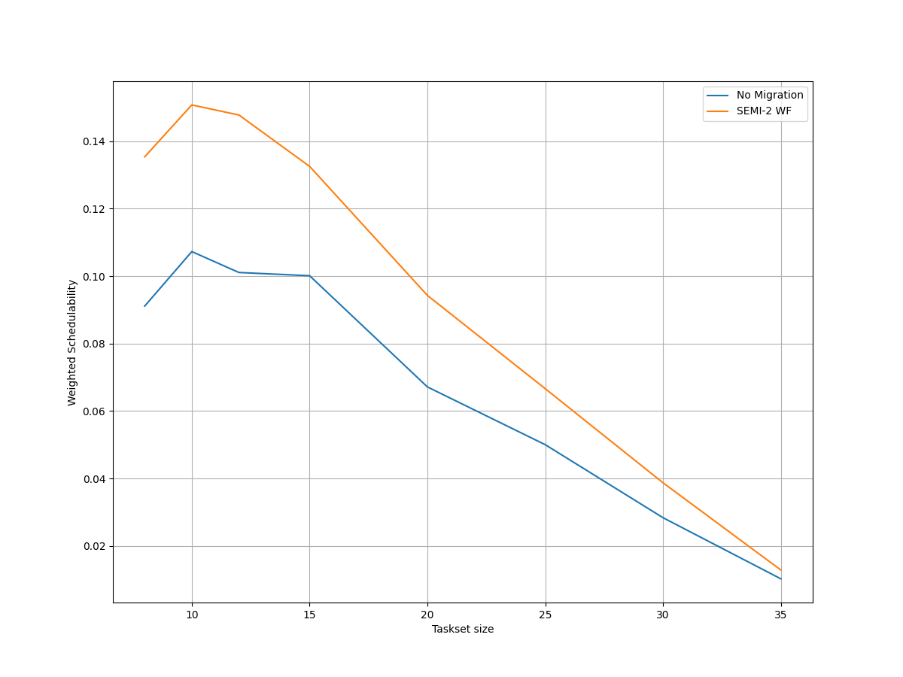
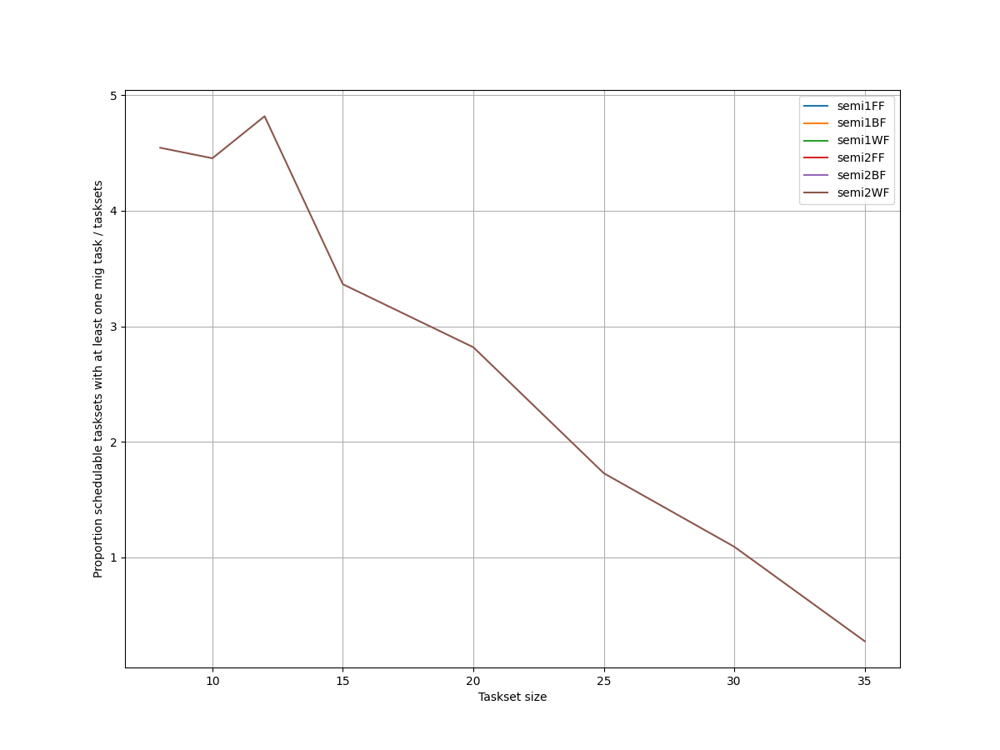
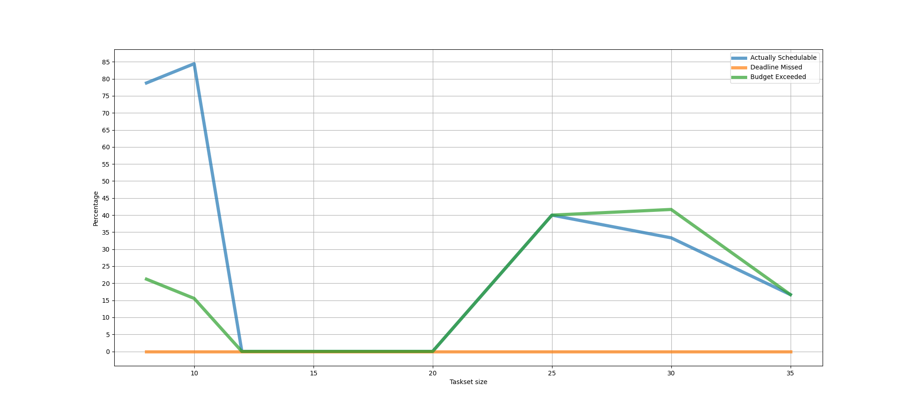
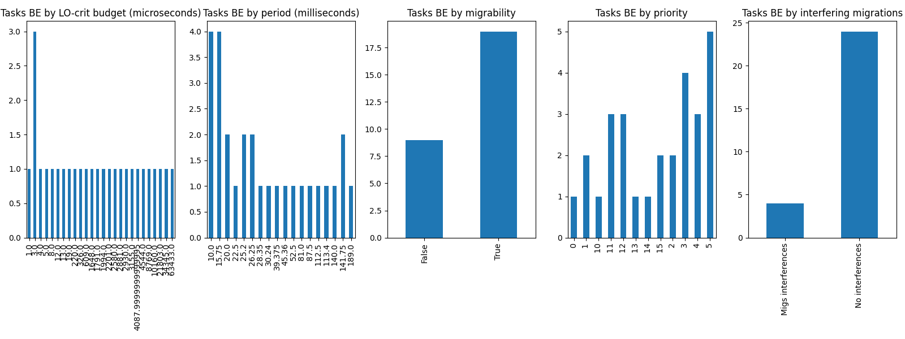
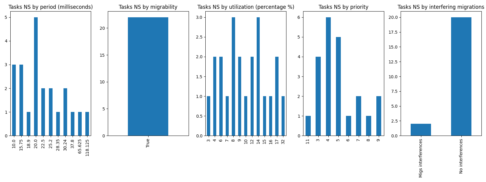

# Report on Experiment 4

   ## Overall data

   Utilization range = [1.8, 2.1] with step = 0.012

 Taskset sizes = [8, 10, 12, 15, 20, 25, 30, 35]

  Number of executions: 191

Schedulable executions: 147/191 = 76.96335078534031 %

_Not_ schedulable executions: 6/191 = 3.1413612565445024 %

Budget Exceeded executions: 34/191 = 17.801047120418847 %

Safe Boundary Exceeded executions: 4/191 = 2.094240837696335 %

NS + BE executions: 40/191 = 20.94240837696335 %

### **Simulations**

#### **Weighted schedulability experiment 4 according to simulations.**

#### **Percentage of (schedulable tasksets with at least one migrating tasks / number of schedulable tasksets) of experiment 4 according to simulations.** 

 

### **Real Executions**

#### **Schedulability for each level**

#### **Tasksets, grouped by (LO-crit budget, Period & Migrability), with a Budget_Exceeded task.**

#### **Tasksets, grouped by (Period & Migrability), with at least one task missing one (or more) of its deadlines.**

## Bad tasksets

Click here to expand this section.

### **Not schedulable tasksets**

Click here to expand this section.

Ovvero quando almeno un task non completa entra almeno una sua deadline.

  1. Taskset **e4_semi2wf_t1407**

    Taskset execution params:
	 
    "id": "e4_semi2wf_t1407",
    "size": "10",
    "utilization": "1.9200000000000002",
    "criticality_factor": "2",
    "hicrit_proportion": "0.5"

   
 
Click here to see the deadlines missed tasks list.

   Time values are expressed as **micro-seconds**.

Task:  3

    
    "id": " 3",
    "basecpu": " 1",
    "priority": " 5",
    "period": 40000.0,
    "C(LO)": 4178.0,
    "C(HI)": 4178.0,
    "criticality": "LOW",
    "migrable": "True",
    "completedruns": " 2836",
    "preemptions": " 1",
    "minresponsejitter": " 0.000000000",
    "maxresponsejitter": " 0.002509922",
    "minreleasejitter": " 0.000000000",
    "maxreleasejitter": " 114.360006240",
    "avgresponsejitter": " 0.002096474",
    "deadlinesmissed": " 1",
    "budgetexceeded": " 0",
    "timesmigrated": " 7",
    "timesrestored": " 7",
    "timesonc1": " 2830",
    "timesonc2": " 5",
    "lockedtime": " 0.000016592"

   

   
 
Click here to see the CPUs log.

   Idle time is expressed as **seconds**.

   CPU: 1

    
    "id": 1,
    "hyperperiod": 113400000,
    "lowtohigh": " 23",
    "hightolow": " 23",
    "idletime": 81146702,
    "util": 28.44206172839506

   CPU: 2

    
    "id": 2,
    "hyperperiod": 22680000,
    "lowtohigh": " 0",
    "hightolow": " 0",
    "idletime": 79521831,
    "util": -250.62535714285718

   

   
 
Click here to see the whole tasksets.

   Time values are expressed as **micro-seconds**.

   Task:  9

    
    "id": " 9",
    "basecpu": " 1",
    "priority": " 0",
    "period": 200000.0,
    "C(LO)": 37517.0,
    "C(HI)": 75034.0,
    "criticality": "HIGH",
    "migrable": "False",
    "completedruns": " 568",
    "preemptions": " 334",
    "minresponsejitter": " 0.000000000",
    "maxresponsejitter": " 0.074729763",
    "minreleasejitter": " 0.000000000",
    "maxreleasejitter": " 114.202220045",
    "avgresponsejitter": " 0.021883486",
    "deadlinesmissed": " 0",
    "budgetexceeded": " 9",
    "timesmigrated": " 0",
    "timesrestored": " 0",
    "timesonc1": " 910",
    "timesonc2": " 0",
    "lockedtime": " 0.000031688"

   Task:  8

    
    "id": " 8",
    "basecpu": " 1",
    "priority": " 1",
    "period": 168750.0,
    "C(LO)": 29572.0,
    "C(HI)": 59145.0,
    "criticality": "HIGH",
    "migrable": "False",
    "completedruns": " 673",
    "preemptions": " 408",
    "minresponsejitter": " 0.000000000",
    "maxresponsejitter": " 0.046488868",
    "minreleasejitter": " 0.000000000",
    "maxreleasejitter": " 114.231256210",
    "avgresponsejitter": " 0.016384691",
    "deadlinesmissed": " 0",
    "budgetexceeded": " 8",
    "timesmigrated": " 0",
    "timesrestored": " 0",
    "timesonc1": " 1088",
    "timesonc2": " 0",
    "lockedtime": " 0.000014967"

   Task:  7

    
    "id": " 7",
    "basecpu": " 1",
    "priority": " 2",
    "period": 140000.0,
    "C(LO)": 2345.0,
    "C(HI)": 4690.0,
    "criticality": "HIGH",
    "migrable": "False",
    "completedruns": " 811",
    "preemptions": " 10",
    "minresponsejitter": " 0.000000000",
    "maxresponsejitter": " 0.003630153",
    "minreleasejitter": " 0.000000000",
    "maxreleasejitter": " 114.260006306",
    "avgresponsejitter": " 0.001213985",
    "deadlinesmissed": " 0",
    "budgetexceeded": " 6",
    "timesmigrated": " 0",
    "timesrestored": " 0",
    "timesonc1": " 826",
    "timesonc2": " 0",
    "lockedtime": " 0.000004144"

   Task:  3

    
    "id": " 3",
    "basecpu": " 1",
    "priority": " 5",
    "period": 40000.0,
    "C(LO)": 4178.0,
    "C(HI)": 4178.0,
    "criticality": "LOW",
    "migrable": "True",
    "completedruns": " 2836",
    "preemptions": " 1",
    "minresponsejitter": " 0.000000000",
    "maxresponsejitter": " 0.002509922",
    "minreleasejitter": " 0.000000000",
    "maxreleasejitter": " 114.360006240",
    "avgresponsejitter": " 0.002096474",
    "deadlinesmissed": " 1",
    "budgetexceeded": " 0",
    "timesmigrated": " 7",
    "timesrestored": " 7",
    "timesonc1": " 2830",
    "timesonc2": " 5",
    "lockedtime": " 0.000016592"

   Task:  5

    
    "id": " 5",
    "basecpu": " 1",
    "priority": " 4",
    "period": 90720.0,
    "C(LO)": 3662.0,
    "C(HI)": 3662.0,
    "criticality": "LOW",
    "migrable": "True",
    "completedruns": " 1251",
    "preemptions": " 54",
    "minresponsejitter": " 0.000000000",
    "maxresponsejitter": " 0.004645387",
    "minreleasejitter": " 0.000000000",
    "maxreleasejitter": " 114.309286210",
    "avgresponsejitter": " 0.001927637",
    "deadlinesmissed": " 0",
    "budgetexceeded": " 0",
    "timesmigrated": " 7",
    "timesrestored": " 7",
    "timesonc1": " 1302",
    "timesonc2": " 2",
    "lockedtime": " 0.000017243"

   Task:  6

    
    "id": " 6",
    "basecpu": " 1",
    "priority": " 3",
    "period": 131250.0,
    "C(LO)": 4239.0,
    "C(HI)": 4239.0,
    "criticality": "LOW",
    "migrable": "False",
    "completedruns": " 865",
    "preemptions": " 47",
    "minresponsejitter": " 0.000000000",
    "maxresponsejitter": " 0.006133781",
    "minreleasejitter": " 0.000000000",
    "maxreleasejitter": " 114.268756901",
    "avgresponsejitter": " 0.002229057",
    "deadlinesmissed": " 0",
    "budgetexceeded": " 0",
    "timesmigrated": " 0",
    "timesrestored": " 0",
    "timesonc1": " 911",
    "timesonc2": " 0",
    "lockedtime": " 0.000010072"

   Task:  10

    
    "id": " 10",
    "basecpu": " 2",
    "priority": " 0",
    "period": 840000.0,
    "C(LO)": 197169.0,
    "C(HI)": 394339.0,
    "criticality": "HIGH",
    "migrable": "False",
    "completedruns": " 136",
    "preemptions": " 1472",
    "minresponsejitter": " 0.000000000",
    "maxresponsejitter": " 0.144468730",
    "minreleasejitter": " 0.000000000",
    "maxreleasejitter": " 113.562251111",
    "avgresponsejitter": " 0.119396384",
    "deadlinesmissed": " 0",
    "budgetexceeded": " 0",
    "timesmigrated": " 0",
    "timesrestored": " 0",
    "timesonc1": " 0",
    "timesonc2": " 1607",
    "lockedtime": " 0.000034862"

   Task:  2

    
    "id": " 2",
    "basecpu": " 2",
    "priority": " 1",
    "period": 26250.0,
    "C(LO)": 4087.0000000000005,
    "C(HI)": 8175.0,
    "criticality": "HIGH",
    "migrable": "False",
    "completedruns": " 4321",
    "preemptions": " 473",
    "minresponsejitter": " 0.000000000",
    "maxresponsejitter": " 0.007461784",
    "minreleasejitter": " 0.000000000",
    "maxreleasejitter": " 114.373755778",
    "avgresponsejitter": " 0.002206378",
    "deadlinesmissed": " 0",
    "budgetexceeded": " 0",
    "timesmigrated": " 0",
    "timesrestored": " 0",
    "timesonc1": " 0",
    "timesonc2": " 4793",
    "lockedtime": " 0.000085652"

   Task:  4

    
    "id": " 4",
    "basecpu": " 2",
    "priority": " 2",
    "period": 50400.0,
    "C(LO)": 7651.0,
    "C(HI)": 7651.0,
    "criticality": "LOW",
    "migrable": "False",
    "completedruns": " 2251",
    "preemptions": " 0",
    "minresponsejitter": " 0.000000000",
    "maxresponsejitter": " 0.004600544",
    "minreleasejitter": " 0.000000000",
    "maxreleasejitter": " 114.349605778",
    "avgresponsejitter": " 0.003823733",
    "deadlinesmissed": " 0",
    "budgetexceeded": " 0",
    "timesmigrated": " 0",
    "timesrestored": " 0",
    "timesonc1": " 0",
    "timesonc2": " 2250",
    "lockedtime": " 0.000023216"

   Task:  1

    
    "id": " 1",
    "basecpu": " 2",
    "priority": " 3",
    "period": 18900.0,
    "C(LO)": 963.0,
    "C(HI)": 963.0,
    "criticality": "LOW",
    "migrable": "False",
    "completedruns": " 6001",
    "preemptions": " 0",
    "minresponsejitter": " 0.000000000",
    "maxresponsejitter": " 0.000574622",
    "minreleasejitter": " 0.000000000",
    "maxreleasejitter": " 114.381105751",
    "avgresponsejitter": " 0.000478526",
    "deadlinesmissed": " 0",
    "budgetexceeded": " 0",
    "timesmigrated": " 0",
    "timesrestored": " 0",
    "timesonc1": " 0",
    "timesonc2": " 6000",
    "lockedtime": " 0.000017541"

   

  2. Taskset **e4_semi2wf_t1644**

    Taskset execution params:
	 
    "id": "e4_semi2wf_t1644",
    "size": "10",
    "utilization": "1.9680000000000002",
    "criticality_factor": "2",
    "hicrit_proportion": "0.5"

   
 
Click here to see the deadlines missed tasks list.

   Time values are expressed as **micro-seconds**.

Task:  2

    
    "id": " 2",
    "basecpu": " 2",
    "priority": " 2",
    "period": 42000.0,
    "C(LO)": 8368.0,
    "C(HI)": 8368.0,
    "criticality": "LOW",
    "migrable": "True",
    "completedruns": " 2701",
    "preemptions": " 0",
    "minresponsejitter": " 0.000000000",
    "maxresponsejitter": " 0.005019697",
    "minreleasejitter": " 0.000000000",
    "maxreleasejitter": " 114.358005895",
    "avgresponsejitter": " 0.004180919",
    "deadlinesmissed": " 1",
    "budgetexceeded": " 0",
    "timesmigrated": " 1",
    "timesrestored": " 1",
    "timesonc1": " 4",
    "timesonc2": " 2695",
    "lockedtime": " 0.000029459"

   

   
 
Click here to see the CPUs log.

   Idle time is expressed as **seconds**.

   CPU: 1

    
    "id": 1,
    "hyperperiod": 113400000,
    "lowtohigh": " 0",
    "hightolow": " 0",
    "idletime": 72571582,
    "util": 36.00389594356261

   CPU: 2

    
    "id": 2,
    "hyperperiod": 18900000,
    "lowtohigh": " 1",
    "hightolow": " 1",
    "idletime": 72783368,
    "util": -285.09718518518514

   

   
 
Click here to see the whole tasksets.

   Time values are expressed as **micro-seconds**.

   Task:  6

    
    "id": " 6",
    "basecpu": " 1",
    "priority": " 2",
    "period": 129600.0,
    "C(LO)": 9619.0,
    "C(HI)": 19239.0,
    "criticality": "HIGH",
    "migrable": "False",
    "completedruns": " 876",
    "preemptions": " 286",
    "minresponsejitter": " 0.000000000",
    "maxresponsejitter": " 0.016687096",
    "minreleasejitter": " 0.000000000",
    "maxreleasejitter": " 114.270406111",
    "avgresponsejitter": " 0.006044198",
    "deadlinesmissed": " 0",
    "budgetexceeded": " 0",
    "timesmigrated": " 0",
    "timesrestored": " 0",
    "timesonc1": " 1161",
    "timesonc2": " 0",
    "lockedtime": " 0.000010045"

   Task:  8

    
    "id": " 8",
    "basecpu": " 1",
    "priority": " 1",
    "period": 175000.0,
    "C(LO)": 9606.0,
    "C(HI)": 19213.0,
    "criticality": "HIGH",
    "migrable": "False",
    "completedruns": " 649",
    "preemptions": " 230",
    "minresponsejitter": " 0.000000000",
    "maxresponsejitter": " 0.021418210",
    "minreleasejitter": " 0.000000000",
    "maxreleasejitter": " 114.228576574",
    "avgresponsejitter": " 0.006299862",
    "deadlinesmissed": " 0",
    "budgetexceeded": " 0",
    "timesmigrated": " 0",
    "timesrestored": " 0",
    "timesonc1": " 878",
    "timesonc2": " 0",
    "lockedtime": " 0.000006492"

   Task:  4

    
    "id": " 4",
    "basecpu": " 1",
    "priority": " 3",
    "period": 47250.0,
    "C(LO)": 1587.0,
    "C(HI)": 3175.0,
    "criticality": "HIGH",
    "migrable": "False",
    "completedruns": " 2401",
    "preemptions": " 4",
    "minresponsejitter": " 0.000000000",
    "maxresponsejitter": " 0.004459547",
    "minreleasejitter": " 0.000000000",
    "maxreleasejitter": " 114.352756081",
    "avgresponsejitter": " 0.000800018",
    "deadlinesmissed": " 0",
    "budgetexceeded": " 0",
    "timesmigrated": " 0",
    "timesrestored": " 0",
    "timesonc1": " 2404",
    "timesonc2": " 0",
    "lockedtime": " 0.000028249"

   Task:  10

    
    "id": " 10",
    "basecpu": " 1",
    "priority": " 0",
    "period": 945000.0,
    "C(LO)": 17938.0,
    "C(HI)": 35876.0,
    "criticality": "HIGH",
    "migrable": "False",
    "completedruns": " 121",
    "preemptions": " 56",
    "minresponsejitter": " 0.000000000",
    "maxresponsejitter": " 0.018916637",
    "minreleasejitter": " 0.000000000",
    "maxreleasejitter": " 113.460284141",
    "avgresponsejitter": " 0.011164492",
    "deadlinesmissed": " 0",
    "budgetexceeded": " 0",
    "timesmigrated": " 0",
    "timesrestored": " 0",
    "timesonc1": " 176",
    "timesonc2": " 0",
    "lockedtime": " 0.000000000"

   Task:  1

    
    "id": " 1",
    "basecpu": " 1",
    "priority": " 6",
    "period": 30240.0,
    "C(LO)": 8831.0,
    "C(HI)": 8831.0,
    "criticality": "LOW",
    "migrable": "False",
    "completedruns": " 3751",
    "preemptions": " 1",
    "minresponsejitter": " 0.000000000",
    "maxresponsejitter": " 0.005301441",
    "minreleasejitter": " 0.000000000",
    "maxreleasejitter": " 114.369766249",
    "avgresponsejitter": " 0.004420042",
    "deadlinesmissed": " 0",
    "budgetexceeded": " 0",
    "timesmigrated": " 0",
    "timesrestored": " 0",
    "timesonc1": " 3751",
    "timesonc2": " 0",
    "lockedtime": " 0.000042895"

   Task:  3

    
    "id": " 3",
    "basecpu": " 1",
    "priority": " 5",
    "period": 45000.0,
    "C(LO)": 10645.0,
    "C(HI)": 10645.0,
    "criticality": "LOW",
    "migrable": "False",
    "completedruns": " 2521",
    "preemptions": " 434",
    "minresponsejitter": " 0.000000000",
    "maxresponsejitter": " 0.011693213",
    "minreleasejitter": " 0.000000000",
    "maxreleasejitter": " 114.355006006",
    "avgresponsejitter": " 0.006084754",
    "deadlinesmissed": " 0",
    "budgetexceeded": " 0",
    "timesmigrated": " 0",
    "timesrestored": " 0",
    "timesonc1": " 2954",
    "timesonc2": " 0",
    "lockedtime": " 0.000028282"

   Task:  7

    
    "id": " 7",
    "basecpu": " 1",
    "priority": " 4",
    "period": 168750.0,
    "C(LO)": 1230.0,
    "C(HI)": 1230.0,
    "criticality": "LOW",
    "migrable": "False",
    "completedruns": " 673",
    "preemptions": " 16",
    "minresponsejitter": " 0.000000000",
    "maxresponsejitter": " 0.005998318",
    "minreleasejitter": " 0.000000000",
    "maxreleasejitter": " 114.231256580",
    "avgresponsejitter": " 0.000731685",
    "deadlinesmissed": " 0",
    "budgetexceeded": " 0",
    "timesmigrated": " 0",
    "timesrestored": " 0",
    "timesonc1": " 688",
    "timesonc2": " 0",
    "lockedtime": " 0.000000691"

   Task:  9

    
    "id": " 9",
    "basecpu": " 2",
    "priority": " 0",
    "period": 900000.0,
    "C(LO)": 326608.0,
    "C(HI)": 653217.0,
    "criticality": "HIGH",
    "migrable": "False",
    "completedruns": " 127",
    "preemptions": " 790",
    "minresponsejitter": " 0.000000000",
    "maxresponsejitter": " 0.546869057",
    "minreleasejitter": " 0.000000000",
    "maxreleasejitter": " 113.500006018",
    "avgresponsejitter": " 0.201041619",
    "deadlinesmissed": " 0",
    "budgetexceeded": " 1",
    "timesmigrated": " 0",
    "timesrestored": " 0",
    "timesonc1": " 0",
    "timesonc2": " 917",
    "lockedtime": " 0.000081595"

   Task:  2

    
    "id": " 2",
    "basecpu": " 2",
    "priority": " 2",
    "period": 42000.0,
    "C(LO)": 8368.0,
    "C(HI)": 8368.0,
    "criticality": "LOW",
    "migrable": "True",
    "completedruns": " 2701",
    "preemptions": " 0",
    "minresponsejitter": " 0.000000000",
    "maxresponsejitter": " 0.005019697",
    "minreleasejitter": " 0.000000000",
    "maxreleasejitter": " 114.358005895",
    "avgresponsejitter": " 0.004180919",
    "deadlinesmissed": " 1",
    "budgetexceeded": " 0",
    "timesmigrated": " 1",
    "timesrestored": " 1",
    "timesonc1": " 4",
    "timesonc2": " 2695",
    "lockedtime": " 0.000029459"

   Task:  5

    
    "id": " 5",
    "basecpu": " 2",
    "priority": " 1",
    "period": 94500.0,
    "C(LO)": 13572.0,
    "C(HI)": 13572.0,
    "criticality": "LOW",
    "migrable": "False",
    "completedruns": " 1201",
    "preemptions": " 1",
    "minresponsejitter": " 0.000000000",
    "maxresponsejitter": " 0.009503336",
    "minreleasejitter": " 0.000000000",
    "maxreleasejitter": " 114.305506589",
    "avgresponsejitter": " 0.006825087",
    "deadlinesmissed": " 0",
    "budgetexceeded": " 0",
    "timesmigrated": " 0",
    "timesrestored": " 0",
    "timesonc1": " 0",
    "timesonc2": " 1201",
    "lockedtime": " 0.000052640"

   

  3. Taskset **e4_semi2wf_t241**

    Taskset execution params:
	 
    "id": "e4_semi2wf_t241",
    "size": "8",
    "utilization": "1.8960000000000001",
    "criticality_factor": "2",
    "hicrit_proportion": "0.5"

   
 
Click here to see the deadlines missed tasks list.

   Time values are expressed as **micro-seconds**.

Task:  2

    
    "id": " 2",
    "basecpu": " 1",
    "priority": " 4",
    "period": 22500.0,
    "C(LO)": 1458.0,
    "C(HI)": 1458.0,
    "criticality": "LOW",
    "migrable": "True",
    "completedruns": " 5041",
    "preemptions": " 1",
    "minresponsejitter": " 0.000000000",
    "maxresponsejitter": " 0.000884787",
    "minreleasejitter": " 0.000000000",
    "maxreleasejitter": " 114.377505970",
    "avgresponsejitter": " 0.000730736",
    "deadlinesmissed": " 1",
    "budgetexceeded": " 0",
    "timesmigrated": " 5",
    "timesrestored": " 5",
    "timesonc1": " 5039",
    "timesonc2": " 1",
    "lockedtime": " 0.000003396"

   

   
 
Click here to see the CPUs log.

   Idle time is expressed as **seconds**.

   CPU: 1

    
    "id": 1,
    "hyperperiod": 113400000,
    "lowtohigh": " 37",
    "hightolow": " 37",
    "idletime": 82674766,
    "util": 27.094562610229275

   CPU: 2

    
    "id": 2,
    "hyperperiod": 113400000,
    "lowtohigh": " 0",
    "hightolow": " 0",
    "idletime": 78177484,
    "util": 31.06041975308642

   

   
 
Click here to see the whole tasksets.

   Time values are expressed as **micro-seconds**.

   Task:  3

    
    "id": " 3",
    "basecpu": " 1",
    "priority": " 2",
    "period": 72000.0,
    "C(LO)": 15614.0,
    "C(HI)": 31229.0,
    "criticality": "HIGH",
    "migrable": "False",
    "completedruns": " 1576",
    "preemptions": " 772",
    "minresponsejitter": " 0.000000000",
    "maxresponsejitter": " 0.028677631",
    "minreleasejitter": " 0.000000000",
    "maxreleasejitter": " 114.328006177",
    "avgresponsejitter": " 0.008505586",
    "deadlinesmissed": " 0",
    "budgetexceeded": " 10",
    "timesmigrated": " 0",
    "timesrestored": " 0",
    "timesonc1": " 2357",
    "timesonc2": " 0",
    "lockedtime": " 0.000003763"

   Task:  6

    
    "id": " 6",
    "basecpu": " 1",
    "priority": " 0",
    "period": 87500.0,
    "C(LO)": 8658.0,
    "C(HI)": 17317.0,
    "criticality": "HIGH",
    "migrable": "False",
    "completedruns": " 1297",
    "preemptions": " 531",
    "minresponsejitter": " 0.000000000",
    "maxresponsejitter": " 0.032302339",
    "minreleasejitter": " 0.000000000",
    "maxreleasejitter": " 114.312505973",
    "avgresponsejitter": " 0.005444658",
    "deadlinesmissed": " 0",
    "budgetexceeded": " 14",
    "timesmigrated": " 0",
    "timesrestored": " 0",
    "timesonc1": " 1841",
    "timesonc2": " 0",
    "lockedtime": " 0.000004580"

   Task:  5

    
    "id": " 5",
    "basecpu": " 1",
    "priority": " 1",
    "period": 84000.0,
    "C(LO)": 3097.0,
    "C(HI)": 6195.0,
    "criticality": "HIGH",
    "migrable": "False",
    "completedruns": " 1351",
    "preemptions": " 74",
    "minresponsejitter": " 0.000000000",
    "maxresponsejitter": " 0.005266144",
    "minreleasejitter": " 0.000000000",
    "maxreleasejitter": " 114.316006673",
    "avgresponsejitter": " 0.001616817",
    "deadlinesmissed": " 0",
    "budgetexceeded": " 13",
    "timesmigrated": " 0",
    "timesrestored": " 0",
    "timesonc1": " 1437",
    "timesonc2": " 0",
    "lockedtime": " 0.000000492"

   Task:  1

    
    "id": " 1",
    "basecpu": " 1",
    "priority": " 5",
    "period": 18900.0,
    "C(LO)": 1550.0,
    "C(HI)": 1550.0,
    "criticality": "LOW",
    "migrable": "True",
    "completedruns": " 3400",
    "preemptions": " 0",
    "minresponsejitter": " 0.000000000",
    "maxresponsejitter": " 0.000945123",
    "minreleasejitter": " 0.000000000",
    "maxreleasejitter": " 65.222205973",
    "avgresponsejitter": " 0.000780492",
    "deadlinesmissed": " 0",
    "budgetexceeded": " 0",
    "timesmigrated": " 7",
    "timesrestored": " 6",
    "timesonc1": " 3399",
    "timesonc2": " 0",
    "lockedtime": " 0.000004321"

   Task:  7

    
    "id": " 7",
    "basecpu": " 1",
    "priority": " 3",
    "period": 113400.0,
    "C(LO)": 7891.0,
    "C(HI)": 7891.0,
    "criticality": "LOW",
    "migrable": "False",
    "completedruns": " 1001",
    "preemptions": " 171",
    "minresponsejitter": " 0.000000000",
    "maxresponsejitter": " 0.005599643",
    "minreleasejitter": " 0.000000000",
    "maxreleasejitter": " 114.286605973",
    "avgresponsejitter": " 0.004053748",
    "deadlinesmissed": " 0",
    "budgetexceeded": " 0",
    "timesmigrated": " 0",
    "timesrestored": " 0",
    "timesonc1": " 1171",
    "timesonc2": " 0",
    "lockedtime": " 0.000003132"

   Task:  2

    
    "id": " 2",
    "basecpu": " 1",
    "priority": " 4",
    "period": 22500.0,
    "C(LO)": 1458.0,
    "C(HI)": 1458.0,
    "criticality": "LOW",
    "migrable": "True",
    "completedruns": " 5041",
    "preemptions": " 1",
    "minresponsejitter": " 0.000000000",
    "maxresponsejitter": " 0.000884787",
    "minreleasejitter": " 0.000000000",
    "maxreleasejitter": " 114.377505970",
    "avgresponsejitter": " 0.000730736",
    "deadlinesmissed": " 1",
    "budgetexceeded": " 0",
    "timesmigrated": " 5",
    "timesrestored": " 5",
    "timesonc1": " 5039",
    "timesonc2": " 1",
    "lockedtime": " 0.000003396"

   Task:  8

    
    "id": " 8",
    "basecpu": " 2",
    "priority": " 0",
    "period": 600000.0,
    "C(LO)": 213195.0,
    "C(HI)": 426390.0,
    "criticality": "HIGH",
    "migrable": "False",
    "completedruns": " 190",
    "preemptions": " 271",
    "minresponsejitter": " 0.000000000",
    "maxresponsejitter": " 0.149241697",
    "minreleasejitter": " 0.000000000",
    "maxreleasejitter": " 113.800005949",
    "avgresponsejitter": " 0.122099237",
    "deadlinesmissed": " 0",
    "budgetexceeded": " 0",
    "timesmigrated": " 0",
    "timesrestored": " 0",
    "timesonc1": " 0",
    "timesonc2": " 460",
    "lockedtime": " 0.000029372"

   Task:  4

    
    "id": " 4",
    "basecpu": " 2",
    "priority": " 1",
    "period": 81000.0,
    "C(LO)": 21344.0,
    "C(HI)": 21344.0,
    "criticality": "LOW",
    "migrable": "False",
    "completedruns": " 1401",
    "preemptions": " 0",
    "minresponsejitter": " 0.000000000",
    "maxresponsejitter": " 0.012840910",
    "minreleasejitter": " 0.000000000",
    "maxreleasejitter": " 114.319005949",
    "avgresponsejitter": " 0.010680327",
    "deadlinesmissed": " 0",
    "budgetexceeded": " 0",
    "timesmigrated": " 0",
    "timesrestored": " 0",
    "timesonc1": " 0",
    "timesonc2": " 1400",
    "lockedtime": " 0.000037697"

   

  4. Taskset **e4_semi2wf_t280**

    Taskset execution params:
	 
    "id": "e4_semi2wf_t280",
    "size": "8",
    "utilization": "1.9080000000000001",
    "criticality_factor": "2",
    "hicrit_proportion": "0.5"

   
 
Click here to see the deadlines missed tasks list.

   Time values are expressed as **micro-seconds**.

Task:  1

    
    "id": " 1",
    "basecpu": " 1",
    "priority": " 4",
    "period": 22500.0,
    "C(LO)": 3581.0,
    "C(HI)": 3581.0,
    "criticality": "LOW",
    "migrable": "True",
    "completedruns": " 1261",
    "preemptions": " 1",
    "minresponsejitter": " 0.000000000",
    "maxresponsejitter": " 0.002153477",
    "minreleasejitter": " 0.000000000",
    "maxreleasejitter": " 29.327505970",
    "avgresponsejitter": " 0.001789802",
    "deadlinesmissed": " 1",
    "budgetexceeded": " 0",
    "timesmigrated": " 3",
    "timesrestored": " 3",
    "timesonc1": " 1259",
    "timesonc2": " 1",
    "lockedtime": " 0.000014817"

   

   
 
Click here to see the CPUs log.

   Idle time is expressed as **seconds**.

   CPU: 1

    
    "id": 1,
    "hyperperiod": 16200000,
    "lowtohigh": " 7",
    "hightolow": " 7",
    "idletime": 19770416,
    "util": -22.039604938271594

   CPU: 2

    
    "id": 2,
    "hyperperiod": 28350000,
    "lowtohigh": " 3",
    "hightolow": " 3",
    "idletime": 19904730,
    "util": 29.78931216931217

   

   
 
Click here to see the whole tasksets.

   Time values are expressed as **micro-seconds**.

   Task:  8

    
    "id": " 8",
    "basecpu": " 1",
    "priority": " 0",
    "period": 648000.0,
    "C(LO)": 105268.0,
    "C(HI)": 210537.0,
    "criticality": "HIGH",
    "migrable": "False",
    "completedruns": " 45",
    "preemptions": " 162",
    "minresponsejitter": " 0.000000000",
    "maxresponsejitter": " 0.076980147",
    "minreleasejitter": " 0.000000000",
    "maxreleasejitter": " 28.870447703",
    "avgresponsejitter": " 0.061933529",
    "deadlinesmissed": " 0",
    "budgetexceeded": " 0",
    "timesmigrated": " 0",
    "timesrestored": " 0",
    "timesonc1": " 206",
    "timesonc2": " 0",
    "lockedtime": " 0.000014961"

   Task:  6

    
    "id": " 6",
    "basecpu": " 1",
    "priority": " 2",
    "period": 108000.0,
    "C(LO)": 14202.0,
    "C(HI)": 28405.0,
    "criticality": "HIGH",
    "migrable": "False",
    "completedruns": " 264",
    "preemptions": " 71",
    "minresponsejitter": " 0.000000000",
    "maxresponsejitter": " 0.023961348",
    "minreleasejitter": " 0.000000000",
    "maxreleasejitter": " 29.296005970",
    "avgresponsejitter": " 0.007760012",
    "deadlinesmissed": " 0",
    "budgetexceeded": " 2",
    "timesmigrated": " 0",
    "timesrestored": " 0",
    "timesonc1": " 336",
    "timesonc2": " 0",
    "lockedtime": " 0.000000766"

   Task:  7

    
    "id": " 7",
    "basecpu": " 1",
    "priority": " 1",
    "period": 120000.0,
    "C(LO)": 11527.0,
    "C(HI)": 23054.0,
    "criticality": "HIGH",
    "migrable": "False",
    "completedruns": " 238",
    "preemptions": " 24",
    "minresponsejitter": " 0.000000000",
    "maxresponsejitter": " 0.019519991",
    "minreleasejitter": " 0.000000000",
    "maxreleasejitter": " 29.320006216",
    "avgresponsejitter": " 0.006021339",
    "deadlinesmissed": " 0",
    "budgetexceeded": " 5",
    "timesmigrated": " 0",
    "timesrestored": " 0",
    "timesonc1": " 266",
    "timesonc2": " 0",
    "lockedtime": " 0.000002267"

   Task:  1

    
    "id": " 1",
    "basecpu": " 1",
    "priority": " 4",
    "period": 22500.0,
    "C(LO)": 3581.0,
    "C(HI)": 3581.0,
    "criticality": "LOW",
    "migrable": "True",
    "completedruns": " 1261",
    "preemptions": " 1",
    "minresponsejitter": " 0.000000000",
    "maxresponsejitter": " 0.002153477",
    "minreleasejitter": " 0.000000000",
    "maxreleasejitter": " 29.327505970",
    "avgresponsejitter": " 0.001789802",
    "deadlinesmissed": " 1",
    "budgetexceeded": " 0",
    "timesmigrated": " 3",
    "timesrestored": " 3",
    "timesonc1": " 1259",
    "timesonc2": " 1",
    "lockedtime": " 0.000014817"

   Task:  4

    
    "id": " 4",
    "basecpu": " 1",
    "priority": " 3",
    "period": 56250.0,
    "C(LO)": 2591.0,
    "C(HI)": 2591.0,
    "criticality": "LOW",
    "migrable": "False",
    "completedruns": " 505",
    "preemptions": " 0",
    "minresponsejitter": " 0.000000000",
    "maxresponsejitter": " 0.001563838",
    "minreleasejitter": " 0.000000000",
    "maxreleasejitter": " 29.293756003",
    "avgresponsejitter": " 0.001300874",
    "deadlinesmissed": " 0",
    "budgetexceeded": " 0",
    "timesmigrated": " 0",
    "timesrestored": " 0",
    "timesonc1": " 504",
    "timesonc2": " 0",
    "lockedtime": " 0.000003892"

   Task:  5

    
    "id": " 5",
    "basecpu": " 2",
    "priority": " 0",
    "period": 70875.0,
    "C(LO)": 24204.0,
    "C(HI)": 48408.0,
    "criticality": "HIGH",
    "migrable": "False",
    "completedruns": " 401",
    "preemptions": " 230",
    "minresponsejitter": " 0.000000000",
    "maxresponsejitter": " 0.043953940",
    "minreleasejitter": " 0.000000000",
    "maxreleasejitter": " 29.279130904",
    "avgresponsejitter": " 0.013930177",
    "deadlinesmissed": " 0",
    "budgetexceeded": " 3",
    "timesmigrated": " 0",
    "timesrestored": " 0",
    "timesonc1": " 0",
    "timesonc2": " 633",
    "lockedtime": " 0.000021805"

   Task:  3

    
    "id": " 3",
    "basecpu": " 2",
    "priority": " 1",
    "period": 50000.0,
    "C(LO)": 8843.0,
    "C(HI)": 8843.0,
    "criticality": "LOW",
    "migrable": "False",
    "completedruns": " 568",
    "preemptions": " 66",
    "minresponsejitter": " 0.000000000",
    "maxresponsejitter": " 0.006499114",
    "minreleasejitter": " 0.000000000",
    "maxreleasejitter": " 29.300005862",
    "avgresponsejitter": " 0.004516532",
    "deadlinesmissed": " 0",
    "budgetexceeded": " 0",
    "timesmigrated": " 0",
    "timesrestored": " 0",
    "timesonc1": " 0",
    "timesonc2": " 633",
    "lockedtime": " 0.000011745"

   Task:  2

    
    "id": " 2",
    "basecpu": " 2",
    "priority": " 2",
    "period": 33750.0,
    "C(LO)": 2119.0,
    "C(HI)": 2119.0,
    "criticality": "LOW",
    "migrable": "True",
    "completedruns": " 841",
    "preemptions": " 0",
    "minresponsejitter": " 0.000000000",
    "maxresponsejitter": " 0.001286297",
    "minreleasejitter": " 0.000000000",
    "maxreleasejitter": " 29.316255907",
    "avgresponsejitter": " 0.001067006",
    "deadlinesmissed": " 0",
    "budgetexceeded": " 0",
    "timesmigrated": " 0",
    "timesrestored": " 0",
    "timesonc1": " 0",
    "timesonc2": " 840",
    "lockedtime": " 0.000040051"

   

  5. Taskset **e4_semi2wf_t3348**

    Taskset execution params:
	 
    "id": "e4_semi2wf_t3348",
    "size": "15",
    "utilization": "1.848",
    "criticality_factor": "2",
    "hicrit_proportion": "0.5"

   
 
Click here to see the deadlines missed tasks list.

   Time values are expressed as **micro-seconds**.

Task:  1

    
    "id": " 1",
    "basecpu": " 1",
    "priority": " 6",
    "period": 15750.0,
    "C(LO)": 1863.0,
    "C(HI)": 1863.0,
    "criticality": "LOW",
    "migrable": "True",
    "completedruns": " 3330",
    "preemptions": " 0",
    "minresponsejitter": " 0.000000000",
    "maxresponsejitter": " 0.001120985",
    "minreleasejitter": " 0.000000000",
    "maxreleasejitter": " 53.416008030",
    "avgresponsejitter": " 0.000931267",
    "deadlinesmissed": " 1",
    "budgetexceeded": " 0",
    "timesmigrated": " 9",
    "timesrestored": " 8",
    "timesonc1": " 3327",
    "timesonc2": " 1",
    "lockedtime": " 0.000008553"

   

   
 
Click here to see the CPUs log.

   Idle time is expressed as **seconds**.

   CPU: 1

    
    "id": 1,
    "hyperperiod": 113400000,
    "lowtohigh": " 39",
    "hightolow": " 39",
    "idletime": 80058632,
    "util": 29.40155908289242

   CPU: 2

    
    "id": 2,
    "hyperperiod": 56700000,
    "lowtohigh": " 0",
    "hightolow": " 0",
    "idletime": 76887566,
    "util": -35.60417283950616

   

   
 
Click here to see the whole tasksets.

   Time values are expressed as **micro-seconds**.

   Task:  13

    
    "id": " 13",
    "basecpu": " 1",
    "priority": " 0",
    "period": 175000.0,
    "C(LO)": 16122.000000000002,
    "C(HI)": 32245.000000000004,
    "criticality": "HIGH",
    "migrable": "False",
    "completedruns": " 649",
    "preemptions": " 379",
    "minresponsejitter": " 0.000000000",
    "maxresponsejitter": " 0.028739450",
    "minreleasejitter": " 0.000000000",
    "maxreleasejitter": " 114.225006168",
    "avgresponsejitter": " 0.009750589",
    "deadlinesmissed": " 0",
    "budgetexceeded": " 5",
    "timesmigrated": " 0",
    "timesrestored": " 0",
    "timesonc1": " 1032",
    "timesonc2": " 0",
    "lockedtime": " 0.000020937"

   Task:  10

    
    "id": " 10",
    "basecpu": " 1",
    "priority": " 1",
    "period": 129600.0,
    "C(LO)": 11700.0,
    "C(HI)": 23400.0,
    "criticality": "HIGH",
    "migrable": "False",
    "completedruns": " 876",
    "preemptions": " 328",
    "minresponsejitter": " 0.000000000",
    "maxresponsejitter": " 0.029721688",
    "minreleasejitter": " 0.000000000",
    "maxreleasejitter": " 114.270406168",
    "avgresponsejitter": " 0.006993345",
    "deadlinesmissed": " 0",
    "budgetexceeded": " 7",
    "timesmigrated": " 0",
    "timesrestored": " 0",
    "timesonc1": " 1210",
    "timesonc2": " 0",
    "lockedtime": " 0.000014057"

   Task:  9

    
    "id": " 9",
    "basecpu": " 1",
    "priority": " 2",
    "period": 126000.0,
    "C(LO)": 8706.0,
    "C(HI)": 17413.0,
    "criticality": "HIGH",
    "migrable": "False",
    "completedruns": " 901",
    "preemptions": " 54",
    "minresponsejitter": " 0.000000000",
    "maxresponsejitter": " 0.019405195",
    "minreleasejitter": " 0.000000000",
    "maxreleasejitter": " 114.274006550",
    "avgresponsejitter": " 0.004516973",
    "deadlinesmissed": " 0",
    "budgetexceeded": " 9",
    "timesmigrated": " 0",
    "timesrestored": " 0",
    "timesonc1": " 963",
    "timesonc2": " 0",
    "lockedtime": " 0.000010459"

   Task:  8

    
    "id": " 8",
    "basecpu": " 1",
    "priority": " 3",
    "period": 84375.0,
    "C(LO)": 2744.0,
    "C(HI)": 5489.0,
    "criticality": "HIGH",
    "migrable": "False",
    "completedruns": " 1345",
    "preemptions": " 110",
    "minresponsejitter": " 0.000000000",
    "maxresponsejitter": " 0.009255814",
    "minreleasejitter": " 0.000000000",
    "maxreleasejitter": " 114.315631000",
    "avgresponsejitter": " 0.001607078",
    "deadlinesmissed": " 0",
    "budgetexceeded": " 18",
    "timesmigrated": " 0",
    "timesrestored": " 0",
    "timesonc1": " 1472",
    "timesonc2": " 0",
    "lockedtime": " 0.000019006"

   Task:  6

    
    "id": " 6",
    "basecpu": " 1",
    "priority": " 4",
    "period": 70000.0,
    "C(LO)": 11150.0,
    "C(HI)": 11150.0,
    "criticality": "LOW",
    "migrable": "False",
    "completedruns": " 1621",
    "preemptions": " 357",
    "minresponsejitter": " 0.000000000",
    "maxresponsejitter": " 0.009960030",
    "minreleasejitter": " 0.000000000",
    "maxreleasejitter": " 114.330006168",
    "avgresponsejitter": " 0.005896426",
    "deadlinesmissed": " 0",
    "budgetexceeded": " 0",
    "timesmigrated": " 0",
    "timesrestored": " 0",
    "timesonc1": " 1977",
    "timesonc2": " 0",
    "lockedtime": " 0.000030330"

   Task:  1

    
    "id": " 1",
    "basecpu": " 1",
    "priority": " 6",
    "period": 15750.0,
    "C(LO)": 1863.0,
    "C(HI)": 1863.0,
    "criticality": "LOW",
    "migrable": "True",
    "completedruns": " 3330",
    "preemptions": " 0",
    "minresponsejitter": " 0.000000000",
    "maxresponsejitter": " 0.001120985",
    "minreleasejitter": " 0.000000000",
    "maxreleasejitter": " 53.416008030",
    "avgresponsejitter": " 0.000931267",
    "deadlinesmissed": " 1",
    "budgetexceeded": " 0",
    "timesmigrated": " 9",
    "timesrestored": " 8",
    "timesonc1": " 3327",
    "timesonc2": " 1",
    "lockedtime": " 0.000008553"

   Task:  3

    
    "id": " 3",
    "basecpu": " 1",
    "priority": " 5",
    "period": 50400.0,
    "C(LO)": 4074.0000000000005,
    "C(HI)": 4074.0000000000005,
    "criticality": "LOW",
    "migrable": "True",
    "completedruns": " 2251",
    "preemptions": " 1",
    "minresponsejitter": " 0.000000000",
    "maxresponsejitter": " 0.002448544",
    "minreleasejitter": " 0.000000000",
    "maxreleasejitter": " 114.349606168",
    "avgresponsejitter": " 0.002048177",
    "deadlinesmissed": " 0",
    "budgetexceeded": " 0",
    "timesmigrated": " 4",
    "timesrestored": " 4",
    "timesonc1": " 2250",
    "timesonc2": " 1",
    "lockedtime": " 0.000082399"

   Task:  2

    
    "id": " 2",
    "basecpu": " 2",
    "priority": " 3",
    "period": 37800.0,
    "C(LO)": 7622.0,
    "C(HI)": 15245.0,
    "criticality": "HIGH",
    "migrable": "False",
    "completedruns": " 3001",
    "preemptions": " 391",
    "minresponsejitter": " 0.000000000",
    "maxresponsejitter": " 0.008982586",
    "minreleasejitter": " 0.000000000",
    "maxreleasejitter": " 114.362205949",
    "avgresponsejitter": " 0.004054459",
    "deadlinesmissed": " 0",
    "budgetexceeded": " 0",
    "timesmigrated": " 0",
    "timesrestored": " 0",
    "timesonc1": " 0",
    "timesonc2": " 3391",
    "lockedtime": " 0.000034252"

   Task:  14

    
    "id": " 14",
    "basecpu": " 2",
    "priority": " 1",
    "period": 708750.0,
    "C(LO)": 29486.0,
    "C(HI)": 58973.0,
    "criticality": "HIGH",
    "migrable": "False",
    "completedruns": " 161",
    "preemptions": " 119",
    "minresponsejitter": " 0.000000000",
    "maxresponsejitter": " 0.025537568",
    "minreleasejitter": " 0.000000000",
    "maxreleasejitter": " 113.691255751",
    "avgresponsejitter": " 0.017122156",
    "deadlinesmissed": " 0",
    "budgetexceeded": " 0",
    "timesmigrated": " 0",
    "timesrestored": " 0",
    "timesonc1": " 0",
    "timesonc2": " 279",
    "lockedtime": " 0.000006892"

   Task:  15

    
    "id": " 15",
    "basecpu": " 2",
    "priority": " 0",
    "period": 900000.0,
    "C(LO)": 31811.0,
    "C(HI)": 63622.0,
    "criticality": "HIGH",
    "migrable": "False",
    "completedruns": " 127",
    "preemptions": " 89",
    "minresponsejitter": " 0.000000000",
    "maxresponsejitter": " 0.041579886",
    "minreleasejitter": " 0.000000000",
    "maxreleasejitter": " 113.503113075",
    "avgresponsejitter": " 0.017893147",
    "deadlinesmissed": " 0",
    "budgetexceeded": " 0",
    "timesmigrated": " 0",
    "timesrestored": " 0",
    "timesonc1": " 0",
    "timesonc2": " 215",
    "lockedtime": " 0.000005366"

   Task:  12

    
    "id": " 12",
    "basecpu": " 2",
    "priority": " 2",
    "period": 168750.0,
    "C(LO)": 37938.0,
    "C(HI)": 37938.0,
    "criticality": "LOW",
    "migrable": "False",
    "completedruns": " 673",
    "preemptions": " 696",
    "minresponsejitter": " 0.000000000",
    "maxresponsejitter": " 0.031177904",
    "minreleasejitter": " 0.000000000",
    "maxreleasejitter": " 114.231256102",
    "avgresponsejitter": " 0.022280219",
    "deadlinesmissed": " 0",
    "budgetexceeded": " 0",
    "timesmigrated": " 0",
    "timesrestored": " 0",
    "timesonc1": " 0",
    "timesonc2": " 1368",
    "lockedtime": " 0.000088658"

   Task:  4

    
    "id": " 4",
    "basecpu": " 2",
    "priority": " 7",
    "period": 60000.0,
    "C(LO)": 6175.0,
    "C(HI)": 6175.0,
    "criticality": "LOW",
    "migrable": "False",
    "completedruns": " 1891",
    "preemptions": " 0",
    "minresponsejitter": " 0.000000000",
    "maxresponsejitter": " 0.003713003",
    "minreleasejitter": " 0.000000000",
    "maxreleasejitter": " 114.340005856",
    "avgresponsejitter": " 0.003091435",
    "deadlinesmissed": " 0",
    "budgetexceeded": " 0",
    "timesmigrated": " 0",
    "timesrestored": " 0",
    "timesonc1": " 0",
    "timesonc2": " 1890",
    "lockedtime": " 0.000039327"

   Task:  5

    
    "id": " 5",
    "basecpu": " 2",
    "priority": " 6",
    "period": 65625.0,
    "C(LO)": 1783.0,
    "C(HI)": 1783.0,
    "criticality": "LOW",
    "migrable": "False",
    "completedruns": " 1729",
    "preemptions": " 0",
    "minresponsejitter": " 0.000000000",
    "maxresponsejitter": " 0.001082078",
    "minreleasejitter": " 0.000000000",
    "maxreleasejitter": " 114.334380871",
    "avgresponsejitter": " 0.000898775",
    "deadlinesmissed": " 0",
    "budgetexceeded": " 0",
    "timesmigrated": " 0",
    "timesrestored": " 0",
    "timesonc1": " 0",
    "timesonc2": " 1728",
    "lockedtime": " 0.000029688"

   Task:  7

    
    "id": " 7",
    "basecpu": " 2",
    "priority": " 5",
    "period": 75600.0,
    "C(LO)": 397.0,
    "C(HI)": 397.0,
    "criticality": "LOW",
    "migrable": "False",
    "completedruns": " 1501",
    "preemptions": " 0",
    "minresponsejitter": " 0.000000000",
    "maxresponsejitter": " 0.000241943",
    "minreleasejitter": " 0.000000000",
    "maxreleasejitter": " 114.324406841",
    "avgresponsejitter": " 0.000200348",
    "deadlinesmissed": " 0",
    "budgetexceeded": " 0",
    "timesmigrated": " 0",
    "timesrestored": " 0",
    "timesonc1": " 0",
    "timesonc2": " 1500",
    "lockedtime": " 0.000038132"

   Task:  11

    
    "id": " 11",
    "basecpu": " 2",
    "priority": " 4",
    "period": 150000.0,
    "C(LO)": 611.0,
    "C(HI)": 611.0,
    "criticality": "LOW",
    "migrable": "False",
    "completedruns": " 757",
    "preemptions": " 2",
    "minresponsejitter": " 0.000000000",
    "maxresponsejitter": " 0.000505751",
    "minreleasejitter": " 0.000000000",
    "maxreleasejitter": " 114.250006348",
    "avgresponsejitter": " 0.000306643",
    "deadlinesmissed": " 0",
    "budgetexceeded": " 0",
    "timesmigrated": " 0",
    "timesrestored": " 0",
    "timesonc1": " 0",
    "timesonc2": " 758",
    "lockedtime": " 0.000001874"

   

  6. Taskset **e4_semi2wf_t4539**

    Taskset execution params:
	 
    "id": "e4_semi2wf_t4539",
    "size": "20",
    "utilization": "1.872",
    "criticality_factor": "2",
    "hicrit_proportion": "0.5"

   
 
Click here to see the deadlines missed tasks list.

   Time values are expressed as **micro-seconds**.

Task:  1

    
    "id": " 1",
    "basecpu": " 1",
    "priority": " 11",
    "period": 10000.0,
    "C(LO)": 576.0,
    "C(HI)": 576.0,
    "criticality": "LOW",
    "migrable": "True",
    "completedruns": " 8913",
    "preemptions": " 0",
    "minresponsejitter": " 0.000000000",
    "maxresponsejitter": " 0.000354757",
    "minreleasejitter": " 0.000000000",
    "maxreleasejitter": " 90.110006793",
    "avgresponsejitter": " 0.000283300",
    "deadlinesmissed": " 1",
    "budgetexceeded": " 0",
    "timesmigrated": " 7",
    "timesrestored": " 6",
    "timesonc1": " 8907",
    "timesonc2": " 4",
    "lockedtime": " 0.000111396"

   

   
 
Click here to see the CPUs log.

   Idle time is expressed as **seconds**.

   CPU: 1

    
    "id": 1,
    "hyperperiod": 113400000,
    "lowtohigh": " 26",
    "hightolow": " 26",
    "idletime": 69051634,
    "util": 39.107906525573185

   CPU: 2

    
    "id": 2,
    "hyperperiod": 18900000,
    "lowtohigh": " 0",
    "hightolow": " 0",
    "idletime": 71925283,
    "util": -280.5570529100529

   

   
 
Click here to see the whole tasksets.

   Time values are expressed as **micro-seconds**.

   Task:  10

    
    "id": " 10",
    "basecpu": " 1",
    "priority": " 4",
    "period": 100000.0,
    "C(LO)": 8232.0,
    "C(HI)": 16464.0,
    "criticality": "HIGH",
    "migrable": "False",
    "completedruns": " 1135",
    "preemptions": " 477",
    "minresponsejitter": " 0.000000000",
    "maxresponsejitter": " 0.033358832",
    "minreleasejitter": " 0.000000000",
    "maxreleasejitter": " 114.300006096",
    "avgresponsejitter": " 0.004663991",
    "deadlinesmissed": " 0",
    "budgetexceeded": " 6",
    "timesmigrated": " 0",
    "timesrestored": " 0",
    "timesonc1": " 1617",
    "timesonc2": " 0",
    "lockedtime": " 0.000039339"

   Task:  19

    
    "id": " 19",
    "basecpu": " 1",
    "priority": " 1",
    "period": 196875.0,
    "C(LO)": 10073.0,
    "C(HI)": 20146.0,
    "criticality": "HIGH",
    "migrable": "False",
    "completedruns": " 577",
    "preemptions": " 357",
    "minresponsejitter": " 0.000000000",
    "maxresponsejitter": " 0.018046165",
    "minreleasejitter": " 0.000000000",
    "maxreleasejitter": " 114.204770270",
    "avgresponsejitter": " 0.005933078",
    "deadlinesmissed": " 0",
    "budgetexceeded": " 6",
    "timesmigrated": " 0",
    "timesrestored": " 0",
    "timesonc1": " 939",
    "timesonc2": " 0",
    "lockedtime": " 0.000016574"

   Task:  20

    
    "id": " 20",
    "basecpu": " 1",
    "priority": " 0",
    "period": 540000.0,
    "C(LO)": 14727.0,
    "C(HI)": 29454.0,
    "criticality": "HIGH",
    "migrable": "False",
    "completedruns": " 211",
    "preemptions": " 268",
    "minresponsejitter": " 0.000000000",
    "maxresponsejitter": " 0.035596438",
    "minreleasejitter": " 0.000000000",
    "maxreleasejitter": " 113.863665976",
    "avgresponsejitter": " 0.010246219",
    "deadlinesmissed": " 0",
    "budgetexceeded": " 0",
    "timesmigrated": " 0",
    "timesrestored": " 0",
    "timesonc1": " 478",
    "timesonc2": " 0",
    "lockedtime": " 0.000015913"

   Task:  17

    
    "id": " 17",
    "basecpu": " 1",
    "priority": " 2",
    "period": 157500.0,
    "C(LO)": 1970.0,
    "C(HI)": 3941.0,
    "criticality": "HIGH",
    "migrable": "False",
    "completedruns": " 721",
    "preemptions": " 44",
    "minresponsejitter": " 0.000000000",
    "maxresponsejitter": " 0.008347994",
    "minreleasejitter": " 0.000000000",
    "maxreleasejitter": " 114.242506060",
    "avgresponsejitter": " 0.001087240",
    "deadlinesmissed": " 0",
    "budgetexceeded": " 8",
    "timesmigrated": " 0",
    "timesrestored": " 0",
    "timesonc1": " 772",
    "timesonc2": " 0",
    "lockedtime": " 0.000005838"

   Task:  13

    
    "id": " 13",
    "basecpu": " 1",
    "priority": " 3",
    "period": 129600.0,
    "C(LO)": 329.0,
    "C(HI)": 659.0,
    "criticality": "HIGH",
    "migrable": "False",
    "completedruns": " 876",
    "preemptions": " 22",
    "minresponsejitter": " 0.000000000",
    "maxresponsejitter": " 0.014325556",
    "minreleasejitter": " 0.000000000",
    "maxreleasejitter": " 114.272575474",
    "avgresponsejitter": " 0.000203303",
    "deadlinesmissed": " 0",
    "budgetexceeded": " 6",
    "timesmigrated": " 0",
    "timesrestored": " 0",
    "timesonc1": " 903",
    "timesonc2": " 0",
    "lockedtime": " 0.000000652"

   Task:  9

    
    "id": " 9",
    "basecpu": " 1",
    "priority": " 8",
    "period": 87500.0,
    "C(LO)": 30672.0,
    "C(HI)": 30672.0,
    "criticality": "LOW",
    "migrable": "False",
    "completedruns": " 1297",
    "preemptions": " 2815",
    "minresponsejitter": " 0.000000000",
    "maxresponsejitter": " 0.022414345",
    "minreleasejitter": " 0.000000000",
    "maxreleasejitter": " 114.312506117",
    "avgresponsejitter": " 0.016671958",
    "deadlinesmissed": " 0",
    "budgetexceeded": " 0",
    "timesmigrated": " 0",
    "timesrestored": " 0",
    "timesonc1": " 4111",
    "timesonc2": " 0",
    "lockedtime": " 0.000224036"

   Task:  7

    
    "id": " 7",
    "basecpu": " 1",
    "priority": " 9",
    "period": 64800.0,
    "C(LO)": 4785.0,
    "C(HI)": 4785.0,
    "criticality": "LOW",
    "migrable": "False",
    "completedruns": " 1751",
    "preemptions": " 516",
    "minresponsejitter": " 0.000000000",
    "maxresponsejitter": " 0.003537565",
    "minreleasejitter": " 0.000000000",
    "maxreleasejitter": " 114.335206114",
    "avgresponsejitter": " 0.002486129",
    "deadlinesmissed": " 0",
    "budgetexceeded": " 0",
    "timesmigrated": " 0",
    "timesrestored": " 0",
    "timesonc1": " 2266",
    "timesonc2": " 0",
    "lockedtime": " 0.000035177"

   Task:  11

    
    "id": " 11",
    "basecpu": " 1",
    "priority": " 7",
    "period": 108000.0,
    "C(LO)": 6352.0,
    "C(HI)": 6352.0,
    "criticality": "LOW",
    "migrable": "False",
    "completedruns": " 1051",
    "preemptions": " 380",
    "minresponsejitter": " 0.000000000",
    "maxresponsejitter": " 0.022919138",
    "minreleasejitter": " 0.000000000",
    "maxreleasejitter": " 114.292006174",
    "avgresponsejitter": " 0.003848751",
    "deadlinesmissed": " 0",
    "budgetexceeded": " 0",
    "timesmigrated": " 0",
    "timesrestored": " 0",
    "timesonc1": " 1430",
    "timesonc2": " 0",
    "lockedtime": " 0.000015171"

   Task:  1

    
    "id": " 1",
    "basecpu": " 1",
    "priority": " 11",
    "period": 10000.0,
    "C(LO)": 576.0,
    "C(HI)": 576.0,
    "criticality": "LOW",
    "migrable": "True",
    "completedruns": " 8913",
    "preemptions": " 0",
    "minresponsejitter": " 0.000000000",
    "maxresponsejitter": " 0.000354757",
    "minreleasejitter": " 0.000000000",
    "maxreleasejitter": " 90.110006793",
    "avgresponsejitter": " 0.000283300",
    "deadlinesmissed": " 1",
    "budgetexceeded": " 0",
    "timesmigrated": " 7",
    "timesrestored": " 6",
    "timesonc1": " 8907",
    "timesonc2": " 4",
    "lockedtime": " 0.000111396"

   Task:  2

    
    "id": " 2",
    "basecpu": " 1",
    "priority": " 10",
    "period": 15750.0,
    "C(LO)": 612.0,
    "C(HI)": 612.0,
    "criticality": "LOW",
    "migrable": "True",
    "completedruns": " 6027",
    "preemptions": " 141",
    "minresponsejitter": " 0.000000000",
    "maxresponsejitter": " 0.000720456",
    "minreleasejitter": " 0.000000000",
    "maxreleasejitter": " 95.893757204",
    "avgresponsejitter": " 0.000310601",
    "deadlinesmissed": " 0",
    "budgetexceeded": " 0",
    "timesmigrated": " 2",
    "timesrestored": " 1",
    "timesonc1": " 6166",
    "timesonc2": " 1",
    "lockedtime": " 0.000105327"

   Task:  12

    
    "id": " 12",
    "basecpu": " 1",
    "priority": " 6",
    "period": 126000.0,
    "C(LO)": 3138.0,
    "C(HI)": 3138.0,
    "criticality": "LOW",
    "migrable": "False",
    "completedruns": " 901",
    "preemptions": " 99",
    "minresponsejitter": " 0.000000000",
    "maxresponsejitter": " 0.023535895",
    "minreleasejitter": " 0.000000000",
    "maxreleasejitter": " 114.274006805",
    "avgresponsejitter": " 0.001710372",
    "deadlinesmissed": " 0",
    "budgetexceeded": " 0",
    "timesmigrated": " 0",
    "timesrestored": " 0",
    "timesonc1": " 999",
    "timesonc2": " 0",
    "lockedtime": " 0.000010267"

   Task:  14

    
    "id": " 14",
    "basecpu": " 1",
    "priority": " 5",
    "period": 140000.0,
    "C(LO)": 1568.0,
    "C(HI)": 1568.0,
    "criticality": "LOW",
    "migrable": "False",
    "completedruns": " 811",
    "preemptions": " 21",
    "minresponsejitter": " 0.000000000",
    "maxresponsejitter": " 0.004011943",
    "minreleasejitter": " 0.000000000",
    "maxreleasejitter": " 114.260006174",
    "avgresponsejitter": " 0.000816997",
    "deadlinesmissed": " 0",
    "budgetexceeded": " 0",
    "timesmigrated": " 0",
    "timesrestored": " 0",
    "timesonc1": " 831",
    "timesonc2": " 0",
    "lockedtime": " 0.000001622"

   Task:  8

    
    "id": " 8",
    "basecpu": " 2",
    "priority": " 3",
    "period": 84000.0,
    "C(LO)": 8655.0,
    "C(HI)": 17311.0,
    "criticality": "HIGH",
    "migrable": "False",
    "completedruns": " 1351",
    "preemptions": " 220",
    "minresponsejitter": " 0.000000000",
    "maxresponsejitter": " 0.014308841",
    "minreleasejitter": " 0.000000000",
    "maxreleasejitter": " 114.316005871",
    "avgresponsejitter": " 0.005218979",
    "deadlinesmissed": " 0",
    "budgetexceeded": " 0",
    "timesmigrated": " 0",
    "timesrestored": " 0",
    "timesonc1": " 0",
    "timesonc2": " 1570",
    "lockedtime": " 0.000006547"

   Task:  18

    
    "id": " 18",
    "basecpu": " 2",
    "priority": " 0",
    "period": 175000.0,
    "C(LO)": 5273.0,
    "C(HI)": 10546.0,
    "criticality": "HIGH",
    "migrable": "False",
    "completedruns": " 649",
    "preemptions": " 107",
    "minresponsejitter": " 0.000000000",
    "maxresponsejitter": " 0.012661417",
    "minreleasejitter": " 0.000000000",
    "maxreleasejitter": " 114.225005907",
    "avgresponsejitter": " 0.003270625",
    "deadlinesmissed": " 0",
    "budgetexceeded": " 0",
    "timesmigrated": " 0",
    "timesrestored": " 0",
    "timesonc1": " 0",
    "timesonc2": " 755",
    "lockedtime": " 0.000036249"

   Task:  15

    
    "id": " 15",
    "basecpu": " 2",
    "priority": " 2",
    "period": 150000.0,
    "C(LO)": 4329.0,
    "C(HI)": 8659.0,
    "criticality": "HIGH",
    "migrable": "False",
    "completedruns": " 757",
    "preemptions": " 47",
    "minresponsejitter": " 0.000000000",
    "maxresponsejitter": " 0.010061345",
    "minreleasejitter": " 0.000000000",
    "maxreleasejitter": " 114.250005820",
    "avgresponsejitter": " 0.002312327",
    "deadlinesmissed": " 0",
    "budgetexceeded": " 0",
    "timesmigrated": " 0",
    "timesrestored": " 0",
    "timesonc1": " 0",
    "timesonc2": " 803",
    "lockedtime": " 0.000023781"

   Task:  5

    
    "id": " 5",
    "basecpu": " 2",
    "priority": " 4",
    "period": 60000.0,
    "C(LO)": 624.0,
    "C(HI)": 1249.0,
    "criticality": "HIGH",
    "migrable": "False",
    "completedruns": " 1891",
    "preemptions": " 10",
    "minresponsejitter": " 0.000000000",
    "maxresponsejitter": " 0.006585571",
    "minreleasejitter": " 0.000000000",
    "maxreleasejitter": " 114.340005748",
    "avgresponsejitter": " 0.000324835",
    "deadlinesmissed": " 0",
    "budgetexceeded": " 0",
    "timesmigrated": " 0",
    "timesrestored": " 0",
    "timesonc1": " 0",
    "timesonc2": " 1900",
    "lockedtime": " 0.000100835"

   Task:  16

    
    "id": " 16",
    "basecpu": " 2",
    "priority": " 1",
    "period": 151200.0,
    "C(LO)": 975.0,
    "C(HI)": 1951.0,
    "criticality": "HIGH",
    "migrable": "False",
    "completedruns": " 751",
    "preemptions": " 27",
    "minresponsejitter": " 0.000000000",
    "maxresponsejitter": " 0.006434688",
    "minreleasejitter": " 0.000000000",
    "maxreleasejitter": " 114.248805913",
    "avgresponsejitter": " 0.000589162",
    "deadlinesmissed": " 0",
    "budgetexceeded": " 0",
    "timesmigrated": " 0",
    "timesrestored": " 0",
    "timesonc1": " 0",
    "timesonc2": " 777",
    "lockedtime": " 0.000011646"

   Task:  4

    
    "id": " 4",
    "basecpu": " 2",
    "priority": " 6",
    "period": 33750.0,
    "C(LO)": 10847.0,
    "C(HI)": 10847.0,
    "criticality": "LOW",
    "migrable": "False",
    "completedruns": " 3361",
    "preemptions": " 480",
    "minresponsejitter": " 0.000000000",
    "maxresponsejitter": " 0.009927928",
    "minreleasejitter": " 0.000000000",
    "maxreleasejitter": " 114.366255748",
    "avgresponsejitter": " 0.005880111",
    "deadlinesmissed": " 0",
    "budgetexceeded": " 0",
    "timesmigrated": " 0",
    "timesrestored": " 0",
    "timesonc1": " 0",
    "timesonc2": " 3840",
    "lockedtime": " 0.000208426"

   Task:  3

    
    "id": " 3",
    "basecpu": " 2",
    "priority": " 7",
    "period": 26250.0,
    "C(LO)": 5832.0,
    "C(HI)": 5832.0,
    "criticality": "LOW",
    "migrable": "False",
    "completedruns": " 4321",
    "preemptions": " 0",
    "minresponsejitter": " 0.000000000",
    "maxresponsejitter": " 0.003500682",
    "minreleasejitter": " 0.000000000",
    "maxreleasejitter": " 114.373755751",
    "avgresponsejitter": " 0.002918078",
    "deadlinesmissed": " 0",
    "budgetexceeded": " 0",
    "timesmigrated": " 0",
    "timesrestored": " 0",
    "timesonc1": " 0",
    "timesonc2": " 4320",
    "lockedtime": " 0.000126850"

   Task:  6

    
    "id": " 6",
    "basecpu": " 2",
    "priority": " 5",
    "period": 63000.0,
    "C(LO)": 193.0,
    "C(HI)": 193.0,
    "criticality": "LOW",
    "migrable": "False",
    "completedruns": " 1801",
    "preemptions": " 0",
    "minresponsejitter": " 0.000000000",
    "maxresponsejitter": " 0.000120306",
    "minreleasejitter": " 0.000000000",
    "maxreleasejitter": " 114.338184054",
    "avgresponsejitter": " 0.000101345",
    "deadlinesmissed": " 0",
    "budgetexceeded": " 0",
    "timesmigrated": " 0",
    "timesrestored": " 0",
    "timesonc1": " 0",
    "timesonc2": " 1800",
    "lockedtime": " 0.000076763"

   

### **Criticality Level Budget Exceeded**

Click here to expand this section.

Ovvero quando un task di un taskset ha ecceduto il suo criticality-level budget, cioè un LO-crit task che eccede il suo LO-crit budget, oppure un HI-crit task che eccede il suo HI-crit budget.

  2. Taskset **e4_semi2wf_t1183**

    Taskset execution params:
	 
    "id": "e4_semi2wf_t1183",
    "size": "10",
    "utilization": "1.86",
    "criticality_factor": "2",
    "hicrit_proportion": "0.5"

   
 
Click here to see the guilty task.

   Time values are expressed as **micro-seconds**.

Task:  1

    
    "id": " 1",
    "basecpu": " 2",
    "priority": " 2",
    "period": 18900.0,
    "C(LO)": 3843.0,
    "C(HI)": 3843.0,
    "criticality": "LOW",
    "migrable": "True",
    "completedruns": " 1159",
    "preemptions": " 2",
    "minresponsejitter": " 0.000000000",
    "maxresponsejitter": " 0.003398928",
    "minreleasejitter": " 0.000000000",
    "maxreleasejitter": " 22.900006757",
    "avgresponsejitter": " 0.001934706",
    "deadlinesmissed": " 1",
    "budgetexceeded": " 1",
    "timesmigrated": " 2",
    "timesrestored": " 2",
    "timesonc1": " 3",
    "timesonc2": " 1156",
    "lockedtime": " 0.000016375"

   

   
 
Click here to see the CPUs log.

   Idle time is expressed as **seconds**.

   CPU: 1

    
    "id": 1,
    "hyperperiod": 37800000,
    "lowtohigh": " 0",
    "hightolow": " 0",
    "idletime": 15315316,
    "util": 59.48329100529101

   CPU: 2

    
    "id": 2,
    "hyperperiod": 37800000,
    "lowtohigh": " 2",
    "hightolow": " 2",
    "idletime": 13838451,
    "util": 63.39034126984127

   

   
 
Click here to see the whole tasksets.

   Time values are expressed as **micro-seconds**.

   Task:  8

    
    "id": " 8",
    "basecpu": " 1",
    "priority": " 1",
    "period": 131250.0,
    "C(LO)": 16759.0,
    "C(HI)": 33519.0,
    "criticality": "HIGH",
    "migrable": "False",
    "completedruns": " 168",
    "preemptions": " 61",
    "minresponsejitter": " 0.000000000",
    "maxresponsejitter": " 0.012585282",
    "minreleasejitter": " 0.000000000",
    "maxreleasejitter": " 22.787506676",
    "avgresponsejitter": " 0.008913141",
    "deadlinesmissed": " 0",
    "budgetexceeded": " 0",
    "timesmigrated": " 0",
    "timesrestored": " 0",
    "timesonc1": " 228",
    "timesonc2": " 0",
    "lockedtime": " 0.000003856"

   Task:  2

    
    "id": " 2",
    "basecpu": " 1",
    "priority": " 4",
    "period": 50000.0,
    "C(LO)": 2516.0,
    "C(HI)": 5033.0,
    "criticality": "HIGH",
    "migrable": "False",
    "completedruns": " 440",
    "preemptions": " 4",
    "minresponsejitter": " 0.000000000",
    "maxresponsejitter": " 0.002378703",
    "minreleasejitter": " 0.000000000",
    "maxreleasejitter": " 22.900006066",
    "avgresponsejitter": " 0.001277973",
    "deadlinesmissed": " 0",
    "budgetexceeded": " 0",
    "timesmigrated": " 0",
    "timesrestored": " 0",
    "timesonc1": " 443",
    "timesonc2": " 0",
    "lockedtime": " 0.000006604"

   Task:  3

    
    "id": " 3",
    "basecpu": " 1",
    "priority": " 3",
    "period": 60480.0,
    "C(LO)": 2961.0,
    "C(HI)": 5923.0,
    "criticality": "HIGH",
    "migrable": "False",
    "completedruns": " 364",
    "preemptions": " 13",
    "minresponsejitter": " 0.000000000",
    "maxresponsejitter": " 0.003326874",
    "minreleasejitter": " 0.000000000",
    "maxreleasejitter": " 22.893765970",
    "avgresponsejitter": " 0.001522153",
    "deadlinesmissed": " 0",
    "budgetexceeded": " 0",
    "timesmigrated": " 0",
    "timesrestored": " 0",
    "timesonc1": " 376",
    "timesonc2": " 0",
    "lockedtime": " 0.000001796"

   Task:  5

    
    "id": " 5",
    "basecpu": " 1",
    "priority": " 2",
    "period": 108000.0,
    "C(LO)": 4221.0,
    "C(HI)": 8442.0,
    "criticality": "HIGH",
    "migrable": "False",
    "completedruns": " 204",
    "preemptions": " 7",
    "minresponsejitter": " 0.000000000",
    "maxresponsejitter": " 0.003723207",
    "minreleasejitter": " 0.000000000",
    "maxreleasejitter": " 22.816006811",
    "avgresponsejitter": " 0.002178817",
    "deadlinesmissed": " 0",
    "budgetexceeded": " 0",
    "timesmigrated": " 0",
    "timesrestored": " 0",
    "timesonc1": " 210",
    "timesonc2": " 0",
    "lockedtime": " 0.000000405"

   Task:  10

    
    "id": " 10",
    "basecpu": " 1",
    "priority": " 0",
    "period": 472500.0,
    "C(LO)": 148332.0,
    "C(HI)": 148332.0,
    "criticality": "LOW",
    "migrable": "False",
    "completedruns": " 48",
    "preemptions": " 203",
    "minresponsejitter": " 0.000000000",
    "maxresponsejitter": " 0.103332315",
    "minreleasejitter": " 0.000000000",
    "maxreleasejitter": " 22.735768234",
    "avgresponsejitter": " 0.082880889",
    "deadlinesmissed": " 0",
    "budgetexceeded": " 0",
    "timesmigrated": " 0",
    "timesrestored": " 0",
    "timesonc1": " 250",
    "timesonc2": " 0",
    "lockedtime": " 0.000014946"

   Task:  6

    
    "id": " 6",
    "basecpu": " 1",
    "priority": " 6",
    "period": 118125.0,
    "C(LO)": 1807.0,
    "C(HI)": 1807.0,
    "criticality": "LOW",
    "migrable": "False",
    "completedruns": " 187",
    "preemptions": " 0",
    "minresponsejitter": " 0.000000000",
    "maxresponsejitter": " 0.001087231",
    "minreleasejitter": " 0.000000000",
    "maxreleasejitter": " 22.853130973",
    "avgresponsejitter": " 0.000902201",
    "deadlinesmissed": " 0",
    "budgetexceeded": " 0",
    "timesmigrated": " 0",
    "timesrestored": " 0",
    "timesonc1": " 186",
    "timesonc2": " 0",
    "lockedtime": " 0.000002381"

   Task:  9

    
    "id": " 9",
    "basecpu": " 1",
    "priority": " 5",
    "period": 168000.0,
    "C(LO)": 711.0,
    "C(HI)": 711.0,
    "criticality": "LOW",
    "migrable": "False",
    "completedruns": " 132",
    "preemptions": " 0",
    "minresponsejitter": " 0.000000000",
    "maxresponsejitter": " 0.000429550",
    "minreleasejitter": " 0.000000000",
    "maxreleasejitter": " 22.840006114",
    "avgresponsejitter": " 0.000357505",
    "deadlinesmissed": " 0",
    "budgetexceeded": " 0",
    "timesmigrated": " 0",
    "timesrestored": " 0",
    "timesonc1": " 131",
    "timesonc2": " 0",
    "lockedtime": " 0.000001682"

   Task:  4

    
    "id": " 4",
    "basecpu": " 2",
    "priority": " 0",
    "period": 100000.0,
    "C(LO)": 27124.0,
    "C(HI)": 54249.0,
    "criticality": "HIGH",
    "migrable": "False",
    "completedruns": " 220",
    "preemptions": " 162",
    "minresponsejitter": " 0.000000000",
    "maxresponsejitter": " 0.057910607",
    "minreleasejitter": " 0.000000000",
    "maxreleasejitter": " 22.800006132",
    "avgresponsejitter": " 0.015462760",
    "deadlinesmissed": " 0",
    "budgetexceeded": " 2",
    "timesmigrated": " 0",
    "timesrestored": " 0",
    "timesonc1": " 0",
    "timesonc2": " 383",
    "lockedtime": " 0.000020147"

   Task:  7

    
    "id": " 7",
    "basecpu": " 2",
    "priority": " 1",
    "period": 120000.0,
    "C(LO)": 29822.0,
    "C(HI)": 29822.0,
    "criticality": "LOW",
    "migrable": "False",
    "completedruns": " 184",
    "preemptions": " 144",
    "minresponsejitter": " 0.000000000",
    "maxresponsejitter": " 0.020007931",
    "minreleasejitter": " 0.000000000",
    "maxreleasejitter": " 22.840007435",
    "avgresponsejitter": " 0.016523096",
    "deadlinesmissed": " 0",
    "budgetexceeded": " 0",
    "timesmigrated": " 0",
    "timesrestored": " 0",
    "timesonc1": " 0",
    "timesonc2": " 327",
    "lockedtime": " 0.000008790"

   Task:  1

    
    "id": " 1",
    "basecpu": " 2",
    "priority": " 2",
    "period": 18900.0,
    "C(LO)": 3843.0,
    "C(HI)": 3843.0,
    "criticality": "LOW",
    "migrable": "True",
    "completedruns": " 1159",
    "preemptions": " 2",
    "minresponsejitter": " 0.000000000",
    "maxresponsejitter": " 0.003398928",
    "minreleasejitter": " 0.000000000",
    "maxreleasejitter": " 22.900006757",
    "avgresponsejitter": " 0.001934706",
    "deadlinesmissed": " 1",
    "budgetexceeded": " 1",
    "timesmigrated": " 2",
    "timesrestored": " 2",
    "timesonc1": " 3",
    "timesonc2": " 1156",
    "lockedtime": " 0.000016375"

   

  3. Taskset **e4_semi2wf_t1254**

    Taskset execution params:
	 
    "id": "e4_semi2wf_t1254",
    "size": "10",
    "utilization": "1.8840000000000001",
    "criticality_factor": "2",
    "hicrit_proportion": "0.5"

   
 
Click here to see the guilty task.

   Time values are expressed as **micro-seconds**.

   

   
 
Click here to see the CPUs log.

   Idle time is expressed as **seconds**.

   CPU: 1

    
    "id": 1,
    "hyperperiod": 113400000,
    "lowtohigh": " 1",
    "hightolow": " 0",
    "idletime": 47721206,
    "util": 57.917807760141095

   CPU: 2

    
    "id": 2,
    "hyperperiod": 1134000,
    "lowtohigh": " 16",
    "hightolow": " 16",
    "idletime": 48614974,
    "util": -4187.034744268078

   

   
 
Click here to see the whole tasksets.

   Time values are expressed as **micro-seconds**.

   Task:  10

    
    "id": " 10",
    "basecpu": " 1",
    "priority": " 0",
    "period": 810000.0,
    "C(LO)": 114889.0,
    "C(HI)": 229778.0,
    "criticality": "HIGH",
    "migrable": "False",
    "completedruns": " 93",
    "preemptions": " 335",
    "minresponsejitter": " 0.000000000",
    "maxresponsejitter": " 0.091785562",
    "minreleasejitter": " 0.000000000",
    "maxreleasejitter": " 74.717514583",
    "avgresponsejitter": " 0.075955051",
    "deadlinesmissed": " 0",
    "budgetexceeded": " 0",
    "timesmigrated": " 0",
    "timesrestored": " 0",
    "timesonc1": " 427",
    "timesonc2": " 0",
    "lockedtime": " 0.000013408"

   Task:  6

    
    "id": " 6",
    "basecpu": " 1",
    "priority": " 2",
    "period": 75000.0,
    "C(LO)": 6613.0,
    "C(HI)": 13227.0,
    "criticality": "HIGH",
    "migrable": "False",
    "completedruns": " 986",
    "preemptions": " 63",
    "minresponsejitter": " 0.000000000",
    "maxresponsejitter": " 0.014719054",
    "minreleasejitter": " 0.000000000",
    "maxreleasejitter": " 74.802947856",
    "avgresponsejitter": " 0.003781727",
    "deadlinesmissed": " 0",
    "budgetexceeded": " 0",
    "timesmigrated": " 0",
    "timesrestored": " 0",
    "timesonc1": " 1048",
    "timesonc2": " 0",
    "lockedtime": " 0.000007502"

   Task:  9

    
    "id": " 9",
    "basecpu": " 1",
    "priority": " 1",
    "period": 450000.0,
    "C(LO)": 12152.0,
    "C(HI)": 24304.0,
    "criticality": "HIGH",
    "migrable": "False",
    "completedruns": " 166",
    "preemptions": " 39",
    "minresponsejitter": " 0.000000000",
    "maxresponsejitter": " 0.018399676",
    "minreleasejitter": " 0.000000000",
    "maxreleasejitter": " 74.805784021",
    "avgresponsejitter": " 0.007409051",
    "deadlinesmissed": " 0",
    "budgetexceeded": " 0",
    "timesmigrated": " 0",
    "timesrestored": " 0",
    "timesonc1": " 204",
    "timesonc2": " 0",
    "lockedtime": " 0.000000000"

   Task:  2

    
    "id": " 2",
    "basecpu": " 1",
    "priority": " 3",
    "period": 42000.0,
    "C(LO)": 18519.0,
    "C(HI)": 18519.0,
    "criticality": "LOW",
    "migrable": "False",
    "completedruns": " 1760",
    "preemptions": " 367",
    "minresponsejitter": " 0.000000000",
    "maxresponsejitter": " 0.011348841",
    "minreleasejitter": " 0.000000000",
    "maxreleasejitter": " 74.836006150",
    "avgresponsejitter": " 0.009306526",
    "deadlinesmissed": " 0",
    "budgetexceeded": " 0",
    "timesmigrated": " 0",
    "timesrestored": " 0",
    "timesonc1": " 2126",
    "timesonc2": " 0",
    "lockedtime": " 0.000035150"

   Task:  1

    
    "id": " 1",
    "basecpu": " 1",
    "priority": " 4",
    "period": 40000.0,
    "C(LO)": 324.0,
    "C(HI)": 324.0,
    "criticality": "LOW",
    "migrable": "False",
    "completedruns": " 1848",
    "preemptions": " 0",
    "minresponsejitter": " 0.000000000",
    "maxresponsejitter": " 0.000213736",
    "minreleasejitter": " 0.000000000",
    "maxreleasejitter": " 74.840006453",
    "avgresponsejitter": " 0.000168024",
    "deadlinesmissed": " 0",
    "budgetexceeded": " 0",
    "timesmigrated": " 0",
    "timesrestored": " 0",
    "timesonc1": " 1847",
    "timesonc2": " 0",
    "lockedtime": " 0.000000808"

   Task:  7

    
    "id": " 7",
    "basecpu": " 2",
    "priority": " 1",
    "period": 113400.0,
    "C(LO)": 19661.0,
    "C(HI)": 39322.0,
    "criticality": "HIGH",
    "migrable": "False",
    "completedruns": " 653",
    "preemptions": " 183",
    "minresponsejitter": " 0.000000000",
    "maxresponsejitter": " 0.040131544",
    "minreleasejitter": " 0.000000000",
    "maxreleasejitter": " 74.823405754",
    "avgresponsejitter": " 0.011253577",
    "deadlinesmissed": " 0",
    "budgetexceeded": " 8",
    "timesmigrated": " 0",
    "timesrestored": " 0",
    "timesonc1": " 0",
    "timesonc2": " 843",
    "lockedtime": " 0.000002982"

   Task:  8

    
    "id": " 8",
    "basecpu": " 2",
    "priority": " 0",
    "period": 126000.0,
    "C(LO)": 9331.0,
    "C(HI)": 18662.0,
    "criticality": "HIGH",
    "migrable": "False",
    "completedruns": " 588",
    "preemptions": " 27",
    "minresponsejitter": " 0.000000000",
    "maxresponsejitter": " 0.028190243",
    "minreleasejitter": " 0.000000000",
    "maxreleasejitter": " 74.847130952",
    "avgresponsejitter": " 0.005165547",
    "deadlinesmissed": " 0",
    "budgetexceeded": " 8",
    "timesmigrated": " 0",
    "timesrestored": " 0",
    "timesonc1": " 0",
    "timesonc2": " 622",
    "lockedtime": " 0.000026526"

   Task:  3

    
    "id": " 3",
    "basecpu": " 2",
    "priority": " 4",
    "period": 45360.0,
    "C(LO)": 8433.0,
    "C(HI)": 8433.0,
    "criticality": "LOW",
    "migrable": "True",
    "completedruns": " 1630",
    "preemptions": " 0",
    "minresponsejitter": " 0.000000000",
    "maxresponsejitter": " 0.005067264",
    "minreleasejitter": " 0.000000000",
    "maxreleasejitter": " 74.847163087",
    "avgresponsejitter": " 0.004230802",
    "deadlinesmissed": " 0",
    "budgetexceeded": " 0",
    "timesmigrated": " 3",
    "timesrestored": " 3",
    "timesonc1": " 1",
    "timesonc2": " 1628",
    "lockedtime": " 0.000002039"

   Task:  5

    
    "id": " 5",
    "basecpu": " 2",
    "priority": " 2",
    "period": 70875.0,
    "C(LO)": 8723.0,
    "C(HI)": 8723.0,
    "criticality": "LOW",
    "migrable": "False",
    "completedruns": " 1043",
    "preemptions": " 130",
    "minresponsejitter": " 0.000000000",
    "maxresponsejitter": " 0.010001483",
    "minreleasejitter": " 0.000000000",
    "maxreleasejitter": " 74.780880859",
    "avgresponsejitter": " 0.004818859",
    "deadlinesmissed": " 0",
    "budgetexceeded": " 0",
    "timesmigrated": " 0",
    "timesrestored": " 0",
    "timesonc1": " 0",
    "timesonc2": " 1172",
    "lockedtime": " 0.000016135"

   Task:  4

    
    "id": " 4",
    "basecpu": " 2",
    "priority": " 3",
    "period": 54000.0,
    "C(LO)": 6318.0,
    "C(HI)": 6318.0,
    "criticality": "LOW",
    "migrable": "False",
    "completedruns": " 1369",
    "preemptions": " 65",
    "minresponsejitter": " 0.000000000",
    "maxresponsejitter": " 0.008450655",
    "minreleasejitter": " 0.000000000",
    "maxreleasejitter": " 74.818005889",
    "avgresponsejitter": " 0.003367306",
    "deadlinesmissed": " 0",
    "budgetexceeded": " 0",
    "timesmigrated": " 0",
    "timesrestored": " 0",
    "timesonc1": " 0",
    "timesonc2": " 1433",
    "lockedtime": " 0.000012685"

   

  4. Taskset **e4_semi2wf_t1257**

    Taskset execution params:
	 
    "id": "e4_semi2wf_t1257",
    "size": "10",
    "utilization": "1.8840000000000001",
    "criticality_factor": "2",
    "hicrit_proportion": "0.5"

   
 
Click here to see the guilty task.

   Time values are expressed as **micro-seconds**.

Task:  9

    
    "id": " 9",
    "basecpu": " 2",
    "priority": " 1",
    "period": 600000.0,
    "C(LO)": 153832.0,
    "C(HI)": 153832.0,
    "criticality": "LOW",
    "migrable": "True",
    "completedruns": " 20",
    "preemptions": " 51",
    "minresponsejitter": " 0.000000000",
    "maxresponsejitter": " 0.109223297",
    "minreleasejitter": " 0.000000000",
    "maxreleasejitter": " 11.809227141",
    "avgresponsejitter": " 0.086433934",
    "deadlinesmissed": " 0",
    "budgetexceeded": " 1",
    "timesmigrated": " 1",
    "timesrestored": " 0",
    "timesonc1": " 11",
    "timesonc2": " 59",
    "lockedtime": " 0.000003892"

   

   
 
Click here to see the CPUs log.

   Idle time is expressed as **seconds**.

   CPU: 1

    
    "id": 1,
    "hyperperiod": 113400000,
    "lowtohigh": " 0",
    "hightolow": " 0",
    "idletime": 7921783,
    "util": 93.01430070546738

   CPU: 2

    
    "id": 2,
    "hyperperiod": 113400000,
    "lowtohigh": " 3",
    "hightolow": " 2",
    "idletime": 7377739,
    "util": 93.49405731922398

   

   
 
Click here to see the whole tasksets.

   Time values are expressed as **micro-seconds**.

   Task:  2

    
    "id": " 2",
    "basecpu": " 1",
    "priority": " 1",
    "period": 67500.0,
    "C(LO)": 10983.0,
    "C(HI)": 21966.0,
    "criticality": "HIGH",
    "migrable": "False",
    "completedruns": " 174",
    "preemptions": " 20",
    "minresponsejitter": " 0.000000000",
    "maxresponsejitter": " 0.014837688",
    "minreleasejitter": " 0.000000000",
    "maxreleasejitter": " 12.610006604",
    "avgresponsejitter": " 0.006286216",
    "deadlinesmissed": " 0",
    "budgetexceeded": " 0",
    "timesmigrated": " 0",
    "timesrestored": " 0",
    "timesonc1": " 193",
    "timesonc2": " 0",
    "lockedtime": " 0.000000646"

   Task:  7

    
    "id": " 7",
    "basecpu": " 1",
    "priority": " 0",
    "period": 129600.0,
    "C(LO)": 18433.0,
    "C(HI)": 36866.0,
    "criticality": "HIGH",
    "migrable": "False",
    "completedruns": " 91",
    "preemptions": " 38",
    "minresponsejitter": " 0.000000000",
    "maxresponsejitter": " 0.019964880",
    "minreleasejitter": " 0.000000000",
    "maxreleasejitter": " 12.534406607",
    "avgresponsejitter": " 0.011241610",
    "deadlinesmissed": " 0",
    "budgetexceeded": " 0",
    "timesmigrated": " 0",
    "timesrestored": " 0",
    "timesonc1": " 128",
    "timesonc2": " 0",
    "lockedtime": " 0.000001468"

   Task:  1

    
    "id": " 1",
    "basecpu": " 1",
    "priority": " 4",
    "period": 42000.0,
    "C(LO)": 9719.0,
    "C(HI)": 9719.0,
    "criticality": "LOW",
    "migrable": "False",
    "completedruns": " 278",
    "preemptions": " 0",
    "minresponsejitter": " 0.000000000",
    "maxresponsejitter": " 0.005831255",
    "minreleasejitter": " 0.000000000",
    "maxreleasejitter": " 12.592007571",
    "avgresponsejitter": " 0.004926462",
    "deadlinesmissed": " 0",
    "budgetexceeded": " 0",
    "timesmigrated": " 0",
    "timesrestored": " 0",
    "timesonc1": " 277",
    "timesonc2": " 0",
    "lockedtime": " 0.000001366"

   Task:  5

    
    "id": " 5",
    "basecpu": " 1",
    "priority": " 3",
    "period": 84000.0,
    "C(LO)": 6377.0,
    "C(HI)": 6377.0,
    "criticality": "LOW",
    "migrable": "False",
    "completedruns": " 140",
    "preemptions": " 0",
    "minresponsejitter": " 0.000000000",
    "maxresponsejitter": " 0.003807213",
    "minreleasejitter": " 0.000000000",
    "maxreleasejitter": " 12.596194934",
    "avgresponsejitter": " 0.003188946",
    "deadlinesmissed": " 0",
    "budgetexceeded": " 0",
    "timesmigrated": " 0",
    "timesrestored": " 0",
    "timesonc1": " 139",
    "timesonc2": " 0",
    "lockedtime": " 0.000000402"

   Task:  6

    
    "id": " 6",
    "basecpu": " 1",
    "priority": " 2",
    "period": 94500.0,
    "C(LO)": 1476.0,
    "C(HI)": 1476.0,
    "criticality": "LOW",
    "migrable": "False",
    "completedruns": " 124",
    "preemptions": " 0",
    "minresponsejitter": " 0.000000000",
    "maxresponsejitter": " 0.000884474",
    "minreleasejitter": " 0.000000000",
    "maxreleasejitter": " 12.529006604",
    "avgresponsejitter": " 0.000749859",
    "deadlinesmissed": " 0",
    "budgetexceeded": " 0",
    "timesmigrated": " 0",
    "timesrestored": " 0",
    "timesonc1": " 123",
    "timesonc2": " 0",
    "lockedtime": " 0.000000000"

   Task:  3

    
    "id": " 3",
    "basecpu": " 2",
    "priority": " 4",
    "period": 72000.0,
    "C(LO)": 17290.0,
    "C(HI)": 34581.0,
    "criticality": "HIGH",
    "migrable": "False",
    "completedruns": " 160",
    "preemptions": " 0",
    "minresponsejitter": " 0.000000000",
    "maxresponsejitter": " 0.010390315",
    "minreleasejitter": " 0.000000000",
    "maxreleasejitter": " 12.376006676",
    "avgresponsejitter": " 0.008534309",
    "deadlinesmissed": " 0",
    "budgetexceeded": " 0",
    "timesmigrated": " 0",
    "timesrestored": " 0",
    "timesonc1": " 0",
    "timesonc2": " 159",
    "lockedtime": " 0.000001712"

   Task:  8

    
    "id": " 8",
    "basecpu": " 2",
    "priority": " 2",
    "period": 200000.0,
    "C(LO)": 2657.0,
    "C(HI)": 5315.0,
    "criticality": "HIGH",
    "migrable": "False",
    "completedruns": " 59",
    "preemptions": " 0",
    "minresponsejitter": " 0.000000000",
    "maxresponsejitter": " 0.001594757",
    "minreleasejitter": " 0.000000000",
    "maxreleasejitter": " 12.400007441",
    "avgresponsejitter": " 0.001324691",
    "deadlinesmissed": " 0",
    "budgetexceeded": " 0",
    "timesmigrated": " 0",
    "timesrestored": " 0",
    "timesonc1": " 0",
    "timesonc2": " 58",
    "lockedtime": " 0.000000000"

   Task:  4

    
    "id": " 4",
    "basecpu": " 2",
    "priority": " 3",
    "period": 75600.0,
    "C(LO)": 687.0,
    "C(HI)": 1374.0,
    "criticality": "HIGH",
    "migrable": "False",
    "completedruns": " 153",
    "preemptions": " 0",
    "minresponsejitter": " 0.000000000",
    "maxresponsejitter": " 0.000935024",
    "minreleasejitter": " 0.000000000",
    "maxreleasejitter": " 12.415606568",
    "avgresponsejitter": " 0.000361625",
    "deadlinesmissed": " 0",
    "budgetexceeded": " 3",
    "timesmigrated": " 0",
    "timesrestored": " 0",
    "timesonc1": " 0",
    "timesonc2": " 155",
    "lockedtime": " 0.000001051"

   Task:  9

    
    "id": " 9",
    "basecpu": " 2",
    "priority": " 1",
    "period": 600000.0,
    "C(LO)": 153832.0,
    "C(HI)": 153832.0,
    "criticality": "LOW",
    "migrable": "True",
    "completedruns": " 20",
    "preemptions": " 51",
    "minresponsejitter": " 0.000000000",
    "maxresponsejitter": " 0.109223297",
    "minreleasejitter": " 0.000000000",
    "maxreleasejitter": " 11.809227141",
    "avgresponsejitter": " 0.086433934",
    "deadlinesmissed": " 0",
    "budgetexceeded": " 1",
    "timesmigrated": " 1",
    "timesrestored": " 0",
    "timesonc1": " 11",
    "timesonc2": " 59",
    "lockedtime": " 0.000003892"

   Task:  10

    
    "id": " 10",
    "basecpu": " 2",
    "priority": " 0",
    "period": 810000.0,
    "C(LO)": 137459.0,
    "C(HI)": 137459.0,
    "criticality": "LOW",
    "migrable": "False",
    "completedruns": " 15",
    "preemptions": " 29",
    "minresponsejitter": " 0.000000000",
    "maxresponsejitter": " 0.091938471",
    "minreleasejitter": " 0.000000000",
    "maxreleasejitter": " 11.530005907",
    "avgresponsejitter": " 0.080373375",
    "deadlinesmissed": " 0",
    "budgetexceeded": " 0",
    "timesmigrated": " 0",
    "timesrestored": " 0",
    "timesonc1": " 0",
    "timesonc2": " 44",
    "lockedtime": " 0.000001814"

   

  5. Taskset **e4_semi2wf_t1318**

    Taskset execution params:
	 
    "id": "e4_semi2wf_t1318",
    "size": "10",
    "utilization": "1.8960000000000001",
    "criticality_factor": "2",
    "hicrit_proportion": "0.5"

   
 
Click here to see the guilty task.

   Time values are expressed as **micro-seconds**.

Task:  1

    
    "id": " 1",
    "basecpu": " 1",
    "priority": " 4",
    "period": 15750.0,
    "C(LO)": 1557.0,
    "C(HI)": 1557.0,
    "criticality": "LOW",
    "migrable": "True",
    "completedruns": " 1378",
    "preemptions": " 1",
    "minresponsejitter": " 0.000000000",
    "maxresponsejitter": " 0.000949051",
    "minreleasejitter": " 0.000000000",
    "maxreleasejitter": " 22.687974216",
    "avgresponsejitter": " 0.000783823",
    "deadlinesmissed": " 2",
    "budgetexceeded": " 1",
    "timesmigrated": " 2",
    "timesrestored": " 2",
    "timesonc1": " 1376",
    "timesonc2": " 0",
    "lockedtime": " 0.000000661"

   

   
 
Click here to see the CPUs log.

   Idle time is expressed as **seconds**.

   CPU: 1

    
    "id": 1,
    "hyperperiod": 7560000,
    "lowtohigh": " 6",
    "hightolow": " 6",
    "idletime": 14161854,
    "util": -87.32611111111112

   CPU: 2

    
    "id": 2,
    "hyperperiod": 37800000,
    "lowtohigh": " 3",
    "hightolow": " 3",
    "idletime": 13988440,
    "util": 62.99354497354497

   

   
 
Click here to see the whole tasksets.

   Time values are expressed as **micro-seconds**.

   Task:  3

    
    "id": " 3",
    "basecpu": " 1",
    "priority": " 1",
    "period": 35000.0,
    "C(LO)": 5871.0,
    "C(HI)": 11742.0,
    "criticality": "HIGH",
    "migrable": "False",
    "completedruns": " 621",
    "preemptions": " 155",
    "minresponsejitter": " 0.000000000",
    "maxresponsejitter": " 0.017995063",
    "minreleasejitter": " 0.000000000",
    "maxreleasejitter": " 22.665005973",
    "avgresponsejitter": " 0.003566450",
    "deadlinesmissed": " 0",
    "budgetexceeded": " 6",
    "timesmigrated": " 0",
    "timesrestored": " 0",
    "timesonc1": " 781",
    "timesonc2": " 0",
    "lockedtime": " 0.000002589"

   Task:  9

    
    "id": " 9",
    "basecpu": " 1",
    "priority": " 0",
    "period": 168000.0,
    "C(LO)": 15499.0,
    "C(HI)": 30998.0,
    "criticality": "HIGH",
    "migrable": "False",
    "completedruns": " 131",
    "preemptions": " 137",
    "minresponsejitter": " 0.000000000",
    "maxresponsejitter": " 0.016262889",
    "minreleasejitter": " 0.000000000",
    "maxreleasejitter": " 22.681108270",
    "avgresponsejitter": " 0.008963646",
    "deadlinesmissed": " 0",
    "budgetexceeded": " 0",
    "timesmigrated": " 0",
    "timesrestored": " 0",
    "timesonc1": " 267",
    "timesonc2": " 0",
    "lockedtime": " 0.000004309"

   Task:  4

    
    "id": " 4",
    "basecpu": " 1",
    "priority": " 2",
    "period": 50400.0,
    "C(LO)": 15910.0,
    "C(HI)": 15910.0,
    "criticality": "LOW",
    "migrable": "False",
    "completedruns": " 432",
    "preemptions": " 279",
    "minresponsejitter": " 0.000000000",
    "maxresponsejitter": " 0.010681838",
    "minreleasejitter": " 0.000000000",
    "maxreleasejitter": " 22.672008291",
    "avgresponsejitter": " 0.008365904",
    "deadlinesmissed": " 0",
    "budgetexceeded": " 0",
    "timesmigrated": " 0",
    "timesrestored": " 0",
    "timesonc1": " 710",
    "timesonc2": " 0",
    "lockedtime": " 0.000018907"

   Task:  1

    
    "id": " 1",
    "basecpu": " 1",
    "priority": " 4",
    "period": 15750.0,
    "C(LO)": 1557.0,
    "C(HI)": 1557.0,
    "criticality": "LOW",
    "migrable": "True",
    "completedruns": " 1378",
    "preemptions": " 1",
    "minresponsejitter": " 0.000000000",
    "maxresponsejitter": " 0.000949051",
    "minreleasejitter": " 0.000000000",
    "maxreleasejitter": " 22.687974216",
    "avgresponsejitter": " 0.000783823",
    "deadlinesmissed": " 2",
    "budgetexceeded": " 1",
    "timesmigrated": " 2",
    "timesrestored": " 2",
    "timesonc1": " 1376",
    "timesonc2": " 0",
    "lockedtime": " 0.000000661"

   Task:  2

    
    "id": " 2",
    "basecpu": " 1",
    "priority": " 3",
    "period": 33750.0,
    "C(LO)": 323.0,
    "C(HI)": 323.0,
    "criticality": "LOW",
    "migrable": "False",
    "completedruns": " 644",
    "preemptions": " 0",
    "minresponsejitter": " 0.000000000",
    "maxresponsejitter": " 0.000196841",
    "minreleasejitter": " 0.000000000",
    "maxreleasejitter": " 22.667506622",
    "avgresponsejitter": " 0.000164345",
    "deadlinesmissed": " 0",
    "budgetexceeded": " 0",
    "timesmigrated": " 0",
    "timesrestored": " 0",
    "timesonc1": " 643",
    "timesonc2": " 0",
    "lockedtime": " 0.000007480"

   Task:  7

    
    "id": " 7",
    "basecpu": " 2",
    "priority": " 2",
    "period": 135000.0,
    "C(LO)": 23816.0,
    "C(HI)": 47633.0,
    "criticality": "HIGH",
    "migrable": "False",
    "completedruns": " 162",
    "preemptions": " 0",
    "minresponsejitter": " 0.000000000",
    "maxresponsejitter": " 0.035537862",
    "minreleasejitter": " 0.000000000",
    "maxreleasejitter": " 22.600007486",
    "avgresponsejitter": " 0.012100502",
    "deadlinesmissed": " 0",
    "budgetexceeded": " 1",
    "timesmigrated": " 0",
    "timesrestored": " 0",
    "timesonc1": " 0",
    "timesonc2": " 162",
    "lockedtime": " 0.000023994"

   Task:  8

    
    "id": " 8",
    "basecpu": " 2",
    "priority": " 1",
    "period": 140000.0,
    "C(LO)": 6368.0,
    "C(HI)": 12736.0,
    "criticality": "HIGH",
    "migrable": "False",
    "completedruns": " 156",
    "preemptions": " 0",
    "minresponsejitter": " 0.000000000",
    "maxresponsejitter": " 0.009255658",
    "minreleasejitter": " 0.000000000",
    "maxreleasejitter": " 22.560006592",
    "avgresponsejitter": " 0.003236961",
    "deadlinesmissed": " 0",
    "budgetexceeded": " 2",
    "timesmigrated": " 0",
    "timesrestored": " 0",
    "timesonc1": " 0",
    "timesonc2": " 157",
    "lockedtime": " 0.000008474"

   Task:  10

    
    "id": " 10",
    "basecpu": " 2",
    "priority": " 0",
    "period": 600000.0,
    "C(LO)": 19136.0,
    "C(HI)": 38272.0,
    "criticality": "HIGH",
    "migrable": "False",
    "completedruns": " 38",
    "preemptions": " 5",
    "minresponsejitter": " 0.000000000",
    "maxresponsejitter": " 0.035322583",
    "minreleasejitter": " 0.000000000",
    "maxreleasejitter": " 22.610791760",
    "avgresponsejitter": " 0.012471847",
    "deadlinesmissed": " 0",
    "budgetexceeded": " 0",
    "timesmigrated": " 0",
    "timesrestored": " 0",
    "timesonc1": " 0",
    "timesonc2": " 42",
    "lockedtime": " 0.000000264"

   Task:  6

    
    "id": " 6",
    "basecpu": " 2",
    "priority": " 3",
    "period": 118125.0,
    "C(LO)": 41658.0,
    "C(HI)": 41658.0,
    "criticality": "LOW",
    "migrable": "False",
    "completedruns": " 185",
    "preemptions": " 23",
    "minresponsejitter": " 0.000000000",
    "maxresponsejitter": " 0.028807520",
    "minreleasejitter": " 0.000000000",
    "maxreleasejitter": " 22.616881411",
    "avgresponsejitter": " 0.021392913",
    "deadlinesmissed": " 0",
    "budgetexceeded": " 0",
    "timesmigrated": " 0",
    "timesrestored": " 0",
    "timesonc1": " 0",
    "timesonc2": " 207",
    "lockedtime": " 0.000023384"

   Task:  5

    
    "id": " 5",
    "basecpu": " 2",
    "priority": " 4",
    "period": 105000.0,
    "C(LO)": 9614.0,
    "C(HI)": 9614.0,
    "criticality": "LOW",
    "migrable": "True",
    "completedruns": " 208",
    "preemptions": " 0",
    "minresponsejitter": " 0.000000000",
    "maxresponsejitter": " 0.005754763",
    "minreleasejitter": " 0.000000000",
    "maxreleasejitter": " 22.630006444",
    "avgresponsejitter": " 0.004841372",
    "deadlinesmissed": " 0",
    "budgetexceeded": " 0",
    "timesmigrated": " 0",
    "timesrestored": " 0",
    "timesonc1": " 0",
    "timesonc2": " 207",
    "lockedtime": " 0.000014213"

   

  6. Taskset **e4_semi2wf_t1363**

    Taskset execution params:
	 
    "id": "e4_semi2wf_t1363",
    "size": "10",
    "utilization": "1.9080000000000001",
    "criticality_factor": "2",
    "hicrit_proportion": "0.5"

   
 
Click here to see the guilty task.

   Time values are expressed as **micro-seconds**.

Task:  4

    
    "id": " 4",
    "basecpu": " 2",
    "priority": " 2",
    "period": 70875.0,
    "C(LO)": 5819.0,
    "C(HI)": 5819.0,
    "criticality": "LOW",
    "migrable": "True",
    "completedruns": " 80",
    "preemptions": " 1",
    "minresponsejitter": " 0.000000000",
    "maxresponsejitter": " 0.003462664",
    "minreleasejitter": " 0.000000000",
    "maxreleasejitter": " 6.670006679",
    "avgresponsejitter": " 0.002932700",
    "deadlinesmissed": " 1",
    "budgetexceeded": " 1",
    "timesmigrated": " 0",
    "timesrestored": " 0",
    "timesonc1": " 0",
    "timesonc2": " 79",
    "lockedtime": " 0.000003486"

   

   
 
Click here to see the CPUs log.

   Idle time is expressed as **seconds**.

   CPU: 1

    
    "id": 1,
    "hyperperiod": 56700000,
    "lowtohigh": " 82",
    "hightolow": " 82",
    "idletime": 3537880,
    "util": 93.76035273368606

   CPU: 2

    
    "id": 2,
    "hyperperiod": 28350000,
    "lowtohigh": " 0",
    "hightolow": " 0",
    "idletime": 3541410,
    "util": 87.50825396825397

   

   
 
Click here to see the whole tasksets.

   Time values are expressed as **micro-seconds**.

   Task:  5

    
    "id": " 5",
    "basecpu": " 1",
    "priority": " 3",
    "period": 81000.0,
    "C(LO)": 8858.0,
    "C(HI)": 17716.0,
    "criticality": "HIGH",
    "migrable": "False",
    "completedruns": " 71",
    "preemptions": " 20",
    "minresponsejitter": " 0.000000000",
    "maxresponsejitter": " 0.006802393",
    "minreleasejitter": " 0.000000000",
    "maxreleasejitter": " 6.589005973",
    "avgresponsejitter": " 0.004668946",
    "deadlinesmissed": " 0",
    "budgetexceeded": " 0",
    "timesmigrated": " 0",
    "timesrestored": " 0",
    "timesonc1": " 90",
    "timesonc2": " 0",
    "lockedtime": " 0.000000946"

   Task:  3

    
    "id": " 3",
    "basecpu": " 1",
    "priority": " 4",
    "period": 50000.0,
    "C(LO)": 3891.0,
    "C(HI)": 7783.0,
    "criticality": "HIGH",
    "migrable": "False",
    "completedruns": " 115",
    "preemptions": " 10",
    "minresponsejitter": " 0.000000000",
    "maxresponsejitter": " 0.005330489",
    "minreleasejitter": " 0.000000000",
    "maxreleasejitter": " 6.650006084",
    "avgresponsejitter": " 0.002074859",
    "deadlinesmissed": " 0",
    "budgetexceeded": " 0",
    "timesmigrated": " 0",
    "timesrestored": " 0",
    "timesonc1": " 124",
    "timesonc2": " 0",
    "lockedtime": " 0.000000967"

   Task:  6

    
    "id": " 6",
    "basecpu": " 1",
    "priority": " 2",
    "period": 90720.0,
    "C(LO)": 1335.0,
    "C(HI)": 2671.0,
    "criticality": "HIGH",
    "migrable": "False",
    "completedruns": " 64",
    "preemptions": " 3",
    "minresponsejitter": " 0.000000000",
    "maxresponsejitter": " 0.002749132",
    "minreleasejitter": " 0.000000000",
    "maxreleasejitter": " 6.625461595",
    "avgresponsejitter": " 0.000717574",
    "deadlinesmissed": " 0",
    "budgetexceeded": " 0",
    "timesmigrated": " 0",
    "timesrestored": " 0",
    "timesonc1": " 66",
    "timesonc2": " 0",
    "lockedtime": " 0.000000000"

   Task:  1

    
    "id": " 1",
    "basecpu": " 1",
    "priority": " 5",
    "period": 26250.0,
    "C(LO)": 20.0,
    "C(HI)": 40.0,
    "criticality": "HIGH",
    "migrable": "False",
    "completedruns": " 218",
    "preemptions": " 0",
    "minresponsejitter": " 0.000000000",
    "maxresponsejitter": " 0.000035411",
    "minreleasejitter": " 0.000000000",
    "maxreleasejitter": " 6.672675871",
    "avgresponsejitter": " 0.000020772",
    "deadlinesmissed": " 0",
    "budgetexceeded": " 82",
    "timesmigrated": " 0",
    "timesrestored": " 0",
    "timesonc1": " 299",
    "timesonc2": " 0",
    "lockedtime": " 0.000000264"

   Task:  7

    
    "id": " 7",
    "basecpu": " 1",
    "priority": " 1",
    "period": 157500.0,
    "C(LO)": 54512.0,
    "C(HI)": 54512.0,
    "criticality": "LOW",
    "migrable": "False",
    "completedruns": " 37",
    "preemptions": " 87",
    "minresponsejitter": " 0.000000000",
    "maxresponsejitter": " 0.039355787",
    "minreleasejitter": " 0.000000000",
    "maxreleasejitter": " 6.512546607",
    "avgresponsejitter": " 0.030667556",
    "deadlinesmissed": " 0",
    "budgetexceeded": " 0",
    "timesmigrated": " 0",
    "timesrestored": " 0",
    "timesonc1": " 123",
    "timesonc2": " 0",
    "lockedtime": " 0.000002423"

   Task:  2

    
    "id": " 2",
    "basecpu": " 1",
    "priority": " 6",
    "period": 47250.0,
    "C(LO)": 5359.0,
    "C(HI)": 5359.0,
    "criticality": "LOW",
    "migrable": "False",
    "completedruns": " 122",
    "preemptions": " 0",
    "minresponsejitter": " 0.000000000",
    "maxresponsejitter": " 0.003212766",
    "minreleasejitter": " 0.000000000",
    "maxreleasejitter": " 6.670009210",
    "avgresponsejitter": " 0.002712207",
    "deadlinesmissed": " 0",
    "budgetexceeded": " 0",
    "timesmigrated": " 0",
    "timesrestored": " 0",
    "timesonc1": " 121",
    "timesonc2": " 0",
    "lockedtime": " 0.000001592"

   Task:  9

    
    "id": " 9",
    "basecpu": " 1",
    "priority": " 0",
    "period": 453600.0,
    "C(LO)": 38907.0,
    "C(HI)": 38907.0,
    "criticality": "LOW",
    "migrable": "False",
    "completedruns": " 14",
    "preemptions": " 21",
    "minresponsejitter": " 0.000000000",
    "maxresponsejitter": " 0.056207793",
    "minreleasejitter": " 0.000000000",
    "maxreleasejitter": " 6.443877066",
    "avgresponsejitter": " 0.026622285",
    "deadlinesmissed": " 0",
    "budgetexceeded": " 0",
    "timesmigrated": " 0",
    "timesrestored": " 0",
    "timesonc1": " 34",
    "timesonc2": " 0",
    "lockedtime": " 0.000000309"

   Task:  10

    
    "id": " 10",
    "basecpu": " 2",
    "priority": " 0",
    "period": 525000.0,
    "C(LO)": 154761.0,
    "C(HI)": 309523.0,
    "criticality": "HIGH",
    "migrable": "False",
    "completedruns": " 12",
    "preemptions": " 13",
    "minresponsejitter": " 0.000000000",
    "maxresponsejitter": " 0.110199303",
    "minreleasejitter": " 0.000000000",
    "maxreleasejitter": " 6.250005892",
    "avgresponsejitter": " 0.089683511",
    "deadlinesmissed": " 0",
    "budgetexceeded": " 0",
    "timesmigrated": " 0",
    "timesrestored": " 0",
    "timesonc1": " 0",
    "timesonc2": " 24",
    "lockedtime": " 0.000001646"

   Task:  8

    
    "id": " 8",
    "basecpu": " 2",
    "priority": " 1",
    "period": 162000.0,
    "C(LO)": 46274.0,
    "C(HI)": 46274.0,
    "criticality": "LOW",
    "migrable": "False",
    "completedruns": " 36",
    "preemptions": " 9",
    "minresponsejitter": " 0.000000000",
    "maxresponsejitter": " 0.027210066",
    "minreleasejitter": " 0.000000000",
    "maxreleasejitter": " 6.508006586",
    "avgresponsejitter": " 0.023689363",
    "deadlinesmissed": " 0",
    "budgetexceeded": " 0",
    "timesmigrated": " 0",
    "timesrestored": " 0",
    "timesonc1": " 0",
    "timesonc2": " 44",
    "lockedtime": " 0.000004120"

   Task:  4

    
    "id": " 4",
    "basecpu": " 2",
    "priority": " 2",
    "period": 70875.0,
    "C(LO)": 5819.0,
    "C(HI)": 5819.0,
    "criticality": "LOW",
    "migrable": "True",
    "completedruns": " 80",
    "preemptions": " 1",
    "minresponsejitter": " 0.000000000",
    "maxresponsejitter": " 0.003462664",
    "minreleasejitter": " 0.000000000",
    "maxreleasejitter": " 6.670006679",
    "avgresponsejitter": " 0.002932700",
    "deadlinesmissed": " 1",
    "budgetexceeded": " 1",
    "timesmigrated": " 0",
    "timesrestored": " 0",
    "timesonc1": " 0",
    "timesonc2": " 79",
    "lockedtime": " 0.000003486"

   

  7. Taskset **e4_semi2wf_t1525**

    Taskset execution params:
	 
    "id": "e4_semi2wf_t1525",
    "size": "10",
    "utilization": "1.9440000000000002",
    "criticality_factor": "2",
    "hicrit_proportion": "0.5"

   
 
Click here to see the guilty task.

   Time values are expressed as **micro-seconds**.

Task:  3

    
    "id": " 3",
    "basecpu": " 1",
    "priority": " 4",
    "period": 28350.0,
    "C(LO)": 4387.0,
    "C(HI)": 4387.0,
    "criticality": "LOW",
    "migrable": "True",
    "completedruns": " 532",
    "preemptions": " 1",
    "minresponsejitter": " 0.000000000",
    "maxresponsejitter": " 0.002637733",
    "minreleasejitter": " 0.000000000",
    "maxreleasejitter": " 16.057006922",
    "avgresponsejitter": " 0.002198664",
    "deadlinesmissed": " 1",
    "budgetexceeded": " 1",
    "timesmigrated": " 2",
    "timesrestored": " 2",
    "timesonc1": " 527",
    "timesonc2": " 4",
    "lockedtime": " 0.000002003"

   

   
 
Click here to see the CPUs log.

   Idle time is expressed as **seconds**.

   CPU: 1

    
    "id": 1,
    "hyperperiod": 56700000,
    "lowtohigh": " 2",
    "hightolow": " 2",
    "idletime": 10027685,
    "util": 82.31448853615521

   CPU: 2

    
    "id": 2,
    "hyperperiod": 22680000,
    "lowtohigh": " 0",
    "hightolow": " 0",
    "idletime": 10121010,
    "util": 55.374735449735454

   

   
 
Click here to see the whole tasksets.

   Time values are expressed as **micro-seconds**.

   Task:  7

    
    "id": " 7",
    "basecpu": " 1",
    "priority": " 2",
    "period": 151200.0,
    "C(LO)": 22654.0,
    "C(HI)": 45309.0,
    "criticality": "HIGH",
    "migrable": "False",
    "completedruns": " 101",
    "preemptions": " 42",
    "minresponsejitter": " 0.000000000",
    "maxresponsejitter": " 0.034710033",
    "minreleasejitter": " 0.000000000",
    "maxreleasejitter": " 15.968808156",
    "avgresponsejitter": " 0.012990964",
    "deadlinesmissed": " 0",
    "budgetexceeded": " 1",
    "timesmigrated": " 0",
    "timesrestored": " 0",
    "timesonc1": " 143",
    "timesonc2": " 0",
    "lockedtime": " 0.000001715"

   Task:  10

    
    "id": " 10",
    "basecpu": " 1",
    "priority": " 0",
    "period": 675000.0,
    "C(LO)": 95351.0,
    "C(HI)": 190703.0,
    "criticality": "HIGH",
    "migrable": "False",
    "completedruns": " 24",
    "preemptions": " 67",
    "minresponsejitter": " 0.000000000",
    "maxresponsejitter": " 0.172460468",
    "minreleasejitter": " 0.000000000",
    "maxreleasejitter": " 15.850006138",
    "avgresponsejitter": " 0.064714222",
    "deadlinesmissed": " 0",
    "budgetexceeded": " 1",
    "timesmigrated": " 0",
    "timesrestored": " 0",
    "timesonc1": " 91",
    "timesonc2": " 0",
    "lockedtime": " 0.000005763"

   Task:  9

    
    "id": " 9",
    "basecpu": " 1",
    "priority": " 1",
    "period": 525000.0,
    "C(LO)": 22431.0,
    "C(HI)": 44863.0,
    "criticality": "HIGH",
    "migrable": "False",
    "completedruns": " 30",
    "preemptions": " 13",
    "minresponsejitter": " 0.000000000",
    "maxresponsejitter": " 0.028964246",
    "minreleasejitter": " 0.000000000",
    "maxreleasejitter": " 15.700006072",
    "avgresponsejitter": " 0.013149718",
    "deadlinesmissed": " 0",
    "budgetexceeded": " 0",
    "timesmigrated": " 0",
    "timesrestored": " 0",
    "timesonc1": " 42",
    "timesonc2": " 0",
    "lockedtime": " 0.000002739"

   Task:  4

    
    "id": " 4",
    "basecpu": " 1",
    "priority": " 3",
    "period": 63000.0,
    "C(LO)": 10046.0,
    "C(HI)": 10046.0,
    "criticality": "LOW",
    "migrable": "False",
    "completedruns": " 240",
    "preemptions": " 26",
    "minresponsejitter": " 0.000000000",
    "maxresponsejitter": " 0.008426465",
    "minreleasejitter": " 0.000000000",
    "maxreleasejitter": " 15.994006715",
    "avgresponsejitter": " 0.005361264",
    "deadlinesmissed": " 0",
    "budgetexceeded": " 0",
    "timesmigrated": " 0",
    "timesrestored": " 0",
    "timesonc1": " 265",
    "timesonc2": " 0",
    "lockedtime": " 0.000001748"

   Task:  3

    
    "id": " 3",
    "basecpu": " 1",
    "priority": " 4",
    "period": 28350.0,
    "C(LO)": 4387.0,
    "C(HI)": 4387.0,
    "criticality": "LOW",
    "migrable": "True",
    "completedruns": " 532",
    "preemptions": " 1",
    "minresponsejitter": " 0.000000000",
    "maxresponsejitter": " 0.002637733",
    "minreleasejitter": " 0.000000000",
    "maxreleasejitter": " 16.057006922",
    "avgresponsejitter": " 0.002198664",
    "deadlinesmissed": " 1",
    "budgetexceeded": " 1",
    "timesmigrated": " 2",
    "timesrestored": " 2",
    "timesonc1": " 527",
    "timesonc2": " 4",
    "lockedtime": " 0.000002003"

   Task:  8

    
    "id": " 8",
    "basecpu": " 2",
    "priority": " 0",
    "period": 180000.0,
    "C(LO)": 41230.0,
    "C(HI)": 82460.0,
    "criticality": "HIGH",
    "migrable": "False",
    "completedruns": " 85",
    "preemptions": " 184",
    "minresponsejitter": " 0.000000000",
    "maxresponsejitter": " 0.030945021",
    "minreleasejitter": " 0.000000000",
    "maxreleasejitter": " 15.943647715",
    "avgresponsejitter": " 0.024669336",
    "deadlinesmissed": " 0",
    "budgetexceeded": " 0",
    "timesmigrated": " 0",
    "timesrestored": " 0",
    "timesonc1": " 0",
    "timesonc2": " 268",
    "lockedtime": " 0.000005027"

   Task:  2

    
    "id": " 2",
    "basecpu": " 2",
    "priority": " 1",
    "period": 26250.0,
    "C(LO)": 2131.0,
    "C(HI)": 4263.0,
    "criticality": "HIGH",
    "migrable": "False",
    "completedruns": " 575",
    "preemptions": " 17",
    "minresponsejitter": " 0.000000000",
    "maxresponsejitter": " 0.004840351",
    "minreleasejitter": " 0.000000000",
    "maxreleasejitter": " 16.043632631",
    "avgresponsejitter": " 0.001121622",
    "deadlinesmissed": " 0",
    "budgetexceeded": " 0",
    "timesmigrated": " 0",
    "timesrestored": " 0",
    "timesonc1": " 0",
    "timesonc2": " 591",
    "lockedtime": " 0.000004595"

   Task:  1

    
    "id": " 1",
    "basecpu": " 2",
    "priority": " 4",
    "period": 20000.0,
    "C(LO)": 6120.0,
    "C(HI)": 6120.0,
    "criticality": "LOW",
    "migrable": "False",
    "completedruns": " 754",
    "preemptions": " 1",
    "minresponsejitter": " 0.000000000",
    "maxresponsejitter": " 0.003672384",
    "minreleasejitter": " 0.000000000",
    "maxreleasejitter": " 16.040005748",
    "avgresponsejitter": " 0.003085084",
    "deadlinesmissed": " 0",
    "budgetexceeded": " 0",
    "timesmigrated": " 0",
    "timesrestored": " 0",
    "timesonc1": " 0",
    "timesonc2": " 754",
    "lockedtime": " 0.000006613"

   Task:  6

    
    "id": " 6",
    "basecpu": " 2",
    "priority": " 2",
    "period": 129600.0,
    "C(LO)": 2648.0,
    "C(HI)": 2648.0,
    "criticality": "LOW",
    "migrable": "False",
    "completedruns": " 118",
    "preemptions": " 5",
    "minresponsejitter": " 0.000000000",
    "maxresponsejitter": " 0.004962514",
    "minreleasejitter": " 0.000000000",
    "maxreleasejitter": " 16.033605748",
    "avgresponsejitter": " 0.001449751",
    "deadlinesmissed": " 0",
    "budgetexceeded": " 0",
    "timesmigrated": " 0",
    "timesrestored": " 0",
    "timesonc1": " 0",
    "timesonc2": " 122",
    "lockedtime": " 0.000000000"

   Task:  5

    
    "id": " 5",
    "basecpu": " 2",
    "priority": " 3",
    "period": 75600.0,
    "C(LO)": 1144.0,
    "C(HI)": 1144.0,
    "criticality": "LOW",
    "migrable": "False",
    "completedruns": " 201",
    "preemptions": " 4",
    "minresponsejitter": " 0.000000000",
    "maxresponsejitter": " 0.004153526",
    "minreleasejitter": " 0.000000000",
    "maxreleasejitter": " 16.044406240",
    "avgresponsejitter": " 0.000633835",
    "deadlinesmissed": " 0",
    "budgetexceeded": " 0",
    "timesmigrated": " 0",
    "timesrestored": " 0",
    "timesonc1": " 0",
    "timesonc2": " 204",
    "lockedtime": " 0.000007697"

   

  8. Taskset **e4_semi2wf_t1556**

    Taskset execution params:
	 
    "id": "e4_semi2wf_t1556",
    "size": "10",
    "utilization": "1.9560000000000002",
    "criticality_factor": "2",
    "hicrit_proportion": "0.5"

   
 
Click here to see the guilty task.

   Time values are expressed as **micro-seconds**.

Task:  2

    
    "id": " 2",
    "basecpu": " 1",
    "priority": " 6",
    "period": 22500.0,
    "C(LO)": 4478.0,
    "C(HI)": 4478.0,
    "criticality": "LOW",
    "migrable": "True",
    "completedruns": " 1813",
    "preemptions": " 1",
    "minresponsejitter": " 0.000000000",
    "maxresponsejitter": " 0.002691844",
    "minreleasejitter": " 0.000000000",
    "maxreleasejitter": " 41.770007003",
    "avgresponsejitter": " 0.002240336",
    "deadlinesmissed": " 1",
    "budgetexceeded": " 1",
    "timesmigrated": " 4",
    "timesrestored": " 4",
    "timesonc1": " 1792",
    "timesonc2": " 20",
    "lockedtime": " 0.000006919"

   

   
 
Click here to see the CPUs log.

   Idle time is expressed as **seconds**.

   CPU: 1

    
    "id": 1,
    "hyperperiod": 56700000,
    "lowtohigh": " 14",
    "hightolow": " 14",
    "idletime": 24275020,
    "util": 57.18691358024691

   CPU: 2

    
    "id": 2,
    "hyperperiod": 1890000,
    "lowtohigh": " 0",
    "hightolow": " 0",
    "idletime": 27067323,
    "util": -1332.1334920634922

   

   
 
Click here to see the whole tasksets.

   Time values are expressed as **micro-seconds**.

   Task:  5

    
    "id": " 5",
    "basecpu": " 1",
    "priority": " 2",
    "period": 94500.0,
    "C(LO)": 12707.0,
    "C(HI)": 25414.0,
    "criticality": "HIGH",
    "migrable": "False",
    "completedruns": " 433",
    "preemptions": " 87",
    "minresponsejitter": " 0.000000000",
    "maxresponsejitter": " 0.020708228",
    "minreleasejitter": " 0.000000000",
    "maxreleasejitter": " 41.729507315",
    "avgresponsejitter": " 0.007116165",
    "deadlinesmissed": " 0",
    "budgetexceeded": " 4",
    "timesmigrated": " 0",
    "timesrestored": " 0",
    "timesonc1": " 523",
    "timesonc2": " 0",
    "lockedtime": " 0.000026526"

   Task:  4

    
    "id": " 4",
    "basecpu": " 1",
    "priority": " 3",
    "period": 90000.0,
    "C(LO)": 3784.0,
    "C(HI)": 7569.0,
    "criticality": "HIGH",
    "migrable": "False",
    "completedruns": " 454",
    "preemptions": " 0",
    "minresponsejitter": " 0.000000000",
    "maxresponsejitter": " 0.006016721",
    "minreleasejitter": " 0.000000000",
    "maxreleasejitter": " 41.680007426",
    "avgresponsejitter": " 0.001924465",
    "deadlinesmissed": " 0",
    "budgetexceeded": " 2",
    "timesmigrated": " 0",
    "timesrestored": " 0",
    "timesonc1": " 455",
    "timesonc2": " 0",
    "lockedtime": " 0.000001784"

   Task:  3

    
    "id": " 3",
    "basecpu": " 1",
    "priority": " 4",
    "period": 81000.0,
    "C(LO)": 1429.0,
    "C(HI)": 2859.0,
    "criticality": "HIGH",
    "migrable": "False",
    "completedruns": " 505",
    "preemptions": " 0",
    "minresponsejitter": " 0.000000000",
    "maxresponsejitter": " 0.002221285",
    "minreleasejitter": " 0.000000000",
    "maxreleasejitter": " 41.743006006",
    "avgresponsejitter": " 0.000729330",
    "deadlinesmissed": " 0",
    "budgetexceeded": " 5",
    "timesmigrated": " 0",
    "timesrestored": " 0",
    "timesonc1": " 509",
    "timesonc2": " 0",
    "lockedtime": " 0.000000847"

   Task:  6

    
    "id": " 6",
    "basecpu": " 1",
    "priority": " 1",
    "period": 101250.0,
    "C(LO)": 1543.0,
    "C(HI)": 3086.0,
    "criticality": "HIGH",
    "migrable": "False",
    "completedruns": " 404",
    "preemptions": " 0",
    "minresponsejitter": " 0.000000000",
    "maxresponsejitter": " 0.002096222",
    "minreleasejitter": " 0.000000000",
    "maxreleasejitter": " 41.702507306",
    "avgresponsejitter": " 0.000781940",
    "deadlinesmissed": " 0",
    "budgetexceeded": " 3",
    "timesmigrated": " 0",
    "timesrestored": " 0",
    "timesonc1": " 406",
    "timesonc2": " 0",
    "lockedtime": " 0.000000000"

   Task:  10

    
    "id": " 10",
    "basecpu": " 1",
    "priority": " 0",
    "period": 900000.0,
    "C(LO)": 336164.0,
    "C(HI)": 336164.0,
    "criticality": "LOW",
    "migrable": "False",
    "completedruns": " 47",
    "preemptions": " 646",
    "minresponsejitter": " 0.000000000",
    "maxresponsejitter": " 0.253566318",
    "minreleasejitter": " 0.000000000",
    "maxreleasejitter": " 41.505606402",
    "avgresponsejitter": " 0.213155649",
    "deadlinesmissed": " 0",
    "budgetexceeded": " 0",
    "timesmigrated": " 0",
    "timesrestored": " 0",
    "timesonc1": " 692",
    "timesonc2": " 0",
    "lockedtime": " 0.000048405"

   Task:  2

    
    "id": " 2",
    "basecpu": " 1",
    "priority": " 6",
    "period": 22500.0,
    "C(LO)": 4478.0,
    "C(HI)": 4478.0,
    "criticality": "LOW",
    "migrable": "True",
    "completedruns": " 1813",
    "preemptions": " 1",
    "minresponsejitter": " 0.000000000",
    "maxresponsejitter": " 0.002691844",
    "minreleasejitter": " 0.000000000",
    "maxreleasejitter": " 41.770007003",
    "avgresponsejitter": " 0.002240336",
    "deadlinesmissed": " 1",
    "budgetexceeded": " 1",
    "timesmigrated": " 4",
    "timesrestored": " 4",
    "timesonc1": " 1792",
    "timesonc2": " 20",
    "lockedtime": " 0.000006919"

   Task:  7

    
    "id": " 7",
    "basecpu": " 1",
    "priority": " 5",
    "period": 105000.0,
    "C(LO)": 1330.0,
    "C(HI)": 1330.0,
    "criticality": "LOW",
    "migrable": "True",
    "completedruns": " 293",
    "preemptions": " 0",
    "minresponsejitter": " 0.000000000",
    "maxresponsejitter": " 0.000800571",
    "minreleasejitter": " 0.000000000",
    "maxreleasejitter": " 31.557590354",
    "avgresponsejitter": " 0.000670841",
    "deadlinesmissed": " 0",
    "budgetexceeded": " 0",
    "timesmigrated": " 1",
    "timesrestored": " 0",
    "timesonc1": " 292",
    "timesonc2": " 0",
    "lockedtime": " 0.000000000"

   Task:  1

    
    "id": " 1",
    "basecpu": " 2",
    "priority": " 2",
    "period": 18900.0,
    "C(LO)": 5441.0,
    "C(HI)": 10882.0,
    "criticality": "HIGH",
    "migrable": "False",
    "completedruns": " 2159",
    "preemptions": " 0",
    "minresponsejitter": " 0.000000000",
    "maxresponsejitter": " 0.003266541",
    "minreleasejitter": " 0.000000000",
    "maxreleasejitter": " 41.767305748",
    "avgresponsejitter": " 0.002711432",
    "deadlinesmissed": " 0",
    "budgetexceeded": " 0",
    "timesmigrated": " 0",
    "timesrestored": " 0",
    "timesonc1": " 0",
    "timesonc2": " 2158",
    "lockedtime": " 0.000043694"

   Task:  8

    
    "id": " 8",
    "basecpu": " 2",
    "priority": " 1",
    "period": 126000.0,
    "C(LO)": 29159.0,
    "C(HI)": 29159.0,
    "criticality": "LOW",
    "migrable": "False",
    "completedruns": " 325",
    "preemptions": " 230",
    "minresponsejitter": " 0.000000000",
    "maxresponsejitter": " 0.021592862",
    "minreleasejitter": " 0.000000000",
    "maxreleasejitter": " 41.698005745",
    "avgresponsejitter": " 0.016544144",
    "deadlinesmissed": " 0",
    "budgetexceeded": " 0",
    "timesmigrated": " 0",
    "timesrestored": " 0",
    "timesonc1": " 0",
    "timesonc2": " 554",
    "lockedtime": " 0.000004700"

   Task:  9

    
    "id": " 9",
    "basecpu": " 2",
    "priority": " 0",
    "period": 135000.0,
    "C(LO)": 19535.0,
    "C(HI)": 19535.0,
    "criticality": "LOW",
    "migrable": "False",
    "completedruns": " 303",
    "preemptions": " 198",
    "minresponsejitter": " 0.000000000",
    "maxresponsejitter": " 0.034076339",
    "minreleasejitter": " 0.000000000",
    "maxreleasejitter": " 41.640655934",
    "avgresponsejitter": " 0.012754946",
    "deadlinesmissed": " 0",
    "budgetexceeded": " 0",
    "timesmigrated": " 0",
    "timesrestored": " 0",
    "timesonc1": " 0",
    "timesonc2": " 500",
    "lockedtime": " 0.000014387"

   

  9. Taskset **e4_semi2wf_t1564**

    Taskset execution params:
	 
    "id": "e4_semi2wf_t1564",
    "size": "10",
    "utilization": "1.9560000000000002",
    "criticality_factor": "2",
    "hicrit_proportion": "0.5"

   
 
Click here to see the guilty task.

   Time values are expressed as **micro-seconds**.

Task:  1

    
    "id": " 1",
    "basecpu": " 2",
    "priority": " 2",
    "period": 10000.0,
    "C(LO)": 1015.0000000000001,
    "C(HI)": 1015.0000000000001,
    "criticality": "LOW",
    "migrable": "True",
    "completedruns": " 31",
    "preemptions": " 1",
    "minresponsejitter": " 0.000000000",
    "maxresponsejitter": " 0.000611138",
    "minreleasejitter": " 0.000000000",
    "maxreleasejitter": " 1.302406363",
    "avgresponsejitter": " 0.000503937",
    "deadlinesmissed": " 1",
    "budgetexceeded": " 1",
    "timesmigrated": " 1",
    "timesrestored": " 0",
    "timesonc1": " 1",
    "timesonc2": " 29",
    "lockedtime": " 0.000000000"

   

   
 
Click here to see the CPUs log.

   Idle time is expressed as **seconds**.

   CPU: 1

    
    "id": 1,
    "hyperperiod": 113400000,
    "lowtohigh": " 0",
    "hightolow": " 0",
    "idletime": 181222,
    "util": 99.84019223985891

   CPU: 2

    
    "id": 2,
    "hyperperiod": 5400000,
    "lowtohigh": " 1",
    "hightolow": " 0",
    "idletime": 11,
    "util": 99.9997962962963

   

   
 
Click here to see the whole tasksets.

   Time values are expressed as **micro-seconds**.

   Task:  4

    
    "id": " 4",
    "basecpu": " 1",
    "priority": " 3",
    "period": 84000.0,
    "C(LO)": 3815.0,
    "C(HI)": 7630.0,
    "criticality": "HIGH",
    "migrable": "False",
    "completedruns": " 5",
    "preemptions": " 0",
    "minresponsejitter": " 0.000000000",
    "maxresponsejitter": " 0.001930009",
    "minreleasejitter": " 0.000000000",
    "maxreleasejitter": " 1.252006105",
    "avgresponsejitter": " 0.001731664",
    "deadlinesmissed": " 0",
    "budgetexceeded": " 0",
    "timesmigrated": " 0",
    "timesrestored": " 0",
    "timesonc1": " 4",
    "timesonc2": " 0",
    "lockedtime": " 0.000000000"

   Task:  7

    
    "id": " 7",
    "basecpu": " 1",
    "priority": " 2",
    "period": 112500.0,
    "C(LO)": 5021.0,
    "C(HI)": 10042.0,
    "criticality": "HIGH",
    "migrable": "False",
    "completedruns": " 4",
    "preemptions": " 1",
    "minresponsejitter": " 0.000000000",
    "maxresponsejitter": " 0.016657321",
    "minreleasejitter": " 0.000000000",
    "maxreleasejitter": " 1.225006078",
    "avgresponsejitter": " 0.005974565",
    "deadlinesmissed": " 0",
    "budgetexceeded": " 0",
    "timesmigrated": " 0",
    "timesrestored": " 0",
    "timesonc1": " 4",
    "timesonc2": " 0",
    "lockedtime": " 0.000000000"

   Task:  9

    
    "id": " 9",
    "basecpu": " 1",
    "priority": " 0",
    "period": 472500.0,
    "C(LO)": 12671.0,
    "C(HI)": 25343.0,
    "criticality": "HIGH",
    "migrable": "False",
    "completedruns": " 2",
    "preemptions": " 0",
    "minresponsejitter": " 0.000000000",
    "maxresponsejitter": " 0.005696997",
    "minreleasejitter": " 0.000000000",
    "maxreleasejitter": " 1.028535048",
    "avgresponsejitter": " 0.005696997",
    "deadlinesmissed": " 0",
    "budgetexceeded": " 0",
    "timesmigrated": " 0",
    "timesrestored": " 0",
    "timesonc1": " 1",
    "timesonc2": " 0",
    "lockedtime": " 0.000000000"

   Task:  8

    
    "id": " 8",
    "basecpu": " 1",
    "priority": " 1",
    "period": 168000.0,
    "C(LO)": 1903.0,
    "C(HI)": 3807.0,
    "criticality": "HIGH",
    "migrable": "False",
    "completedruns": " 3",
    "preemptions": " 0",
    "minresponsejitter": " 0.000000000",
    "maxresponsejitter": " 0.001023393",
    "minreleasejitter": " 0.000000000",
    "maxreleasejitter": " 1.179045408",
    "avgresponsejitter": " 0.001015688",
    "deadlinesmissed": " 0",
    "budgetexceeded": " 0",
    "timesmigrated": " 0",
    "timesrestored": " 0",
    "timesonc1": " 2",
    "timesonc2": " 0",
    "lockedtime": " 0.000000000"

   Task:  3

    
    "id": " 3",
    "basecpu": " 1",
    "priority": " 5",
    "period": 75600.0,
    "C(LO)": 35962.0,
    "C(HI)": 35962.0,
    "criticality": "LOW",
    "migrable": "False",
    "completedruns": " 5",
    "preemptions": " 1",
    "minresponsejitter": " 0.000000000",
    "maxresponsejitter": " 0.025896628",
    "minreleasejitter": " 0.000000000",
    "maxreleasejitter": " 1.226806670",
    "avgresponsejitter": " 0.018244246",
    "deadlinesmissed": " 0",
    "budgetexceeded": " 0",
    "timesmigrated": " 0",
    "timesrestored": " 0",
    "timesonc1": " 5",
    "timesonc2": " 0",
    "lockedtime": " 0.000000000"

   Task:  2

    
    "id": " 2",
    "basecpu": " 1",
    "priority": " 6",
    "period": 54000.0,
    "C(LO)": 8410.0,
    "C(HI)": 8410.0,
    "criticality": "LOW",
    "migrable": "False",
    "completedruns": " 7",
    "preemptions": " 0",
    "minresponsejitter": " 0.000000000",
    "maxresponsejitter": " 0.004649910",
    "minreleasejitter": " 0.000000000",
    "maxreleasejitter": " 1.270006339",
    "avgresponsejitter": " 0.004059634",
    "deadlinesmissed": " 0",
    "budgetexceeded": " 0",
    "timesmigrated": " 0",
    "timesrestored": " 0",
    "timesonc1": " 6",
    "timesonc2": " 0",
    "lockedtime": " 0.000000000"

   Task:  5

    
    "id": " 5",
    "basecpu": " 1",
    "priority": " 4",
    "period": 101250.0,
    "C(LO)": 4176.0,
    "C(HI)": 4176.0,
    "criticality": "LOW",
    "migrable": "False",
    "completedruns": " 4",
    "preemptions": " 0",
    "minresponsejitter": " 0.000000000",
    "maxresponsejitter": " 0.002116237",
    "minreleasejitter": " 0.000000000",
    "maxreleasejitter": " 1.202506102",
    "avgresponsejitter": " 0.001925198",
    "deadlinesmissed": " 0",
    "budgetexceeded": " 0",
    "timesmigrated": " 0",
    "timesrestored": " 0",
    "timesonc1": " 3",
    "timesonc2": " 0",
    "lockedtime": " 0.000000000"

   Task:  10

    
    "id": " 10",
    "basecpu": " 2",
    "priority": " 0",
    "period": 600000.0,
    "C(LO)": 258740.00000000003,
    "C(HI)": 517480.99999999994,
    "criticality": "HIGH",
    "migrable": "False",
    "completedruns": " 1",
    "preemptions": " 30",
    "minresponsejitter": " 0.000000000",
    "maxresponsejitter": " 0.000000000",
    "minreleasejitter": " 0.000000000",
    "maxreleasejitter": " 0.000000000",
    "avgresponsejitter": " 0.000000000",
    "deadlinesmissed": " 0",
    "budgetexceeded": " 1",
    "timesmigrated": " 0",
    "timesrestored": " 0",
    "timesonc1": " 0",
    "timesonc2": " 31",
    "lockedtime": " 0.000001414"

   Task:  1

    
    "id": " 1",
    "basecpu": " 2",
    "priority": " 2",
    "period": 10000.0,
    "C(LO)": 1015.0000000000001,
    "C(HI)": 1015.0000000000001,
    "criticality": "LOW",
    "migrable": "True",
    "completedruns": " 31",
    "preemptions": " 1",
    "minresponsejitter": " 0.000000000",
    "maxresponsejitter": " 0.000611138",
    "minreleasejitter": " 0.000000000",
    "maxreleasejitter": " 1.302406363",
    "avgresponsejitter": " 0.000503937",
    "deadlinesmissed": " 1",
    "budgetexceeded": " 1",
    "timesmigrated": " 1",
    "timesrestored": " 0",
    "timesonc1": " 1",
    "timesonc2": " 29",
    "lockedtime": " 0.000000000"

   Task:  6

    
    "id": " 6",
    "basecpu": " 2",
    "priority": " 1",
    "period": 108000.0,
    "C(LO)": 6787.0,
    "C(HI)": 6787.0,
    "criticality": "LOW",
    "migrable": "False",
    "completedruns": " 4",
    "preemptions": " 1",
    "minresponsejitter": " 0.000000000",
    "maxresponsejitter": " 0.004479871",
    "minreleasejitter": " 0.000000000",
    "maxreleasejitter": " 1.216007165",
    "avgresponsejitter": " 0.003926916",
    "deadlinesmissed": " 0",
    "budgetexceeded": " 0",
    "timesmigrated": " 0",
    "timesrestored": " 0",
    "timesonc1": " 0",
    "timesonc2": " 4",
    "lockedtime": " 0.000000000"

   

  10. Taskset **e4_semi2wf_t157**

    Taskset execution params:
	 
    "id": "e4_semi2wf_t157",
    "size": "8",
    "utilization": "1.8840000000000001",
    "criticality_factor": "2",
    "hicrit_proportion": "0.5"

   
 
Click here to see the guilty task.

   Time values are expressed as **micro-seconds**.

Task:  1

    
    "id": " 1",
    "basecpu": " 2",
    "priority": " 4",
    "period": 18900.0,
    "C(LO)": 1238.0,
    "C(HI)": 1238.0,
    "criticality": "LOW",
    "migrable": "True",
    "completedruns": " 223",
    "preemptions": " 1",
    "minresponsejitter": " 0.000000000",
    "maxresponsejitter": " 0.000747877",
    "minreleasejitter": " 0.000000000",
    "maxreleasejitter": " 5.200546613",
    "avgresponsejitter": " 0.000632021",
    "deadlinesmissed": " 2",
    "budgetexceeded": " 1",
    "timesmigrated": " 2",
    "timesrestored": " 2",
    "timesonc1": " 1",
    "timesonc2": " 220",
    "lockedtime": " 0.000000405"

   

   
 
Click here to see the CPUs log.

   Idle time is expressed as **seconds**.

   CPU: 1

    
    "id": 1,
    "hyperperiod": 56700000,
    "lowtohigh": " 0",
    "hightolow": " 0",
    "idletime": 3027348,
    "util": 94.6607619047619

   CPU: 2

    
    "id": 2,
    "hyperperiod": 56700000,
    "lowtohigh": " 2",
    "hightolow": " 2",
    "idletime": 2335443,
    "util": 95.88105291005292

   

   
 
Click here to see the whole tasksets.

   Time values are expressed as **micro-seconds**.

   Task:  5

    
    "id": " 5",
    "basecpu": " 1",
    "priority": " 1",
    "period": 162000.0,
    "C(LO)": 29310.0,
    "C(HI)": 58620.0,
    "criticality": "HIGH",
    "migrable": "False",
    "completedruns": " 27",
    "preemptions": " 3",
    "minresponsejitter": " 0.000000000",
    "maxresponsejitter": " 0.034419781",
    "minreleasejitter": " 0.000000000",
    "maxreleasejitter": " 5.050007688",
    "avgresponsejitter": " 0.016560568",
    "deadlinesmissed": " 0",
    "budgetexceeded": " 0",
    "timesmigrated": " 0",
    "timesrestored": " 0",
    "timesonc1": " 29",
    "timesonc2": " 0",
    "lockedtime": " 0.000000000"

   Task:  6

    
    "id": " 6",
    "basecpu": " 1",
    "priority": " 0",
    "period": 168750.0,
    "C(LO)": 24492.0,
    "C(HI)": 48985.0,
    "criticality": "HIGH",
    "migrable": "False",
    "completedruns": " 26",
    "preemptions": " 1",
    "minresponsejitter": " 0.000000000",
    "maxresponsejitter": " 0.026363402",
    "minreleasejitter": " 0.000000000",
    "maxreleasejitter": " 5.079719288",
    "avgresponsejitter": " 0.012649964",
    "deadlinesmissed": " 0",
    "budgetexceeded": " 0",
    "timesmigrated": " 0",
    "timesrestored": " 0",
    "timesonc1": " 26",
    "timesonc2": " 0",
    "lockedtime": " 0.000000000"

   Task:  4

    
    "id": " 4",
    "basecpu": " 1",
    "priority": " 2",
    "period": 140000.0,
    "C(LO)": 30920.0,
    "C(HI)": 30920.0,
    "criticality": "LOW",
    "migrable": "False",
    "completedruns": " 31",
    "preemptions": " 0",
    "minresponsejitter": " 0.000000000",
    "maxresponsejitter": " 0.018459751",
    "minreleasejitter": " 0.000000000",
    "maxreleasejitter": " 5.060006679",
    "avgresponsejitter": " 0.016319420",
    "deadlinesmissed": " 0",
    "budgetexceeded": " 0",
    "timesmigrated": " 0",
    "timesrestored": " 0",
    "timesonc1": " 30",
    "timesonc2": " 0",
    "lockedtime": " 0.000000000"

   Task:  8

    
    "id": " 8",
    "basecpu": " 2",
    "priority": " 0",
    "period": 787500.0,
    "C(LO)": 150320.0,
    "C(HI)": 300640.0,
    "criticality": "HIGH",
    "migrable": "False",
    "completedruns": " 7",
    "preemptions": " 59",
    "minresponsejitter": " 0.000000000",
    "maxresponsejitter": " 0.305664511",
    "minreleasejitter": " 0.000000000",
    "maxreleasejitter": " 4.937505859",
    "avgresponsejitter": " 0.136202180",
    "deadlinesmissed": " 0",
    "budgetexceeded": " 1",
    "timesmigrated": " 0",
    "timesrestored": " 0",
    "timesonc1": " 0",
    "timesonc2": " 66",
    "lockedtime": " 0.000000655"

   Task:  7

    
    "id": " 7",
    "basecpu": " 2",
    "priority": " 1",
    "period": 420000.0,
    "C(LO)": 12808.0,
    "C(HI)": 25617.0,
    "criticality": "HIGH",
    "migrable": "False",
    "completedruns": " 12",
    "preemptions": " 7",
    "minresponsejitter": " 0.000000000",
    "maxresponsejitter": " 0.027462327",
    "minreleasejitter": " 0.000000000",
    "maxreleasejitter": " 5.204203628",
    "avgresponsejitter": " 0.009865985",
    "deadlinesmissed": " 0",
    "budgetexceeded": " 1",
    "timesmigrated": " 0",
    "timesrestored": " 0",
    "timesonc1": " 0",
    "timesonc2": " 19",
    "lockedtime": " 0.000000976"

   Task:  2

    
    "id": " 2",
    "basecpu": " 2",
    "priority": " 3",
    "period": 28350.0,
    "C(LO)": 13387.0,
    "C(HI)": 13387.0,
    "criticality": "LOW",
    "migrable": "False",
    "completedruns": " 151",
    "preemptions": " 0",
    "minresponsejitter": " 0.000000000",
    "maxresponsejitter": " 0.008036607",
    "minreleasejitter": " 0.000000000",
    "maxreleasejitter": " 5.224156477",
    "avgresponsejitter": " 0.006751117",
    "deadlinesmissed": " 0",
    "budgetexceeded": " 0",
    "timesmigrated": " 0",
    "timesrestored": " 0",
    "timesonc1": " 0",
    "timesonc2": " 150",
    "lockedtime": " 0.000001306"

   Task:  1

    
    "id": " 1",
    "basecpu": " 2",
    "priority": " 4",
    "period": 18900.0,
    "C(LO)": 1238.0,
    "C(HI)": 1238.0,
    "criticality": "LOW",
    "migrable": "True",
    "completedruns": " 223",
    "preemptions": " 1",
    "minresponsejitter": " 0.000000000",
    "maxresponsejitter": " 0.000747877",
    "minreleasejitter": " 0.000000000",
    "maxreleasejitter": " 5.200546613",
    "avgresponsejitter": " 0.000632021",
    "deadlinesmissed": " 2",
    "budgetexceeded": " 1",
    "timesmigrated": " 2",
    "timesrestored": " 2",
    "timesonc1": " 1",
    "timesonc2": " 220",
    "lockedtime": " 0.000000405"

   Task:  3

    
    "id": " 3",
    "basecpu": " 2",
    "priority": " 2",
    "period": 75000.0,
    "C(LO)": 2285.0,
    "C(HI)": 2285.0,
    "criticality": "LOW",
    "migrable": "False",
    "completedruns": " 58",
    "preemptions": " 5",
    "minresponsejitter": " 0.000000000",
    "maxresponsejitter": " 0.008943568",
    "minreleasejitter": " 0.000000000",
    "maxreleasejitter": " 5.202849468",
    "avgresponsejitter": " 0.001448450",
    "deadlinesmissed": " 0",
    "budgetexceeded": " 0",
    "timesmigrated": " 0",
    "timesrestored": " 0",
    "timesonc1": " 0",
    "timesonc2": " 62",
    "lockedtime": " 0.000000495"

   

  11. Taskset **e4_semi2wf_t1585**

    Taskset execution params:
	 
    "id": "e4_semi2wf_t1585",
    "size": "10",
    "utilization": "1.9560000000000002",
    "criticality_factor": "2",
    "hicrit_proportion": "0.5"

   
 
Click here to see the guilty task.

   Time values are expressed as **micro-seconds**.

Task:  1

    
    "id": " 1",
    "basecpu": " 1",
    "priority": " 4",
    "period": 18900.0,
    "C(LO)": 2186.0,
    "C(HI)": 2186.0,
    "criticality": "LOW",
    "migrable": "True",
    "completedruns": " 483",
    "preemptions": " 1",
    "minresponsejitter": " 0.000000000",
    "maxresponsejitter": " 0.001316039",
    "minreleasejitter": " 0.000000000",
    "maxreleasejitter": " 10.112507156",
    "avgresponsejitter": " 0.001098300",
    "deadlinesmissed": " 2",
    "budgetexceeded": " 1",
    "timesmigrated": " 2",
    "timesrestored": " 2",
    "timesonc1": " 479",
    "timesonc2": " 2",
    "lockedtime": " 0.000014622"

   

   
 
Click here to see the CPUs log.

   Idle time is expressed as **seconds**.

   CPU: 1

    
    "id": 1,
    "hyperperiod": 56700000,
    "lowtohigh": " 2",
    "hightolow": " 2",
    "idletime": 5676825,
    "util": 89.98796296296297

   CPU: 2

    
    "id": 2,
    "hyperperiod": 56700000,
    "lowtohigh": " 0",
    "hightolow": " 0",
    "idletime": 5753633,
    "util": 89.85249911816578

   

   
 
Click here to see the whole tasksets.

   Time values are expressed as **micro-seconds**.

   Task:  6

    
    "id": " 6",
    "basecpu": " 1",
    "priority": " 2",
    "period": 84375.0,
    "C(LO)": 13156.0,
    "C(HI)": 26313.0,
    "criticality": "HIGH",
    "migrable": "False",
    "completedruns": " 109",
    "preemptions": " 45",
    "minresponsejitter": " 0.000000000",
    "maxresponsejitter": " 0.019381505",
    "minreleasejitter": " 0.000000000",
    "maxreleasejitter": " 10.028131754",
    "avgresponsejitter": " 0.006954817",
    "deadlinesmissed": " 0",
    "budgetexceeded": " 1",
    "timesmigrated": " 0",
    "timesrestored": " 0",
    "timesonc1": " 154",
    "timesonc2": " 0",
    "lockedtime": " 0.000004874"

   Task:  7

    
    "id": " 7",
    "basecpu": " 1",
    "priority": " 1",
    "period": 131250.0,
    "C(LO)": 13089.0,
    "C(HI)": 26179.0,
    "criticality": "HIGH",
    "migrable": "False",
    "completedruns": " 71",
    "preemptions": " 31",
    "minresponsejitter": " 0.000000000",
    "maxresponsejitter": " 0.017956366",
    "minreleasejitter": " 0.000000000",
    "maxreleasejitter": " 10.056256462",
    "avgresponsejitter": " 0.007227523",
    "deadlinesmissed": " 0",
    "budgetexceeded": " 1",
    "timesmigrated": " 0",
    "timesrestored": " 0",
    "timesonc1": " 102",
    "timesonc2": " 0",
    "lockedtime": " 0.000003468"

   Task:  10

    
    "id": " 10",
    "basecpu": " 1",
    "priority": " 0",
    "period": 472500.0,
    "C(LO)": 166131.0,
    "C(HI)": 166131.0,
    "criticality": "LOW",
    "migrable": "False",
    "completedruns": " 21",
    "preemptions": " 149",
    "minresponsejitter": " 0.000000000",
    "maxresponsejitter": " 0.127806652",
    "minreleasejitter": " 0.000000000",
    "maxreleasejitter": " 9.978820847",
    "avgresponsejitter": " 0.101806826",
    "deadlinesmissed": " 0",
    "budgetexceeded": " 0",
    "timesmigrated": " 0",
    "timesrestored": " 0",
    "timesonc1": " 169",
    "timesonc2": " 0",
    "lockedtime": " 0.000012132"

   Task:  1

    
    "id": " 1",
    "basecpu": " 1",
    "priority": " 4",
    "period": 18900.0,
    "C(LO)": 2186.0,
    "C(HI)": 2186.0,
    "criticality": "LOW",
    "migrable": "True",
    "completedruns": " 483",
    "preemptions": " 1",
    "minresponsejitter": " 0.000000000",
    "maxresponsejitter": " 0.001316039",
    "minreleasejitter": " 0.000000000",
    "maxreleasejitter": " 10.112507156",
    "avgresponsejitter": " 0.001098300",
    "deadlinesmissed": " 2",
    "budgetexceeded": " 1",
    "timesmigrated": " 2",
    "timesrestored": " 2",
    "timesonc1": " 479",
    "timesonc2": " 2",
    "lockedtime": " 0.000014622"

   Task:  4

    
    "id": " 4",
    "basecpu": " 1",
    "priority": " 3",
    "period": 64800.0,
    "C(LO)": 619.0,
    "C(HI)": 619.0,
    "criticality": "LOW",
    "migrable": "True",
    "completedruns": " 142",
    "preemptions": " 0",
    "minresponsejitter": " 0.000000000",
    "maxresponsejitter": " 0.000369796",
    "minreleasejitter": " 0.000000000",
    "maxreleasejitter": " 10.074128790",
    "avgresponsejitter": " 0.000312300",
    "deadlinesmissed": " 0",
    "budgetexceeded": " 0",
    "timesmigrated": " 1",
    "timesrestored": " 1",
    "timesonc1": " 140",
    "timesonc2": " 1",
    "lockedtime": " 0.000000300"

   Task:  3

    
    "id": " 3",
    "basecpu": " 2",
    "priority": " 3",
    "period": 37800.0,
    "C(LO)": 8385.0,
    "C(HI)": 16770.0,
    "criticality": "HIGH",
    "migrable": "False",
    "completedruns": " 243",
    "preemptions": " 0",
    "minresponsejitter": " 0.000000000",
    "maxresponsejitter": " 0.005023619",
    "minreleasejitter": " 0.000000000",
    "maxreleasejitter": " 10.109805847",
    "avgresponsejitter": " 0.004160988",
    "deadlinesmissed": " 0",
    "budgetexceeded": " 0",
    "timesmigrated": " 0",
    "timesrestored": " 0",
    "timesonc1": " 0",
    "timesonc2": " 242",
    "lockedtime": " 0.000010991"

   Task:  5

    
    "id": " 5",
    "basecpu": " 2",
    "priority": " 2",
    "period": 81000.0,
    "C(LO)": 1868.0,
    "C(HI)": 3736.0,
    "criticality": "HIGH",
    "migrable": "False",
    "completedruns": " 114",
    "preemptions": " 0",
    "minresponsejitter": " 0.000000000",
    "maxresponsejitter": " 0.001117781",
    "minreleasejitter": " 0.000000000",
    "maxreleasejitter": " 10.078032814",
    "avgresponsejitter": " 0.000934919",
    "deadlinesmissed": " 0",
    "budgetexceeded": " 0",
    "timesmigrated": " 0",
    "timesrestored": " 0",
    "timesonc1": " 0",
    "timesonc2": " 113",
    "lockedtime": " 0.000002156"

   Task:  2

    
    "id": " 2",
    "basecpu": " 2",
    "priority": " 4",
    "period": 25200.0,
    "C(LO)": 76.0,
    "C(HI)": 153.0,
    "criticality": "HIGH",
    "migrable": "False",
    "completedruns": " 363",
    "preemptions": " 0",
    "minresponsejitter": " 0.000000000",
    "maxresponsejitter": " 0.000052646",
    "minreleasejitter": " 0.000000000",
    "maxreleasejitter": " 10.097205748",
    "avgresponsejitter": " 0.000043153",
    "deadlinesmissed": " 0",
    "budgetexceeded": " 0",
    "timesmigrated": " 0",
    "timesrestored": " 0",
    "timesonc1": " 0",
    "timesonc2": " 362",
    "lockedtime": " 0.000007574"

   Task:  8

    
    "id": " 8",
    "basecpu": " 2",
    "priority": " 1",
    "period": 157500.0,
    "C(LO)": 60252.0,
    "C(HI)": 60252.0,
    "criticality": "LOW",
    "migrable": "False",
    "completedruns": " 59",
    "preemptions": " 122",
    "minresponsejitter": " 0.000000000",
    "maxresponsejitter": " 0.041856183",
    "minreleasejitter": " 0.000000000",
    "maxreleasejitter": " 9.977505934",
    "avgresponsejitter": " 0.034634520",
    "deadlinesmissed": " 0",
    "budgetexceeded": " 0",
    "timesmigrated": " 0",
    "timesrestored": " 0",
    "timesonc1": " 0",
    "timesonc2": " 180",
    "lockedtime": " 0.000016348"

   Task:  9

    
    "id": " 9",
    "basecpu": " 2",
    "priority": " 0",
    "period": 168750.0,
    "C(LO)": 15076.0,
    "C(HI)": 15076.0,
    "criticality": "LOW",
    "migrable": "False",
    "completedruns": " 55",
    "preemptions": " 28",
    "minresponsejitter": " 0.000000000",
    "maxresponsejitter": " 0.048354450",
    "minreleasejitter": " 0.000000000",
    "maxreleasejitter": " 9.943756547",
    "avgresponsejitter": " 0.009155159",
    "deadlinesmissed": " 0",
    "budgetexceeded": " 0",
    "timesmigrated": " 0",
    "timesrestored": " 0",
    "timesonc1": " 0",
    "timesonc2": " 82",
    "lockedtime": " 0.000005547"

   

  12. Taskset **e4_semi2wf_t1693**

    Taskset execution params:
	 
    "id": "e4_semi2wf_t1693",
    "size": "10",
    "utilization": "1.9800000000000002",
    "criticality_factor": "2",
    "hicrit_proportion": "0.5"

   
 
Click here to see the guilty task.

   Time values are expressed as **micro-seconds**.

Task:  1

    
    "id": " 1",
    "basecpu": " 1",
    "priority": " 4",
    "period": 10000.0,
    "C(LO)": 471.0,
    "C(HI)": 471.0,
    "criticality": "LOW",
    "migrable": "True",
    "completedruns": " 3824",
    "preemptions": " 1",
    "minresponsejitter": " 0.000000000",
    "maxresponsejitter": " 0.000297375",
    "minreleasejitter": " 0.000000000",
    "maxreleasejitter": " 39.233922718",
    "avgresponsejitter": " 0.000237913",
    "deadlinesmissed": " 1",
    "budgetexceeded": " 1",
    "timesmigrated": " 2",
    "timesrestored": " 2",
    "timesonc1": " 3823",
    "timesonc2": " 0",
    "lockedtime": " 0.000015589"

   

   
 
Click here to see the CPUs log.

   Idle time is expressed as **seconds**.

   CPU: 1

    
    "id": 1,
    "hyperperiod": 56700000,
    "lowtohigh": " 8",
    "hightolow": " 8",
    "idletime": 23747834,
    "util": 58.116694885361554

   CPU: 2

    
    "id": 2,
    "hyperperiod": 9450000,
    "lowtohigh": " 6",
    "hightolow": " 6",
    "idletime": 19322221,
    "util": -104.46794708994707

   

   
 
Click here to see the whole tasksets.

   Time values are expressed as **micro-seconds**.

   Task:  9

    
    "id": " 9",
    "basecpu": " 1",
    "priority": " 0",
    "period": 453600.0,
    "C(LO)": 67558.0,
    "C(HI)": 135116.0,
    "criticality": "HIGH",
    "migrable": "False",
    "completedruns": " 86",
    "preemptions": " 420",
    "minresponsejitter": " 0.000000000",
    "maxresponsejitter": " 0.113215423",
    "minreleasejitter": " 0.000000000",
    "maxreleasejitter": " 39.120697009",
    "avgresponsejitter": " 0.038521922",
    "deadlinesmissed": " 0",
    "budgetexceeded": " 1",
    "timesmigrated": " 0",
    "timesrestored": " 0",
    "timesonc1": " 506",
    "timesonc2": " 0",
    "lockedtime": " 0.000006895"

   Task:  2

    
    "id": " 2",
    "basecpu": " 1",
    "priority": " 1",
    "period": 45360.0,
    "C(LO)": 4885.0,
    "C(HI)": 9770.0,
    "criticality": "HIGH",
    "migrable": "False",
    "completedruns": " 844",
    "preemptions": " 235",
    "minresponsejitter": " 0.000000000",
    "maxresponsejitter": " 0.008008946",
    "minreleasejitter": " 0.000000000",
    "maxreleasejitter": " 39.193126670",
    "avgresponsejitter": " 0.002589174",
    "deadlinesmissed": " 0",
    "budgetexceeded": " 7",
    "timesmigrated": " 0",
    "timesrestored": " 0",
    "timesonc1": " 1085",
    "timesonc2": " 0",
    "lockedtime": " 0.000006420"

   Task:  4

    
    "id": " 4",
    "basecpu": " 1",
    "priority": " 2",
    "period": 75600.0,
    "C(LO)": 30906.0,
    "C(HI)": 30906.0,
    "criticality": "LOW",
    "migrable": "False",
    "completedruns": " 507",
    "preemptions": " 920",
    "minresponsejitter": " 0.000000000",
    "maxresponsejitter": " 0.020373027",
    "minreleasejitter": " 0.000000000",
    "maxreleasejitter": " 39.178006426",
    "avgresponsejitter": " 0.016230321",
    "deadlinesmissed": " 0",
    "budgetexceeded": " 0",
    "timesmigrated": " 0",
    "timesrestored": " 0",
    "timesonc1": " 1426",
    "timesonc2": " 0",
    "lockedtime": " 0.000016934"

   Task:  1

    
    "id": " 1",
    "basecpu": " 1",
    "priority": " 4",
    "period": 10000.0,
    "C(LO)": 471.0,
    "C(HI)": 471.0,
    "criticality": "LOW",
    "migrable": "True",
    "completedruns": " 3824",
    "preemptions": " 1",
    "minresponsejitter": " 0.000000000",
    "maxresponsejitter": " 0.000297375",
    "minreleasejitter": " 0.000000000",
    "maxreleasejitter": " 39.233922718",
    "avgresponsejitter": " 0.000237913",
    "deadlinesmissed": " 1",
    "budgetexceeded": " 1",
    "timesmigrated": " 2",
    "timesrestored": " 2",
    "timesonc1": " 3823",
    "timesonc2": " 0",
    "lockedtime": " 0.000015589"

   Task:  3

    
    "id": " 3",
    "basecpu": " 1",
    "priority": " 3",
    "period": 65625.0,
    "C(LO)": 2092.0,
    "C(HI)": 2092.0,
    "criticality": "LOW",
    "migrable": "False",
    "completedruns": " 584",
    "preemptions": " 40",
    "minresponsejitter": " 0.000000000",
    "maxresponsejitter": " 0.001522144",
    "minreleasejitter": " 0.000000000",
    "maxreleasejitter": " 39.193756538",
    "avgresponsejitter": " 0.001072126",
    "deadlinesmissed": " 0",
    "budgetexceeded": " 0",
    "timesmigrated": " 0",
    "timesrestored": " 0",
    "timesonc1": " 623",
    "timesonc2": " 0",
    "lockedtime": " 0.000003117"

   Task:  10

    
    "id": " 10",
    "basecpu": " 2",
    "priority": " 0",
    "period": 787500.0,
    "C(LO)": 130291.99999999999,
    "C(HI)": 260583.99999999997,
    "criticality": "HIGH",
    "migrable": "False",
    "completedruns": " 40",
    "preemptions": " 43",
    "minresponsejitter": " 0.000000000",
    "maxresponsejitter": " 0.111674264",
    "minreleasejitter": " 0.000000000",
    "maxreleasejitter": " 30.930427312",
    "avgresponsejitter": " 0.081272018",
    "deadlinesmissed": " 0",
    "budgetexceeded": " 0",
    "timesmigrated": " 0",
    "timesrestored": " 0",
    "timesonc1": " 0",
    "timesonc2": " 82",
    "lockedtime": " 0.000004676"

   Task:  8

    
    "id": " 8",
    "basecpu": " 2",
    "priority": " 1",
    "period": 150000.0,
    "C(LO)": 10823.0,
    "C(HI)": 21647.0,
    "criticality": "HIGH",
    "migrable": "False",
    "completedruns": " 202",
    "preemptions": " 4",
    "minresponsejitter": " 0.000000000",
    "maxresponsejitter": " 0.039215964",
    "minreleasejitter": " 0.000000000",
    "maxreleasejitter": " 31.008090120",
    "avgresponsejitter": " 0.006010282",
    "deadlinesmissed": " 0",
    "budgetexceeded": " 5",
    "timesmigrated": " 0",
    "timesrestored": " 0",
    "timesonc1": " 0",
    "timesonc2": " 210",
    "lockedtime": " 0.000011778"

   Task:  7

    
    "id": " 7",
    "basecpu": " 2",
    "priority": " 2",
    "period": 135000.0,
    "C(LO)": 5344.0,
    "C(HI)": 10688.0,
    "criticality": "HIGH",
    "migrable": "False",
    "completedruns": " 224",
    "preemptions": " 0",
    "minresponsejitter": " 0.000000000",
    "maxresponsejitter": " 0.008044135",
    "minreleasejitter": " 0.000000000",
    "maxreleasejitter": " 30.970007279",
    "avgresponsejitter": " 0.002682940",
    "deadlinesmissed": " 0",
    "budgetexceeded": " 1",
    "timesmigrated": " 0",
    "timesrestored": " 0",
    "timesonc1": " 0",
    "timesonc2": " 224",
    "lockedtime": " 0.000006550"

   Task:  6

    
    "id": " 6",
    "basecpu": " 2",
    "priority": " 3",
    "period": 126000.0,
    "C(LO)": 40769.0,
    "C(HI)": 40769.0,
    "criticality": "LOW",
    "migrable": "False",
    "completedruns": " 240",
    "preemptions": " 37",
    "minresponsejitter": " 0.000000000",
    "maxresponsejitter": " 0.029889327",
    "minreleasejitter": " 0.000000000",
    "maxreleasejitter": " 30.988006529",
    "avgresponsejitter": " 0.021173607",
    "deadlinesmissed": " 0",
    "budgetexceeded": " 0",
    "timesmigrated": " 0",
    "timesrestored": " 0",
    "timesonc1": " 0",
    "timesonc2": " 276",
    "lockedtime": " 0.000021700"

   Task:  5

    
    "id": " 5",
    "basecpu": " 2",
    "priority": " 4",
    "period": 112500.0,
    "C(LO)": 11350.0,
    "C(HI)": 11350.0,
    "criticality": "LOW",
    "migrable": "True",
    "completedruns": " 269",
    "preemptions": " 0",
    "minresponsejitter": " 0.000000000",
    "maxresponsejitter": " 0.006829198",
    "minreleasejitter": " 0.000000000",
    "maxreleasejitter": " 31.040268565",
    "avgresponsejitter": " 0.005688955",
    "deadlinesmissed": " 0",
    "budgetexceeded": " 0",
    "timesmigrated": " 1",
    "timesrestored": " 1",
    "timesonc1": " 1",
    "timesonc2": " 267",
    "lockedtime": " 0.000005069"

   

  13. Taskset **e4_semi2wf_t2547**

    Taskset execution params:
	 
    "id": "e4_semi2wf_t2547",
    "size": "12",
    "utilization": "1.9200000000000002",
    "criticality_factor": "2",
    "hicrit_proportion": "0.5"

   
 
Click here to see the guilty task.

   Time values are expressed as **micro-seconds**.

Task:  3

    
    "id": " 3",
    "basecpu": " 1",
    "priority": " 7",
    "period": 45360.0,
    "C(LO)": 0.0,
    "C(HI)": 0.0,
    "criticality": "LOW",
    "migrable": "False",
    "completedruns": " 1",
    "preemptions": " 1",
    "minresponsejitter": " 0.000000000",
    "maxresponsejitter": " 0.000000000",
    "minreleasejitter": " 0.000000000",
    "maxreleasejitter": " 0.000000000",
    "avgresponsejitter": " 0.000000000",
    "deadlinesmissed": " 0",
    "budgetexceeded": " 1",
    "timesmigrated": " 0",
    "timesrestored": " 0",
    "timesonc1": " 1",
    "timesonc2": " 0",
    "lockedtime": " 0.000000000"

   

   
 
Click here to see the CPUs log.

   Idle time is expressed as **seconds**.

   CPU: 1

    
    "id": 1,
    "hyperperiod": 56700000,
    "lowtohigh": " 0",
    "hightolow": " 0",
    "idletime": 18,
    "util": 99.99996825396825

   CPU: 2

    
    "id": 2,
    "hyperperiod": 3543750,
    "lowtohigh": " 0",
    "hightolow": " 0",
    "idletime": 11,
    "util": 99.99968959435625

   

   
 
Click here to see the whole tasksets.

   Time values are expressed as **micro-seconds**.

   Task:  7

    
    "id": " 7",
    "basecpu": " 1",
    "priority": " 4",
    "period": 131250.0,
    "C(LO)": 7858.0,
    "C(HI)": 15716.0,
    "criticality": "HIGH",
    "migrable": "False",
    "completedruns": " 1",
    "preemptions": " 0",
    "minresponsejitter": " 0.000000000",
    "maxresponsejitter": " 0.000000000",
    "minreleasejitter": " 0.000000000",
    "maxreleasejitter": " 0.000000000",
    "avgresponsejitter": " 0.000000000",
    "deadlinesmissed": " 0",
    "budgetexceeded": " 0",
    "timesmigrated": " 0",
    "timesrestored": " 0",
    "timesonc1": " 0",
    "timesonc2": " 0",
    "lockedtime": " 0.000000000"

   Task:  8

    
    "id": " 8",
    "basecpu": " 1",
    "priority": " 3",
    "period": 141750.0,
    "C(LO)": 5370.0,
    "C(HI)": 10740.0,
    "criticality": "HIGH",
    "migrable": "False",
    "completedruns": " 1",
    "preemptions": " 0",
    "minresponsejitter": " 0.000000000",
    "maxresponsejitter": " 0.000000000",
    "minreleasejitter": " 0.000000000",
    "maxreleasejitter": " 0.000000000",
    "avgresponsejitter": " 0.000000000",
    "deadlinesmissed": " 0",
    "budgetexceeded": " 0",
    "timesmigrated": " 0",
    "timesrestored": " 0",
    "timesonc1": " 0",
    "timesonc2": " 0",
    "lockedtime": " 0.000000000"

   Task:  11

    
    "id": " 11",
    "basecpu": " 1",
    "priority": " 0",
    "period": 420000.0,
    "C(LO)": 14439.0,
    "C(HI)": 28879.0,
    "criticality": "HIGH",
    "migrable": "False",
    "completedruns": " 1",
    "preemptions": " 0",
    "minresponsejitter": " 0.000000000",
    "maxresponsejitter": " 0.000000000",
    "minreleasejitter": " 0.000000000",
    "maxreleasejitter": " 0.000000000",
    "avgresponsejitter": " 0.000000000",
    "deadlinesmissed": " 0",
    "budgetexceeded": " 0",
    "timesmigrated": " 0",
    "timesrestored": " 0",
    "timesonc1": " 0",
    "timesonc2": " 0",
    "lockedtime": " 0.000000000"

   Task:  10

    
    "id": " 10",
    "basecpu": " 1",
    "priority": " 1",
    "period": 189000.0,
    "C(LO)": 3476.0,
    "C(HI)": 6952.0,
    "criticality": "HIGH",
    "migrable": "False",
    "completedruns": " 1",
    "preemptions": " 0",
    "minresponsejitter": " 0.000000000",
    "maxresponsejitter": " 0.000000000",
    "minreleasejitter": " 0.000000000",
    "maxreleasejitter": " 0.000000000",
    "avgresponsejitter": " 0.000000000",
    "deadlinesmissed": " 0",
    "budgetexceeded": " 0",
    "timesmigrated": " 0",
    "timesrestored": " 0",
    "timesonc1": " 0",
    "timesonc2": " 0",
    "lockedtime": " 0.000000000"

   Task:  9

    
    "id": " 9",
    "basecpu": " 1",
    "priority": " 2",
    "period": 162000.0,
    "C(LO)": 2088.0,
    "C(HI)": 4176.0,
    "criticality": "HIGH",
    "migrable": "False",
    "completedruns": " 1",
    "preemptions": " 0",
    "minresponsejitter": " 0.000000000",
    "maxresponsejitter": " 0.000000000",
    "minreleasejitter": " 0.000000000",
    "maxreleasejitter": " 0.000000000",
    "avgresponsejitter": " 0.000000000",
    "deadlinesmissed": " 0",
    "budgetexceeded": " 0",
    "timesmigrated": " 0",
    "timesrestored": " 0",
    "timesonc1": " 0",
    "timesonc2": " 0",
    "lockedtime": " 0.000000000"

   Task:  4

    
    "id": " 4",
    "basecpu": " 1",
    "priority": " 6",
    "period": 54000.0,
    "C(LO)": 18190.0,
    "C(HI)": 18190.0,
    "criticality": "LOW",
    "migrable": "False",
    "completedruns": " 1",
    "preemptions": " 0",
    "minresponsejitter": " 0.000000000",
    "maxresponsejitter": " 0.000000000",
    "minreleasejitter": " 0.000000000",
    "maxreleasejitter": " 0.000000000",
    "avgresponsejitter": " 0.000000000",
    "deadlinesmissed": " 0",
    "budgetexceeded": " 0",
    "timesmigrated": " 0",
    "timesrestored": " 0",
    "timesonc1": " 0",
    "timesonc2": " 0",
    "lockedtime": " 0.000000000"

   Task:  2

    
    "id": " 2",
    "basecpu": " 1",
    "priority": " 8",
    "period": 30240.0,
    "C(LO)": 6387.0,
    "C(HI)": 6387.0,
    "criticality": "LOW",
    "migrable": "False",
    "completedruns": " 2",
    "preemptions": " 0",
    "minresponsejitter": " 0.000000000",
    "maxresponsejitter": " 0.003467042",
    "minreleasejitter": " 0.000000000",
    "maxreleasejitter": " 1.000125613",
    "avgresponsejitter": " 0.003467042",
    "deadlinesmissed": " 0",
    "budgetexceeded": " 0",
    "timesmigrated": " 0",
    "timesrestored": " 0",
    "timesonc1": " 1",
    "timesonc2": " 0",
    "lockedtime": " 0.000000000"

   Task:  6

    
    "id": " 6",
    "basecpu": " 1",
    "priority": " 5",
    "period": 94500.0,
    "C(LO)": 1996.0,
    "C(HI)": 1996.0,
    "criticality": "LOW",
    "migrable": "False",
    "completedruns": " 1",
    "preemptions": " 0",
    "minresponsejitter": " 0.000000000",
    "maxresponsejitter": " 0.000000000",
    "minreleasejitter": " 0.000000000",
    "maxreleasejitter": " 0.000000000",
    "avgresponsejitter": " 0.000000000",
    "deadlinesmissed": " 0",
    "budgetexceeded": " 0",
    "timesmigrated": " 0",
    "timesrestored": " 0",
    "timesonc1": " 0",
    "timesonc2": " 0",
    "lockedtime": " 0.000000000"

   Task:  1

    
    "id": " 1",
    "basecpu": " 1",
    "priority": " 9",
    "period": 22500.0,
    "C(LO)": 182.0,
    "C(HI)": 182.0,
    "criticality": "LOW",
    "migrable": "False",
    "completedruns": " 2",
    "preemptions": " 0",
    "minresponsejitter": " 0.000000000",
    "maxresponsejitter": " 0.000100393",
    "minreleasejitter": " 0.000000000",
    "maxreleasejitter": " 1.000019676",
    "avgresponsejitter": " 0.000100393",
    "deadlinesmissed": " 0",
    "budgetexceeded": " 0",
    "timesmigrated": " 0",
    "timesrestored": " 0",
    "timesonc1": " 1",
    "timesonc2": " 0",
    "lockedtime": " 0.000000000"

   Task:  3

    
    "id": " 3",
    "basecpu": " 1",
    "priority": " 7",
    "period": 45360.0,
    "C(LO)": 0.0,
    "C(HI)": 0.0,
    "criticality": "LOW",
    "migrable": "False",
    "completedruns": " 1",
    "preemptions": " 1",
    "minresponsejitter": " 0.000000000",
    "maxresponsejitter": " 0.000000000",
    "minreleasejitter": " 0.000000000",
    "maxreleasejitter": " 0.000000000",
    "avgresponsejitter": " 0.000000000",
    "deadlinesmissed": " 0",
    "budgetexceeded": " 1",
    "timesmigrated": " 0",
    "timesrestored": " 0",
    "timesonc1": " 1",
    "timesonc2": " 0",
    "lockedtime": " 0.000000000"

   Task:  12

    
    "id": " 12",
    "basecpu": " 2",
    "priority": " 0",
    "period": 708750.0,
    "C(LO)": 334652.0,
    "C(HI)": 669304.0,
    "criticality": "HIGH",
    "migrable": "False",
    "completedruns": " 1",
    "preemptions": " 1",
    "minresponsejitter": " 0.000000000",
    "maxresponsejitter": " 0.000000000",
    "minreleasejitter": " 0.000000000",
    "maxreleasejitter": " 0.000000000",
    "avgresponsejitter": " 0.000000000",
    "deadlinesmissed": " 0",
    "budgetexceeded": " 0",
    "timesmigrated": " 0",
    "timesrestored": " 0",
    "timesonc1": " 0",
    "timesonc2": " 1",
    "lockedtime": " 0.000000000"

   Task:  5

    
    "id": " 5",
    "basecpu": " 2",
    "priority": " 1",
    "period": 65625.0,
    "C(LO)": 4690.0,
    "C(HI)": 4690.0,
    "criticality": "LOW",
    "migrable": "True",
    "completedruns": " 2",
    "preemptions": " 0",
    "minresponsejitter": " 0.000000000",
    "maxresponsejitter": " 0.002505706",
    "minreleasejitter": " 0.000000000",
    "maxreleasejitter": " 1.000011982",
    "avgresponsejitter": " 0.002505706",
    "deadlinesmissed": " 0",
    "budgetexceeded": " 0",
    "timesmigrated": " 0",
    "timesrestored": " 0",
    "timesonc1": " 0",
    "timesonc2": " 1",
    "lockedtime": " 0.000000261"

   

  14. Taskset **e4_semi2wf_t2627**

    Taskset execution params:
	 
    "id": "e4_semi2wf_t2627",
    "size": "12",
    "utilization": "1.9440000000000002",
    "criticality_factor": "2",
    "hicrit_proportion": "0.5"

   
 
Click here to see the guilty task.

   Time values are expressed as **micro-seconds**.

Task:  1

    
    "id": " 1",
    "basecpu": " 1",
    "priority": " 4",
    "period": 26250.0,
    "C(LO)": 715.0,
    "C(HI)": 715.0,
    "criticality": "LOW",
    "migrable": "True",
    "completedruns": " 467",
    "preemptions": " 1",
    "minresponsejitter": " 0.000000000",
    "maxresponsejitter": " 0.000429351",
    "minreleasejitter": " 0.000000000",
    "maxreleasejitter": " 13.247206625",
    "avgresponsejitter": " 0.000360003",
    "deadlinesmissed": " 1",
    "budgetexceeded": " 1",
    "timesmigrated": " 2",
    "timesrestored": " 2",
    "timesonc1": " 464",
    "timesonc2": " 2",
    "lockedtime": " 0.000004405"

   

   
 
Click here to see the CPUs log.

   Idle time is expressed as **seconds**.

   CPU: 1

    
    "id": 1,
    "hyperperiod": 5670000,
    "lowtohigh": " 3",
    "hightolow": " 3",
    "idletime": 8111404,
    "util": -43.058271604938284

   CPU: 2

    
    "id": 2,
    "hyperperiod": 56700000,
    "lowtohigh": " 0",
    "hightolow": " 0",
    "idletime": 7814721,
    "util": 86.21742328042328

   

   
 
Click here to see the whole tasksets.

   Time values are expressed as **micro-seconds**.

   Task:  5

    
    "id": " 5",
    "basecpu": " 1",
    "priority": " 2",
    "period": 94500.0,
    "C(LO)": 18102.0,
    "C(HI)": 36204.0,
    "criticality": "HIGH",
    "migrable": "False",
    "completedruns": " 131",
    "preemptions": " 33",
    "minresponsejitter": " 0.000000000",
    "maxresponsejitter": " 0.028235988",
    "minreleasejitter": " 0.000000000",
    "maxreleasejitter": " 13.190506108",
    "avgresponsejitter": " 0.009449261",
    "deadlinesmissed": " 0",
    "budgetexceeded": " 2",
    "timesmigrated": " 0",
    "timesrestored": " 0",
    "timesonc1": " 165",
    "timesonc2": " 0",
    "lockedtime": " 0.000000541"

   Task:  9

    
    "id": " 9",
    "basecpu": " 1",
    "priority": " 1",
    "period": 162000.0,
    "C(LO)": 22544.0,
    "C(HI)": 45088.0,
    "criticality": "HIGH",
    "migrable": "False",
    "completedruns": " 77",
    "preemptions": " 44",
    "minresponsejitter": " 0.000000000",
    "maxresponsejitter": " 0.033572793",
    "minreleasejitter": " 0.000000000",
    "maxreleasejitter": " 13.150006796",
    "avgresponsejitter": " 0.012035892",
    "deadlinesmissed": " 0",
    "budgetexceeded": " 1",
    "timesmigrated": " 0",
    "timesrestored": " 0",
    "timesonc1": " 121",
    "timesonc2": " 0",
    "lockedtime": " 0.000003240"

   Task:  12

    
    "id": " 12",
    "basecpu": " 1",
    "priority": " 0",
    "period": 708750.0,
    "C(LO)": 143677.0,
    "C(HI)": 143677.0,
    "criticality": "LOW",
    "migrable": "False",
    "completedruns": " 19",
    "preemptions": " 86",
    "minresponsejitter": " 0.000000000",
    "maxresponsejitter": " 0.109716622",
    "minreleasejitter": " 0.000000000",
    "maxreleasejitter": " 13.049072291",
    "avgresponsejitter": " 0.093133682",
    "deadlinesmissed": " 0",
    "budgetexceeded": " 0",
    "timesmigrated": " 0",
    "timesrestored": " 0",
    "timesonc1": " 104",
    "timesonc2": " 0",
    "lockedtime": " 0.000004375"

   Task:  4

    
    "id": " 4",
    "basecpu": " 1",
    "priority": " 3",
    "period": 75600.0,
    "C(LO)": 6869.0,
    "C(HI)": 6869.0,
    "criticality": "LOW",
    "migrable": "False",
    "completedruns": " 163",
    "preemptions": " 18",
    "minresponsejitter": " 0.000000000",
    "maxresponsejitter": " 0.004357426",
    "minreleasejitter": " 0.000000000",
    "maxreleasejitter": " 13.171606541",
    "avgresponsejitter": " 0.003443691",
    "deadlinesmissed": " 0",
    "budgetexceeded": " 0",
    "timesmigrated": " 0",
    "timesrestored": " 0",
    "timesonc1": " 180",
    "timesonc2": " 0",
    "lockedtime": " 0.000001928"

   Task:  1

    
    "id": " 1",
    "basecpu": " 1",
    "priority": " 4",
    "period": 26250.0,
    "C(LO)": 715.0,
    "C(HI)": 715.0,
    "criticality": "LOW",
    "migrable": "True",
    "completedruns": " 467",
    "preemptions": " 1",
    "minresponsejitter": " 0.000000000",
    "maxresponsejitter": " 0.000429351",
    "minreleasejitter": " 0.000000000",
    "maxreleasejitter": " 13.247206625",
    "avgresponsejitter": " 0.000360003",
    "deadlinesmissed": " 1",
    "budgetexceeded": " 1",
    "timesmigrated": " 2",
    "timesrestored": " 2",
    "timesonc1": " 464",
    "timesonc2": " 2",
    "lockedtime": " 0.000004405"

   Task:  8

    
    "id": " 8",
    "basecpu": " 2",
    "priority": " 1",
    "period": 140000.0,
    "C(LO)": 28996.0,
    "C(HI)": 57992.0,
    "criticality": "HIGH",
    "migrable": "False",
    "completedruns": " 89",
    "preemptions": " 50",
    "minresponsejitter": " 0.000000000",
    "maxresponsejitter": " 0.037617817",
    "minreleasejitter": " 0.000000000",
    "maxreleasejitter": " 13.180358718",
    "avgresponsejitter": " 0.016401652",
    "deadlinesmissed": " 0",
    "budgetexceeded": " 0",
    "timesmigrated": " 0",
    "timesrestored": " 0",
    "timesonc1": " 0",
    "timesonc2": " 138",
    "lockedtime": " 0.000004213"

   Task:  7

    
    "id": " 7",
    "basecpu": " 2",
    "priority": " 2",
    "period": 108000.0,
    "C(LO)": 2565.0,
    "C(HI)": 5131.0,
    "criticality": "HIGH",
    "migrable": "False",
    "completedruns": " 115",
    "preemptions": " 3",
    "minresponsejitter": " 0.000000000",
    "maxresponsejitter": " 0.004222105",
    "minreleasejitter": " 0.000000000",
    "maxreleasejitter": " 13.204005892",
    "avgresponsejitter": " 0.001332778",
    "deadlinesmissed": " 0",
    "budgetexceeded": " 0",
    "timesmigrated": " 0",
    "timesrestored": " 0",
    "timesonc1": " 0",
    "timesonc2": " 117",
    "lockedtime": " 0.000002387"

   Task:  3

    
    "id": " 3",
    "basecpu": " 2",
    "priority": " 4",
    "period": 67500.0,
    "C(LO)": 1138.0,
    "C(HI)": 2276.0,
    "criticality": "HIGH",
    "migrable": "False",
    "completedruns": " 183",
    "preemptions": " 0",
    "minresponsejitter": " 0.000000000",
    "maxresponsejitter": " 0.000686264",
    "minreleasejitter": " 0.000000000",
    "maxreleasejitter": " 13.226625964",
    "avgresponsejitter": " 0.000581586",
    "deadlinesmissed": " 0",
    "budgetexceeded": " 0",
    "timesmigrated": " 0",
    "timesrestored": " 0",
    "timesonc1": " 0",
    "timesonc2": " 182",
    "lockedtime": " 0.000000676"

   Task:  6

    
    "id": " 6",
    "basecpu": " 2",
    "priority": " 3",
    "period": 101250.0,
    "C(LO)": 699.0,
    "C(HI)": 1398.0,
    "criticality": "HIGH",
    "migrable": "False",
    "completedruns": " 122",
    "preemptions": " 0",
    "minresponsejitter": " 0.000000000",
    "maxresponsejitter": " 0.000414375",
    "minreleasejitter": " 0.000000000",
    "maxreleasejitter": " 13.150563153",
    "avgresponsejitter": " 0.000349898",
    "deadlinesmissed": " 0",
    "budgetexceeded": " 0",
    "timesmigrated": " 0",
    "timesrestored": " 0",
    "timesonc1": " 0",
    "timesonc2": " 121",
    "lockedtime": " 0.000000165"

   Task:  11

    
    "id": " 11",
    "basecpu": " 2",
    "priority": " 0",
    "period": 590625.0,
    "C(LO)": 126379.99999999999,
    "C(HI)": 126379.99999999999,
    "criticality": "LOW",
    "migrable": "False",
    "completedruns": " 22",
    "preemptions": " 56",
    "minresponsejitter": " 0.000000000",
    "maxresponsejitter": " 0.093293243",
    "minreleasejitter": " 0.000000000",
    "maxreleasejitter": " 12.828975646",
    "avgresponsejitter": " 0.074119423",
    "deadlinesmissed": " 0",
    "budgetexceeded": " 0",
    "timesmigrated": " 0",
    "timesrestored": " 0",
    "timesonc1": " 0",
    "timesonc2": " 77",
    "lockedtime": " 0.000003697"

   Task:  10

    
    "id": " 10",
    "basecpu": " 2",
    "priority": " 5",
    "period": 196875.0,
    "C(LO)": 30887.0,
    "C(HI)": 30887.0,
    "criticality": "LOW",
    "migrable": "False",
    "completedruns": " 64",
    "preemptions": " 0",
    "minresponsejitter": " 0.000000000",
    "maxresponsejitter": " 0.018529742",
    "minreleasejitter": " 0.000000000",
    "maxreleasejitter": " 13.209187784",
    "avgresponsejitter": " 0.015722505",
    "deadlinesmissed": " 0",
    "budgetexceeded": " 0",
    "timesmigrated": " 0",
    "timesrestored": " 0",
    "timesonc1": " 0",
    "timesonc2": " 63",
    "lockedtime": " 0.000001198"

   Task:  2

    
    "id": " 2",
    "basecpu": " 2",
    "priority": " 6",
    "period": 65625.0,
    "C(LO)": 5352.0,
    "C(HI)": 5352.0,
    "criticality": "LOW",
    "migrable": "False",
    "completedruns": " 188",
    "preemptions": " 0",
    "minresponsejitter": " 0.000000000",
    "maxresponsejitter": " 0.003204483",
    "minreleasejitter": " 0.000000000",
    "maxreleasejitter": " 13.206257532",
    "avgresponsejitter": " 0.002669871",
    "deadlinesmissed": " 0",
    "budgetexceeded": " 0",
    "timesmigrated": " 0",
    "timesrestored": " 0",
    "timesonc1": " 0",
    "timesonc2": " 187",
    "lockedtime": " 0.000007072"

   

  15. Taskset **e4_semi2wf_t2750**

    Taskset execution params:
	 
    "id": "e4_semi2wf_t2750",
    "size": "12",
    "utilization": "1.9680000000000002",
    "criticality_factor": "2",
    "hicrit_proportion": "0.5"

   
 
Click here to see the guilty task.

   Time values are expressed as **micro-seconds**.

Task:  1

    
    "id": " 1",
    "basecpu": " 1",
    "priority": " 6",
    "period": 28350.0,
    "C(LO)": 5890.0,
    "C(HI)": 5890.0,
    "criticality": "LOW",
    "migrable": "True",
    "completedruns": " 1191",
    "preemptions": " 1",
    "minresponsejitter": " 0.000000000",
    "maxresponsejitter": " 0.003538715",
    "minreleasejitter": " 0.000000000",
    "maxreleasejitter": " 34.750007201",
    "avgresponsejitter": " 0.002938030",
    "deadlinesmissed": " 1",
    "budgetexceeded": " 1",
    "timesmigrated": " 2",
    "timesrestored": " 2",
    "timesonc1": " 1188",
    "timesonc2": " 2",
    "lockedtime": " 0.000012721"

   

   
 
Click here to see the CPUs log.

   Idle time is expressed as **seconds**.

   CPU: 1

    
    "id": 1,
    "hyperperiod": 113400000,
    "lowtohigh": " 3",
    "hightolow": " 3",
    "idletime": 21834497,
    "util": 80.74559347442681

   CPU: 2

    
    "id": 2,
    "hyperperiod": 56700000,
    "lowtohigh": " 0",
    "hightolow": " 0",
    "idletime": 21690069,
    "util": 61.745910052910055

   

   
 
Click here to see the whole tasksets.

   Time values are expressed as **micro-seconds**.

   Task:  12

    
    "id": " 12",
    "basecpu": " 1",
    "priority": " 0",
    "period": 907200.0,
    "C(LO)": 161961.0,
    "C(HI)": 323922.0,
    "criticality": "HIGH",
    "migrable": "False",
    "completedruns": " 39",
    "preemptions": " 246",
    "minresponsejitter": " 0.000000000",
    "maxresponsejitter": " 0.124514739",
    "minreleasejitter": " 0.000000000",
    "maxreleasejitter": " 34.576341832",
    "avgresponsejitter": " 0.103932462",
    "deadlinesmissed": " 0",
    "budgetexceeded": " 0",
    "timesmigrated": " 0",
    "timesrestored": " 0",
    "timesonc1": " 284",
    "timesonc2": " 0",
    "lockedtime": " 0.000009517"

   Task:  8

    
    "id": " 8",
    "basecpu": " 1",
    "priority": " 2",
    "period": 126000.0,
    "C(LO)": 9328.0,
    "C(HI)": 18657.0,
    "criticality": "HIGH",
    "migrable": "False",
    "completedruns": " 269",
    "preemptions": " 57",
    "minresponsejitter": " 0.000000000",
    "maxresponsejitter": " 0.016058556",
    "minreleasejitter": " 0.000000000",
    "maxreleasejitter": " 34.642006607",
    "avgresponsejitter": " 0.005185369",
    "deadlinesmissed": " 0",
    "budgetexceeded": " 2",
    "timesmigrated": " 0",
    "timesrestored": " 0",
    "timesonc1": " 327",
    "timesonc2": " 0",
    "lockedtime": " 0.000000000"

   Task:  10

    
    "id": " 10",
    "basecpu": " 1",
    "priority": " 1",
    "period": 180000.0,
    "C(LO)": 6341.0,
    "C(HI)": 12683.0,
    "criticality": "HIGH",
    "migrable": "False",
    "completedruns": " 189",
    "preemptions": " 26",
    "minresponsejitter": " 0.000000000",
    "maxresponsejitter": " 0.015850366",
    "minreleasejitter": " 0.000000000",
    "maxreleasejitter": " 34.660006784",
    "avgresponsejitter": " 0.003752862",
    "deadlinesmissed": " 0",
    "budgetexceeded": " 1",
    "timesmigrated": " 0",
    "timesrestored": " 0",
    "timesonc1": " 215",
    "timesonc2": " 0",
    "lockedtime": " 0.000000685"

   Task:  1

    
    "id": " 1",
    "basecpu": " 1",
    "priority": " 6",
    "period": 28350.0,
    "C(LO)": 5890.0,
    "C(HI)": 5890.0,
    "criticality": "LOW",
    "migrable": "True",
    "completedruns": " 1191",
    "preemptions": " 1",
    "minresponsejitter": " 0.000000000",
    "maxresponsejitter": " 0.003538715",
    "minreleasejitter": " 0.000000000",
    "maxreleasejitter": " 34.750007201",
    "avgresponsejitter": " 0.002938030",
    "deadlinesmissed": " 1",
    "budgetexceeded": " 1",
    "timesmigrated": " 2",
    "timesrestored": " 2",
    "timesonc1": " 1188",
    "timesonc2": " 2",
    "lockedtime": " 0.000012721"

   Task:  7

    
    "id": " 7",
    "basecpu": " 1",
    "priority": " 3",
    "period": 113400.0,
    "C(LO)": 13394.0,
    "C(HI)": 13394.0,
    "criticality": "LOW",
    "migrable": "False",
    "completedruns": " 299",
    "preemptions": " 50",
    "minresponsejitter": " 0.000000000",
    "maxresponsejitter": " 0.011146502",
    "minreleasejitter": " 0.000000000",
    "maxreleasejitter": " 34.679807207",
    "avgresponsejitter": " 0.006996294",
    "deadlinesmissed": " 0",
    "budgetexceeded": " 0",
    "timesmigrated": " 0",
    "timesrestored": " 0",
    "timesonc1": " 348",
    "timesonc2": " 0",
    "lockedtime": " 0.000004550"

   Task:  5

    
    "id": " 5",
    "basecpu": " 1",
    "priority": " 4",
    "period": 78750.0,
    "C(LO)": 4726.0,
    "C(HI)": 4726.0,
    "criticality": "LOW",
    "migrable": "False",
    "completedruns": " 430",
    "preemptions": " 4",
    "minresponsejitter": " 0.000000000",
    "maxresponsejitter": " 0.005586129",
    "minreleasejitter": " 0.000000000",
    "maxreleasejitter": " 34.705006982",
    "avgresponsejitter": " 0.002375390",
    "deadlinesmissed": " 0",
    "budgetexceeded": " 0",
    "timesmigrated": " 0",
    "timesrestored": " 0",
    "timesonc1": " 433",
    "timesonc2": " 0",
    "lockedtime": " 0.000007099"

   Task:  2

    
    "id": " 2",
    "basecpu": " 1",
    "priority": " 5",
    "period": 56250.0,
    "C(LO)": 1531.0,
    "C(HI)": 1531.0,
    "criticality": "LOW",
    "migrable": "False",
    "completedruns": " 601",
    "preemptions": " 11",
    "minresponsejitter": " 0.000000000",
    "maxresponsejitter": " 0.004380114",
    "minreleasejitter": " 0.000000000",
    "maxreleasejitter": " 34.693756198",
    "avgresponsejitter": " 0.000825856",
    "deadlinesmissed": " 0",
    "budgetexceeded": " 0",
    "timesmigrated": " 0",
    "timesrestored": " 0",
    "timesonc1": " 611",
    "timesonc2": " 0",
    "lockedtime": " 0.000005162"

   Task:  4

    
    "id": " 4",
    "basecpu": " 2",
    "priority": " 2",
    "period": 67500.0,
    "C(LO)": 14318.0,
    "C(HI)": 28637.0,
    "criticality": "HIGH",
    "migrable": "False",
    "completedruns": " 501",
    "preemptions": " 86",
    "minresponsejitter": " 0.000000000",
    "maxresponsejitter": " 0.010098114",
    "minreleasejitter": " 0.000000000",
    "maxreleasejitter": " 34.685111222",
    "avgresponsejitter": " 0.007362495",
    "deadlinesmissed": " 0",
    "budgetexceeded": " 0",
    "timesmigrated": " 0",
    "timesrestored": " 0",
    "timesonc1": " 0",
    "timesonc2": " 586",
    "lockedtime": " 0.000010592"

   Task:  11

    
    "id": " 11",
    "basecpu": " 2",
    "priority": " 0",
    "period": 787500.0,
    "C(LO)": 33065.0,
    "C(HI)": 66130.0,
    "criticality": "HIGH",
    "migrable": "False",
    "completedruns": " 44",
    "preemptions": " 20",
    "minresponsejitter": " 0.000000000",
    "maxresponsejitter": " 0.026930210",
    "minreleasejitter": " 0.000000000",
    "maxreleasejitter": " 34.119420979",
    "avgresponsejitter": " 0.018696547",
    "deadlinesmissed": " 0",
    "budgetexceeded": " 0",
    "timesmigrated": " 0",
    "timesrestored": " 0",
    "timesonc1": " 0",
    "timesonc2": " 63",
    "lockedtime": " 0.000000787"

   Task:  3

    
    "id": " 3",
    "basecpu": " 2",
    "priority": " 3",
    "period": 65625.0,
    "C(LO)": 600.0,
    "C(HI)": 1200.0,
    "criticality": "HIGH",
    "migrable": "False",
    "completedruns": " 516",
    "preemptions": " 2",
    "minresponsejitter": " 0.000000000",
    "maxresponsejitter": " 0.001642492",
    "minreleasejitter": " 0.000000000",
    "maxreleasejitter": " 34.731256411",
    "avgresponsejitter": " 0.000306898",
    "deadlinesmissed": " 0",
    "budgetexceeded": " 0",
    "timesmigrated": " 0",
    "timesrestored": " 0",
    "timesonc1": " 0",
    "timesonc2": " 517",
    "lockedtime": " 0.000001288"

   Task:  9

    
    "id": " 9",
    "basecpu": " 2",
    "priority": " 1",
    "period": 157500.0,
    "C(LO)": 66357.0,
    "C(HI)": 66357.0,
    "criticality": "LOW",
    "migrable": "False",
    "completedruns": " 216",
    "preemptions": " 233",
    "minresponsejitter": " 0.000000000",
    "maxresponsejitter": " 0.048592297",
    "minreleasejitter": " 0.000000000",
    "maxreleasejitter": " 34.705006018",
    "avgresponsejitter": " 0.035724054",
    "deadlinesmissed": " 0",
    "budgetexceeded": " 0",
    "timesmigrated": " 0",
    "timesrestored": " 0",
    "timesonc1": " 0",
    "timesonc2": " 448",
    "lockedtime": " 0.000013949"

   Task:  6

    
    "id": " 6",
    "basecpu": " 2",
    "priority": " 4",
    "period": 90720.0,
    "C(LO)": 2852.0,
    "C(HI)": 2852.0,
    "criticality": "LOW",
    "migrable": "False",
    "completedruns": " 374",
    "preemptions": " 0",
    "minresponsejitter": " 0.000000000",
    "maxresponsejitter": " 0.001716835",
    "minreleasejitter": " 0.000000000",
    "maxreleasejitter": " 34.747845781",
    "avgresponsejitter": " 0.001432718",
    "deadlinesmissed": " 0",
    "budgetexceeded": " 0",
    "timesmigrated": " 0",
    "timesrestored": " 0",
    "timesonc1": " 0",
    "timesonc2": " 373",
    "lockedtime": " 0.000003075"

   

  16. Taskset **e4_semi2wf_t3324**

    Taskset execution params:
	 
    "id": "e4_semi2wf_t3324",
    "size": "15",
    "utilization": "1.848",
    "criticality_factor": "2",
    "hicrit_proportion": "0.5"

   
 
Click here to see the guilty task.

   Time values are expressed as **micro-seconds**.

Task:  1

    
    "id": " 1",
    "basecpu": " 1",
    "priority": " 7",
    "period": 25200.0,
    "C(LO)": 796.0,
    "C(HI)": 796.0,
    "criticality": "LOW",
    "migrable": "True",
    "completedruns": " 4309",
    "preemptions": " 1",
    "minresponsejitter": " 0.000000000",
    "maxresponsejitter": " 0.000483976",
    "minreleasejitter": " 0.000000000",
    "maxreleasejitter": " 109.561607099",
    "avgresponsejitter": " 0.000396075",
    "deadlinesmissed": " 1",
    "budgetexceeded": " 1",
    "timesmigrated": " 2",
    "timesrestored": " 2",
    "timesonc1": " 4303",
    "timesonc2": " 5",
    "lockedtime": " 0.000054123"

   

   
 
Click here to see the CPUs log.

   Idle time is expressed as **seconds**.

   CPU: 1

    
    "id": 1,
    "hyperperiod": 22680000,
    "lowtohigh": " 28",
    "hightolow": " 28",
    "idletime": 67645988,
    "util": -198.26273368606707

   CPU: 2

    
    "id": 2,
    "hyperperiod": 113400000,
    "lowtohigh": " 0",
    "hightolow": " 0",
    "idletime": 75628309,
    "util": 33.30836948853616

   

   
 
Click here to see the whole tasksets.

   Time values are expressed as **micro-seconds**.

   Task:  15

    
    "id": " 15",
    "basecpu": " 1",
    "priority": " 0",
    "period": 708750.0,
    "C(LO)": 82096.0,
    "C(HI)": 164193.0,
    "criticality": "HIGH",
    "migrable": "False",
    "completedruns": " 155",
    "preemptions": " 735",
    "minresponsejitter": " 0.000000000",
    "maxresponsejitter": " 0.067973895",
    "minreleasejitter": " 0.000000000",
    "maxreleasejitter": " 109.467841456",
    "avgresponsejitter": " 0.053078862",
    "deadlinesmissed": " 0",
    "budgetexceeded": " 0",
    "timesmigrated": " 0",
    "timesrestored": " 0",
    "timesonc1": " 889",
    "timesonc2": " 0",
    "lockedtime": " 0.000062586"

   Task:  14

    
    "id": " 14",
    "basecpu": " 1",
    "priority": " 1",
    "period": 630000.0,
    "C(LO)": 47428.0,
    "C(HI)": 94856.0,
    "criticality": "HIGH",
    "migrable": "False",
    "completedruns": " 174",
    "preemptions": " 411",
    "minresponsejitter": " 0.000000000",
    "maxresponsejitter": " 0.099627210",
    "minreleasejitter": " 0.000000000",
    "maxreleasejitter": " 109.368207796",
    "avgresponsejitter": " 0.029495958",
    "deadlinesmissed": " 0",
    "budgetexceeded": " 1",
    "timesmigrated": " 0",
    "timesrestored": " 0",
    "timesonc1": " 585",
    "timesonc2": " 0",
    "lockedtime": " 0.000025553"

   Task:  3

    
    "id": " 3",
    "basecpu": " 1",
    "priority": " 2",
    "period": 42000.0,
    "C(LO)": 2000.0,
    "C(HI)": 4000.0,
    "criticality": "HIGH",
    "migrable": "False",
    "completedruns": " 2586",
    "preemptions": " 109",
    "minresponsejitter": " 0.000000000",
    "maxresponsejitter": " 0.010305207",
    "minreleasejitter": " 0.000000000",
    "maxreleasejitter": " 109.528006177",
    "avgresponsejitter": " 0.001095363",
    "deadlinesmissed": " 0",
    "budgetexceeded": " 27",
    "timesmigrated": " 0",
    "timesrestored": " 0",
    "timesonc1": " 2721",
    "timesonc2": " 0",
    "lockedtime": " 0.000011129"

   Task:  7

    
    "id": " 7",
    "basecpu": " 1",
    "priority": " 5",
    "period": 60480.0,
    "C(LO)": 15231.0,
    "C(HI)": 15231.0,
    "criticality": "LOW",
    "migrable": "False",
    "completedruns": " 1796",
    "preemptions": " 763",
    "minresponsejitter": " 0.000000000",
    "maxresponsejitter": " 0.010604583",
    "minreleasejitter": " 0.000000000",
    "maxreleasejitter": " 109.501126901",
    "avgresponsejitter": " 0.007959853",
    "deadlinesmissed": " 0",
    "budgetexceeded": " 0",
    "timesmigrated": " 0",
    "timesrestored": " 0",
    "timesonc1": " 2558",
    "timesonc2": " 0",
    "lockedtime": " 0.000079228"

   Task:  10

    
    "id": " 10",
    "basecpu": " 1",
    "priority": " 3",
    "period": 78750.0,
    "C(LO)": 7031.0,
    "C(HI)": 7031.0,
    "criticality": "LOW",
    "migrable": "False",
    "completedruns": " 1380",
    "preemptions": " 271",
    "minresponsejitter": " 0.000000000",
    "maxresponsejitter": " 0.017188688",
    "minreleasejitter": " 0.000000000",
    "maxreleasejitter": " 109.517505994",
    "avgresponsejitter": " 0.004183766",
    "deadlinesmissed": " 0",
    "budgetexceeded": " 0",
    "timesmigrated": " 0",
    "timesrestored": " 0",
    "timesonc1": " 1650",
    "timesonc2": " 0",
    "lockedtime": " 0.000021288"

   Task:  8

    
    "id": " 8",
    "basecpu": " 1",
    "priority": " 4",
    "period": 70000.0,
    "C(LO)": 5841.0,
    "C(HI)": 5841.0,
    "criticality": "LOW",
    "migrable": "False",
    "completedruns": " 1552",
    "preemptions": " 298",
    "minresponsejitter": " 0.000000000",
    "maxresponsejitter": " 0.013403853",
    "minreleasejitter": " 0.000000000",
    "maxreleasejitter": " 109.500006826",
    "avgresponsejitter": " 0.003378096",
    "deadlinesmissed": " 0",
    "budgetexceeded": " 0",
    "timesmigrated": " 0",
    "timesrestored": " 0",
    "timesonc1": " 1849",
    "timesonc2": " 0",
    "lockedtime": " 0.000016360"

   Task:  2

    
    "id": " 2",
    "basecpu": " 1",
    "priority": " 6",
    "period": 33750.0,
    "C(LO)": 1700.0,
    "C(HI)": 1700.0,
    "criticality": "LOW",
    "migrable": "True",
    "completedruns": " 3217",
    "preemptions": " 85",
    "minresponsejitter": " 0.000000000",
    "maxresponsejitter": " 0.001502192",
    "minreleasejitter": " 0.000000000",
    "maxreleasejitter": " 109.506256369",
    "avgresponsejitter": " 0.000868186",
    "deadlinesmissed": " 0",
    "budgetexceeded": " 0",
    "timesmigrated": " 4",
    "timesrestored": " 4",
    "timesonc1": " 3297",
    "timesonc2": " 4",
    "lockedtime": " 0.000043835"

   Task:  1

    
    "id": " 1",
    "basecpu": " 1",
    "priority": " 7",
    "period": 25200.0,
    "C(LO)": 796.0,
    "C(HI)": 796.0,
    "criticality": "LOW",
    "migrable": "True",
    "completedruns": " 4309",
    "preemptions": " 1",
    "minresponsejitter": " 0.000000000",
    "maxresponsejitter": " 0.000483976",
    "minreleasejitter": " 0.000000000",
    "maxreleasejitter": " 109.561607099",
    "avgresponsejitter": " 0.000396075",
    "deadlinesmissed": " 1",
    "budgetexceeded": " 1",
    "timesmigrated": " 2",
    "timesrestored": " 2",
    "timesonc1": " 4303",
    "timesonc2": " 5",
    "lockedtime": " 0.000054123"

   Task:  12

    
    "id": " 12",
    "basecpu": " 2",
    "priority": " 1",
    "period": 151200.0,
    "C(LO)": 20667.0,
    "C(HI)": 41334.0,
    "criticality": "HIGH",
    "migrable": "False",
    "completedruns": " 719",
    "preemptions": " 386",
    "minresponsejitter": " 0.000000000",
    "maxresponsejitter": " 0.020787874",
    "minreleasejitter": " 0.000000000",
    "maxreleasejitter": " 109.414238198",
    "avgresponsejitter": " 0.011441471",
    "deadlinesmissed": " 0",
    "budgetexceeded": " 0",
    "timesmigrated": " 0",
    "timesrestored": " 0",
    "timesonc1": " 0",
    "timesonc2": " 1104",
    "lockedtime": " 0.000030802"

   Task:  6

    
    "id": " 6",
    "basecpu": " 2",
    "priority": " 3",
    "period": 60000.0,
    "C(LO)": 3537.0,
    "C(HI)": 7075.0,
    "criticality": "HIGH",
    "migrable": "False",
    "completedruns": " 1811",
    "preemptions": " 167",
    "minresponsejitter": " 0.000000000",
    "maxresponsejitter": " 0.008173832",
    "minreleasejitter": " 0.000000000",
    "maxreleasejitter": " 109.540006526",
    "avgresponsejitter": " 0.002011150",
    "deadlinesmissed": " 0",
    "budgetexceeded": " 0",
    "timesmigrated": " 0",
    "timesrestored": " 0",
    "timesonc1": " 0",
    "timesonc2": " 1977",
    "lockedtime": " 0.000015213"

   Task:  13

    
    "id": " 13",
    "basecpu": " 2",
    "priority": " 0",
    "period": 196875.0,
    "C(LO)": 6659.0,
    "C(HI)": 13319.0,
    "criticality": "HIGH",
    "migrable": "False",
    "completedruns": " 553",
    "preemptions": " 124",
    "minresponsejitter": " 0.000000000",
    "maxresponsejitter": " 0.024179357",
    "minreleasejitter": " 0.000000000",
    "maxreleasejitter": " 109.478130766",
    "avgresponsejitter": " 0.004204474",
    "deadlinesmissed": " 0",
    "budgetexceeded": " 0",
    "timesmigrated": " 0",
    "timesrestored": " 0",
    "timesonc1": " 0",
    "timesonc2": " 676",
    "lockedtime": " 0.000015826"

   Task:  9

    
    "id": " 9",
    "basecpu": " 2",
    "priority": " 2",
    "period": 72000.0,
    "C(LO)": 2187.0,
    "C(HI)": 4375.0,
    "criticality": "HIGH",
    "migrable": "False",
    "completedruns": " 1509",
    "preemptions": " 61",
    "minresponsejitter": " 0.000000000",
    "maxresponsejitter": " 0.007044889",
    "minreleasejitter": " 0.000000000",
    "maxreleasejitter": " 109.505352327",
    "avgresponsejitter": " 0.001219895",
    "deadlinesmissed": " 0",
    "budgetexceeded": " 0",
    "timesmigrated": " 0",
    "timesrestored": " 0",
    "timesonc1": " 0",
    "timesonc2": " 1569",
    "lockedtime": " 0.000000895"

   Task:  4

    
    "id": " 4",
    "basecpu": " 2",
    "priority": " 6",
    "period": 45360.0,
    "C(LO)": 8064.0,
    "C(HI)": 8064.0,
    "criticality": "LOW",
    "migrable": "False",
    "completedruns": " 2395",
    "preemptions": " 0",
    "minresponsejitter": " 0.000000000",
    "maxresponsejitter": " 0.004847934",
    "minreleasejitter": " 0.000000000",
    "maxreleasejitter": " 109.546485748",
    "avgresponsejitter": " 0.004037751",
    "deadlinesmissed": " 0",
    "budgetexceeded": " 0",
    "timesmigrated": " 0",
    "timesrestored": " 0",
    "timesonc1": " 0",
    "timesonc2": " 2394",
    "lockedtime": " 0.000109973"

   Task:  11

    
    "id": " 11",
    "basecpu": " 2",
    "priority": " 4",
    "period": 84000.0,
    "C(LO)": 9401.0,
    "C(HI)": 9401.0,
    "criticality": "LOW",
    "migrable": "False",
    "completedruns": " 1294",
    "preemptions": " 129",
    "minresponsejitter": " 0.000000000",
    "maxresponsejitter": " 0.011409150",
    "minreleasejitter": " 0.000000000",
    "maxreleasejitter": " 109.528006604",
    "avgresponsejitter": " 0.005093408",
    "deadlinesmissed": " 0",
    "budgetexceeded": " 0",
    "timesmigrated": " 0",
    "timesrestored": " 0",
    "timesonc1": " 0",
    "timesonc2": " 1422",
    "lockedtime": " 0.000089258"

   Task:  5

    
    "id": " 5",
    "basecpu": " 2",
    "priority": " 5",
    "period": 47250.0,
    "C(LO)": 2573.0,
    "C(HI)": 2573.0,
    "criticality": "LOW",
    "migrable": "False",
    "completedruns": " 2299",
    "preemptions": " 0",
    "minresponsejitter": " 0.000000000",
    "maxresponsejitter": " 0.001558562",
    "minreleasejitter": " 0.000000000",
    "maxreleasejitter": " 109.533256604",
    "avgresponsejitter": " 0.001291727",
    "deadlinesmissed": " 0",
    "budgetexceeded": " 0",
    "timesmigrated": " 0",
    "timesrestored": " 0",
    "timesonc1": " 0",
    "timesonc2": " 2298",
    "lockedtime": " 0.000008345"

   

  17. Taskset **e4_semi2wf_t3482**

    Taskset execution params:
	 
    "id": "e4_semi2wf_t3482",
    "size": "15",
    "utilization": "1.8840000000000001",
    "criticality_factor": "2",
    "hicrit_proportion": "0.5"

   
 
Click here to see the guilty task.

   Time values are expressed as **micro-seconds**.

Task:  1

    
    "id": " 1",
    "basecpu": " 2",
    "priority": " 4",
    "period": 26250.0,
    "C(LO)": 20.0,
    "C(HI)": 41.0,
    "criticality": "HIGH",
    "migrable": "False",
    "completedruns": " 658",
    "preemptions": " 1",
    "minresponsejitter": " 0.000000000",
    "maxresponsejitter": " 0.000045333",
    "minreleasejitter": " 0.000000000",
    "maxreleasejitter": " 18.220005922",
    "avgresponsejitter": " 0.000020498",
    "deadlinesmissed": " 0",
    "budgetexceeded": " 267",
    "timesmigrated": " 0",
    "timesrestored": " 0",
    "timesonc1": " 0",
    "timesonc2": " 924",
    "lockedtime": " 0.000007892"

   

   
 
Click here to see the CPUs log.

   Idle time is expressed as **seconds**.

   CPU: 1

    
    "id": 1,
    "hyperperiod": 113400000,
    "lowtohigh": " 0",
    "hightolow": " 0",
    "idletime": 12097356,
    "util": 89.33213756613756

   CPU: 2

    
    "id": 2,
    "hyperperiod": 113400000,
    "lowtohigh": " 275",
    "hightolow": " 274",
    "idletime": 12229555,
    "util": 89.21555996472664

   

   
 
Click here to see the whole tasksets.

   Time values are expressed as **micro-seconds**.

   Task:  11

    
    "id": " 11",
    "basecpu": " 1",
    "priority": " 1",
    "period": 151200.0,
    "C(LO)": 22554.0,
    "C(HI)": 45108.0,
    "criticality": "HIGH",
    "migrable": "False",
    "completedruns": " 115",
    "preemptions": " 28",
    "minresponsejitter": " 0.000000000",
    "maxresponsejitter": " 0.016412601",
    "minreleasejitter": " 0.000000000",
    "maxreleasejitter": " 18.085606075",
    "avgresponsejitter": " 0.011597024",
    "deadlinesmissed": " 0",
    "budgetexceeded": " 0",
    "timesmigrated": " 0",
    "timesrestored": " 0",
    "timesonc1": " 142",
    "timesonc2": " 0",
    "lockedtime": " 0.000003733"

   Task:  15

    
    "id": " 15",
    "basecpu": " 1",
    "priority": " 0",
    "period": 708750.0,
    "C(LO)": 91822.0,
    "C(HI)": 183645.0,
    "criticality": "HIGH",
    "migrable": "False",
    "completedruns": " 26",
    "preemptions": " 34",
    "minresponsejitter": " 0.000000000",
    "maxresponsejitter": " 0.074427823",
    "minreleasejitter": " 0.000000000",
    "maxreleasejitter": " 18.013025063",
    "avgresponsejitter": " 0.053129072",
    "deadlinesmissed": " 0",
    "budgetexceeded": " 0",
    "timesmigrated": " 0",
    "timesrestored": " 0",
    "timesonc1": " 59",
    "timesonc2": " 0",
    "lockedtime": " 0.000005327"

   Task:  6

    
    "id": " 6",
    "basecpu": " 1",
    "priority": " 2",
    "period": 70875.0,
    "C(LO)": 5075.0,
    "C(HI)": 10150.0,
    "criticality": "HIGH",
    "migrable": "False",
    "completedruns": " 245",
    "preemptions": " 10",
    "minresponsejitter": " 0.000000000",
    "maxresponsejitter": " 0.019265000",
    "minreleasejitter": " 0.000000000",
    "maxreleasejitter": " 18.222630997",
    "avgresponsejitter": " 0.002730532",
    "deadlinesmissed": " 0",
    "budgetexceeded": " 0",
    "timesmigrated": " 0",
    "timesrestored": " 0",
    "timesonc1": " 254",
    "timesonc2": " 0",
    "lockedtime": " 0.000001450"

   Task:  10

    
    "id": " 10",
    "basecpu": " 1",
    "priority": " 4",
    "period": 129600.0,
    "C(LO)": 30296.0,
    "C(HI)": 30296.0,
    "criticality": "LOW",
    "migrable": "False",
    "completedruns": " 134",
    "preemptions": " 31",
    "minresponsejitter": " 0.000000000",
    "maxresponsejitter": " 0.018424898",
    "minreleasejitter": " 0.000000000",
    "maxreleasejitter": " 18.107206826",
    "avgresponsejitter": " 0.015502541",
    "deadlinesmissed": " 0",
    "budgetexceeded": " 0",
    "timesmigrated": " 0",
    "timesrestored": " 0",
    "timesonc1": " 164",
    "timesonc2": " 0",
    "lockedtime": " 0.000009117"

   Task:  5

    
    "id": " 5",
    "basecpu": " 1",
    "priority": " 5",
    "period": 70000.0,
    "C(LO)": 379.0,
    "C(HI)": 379.0,
    "criticality": "LOW",
    "migrable": "False",
    "completedruns": " 248",
    "preemptions": " 0",
    "minresponsejitter": " 0.000000000",
    "maxresponsejitter": " 0.000233009",
    "minreleasejitter": " 0.000000000",
    "maxreleasejitter": " 18.220006856",
    "avgresponsejitter": " 0.000194024",
    "deadlinesmissed": " 0",
    "budgetexceeded": " 0",
    "timesmigrated": " 0",
    "timesrestored": " 0",
    "timesonc1": " 247",
    "timesonc2": " 0",
    "lockedtime": " 0.000004372"

   Task:  14

    
    "id": " 14",
    "basecpu": " 1",
    "priority": " 3",
    "period": 472500.0,
    "C(LO)": 451.0,
    "C(HI)": 451.0,
    "criticality": "LOW",
    "migrable": "False",
    "completedruns": " 38",
    "preemptions": " 0",
    "minresponsejitter": " 0.000000000",
    "maxresponsejitter": " 0.000270973",
    "minreleasejitter": " 0.000000000",
    "maxreleasejitter": " 18.010233535",
    "avgresponsejitter": " 0.000230423",
    "deadlinesmissed": " 0",
    "budgetexceeded": " 0",
    "timesmigrated": " 0",
    "timesrestored": " 0",
    "timesonc1": " 37",
    "timesonc2": " 0",
    "lockedtime": " 0.000000258"

   Task:  8

    
    "id": " 8",
    "basecpu": " 2",
    "priority": " 2",
    "period": 108000.0,
    "C(LO)": 22758.0,
    "C(HI)": 45516.0,
    "criticality": "HIGH",
    "migrable": "False",
    "completedruns": " 161",
    "preemptions": " 152",
    "minresponsejitter": " 0.000000000",
    "maxresponsejitter": " 0.038619502",
    "minreleasejitter": " 0.000000000",
    "maxreleasejitter": " 18.174135937",
    "avgresponsejitter": " 0.012935553",
    "deadlinesmissed": " 0",
    "budgetexceeded": " 1",
    "timesmigrated": " 0",
    "timesrestored": " 0",
    "timesonc1": " 0",
    "timesonc2": " 313",
    "lockedtime": " 0.000002568"

   Task:  12

    
    "id": " 12",
    "basecpu": " 2",
    "priority": " 0",
    "period": 181440.0,
    "C(LO)": 13356.0,
    "C(HI)": 26713.0,
    "criticality": "HIGH",
    "migrable": "False",
    "completedruns": " 97",
    "preemptions": " 49",
    "minresponsejitter": " 0.000000000",
    "maxresponsejitter": " 0.032686958",
    "minreleasejitter": " 0.000000000",
    "maxreleasejitter": " 18.239779249",
    "avgresponsejitter": " 0.007880492",
    "deadlinesmissed": " 0",
    "budgetexceeded": " 0",
    "timesmigrated": " 0",
    "timesrestored": " 0",
    "timesonc1": " 0",
    "timesonc2": " 145",
    "lockedtime": " 0.000002021"

   Task:  2

    
    "id": " 2",
    "basecpu": " 2",
    "priority": " 3",
    "period": 30240.0,
    "C(LO)": 1125.0,
    "C(HI)": 2250.0,
    "criticality": "HIGH",
    "migrable": "False",
    "completedruns": " 572",
    "preemptions": " 17",
    "minresponsejitter": " 0.000000000",
    "maxresponsejitter": " 0.009151823",
    "minreleasejitter": " 0.000000000",
    "maxreleasejitter": " 18.239203961",
    "avgresponsejitter": " 0.000638763",
    "deadlinesmissed": " 0",
    "budgetexceeded": " 8",
    "timesmigrated": " 0",
    "timesrestored": " 0",
    "timesonc1": " 0",
    "timesonc2": " 596",
    "lockedtime": " 0.000008099"

   Task:  9

    
    "id": " 9",
    "basecpu": " 2",
    "priority": " 1",
    "period": 126000.0,
    "C(LO)": 1561.0,
    "C(HI)": 3123.0,
    "criticality": "HIGH",
    "migrable": "False",
    "completedruns": " 138",
    "preemptions": " 2",
    "minresponsejitter": " 0.000000000",
    "maxresponsejitter": " 0.002525228",
    "minreleasejitter": " 0.000000000",
    "maxreleasejitter": " 18.136005859",
    "avgresponsejitter": " 0.000794715",
    "deadlinesmissed": " 0",
    "budgetexceeded": " 0",
    "timesmigrated": " 0",
    "timesrestored": " 0",
    "timesonc1": " 0",
    "timesonc2": " 139",
    "lockedtime": " 0.000000826"

   Task:  1

    
    "id": " 1",
    "basecpu": " 2",
    "priority": " 4",
    "period": 26250.0,
    "C(LO)": 20.0,
    "C(HI)": 41.0,
    "criticality": "HIGH",
    "migrable": "False",
    "completedruns": " 658",
    "preemptions": " 1",
    "minresponsejitter": " 0.000000000",
    "maxresponsejitter": " 0.000045333",
    "minreleasejitter": " 0.000000000",
    "maxreleasejitter": " 18.220005922",
    "avgresponsejitter": " 0.000020498",
    "deadlinesmissed": " 0",
    "budgetexceeded": " 267",
    "timesmigrated": " 0",
    "timesrestored": " 0",
    "timesonc1": " 0",
    "timesonc2": " 924",
    "lockedtime": " 0.000007892"

   Task:  7

    
    "id": " 7",
    "basecpu": " 2",
    "priority": " 6",
    "period": 101250.0,
    "C(LO)": 10833.0,
    "C(HI)": 10833.0,
    "criticality": "LOW",
    "migrable": "True",
    "completedruns": " 172",
    "preemptions": " 11",
    "minresponsejitter": " 0.000000000",
    "maxresponsejitter": " 0.008579483",
    "minreleasejitter": " 0.000000000",
    "maxreleasejitter": " 18.212505748",
    "avgresponsejitter": " 0.005555586",
    "deadlinesmissed": " 0",
    "budgetexceeded": " 0",
    "timesmigrated": " 3",
    "timesrestored": " 2",
    "timesonc1": " 0",
    "timesonc2": " 182",
    "lockedtime": " 0.000003796"

   Task:  3

    
    "id": " 3",
    "basecpu": " 2",
    "priority": " 8",
    "period": 56250.0,
    "C(LO)": 4452.0,
    "C(HI)": 4452.0,
    "criticality": "LOW",
    "migrable": "True",
    "completedruns": " 107",
    "preemptions": " 0",
    "minresponsejitter": " 0.000000000",
    "maxresponsejitter": " 0.002675835",
    "minreleasejitter": " 0.000000000",
    "maxreleasejitter": " 6.906256649",
    "avgresponsejitter": " 0.002263751",
    "deadlinesmissed": " 0",
    "budgetexceeded": " 0",
    "timesmigrated": " 1",
    "timesrestored": " 0",
    "timesonc1": " 0",
    "timesonc2": " 106",
    "lockedtime": " 0.000001916"

   Task:  4

    
    "id": " 4",
    "basecpu": " 2",
    "priority": " 7",
    "period": 64800.0,
    "C(LO)": 4006.0,
    "C(HI)": 4006.0,
    "criticality": "LOW",
    "migrable": "True",
    "completedruns": " 268",
    "preemptions": " 3",
    "minresponsejitter": " 0.000000000",
    "maxresponsejitter": " 0.004511327",
    "minreleasejitter": " 0.000000000",
    "maxreleasejitter": " 18.236808508",
    "avgresponsejitter": " 0.002047183",
    "deadlinesmissed": " 0",
    "budgetexceeded": " 0",
    "timesmigrated": " 3",
    "timesrestored": " 2",
    "timesonc1": " 2",
    "timesonc2": " 268",
    "lockedtime": " 0.000013336"

   Task:  13

    
    "id": " 13",
    "basecpu": " 2",
    "priority": " 5",
    "period": 200000.0,
    "C(LO)": 5152.0,
    "C(HI)": 5152.0,
    "criticality": "LOW",
    "migrable": "False",
    "completedruns": " 88",
    "preemptions": " 4",
    "minresponsejitter": " 0.000000000",
    "maxresponsejitter": " 0.008654943",
    "minreleasejitter": " 0.000000000",
    "maxreleasejitter": " 18.200005781",
    "avgresponsejitter": " 0.002715162",
    "deadlinesmissed": " 0",
    "budgetexceeded": " 0",
    "timesmigrated": " 0",
    "timesrestored": " 0",
    "timesonc1": " 0",
    "timesonc2": " 91",
    "lockedtime": " 0.000002081"

   

  18. Taskset **e4_semi2wf_t3521**

    Taskset execution params:
	 
    "id": "e4_semi2wf_t3521",
    "size": "15",
    "utilization": "1.8960000000000001",
    "criticality_factor": "2",
    "hicrit_proportion": "0.5"

   
 
Click here to see the guilty task.

   Time values are expressed as **micro-seconds**.

   

   
 
Click here to see the CPUs log.

   Idle time is expressed as **seconds**.

   CPU: 1

    
    "id": 1,
    "hyperperiod": 37800000,
    "lowtohigh": " 1",
    "hightolow": " 0",
    "idletime": 15437825,
    "util": 59.15919312169312

   CPU: 2

    
    "id": 2,
    "hyperperiod": 1890000,
    "lowtohigh": " 44",
    "hightolow": " 44",
    "idletime": 15080356,
    "util": -697.9024338624338

   

   
 
Click here to see the whole tasksets.

   Time values are expressed as **micro-seconds**.

   Task:  6

    
    "id": " 6",
    "basecpu": " 1",
    "priority": " 4",
    "period": 47250.0,
    "C(LO)": 5444.0,
    "C(HI)": 10889.0,
    "criticality": "HIGH",
    "migrable": "False",
    "completedruns": " 511",
    "preemptions": " 110",
    "minresponsejitter": " 0.000000000",
    "maxresponsejitter": " 0.007637306",
    "minreleasejitter": " 0.000000000",
    "maxreleasejitter": " 25.050256688",
    "avgresponsejitter": " 0.002948324",
    "deadlinesmissed": " 0",
    "budgetexceeded": " 0",
    "timesmigrated": " 0",
    "timesrestored": " 0",
    "timesonc1": " 620",
    "timesonc2": " 0",
    "lockedtime": " 0.000038177"

   Task:  4

    
    "id": " 4",
    "basecpu": " 1",
    "priority": " 5",
    "period": 22500.0,
    "C(LO)": 1838.0,
    "C(HI)": 3677.0,
    "criticality": "HIGH",
    "migrable": "False",
    "completedruns": " 1072",
    "preemptions": " 0",
    "minresponsejitter": " 0.000000000",
    "maxresponsejitter": " 0.001111171",
    "minreleasejitter": " 0.000000000",
    "maxreleasejitter": " 25.075007072",
    "avgresponsejitter": " 0.000922033",
    "deadlinesmissed": " 0",
    "budgetexceeded": " 0",
    "timesmigrated": " 0",
    "timesrestored": " 0",
    "timesonc1": " 1071",
    "timesonc2": " 0",
    "lockedtime": " 0.000017700"

   Task:  7

    
    "id": " 7",
    "basecpu": " 1",
    "priority": " 3",
    "period": 56250.0,
    "C(LO)": 1137.0,
    "C(HI)": 2274.0,
    "criticality": "HIGH",
    "migrable": "False",
    "completedruns": " 430",
    "preemptions": " 1",
    "minresponsejitter": " 0.000000000",
    "maxresponsejitter": " 0.001196117",
    "minreleasejitter": " 0.000000000",
    "maxreleasejitter": " 25.075903790",
    "avgresponsejitter": " 0.000579429",
    "deadlinesmissed": " 0",
    "budgetexceeded": " 0",
    "timesmigrated": " 0",
    "timesrestored": " 0",
    "timesonc1": " 430",
    "timesonc2": " 0",
    "lockedtime": " 0.000001829"

   Task:  8

    
    "id": " 8",
    "basecpu": " 1",
    "priority": " 2",
    "period": 60480.0,
    "C(LO)": 733.0,
    "C(HI)": 1467.0,
    "criticality": "HIGH",
    "migrable": "False",
    "completedruns": " 400",
    "preemptions": " 9",
    "minresponsejitter": " 0.000000000",
    "maxresponsejitter": " 0.001280345",
    "minreleasejitter": " 0.000000000",
    "maxreleasejitter": " 25.071046174",
    "avgresponsejitter": " 0.000380568",
    "deadlinesmissed": " 0",
    "budgetexceeded": " 0",
    "timesmigrated": " 0",
    "timesrestored": " 0",
    "timesonc1": " 408",
    "timesonc2": " 0",
    "lockedtime": " 0.000001733"

   Task:  14

    
    "id": " 14",
    "basecpu": " 1",
    "priority": " 1",
    "period": 151200.0,
    "C(LO)": 34802.0,
    "C(HI)": 34802.0,
    "criticality": "LOW",
    "migrable": "False",
    "completedruns": " 161",
    "preemptions": " 350",
    "minresponsejitter": " 0.000000000",
    "maxresponsejitter": " 0.028568853",
    "minreleasejitter": " 0.000000000",
    "maxreleasejitter": " 25.040806078",
    "avgresponsejitter": " 0.020761444",
    "deadlinesmissed": " 0",
    "budgetexceeded": " 0",
    "timesmigrated": " 0",
    "timesrestored": " 0",
    "timesonc1": " 510",
    "timesonc2": " 0",
    "lockedtime": " 0.000055967"

   Task:  15

    
    "id": " 15",
    "basecpu": " 1",
    "priority": " 0",
    "period": 472500.0,
    "C(LO)": 61743.0,
    "C(HI)": 61743.0,
    "criticality": "LOW",
    "migrable": "False",
    "completedruns": " 52",
    "preemptions": " 199",
    "minresponsejitter": " 0.000000000",
    "maxresponsejitter": " 0.068223498",
    "minreleasejitter": " 0.000000000",
    "maxreleasejitter": " 24.629003535",
    "avgresponsejitter": " 0.038162916",
    "deadlinesmissed": " 0",
    "budgetexceeded": " 0",
    "timesmigrated": " 0",
    "timesrestored": " 0",
    "timesonc1": " 250",
    "timesonc2": " 0",
    "lockedtime": " 0.000029405"

   Task:  3

    
    "id": " 3",
    "basecpu": " 1",
    "priority": " 7",
    "period": 20000.0,
    "C(LO)": 1302.0,
    "C(HI)": 1302.0,
    "criticality": "LOW",
    "migrable": "False",
    "completedruns": " 1206",
    "preemptions": " 0",
    "minresponsejitter": " 0.000000000",
    "maxresponsejitter": " 0.000787832",
    "minreleasejitter": " 0.000000000",
    "maxreleasejitter": " 25.080006165",
    "avgresponsejitter": " 0.000655300",
    "deadlinesmissed": " 0",
    "budgetexceeded": " 0",
    "timesmigrated": " 0",
    "timesrestored": " 0",
    "timesonc1": " 1205",
    "timesonc2": " 0",
    "lockedtime": " 0.000042868"

   Task:  13

    
    "id": " 13",
    "basecpu": " 1",
    "priority": " 6",
    "period": 120000.0,
    "C(LO)": 7145.0,
    "C(HI)": 7145.0,
    "criticality": "LOW",
    "migrable": "False",
    "completedruns": " 202",
    "preemptions": " 0",
    "minresponsejitter": " 0.000000000",
    "maxresponsejitter": " 0.004283078",
    "minreleasejitter": " 0.000000000",
    "maxreleasejitter": " 25.000632724",
    "avgresponsejitter": " 0.003597691",
    "deadlinesmissed": " 0",
    "budgetexceeded": " 0",
    "timesmigrated": " 0",
    "timesrestored": " 0",
    "timesonc1": " 201",
    "timesonc2": " 0",
    "lockedtime": " 0.000008907"

   Task:  1

    
    "id": " 1",
    "basecpu": " 2",
    "priority": " 4",
    "period": 10000.0,
    "C(LO)": 1179.0,
    "C(HI)": 2358.0,
    "criticality": "HIGH",
    "migrable": "False",
    "completedruns": " 2410",
    "preemptions": " 0",
    "minresponsejitter": " 0.000000000",
    "maxresponsejitter": " 0.001879544",
    "minreleasejitter": " 0.000000000",
    "maxreleasejitter": " 25.080008132",
    "avgresponsejitter": " 0.000603979",
    "deadlinesmissed": " 0",
    "budgetexceeded": " 23",
    "timesmigrated": " 0",
    "timesrestored": " 0",
    "timesonc1": " 0",
    "timesonc2": " 2432",
    "lockedtime": " 0.000104883"

   Task:  2

    
    "id": " 2",
    "basecpu": " 2",
    "priority": " 3",
    "period": 18900.0,
    "C(LO)": 1181.0,
    "C(HI)": 2362.0,
    "criticality": "HIGH",
    "migrable": "False",
    "completedruns": " 1276",
    "preemptions": " 73",
    "minresponsejitter": " 0.000000000",
    "maxresponsejitter": " 0.002485366",
    "minreleasejitter": " 0.000000000",
    "maxreleasejitter": " 25.078606063",
    "avgresponsejitter": " 0.000644553",
    "deadlinesmissed": " 0",
    "budgetexceeded": " 13",
    "timesmigrated": " 0",
    "timesrestored": " 0",
    "timesonc1": " 0",
    "timesonc2": " 1361",
    "lockedtime": " 0.000014012"

   Task:  9

    
    "id": " 9",
    "basecpu": " 2",
    "priority": " 1",
    "period": 67500.0,
    "C(LO)": 1541.0,
    "C(HI)": 3083.0,
    "criticality": "HIGH",
    "migrable": "False",
    "completedruns": " 358",
    "preemptions": " 29",
    "minresponsejitter": " 0.000000000",
    "maxresponsejitter": " 0.003115673",
    "minreleasejitter": " 0.000000000",
    "maxreleasejitter": " 25.030655420",
    "avgresponsejitter": " 0.000848520",
    "deadlinesmissed": " 0",
    "budgetexceeded": " 4",
    "timesmigrated": " 0",
    "timesrestored": " 0",
    "timesonc1": " 0",
    "timesonc2": " 390",
    "lockedtime": " 0.000018219"

   Task:  12

    
    "id": " 12",
    "basecpu": " 2",
    "priority": " 0",
    "period": 94500.0,
    "C(LO)": 1378.0,
    "C(HI)": 2756.0,
    "criticality": "HIGH",
    "migrable": "False",
    "completedruns": " 256",
    "preemptions": " 56",
    "minresponsejitter": " 0.000000000",
    "maxresponsejitter": " 0.002601964",
    "minreleasejitter": " 0.000000000",
    "maxreleasejitter": " 25.003601715",
    "avgresponsejitter": " 0.000867069",
    "deadlinesmissed": " 0",
    "budgetexceeded": " 4",
    "timesmigrated": " 0",
    "timesrestored": " 0",
    "timesonc1": " 0",
    "timesonc2": " 315",
    "lockedtime": " 0.000002727"

   Task:  11

    
    "id": " 11",
    "basecpu": " 2",
    "priority": " 2",
    "period": 75600.0,
    "C(LO)": 32442.0,
    "C(HI)": 32442.0,
    "criticality": "LOW",
    "migrable": "False",
    "completedruns": " 320",
    "preemptions": " 889",
    "minresponsejitter": " 0.000000000",
    "maxresponsejitter": " 0.023921420",
    "minreleasejitter": " 0.000000000",
    "maxreleasejitter": " 25.041349925",
    "avgresponsejitter": " 0.018408111",
    "deadlinesmissed": " 0",
    "budgetexceeded": " 0",
    "timesmigrated": " 0",
    "timesrestored": " 0",
    "timesonc1": " 0",
    "timesonc2": " 1208",
    "lockedtime": " 0.000105366"

   Task:  5

    
    "id": " 5",
    "basecpu": " 2",
    "priority": " 6",
    "period": 26250.0,
    "C(LO)": 1468.0,
    "C(HI)": 1468.0,
    "criticality": "LOW",
    "migrable": "True",
    "completedruns": " 919",
    "preemptions": " 0",
    "minresponsejitter": " 0.000000000",
    "maxresponsejitter": " 0.000885517",
    "minreleasejitter": " 0.000000000",
    "maxreleasejitter": " 25.071256006",
    "avgresponsejitter": " 0.000739505",
    "deadlinesmissed": " 0",
    "budgetexceeded": " 0",
    "timesmigrated": " 4",
    "timesrestored": " 4",
    "timesonc1": " 1",
    "timesonc2": " 917",
    "lockedtime": " 0.000018087"

   Task:  10

    
    "id": " 10",
    "basecpu": " 2",
    "priority": " 5",
    "period": 70000.0,
    "C(LO)": 2175.0,
    "C(HI)": 2175.0,
    "criticality": "LOW",
    "migrable": "True",
    "completedruns": " 346",
    "preemptions": " 0",
    "minresponsejitter": " 0.000000000",
    "maxresponsejitter": " 0.001317333",
    "minreleasejitter": " 0.000000000",
    "maxreleasejitter": " 25.080760186",
    "avgresponsejitter": " 0.001102126",
    "deadlinesmissed": " 0",
    "budgetexceeded": " 0",
    "timesmigrated": " 3",
    "timesrestored": " 3",
    "timesonc1": " 2",
    "timesonc2": " 343",
    "lockedtime": " 0.000003958"

   

  19. Taskset **e4_semi2wf_t356**

    Taskset execution params:
	 
    "id": "e4_semi2wf_t356",
    "size": "8",
    "utilization": "1.9320000000000002",
    "criticality_factor": "2",
    "hicrit_proportion": "0.5"

   
 
Click here to see the guilty task.

   Time values are expressed as **micro-seconds**.

Task:  1

    
    "id": " 1",
    "basecpu": " 2",
    "priority": " 2",
    "period": 28350.0,
    "C(LO)": 3857.0,
    "C(HI)": 3857.0,
    "criticality": "LOW",
    "migrable": "True",
    "completedruns": " 1451",
    "preemptions": " 1",
    "minresponsejitter": " 0.000000000",
    "maxresponsejitter": " 0.002322087",
    "minreleasejitter": " 0.000000000",
    "maxreleasejitter": " 42.203599459",
    "avgresponsejitter": " 0.001935877",
    "deadlinesmissed": " 2",
    "budgetexceeded": " 1",
    "timesmigrated": " 2",
    "timesrestored": " 2",
    "timesonc1": " 6",
    "timesonc2": " 1443",
    "lockedtime": " 0.000012330"

   

   
 
Click here to see the CPUs log.

   Idle time is expressed as **seconds**.

   CPU: 1

    
    "id": 1,
    "hyperperiod": 56700000,
    "lowtohigh": " 0",
    "hightolow": " 0",
    "idletime": 26879707,
    "util": 52.59310934744268

   CPU: 2

    
    "id": 2,
    "hyperperiod": 2268000,
    "lowtohigh": " 2",
    "hightolow": " 2",
    "idletime": 25622479,
    "util": -1029.7389329805997

   

   
 
Click here to see the whole tasksets.

   Time values are expressed as **micro-seconds**.

   Task:  4

    
    "id": " 4",
    "basecpu": " 1",
    "priority": " 2",
    "period": 101250.0,
    "C(LO)": 17762.0,
    "C(HI)": 35525.0,
    "criticality": "HIGH",
    "migrable": "False",
    "completedruns": " 408",
    "preemptions": " 88",
    "minresponsejitter": " 0.000000000",
    "maxresponsejitter": " 0.013306459",
    "minreleasejitter": " 0.000000000",
    "maxreleasejitter": " 42.107505979",
    "avgresponsejitter": " 0.009141673",
    "deadlinesmissed": " 0",
    "budgetexceeded": " 0",
    "timesmigrated": " 0",
    "timesrestored": " 0",
    "timesonc1": " 495",
    "timesonc2": " 0",
    "lockedtime": " 0.000005084"

   Task:  3

    
    "id": " 3",
    "basecpu": " 1",
    "priority": " 3",
    "period": 90720.0,
    "C(LO)": 5229.0,
    "C(HI)": 10458.0,
    "criticality": "HIGH",
    "migrable": "False",
    "completedruns": " 456",
    "preemptions": " 17",
    "minresponsejitter": " 0.000000000",
    "maxresponsejitter": " 0.003185646",
    "minreleasejitter": " 0.000000000",
    "maxreleasejitter": " 42.186885973",
    "avgresponsejitter": " 0.002616571",
    "deadlinesmissed": " 0",
    "budgetexceeded": " 0",
    "timesmigrated": " 0",
    "timesrestored": " 0",
    "timesonc1": " 472",
    "timesonc2": " 0",
    "lockedtime": " 0.000004081"

   Task:  5

    
    "id": " 5",
    "basecpu": " 1",
    "priority": " 1",
    "period": 131250.0,
    "C(LO)": 742.0,
    "C(HI)": 1484.0,
    "criticality": "HIGH",
    "migrable": "False",
    "completedruns": " 315",
    "preemptions": " 1",
    "minresponsejitter": " 0.000000000",
    "maxresponsejitter": " 0.003126775",
    "minreleasejitter": " 0.000000000",
    "maxreleasejitter": " 42.081255973",
    "avgresponsejitter": " 0.000379450",
    "deadlinesmissed": " 0",
    "budgetexceeded": " 0",
    "timesmigrated": " 0",
    "timesrestored": " 0",
    "timesonc1": " 315",
    "timesonc2": " 0",
    "lockedtime": " 0.000000243"

   Task:  7

    
    "id": " 7",
    "basecpu": " 1",
    "priority": " 0",
    "period": 700000.0,
    "C(LO)": 315942.0,
    "C(HI)": 315942.0,
    "criticality": "LOW",
    "migrable": "False",
    "completedruns": " 60",
    "preemptions": " 363",
    "minresponsejitter": " 0.000000000",
    "maxresponsejitter": " 0.220006913",
    "minreleasejitter": " 0.000000000",
    "maxreleasejitter": " 41.600057508",
    "avgresponsejitter": " 0.177785228",
    "deadlinesmissed": " 0",
    "budgetexceeded": " 0",
    "timesmigrated": " 0",
    "timesrestored": " 0",
    "timesonc1": " 422",
    "timesonc2": " 0",
    "lockedtime": " 0.000010796"

   Task:  2

    
    "id": " 2",
    "basecpu": " 1",
    "priority": " 4",
    "period": 70000.0,
    "C(LO)": 68.0,
    "C(HI)": 68.0,
    "criticality": "LOW",
    "migrable": "False",
    "completedruns": " 590",
    "preemptions": " 0",
    "minresponsejitter": " 0.000000000",
    "maxresponsejitter": " 0.000047760",
    "minreleasejitter": " 0.000000000",
    "maxreleasejitter": " 42.160005970",
    "avgresponsejitter": " 0.000039724",
    "deadlinesmissed": " 0",
    "budgetexceeded": " 0",
    "timesmigrated": " 0",
    "timesrestored": " 0",
    "timesonc1": " 589",
    "timesonc2": " 0",
    "lockedtime": " 0.000000502"

   Task:  6

    
    "id": " 6",
    "basecpu": " 2",
    "priority": " 1",
    "period": 189000.0,
    "C(LO)": 49775.0,
    "C(HI)": 99550.0,
    "criticality": "HIGH",
    "migrable": "False",
    "completedruns": " 219",
    "preemptions": " 172",
    "minresponsejitter": " 0.000000000",
    "maxresponsejitter": " 0.073631264",
    "minreleasejitter": " 0.000000000",
    "maxreleasejitter": " 42.013006589",
    "avgresponsejitter": " 0.026890117",
    "deadlinesmissed": " 0",
    "budgetexceeded": " 2",
    "timesmigrated": " 0",
    "timesrestored": " 0",
    "timesonc1": " 0",
    "timesonc2": " 392",
    "lockedtime": " 0.000000474"

   Task:  8

    
    "id": " 8",
    "basecpu": " 2",
    "priority": " 0",
    "period": 756000.0,
    "C(LO)": 256605.00000000003,
    "C(HI)": 256605.00000000003,
    "criticality": "LOW",
    "migrable": "False",
    "completedruns": " 56",
    "preemptions": " 273",
    "minresponsejitter": " 0.000000000",
    "maxresponsejitter": " 0.194133901",
    "minreleasejitter": " 0.000000000",
    "maxreleasejitter": " 41.899238898",
    "avgresponsejitter": " 0.143442129",
    "deadlinesmissed": " 0",
    "budgetexceeded": " 0",
    "timesmigrated": " 0",
    "timesrestored": " 0",
    "timesonc1": " 0",
    "timesonc2": " 328",
    "lockedtime": " 0.000005910"

   Task:  1

    
    "id": " 1",
    "basecpu": " 2",
    "priority": " 2",
    "period": 28350.0,
    "C(LO)": 3857.0,
    "C(HI)": 3857.0,
    "criticality": "LOW",
    "migrable": "True",
    "completedruns": " 1451",
    "preemptions": " 1",
    "minresponsejitter": " 0.000000000",
    "maxresponsejitter": " 0.002322087",
    "minreleasejitter": " 0.000000000",
    "maxreleasejitter": " 42.203599459",
    "avgresponsejitter": " 0.001935877",
    "deadlinesmissed": " 2",
    "budgetexceeded": " 1",
    "timesmigrated": " 2",
    "timesrestored": " 2",
    "timesonc1": " 6",
    "timesonc2": " 1443",
    "lockedtime": " 0.000012330"

   

  20. Taskset **e4_semi2wf_t3615**

    Taskset execution params:
	 
    "id": "e4_semi2wf_t3615",
    "size": "15",
    "utilization": "1.9200000000000002",
    "criticality_factor": "2",
    "hicrit_proportion": "0.5"

   
 
Click here to see the guilty task.

   Time values are expressed as **micro-seconds**.

Task:  5

    
    "id": " 5",
    "basecpu": " 2",
    "priority": " 2",
    "period": 56700.0,
    "C(LO)": 3308.0,
    "C(HI)": 6617.0,
    "criticality": "HIGH",
    "migrable": "False",
    "completedruns": " 814",
    "preemptions": " 6",
    "minresponsejitter": " 0.000000000",
    "maxresponsejitter": " 0.015299234",
    "minreleasejitter": " 0.000000000",
    "maxreleasejitter": " 47.203289291",
    "avgresponsejitter": " 0.001706345",
    "deadlinesmissed": " 6",
    "budgetexceeded": " 6",
    "timesmigrated": " 0",
    "timesrestored": " 0",
    "timesonc1": " 0",
    "timesonc2": " 818",
    "lockedtime": " 0.000068279"

   

   
 
Click here to see the CPUs log.

   Idle time is expressed as **seconds**.

   CPU: 1

    
    "id": 1,
    "hyperperiod": 113400000,
    "lowtohigh": " 110",
    "hightolow": " 110",
    "idletime": 30557723,
    "util": 73.05315432098766

   CPU: 2

    
    "id": 2,
    "hyperperiod": 113400000,
    "lowtohigh": " 8",
    "hightolow": " 7",
    "idletime": 32644273,
    "util": 71.21316313932981

   

   
 
Click here to see the whole tasksets.

   Time values are expressed as **micro-seconds**.

   Task:  7

    
    "id": " 7",
    "basecpu": " 1",
    "priority": " 4",
    "period": 64800.0,
    "C(LO)": 9038.0,
    "C(HI)": 18077.0,
    "criticality": "HIGH",
    "migrable": "False",
    "completedruns": " 714",
    "preemptions": " 280",
    "minresponsejitter": " 0.000000000",
    "maxresponsejitter": " 0.010654823",
    "minreleasejitter": " 0.000000000",
    "maxreleasejitter": " 47.137605970",
    "avgresponsejitter": " 0.004858508",
    "deadlinesmissed": " 0",
    "budgetexceeded": " 0",
    "timesmigrated": " 0",
    "timesrestored": " 0",
    "timesonc1": " 993",
    "timesonc2": " 0",
    "lockedtime": " 0.000004547"

   Task:  3

    
    "id": " 3",
    "basecpu": " 1",
    "priority": " 5",
    "period": 39375.0,
    "C(LO)": 4667.0,
    "C(HI)": 9334.0,
    "criticality": "HIGH",
    "migrable": "False",
    "completedruns": " 1175",
    "preemptions": " 134",
    "minresponsejitter": " 0.000000000",
    "maxresponsejitter": " 0.003105859",
    "minreleasejitter": " 0.000000000",
    "maxreleasejitter": " 47.186880973",
    "avgresponsejitter": " 0.002349477",
    "deadlinesmissed": " 0",
    "budgetexceeded": " 0",
    "timesmigrated": " 0",
    "timesrestored": " 0",
    "timesonc1": " 1308",
    "timesonc2": " 0",
    "lockedtime": " 0.000012225"

   Task:  13

    
    "id": " 13",
    "basecpu": " 1",
    "priority": " 1",
    "period": 181440.0,
    "C(LO)": 447.0,
    "C(HI)": 894.0,
    "criticality": "HIGH",
    "migrable": "False",
    "completedruns": " 256",
    "preemptions": " 3",
    "minresponsejitter": " 0.000000000",
    "maxresponsejitter": " 0.002880562",
    "minreleasejitter": " 0.000000000",
    "maxreleasejitter": " 47.087374679",
    "avgresponsejitter": " 0.000250129",
    "deadlinesmissed": " 0",
    "budgetexceeded": " 0",
    "timesmigrated": " 0",
    "timesrestored": " 0",
    "timesonc1": " 258",
    "timesonc2": " 0",
    "lockedtime": " 0.000009129"

   Task:  11

    
    "id": " 11",
    "basecpu": " 1",
    "priority": " 2",
    "period": 157500.0,
    "C(LO)": 234.0,
    "C(HI)": 468.0,
    "criticality": "HIGH",
    "migrable": "False",
    "completedruns": " 295",
    "preemptions": " 0",
    "minresponsejitter": " 0.000000000",
    "maxresponsejitter": " 0.000139300",
    "minreleasejitter": " 0.000000000",
    "maxreleasejitter": " 47.150181721",
    "avgresponsejitter": " 0.000120405",
    "deadlinesmissed": " 0",
    "budgetexceeded": " 0",
    "timesmigrated": " 0",
    "timesrestored": " 0",
    "timesonc1": " 294",
    "timesonc2": " 0",
    "lockedtime": " 0.000000000"

   Task:  1

    
    "id": " 1",
    "basecpu": " 1",
    "priority": " 6",
    "period": 25200.0,
    "C(LO)": 22.0,
    "C(HI)": 44.0,
    "criticality": "HIGH",
    "migrable": "False",
    "completedruns": " 1835",
    "preemptions": " 0",
    "minresponsejitter": " 0.000000000",
    "maxresponsejitter": " 0.000035652",
    "minreleasejitter": " 0.000000000",
    "maxreleasejitter": " 47.191605976",
    "avgresponsejitter": " 0.000015862",
    "deadlinesmissed": " 0",
    "budgetexceeded": " 110",
    "timesmigrated": " 0",
    "timesrestored": " 0",
    "timesonc1": " 1944",
    "timesonc2": " 0",
    "lockedtime": " 0.000003126"

   Task:  14

    
    "id": " 14",
    "basecpu": " 1",
    "priority": " 0",
    "period": 450000.0,
    "C(LO)": 95702.0,
    "C(HI)": 95702.0,
    "criticality": "LOW",
    "migrable": "False",
    "completedruns": " 104",
    "preemptions": " 645",
    "minresponsejitter": " 0.000000000",
    "maxresponsejitter": " 0.089828264",
    "minreleasejitter": " 0.000000000",
    "maxreleasejitter": " 46.914374414",
    "avgresponsejitter": " 0.060827763",
    "deadlinesmissed": " 0",
    "budgetexceeded": " 0",
    "timesmigrated": " 0",
    "timesrestored": " 0",
    "timesonc1": " 748",
    "timesonc2": " 0",
    "lockedtime": " 0.000034072"

   Task:  12

    
    "id": " 12",
    "basecpu": " 1",
    "priority": " 3",
    "period": 168750.0,
    "C(LO)": 26694.0,
    "C(HI)": 26694.0,
    "criticality": "LOW",
    "migrable": "False",
    "completedruns": " 275",
    "preemptions": " 405",
    "minresponsejitter": " 0.000000000",
    "maxresponsejitter": " 0.024338261",
    "minreleasejitter": " 0.000000000",
    "maxreleasejitter": " 47.071168465",
    "avgresponsejitter": " 0.015177249",
    "deadlinesmissed": " 0",
    "budgetexceeded": " 0",
    "timesmigrated": " 0",
    "timesrestored": " 0",
    "timesonc1": " 679",
    "timesonc2": " 0",
    "lockedtime": " 0.000022694"

   Task:  10

    
    "id": " 10",
    "basecpu": " 1",
    "priority": " 7",
    "period": 140000.0,
    "C(LO)": 2518.0,
    "C(HI)": 2518.0,
    "criticality": "LOW",
    "migrable": "False",
    "completedruns": " 332",
    "preemptions": " 12",
    "minresponsejitter": " 0.000000000",
    "maxresponsejitter": " 0.001703228",
    "minreleasejitter": " 0.000000000",
    "maxreleasejitter": " 47.200006087",
    "avgresponsejitter": " 0.001267279",
    "deadlinesmissed": " 0",
    "budgetexceeded": " 0",
    "timesmigrated": " 0",
    "timesrestored": " 0",
    "timesonc1": " 343",
    "timesonc2": " 0",
    "lockedtime": " 0.000004114"

   Task:  2

    
    "id": " 2",
    "basecpu": " 1",
    "priority": " 8",
    "period": 28350.0,
    "C(LO)": 467.0,
    "C(HI)": 467.0,
    "criticality": "LOW",
    "migrable": "False",
    "completedruns": " 1631",
    "preemptions": " 0",
    "minresponsejitter": " 0.000000000",
    "maxresponsejitter": " 0.000280489",
    "minreleasejitter": " 0.000000000",
    "maxreleasejitter": " 47.182155973",
    "avgresponsejitter": " 0.000235958",
    "deadlinesmissed": " 0",
    "budgetexceeded": " 0",
    "timesmigrated": " 0",
    "timesrestored": " 0",
    "timesonc1": " 1630",
    "timesonc2": " 0",
    "lockedtime": " 0.000028015"

   Task:  15

    
    "id": " 15",
    "basecpu": " 2",
    "priority": " 0",
    "period": 600000.0,
    "C(LO)": 102359.0,
    "C(HI)": 204719.0,
    "criticality": "HIGH",
    "migrable": "False",
    "completedruns": " 78",
    "preemptions": " 203",
    "minresponsejitter": " 0.000000000",
    "maxresponsejitter": " 0.081680574",
    "minreleasejitter": " 0.000000000",
    "maxreleasejitter": " 46.600005952",
    "avgresponsejitter": " 0.064148562",
    "deadlinesmissed": " 0",
    "budgetexceeded": " 0",
    "timesmigrated": " 0",
    "timesrestored": " 0",
    "timesonc1": " 0",
    "timesonc2": " 280",
    "lockedtime": " 0.000033348"

   Task:  8

    
    "id": " 8",
    "basecpu": " 2",
    "priority": " 1",
    "period": 87500.0,
    "C(LO)": 6088.0,
    "C(HI)": 12176.0,
    "criticality": "HIGH",
    "migrable": "False",
    "completedruns": " 526",
    "preemptions": " 68",
    "minresponsejitter": " 0.000000000",
    "maxresponsejitter": " 0.019698321",
    "minreleasejitter": " 0.000000000",
    "maxreleasejitter": " 46.850005775",
    "avgresponsejitter": " 0.003614450",
    "deadlinesmissed": " 1",
    "budgetexceeded": " 3",
    "timesmigrated": " 0",
    "timesrestored": " 0",
    "timesonc1": " 0",
    "timesonc2": " 595",
    "lockedtime": " 0.000015201"

   Task:  5

    
    "id": " 5",
    "basecpu": " 2",
    "priority": " 2",
    "period": 56700.0,
    "C(LO)": 3308.0,
    "C(HI)": 6617.0,
    "criticality": "HIGH",
    "migrable": "False",
    "completedruns": " 814",
    "preemptions": " 6",
    "minresponsejitter": " 0.000000000",
    "maxresponsejitter": " 0.015299234",
    "minreleasejitter": " 0.000000000",
    "maxreleasejitter": " 47.203289291",
    "avgresponsejitter": " 0.001706345",
    "deadlinesmissed": " 6",
    "budgetexceeded": " 6",
    "timesmigrated": " 0",
    "timesrestored": " 0",
    "timesonc1": " 0",
    "timesonc2": " 818",
    "lockedtime": " 0.000068279"

   Task:  9

    
    "id": " 9",
    "basecpu": " 2",
    "priority": " 3",
    "period": 101250.0,
    "C(LO)": 16303.000000000002,
    "C(HI)": 16303.000000000002,
    "criticality": "LOW",
    "migrable": "False",
    "completedruns": " 455",
    "preemptions": " 63",
    "minresponsejitter": " 0.000000000",
    "maxresponsejitter": " 0.014874802",
    "minreleasejitter": " 0.000000000",
    "maxreleasejitter": " 46.866255982",
    "avgresponsejitter": " 0.008573435",
    "deadlinesmissed": " 0",
    "budgetexceeded": " 0",
    "timesmigrated": " 0",
    "timesrestored": " 0",
    "timesonc1": " 0",
    "timesonc2": " 517",
    "lockedtime": " 0.000033805"

   Task:  4

    
    "id": " 4",
    "basecpu": " 2",
    "priority": " 5",
    "period": 45360.0,
    "C(LO)": 6173.0,
    "C(HI)": 6173.0,
    "criticality": "LOW",
    "migrable": "True",
    "completedruns": " 96",
    "preemptions": " 0",
    "minresponsejitter": " 0.000000000",
    "maxresponsejitter": " 0.003659372",
    "minreleasejitter": " 0.000000000",
    "maxreleasejitter": " 5.263846060",
    "avgresponsejitter": " 0.003108300",
    "deadlinesmissed": " 0",
    "budgetexceeded": " 0",
    "timesmigrated": " 1",
    "timesrestored": " 1",
    "timesonc1": " 2",
    "timesonc2": " 93",
    "lockedtime": " 0.000001946"

   Task:  6

    
    "id": " 6",
    "basecpu": " 2",
    "priority": " 4",
    "period": 60480.0,
    "C(LO)": 5730.0,
    "C(HI)": 5730.0,
    "criticality": "LOW",
    "migrable": "True",
    "completedruns": " 761",
    "preemptions": " 0",
    "minresponsejitter": " 0.000000000",
    "maxresponsejitter": " 0.003440267",
    "minreleasejitter": " 0.000000000",
    "maxreleasejitter": " 46.904326051",
    "avgresponsejitter": " 0.002862144",
    "deadlinesmissed": " 2",
    "budgetexceeded": " 0",
    "timesmigrated": " 3",
    "timesrestored": " 2",
    "timesonc1": " 2",
    "timesonc2": " 756",
    "lockedtime": " 0.000034075"

   

  21. Taskset **e4_semi2wf_t363**

    Taskset execution params:
	 
    "id": "e4_semi2wf_t363",
    "size": "8",
    "utilization": "1.9320000000000002",
    "criticality_factor": "2",
    "hicrit_proportion": "0.5"

   
 
Click here to see the guilty task.

   Time values are expressed as **micro-seconds**.

Task:  3

    
    "id": " 3",
    "basecpu": " 2",
    "priority": " 1",
    "period": 60480.0,
    "C(LO)": 6436.0,
    "C(HI)": 6436.0,
    "criticality": "LOW",
    "migrable": "True",
    "completedruns": " 571",
    "preemptions": " 1",
    "minresponsejitter": " 0.000000000",
    "maxresponsejitter": " 0.003863796",
    "minreleasejitter": " 0.000000000",
    "maxreleasejitter": " 35.589863754",
    "avgresponsejitter": " 0.003223468",
    "deadlinesmissed": " 2",
    "budgetexceeded": " 1",
    "timesmigrated": " 1",
    "timesrestored": " 1",
    "timesonc1": " 1",
    "timesonc2": " 568",
    "lockedtime": " 0.000007865"

   

   
 
Click here to see the CPUs log.

   Idle time is expressed as **seconds**.

   CPU: 1

    
    "id": 1,
    "hyperperiod": 37800000,
    "lowtohigh": " 0",
    "hightolow": " 0",
    "idletime": 21740325,
    "util": 42.4859126984127

   CPU: 2

    
    "id": 2,
    "hyperperiod": 4536000,
    "lowtohigh": " 1",
    "hightolow": " 1",
    "idletime": 24762006,
    "util": -445.89960317460316

   

   
 
Click here to see the whole tasksets.

   Time values are expressed as **micro-seconds**.

   Task:  7

    
    "id": " 7",
    "basecpu": " 1",
    "priority": " 0",
    "period": 450000.0,
    "C(LO)": 44710.0,
    "C(HI)": 89420.0,
    "criticality": "HIGH",
    "migrable": "False",
    "completedruns": " 78",
    "preemptions": " 194",
    "minresponsejitter": " 0.000000000",
    "maxresponsejitter": " 0.035167799",
    "minreleasejitter": " 0.000000000",
    "maxreleasejitter": " 35.226724399",
    "avgresponsejitter": " 0.023800568",
    "deadlinesmissed": " 0",
    "budgetexceeded": " 0",
    "timesmigrated": " 0",
    "timesrestored": " 0",
    "timesonc1": " 271",
    "timesonc2": " 0",
    "lockedtime": " 0.000002312"

   Task:  4

    
    "id": " 4",
    "basecpu": " 1",
    "priority": " 2",
    "period": 90000.0,
    "C(LO)": 4245.0,
    "C(HI)": 8490.0,
    "criticality": "HIGH",
    "migrable": "False",
    "completedruns": " 386",
    "preemptions": " 10",
    "minresponsejitter": " 0.000000000",
    "maxresponsejitter": " 0.002543210",
    "minreleasejitter": " 0.000000000",
    "maxreleasejitter": " 35.560086366",
    "avgresponsejitter": " 0.002105186",
    "deadlinesmissed": " 0",
    "budgetexceeded": " 0",
    "timesmigrated": " 0",
    "timesrestored": " 0",
    "timesonc1": " 395",
    "timesonc2": " 0",
    "lockedtime": " 0.000000000"

   Task:  6

    
    "id": " 6",
    "basecpu": " 1",
    "priority": " 1",
    "period": 151200.0,
    "C(LO)": 5382.0,
    "C(HI)": 10765.0,
    "criticality": "HIGH",
    "migrable": "False",
    "completedruns": " 230",
    "preemptions": " 52",
    "minresponsejitter": " 0.000000000",
    "maxresponsejitter": " 0.025861991",
    "minreleasejitter": " 0.000000000",
    "maxreleasejitter": " 35.473605973",
    "avgresponsejitter": " 0.003169754",
    "deadlinesmissed": " 0",
    "budgetexceeded": " 0",
    "timesmigrated": " 0",
    "timesrestored": " 0",
    "timesonc1": " 281",
    "timesonc2": " 0",
    "lockedtime": " 0.000000904"

   Task:  5

    
    "id": " 5",
    "basecpu": " 1",
    "priority": " 3",
    "period": 100000.0,
    "C(LO)": 34549.0,
    "C(HI)": 34549.0,
    "criticality": "LOW",
    "migrable": "False",
    "completedruns": " 347",
    "preemptions": " 650",
    "minresponsejitter": " 0.000000000",
    "maxresponsejitter": " 0.020939775",
    "minreleasejitter": " 0.000000000",
    "maxreleasejitter": " 35.504422937",
    "avgresponsejitter": " 0.017568279",
    "deadlinesmissed": " 0",
    "budgetexceeded": " 0",
    "timesmigrated": " 0",
    "timesrestored": " 0",
    "timesonc1": " 996",
    "timesonc2": " 0",
    "lockedtime": " 0.000006477"

   Task:  2

    
    "id": " 2",
    "basecpu": " 1",
    "priority": " 4",
    "period": 50000.0,
    "C(LO)": 9817.0,
    "C(HI)": 9817.0,
    "criticality": "LOW",
    "migrable": "False",
    "completedruns": " 693",
    "preemptions": " 0",
    "minresponsejitter": " 0.000000000",
    "maxresponsejitter": " 0.005879850",
    "minreleasejitter": " 0.000000000",
    "maxreleasejitter": " 35.550093823",
    "avgresponsejitter": " 0.004906739",
    "deadlinesmissed": " 0",
    "budgetexceeded": " 0",
    "timesmigrated": " 0",
    "timesrestored": " 0",
    "timesonc1": " 692",
    "timesonc2": " 0",
    "lockedtime": " 0.000003324"

   Task:  1

    
    "id": " 1",
    "basecpu": " 1",
    "priority": " 5",
    "period": 10000.0,
    "C(LO)": 137.0,
    "C(HI)": 137.0,
    "criticality": "LOW",
    "migrable": "False",
    "completedruns": " 3461",
    "preemptions": " 0",
    "minresponsejitter": " 0.000000000",
    "maxresponsejitter": " 0.000090535",
    "minreleasejitter": " 0.000000000",
    "maxreleasejitter": " 35.590006096",
    "avgresponsejitter": " 0.000071715",
    "deadlinesmissed": " 0",
    "budgetexceeded": " 0",
    "timesmigrated": " 0",
    "timesrestored": " 0",
    "timesonc1": " 3460",
    "timesonc2": " 0",
    "lockedtime": " 0.000000387"

   Task:  8

    
    "id": " 8",
    "basecpu": " 2",
    "priority": " 0",
    "period": 567000.0,
    "C(LO)": 256767.00000000003,
    "C(HI)": 513534.99999999994,
    "criticality": "HIGH",
    "migrable": "False",
    "completedruns": " 62",
    "preemptions": " 132",
    "minresponsejitter": " 0.000000000",
    "maxresponsejitter": " 0.325534613",
    "minreleasejitter": " 0.000000000",
    "maxreleasejitter": " 35.020006619",
    "avgresponsejitter": " 0.138181159",
    "deadlinesmissed": " 0",
    "budgetexceeded": " 1",
    "timesmigrated": " 0",
    "timesrestored": " 0",
    "timesonc1": " 0",
    "timesonc2": " 194",
    "lockedtime": " 0.000007580"

   Task:  3

    
    "id": " 3",
    "basecpu": " 2",
    "priority": " 1",
    "period": 60480.0,
    "C(LO)": 6436.0,
    "C(HI)": 6436.0,
    "criticality": "LOW",
    "migrable": "True",
    "completedruns": " 571",
    "preemptions": " 1",
    "minresponsejitter": " 0.000000000",
    "maxresponsejitter": " 0.003863796",
    "minreleasejitter": " 0.000000000",
    "maxreleasejitter": " 35.589863754",
    "avgresponsejitter": " 0.003223468",
    "deadlinesmissed": " 2",
    "budgetexceeded": " 1",
    "timesmigrated": " 1",
    "timesrestored": " 1",
    "timesonc1": " 1",
    "timesonc2": " 568",
    "lockedtime": " 0.000007865"

   

  22. Taskset **e4_semi2wf_t4503**

    Taskset execution params:
	 
    "id": "e4_semi2wf_t4503",
    "size": "20",
    "utilization": "1.872",
    "criticality_factor": "2",
    "hicrit_proportion": "0.5"

   
 
Click here to see the guilty task.

   Time values are expressed as **micro-seconds**.

Task:  18

    
    "id": " 18",
    "basecpu": " 1",
    "priority": " 4",
    "period": 175000.0,
    "C(LO)": 16409.0,
    "C(HI)": 16409.0,
    "criticality": "LOW",
    "migrable": "False",
    "completedruns": " 351",
    "preemptions": " 512",
    "minresponsejitter": " 0.000000000",
    "maxresponsejitter": " 0.023081988",
    "minreleasejitter": " 0.000000000",
    "maxreleasejitter": " 62.075608547",
    "avgresponsejitter": " 0.009854336",
    "deadlinesmissed": " 0",
    "budgetexceeded": " 1",
    "timesmigrated": " 0",
    "timesrestored": " 0",
    "timesonc1": " 862",
    "timesonc2": " 0",
    "lockedtime": " 0.000018820"

   

   
 
Click here to see the CPUs log.

   Idle time is expressed as **seconds**.

   CPU: 1

    
    "id": 1,
    "hyperperiod": 113400000,
    "lowtohigh": " 0",
    "hightolow": " 0",
    "idletime": 39340247,
    "util": 65.3084241622575

   CPU: 2

    
    "id": 2,
    "hyperperiod": 113400000,
    "lowtohigh": " 38",
    "hightolow": " 38",
    "idletime": 40439354,
    "util": 64.33919400352734

   

   
 
Click here to see the whole tasksets.

   Time values are expressed as **micro-seconds**.

   Task:  20

    
    "id": " 20",
    "basecpu": " 1",
    "priority": " 0",
    "period": 787500.0,
    "C(LO)": 61161.0,
    "C(HI)": 122323.0,
    "criticality": "HIGH",
    "migrable": "False",
    "completedruns": " 79",
    "preemptions": " 508",
    "minresponsejitter": " 0.000000000",
    "maxresponsejitter": " 0.059003535",
    "minreleasejitter": " 0.000000000",
    "maxreleasejitter": " 61.638305565",
    "avgresponsejitter": " 0.038700495",
    "deadlinesmissed": " 0",
    "budgetexceeded": " 0",
    "timesmigrated": " 0",
    "timesrestored": " 0",
    "timesonc1": " 586",
    "timesonc2": " 0",
    "lockedtime": " 0.000025105"

   Task:  15

    
    "id": " 15",
    "basecpu": " 1",
    "priority": " 1",
    "period": 141750.0,
    "C(LO)": 9009.0,
    "C(HI)": 18018.0,
    "criticality": "HIGH",
    "migrable": "False",
    "completedruns": " 434",
    "preemptions": " 374",
    "minresponsejitter": " 0.000000000",
    "maxresponsejitter": " 0.018764438",
    "minreleasejitter": " 0.000000000",
    "maxreleasejitter": " 62.261247592",
    "avgresponsejitter": " 0.005222802",
    "deadlinesmissed": " 0",
    "budgetexceeded": " 0",
    "timesmigrated": " 0",
    "timesrestored": " 0",
    "timesonc1": " 807",
    "timesonc2": " 0",
    "lockedtime": " 0.000013673"

   Task:  14

    
    "id": " 14",
    "basecpu": " 1",
    "priority": " 2",
    "period": 126000.0,
    "C(LO)": 6039.0,
    "C(HI)": 12079.0,
    "criticality": "HIGH",
    "migrable": "False",
    "completedruns": " 488",
    "preemptions": " 183",
    "minresponsejitter": " 0.000000000",
    "maxresponsejitter": " 0.014290165",
    "minreleasejitter": " 0.000000000",
    "maxreleasejitter": " 62.247154036",
    "avgresponsejitter": " 0.003317393",
    "deadlinesmissed": " 0",
    "budgetexceeded": " 0",
    "timesmigrated": " 0",
    "timesrestored": " 0",
    "timesonc1": " 670",
    "timesonc2": " 0",
    "lockedtime": " 0.000003517"

   Task:  3

    
    "id": " 3",
    "basecpu": " 1",
    "priority": " 5",
    "period": 35000.0,
    "C(LO)": 1347.0,
    "C(HI)": 2695.0,
    "criticality": "HIGH",
    "migrable": "False",
    "completedruns": " 1752",
    "preemptions": " 19",
    "minresponsejitter": " 0.000000000",
    "maxresponsejitter": " 0.001111775",
    "minreleasejitter": " 0.000000000",
    "maxreleasejitter": " 62.250361832",
    "avgresponsejitter": " 0.000679634",
    "deadlinesmissed": " 0",
    "budgetexceeded": " 0",
    "timesmigrated": " 0",
    "timesrestored": " 0",
    "timesonc1": " 1770",
    "timesonc2": " 0",
    "lockedtime": " 0.000006279"

   Task:  11

    
    "id": " 11",
    "basecpu": " 1",
    "priority": " 3",
    "period": 105000.0,
    "C(LO)": 1584.0,
    "C(HI)": 3169.0,
    "criticality": "HIGH",
    "migrable": "False",
    "completedruns": " 585",
    "preemptions": " 27",
    "minresponsejitter": " 0.000000000",
    "maxresponsejitter": " 0.013095565",
    "minreleasejitter": " 0.000000000",
    "maxreleasejitter": " 62.215586096",
    "avgresponsejitter": " 0.000859267",
    "deadlinesmissed": " 0",
    "budgetexceeded": " 0",
    "timesmigrated": " 0",
    "timesrestored": " 0",
    "timesonc1": " 611",
    "timesonc2": " 0",
    "lockedtime": " 0.000000862"

   Task:  9

    
    "id": " 9",
    "basecpu": " 1",
    "priority": " 6",
    "period": 94500.0,
    "C(LO)": 19907.0,
    "C(HI)": 19907.0,
    "criticality": "LOW",
    "migrable": "False",
    "completedruns": " 650",
    "preemptions": " 651",
    "minresponsejitter": " 0.000000000",
    "maxresponsejitter": " 0.016313306",
    "minreleasejitter": " 0.000000000",
    "maxreleasejitter": " 62.236824414",
    "avgresponsejitter": " 0.010272018",
    "deadlinesmissed": " 0",
    "budgetexceeded": " 0",
    "timesmigrated": " 0",
    "timesrestored": " 0",
    "timesonc1": " 1300",
    "timesonc2": " 0",
    "lockedtime": " 0.000049916"

   Task:  2

    
    "id": " 2",
    "basecpu": " 1",
    "priority": " 9",
    "period": 15750.0,
    "C(LO)": 1606.0,
    "C(HI)": 1606.0,
    "criticality": "LOW",
    "migrable": "False",
    "completedruns": " 3891",
    "preemptions": " 263",
    "minresponsejitter": " 0.000000000",
    "maxresponsejitter": " 0.001326255",
    "minreleasejitter": " 0.000000000",
    "maxreleasejitter": " 62.251756559",
    "avgresponsejitter": " 0.000824249",
    "deadlinesmissed": " 0",
    "budgetexceeded": " 0",
    "timesmigrated": " 0",
    "timesrestored": " 0",
    "timesonc1": " 4153",
    "timesonc2": " 0",
    "lockedtime": " 0.000055700"

   Task:  18

    
    "id": " 18",
    "basecpu": " 1",
    "priority": " 4",
    "period": 175000.0,
    "C(LO)": 16409.0,
    "C(HI)": 16409.0,
    "criticality": "LOW",
    "migrable": "False",
    "completedruns": " 351",
    "preemptions": " 512",
    "minresponsejitter": " 0.000000000",
    "maxresponsejitter": " 0.023081988",
    "minreleasejitter": " 0.000000000",
    "maxreleasejitter": " 62.075608547",
    "avgresponsejitter": " 0.009854336",
    "deadlinesmissed": " 0",
    "budgetexceeded": " 1",
    "timesmigrated": " 0",
    "timesrestored": " 0",
    "timesonc1": " 862",
    "timesonc2": " 0",
    "lockedtime": " 0.000018820"

   Task:  1

    
    "id": " 1",
    "basecpu": " 1",
    "priority": " 10",
    "period": 10000.0,
    "C(LO)": 572.0,
    "C(HI)": 572.0,
    "criticality": "LOW",
    "migrable": "False",
    "completedruns": " 6128",
    "preemptions": " 0",
    "minresponsejitter": " 0.000000000",
    "maxresponsejitter": " 0.000347889",
    "minreleasejitter": " 0.000000000",
    "maxreleasejitter": " 62.260006676",
    "avgresponsejitter": " 0.000284583",
    "deadlinesmissed": " 0",
    "budgetexceeded": " 0",
    "timesmigrated": " 0",
    "timesrestored": " 0",
    "timesonc1": " 6127",
    "timesonc2": " 0",
    "lockedtime": " 0.000086408"

   Task:  8

    
    "id": " 8",
    "basecpu": " 1",
    "priority": " 7",
    "period": 81000.0,
    "C(LO)": 171.0,
    "C(HI)": 171.0,
    "criticality": "LOW",
    "migrable": "False",
    "completedruns": " 758",
    "preemptions": " 2",
    "minresponsejitter": " 0.000000000",
    "maxresponsejitter": " 0.000454240",
    "minreleasejitter": " 0.000000000",
    "maxreleasejitter": " 62.236740961",
    "avgresponsejitter": " 0.000092240",
    "deadlinesmissed": " 0",
    "budgetexceeded": " 0",
    "timesmigrated": " 0",
    "timesrestored": " 0",
    "timesonc1": " 759",
    "timesonc2": " 0",
    "lockedtime": " 0.000006634"

   Task:  6

    
    "id": " 6",
    "basecpu": " 1",
    "priority": " 8",
    "period": 50000.0,
    "C(LO)": 48.0,
    "C(HI)": 48.0,
    "criticality": "LOW",
    "migrable": "False",
    "completedruns": " 1227",
    "preemptions": " 3",
    "minresponsejitter": " 0.000000000",
    "maxresponsejitter": " 0.000966282",
    "minreleasejitter": " 0.000000000",
    "maxreleasejitter": " 62.250323892",
    "avgresponsejitter": " 0.000029652",
    "deadlinesmissed": " 0",
    "budgetexceeded": " 0",
    "timesmigrated": " 0",
    "timesrestored": " 0",
    "timesonc1": " 1229",
    "timesonc2": " 0",
    "lockedtime": " 0.000000000"

   Task:  13

    
    "id": " 13",
    "basecpu": " 2",
    "priority": " 2",
    "period": 113400.0,
    "C(LO)": 16821.0,
    "C(HI)": 33643.0,
    "criticality": "HIGH",
    "migrable": "False",
    "completedruns": " 542",
    "preemptions": " 286",
    "minresponsejitter": " 0.000000000",
    "maxresponsejitter": " 0.033531084",
    "minreleasejitter": " 0.000000000",
    "maxreleasejitter": " 62.237298820",
    "avgresponsejitter": " 0.010925763",
    "deadlinesmissed": " 0",
    "budgetexceeded": " 6",
    "timesmigrated": " 0",
    "timesrestored": " 0",
    "timesonc1": " 0",
    "timesonc2": " 833",
    "lockedtime": " 0.000041691"

   Task:  5

    
    "id": " 5",
    "basecpu": " 2",
    "priority": " 5",
    "period": 47250.0,
    "C(LO)": 2261.0,
    "C(HI)": 4522.0,
    "criticality": "HIGH",
    "migrable": "False",
    "completedruns": " 1299",
    "preemptions": " 53",
    "minresponsejitter": " 0.000000000",
    "maxresponsejitter": " 0.006901102",
    "minreleasejitter": " 0.000000000",
    "maxreleasejitter": " 62.284216955",
    "avgresponsejitter": " 0.001297108",
    "deadlinesmissed": " 0",
    "budgetexceeded": " 17",
    "timesmigrated": " 0",
    "timesrestored": " 0",
    "timesonc1": " 0",
    "timesonc2": " 1368",
    "lockedtime": " 0.000051877"

   Task:  12

    
    "id": " 12",
    "basecpu": " 2",
    "priority": " 3",
    "period": 112500.0,
    "C(LO)": 2901.0,
    "C(HI)": 5803.0,
    "criticality": "HIGH",
    "migrable": "False",
    "completedruns": " 547",
    "preemptions": " 17",
    "minresponsejitter": " 0.000000000",
    "maxresponsejitter": " 0.008701922",
    "minreleasejitter": " 0.000000000",
    "maxreleasejitter": " 62.312505748",
    "avgresponsejitter": " 0.001542880",
    "deadlinesmissed": " 0",
    "budgetexceeded": " 11",
    "timesmigrated": " 0",
    "timesrestored": " 0",
    "timesonc1": " 0",
    "timesonc2": " 574",
    "lockedtime": " 0.000004351"

   Task:  19

    
    "id": " 19",
    "basecpu": " 2",
    "priority": " 0",
    "period": 590625.0,
    "C(LO)": 12021.0,
    "C(HI)": 24043.0,
    "criticality": "HIGH",
    "migrable": "False",
    "completedruns": " 105",
    "preemptions": " 24",
    "minresponsejitter": " 0.000000000",
    "maxresponsejitter": " 0.033257574",
    "minreleasejitter": " 0.000000000",
    "maxreleasejitter": " 61.834380991",
    "avgresponsejitter": " 0.007093766",
    "deadlinesmissed": " 0",
    "budgetexceeded": " 0",
    "timesmigrated": " 0",
    "timesrestored": " 0",
    "timesonc1": " 0",
    "timesonc2": " 128",
    "lockedtime": " 0.000002784"

   Task:  17

    
    "id": " 17",
    "basecpu": " 2",
    "priority": " 1",
    "period": 162000.0,
    "C(LO)": 744.0,
    "C(HI)": 1488.0,
    "criticality": "HIGH",
    "migrable": "False",
    "completedruns": " 380",
    "preemptions": " 0",
    "minresponsejitter": " 0.000000000",
    "maxresponsejitter": " 0.001148225",
    "minreleasejitter": " 0.000000000",
    "maxreleasejitter": " 62.266732562",
    "avgresponsejitter": " 0.000375853",
    "deadlinesmissed": " 0",
    "budgetexceeded": " 4",
    "timesmigrated": " 0",
    "timesrestored": " 0",
    "timesonc1": " 0",
    "timesonc2": " 383",
    "lockedtime": " 0.000022102"

   Task:  4

    
    "id": " 4",
    "basecpu": " 2",
    "priority": " 8",
    "period": 40000.0,
    "C(LO)": 8004.000000000001,
    "C(HI)": 8004.000000000001,
    "criticality": "LOW",
    "migrable": "True",
    "completedruns": " 1534",
    "preemptions": " 0",
    "minresponsejitter": " 0.000000000",
    "maxresponsejitter": " 0.004810195",
    "minreleasejitter": " 0.000000000",
    "maxreleasejitter": " 62.280005751",
    "avgresponsejitter": " 0.004009763",
    "deadlinesmissed": " 0",
    "budgetexceeded": " 0",
    "timesmigrated": " 3",
    "timesrestored": " 3",
    "timesonc1": " 3",
    "timesonc2": " 1530",
    "lockedtime": " 0.000165667"

   Task:  16

    
    "id": " 16",
    "basecpu": " 2",
    "priority": " 4",
    "period": 150000.0,
    "C(LO)": 27478.0,
    "C(HI)": 27478.0,
    "criticality": "LOW",
    "migrable": "False",
    "completedruns": " 410",
    "preemptions": " 267",
    "minresponsejitter": " 0.000000000",
    "maxresponsejitter": " 0.022063892",
    "minreleasejitter": " 0.000000000",
    "maxreleasejitter": " 62.205391583",
    "avgresponsejitter": " 0.015298330",
    "deadlinesmissed": " 0",
    "budgetexceeded": " 0",
    "timesmigrated": " 0",
    "timesrestored": " 0",
    "timesonc1": " 0",
    "timesonc2": " 676",
    "lockedtime": " 0.000064117"

   Task:  7

    
    "id": " 7",
    "basecpu": " 2",
    "priority": " 7",
    "period": 75000.0,
    "C(LO)": 2454.0,
    "C(HI)": 2454.0,
    "criticality": "LOW",
    "migrable": "False",
    "completedruns": " 819",
    "preemptions": " 0",
    "minresponsejitter": " 0.000000000",
    "maxresponsejitter": " 0.001473772",
    "minreleasejitter": " 0.000000000",
    "maxreleasejitter": " 62.275005955",
    "avgresponsejitter": " 0.001225763",
    "deadlinesmissed": " 0",
    "budgetexceeded": " 0",
    "timesmigrated": " 0",
    "timesrestored": " 0",
    "timesonc1": " 0",
    "timesonc2": " 818",
    "lockedtime": " 0.000019766"

   Task:  10

    
    "id": " 10",
    "basecpu": " 2",
    "priority": " 6",
    "period": 101250.0,
    "C(LO)": 999.0000000000001,
    "C(HI)": 999.0000000000001,
    "criticality": "LOW",
    "migrable": "False",
    "completedruns": " 607",
    "preemptions": " 1",
    "minresponsejitter": " 0.000000000",
    "maxresponsejitter": " 0.002010243",
    "minreleasejitter": " 0.000000000",
    "maxreleasejitter": " 62.256256508",
    "avgresponsejitter": " 0.000497529",
    "deadlinesmissed": " 0",
    "budgetexceeded": " 0",
    "timesmigrated": " 0",
    "timesrestored": " 0",
    "timesonc1": " 0",
    "timesonc2": " 607",
    "lockedtime": " 0.000011396"

   

  23. Taskset **e4_semi2wf_t4640**

    Taskset execution params:
	 
    "id": "e4_semi2wf_t4640",
    "size": "20",
    "utilization": "1.8960000000000001",
    "criticality_factor": "2",
    "hicrit_proportion": "0.5"

   
 
Click here to see the guilty task.

   Time values are expressed as **micro-seconds**.

Task:  5

    
    "id": " 5",
    "basecpu": " 1",
    "priority": " 7",
    "period": 56700.0,
    "C(LO)": 38.0,
    "C(HI)": 38.0,
    "criticality": "LOW",
    "migrable": "False",
    "completedruns": " 1",
    "preemptions": " 1",
    "minresponsejitter": " 0.000000000",
    "maxresponsejitter": " 0.000000000",
    "minreleasejitter": " 0.000000000",
    "maxreleasejitter": " 0.000000000",
    "avgresponsejitter": " 0.000000000",
    "deadlinesmissed": " 0",
    "budgetexceeded": " 1",
    "timesmigrated": " 0",
    "timesrestored": " 0",
    "timesonc1": " 1",
    "timesonc2": " 0",
    "lockedtime": " 0.000000246"

   

   
 
Click here to see the CPUs log.

   Idle time is expressed as **seconds**.

   CPU: 1

    
    "id": 1,
    "hyperperiod": 113400000,
    "lowtohigh": " 0",
    "hightolow": " 0",
    "idletime": 18,
    "util": 99.99998412698413

   CPU: 2

    
    "id": 2,
    "hyperperiod": 56700000,
    "lowtohigh": " 0",
    "hightolow": " 0",
    "idletime": 20,
    "util": 99.99996472663139

   

   
 
Click here to see the whole tasksets.

   Time values are expressed as **micro-seconds**.

   Task:  19

    
    "id": " 19",
    "basecpu": " 1",
    "priority": " 0",
    "period": 540000.0,
    "C(LO)": 38013.0,
    "C(HI)": 76027.0,
    "criticality": "HIGH",
    "migrable": "False",
    "completedruns": " 1",
    "preemptions": " 0",
    "minresponsejitter": " 0.000000000",
    "maxresponsejitter": " 0.000000000",
    "minreleasejitter": " 0.000000000",
    "maxreleasejitter": " 0.000000000",
    "avgresponsejitter": " 0.000000000",
    "deadlinesmissed": " 0",
    "budgetexceeded": " 0",
    "timesmigrated": " 0",
    "timesrestored": " 0",
    "timesonc1": " 0",
    "timesonc2": " 0",
    "lockedtime": " 0.000000000"

   Task:  17

    
    "id": " 17",
    "basecpu": " 1",
    "priority": " 1",
    "period": 180000.0,
    "C(LO)": 10353.0,
    "C(HI)": 20707.0,
    "criticality": "HIGH",
    "migrable": "False",
    "completedruns": " 1",
    "preemptions": " 0",
    "minresponsejitter": " 0.000000000",
    "maxresponsejitter": " 0.000000000",
    "minreleasejitter": " 0.000000000",
    "maxreleasejitter": " 0.000000000",
    "avgresponsejitter": " 0.000000000",
    "deadlinesmissed": " 0",
    "budgetexceeded": " 0",
    "timesmigrated": " 0",
    "timesrestored": " 0",
    "timesonc1": " 0",
    "timesonc2": " 0",
    "lockedtime": " 0.000000000"

   Task:  14

    
    "id": " 14",
    "basecpu": " 1",
    "priority": " 2",
    "period": 129600.0,
    "C(LO)": 5549.0,
    "C(HI)": 11098.0,
    "criticality": "HIGH",
    "migrable": "False",
    "completedruns": " 1",
    "preemptions": " 0",
    "minresponsejitter": " 0.000000000",
    "maxresponsejitter": " 0.000000000",
    "minreleasejitter": " 0.000000000",
    "maxreleasejitter": " 0.000000000",
    "avgresponsejitter": " 0.000000000",
    "deadlinesmissed": " 0",
    "budgetexceeded": " 0",
    "timesmigrated": " 0",
    "timesrestored": " 0",
    "timesonc1": " 0",
    "timesonc2": " 0",
    "lockedtime": " 0.000000000"

   Task:  2

    
    "id": " 2",
    "basecpu": " 1",
    "priority": " 5",
    "period": 30240.0,
    "C(LO)": 307.0,
    "C(HI)": 614.0,
    "criticality": "HIGH",
    "migrable": "False",
    "completedruns": " 1",
    "preemptions": " 0",
    "minresponsejitter": " 0.000000000",
    "maxresponsejitter": " 0.000000000",
    "minreleasejitter": " 0.000000000",
    "maxreleasejitter": " 0.000000000",
    "avgresponsejitter": " 0.000000000",
    "deadlinesmissed": " 0",
    "budgetexceeded": " 0",
    "timesmigrated": " 0",
    "timesrestored": " 0",
    "timesonc1": " 0",
    "timesonc2": " 0",
    "lockedtime": " 0.000000000"

   Task:  6

    
    "id": " 6",
    "basecpu": " 1",
    "priority": " 6",
    "period": 60480.0,
    "C(LO)": 17948.0,
    "C(HI)": 17948.0,
    "criticality": "LOW",
    "migrable": "False",
    "completedruns": " 1",
    "preemptions": " 0",
    "minresponsejitter": " 0.000000000",
    "maxresponsejitter": " 0.000000000",
    "minreleasejitter": " 0.000000000",
    "maxreleasejitter": " 0.000000000",
    "avgresponsejitter": " 0.000000000",
    "deadlinesmissed": " 0",
    "budgetexceeded": " 0",
    "timesmigrated": " 0",
    "timesrestored": " 0",
    "timesonc1": " 0",
    "timesonc2": " 0",
    "lockedtime": " 0.000000000"

   Task:  9

    
    "id": " 9",
    "basecpu": " 1",
    "priority": " 4",
    "period": 78750.0,
    "C(LO)": 12133.0,
    "C(HI)": 12133.0,
    "criticality": "LOW",
    "migrable": "False",
    "completedruns": " 1",
    "preemptions": " 0",
    "minresponsejitter": " 0.000000000",
    "maxresponsejitter": " 0.000000000",
    "minreleasejitter": " 0.000000000",
    "maxreleasejitter": " 0.000000000",
    "avgresponsejitter": " 0.000000000",
    "deadlinesmissed": " 0",
    "budgetexceeded": " 0",
    "timesmigrated": " 0",
    "timesrestored": " 0",
    "timesonc1": " 0",
    "timesonc2": " 0",
    "lockedtime": " 0.000000000"

   Task:  18

    
    "id": " 18",
    "basecpu": " 1",
    "priority": " 3",
    "period": 196875.0,
    "C(LO)": 27242.0,
    "C(HI)": 27242.0,
    "criticality": "LOW",
    "migrable": "False",
    "completedruns": " 1",
    "preemptions": " 0",
    "minresponsejitter": " 0.000000000",
    "maxresponsejitter": " 0.000000000",
    "minreleasejitter": " 0.000000000",
    "maxreleasejitter": " 0.000000000",
    "avgresponsejitter": " 0.000000000",
    "deadlinesmissed": " 0",
    "budgetexceeded": " 0",
    "timesmigrated": " 0",
    "timesrestored": " 0",
    "timesonc1": " 0",
    "timesonc2": " 0",
    "lockedtime": " 0.000000000"

   Task:  5

    
    "id": " 5",
    "basecpu": " 1",
    "priority": " 7",
    "period": 56700.0,
    "C(LO)": 38.0,
    "C(HI)": 38.0,
    "criticality": "LOW",
    "migrable": "False",
    "completedruns": " 1",
    "preemptions": " 1",
    "minresponsejitter": " 0.000000000",
    "maxresponsejitter": " 0.000000000",
    "minreleasejitter": " 0.000000000",
    "maxreleasejitter": " 0.000000000",
    "avgresponsejitter": " 0.000000000",
    "deadlinesmissed": " 0",
    "budgetexceeded": " 1",
    "timesmigrated": " 0",
    "timesrestored": " 0",
    "timesonc1": " 1",
    "timesonc2": " 0",
    "lockedtime": " 0.000000246"

   Task:  15

    
    "id": " 15",
    "basecpu": " 2",
    "priority": " 1",
    "period": 157500.0,
    "C(LO)": 11835.0,
    "C(HI)": 23671.0,
    "criticality": "HIGH",
    "migrable": "False",
    "completedruns": " 1",
    "preemptions": " 0",
    "minresponsejitter": " 0.000000000",
    "maxresponsejitter": " 0.000000000",
    "minreleasejitter": " 0.000000000",
    "maxreleasejitter": " 0.000000000",
    "avgresponsejitter": " 0.000000000",
    "deadlinesmissed": " 0",
    "budgetexceeded": " 0",
    "timesmigrated": " 0",
    "timesrestored": " 0",
    "timesonc1": " 0",
    "timesonc2": " 0",
    "lockedtime": " 0.000000000"

   Task:  20

    
    "id": " 20",
    "basecpu": " 2",
    "priority": " 0",
    "period": 590625.0,
    "C(LO)": 31503.000000000004,
    "C(HI)": 63006.99999999999,
    "criticality": "HIGH",
    "migrable": "False",
    "completedruns": " 1",
    "preemptions": " 0",
    "minresponsejitter": " 0.000000000",
    "maxresponsejitter": " 0.000000000",
    "minreleasejitter": " 0.000000000",
    "maxreleasejitter": " 0.000000000",
    "avgresponsejitter": " 0.000000000",
    "deadlinesmissed": " 0",
    "budgetexceeded": " 0",
    "timesmigrated": " 0",
    "timesrestored": " 0",
    "timesonc1": " 0",
    "timesonc2": " 0",
    "lockedtime": " 0.000000000"

   Task:  13

    
    "id": " 13",
    "basecpu": " 2",
    "priority": " 2",
    "period": 113400.0,
    "C(LO)": 2318.0,
    "C(HI)": 4637.0,
    "criticality": "HIGH",
    "migrable": "False",
    "completedruns": " 1",
    "preemptions": " 0",
    "minresponsejitter": " 0.000000000",
    "maxresponsejitter": " 0.000000000",
    "minreleasejitter": " 0.000000000",
    "maxreleasejitter": " 0.000000000",
    "avgresponsejitter": " 0.000000000",
    "deadlinesmissed": " 0",
    "budgetexceeded": " 0",
    "timesmigrated": " 0",
    "timesrestored": " 0",
    "timesonc1": " 0",
    "timesonc2": " 0",
    "lockedtime": " 0.000000000"

   Task:  7

    
    "id": " 7",
    "basecpu": " 2",
    "priority": " 4",
    "period": 63000.0,
    "C(LO)": 1003.9999999999999,
    "C(HI)": 2007.9999999999998,
    "criticality": "HIGH",
    "migrable": "False",
    "completedruns": " 1",
    "preemptions": " 0",
    "minresponsejitter": " 0.000000000",
    "maxresponsejitter": " 0.000000000",
    "minreleasejitter": " 0.000000000",
    "maxreleasejitter": " 0.000000000",
    "avgresponsejitter": " 0.000000000",
    "deadlinesmissed": " 0",
    "budgetexceeded": " 0",
    "timesmigrated": " 0",
    "timesrestored": " 0",
    "timesonc1": " 0",
    "timesonc2": " 0",
    "lockedtime": " 0.000000000"

   Task:  4

    
    "id": " 4",
    "basecpu": " 2",
    "priority": " 5",
    "period": 52500.0,
    "C(LO)": 803.0,
    "C(HI)": 1606.0,
    "criticality": "HIGH",
    "migrable": "False",
    "completedruns": " 1",
    "preemptions": " 0",
    "minresponsejitter": " 0.000000000",
    "maxresponsejitter": " 0.000000000",
    "minreleasejitter": " 0.000000000",
    "maxreleasejitter": " 0.000000000",
    "avgresponsejitter": " 0.000000000",
    "deadlinesmissed": " 0",
    "budgetexceeded": " 0",
    "timesmigrated": " 0",
    "timesrestored": " 0",
    "timesonc1": " 0",
    "timesonc2": " 0",
    "lockedtime": " 0.000000000"

   Task:  3

    
    "id": " 3",
    "basecpu": " 2",
    "priority": " 6",
    "period": 47250.0,
    "C(LO)": 97.0,
    "C(HI)": 195.0,
    "criticality": "HIGH",
    "migrable": "False",
    "completedruns": " 1",
    "preemptions": " 0",
    "minresponsejitter": " 0.000000000",
    "maxresponsejitter": " 0.000000000",
    "minreleasejitter": " 0.000000000",
    "maxreleasejitter": " 0.000000000",
    "avgresponsejitter": " 0.000000000",
    "deadlinesmissed": " 0",
    "budgetexceeded": " 0",
    "timesmigrated": " 0",
    "timesrestored": " 0",
    "timesonc1": " 0",
    "timesonc2": " 0",
    "lockedtime": " 0.000000000"

   Task:  11

    
    "id": " 11",
    "basecpu": " 2",
    "priority": " 8",
    "period": 90720.0,
    "C(LO)": 23441.0,
    "C(HI)": 23441.0,
    "criticality": "LOW",
    "migrable": "False",
    "completedruns": " 1",
    "preemptions": " 0",
    "minresponsejitter": " 0.000000000",
    "maxresponsejitter": " 0.000000000",
    "minreleasejitter": " 0.000000000",
    "maxreleasejitter": " 0.000000000",
    "avgresponsejitter": " 0.000000000",
    "deadlinesmissed": " 0",
    "budgetexceeded": " 0",
    "timesmigrated": " 0",
    "timesrestored": " 0",
    "timesonc1": " 0",
    "timesonc2": " 0",
    "lockedtime": " 0.000000000"

   Task:  16

    
    "id": " 16",
    "basecpu": " 2",
    "priority": " 3",
    "period": 168750.0,
    "C(LO)": 41156.0,
    "C(HI)": 41156.0,
    "criticality": "LOW",
    "migrable": "False",
    "completedruns": " 1",
    "preemptions": " 0",
    "minresponsejitter": " 0.000000000",
    "maxresponsejitter": " 0.000000000",
    "minreleasejitter": " 0.000000000",
    "maxreleasejitter": " 0.000000000",
    "avgresponsejitter": " 0.000000000",
    "deadlinesmissed": " 0",
    "budgetexceeded": " 0",
    "timesmigrated": " 0",
    "timesrestored": " 0",
    "timesonc1": " 0",
    "timesonc2": " 0",
    "lockedtime": " 0.000000000"

   Task:  8

    
    "id": " 8",
    "basecpu": " 2",
    "priority": " 10",
    "period": 65625.0,
    "C(LO)": 2210.0,
    "C(HI)": 2210.0,
    "criticality": "LOW",
    "migrable": "True",
    "completedruns": " 1",
    "preemptions": " 0",
    "minresponsejitter": " 0.000000000",
    "maxresponsejitter": " 0.000000000",
    "minreleasejitter": " 0.000000000",
    "maxreleasejitter": " 0.000000000",
    "avgresponsejitter": " 0.000000000",
    "deadlinesmissed": " 0",
    "budgetexceeded": " 0",
    "timesmigrated": " 0",
    "timesrestored": " 0",
    "timesonc1": " 0",
    "timesonc2": " 0",
    "lockedtime": " 0.000000000"

   Task:  10

    
    "id": " 10",
    "basecpu": " 2",
    "priority": " 9",
    "period": 84375.0,
    "C(LO)": 1378.0,
    "C(HI)": 1378.0,
    "criticality": "LOW",
    "migrable": "False",
    "completedruns": " 1",
    "preemptions": " 0",
    "minresponsejitter": " 0.000000000",
    "maxresponsejitter": " 0.000000000",
    "minreleasejitter": " 0.000000000",
    "maxreleasejitter": " 0.000000000",
    "avgresponsejitter": " 0.000000000",
    "deadlinesmissed": " 0",
    "budgetexceeded": " 0",
    "timesmigrated": " 0",
    "timesrestored": " 0",
    "timesonc1": " 0",
    "timesonc2": " 0",
    "lockedtime": " 0.000000000"

   Task:  1

    
    "id": " 1",
    "basecpu": " 2",
    "priority": " 11",
    "period": 26250.0,
    "C(LO)": 368.0,
    "C(HI)": 368.0,
    "criticality": "LOW",
    "migrable": "True",
    "completedruns": " 1",
    "preemptions": " 1",
    "minresponsejitter": " 0.000000000",
    "maxresponsejitter": " 0.000000000",
    "minreleasejitter": " 0.000000000",
    "maxreleasejitter": " 0.000000000",
    "avgresponsejitter": " 0.000000000",
    "deadlinesmissed": " 0",
    "budgetexceeded": " 0",
    "timesmigrated": " 0",
    "timesrestored": " 0",
    "timesonc1": " 0",
    "timesonc2": " 1",
    "lockedtime": " 0.000000000"

   Task:  12

    
    "id": " 12",
    "basecpu": " 2",
    "priority": " 7",
    "period": 101250.0,
    "C(LO)": 1367.0,
    "C(HI)": 1367.0,
    "criticality": "LOW",
    "migrable": "False",
    "completedruns": " 1",
    "preemptions": " 0",
    "minresponsejitter": " 0.000000000",
    "maxresponsejitter": " 0.000000000",
    "minreleasejitter": " 0.000000000",
    "maxreleasejitter": " 0.000000000",
    "avgresponsejitter": " 0.000000000",
    "deadlinesmissed": " 0",
    "budgetexceeded": " 0",
    "timesmigrated": " 0",
    "timesrestored": " 0",
    "timesonc1": " 0",
    "timesonc2": " 0",
    "lockedtime": " 0.000000000"

   

  24. Taskset **e4_semi2wf_t4817**

    Taskset execution params:
	 
    "id": "e4_semi2wf_t4817",
    "size": "20",
    "utilization": "1.9440000000000002",
    "criticality_factor": "2",
    "hicrit_proportion": "0.5"

   
 
Click here to see the guilty task.

   Time values are expressed as **micro-seconds**.

Task:  1

    
    "id": " 1",
    "basecpu": " 2",
    "priority": " 7",
    "period": 10000.0,
    "C(LO)": 22.0,
    "C(HI)": 22.0,
    "criticality": "LOW",
    "migrable": "True",
    "completedruns": " 1",
    "preemptions": " 1",
    "minresponsejitter": " 0.000000000",
    "maxresponsejitter": " 0.000000000",
    "minreleasejitter": " 0.000000000",
    "maxreleasejitter": " 0.000000000",
    "avgresponsejitter": " 0.000000000",
    "deadlinesmissed": " 0",
    "budgetexceeded": " 1",
    "timesmigrated": " 0",
    "timesrestored": " 0",
    "timesonc1": " 0",
    "timesonc2": " 1",
    "lockedtime": " 0.000000144"

   

   
 
Click here to see the CPUs log.

   Idle time is expressed as **seconds**.

   CPU: 1

    
    "id": 1,
    "hyperperiod": 113400000,
    "lowtohigh": " 0",
    "hightolow": " 0",
    "idletime": 22,
    "util": 99.99998059964727

   CPU: 2

    
    "id": 2,
    "hyperperiod": 113400000,
    "lowtohigh": " 0",
    "hightolow": " 0",
    "idletime": 17,
    "util": 99.99998500881834

   

   
 
Click here to see the whole tasksets.

   Time values are expressed as **micro-seconds**.

   Task:  2

    
    "id": " 2",
    "basecpu": " 1",
    "priority": " 7",
    "period": 20000.0,
    "C(LO)": 1899.0,
    "C(HI)": 3798.0,
    "criticality": "HIGH",
    "migrable": "False",
    "completedruns": " 1",
    "preemptions": " 0",
    "minresponsejitter": " 0.000000000",
    "maxresponsejitter": " 0.000000000",
    "minreleasejitter": " 0.000000000",
    "maxreleasejitter": " 0.000000000",
    "avgresponsejitter": " 0.000000000",
    "deadlinesmissed": " 0",
    "budgetexceeded": " 0",
    "timesmigrated": " 0",
    "timesrestored": " 0",
    "timesonc1": " 0",
    "timesonc2": " 0",
    "lockedtime": " 0.000000000"

   Task:  11

    
    "id": " 11",
    "basecpu": " 1",
    "priority": " 2",
    "period": 65625.0,
    "C(LO)": 5519.0,
    "C(HI)": 11039.0,
    "criticality": "HIGH",
    "migrable": "False",
    "completedruns": " 1",
    "preemptions": " 0",
    "minresponsejitter": " 0.000000000",
    "maxresponsejitter": " 0.000000000",
    "minreleasejitter": " 0.000000000",
    "maxreleasejitter": " 0.000000000",
    "avgresponsejitter": " 0.000000000",
    "deadlinesmissed": " 0",
    "budgetexceeded": " 0",
    "timesmigrated": " 0",
    "timesrestored": " 0",
    "timesonc1": " 0",
    "timesonc2": " 0",
    "lockedtime": " 0.000000000"

   Task:  17

    
    "id": " 17",
    "basecpu": " 1",
    "priority": " 0",
    "period": 181440.0,
    "C(LO)": 5844.0,
    "C(HI)": 11689.0,
    "criticality": "HIGH",
    "migrable": "False",
    "completedruns": " 1",
    "preemptions": " 0",
    "minresponsejitter": " 0.000000000",
    "maxresponsejitter": " 0.000000000",
    "minreleasejitter": " 0.000000000",
    "maxreleasejitter": " 0.000000000",
    "avgresponsejitter": " 0.000000000",
    "deadlinesmissed": " 0",
    "budgetexceeded": " 0",
    "timesmigrated": " 0",
    "timesrestored": " 0",
    "timesonc1": " 0",
    "timesonc2": " 0",
    "lockedtime": " 0.000000000"

   Task:  6

    
    "id": " 6",
    "basecpu": " 1",
    "priority": " 5",
    "period": 33750.0,
    "C(LO)": 868.0,
    "C(HI)": 1736.0,
    "criticality": "HIGH",
    "migrable": "False",
    "completedruns": " 1",
    "preemptions": " 0",
    "minresponsejitter": " 0.000000000",
    "maxresponsejitter": " 0.000000000",
    "minreleasejitter": " 0.000000000",
    "maxreleasejitter": " 0.000000000",
    "avgresponsejitter": " 0.000000000",
    "deadlinesmissed": " 0",
    "budgetexceeded": " 0",
    "timesmigrated": " 0",
    "timesrestored": " 0",
    "timesonc1": " 0",
    "timesonc2": " 0",
    "lockedtime": " 0.000000000"

   Task:  3

    
    "id": " 3",
    "basecpu": " 1",
    "priority": " 6",
    "period": 22500.0,
    "C(LO)": 189.0,
    "C(HI)": 378.0,
    "criticality": "HIGH",
    "migrable": "False",
    "completedruns": " 1",
    "preemptions": " 0",
    "minresponsejitter": " 0.000000000",
    "maxresponsejitter": " 0.000000000",
    "minreleasejitter": " 0.000000000",
    "maxreleasejitter": " 0.000000000",
    "avgresponsejitter": " 0.000000000",
    "deadlinesmissed": " 0",
    "budgetexceeded": " 0",
    "timesmigrated": " 0",
    "timesrestored": " 0",
    "timesonc1": " 0",
    "timesonc2": " 0",
    "lockedtime": " 0.000000000"

   Task:  15

    
    "id": " 15",
    "basecpu": " 1",
    "priority": " 1",
    "period": 162000.0,
    "C(LO)": 975.0,
    "C(HI)": 1950.0,
    "criticality": "HIGH",
    "migrable": "False",
    "completedruns": " 1",
    "preemptions": " 0",
    "minresponsejitter": " 0.000000000",
    "maxresponsejitter": " 0.000000000",
    "minreleasejitter": " 0.000000000",
    "maxreleasejitter": " 0.000000000",
    "avgresponsejitter": " 0.000000000",
    "deadlinesmissed": " 0",
    "budgetexceeded": " 0",
    "timesmigrated": " 0",
    "timesrestored": " 0",
    "timesonc1": " 0",
    "timesonc2": " 0",
    "lockedtime": " 0.000000000"

   Task:  12

    
    "id": " 12",
    "basecpu": " 1",
    "priority": " 4",
    "period": 67500.0,
    "C(LO)": 18225.0,
    "C(HI)": 18225.0,
    "criticality": "LOW",
    "migrable": "False",
    "completedruns": " 1",
    "preemptions": " 0",
    "minresponsejitter": " 0.000000000",
    "maxresponsejitter": " 0.000000000",
    "minreleasejitter": " 0.000000000",
    "maxreleasejitter": " 0.000000000",
    "avgresponsejitter": " 0.000000000",
    "deadlinesmissed": " 0",
    "budgetexceeded": " 0",
    "timesmigrated": " 0",
    "timesrestored": " 0",
    "timesonc1": " 0",
    "timesonc2": " 0",
    "lockedtime": " 0.000000000"

   Task:  5

    
    "id": " 5",
    "basecpu": " 1",
    "priority": " 10",
    "period": 30240.0,
    "C(LO)": 2253.0,
    "C(HI)": 2253.0,
    "criticality": "LOW",
    "migrable": "True",
    "completedruns": " 1",
    "preemptions": " 0",
    "minresponsejitter": " 0.000000000",
    "maxresponsejitter": " 0.000000000",
    "minreleasejitter": " 0.000000000",
    "maxreleasejitter": " 0.000000000",
    "avgresponsejitter": " 0.000000000",
    "deadlinesmissed": " 0",
    "budgetexceeded": " 0",
    "timesmigrated": " 0",
    "timesrestored": " 0",
    "timesonc1": " 0",
    "timesonc2": " 0",
    "lockedtime": " 0.000000000"

   Task:  4

    
    "id": " 4",
    "basecpu": " 1",
    "priority": " 11",
    "period": 28350.0,
    "C(LO)": 1536.0,
    "C(HI)": 1536.0,
    "criticality": "LOW",
    "migrable": "True",
    "completedruns": " 1",
    "preemptions": " 1",
    "minresponsejitter": " 0.000000000",
    "maxresponsejitter": " 0.000000000",
    "minreleasejitter": " 0.000000000",
    "maxreleasejitter": " 0.000000000",
    "avgresponsejitter": " 0.000000000",
    "deadlinesmissed": " 0",
    "budgetexceeded": " 0",
    "timesmigrated": " 0",
    "timesrestored": " 0",
    "timesonc1": " 1",
    "timesonc2": " 0",
    "lockedtime": " 0.000000000"

   Task:  9

    
    "id": " 9",
    "basecpu": " 1",
    "priority": " 8",
    "period": 60000.0,
    "C(LO)": 3078.0,
    "C(HI)": 3078.0,
    "criticality": "LOW",
    "migrable": "False",
    "completedruns": " 1",
    "preemptions": " 0",
    "minresponsejitter": " 0.000000000",
    "maxresponsejitter": " 0.000000000",
    "minreleasejitter": " 0.000000000",
    "maxreleasejitter": " 0.000000000",
    "avgresponsejitter": " 0.000000000",
    "deadlinesmissed": " 0",
    "budgetexceeded": " 0",
    "timesmigrated": " 0",
    "timesrestored": " 0",
    "timesonc1": " 0",
    "timesonc2": " 0",
    "lockedtime": " 0.000000000"

   Task:  8

    
    "id": " 8",
    "basecpu": " 1",
    "priority": " 9",
    "period": 54000.0,
    "C(LO)": 1327.0,
    "C(HI)": 1327.0,
    "criticality": "LOW",
    "migrable": "True",
    "completedruns": " 1",
    "preemptions": " 0",
    "minresponsejitter": " 0.000000000",
    "maxresponsejitter": " 0.000000000",
    "minreleasejitter": " 0.000000000",
    "maxreleasejitter": " 0.000000000",
    "avgresponsejitter": " 0.000000000",
    "deadlinesmissed": " 0",
    "budgetexceeded": " 0",
    "timesmigrated": " 0",
    "timesrestored": " 0",
    "timesonc1": " 0",
    "timesonc2": " 0",
    "lockedtime": " 0.000000000"

   Task:  18

    
    "id": " 18",
    "basecpu": " 1",
    "priority": " 3",
    "period": 189000.0,
    "C(LO)": 977.0,
    "C(HI)": 977.0,
    "criticality": "LOW",
    "migrable": "False",
    "completedruns": " 1",
    "preemptions": " 0",
    "minresponsejitter": " 0.000000000",
    "maxresponsejitter": " 0.000000000",
    "minreleasejitter": " 0.000000000",
    "maxreleasejitter": " 0.000000000",
    "avgresponsejitter": " 0.000000000",
    "deadlinesmissed": " 0",
    "budgetexceeded": " 0",
    "timesmigrated": " 0",
    "timesrestored": " 0",
    "timesonc1": " 0",
    "timesonc2": " 0",
    "lockedtime": " 0.000000000"

   Task:  10

    
    "id": " 10",
    "basecpu": " 2",
    "priority": " 4",
    "period": 64800.0,
    "C(LO)": 9607.0,
    "C(HI)": 19214.0,
    "criticality": "HIGH",
    "migrable": "False",
    "completedruns": " 1",
    "preemptions": " 0",
    "minresponsejitter": " 0.000000000",
    "maxresponsejitter": " 0.000000000",
    "minreleasejitter": " 0.000000000",
    "maxreleasejitter": " 0.000000000",
    "avgresponsejitter": " 0.000000000",
    "deadlinesmissed": " 0",
    "budgetexceeded": " 0",
    "timesmigrated": " 0",
    "timesrestored": " 0",
    "timesonc1": " 0",
    "timesonc2": " 0",
    "lockedtime": " 0.000000000"

   Task:  13

    
    "id": " 13",
    "basecpu": " 2",
    "priority": " 3",
    "period": 105000.0,
    "C(LO)": 5729.0,
    "C(HI)": 11458.0,
    "criticality": "HIGH",
    "migrable": "False",
    "completedruns": " 1",
    "preemptions": " 0",
    "minresponsejitter": " 0.000000000",
    "maxresponsejitter": " 0.000000000",
    "minreleasejitter": " 0.000000000",
    "maxreleasejitter": " 0.000000000",
    "avgresponsejitter": " 0.000000000",
    "deadlinesmissed": " 0",
    "budgetexceeded": " 0",
    "timesmigrated": " 0",
    "timesrestored": " 0",
    "timesonc1": " 0",
    "timesonc2": " 0",
    "lockedtime": " 0.000000000"

   Task:  16

    
    "id": " 16",
    "basecpu": " 2",
    "priority": " 2",
    "period": 180000.0,
    "C(LO)": 4949.0,
    "C(HI)": 9898.0,
    "criticality": "HIGH",
    "migrable": "False",
    "completedruns": " 1",
    "preemptions": " 0",
    "minresponsejitter": " 0.000000000",
    "maxresponsejitter": " 0.000000000",
    "minreleasejitter": " 0.000000000",
    "maxreleasejitter": " 0.000000000",
    "avgresponsejitter": " 0.000000000",
    "deadlinesmissed": " 0",
    "budgetexceeded": " 0",
    "timesmigrated": " 0",
    "timesrestored": " 0",
    "timesonc1": " 0",
    "timesonc2": " 0",
    "lockedtime": " 0.000000000"

   Task:  7

    
    "id": " 7",
    "basecpu": " 2",
    "priority": " 5",
    "period": 50400.0,
    "C(LO)": 876.0,
    "C(HI)": 1752.0,
    "criticality": "HIGH",
    "migrable": "False",
    "completedruns": " 1",
    "preemptions": " 0",
    "minresponsejitter": " 0.000000000",
    "maxresponsejitter": " 0.000000000",
    "minreleasejitter": " 0.000000000",
    "maxreleasejitter": " 0.000000000",
    "avgresponsejitter": " 0.000000000",
    "deadlinesmissed": " 0",
    "budgetexceeded": " 0",
    "timesmigrated": " 0",
    "timesrestored": " 0",
    "timesonc1": " 0",
    "timesonc2": " 0",
    "lockedtime": " 0.000000000"

   Task:  19

    
    "id": " 19",
    "basecpu": " 2",
    "priority": " 1",
    "period": 600000.0,
    "C(LO)": 252116.0,
    "C(HI)": 252116.0,
    "criticality": "LOW",
    "migrable": "False",
    "completedruns": " 1",
    "preemptions": " 0",
    "minresponsejitter": " 0.000000000",
    "maxresponsejitter": " 0.000000000",
    "minreleasejitter": " 0.000000000",
    "maxreleasejitter": " 0.000000000",
    "avgresponsejitter": " 0.000000000",
    "deadlinesmissed": " 0",
    "budgetexceeded": " 0",
    "timesmigrated": " 0",
    "timesrestored": " 0",
    "timesonc1": " 0",
    "timesonc2": " 0",
    "lockedtime": " 0.000000000"

   Task:  20

    
    "id": " 20",
    "basecpu": " 2",
    "priority": " 0",
    "period": 708750.0,
    "C(LO)": 22260.0,
    "C(HI)": 22260.0,
    "criticality": "LOW",
    "migrable": "False",
    "completedruns": " 1",
    "preemptions": " 0",
    "minresponsejitter": " 0.000000000",
    "maxresponsejitter": " 0.000000000",
    "minreleasejitter": " 0.000000000",
    "maxreleasejitter": " 0.000000000",
    "avgresponsejitter": " 0.000000000",
    "deadlinesmissed": " 0",
    "budgetexceeded": " 0",
    "timesmigrated": " 0",
    "timesrestored": " 0",
    "timesonc1": " 0",
    "timesonc2": " 0",
    "lockedtime": " 0.000000000"

   Task:  14

    
    "id": " 14",
    "basecpu": " 2",
    "priority": " 6",
    "period": 113400.0,
    "C(LO)": 1363.0,
    "C(HI)": 1363.0,
    "criticality": "LOW",
    "migrable": "True",
    "completedruns": " 1",
    "preemptions": " 0",
    "minresponsejitter": " 0.000000000",
    "maxresponsejitter": " 0.000000000",
    "minreleasejitter": " 0.000000000",
    "maxreleasejitter": " 0.000000000",
    "avgresponsejitter": " 0.000000000",
    "deadlinesmissed": " 0",
    "budgetexceeded": " 0",
    "timesmigrated": " 0",
    "timesrestored": " 0",
    "timesonc1": " 0",
    "timesonc2": " 0",
    "lockedtime": " 0.000000000"

   Task:  1

    
    "id": " 1",
    "basecpu": " 2",
    "priority": " 7",
    "period": 10000.0,
    "C(LO)": 22.0,
    "C(HI)": 22.0,
    "criticality": "LOW",
    "migrable": "True",
    "completedruns": " 1",
    "preemptions": " 1",
    "minresponsejitter": " 0.000000000",
    "maxresponsejitter": " 0.000000000",
    "minreleasejitter": " 0.000000000",
    "maxreleasejitter": " 0.000000000",
    "avgresponsejitter": " 0.000000000",
    "deadlinesmissed": " 0",
    "budgetexceeded": " 1",
    "timesmigrated": " 0",
    "timesrestored": " 0",
    "timesonc1": " 0",
    "timesonc2": " 1",
    "lockedtime": " 0.000000144"

   

  25. Taskset **e4_semi2wf_t4889**

    Taskset execution params:
	 
    "id": "e4_semi2wf_t4889",
    "size": "20",
    "utilization": "1.9560000000000002",
    "criticality_factor": "2",
    "hicrit_proportion": "0.5"

   
 
Click here to see the guilty task.

   Time values are expressed as **micro-seconds**.

Task:  6

    
    "id": " 6",
    "basecpu": " 2",
    "priority": " 6",
    "period": 47250.0,
    "C(LO)": 32.0,
    "C(HI)": 65.0,
    "criticality": "HIGH",
    "migrable": "False",
    "completedruns": " 59",
    "preemptions": " 1",
    "minresponsejitter": " 0.000000000",
    "maxresponsejitter": " 0.000064207",
    "minreleasejitter": " 0.000000000",
    "maxreleasejitter": " 3.693255991",
    "avgresponsejitter": " 0.000023835",
    "deadlinesmissed": " 0",
    "budgetexceeded": " 3",
    "timesmigrated": " 0",
    "timesrestored": " 0",
    "timesonc1": " 0",
    "timesonc2": " 61",
    "lockedtime": " 0.000001607"

   

   
 
Click here to see the CPUs log.

   Idle time is expressed as **seconds**.

   CPU: 1

    
    "id": 1,
    "hyperperiod": 113400000,
    "lowtohigh": " 0",
    "hightolow": " 0",
    "idletime": 1689774,
    "util": 98.50989947089947

   CPU: 2

    
    "id": 2,
    "hyperperiod": 113400000,
    "lowtohigh": " 4",
    "hightolow": " 3",
    "idletime": 1647521,
    "util": 98.54715961199294

   

   
 
Click here to see the whole tasksets.

   Time values are expressed as **micro-seconds**.

   Task:  5

    
    "id": " 5",
    "basecpu": " 1",
    "priority": " 2",
    "period": 45000.0,
    "C(LO)": 3910.0000000000005,
    "C(HI)": 7821.0,
    "criticality": "HIGH",
    "migrable": "False",
    "completedruns": " 62",
    "preemptions": " 6",
    "minresponsejitter": " 0.000000000",
    "maxresponsejitter": " 0.002847183",
    "minreleasejitter": " 0.000000000",
    "maxreleasejitter": " 3.700134291",
    "avgresponsejitter": " 0.002060601",
    "deadlinesmissed": " 0",
    "budgetexceeded": " 0",
    "timesmigrated": " 0",
    "timesrestored": " 0",
    "timesonc1": " 67",
    "timesonc2": " 0",
    "lockedtime": " 0.000001562"

   Task:  1

    
    "id": " 1",
    "basecpu": " 1",
    "priority": " 4",
    "period": 18900.0,
    "C(LO)": 1312.0,
    "C(HI)": 2624.0,
    "criticality": "HIGH",
    "migrable": "False",
    "completedruns": " 146",
    "preemptions": " 2",
    "minresponsejitter": " 0.000000000",
    "maxresponsejitter": " 0.000792820",
    "minreleasejitter": " 0.000000000",
    "maxreleasejitter": " 3.721607877",
    "avgresponsejitter": " 0.000660186",
    "deadlinesmissed": " 0",
    "budgetexceeded": " 0",
    "timesmigrated": " 0",
    "timesrestored": " 0",
    "timesonc1": " 147",
    "timesonc2": " 0",
    "lockedtime": " 0.000001619"

   Task:  13

    
    "id": " 13",
    "basecpu": " 1",
    "priority": " 1",
    "period": 100800.0,
    "C(LO)": 3485.0,
    "C(HI)": 6970.0,
    "criticality": "HIGH",
    "migrable": "False",
    "completedruns": " 29",
    "preemptions": " 1",
    "minresponsejitter": " 0.000000000",
    "maxresponsejitter": " 0.003359958",
    "minreleasejitter": " 0.000000000",
    "maxreleasejitter": " 3.722209892",
    "avgresponsejitter": " 0.001771976",
    "deadlinesmissed": " 0",
    "budgetexceeded": " 0",
    "timesmigrated": " 0",
    "timesrestored": " 0",
    "timesonc1": " 29",
    "timesonc2": " 0",
    "lockedtime": " 0.000000267"

   Task:  4

    
    "id": " 4",
    "basecpu": " 1",
    "priority": " 3",
    "period": 42000.0,
    "C(LO)": 1095.0,
    "C(HI)": 2190.0,
    "criticality": "HIGH",
    "migrable": "False",
    "completedruns": " 67",
    "preemptions": " 1",
    "minresponsejitter": " 0.000000000",
    "maxresponsejitter": " 0.001405420",
    "minreleasejitter": " 0.000000000",
    "maxreleasejitter": " 3.731705625",
    "avgresponsejitter": " 0.000562456",
    "deadlinesmissed": " 0",
    "budgetexceeded": " 0",
    "timesmigrated": " 0",
    "timesrestored": " 0",
    "timesonc1": " 67",
    "timesonc2": " 0",
    "lockedtime": " 0.000000144"

   Task:  19

    
    "id": " 19",
    "basecpu": " 1",
    "priority": " 0",
    "period": 405000.0,
    "C(LO)": 164589.0,
    "C(HI)": 164589.0,
    "criticality": "LOW",
    "migrable": "False",
    "completedruns": " 8",
    "preemptions": " 89",
    "minresponsejitter": " 0.000000000",
    "maxresponsejitter": " 0.106968474",
    "minreleasejitter": " 0.000000000",
    "maxreleasejitter": " 3.432387760",
    "avgresponsejitter": " 0.095032730",
    "deadlinesmissed": " 0",
    "budgetexceeded": " 0",
    "timesmigrated": " 0",
    "timesrestored": " 0",
    "timesonc1": " 96",
    "timesonc2": " 0",
    "lockedtime": " 0.000007216"

   Task:  3

    
    "id": " 3",
    "basecpu": " 1",
    "priority": " 7",
    "period": 26250.0,
    "C(LO)": 3159.0,
    "C(HI)": 3159.0,
    "criticality": "LOW",
    "migrable": "False",
    "completedruns": " 106",
    "preemptions": " 0",
    "minresponsejitter": " 0.000000000",
    "maxresponsejitter": " 0.001896661",
    "minreleasejitter": " 0.000000000",
    "maxreleasejitter": " 3.730007147",
    "avgresponsejitter": " 0.001582177",
    "deadlinesmissed": " 0",
    "budgetexceeded": " 0",
    "timesmigrated": " 0",
    "timesrestored": " 0",
    "timesonc1": " 105",
    "timesonc2": " 0",
    "lockedtime": " 0.000002048"

   Task:  10

    
    "id": " 10",
    "basecpu": " 1",
    "priority": " 5",
    "period": 81000.0,
    "C(LO)": 1627.0,
    "C(HI)": 1627.0,
    "criticality": "LOW",
    "migrable": "False",
    "completedruns": " 35",
    "preemptions": " 0",
    "minresponsejitter": " 0.000000000",
    "maxresponsejitter": " 0.000980859",
    "minreleasejitter": " 0.000000000",
    "maxreleasejitter": " 3.673006183",
    "avgresponsejitter": " 0.000776357",
    "deadlinesmissed": " 0",
    "budgetexceeded": " 0",
    "timesmigrated": " 0",
    "timesrestored": " 0",
    "timesonc1": " 34",
    "timesonc2": " 0",
    "lockedtime": " 0.000000000"

   Task:  9

    
    "id": " 9",
    "basecpu": " 1",
    "priority": " 6",
    "period": 75000.0,
    "C(LO)": 195.0,
    "C(HI)": 195.0,
    "criticality": "LOW",
    "migrable": "False",
    "completedruns": " 38",
    "preemptions": " 0",
    "minresponsejitter": " 0.000000000",
    "maxresponsejitter": " 0.000120306",
    "minreleasejitter": " 0.000000000",
    "maxreleasejitter": " 3.700007898",
    "avgresponsejitter": " 0.000105270",
    "deadlinesmissed": " 0",
    "budgetexceeded": " 0",
    "timesmigrated": " 0",
    "timesrestored": " 0",
    "timesonc1": " 37",
    "timesonc2": " 0",
    "lockedtime": " 0.000000703"

   Task:  15

    
    "id": " 15",
    "basecpu": " 2",
    "priority": " 3",
    "period": 118125.0,
    "C(LO)": 10602.0,
    "C(HI)": 21205.0,
    "criticality": "HIGH",
    "migrable": "False",
    "completedruns": " 25",
    "preemptions": " 10",
    "minresponsejitter": " 0.000000000",
    "maxresponsejitter": " 0.008730655",
    "minreleasejitter": " 0.000000000",
    "maxreleasejitter": " 3.716880751",
    "avgresponsejitter": " 0.005924111",
    "deadlinesmissed": " 0",
    "budgetexceeded": " 0",
    "timesmigrated": " 0",
    "timesrestored": " 0",
    "timesonc1": " 0",
    "timesonc2": " 34",
    "lockedtime": " 0.000000000"

   Task:  17

    
    "id": " 17",
    "basecpu": " 2",
    "priority": " 1",
    "period": 131250.0,
    "C(LO)": 5490.0,
    "C(HI)": 10981.0,
    "criticality": "HIGH",
    "migrable": "False",
    "completedruns": " 22",
    "preemptions": " 5",
    "minresponsejitter": " 0.000000000",
    "maxresponsejitter": " 0.006770952",
    "minreleasejitter": " 0.000000000",
    "maxreleasejitter": " 3.625752841",
    "avgresponsejitter": " 0.003226760",
    "deadlinesmissed": " 0",
    "budgetexceeded": " 1",
    "timesmigrated": " 0",
    "timesrestored": " 0",
    "timesonc1": " 0",
    "timesonc2": " 27",
    "lockedtime": " 0.000000586"

   Task:  14

    
    "id": " 14",
    "basecpu": " 2",
    "priority": " 4",
    "period": 113400.0,
    "C(LO)": 4022.0000000000005,
    "C(HI)": 8045.0,
    "criticality": "HIGH",
    "migrable": "False",
    "completedruns": " 26",
    "preemptions": " 0",
    "minresponsejitter": " 0.000000000",
    "maxresponsejitter": " 0.002402727",
    "minreleasejitter": " 0.000000000",
    "maxreleasejitter": " 3.721900189",
    "avgresponsejitter": " 0.002011279",
    "deadlinesmissed": " 0",
    "budgetexceeded": " 0",
    "timesmigrated": " 0",
    "timesrestored": " 0",
    "timesonc1": " 0",
    "timesonc2": " 25",
    "lockedtime": " 0.000001000"

   Task:  16

    
    "id": " 16",
    "basecpu": " 2",
    "priority": " 2",
    "period": 129600.0,
    "C(LO)": 4440.0,
    "C(HI)": 8881.0,
    "criticality": "HIGH",
    "migrable": "False",
    "completedruns": " 23",
    "preemptions": " 4",
    "minresponsejitter": " 0.000000000",
    "maxresponsejitter": " 0.003542631",
    "minreleasejitter": " 0.000000000",
    "maxreleasejitter": " 3.724373976",
    "avgresponsejitter": " 0.002282826",
    "deadlinesmissed": " 0",
    "budgetexceeded": " 0",
    "timesmigrated": " 0",
    "timesrestored": " 0",
    "timesonc1": " 0",
    "timesonc2": " 26",
    "lockedtime": " 0.000001156"

   Task:  12

    
    "id": " 12",
    "basecpu": " 2",
    "priority": " 5",
    "period": 87500.0,
    "C(LO)": 1326.0,
    "C(HI)": 2653.0,
    "criticality": "HIGH",
    "migrable": "False",
    "completedruns": " 33",
    "preemptions": " 0",
    "minresponsejitter": " 0.000000000",
    "maxresponsejitter": " 0.001694039",
    "minreleasejitter": " 0.000000000",
    "maxreleasejitter": " 3.713909802",
    "avgresponsejitter": " 0.000705042",
    "deadlinesmissed": " 0",
    "budgetexceeded": " 1",
    "timesmigrated": " 0",
    "timesrestored": " 0",
    "timesonc1": " 0",
    "timesonc2": " 33",
    "lockedtime": " 0.000000330"

   Task:  6

    
    "id": " 6",
    "basecpu": " 2",
    "priority": " 6",
    "period": 47250.0,
    "C(LO)": 32.0,
    "C(HI)": 65.0,
    "criticality": "HIGH",
    "migrable": "False",
    "completedruns": " 59",
    "preemptions": " 1",
    "minresponsejitter": " 0.000000000",
    "maxresponsejitter": " 0.000064207",
    "minreleasejitter": " 0.000000000",
    "maxreleasejitter": " 3.693255991",
    "avgresponsejitter": " 0.000023835",
    "deadlinesmissed": " 0",
    "budgetexceeded": " 3",
    "timesmigrated": " 0",
    "timesrestored": " 0",
    "timesonc1": " 0",
    "timesonc2": " 61",
    "lockedtime": " 0.000001607"

   Task:  11

    
    "id": " 11",
    "basecpu": " 2",
    "priority": " 8",
    "period": 84375.0,
    "C(LO)": 16868.0,
    "C(HI)": 16868.0,
    "criticality": "LOW",
    "migrable": "False",
    "completedruns": " 34",
    "preemptions": " 18",
    "minresponsejitter": " 0.000000000",
    "maxresponsejitter": " 0.014902210",
    "minreleasejitter": " 0.000000000",
    "maxreleasejitter": " 3.704853610",
    "avgresponsejitter": " 0.009252006",
    "deadlinesmissed": " 0",
    "budgetexceeded": " 0",
    "timesmigrated": " 0",
    "timesrestored": " 0",
    "timesonc1": " 0",
    "timesonc2": " 51",
    "lockedtime": " 0.000002009"

   Task:  20

    
    "id": " 20",
    "basecpu": " 2",
    "priority": " 0",
    "period": 840000.0,
    "C(LO)": 121395.0,
    "C(HI)": 121395.0,
    "criticality": "LOW",
    "migrable": "False",
    "completedruns": " 5",
    "preemptions": " 34",
    "minresponsejitter": " 0.000000000",
    "maxresponsejitter": " 0.111536832",
    "minreleasejitter": " 0.000000000",
    "maxreleasejitter": " 3.525098865",
    "avgresponsejitter": " 0.074805958",
    "deadlinesmissed": " 0",
    "budgetexceeded": " 0",
    "timesmigrated": " 0",
    "timesrestored": " 0",
    "timesonc1": " 0",
    "timesonc2": " 38",
    "lockedtime": " 0.000002114"

   Task:  8

    
    "id": " 8",
    "basecpu": " 2",
    "priority": " 9",
    "period": 60000.0,
    "C(LO)": 7479.0,
    "C(HI)": 7479.0,
    "criticality": "LOW",
    "migrable": "False",
    "completedruns": " 47",
    "preemptions": " 2",
    "minresponsejitter": " 0.000000000",
    "maxresponsejitter": " 0.004463982",
    "minreleasejitter": " 0.000000000",
    "maxreleasejitter": " 3.700398291",
    "avgresponsejitter": " 0.003819198",
    "deadlinesmissed": " 0",
    "budgetexceeded": " 0",
    "timesmigrated": " 0",
    "timesrestored": " 0",
    "timesonc1": " 0",
    "timesonc2": " 48",
    "lockedtime": " 0.000000952"

   Task:  2

    
    "id": " 2",
    "basecpu": " 2",
    "priority": " 11",
    "period": 20000.0,
    "C(LO)": 778.0,
    "C(HI)": 778.0,
    "criticality": "LOW",
    "migrable": "True",
    "completedruns": " 139",
    "preemptions": " 0",
    "minresponsejitter": " 0.000000000",
    "maxresponsejitter": " 0.000467559",
    "minreleasejitter": " 0.000000000",
    "maxreleasejitter": " 3.740005994",
    "avgresponsejitter": " 0.000394210",
    "deadlinesmissed": " 0",
    "budgetexceeded": " 0",
    "timesmigrated": " 1",
    "timesrestored": " 0",
    "timesonc1": " 0",
    "timesonc2": " 138",
    "lockedtime": " 0.000001090"

   Task:  18

    
    "id": " 18",
    "basecpu": " 2",
    "priority": " 7",
    "period": 157500.0,
    "C(LO)": 3166.0,
    "C(HI)": 3166.0,
    "criticality": "LOW",
    "migrable": "False",
    "completedruns": " 19",
    "preemptions": " 1",
    "minresponsejitter": " 0.000000000",
    "maxresponsejitter": " 0.009884955",
    "minreleasejitter": " 0.000000000",
    "maxreleasejitter": " 3.677506574",
    "avgresponsejitter": " 0.001993946",
    "deadlinesmissed": " 0",
    "budgetexceeded": " 0",
    "timesmigrated": " 0",
    "timesrestored": " 0",
    "timesonc1": " 0",
    "timesonc2": " 19",
    "lockedtime": " 0.000001420"

   Task:  7

    
    "id": " 7",
    "basecpu": " 2",
    "priority": " 10",
    "period": 50400.0,
    "C(LO)": 506.99999999999994,
    "C(HI)": 506.99999999999994,
    "criticality": "LOW",
    "migrable": "False",
    "completedruns": " 56",
    "preemptions": " 0",
    "minresponsejitter": " 0.000000000",
    "maxresponsejitter": " 0.000301111",
    "minreleasejitter": " 0.000000000",
    "maxreleasejitter": " 3.721608619",
    "avgresponsejitter": " 0.000253498",
    "deadlinesmissed": " 0",
    "budgetexceeded": " 0",
    "timesmigrated": " 0",
    "timesrestored": " 0",
    "timesonc1": " 0",
    "timesonc2": " 55",
    "lockedtime": " 0.000001754"

   

  26. Taskset **e4_semi2wf_t5554**

    Taskset execution params:
	 
    "id": "e4_semi2wf_t5554",
    "size": "25",
    "utilization": "1.86",
    "criticality_factor": "2",
    "hicrit_proportion": "0.5"

   
 
Click here to see the guilty task.

   Time values are expressed as **micro-seconds**.

Task:  23

    
    "id": " 23",
    "basecpu": " 2",
    "priority": " 8",
    "period": 181440.0,
    "C(LO)": 14.0,
    "C(HI)": 14.0,
    "criticality": "LOW",
    "migrable": "False",
    "completedruns": " 203",
    "preemptions": " 2",
    "minresponsejitter": " 0.000000000",
    "maxresponsejitter": " 0.000010108",
    "minreleasejitter": " 0.000000000",
    "maxreleasejitter": " 37.476433799",
    "avgresponsejitter": " 0.000009237",
    "deadlinesmissed": " 0",
    "budgetexceeded": " 1",
    "timesmigrated": " 0",
    "timesrestored": " 0",
    "timesonc1": " 0",
    "timesonc2": " 204",
    "lockedtime": " 0.000000000"

   

   
 
Click here to see the CPUs log.

   Idle time is expressed as **seconds**.

   CPU: 1

    
    "id": 1,
    "hyperperiod": 56700000,
    "lowtohigh": " 35",
    "hightolow": " 35",
    "idletime": 25279162,
    "util": 55.41594003527337

   CPU: 2

    
    "id": 2,
    "hyperperiod": 113400000,
    "lowtohigh": " 43",
    "hightolow": " 43",
    "idletime": 23313103,
    "util": 79.44170811287478

   

   
 
Click here to see the whole tasksets.

   Time values are expressed as **micro-seconds**.

   Task:  18

    
    "id": " 18",
    "basecpu": " 1",
    "priority": " 2",
    "period": 131250.0,
    "C(LO)": 9152.0,
    "C(HI)": 18304.0,
    "criticality": "HIGH",
    "migrable": "False",
    "completedruns": " 281",
    "preemptions": " 156",
    "minresponsejitter": " 0.000000000",
    "maxresponsejitter": " 0.018473132",
    "minreleasejitter": " 0.000000000",
    "maxreleasejitter": " 37.619381646",
    "avgresponsejitter": " 0.005735562",
    "deadlinesmissed": " 0",
    "budgetexceeded": " 0",
    "timesmigrated": " 0",
    "timesrestored": " 0",
    "timesonc1": " 436",
    "timesonc2": " 0",
    "lockedtime": " 0.000021048"

   Task:  10

    
    "id": " 10",
    "basecpu": " 1",
    "priority": " 4",
    "period": 63000.0,
    "C(LO)": 4271.0,
    "C(HI)": 8542.0,
    "criticality": "HIGH",
    "migrable": "False",
    "completedruns": " 583",
    "preemptions": " 35",
    "minresponsejitter": " 0.000000000",
    "maxresponsejitter": " 0.007576883",
    "minreleasejitter": " 0.000000000",
    "maxreleasejitter": " 37.603006201",
    "avgresponsejitter": " 0.002228643",
    "deadlinesmissed": " 0",
    "budgetexceeded": " 2",
    "timesmigrated": " 0",
    "timesrestored": " 0",
    "timesonc1": " 619",
    "timesonc2": " 0",
    "lockedtime": " 0.000003877"

   Task:  14

    
    "id": " 14",
    "basecpu": " 1",
    "priority": " 3",
    "period": 90000.0,
    "C(LO)": 4748.0,
    "C(HI)": 9496.0,
    "criticality": "HIGH",
    "migrable": "False",
    "completedruns": " 409",
    "preemptions": " 86",
    "minresponsejitter": " 0.000000000",
    "maxresponsejitter": " 0.009691607",
    "minreleasejitter": " 0.000000000",
    "maxreleasejitter": " 37.630006186",
    "avgresponsejitter": " 0.002768871",
    "deadlinesmissed": " 0",
    "budgetexceeded": " 4",
    "timesmigrated": " 0",
    "timesrestored": " 0",
    "timesonc1": " 498",
    "timesonc2": " 0",
    "lockedtime": " 0.000016381"

   Task:  2

    
    "id": " 2",
    "basecpu": " 1",
    "priority": " 7",
    "period": 25200.0,
    "C(LO)": 706.0,
    "C(HI)": 1413.0,
    "criticality": "HIGH",
    "migrable": "False",
    "completedruns": " 1456",
    "preemptions": " 6",
    "minresponsejitter": " 0.000000000",
    "maxresponsejitter": " 0.001512901",
    "minreleasejitter": " 0.000000000",
    "maxreleasejitter": " 37.640806195",
    "avgresponsejitter": " 0.000361249",
    "deadlinesmissed": " 0",
    "budgetexceeded": " 14",
    "timesmigrated": " 0",
    "timesrestored": " 0",
    "timesonc1": " 1475",
    "timesonc2": " 0",
    "lockedtime": " 0.000006249"

   Task:  22

    
    "id": " 22",
    "basecpu": " 1",
    "priority": " 0",
    "period": 175000.0,
    "C(LO)": 3434.0,
    "C(HI)": 6868.0,
    "criticality": "HIGH",
    "migrable": "False",
    "completedruns": " 211",
    "preemptions": " 57",
    "minresponsejitter": " 0.000000000",
    "maxresponsejitter": " 0.012904033",
    "minreleasejitter": " 0.000000000",
    "maxreleasejitter": " 37.580148327",
    "avgresponsejitter": " 0.002312060",
    "deadlinesmissed": " 0",
    "budgetexceeded": " 4",
    "timesmigrated": " 0",
    "timesrestored": " 0",
    "timesonc1": " 271",
    "timesonc2": " 0",
    "lockedtime": " 0.000006489"

   Task:  20

    
    "id": " 20",
    "basecpu": " 1",
    "priority": " 1",
    "period": 140000.0,
    "C(LO)": 2319.0,
    "C(HI)": 4638.0,
    "criticality": "HIGH",
    "migrable": "False",
    "completedruns": " 263",
    "preemptions": " 21",
    "minresponsejitter": " 0.000000000",
    "maxresponsejitter": " 0.008030571",
    "minreleasejitter": " 0.000000000",
    "maxreleasejitter": " 37.544728228",
    "avgresponsejitter": " 0.001333348",
    "deadlinesmissed": " 0",
    "budgetexceeded": " 2",
    "timesmigrated": " 0",
    "timesrestored": " 0",
    "timesonc1": " 285",
    "timesonc2": " 0",
    "lockedtime": " 0.000002598"

   Task:  6

    
    "id": " 6",
    "basecpu": " 1",
    "priority": " 5",
    "period": 37800.0,
    "C(LO)": 503.0,
    "C(HI)": 1006.0,
    "criticality": "HIGH",
    "migrable": "False",
    "completedruns": " 971",
    "preemptions": " 3",
    "minresponsejitter": " 0.000000000",
    "maxresponsejitter": " 0.005531868",
    "minreleasejitter": " 0.000000000",
    "maxreleasejitter": " 37.628206171",
    "avgresponsejitter": " 0.000263210",
    "deadlinesmissed": " 0",
    "budgetexceeded": " 9",
    "timesmigrated": " 0",
    "timesrestored": " 0",
    "timesonc1": " 982",
    "timesonc2": " 0",
    "lockedtime": " 0.000006444"

   Task:  13

    
    "id": " 13",
    "basecpu": " 1",
    "priority": " 8",
    "period": 87500.0,
    "C(LO)": 9657.0,
    "C(HI)": 9657.0,
    "criticality": "LOW",
    "migrable": "False",
    "completedruns": " 420",
    "preemptions": " 100",
    "minresponsejitter": " 0.000000000",
    "maxresponsejitter": " 0.009089318",
    "minreleasejitter": " 0.000000000",
    "maxreleasejitter": " 37.575007138",
    "avgresponsejitter": " 0.005207502",
    "deadlinesmissed": " 0",
    "budgetexceeded": " 0",
    "timesmigrated": " 0",
    "timesrestored": " 0",
    "timesonc1": " 519",
    "timesonc2": " 0",
    "lockedtime": " 0.000027120"

   Task:  8

    
    "id": " 8",
    "basecpu": " 1",
    "priority": " 9",
    "period": 45360.0,
    "C(LO)": 4990.0,
    "C(HI)": 4990.0,
    "criticality": "LOW",
    "migrable": "False",
    "completedruns": " 810",
    "preemptions": " 55",
    "minresponsejitter": " 0.000000000",
    "maxresponsejitter": " 0.003633772",
    "minreleasejitter": " 0.000000000",
    "maxreleasejitter": " 37.650886844",
    "avgresponsejitter": " 0.002533817",
    "deadlinesmissed": " 0",
    "budgetexceeded": " 0",
    "timesmigrated": " 0",
    "timesrestored": " 0",
    "timesonc1": " 864",
    "timesonc2": " 0",
    "lockedtime": " 0.000036096"

   Task:  19

    
    "id": " 19",
    "basecpu": " 1",
    "priority": " 6",
    "period": 135000.0,
    "C(LO)": 12335.0,
    "C(HI)": 12335.0,
    "criticality": "LOW",
    "migrable": "False",
    "completedruns": " 273",
    "preemptions": " 124",
    "minresponsejitter": " 0.000000000",
    "maxresponsejitter": " 0.014496853",
    "minreleasejitter": " 0.000000000",
    "maxreleasejitter": " 37.585646610",
    "avgresponsejitter": " 0.007048598",
    "deadlinesmissed": " 0",
    "budgetexceeded": " 0",
    "timesmigrated": " 0",
    "timesrestored": " 0",
    "timesonc1": " 396",
    "timesonc2": " 0",
    "lockedtime": " 0.000016144"

   Task:  5

    
    "id": " 5",
    "basecpu": " 1",
    "priority": " 10",
    "period": 33750.0,
    "C(LO)": 1058.0,
    "C(HI)": 1058.0,
    "criticality": "LOW",
    "migrable": "True",
    "completedruns": " 1088",
    "preemptions": " 0",
    "minresponsejitter": " 0.000000000",
    "maxresponsejitter": " 0.000649853",
    "minreleasejitter": " 0.000000000",
    "maxreleasejitter": " 37.652506838",
    "avgresponsejitter": " 0.000531357",
    "deadlinesmissed": " 0",
    "budgetexceeded": " 0",
    "timesmigrated": " 3",
    "timesrestored": " 3",
    "timesonc1": " 1086",
    "timesonc2": " 1",
    "lockedtime": " 0.000019784"

   Task:  9

    
    "id": " 9",
    "basecpu": " 2",
    "priority": " 4",
    "period": 60000.0,
    "C(LO)": 7196.0,
    "C(HI)": 14392.0,
    "criticality": "HIGH",
    "migrable": "False",
    "completedruns": " 612",
    "preemptions": " 179",
    "minresponsejitter": " 0.000000000",
    "maxresponsejitter": " 0.017014886",
    "minreleasejitter": " 0.000000000",
    "maxreleasejitter": " 37.601828673",
    "avgresponsejitter": " 0.004234988",
    "deadlinesmissed": " 0",
    "budgetexceeded": " 7",
    "timesmigrated": " 0",
    "timesrestored": " 0",
    "timesonc1": " 0",
    "timesonc2": " 797",
    "lockedtime": " 0.000014111"

   Task:  16

    
    "id": " 16",
    "basecpu": " 2",
    "priority": " 3",
    "period": 113400.0,
    "C(LO)": 7423.0,
    "C(HI)": 14847.0,
    "criticality": "HIGH",
    "migrable": "False",
    "completedruns": " 325",
    "preemptions": " 151",
    "minresponsejitter": " 0.000000000",
    "maxresponsejitter": " 0.012053003",
    "minreleasejitter": " 0.000000000",
    "maxreleasejitter": " 37.629287153",
    "avgresponsejitter": " 0.004397748",
    "deadlinesmissed": " 0",
    "budgetexceeded": " 4",
    "timesmigrated": " 0",
    "timesrestored": " 0",
    "timesonc1": " 0",
    "timesonc2": " 479",
    "lockedtime": " 0.000008526"

   Task:  21

    
    "id": " 21",
    "basecpu": " 2",
    "priority": " 1",
    "period": 168750.0,
    "C(LO)": 7238.0,
    "C(HI)": 14476.0,
    "criticality": "HIGH",
    "migrable": "False",
    "completedruns": " 219",
    "preemptions": " 100",
    "minresponsejitter": " 0.000000000",
    "maxresponsejitter": " 0.023381718",
    "minreleasejitter": " 0.000000000",
    "maxreleasejitter": " 37.628116646",
    "avgresponsejitter": " 0.004514703",
    "deadlinesmissed": " 0",
    "budgetexceeded": " 1",
    "timesmigrated": " 0",
    "timesrestored": " 0",
    "timesonc1": " 0",
    "timesonc2": " 319",
    "lockedtime": " 0.000011607"

   Task:  3

    
    "id": " 3",
    "basecpu": " 2",
    "priority": " 7",
    "period": 26250.0,
    "C(LO)": 457.0,
    "C(HI)": 915.0,
    "criticality": "HIGH",
    "migrable": "False",
    "completedruns": " 1398",
    "preemptions": " 4",
    "minresponsejitter": " 0.000000000",
    "maxresponsejitter": " 0.008215529",
    "minreleasejitter": " 0.000000000",
    "maxreleasejitter": " 37.645005793",
    "avgresponsejitter": " 0.000246354",
    "deadlinesmissed": " 0",
    "budgetexceeded": " 15",
    "timesmigrated": " 0",
    "timesrestored": " 0",
    "timesonc1": " 0",
    "timesonc2": " 1416",
    "lockedtime": " 0.000011754"

   Task:  17

    
    "id": " 17",
    "basecpu": " 2",
    "priority": " 2",
    "period": 118125.0,
    "C(LO)": 1655.0,
    "C(HI)": 3310.0,
    "criticality": "HIGH",
    "migrable": "False",
    "completedruns": " 312",
    "preemptions": " 12",
    "minresponsejitter": " 0.000000000",
    "maxresponsejitter": " 0.008725682",
    "minreleasejitter": " 0.000000000",
    "maxreleasejitter": " 37.627435712",
    "avgresponsejitter": " 0.000894192",
    "deadlinesmissed": " 0",
    "budgetexceeded": " 2",
    "timesmigrated": " 0",
    "timesrestored": " 0",
    "timesonc1": " 0",
    "timesonc2": " 325",
    "lockedtime": " 0.000000000"

   Task:  7

    
    "id": " 7",
    "basecpu": " 2",
    "priority": " 5",
    "period": 45000.0,
    "C(LO)": 357.0,
    "C(HI)": 714.0,
    "criticality": "HIGH",
    "migrable": "False",
    "completedruns": " 816",
    "preemptions": " 3",
    "minresponsejitter": " 0.000000000",
    "maxresponsejitter": " 0.008846715",
    "minreleasejitter": " 0.000000000",
    "maxreleasejitter": " 37.630007072",
    "avgresponsejitter": " 0.000199432",
    "deadlinesmissed": " 0",
    "budgetexceeded": " 14",
    "timesmigrated": " 0",
    "timesrestored": " 0",
    "timesonc1": " 0",
    "timesonc2": " 832",
    "lockedtime": " 0.000006405"

   Task:  15

    
    "id": " 15",
    "basecpu": " 2",
    "priority": " 9",
    "period": 90720.0,
    "C(LO)": 13982.0,
    "C(HI)": 13982.0,
    "criticality": "LOW",
    "migrable": "False",
    "completedruns": " 406",
    "preemptions": " 216",
    "minresponsejitter": " 0.000000000",
    "maxresponsejitter": " 0.011272099",
    "minreleasejitter": " 0.000000000",
    "maxreleasejitter": " 37.650887465",
    "avgresponsejitter": " 0.007388871",
    "deadlinesmissed": " 0",
    "budgetexceeded": " 0",
    "timesmigrated": " 0",
    "timesrestored": " 0",
    "timesonc1": " 0",
    "timesonc2": " 621",
    "lockedtime": " 0.000044520"

   Task:  25

    
    "id": " 25",
    "basecpu": " 2",
    "priority": " 0",
    "period": 907200.0,
    "C(LO)": 85596.0,
    "C(HI)": 85596.0,
    "criticality": "LOW",
    "migrable": "False",
    "completedruns": " 42",
    "preemptions": " 301",
    "minresponsejitter": " 0.000000000",
    "maxresponsejitter": " 0.075276057",
    "minreleasejitter": " 0.000000000",
    "maxreleasejitter": " 37.306026616",
    "avgresponsejitter": " 0.055299775",
    "deadlinesmissed": " 0",
    "budgetexceeded": " 0",
    "timesmigrated": " 0",
    "timesrestored": " 0",
    "timesonc1": " 0",
    "timesonc2": " 342",
    "lockedtime": " 0.000015231"

   Task:  24

    
    "id": " 24",
    "basecpu": " 2",
    "priority": " 6",
    "period": 196875.0,
    "C(LO)": 13152.0,
    "C(HI)": 13152.0,
    "criticality": "LOW",
    "migrable": "False",
    "completedruns": " 188",
    "preemptions": " 112",
    "minresponsejitter": " 0.000000000",
    "maxresponsejitter": " 0.016895754",
    "minreleasejitter": " 0.000000000",
    "maxreleasejitter": " 37.619005856",
    "avgresponsejitter": " 0.007494015",
    "deadlinesmissed": " 0",
    "budgetexceeded": " 0",
    "timesmigrated": " 0",
    "timesrestored": " 0",
    "timesonc1": " 0",
    "timesonc2": " 299",
    "lockedtime": " 0.000006153"

   Task:  4

    
    "id": " 4",
    "basecpu": " 2",
    "priority": " 12",
    "period": 28350.0,
    "C(LO)": 1809.0,
    "C(HI)": 1809.0,
    "criticality": "LOW",
    "migrable": "True",
    "completedruns": " 1295",
    "preemptions": " 29",
    "minresponsejitter": " 0.000000000",
    "maxresponsejitter": " 0.001122649",
    "minreleasejitter": " 0.000000000",
    "maxreleasejitter": " 37.656556351",
    "avgresponsejitter": " 0.000908369",
    "deadlinesmissed": " 0",
    "budgetexceeded": " 0",
    "timesmigrated": " 4",
    "timesrestored": " 4",
    "timesonc1": " 3",
    "timesonc2": " 1320",
    "lockedtime": " 0.000017730"

   Task:  12

    
    "id": " 12",
    "basecpu": " 2",
    "priority": " 10",
    "period": 84000.0,
    "C(LO)": 2961.0,
    "C(HI)": 2961.0,
    "criticality": "LOW",
    "migrable": "True",
    "completedruns": " 438",
    "preemptions": " 18",
    "minresponsejitter": " 0.000000000",
    "maxresponsejitter": " 0.002776823",
    "minreleasejitter": " 0.000000000",
    "maxreleasejitter": " 37.624006477",
    "avgresponsejitter": " 0.001524679",
    "deadlinesmissed": " 0",
    "budgetexceeded": " 0",
    "timesmigrated": " 0",
    "timesrestored": " 0",
    "timesonc1": " 0",
    "timesonc2": " 455",
    "lockedtime": " 0.000004255"

   Task:  11

    
    "id": " 11",
    "basecpu": " 2",
    "priority": " 11",
    "period": 75000.0,
    "C(LO)": 2007.0,
    "C(HI)": 2007.0,
    "criticality": "LOW",
    "migrable": "True",
    "completedruns": " 490",
    "preemptions": " 16",
    "minresponsejitter": " 0.000000000",
    "maxresponsejitter": " 0.002081258",
    "minreleasejitter": " 0.000000000",
    "maxreleasejitter": " 37.600799511",
    "avgresponsejitter": " 0.001032387",
    "deadlinesmissed": " 0",
    "budgetexceeded": " 0",
    "timesmigrated": " 2",
    "timesrestored": " 2",
    "timesonc1": " 1",
    "timesonc2": " 504",
    "lockedtime": " 0.000004664"

   Task:  1

    
    "id": " 1",
    "basecpu": " 2",
    "priority": " 13",
    "period": 10000.0,
    "C(LO)": 46.0,
    "C(HI)": 46.0,
    "criticality": "LOW",
    "migrable": "True",
    "completedruns": " 1022",
    "preemptions": " 0",
    "minresponsejitter": " 0.000000000",
    "maxresponsejitter": " 0.000038577",
    "minreleasejitter": " 0.000000000",
    "maxreleasejitter": " 11.200007757",
    "avgresponsejitter": " 0.000027835",
    "deadlinesmissed": " 0",
    "budgetexceeded": " 0",
    "timesmigrated": " 2",
    "timesrestored": " 1",
    "timesonc1": " 0",
    "timesonc2": " 1021",
    "lockedtime": " 0.000005868"

   Task:  23

    
    "id": " 23",
    "basecpu": " 2",
    "priority": " 8",
    "period": 181440.0,
    "C(LO)": 14.0,
    "C(HI)": 14.0,
    "criticality": "LOW",
    "migrable": "False",
    "completedruns": " 203",
    "preemptions": " 2",
    "minresponsejitter": " 0.000000000",
    "maxresponsejitter": " 0.000010108",
    "minreleasejitter": " 0.000000000",
    "maxreleasejitter": " 37.476433799",
    "avgresponsejitter": " 0.000009237",
    "deadlinesmissed": " 0",
    "budgetexceeded": " 1",
    "timesmigrated": " 0",
    "timesrestored": " 0",
    "timesonc1": " 0",
    "timesonc2": " 204",
    "lockedtime": " 0.000000000"

   

  27. Taskset **e4_semi2wf_t5659**

    Taskset execution params:
	 
    "id": "e4_semi2wf_t5659",
    "size": "25",
    "utilization": "1.8840000000000001",
    "criticality_factor": "2",
    "hicrit_proportion": "0.5"

   
 
Click here to see the guilty task.

   Time values are expressed as **micro-seconds**.

Task:  1

    
    "id": " 1",
    "basecpu": " 1",
    "priority": " 11",
    "period": 10000.0,
    "C(LO)": 11.0,
    "C(HI)": 23.0,
    "criticality": "HIGH",
    "migrable": "False",
    "completedruns": " 45",
    "preemptions": " 1",
    "minresponsejitter": " 0.000000000",
    "maxresponsejitter": " 0.000027303",
    "minreleasejitter": " 0.000000000",
    "maxreleasejitter": " 1.430006682",
    "avgresponsejitter": " 0.000020483",
    "deadlinesmissed": " 0",
    "budgetexceeded": " 30",
    "timesmigrated": " 0",
    "timesrestored": " 0",
    "timesonc1": " 74",
    "timesonc2": " 0",
    "lockedtime": " 0.000001240"

   

   
 
Click here to see the CPUs log.

   Idle time is expressed as **seconds**.

   CPU: 1

    
    "id": 1,
    "hyperperiod": 113400000,
    "lowtohigh": " 29",
    "hightolow": " 28",
    "idletime": 245331,
    "util": 99.78365873015873

   CPU: 2

    
    "id": 2,
    "hyperperiod": 113400000,
    "lowtohigh": " 1",
    "hightolow": " 1",
    "idletime": 236383,
    "util": 99.79154938271606

   

   
 
Click here to see the whole tasksets.

   Time values are expressed as **micro-seconds**.

   Task:  20

    
    "id": " 20",
    "basecpu": " 1",
    "priority": " 3",
    "period": 157500.0,
    "C(LO)": 9705.0,
    "C(HI)": 19411.0,
    "criticality": "HIGH",
    "migrable": "False",
    "completedruns": " 4",
    "preemptions": " 1",
    "minresponsejitter": " 0.000000000",
    "maxresponsejitter": " 0.005671084",
    "minreleasejitter": " 0.000000000",
    "maxreleasejitter": " 1.320990171",
    "avgresponsejitter": " 0.004803838",
    "deadlinesmissed": " 0",
    "budgetexceeded": " 0",
    "timesmigrated": " 0",
    "timesrestored": " 0",
    "timesonc1": " 4",
    "timesonc2": " 0",
    "lockedtime": " 0.000000000"

   Task:  13

    
    "id": " 13",
    "basecpu": " 1",
    "priority": " 5",
    "period": 90720.0,
    "C(LO)": 5271.0,
    "C(HI)": 10543.0,
    "criticality": "HIGH",
    "migrable": "False",
    "completedruns": " 6",
    "preemptions": " 0",
    "minresponsejitter": " 0.000000000",
    "maxresponsejitter": " 0.003092216",
    "minreleasejitter": " 0.000000000",
    "maxreleasejitter": " 1.362886105",
    "avgresponsejitter": " 0.002847345",
    "deadlinesmissed": " 0",
    "budgetexceeded": " 0",
    "timesmigrated": " 0",
    "timesrestored": " 0",
    "timesonc1": " 5",
    "timesonc2": " 0",
    "lockedtime": " 0.000000000"

   Task:  24

    
    "id": " 24",
    "basecpu": " 1",
    "priority": " 1",
    "period": 453600.0,
    "C(LO)": 21604.0,
    "C(HI)": 43208.0,
    "criticality": "HIGH",
    "migrable": "False",
    "completedruns": " 2",
    "preemptions": " 3",
    "minresponsejitter": " 0.000000000",
    "maxresponsejitter": " 0.013188270",
    "minreleasejitter": " 0.000000000",
    "maxreleasejitter": " 1.027944177",
    "avgresponsejitter": " 0.013188270",
    "deadlinesmissed": " 0",
    "budgetexceeded": " 0",
    "timesmigrated": " 0",
    "timesrestored": " 0",
    "timesonc1": " 4",
    "timesonc2": " 0",
    "lockedtime": " 0.000000000"

   Task:  2

    
    "id": " 2",
    "basecpu": " 1",
    "priority": " 10",
    "period": 18900.0,
    "C(LO)": 716.0,
    "C(HI)": 1433.0,
    "criticality": "HIGH",
    "migrable": "False",
    "completedruns": " 25",
    "preemptions": " 0",
    "minresponsejitter": " 0.000000000",
    "maxresponsejitter": " 0.000429955",
    "minreleasejitter": " 0.000000000",
    "maxreleasejitter": " 1.434706553",
    "avgresponsejitter": " 0.000360922",
    "deadlinesmissed": " 0",
    "budgetexceeded": " 0",
    "timesmigrated": " 0",
    "timesrestored": " 0",
    "timesonc1": " 24",
    "timesonc2": " 0",
    "lockedtime": " 0.000000658"

   Task:  25

    
    "id": " 25",
    "basecpu": " 1",
    "priority": " 0",
    "period": 907200.0,
    "C(LO)": 30382.0,
    "C(HI)": 60765.0,
    "criticality": "HIGH",
    "migrable": "False",
    "completedruns": " 2",
    "preemptions": " 3",
    "minresponsejitter": " 0.000000000",
    "maxresponsejitter": " 0.021926417",
    "minreleasejitter": " 0.000000000",
    "maxreleasejitter": " 1.041136649",
    "avgresponsejitter": " 0.021926417",
    "deadlinesmissed": " 0",
    "budgetexceeded": " 0",
    "timesmigrated": " 0",
    "timesrestored": " 0",
    "timesonc1": " 4",
    "timesonc2": " 0",
    "lockedtime": " 0.000000000"

   Task:  19

    
    "id": " 19",
    "basecpu": " 1",
    "priority": " 4",
    "period": 151200.0,
    "C(LO)": 707.0,
    "C(HI)": 1415.0,
    "criticality": "HIGH",
    "migrable": "False",
    "completedruns": " 4",
    "preemptions": " 0",
    "minresponsejitter": " 0.000000000",
    "maxresponsejitter": " 0.000402886",
    "minreleasejitter": " 0.000000000",
    "maxreleasejitter": " 1.302761234",
    "avgresponsejitter": " 0.000342465",
    "deadlinesmissed": " 0",
    "budgetexceeded": " 0",
    "timesmigrated": " 0",
    "timesrestored": " 0",
    "timesonc1": " 3",
    "timesonc2": " 0",
    "lockedtime": " 0.000000000"

   Task:  21

    
    "id": " 21",
    "basecpu": " 1",
    "priority": " 2",
    "period": 162000.0,
    "C(LO)": 195.0,
    "C(HI)": 390.0,
    "criticality": "HIGH",
    "migrable": "False",
    "completedruns": " 4",
    "preemptions": " 0",
    "minresponsejitter": " 0.000000000",
    "maxresponsejitter": " 0.000108009",
    "minreleasejitter": " 0.000000000",
    "maxreleasejitter": " 1.326667679",
    "avgresponsejitter": " 0.000094793",
    "deadlinesmissed": " 0",
    "budgetexceeded": " 0",
    "timesmigrated": " 0",
    "timesrestored": " 0",
    "timesonc1": " 3",
    "timesonc2": " 0",
    "lockedtime": " 0.000000000"

   Task:  1

    
    "id": " 1",
    "basecpu": " 1",
    "priority": " 11",
    "period": 10000.0,
    "C(LO)": 11.0,
    "C(HI)": 23.0,
    "criticality": "HIGH",
    "migrable": "False",
    "completedruns": " 45",
    "preemptions": " 1",
    "minresponsejitter": " 0.000000000",
    "maxresponsejitter": " 0.000027303",
    "minreleasejitter": " 0.000000000",
    "maxreleasejitter": " 1.430006682",
    "avgresponsejitter": " 0.000020483",
    "deadlinesmissed": " 0",
    "budgetexceeded": " 30",
    "timesmigrated": " 0",
    "timesrestored": " 0",
    "timesonc1": " 74",
    "timesonc2": " 0",
    "lockedtime": " 0.000001240"

   Task:  8

    
    "id": " 8",
    "basecpu": " 1",
    "priority": " 12",
    "period": 47250.0,
    "C(LO)": 7240.0,
    "C(HI)": 7240.0,
    "criticality": "LOW",
    "migrable": "False",
    "completedruns": " 11",
    "preemptions": " 1",
    "minresponsejitter": " 0.000000000",
    "maxresponsejitter": " 0.004003093",
    "minreleasejitter": " 0.000000000",
    "maxreleasejitter": " 1.425257129",
    "avgresponsejitter": " 0.003703141",
    "deadlinesmissed": " 0",
    "budgetexceeded": " 0",
    "timesmigrated": " 0",
    "timesrestored": " 0",
    "timesonc1": " 11",
    "timesonc2": " 0",
    "lockedtime": " 0.000000273"

   Task:  12

    
    "id": " 12",
    "basecpu": " 1",
    "priority": " 9",
    "period": 78750.0,
    "C(LO)": 11444.0,
    "C(HI)": 11444.0,
    "criticality": "LOW",
    "migrable": "False",
    "completedruns": " 7",
    "preemptions": " 6",
    "minresponsejitter": " 0.000000000",
    "maxresponsejitter": " 0.007330859",
    "minreleasejitter": " 0.000000000",
    "maxreleasejitter": " 1.393756132",
    "avgresponsejitter": " 0.006089571",
    "deadlinesmissed": " 0",
    "budgetexceeded": " 0",
    "timesmigrated": " 0",
    "timesrestored": " 0",
    "timesonc1": " 12",
    "timesonc2": " 0",
    "lockedtime": " 0.000000739"

   Task:  18

    
    "id": " 18",
    "basecpu": " 1",
    "priority": " 6",
    "period": 141750.0,
    "C(LO)": 11061.0,
    "C(HI)": 11061.0,
    "criticality": "LOW",
    "migrable": "False",
    "completedruns": " 5",
    "preemptions": " 6",
    "minresponsejitter": " 0.000000000",
    "maxresponsejitter": " 0.006341628",
    "minreleasejitter": " 0.000000000",
    "maxreleasejitter": " 1.429206177",
    "avgresponsejitter": " 0.005665766",
    "deadlinesmissed": " 0",
    "budgetexceeded": " 0",
    "timesmigrated": " 0",
    "timesrestored": " 0",
    "timesonc1": " 10",
    "timesonc2": " 0",
    "lockedtime": " 0.000000432"

   Task:  14

    
    "id": " 14",
    "basecpu": " 1",
    "priority": " 8",
    "period": 94500.0,
    "C(LO)": 4207.0,
    "C(HI)": 4207.0,
    "criticality": "LOW",
    "migrable": "False",
    "completedruns": " 6",
    "preemptions": " 2",
    "minresponsejitter": " 0.000000000",
    "maxresponsejitter": " 0.002856471",
    "minreleasejitter": " 0.000000000",
    "maxreleasejitter": " 1.382361577",
    "avgresponsejitter": " 0.002095060",
    "deadlinesmissed": " 0",
    "budgetexceeded": " 0",
    "timesmigrated": " 0",
    "timesrestored": " 0",
    "timesonc1": " 7",
    "timesonc2": " 0",
    "lockedtime": " 0.000000270"

   Task:  3

    
    "id": " 3",
    "basecpu": " 1",
    "priority": " 13",
    "period": 22500.0,
    "C(LO)": 817.0,
    "C(HI)": 817.0,
    "criticality": "LOW",
    "migrable": "True",
    "completedruns": " 21",
    "preemptions": " 0",
    "minresponsejitter": " 0.000000000",
    "maxresponsejitter": " 0.000489511",
    "minreleasejitter": " 0.000000000",
    "maxreleasejitter": " 1.427506550",
    "avgresponsejitter": " 0.000404264",
    "deadlinesmissed": " 0",
    "budgetexceeded": " 0",
    "timesmigrated": " 3",
    "timesrestored": " 2",
    "timesonc1": " 18",
    "timesonc2": " 2",
    "lockedtime": " 0.000000399"

   Task:  17

    
    "id": " 17",
    "basecpu": " 1",
    "priority": " 7",
    "period": 135000.0,
    "C(LO)": 3249.0,
    "C(HI)": 3249.0,
    "criticality": "LOW",
    "migrable": "False",
    "completedruns": " 5",
    "preemptions": " 0",
    "minresponsejitter": " 0.000000000",
    "maxresponsejitter": " 0.001831793",
    "minreleasejitter": " 0.000000000",
    "maxreleasejitter": " 1.405413730",
    "avgresponsejitter": " 0.001713309",
    "deadlinesmissed": " 0",
    "budgetexceeded": " 0",
    "timesmigrated": " 0",
    "timesrestored": " 0",
    "timesonc1": " 4",
    "timesonc2": " 0",
    "lockedtime": " 0.000000769"

   Task:  22

    
    "id": " 22",
    "basecpu": " 2",
    "priority": " 1",
    "period": 175000.0,
    "C(LO)": 36001.0,
    "C(HI)": 72003.0,
    "criticality": "HIGH",
    "migrable": "False",
    "completedruns": " 4",
    "preemptions": " 8",
    "minresponsejitter": " 0.000000000",
    "maxresponsejitter": " 0.066827303",
    "minreleasejitter": " 0.000000000",
    "maxreleasejitter": " 1.352138883",
    "avgresponsejitter": " 0.029492646",
    "deadlinesmissed": " 0",
    "budgetexceeded": " 1",
    "timesmigrated": " 0",
    "timesrestored": " 0",
    "timesonc1": " 0",
    "timesonc2": " 12",
    "lockedtime": " 0.000002243"

   Task:  23

    
    "id": " 23",
    "basecpu": " 2",
    "priority": " 0",
    "period": 196875.0,
    "C(LO)": 4883.0,
    "C(HI)": 9766.0,
    "criticality": "HIGH",
    "migrable": "False",
    "completedruns": " 4",
    "preemptions": " 1",
    "minresponsejitter": " 0.000000000",
    "maxresponsejitter": " 0.002971577",
    "minreleasejitter": " 0.000000000",
    "maxreleasejitter": " 1.418972949",
    "avgresponsejitter": " 0.002700021",
    "deadlinesmissed": " 0",
    "budgetexceeded": " 0",
    "timesmigrated": " 0",
    "timesrestored": " 0",
    "timesonc1": " 0",
    "timesonc2": " 4",
    "lockedtime": " 0.000000643"

   Task:  15

    
    "id": " 15",
    "basecpu": " 2",
    "priority": " 2",
    "period": 120000.0,
    "C(LO)": 1505.0,
    "C(HI)": 3011.0,
    "criticality": "HIGH",
    "migrable": "False",
    "completedruns": " 5",
    "preemptions": " 1",
    "minresponsejitter": " 0.000000000",
    "maxresponsejitter": " 0.001035246",
    "minreleasejitter": " 0.000000000",
    "maxreleasejitter": " 1.360640453",
    "avgresponsejitter": " 0.000703495",
    "deadlinesmissed": " 0",
    "budgetexceeded": " 0",
    "timesmigrated": " 0",
    "timesrestored": " 0",
    "timesonc1": " 0",
    "timesonc2": " 5",
    "lockedtime": " 0.000000000"

   Task:  11

    
    "id": " 11",
    "basecpu": " 2",
    "priority": " 3",
    "period": 75600.0,
    "C(LO)": 154.0,
    "C(HI)": 308.0,
    "criticality": "HIGH",
    "migrable": "False",
    "completedruns": " 7",
    "preemptions": " 0",
    "minresponsejitter": " 0.000000000",
    "maxresponsejitter": " 0.000092682",
    "minreleasejitter": " 0.000000000",
    "maxreleasejitter": " 1.391948889",
    "avgresponsejitter": " 0.000080489",
    "deadlinesmissed": " 0",
    "budgetexceeded": " 0",
    "timesmigrated": " 0",
    "timesrestored": " 0",
    "timesonc1": " 0",
    "timesonc2": " 6",
    "lockedtime": " 0.000000138"

   Task:  16

    
    "id": " 16",
    "basecpu": " 2",
    "priority": " 4",
    "period": 126000.0,
    "C(LO)": 34171.0,
    "C(HI)": 34171.0,
    "criticality": "LOW",
    "migrable": "False",
    "completedruns": " 5",
    "preemptions": " 3",
    "minresponsejitter": " 0.000000000",
    "maxresponsejitter": " 0.019654237",
    "minreleasejitter": " 0.000000000",
    "maxreleasejitter": " 1.378008895",
    "avgresponsejitter": " 0.017911333",
    "deadlinesmissed": " 0",
    "budgetexceeded": " 0",
    "timesmigrated": " 0",
    "timesrestored": " 0",
    "timesonc1": " 0",
    "timesonc2": " 7",
    "lockedtime": " 0.000000249"

   Task:  9

    
    "id": " 9",
    "basecpu": " 2",
    "priority": " 6",
    "period": 50000.0,
    "C(LO)": 3516.0,
    "C(HI)": 3516.0,
    "criticality": "LOW",
    "migrable": "True",
    "completedruns": " 10",
    "preemptions": " 1",
    "minresponsejitter": " 0.000000000",
    "maxresponsejitter": " 0.002115802",
    "minreleasejitter": " 0.000000000",
    "maxreleasejitter": " 1.400640583",
    "avgresponsejitter": " 0.001754462",
    "deadlinesmissed": " 0",
    "budgetexceeded": " 0",
    "timesmigrated": " 0",
    "timesrestored": " 0",
    "timesonc1": " 0",
    "timesonc2": " 10",
    "lockedtime": " 0.000000384"

   Task:  6

    
    "id": " 6",
    "basecpu": " 2",
    "priority": " 8",
    "period": 40000.0,
    "C(LO)": 1200.0,
    "C(HI)": 1200.0,
    "criticality": "LOW",
    "migrable": "True",
    "completedruns": " 12",
    "preemptions": " 1",
    "minresponsejitter": " 0.000000000",
    "maxresponsejitter": " 0.000724120",
    "minreleasejitter": " 0.000000000",
    "maxreleasejitter": " 1.400008126",
    "avgresponsejitter": " 0.000621583",
    "deadlinesmissed": " 0",
    "budgetexceeded": " 0",
    "timesmigrated": " 0",
    "timesrestored": " 0",
    "timesonc1": " 0",
    "timesonc2": " 12",
    "lockedtime": " 0.000001159"

   Task:  7

    
    "id": " 7",
    "basecpu": " 2",
    "priority": " 7",
    "period": 45360.0,
    "C(LO)": 1279.0,
    "C(HI)": 1279.0,
    "criticality": "LOW",
    "migrable": "True",
    "completedruns": " 11",
    "preemptions": " 0",
    "minresponsejitter": " 0.000000000",
    "maxresponsejitter": " 0.000754568",
    "minreleasejitter": " 0.000000000",
    "maxreleasejitter": " 1.410006426",
    "avgresponsejitter": " 0.000634306",
    "deadlinesmissed": " 0",
    "budgetexceeded": " 0",
    "timesmigrated": " 1",
    "timesrestored": " 1",
    "timesonc1": " 1",
    "timesonc2": " 9",
    "lockedtime": " 0.000000000"

   Task:  5

    
    "id": " 5",
    "basecpu": " 2",
    "priority": " 9",
    "period": 35000.0,
    "C(LO)": 371.0,
    "C(HI)": 371.0,
    "criticality": "LOW",
    "migrable": "True",
    "completedruns": " 14",
    "preemptions": " 0",
    "minresponsejitter": " 0.000000000",
    "maxresponsejitter": " 0.000225132",
    "minreleasejitter": " 0.000000000",
    "maxreleasejitter": " 1.420006483",
    "avgresponsejitter": " 0.000180511",
    "deadlinesmissed": " 0",
    "budgetexceeded": " 0",
    "timesmigrated": " 1",
    "timesrestored": " 1",
    "timesonc1": " 1",
    "timesonc2": " 12",
    "lockedtime": " 0.000000240"

   Task:  4

    
    "id": " 4",
    "basecpu": " 2",
    "priority": " 10",
    "period": 30240.0,
    "C(LO)": 212.0,
    "C(HI)": 212.0,
    "criticality": "LOW",
    "migrable": "True",
    "completedruns": " 16",
    "preemptions": " 0",
    "minresponsejitter": " 0.000000000",
    "maxresponsejitter": " 0.000126703",
    "minreleasejitter": " 0.000000000",
    "maxreleasejitter": " 1.423367243",
    "avgresponsejitter": " 0.000111114",
    "deadlinesmissed": " 0",
    "budgetexceeded": " 0",
    "timesmigrated": " 0",
    "timesrestored": " 0",
    "timesonc1": " 0",
    "timesonc2": " 15",
    "lockedtime": " 0.000000249"

   Task:  10

    
    "id": " 10",
    "basecpu": " 2",
    "priority": " 5",
    "period": 60480.0,
    "C(LO)": 193.0,
    "C(HI)": 193.0,
    "criticality": "LOW",
    "migrable": "True",
    "completedruns": " 9",
    "preemptions": " 0",
    "minresponsejitter": " 0.000000000",
    "maxresponsejitter": " 0.000115814",
    "minreleasejitter": " 0.000000000",
    "maxreleasejitter": " 1.423485378",
    "avgresponsejitter": " 0.000108649",
    "deadlinesmissed": " 0",
    "budgetexceeded": " 0",
    "timesmigrated": " 0",
    "timesrestored": " 0",
    "timesonc1": " 0",
    "timesonc2": " 8",
    "lockedtime": " 0.000000000"

   

  28. Taskset **e4_semi2wf_t57**

    Taskset execution params:
	 
    "id": "e4_semi2wf_t57",
    "size": "8",
    "utilization": "1.86",
    "criticality_factor": "2",
    "hicrit_proportion": "0.5"

   
 
Click here to see the guilty task.

   Time values are expressed as **micro-seconds**.

Task:  1

    
    "id": " 1",
    "basecpu": " 2",
    "priority": " 3",
    "period": 20000.0,
    "C(LO)": 4027.0,
    "C(HI)": 4027.0,
    "criticality": "LOW",
    "migrable": "True",
    "completedruns": " 250",
    "preemptions": " 1",
    "minresponsejitter": " 0.000000000",
    "maxresponsejitter": " 0.002420832",
    "minreleasejitter": " 0.000000000",
    "maxreleasejitter": " 5.989606417",
    "avgresponsejitter": " 0.001997264",
    "deadlinesmissed": " 1",
    "budgetexceeded": " 1",
    "timesmigrated": " 1",
    "timesrestored": " 1",
    "timesonc1": " 1",
    "timesonc2": " 248",
    "lockedtime": " 0.000000610"

   

   
 
Click here to see the CPUs log.

   Idle time is expressed as **seconds**.

   CPU: 1

    
    "id": 1,
    "hyperperiod": 113400000,
    "lowtohigh": " 0",
    "hightolow": " 0",
    "idletime": 3321745,
    "util": 97.07077160493827

   CPU: 2

    
    "id": 2,
    "hyperperiod": 22680000,
    "lowtohigh": " 2",
    "hightolow": " 2",
    "idletime": 3123617,
    "util": 86.22743827160494

   

   
 
Click here to see the whole tasksets.

   Time values are expressed as **micro-seconds**.

   Task:  8

    
    "id": " 8",
    "basecpu": " 1",
    "priority": " 0",
    "period": 840000.0,
    "C(LO)": 118143.0,
    "C(HI)": 236286.0,
    "criticality": "HIGH",
    "migrable": "False",
    "completedruns": " 7",
    "preemptions": " 7",
    "minresponsejitter": " 0.000000000",
    "maxresponsejitter": " 0.101659363",
    "minreleasejitter": " 0.000000000",
    "maxreleasejitter": " 5.206420787",
    "avgresponsejitter": " 0.068006568",
    "deadlinesmissed": " 0",
    "budgetexceeded": " 0",
    "timesmigrated": " 0",
    "timesrestored": " 0",
    "timesonc1": " 13",
    "timesonc2": " 0",
    "lockedtime": " 0.000000255"

   Task:  6

    
    "id": " 6",
    "basecpu": " 1",
    "priority": " 1",
    "period": 150000.0,
    "C(LO)": 12919.0,
    "C(HI)": 25838.0,
    "criticality": "HIGH",
    "migrable": "False",
    "completedruns": " 35",
    "preemptions": " 3",
    "minresponsejitter": " 0.000000000",
    "maxresponsejitter": " 0.022023658",
    "minreleasejitter": " 0.000000000",
    "maxreleasejitter": " 5.952242826",
    "avgresponsejitter": " 0.007460664",
    "deadlinesmissed": " 0",
    "budgetexceeded": " 0",
    "timesmigrated": " 0",
    "timesrestored": " 0",
    "timesonc1": " 37",
    "timesonc2": " 0",
    "lockedtime": " 0.000000312"

   Task:  5

    
    "id": " 5",
    "basecpu": " 1",
    "priority": " 2",
    "period": 118125.0,
    "C(LO)": 38794.0,
    "C(HI)": 38794.0,
    "criticality": "LOW",
    "migrable": "False",
    "completedruns": " 44",
    "preemptions": " 6",
    "minresponsejitter": " 0.000000000",
    "maxresponsejitter": " 0.028497724",
    "minreleasejitter": " 0.000000000",
    "maxreleasejitter": " 5.966676811",
    "avgresponsejitter": " 0.019784718",
    "deadlinesmissed": " 0",
    "budgetexceeded": " 0",
    "timesmigrated": " 0",
    "timesrestored": " 0",
    "timesonc1": " 49",
    "timesonc2": " 0",
    "lockedtime": " 0.000002012"

   Task:  4

    
    "id": " 4",
    "basecpu": " 1",
    "priority": " 3",
    "period": 101250.0,
    "C(LO)": 9848.0,
    "C(HI)": 9848.0,
    "criticality": "LOW",
    "migrable": "False",
    "completedruns": " 51",
    "preemptions": " 0",
    "minresponsejitter": " 0.000000000",
    "maxresponsejitter": " 0.005890733",
    "minreleasejitter": " 0.000000000",
    "maxreleasejitter": " 5.961256976",
    "avgresponsejitter": " 0.005090411",
    "deadlinesmissed": " 0",
    "budgetexceeded": " 0",
    "timesmigrated": " 0",
    "timesrestored": " 0",
    "timesonc1": " 50",
    "timesonc2": " 0",
    "lockedtime": " 0.000000231"

   Task:  2

    
    "id": " 2",
    "basecpu": " 2",
    "priority": " 1",
    "period": 75600.0,
    "C(LO)": 15684.0,
    "C(HI)": 31368.0,
    "criticality": "HIGH",
    "migrable": "False",
    "completedruns": " 67",
    "preemptions": " 27",
    "minresponsejitter": " 0.000000000",
    "maxresponsejitter": " 0.039031988",
    "minreleasejitter": " 0.000000000",
    "maxreleasejitter": " 5.914005748",
    "avgresponsejitter": " 0.009211459",
    "deadlinesmissed": " 0",
    "budgetexceeded": " 2",
    "timesmigrated": " 0",
    "timesrestored": " 0",
    "timesonc1": " 0",
    "timesonc2": " 95",
    "lockedtime": " 0.000000000"

   Task:  7

    
    "id": " 7",
    "basecpu": " 2",
    "priority": " 0",
    "period": 162000.0,
    "C(LO)": 6358.0,
    "C(HI)": 12717.0,
    "criticality": "HIGH",
    "migrable": "False",
    "completedruns": " 32",
    "preemptions": " 5",
    "minresponsejitter": " 0.000000000",
    "maxresponsejitter": " 0.020850105",
    "minreleasejitter": " 0.000000000",
    "maxreleasejitter": " 5.861654775",
    "avgresponsejitter": " 0.003957084",
    "deadlinesmissed": " 0",
    "budgetexceeded": " 0",
    "timesmigrated": " 0",
    "timesrestored": " 0",
    "timesonc1": " 0",
    "timesonc2": " 36",
    "lockedtime": " 0.000000000"

   Task:  3

    
    "id": " 3",
    "basecpu": " 2",
    "priority": " 2",
    "period": 100800.0,
    "C(LO)": 28822.0,
    "C(HI)": 28822.0,
    "criticality": "LOW",
    "migrable": "False",
    "completedruns": " 51",
    "preemptions": " 36",
    "minresponsejitter": " 0.000000000",
    "maxresponsejitter": " 0.019638138",
    "minreleasejitter": " 0.000000000",
    "maxreleasejitter": " 5.939206498",
    "avgresponsejitter": " 0.015969565",
    "deadlinesmissed": " 0",
    "budgetexceeded": " 0",
    "timesmigrated": " 0",
    "timesrestored": " 0",
    "timesonc1": " 0",
    "timesonc2": " 86",
    "lockedtime": " 0.000001318"

   Task:  1

    
    "id": " 1",
    "basecpu": " 2",
    "priority": " 3",
    "period": 20000.0,
    "C(LO)": 4027.0,
    "C(HI)": 4027.0,
    "criticality": "LOW",
    "migrable": "True",
    "completedruns": " 250",
    "preemptions": " 1",
    "minresponsejitter": " 0.000000000",
    "maxresponsejitter": " 0.002420832",
    "minreleasejitter": " 0.000000000",
    "maxreleasejitter": " 5.989606417",
    "avgresponsejitter": " 0.001997264",
    "deadlinesmissed": " 1",
    "budgetexceeded": " 1",
    "timesmigrated": " 1",
    "timesrestored": " 1",
    "timesonc1": " 1",
    "timesonc2": " 248",
    "lockedtime": " 0.000000610"

   

  29. Taskset **e4_semi2wf_t5775**

    Taskset execution params:
	 
    "id": "e4_semi2wf_t5775",
    "size": "25",
    "utilization": "1.9080000000000001",
    "criticality_factor": "2",
    "hicrit_proportion": "0.5"

   
 
Click here to see the guilty task.

   Time values are expressed as **micro-seconds**.

Task:  1

    
    "id": " 1",
    "basecpu": " 2",
    "priority": " 12",
    "period": 10000.0,
    "C(LO)": 0.0,
    "C(HI)": 0.0,
    "criticality": "LOW",
    "migrable": "False",
    "completedruns": " 1",
    "preemptions": " 1",
    "minresponsejitter": " 0.000000000",
    "maxresponsejitter": " 0.000000000",
    "minreleasejitter": " 0.000000000",
    "maxreleasejitter": " 0.000000000",
    "avgresponsejitter": " 0.000000000",
    "deadlinesmissed": " 0",
    "budgetexceeded": " 1",
    "timesmigrated": " 0",
    "timesrestored": " 0",
    "timesonc1": " 0",
    "timesonc2": " 1",
    "lockedtime": " 0.000000210"

   

   
 
Click here to see the CPUs log.

   Idle time is expressed as **seconds**.

   CPU: 1

    
    "id": 1,
    "hyperperiod": 113400000,
    "lowtohigh": " 0",
    "hightolow": " 0",
    "idletime": 21,
    "util": 99.99998148148148

   CPU: 2

    
    "id": 2,
    "hyperperiod": 113400000,
    "lowtohigh": " 0",
    "hightolow": " 0",
    "idletime": 22,
    "util": 99.99998059964727

   

   
 
Click here to see the whole tasksets.

   Time values are expressed as **micro-seconds**.

   Task:  13

    
    "id": " 13",
    "basecpu": " 1",
    "priority": " 2",
    "period": 94500.0,
    "C(LO)": 7122.0,
    "C(HI)": 14245.0,
    "criticality": "HIGH",
    "migrable": "False",
    "completedruns": " 1",
    "preemptions": " 0",
    "minresponsejitter": " 0.000000000",
    "maxresponsejitter": " 0.000000000",
    "minreleasejitter": " 0.000000000",
    "maxreleasejitter": " 0.000000000",
    "avgresponsejitter": " 0.000000000",
    "deadlinesmissed": " 0",
    "budgetexceeded": " 0",
    "timesmigrated": " 0",
    "timesrestored": " 0",
    "timesonc1": " 0",
    "timesonc2": " 0",
    "lockedtime": " 0.000000000"

   Task:  8

    
    "id": " 8",
    "basecpu": " 1",
    "priority": " 5",
    "period": 47250.0,
    "C(LO)": 2917.0,
    "C(HI)": 5835.0,
    "criticality": "HIGH",
    "migrable": "False",
    "completedruns": " 1",
    "preemptions": " 0",
    "minresponsejitter": " 0.000000000",
    "maxresponsejitter": " 0.000000000",
    "minreleasejitter": " 0.000000000",
    "maxreleasejitter": " 0.000000000",
    "avgresponsejitter": " 0.000000000",
    "deadlinesmissed": " 0",
    "budgetexceeded": " 0",
    "timesmigrated": " 0",
    "timesrestored": " 0",
    "timesonc1": " 0",
    "timesonc2": " 0",
    "lockedtime": " 0.000000000"

   Task:  24

    
    "id": " 24",
    "basecpu": " 1",
    "priority": " 0",
    "period": 506250.0,
    "C(LO)": 19409.0,
    "C(HI)": 38819.0,
    "criticality": "HIGH",
    "migrable": "False",
    "completedruns": " 1",
    "preemptions": " 0",
    "minresponsejitter": " 0.000000000",
    "maxresponsejitter": " 0.000000000",
    "minreleasejitter": " 0.000000000",
    "maxreleasejitter": " 0.000000000",
    "avgresponsejitter": " 0.000000000",
    "deadlinesmissed": " 0",
    "budgetexceeded": " 0",
    "timesmigrated": " 0",
    "timesrestored": " 0",
    "timesonc1": " 0",
    "timesonc2": " 0",
    "lockedtime": " 0.000000000"

   Task:  4

    
    "id": " 4",
    "basecpu": " 1",
    "priority": " 7",
    "period": 35000.0,
    "C(LO)": 1081.0,
    "C(HI)": 2163.0,
    "criticality": "HIGH",
    "migrable": "False",
    "completedruns": " 1",
    "preemptions": " 0",
    "minresponsejitter": " 0.000000000",
    "maxresponsejitter": " 0.000000000",
    "minreleasejitter": " 0.000000000",
    "maxreleasejitter": " 0.000000000",
    "avgresponsejitter": " 0.000000000",
    "deadlinesmissed": " 0",
    "budgetexceeded": " 0",
    "timesmigrated": " 0",
    "timesrestored": " 0",
    "timesonc1": " 0",
    "timesonc2": " 0",
    "lockedtime": " 0.000000000"

   Task:  6

    
    "id": " 6",
    "basecpu": " 1",
    "priority": " 6",
    "period": 42000.0,
    "C(LO)": 1168.0,
    "C(HI)": 2337.0,
    "criticality": "HIGH",
    "migrable": "False",
    "completedruns": " 1",
    "preemptions": " 0",
    "minresponsejitter": " 0.000000000",
    "maxresponsejitter": " 0.000000000",
    "minreleasejitter": " 0.000000000",
    "maxreleasejitter": " 0.000000000",
    "avgresponsejitter": " 0.000000000",
    "deadlinesmissed": " 0",
    "budgetexceeded": " 0",
    "timesmigrated": " 0",
    "timesrestored": " 0",
    "timesonc1": " 0",
    "timesonc2": " 0",
    "lockedtime": " 0.000000000"

   Task:  23

    
    "id": " 23",
    "basecpu": " 1",
    "priority": " 1",
    "period": 200000.0,
    "C(LO)": 3120.0,
    "C(HI)": 6241.0,
    "criticality": "HIGH",
    "migrable": "False",
    "completedruns": " 1",
    "preemptions": " 0",
    "minresponsejitter": " 0.000000000",
    "maxresponsejitter": " 0.000000000",
    "minreleasejitter": " 0.000000000",
    "maxreleasejitter": " 0.000000000",
    "avgresponsejitter": " 0.000000000",
    "deadlinesmissed": " 0",
    "budgetexceeded": " 0",
    "timesmigrated": " 0",
    "timesrestored": " 0",
    "timesonc1": " 0",
    "timesonc2": " 0",
    "lockedtime": " 0.000000000"

   Task:  10

    
    "id": " 10",
    "basecpu": " 1",
    "priority": " 9",
    "period": 50400.0,
    "C(LO)": 9531.0,
    "C(HI)": 9531.0,
    "criticality": "LOW",
    "migrable": "False",
    "completedruns": " 1",
    "preemptions": " 0",
    "minresponsejitter": " 0.000000000",
    "maxresponsejitter": " 0.000000000",
    "minreleasejitter": " 0.000000000",
    "maxreleasejitter": " 0.000000000",
    "avgresponsejitter": " 0.000000000",
    "deadlinesmissed": " 0",
    "budgetexceeded": " 0",
    "timesmigrated": " 0",
    "timesrestored": " 0",
    "timesonc1": " 0",
    "timesonc2": " 0",
    "lockedtime": " 0.000000000"

   Task:  18

    
    "id": " 18",
    "basecpu": " 1",
    "priority": " 8",
    "period": 112500.0,
    "C(LO)": 15079.0,
    "C(HI)": 15079.0,
    "criticality": "LOW",
    "migrable": "False",
    "completedruns": " 1",
    "preemptions": " 0",
    "minresponsejitter": " 0.000000000",
    "maxresponsejitter": " 0.000000000",
    "minreleasejitter": " 0.000000000",
    "maxreleasejitter": " 0.000000000",
    "avgresponsejitter": " 0.000000000",
    "deadlinesmissed": " 0",
    "budgetexceeded": " 0",
    "timesmigrated": " 0",
    "timesrestored": " 0",
    "timesonc1": " 0",
    "timesonc2": " 0",
    "lockedtime": " 0.000000000"

   Task:  19

    
    "id": " 19",
    "basecpu": " 1",
    "priority": " 4",
    "period": 151200.0,
    "C(LO)": 14336.0,
    "C(HI)": 14336.0,
    "criticality": "LOW",
    "migrable": "False",
    "completedruns": " 1",
    "preemptions": " 0",
    "minresponsejitter": " 0.000000000",
    "maxresponsejitter": " 0.000000000",
    "minreleasejitter": " 0.000000000",
    "maxreleasejitter": " 0.000000000",
    "avgresponsejitter": " 0.000000000",
    "deadlinesmissed": " 0",
    "budgetexceeded": " 0",
    "timesmigrated": " 0",
    "timesrestored": " 0",
    "timesonc1": " 0",
    "timesonc2": " 0",
    "lockedtime": " 0.000000000"

   Task:  5

    
    "id": " 5",
    "basecpu": " 1",
    "priority": " 11",
    "period": 37800.0,
    "C(LO)": 841.0,
    "C(HI)": 841.0,
    "criticality": "LOW",
    "migrable": "True",
    "completedruns": " 1",
    "preemptions": " 1",
    "minresponsejitter": " 0.000000000",
    "maxresponsejitter": " 0.000000000",
    "minreleasejitter": " 0.000000000",
    "maxreleasejitter": " 0.000000000",
    "avgresponsejitter": " 0.000000000",
    "deadlinesmissed": " 0",
    "budgetexceeded": " 0",
    "timesmigrated": " 0",
    "timesrestored": " 0",
    "timesonc1": " 1",
    "timesonc2": " 0",
    "lockedtime": " 0.000000000"

   Task:  9

    
    "id": " 9",
    "basecpu": " 1",
    "priority": " 10",
    "period": 50000.0,
    "C(LO)": 569.0,
    "C(HI)": 569.0,
    "criticality": "LOW",
    "migrable": "False",
    "completedruns": " 1",
    "preemptions": " 0",
    "minresponsejitter": " 0.000000000",
    "maxresponsejitter": " 0.000000000",
    "minreleasejitter": " 0.000000000",
    "maxreleasejitter": " 0.000000000",
    "avgresponsejitter": " 0.000000000",
    "deadlinesmissed": " 0",
    "budgetexceeded": " 0",
    "timesmigrated": " 0",
    "timesrestored": " 0",
    "timesonc1": " 0",
    "timesonc2": " 0",
    "lockedtime": " 0.000000000"

   Task:  21

    
    "id": " 21",
    "basecpu": " 1",
    "priority": " 3",
    "period": 180000.0,
    "C(LO)": 1464.0,
    "C(HI)": 1464.0,
    "criticality": "LOW",
    "migrable": "False",
    "completedruns": " 1",
    "preemptions": " 0",
    "minresponsejitter": " 0.000000000",
    "maxresponsejitter": " 0.000000000",
    "minreleasejitter": " 0.000000000",
    "maxreleasejitter": " 0.000000000",
    "avgresponsejitter": " 0.000000000",
    "deadlinesmissed": " 0",
    "budgetexceeded": " 0",
    "timesmigrated": " 0",
    "timesrestored": " 0",
    "timesonc1": " 0",
    "timesonc2": " 0",
    "lockedtime": " 0.000000000"

   Task:  12

    
    "id": " 12",
    "basecpu": " 2",
    "priority": " 5",
    "period": 72000.0,
    "C(LO)": 5430.0,
    "C(HI)": 10861.0,
    "criticality": "HIGH",
    "migrable": "False",
    "completedruns": " 1",
    "preemptions": " 0",
    "minresponsejitter": " 0.000000000",
    "maxresponsejitter": " 0.000000000",
    "minreleasejitter": " 0.000000000",
    "maxreleasejitter": " 0.000000000",
    "avgresponsejitter": " 0.000000000",
    "deadlinesmissed": " 0",
    "budgetexceeded": " 0",
    "timesmigrated": " 0",
    "timesrestored": " 0",
    "timesonc1": " 0",
    "timesonc2": " 0",
    "lockedtime": " 0.000000000"

   Task:  17

    
    "id": " 17",
    "basecpu": " 2",
    "priority": " 3",
    "period": 108000.0,
    "C(LO)": 4904.0,
    "C(HI)": 9808.0,
    "criticality": "HIGH",
    "migrable": "False",
    "completedruns": " 1",
    "preemptions": " 0",
    "minresponsejitter": " 0.000000000",
    "maxresponsejitter": " 0.000000000",
    "minreleasejitter": " 0.000000000",
    "maxreleasejitter": " 0.000000000",
    "avgresponsejitter": " 0.000000000",
    "deadlinesmissed": " 0",
    "budgetexceeded": " 0",
    "timesmigrated": " 0",
    "timesrestored": " 0",
    "timesonc1": " 0",
    "timesonc2": " 0",
    "lockedtime": " 0.000000000"

   Task:  25

    
    "id": " 25",
    "basecpu": " 2",
    "priority": " 0",
    "period": 756000.0,
    "C(LO)": 31634.000000000004,
    "C(HI)": 63269.00000000001,
    "criticality": "HIGH",
    "migrable": "False",
    "completedruns": " 1",
    "preemptions": " 0",
    "minresponsejitter": " 0.000000000",
    "maxresponsejitter": " 0.000000000",
    "minreleasejitter": " 0.000000000",
    "maxreleasejitter": " 0.000000000",
    "avgresponsejitter": " 0.000000000",
    "deadlinesmissed": " 0",
    "budgetexceeded": " 0",
    "timesmigrated": " 0",
    "timesrestored": " 0",
    "timesonc1": " 0",
    "timesonc2": " 0",
    "lockedtime": " 0.000000000"

   Task:  20

    
    "id": " 20",
    "basecpu": " 2",
    "priority": " 2",
    "period": 168000.0,
    "C(LO)": 5941.0,
    "C(HI)": 11883.0,
    "criticality": "HIGH",
    "migrable": "False",
    "completedruns": " 1",
    "preemptions": " 0",
    "minresponsejitter": " 0.000000000",
    "maxresponsejitter": " 0.000000000",
    "minreleasejitter": " 0.000000000",
    "maxreleasejitter": " 0.000000000",
    "avgresponsejitter": " 0.000000000",
    "deadlinesmissed": " 0",
    "budgetexceeded": " 0",
    "timesmigrated": " 0",
    "timesrestored": " 0",
    "timesonc1": " 0",
    "timesonc2": " 0",
    "lockedtime": " 0.000000000"

   Task:  22

    
    "id": " 22",
    "basecpu": " 2",
    "priority": " 1",
    "period": 181440.0,
    "C(LO)": 5525.0,
    "C(HI)": 11050.0,
    "criticality": "HIGH",
    "migrable": "False",
    "completedruns": " 1",
    "preemptions": " 0",
    "minresponsejitter": " 0.000000000",
    "maxresponsejitter": " 0.000000000",
    "minreleasejitter": " 0.000000000",
    "maxreleasejitter": " 0.000000000",
    "avgresponsejitter": " 0.000000000",
    "deadlinesmissed": " 0",
    "budgetexceeded": " 0",
    "timesmigrated": " 0",
    "timesrestored": " 0",
    "timesonc1": " 0",
    "timesonc2": " 0",
    "lockedtime": " 0.000000000"

   Task:  16

    
    "id": " 16",
    "basecpu": " 2",
    "priority": " 4",
    "period": 105000.0,
    "C(LO)": 2752.0,
    "C(HI)": 5504.0,
    "criticality": "HIGH",
    "migrable": "False",
    "completedruns": " 1",
    "preemptions": " 0",
    "minresponsejitter": " 0.000000000",
    "maxresponsejitter": " 0.000000000",
    "minreleasejitter": " 0.000000000",
    "maxreleasejitter": " 0.000000000",
    "avgresponsejitter": " 0.000000000",
    "deadlinesmissed": " 0",
    "budgetexceeded": " 0",
    "timesmigrated": " 0",
    "timesrestored": " 0",
    "timesonc1": " 0",
    "timesonc2": " 0",
    "lockedtime": " 0.000000000"

   Task:  3

    
    "id": " 3",
    "basecpu": " 2",
    "priority": " 10",
    "period": 33750.0,
    "C(LO)": 5969.0,
    "C(HI)": 5969.0,
    "criticality": "LOW",
    "migrable": "False",
    "completedruns": " 1",
    "preemptions": " 0",
    "minresponsejitter": " 0.000000000",
    "maxresponsejitter": " 0.000000000",
    "minreleasejitter": " 0.000000000",
    "maxreleasejitter": " 0.000000000",
    "avgresponsejitter": " 0.000000000",
    "deadlinesmissed": " 0",
    "budgetexceeded": " 0",
    "timesmigrated": " 0",
    "timesrestored": " 0",
    "timesonc1": " 0",
    "timesonc2": " 0",
    "lockedtime": " 0.000000000"

   Task:  14

    
    "id": " 14",
    "basecpu": " 2",
    "priority": " 7",
    "period": 100000.0,
    "C(LO)": 15379.0,
    "C(HI)": 15379.0,
    "criticality": "LOW",
    "migrable": "False",
    "completedruns": " 1",
    "preemptions": " 0",
    "minresponsejitter": " 0.000000000",
    "maxresponsejitter": " 0.000000000",
    "minreleasejitter": " 0.000000000",
    "maxreleasejitter": " 0.000000000",
    "avgresponsejitter": " 0.000000000",
    "deadlinesmissed": " 0",
    "budgetexceeded": " 0",
    "timesmigrated": " 0",
    "timesrestored": " 0",
    "timesonc1": " 0",
    "timesonc2": " 0",
    "lockedtime": " 0.000000000"

   Task:  15

    
    "id": " 15",
    "basecpu": " 2",
    "priority": " 6",
    "period": 101250.0,
    "C(LO)": 5216.0,
    "C(HI)": 5216.0,
    "criticality": "LOW",
    "migrable": "False",
    "completedruns": " 1",
    "preemptions": " 0",
    "minresponsejitter": " 0.000000000",
    "maxresponsejitter": " 0.000000000",
    "minreleasejitter": " 0.000000000",
    "maxreleasejitter": " 0.000000000",
    "avgresponsejitter": " 0.000000000",
    "deadlinesmissed": " 0",
    "budgetexceeded": " 0",
    "timesmigrated": " 0",
    "timesrestored": " 0",
    "timesonc1": " 0",
    "timesonc2": " 0",
    "lockedtime": " 0.000000000"

   Task:  7

    
    "id": " 7",
    "basecpu": " 2",
    "priority": " 9",
    "period": 45000.0,
    "C(LO)": 1921.0,
    "C(HI)": 1921.0,
    "criticality": "LOW",
    "migrable": "False",
    "completedruns": " 1",
    "preemptions": " 0",
    "minresponsejitter": " 0.000000000",
    "maxresponsejitter": " 0.000000000",
    "minreleasejitter": " 0.000000000",
    "maxreleasejitter": " 0.000000000",
    "avgresponsejitter": " 0.000000000",
    "deadlinesmissed": " 0",
    "budgetexceeded": " 0",
    "timesmigrated": " 0",
    "timesrestored": " 0",
    "timesonc1": " 0",
    "timesonc2": " 0",
    "lockedtime": " 0.000000000"

   Task:  11

    
    "id": " 11",
    "basecpu": " 2",
    "priority": " 8",
    "period": 60480.0,
    "C(LO)": 693.0,
    "C(HI)": 693.0,
    "criticality": "LOW",
    "migrable": "False",
    "completedruns": " 1",
    "preemptions": " 0",
    "minresponsejitter": " 0.000000000",
    "maxresponsejitter": " 0.000000000",
    "minreleasejitter": " 0.000000000",
    "maxreleasejitter": " 0.000000000",
    "avgresponsejitter": " 0.000000000",
    "deadlinesmissed": " 0",
    "budgetexceeded": " 0",
    "timesmigrated": " 0",
    "timesrestored": " 0",
    "timesonc1": " 0",
    "timesonc2": " 0",
    "lockedtime": " 0.000000000"

   Task:  2

    
    "id": " 2",
    "basecpu": " 2",
    "priority": " 11",
    "period": 22500.0,
    "C(LO)": 62.0,
    "C(HI)": 62.0,
    "criticality": "LOW",
    "migrable": "False",
    "completedruns": " 1",
    "preemptions": " 0",
    "minresponsejitter": " 0.000000000",
    "maxresponsejitter": " 0.000000000",
    "minreleasejitter": " 0.000000000",
    "maxreleasejitter": " 0.000000000",
    "avgresponsejitter": " 0.000000000",
    "deadlinesmissed": " 0",
    "budgetexceeded": " 0",
    "timesmigrated": " 0",
    "timesrestored": " 0",
    "timesonc1": " 0",
    "timesonc2": " 0",
    "lockedtime": " 0.000000000"

   Task:  1

    
    "id": " 1",
    "basecpu": " 2",
    "priority": " 12",
    "period": 10000.0,
    "C(LO)": 0.0,
    "C(HI)": 0.0,
    "criticality": "LOW",
    "migrable": "False",
    "completedruns": " 1",
    "preemptions": " 1",
    "minresponsejitter": " 0.000000000",
    "maxresponsejitter": " 0.000000000",
    "minreleasejitter": " 0.000000000",
    "maxreleasejitter": " 0.000000000",
    "avgresponsejitter": " 0.000000000",
    "deadlinesmissed": " 0",
    "budgetexceeded": " 1",
    "timesmigrated": " 0",
    "timesrestored": " 0",
    "timesonc1": " 0",
    "timesonc2": " 1",
    "lockedtime": " 0.000000210"

   

  30. Taskset **e4_semi2wf_t6604**

    Taskset execution params:
	 
    "id": "e4_semi2wf_t6604",
    "size": "30",
    "utilization": "1.848",
    "criticality_factor": "2",
    "hicrit_proportion": "0.5"

   
 
Click here to see the guilty task.

   Time values are expressed as **micro-seconds**.

Task:  1

    
    "id": " 1",
    "basecpu": " 2",
    "priority": " 13",
    "period": 18900.0,
    "C(LO)": 1419.0,
    "C(HI)": 1419.0,
    "criticality": "LOW",
    "migrable": "True",
    "completedruns": " 826",
    "preemptions": " 1",
    "minresponsejitter": " 0.000000000",
    "maxresponsejitter": " 0.000859556",
    "minreleasejitter": " 0.000000000",
    "maxreleasejitter": " 16.575006402",
    "avgresponsejitter": " 0.000715162",
    "deadlinesmissed": " 0",
    "budgetexceeded": " 1",
    "timesmigrated": " 3",
    "timesrestored": " 3",
    "timesonc1": " 1",
    "timesonc2": " 825",
    "lockedtime": " 0.000011928"

   

   
 
Click here to see the CPUs log.

   Idle time is expressed as **seconds**.

   CPU: 1

    
    "id": 1,
    "hyperperiod": 113400000,
    "lowtohigh": " 0",
    "hightolow": " 0",
    "idletime": 10332005,
    "util": 90.88888447971782

   CPU: 2

    
    "id": 2,
    "hyperperiod": 113400000,
    "lowtohigh": " 17",
    "hightolow": " 17",
    "idletime": 10337822,
    "util": 90.88375485008818

   

   
 
Click here to see the whole tasksets.

   Time values are expressed as **micro-seconds**.

   Task:  29

    
    "id": " 29",
    "basecpu": " 1",
    "priority": " 1",
    "period": 525000.0,
    "C(LO)": 50472.0,
    "C(HI)": 100944.0,
    "criticality": "HIGH",
    "migrable": "False",
    "completedruns": " 31",
    "preemptions": " 87",
    "minresponsejitter": " 0.000000000",
    "maxresponsejitter": " 0.038477060",
    "minreleasejitter": " 0.000000000",
    "maxreleasejitter": " 16.241789456",
    "avgresponsejitter": " 0.030209841",
    "deadlinesmissed": " 0",
    "budgetexceeded": " 0",
    "timesmigrated": " 0",
    "timesrestored": " 0",
    "timesonc1": " 117",
    "timesonc2": " 0",
    "lockedtime": " 0.000008961"

   Task:  30

    
    "id": " 30",
    "basecpu": " 1",
    "priority": " 0",
    "period": 840000.0,
    "C(LO)": 54290.0,
    "C(HI)": 108581.0,
    "criticality": "HIGH",
    "migrable": "False",
    "completedruns": " 20",
    "preemptions": " 66",
    "minresponsejitter": " 0.000000000",
    "maxresponsejitter": " 0.044353616",
    "minreleasejitter": " 0.000000000",
    "maxreleasejitter": " 16.133058694",
    "avgresponsejitter": " 0.033565144",
    "deadlinesmissed": " 0",
    "budgetexceeded": " 0",
    "timesmigrated": " 0",
    "timesrestored": " 0",
    "timesonc1": " 85",
    "timesonc2": " 0",
    "lockedtime": " 0.000003429"

   Task:  22

    
    "id": " 22",
    "basecpu": " 1",
    "priority": " 2",
    "period": 113400.0,
    "C(LO)": 4484.0,
    "C(HI)": 8969.0,
    "criticality": "HIGH",
    "migrable": "False",
    "completedruns": " 139",
    "preemptions": " 15",
    "minresponsejitter": " 0.000000000",
    "maxresponsejitter": " 0.005184195",
    "minreleasejitter": " 0.000000000",
    "maxreleasejitter": " 16.535806351",
    "avgresponsejitter": " 0.002330571",
    "deadlinesmissed": " 0",
    "budgetexceeded": " 0",
    "timesmigrated": " 0",
    "timesrestored": " 0",
    "timesonc1": " 153",
    "timesonc2": " 0",
    "lockedtime": " 0.000002799"

   Task:  5

    
    "id": " 5",
    "basecpu": " 1",
    "priority": " 7",
    "period": 42000.0,
    "C(LO)": 956.0,
    "C(HI)": 1912.0,
    "criticality": "HIGH",
    "migrable": "False",
    "completedruns": " 373",
    "preemptions": " 2",
    "minresponsejitter": " 0.000000000",
    "maxresponsejitter": " 0.004990006",
    "minreleasejitter": " 0.000000000",
    "maxreleasejitter": " 16.582006120",
    "avgresponsejitter": " 0.000494667",
    "deadlinesmissed": " 0",
    "budgetexceeded": " 0",
    "timesmigrated": " 0",
    "timesrestored": " 0",
    "timesonc1": " 374",
    "timesonc2": " 0",
    "lockedtime": " 0.000000700"

   Task:  15

    
    "id": " 15",
    "basecpu": " 1",
    "priority": " 5",
    "period": 84375.0,
    "C(LO)": 1459.0,
    "C(HI)": 2918.0,
    "criticality": "HIGH",
    "migrable": "False",
    "completedruns": " 186",
    "preemptions": " 6",
    "minresponsejitter": " 0.000000000",
    "maxresponsejitter": " 0.002991991",
    "minreleasejitter": " 0.000000000",
    "maxreleasejitter": " 16.525072613",
    "avgresponsejitter": " 0.000775264",
    "deadlinesmissed": " 0",
    "budgetexceeded": " 0",
    "timesmigrated": " 0",
    "timesrestored": " 0",
    "timesonc1": " 191",
    "timesonc2": " 0",
    "lockedtime": " 0.000000955"

   Task:  16

    
    "id": " 16",
    "basecpu": " 1",
    "priority": " 4",
    "period": 87500.0,
    "C(LO)": 1354.0,
    "C(HI)": 2709.0,
    "criticality": "HIGH",
    "migrable": "False",
    "completedruns": " 180",
    "preemptions": " 5",
    "minresponsejitter": " 0.000000000",
    "maxresponsejitter": " 0.008334060",
    "minreleasejitter": " 0.000000000",
    "maxreleasejitter": " 16.575661273",
    "avgresponsejitter": " 0.000723033",
    "deadlinesmissed": " 0",
    "budgetexceeded": " 0",
    "timesmigrated": " 0",
    "timesrestored": " 0",
    "timesonc1": " 184",
    "timesonc2": " 0",
    "lockedtime": " 0.000000673"

   Task:  11

    
    "id": " 11",
    "basecpu": " 1",
    "priority": " 6",
    "period": 72000.0,
    "C(LO)": 291.0,
    "C(HI)": 583.0,
    "criticality": "HIGH",
    "migrable": "False",
    "completedruns": " 218",
    "preemptions": " 2",
    "minresponsejitter": " 0.000000000",
    "maxresponsejitter": " 0.002190862",
    "minreleasejitter": " 0.000000000",
    "maxreleasejitter": " 16.558660703",
    "avgresponsejitter": " 0.000166024",
    "deadlinesmissed": " 0",
    "budgetexceeded": " 0",
    "timesmigrated": " 0",
    "timesrestored": " 0",
    "timesonc1": " 219",
    "timesonc2": " 0",
    "lockedtime": " 0.000000000"

   Task:  21

    
    "id": " 21",
    "basecpu": " 1",
    "priority": " 3",
    "period": 112500.0,
    "C(LO)": 35.0,
    "C(HI)": 71.0,
    "criticality": "HIGH",
    "migrable": "False",
    "completedruns": " 140",
    "preemptions": " 0",
    "minresponsejitter": " 0.000000000",
    "maxresponsejitter": " 0.000028216",
    "minreleasejitter": " 0.000000000",
    "maxreleasejitter": " 16.525949952",
    "avgresponsejitter": " 0.000020511",
    "deadlinesmissed": " 0",
    "budgetexceeded": " 0",
    "timesmigrated": " 0",
    "timesrestored": " 0",
    "timesonc1": " 139",
    "timesonc2": " 0",
    "lockedtime": " 0.000000000"

   Task:  19

    
    "id": " 19",
    "basecpu": " 1",
    "priority": " 10",
    "period": 105000.0,
    "C(LO)": 10503.0,
    "C(HI)": 10503.0,
    "criticality": "LOW",
    "migrable": "False",
    "completedruns": " 150",
    "preemptions": " 23",
    "minresponsejitter": " 0.000000000",
    "maxresponsejitter": " 0.009043676",
    "minreleasejitter": " 0.000000000",
    "maxreleasejitter": " 16.540007895",
    "avgresponsejitter": " 0.005509204",
    "deadlinesmissed": " 0",
    "budgetexceeded": " 0",
    "timesmigrated": " 0",
    "timesrestored": " 0",
    "timesonc1": " 172",
    "timesonc2": " 0",
    "lockedtime": " 0.000007411"

   Task:  6

    
    "id": " 6",
    "basecpu": " 1",
    "priority": " 15",
    "period": 47250.0,
    "C(LO)": 4385.0,
    "C(HI)": 4385.0,
    "criticality": "LOW",
    "migrable": "False",
    "completedruns": " 332",
    "preemptions": " 0",
    "minresponsejitter": " 0.000000000",
    "maxresponsejitter": " 0.002637847",
    "minreleasejitter": " 0.000000000",
    "maxreleasejitter": " 16.592506940",
    "avgresponsejitter": " 0.002175850",
    "deadlinesmissed": " 0",
    "budgetexceeded": " 0",
    "timesmigrated": " 0",
    "timesrestored": " 0",
    "timesonc1": " 331",
    "timesonc2": " 0",
    "lockedtime": " 0.000007694"

   Task:  20

    
    "id": " 20",
    "basecpu": " 1",
    "priority": " 9",
    "period": 108000.0,
    "C(LO)": 8716.0,
    "C(HI)": 8716.0,
    "criticality": "LOW",
    "migrable": "False",
    "completedruns": " 146",
    "preemptions": " 20",
    "minresponsejitter": " 0.000000000",
    "maxresponsejitter": " 0.013884210",
    "minreleasejitter": " 0.000000000",
    "maxreleasejitter": " 16.554727904",
    "avgresponsejitter": " 0.004774111",
    "deadlinesmissed": " 0",
    "budgetexceeded": " 0",
    "timesmigrated": " 0",
    "timesrestored": " 0",
    "timesonc1": " 165",
    "timesonc2": " 0",
    "lockedtime": " 0.000002117"

   Task:  14

    
    "id": " 14",
    "basecpu": " 1",
    "priority": " 13",
    "period": 81000.0,
    "C(LO)": 5689.0,
    "C(HI)": 5689.0,
    "criticality": "LOW",
    "migrable": "False",
    "completedruns": " 194",
    "preemptions": " 1",
    "minresponsejitter": " 0.000000000",
    "maxresponsejitter": " 0.003408862",
    "minreleasejitter": " 0.000000000",
    "maxreleasejitter": " 16.552008270",
    "avgresponsejitter": " 0.002858697",
    "deadlinesmissed": " 0",
    "budgetexceeded": " 0",
    "timesmigrated": " 0",
    "timesrestored": " 0",
    "timesonc1": " 194",
    "timesonc2": " 0",
    "lockedtime": " 0.000004471"

   Task:  24

    
    "id": " 24",
    "basecpu": " 1",
    "priority": " 8",
    "period": 131250.0,
    "C(LO)": 3796.0,
    "C(HI)": 3796.0,
    "criticality": "LOW",
    "migrable": "False",
    "completedruns": " 120",
    "preemptions": " 6",
    "minresponsejitter": " 0.000000000",
    "maxresponsejitter": " 0.006467144",
    "minreleasejitter": " 0.000000000",
    "maxreleasejitter": " 16.487507844",
    "avgresponsejitter": " 0.002047387",
    "deadlinesmissed": " 0",
    "budgetexceeded": " 0",
    "timesmigrated": " 0",
    "timesrestored": " 0",
    "timesonc1": " 125",
    "timesonc2": " 0",
    "lockedtime": " 0.000003201"

   Task:  17

    
    "id": " 17",
    "basecpu": " 1",
    "priority": " 12",
    "period": 94500.0,
    "C(LO)": 2416.0,
    "C(HI)": 2416.0,
    "criticality": "LOW",
    "migrable": "False",
    "completedruns": " 167",
    "preemptions": " 3",
    "minresponsejitter": " 0.000000000",
    "maxresponsejitter": " 0.001471982",
    "minreleasejitter": " 0.000000000",
    "maxreleasejitter": " 16.594560931",
    "avgresponsejitter": " 0.001205354",
    "deadlinesmissed": " 0",
    "budgetexceeded": " 0",
    "timesmigrated": " 0",
    "timesrestored": " 0",
    "timesonc1": " 169",
    "timesonc2": " 0",
    "lockedtime": " 0.000000426"

   Task:  18

    
    "id": " 18",
    "basecpu": " 1",
    "priority": " 11",
    "period": 100800.0,
    "C(LO)": 559.0,
    "C(HI)": 559.0,
    "criticality": "LOW",
    "migrable": "False",
    "completedruns": " 156",
    "preemptions": " 0",
    "minresponsejitter": " 0.000000000",
    "maxresponsejitter": " 0.000338408",
    "minreleasejitter": " 0.000000000",
    "maxreleasejitter": " 16.523206237",
    "avgresponsejitter": " 0.000281685",
    "deadlinesmissed": " 0",
    "budgetexceeded": " 0",
    "timesmigrated": " 0",
    "timesrestored": " 0",
    "timesonc1": " 155",
    "timesonc2": " 0",
    "lockedtime": " 0.000005066"

   Task:  12

    
    "id": " 12",
    "basecpu": " 1",
    "priority": " 14",
    "period": 75000.0,
    "C(LO)": 120.0,
    "C(HI)": 120.0,
    "criticality": "LOW",
    "migrable": "False",
    "completedruns": " 210",
    "preemptions": " 0",
    "minresponsejitter": " 0.000000000",
    "maxresponsejitter": " 0.000073922",
    "minreleasejitter": " 0.000000000",
    "maxreleasejitter": " 16.600006264",
    "avgresponsejitter": " 0.000066048",
    "deadlinesmissed": " 0",
    "budgetexceeded": " 0",
    "timesmigrated": " 0",
    "timesrestored": " 0",
    "timesonc1": " 209",
    "timesonc2": " 0",
    "lockedtime": " 0.000000616"

   Task:  28

    
    "id": " 28",
    "basecpu": " 2",
    "priority": " 0",
    "period": 196875.0,
    "C(LO)": 23645.0,
    "C(HI)": 47291.0,
    "criticality": "HIGH",
    "migrable": "False",
    "completedruns": " 81",
    "preemptions": " 163",
    "minresponsejitter": " 0.000000000",
    "maxresponsejitter": " 0.041447538",
    "minreleasejitter": " 0.000000000",
    "maxreleasejitter": " 16.560991258",
    "avgresponsejitter": " 0.014494742",
    "deadlinesmissed": " 0",
    "budgetexceeded": " 1",
    "timesmigrated": " 0",
    "timesrestored": " 0",
    "timesonc1": " 0",
    "timesonc2": " 244",
    "lockedtime": " 0.000005841"

   Task:  10

    
    "id": " 10",
    "basecpu": " 2",
    "priority": " 5",
    "period": 70000.0,
    "C(LO)": 3456.0,
    "C(HI)": 6913.0,
    "criticality": "HIGH",
    "migrable": "False",
    "completedruns": " 224",
    "preemptions": " 67",
    "minresponsejitter": " 0.000000000",
    "maxresponsejitter": " 0.005824465",
    "minreleasejitter": " 0.000000000",
    "maxreleasejitter": " 16.543893093",
    "avgresponsejitter": " 0.002085868",
    "deadlinesmissed": " 0",
    "budgetexceeded": " 3",
    "timesmigrated": " 0",
    "timesrestored": " 0",
    "timesonc1": " 0",
    "timesonc2": " 293",
    "lockedtime": " 0.000003264"

   Task:  13

    
    "id": " 13",
    "basecpu": " 2",
    "priority": " 4",
    "period": 78750.0,
    "C(LO)": 3033.0,
    "C(HI)": 6066.0,
    "criticality": "HIGH",
    "migrable": "False",
    "completedruns": " 199",
    "preemptions": " 65",
    "minresponsejitter": " 0.000000000",
    "maxresponsejitter": " 0.005452976",
    "minreleasejitter": " 0.000000000",
    "maxreleasejitter": " 16.516286808",
    "avgresponsejitter": " 0.001829105",
    "deadlinesmissed": " 0",
    "budgetexceeded": " 2",
    "timesmigrated": " 0",
    "timesrestored": " 0",
    "timesonc1": " 0",
    "timesonc2": " 265",
    "lockedtime": " 0.000001204"

   Task:  26

    
    "id": " 26",
    "basecpu": " 2",
    "priority": " 2",
    "period": 157500.0,
    "C(LO)": 3271.0,
    "C(HI)": 6543.0,
    "criticality": "HIGH",
    "migrable": "False",
    "completedruns": " 100",
    "preemptions": " 27",
    "minresponsejitter": " 0.000000000",
    "maxresponsejitter": " 0.006401015",
    "minreleasejitter": " 0.000000000",
    "maxreleasejitter": " 16.440816787",
    "avgresponsejitter": " 0.001854850",
    "deadlinesmissed": " 0",
    "budgetexceeded": " 0",
    "timesmigrated": " 0",
    "timesrestored": " 0",
    "timesonc1": " 0",
    "timesonc2": " 126",
    "lockedtime": " 0.000000661"

   Task:  2

    
    "id": " 2",
    "basecpu": " 2",
    "priority": " 6",
    "period": 30240.0,
    "C(LO)": 486.0,
    "C(HI)": 972.0,
    "criticality": "HIGH",
    "migrable": "False",
    "completedruns": " 517",
    "preemptions": " 6",
    "minresponsejitter": " 0.000000000",
    "maxresponsejitter": " 0.001774207",
    "minreleasejitter": " 0.000000000",
    "maxreleasejitter": " 16.573607300",
    "avgresponsejitter": " 0.000261529",
    "deadlinesmissed": " 0",
    "budgetexceeded": " 7",
    "timesmigrated": " 0",
    "timesrestored": " 0",
    "timesonc1": " 0",
    "timesonc2": " 529",
    "lockedtime": " 0.000000000"

   Task:  23

    
    "id": " 23",
    "basecpu": " 2",
    "priority": " 3",
    "period": 129600.0,
    "C(LO)": 1792.0,
    "C(HI)": 3584.0,
    "criticality": "HIGH",
    "migrable": "False",
    "completedruns": " 122",
    "preemptions": " 20",
    "minresponsejitter": " 0.000000000",
    "maxresponsejitter": " 0.008408757",
    "minreleasejitter": " 0.000000000",
    "maxreleasejitter": " 16.557986703",
    "avgresponsejitter": " 0.001216943",
    "deadlinesmissed": " 0",
    "budgetexceeded": " 3",
    "timesmigrated": " 0",
    "timesrestored": " 0",
    "timesonc1": " 0",
    "timesonc2": " 144",
    "lockedtime": " 0.000000000"

   Task:  27

    
    "id": " 27",
    "basecpu": " 2",
    "priority": " 1",
    "period": 168000.0,
    "C(LO)": 234.0,
    "C(HI)": 469.0,
    "criticality": "HIGH",
    "migrable": "False",
    "completedruns": " 94",
    "preemptions": " 1",
    "minresponsejitter": " 0.000000000",
    "maxresponsejitter": " 0.000745664",
    "minreleasejitter": " 0.000000000",
    "maxreleasejitter": " 16.456006643",
    "avgresponsejitter": " 0.000130267",
    "deadlinesmissed": " 0",
    "budgetexceeded": " 1",
    "timesmigrated": " 0",
    "timesrestored": " 0",
    "timesonc1": " 0",
    "timesonc2": " 95",
    "lockedtime": " 0.000003267"

   Task:  3

    
    "id": " 3",
    "basecpu": " 2",
    "priority": " 12",
    "period": 39375.0,
    "C(LO)": 4395.0,
    "C(HI)": 4395.0,
    "criticality": "LOW",
    "migrable": "True",
    "completedruns": " 397",
    "preemptions": " 33",
    "minresponsejitter": " 0.000000000",
    "maxresponsejitter": " 0.003390661",
    "minreleasejitter": " 0.000000000",
    "maxreleasejitter": " 16.553132150",
    "avgresponsejitter": " 0.002265177",
    "deadlinesmissed": " 0",
    "budgetexceeded": " 0",
    "timesmigrated": " 1",
    "timesrestored": " 1",
    "timesonc1": " 0",
    "timesonc2": " 429",
    "lockedtime": " 0.000003664"

   Task:  9

    
    "id": " 9",
    "basecpu": " 2",
    "priority": " 8",
    "period": 64800.0,
    "C(LO)": 5679.0,
    "C(HI)": 5679.0,
    "criticality": "LOW",
    "migrable": "False",
    "completedruns": " 242",
    "preemptions": " 66",
    "minresponsejitter": " 0.000000000",
    "maxresponsejitter": " 0.006689108",
    "minreleasejitter": " 0.000000000",
    "maxreleasejitter": " 16.552429003",
    "avgresponsejitter": " 0.003198616",
    "deadlinesmissed": " 0",
    "budgetexceeded": " 0",
    "timesmigrated": " 0",
    "timesrestored": " 0",
    "timesonc1": " 0",
    "timesonc2": " 307",
    "lockedtime": " 0.000001171"

   Task:  1

    
    "id": " 1",
    "basecpu": " 2",
    "priority": " 13",
    "period": 18900.0,
    "C(LO)": 1419.0,
    "C(HI)": 1419.0,
    "criticality": "LOW",
    "migrable": "True",
    "completedruns": " 826",
    "preemptions": " 1",
    "minresponsejitter": " 0.000000000",
    "maxresponsejitter": " 0.000859556",
    "minreleasejitter": " 0.000000000",
    "maxreleasejitter": " 16.575006402",
    "avgresponsejitter": " 0.000715162",
    "deadlinesmissed": " 0",
    "budgetexceeded": " 1",
    "timesmigrated": " 3",
    "timesrestored": " 3",
    "timesonc1": " 1",
    "timesonc2": " 825",
    "lockedtime": " 0.000011928"

   Task:  7

    
    "id": " 7",
    "basecpu": " 2",
    "priority": " 10",
    "period": 52500.0,
    "C(LO)": 2702.0,
    "C(HI)": 2702.0,
    "criticality": "LOW",
    "migrable": "False",
    "completedruns": " 298",
    "preemptions": " 3",
    "minresponsejitter": " 0.000000000",
    "maxresponsejitter": " 0.001940306",
    "minreleasejitter": " 0.000000000",
    "maxreleasejitter": " 16.540008598",
    "avgresponsejitter": " 0.001367240",
    "deadlinesmissed": " 0",
    "budgetexceeded": " 0",
    "timesmigrated": " 0",
    "timesrestored": " 0",
    "timesonc1": " 0",
    "timesonc2": " 300",
    "lockedtime": " 0.000005186"

   Task:  25

    
    "id": " 25",
    "basecpu": " 2",
    "priority": " 7",
    "period": 140000.0,
    "C(LO)": 5131.0,
    "C(HI)": 5131.0,
    "criticality": "LOW",
    "migrable": "False",
    "completedruns": " 113",
    "preemptions": " 32",
    "minresponsejitter": " 0.000000000",
    "maxresponsejitter": " 0.006542838",
    "minreleasejitter": " 0.000000000",
    "maxreleasejitter": " 16.541313574",
    "avgresponsejitter": " 0.002855964",
    "deadlinesmissed": " 0",
    "budgetexceeded": " 0",
    "timesmigrated": " 0",
    "timesrestored": " 0",
    "timesonc1": " 0",
    "timesonc2": " 144",
    "lockedtime": " 0.000000562"

   Task:  4

    
    "id": " 4",
    "basecpu": " 2",
    "priority": " 11",
    "period": 40000.0,
    "C(LO)": 944.0,
    "C(HI)": 944.0,
    "criticality": "LOW",
    "migrable": "False",
    "completedruns": " 391",
    "preemptions": " 9",
    "minresponsejitter": " 0.000000000",
    "maxresponsejitter": " 0.001317378",
    "minreleasejitter": " 0.000000000",
    "maxreleasejitter": " 16.560006360",
    "avgresponsejitter": " 0.000485336",
    "deadlinesmissed": " 0",
    "budgetexceeded": " 0",
    "timesmigrated": " 0",
    "timesrestored": " 0",
    "timesonc1": " 0",
    "timesonc2": " 399",
    "lockedtime": " 0.000004042"

   Task:  8

    
    "id": " 8",
    "basecpu": " 2",
    "priority": " 9",
    "period": 54000.0,
    "C(LO)": 852.0,
    "C(HI)": 852.0,
    "criticality": "LOW",
    "migrable": "False",
    "completedruns": " 290",
    "preemptions": " 0",
    "minresponsejitter": " 0.000000000",
    "maxresponsejitter": " 0.000505108",
    "minreleasejitter": " 0.000000000",
    "maxreleasejitter": " 16.552008793",
    "avgresponsejitter": " 0.000425574",
    "deadlinesmissed": " 0",
    "budgetexceeded": " 0",
    "timesmigrated": " 0",
    "timesrestored": " 0",
    "timesonc1": " 0",
    "timesonc2": " 289",
    "lockedtime": " 0.000009081"

   

  31. Taskset **e4_semi2wf_t6722**

    Taskset execution params:
	 
    "id": "e4_semi2wf_t6722",
    "size": "30",
    "utilization": "1.872",
    "criticality_factor": "2",
    "hicrit_proportion": "0.5"

   
 
Click here to see the guilty task.

   Time values are expressed as **micro-seconds**.

Task:  23

    
    "id": " 23",
    "basecpu": " 2",
    "priority": " 3",
    "period": 118125.0,
    "C(LO)": 0.0,
    "C(HI)": 0.0,
    "criticality": "HIGH",
    "migrable": "False",
    "completedruns": " 1",
    "preemptions": " 1",
    "minresponsejitter": " 0.000000000",
    "maxresponsejitter": " 0.000000000",
    "minreleasejitter": " 0.000000000",
    "maxreleasejitter": " 0.000000000",
    "avgresponsejitter": " 0.000000000",
    "deadlinesmissed": " 0",
    "budgetexceeded": " 2",
    "timesmigrated": " 0",
    "timesrestored": " 0",
    "timesonc1": " 0",
    "timesonc2": " 2",
    "lockedtime": " 0.000000000"

   

   
 
Click here to see the CPUs log.

   Idle time is expressed as **seconds**.

   CPU: 1

    
    "id": 1,
    "hyperperiod": 56700000,
    "lowtohigh": " 0",
    "hightolow": " 0",
    "idletime": 23,
    "util": 99.9999594356261

   CPU: 2

    
    "id": 2,
    "hyperperiod": 113400000,
    "lowtohigh": " 1",
    "hightolow": " 0",
    "idletime": 24,
    "util": 99.99997883597884

   

   
 
Click here to see the whole tasksets.

   Time values are expressed as **micro-seconds**.

   Task:  15

    
    "id": " 15",
    "basecpu": " 1",
    "priority": " 4",
    "period": 70875.0,
    "C(LO)": 5894.0,
    "C(HI)": 11789.0,
    "criticality": "HIGH",
    "migrable": "False",
    "completedruns": " 1",
    "preemptions": " 1",
    "minresponsejitter": " 0.000000000",
    "maxresponsejitter": " 0.000000000",
    "minreleasejitter": " 0.000000000",
    "maxreleasejitter": " 0.000000000",
    "avgresponsejitter": " 0.000000000",
    "deadlinesmissed": " 0",
    "budgetexceeded": " 0",
    "timesmigrated": " 0",
    "timesrestored": " 0",
    "timesonc1": " 1",
    "timesonc2": " 0",
    "lockedtime": " 0.000000000"

   Task:  14

    
    "id": " 14",
    "basecpu": " 1",
    "priority": " 5",
    "period": 70000.0,
    "C(LO)": 4664.0,
    "C(HI)": 9328.0,
    "criticality": "HIGH",
    "migrable": "False",
    "completedruns": " 2",
    "preemptions": " 0",
    "minresponsejitter": " 0.000000000",
    "maxresponsejitter": " 0.001961003",
    "minreleasejitter": " 0.000000000",
    "maxreleasejitter": " 1.010252456",
    "avgresponsejitter": " 0.001961003",
    "deadlinesmissed": " 0",
    "budgetexceeded": " 0",
    "timesmigrated": " 0",
    "timesrestored": " 0",
    "timesonc1": " 1",
    "timesonc2": " 0",
    "lockedtime": " 0.000000000"

   Task:  28

    
    "id": " 28",
    "basecpu": " 1",
    "priority": " 0",
    "period": 189000.0,
    "C(LO)": 4627.0,
    "C(HI)": 9255.0,
    "criticality": "HIGH",
    "migrable": "False",
    "completedruns": " 1",
    "preemptions": " 0",
    "minresponsejitter": " 0.000000000",
    "maxresponsejitter": " 0.000000000",
    "minreleasejitter": " 0.000000000",
    "maxreleasejitter": " 0.000000000",
    "avgresponsejitter": " 0.000000000",
    "deadlinesmissed": " 0",
    "budgetexceeded": " 0",
    "timesmigrated": " 0",
    "timesrestored": " 0",
    "timesonc1": " 0",
    "timesonc2": " 0",
    "lockedtime": " 0.000000000"

   Task:  25

    
    "id": " 25",
    "basecpu": " 1",
    "priority": " 1",
    "period": 131250.0,
    "C(LO)": 2496.0,
    "C(HI)": 4992.0,
    "criticality": "HIGH",
    "migrable": "False",
    "completedruns": " 1",
    "preemptions": " 0",
    "minresponsejitter": " 0.000000000",
    "maxresponsejitter": " 0.000000000",
    "minreleasejitter": " 0.000000000",
    "maxreleasejitter": " 0.000000000",
    "avgresponsejitter": " 0.000000000",
    "deadlinesmissed": " 0",
    "budgetexceeded": " 0",
    "timesmigrated": " 0",
    "timesrestored": " 0",
    "timesonc1": " 0",
    "timesonc2": " 0",
    "lockedtime": " 0.000000000"

   Task:  8

    
    "id": " 8",
    "basecpu": " 1",
    "priority": " 6",
    "period": 47250.0,
    "C(LO)": 592.0,
    "C(HI)": 1184.0,
    "criticality": "HIGH",
    "migrable": "False",
    "completedruns": " 2",
    "preemptions": " 0",
    "minresponsejitter": " 0.000000000",
    "maxresponsejitter": " 0.000251676",
    "minreleasejitter": " 0.000000000",
    "maxreleasejitter": " 1.009996817",
    "avgresponsejitter": " 0.000251676",
    "deadlinesmissed": " 0",
    "budgetexceeded": " 0",
    "timesmigrated": " 0",
    "timesrestored": " 0",
    "timesonc1": " 1",
    "timesonc2": " 0",
    "lockedtime": " 0.000000000"

   Task:  17

    
    "id": " 17",
    "basecpu": " 1",
    "priority": " 3",
    "period": 78750.0,
    "C(LO)": 706.0,
    "C(HI)": 1413.0,
    "criticality": "HIGH",
    "migrable": "False",
    "completedruns": " 1",
    "preemptions": " 0",
    "minresponsejitter": " 0.000000000",
    "maxresponsejitter": " 0.000000000",
    "minreleasejitter": " 0.000000000",
    "maxreleasejitter": " 0.000000000",
    "avgresponsejitter": " 0.000000000",
    "deadlinesmissed": " 0",
    "budgetexceeded": " 0",
    "timesmigrated": " 0",
    "timesrestored": " 0",
    "timesonc1": " 0",
    "timesonc2": " 0",
    "lockedtime": " 0.000000000"

   Task:  22

    
    "id": " 22",
    "basecpu": " 1",
    "priority": " 2",
    "period": 112500.0,
    "C(LO)": 475.0,
    "C(HI)": 950.0,
    "criticality": "HIGH",
    "migrable": "False",
    "completedruns": " 1",
    "preemptions": " 0",
    "minresponsejitter": " 0.000000000",
    "maxresponsejitter": " 0.000000000",
    "minreleasejitter": " 0.000000000",
    "maxreleasejitter": " 0.000000000",
    "avgresponsejitter": " 0.000000000",
    "deadlinesmissed": " 0",
    "budgetexceeded": " 0",
    "timesmigrated": " 0",
    "timesrestored": " 0",
    "timesonc1": " 0",
    "timesonc2": " 0",
    "lockedtime": " 0.000000000"

   Task:  11

    
    "id": " 11",
    "basecpu": " 1",
    "priority": " 7",
    "period": 60000.0,
    "C(LO)": 10566.0,
    "C(HI)": 10566.0,
    "criticality": "LOW",
    "migrable": "False",
    "completedruns": " 2",
    "preemptions": " 0",
    "minresponsejitter": " 0.000000000",
    "maxresponsejitter": " 0.005682225",
    "minreleasejitter": " 0.000000000",
    "maxreleasejitter": " 1.004310562",
    "avgresponsejitter": " 0.005682225",
    "deadlinesmissed": " 0",
    "budgetexceeded": " 0",
    "timesmigrated": " 0",
    "timesrestored": " 0",
    "timesonc1": " 1",
    "timesonc2": " 0",
    "lockedtime": " 0.000000000"

   Task:  1

    
    "id": " 1",
    "basecpu": " 1",
    "priority": " 12",
    "period": 22500.0,
    "C(LO)": 3775.0,
    "C(HI)": 3775.0,
    "criticality": "LOW",
    "migrable": "True",
    "completedruns": " 2",
    "preemptions": " 0",
    "minresponsejitter": " 0.000000000",
    "maxresponsejitter": " 0.001614739",
    "minreleasejitter": " 0.000000000",
    "maxreleasejitter": " 1.000024000",
    "avgresponsejitter": " 0.001614739",
    "deadlinesmissed": " 0",
    "budgetexceeded": " 0",
    "timesmigrated": " 0",
    "timesrestored": " 0",
    "timesonc1": " 1",
    "timesonc2": " 0",
    "lockedtime": " 0.000000411"

   Task:  2

    
    "id": " 2",
    "basecpu": " 1",
    "priority": " 11",
    "period": 25200.0,
    "C(LO)": 1052.0,
    "C(HI)": 1052.0,
    "criticality": "LOW",
    "migrable": "False",
    "completedruns": " 2",
    "preemptions": " 0",
    "minresponsejitter": " 0.000000000",
    "maxresponsejitter": " 0.000480174",
    "minreleasejitter": " 0.000000000",
    "maxreleasejitter": " 1.001644036",
    "avgresponsejitter": " 0.000480174",
    "deadlinesmissed": " 0",
    "budgetexceeded": " 0",
    "timesmigrated": " 0",
    "timesrestored": " 0",
    "timesonc1": " 1",
    "timesonc2": " 0",
    "lockedtime": " 0.000000000"

   Task:  9

    
    "id": " 9",
    "basecpu": " 1",
    "priority": " 9",
    "period": 50000.0,
    "C(LO)": 2011.0000000000002,
    "C(HI)": 2011.0000000000002,
    "criticality": "LOW",
    "migrable": "False",
    "completedruns": " 2",
    "preemptions": " 0",
    "minresponsejitter": " 0.000000000",
    "maxresponsejitter": " 0.001106718",
    "minreleasejitter": " 0.000000000",
    "maxreleasejitter": " 1.002407261",
    "avgresponsejitter": " 0.001106718",
    "deadlinesmissed": " 0",
    "budgetexceeded": " 0",
    "timesmigrated": " 0",
    "timesrestored": " 0",
    "timesonc1": " 1",
    "timesonc2": " 0",
    "lockedtime": " 0.000000000"

   Task:  10

    
    "id": " 10",
    "basecpu": " 1",
    "priority": " 8",
    "period": 56700.0,
    "C(LO)": 1715.0,
    "C(HI)": 1715.0,
    "criticality": "LOW",
    "migrable": "False",
    "completedruns": " 2",
    "preemptions": " 0",
    "minresponsejitter": " 0.000000000",
    "maxresponsejitter": " 0.000788381",
    "minreleasejitter": " 0.000000000",
    "maxreleasejitter": " 1.003517994",
    "avgresponsejitter": " 0.000788381",
    "deadlinesmissed": " 0",
    "budgetexceeded": " 0",
    "timesmigrated": " 0",
    "timesrestored": " 0",
    "timesonc1": " 1",
    "timesonc2": " 0",
    "lockedtime": " 0.000000000"

   Task:  3

    
    "id": " 3",
    "basecpu": " 1",
    "priority": " 10",
    "period": 30240.0,
    "C(LO)": 575.0,
    "C(HI)": 575.0,
    "criticality": "LOW",
    "migrable": "False",
    "completedruns": " 2",
    "preemptions": " 0",
    "minresponsejitter": " 0.000000000",
    "maxresponsejitter": " 0.000274315",
    "minreleasejitter": " 0.000000000",
    "maxreleasejitter": " 1.002128931",
    "avgresponsejitter": " 0.000274315",
    "deadlinesmissed": " 0",
    "budgetexceeded": " 0",
    "timesmigrated": " 0",
    "timesrestored": " 0",
    "timesonc1": " 1",
    "timesonc2": " 0",
    "lockedtime": " 0.000000000"

   Task:  29

    
    "id": " 29",
    "basecpu": " 2",
    "priority": " 1",
    "period": 450000.0,
    "C(LO)": 41730.0,
    "C(HI)": 83460.0,
    "criticality": "HIGH",
    "migrable": "False",
    "completedruns": " 1",
    "preemptions": " 0",
    "minresponsejitter": " 0.000000000",
    "maxresponsejitter": " 0.000000000",
    "minreleasejitter": " 0.000000000",
    "maxreleasejitter": " 0.000000000",
    "avgresponsejitter": " 0.000000000",
    "deadlinesmissed": " 0",
    "budgetexceeded": " 0",
    "timesmigrated": " 0",
    "timesrestored": " 0",
    "timesonc1": " 0",
    "timesonc2": " 0",
    "lockedtime": " 0.000000000"

   Task:  7

    
    "id": " 7",
    "basecpu": " 2",
    "priority": " 6",
    "period": 40000.0,
    "C(LO)": 1664.0,
    "C(HI)": 3329.0,
    "criticality": "HIGH",
    "migrable": "False",
    "completedruns": " 2",
    "preemptions": " 0",
    "minresponsejitter": " 0.000000000",
    "maxresponsejitter": " 0.000750790",
    "minreleasejitter": " 0.000000000",
    "maxreleasejitter": " 1.011880471",
    "avgresponsejitter": " 0.000750790",
    "deadlinesmissed": " 0",
    "budgetexceeded": " 0",
    "timesmigrated": " 0",
    "timesrestored": " 0",
    "timesonc1": " 0",
    "timesonc2": " 1",
    "lockedtime": " 0.000000000"

   Task:  21

    
    "id": " 21",
    "basecpu": " 2",
    "priority": " 4",
    "period": 100000.0,
    "C(LO)": 3513.0,
    "C(HI)": 7027.0,
    "criticality": "HIGH",
    "migrable": "False",
    "completedruns": " 2",
    "preemptions": " 0",
    "minresponsejitter": " 0.000000000",
    "maxresponsejitter": " 0.001514547",
    "minreleasejitter": " 0.000000000",
    "maxreleasejitter": " 1.012800060",
    "avgresponsejitter": " 0.001514547",
    "deadlinesmissed": " 0",
    "budgetexceeded": " 0",
    "timesmigrated": " 0",
    "timesrestored": " 0",
    "timesonc1": " 0",
    "timesonc2": " 1",
    "lockedtime": " 0.000000000"

   Task:  4

    
    "id": " 4",
    "basecpu": " 2",
    "priority": " 8",
    "period": 33750.0,
    "C(LO)": 776.0,
    "C(HI)": 1553.0,
    "criticality": "HIGH",
    "migrable": "False",
    "completedruns": " 2",
    "preemptions": " 0",
    "minresponsejitter": " 0.000000000",
    "maxresponsejitter": " 0.000425685",
    "minreleasejitter": " 0.000000000",
    "maxreleasejitter": " 1.011074189",
    "avgresponsejitter": " 0.000425685",
    "deadlinesmissed": " 0",
    "budgetexceeded": " 0",
    "timesmigrated": " 0",
    "timesrestored": " 0",
    "timesonc1": " 0",
    "timesonc2": " 1",
    "lockedtime": " 0.000000000"

   Task:  6

    
    "id": " 6",
    "basecpu": " 2",
    "priority": " 7",
    "period": 39375.0,
    "C(LO)": 718.0,
    "C(HI)": 1437.0,
    "criticality": "HIGH",
    "migrable": "False",
    "completedruns": " 2",
    "preemptions": " 0",
    "minresponsejitter": " 0.000000000",
    "maxresponsejitter": " 0.000372766",
    "minreleasejitter": " 0.000000000",
    "maxreleasejitter": " 1.011503841",
    "avgresponsejitter": " 0.000372766",
    "deadlinesmissed": " 0",
    "budgetexceeded": " 0",
    "timesmigrated": " 0",
    "timesrestored": " 0",
    "timesonc1": " 0",
    "timesonc2": " 1",
    "lockedtime": " 0.000000000"

   Task:  24

    
    "id": " 24",
    "basecpu": " 2",
    "priority": " 2",
    "period": 120000.0,
    "C(LO)": 515.0,
    "C(HI)": 1030.0,
    "criticality": "HIGH",
    "migrable": "False",
    "completedruns": " 1",
    "preemptions": " 0",
    "minresponsejitter": " 0.000000000",
    "maxresponsejitter": " 0.000000000",
    "minreleasejitter": " 0.000000000",
    "maxreleasejitter": " 0.000000000",
    "avgresponsejitter": " 0.000000000",
    "deadlinesmissed": " 0",
    "budgetexceeded": " 0",
    "timesmigrated": " 0",
    "timesrestored": " 0",
    "timesonc1": " 0",
    "timesonc2": " 0",
    "lockedtime": " 0.000000000"

   Task:  19

    
    "id": " 19",
    "basecpu": " 2",
    "priority": " 5",
    "period": 84375.0,
    "C(LO)": 326.0,
    "C(HI)": 653.0,
    "criticality": "HIGH",
    "migrable": "False",
    "completedruns": " 2",
    "preemptions": " 0",
    "minresponsejitter": " 0.000000000",
    "maxresponsejitter": " 0.000161003",
    "minreleasejitter": " 0.000000000",
    "maxreleasejitter": " 1.012635129",
    "avgresponsejitter": " 0.000161003",
    "deadlinesmissed": " 0",
    "budgetexceeded": " 0",
    "timesmigrated": " 0",
    "timesrestored": " 0",
    "timesonc1": " 0",
    "timesonc2": " 1",
    "lockedtime": " 0.000000000"

   Task:  23

    
    "id": " 23",
    "basecpu": " 2",
    "priority": " 3",
    "period": 118125.0,
    "C(LO)": 0.0,
    "C(HI)": 0.0,
    "criticality": "HIGH",
    "migrable": "False",
    "completedruns": " 1",
    "preemptions": " 1",
    "minresponsejitter": " 0.000000000",
    "maxresponsejitter": " 0.000000000",
    "minreleasejitter": " 0.000000000",
    "maxreleasejitter": " 0.000000000",
    "avgresponsejitter": " 0.000000000",
    "deadlinesmissed": " 0",
    "budgetexceeded": " 2",
    "timesmigrated": " 0",
    "timesrestored": " 0",
    "timesonc1": " 0",
    "timesonc2": " 2",
    "lockedtime": " 0.000000000"

   Task:  30

    
    "id": " 30",
    "basecpu": " 2",
    "priority": " 0",
    "period": 810000.0,
    "C(LO)": 245501.0,
    "C(HI)": 245501.0,
    "criticality": "LOW",
    "migrable": "False",
    "completedruns": " 1",
    "preemptions": " 0",
    "minresponsejitter": " 0.000000000",
    "maxresponsejitter": " 0.000000000",
    "minreleasejitter": " 0.000000000",
    "maxreleasejitter": " 0.000000000",
    "avgresponsejitter": " 0.000000000",
    "deadlinesmissed": " 0",
    "budgetexceeded": " 0",
    "timesmigrated": " 0",
    "timesrestored": " 0",
    "timesonc1": " 0",
    "timesonc2": " 0",
    "lockedtime": " 0.000000000"

   Task:  26

    
    "id": " 26",
    "basecpu": " 2",
    "priority": " 10",
    "period": 135000.0,
    "C(LO)": 6121.0,
    "C(HI)": 6121.0,
    "criticality": "LOW",
    "migrable": "False",
    "completedruns": " 2",
    "preemptions": " 0",
    "minresponsejitter": " 0.000000000",
    "maxresponsejitter": " 0.003595396",
    "minreleasejitter": " 0.000000000",
    "maxreleasejitter": " 1.004556709",
    "avgresponsejitter": " 0.003595396",
    "deadlinesmissed": " 0",
    "budgetexceeded": " 0",
    "timesmigrated": " 0",
    "timesrestored": " 0",
    "timesonc1": " 0",
    "timesonc2": " 1",
    "lockedtime": " 0.000000000"

   Task:  27

    
    "id": " 27",
    "basecpu": " 2",
    "priority": " 9",
    "period": 140000.0,
    "C(LO)": 5659.0,
    "C(HI)": 5659.0,
    "criticality": "LOW",
    "migrable": "False",
    "completedruns": " 2",
    "preemptions": " 0",
    "minresponsejitter": " 0.000000000",
    "maxresponsejitter": " 0.002914081",
    "minreleasejitter": " 0.000000000",
    "maxreleasejitter": " 1.008156216",
    "avgresponsejitter": " 0.002914081",
    "deadlinesmissed": " 0",
    "budgetexceeded": " 0",
    "timesmigrated": " 0",
    "timesrestored": " 0",
    "timesonc1": " 0",
    "timesonc2": " 1",
    "lockedtime": " 0.000000000"

   Task:  16

    
    "id": " 16",
    "basecpu": " 2",
    "priority": " 13",
    "period": 75000.0,
    "C(LO)": 2646.0,
    "C(HI)": 2646.0,
    "criticality": "LOW",
    "migrable": "False",
    "completedruns": " 2",
    "preemptions": " 0",
    "minresponsejitter": " 0.000000000",
    "maxresponsejitter": " 0.001242498",
    "minreleasejitter": " 0.000000000",
    "maxreleasejitter": " 1.002042471",
    "avgresponsejitter": " 0.001242498",
    "deadlinesmissed": " 0",
    "budgetexceeded": " 0",
    "timesmigrated": " 0",
    "timesrestored": " 0",
    "timesonc1": " 0",
    "timesonc2": " 1",
    "lockedtime": " 0.000000000"

   Task:  13

    
    "id": " 13",
    "basecpu": " 2",
    "priority": " 14",
    "period": 67500.0,
    "C(LO)": 2179.0,
    "C(HI)": 2179.0,
    "criticality": "LOW",
    "migrable": "False",
    "completedruns": " 2",
    "preemptions": " 0",
    "minresponsejitter": " 0.000000000",
    "maxresponsejitter": " 0.001008622",
    "minreleasejitter": " 0.000000000",
    "maxreleasejitter": " 1.001029721",
    "avgresponsejitter": " 0.001008622",
    "deadlinesmissed": " 0",
    "budgetexceeded": " 0",
    "timesmigrated": " 0",
    "timesrestored": " 0",
    "timesonc1": " 0",
    "timesonc2": " 1",
    "lockedtime": " 0.000000000"

   Task:  12

    
    "id": " 12",
    "basecpu": " 2",
    "priority": " 15",
    "period": 60480.0,
    "C(LO)": 1699.0,
    "C(HI)": 1699.0,
    "criticality": "LOW",
    "migrable": "False",
    "completedruns": " 2",
    "preemptions": " 0",
    "minresponsejitter": " 0.000000000",
    "maxresponsejitter": " 0.000872556",
    "minreleasejitter": " 0.000000000",
    "maxreleasejitter": " 1.000153069",
    "avgresponsejitter": " 0.000872556",
    "deadlinesmissed": " 0",
    "budgetexceeded": " 0",
    "timesmigrated": " 0",
    "timesrestored": " 0",
    "timesonc1": " 0",
    "timesonc2": " 1",
    "lockedtime": " 0.000000000"

   Task:  18

    
    "id": " 18",
    "basecpu": " 2",
    "priority": " 12",
    "period": 84000.0,
    "C(LO)": 1919.0,
    "C(HI)": 1919.0,
    "criticality": "LOW",
    "migrable": "False",
    "completedruns": " 2",
    "preemptions": " 0",
    "minresponsejitter": " 0.000000000",
    "maxresponsejitter": " 0.000886832",
    "minreleasejitter": " 0.000000000",
    "maxreleasejitter": " 1.003289069",
    "avgresponsejitter": " 0.000886832",
    "deadlinesmissed": " 0",
    "budgetexceeded": " 0",
    "timesmigrated": " 0",
    "timesrestored": " 0",
    "timesonc1": " 0",
    "timesonc2": " 1",
    "lockedtime": " 0.000000000"

   Task:  20

    
    "id": " 20",
    "basecpu": " 2",
    "priority": " 11",
    "period": 90720.0,
    "C(LO)": 663.0,
    "C(HI)": 663.0,
    "criticality": "LOW",
    "migrable": "False",
    "completedruns": " 2",
    "preemptions": " 0",
    "minresponsejitter": " 0.000000000",
    "maxresponsejitter": " 0.000372574",
    "minreleasejitter": " 0.000000000",
    "maxreleasejitter": " 1.004180015",
    "avgresponsejitter": " 0.000372574",
    "deadlinesmissed": " 0",
    "budgetexceeded": " 0",
    "timesmigrated": " 0",
    "timesrestored": " 0",
    "timesonc1": " 0",
    "timesonc2": " 1",
    "lockedtime": " 0.000000000"

   Task:  5

    
    "id": " 5",
    "basecpu": " 2",
    "priority": " 16",
    "period": 35000.0,
    "C(LO)": 216.0,
    "C(HI)": 216.0,
    "criticality": "LOW",
    "migrable": "False",
    "completedruns": " 2",
    "preemptions": " 0",
    "minresponsejitter": " 0.000000000",
    "maxresponsejitter": " 0.000122607",
    "minreleasejitter": " 0.000000000",
    "maxreleasejitter": " 1.000025667",
    "avgresponsejitter": " 0.000122607",
    "deadlinesmissed": " 0",
    "budgetexceeded": " 0",
    "timesmigrated": " 0",
    "timesrestored": " 0",
    "timesonc1": " 0",
    "timesonc2": " 1",
    "lockedtime": " 0.000000000"

   

  32. Taskset **e4_semi2wf_t6807**

    Taskset execution params:
	 
    "id": "e4_semi2wf_t6807",
    "size": "30",
    "utilization": "1.8960000000000001",
    "criticality_factor": "2",
    "hicrit_proportion": "0.5"

   
 
Click here to see the guilty task.

   Time values are expressed as **micro-seconds**.

Task:  1

    
    "id": " 1",
    "basecpu": " 2",
    "priority": " 10",
    "period": 18900.0,
    "C(LO)": 32.0,
    "C(HI)": 65.0,
    "criticality": "HIGH",
    "migrable": "False",
    "completedruns": " 1894",
    "preemptions": " 1",
    "minresponsejitter": " 0.000000000",
    "maxresponsejitter": " 0.000067502",
    "minreleasejitter": " 0.000000000",
    "maxreleasejitter": " 36.759250288",
    "avgresponsejitter": " 0.000020306",
    "deadlinesmissed": " 0",
    "budgetexceeded": " 17",
    "timesmigrated": " 0",
    "timesrestored": " 0",
    "timesonc1": " 0",
    "timesonc2": " 1910",
    "lockedtime": " 0.000000784"

   

   
 
Click here to see the CPUs log.

   Idle time is expressed as **seconds**.

   CPU: 1

    
    "id": 1,
    "hyperperiod": 113400000,
    "lowtohigh": " 0",
    "hightolow": " 0",
    "idletime": 23650010,
    "util": 79.14461199294533

   CPU: 2

    
    "id": 2,
    "hyperperiod": 113400000,
    "lowtohigh": " 39",
    "hightolow": " 38",
    "idletime": 23518254,
    "util": 79.26079894179894

   

   
 
Click here to see the whole tasksets.

   Time values are expressed as **micro-seconds**.

   Task:  30

    
    "id": " 30",
    "basecpu": " 1",
    "priority": " 0",
    "period": 600000.0,
    "C(LO)": 50630.0,
    "C(HI)": 101260.0,
    "criticality": "HIGH",
    "migrable": "False",
    "completedruns": " 61",
    "preemptions": " 231",
    "minresponsejitter": " 0.000000000",
    "maxresponsejitter": " 0.048927162",
    "minreleasejitter": " 0.000000000",
    "maxreleasejitter": " 36.402327826",
    "avgresponsejitter": " 0.032723916",
    "deadlinesmissed": " 0",
    "budgetexceeded": " 0",
    "timesmigrated": " 0",
    "timesrestored": " 0",
    "timesonc1": " 291",
    "timesonc2": " 0",
    "lockedtime": " 0.000017628"

   Task:  23

    
    "id": " 23",
    "basecpu": " 1",
    "priority": " 4",
    "period": 135000.0,
    "C(LO)": 10659.0,
    "C(HI)": 21318.0,
    "criticality": "HIGH",
    "migrable": "False",
    "completedruns": " 266",
    "preemptions": " 138",
    "minresponsejitter": " 0.000000000",
    "maxresponsejitter": " 0.014906778",
    "minreleasejitter": " 0.000000000",
    "maxreleasejitter": " 36.642784102",
    "avgresponsejitter": " 0.005975628",
    "deadlinesmissed": " 0",
    "budgetexceeded": " 0",
    "timesmigrated": " 0",
    "timesrestored": " 0",
    "timesonc1": " 403",
    "timesonc2": " 0",
    "lockedtime": " 0.000006498"

   Task:  27

    
    "id": " 27",
    "basecpu": " 1",
    "priority": " 1",
    "period": 180000.0,
    "C(LO)": 8752.0,
    "C(HI)": 17505.0,
    "criticality": "HIGH",
    "migrable": "False",
    "completedruns": " 200",
    "preemptions": " 89",
    "minresponsejitter": " 0.000000000",
    "maxresponsejitter": " 0.008566565",
    "minreleasejitter": " 0.000000000",
    "maxreleasejitter": " 36.647510829",
    "avgresponsejitter": " 0.004821679",
    "deadlinesmissed": " 0",
    "budgetexceeded": " 0",
    "timesmigrated": " 0",
    "timesrestored": " 0",
    "timesonc1": " 288",
    "timesonc2": " 0",
    "lockedtime": " 0.000002147"

   Task:  24

    
    "id": " 24",
    "basecpu": " 1",
    "priority": " 3",
    "period": 141750.0,
    "C(LO)": 3993.0,
    "C(HI)": 7986.999999999999,
    "criticality": "HIGH",
    "migrable": "False",
    "completedruns": " 254",
    "preemptions": " 51",
    "minresponsejitter": " 0.000000000",
    "maxresponsejitter": " 0.004989541",
    "minreleasejitter": " 0.000000000",
    "maxreleasejitter": " 36.725913649",
    "avgresponsejitter": " 0.002244514",
    "deadlinesmissed": " 0",
    "budgetexceeded": " 0",
    "timesmigrated": " 0",
    "timesrestored": " 0",
    "timesonc1": " 304",
    "timesonc2": " 0",
    "lockedtime": " 0.000010688"

   Task:  4

    
    "id": " 4",
    "basecpu": " 1",
    "priority": " 6",
    "period": 35000.0,
    "C(LO)": 769.0,
    "C(HI)": 1538.0,
    "criticality": "HIGH",
    "migrable": "False",
    "completedruns": " 1024",
    "preemptions": " 9",
    "minresponsejitter": " 0.000000000",
    "maxresponsejitter": " 0.001774664",
    "minreleasejitter": " 0.000000000",
    "maxreleasejitter": " 36.770006090",
    "avgresponsejitter": " 0.000389931",
    "deadlinesmissed": " 0",
    "budgetexceeded": " 0",
    "timesmigrated": " 0",
    "timesrestored": " 0",
    "timesonc1": " 1032",
    "timesonc2": " 0",
    "lockedtime": " 0.000004411"

   Task:  26

    
    "id": " 26",
    "basecpu": " 1",
    "priority": " 2",
    "period": 151200.0,
    "C(LO)": 1449.0,
    "C(HI)": 2898.0,
    "criticality": "HIGH",
    "migrable": "False",
    "completedruns": " 238",
    "preemptions": " 6",
    "minresponsejitter": " 0.000000000",
    "maxresponsejitter": " 0.002398994",
    "minreleasejitter": " 0.000000000",
    "maxreleasejitter": " 36.683206000",
    "avgresponsejitter": " 0.000755312",
    "deadlinesmissed": " 0",
    "budgetexceeded": " 0",
    "timesmigrated": " 0",
    "timesrestored": " 0",
    "timesonc1": " 243",
    "timesonc2": " 0",
    "lockedtime": " 0.000006372"

   Task:  21

    
    "id": " 21",
    "basecpu": " 1",
    "priority": " 5",
    "period": 101250.0,
    "C(LO)": 725.0,
    "C(HI)": 1450.0,
    "criticality": "HIGH",
    "migrable": "False",
    "completedruns": " 355",
    "preemptions": " 5",
    "minresponsejitter": " 0.000000000",
    "maxresponsejitter": " 0.002024601",
    "minreleasejitter": " 0.000000000",
    "maxreleasejitter": " 36.741256000",
    "avgresponsejitter": " 0.000375604",
    "deadlinesmissed": " 0",
    "budgetexceeded": " 0",
    "timesmigrated": " 0",
    "timesrestored": " 0",
    "timesonc1": " 359",
    "timesonc2": " 0",
    "lockedtime": " 0.000001123"

   Task:  2

    
    "id": " 2",
    "basecpu": " 1",
    "priority": " 13",
    "period": 20000.0,
    "C(LO)": 2745.0,
    "C(HI)": 2745.0,
    "criticality": "LOW",
    "migrable": "False",
    "completedruns": " 1790",
    "preemptions": " 0",
    "minresponsejitter": " 0.000000000",
    "maxresponsejitter": " 0.001655354",
    "minreleasejitter": " 0.000000000",
    "maxreleasejitter": " 36.760006264",
    "avgresponsejitter": " 0.001379315",
    "deadlinesmissed": " 0",
    "budgetexceeded": " 0",
    "timesmigrated": " 0",
    "timesrestored": " 0",
    "timesonc1": " 1789",
    "timesonc2": " 0",
    "lockedtime": " 0.000019736"

   Task:  13

    
    "id": " 13",
    "basecpu": " 1",
    "priority": " 9",
    "period": 63000.0,
    "C(LO)": 6539.0,
    "C(HI)": 6539.0,
    "criticality": "LOW",
    "migrable": "False",
    "completedruns": " 569",
    "preemptions": " 132",
    "minresponsejitter": " 0.000000000",
    "maxresponsejitter": " 0.006073508",
    "minreleasejitter": " 0.000000000",
    "maxreleasejitter": " 36.721337213",
    "avgresponsejitter": " 0.003596586",
    "deadlinesmissed": " 0",
    "budgetexceeded": " 0",
    "timesmigrated": " 0",
    "timesrestored": " 0",
    "timesonc1": " 700",
    "timesonc2": " 0",
    "lockedtime": " 0.000012093"

   Task:  19

    
    "id": " 19",
    "basecpu": " 1",
    "priority": " 7",
    "period": 84000.0,
    "C(LO)": 3536.0,
    "C(HI)": 3536.0,
    "criticality": "LOW",
    "migrable": "False",
    "completedruns": " 427",
    "preemptions": " 53",
    "minresponsejitter": " 0.000000000",
    "maxresponsejitter": " 0.004354985",
    "minreleasejitter": " 0.000000000",
    "maxreleasejitter": " 36.702964820",
    "avgresponsejitter": " 0.001907309",
    "deadlinesmissed": " 0",
    "budgetexceeded": " 0",
    "timesmigrated": " 0",
    "timesrestored": " 0",
    "timesonc1": " 479",
    "timesonc2": " 0",
    "lockedtime": " 0.000000000"

   Task:  8

    
    "id": " 8",
    "basecpu": " 1",
    "priority": " 11",
    "period": 50000.0,
    "C(LO)": 1520.0,
    "C(HI)": 1520.0,
    "criticality": "LOW",
    "migrable": "False",
    "completedruns": " 717",
    "preemptions": " 13",
    "minresponsejitter": " 0.000000000",
    "maxresponsejitter": " 0.001501805",
    "minreleasejitter": " 0.000000000",
    "maxreleasejitter": " 36.750006201",
    "avgresponsejitter": " 0.000777556",
    "deadlinesmissed": " 0",
    "budgetexceeded": " 0",
    "timesmigrated": " 0",
    "timesrestored": " 0",
    "timesonc1": " 729",
    "timesonc2": " 0",
    "lockedtime": " 0.000006201"

   Task:  11

    
    "id": " 11",
    "basecpu": " 1",
    "priority": " 10",
    "period": 56250.0,
    "C(LO)": 1691.0,
    "C(HI)": 1691.0,
    "criticality": "LOW",
    "migrable": "False",
    "completedruns": " 638",
    "preemptions": " 9",
    "minresponsejitter": " 0.000000000",
    "maxresponsejitter": " 0.001613165",
    "minreleasejitter": " 0.000000000",
    "maxreleasejitter": " 36.775007856",
    "avgresponsejitter": " 0.000855772",
    "deadlinesmissed": " 0",
    "budgetexceeded": " 0",
    "timesmigrated": " 0",
    "timesrestored": " 0",
    "timesonc1": " 646",
    "timesonc2": " 0",
    "lockedtime": " 0.000002577"

   Task:  18

    
    "id": " 18",
    "basecpu": " 1",
    "priority": " 8",
    "period": 81000.0,
    "C(LO)": 2029.0,
    "C(HI)": 2029.0,
    "criticality": "LOW",
    "migrable": "False",
    "completedruns": " 443",
    "preemptions": " 17",
    "minresponsejitter": " 0.000000000",
    "maxresponsejitter": " 0.003946586",
    "minreleasejitter": " 0.000000000",
    "maxreleasejitter": " 36.724998306",
    "avgresponsejitter": " 0.001072318",
    "deadlinesmissed": " 0",
    "budgetexceeded": " 0",
    "timesmigrated": " 0",
    "timesrestored": " 0",
    "timesonc1": " 459",
    "timesonc2": " 0",
    "lockedtime": " 0.000004402"

   Task:  6

    
    "id": " 6",
    "basecpu": " 1",
    "priority": " 12",
    "period": 42000.0,
    "C(LO)": 1050.0,
    "C(HI)": 1050.0,
    "criticality": "LOW",
    "migrable": "False",
    "completedruns": " 853",
    "preemptions": " 0",
    "minresponsejitter": " 0.000000000",
    "maxresponsejitter": " 0.000633282",
    "minreleasejitter": " 0.000000000",
    "maxreleasejitter": " 36.742006084",
    "avgresponsejitter": " 0.000527859",
    "deadlinesmissed": " 0",
    "budgetexceeded": " 0",
    "timesmigrated": " 0",
    "timesrestored": " 0",
    "timesonc1": " 852",
    "timesonc2": " 0",
    "lockedtime": " 0.000010303"

   Task:  12

    
    "id": " 12",
    "basecpu": " 2",
    "priority": " 5",
    "period": 60480.0,
    "C(LO)": 5350.0,
    "C(HI)": 10700.0,
    "criticality": "HIGH",
    "migrable": "False",
    "completedruns": " 593",
    "preemptions": " 161",
    "minresponsejitter": " 0.000000000",
    "maxresponsejitter": " 0.018021610",
    "minreleasejitter": " 0.000000000",
    "maxreleasejitter": " 36.743963279",
    "avgresponsejitter": " 0.003304093",
    "deadlinesmissed": " 0",
    "budgetexceeded": " 7",
    "timesmigrated": " 0",
    "timesrestored": " 0",
    "timesonc1": " 0",
    "timesonc2": " 760",
    "lockedtime": " 0.000012526"

   Task:  20

    
    "id": " 20",
    "basecpu": " 2",
    "priority": " 4",
    "period": 100000.0,
    "C(LO)": 6793.0,
    "C(HI)": 13586.0,
    "criticality": "HIGH",
    "migrable": "False",
    "completedruns": " 359",
    "preemptions": " 172",
    "minresponsejitter": " 0.000000000",
    "maxresponsejitter": " 0.020514553",
    "minreleasejitter": " 0.000000000",
    "maxreleasejitter": " 36.708471015",
    "avgresponsejitter": " 0.004072775",
    "deadlinesmissed": " 0",
    "budgetexceeded": " 8",
    "timesmigrated": " 0",
    "timesrestored": " 0",
    "timesonc1": " 0",
    "timesonc2": " 538",
    "lockedtime": " 0.000014958"

   Task:  29

    
    "id": " 29",
    "basecpu": " 2",
    "priority": " 0",
    "period": 200000.0,
    "C(LO)": 10760.0,
    "C(HI)": 21521.0,
    "criticality": "HIGH",
    "migrable": "False",
    "completedruns": " 180",
    "preemptions": " 164",
    "minresponsejitter": " 0.000000000",
    "maxresponsejitter": " 0.025178823",
    "minreleasejitter": " 0.000000000",
    "maxreleasejitter": " 36.603747538",
    "avgresponsejitter": " 0.007229438",
    "deadlinesmissed": " 0",
    "budgetexceeded": " 3",
    "timesmigrated": " 0",
    "timesrestored": " 0",
    "timesonc1": " 0",
    "timesonc2": " 346",
    "lockedtime": " 0.000010255"

   Task:  22

    
    "id": " 22",
    "basecpu": " 2",
    "priority": " 3",
    "period": 126000.0,
    "C(LO)": 3901.0,
    "C(HI)": 7803.0,
    "criticality": "HIGH",
    "migrable": "False",
    "completedruns": " 285",
    "preemptions": " 23",
    "minresponsejitter": " 0.000000000",
    "maxresponsejitter": " 0.010423477",
    "minreleasejitter": " 0.000000000",
    "maxreleasejitter": " 36.658006039",
    "avgresponsejitter": " 0.002129279",
    "deadlinesmissed": " 0",
    "budgetexceeded": " 1",
    "timesmigrated": " 0",
    "timesrestored": " 0",
    "timesonc1": " 0",
    "timesonc2": " 308",
    "lockedtime": " 0.000003045"

   Task:  7

    
    "id": " 7",
    "basecpu": " 2",
    "priority": " 6",
    "period": 45360.0,
    "C(LO)": 657.0,
    "C(HI)": 1314.0,
    "criticality": "HIGH",
    "migrable": "False",
    "completedruns": " 790",
    "preemptions": " 4",
    "minresponsejitter": " 0.000000000",
    "maxresponsejitter": " 0.002647471",
    "minreleasejitter": " 0.000000000",
    "maxreleasejitter": " 36.743687171",
    "avgresponsejitter": " 0.000339529",
    "deadlinesmissed": " 0",
    "budgetexceeded": " 3",
    "timesmigrated": " 0",
    "timesrestored": " 0",
    "timesonc1": " 0",
    "timesonc2": " 796",
    "lockedtime": " 0.000000688"

   Task:  28

    
    "id": " 28",
    "basecpu": " 2",
    "priority": " 1",
    "period": 189000.0,
    "C(LO)": 1942.0,
    "C(HI)": 3884.0,
    "criticality": "HIGH",
    "migrable": "False",
    "completedruns": " 191",
    "preemptions": " 9",
    "minresponsejitter": " 0.000000000",
    "maxresponsejitter": " 0.009037655",
    "minreleasejitter": " 0.000000000",
    "maxreleasejitter": " 36.722654928",
    "avgresponsejitter": " 0.001094796",
    "deadlinesmissed": " 0",
    "budgetexceeded": " 1",
    "timesmigrated": " 0",
    "timesrestored": " 0",
    "timesonc1": " 0",
    "timesonc2": " 200",
    "lockedtime": " 0.000000958"

   Task:  25

    
    "id": " 25",
    "basecpu": " 2",
    "priority": " 2",
    "period": 150000.0,
    "C(LO)": 1151.0,
    "C(HI)": 2303.0,
    "criticality": "HIGH",
    "migrable": "False",
    "completedruns": " 240",
    "preemptions": " 20",
    "minresponsejitter": " 0.000000000",
    "maxresponsejitter": " 0.006807931",
    "minreleasejitter": " 0.000000000",
    "maxreleasejitter": " 36.712456432",
    "avgresponsejitter": " 0.000699505",
    "deadlinesmissed": " 0",
    "budgetexceeded": " 0",
    "timesmigrated": " 0",
    "timesrestored": " 0",
    "timesonc1": " 0",
    "timesonc2": " 259",
    "lockedtime": " 0.000001628"

   Task:  1

    
    "id": " 1",
    "basecpu": " 2",
    "priority": " 10",
    "period": 18900.0,
    "C(LO)": 32.0,
    "C(HI)": 65.0,
    "criticality": "HIGH",
    "migrable": "False",
    "completedruns": " 1894",
    "preemptions": " 1",
    "minresponsejitter": " 0.000000000",
    "maxresponsejitter": " 0.000067502",
    "minreleasejitter": " 0.000000000",
    "maxreleasejitter": " 36.759250288",
    "avgresponsejitter": " 0.000020306",
    "deadlinesmissed": " 0",
    "budgetexceeded": " 17",
    "timesmigrated": " 0",
    "timesrestored": " 0",
    "timesonc1": " 0",
    "timesonc2": " 1910",
    "lockedtime": " 0.000000784"

   Task:  14

    
    "id": " 14",
    "basecpu": " 2",
    "priority": " 11",
    "period": 70000.0,
    "C(LO)": 12881.0,
    "C(HI)": 12881.0,
    "criticality": "LOW",
    "migrable": "False",
    "completedruns": " 513",
    "preemptions": " 221",
    "minresponsejitter": " 0.000000000",
    "maxresponsejitter": " 0.008388378",
    "minreleasejitter": " 0.000000000",
    "maxreleasejitter": " 36.770006619",
    "avgresponsejitter": " 0.006654168",
    "deadlinesmissed": " 0",
    "budgetexceeded": " 0",
    "timesmigrated": " 0",
    "timesrestored": " 0",
    "timesonc1": " 0",
    "timesonc2": " 733",
    "lockedtime": " 0.000039841"

   Task:  16

    
    "id": " 16",
    "basecpu": " 2",
    "priority": " 8",
    "period": 75000.0,
    "C(LO)": 3858.0,
    "C(HI)": 3858.0,
    "criticality": "LOW",
    "migrable": "False",
    "completedruns": " 478",
    "preemptions": " 77",
    "minresponsejitter": " 0.000000000",
    "maxresponsejitter": " 0.004109529",
    "minreleasejitter": " 0.000000000",
    "maxreleasejitter": " 36.706503703",
    "avgresponsejitter": " 0.002021823",
    "deadlinesmissed": " 0",
    "budgetexceeded": " 0",
    "timesmigrated": " 0",
    "timesrestored": " 0",
    "timesonc1": " 0",
    "timesonc2": " 554",
    "lockedtime": " 0.000011751"

   Task:  9

    
    "id": " 9",
    "basecpu": " 2",
    "priority": " 13",
    "period": 52500.0,
    "C(LO)": 2281.0,
    "C(HI)": 2281.0,
    "criticality": "LOW",
    "migrable": "True",
    "completedruns": " 683",
    "preemptions": " 15",
    "minresponsejitter": " 0.000000000",
    "maxresponsejitter": " 0.001475414",
    "minreleasejitter": " 0.000000000",
    "maxreleasejitter": " 36.752506045",
    "avgresponsejitter": " 0.001161318",
    "deadlinesmissed": " 0",
    "budgetexceeded": " 0",
    "timesmigrated": " 2",
    "timesrestored": " 1",
    "timesonc1": " 0",
    "timesonc2": " 697",
    "lockedtime": " 0.000019517"

   Task:  15

    
    "id": " 15",
    "basecpu": " 2",
    "priority": " 9",
    "period": 70875.0,
    "C(LO)": 2981.0,
    "C(HI)": 2981.0,
    "criticality": "LOW",
    "migrable": "False",
    "completedruns": " 506",
    "preemptions": " 8",
    "minresponsejitter": " 0.000000000",
    "maxresponsejitter": " 0.008887210",
    "minreleasejitter": " 0.000000000",
    "maxreleasejitter": " 36.721421961",
    "avgresponsejitter": " 0.001580940",
    "deadlinesmissed": " 0",
    "budgetexceeded": " 0",
    "timesmigrated": " 0",
    "timesrestored": " 0",
    "timesonc1": " 0",
    "timesonc2": " 513",
    "lockedtime": " 0.000004165"

   Task:  5

    
    "id": " 5",
    "basecpu": " 2",
    "priority": " 14",
    "period": 37800.0,
    "C(LO)": 858.0,
    "C(HI)": 858.0,
    "criticality": "LOW",
    "migrable": "True",
    "completedruns": " 948",
    "preemptions": " 0",
    "minresponsejitter": " 0.000000000",
    "maxresponsejitter": " 0.000512829",
    "minreleasejitter": " 0.000000000",
    "maxreleasejitter": " 36.758807823",
    "avgresponsejitter": " 0.000430222",
    "deadlinesmissed": " 0",
    "budgetexceeded": " 0",
    "timesmigrated": " 6",
    "timesrestored": " 5",
    "timesonc1": " 2",
    "timesonc2": " 945",
    "lockedtime": " 0.000002039"

   Task:  10

    
    "id": " 10",
    "basecpu": " 2",
    "priority": " 12",
    "period": 54000.0,
    "C(LO)": 1151.0,
    "C(HI)": 1151.0,
    "criticality": "LOW",
    "migrable": "True",
    "completedruns": " 664",
    "preemptions": " 0",
    "minresponsejitter": " 0.000000000",
    "maxresponsejitter": " 0.000693745",
    "minreleasejitter": " 0.000000000",
    "maxreleasejitter": " 36.748005859",
    "avgresponsejitter": " 0.000579769",
    "deadlinesmissed": " 0",
    "budgetexceeded": " 0",
    "timesmigrated": " 4",
    "timesrestored": " 3",
    "timesonc1": " 1",
    "timesonc2": " 662",
    "lockedtime": " 0.000013084"

   Task:  17

    
    "id": " 17",
    "basecpu": " 2",
    "priority": " 7",
    "period": 75600.0,
    "C(LO)": 1460.0,
    "C(HI)": 1460.0,
    "criticality": "LOW",
    "migrable": "False",
    "completedruns": " 475",
    "preemptions": " 7",
    "minresponsejitter": " 0.000000000",
    "maxresponsejitter": " 0.002954790",
    "minreleasejitter": " 0.000000000",
    "maxreleasejitter": " 36.759280892",
    "avgresponsejitter": " 0.000753988",
    "deadlinesmissed": " 0",
    "budgetexceeded": " 0",
    "timesmigrated": " 0",
    "timesrestored": " 0",
    "timesonc1": " 0",
    "timesonc2": " 481",
    "lockedtime": " 0.000001754"

   Task:  3

    
    "id": " 3",
    "basecpu": " 2",
    "priority": " 15",
    "period": 28350.0,
    "C(LO)": 270.0,
    "C(HI)": 270.0,
    "criticality": "LOW",
    "migrable": "True",
    "completedruns": " 1130",
    "preemptions": " 0",
    "minresponsejitter": " 0.000000000",
    "maxresponsejitter": " 0.000172171",
    "minreleasejitter": " 0.000000000",
    "maxreleasejitter": " 32.978809631",
    "avgresponsejitter": " 0.000140180",
    "deadlinesmissed": " 0",
    "budgetexceeded": " 0",
    "timesmigrated": " 3",
    "timesrestored": " 2",
    "timesonc1": " 1",
    "timesonc2": " 1128",
    "lockedtime": " 0.000007318"

   

  33. Taskset **e4_semi2wf_t6857**

    Taskset execution params:
	 
    "id": "e4_semi2wf_t6857",
    "size": "30",
    "utilization": "1.9080000000000001",
    "criticality_factor": "2",
    "hicrit_proportion": "0.5"

   
 
Click here to see the guilty task.

   Time values are expressed as **micro-seconds**.

Task:  1

    
    "id": " 1",
    "basecpu": " 1",
    "priority": " 12",
    "period": 10000.0,
    "C(LO)": 8.0,
    "C(HI)": 17.0,
    "criticality": "HIGH",
    "migrable": "False",
    "completedruns": " 1",
    "preemptions": " 1",
    "minresponsejitter": " 0.000000000",
    "maxresponsejitter": " 0.000000000",
    "minreleasejitter": " 0.000000000",
    "maxreleasejitter": " 0.000000000",
    "avgresponsejitter": " 0.000000000",
    "deadlinesmissed": " 0",
    "budgetexceeded": " 2",
    "timesmigrated": " 0",
    "timesrestored": " 0",
    "timesonc1": " 2",
    "timesonc2": " 0",
    "lockedtime": " 0.000000000"

   

   
 
Click here to see the CPUs log.

   Idle time is expressed as **seconds**.

   CPU: 1

    
    "id": 1,
    "hyperperiod": 113400000,
    "lowtohigh": " 1",
    "hightolow": " 0",
    "idletime": 30,
    "util": 99.99997354497354

   CPU: 2

    
    "id": 2,
    "hyperperiod": 113400000,
    "lowtohigh": " 0",
    "hightolow": " 0",
    "idletime": 18,
    "util": 99.99998412698413

   

   
 
Click here to see the whole tasksets.

   Time values are expressed as **micro-seconds**.

   Task:  17

    
    "id": " 17",
    "basecpu": " 1",
    "priority": " 5",
    "period": 100800.0,
    "C(LO)": 9268.0,
    "C(HI)": 18537.0,
    "criticality": "HIGH",
    "migrable": "False",
    "completedruns": " 1",
    "preemptions": " 0",
    "minresponsejitter": " 0.000000000",
    "maxresponsejitter": " 0.000000000",
    "minreleasejitter": " 0.000000000",
    "maxreleasejitter": " 0.000000000",
    "avgresponsejitter": " 0.000000000",
    "deadlinesmissed": " 0",
    "budgetexceeded": " 0",
    "timesmigrated": " 0",
    "timesrestored": " 0",
    "timesonc1": " 0",
    "timesonc2": " 0",
    "lockedtime": " 0.000000000"

   Task:  30

    
    "id": " 30",
    "basecpu": " 1",
    "priority": " 0",
    "period": 472500.0,
    "C(LO)": 30793.0,
    "C(HI)": 61587.0,
    "criticality": "HIGH",
    "migrable": "False",
    "completedruns": " 1",
    "preemptions": " 0",
    "minresponsejitter": " 0.000000000",
    "maxresponsejitter": " 0.000000000",
    "minreleasejitter": " 0.000000000",
    "maxreleasejitter": " 0.000000000",
    "avgresponsejitter": " 0.000000000",
    "deadlinesmissed": " 0",
    "budgetexceeded": " 0",
    "timesmigrated": " 0",
    "timesrestored": " 0",
    "timesonc1": " 0",
    "timesonc2": " 0",
    "lockedtime": " 0.000000000"

   Task:  24

    
    "id": " 24",
    "basecpu": " 1",
    "priority": " 4",
    "period": 131250.0,
    "C(LO)": 7690.0,
    "C(HI)": 15380.0,
    "criticality": "HIGH",
    "migrable": "False",
    "completedruns": " 1",
    "preemptions": " 0",
    "minresponsejitter": " 0.000000000",
    "maxresponsejitter": " 0.000000000",
    "minreleasejitter": " 0.000000000",
    "maxreleasejitter": " 0.000000000",
    "avgresponsejitter": " 0.000000000",
    "deadlinesmissed": " 0",
    "budgetexceeded": " 0",
    "timesmigrated": " 0",
    "timesrestored": " 0",
    "timesonc1": " 0",
    "timesonc2": " 0",
    "lockedtime": " 0.000000000"

   Task:  29

    
    "id": " 29",
    "basecpu": " 1",
    "priority": " 1",
    "period": 189000.0,
    "C(LO)": 6331.0,
    "C(HI)": 12663.0,
    "criticality": "HIGH",
    "migrable": "False",
    "completedruns": " 1",
    "preemptions": " 0",
    "minresponsejitter": " 0.000000000",
    "maxresponsejitter": " 0.000000000",
    "minreleasejitter": " 0.000000000",
    "maxreleasejitter": " 0.000000000",
    "avgresponsejitter": " 0.000000000",
    "deadlinesmissed": " 0",
    "budgetexceeded": " 0",
    "timesmigrated": " 0",
    "timesrestored": " 0",
    "timesonc1": " 0",
    "timesonc2": " 0",
    "lockedtime": " 0.000000000"

   Task:  27

    
    "id": " 27",
    "basecpu": " 1",
    "priority": " 3",
    "period": 168750.0,
    "C(LO)": 5361.0,
    "C(HI)": 10722.0,
    "criticality": "HIGH",
    "migrable": "False",
    "completedruns": " 1",
    "preemptions": " 0",
    "minresponsejitter": " 0.000000000",
    "maxresponsejitter": " 0.000000000",
    "minreleasejitter": " 0.000000000",
    "maxreleasejitter": " 0.000000000",
    "avgresponsejitter": " 0.000000000",
    "deadlinesmissed": " 0",
    "budgetexceeded": " 0",
    "timesmigrated": " 0",
    "timesrestored": " 0",
    "timesonc1": " 0",
    "timesonc2": " 0",
    "lockedtime": " 0.000000000"

   Task:  7

    
    "id": " 7",
    "basecpu": " 1",
    "priority": " 6",
    "period": 37800.0,
    "C(LO)": 359.0,
    "C(HI)": 719.0,
    "criticality": "HIGH",
    "migrable": "False",
    "completedruns": " 1",
    "preemptions": " 0",
    "minresponsejitter": " 0.000000000",
    "maxresponsejitter": " 0.000000000",
    "minreleasejitter": " 0.000000000",
    "maxreleasejitter": " 0.000000000",
    "avgresponsejitter": " 0.000000000",
    "deadlinesmissed": " 0",
    "budgetexceeded": " 0",
    "timesmigrated": " 0",
    "timesrestored": " 0",
    "timesonc1": " 0",
    "timesonc2": " 0",
    "lockedtime": " 0.000000000"

   Task:  28

    
    "id": " 28",
    "basecpu": " 1",
    "priority": " 2",
    "period": 181440.0,
    "C(LO)": 1591.0,
    "C(HI)": 3182.0,
    "criticality": "HIGH",
    "migrable": "False",
    "completedruns": " 1",
    "preemptions": " 0",
    "minresponsejitter": " 0.000000000",
    "maxresponsejitter": " 0.000000000",
    "minreleasejitter": " 0.000000000",
    "maxreleasejitter": " 0.000000000",
    "avgresponsejitter": " 0.000000000",
    "deadlinesmissed": " 0",
    "budgetexceeded": " 0",
    "timesmigrated": " 0",
    "timesrestored": " 0",
    "timesonc1": " 0",
    "timesonc2": " 0",
    "lockedtime": " 0.000000000"

   Task:  1

    
    "id": " 1",
    "basecpu": " 1",
    "priority": " 12",
    "period": 10000.0,
    "C(LO)": 8.0,
    "C(HI)": 17.0,
    "criticality": "HIGH",
    "migrable": "False",
    "completedruns": " 1",
    "preemptions": " 1",
    "minresponsejitter": " 0.000000000",
    "maxresponsejitter": " 0.000000000",
    "minreleasejitter": " 0.000000000",
    "maxreleasejitter": " 0.000000000",
    "avgresponsejitter": " 0.000000000",
    "deadlinesmissed": " 0",
    "budgetexceeded": " 2",
    "timesmigrated": " 0",
    "timesrestored": " 0",
    "timesonc1": " 2",
    "timesonc2": " 0",
    "lockedtime": " 0.000000000"

   Task:  16

    
    "id": " 16",
    "basecpu": " 1",
    "priority": " 11",
    "period": 100000.0,
    "C(LO)": 7796.0,
    "C(HI)": 7796.0,
    "criticality": "LOW",
    "migrable": "False",
    "completedruns": " 1",
    "preemptions": " 0",
    "minresponsejitter": " 0.000000000",
    "maxresponsejitter": " 0.000000000",
    "minreleasejitter": " 0.000000000",
    "maxreleasejitter": " 0.000000000",
    "avgresponsejitter": " 0.000000000",
    "deadlinesmissed": " 0",
    "budgetexceeded": " 0",
    "timesmigrated": " 0",
    "timesrestored": " 0",
    "timesonc1": " 0",
    "timesonc2": " 0",
    "lockedtime": " 0.000000000"

   Task:  19

    
    "id": " 19",
    "basecpu": " 1",
    "priority": " 9",
    "period": 108000.0,
    "C(LO)": 6454.0,
    "C(HI)": 6454.0,
    "criticality": "LOW",
    "migrable": "False",
    "completedruns": " 1",
    "preemptions": " 0",
    "minresponsejitter": " 0.000000000",
    "maxresponsejitter": " 0.000000000",
    "minreleasejitter": " 0.000000000",
    "maxreleasejitter": " 0.000000000",
    "avgresponsejitter": " 0.000000000",
    "deadlinesmissed": " 0",
    "budgetexceeded": " 0",
    "timesmigrated": " 0",
    "timesrestored": " 0",
    "timesonc1": " 0",
    "timesonc2": " 0",
    "lockedtime": " 0.000000000"

   Task:  10

    
    "id": " 10",
    "basecpu": " 1",
    "priority": " 14",
    "period": 54000.0,
    "C(LO)": 2704.0,
    "C(HI)": 2704.0,
    "criticality": "LOW",
    "migrable": "True",
    "completedruns": " 2",
    "preemptions": " 0",
    "minresponsejitter": " 0.000000000",
    "maxresponsejitter": " 0.001393814",
    "minreleasejitter": " 0.000000000",
    "maxreleasejitter": " 1.001599610",
    "avgresponsejitter": " 0.001393814",
    "deadlinesmissed": " 0",
    "budgetexceeded": " 0",
    "timesmigrated": " 1",
    "timesrestored": " 0",
    "timesonc1": " 1",
    "timesonc2": " 0",
    "lockedtime": " 0.000000000"

   Task:  14

    
    "id": " 14",
    "basecpu": " 1",
    "priority": " 13",
    "period": 70875.0,
    "C(LO)": 3173.0,
    "C(HI)": 3173.0,
    "criticality": "LOW",
    "migrable": "False",
    "completedruns": " 2",
    "preemptions": " 0",
    "minresponsejitter": " 0.000000000",
    "maxresponsejitter": " 0.001885237",
    "minreleasejitter": " 0.000000000",
    "maxreleasejitter": " 1.002997880",
    "avgresponsejitter": " 0.001885237",
    "deadlinesmissed": " 0",
    "budgetexceeded": " 0",
    "timesmigrated": " 0",
    "timesrestored": " 0",
    "timesonc1": " 1",
    "timesonc2": " 0",
    "lockedtime": " 0.000000000"

   Task:  6

    
    "id": " 6",
    "basecpu": " 1",
    "priority": " 16",
    "period": 35000.0,
    "C(LO)": 1384.0,
    "C(HI)": 1384.0,
    "criticality": "LOW",
    "migrable": "True",
    "completedruns": " 2",
    "preemptions": " 0",
    "minresponsejitter": " 0.000000000",
    "maxresponsejitter": " 0.000789090",
    "minreleasejitter": " 0.000000000",
    "maxreleasejitter": " 1.000414270",
    "avgresponsejitter": " 0.000789090",
    "deadlinesmissed": " 0",
    "budgetexceeded": " 0",
    "timesmigrated": " 1",
    "timesrestored": " 0",
    "timesonc1": " 1",
    "timesonc2": " 0",
    "lockedtime": " 0.000000000"

   Task:  18

    
    "id": " 18",
    "basecpu": " 1",
    "priority": " 10",
    "period": 101250.0,
    "C(LO)": 3883.0,
    "C(HI)": 3883.0,
    "criticality": "LOW",
    "migrable": "False",
    "completedruns": " 1",
    "preemptions": " 0",
    "minresponsejitter": " 0.000000000",
    "maxresponsejitter": " 0.000000000",
    "minreleasejitter": " 0.000000000",
    "maxreleasejitter": " 0.000000000",
    "avgresponsejitter": " 0.000000000",
    "deadlinesmissed": " 0",
    "budgetexceeded": " 0",
    "timesmigrated": " 0",
    "timesrestored": " 0",
    "timesonc1": " 0",
    "timesonc2": " 0",
    "lockedtime": " 0.000000000"

   Task:  20

    
    "id": " 20",
    "basecpu": " 1",
    "priority": " 8",
    "period": 112500.0,
    "C(LO)": 3281.0,
    "C(HI)": 3281.0,
    "criticality": "LOW",
    "migrable": "False",
    "completedruns": " 1",
    "preemptions": " 0",
    "minresponsejitter": " 0.000000000",
    "maxresponsejitter": " 0.000000000",
    "minreleasejitter": " 0.000000000",
    "maxreleasejitter": " 0.000000000",
    "avgresponsejitter": " 0.000000000",
    "deadlinesmissed": " 0",
    "budgetexceeded": " 0",
    "timesmigrated": " 0",
    "timesrestored": " 0",
    "timesonc1": " 0",
    "timesonc2": " 0",
    "lockedtime": " 0.000000000"

   Task:  8

    
    "id": " 8",
    "basecpu": " 1",
    "priority": " 15",
    "period": 40000.0,
    "C(LO)": 851.0,
    "C(HI)": 851.0,
    "criticality": "LOW",
    "migrable": "True",
    "completedruns": " 2",
    "preemptions": " 0",
    "minresponsejitter": " 0.000000000",
    "maxresponsejitter": " 0.000387844",
    "minreleasejitter": " 0.000000000",
    "maxreleasejitter": " 1.001207724",
    "avgresponsejitter": " 0.000387844",
    "deadlinesmissed": " 0",
    "budgetexceeded": " 0",
    "timesmigrated": " 1",
    "timesrestored": " 0",
    "timesonc1": " 1",
    "timesonc2": " 0",
    "lockedtime": " 0.000000000"

   Task:  21

    
    "id": " 21",
    "basecpu": " 1",
    "priority": " 7",
    "period": 113400.0,
    "C(LO)": 1866.0,
    "C(HI)": 1866.0,
    "criticality": "LOW",
    "migrable": "False",
    "completedruns": " 1",
    "preemptions": " 0",
    "minresponsejitter": " 0.000000000",
    "maxresponsejitter": " 0.000000000",
    "minreleasejitter": " 0.000000000",
    "maxreleasejitter": " 0.000000000",
    "avgresponsejitter": " 0.000000000",
    "deadlinesmissed": " 0",
    "budgetexceeded": " 0",
    "timesmigrated": " 0",
    "timesrestored": " 0",
    "timesonc1": " 0",
    "timesonc2": " 0",
    "lockedtime": " 0.000000000"

   Task:  5

    
    "id": " 5",
    "basecpu": " 1",
    "priority": " 17",
    "period": 33750.0,
    "C(LO)": 504.0,
    "C(HI)": 504.0,
    "criticality": "LOW",
    "migrable": "True",
    "completedruns": " 2",
    "preemptions": " 0",
    "minresponsejitter": " 0.000000000",
    "maxresponsejitter": " 0.000252835",
    "minreleasejitter": " 0.000000000",
    "maxreleasejitter": " 1.000157054",
    "avgresponsejitter": " 0.000252835",
    "deadlinesmissed": " 0",
    "budgetexceeded": " 0",
    "timesmigrated": " 1",
    "timesrestored": " 0",
    "timesonc1": " 1",
    "timesonc2": " 0",
    "lockedtime": " 0.000000000"

   Task:  4

    
    "id": " 4",
    "basecpu": " 1",
    "priority": " 18",
    "period": 30240.0,
    "C(LO)": 267.0,
    "C(HI)": 267.0,
    "criticality": "LOW",
    "migrable": "True",
    "completedruns": " 2",
    "preemptions": " 0",
    "minresponsejitter": " 0.000000000",
    "maxresponsejitter": " 0.000120252",
    "minreleasejitter": " 0.000000000",
    "maxreleasejitter": " 1.000031153",
    "avgresponsejitter": " 0.000120252",
    "deadlinesmissed": " 0",
    "budgetexceeded": " 0",
    "timesmigrated": " 1",
    "timesrestored": " 0",
    "timesonc1": " 1",
    "timesonc2": " 0",
    "lockedtime": " 0.000000000"

   Task:  15

    
    "id": " 15",
    "basecpu": " 2",
    "priority": " 4",
    "period": 75600.0,
    "C(LO)": 8264.0,
    "C(HI)": 16528.0,
    "criticality": "HIGH",
    "migrable": "False",
    "completedruns": " 1",
    "preemptions": " 0",
    "minresponsejitter": " 0.000000000",
    "maxresponsejitter": " 0.000000000",
    "minreleasejitter": " 0.000000000",
    "maxreleasejitter": " 0.000000000",
    "avgresponsejitter": " 0.000000000",
    "deadlinesmissed": " 0",
    "budgetexceeded": " 0",
    "timesmigrated": " 0",
    "timesrestored": " 0",
    "timesonc1": " 0",
    "timesonc2": " 0",
    "lockedtime": " 0.000000000"

   Task:  3

    
    "id": " 3",
    "basecpu": " 2",
    "priority": " 6",
    "period": 28350.0,
    "C(LO)": 1772.0,
    "C(HI)": 3544.0,
    "criticality": "HIGH",
    "migrable": "False",
    "completedruns": " 1",
    "preemptions": " 1",
    "minresponsejitter": " 0.000000000",
    "maxresponsejitter": " 0.000000000",
    "minreleasejitter": " 0.000000000",
    "maxreleasejitter": " 0.000000000",
    "avgresponsejitter": " 0.000000000",
    "deadlinesmissed": " 0",
    "budgetexceeded": " 0",
    "timesmigrated": " 0",
    "timesrestored": " 0",
    "timesonc1": " 0",
    "timesonc2": " 1",
    "lockedtime": " 0.000000000"

   Task:  22

    
    "id": " 22",
    "basecpu": " 2",
    "priority": " 3",
    "period": 126000.0,
    "C(LO)": 5000.0,
    "C(HI)": 10001.0,
    "criticality": "HIGH",
    "migrable": "False",
    "completedruns": " 1",
    "preemptions": " 0",
    "minresponsejitter": " 0.000000000",
    "maxresponsejitter": " 0.000000000",
    "minreleasejitter": " 0.000000000",
    "maxreleasejitter": " 0.000000000",
    "avgresponsejitter": " 0.000000000",
    "deadlinesmissed": " 0",
    "budgetexceeded": " 0",
    "timesmigrated": " 0",
    "timesrestored": " 0",
    "timesonc1": " 0",
    "timesonc2": " 0",
    "lockedtime": " 0.000000000"

   Task:  23

    
    "id": " 23",
    "basecpu": " 2",
    "priority": " 2",
    "period": 129600.0,
    "C(LO)": 4603.0,
    "C(HI)": 9207.0,
    "criticality": "HIGH",
    "migrable": "False",
    "completedruns": " 1",
    "preemptions": " 0",
    "minresponsejitter": " 0.000000000",
    "maxresponsejitter": " 0.000000000",
    "minreleasejitter": " 0.000000000",
    "maxreleasejitter": " 0.000000000",
    "avgresponsejitter": " 0.000000000",
    "deadlinesmissed": " 0",
    "budgetexceeded": " 0",
    "timesmigrated": " 0",
    "timesrestored": " 0",
    "timesonc1": " 0",
    "timesonc2": " 0",
    "lockedtime": " 0.000000000"

   Task:  25

    
    "id": " 25",
    "basecpu": " 2",
    "priority": " 1",
    "period": 140000.0,
    "C(LO)": 4535.0,
    "C(HI)": 9071.0,
    "criticality": "HIGH",
    "migrable": "False",
    "completedruns": " 1",
    "preemptions": " 0",
    "minresponsejitter": " 0.000000000",
    "maxresponsejitter": " 0.000000000",
    "minreleasejitter": " 0.000000000",
    "maxreleasejitter": " 0.000000000",
    "avgresponsejitter": " 0.000000000",
    "deadlinesmissed": " 0",
    "budgetexceeded": " 0",
    "timesmigrated": " 0",
    "timesrestored": " 0",
    "timesonc1": " 0",
    "timesonc2": " 0",
    "lockedtime": " 0.000000000"

   Task:  11

    
    "id": " 11",
    "basecpu": " 2",
    "priority": " 5",
    "period": 63000.0,
    "C(LO)": 936.0,
    "C(HI)": 1873.0,
    "criticality": "HIGH",
    "migrable": "False",
    "completedruns": " 1",
    "preemptions": " 0",
    "minresponsejitter": " 0.000000000",
    "maxresponsejitter": " 0.000000000",
    "minreleasejitter": " 0.000000000",
    "maxreleasejitter": " 0.000000000",
    "avgresponsejitter": " 0.000000000",
    "deadlinesmissed": " 0",
    "budgetexceeded": " 0",
    "timesmigrated": " 0",
    "timesrestored": " 0",
    "timesonc1": " 0",
    "timesonc2": " 0",
    "lockedtime": " 0.000000000"

   Task:  26

    
    "id": " 26",
    "basecpu": " 2",
    "priority": " 0",
    "period": 150000.0,
    "C(LO)": 867.0,
    "C(HI)": 1735.0,
    "criticality": "HIGH",
    "migrable": "False",
    "completedruns": " 1",
    "preemptions": " 0",
    "minresponsejitter": " 0.000000000",
    "maxresponsejitter": " 0.000000000",
    "minreleasejitter": " 0.000000000",
    "maxreleasejitter": " 0.000000000",
    "avgresponsejitter": " 0.000000000",
    "deadlinesmissed": " 0",
    "budgetexceeded": " 0",
    "timesmigrated": " 0",
    "timesrestored": " 0",
    "timesonc1": " 0",
    "timesonc2": " 0",
    "lockedtime": " 0.000000000"

   Task:  2

    
    "id": " 2",
    "basecpu": " 2",
    "priority": " 10",
    "period": 22500.0,
    "C(LO)": 6699.0,
    "C(HI)": 6699.0,
    "criticality": "LOW",
    "migrable": "False",
    "completedruns": " 2",
    "preemptions": " 0",
    "minresponsejitter": " 0.000000000",
    "maxresponsejitter": " 0.004024820",
    "minreleasejitter": " 0.000000000",
    "maxreleasejitter": " 1.000019796",
    "avgresponsejitter": " 0.004024820",
    "deadlinesmissed": " 0",
    "budgetexceeded": " 0",
    "timesmigrated": " 0",
    "timesrestored": " 0",
    "timesonc1": " 0",
    "timesonc2": " 1",
    "lockedtime": " 0.000000000"

   Task:  12

    
    "id": " 12",
    "basecpu": " 2",
    "priority": " 8",
    "period": 65625.0,
    "C(LO)": 372.0,
    "C(HI)": 372.0,
    "criticality": "LOW",
    "migrable": "False",
    "completedruns": " 2",
    "preemptions": " 0",
    "minresponsejitter": " 0.000000000",
    "maxresponsejitter": " 0.000175751",
    "minreleasejitter": " 0.000000000",
    "maxreleasejitter": " 1.004077330",
    "avgresponsejitter": " 0.000175751",
    "deadlinesmissed": " 0",
    "budgetexceeded": " 0",
    "timesmigrated": " 0",
    "timesrestored": " 0",
    "timesonc1": " 0",
    "timesonc2": " 1",
    "lockedtime": " 0.000000000"

   Task:  13

    
    "id": " 13",
    "basecpu": " 2",
    "priority": " 7",
    "period": 70000.0,
    "C(LO)": 135.0,
    "C(HI)": 135.0,
    "criticality": "LOW",
    "migrable": "False",
    "completedruns": " 2",
    "preemptions": " 0",
    "minresponsejitter": " 0.000000000",
    "maxresponsejitter": " 0.000062727",
    "minreleasejitter": " 0.000000000",
    "maxreleasejitter": " 1.004256847",
    "avgresponsejitter": " 0.000062727",
    "deadlinesmissed": " 0",
    "budgetexceeded": " 0",
    "timesmigrated": " 0",
    "timesrestored": " 0",
    "timesonc1": " 0",
    "timesonc2": " 1",
    "lockedtime": " 0.000000000"

   Task:  9

    
    "id": " 9",
    "basecpu": " 2",
    "priority": " 9",
    "period": 50000.0,
    "C(LO)": 45.0,
    "C(HI)": 45.0,
    "criticality": "LOW",
    "migrable": "False",
    "completedruns": " 2",
    "preemptions": " 0",
    "minresponsejitter": " 0.000000000",
    "maxresponsejitter": " 0.000024634",
    "minreleasejitter": " 0.000000000",
    "maxreleasejitter": " 1.004048823",
    "avgresponsejitter": " 0.000024634",
    "deadlinesmissed": " 0",
    "budgetexceeded": " 0",
    "timesmigrated": " 0",
    "timesrestored": " 0",
    "timesonc1": " 0",
    "timesonc2": " 1",
    "lockedtime": " 0.000000000"

   

  34. Taskset **e4_semi2wf_t71**

    Taskset execution params:
	 
    "id": "e4_semi2wf_t71",
    "size": "8",
    "utilization": "1.86",
    "criticality_factor": "2",
    "hicrit_proportion": "0.5"

   
 
Click here to see the guilty task.

   Time values are expressed as **micro-seconds**.

Task:  7

    
    "id": " 7",
    "basecpu": " 2",
    "priority": " 1",
    "period": 708750.0,
    "C(LO)": 219276.0,
    "C(HI)": 219276.0,
    "criticality": "LOW",
    "migrable": "True",
    "completedruns": " 78",
    "preemptions": " 224",
    "minresponsejitter": " 0.000000000",
    "maxresponsejitter": " 0.149672021",
    "minreleasejitter": " 0.000000000",
    "maxreleasejitter": " 54.870812000",
    "avgresponsejitter": " 0.123829919",
    "deadlinesmissed": " 0",
    "budgetexceeded": " 1",
    "timesmigrated": " 1",
    "timesrestored": " 0",
    "timesonc1": " 8",
    "timesonc2": " 293",
    "lockedtime": " 0.000003565"

   

   
 
Click here to see the CPUs log.

   Idle time is expressed as **seconds**.

   CPU: 1

    
    "id": 1,
    "hyperperiod": 113400000,
    "lowtohigh": " 0",
    "hightolow": " 0",
    "idletime": 38882621,
    "util": 65.71197442680776

   CPU: 2

    
    "id": 2,
    "hyperperiod": 113400000,
    "lowtohigh": " 14",
    "hightolow": " 13",
    "idletime": 33179280,
    "util": 70.74137566137566

   

   
 
Click here to see the whole tasksets.

   Time values are expressed as **micro-seconds**.

   Task:  4

    
    "id": " 4",
    "basecpu": " 1",
    "priority": " 0",
    "period": 162000.0,
    "C(LO)": 35911.0,
    "C(HI)": 71823.0,
    "criticality": "HIGH",
    "migrable": "False",
    "completedruns": " 340",
    "preemptions": " 219",
    "minresponsejitter": " 0.000000000",
    "maxresponsejitter": " 0.035738291",
    "minreleasejitter": " 0.000000000",
    "maxreleasejitter": " 55.756006823",
    "avgresponsejitter": " 0.021335886",
    "deadlinesmissed": " 0",
    "budgetexceeded": " 0",
    "timesmigrated": " 0",
    "timesrestored": " 0",
    "timesonc1": " 558",
    "timesonc2": " 0",
    "lockedtime": " 0.000004210"

   Task:  2

    
    "id": " 2",
    "basecpu": " 1",
    "priority": " 1",
    "period": 56250.0,
    "C(LO)": 2347.0,
    "C(HI)": 4694.0,
    "criticality": "HIGH",
    "migrable": "False",
    "completedruns": " 978",
    "preemptions": " 23",
    "minresponsejitter": " 0.000000000",
    "maxresponsejitter": " 0.010534832",
    "minreleasejitter": " 0.000000000",
    "maxreleasejitter": " 55.900006706",
    "avgresponsejitter": " 0.001367967",
    "deadlinesmissed": " 0",
    "budgetexceeded": " 0",
    "timesmigrated": " 0",
    "timesrestored": " 0",
    "timesonc1": " 1000",
    "timesonc2": " 0",
    "lockedtime": " 0.000000000"

   Task:  3

    
    "id": " 3",
    "basecpu": " 1",
    "priority": " 3",
    "period": 60480.0,
    "C(LO)": 16378.0,
    "C(HI)": 16378.0,
    "criticality": "LOW",
    "migrable": "False",
    "completedruns": " 909",
    "preemptions": " 0",
    "minresponsejitter": " 0.000000000",
    "maxresponsejitter": " 0.009853015",
    "minreleasejitter": " 0.000000000",
    "maxreleasejitter": " 55.855366607",
    "avgresponsejitter": " 0.008247399",
    "deadlinesmissed": " 0",
    "budgetexceeded": " 0",
    "timesmigrated": " 0",
    "timesrestored": " 0",
    "timesonc1": " 908",
    "timesonc2": " 0",
    "lockedtime": " 0.000006090"

   Task:  6

    
    "id": " 6",
    "basecpu": " 1",
    "priority": " 2",
    "period": 196875.0,
    "C(LO)": 8915.0,
    "C(HI)": 8915.0,
    "criticality": "LOW",
    "migrable": "False",
    "completedruns": " 280",
    "preemptions": " 18",
    "minresponsejitter": " 0.000000000",
    "maxresponsejitter": " 0.014720553",
    "minreleasejitter": " 0.000000000",
    "maxreleasejitter": " 55.731257760",
    "avgresponsejitter": " 0.004931973",
    "deadlinesmissed": " 0",
    "budgetexceeded": " 0",
    "timesmigrated": " 0",
    "timesrestored": " 0",
    "timesonc1": " 297",
    "timesonc2": " 0",
    "lockedtime": " 0.000001003"

   Task:  1

    
    "id": " 1",
    "basecpu": " 2",
    "priority": " 3",
    "period": 47250.0,
    "C(LO)": 11061.0,
    "C(HI)": 22122.0,
    "criticality": "HIGH",
    "migrable": "False",
    "completedruns": " 1160",
    "preemptions": " 0",
    "minresponsejitter": " 0.000000000",
    "maxresponsejitter": " 0.017649718",
    "minreleasejitter": " 0.000000000",
    "maxreleasejitter": " 55.715506505",
    "avgresponsejitter": " 0.005675895",
    "deadlinesmissed": " 0",
    "budgetexceeded": " 12",
    "timesmigrated": " 0",
    "timesrestored": " 0",
    "timesonc1": " 0",
    "timesonc2": " 1171",
    "lockedtime": " 0.000004853"

   Task:  5

    
    "id": " 5",
    "basecpu": " 2",
    "priority": " 2",
    "period": 175000.0,
    "C(LO)": 1628.0,
    "C(HI)": 3256.0,
    "criticality": "HIGH",
    "migrable": "False",
    "completedruns": " 314",
    "preemptions": " 0",
    "minresponsejitter": " 0.000000000",
    "maxresponsejitter": " 0.002491733",
    "minreleasejitter": " 0.000000000",
    "maxreleasejitter": " 55.600007267",
    "avgresponsejitter": " 0.000831117",
    "deadlinesmissed": " 0",
    "budgetexceeded": " 2",
    "timesmigrated": " 0",
    "timesrestored": " 0",
    "timesonc1": " 0",
    "timesonc2": " 315",
    "lockedtime": " 0.000000453"

   Task:  7

    
    "id": " 7",
    "basecpu": " 2",
    "priority": " 1",
    "period": 708750.0,
    "C(LO)": 219276.0,
    "C(HI)": 219276.0,
    "criticality": "LOW",
    "migrable": "True",
    "completedruns": " 78",
    "preemptions": " 224",
    "minresponsejitter": " 0.000000000",
    "maxresponsejitter": " 0.149672021",
    "minreleasejitter": " 0.000000000",
    "maxreleasejitter": " 54.870812000",
    "avgresponsejitter": " 0.123829919",
    "deadlinesmissed": " 0",
    "budgetexceeded": " 1",
    "timesmigrated": " 1",
    "timesrestored": " 0",
    "timesonc1": " 8",
    "timesonc2": " 293",
    "lockedtime": " 0.000003565"

   Task:  8

    
    "id": " 8",
    "basecpu": " 2",
    "priority": " 0",
    "period": 840000.0,
    "C(LO)": 185574.0,
    "C(HI)": 185574.0,
    "criticality": "LOW",
    "migrable": "False",
    "completedruns": " 67",
    "preemptions": " 172",
    "minresponsejitter": " 0.000000000",
    "maxresponsejitter": " 0.254999117",
    "minreleasejitter": " 0.000000000",
    "maxreleasejitter": " 55.634350607",
    "avgresponsejitter": " 0.119481201",
    "deadlinesmissed": " 0",
    "budgetexceeded": " 0",
    "timesmigrated": " 0",
    "timesrestored": " 0",
    "timesonc1": " 0",
    "timesonc2": " 238",
    "lockedtime": " 0.000003886"

   

  35. Taskset **e4_semi2wf_t754**

    Taskset execution params:
	 
    "id": "e4_semi2wf_t754",
    "size": "8",
    "utilization": "2.028",
    "criticality_factor": "2",
    "hicrit_proportion": "0.5"

   
 
Click here to see the guilty task.

   Time values are expressed as **micro-seconds**.

Task:  8

    
    "id": " 8",
    "basecpu": " 2",
    "priority": " 0",
    "period": 590625.0,
    "C(LO)": 47639.0,
    "C(HI)": 47639.0,
    "criticality": "LOW",
    "migrable": "True",
    "completedruns": " 59",
    "preemptions": " 40",
    "minresponsejitter": " 0.000000000",
    "maxresponsejitter": " 0.087610550",
    "minreleasejitter": " 0.000000000",
    "maxreleasejitter": " 34.665630949",
    "avgresponsejitter": " 0.031343913",
    "deadlinesmissed": " 0",
    "budgetexceeded": " 1",
    "timesmigrated": " 1",
    "timesrestored": " 0",
    "timesonc1": " 4",
    "timesonc2": " 94",
    "lockedtime": " 0.000004333"

   

   
 
Click here to see the CPUs log.

   Idle time is expressed as **seconds**.

   CPU: 1

    
    "id": 1,
    "hyperperiod": 56700000,
    "lowtohigh": " 0",
    "hightolow": " 0",
    "idletime": 24838317,
    "util": 56.193444444444445

   CPU: 2

    
    "id": 2,
    "hyperperiod": 113400000,
    "lowtohigh": " 10",
    "hightolow": " 9",
    "idletime": 22760528,
    "util": 79.92898765432099

   

   
 
Click here to see the whole tasksets.

   Time values are expressed as **micro-seconds**.

   Task:  3

    
    "id": " 3",
    "basecpu": " 1",
    "priority": " 1",
    "period": 22500.0,
    "C(LO)": 6379.0,
    "C(HI)": 12759.0,
    "criticality": "HIGH",
    "migrable": "False",
    "completedruns": " 1526",
    "preemptions": " 445",
    "minresponsejitter": " 0.000000000",
    "maxresponsejitter": " 0.005063523",
    "minreleasejitter": " 0.000000000",
    "maxreleasejitter": " 35.290006604",
    "avgresponsejitter": " 0.003377853",
    "deadlinesmissed": " 0",
    "budgetexceeded": " 0",
    "timesmigrated": " 0",
    "timesrestored": " 0",
    "timesonc1": " 1970",
    "timesonc2": " 0",
    "lockedtime": " 0.000002562"

   Task:  5

    
    "id": " 5",
    "basecpu": " 1",
    "priority": " 0",
    "period": 108000.0,
    "C(LO)": 13755.0,
    "C(HI)": 27510.0,
    "criticality": "HIGH",
    "migrable": "False",
    "completedruns": " 319",
    "preemptions": " 291",
    "minresponsejitter": " 0.000000000",
    "maxresponsejitter": " 0.012969117",
    "minreleasejitter": " 0.000000000",
    "maxreleasejitter": " 35.236006168",
    "avgresponsejitter": " 0.007971964",
    "deadlinesmissed": " 0",
    "budgetexceeded": " 0",
    "timesmigrated": " 0",
    "timesrestored": " 0",
    "timesonc1": " 609",
    "timesonc2": " 0",
    "lockedtime": " 0.000002703"

   Task:  2

    
    "id": " 2",
    "basecpu": " 1",
    "priority": " 2",
    "period": 18900.0,
    "C(LO)": 2195.0,
    "C(HI)": 2195.0,
    "criticality": "LOW",
    "migrable": "False",
    "completedruns": " 1817",
    "preemptions": " 0",
    "minresponsejitter": " 0.000000000",
    "maxresponsejitter": " 0.001331405",
    "minreleasejitter": " 0.000000000",
    "maxreleasejitter": " 35.303686273",
    "avgresponsejitter": " 0.001102474",
    "deadlinesmissed": " 0",
    "budgetexceeded": " 0",
    "timesmigrated": " 0",
    "timesrestored": " 0",
    "timesonc1": " 1816",
    "timesonc2": " 0",
    "lockedtime": " 0.000009976"

   Task:  1

    
    "id": " 1",
    "basecpu": " 1",
    "priority": " 3",
    "period": 15750.0,
    "C(LO)": 349.0,
    "C(HI)": 349.0,
    "criticality": "LOW",
    "migrable": "False",
    "completedruns": " 2180",
    "preemptions": " 0",
    "minresponsejitter": " 0.000000000",
    "maxresponsejitter": " 0.000211943",
    "minreleasejitter": " 0.000000000",
    "maxreleasejitter": " 35.303507604",
    "avgresponsejitter": " 0.000178655",
    "deadlinesmissed": " 0",
    "budgetexceeded": " 0",
    "timesmigrated": " 0",
    "timesrestored": " 0",
    "timesonc1": " 2179",
    "timesonc2": " 0",
    "lockedtime": " 0.000010009"

   Task:  6

    
    "id": " 6",
    "basecpu": " 2",
    "priority": " 2",
    "period": 129600.0,
    "C(LO)": 48585.0,
    "C(HI)": 97171.0,
    "criticality": "HIGH",
    "migrable": "False",
    "completedruns": " 266",
    "preemptions": " 124",
    "minresponsejitter": " 0.000000000",
    "maxresponsejitter": " 0.077355246",
    "minreleasejitter": " 0.000000000",
    "maxreleasejitter": " 35.214405949",
    "avgresponsejitter": " 0.025008817",
    "deadlinesmissed": " 0",
    "budgetexceeded": " 3",
    "timesmigrated": " 0",
    "timesrestored": " 0",
    "timesonc1": " 0",
    "timesonc2": " 392",
    "lockedtime": " 0.000020937"

   Task:  4

    
    "id": " 4",
    "basecpu": " 2",
    "priority": " 3",
    "period": 52500.0,
    "C(LO)": 1578.0,
    "C(HI)": 3157.0,
    "criticality": "HIGH",
    "migrable": "False",
    "completedruns": " 655",
    "preemptions": " 0",
    "minresponsejitter": " 0.000000000",
    "maxresponsejitter": " 0.002434991",
    "minreleasejitter": " 0.000000000",
    "maxreleasejitter": " 35.282506613",
    "avgresponsejitter": " 0.000813826",
    "deadlinesmissed": " 0",
    "budgetexceeded": " 7",
    "timesmigrated": " 0",
    "timesrestored": " 0",
    "timesonc1": " 0",
    "timesonc2": " 661",
    "lockedtime": " 0.000003363"

   Task:  7

    
    "id": " 7",
    "basecpu": " 2",
    "priority": " 1",
    "period": 453600.0,
    "C(LO)": 80401.0,
    "C(HI)": 80401.0,
    "criticality": "LOW",
    "migrable": "True",
    "completedruns": " 77",
    "preemptions": " 58",
    "minresponsejitter": " 0.000000000",
    "maxresponsejitter": " 0.049009474",
    "minreleasejitter": " 0.000000000",
    "maxreleasejitter": " 35.020897673",
    "avgresponsejitter": " 0.040485706",
    "deadlinesmissed": " 0",
    "budgetexceeded": " 0",
    "timesmigrated": " 0",
    "timesrestored": " 0",
    "timesonc1": " 0",
    "timesonc2": " 134",
    "lockedtime": " 0.000011366"

   Task:  8

    
    "id": " 8",
    "basecpu": " 2",
    "priority": " 0",
    "period": 590625.0,
    "C(LO)": 47639.0,
    "C(HI)": 47639.0,
    "criticality": "LOW",
    "migrable": "True",
    "completedruns": " 59",
    "preemptions": " 40",
    "minresponsejitter": " 0.000000000",
    "maxresponsejitter": " 0.087610550",
    "minreleasejitter": " 0.000000000",
    "maxreleasejitter": " 34.665630949",
    "avgresponsejitter": " 0.031343913",
    "deadlinesmissed": " 0",
    "budgetexceeded": " 1",
    "timesmigrated": " 1",
    "timesrestored": " 0",
    "timesonc1": " 4",
    "timesonc2": " 94",
    "lockedtime": " 0.000004333"

   

### **Safe Boundary Exceeded**

Click here to expand this section.

Ovvero quando un taskset ha troppi core (2 nel contesto dual-core) eseguenti in HI-crit mode.

  1. Taskset **e4_semi2wf_t2572**

    Taskset execution params:
	 
    "id": "e4_semi2wf_t2572",
    "size": "12",
    "utilization": "1.9320000000000002",
    "criticality_factor": "2",
    "hicrit_proportion": "0.5"

   
 
Click here to see the CPUs log.

   Idle time is expressed as **seconds**.

   CPU: 1

    
    "id": 1,
    "hyperperiod": 56700000,
    "lowtohigh": " 23",
    "hightolow": " 22",
    "idletime": 52197329,
    "util": 7.9412186948853645

   CPU: 2

    
    "id": 2,
    "hyperperiod": 113400000,
    "lowtohigh": " 47",
    "hightolow": " 46",
    "idletime": 54639433,
    "util": 51.81707848324515

   

   
 
Click here to see the whole tasksets.

   Time values are expressed as **micro-seconds**.

   Task:  7

    
    "id": " 7",
    "basecpu": " 1",
    "priority": " 1",
    "period": 135000.0,
    "C(LO)": 16361.0,
    "C(HI)": 32722.0,
    "criticality": "HIGH",
    "migrable": "False",
    "completedruns": " 624",
    "preemptions": " 116",
    "minresponsejitter": " 0.000000000",
    "maxresponsejitter": " 0.150886303",
    "minreleasejitter": " 0.000000000",
    "maxreleasejitter": " 84.972792640",
    "avgresponsejitter": " 0.008911285",
    "deadlinesmissed": " 0",
    "budgetexceeded": " 3",
    "timesmigrated": " 0",
    "timesrestored": " 0",
    "timesonc1": " 742",
    "timesonc2": " 0",
    "lockedtime": " 0.000048826"

   Task:  2

    
    "id": " 2",
    "basecpu": " 1",
    "priority": " 3",
    "period": 39375.0,
    "C(LO)": 2808.0,
    "C(HI)": 5616.0,
    "criticality": "HIGH",
    "migrable": "False",
    "completedruns": " 2135",
    "preemptions": " 3",
    "minresponsejitter": " 0.000000000",
    "maxresponsejitter": " 0.004805156",
    "minreleasejitter": " 0.000000000",
    "maxreleasejitter": " 84.986881021",
    "avgresponsejitter": " 0.001428511",
    "deadlinesmissed": " 0",
    "budgetexceeded": " 20",
    "timesmigrated": " 0",
    "timesrestored": " 0",
    "timesonc1": " 2157",
    "timesonc2": " 0",
    "lockedtime": " 0.000017168"

   Task:  9

    
    "id": " 9",
    "basecpu": " 1",
    "priority": " 2",
    "period": 157500.0,
    "C(LO)": 44716.0,
    "C(HI)": 44716.0,
    "criticality": "LOW",
    "migrable": "False",
    "completedruns": " 535",
    "preemptions": " 69",
    "minresponsejitter": " 0.000000000",
    "maxresponsejitter": " 0.029738673",
    "minreleasejitter": " 0.000000000",
    "maxreleasejitter": " 84.948751616",
    "avgresponsejitter": " 0.022699276",
    "deadlinesmissed": " 0",
    "budgetexceeded": " 0",
    "timesmigrated": " 0",
    "timesrestored": " 0",
    "timesonc1": " 603",
    "timesonc2": " 0",
    "lockedtime": " 0.000032502"

   Task:  11

    
    "id": " 11",
    "basecpu": " 1",
    "priority": " 0",
    "period": 450000.0,
    "C(LO)": 106103.0,
    "C(HI)": 106103.0,
    "criticality": "LOW",
    "migrable": "False",
    "completedruns": " 188",
    "preemptions": " 430",
    "minresponsejitter": " 0.000000000",
    "maxresponsejitter": " 0.108669823",
    "minreleasejitter": " 0.000000000",
    "maxreleasejitter": " 84.707304823",
    "avgresponsejitter": " 0.068734649",
    "deadlinesmissed": " 0",
    "budgetexceeded": " 0",
    "timesmigrated": " 0",
    "timesrestored": " 0",
    "timesonc1": " 617",
    "timesonc2": " 0",
    "lockedtime": " 0.000043766"

   Task:  8

    
    "id": " 8",
    "basecpu": " 1",
    "priority": " 4",
    "period": 151200.0,
    "C(LO)": 5535.0,
    "C(HI)": 5535.0,
    "criticality": "LOW",
    "migrable": "True",
    "completedruns": " 523",
    "preemptions": " 1",
    "minresponsejitter": " 0.000000000",
    "maxresponsejitter": " 0.014109823",
    "minreleasejitter": " 0.000000000",
    "maxreleasejitter": " 79.795006072",
    "avgresponsejitter": " 0.002780303",
    "deadlinesmissed": " 0",
    "budgetexceeded": " 0",
    "timesmigrated": " 3",
    "timesrestored": " 3",
    "timesonc1": " 521",
    "timesonc2": " 2",
    "lockedtime": " 0.000007787"

   Task:  10

    
    "id": " 10",
    "basecpu": " 2",
    "priority": " 1",
    "period": 175000.0,
    "C(LO)": 22444.0,
    "C(HI)": 44888.0,
    "criticality": "HIGH",
    "migrable": "False",
    "completedruns": " 482",
    "preemptions": " 329",
    "minresponsejitter": " 0.000000000",
    "maxresponsejitter": " 0.030421631",
    "minreleasejitter": " 0.000000000",
    "maxreleasejitter": " 85.000006727",
    "avgresponsejitter": " 0.012999994",
    "deadlinesmissed": " 0",
    "budgetexceeded": " 0",
    "timesmigrated": " 0",
    "timesrestored": " 0",
    "timesonc1": " 0",
    "timesonc2": " 810",
    "lockedtime": " 0.000011384"

   Task:  3

    
    "id": " 3",
    "basecpu": " 2",
    "priority": " 3",
    "period": 45000.0,
    "C(LO)": 1762.0,
    "C(HI)": 3525.0,
    "criticality": "HIGH",
    "migrable": "False",
    "completedruns": " 1869",
    "preemptions": " 0",
    "minresponsejitter": " 0.000000000",
    "maxresponsejitter": " 0.002809237",
    "minreleasejitter": " 0.000000000",
    "maxreleasejitter": " 85.015006459",
    "avgresponsejitter": " 0.000893243",
    "deadlinesmissed": " 0",
    "budgetexceeded": " 14",
    "timesmigrated": " 0",
    "timesrestored": " 0",
    "timesonc1": " 0",
    "timesonc2": " 1882",
    "lockedtime": " 0.000012000"

   Task:  1

    
    "id": " 1",
    "basecpu": " 2",
    "priority": " 4",
    "period": 33750.0,
    "C(LO)": 804.0,
    "C(HI)": 1608.0,
    "criticality": "HIGH",
    "migrable": "False",
    "completedruns": " 2491",
    "preemptions": " 0",
    "minresponsejitter": " 0.000000000",
    "maxresponsejitter": " 0.001274384",
    "minreleasejitter": " 0.000000000",
    "maxreleasejitter": " 85.003756471",
    "avgresponsejitter": " 0.000408880",
    "deadlinesmissed": " 0",
    "budgetexceeded": " 24",
    "timesmigrated": " 0",
    "timesrestored": " 0",
    "timesonc1": " 0",
    "timesonc2": " 2514",
    "lockedtime": " 0.000028676"

   Task:  5

    
    "id": " 5",
    "basecpu": " 2",
    "priority": " 2",
    "period": 84375.0,
    "C(LO)": 1946.0,
    "C(HI)": 3892.0,
    "criticality": "HIGH",
    "migrable": "False",
    "completedruns": " 997",
    "preemptions": " 9",
    "minresponsejitter": " 0.000000000",
    "maxresponsejitter": " 0.011680012",
    "minreleasejitter": " 0.000000000",
    "maxreleasejitter": " 84.953130940",
    "avgresponsejitter": " 0.001078763",
    "deadlinesmissed": " 0",
    "budgetexceeded": " 9",
    "timesmigrated": " 0",
    "timesrestored": " 0",
    "timesonc1": " 0",
    "timesonc2": " 1014",
    "lockedtime": " 0.000005153"

   Task:  12

    
    "id": " 12",
    "basecpu": " 2",
    "priority": " 0",
    "period": 700000.0,
    "C(LO)": 197683.0,
    "C(HI)": 197683.0,
    "criticality": "LOW",
    "migrable": "False",
    "completedruns": " 121",
    "preemptions": " 784",
    "minresponsejitter": " 0.000000000",
    "maxresponsejitter": " 0.146470733",
    "minreleasejitter": " 0.000000000",
    "maxreleasejitter": " 84.309080958",
    "avgresponsejitter": " 0.114870177",
    "deadlinesmissed": " 0",
    "budgetexceeded": " 0",
    "timesmigrated": " 0",
    "timesrestored": " 0",
    "timesonc1": " 0",
    "timesonc2": " 904",
    "lockedtime": " 0.000048898"

   Task:  6

    
    "id": " 6",
    "basecpu": " 2",
    "priority": " 5",
    "period": 129600.0,
    "C(LO)": 18767.0,
    "C(HI)": 18767.0,
    "criticality": "LOW",
    "migrable": "False",
    "completedruns": " 650",
    "preemptions": " 0",
    "minresponsejitter": " 0.000000000",
    "maxresponsejitter": " 0.011308348",
    "minreleasejitter": " 0.000000000",
    "maxreleasejitter": " 84.980805853",
    "avgresponsejitter": " 0.009483468",
    "deadlinesmissed": " 0",
    "budgetexceeded": " 0",
    "timesmigrated": " 0",
    "timesrestored": " 0",
    "timesonc1": " 0",
    "timesonc2": " 649",
    "lockedtime": " 0.000026459"

   Task:  4

    
    "id": " 4",
    "basecpu": " 2",
    "priority": " 6",
    "period": 81000.0,
    "C(LO)": 10917.0,
    "C(HI)": 10917.0,
    "criticality": "LOW",
    "migrable": "True",
    "completedruns": " 390",
    "preemptions": " 0",
    "minresponsejitter": " 0.000000000",
    "maxresponsejitter": " 0.006564153",
    "minreleasejitter": " 0.000000000",
    "maxreleasejitter": " 32.428005979",
    "avgresponsejitter": " 0.005492880",
    "deadlinesmissed": " 0",
    "budgetexceeded": " 0",
    "timesmigrated": " 4",
    "timesrestored": " 3",
    "timesonc1": " 3",
    "timesonc2": " 386",
    "lockedtime": " 0.000002910"

   

  2. Taskset **e4_semi2wf_t3618**

    Taskset execution params:
	 
    "id": "e4_semi2wf_t3618",
    "size": "15",
    "utilization": "1.9200000000000002",
    "criticality_factor": "2",
    "hicrit_proportion": "0.5"

   
 
Click here to see the CPUs log.

   Idle time is expressed as **seconds**.

   CPU: 1

    
    "id": 1,
    "hyperperiod": 113400000,
    "lowtohigh": " 62",
    "hightolow": " 61",
    "idletime": 38311120,
    "util": 66.21594356261022

   CPU: 2

    
    "id": 2,
    "hyperperiod": 7560000,
    "lowtohigh": " 44",
    "hightolow": " 43",
    "idletime": 38663664,
    "util": -411.424126984127

   

   
 
Click here to see the whole tasksets.

   Time values are expressed as **micro-seconds**.

   Task:  4

    
    "id": " 4",
    "basecpu": " 1",
    "priority": " 5",
    "period": 35000.0,
    "C(LO)": 5215.0,
    "C(HI)": 10431.0,
    "criticality": "HIGH",
    "migrable": "False",
    "completedruns": " 1663",
    "preemptions": " 145",
    "minresponsejitter": " 0.000000000",
    "maxresponsejitter": " 0.009126036",
    "minreleasejitter": " 0.000000000",
    "maxreleasejitter": " 59.135006498",
    "avgresponsejitter": " 0.002751685",
    "deadlinesmissed": " 0",
    "budgetexceeded": " 19",
    "timesmigrated": " 0",
    "timesrestored": " 0",
    "timesonc1": " 1826",
    "timesonc2": " 0",
    "lockedtime": " 0.000028477"

   Task:  2

    
    "id": " 2",
    "basecpu": " 1",
    "priority": " 6",
    "period": 30240.0,
    "C(LO)": 2071.0,
    "C(HI)": 4143.0,
    "criticality": "HIGH",
    "migrable": "False",
    "completedruns": " 1925",
    "preemptions": " 8",
    "minresponsejitter": " 0.000000000",
    "maxresponsejitter": " 0.003271486",
    "minreleasejitter": " 0.000000000",
    "maxreleasejitter": " 59.151526664",
    "avgresponsejitter": " 0.001060655",
    "deadlinesmissed": " 0",
    "budgetexceeded": " 22",
    "timesmigrated": " 0",
    "timesrestored": " 0",
    "timesonc1": " 1954",
    "timesonc2": " 0",
    "lockedtime": " 0.000039126"

   Task:  9

    
    "id": " 9",
    "basecpu": " 1",
    "priority": " 3",
    "period": 70000.0,
    "C(LO)": 2075.0,
    "C(HI)": 4151.0,
    "criticality": "HIGH",
    "migrable": "False",
    "completedruns": " 832",
    "preemptions": " 34",
    "minresponsejitter": " 0.000000000",
    "maxresponsejitter": " 0.003877658",
    "minreleasejitter": " 0.000000000",
    "maxreleasejitter": " 59.102388724",
    "avgresponsejitter": " 0.001112018",
    "deadlinesmissed": " 0",
    "budgetexceeded": " 10",
    "timesmigrated": " 0",
    "timesrestored": " 0",
    "timesonc1": " 875",
    "timesonc2": " 0",
    "lockedtime": " 0.000004444"

   Task:  10

    
    "id": " 10",
    "basecpu": " 1",
    "priority": " 2",
    "period": 78750.0,
    "C(LO)": 2244.0,
    "C(HI)": 4489.0,
    "criticality": "HIGH",
    "migrable": "False",
    "completedruns": " 740",
    "preemptions": " 30",
    "minresponsejitter": " 0.000000000",
    "maxresponsejitter": " 0.004576910",
    "minreleasejitter": " 0.000000000",
    "maxreleasejitter": " 59.117507276",
    "avgresponsejitter": " 0.001194264",
    "deadlinesmissed": " 0",
    "budgetexceeded": " 8",
    "timesmigrated": " 0",
    "timesrestored": " 0",
    "timesonc1": " 777",
    "timesonc2": " 0",
    "lockedtime": " 0.000007165"

   Task:  8

    
    "id": " 8",
    "basecpu": " 1",
    "priority": " 4",
    "period": 65625.0,
    "C(LO)": 1792.0,
    "C(HI)": 3584.0,
    "criticality": "HIGH",
    "migrable": "False",
    "completedruns": " 888",
    "preemptions": " 22",
    "minresponsejitter": " 0.000000000",
    "maxresponsejitter": " 0.002669568",
    "minreleasejitter": " 0.000000000",
    "maxreleasejitter": " 59.143756718",
    "avgresponsejitter": " 0.000930312",
    "deadlinesmissed": " 0",
    "budgetexceeded": " 3",
    "timesmigrated": " 0",
    "timesrestored": " 0",
    "timesonc1": " 912",
    "timesonc2": " 0",
    "lockedtime": " 0.000005147"

   Task:  15

    
    "id": " 15",
    "basecpu": " 1",
    "priority": " 0",
    "period": 907200.0,
    "C(LO)": 228308.0,
    "C(HI)": 228308.0,
    "criticality": "LOW",
    "migrable": "False",
    "completedruns": " 65",
    "preemptions": " 713",
    "minresponsejitter": " 0.000000000",
    "maxresponsejitter": " 0.193964258",
    "minreleasejitter": " 0.000000000",
    "maxreleasejitter": " 58.154572571",
    "avgresponsejitter": " 0.140623210",
    "deadlinesmissed": " 0",
    "budgetexceeded": " 0",
    "timesmigrated": " 0",
    "timesrestored": " 0",
    "timesonc1": " 777",
    "timesonc2": " 0",
    "lockedtime": " 0.000080144"

   Task:  14

    
    "id": " 14",
    "basecpu": " 1",
    "priority": " 1",
    "period": 540000.0,
    "C(LO)": 54518.0,
    "C(HI)": 54518.0,
    "criticality": "LOW",
    "migrable": "False",
    "completedruns": " 109",
    "preemptions": " 293",
    "minresponsejitter": " 0.000000000",
    "maxresponsejitter": " 0.567890916",
    "minreleasejitter": " 0.000000000",
    "maxreleasejitter": " 58.780163700",
    "avgresponsejitter": " 0.037122802",
    "deadlinesmissed": " 0",
    "budgetexceeded": " 0",
    "timesmigrated": " 0",
    "timesrestored": " 0",
    "timesonc1": " 401",
    "timesonc2": " 0",
    "lockedtime": " 0.000028805"

   Task:  13

    
    "id": " 13",
    "basecpu": " 1",
    "priority": " 7",
    "period": 189000.0,
    "C(LO)": 3079.0,
    "C(HI)": 3079.0,
    "criticality": "LOW",
    "migrable": "True",
    "completedruns": " 309",
    "preemptions": " 0",
    "minresponsejitter": " 0.000000000",
    "maxresponsejitter": " 0.001851093",
    "minreleasejitter": " 0.000000000",
    "maxreleasejitter": " 59.023006850",
    "avgresponsejitter": " 0.001544210",
    "deadlinesmissed": " 0",
    "budgetexceeded": " 0",
    "timesmigrated": " 8",
    "timesrestored": " 7",
    "timesonc1": " 304",
    "timesonc2": " 4",
    "lockedtime": " 0.000006535"

   Task:  12

    
    "id": " 12",
    "basecpu": " 1",
    "priority": " 8",
    "period": 135000.0,
    "C(LO)": 346.0,
    "C(HI)": 346.0,
    "criticality": "LOW",
    "migrable": "True",
    "completedruns": " 432",
    "preemptions": " 0",
    "minresponsejitter": " 0.000000000",
    "maxresponsejitter": " 0.000211180",
    "minreleasejitter": " 0.000000000",
    "maxreleasejitter": " 59.050006856",
    "avgresponsejitter": " 0.000178330",
    "deadlinesmissed": " 0",
    "budgetexceeded": " 0",
    "timesmigrated": " 9",
    "timesrestored": " 8",
    "timesonc1": " 423",
    "timesonc2": " 8",
    "lockedtime": " 0.000013589"

   Task:  11

    
    "id": " 11",
    "basecpu": " 2",
    "priority": " 0",
    "period": 100800.0,
    "C(LO)": 19898.0,
    "C(HI)": 39797.0,
    "criticality": "HIGH",
    "migrable": "False",
    "completedruns": " 578",
    "preemptions": " 515",
    "minresponsejitter": " 0.000000000",
    "maxresponsejitter": " 0.040541703",
    "minreleasejitter": " 0.000000000",
    "maxreleasejitter": " 59.067227132",
    "avgresponsejitter": " 0.011310468",
    "deadlinesmissed": " 0",
    "budgetexceeded": " 7",
    "timesmigrated": " 0",
    "timesrestored": " 0",
    "timesonc1": " 0",
    "timesonc2": " 1099",
    "lockedtime": " 0.000020177"

   Task:  3

    
    "id": " 3",
    "basecpu": " 2",
    "priority": " 2",
    "period": 33750.0,
    "C(LO)": 2010.0,
    "C(HI)": 4021.0000000000005,
    "criticality": "HIGH",
    "migrable": "False",
    "completedruns": " 1725",
    "preemptions": " 50",
    "minresponsejitter": " 0.000000000",
    "maxresponsejitter": " 0.009949706",
    "minreleasejitter": " 0.000000000",
    "maxreleasejitter": " 59.151255889",
    "avgresponsejitter": " 0.001055610",
    "deadlinesmissed": " 0",
    "budgetexceeded": " 19",
    "timesmigrated": " 0",
    "timesrestored": " 0",
    "timesonc1": " 0",
    "timesonc2": " 1793",
    "lockedtime": " 0.000037724"

   Task:  6

    
    "id": " 6",
    "basecpu": " 2",
    "priority": " 1",
    "period": 40000.0,
    "C(LO)": 1134.0,
    "C(HI)": 2269.0,
    "criticality": "HIGH",
    "migrable": "False",
    "completedruns": " 1455",
    "preemptions": " 47",
    "minresponsejitter": " 0.000000000",
    "maxresponsejitter": " 0.007516721",
    "minreleasejitter": " 0.000000000",
    "maxreleasejitter": " 59.120426580",
    "avgresponsejitter": " 0.000679910",
    "deadlinesmissed": " 0",
    "budgetexceeded": " 18",
    "timesmigrated": " 0",
    "timesrestored": " 0",
    "timesonc1": " 0",
    "timesonc2": " 1519",
    "lockedtime": " 0.000006288"

   Task:  5

    
    "id": " 5",
    "basecpu": " 2",
    "priority": " 4",
    "period": 37800.0,
    "C(LO)": 11441.0,
    "C(HI)": 11441.0,
    "criticality": "LOW",
    "migrable": "False",
    "completedruns": " 1540",
    "preemptions": " 436",
    "minresponsejitter": " 0.000000000",
    "maxresponsejitter": " 0.007460715",
    "minreleasejitter": " 0.000000000",
    "maxreleasejitter": " 59.136405865",
    "avgresponsejitter": " 0.005892354",
    "deadlinesmissed": " 0",
    "budgetexceeded": " 0",
    "timesmigrated": " 0",
    "timesrestored": " 0",
    "timesonc1": " 0",
    "timesonc2": " 1975",
    "lockedtime": " 0.000064252"

   Task:  1

    
    "id": " 1",
    "basecpu": " 2",
    "priority": " 5",
    "period": 20000.0,
    "C(LO)": 968.0,
    "C(HI)": 968.0,
    "criticality": "LOW",
    "migrable": "True",
    "completedruns": " 2910",
    "preemptions": " 0",
    "minresponsejitter": " 0.000000000",
    "maxresponsejitter": " 0.000582321",
    "minreleasejitter": " 0.000000000",
    "maxreleasejitter": " 59.160006736",
    "avgresponsejitter": " 0.000480874",
    "deadlinesmissed": " 0",
    "budgetexceeded": " 0",
    "timesmigrated": " 5",
    "timesrestored": " 5",
    "timesonc1": " 3",
    "timesonc2": " 2906",
    "lockedtime": " 0.000031526"

   Task:  7

    
    "id": " 7",
    "basecpu": " 2",
    "priority": " 3",
    "period": 60480.0,
    "C(LO)": 1252.0,
    "C(HI)": 1252.0,
    "criticality": "LOW",
    "migrable": "False",
    "completedruns": " 963",
    "preemptions": " 33",
    "minresponsejitter": " 0.000000000",
    "maxresponsejitter": " 0.001333514",
    "minreleasejitter": " 0.000000000",
    "maxreleasejitter": " 59.121286009",
    "avgresponsejitter": " 0.000645910",
    "deadlinesmissed": " 0",
    "budgetexceeded": " 0",
    "timesmigrated": " 0",
    "timesrestored": " 0",
    "timesonc1": " 0",
    "timesonc2": " 995",
    "lockedtime": " 0.000076703"

   

  3. Taskset **e4_semi2wf_t4617**

    Taskset execution params:
	 
    "id": "e4_semi2wf_t4617",
    "size": "20",
    "utilization": "1.8960000000000001",
    "criticality_factor": "2",
    "hicrit_proportion": "0.5"

   
 
Click here to see the CPUs log.

   Idle time is expressed as **seconds**.

   CPU: 1

    
    "id": 1,
    "hyperperiod": 113400000,
    "lowtohigh": " 18",
    "hightolow": " 17",
    "idletime": 39439460,
    "util": 65.22093474426808

   CPU: 2

    
    "id": 2,
    "hyperperiod": 56700000,
    "lowtohigh": " 63",
    "hightolow": " 62",
    "idletime": 40764263,
    "util": 28.105356261022933

   

   
 
Click here to see the whole tasksets.

   Time values are expressed as **micro-seconds**.

   Task:  16

    
    "id": " 16",
    "basecpu": " 1",
    "priority": " 3",
    "period": 141750.0,
    "C(LO)": 15039.0,
    "C(HI)": 30078.0,
    "criticality": "HIGH",
    "migrable": "False",
    "completedruns": " 424",
    "preemptions": " 154",
    "minresponsejitter": " 0.000000000",
    "maxresponsejitter": " 0.025575471",
    "minreleasejitter": " 0.000000000",
    "maxreleasejitter": " 60.818506847",
    "avgresponsejitter": " 0.009101622",
    "deadlinesmissed": " 0",
    "budgetexceeded": " 1",
    "timesmigrated": " 0",
    "timesrestored": " 0",
    "timesonc1": " 578",
    "timesonc2": " 0",
    "lockedtime": " 0.000027192"

   Task:  14

    
    "id": " 14",
    "basecpu": " 1",
    "priority": " 4",
    "period": 108000.0,
    "C(LO)": 9050.0,
    "C(HI)": 18101.0,
    "criticality": "HIGH",
    "migrable": "False",
    "completedruns": " 557",
    "preemptions": " 61",
    "minresponsejitter": " 0.000000000",
    "maxresponsejitter": " 0.014352943",
    "minreleasejitter": " 0.000000000",
    "maxreleasejitter": " 60.940006856",
    "avgresponsejitter": " 0.004736084",
    "deadlinesmissed": " 0",
    "budgetexceeded": " 7",
    "timesmigrated": " 0",
    "timesrestored": " 0",
    "timesonc1": " 624",
    "timesonc2": " 0",
    "lockedtime": " 0.000010192"

   Task:  19

    
    "id": " 19",
    "basecpu": " 1",
    "priority": " 0",
    "period": 590625.0,
    "C(LO)": 33359.0,
    "C(HI)": 66719.0,
    "criticality": "HIGH",
    "migrable": "False",
    "completedruns": " 103",
    "preemptions": " 108",
    "minresponsejitter": " 0.000000000",
    "maxresponsejitter": " 0.036032544",
    "minreleasejitter": " 0.000000000",
    "maxreleasejitter": " 60.653131111",
    "avgresponsejitter": " 0.020787006",
    "deadlinesmissed": " 0",
    "budgetexceeded": " 0",
    "timesmigrated": " 0",
    "timesrestored": " 0",
    "timesonc1": " 210",
    "timesonc2": " 0",
    "lockedtime": " 0.000011138"

   Task:  18

    
    "id": " 18",
    "basecpu": " 1",
    "priority": " 2",
    "period": 168750.0,
    "C(LO)": 3044.0,
    "C(HI)": 6089.0,
    "criticality": "HIGH",
    "migrable": "False",
    "completedruns": " 357",
    "preemptions": " 20",
    "minresponsejitter": " 0.000000000",
    "maxresponsejitter": " 0.019520408",
    "minreleasejitter": " 0.000000000",
    "maxreleasejitter": " 60.906256111",
    "avgresponsejitter": " 0.001788568",
    "deadlinesmissed": " 0",
    "budgetexceeded": " 3",
    "timesmigrated": " 0",
    "timesrestored": " 0",
    "timesonc1": " 379",
    "timesonc2": " 0",
    "lockedtime": " 0.000007357"

   Task:  8

    
    "id": " 8",
    "basecpu": " 1",
    "priority": " 5",
    "period": 52500.0,
    "C(LO)": 369.0,
    "C(HI)": 738.0,
    "criticality": "HIGH",
    "migrable": "False",
    "completedruns": " 1144",
    "preemptions": " 0",
    "minresponsejitter": " 0.000000000",
    "maxresponsejitter": " 0.000578550",
    "minreleasejitter": " 0.000000000",
    "maxreleasejitter": " 60.955006126",
    "avgresponsejitter": " 0.000187162",
    "deadlinesmissed": " 0",
    "budgetexceeded": " 7",
    "timesmigrated": " 0",
    "timesrestored": " 0",
    "timesonc1": " 1150",
    "timesonc2": " 0",
    "lockedtime": " 0.000012342"

   Task:  13

    
    "id": " 13",
    "basecpu": " 1",
    "priority": " 7",
    "period": 100800.0,
    "C(LO)": 18430.0,
    "C(HI)": 18430.0,
    "criticality": "LOW",
    "migrable": "False",
    "completedruns": " 597",
    "preemptions": " 84",
    "minresponsejitter": " 0.000000000",
    "maxresponsejitter": " 0.012760901",
    "minreleasejitter": " 0.000000000",
    "maxreleasejitter": " 60.976008216",
    "avgresponsejitter": " 0.009499213",
    "deadlinesmissed": " 0",
    "budgetexceeded": " 0",
    "timesmigrated": " 0",
    "timesrestored": " 0",
    "timesonc1": " 680",
    "timesonc2": " 0",
    "lockedtime": " 0.000053291"

   Task:  5

    
    "id": " 5",
    "basecpu": " 1",
    "priority": " 8",
    "period": 42000.0,
    "C(LO)": 3318.0,
    "C(HI)": 3318.0,
    "criticality": "LOW",
    "migrable": "True",
    "completedruns": " 1430",
    "preemptions": " 0",
    "minresponsejitter": " 0.000000000",
    "maxresponsejitter": " 0.001995072",
    "minreleasejitter": " 0.000000000",
    "maxreleasejitter": " 60.976006270",
    "avgresponsejitter": " 0.001660916",
    "deadlinesmissed": " 0",
    "budgetexceeded": " 0",
    "timesmigrated": " 5",
    "timesrestored": " 4",
    "timesonc1": " 1427",
    "timesonc2": " 2",
    "lockedtime": " 0.000013231"

   Task:  20

    
    "id": " 20",
    "basecpu": " 1",
    "priority": " 1",
    "period": 756000.0,
    "C(LO)": 58666.0,
    "C(HI)": 58666.0,
    "criticality": "LOW",
    "migrable": "False",
    "completedruns": " 81",
    "preemptions": " 133",
    "minresponsejitter": " 0.000000000",
    "maxresponsejitter": " 0.061340147",
    "minreleasejitter": " 0.000000000",
    "maxreleasejitter": " 60.729845772",
    "avgresponsejitter": " 0.032926261",
    "deadlinesmissed": " 0",
    "budgetexceeded": " 0",
    "timesmigrated": " 0",
    "timesrestored": " 0",
    "timesonc1": " 213",
    "timesonc2": " 0",
    "lockedtime": " 0.000014754"

   Task:  15

    
    "id": " 15",
    "basecpu": " 1",
    "priority": " 6",
    "period": 140000.0,
    "C(LO)": 9385.0,
    "C(HI)": 9385.0,
    "criticality": "LOW",
    "migrable": "False",
    "completedruns": " 430",
    "preemptions": " 1",
    "minresponsejitter": " 0.000000000",
    "maxresponsejitter": " 0.017914739",
    "minreleasejitter": " 0.000000000",
    "maxreleasejitter": " 60.920006183",
    "avgresponsejitter": " 0.004674408",
    "deadlinesmissed": " 0",
    "budgetexceeded": " 0",
    "timesmigrated": " 0",
    "timesrestored": " 0",
    "timesonc1": " 430",
    "timesonc2": " 0",
    "lockedtime": " 0.000016559"

   Task:  11

    
    "id": " 11",
    "basecpu": " 2",
    "priority": " 1",
    "period": 75600.0,
    "C(LO)": 9006.0,
    "C(HI)": 18012.0,
    "criticality": "HIGH",
    "migrable": "False",
    "completedruns": " 795",
    "preemptions": " 314",
    "minresponsejitter": " 0.000000000",
    "maxresponsejitter": " 0.019652703",
    "minreleasejitter": " 0.000000000",
    "maxreleasejitter": " 60.951818150",
    "avgresponsejitter": " 0.005029616",
    "deadlinesmissed": " 0",
    "budgetexceeded": " 10",
    "timesmigrated": " 0",
    "timesrestored": " 0",
    "timesonc1": " 0",
    "timesonc2": " 1118",
    "lockedtime": " 0.000006751"

   Task:  17

    
    "id": " 17",
    "basecpu": " 2",
    "priority": " 0",
    "period": 162000.0,
    "C(LO)": 13437.0,
    "C(HI)": 26875.0,
    "criticality": "HIGH",
    "migrable": "False",
    "completedruns": " 372",
    "preemptions": " 382",
    "minresponsejitter": " 0.000000000",
    "maxresponsejitter": " 0.030801048",
    "minreleasejitter": " 0.000000000",
    "maxreleasejitter": " 60.941078697",
    "avgresponsejitter": " 0.008453111",
    "deadlinesmissed": " 0",
    "budgetexceeded": " 4",
    "timesmigrated": " 0",
    "timesrestored": " 0",
    "timesonc1": " 0",
    "timesonc2": " 757",
    "lockedtime": " 0.000011991"

   Task:  1

    
    "id": " 1",
    "basecpu": " 2",
    "priority": " 4",
    "period": 22500.0,
    "C(LO)": 1133.0,
    "C(HI)": 2267.0,
    "criticality": "HIGH",
    "migrable": "False",
    "completedruns": " 2667",
    "preemptions": " 99",
    "minresponsejitter": " 0.000000000",
    "maxresponsejitter": " 0.007561748",
    "minreleasejitter": " 0.000000000",
    "maxreleasejitter": " 60.962505748",
    "avgresponsejitter": " 0.000649814",
    "deadlinesmissed": " 0",
    "budgetexceeded": " 27",
    "timesmigrated": " 0",
    "timesrestored": " 0",
    "timesonc1": " 0",
    "timesonc2": " 2792",
    "lockedtime": " 0.000020823"

   Task:  10

    
    "id": " 10",
    "basecpu": " 2",
    "priority": " 2",
    "period": 67500.0,
    "C(LO)": 1003.0,
    "C(HI)": 2006.0,
    "criticality": "HIGH",
    "migrable": "False",
    "completedruns": " 890",
    "preemptions": " 36",
    "minresponsejitter": " 0.000000000",
    "maxresponsejitter": " 0.005846889",
    "minreleasejitter": " 0.000000000",
    "maxreleasejitter": " 60.940511198",
    "avgresponsejitter": " 0.000601895",
    "deadlinesmissed": " 0",
    "budgetexceeded": " 12",
    "timesmigrated": " 0",
    "timesrestored": " 0",
    "timesonc1": " 0",
    "timesonc2": " 937",
    "lockedtime": " 0.000000745"

   Task:  9

    
    "id": " 9",
    "basecpu": " 2",
    "priority": " 3",
    "period": 63000.0,
    "C(LO)": 336.0,
    "C(HI)": 672.0,
    "criticality": "HIGH",
    "migrable": "False",
    "completedruns": " 954",
    "preemptions": " 1",
    "minresponsejitter": " 0.000000000",
    "maxresponsejitter": " 0.000813910",
    "minreleasejitter": " 0.000000000",
    "maxreleasejitter": " 60.977674532",
    "avgresponsejitter": " 0.000172871",
    "deadlinesmissed": " 0",
    "budgetexceeded": " 10",
    "timesmigrated": " 0",
    "timesrestored": " 0",
    "timesonc1": " 0",
    "timesonc2": " 964",
    "lockedtime": " 0.000007480"

   Task:  4

    
    "id": " 4",
    "basecpu": " 2",
    "priority": " 8",
    "period": 30240.0,
    "C(LO)": 5379.0,
    "C(HI)": 5379.0,
    "criticality": "LOW",
    "migrable": "False",
    "completedruns": " 1985",
    "preemptions": " 132",
    "minresponsejitter": " 0.000000000",
    "maxresponsejitter": " 0.003291997",
    "minreleasejitter": " 0.000000000",
    "maxreleasejitter": " 60.965925748",
    "avgresponsejitter": " 0.002683078",
    "deadlinesmissed": " 0",
    "budgetexceeded": " 0",
    "timesmigrated": " 0",
    "timesrestored": " 0",
    "timesonc1": " 0",
    "timesonc2": " 2116",
    "lockedtime": " 0.000028985"

   Task:  7

    
    "id": " 7",
    "basecpu": " 2",
    "priority": " 6",
    "period": 50000.0,
    "C(LO)": 4092.0,
    "C(HI)": 4092.0,
    "criticality": "LOW",
    "migrable": "False",
    "completedruns": " 1201",
    "preemptions": " 226",
    "minresponsejitter": " 0.000000000",
    "maxresponsejitter": " 0.007617471",
    "minreleasejitter": " 0.000000000",
    "maxreleasejitter": " 60.950005754",
    "avgresponsejitter": " 0.002357126",
    "deadlinesmissed": " 0",
    "budgetexceeded": " 0",
    "timesmigrated": " 0",
    "timesrestored": " 0",
    "timesonc1": " 0",
    "timesonc2": " 1426",
    "lockedtime": " 0.000017859"

   Task:  6

    
    "id": " 6",
    "basecpu": " 2",
    "priority": " 7",
    "period": 47250.0,
    "C(LO)": 3480.0,
    "C(HI)": 3480.0,
    "criticality": "LOW",
    "migrable": "False",
    "completedruns": " 1271",
    "preemptions": " 33",
    "minresponsejitter": " 0.000000000",
    "maxresponsejitter": " 0.005302766",
    "minreleasejitter": " 0.000000000",
    "maxreleasejitter": " 60.960306697",
    "avgresponsejitter": " 0.001820252",
    "deadlinesmissed": " 0",
    "budgetexceeded": " 0",
    "timesmigrated": " 0",
    "timesrestored": " 0",
    "timesonc1": " 0",
    "timesonc2": " 1303",
    "lockedtime": " 0.000001402"

   Task:  2

    
    "id": " 2",
    "basecpu": " 2",
    "priority": " 10",
    "period": 25200.0,
    "C(LO)": 1551.0,
    "C(HI)": 1551.0,
    "criticality": "LOW",
    "migrable": "True",
    "completedruns": " 644",
    "preemptions": " 0",
    "minresponsejitter": " 0.000000000",
    "maxresponsejitter": " 0.000936793",
    "minreleasejitter": " 0.000000000",
    "maxreleasejitter": " 17.178407559",
    "avgresponsejitter": " 0.000781165",
    "deadlinesmissed": " 0",
    "budgetexceeded": " 0",
    "timesmigrated": " 1",
    "timesrestored": " 0",
    "timesonc1": " 0",
    "timesonc2": " 643",
    "lockedtime": " 0.000011423"

   Task:  12

    
    "id": " 12",
    "basecpu": " 2",
    "priority": " 5",
    "period": 87500.0,
    "C(LO)": 322.0,
    "C(HI)": 322.0,
    "criticality": "LOW",
    "migrable": "False",
    "completedruns": " 687",
    "preemptions": " 5",
    "minresponsejitter": " 0.000000000",
    "maxresponsejitter": " 0.003204715",
    "minreleasejitter": " 0.000000000",
    "maxreleasejitter": " 60.938141384",
    "avgresponsejitter": " 0.000180976",
    "deadlinesmissed": " 0",
    "budgetexceeded": " 0",
    "timesmigrated": " 0",
    "timesrestored": " 0",
    "timesonc1": " 0",
    "timesonc2": " 691",
    "lockedtime": " 0.000005210"

   Task:  3

    
    "id": " 3",
    "basecpu": " 2",
    "priority": " 9",
    "period": 28350.0,
    "C(LO)": 72.0,
    "C(HI)": 72.0,
    "criticality": "LOW",
    "migrable": "False",
    "completedruns": " 2117",
    "preemptions": " 0",
    "minresponsejitter": " 0.000000000",
    "maxresponsejitter": " 0.000052219",
    "minreleasejitter": " 0.000000000",
    "maxreleasejitter": " 60.960257541",
    "avgresponsejitter": " 0.000041637",
    "deadlinesmissed": " 0",
    "budgetexceeded": " 0",
    "timesmigrated": " 0",
    "timesrestored": " 0",
    "timesonc1": " 0",
    "timesonc2": " 2116",
    "lockedtime": " 0.000010177"

   

  4. Taskset **e4_semi2wf_t5848**

    Taskset execution params:
	 
    "id": "e4_semi2wf_t5848",
    "size": "25",
    "utilization": "1.9200000000000002",
    "criticality_factor": "2",
    "hicrit_proportion": "0.5"

   
 
Click here to see the CPUs log.

   Idle time is expressed as **seconds**.

   CPU: 1

    
    "id": 1,
    "hyperperiod": 113400000,
    "lowtohigh": " 15",
    "hightolow": " 14",
    "idletime": 10011530,
    "util": 91.17149029982363

   CPU: 2

    
    "id": 2,
    "hyperperiod": 113400000,
    "lowtohigh": " 7",
    "hightolow": " 6",
    "idletime": 9911877,
    "util": 91.25936772486773

   

   
 
Click here to see the whole tasksets.

   Time values are expressed as **micro-seconds**.

   Task:  14

    
    "id": " 14",
    "basecpu": " 1",
    "priority": " 5",
    "period": 72000.0,
    "C(LO)": 4002.9999999999995,
    "C(HI)": 8007.0,
    "criticality": "HIGH",
    "migrable": "False",
    "completedruns": " 227",
    "preemptions": " 39",
    "minresponsejitter": " 0.000000000",
    "maxresponsejitter": " 0.006567559",
    "minreleasejitter": " 0.000000000",
    "maxreleasejitter": " 17.216201958",
    "avgresponsejitter": " 0.002066336",
    "deadlinesmissed": " 0",
    "budgetexceeded": " 1",
    "timesmigrated": " 0",
    "timesrestored": " 0",
    "timesonc1": " 266",
    "timesonc2": " 0",
    "lockedtime": " 0.000002751"

   Task:  15

    
    "id": " 15",
    "basecpu": " 1",
    "priority": " 4",
    "period": 75000.0,
    "C(LO)": 2779.0,
    "C(HI)": 5559.0,
    "criticality": "HIGH",
    "migrable": "False",
    "completedruns": " 218",
    "preemptions": " 41",
    "minresponsejitter": " 0.000000000",
    "maxresponsejitter": " 0.006223835",
    "minreleasejitter": " 0.000000000",
    "maxreleasejitter": " 17.219331084",
    "avgresponsejitter": " 0.001454697",
    "deadlinesmissed": " 0",
    "budgetexceeded": " 1",
    "timesmigrated": " 0",
    "timesrestored": " 0",
    "timesonc1": " 259",
    "timesonc2": " 0",
    "lockedtime": " 0.000010408"

   Task:  19

    
    "id": " 19",
    "basecpu": " 1",
    "priority": " 2",
    "period": 131250.0,
    "C(LO)": 4608.0,
    "C(HI)": 9217.0,
    "criticality": "HIGH",
    "migrable": "False",
    "completedruns": " 125",
    "preemptions": " 39",
    "minresponsejitter": " 0.000000000",
    "maxresponsejitter": " 0.006857991",
    "minreleasejitter": " 0.000000000",
    "maxreleasejitter": " 17.143950892",
    "avgresponsejitter": " 0.002594619",
    "deadlinesmissed": " 0",
    "budgetexceeded": " 2",
    "timesmigrated": " 0",
    "timesrestored": " 0",
    "timesonc1": " 165",
    "timesonc2": " 0",
    "lockedtime": " 0.000002733"

   Task:  18

    
    "id": " 18",
    "basecpu": " 1",
    "priority": " 3",
    "period": 129600.0,
    "C(LO)": 3443.0,
    "C(HI)": 6887.0,
    "criticality": "HIGH",
    "migrable": "False",
    "completedruns": " 127",
    "preemptions": " 29",
    "minresponsejitter": " 0.000000000",
    "maxresponsejitter": " 0.005414135",
    "minreleasejitter": " 0.000000000",
    "maxreleasejitter": " 17.220874664",
    "avgresponsejitter": " 0.001872949",
    "deadlinesmissed": " 0",
    "budgetexceeded": " 1",
    "timesmigrated": " 0",
    "timesrestored": " 0",
    "timesonc1": " 156",
    "timesonc2": " 0",
    "lockedtime": " 0.000002417"

   Task:  2

    
    "id": " 2",
    "basecpu": " 1",
    "priority": " 10",
    "period": 15750.0,
    "C(LO)": 327.0,
    "C(HI)": 654.0,
    "criticality": "HIGH",
    "migrable": "False",
    "completedruns": " 1032",
    "preemptions": " 0",
    "minresponsejitter": " 0.000000000",
    "maxresponsejitter": " 0.000519375",
    "minreleasejitter": " 0.000000000",
    "maxreleasejitter": " 17.222506550",
    "avgresponsejitter": " 0.000168760",
    "deadlinesmissed": " 0",
    "budgetexceeded": " 7",
    "timesmigrated": " 0",
    "timesrestored": " 0",
    "timesonc1": " 1038",
    "timesonc2": " 0",
    "lockedtime": " 0.000001916"

   Task:  13

    
    "id": " 13",
    "basecpu": " 1",
    "priority": " 6",
    "period": 70875.0,
    "C(LO)": 1152.0,
    "C(HI)": 2304.0,
    "criticality": "HIGH",
    "migrable": "False",
    "completedruns": " 230",
    "preemptions": " 8",
    "minresponsejitter": " 0.000000000",
    "maxresponsejitter": " 0.016881075",
    "minreleasejitter": " 0.000000000",
    "maxreleasejitter": " 17.160584081",
    "avgresponsejitter": " 0.000804916",
    "deadlinesmissed": " 0",
    "budgetexceeded": " 1",
    "timesmigrated": " 0",
    "timesrestored": " 0",
    "timesonc1": " 238",
    "timesonc2": " 0",
    "lockedtime": " 0.000000559"

   Task:  8

    
    "id": " 8",
    "basecpu": " 1",
    "priority": " 7",
    "period": 56700.0,
    "C(LO)": 519.0,
    "C(HI)": 1039.0,
    "criticality": "HIGH",
    "migrable": "False",
    "completedruns": " 288",
    "preemptions": " 2",
    "minresponsejitter": " 0.000000000",
    "maxresponsejitter": " 0.016056676",
    "minreleasejitter": " 0.000000000",
    "maxreleasejitter": " 17.216281967",
    "avgresponsejitter": " 0.000315784",
    "deadlinesmissed": " 0",
    "budgetexceeded": " 2",
    "timesmigrated": " 0",
    "timesrestored": " 0",
    "timesonc1": " 291",
    "timesonc2": " 0",
    "lockedtime": " 0.000000523"

   Task:  17

    
    "id": " 17",
    "basecpu": " 1",
    "priority": " 9",
    "period": 120000.0,
    "C(LO)": 26748.0,
    "C(HI)": 26748.0,
    "criticality": "LOW",
    "migrable": "False",
    "completedruns": " 137",
    "preemptions": " 253",
    "minresponsejitter": " 0.000000000",
    "maxresponsejitter": " 0.018637246",
    "minreleasejitter": " 0.000000000",
    "maxreleasejitter": " 17.202082447",
    "avgresponsejitter": " 0.014186153",
    "deadlinesmissed": " 0",
    "budgetexceeded": " 0",
    "timesmigrated": " 0",
    "timesrestored": " 0",
    "timesonc1": " 389",
    "timesonc2": " 0",
    "lockedtime": " 0.000024087"

   Task:  24

    
    "id": " 24",
    "basecpu": " 1",
    "priority": " 1",
    "period": 450000.0,
    "C(LO)": 96445.0,
    "C(HI)": 96445.0,
    "criticality": "LOW",
    "migrable": "False",
    "completedruns": " 37",
    "preemptions": " 345",
    "minresponsejitter": " 0.000000000",
    "maxresponsejitter": " 0.080364967",
    "minreleasejitter": " 0.000000000",
    "maxreleasejitter": " 16.753988006",
    "avgresponsejitter": " 0.061622577",
    "deadlinesmissed": " 0",
    "budgetexceeded": " 0",
    "timesmigrated": " 0",
    "timesrestored": " 0",
    "timesonc1": " 381",
    "timesonc2": " 0",
    "lockedtime": " 0.000019970"

   Task:  12

    
    "id": " 12",
    "basecpu": " 1",
    "priority": " 11",
    "period": 67500.0,
    "C(LO)": 3788.0,
    "C(HI)": 3788.0,
    "criticality": "LOW",
    "migrable": "True",
    "completedruns": " 242",
    "preemptions": " 3",
    "minresponsejitter": " 0.000000000",
    "maxresponsejitter": " 0.006257640",
    "minreleasejitter": " 0.000000000",
    "maxreleasejitter": " 17.200013090",
    "avgresponsejitter": " 0.001912529",
    "deadlinesmissed": " 0",
    "budgetexceeded": " 0",
    "timesmigrated": " 4",
    "timesrestored": " 3",
    "timesonc1": " 240",
    "timesonc2": " 4",
    "lockedtime": " 0.000003246"

   Task:  25

    
    "id": " 25",
    "basecpu": " 1",
    "priority": " 0",
    "period": 506250.0,
    "C(LO)": 17022.0,
    "C(HI)": 17022.0,
    "criticality": "LOW",
    "migrable": "False",
    "completedruns": " 33",
    "preemptions": " 60",
    "minresponsejitter": " 0.000000000",
    "maxresponsejitter": " 0.029180868",
    "minreleasejitter": " 0.000000000",
    "maxreleasejitter": " 16.693756210",
    "avgresponsejitter": " 0.010887090",
    "deadlinesmissed": " 0",
    "budgetexceeded": " 0",
    "timesmigrated": " 0",
    "timesrestored": " 0",
    "timesonc1": " 92",
    "timesonc2": " 0",
    "lockedtime": " 0.000002535"

   Task:  1

    
    "id": " 1",
    "basecpu": " 1",
    "priority": " 14",
    "period": 10000.0,
    "C(LO)": 176.0,
    "C(HI)": 176.0,
    "criticality": "LOW",
    "migrable": "True",
    "completedruns": " 356",
    "preemptions": " 0",
    "minresponsejitter": " 0.000000000",
    "maxresponsejitter": " 0.000112408",
    "minreleasejitter": " 0.000000000",
    "maxreleasejitter": " 4.540006841",
    "avgresponsejitter": " 0.000092021",
    "deadlinesmissed": " 0",
    "budgetexceeded": " 0",
    "timesmigrated": " 1",
    "timesrestored": " 0",
    "timesonc1": " 355",
    "timesonc2": " 0",
    "lockedtime": " 0.000003766"

   Task:  20

    
    "id": " 20",
    "basecpu": " 1",
    "priority": " 8",
    "period": 141750.0,
    "C(LO)": 966.0,
    "C(HI)": 966.0,
    "criticality": "LOW",
    "migrable": "False",
    "completedruns": " 116",
    "preemptions": " 3",
    "minresponsejitter": " 0.000000000",
    "maxresponsejitter": " 0.000612529",
    "minreleasejitter": " 0.000000000",
    "maxreleasejitter": " 17.159719853",
    "avgresponsejitter": " 0.000481006",
    "deadlinesmissed": " 0",
    "budgetexceeded": " 0",
    "timesmigrated": " 0",
    "timesrestored": " 0",
    "timesonc1": " 118",
    "timesonc2": " 0",
    "lockedtime": " 0.000000273"

   Task:  3

    
    "id": " 3",
    "basecpu": " 1",
    "priority": " 13",
    "period": 18900.0,
    "C(LO)": 117.0,
    "C(HI)": 117.0,
    "criticality": "LOW",
    "migrable": "True",
    "completedruns": " 860",
    "preemptions": " 0",
    "minresponsejitter": " 0.000000000",
    "maxresponsejitter": " 0.000075246",
    "minreleasejitter": " 0.000000000",
    "maxreleasejitter": " 17.216209688",
    "avgresponsejitter": " 0.000066003",
    "deadlinesmissed": " 0",
    "budgetexceeded": " 0",
    "timesmigrated": " 7",
    "timesrestored": " 6",
    "timesonc1": " 843",
    "timesonc2": " 16",
    "lockedtime": " 0.000016667"

   Task:  4

    
    "id": " 4",
    "basecpu": " 1",
    "priority": " 12",
    "period": 25200.0,
    "C(LO)": 133.0,
    "C(HI)": 133.0,
    "criticality": "LOW",
    "migrable": "True",
    "completedruns": " 142",
    "preemptions": " 0",
    "minresponsejitter": " 0.000000000",
    "maxresponsejitter": " 0.000089222",
    "minreleasejitter": " 0.000000000",
    "maxreleasejitter": " 4.528008171",
    "avgresponsejitter": " 0.000072535",
    "deadlinesmissed": " 0",
    "budgetexceeded": " 0",
    "timesmigrated": " 1",
    "timesrestored": " 0",
    "timesonc1": " 141",
    "timesonc2": " 0",
    "lockedtime": " 0.000000625"

   Task:  10

    
    "id": " 10",
    "basecpu": " 2",
    "priority": " 4",
    "period": 64800.0,
    "C(LO)": 7008.0,
    "C(HI)": 14017.0,
    "criticality": "HIGH",
    "migrable": "False",
    "completedruns": " 252",
    "preemptions": " 40",
    "minresponsejitter": " 0.000000000",
    "maxresponsejitter": " 0.018589435",
    "minreleasejitter": " 0.000000000",
    "maxreleasejitter": " 17.213670321",
    "avgresponsejitter": " 0.004376081",
    "deadlinesmissed": " 0",
    "budgetexceeded": " 1",
    "timesmigrated": " 0",
    "timesrestored": " 0",
    "timesonc1": " 0",
    "timesonc2": " 292",
    "lockedtime": " 0.000015312"

   Task:  11

    
    "id": " 11",
    "basecpu": " 2",
    "priority": " 3",
    "period": 65625.0,
    "C(LO)": 1822.0,
    "C(HI)": 3644.0,
    "criticality": "HIGH",
    "migrable": "False",
    "completedruns": " 249",
    "preemptions": " 14",
    "minresponsejitter": " 0.000000000",
    "maxresponsejitter": " 0.005770619",
    "minreleasejitter": " 0.000000000",
    "maxreleasejitter": " 17.220020955",
    "avgresponsejitter": " 0.001047694",
    "deadlinesmissed": " 0",
    "budgetexceeded": " 2",
    "timesmigrated": " 0",
    "timesrestored": " 0",
    "timesonc1": " 0",
    "timesonc2": " 264",
    "lockedtime": " 0.000007958"

   Task:  16

    
    "id": " 16",
    "basecpu": " 2",
    "priority": " 2",
    "period": 112500.0,
    "C(LO)": 2801.0,
    "C(HI)": 5602.0,
    "criticality": "HIGH",
    "migrable": "False",
    "completedruns": " 145",
    "preemptions": " 23",
    "minresponsejitter": " 0.000000000",
    "maxresponsejitter": " 0.013758592",
    "minreleasejitter": " 0.000000000",
    "maxreleasejitter": " 17.095981559",
    "avgresponsejitter": " 0.002006724",
    "deadlinesmissed": " 0",
    "budgetexceeded": " 2",
    "timesmigrated": " 0",
    "timesrestored": " 0",
    "timesonc1": " 0",
    "timesonc2": " 169",
    "lockedtime": " 0.000002811"

   Task:  21

    
    "id": " 21",
    "basecpu": " 2",
    "priority": " 1",
    "period": 150000.0,
    "C(LO)": 2813.0,
    "C(HI)": 5626.0,
    "criticality": "HIGH",
    "migrable": "False",
    "completedruns": " 109",
    "preemptions": " 18",
    "minresponsejitter": " 0.000000000",
    "maxresponsejitter": " 0.006538778",
    "minreleasejitter": " 0.000000000",
    "maxreleasejitter": " 17.050006559",
    "avgresponsejitter": " 0.001762670",
    "deadlinesmissed": " 0",
    "budgetexceeded": " 0",
    "timesmigrated": " 0",
    "timesrestored": " 0",
    "timesonc1": " 0",
    "timesonc2": " 126",
    "lockedtime": " 0.000004324"

   Task:  23

    
    "id": " 23",
    "basecpu": " 2",
    "priority": " 0",
    "period": 180000.0,
    "C(LO)": 2226.0,
    "C(HI)": 4452.0,
    "criticality": "HIGH",
    "migrable": "False",
    "completedruns": " 91",
    "preemptions": " 2",
    "minresponsejitter": " 0.000000000",
    "maxresponsejitter": " 0.003388339",
    "minreleasejitter": " 0.000000000",
    "maxreleasejitter": " 17.024338114",
    "avgresponsejitter": " 0.001182243",
    "deadlinesmissed": " 0",
    "budgetexceeded": " 2",
    "timesmigrated": " 0",
    "timesrestored": " 0",
    "timesonc1": " 0",
    "timesonc2": " 94",
    "lockedtime": " 0.000000000"

   Task:  7

    
    "id": " 7",
    "basecpu": " 2",
    "priority": " 7",
    "period": 56250.0,
    "C(LO)": 14879.0,
    "C(HI)": 14879.0,
    "criticality": "LOW",
    "migrable": "False",
    "completedruns": " 290",
    "preemptions": " 93",
    "minresponsejitter": " 0.000000000",
    "maxresponsejitter": " 0.011408447",
    "minreleasejitter": " 0.000000000",
    "maxreleasejitter": " 17.200011793",
    "avgresponsejitter": " 0.008000087",
    "deadlinesmissed": " 0",
    "budgetexceeded": " 0",
    "timesmigrated": " 0",
    "timesrestored": " 0",
    "timesonc1": " 0",
    "timesonc2": " 382",
    "lockedtime": " 0.000024453"

   Task:  9

    
    "id": " 9",
    "basecpu": " 2",
    "priority": " 6",
    "period": 60000.0,
    "C(LO)": 8727.0,
    "C(HI)": 8727.0,
    "criticality": "LOW",
    "migrable": "False",
    "completedruns": " 272",
    "preemptions": " 74",
    "minresponsejitter": " 0.000000000",
    "maxresponsejitter": " 0.014807736",
    "minreleasejitter": " 0.000000000",
    "maxreleasejitter": " 17.208971408",
    "avgresponsejitter": " 0.005209685",
    "deadlinesmissed": " 0",
    "budgetexceeded": " 0",
    "timesmigrated": " 0",
    "timesrestored": " 0",
    "timesonc1": " 0",
    "timesonc2": " 345",
    "lockedtime": " 0.000017652"

   Task:  5

    
    "id": " 5",
    "basecpu": " 2",
    "priority": " 9",
    "period": 37800.0,
    "C(LO)": 4570.0,
    "C(HI)": 4570.0,
    "criticality": "LOW",
    "migrable": "True",
    "completedruns": " 431",
    "preemptions": " 0",
    "minresponsejitter": " 0.000000000",
    "maxresponsejitter": " 0.002745270",
    "minreleasejitter": " 0.000000000",
    "maxreleasejitter": " 17.216206958",
    "avgresponsejitter": " 0.002304979",
    "deadlinesmissed": " 0",
    "budgetexceeded": " 0",
    "timesmigrated": " 0",
    "timesrestored": " 0",
    "timesonc1": " 0",
    "timesonc2": " 430",
    "lockedtime": " 0.000032994"

   Task:  22

    
    "id": " 22",
    "basecpu": " 2",
    "priority": " 5",
    "period": 168000.0,
    "C(LO)": 4380.0,
    "C(HI)": 4380.0,
    "criticality": "LOW",
    "migrable": "False",
    "completedruns": " 98",
    "preemptions": " 11",
    "minresponsejitter": " 0.000000000",
    "maxresponsejitter": " 0.011585201",
    "minreleasejitter": " 0.000000000",
    "maxreleasejitter": " 17.128006556",
    "avgresponsejitter": " 0.002728673",
    "deadlinesmissed": " 0",
    "budgetexceeded": " 0",
    "timesmigrated": " 0",
    "timesrestored": " 0",
    "timesonc1": " 0",
    "timesonc2": " 108",
    "lockedtime": " 0.000001664"

   Task:  6

    
    "id": " 6",
    "basecpu": " 2",
    "priority": " 8",
    "period": 45360.0,
    "C(LO)": 680.0,
    "C(HI)": 680.0,
    "criticality": "LOW",
    "migrable": "True",
    "completedruns": " 359",
    "preemptions": " 0",
    "minresponsejitter": " 0.000000000",
    "maxresponsejitter": " 0.000416165",
    "minreleasejitter": " 0.000000000",
    "maxreleasejitter": " 17.193525940",
    "avgresponsejitter": " 0.000346111",
    "deadlinesmissed": " 0",
    "budgetexceeded": " 0",
    "timesmigrated": " 0",
    "timesrestored": " 0",
    "timesonc1": " 0",
    "timesonc2": " 358",
    "lockedtime": " 0.000000772"

   

## Focus for each Taskset size level.

Click here to expand this section.

### Level 8

   Tasksets executed: 43

   - Tasksets actually schedulable: 35/43 = 81.3953488372093 %

   - Tasksets **not** schedulable: 2/43 = 4.651162790697675 %

   - Tasksets exceeding level-criticality budget: 6/43 = 13.953488372093023 %

   - Tasksets exceeding safe boundary: 0/43 = 0.0 %

### Level 10

   Tasksets executed: 47

   - Tasksets actually schedulable: 35/47 = 74.46808510638297 %

   - Tasksets **not** schedulable: 2/47 = 4.25531914893617 %

   - Tasksets exceeding level-criticality budget: 10/47 = 21.27659574468085 %

   - Tasksets exceeding safe boundary: 0/47 = 0.0 %

### Level 12

   Tasksets executed: 45

   - Tasksets actually schedulable: 41/45 = 91.11111111111111 %

   - Tasksets **not** schedulable: 0/45 = 0.0 %

   - Tasksets exceeding level-criticality budget: 3/45 = 6.666666666666667 %

   - Tasksets exceeding safe boundary: 1/45 = 2.2222222222222223 %

### Level 15

   Tasksets executed: 24

   - Tasksets actually schedulable: 18/24 = 75.0 %

   - Tasksets **not** schedulable: 1/24 = 4.166666666666666 %

   - Tasksets exceeding level-criticality budget: 4/24 = 16.666666666666664 %

   - Tasksets exceeding safe boundary: 1/24 = 4.166666666666666 %

### Level 20

   Tasksets executed: 17

   - Tasksets actually schedulable: 11/17 = 64.70588235294117 %

   - Tasksets **not** schedulable: 1/17 = 5.88235294117647 %

   - Tasksets exceeding level-criticality budget: 4/17 = 23.52941176470588 %

   - Tasksets exceeding safe boundary: 1/17 = 5.88235294117647 %

### Level 25

   Tasksets executed: 9

   - Tasksets actually schedulable: 5/9 = 55.55555555555556 %

   - Tasksets **not** schedulable: 0/9 = 0.0 %

   - Tasksets exceeding level-criticality budget: 3/9 = 33.33333333333333 %

   - Tasksets exceeding safe boundary: 1/9 = 11.11111111111111 %

### Level 30

   Tasksets executed: 4

   - Tasksets actually schedulable: 0/4 = 0.0 %

   - Tasksets **not** schedulable: 0/4 = 0.0 %

   - Tasksets exceeding level-criticality budget: 4/4 = 100.0 %

   - Tasksets exceeding safe boundary: 0/4 = 0.0 %

### Level 35

   Tasksets executed: 2

   - Tasksets actually schedulable: 2/2 = 100.0 %

   - Tasksets **not** schedulable: 0/2 = 0.0 %

   - Tasksets exceeding level-criticality budget: 0/2 = 0.0 %

   - Tasksets exceeding safe boundary: 0/2 = 0.0 %

